# A Critical Review of Recurrent Neural Networks for Sequence Learning

Zachary C. Lipton Email: [zlipton@cs.ucsd.edu](mailto:)    John
Berkowitz Email: [jaberkow@physics.ucsd.edu](mailto:)    Charles Elkan
Email: [elkan@cs.ucsd.edu](mailto:)

June 5th, 2015

###### Abstract

Countless learning tasks require dealing with sequential data. Image
captioning, speech synthesis, and music generation all require that a
model produce outputs that are sequences. In other domains, such as time
series prediction, video analysis, and musical information retrieval, a
model must learn from inputs that are sequences. Interactive tasks, such
as translating natural language, engaging in dialogue, and controlling a
robot, often demand both capabilities. Recurrent neural networks (RNNs)
are connectionist models that capture the dynamics of sequences via
cycles in the network of nodes. Unlike standard feedforward neural
networks, recurrent networks retain a state that can represent
information from an arbitrarily long context window. Although recurrent
neural networks have traditionally been difficult to train, and often
contain millions of parameters, recent advances in network
architectures, optimization techniques, and parallel computation have
enabled successful large-scale learning with them. In recent years,
systems based on long short-term memory (LSTM) and bidirectional (BRNN)
architectures have demonstrated ground-breaking performance on tasks as
varied as image captioning, language translation, and handwriting
recognition. In this survey, we review and synthesize the research that
over the past three decades first yielded and then made practical these
powerful learning models. When appropriate, we reconcile conflicting
notation and nomenclature. Our goal is to provide a self-contained
explication of the state of the art together with a historical
perspective and references to primary research.

## 1 Introduction

Neural networks are powerful learning models that achieve
state-of-the-art results in a wide range of supervised and unsupervised
machine learning tasks. They are suited especially well for machine
perception tasks, where the raw underlying features are not individually
interpretable. This success is attributed to their ability to learn
hierarchical representations, unlike traditional methods that rely upon
hand-engineered features \[Farabet et al., 2013\]. Over the past several
years, storage has become more affordable, datasets have grown far
larger, and the field of parallel computing has advanced considerably.
In the setting of large datasets, simple linear models tend to
under-fit, and often under-utilize computing resources. Deep learning
methods, in particular those based on deep belief networks (DNNs), which
are greedily built by stacking restricted Boltzmann machines, and
convolutional neural networks, which exploit the local dependency of
visual information, have demonstrated record-setting results on many
important applications.

However, despite their power, standard neural networks have limitations.
Most notably, they rely on the assumption of independence among the
training and test examples. After each example (data point) is
processed, the entire state of the network is lost. If each example is
generated independently, this presents no problem. But if data points
are related in time or space, this is unacceptable. Frames from video,
snippets of audio, and words pulled from sentences, represent settings
where the independence assumption fails. Additionally, standard networks
generally rely on examples being vectors of fixed length. Thus it is
desirable to extend these powerful learning tools to model data with
temporal or sequential structure and varying length inputs and outputs,
especially in the many domains where neural networks are already the
state of the art. Recurrent neural networks (RNNs) are connectionist
models with the ability to selectively pass information across sequence
steps, while processing sequential data one element at a time. Thus they
can model input and/or output consisting of sequences of elements that
are not independent. Further, recurrent neural networks can
simultaneously model sequential and time dependencies on multiple
scales.

In the following subsections, we explain the fundamental reasons why
recurrent neural networks are worth investigating. To be clear, we are
motivated by a desire to achieve empirical results. This motivation
warrants clarification because recurrent networks have roots in both
cognitive modeling and supervised machine learning. Owing to this
difference of perspectives, many published papers have different aims
and priorities. In many foundational papers, generally published in
cognitive science and computational neuroscience journals, such as
\[Hopfield, 1982, Jordan, 1986, Elman, 1990\], biologically plausible
mechanisms are emphasized. In other papers \[Schuster and Paliwal, 1997,
Socher et al., 2014, Karpathy and Fei-Fei, 2014\], biological
inspiration is downplayed in favor of achieving empirical results on
important tasks and datasets. This review is motivated by practical
results rather than biological plausibility, but where appropriate, we
draw connections to relevant concepts in neuroscience. Given the
empirical aim, we now address three significant questions that one might
reasonably want answered before reading further.

### 1.1 Why model sequentiality explicitly?

In light of the practical success and economic value of
sequence-agnostic models, this is a fair question. Support vector
machines, logistic regression, and feedforward networks have proved
immensely useful without explicitly modeling time. Arguably, it is
precisely the assumption of independence that has led to much recent
progress in machine learning. Further, many models implicitly capture
time by concatenating each input with some number of its immediate
predecessors and successors, presenting the machine learning model with
a sliding window of context about each point of interest. This approach
has been used with deep belief nets for speech modeling by Maas et al.
\[2012\].

Unfortunately, despite the usefulness of the independence assumption, it
precludes modeling long-range dependencies. For example, a model trained
using a finite-length context window of length $`5`$ could never be
trained to answer the simple question, _“what was the data point seen
six time steps ago?”_ For a practical application such as call center
automation, such a limited system might learn to route calls, but could
never participate with complete success in an extended dialogue. Since
the earliest conception of artificial intelligence, researchers have
sought to build systems that interact with humans in time. In Alan
Turing’s groundbreaking paper _Computing Machinery and Intelligence_, he
proposes an “imitation game” which judges a machine’s intelligence by
its ability to convincingly engage in dialogue \[Turing, 1950\]. Besides
dialogue systems, modern interactive systems of economic importance
include self-driving cars and robotic surgery, among others. Without an
explicit model of sequentiality or time, it seems unlikely that any
combination of classifiers or regressors can be cobbled together to
provide this functionality.

### 1.2 Why not use Markov models?

Recurrent neural networks are not the only models capable of
representing time dependencies. Markov chains, which model transitions
between states in an observed sequence, were first described by the
mathematician Andrey Markov in 1906. Hidden Markov models (HMMs), which
model an observed sequence as probabilistically dependent upon a
sequence of unobserved states, were described in the 1950s and have been
widely studied since the 1960s \[Stratonovich, 1960\]. However,
traditional Markov model approaches are limited because their states
must be drawn from a modestly sized discrete state space $`S`$. The
dynamic programming algorithm that is used to perform efficient
inference with hidden Markov models scales in time $`O(|S|^{2})`$
\[Viterbi, 1967\]. Further, the transition table capturing the
probability of moving between any two time-adjacent states is of size
$`|S|^{2}`$. Thus, standard operations become infeasible with an HMM
when the set of possible hidden states grows large. Further, each hidden
state can depend only on the immediately previous state. While it is
possible to extend a Markov model to account for a larger context window
by creating a new state space equal to the cross product of the possible
states at each time in the window, this procedure grows the state space
exponentially with the size of the window, rendering Markov models
computationally impractical for modeling long-range dependencies
\[Graves et al., 2014\].

Given the limitations of Markov models, we ought to explain why it is
reasonable that connectionist models, i.e., artificial neural networks,
should fare better. First, recurrent neural networks can capture
long-range time dependencies, overcoming the chief limitation of Markov
models. This point requires a careful explanation. As in Markov models,
any state in a traditional RNN depends only on the current input as well
as on the state of the network at the previous time step.¹¹ 1 While
traditional RNNs only model the dependence of the current state on the
previous state, bidirectional recurrent neural networks (BRNNs)
\[Schuster and Paliwal, 1997\] extend RNNs to model dependence on both
past states and future states. However, the hidden state at any time
step can contain information from a nearly arbitrarily long context
window. This is possible because the number of distinct states that can
be represented in a hidden layer of nodes grows exponentially with the
number of nodes in the layer. Even if each node took only binary values,
the network could represent $`2^{N}`$ states where $`N`$ is the number
of nodes in the hidden layer. When the value of each node is a real
number, a network can represent even more distinct states. While the
potential expressive power of a network grows exponentially with the
number of nodes, the complexity of both inference and training grows at
most quadratically.

### 1.3 Are RNNs too expressive?

Finite-sized RNNs with nonlinear activations are a rich family of
models, capable of nearly arbitrary computation. A well-known result is
that a finite-sized recurrent neural network with sigmoidal activation
functions can simulate a universal Turing machine \[Siegelmann and
Sontag, 1991\]. The capability of RNNs to perform arbitrary computation
demonstrates their expressive power, but one could argue that the C
programming language is equally capable of expressing arbitrary
programs. And yet there are no papers claiming that the invention of C
represents a panacea for machine learning. A fundamental reason is there
is no simple way of efficiently exploring the space of C programs. In
particular, there is no general way to calculate the gradient of an
arbitrary C program to minimize a chosen loss function. Moreover, given
any finite dataset, there exist countless programs which overfit the
dataset, generating desired training output but failing to generalize to
test examples.

Why then should RNNs suffer less from similar problems? First, given any
fixed architecture (set of nodes, edges, and activation functions), the
recurrent neural networks with this architecture are differentiable end
to end. The derivative of the loss function can be calculated with
respect to each of the parameters (weights) in the model. Thus, RNNs are
amenable to gradient-based training. Second, while the
Turing-completeness of RNNs is an impressive property, given a
fixed-size RNN with a specific architecture, it is not actually possible
to reproduce any arbitrary program. Further, unlike a program composed
in C, a recurrent neural network can be regularized via standard
techniques that help prevent overfitting, such as weight decay, dropout,
and limiting the degrees of freedom.

### 1.4 Comparison to prior literature

The literature on recurrent neural networks can seem impenetrable to the
uninitiated. Shorter papers assume familiarity with a large body of
background literature, while diagrams are frequently underspecified,
failing to indicate which edges span time steps and which do not. Jargon
abounds, and notation is inconsistent across papers or overloaded within
one paper. Readers are frequently in the unenviable position of having
to synthesize conflicting information across many papers in order to
understand just one. For example, in many papers subscripts index both
nodes and time steps. In others, $`h`$ simultaneously stands for a link
function and a layer of hidden nodes. The variable $`t`$ simultaneously
stands for both time indices and targets, sometimes in the same
equation. Many excellent research papers have appeared recently, but
clear reviews of the recurrent neural network literature are rare.

Among the most useful resources are a recent book on supervised sequence
labeling with recurrent neural networks \[Graves, 2012\] and an earlier
doctoral thesis \[Gers, 2001\]. A recent survey covers recurrent neural
nets for language modeling \[De Mulder et al., 2015\]. Various authors
focus on specific technical aspects; for example Pearlmutter \[1995\]
surveys gradient calculations in continuous time recurrent neural
networks. In the present review paper, we aim to provide a readable,
intuitive, consistently notated, and reasonably comprehensive but
selective survey of research on recurrent neural networks for learning
with sequences. We emphasize architectures, algorithms, and results, but
we aim also to distill the intuitions that have guided this largely
heuristic and empirical field. In addition to concrete modeling details,
we offer qualitative arguments, a historical perspective, and
comparisons to alternative methodologies where appropriate.

## 2 Background

This section introduces formal notation and provides a brief background
on neural networks in general.

### 2.1 Sequences

The input to an RNN is a sequence, and/or its target is a sequence. An
input sequence can be denoted
$`(\boldsymbol{x}^{(1)},\boldsymbol{x}^{(2)},...,\boldsymbol{x}^{(T)})`$
where each data point $`\boldsymbol{x}^{(t)}`$ is a real-valued vector.
Similarly, a target sequence can be denoted
$`(\boldsymbol{y}^{(1)},\boldsymbol{y}^{(2)},...,\boldsymbol{y}^{(T)})`$.
A training set typically is a set of examples where each example is an
(input sequence, target sequence) pair, although commonly either the
input or the output may be a single data point. Sequences may be of
finite or countably infinite length. When they are finite, the maximum
time index of the sequence is called $`T`$. RNNs are not limited to
time-based sequences. They have been used successfully on non-temporal
sequence data, including genetic data \[Baldi and Pollastri, 2003\].
However, in many important applications of RNNs, the sequences have an
explicit or implicit temporal aspect. While we often refer to time in
this survey, the methods described here are applicable to non-temporal
as well as to temporal tasks.

Using temporal terminology, an input sequence consists of data points
$`\boldsymbol{x}^{(t)}`$ that arrive in a discrete sequence of _time
steps_ indexed by $`t`$. A target sequence consists of data points
$`\boldsymbol{y}^{(t)}`$. We use superscripts with parentheses for time,
and not subscripts, to prevent confusion between sequence steps and
indices of nodes in a network. When a model produces predicted data
points, these are labeled $`\hat{\boldsymbol{y}}^{(t)}`$.

The time-indexed data points may be equally spaced samples from a
continuous real-world process. Examples include the still images that
comprise the frames of videos or the discrete amplitudes sampled at
fixed intervals that comprise audio recordings. The time steps may also
be ordinal, with no exact correspondence to durations. In fact, RNNs are
frequently applied to domains where sequences have a defined order but
no explicit notion of time. This is the case with natural language. In
the word sequence “John Coltrane plays the saxophone”,
$`\boldsymbol{x}^{(1)}=\text{John}`$,
$`\boldsymbol{x}^{(2)}=\text{Coltrane}`$, etc.

### 2.2 Neural networks

Neural networks are biologically inspired models of computation.
Generally, a neural network consists of a set of _artificial neurons_,
commonly referred to as _nodes_ or _units_, and a set of directed edges
between them, which intuitively represent the _synapses_ in a biological
neural network. Associated with each neuron $`j`$ is an activation
function $`l_{j}(\cdot)`$, which is sometimes called a link function. We
use the notation $`l_{j}`$ and not $`h_{j}`$, unlike some other papers,
to distinguish the activation function from the values of the hidden
nodes in a network, which, as a vector, is commonly notated
$`\boldsymbol{h}`$ in the literature.

Associated with each edge from node $`j^{\prime}`$ to $`j`$ is a weight
$`w_{jj^{\prime}}`$. Following the convention adopted in several
foundational papers \[Hochreiter and Schmidhuber, 1997, Gers et al.,
2000, Gers, 2001, Sutskever et al., 2011\], we index neurons with $`j`$
and $`j^{\prime}`$, and $`w_{jj^{\prime}}`$ denotes the “to-from” weight
corresponding to the directed edge to node $`j`$ from node
$`j^{\prime}`$. It is important to note that in many references the
indices are flipped and $`w_{j^{\prime}j}\neq w_{jj^{\prime}}`$ denotes
the “from-to” weight on the directed edge from the node $`j^{\prime}`$
to the node $`j`$, as in lecture notes by Elkan \[2015\] and in
Wikipedia \[2015\].

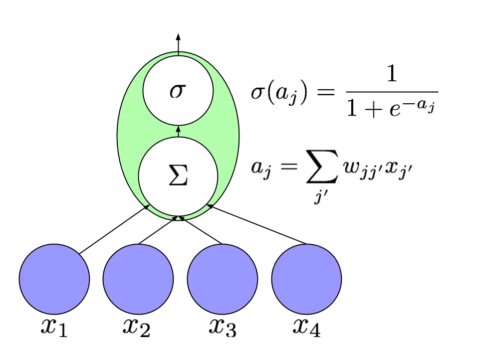

Figure 1: An artificial neuron computes a nonlinear function of a
weighted sum of its inputs.

The value $`v_{j}`$ of each neuron $`j`$ is calculated by applying its
activation function to a weighted sum of the values of its input nodes
(Figure 1):

```math
v_{j}=l_{j}\left(\sum_{j^{\prime}}w_{jj^{\prime}}\cdot v_{j^{\prime}}\right).
```

For convenience, we term the weighted sum inside the parentheses the
_incoming activation_ and notate it as $`a_{j}`$. We represent this
computation in diagrams by depicting neurons as circles and edges as
arrows connecting them. When appropriate, we indicate the exact
activation function with a symbol, e.g., $`\sigma`$ for sigmoid.

Common choices for the activation function include the sigmoid
$`\sigma(z)=1/(1+e^{-z})`$ and the tanh function
$`\phi(z)=(e^{z}-e^{-z})/(e^{z}+e^{-z})`$. The latter has become common
in feedforward neural nets and was applied to recurrent nets by
Sutskever et al. \[2011\]. Another activation function which has become
prominent in deep learning research is the rectified linear unit (ReLU)
whose formula is $`l_{j}(z)=\max(0,z)`$. This type of unit has been
demonstrated to improve the performance of many deep neural networks
\[Nair and Hinton, 2010, Maas et al., 2012, Zeiler et al., 2013\] on
tasks as varied as speech processing and object recognition, and has
been used in recurrent neural networks by Bengio et al. \[2013\].

The activation function at the output nodes depends upon the task. For
multiclass classification with $`K`$ alternative classes, we apply a
$`\softmax`$ nonlinearity in an output layer of $`K`$ nodes. The
$`\softmax`$ function calculates

```math
\hat{y}_{k}=\frac{e^{a_{k}}}{\sum_{k^{\prime}=1}^{K}e^{{a_{k^{\prime}}}}}\mbox{~for~}k=1\mbox{~to~}k=K.
```

The denominator is a normalizing term consisting of the sum of the
numerators, ensuring that the outputs of all nodes sum to one. For
multilabel classification the activation function is simply a point-wise
sigmoid, and for regression we typically have linear output.

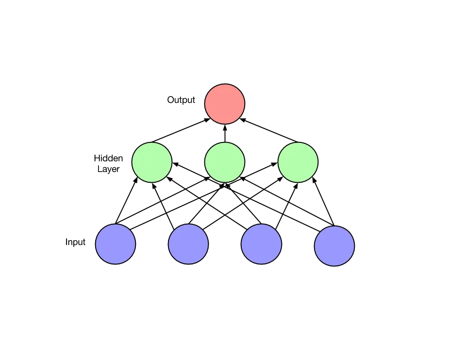

Figure 2: A feedforward neural network. An example is presented to the
network by setting the values of the blue (bottom) nodes. The values of
the nodes in each layer are computed successively as a function of the
prior layers until output is produced at the topmost layer.

### 2.3 Feedforward networks and backpropagation

With a neural model of computation, one must determine the order in
which computation should proceed. Should nodes be sampled one at a time
and updated, or should the value of all nodes be calculated at once and
then all updates applied simultaneously? Feedforward networks (Figure 2)
are a restricted class of networks which deal with this problem by
forbidding cycles in the directed graph of nodes. Given the absence of
cycles, all nodes can be arranged into layers, and the outputs in each
layer can be calculated given the outputs from the lower layers.

The input $`\boldsymbol{x}`$ to a feedforward network is provided by
setting the values of the lowest layer. Each higher layer is then
successively computed until output is generated at the topmost layer
$`\boldsymbol{\hat{y}}`$. Feedforward networks are frequently used for
supervised learning tasks such as classification and regression.
Learning is accomplished by iteratively updating each of the weights to
minimize a loss function,
$`\mathcal{L}(\boldsymbol{\hat{y}},\boldsymbol{y})`$, which penalizes
the distance between the output $`\boldsymbol{\hat{y}}`$ and the target
$`\boldsymbol{y}`$.

The most successful algorithm for training neural networks is
backpropagation, introduced for this purpose by Rumelhart et al.
\[1985\]. Backpropagation uses the chain rule to calculate the
derivative of the loss function $`\mathcal{L}`$ with respect to each
parameter in the network. The weights are then adjusted by gradient
descent. Because the loss surface is non-convex, there is no assurance
that backpropagation will reach a global minimum. Moreover, exact
optimization is known to be an NP-hard problem. However, a large body of
work on heuristic pre-training and optimization techniques has led to
impressive empirical success on many supervised learning tasks. In
particular, convolutional neural networks, popularized by Le Cun et al.
\[1990\], are a variant of feedforward neural network that holds records
since 2012 in many computer vision tasks such as object detection
\[Krizhevsky et al., 2012\].

Nowadays, neural networks are usually trained with stochastic gradient
descent (SGD) using mini-batches. With batch size equal to one, the
stochastic gradient update equation is

```math
\boldsymbol{w}\leftarrow\boldsymbol{w}-\eta\nabla_{\boldsymbol{w}}F_{i}
```

where $`\eta`$ is the learning rate and $`\nabla_{\boldsymbol{w}}F_{i}`$
is the gradient of the objective function with respect to the parameters
$`\boldsymbol{w}`$ as calculated on a single example $`(x_{i},y_{i})`$.
Many variants of SGD are used to accelerate learning. Some popular
heuristics, such as AdaGrad \[Duchi et al., 2011\], AdaDelta \[Zeiler,
2012\], and RMSprop \[Tieleman and Hinton, 2012\], tune the learning
rate adaptively for each feature. AdaGrad, arguably the most popular,
adapts the learning rate by caching the sum of squared gradients with
respect to each parameter at each time step. The step size for each
feature is multiplied by the inverse of the square root of this cached
value. AdaGrad leads to fast convergence on convex error surfaces, but
because the cached sum is monotonically increasing, the method has a
monotonically decreasing learning rate, which may be undesirable on
highly non-convex loss surfaces. RMSprop modifies AdaGrad by introducing
a decay factor in the cache, changing the monotonically growing value
into a moving average. Momentum methods are another common SGD variant
used to train neural networks. These methods add to each update a
decaying sum of the previous updates. When the momentum parameter is
tuned well and the network is initialized well, momentum methods can
train deep nets and recurrent nets competitively with more
computationally expensive methods like the Hessian-free optimizer of
Sutskever et al. \[2013\].

To calculate the gradient in a feedforward neural network,
backpropagation proceeds as follows. First, an example is propagated
forward through the network to produce a value $`v_{j}`$ at each node
and outputs $`\boldsymbol{\hat{y}}`$ at the topmost layer. Then, a loss
function value $`\mathcal{L}(\hat{y}_{k},y_{k})`$ is computed at each
output node $`k`$. Subsequently, for each output node $`k`$, we
calculate

```math
\delta_{k}=\frac{\partial\mathcal{L}(\hat{y}_{k},y_{k})}{\partial\hat{y}_{k}}\cdot l_{k}^{\prime}(a_{k}).
```

Given these values $`\delta_{k}`$, for each node in the immediately
prior layer we calculate

```math
\delta_{j}=l^{\prime}(a_{j})\sum_{k}\delta_{k}\cdot w_{kj}.
```

This calculation is performed successively for each lower layer to yield
$`\delta_{j}`$ for every node $`j`$ given the $`\delta`$ values for each
node connected to $`j`$ by an outgoing edge. Each value $`\delta_{j}`$
represents the derivative $`\partial\mathcal{L}/{\partial a_{j}}`$ of
the total loss function with respect to that node’s incoming activation.
Given the values $`v_{j}`$ calculated during the forward pass, and the
values $`\delta_{j}`$ calculated during the backward pass, the
derivative of the loss $`\mathcal{L}`$ with respect a given parameter
$`w_{jj^{\prime}}`$ is

```math
\frac{\partial\mathcal{L}}{\partial w_{jj^{\prime}}}=\delta_{j}v_{j^{\prime}}.
```

Other methods have been explored for learning the weights in a neural
network. A number of papers from the 1990s \[Belew et al., 1990, Gruau
et al., 1994\] championed the idea of learning neural networks with
genetic algorithms, with some even claiming that achieving success on
real-world problems only by applying many small changes to the weights
of a network was impossible. Despite the subsequent success of
backpropagation, interest in genetic algorithms continues. Several
recent papers explore genetic algorithms for neural networks, especially
as a means of learning the architecture of neural networks, a problem
not addressed by backpropagation \[Bayer et al., 2009, Harp and Samad,
2013\]. By _architecture_ we mean the number of layers, the number of
nodes in each, the connectivity pattern among the layers, the choice of
activation functions, etc.

One open question in neural network research is how to exploit sparsity
in training. In a neural network with sigmoidal or tanh activation
functions, the nodes in each layer never take value exactly zero. Thus,
even if the inputs are sparse, the nodes at each hidden layer are not.
However, rectified linear units (ReLUs) introduce sparsity to hidden
layers \[Glorot et al., 2011\]. In this setting, a promising path may be
to store the sparsity pattern when computing each layer’s values and use
it to speed up computation of the next layer in the network. Some recent
work shows that given sparse inputs to a linear model with a standard
regularizer, sparsity can be fully exploited even if regularization
makes the gradient be not sparse \[Carpenter, 2008, Langford et al.,
2009, Singer and Duchi, 2009, Lipton and Elkan, 2015\].

## 3 Recurrent neural networks

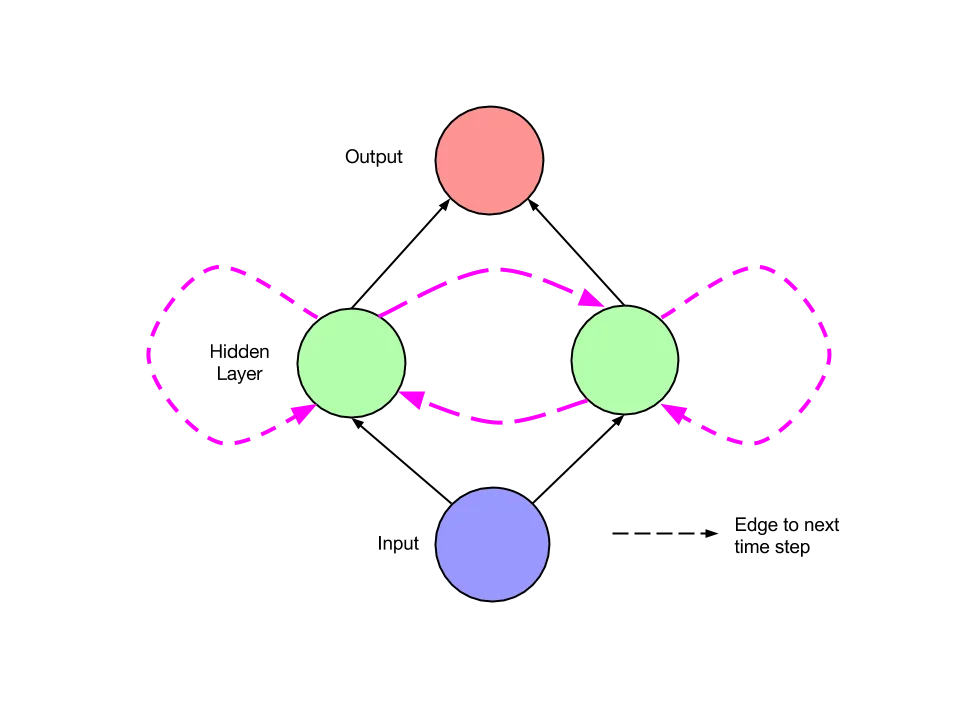

Figure 3: A simple recurrent network. At each time step $`t`$,
activation is passed along solid edges as in a feedforward network.
Dashed edges connect a source node at each time $`t`$ to a target node
at each following time $`t+1`$.

Recurrent neural networks are feedforward neural networks augmented by
the inclusion of edges that span adjacent time steps, introducing a
notion of time to the model. Like feedforward networks, RNNs may not
have cycles among conventional edges. However, edges that connect
adjacent time steps, called recurrent edges, may form cycles, including
cycles of length one that are self-connections from a node to itself
across time. At time $`t`$, nodes with recurrent edges receive input
from the current data point $`\boldsymbol{x}^{(t)}`$ and also from
hidden node values $`\boldsymbol{h}^{(t-1)}`$ in the network’s previous
state. The output $`\boldsymbol{\hat{y}}^{(t)}`$ at each time $`t`$ is
calculated given the hidden node values $`\boldsymbol{h}^{(t)}`$ at time
$`t`$. Input $`\boldsymbol{x}^{(t-1)}`$ at time $`t-1`$ can influence
the output $`\boldsymbol{\hat{y}}^{(t)}`$ at time $`t`$ and later by way
of the recurrent connections.

Two equations specify all calculations necessary for computation at each
time step on the forward pass in a simple recurrent neural network as in
Figure 3:

```math
\boldsymbol{h}^{(t)}=\sigma(W^{\mbox{hx}}\boldsymbol{x}^{(t)}+W^{\mbox{hh}}\boldsymbol{h}^{(t-1)}+\boldsymbol{b}_{h})
```

```math
\hat{\boldsymbol{y}}^{(t)}=\softmax(W^{\mbox{yh}}\boldsymbol{h}^{(t)}+\boldsymbol{b}_{y}).
```

Here $`W_{\mbox{hx}}`$ is the matrix of conventional weights between the
input and the hidden layer and $`W_{\mbox{hh}}`$ is the matrix of
recurrent weights between the hidden layer and itself at adjacent time
steps. The vectors $`\boldsymbol{b}_{h}`$ and $`\boldsymbol{b}_{y}`$ are
bias parameters which allow each node to learn an offset.

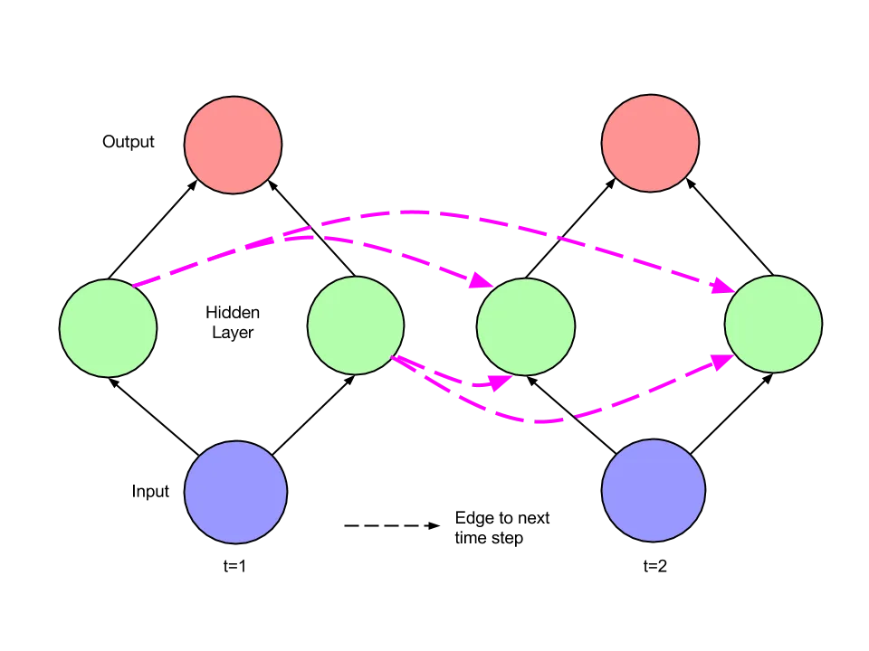

Figure 4: The recurrent network of Figure 3 unfolded across time steps.

The dynamics of the network depicted in Figure 3 across time steps can
be visualized by _unfolding_ it as in Figure 4. Given this picture, the
network can be interpreted not as cyclic, but rather as a deep network
with one layer per time step and shared weights across time steps. It is
then clear that the unfolded network can be trained across many time
steps using backpropagation. This algorithm, called _backpropagation
through time_ (BPTT), was introduced by Werbos \[1990\]. All recurrent
networks in common current use apply it.

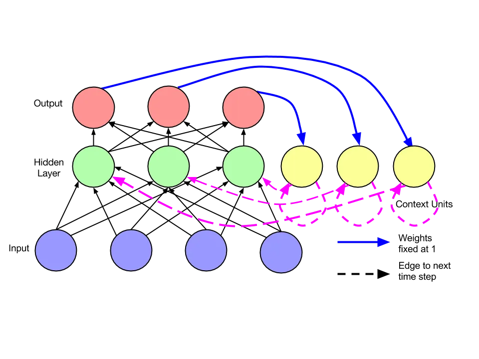

Figure 5: A recurrent neural network as proposed by Jordan \[1986\].
Output units are connected to special units that at the next time step
feed into themselves and into hidden units.

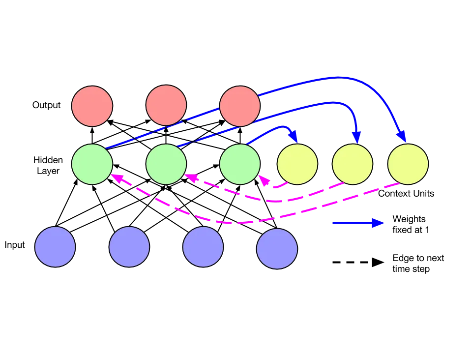

Figure 6: A recurrent neural network as described by Elman \[1990\].
Hidden units are connected to context units, which feed back into the
hidden units at the next time step.

### 3.1 Early recurrent network designs

The foundational research on recurrent networks took place in the 1980s.
In 1982, Hopfield introduced a family of recurrent neural networks that
have pattern recognition capabilities \[Hopfield, 1982\]. They are
defined by the values of the weights between nodes and the link
functions are simple thresholding at zero. In these nets, a pattern is
placed in the network by setting the values of the nodes. The network
then runs for some time according to its update rules, and eventually
another pattern is read out. Hopfield networks are useful for recovering
a stored pattern from a corrupted version and are the forerunners of
Boltzmann machines and auto-encoders.

An early architecture for supervised learning on sequences was
introduced by Jordan \[1986\]. Such a network (Figure 5) is a
feedforward network with a single hidden layer that is extended with
special units.²² 2 Jordan \[1986\] calls the special units “state units”
while Elman \[1990\] calls a corresponding structure “context units.” In
this paper we simplify terminology by using only “context units”. Output
node values are fed to the special units, which then feed these values
to the hidden nodes at the following time step. If the output values are
actions, the special units allow the network to remember actions taken
at previous time steps. Several modern architectures use a related form
of direct transfer from output nodes; Sutskever et al. \[2014\]
translates sentences between natural languages, and when generating a
text sequence, the word chosen at each time step is fed into the network
as input at the following time step. Additionally, the special units in
a Jordan network are self-connected. Intuitively, these edges allow
sending information across multiple time steps without perturbing the
output at each intermediate time step.

The architecture introduced by Elman \[1990\] is simpler than the
earlier Jordan architecture. Associated with each unit in the hidden
layer is a context unit. Each such unit $`j^{\prime}`$ takes as input
the state of the corresponding hidden node $`j`$ at the previous time
step, along an edge of fixed weight $`w_{j^{\prime}j}=1`$. This value
then feeds back into the same hidden node $`j`$ along a standard edge.
This architecture is equivalent to a simple RNN in which each hidden
node has a single self-connected recurrent edge. The idea of
fixed-weight recurrent edges that make hidden nodes self-connected is
fundamental in subsequent work on LSTM networks \[Hochreiter and
Schmidhuber, 1997\].

Elman \[1990\] trains the network using backpropagation and demonstrates
that the network can learn time dependencies. The paper features two
sets of experiments. The first extends the logical operation _exclusive
or_ (XOR) to the time domain by concatenating sequences of three tokens.
For each three-token segment, e.g. “011”, the first two tokens (“01”)
are chosen randomly and the third (“1”) is set by performing xor on the
first two. Random guessing should achieve accuracy of $`50\%`$. A
perfect system should perform the same as random for the first two
tokens, but guess the third token perfectly, achieving accuracy of
$`66.7\%`$. The simple network of Elman \[1990\] does in fact approach
this maximum achievable score.

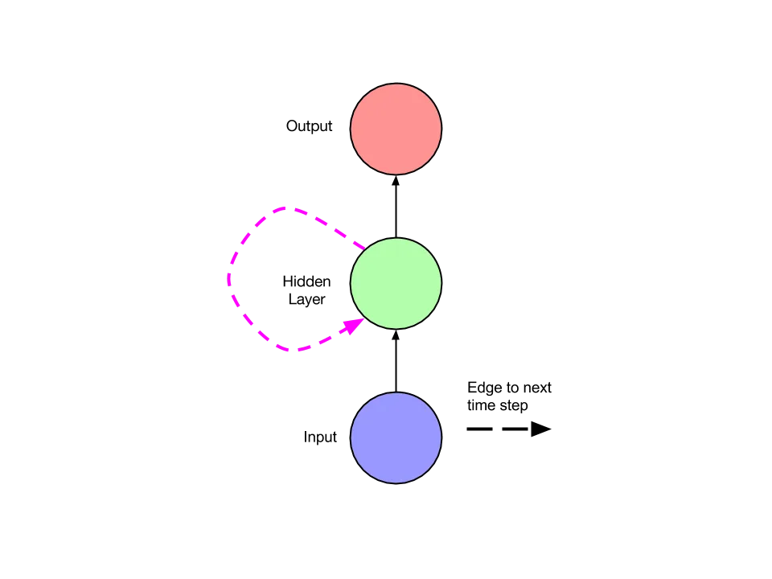

Figure 7: A simple recurrent net with one input unit, one output unit,
and one recurrent hidden unit.

### 3.2 Training recurrent networks

Learning with recurrent networks has long been considered to be
difficult. Even for standard feedforward networks, the optimization task
is NP-complete Blum and Rivest \[1993\]. But learning with recurrent
networks can be especially challenging due to the difficulty of learning
long-range dependencies, as described by Bengio et al. \[1994\] and
expanded upon by Hochreiter et al. \[2001\]. The problems of _vanishing_
and _exploding_ gradients occur when backpropagating errors across many
time steps. As a toy example, consider a network with a single input
node, a single output node, and a single recurrent hidden node
(Figure 7). Now consider an input passed to the network at time $`\tau`$
and an error calculated at time $`t`$, assuming input of zero in the
intervening time steps. The tying of weights across time steps means
that the recurrent edge at the hidden node $`j`$ always has the same
weight. Therefore, the contribution of the input at time $`\tau`$ to the
output at time $`t`$ will either explode or approach zero, exponentially
fast, as $`t-\tau`$ grows large. Hence the derivative of the error with
respect to the input will either explode or vanish.

Which of the two phenomena occurs depends on whether the weight of the
recurrent edge $`|w_{jj}|>1`$ or $`|w_{jj}|<1`$ and on the activation
function in the hidden node (Figure 8). Given a sigmoid activation
function, the vanishing gradient problem is more pressing, but with a
rectified linear unit $`\max(0,x)`$, it is easier to imagine the
exploding gradient. Pascanu et al. \[2012\] give a thorough mathematical
treatment of the vanishing and exploding gradient problems,
characterizing exact conditions under which these problems may occur.
Given these conditions, they suggest an approach to training via a
regularization term that forces the weights to values where the gradient
neither vanishes nor explodes.

Truncated backpropagation through time (TBPTT) is one solution to the
exploding gradient problem for continuously running networks \[Williams
and Zipser, 1989\]. With TBPTT, some maximum number of time steps is set
along which error can be propagated. While TBPTT with a small cutoff can
be used to alleviate the exploding gradient problem, it requires that
one sacrifice the ability to learn long-range dependencies. The LSTM
architecture described below uses carefully designed nodes with
recurrent edges with fixed unit weight as a solution to the vanishing
gradient problem.

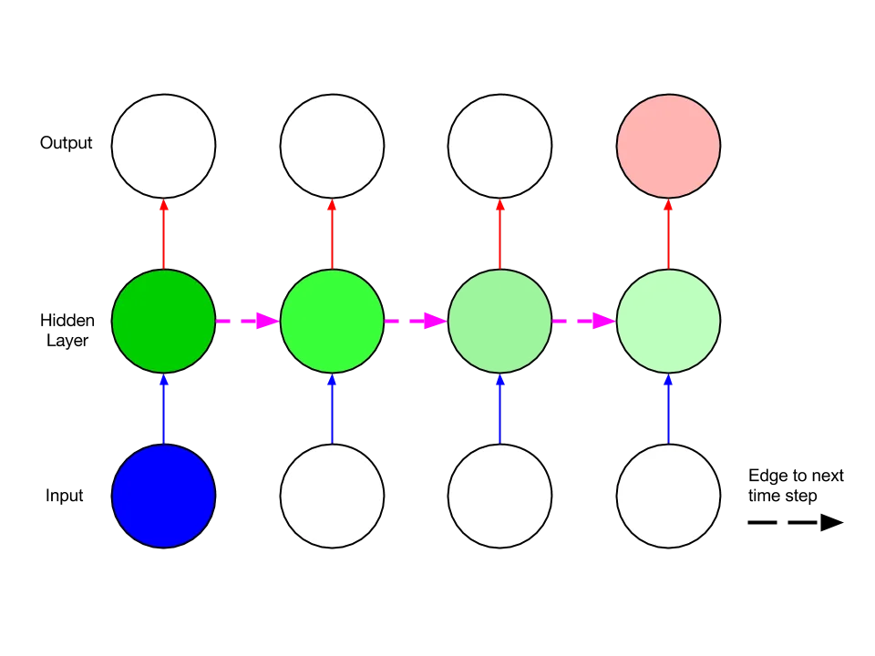

Figure 8: A visualization of the vanishing gradient problem, using the
network depicted in Figure 7, adapted from Graves \[2012\]. If the
weight along the recurrent edge is less than one, the contribution of
the input at the first time step to the output at the final time step
will decrease exponentially fast as a function of the length of the time
interval in between.

The issue of local optima is an obstacle to effective training that
cannot be dealt with simply by modifying the network architecture.
Optimizing even a single hidden-layer feedforward network is an
NP-complete problem \[Blum and Rivest, 1993\]. However, recent empirical
and theoretical studies suggest that in practice, the issue may not be
as important as once thought. Dauphin et al. \[2014\] show that while
many critical points exist on the error surfaces of large neural
networks, the ratio of saddle points to true local minima increases
exponentially with the size of the network, and algorithms can be
designed to escape from saddle points.

Overall, along with the improved architectures explained below, fast
implementations and better gradient-following heuristics have rendered
RNN training feasible. Implementations of forward and backward
propagation using GPUs, such as the Theano \[Bergstra et al., 2010\] and
Torch \[Collobert et al., 2011\] packages, have made it straightforward
to implement fast training algorithms. In 1996, prior to the
introduction of the LSTM, attempts to train recurrent nets to bridge
long time gaps were shown to perform no better than random guessing
\[Hochreiter and Schmidhuber, 1996\]. However, RNNs are now frequently
trained successfully.

For some tasks, freely available software can be run on a single GPU and
produce compelling results in hours \[Karpathy, 2015\]. Martens and
Sutskever \[2011\] reported success training recurrent neural networks
with a Hessian-free truncated Newton approach, and applied the method to
a network which learns to generate text one character at a time in
\[Sutskever et al., 2011\]. In the paper that describes the abundance of
saddle points on the error surfaces of neural networks \[Dauphin et al.,
2014\], the authors present a saddle-free version of Newton’s method.
Unlike Newton’s method, which is attracted to critical points, including
saddle points, this variant is specially designed to escape from them.
Experimental results include a demonstration of improved performance on
recurrent networks. Newton’s method requires computing the Hessian,
which is prohibitively expensive for large networks, scaling
quadratically with the number of parameters. While their algorithm only
approximates the Hessian, it is still computationally expensive compared
to SGD. Thus the authors describe a hybrid approach in which the
saddle-free Newton method is applied only in places where SGD appears to
be stuck.

## 4 Modern RNN architectures

The most successful RNN architectures for sequence learning stem from
two papers published in 1997. The first paper, _Long Short-Term Memory_
by Hochreiter and Schmidhuber \[1997\], introduces the memory cell, a
unit of computation that replaces traditional nodes in the hidden layer
of a network. With these memory cells, networks are able to overcome
difficulties with training encountered by earlier recurrent networks.
The second paper, _Bidirectional Recurrent Neural Networks_ by Schuster
and Paliwal \[1997\], introduces an architecture in which information
from both the future and the past are used to determine the output at
any point in the sequence. This is in contrast to previous networks, in
which only past input can affect the output, and has been used
successfully for sequence labeling tasks in natural language processing,
among others. Fortunately, the two innovations are not mutually
exclusive, and have been successfully combined for phoneme
classification \[Graves and Schmidhuber, 2005\] and handwriting
recognition \[Graves et al., 2009\]. In this section we explain the LSTM
and BRNN and we describe the _neural Turing machine_ (NTM), which
extends RNNs with an addressable external memory \[Graves et al.,
2014\].

### 4.1 Long short-term memory (LSTM)

Hochreiter and Schmidhuber \[1997\] introduced the LSTM model primarily
in order to overcome the problem of vanishing gradients. This model
resembles a standard recurrent neural network with a hidden layer, but
each ordinary node (Figure 1) in the hidden layer is replaced by a
_memory cell_ (Figure 9). Each memory cell contains a node with a
self-connected recurrent edge of fixed weight one, ensuring that the
gradient can pass across many time steps without vanishing or exploding.
To distinguish references to a memory cell and not an ordinary node, we
use the subscript $`c`$.

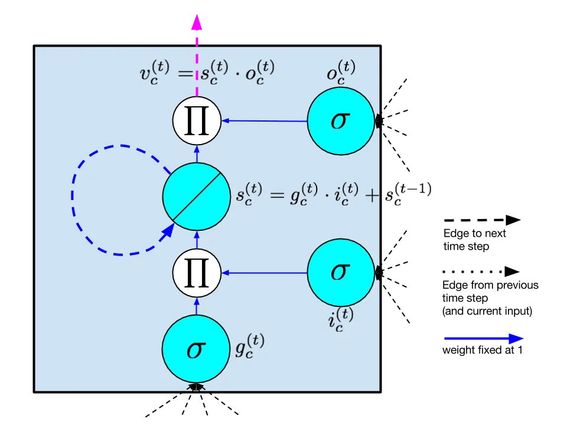

Figure 9: One LSTM memory cell as proposed by Hochreiter and Schmidhuber
\[1997\]. The self-connected node is the internal state $`s`$. The
diagonal line indicates that it is linear, i.e. the identity link
function is applied. The blue dashed line is the recurrent edge, which
has fixed unit weight. Nodes marked $`\Pi`$ output the product of their
inputs. All edges into and from $`\Pi`$ nodes also have fixed unit
weight.

The term “long short-term memory” comes from the following intuition.
Simple recurrent neural networks have _long-term memory_ in the form of
weights. The weights change slowly during training, encoding general
knowledge about the data. They also have _short-term memory_ in the form
of ephemeral activations, which pass from each node to successive nodes.
The LSTM model introduces an intermediate type of storage via the memory
cell. A memory cell is a composite unit, built from simpler nodes in a
specific connectivity pattern, with the novel inclusion of
multiplicative nodes, represented in diagrams by the letter $`\Pi`$. All
elements of the LSTM cell are enumerated and described below. Note that
when we use vector notation, we are referring to the values of the nodes
in an entire layer of cells. For example, $`\boldsymbol{s}`$ is a vector
containing the value of $`s_{c}`$ at each memory cell $`c`$ in a layer.
When the subscript $`c`$ is used, it is to index an individual memory
cell.

- •
  _Input node:_ This unit, labeled $`g_{c}`$, is a node that takes
  activation in the standard way from the input layer
  $`\boldsymbol{x^{(t)}}`$ at the current time step and (along recurrent
  edges) from the hidden layer at the previous time step
  $`\boldsymbol{h}^{(t-1)}`$. Typically, the summed weighted input is
  run through a tanh activation function, although in the original LSTM
  paper, the activation function is a sigmoid.
- •
  _Input gate:_ Gates are a distinctive feature of the LSTM approach. A
  gate is a sigmoidal unit that, like the input node, takes activation
  from the current data point $`\boldsymbol{x}^{(t)}`$ as well as from
  the hidden layer at the previous time step. A gate is so-called
  because its value is used to multiply the value of another node. It is
  a _gate_ in the sense that if its value is zero, then flow from the
  other node is cut off. If the value of the gate is one, all flow is
  passed through. The value of the _input gate_ $`i_{c}`$ multiplies the
  value of the $`\emph{inputnode}`$.
- •
  _Internal state:_ At the heart of each memory cell is a node $`s_{c}`$
  with linear activation, which is referred to in the original paper as
  the “internal state” of the cell. The internal state $`s_{c}`$ has a
  self-connected recurrent edge with fixed unit weight. Because this
  edge spans adjacent time steps with constant weight, error can flow
  across time steps without vanishing or exploding. This edge is often
  called the _constant error carousel_. In vector notation, the update
  for the internal state is
  $`\boldsymbol{s}^{(t)}=\boldsymbol{g}^{(t)}\odot\boldsymbol{i}^{(t)}+\boldsymbol{s}^{(t-1)}`$
  where $`\odot`$ is pointwise multiplication.
- •
  _Forget gate:_ These gates $`f_{c}`$ were introduced by Gers et al.
  \[2000\]. They provide a method by which the network can learn to
  flush the contents of the internal state. This is especially useful in
  continuously running networks. With forget gates, the equation to
  calculate the internal state on the forward pass is

  ```math
  \boldsymbol{s}^{(t)}=\boldsymbol{g}^{(t)}\odot\boldsymbol{i}^{(t)}+\boldsymbol{f}^{(t)}\odot\boldsymbol{s}^{(t-1)}.
  ```

- •
  _Output gate:_ The value $`v_{c}`$ ultimately produced by a memory
  cell is the value of the internal state $`s_{c}`$ multiplied by the
  value of the _output gate_ $`o_{c}`$. It is customary that the
  internal state first be run through a tanh activation function, as
  this gives the output of each cell the same dynamic range as an
  ordinary tanh hidden unit. However, in other neural network research,
  rectified linear units, which have a greater dynamic range, are easier
  to train. Thus it seems plausible that the nonlinear function on the
  internal state might be omitted.

In the original paper and in most subsequent work, the input node is
labeled $`g`$. We adhere to this convention but note that it may be
confusing as $`g`$ does not stand for _gate_. In the original paper, the
gates are called $`y_{in}`$ and $`y_{out}`$ but this is confusing
because $`y`$ generally stands for output in the machine learning
literature. Seeking comprehensibility, we break with this convention and
use $`i`$, $`f`$, and $`o`$ to refer to input, forget and output gates
respectively, as in Sutskever et al. \[2014\].

Since the original LSTM was introduced, several variations have been
proposed. Forget gates, described above, were proposed in 2000 and were
not part of the original LSTM design. However, they have proven
effective and are standard in most modern implementations. That same
year, Gers and Schmidhuber \[2000\] proposed peephole connections that
pass from the internal state directly to the input and output gates of
that same node without first having to be modulated by the output gate.
They report that these connections improve performance on timing tasks
where the network must learn to measure precise intervals between
events. The intuition of the peephole connection can be captured by the
following example. Consider a network which must learn to count objects
and emit some desired output when $`n`$ objects have been seen. The
network might learn to let some fixed amount of activation into the
internal state after each object is seen. This activation is trapped in
the internal state $`s_{c}`$ by the constant error carousel, and is
incremented iteratively each time another object is seen. When the
$`n`$th object is seen, the network needs to know to let out content
from the internal state so that it can affect the output. To accomplish
this, the output gate $`o_{c}`$ must know the content of the internal
state $`s_{c}`$. Thus $`s_{c}`$ should be an input to $`o_{c}`$.

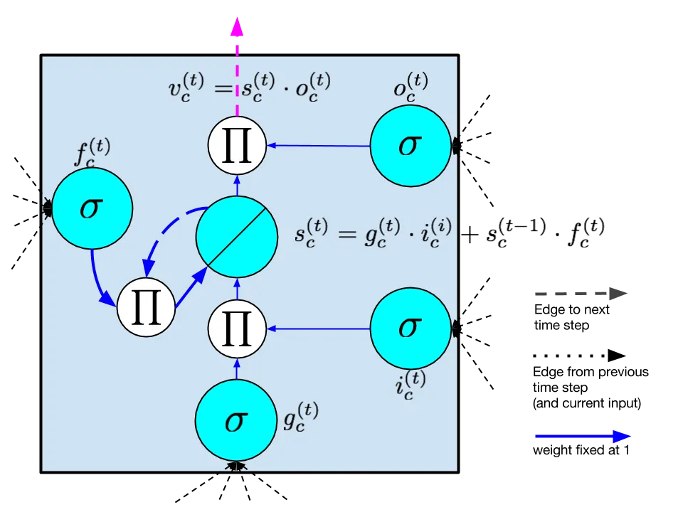

Figure 10: LSTM memory cell with a forget gate as described by Gers
et al. \[2000\].

Put formally, computation in the LSTM model proceeds according to the
following calculations, which are performed at each time step. These
equations give the full algorithm for a modern LSTM with forget gates:

```math
\boldsymbol{g}^{(t)}=\phi(W^{\mbox{gx}}\boldsymbol{x}^{(t)}+W^{\mbox{gh}}\boldsymbol{h}^{(t-1)}+\boldsymbol{b}_{g})
```

```math
\boldsymbol{i}^{(t)}=\sigma(W^{\mbox{ix}}\boldsymbol{x}^{(t)}+W^{\mbox{ih}}\boldsymbol{h}^{(t-1)}+\boldsymbol{b}_{i})
```

```math
\boldsymbol{f}^{(t)}=\sigma(W^{\mbox{fx}}\boldsymbol{x}^{(t)}+W^{\mbox{fh}}\boldsymbol{h}^{(t-1)}+\boldsymbol{b}_{f})
```

```math
\boldsymbol{o}^{(t)}=\sigma(W^{\mbox{ox}}\boldsymbol{x}^{(t)}+W^{\mbox{oh}}\boldsymbol{h}^{(t-1)}+\boldsymbol{b}_{o})
```

```math
\boldsymbol{s}^{(t)}=\boldsymbol{g}^{(t)}\odot\boldsymbol{i}^{(i)}+\boldsymbol{s}^{(t-1)}\odot\boldsymbol{f}^{(t)}
```

```math
\boldsymbol{h}^{(t)}=\phi(\boldsymbol{s}^{(t)})\odot\boldsymbol{o}^{(t)}.
```

The value of the hidden layer of the LSTM at time $`t`$ is the vector
$`\boldsymbol{h}^{(t)}`$, while $`\boldsymbol{h}^{(t-1)}`$ is the values
output by each memory cell in the hidden layer at the previous time.
Note that these equations include the forget gate, but not peephole
connections. The calculations for the simpler LSTM without forget gates
are obtained by setting $`\boldsymbol{f}^{(t)}=1`$ for all $`t`$. We use
the tanh function $`\phi`$ for the input node $`g`$ following the
state-of-the-art design of Zaremba and Sutskever \[2014\]. However, in
the original LSTM paper, the activation function for $`g`$ is the
sigmoid $`\sigma`$.

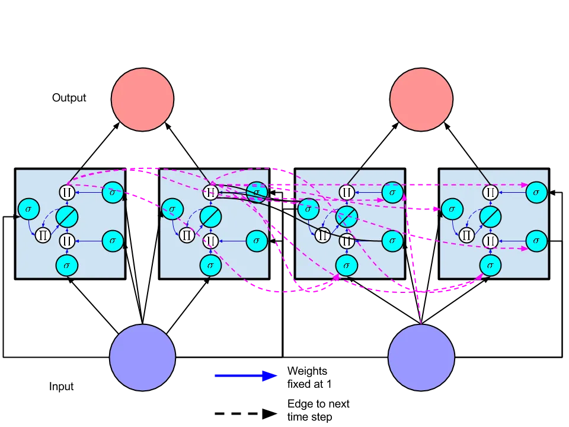

Figure 11: A recurrent neural network with a hidden layer consisting of
two memory cells. The network is shown unfolded across two time steps.

Intuitively, in terms of the forward pass, the LSTM can learn when to
let activation into the internal state. As long as the input gate takes
value zero, no activation can get in. Similarly, the output gate learns
when to let the value out. When both gates are _closed_, the activation
is trapped in the memory cell, neither growing nor shrinking, nor
affecting the output at intermediate time steps. In terms of the
backwards pass, the constant error carousel enables the gradient to
propagate back across many time steps, neither exploding nor vanishing.
In this sense, the gates are learning when to let error in, and when to
let it out. In practice, the LSTM has shown a superior ability to learn
long-range dependencies as compared to simple RNNs. Consequently, the
majority of state-of-the-art application papers covered in this review
use the LSTM model.

One frequent point of confusion is the manner in which multiple memory
cells are used together to comprise the hidden layer of a working neural
network. To alleviate this confusion, we depict in Figure 11 a simple
network with two memory cells, analogous to Figure 4. The output from
each memory cell flows in the subsequent time step to the input node and
all gates of each memory cell. It is common to include multiple layers
of memory cells \[Sutskever et al., 2014\]. Typically, in these
architectures each layer takes input from the layer below at the same
time step and from the same layer in the previous time step.

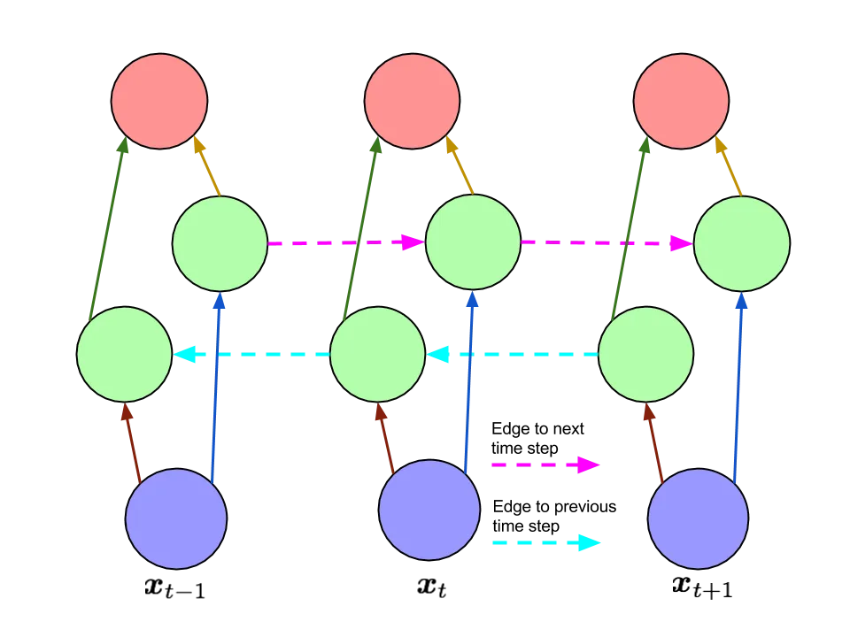

Figure 12: A bidirectional recurrent neural network as described by
Schuster and Paliwal \[1997\], unfolded in time.

### 4.2 Bidirectional recurrent neural networks (BRNNs)

Along with the LSTM, one of the most used RNN architectures is the
bidirectional recurrent neural network (BRNN) (Figure 12) first
described by Schuster and Paliwal \[1997\]. In this architecture, there
are two layers of hidden nodes. Both hidden layers are connected to
input and output. The two hidden layers are differentiated in that the
first has recurrent connections from the past time steps while in the
second the direction of recurrent of connections is flipped, passing
activation backwards along the sequence. Given an input sequence and a
target sequence, the BRNN can be trained by ordinary backpropagation
after unfolding across time. The following three equations describe a
BRNN:

```math
\boldsymbol{h}^{(t)}=\sigma(W^{\mbox{h}\mbox{x}}\boldsymbol{x}^{(t)}+W^{\mbox{h}\mbox{h}}\boldsymbol{h}^{(t-1)}+\boldsymbol{b}_{h})
```

```math
\boldsymbol{z}^{(t)}=\sigma(W^{\mbox{z}\mbox{x}}\boldsymbol{x}^{(t)}+W^{\mbox{z}\mbox{z}}\boldsymbol{z}^{(t+1)}+\boldsymbol{b}_{z})
```

```math
\hat{\boldsymbol{y}}^{(t)}=\softmax(W^{\mbox{yh}}\boldsymbol{h}^{(t)}+W^{\mbox{yz}}\boldsymbol{z}^{(t)}+\boldsymbol{b}_{y})
```

where $`\boldsymbol{h}^{(t)}`$ and $`\boldsymbol{z}^{(t)}`$ are the
values of the hidden layers in the forwards and backwards directions
respectively.

One limitation of the BRNN is that cannot run continuously, as it
requires a fixed endpoint in both the future and in the past. Further,
it is not an appropriate machine learning algorithm for the online
setting, as it is implausible to receive information from the future,
i.e., to know sequence elements that have not been observed. But for
prediction over a sequence of fixed length, it is often sensible to take
into account both past and future sequence elements. Consider the
natural language task of part-of-speech tagging. Given any word in a
sentence, information about both the words which precede and those which
follow it is useful for predicting that word’s part-of-speech.

The LSTM and BRNN are in fact compatible ideas. The former introduces a
new basic unit from which to compose a hidden layer, while the latter
concerns the wiring of the hidden layers, regardless of what nodes they
contain. Such an approach, termed a BLSTM has been used to achieve state
of the art results on handwriting recognition and phoneme classification
\[Graves and Schmidhuber, 2005, Graves et al., 2009\].

### 4.3 Neural Turing machines

The neural Turing machine (NTM) extends recurrent neural networks with
an addressable external memory \[Graves et al., 2014\]. This work
improves upon the ability of RNNs to perform complex algorithmic tasks
such as sorting. The authors take inspiration from theories in cognitive
science, which suggest humans possess a “central executive” that
interacts with a memory buffer \[Baddeley et al., 1996\]. By analogy to
a Turing machine, in which a program directs _read heads_ and _write
heads_ to interact with external memory in the form of a tape, the model
is named a Neural Turing Machine. While technical details of the
read/write heads are beyond the scope of this review, we aim to convey a
high-level sense of the model and its applications.

The two primary components of an NTM are a _controller_ and _memory
matrix_. The controller, which may be a recurrent or feedforward neural
network, takes input and returns output to the outside world, as well as
passing instructions to and reading from the memory. The memory is
represented by a large matrix of $`N`$ memory locations, each of which
is a vector of dimension $`M`$. Additionally, a number of read and write
heads facilitate the interaction between the controller and the memory
matrix. Despite these additional capabilities, the NTM is differentiable
end-to-end and can be trained by variants of stochastic gradient descent
using BPTT.

Graves et al. \[2014\] select five algorithmic tasks to test the
performance of the NTM model. By _algorithmic_ we mean that for each
task, the target output for a given input can be calculated by following
a simple program, as might be easily implemented in any universal
programming language. One example is the _copy_ task, where the input is
a sequence of fixed length binary vectors followed by a delimiter
symbol. The target output is a copy of the input sequence. In another
task, _priority sort_, an input consists of a sequence of binary vectors
together with a distinct scalar priority value for each vector. The
target output is the sequence of vectors sorted by priority. The
experiments test whether an NTM can be trained via supervised learning
to implement these common algorithms correctly and efficiently.
Interestingly, solutions found in this way generalize reasonably well to
inputs longer than those presented in the training set. In contrast, the
LSTM without external memory does not generalize well to longer inputs.
The authors compare three different architectures, namely an LSTM RNN,
an NTM with a feedforward controller, and an NTM with an LSTM
controller. On each task, both NTM architectures significantly
outperform the LSTM RNN both in training set performance and in
generalization to test data.

## 5 Applications of LSTMs and BRNNs

The previous sections introduced the building blocks from which nearly
all state-of-the-art recurrent neural networks are composed. This
section looks at several application areas where recurrent networks have
been employed successfully. Before describing state of the art results
in detail, it is appropriate to convey a concrete sense of the precise
architectures with which many important tasks can be expressed clearly
as sequence learning problems with recurrent neural networks. Figure 13
demonstrates several common RNN architectures and associates each with
corresponding well-documented tasks.

Figure 13: Recurrent neural networks have been used successfully to
model both sequential inputs and sequential outputs as well as mappings
between single data points and sequences (in both directions). This
figure, based on a similar figure in Karpathy \[2015\] shows how
numerous tasks can be modeled with RNNs with sequential inputs and/or
sequential outputs. In each subfigure, blue rectangles correspond to
inputs, red rectangles to outputs and green rectangles to the entire
hidden state of the neural network. (a) This is the conventional
independent case, as assumed by standard feedforward networks. (b) Text
and video classification are tasks in which a sequence is mapped to one
fixed length vector. (c) Image captioning presents the converse case,
where the input image is a single non-sequential data point. (d) This
architecture has been used for natural language translation, a
sequence-to-sequence task in which the two sequences may have varying
and different lengths. (e) This architecture has been used to learn a
generative model for text, predicting at each step the following
character.

In the following subsections, we first introduce the representations of
natural language used for input and output to recurrent neural networks
and the commonly used performance metrics for sequence prediction tasks.
Then we survey state-of-the-art results in machine translation, image
captioning, video captioning, and handwriting recognition. Many
applications of RNNs involve processing written language. Some
applications, such as image captioning, involve generating strings of
text. Others, such as machine translation and dialogue systems, require
both inputting and outputting text. Systems which output text are more
difficult to evaluate empirically than those which produce binary
predictions or numerical output. As a result several methods have been
developed to assess the quality of translations and captions. In the
next subsection, we provide the background necessary to understand how
text is represented in most modern recurrent net applications. We then
explain the commonly reported evaluation metrics.

### 5.1 Representations of natural language inputs and outputs

When words are output at each time step, generally the output consists
of a softmax vector $`\boldsymbol{y}^{(t)}\in\mathbbm{R}^{K}`$ where
$`K`$ is the size of the vocabulary. A softmax layer is an element-wise
logistic function that is normalized so that all of its components sum
to one. Intuitively, these outputs correspond to the probabilities that
each word is the correct output at that time step.

For application where an input consists of a sequence of words,
typically the words are fed to the network one at a time in consecutive
time steps. In these cases, the simplest way to represent words is a
_one-hot_ encoding, using binary vectors with a length equal to the size
of the vocabulary, so “1000” and “0100” would represent the first and
second words in the vocabulary respectively. Such an encoding is
discussed by Elman \[1990\] among others. However, this encoding is
inefficient, requiring as many bits as the vocabulary is large. Further,
it offers no direct way to capture different aspects of similarity
between words in the encoding itself. Thus it is common now to model
words with a distributed representation using a _meaning vector_. In
some cases, these meanings for words are learned given a large corpus of
supervised data, but it is more usual to initialize the _meaning
vectors_ using an embedding based on word co-occurrence statistics.
Freely available code to produce word vectors from these statistics
include _GloVe_ \[Pennington et al., 2014\], and _word2vec_ \[Goldberg
and Levy, 2014\], which implements a word embedding algorithm from
Mikolov et al. \[2013\].

Distributed representations for textual data were described by Hinton
\[1986\], used extensively for natural language by Bengio et al.
\[2003\], and more recently brought to wider attention in the deep
learning community in a number of papers describing recursive
auto-encoder (RAE) networks \[Socher et al., 2010, Socher et al., 2011a,
Socher et al., 2011b, Socher et al., 2011c\]. For clarity we point out
that these _recursive_ networks are _not_ recurrent neural networks, and
in the present survey the abbreviation RNN always means recurrent neural
network. While they are distinct approaches, recurrent and recursive
neural networks have important features in common, namely that they both
involve extensive weight tying and are both trained end-to-end via
backpropagation.

In many experiments with recurrent neural networks \[Elman, 1990,
Sutskever et al., 2011, Zaremba and Sutskever, 2014\], input is fed in
one character at a time, and output generated one character at a time,
as opposed to one word at a time. While the output is nearly always a
softmax layer, many papers omit details of how they represent
single-character inputs. It seems reasonable to infer that characters
are encoded with a one-hot encoding. We know of no cases of paper using
a distributed representation at the single-character level.

### 5.2 Evaluation methodology

A serious obstacle to training systems well to output variable length
sequences of words is the flaws of the available performance metrics. In
the case of captioning or translation, there maybe be multiple correct
translations. Further, a labeled dataset may contain multiple _reference
translations_ for each example. Comparing against such a gold standard
is more fraught than applying standard performance measure to binary
classification problems.

One commonly used metric for structured natural language output with
multiple references is BLEU score. Developed in 2002, BLEU score is
related to modified unigram precision \[Papineni et al., 2002\]. It is
the geometric mean of the $`n`$-gram precisions for all values of $`n`$
between $`1`$ and some upper limit $`N`$. In practice, $`4`$ is a
typical value for $`N`$, shown to maximize agreement with human raters.
Because precision can be made high by offering excessively short
translations, the BLEU score includes a brevity penalty $`B`$. Where
$`c`$ is average the length of the candidate translations and $`r`$ the
average length of the reference translations, the brevity penalty is

```math
B=\begin{cases}1&\mbox{if }c>r\\
e^{(1-r/c)}&\mbox{if }c\leq r\end{cases}.
```

Then the BLEU score is

```math
\textit{BLEU}=B\cdot\exp\left(\frac{1}{N}\sum_{n=1}^{N}\log p_{n}\right)
```

where $`p_{n}`$ is the modified $`n`$-gram precision, which is the
number of $`n`$-grams in the candidate translation that occur in any of
the reference translations, divided by the total number of $`n`$-grams
in the candidate translation. This is called _modified_ precision
because it is an adaptation of precision to the case of multiple
references.

BLEU scores are commonly used in recent papers to evaluate both
translation and captioning systems. While BLEU score does appear highly
correlated with human judgments, there is no guarantee that any given
translation with a higher BLEU score is superior to another which
receives a lower BLEU score. In fact, while BLEU scores tend to be
correlated with human judgement across large sets of translations, they
are not accurate predictors of human judgement at the single sentence
level.

METEOR is an alternative metric intended to overcome the weaknesses of
the BLEU score \[Banerjee and Lavie, 2005\]. METEOR is based on explicit
word to word matches between candidates and reference sentences. When
multiple references exist, the best score is used. Unlike BLEU, METEOR
exploits known synonyms and stemming. The first step is to compute an
F-score

```math
F_{\alpha}=\frac{P\cdot R}{\alpha\cdot P+(1-\alpha)\cdot R}
```

based on single word matches where $`P`$ is the precision and $`R`$ is
the recall. The next step is to calculate a fragmentation penalty
$`M\propto c/m`$ where $`c`$ is the smallest number of _chunks_ of
consecutive words such that the words are adjacent in both the candidate
and the reference, and $`m`$ is the total number of matched unigrams
yielding the score. Finally, the score is

```math
\textit{METEOR}=(1-M)\cdot F_{\alpha}.
```

Empirically, this metric has been found to agree with human raters more
than BLEU score. However, METEOR is less straightforward to calculate
than BLEU. To replicate the METEOR score reported by another party, one
must exactly replicate their stemming and synonym matching, as well as
the calculations. Both metrics rely upon having the exact same set of
reference translations.

Even in the straightforward case of binary classification, without
sequential dependencies, commonly used performance metrics like F1 give
rise to optimal thresholding strategies which may not accord with
intuition about what should constitute good performance \[Lipton et al.,
2014\]. Along the same lines, given that performance metrics such as the
ones above are weak proxies for true objectives, it may be difficult to
distinguish between systems which are truly stronger and those which
most overfit the performance metrics in use.

### 5.3 Natural language translation

Translation of text is a fundamental problem in machine learning that
resists solutions with shallow methods. Some tasks, like document
classification, can be performed successfully with a bag-of-words
representation that ignores word order. But word order is essential in
translation. The sentences “Scientist killed by raging virus” and “Virus
killed by raging scientist” have identical bag-of-words representations.

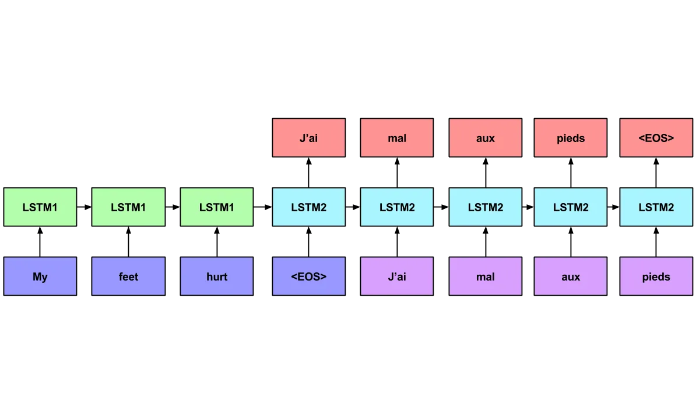

Figure 14: Sequence to sequence LSTM model of Sutskever et al. \[2014\].
The network consists of an encoding model (first LSTM) and a decoding
model (second LSTM). The input blocks (blue and purple) correspond to
word vectors, which are fully connected to the corresponding hidden
state. Red nodes are softmax outputs. Weights are tied among all
encoding steps and among all decoding time steps.

Sutskever et al. \[2014\] present a translation model using two
multilayered LSTMs that demonstrates impressive performance translating
from English to French. The first LSTM is used for _encoding_ an input
phrase from the source language and the second LSTM for _decoding_ the
output phrase in the target language. The model works according to the
following procedure (Figure 14):

- •
  The source phrase is fed to the encoding LSTM one word at a time,
  which does not output anything. The authors found that significantly
  better results are achieved when the input sentence is fed into the
  network in reverse order.
- •
  When the end of the phrase is reached, a special symbol that indicates
  the beginning of the output sentence is sent to the decoding LSTM.
  Additionally, the decoding LSTM receives as input the final state of
  the first LSTM. The second LSTM outputs softmax probabilities over the
  vocabulary at each time step.
- •
  At inference time, beam search is used to choose the most likely words
  from the distribution at each time step, running the second LSTM until
  the end-of-sentence (_EOS_) token is reached.

For training, the true inputs are fed to the encoder, the true
translation is fed to the decoder, and loss is propagated back from the
outputs of the decoder across the entire sequence to sequence model. The
network is trained to maximize the likelihood of the correct translation
of each sentence in the training set. At inference time, a left to right
beam search is used to determine which words to output. A few among the
most likely next words are chosen for expansion after each time step.
The beam search ends when the network outputs an end-of-sentence (_EOS_)
token. Sutskever et al. \[2014\] train the model using stochastic
gradient descent without momentum, halving the learning rate twice per
epoch, after the first five epochs. The approach achieves a BLEU score
of 34.81, outperforming the best previous neural network NLP systems,
and matching the best published results for non-neural network
approaches, including systems that have explicitly programmed domain
expertise. When their system is used to rerank candidate translations
from another system, it achieves a BLEU score of 36.5.

The implementation which achieved these results involved eight GPUS.
Nevertheless, training took 10 days to complete. One GPU was assigned to
each layer of the LSTM, and an additional four GPUs were used simply to
calculate softmax. The implementation was coded in C++, and each hidden
layer of the LSTM contained 1000 nodes. The input vocabulary contained
160,000 words and the output vocabulary contained 80,000 words. Weights
were initialized uniformly randomly in the range between $`-0.08`$ and
$`0.08`$.

Another RNN approach to language translation is presented by Auli et al.
\[2013\]. Their RNN model uses the word embeddings of Mikolov and a
lattice representation of the decoder output to facilitate search over
the space of possible translations. In the lattice, each node
corresponds to a sequence of words. They report a BLEU score of 28.5 on
French-English translation tasks. Both papers provide results on similar
datasets but Sutskever et al. \[2014\] only report on English to French
translation while Auli et al. \[2013\] only report on French to English
translation, so it is not possible to compare the performance of the two
models.

### 5.4 Image captioning

Recently, recurrent neural networks have been used successfully for
generating sentences that describe photographs \[Vinyals et al., 2015,
Karpathy and Fei-Fei, 2014, Mao et al., 2014\]. In this task, a training
set consists of input images $`\boldsymbol{x}`$ and target captions
$`\boldsymbol{y}`$. Given a large set of image-caption pairs, a model is
trained to predict the appropriate caption for an image.

Vinyals et al. \[2015\] follow up on the success in language to language
translation by considering captioning as a case of image to language
translation. Instead of both encoding and decoding with LSTMs, they
introduce the idea of encoding an image with a convolutional neural
network, and then decoding it with an LSTM. Mao et al. \[2014\]
independently developed a similar RNN image captioning network, and
achieved then state-of-the-art results on the Pascal, Flickr30K, and
COCO datasets.

Karpathy and Fei-Fei \[2014\] follows on this work, using a
convolutional network to encode images together with a bidirectional
network attention mechanism and standard RNN to decode captions, using
word2vec embeddings as word representations. They consider both
full-image captioning and a model that captures correspondences between
image regions and text snippets. At inference time, their procedure
resembles the one described by Sutskever et al. \[2014\], where
sentences are decoded one word at a time. The most probable word is
chosen and fed to the network at the next time step. This process is
repeated until an _EOS_ token is produced.

To convey a sense of the scale of these problems, Karpathy and Fei-Fei
\[2014\] focus on three datasets of captioned images: Flickr8K,
Flickr30K, and COCO, of size 50MB (8000 images), 200MB (30,000 images),
and 750MB (328,000 images) respectively. The implementation uses the
Caffe library \[Jia et al., 2014\], and the convolutional network is
pretrained on ImageNet data. In a revised version, the authors report
that LSTMs outperform simpler RNNs and that learning word
representations from random initializations is often preferable to
word2vec embeddings. As an explanation, they say that word2vec
embeddings may cluster words like colors together in the embedding
space, which can be not suitable for visual descriptions of images.

### 5.5 Further applications

Handwriting recognition is an application area where bidirectional LSTMs
have been used to achieve state of the art results. In work by Liwicki
et al. \[2007\] and Graves et al. \[2009\], data is collected from an
interactive whiteboard. Sensors record the $`(x,y)`$ coordinates of the
pen at regularly sampled time steps. In the more recent paper, they use
a bidirectional LSTM model, outperforming an HMM model by achieving
$`81.5\%`$ word-level accuracy, compared to $`70.1\%`$ for the HMM.

In the last year, a number of papers have emerged that extend the
success of recurrent networks for translation and image captioning to
new domains. Among the most interesting of these applications are
unsupervised video encoding \[Srivastava et al., 2015\], video
captioning \[Venugopalan et al., 2015\], and program execution \[Zaremba
and Sutskever, 2014\]. Venugopalan et al. \[2015\] demonstrate a
sequence to sequence architecture that encodes frames from a video and
decode words. At each time step the input to the encoding LSTM is the
topmost hidden layer of a convolutional neural network. At decoding
time, the network outputs probabilities over the vocabulary at each time
step.

Zaremba and Sutskever \[2014\] experiment with networks which read
computer programs one character at a time and predict their output. They
focus on programs which output integers and find that for simple
programs, including adding two nine-digit numbers, their network, which
uses LSTM cells in several stacked hidden layers and makes a single left
to right pass through the program, can predict the output with 99%
accuracy.

## 6 Discussion

Over the past thirty years, recurrent neural networks have gone from
models primarily of interest for cognitive modeling and computational
neuroscience, to powerful and practical tools for large-scale supervised
learning from sequences. This progress owes to advances in model
architectures, training algorithms, and parallel computing. Recurrent
networks are especially interesting because they overcome many of the
restrictions placed on input and output data by traditional machine
learning approaches. With recurrent networks, the assumption of
independence between consecutive examples is broken, and hence also the
assumption of fixed-dimension inputs and outputs.

While LSTMs and BRNNs have set records in accuracy on many tasks in
recent years, it is noteworthy that advances come from novel
architectures rather than from fundamentally novel algorithms.
Therefore, automating exploration of the space of possible models, for
example via genetic algorithms or a Markov chain Monte Carlo approach,
could be promising. Neural networks offer a wide range of transferable
and combinable techniques. New activation functions, training
procedures, initializations procedures, etc. are generally transferable
across networks and tasks, often conferring similar benefits. As the
number of such techniques grows, the practicality of testing all
combinations diminishes. It seems reasonable to infer that as a
community, neural network researchers are exploring the space of model
architectures and configurations much as a genetic algorithm might,
mixing and matching techniques, with a fitness function in the form of
evaluation metrics on major datasets of interest.

This inference suggests two corollaries. First, as just stated, this
body of research could benefit from automated procedures to explore the
space of models. Second, as we build systems designed to perform more
complex tasks, we would benefit from improved fitness functions. A BLEU
score inspires less confidence than the accuracy reported on a binary
classification task. To this end, when possible, it seems prudent to
individually test techniques first with classic feedforward networks on
datasets with established benchmarks before applying them to recurrent
networks in settings with less reliable evaluation criteria.

Lastly, the rapid success of recurrent neural networks on natural
language tasks leads us to believe that extensions of this work to
longer texts would be fruitful. Additionally, we imagine that dialogue
systems could be built along similar principles to the architectures
used for translation, encoding prompts and generating responses, while
retaining the entirety of conversation history as contextual
information.

## 7 Acknowledgements

The first author’s research is funded by generous support from the
Division of Biomedical Informatics at UCSD, via a training grant from
the National Library of Medicine. This review has benefited from
insightful comments from Vineet Bafna, Julian McAuley, Balakrishnan
Narayanaswamy, Stefanos Poulis, Lawrence Saul, Zhuowen Tu, and Sharad
Vikram.

## References

- Auli et al. \[2013\] Michael Auli, Michel Galley, Chris Quirk, and
  Geoffrey Zweig. Joint language and translation modeling with recurrent
  neural networks. In _EMNLP_, pages 1044–1054, 2013.
- Baddeley et al. \[1996\] Alan Baddeley, Sergio Della Sala, and T.W.
  Robbins. Working memory and executive control \[and discussion\].
  _Philosophical Transactions of the Royal Society B: Biological
  Sciences_, 351(1346):1397–1404, 1996.
- Baldi and Pollastri \[2003\] Pierre Baldi and Gianluca Pollastri. The
  principled design of large-scale recursive neural network
  architectures–DAG-RNNs and the protein structure prediction problem.
  _The Journal of Machine Learning Research_, 4:575–602, 2003.
- Banerjee and Lavie \[2005\] Satanjeev Banerjee and Alon Lavie. METEOR:
  An automatic metric for MT evaluation with improved correlation with
  human judgments. In _Proceedings of the ACL Workshop on Intrinsic and
  Extrinsic Evaluation Measures for Machine Translation and/or
  Summarization_, pages 65–72, 2005.
- Bayer et al. \[2009\] Justin Bayer, Daan Wierstra, Julian Togelius,
  and Jürgen Schmidhuber. Evolving memory cell structures for sequence
  learning. In _Artificial Neural Networks–ICANN 2009_, pages 755–764.
  Springer, 2009.
- Belew et al. \[1990\] Richard K. Belew, John McInerney, and Nicol N.
  Schraudolph. Evolving networks: Using the genetic algorithm with
  connectionist learning. In _In_. Citeseer, 1990.
- Bengio et al. \[1994\] Yoshua Bengio, Patrice Simard, and Paolo
  Frasconi. Learning long-term dependencies with gradient descent is
  difficult. _Neural Networks, IEEE Transactions on_,
  5(2):157–166, 1994.
- Bengio et al. \[2003\] Yoshua Bengio, Réjean Ducharme, Pascal Vincent,
  and Christian Janvin. A neural probabilistic language model. _The
  Journal of Machine Learning Research_, 3:1137–1155, 2003.
- Bengio et al. \[2013\] Yoshua Bengio, Nicolas Boulanger-Lewandowski,
  and Razvan Pascanu. Advances in optimizing recurrent networks. In
  _Acoustics, Speech and Signal Processing (ICASSP), 2013 IEEE
  International Conference on_, pages 8624–8628. IEEE, 2013.
- Bergstra et al. \[2010\] James Bergstra, Olivier Breuleux, Frédéric
  Bastien, Pascal Lamblin, Razvan Pascanu, Guillaume Desjardins, Joseph
  Turian, David Warde-Farley, and Yoshua Bengio. Theano: a CPU and GPU
  math expression compiler. In _Proceedings of the Python for Scientific
  Computing Conference (SciPy)_, volume 4, page 3. Austin, TX, 2010.
- Blum and Rivest \[1993\] Avrim L. Blum and Ronald L. Rivest. Training
  a 3-node neural network is NP-complete. In _Machine Learning: From
  Theory to Applications_, pages 9–28. Springer, 1993.
- Carpenter \[2008\] Bob Carpenter. Lazy sparse stochastic gradient
  descent for regularized multinomial logistic regression. _Alias-i,
  Inc., Tech. Rep_, pages 1–20, 2008.
- Collobert et al. \[2011\] Ronan Collobert, Koray Kavukcuoglu, and
  Clément Farabet. Torch7: A matlab-like environment for machine
  learning. In _BigLearn, NIPS Workshop_, 2011.
- Dauphin et al. \[2014\] Yann N Dauphin, Razvan Pascanu, Caglar
  Gulcehre, Kyunghyun Cho, Surya Ganguli, and Yoshua Bengio. Identifying
  and attacking the saddle point problem in high-dimensional non-convex
  optimization. In _Advances in Neural Information Processing Systems_,
  pages 2933–2941, 2014.
- De Mulder et al. \[2015\] Wim De Mulder, Steven Bethard, and
  Marie-Francine Moens. A survey on the application of recurrent neural
  networks to statistical language modeling. _Computer Speech &
  Language_, 30(1):61–98, 2015.
- Duchi et al. \[2011\] John Duchi, Elad Hazan, and Yoram Singer.
  Adaptive subgradient methods for online learning and stochastic
  optimization. _The Journal of Machine Learning Research_,
  12:2121–2159, 2011.
- Elkan \[2015\] Charles Elkan. Learning meanings for sentences.
  http://cseweb.ucsd.edu/~elkan/250B/learningmeaning.pdf, 2015.
  Accessed: 2015-05-18.
- Elman \[1990\] Jeffrey L. Elman. Finding structure in time. _Cognitive
  science_, 14(2):179–211, 1990.
- Farabet et al. \[2013\] Clement Farabet, Camille Couprie, Laurent
  Najman, and Yann LeCun. Learning hierarchical features for scene
  labeling. _Pattern Analysis and Machine Intelligence, IEEE
  Transactions on_, 35(8):1915–1929, 2013.
- Gers \[2001\] Felix A. Gers. Long short-term memory in recurrent
  neural networks. _Unpublished PhD dissertation, École Polytechnique
  Fédérale de Lausanne, Lausanne, Switzerland_, 2001.
- Gers and Schmidhuber \[2000\] Felix A. Gers and Jürgen Schmidhuber.
  Recurrent nets that time and count. In _Neural Networks, 2000. IJCNN
  2000, Proceedings of the IEEE-INNS-ENNS International Joint Conference
  on_, volume 3, pages 189–194. IEEE, 2000.
- Gers et al. \[2000\] Felix A. Gers, Jürgen Schmidhuber, and Fred
  Cummins. Learning to forget: Continual prediction with LSTM. _Neural
  computation_, 12(10):2451–2471, 2000.
- Glorot et al. \[2011\] Xavier Glorot, Antoine Bordes, and Yoshua
  Bengio. Deep sparse rectifier networks. In _Proceedings of the 14th
  International Conference on Artificial Intelligence and Statistics.
  JMLR W&CP Volume_, volume 15, pages 315–323, 2011.
- Goldberg and Levy \[2014\] Yoav Goldberg and Omer Levy. word2vec
  explained: deriving Mikolov et al.’s negative-sampling word-embedding
  method. _arXiv preprint arXiv:1402.3722_, 2014.
- Graves \[2012\] Alex Graves. _Supervised sequence labelling with
  recurrent neural networks_, volume 385. Springer, 2012.
- Graves and Schmidhuber \[2005\] Alex Graves and Jürgen Schmidhuber.
  Framewise phoneme classification with bidirectional LSTM and other
  neural network architectures. _Neural Networks_, 18(5):602–610, 2005.
- Graves et al. \[2009\] Alex Graves, Marcus Liwicki, Santiago
  Fernández, Roman Bertolami, Horst Bunke, and Jürgen Schmidhuber. A
  novel connectionist system for unconstrained handwriting recognition.
  _Pattern Analysis and Machine Intelligence, IEEE Transactions on_,
  31(5):855–868, 2009.
- Graves et al. \[2014\] Alex Graves, Greg Wayne, and Ivo Danihelka.
  Neural Turing machines. _arXiv preprint arXiv:1410.5401_, 2014.
- Gruau et al. \[1994\] Frédéric Gruau, L’universite Claude Bernard lyon
  I, Of A Diplome De Doctorat, M. Jacques Demongeot, Examinators
  M. Michel Cosnard, M. Jacques Mazoyer, M. Pierre Peretto, and
  M. Darell Whitley. Neural network synthesis using cellular encoding
  and the genetic algorithm., 1994.
- Harp and Samad \[2013\] Steven A. Harp and Tariq Samad. Optimizing
  neural networks with genetic algorithms. In _Proceedings of the 54th
  American Power Conference, Chicago_, volume 2, 2013.
- Hinton \[1986\] Geoffrey E. Hinton. Learning distributed
  representations of concepts, 1986.
- Hochreiter and Schmidhuber \[1996\] Sepp Hochreiter and Jurgen
  Schmidhuber. Bridging long time lags by weight guessing and “long
  short-term memory”. _Spatiotemporal Models in Biological and
  Artificial Systems_, 37:65–72, 1996.
- Hochreiter and Schmidhuber \[1997\] Sepp Hochreiter and Jürgen
  Schmidhuber. Long short-term memory. _Neural Computation_,
  9(8):1735–1780, 1997.
- Hochreiter et al. \[2001\] Sepp Hochreiter, Yoshua Bengio, Paolo
  Frasconi, and Jürgen Schmidhuber. Gradient flow in recurrent nets: the
  difficulty of learning long-term dependencies. _A field guide to
  dynamical recurrent neural networks_, 2001.
- Hopfield \[1982\] John J. Hopfield. Neural networks and physical
  systems with emergent collective computational abilities. _Proceedings
  of the National Academy of Sciences_, 79(8):2554–2558, 1982.
- Jia et al. \[2014\] Yangqing Jia, Evan Shelhamer, Jeff Donahue, Sergey
  Karayev, Jonathan Long, Ross Girshick, Sergio Guadarrama, and Trevor
  Darrell. Caffe: Convolutional architecture for fast feature embedding.
  _arXiv preprint arXiv:1408.5093_, 2014.
- Jordan \[1986\] Michael I. Jordan. Serial order: A parallel
  distributed processing approach. Technical Report 8604, Institute for
  Cognitive Science, University of California, San Diego, 1986.
- Karpathy \[2015\] Andrej Karpathy. The unreasonable effectiveness of
  recurrent neural networks.
  http://karpathy.github.io/2015/05/21/rnn-effectiveness/, 2015.
  Accessed: 2015-08-13.
- Karpathy and Fei-Fei \[2014\] Andrej Karpathy and Li Fei-Fei. Deep
  visual-semantic alignments for generating image descriptions. _arXiv
  preprint arXiv:1412.2306_, 2014.
- Krizhevsky et al. \[2012\] Alex Krizhevsky, Ilya Sutskever, and
  Geoffrey E. Hinton. ImageNet classification with deep convolutional
  neural networks. In _Advances in Neural Information Processing
  Systems_, pages 1097–1105, 2012.
- Langford et al. \[2009\] John Langford, Lihong Li, and Tong Zhang.
  Sparse online learning via truncated gradient. In _Advances in Neural
  Information Processing Systems_, pages 905–912, 2009.
- Le Cun et al. \[1990\] Yann Le Cun, B. Boser, John S. Denker,
  D. Henderson, Richard E. Howard, W. Hubbard, and Lawrence D. Jackel.
  Handwritten digit recognition with a back-propagation network. In
  _Advances in Neural Information Processing Systems_. Citeseer, 1990.
- Lipton and Elkan \[2015\] Zachary C. Lipton and Charles Elkan.
  Efficient elastic net regularization for sparse linear models. _CoRR_,
  abs/1505.06449, 2015. URL http://arxiv.org/abs/1505.06449.
- Lipton et al. \[2014\] Zachary C. Lipton, Charles Elkan, and
  Balakrishnan Naryanaswamy. Optimal thresholding of classifiers to
  maximize F1 measure. In _Machine Learning and Knowledge Discovery in
  Databases_, pages 225–239. Springer, 2014.
- Liwicki et al. \[2007\] Marcus Liwicki, Alex Graves, Horst Bunke, and
  Jürgen Schmidhuber. A novel approach to on-line handwriting
  recognition based on bidirectional long short-term memory networks. In
  _Proc. 9th Int. Conf. on Document Analysis and Recognition_, volume 1,
  pages 367–371, 2007.
- Maas et al. \[2012\] Andrew L. Maas, Quoc V. Le, Tyler M. O’Neil,
  Oriol Vinyals, Patrick Nguyen, and Andrew Y. Ng. Recurrent neural
  networks for noise reduction in robust ASR. In _INTERSPEECH_.
  Citeseer, 2012.
- Mao et al. \[2014\] Junhua Mao, Wei Xu, Yi Yang, Jiang Wang, and Alan
  Yuille. Deep captioning with multimodal recurrent neural networks
  (m-RNN). _arXiv preprint arXiv:1412.6632_, 2014.
- Martens and Sutskever \[2011\] James Martens and Ilya Sutskever.
  Learning recurrent neural networks with Hessian-free optimization. In
  _Proceedings of the 28th International Conference on Machine Learning
  (ICML-11)_, pages 1033–1040, 2011.
- Mikolov et al. \[2013\] Tomas Mikolov, Kai Chen, Greg Corrado, and
  Jeffrey Dean. Efficient estimation of word representations in vector
  space. _arXiv preprint arXiv:1301.3781_, 2013.
- Nair and Hinton \[2010\] Vinod Nair and Geoffrey E. Hinton. Rectified
  linear units improve restricted Boltzmann machines. In _Proceedings of
  the 27th International Conference on Machine Learning (ICML-10)_,
  pages 807–814, 2010.
- Papineni et al. \[2002\] Kishore Papineni, Salim Roukos, Todd Ward,
  and Wei-Jing Zhu. BLEU: a method for automatic evaluation of machine
  translation. In _Proceedings of the 40th annual meeting on association
  for computational linguistics_, pages 311–318. Association for
  Computational Linguistics, 2002.
- Pascanu et al. \[2012\] Razvan Pascanu, Tomas Mikolov, and Yoshua
  Bengio. On the difficulty of training recurrent neural networks.
  _arXiv preprint arXiv:1211.5063_, 2012.
- Pearlmutter \[1995\] Barak A. Pearlmutter. Gradient calculations for
  dynamic recurrent neural networks: A survey. _Neural Networks, IEEE
  Transactions on_, 6(5):1212–1228, 1995.
- Pennington et al. \[2014\] Jeffrey Pennington, Richard Socher, and
  Christopher D. Manning. Glove: Global vectors for word representation.
  _Proceedings of the Empirical Methods in Natural Language Processing
  (EMNLP 2014)_, 12, 2014.
- Rumelhart et al. \[1985\] David E. Rumelhart, Geoffrey E. Hinton, and
  Ronald J. Williams. Learning internal representations by error
  propagation. Technical report, DTIC Document, 1985.
- Schuster and Paliwal \[1997\] Mike Schuster and Kuldip K. Paliwal.
  Bidirectional recurrent neural networks. _Signal Processing, IEEE
  Transactions on_, 45(11):2673–2681, 1997.
- Siegelmann and Sontag \[1991\] Hava T. Siegelmann and Eduardo D.
  Sontag. Turing computability with neural nets. _Applied Mathematics
  Letters_, 4(6):77–80, 1991.
- Singer and Duchi \[2009\] Yoram Singer and John C. Duchi. Efficient
  learning using forward-backward splitting. In _Advances in Neural
  Information Processing Systems_, pages 495–503, 2009.
- Socher et al. \[2010\] Richard Socher, Christopher D. Manning, and
  Andrew Y. Ng. Learning continuous phrase representations and syntactic
  parsing with recursive neural networks. In _Proceedings of the
  NIPS-2010 Deep Learning and Unsupervised Feature Learning Workshop_,
  pages 1–9, 2010.
- Socher et al. \[2011a\] Richard Socher, Eric H. Huang, Jeffrey Pennin,
  Christopher D. Manning, and Andrew Y. Ng. Dynamic pooling and
  unfolding recursive autoencoders for paraphrase detection. In
  _Advances in Neural Information Processing Systems_, pages 801–809,
  2011a.
- Socher et al. \[2011b\] Richard Socher, Cliff C. Lin, Chris Manning,
  and Andrew Y. Ng. Parsing natural scenes and natural language with
  recursive neural networks. In _Proceedings of the 28th international
  conference on machine learning (ICML-11)_, pages 129–136, 2011b.
- Socher et al. \[2011c\] Richard Socher, Jeffrey Pennington, Eric H.
  Huang, Andrew Y. Ng, and Christopher D. Manning. Semi-supervised
  recursive autoencoders for predicting sentiment distributions. In
  _Proceedings of the Conference on Empirical Methods in Natural
  Language Processing_, pages 151–161. Association for Computational
  Linguistics, 2011c.
- Socher et al. \[2014\] Richard Socher, Andrej Karpathy, Quoc V. Le,
  Christopher D. Manning, and Andrew Y. Ng. Grounded compositional
  semantics for finding and describing images with sentences.
  _Transactions of the Association for Computational Linguistics_,
  2:207–218, 2014.
- Srivastava et al. \[2015\] Nitish Srivastava, Elman Mansimov, and
  Ruslan Salakhutdinov. Unsupervised learning of video representations
  using LSTMs. _arXiv preprint arXiv:1502.04681_, 2015.
- Stratonovich \[1960\] Ruslan L. Stratonovich. Conditional markov
  processes. _Theory of Probability & Its Applications_,
  5(2):156–178, 1960.
- Sutskever et al. \[2011\] Ilya Sutskever, James Martens, and
  Geoffrey E. Hinton. Generating text with recurrent neural networks. In
  _Proceedings of the 28th International Conference on Machine Learning
  (ICML-11)_, pages 1017–1024, 2011.
- Sutskever et al. \[2013\] Ilya Sutskever, James Martens, George Dahl,
  and Geoffrey E. Hinton. On the importance of initialization and
  momentum in deep learning. In _Proceedings of the 30th International
  Conference on Machine Learning (ICML-13)_, pages 1139–1147, 2013.
- Sutskever et al. \[2014\] Ilya Sutskever, Oriol Vinyals, and Quoc V.
  Le. Sequence to sequence learning with neural networks. In _Advances
  in Neural Information Processing Systems_, pages 3104–3112, 2014.
- Tieleman and Hinton \[2012\] Tijmen Tieleman and Geoffrey E. Hinton.
  Lecture 6.5- RMSprop: Divide the gradient by a running average of its
  recent magnitude. https://www.youtube.com/watch?v=LGA-gRkLEsI, 2012.
- Turing \[1950\] Alan M. Turing. Computing machinery and intelligence.
  _Mind_, pages 433–460, 1950.
- Venugopalan et al. \[2015\] Subhashini Venugopalan, Marcus Rohrbach,
  Jeff Donahue, Raymond Mooney, Trevor Darrell, and Kate Saenko.
  Sequence to sequence–video to text. _arXiv preprint
  arXiv:1505.00487_, 2015.
- Vinyals et al. \[2015\] Oriol Vinyals, Alexander Toshev, Samy Bengio,
  and Dumitru Erhan. Show and tell: A neural image caption generator. In
  _Proceedings of the IEEE Conference on Computer Vision and Pattern
  Recognition_, pages 3156–3164, 2015.
- Viterbi \[1967\] Andrew J. Viterbi. Error bounds for convolutional
  codes and an asymptotically optimum decoding algorithm. _Information
  Theory, IEEE Transactions on_, 13(2):260–269, 1967.
- Werbos \[1990\] Paul J. Werbos. Backpropagation through time: what it
  does and how to do it. _Proceedings of the IEEE_,
  78(10):1550–1560, 1990.
- Wikipedia \[2015\] Wikipedia. Backpropagation — Wikipedia, the free
  encyclopedia, 2015. URL http://en.wikipedia.org/wiki/Backpropagation.
  \[Online; accessed 18-May-2015\].
- Williams and Zipser \[1989\] Ronald J. Williams and David Zipser. A
  learning algorithm for continually running fully recurrent neural
  networks. _Neural Computation_, 1(2):270–280, 1989.
- Zaremba and Sutskever \[2014\] Wojciech Zaremba and Ilya Sutskever.
  Learning to execute. _arXiv preprint arXiv:1410.4615_, 2014.
- Zeiler \[2012\] Matthew D. Zeiler. Adadelta: an adaptive learning rate
  method. _arXiv preprint arXiv:1212.5701_, 2012.
- Zeiler et al. \[2013\] Matthew D. Zeiler, M. Ranzato, Rajat Monga,
  M. Mao, K. Yang, Quoc V. Le, Patrick Nguyen, A. Senior, Vincent
  Vanhoucke, Jeffrey Dean, et al. On rectified linear units for speech
  processing. In _Acoustics, Speech and Signal Processing (ICASSP), 2013
  IEEE International Conference on_, pages 3517–3521. IEEE, 2013.
