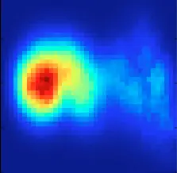
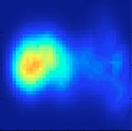
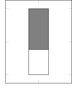
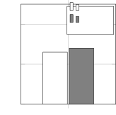

# Reducing one-to-many problem in Voice Conversion by equalizing the formant locations using dynamic frequency warping

Seyed Hamidreza Mohammadi

###### Abstract

In this study, we investigate a solution to reduce the effect of
one-to-many problem in voice conversion. One-to-many problem in VC
happens when two very similar speech segments in source speaker have
corresponding speech segments in target speaker that are not similar to
each other. As a result, the mapper function usually over-smoothes the
generated features in order to be similar to both target speech
segments. In this study, we propose to equalize the formant location of
source-target frame pairs using dynamic frequency warping in order to
reduce the complexity. After the conversion, another dynamic frequency
warping is further applied to reverse the effect of formant location
equalization during the training. The subjective experiments showed that
the proposed approach improves the speech quality significantly.

Index Terms: voice conversion, dynamic frequency warping, formant
equalization

^(†)^(†)address: Center for Spoken Language Understanding, Oregon Health
& Science University  
Portland, OR, USA  
mohammah@ohsu.edu

## 1 Introduction

The task of Voice Conversion (VC) is to convert speech from a source
speaker to sound similar to that of a target speaker’s. Various
approaches have been proposed; most commonly, a generative approach
analyzes speech frame-by-frame and then maps extracted source speaker
features towards target speaker features, with a subsequent synthesis
procedure. The mapping is achieved using a non-linear regression
function, which must be trained on aligned source and target features
from existing parallel or artificially parallelized \[1\] speech. In a
parallel speech corpus, the utterances for both speakers have the same
linguistic content.

In this study, we assume that a parallel speech corpus is available. For
each utterance pair, a time alignment is performed to equalize the
difference in speaking rate of the speakers. Helander et. al. \[2\]
extensively study the impact of frame alignment on VC performance. They
compare various approaches to aligning speech such as hand-labeling,
Dynamic Time Warping (DTW), and using Automatic Speech Recognition (ASR)
output. They conclude that with using variations of DTW, they could
achieve the performance of hand-labeling alignment. The alignment can be
updated after one or several iterations of training \[1\]. The output of
this stage is the source-target frame pairs that are supposed the same
speech content as each other. The mapping function is usually trained on
these aligned speech segments.

One inherent problem in VC is one-to-many problem \[3\]. For two or more
similar aligned speech segments, there is no guarantee that there exist
corresponding target speech segments that are similar. In other words,
the mapping problem that VC is trying to solve is not a function. This
makes the learning the mapping function a challenging task. With such
frame pairs present, some methods such as Gaussian Mixture Models (GMMs)
\[4, 5\] or Neural Networks \[6, 7\] might result in over-smoothing or a
muffling effect in the converted speech. The reason is that the mapper
is trying to learn a mapping that does not have a function property.
Since these mappers usually try to find a solution with most similarity
to the target speech typically by trying to find a minimum mean squared
error (MMSE) solution, the one-to-many problem causes these mappers to
converge to a solution that is most similar to all the dissimilar target
segments. This will ultimately contribute to producing average speech
segments that have over-smoothing or muffling property. Some approaches
try to reduce the muffling property by applying a post-processing to
match the variance of the converted speech features to the original
target features \[8\], but it does not address this inherent problem in
VC. The effect of one-to-many problem might be different in other VC
approaches. For example, in approaches such a codebook \[9, 10\] or
dictionary mapping \[11, 12\], it might result in discontinuous speech,
since the similar source segments are used for finding target speech
segments which are dissimilar. Concatenating these dissimilar segments
results in audible discontinuities in converted speech.

Various factors might be the cause of the one-to-many problem. One
reason might be that people utter certain speech segments different from
each other because they pronounce words in the same context different
from each other. As a result, the source speaker might say a word in two
different sentences similarly, but the target speaker pronounces the
word differently. Another reason for the one-to-many problem might be
due to the rendition differences. When one person utters a certain
sentence multiple times, there is difference between the multiple
renditions of the sentence. This has been shown by objective measure
differences between the sentences uttered by the same speaker \[13\].
This is another contribution to the one-to-many problem.

Figure 1: Proposed Framework

Mouchatris et. al. \[3\] have studied one-to-many problem by extending
the vector quantization (VQ) VC technique to conditional VQ, which can
capture one-to-many relationships. It uses hard clustering on source
frames independently from target frames. Godoy et. al. \[14\] proposed
to solve this problem by considering context-dependent information. They
consider phonetic information in GMM framework. They also studied the
effect of training only on source versus training on the joint
source-target space and isolating one-to-many mappings from training
using a threshold. Turk et. al. \[15\] also proposes to filter out some
source-target pairs that are unreliable based on some type of confidence
measure.

Figure 2: Dynamic frequency warping

In this study, we posit that one cause of the one-to-many problem is the
difference in formant locations. The formant difference in target speech
segments is a major factor that causes widening in synthesized formants,
since the mapping tries to be as similar to the two different target
speech segments. We propose to equalize the formant locations of the
source and target speech by warping the target speech spectra to match
the source formant locations. The mapping function is trained on the
formant equalized speech. At conversion time, the source is converted to
formant normalized target. The synthesized speech is then warped using a
DFW VC approach to match the formants of the target speaker. The overall
proposed framework is described in Figure 1.

The formant equalization is described in Section 2. The mapping function
is described in Section 3. We then detail our voice conversion
experiments, including system configurations and their objective and
subjective evaluation, in Section 4. Finally, we conclude in Section 5.

## 2 Formant Equalization

An example of a one-to-many problem is depicted in Figure 3. As can be
seen, two similar source spectra correspond to two dissimilar target
spectra. Various factors might contribute to this one-to-many problem.
One reason might be different contexts that different people say a
certain speech segments. For example, they might put different stress on
a specific word, or have different accents, or other high-level reasons.
Another reason that seems to might cause this one-to-many problem might
be due to differences in renditions. Even if one person says the same
sentence twice, there is a difference between the two renditions of the
sentence \[13\]. We posit that one difference between the two spectra
might be due to different formant locations. This seems to be the most
common symptom of the one-to-many problem, and it is evident in Figure 3. We propose to normalize these effects by equalizing formant
locations.

Figure 3: Formant mismatch in target spectra for two similar source
spectra (left) and the proposed solution (right)

We use a method similar to DFW to equalize formants \[16, 17, 18, 19\].
First, the formant location and bandwidths are extracted from all of the
utterances using a signal processing algorithm. The utterances are
time-aligned using DTW. The aligned source-target formant information is
used as cues in DFW algorithm. Let the aligned feature sequence be
represented by $`\mathbf{M}=[m_{1},m_{2},...m_{N}]`$, the corresponding
log-spectrum by $`S=[s_{1},s_{2},...s_{N}]`$, the formant locations by
$`F=[f_{1},f_{2},...f_{N}]`$ and the formant bandwidth by
$`B=[b_{1},b_{2},...b_{N}]`$. The spectra are formant-equalized
frame-by-frame. The formant of the target spectrum are equalized to the
source spectrum using

```math
\bar{s}_{i}^{y}=dfw(s_{i}^{y},W(f_{i}^{y},b_{i}^{y},f_{i}^{x},b_{i}^{x})) \tag{1}
```

The normalized spectrum $`\bar{s}_{i}^{y}`$ is converted back to the
feature domain $`\bar{m}_{i}^{y}`$. The warping function $`W()`$ is
constructed from both source and target estimated formant location and
bandwidth \[19\]. A sample warping function is shown in Figure 2 where
the warping points are determined from source and target formant
location and bandwidth. If the warping causes the the target spectra to
be more different to source compared to no warping, we consider this a
sign of formant error and remove those frames.

## 3 Mapping Function

In this section, we briefly overview the GMM mapping function \[4\]. Let
$`Z=[M^{x},\bar{M}^{y}]`$ is the joint source-target spectral vector. A
GMM represents the distribution using $`Q`$ multivariate Gaussian

```math
P(z)=\sum_{q=1}^{Q}\alpha N(z;\mu_{q},\Sigma_{q}) \tag{2}
```

where $`N()`$ is a normal distribution with $`\alpha_{q},`$ $`\mu_{q}`$
and $`\Sigma_{q}`$ as prior probability, mean and covariance of
component $`q`$, respectively. Each component would ideally represent an
acoustic class. The parameters of the GMM are calculated using the
Expectation Maximization (EM) algorithm on the joint vector $`Z`$.
During conversion, for each component, we estimate the MMSE of the
target vector given the source vector for each component

```math
\hat{m}_{i}^{q}=E[M^{y}|M^{x}=m_{i}^{x}]=\mu_{q}^{y}-\Sigma_{q}^{xy}\Sigma_{q}^{xx-1}(m_{i}^{x}-\mu_{q}^{x}) \tag{3}
```

where each conversion in each component is weighted using the
probability that the frame $`x_{i}`$ belongs to the acoustic class
described by the component $`q`$

```math
\hat{m}_{i}^{y}=\sum_{q=1}^{Q}\frac{\alpha_{q}N(m_{i}^{x};\mu_{q}^{x},\Sigma_{q}^{xx})}{\sum_{k=1}^{Q}\alpha_{k}N(m_{i}^{x};\mu_{k}^{x},\Sigma_{k}^{xx})}\hat{m}_{i}^{q} \tag{4}
```

## 4 Experiment

### 4.1 Configurations

We use two male speakers from the CMU-arctic speech corpus \[20\]. We
select RMS as source and BDL as target speaker. \We use 50 training
sentences and 20 testing sentences from each speaker. For
analysis/synthesis, we use Ahocoder \[21\], which has shown good quality
for parametric speech synthesis. We represent spectrum using
39$`th`$-order MCEPs with $`\alpha=0.42`$ and 5$`msec`$ frame shifts,
which are the recommended configurations for 16kHz waveforms. We convert
MCEP to log-spectrum and back for performing frequency-domain warpings
\[21\]. We extract 4 formant location and bandwidth using Snack 2.2 with
LPC order 14 \[22\]. We train a GMM with $`Q=32`$ components for
transforming MCEPs. We also train a separate GMM with $`Q=8`$ to map
source and target formants from source MCEPs.

### 4.2 Objective Evaluation

This pre-processing step aims to make the mapping space less complex. We
compare the complexity map of the equalized and non-equalized formants
in Figure 4. The approach to compute the complexity map is to use a
consistency measure based on the hypervolume of the relative vectors in
a certain region as represented by the determinant of the data’s
covariance matrix \[23\]. When vectors are mostly parallel in one
region, the measure will have a lower value (indicating relative
consistency) than when relative vectors are pointing in different
directions (indicating relative inconsistency). The weighted covariance
for the region around $`x^{\prime}`$ is given by

```math
WeightedCov{}_{x^{\prime}}=\frac{1}{{\scriptstyle\sum w_{i,x^{\prime}}}}{\displaystyle\sum_{i=1}^{N}w_{i,x^{\prime}}(y_{i}-\overline{y})(y_{i}-\overline{y})} \tag{5}
```

where the weights $`w`$ can be represented by any function that
decreases with the distance between $`x`$ and $`x^{\prime}`$ . We chose
the Gaussian function

```math
w_{i,x^{\prime}}=\exp(\frac{-\left\|x_{i}-x^{\prime}\right\|^{2}}{2\sigma^{2}}) \tag{6}
```

with $`\sigma=0.1`$. The final consistency measure was computed by
taking the determinant of the weighted covariance in Equation 5. For
visualization purposes, the logarithm of the consistency value is
computed. As it is evident, the mapping shows less complexity when the
formants are equalized. This means for each source feature, there are
less dissimilar target features present. The 2-dimensional maps are
visualized by taking principal component analysis (PCA) in Figure 4. The
raw speech feature pairs have a mel-cepstral distortion (melCD) of
9.23dB and the the formant equalized version have a melCD of 8.38dB.





Figure 4: 2D visualization of the mapping complexity for the original
feature pairs (left) and the formant-equalized feature pairs (right)

### 4.3 Subjective Evaluation

To subjectively evaluate voice conversion performance, we performed two
perceptual tests: the first test measured speech quality and the second
test measured conversion accuracy (also referred to as speaker
similarity between conversion and target). The listening experiments
were carried out using Amazon Mechanical Turk, with participants who had
approval ratings of at least 90% and were located in North America. Both
perceptual tests used three trivial-to-judge sentence pairs, added to
the experiment to filter out any unreliable listeners. The statistical
tests in this section were performed using the Mann-Whitney test \[24\].

#### 4.3.1 Speech Quality Test

To evaluate the speech quality of the converted utterances, we conducted
a Comparative Mean Opinion Score (CMOS) test. In this test, listeners
heard two utterances A and B with the _same_ content and the _same_
speaker but in two _different_ conditions, and are then asked to
indicate wether they thought B was better or worse than A, using a
five-point scale comprised of +2 (much better), +1 (somewhat better), 0
(same), $`-`$1 (somewhat worse), $`-`$2 (much worse). It is worthy to
note that the two conditions to be compared differed in exactly one
aspect (either different mapping methods or different number of training
utterances). The experiment was administered to 20 listeners with each
listener judging 20 sentence pairs.

Listeners’ preference scores are shown in Figure 5. FREQ (formant
equalized) represents the proposed approach and ORIG represents the
baseline. The listeners preferred the speech quality of the proposed
framework. The improvement was shown to be significant. The generated
speech had less muffling effect which might be the reason listeners
judged those as higher quality.

#### 4.3.2 Conversion Accuracy Test

To evaluate the conversion accuracy of the converted utterances, we
conducted a same-different speaker similarity test \[25\]. In this test,
listeners heard two stimuli A and B with _different_ content, and were
then asked to indicate wether they thought that A and B were spoken by
the _same_, or by two _different_ speakers, using a five-point scale
comprised of +2 (definitely same), +1 (probably same), 0 (unsure),
$`-`$1 (probably different), and $`-`$2 (definitely different). One of
the stimuli in each pair was created by one of the four mapping methods,
and the other stimulus was a purely vocoded condition, used as the
_reference_ speaker. The experiment was administered to 20 listeners,
with each listener judging 20 sentence pairs.





Figure 5: Speech quality (left), Conversion accuracy (right)

Listeners’ average response scores are shown in Figure 5. The difference
between the two systems were not significant. This was shown using a
significance test. One reason might be using the DFW directly on the
log-spectrum domain, and also the formant estimation mismatches that are
inevitable. For controlling for the first problem, using other warping
approaches such as pole-shifting might be helpful. For the second
problem, hand-corrected formant values can be used to see the effect of
the proposed approach with the ground truth information available to us.

## 5 Conclusion

In this study, we investigated a solution to reduce the effect of
one-to-many problem in voice conversion. We proposed to equalize the
formant location of source-target frame pairs using dynamic frequency
warping in order to reduce the complexity. Finally, A dynamic frequency
warping is further applied after the conversion to reverse the effect of
formant location equalization. We were able to show a significant gain
in speech quality. Two issues present themselves here. The issue is
using DFW directly on the log-spectrum domain, which might cause
distorted-looking spectra, specially if there is a formant error. For
controlling for this problem, using other warping approaches such as
pole-shifting might be helpful. The other more important problem is the
formant estimation mismatches that are inevitable. For solving this
problem, hand-corrected formant values can be used for experimentation
purposes to see the real effect of the proposed approach with the ground
truth formant information.

## References

- \[1\] Daniel Erro, Asunción Moreno, and Antonio Bonafonte, “Inca
  algorithm for training voice conversion systems from nonparallel
  corpora,” Audio, Speech, and Language Processing, IEEE Transactions
  on, vol. 18, no. 5, pp. 944–953, 2010.
- \[2\] Elina Helander, Jan Schwarz, Jani Nurminen, Hanna Silen, and
  Moncef Gabbouj, “On the impact of alignment on voice conversion
  performance,” in Ninth Annual Conference of the International Speech
  Communication Association, 2008.
- \[3\] Athanasios Mouchtaris, Yannis Agiomyrgiannakis, and Yannis
  Stylianou, “Conditional vector quantization for voice conversion,” in
  Acoustics, Speech and Signal Processing, 2007. ICASSP 2007. IEEE
  International Conference on. IEEE, 2007, vol. 4, pp. IV–505.
- \[4\] Alexander Kain and Michael W Macon, “Spectral voice conversion
  for text-to-speech synthesis,” in Acoustics, Speech and Signal
  Processing, 1998. Proceedings of the 1998 IEEE International
  Conference on. IEEE, 1998, vol. 1, pp. 285–288.
- \[5\] Yannis Stylianou, Olivier Cappé, and Eric Moulines, “Continuous
  probabilistic transform for voice conversion,” Speech and Audio
  Processing, IEEE Transactions on, vol. 6, no. 2, pp. 131–142, 1998.
- \[6\] Srinivas Desai, E Veera Raghavendra, B Yegnanarayana, Alan W
  Black, and Kishore Prahallad, “Voice conversion using artificial
  neural networks,” in Acoustics, Speech and Signal Processing, 2009.
  ICASSP 2009. IEEE International Conference on. IEEE, 2009, pp.
  3893–3896.
- \[7\] Seyed Hamidreza Mohammadi and Alexander Kain, “Voice conversion
  using deep neural networks with speaker-independent pre-training,” in
  Spoken Language Technology Workshop (SLT), 2014 IEEE. IEEE, 2014, pp.
  19–23.
- \[8\] Tomoki Toda, Alan W Black, and Keiichi Tokuda, “Spectral
  conversion based on maximum likelihood estimation considering global
  variance of converted parameter.,” in ICASSP (1), 2005, pp. 9–12.
- \[9\] Masanobu Abe, Satoshi Nakamura, Kiyohiro Shikano, and Hisao
  Kuwabara, “Voice conversion through vector quantization,” in
  Acoustics, Speech, and Signal Processing, 1988. ICASSP-88., 1988
  International Conference on. IEEE, 1988, pp. 655–658.
- \[10\] Levent M Arslan, “Speaker transformation algorithm using
  segmental codebooks (stasc),” Speech Communication, vol. 28, no. 3,
  pp. 211–226, 1999.
- \[11\] David Sundermann, Harald Hoge, Antonio Bonafonte, Hermann Ney,
  Alan Black, and Shri Narayanan, “Text-independent voice conversion
  based on unit selection,” in Acoustics, Speech and Signal
  Processing, 2006. ICASSP 2006 Proceedings. 2006 IEEE International
  Conference on. IEEE, 2006, vol. 1, pp. I–I.
- \[12\] Zhizheng Wu, Tuomas Virtanen, Tomi Kinnunen, Eng Siong Chng,
  and Haizhou Li, “Exemplar-based voice conversion using non-negative
  spectrogram deconvolution,” in the 8th ISCA Speech Synthesis
  Workshop, 2013.
- \[13\] Alexander Blouke Kain, High resolution voice transformation,
  Ph.D. thesis, Oregon Health & Science University, 2001.
- \[14\] Elizabeth Godoy, Olivier Rosec, and Thierry Chonavel,
  “Alleviating the one-to-many mapping problem in voice conversion with
  context-dependent modelling,” in InterSpeech 09: 10th Annual
  Conference of the International Speech Communication
  Association, 2009.
- \[15\] Oytun Turk and Levent M Arslan, “Robust processing techniques
  for voice conversion,” Computer Speech & Language, vol. 20, no. 4, pp.
  441–467, 2006.
- \[16\] Daniel Erro and Asunción Moreno, “Weighted frequency warping
  for voice conversion.,” in Interspeech, 2007, pp. 1965–1968.
- \[17\] Daniel Erro, Asunción Moreno, and Antonio Bonafonte, “Voice
  conversion based on weighted frequency warping,” Audio, Speech, and
  Language Processing, IEEE Transactions on, vol. 18, no. 5, pp.
  922–931, 2010.
- \[18\] Elizabeth Godoy, Olivier Rosec, and Thierry Chonavel, “Spectral
  envelope transformation using dfw and amplitude scaling for voice
  conversion with parallel or nonparallel corpora,” in Twelfth Annual
  Conference of the International Speech Communication
  Association, 2011.
- \[19\] Seyed Hamidreza Mohammadi and Alexander Kain, “Transmutative
  voice conversion,” in Acoustics, Speech and Signal Processing
  (ICASSP), 2013 IEEE International Conference on. IEEE, 2013, pp.
  6920–6924.
- \[20\] John Kominek and Alan W Black, “The cmu arctic speech
  databases,” in Fifth ISCA Workshop on Speech Synthesis, 2004.
- \[21\] Daniel Erro, Iñaki Sainz, Eva Navas, and Inma Hernáez,
  “Improved hnm-based vocoder for statistical synthesizers.,” in
  INTERSPEECH, 2011, pp. 1809–1812.
- \[22\] Kre Sjölander and Jonas Beskow, “Wavesurfer-an open source
  speech tool.,” in INTERSPEECH, 2000, pp. 464–467.
- \[23\] Seyed Hamidreza Mohammadi, Alexander Kain, and Jan PH van
  Santen, “Making conversational vowels more clear.,” in
  Interspeech, 2012.
- \[24\] Henry B Mann and Donald R Whitney, “On a test of whether one of
  two random variables is stochastically larger than the other,” The
  annals of mathematical statistics, pp. 50–60, 1947.
- \[25\] A. Kain, High Resolution Voice Transformation, Ph.D. thesis,
  OGI School of Science & Engineering at Oregon Health & Science
  University, 2001.
