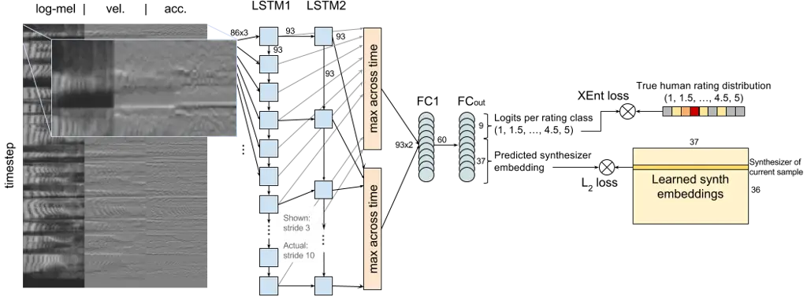
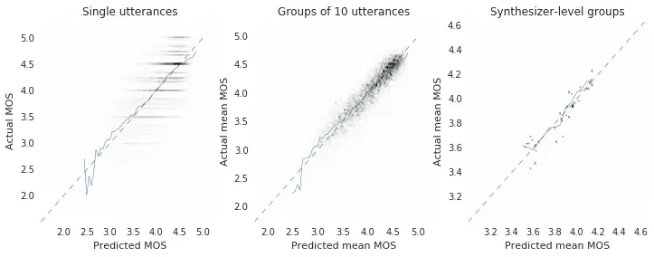
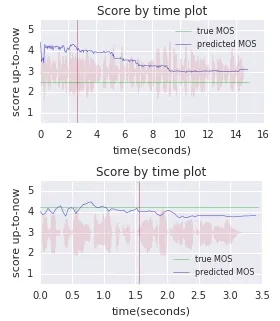

# AutoMOS: Learning a non-intrusive assessor of naturalness-of-speech

Brian Patton Email: [bjp@google.com](mailto:)    Yannis Agiomyrgiannakis
Email: [agios@google.com](mailto:)    Michael Terry
Email: [michaelterry@google.com](mailto:)    Kevin Wilson
Email: [kwwilson@google.com](mailto:)    Rif A. Saurous
Email: [rif@google.com](mailto:)    D. Sculley
Email: [dsculley@google.com](mailto:)

###### Abstract

Developers of text-to-speech synthesizers (TTS) often make use of human
raters to assess the quality of synthesized speech. We demonstrate that
we can model human raters’ mean opinion scores (MOS) of synthesized
speech using a deep recurrent neural network whose inputs consist solely
of a raw waveform. Our best models provide utterance-level estimates of
MOS only moderately inferior to sampled human ratings, as shown by
Pearson and Spearman correlations. When multiple utterances are scored
and averaged, a scenario common in synthesizer quality assessment,
AutoMOS achieves correlations approaching those of human raters. The
AutoMOS model has a number of applications, such as the ability to
explore the parameter space of a speech synthesizer without requiring a
human-in-the-loop.

   

|     |
| --- |
|     |

## 1 Introduction

To evaluate changes to text-to-speech (TTS) synthesizers, human raters
are often employed to assess the synthesized speech. Multiple human
ratings of an audio sample contribute to a mean opinion score (MOS). MOS
has been crowdsourced with specific attention to rater quality by
\[12\]. While crowdsourcing introduces a degree of parallelism to the
rating process, it is still relatively costly and time-consuming to
obtain MOS for TTS quality testing.

Numerous systems have been produced to algorithmically produce objective
assessments of audio quality approximating the subjective human
assessment, including some which assess speech quality. For example, MCD
\[8\], PESQ \[13\] and POLQA \[6\] target this particular space. These
are intrusive assessors in that they assume the presence of an
undistorted reference signal to facilitate comparisons when deriving
ratings, something that does not exist in the case of the synthesized
speech of TTS. Non-intrusive assessments such as ANIQUE \[7\], LCQA
\[3\] and P. 563 \[9\] have been proposed to evaluate speech quality
where this reference signal is not available. Much research in quality
assessment is targeted at telephony, with emphasis on detecting
distortions and other artifacts introduced by lossy compression and
transmission.

Throughout this work, a synthesizer constitutes a snapshot of the
evolving implementation of a unit selection synthesis algorithm and a
continually growing corpus of recorded audio, combined with a specific
set of synthesis/cost parameters. When we partition or aggregate data by
synthesizer, we take all utterances from a given synthesizer and
allocate them en masse to a single training or evaluation fold, or to a
single aggregate metric, e.g. synthesizer-level mean MOS.

In \[10\], the authors used human ratings to improve the correlation
between MOS and unit selection TTS cost. Similarly, \[1, 11\] explore
means of tuning cost functions to incorporate subjective preferences.
Such works consider direct optimization of synthesizer MOS as a function
of synthesizer parameters (e.g. cost function weights). In prior
unpublished work we trained similar models and found they could exceed
0.9 Spearman rank correlation between true and estimated synthesizer
MOS. However, any modifications to parameter semantics or engine
internals render this mapping invalid. It is desirable to learn a
synthesizer assessment which operates independently of engine internals,
directly assessing pools of TTS waveforms.

We demonstrate that deep recurrent networks can model
naturalness-of-speech MOS ratings produced by human raters for TTS
synthesizer evaluation, using only raw audio waveform as input. We
explore a variety of deep recurrent architectures, to incorporate
long-term time dependencies. Our tuned AutoMOS model achieves a Spearman
rank correlation of 0.949, ranking 36 different synthesizers. (Sampling
a single human rating for each utterance yields a Spearman correlation
of 0.986.) When evaluating the calibration of AutoMOS on multiple
utterances with similar predicted MOS, we find five-fold median
correlations \> 0.9 and MSE competitive with sampled human ratings, even
when we quantize the predicted utterance MOS to the 0.5 increments of
the human rater scale. Such results open the door for scalable,
automated tuning and continuous quality monitoring of TTS engines.

## 2 Model & Results

Because audio data is of varying length for each example, either
directly pooling across the time dimension or the use of recurrent
neural networks (RNN) is suggested. To encode the intuition that
valuable information exists at relatively large time-scales (consider
phone or transition duration or inflection, which may vary according to
context), we opt to explore a family of RNN models.

In particular, we test a family of models that layer one or more
fully-connected layers atop the time-pooled outputs of a stack of
recurrent Long Short-Term Memory \[4, LSTM;\] cells. The timeseries
input to the LSTM is either a log-mel spectrogram or a time-pooled
convolution as in \[5\], in each case over a 16kHz waveform. We consider
the addition of single frame velocity and acceleration components to
this timeseries. The final LSTM layer’s outputs are max-pooled across
time, and fed as inputs to the fully-connected hidden layers which
compute final regression values. We explored a means of inducing
learning across longer timeframes (a stacked LSTM where deeper layers
use a stride of 2 or more timesteps over the outputs of of lower-level
LSTM layers), but found performance comparable to that of a simpler
stacked or single-layer LSTM. Max-pooling non-final LSTM layers’ outputs
and adding skip connections to the final hidden layers was not found to
improve performance.

Figure 1: Diagram of the best performing AutoMOS network

We explore multiple modes of predicting and training over input
waveforms $`x`$: (1) predict sufficient statistics $`\mu(x),\sigma(x)`$
and train on log-likelihood of individual human ratings $`r_{i}`$ under
Gaussian $`\log p(r_{i}|\mu(x),\sigma(x))`$, (2) predict $`MOS(x)`$ and
train on utterance-level L2 loss $`(MOS(x)-MOS_{true})^{2}`$, and (3)
predict $`logits(x)`$ and train on cross-entropy between the true
9-category distribution of human ratings and $`\Cat(logits(x))`$
per-utterance. We train a separate set of outputs with a learned
embedding of the ground-truth synthesizer, providing both regularization
and gradients to the training process. Embeddings are initialized
randomly; both the embedding and the prediction thereof receive a
gradient (toward each other) in each training step. The best performing
model is illustrated in Figure 1.

All models were trained with Adagrad on batches of 20 examples
asynchronously across 10 workers. We use five-fold cross-validation to
evaluate the best found set of hyperparameters, with all utterances for
any given synthesizer appearing exclusively in a single fold.

### Data

We use a corpus of TTS naturalness scores acquired over multiple years
across multiple instances of quality testing for Google’s TTS engines.
All tests are iterations on a single English (US) voice used across
multiple products. Raters scored each utterance given a 5-point Likert
scale for naturalness, in half-point increments. We partition training
data from holdout data such that all utterances for a given synthesizer
are in the same partition. The data includes 168,086 ratings across
47,320 utterances generated by 36 synthesizers. The utterance quantity
per synthesizer varies from 64 to 4800:
,
in log-scale.

### Hyperparameter Tuning

We used Google Cloud’s HyperTune to explore a set of hyperparameters
shown in Table 1. About 2 in 3 top-performing tuning runs used the
cross-entropy categorical training mode. The top 10 configurations we
found had eval-set Pearson correlations between utterance-level
predicted and true MOS ranging from 0.56-0.61 after 20,000 training
steps. When we constrained the search space to those models using
convolution+pooling based timeseries (as opposed to log-mel), we found
weaker best eval-set correlations around 0.48. This could indicate there
is little value in the sample-level details when dealing in synthesized
speech, or could signal insufficient training data. While \[14\]
reported gammatone-like learned filter banks, their speaker-independent
ASR covers a much wider range of voices, and we did not observe a
similar set of emergent filters from random initialization.
Initialization with gammatone filters yielded only nominal improvements
in performance (r=0.51).

Relative to a simple L2 loss to the true MOS, we observed little benefit
from training a Gaussian predictor against individual ratings. The
estimated variance was typically higher than the true sample variance
for a given utterance. Using a simpler L2 loss against the true MOS
provided for faster training and convergence, allowing us to try a wider
variety of structural changes. Treating predictions as categorical and
using a cross-entropy loss slightly outperformed the L2 construction in
the top tuning runs (0.61 categorical vs. 0.58 L2). The categorical form
gives AutoMOS more weights and hence a greater capacity near the output
layer.

|                                             |                         |                    |
| ------------------------------------------- | ----------------------- | ------------------ | -------------- | ----------- |
| Description                                 | Range explored          | Best Performer     |
|                                             |                         | (Pearson r = 0.61) |
| Learning rate; decay / 1000 steps           | 0.0001 - 0.1; 0.9 - 1.0 | 0.057; 0.94        |
| L1; L2 regularization                       | 0.0 - 0.001             | 1.4e-5; 2.6e-5     |
| Loss strategy                               | L2 $`                   | `$ cross-entropy   | cross-entropy  |
| Synthesizer regression embedding dim        | 0 - 50                  | 37                 |
| Timeseries type                             | log-mel $`              | `$ pooled conv1d   | log-mel        |
| Timeseries width (# mel bins, conv filters) | 20 - 100                | 86                 |
| Timeseries 1-step derivatives               | (none) $`               | `$ vel. $`         | `$ vel. + acc. | vel. + acc. |
| LSTM layer width; depth                     | 20 - 100; 1 - 10        | 93; 2              |
| LSTM timestep stride at non-0th layers      | 1 - 10                  | 10                 |
| LSTM layers feeding hidden layer inputs     | all $`                  | `$ last            | all            |
| Post-LSTM hidden layer width; depth         | 20 - 200; 0 - 2         | 60; 1              |

Table 1: Model Hyperparameters

### Evaluation

As simple baselines for comparison, we consider (1) a bias-only model
which always predicts the mean of all observed utterances’ MOS and (2) a
small nonlinear model which takes only utterance length as input (two
10-unit hidden layers with rectified linear activation), with the
intuition that a longer utterance includes more opportunities to make
mistakes deemed unnatural. We draw one human rating for each utterance
and show this comparison as a "Sample human rating" column.

If errors are unbiased, an increased sample size should reduce error. We
sort utterances by predicted MOS and evaluate correlations between
$`\mathbb{E}_{group}(MOS_{predicted})`$ and
$`\mathbb{E}_{group}(MOS_{true})`$ (where $`\mathbb{E}`$ is the expected
value operator) on groupings of 10 or more utterances with adjacent
predicted MOS in a similar fashion to a calibration plot. We show such
plots in Figure 2.

Figure 2: Left: Calibration plots (including all eval folds of AutoMOS):
Green represents perfect calibration; blue plots
$`(\mathbb{E}_{w}(MOS_{predicted})`$, $`\mathbb{E}_{w}(MOS_{true}))`$
within 0.05 windows $`w`$ along the x-axis. Right: Samples from
score-over-time animations. Visit [goo.gl/cnQbSn](http://goo.gl/cnQbSn)
to view.

How well can we rank synthesizers relative to one another? To perform
this evaluation, we use the above five-fold cross validation to predict
a MOS for each utterance using the AutoMOS instance from which it was
held-out. We then average at the synthesizer-level, giving us a total of
36
$`\mathbb{E}_{synth}(MOS_{predicted}),\mathbb{E}_{synth}(MOS_{true})`$
pairs upon which we evaluate. Results shown in Table 2.

|                                                             |           |                   |         |                                                              |                      |
| ----------------------------------------------------------- | --------- | ----------------- | ------- | ------------------------------------------------------------ | -------------------- |
|                                                             | Baselines |                   | AutoMOS |                                                              | Ground-truth         |
| Metric / Model                                              | Bias-only | NNet(utt. length) | Raw     | Quantized¹¹ 1 utterance scores from 1-5 in increments of 0.5 | Sample human rating1 |
| Utterance-level ($`n_{fold}={6000,6424,6624,12348,15924}`$) |           |                   |         |                                                              |                      |
| RMSE                                                        | 0.618     | 0.553             | 0.462   | 0.483                                                        | 0.512                |
| Pearson r                                                   | $`-`$     | 0.454             | 0.668   | 0.638                                                        | 0.764                |
| Spearman r                                                  | $`-`$     | 0.399             | 0.667   | 0.636                                                        | 0.757                |
| 10 utterance means ($`n_{fold}={600,643,663,1235,1593}`$)   |           |                   |         |                                                              |                      |
| RMSE                                                        | 0.203     | 0.213             | 0.172   | 0.171                                                        | 0.358                |
| Pearson r                                                   | $`-`$     | 0.812             | 0.930   | 0.933                                                        | 0.962                |
| Spearman r                                                  | $`-`$     | 0.657             | 0.925   | 0.925                                                        | 0.956                |
| Synthesizer-level means ($`n={36}`$; uses all folds)        |           |                   |         |                                                              |                      |
| RMSE                                                        | 0.252     | 0.132             | 0.073   | 0.075                                                        | 0.034                |
| Pearson r                                                   | $`-`$     | 0.795             | 0.938   | 0.935                                                        | 0.987                |
| Spearman r                                                  | $`-`$     | 0.679             | 0.949   | 0.947                                                        | 0.986                |

Table 2: RMSE and correlation results (reflecting median fold, except as
indicated)

## 3 Discussion

AutoMOS tends to avoid very-high or very-low predictions, likely
reflecting the distribution of the training data. It also seems to learn
patterns in the data around certain common "types" of utterances which
usually achieve high ("OK, setting your alarm") or low MOS (reading
dictionary definitions). It’s possible that different distributions of
texts per synthesizer could yield easily predictable differences in
synthesizer-MOS. A future improvement would be predicting MOS for the
raw text and evaluating the advantage of an utterance relative to this
baseline. In \[10\], naturalness is predictable from unit selection
costs; here, we want to remove the predictive baseline of the text.

We have begun tuning a TTS engine using AutoMOS. Subsequent human
evaluations will provide concrete results on the model and evaluation
criteria we’ve selected. Similarly, we will experiment with the system
for continuous quality testing of a large-scale TTS deployment. It may
be possible to leverage AutoMOS to do stratified sampling of utterances
to send to human raters. This would allow raters to focus energy more
evenly across the quality spectrum.

To probe what’s been learned, we have explored artificial truncation, as
in Figure 2 (right). Methods like layerwise relevance propagation \[2\]
or activation difference propagation \[15\] have shown promise with
image models, and could be interesting to apply to a unit selection cost
function.

## References

- \[1\] Alías, F., Formiga, L., and Llora, X. (2011). Efficient and
  reliable perceptual weight tuning for unit-selection text-to-speech
  synthesis based on active interactive genetic algorithms: A
  proof-of-concept. Speech Communication, 53(5):786–800.
- \[2\] Binder, A., Bach, S., Montavon, G., Müller, K.-R., and Samek, W.
  (2016). Layer-wise relevance propagation for deep neural network
  architectures. In Information Science and Applications (ICISA) 2016,
  pages 913–922. Springer.
- \[3\] Grancharov, V., Zhao, D. Y., Lindblom, J., and Kleijn, W. B.
  (2006). Non-intrusive speech quality assessment with low computational
  complexity. In INTERSPEECH.
- \[4\] Hochreiter, S. and Schmidhuber, J. (1997). Long short-term
  memory. Neural computation, 9(8):1735–1780.
- \[5\] Hoshen, Y., Weiss, R. J., and Wilson, K. W. (2015). Speech
  acoustic modeling from raw multichannel waveforms. In 2015 IEEE
  International Conference on Acoustics, Speech and Signal Processing
  (ICASSP), pages 4624–4628. IEEE.
- \[6\] ITU-T (2011). P. 863, Perceptual objective listening quality
  assessment (POLQA). International Telecommunication Union, CH-Geneva.
- \[7\] Kim, D.-S. (2005). ANIQUE: An auditory model for single-ended
  speech quality estimation. IEEE Transactions on Speech and Audio
  Processing, 13(5):821–831.
- \[8\] Kubichek, R. (1993). Mel-cepstral distance measure for objective
  speech quality assessment. In Communications, Computers and Signal
  Processing, 1993., IEEE Pacific Rim Conference on, volume 1, pages
  125–128. IEEE.
- \[9\] Malfait, L., Berger, J., and Kastner, M. (2006). P. 563: The
  ITU-T standard for single-ended speech quality assessment. IEEE
  Transactions on Audio, Speech, and Language Processing,
  14(6):1924–1934.
- \[10\] Peng, H., Zhao, Y., and Chu, M. (2002). Perpetually optimizing
  the cost function for unit selection in a TTS system with one single
  run of MOS evaluation. In INTERSPEECH.
- \[11\] Pobar, M., Martincic-Ipsic, S., and Ipsic, I. (2012).
  Optimization of cost function weights for unit selection speech
  synthesis using speech recognition. Neural Network World, 22(5):429.
- \[12\] Ribeiro, F., Florêncio, D., Zhang, C., and Seltzer, M. (2011).
  Crowdmos: An approach for crowdsourcing mean opinion score studies. In
  2011 IEEE International Conference on Acoustics, Speech and Signal
  Processing (ICASSP), pages 2416–2419. IEEE.
- \[13\] Rix, A. W., Beerends, J. G., Hollier, M. P., and Hekstra, A. P.
  (2001). Perceptual evaluation of speech quality (PESQ)-a new method
  for speech quality assessment of telephone networks and codecs. In
  Acoustics, Speech, and Signal Processing, 2001.
  Proceedings.(ICASSP’01). 2001 IEEE International Conference on,
  volume 2, pages 749–752. IEEE.
- \[14\] Sainath, T. N., Weiss, R. J., Senior, A., Wilson, K. W., and
  Vinyals, O. (2015). Learning the speech front-end with raw waveform
  CLDNNs. In Proc. Interspeech.
- \[15\] Shrikumar, A., Greenside, P., Shcherbina, A., and Kundaje, A.
  (2016). Not just a black box: Learning important features through
  propagating activation differences. arXiv preprint arXiv:1605.01713.
