# Learning Latent Representations for Speech Generation and Transformation

###### Abstract

An ability to model a generative process and learn a latent
representation for speech in an unsupervised fashion will be crucial to
process vast quantities of unlabelled speech data. Recently, deep
probabilistic generative models such as Variational Autoencoders (VAEs)
have achieved tremendous success in modeling natural images. In this
paper, we apply a convolutional VAE to model the generative process of
natural speech. We derive latent space arithmetic operations to
disentangle learned latent representations. We demonstrate the
capability of our model to modify the phonetic content or the speaker
identity for speech segments using the derived operations, without the
need for parallel supervisory data.

Wei-Ning Hsu, Yu Zhang, James Glass

Computer Science and Artificial Intelligence Laboratory  
Massachusetts Institute of Technology  
Cambridge, MA 02139, USA

{wnhsu,yzhang87,jrg}@csail.mit.edu

Index Terms: unsupervised learning, variational autoencoder, speech
generation, speech transformation, voice conversion

## 1 Introduction

Speech waveforms have complex distributions that exhibit high variance
due to factors that include linguistic content, speaking style, dialect,
speaker identity, emotional state, environment, channel effects, etc.
Understanding the influence of these factors on the speech signal is an
important problem, which can be used for a wide variety of applications,
including, but not limited to adaptation and data augmentation for
speech recognition \[1, 2\], voice conversion \[3, 4, 5\], and speech
compression \[6\]. However, most previous research has focused on
handcrafting features to capture these factors, rather than learning
these factors automatically through a probabilistic generative process.

Recently, there has been significant interest in deep probabilistic
generative models, such as Variational Autoencoders (VAEs) \[7\] and
Generative Adversarial Nets (GANs) \[8\]. Particularly, VAE addresses
the intractability issue that occurs in even moderately complicated
models such as Restricted Boltzmann machines (RBMs), which have been
applied for voice conversion \[9, 10, 11\], and provides efficient
approximated posterior inference of the latent factors. While there are
many works investigating generative models for natural images \[12,
13\], little work has been done on learning speech generation with deep
probabilistic generative models \[14, 15\].

In this paper, we adopt the VAE framework and propose a convolutional
architecture to model the probabilistic generative process of speech to
learn a latent representation. We present simple arithmetic operations
in the latent space to demonstrate that such operations can decompose
the latent representation into different attributes, such as speaker
identity and linguistic content. By manipulating the latent
representation, we also demonstrate an ability to perturb some aspect of
the surface speech segment, for example the speaker identity, while
keeping the remaining attributes fixed (e.g., linguistic content). To
quantify the behavior of the latent representation modifications, an
experiment is conducted to measure our ability to modify speaker
characteristics without changing linguistic content, and vice versa. In
addition, we perform an analysis to evaluate the model’s ability to
generate speech segments of different durations.

The rest of the paper is organized as follows. In Section 2, we briefly
discuss related work. Our models and an analysis of latent
representations are detailed in Section 3 and 4. Data preparation is
explained in Section 5. In Section 6, we show the experimental results.
Finally, we conclude our work and discuss our future research plans on
this topic in Section 7.

## 2 Related Work

Recent research on speech and audio generation has made remarkable
progress on directly utilizing time-domain speech signals.
WaveNet \[16\] introduces the one-dimensional dilated causal
convolutional model, where the effective receptive field grows
exponentially wide with the depth by using exponentially growing
dilation factors with the depth. A different model called
SampleRNN \[17\] presented a multi-scale recurrent neural network, where
each layer is operated at different clock rates and each sample is
generated conditioned on all the previous samples. Both models focused
on generating high quality audio segments by predicting the next sample
given the preceding samples, instead of learning latent representations
for the entire audio segments using probabilistic generative models.

While VAEs have been widely applied for image generation, there has been
less speech research on this topic. A VAE-based framework was used in
\[18\] to extract both frame-level and utterance-level features that
were used in combination with other features for robust speech
recognition. A fully-connected VAE was used in \[14\] to learn a
frame-level latent representation, and evaluated using a Gaussian
diffusion process to generate and concatenate multiple samples that
varied smoothly in time.

## 3 Model

### 3.1 Variational Autoencoder

Variational autoencoders \[7\] define a probabilistic generative process
between observation $`\bm{x}`$ and latent variable $`\bm{z}`$ as
follows: $`\bm{z}\sim p_{\bm{\theta}^{*}}(\bm{z})`$ and
$`\bm{x}\sim p_{\bm{\theta}^{*}}(\bm{x}|\bm{z})`$, where the prior
$`p_{\bm{\theta}^{*}}(\bm{z})`$ and the conditional likelihood
$`p_{\bm{\theta}^{*}}(\bm{x}|\bm{z})`$ are from a probability
distribution family parameterized by $`\bm{\theta}`$. In an unsupervised
setting, we are only given a dataset
$`\bm{X}=\{\bm{x}^{(i)}\}_{i=1}^{N}`$, so the true value of
$`\bm{\theta^{*}}`$, as well as the latent variable $`\bm{z}`$ for each
observation $`\bm{x}`$ in this process are unknown.

We are often interested in knowing the marginal likelihood of the data
$`p_{\bm{\theta}}(\bm{x})`$, or the posterior
$`p_{\bm{\theta}}(\bm{z}|\bm{x})`$; however, both require computing the
intractable integral
$`\int p_{\bm{\theta}}(\bm{z})p_{\bm{\theta}}(\bm{x}|\bm{z})d\bm{z}`$.
To solve this problem, VAEs introduce a recognition model
$`q_{\bm{\phi}}(\bm{z}|\bm{x})`$, which approximates the true posterior
$`p_{\bm{\theta}}(\bm{z}|\bm{x})`$. We can therefore rewrite the
marginal likelihood as:

```math
\displaystyle\log p_{\bm{\theta}}(\bm{x})=D_{KL}(q_{\bm{\phi}}(\bm{z}|\bm{x})||p_{\bm{\theta}}(\bm{z}|\bm{x}))+\mathcal{L}(\bm{\theta},\bm{\phi};\bm{x})
```

```math
\displaystyle\geq\mathcal{L}(\bm{\theta},\bm{\phi};\bm{x})
```

```math
\displaystyle=-D_{KL}(q_{\bm{\phi}}(\bm{z}|\bm{x})||p_{\bm{\theta}}(\bm{z}))+\mathbb{E}_{q_{\bm{\phi}}(\bm{z}|\bm{x})}[\log p_{\bm{\theta}}(\bm{x}|\bm{z})], \tag{1}
```

where $`\mathcal{L}(\bm{\theta},\bm{\phi};\bm{x})`$ is the variational
lower bound we want to optimize with respect to $`\bm{\theta}`$ and
$`\bm{\phi}`$.

In the VAE framework we consider here, both the recognition model
$`q_{\bm{\phi}}(\bm{z}|\bm{x})`$ and the generative model
$`p_{\bm{\theta}}(\bm{x}|\bm{z})`$ are parameterized using diagonal
Gaussian distributions, of which the mean and the covariance are
computed with a neural network. The prior is assumed to be a centered
isotropic multivariate Gaussian
$`p_{\bm{\theta}}(\bm{z})=\mathcal{N}(\bm{z};\bm{0},\bm{I})`$, that has
no free parameters.

In practice, the expectation in (1) is approximated by first drawing
$`L`$ samples from $`\bm{z}^{l}\sim q_{\bm{\phi}}(\bm{z}|\bm{x})`$, and
then computing
$`\mathbb{E}_{q_{\bm{\phi}}(\bm{z}|\bm{x})}[\log p_{\bm{\theta}}(\bm{x}|\bm{z})]\simeq\frac{1}{L}\sum_{l=1}^{L}\log p_{\bm{\theta}}(\bm{x}|\bm{z}^{l})`$.
To yield a differentiable network after sampling, the reparameterization
trick \[7\] is used. Suppose
$`\bm{z}\sim\mathcal{N}(\bm{z};\bm{\mu_{z}},\bm{\sigma_{z}}^{2}\bm{I})`$,
after reparameterizing we have
$`\bm{z}=\bm{\mu_{z}}+\bm{\sigma_{z}}\odot\bm{\epsilon}`$, where
$`\odot`$ denotes an element-wise product, and vector $`\bm{\epsilon}`$
is sampled from $`\mathcal{N}(\bm{0},\bm{I})`$ and treated as an
additional input.

### 3.2 Proposed Model Architecture

In this work, our goal is to learn latent representations of speech
segments to model the generation process. We let the observed data
$`\bm{x}`$ be a sequence of frames of fixed length. The learned latent
variable $`\bm{z}`$ is therefore supposed to encode the factors that
result in the variability of speech segments, such as the content being
spoken, speaker identity, and channel effect.

As mentioned earlier, a VAE is composed of two networks: a recognition
network, and a generative network. The recognition network takes a
speech segment as input and predicts the mean $`\bm{\mu_{z}}`$ and the
log-variance $`\log\bm{\sigma_{z}}^{2}`$ that parameterize the posterior
distribution $`q_{\bm{\phi}}(\bm{z}|\bm{x})`$. A speech segment is
treated as a two dimensional image of width $`T`$ and height $`F`$;
however, unlike natural images, speech segments are only translational
invariant to the time axis. Therefore, similar to \[19\], 1-by-$`F`$
filters are applied at the first convolutional layer, and $`w`$-by-1
filters at following layers. As suggested in \[12\], instead of pooling,
we use stride size $`>1`$ for down-sampling along the time axis. The
output from the last convolutional layer is flattened and fed into fully
connected layers before going to the Gaussian parameter layer modeling
the latent variable $`\bm{z}`$. See Table 1 for a summary.

The generative network takes sampled $`\bm{z}`$ as input, and predicts
the mean $`\bm{\mu_{x}}`$ as well as the log-variance
$`\log\bm{\sigma_{x}}^{2}`$ of the observed data. Here we use symmetric
architectures to the corresponding recognition network.

|                 | Conv1   | Conv2 | Conv3 | Fc1 | Gauss |
| --------------- | ------- | ----- | ----- | --- | ----- |
| \#filters/units | 64      | 128   | 256   | 512 | 128   |
| filter size     | 1x$`F`$ | 3x1   | 3x1   | -   | -     |
| stride          | (1,1)   | (2,1) | (2,1) | -   | -     |

Table 1: Recognition network architecture. Conv refers to convolutional
layers, Fc refers to fully connected layers, and Gauss refers to the
Gaussian parametric layer modeling $`\bm{z}`$

Different choices for the activation function were investigated. No
activation is applied to Gaussian parameter layers, since the mean and
the log-variance are unbounded for both $`\bm{x}`$ and $`\bm{z}`$. For
other layers, we use $`\tanh`$ because the unbounded rectifier linear
units led to overflow of the KL-divergence and conditional likelihood.
Batch normalization is applied to every layer except for the Gaussian
parameter layer.

## 4 Latent Representation Analysis

In this section, we examine how to decompose speech attributes from the
learned latent representations. Here, we use $`a`$ to denote the
attribute and $`r`$ to denote the value of the attribute.

### 4.1 Deriving Latent Attribute Representations

The first assumption we make is that conditioning on some attribute
$`a`$ being $`r`$, such as the phone being /ae/, the prior distribution
of $`\bm{z}`$ is also a Gaussian; in other words,
$`p(\bm{z};a=r)=N(\bm{z};\bm{\mu}_{r},\bm{\Sigma}_{r})`$. We therefore
define $`\bm{\mu}_{r}`$ as the latent attribute representation for
$`r`$. Let $`\bm{X}_{r}=\{\bm{x}_{r}^{(i)}\}_{i=1}^{N_{r}}`$ be a subset
of $`\bm{X}`$ where the attribute $`a`$ of each instance is $`r`$. We
can then estimate $`\bm{\mu}_{r}`$ as follows:

```math
\displaystyle\bm{\mu}_{r} \displaystyle=\mathbb{E}_{p_{\theta}(\bm{z};r)}[\bm{z}]=\int_{\bm{z}}\int_{\bm{x}}\bm{z}p_{\theta}(\bm{z}|\bm{x};r)p_{\theta}(\bm{x};r)
```

```math
\displaystyle\approx\int_{\bm{z}}\int_{\bm{x}}\bm{z}q_{\bm{\phi}}(\bm{z}|\bm{x};r)p_{\bm{\theta}}(\bm{x};r)\approx\frac{1}{N_{r}}\sum_{i=1}^{N_{r}}\int_{z}\bm{z}q_{\phi}(\bm{z}|\bm{x}_{r}^{(i)})
```

```math
\displaystyle\approx\dfrac{1}{N_{r}}\sum_{i=1}^{N_{r}}(\dfrac{1}{J}\sum_{j=1}^{J}\bm{z}^{(i,j)}), \tag{2}
```

where $`\bm{z}^{(i,j)}\sim q_{\bm{\phi}}(\bm{z}|\bm{x}_{r}^{(i)})`$.
This results in averaging the $`J`$ sampled latent representations of
each instance in $`\bm{X}_{r}`$. Furthermore, let
$`\bar{\bm{z}}=\frac{1}{N}\sum_{i=1}^{N}\bm{z}_{i}`$, since
$`p(\bm{z})`$ is a log-concave function, it is guaranteed that
$`p(\bar{\bm{z}})>\min_{\bm{z}_{i}}p(\bm{z}_{i})`$. Therefore VAE should
be able to generate reasonable speech-like segment from $`\bar{\bm{z}}`$
if all the $`p(\bm{z}_{i})`$ have high values.

### 4.2 Arithmetic Operations to Modify Speech Attributes

Here we make the second assumption: let there be $`K`$ independent
attributes that affect the realization of speech, each attribute
$`a_{k}`$ is then modeled using a subspace $`\mathit{Z}_{a_{k}}`$, where
$`\mathit{Z}=\cup_{k=1}^{K}\mathit{Z_{a_{k}}}`$ and
$`\mathit{Z}_{a_{k}}\perp\mathit{Z}_{a_{k^{\prime}}}`$ if
$`k\neq k^{\prime}`$. Hence, the latent representation can be decomposed
into $`K`$ orthogonal latent attribute representations
$`\bm{z}_{a_{1}},\bm{z}_{a_{2}},\cdots,\bm{z}_{a_{k}}`$, where
$`\bm{z}_{a_{k}}\in\mathit{Z}_{a_{k}}`$ and
$`\bm{z}=\sum_{k=1}^{K}\bm{z}_{a_{k}}`$. Combining the aforementioned
assumption of the conditioned prior of $`\bm{z}`$, we can next derive
the latent space arithmetic operations to modify the speech attributes.

Suppose we want to modify the attribute $`a_{k}`$, for example the
speaker identity, of a speech segment $`\bm{x}^{(i)}`$, from being
speaker $`r_{s}`$ to being speaker $`r_{t}`$. Given the latent attribute
representations $`\bm{\mu}_{r_{s}}`$ and $`\bm{\mu}_{r_{t}}`$ for
speaker $`r_{s}`$ and $`r_{t}`$ respectively, the latent attribute shift
$`\bm{v}_{r_{s}\rightarrow r_{t}}`$ is computed as:
$`\bm{v}_{r_{s}\rightarrow r_{t}}=\bm{\mu}_{r_{t}}-\bm{\mu}_{r_{s}}`$.
We can then modify the speech $`\bm{x}^{(i)}`$ as follows:

```math
\displaystyle\bm{z}^{(i)} \displaystyle\sim q_{\bm{\phi}}(\bm{z}|\bm{x}^{(i)}) \tag{3}
```

```math
\displaystyle\bm{z}_{mod}^{(i)} \displaystyle=\bm{z}^{(i)}+\bm{v}_{r_{s}\rightarrow r_{t}} \tag{4}
```

```math
\displaystyle\bm{x}_{mod}^{(i)} \displaystyle\sim p_{\bm{\theta}}(\bm{x}|\bm{z}_{mod}^{(i)}), \tag{5}
```

which does not modify latent attribute representations other than
$`\bm{z}_{a_{k}}^{(i)}`$, because
$`\bm{v}_{r_{s}\rightarrow r_{t}}\perp\bm{z}_{a_{k^{\prime}}}^{(i)}`$
for $`k^{\prime}\neq k`$.

## 5 Data

### 5.1 TIMIT

The TIMIT acoustic-phonetic corpus \[20, 21\] contains broadband
recordings of phonetically-balanced read speech. A total of 6300
utterances (5.4 hours) are presented with 10 sentences from each of 630
speakers, of which approximately 70% are male and 30% are female. Each
utterance comes with manually time-aligned phonetic and word
transcriptions, as well as a 16-bit, 16kHz speech waveform file. We
follow Kaldi’s TIMIT recipe to split train/dev/test sets and exclude
dialect sentences (SA), with 462/50/24 non-overlapping speakers in each
set respectively. Phonetic transcriptions are based on 58 phones,
excluding silence phones.

### 5.2 Data Preprocessing

We consider two types of frame representations: magnitude spectrum in dB
(Spec) and filter banks (FBank). For both features, we first apply a
25ms Hanning window with 10ms shift, and then compute the short time
Fourier transform coefficients with flooring at -20dB. For FBank
features, 80 Mel-scale filter banks that match human perceptual
sensitivity are applied, which preserves more detail at lower frequency
regions.

We investigate two different segment lengths: 200ms and 1s, which
correspond to 20 frames and 100 frames, and are referred to as
syllable-level and word-level datasets, respectively.

## 6 Experimental Results

### 6.1 Experiment Setups

All models were trained with stochastic gradient descent using a
mini-batch size of 128 without clipping to minimize the negative
variational lower bound plus an $`L2`$-regularization with weight
$`10^{-4}`$. The Adam \[22\] optimizer is used with $`\beta_{1}=0.95`$,
$`\beta_{2}=0.999`$, $`\epsilon=10^{-8}`$, and initial learning rate of
$`10^{-3}`$. Training is terminated if the lower bound on the
development set does not improve for 10 epochs. To compare with VAE, we
also train an autoencoder (AE) with the same proposed model architecture
except for the Gaussian latent variable layer, which is replaced with a
fully-connected layer of 128 hidden units¹¹ 1 Both VAE and AE models
show reasonable reconstruction performance on both Fbank and Spec. We do
not show the reconstructed features in this section due to space
limitations..

### 6.2 Latent Attribute Representation

In Figure 1, we show the results of reconstructing from latent attribute
representations of three phones, /ae/, /th/, and /n/, using VAE and AE
respectively, based on the derivation in Section 4.1. As a baseline, we
also show the results of averaging filter bank features. The VAE
preserves more harmonic structure and clearer spectral envelope, while
the AE and the Fbank are more blurred. It is worth noting that AE also
shows unnatural frequent vertical stripe artifacts.

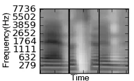

(a) VAE

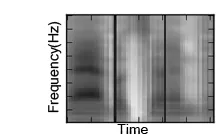

(b) AE

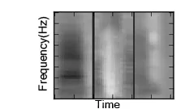

(c) Fbank

Figure 1: Comparison between VAE, AE and Fbank on averaging
representations of /ae/, /th/, and /n/ from left to right. Each segment
is 200ms long.

### 6.3 Modifying Attributes of Speech

To assess the orthogonality-between-attributes assumption, we sampled
six speakers, three males and three females, denoted by {m,f}\_spk\[i\],
and ten phones, including vowels, stops, fricatives, and nasals, to
compute three latent speaker representations and ten latent phone
representations. Figure 2 plots the cosine similarities between these
representations. From the figure, we can observe that off-diagonal
blocks have low cosine similarities, which indicates that latent speaker
representations and latent phone representations reside in orthogonal
latent subspaces. Second, different latent phone representations also
cluster according to the phonetic characteristics, which suggests the
latent phone subspace may be further divided.

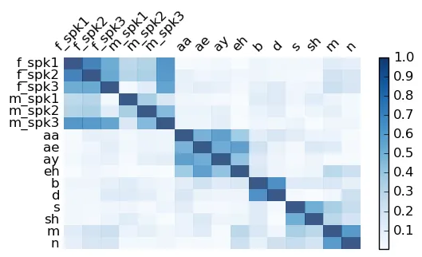

Figure 2: Cosine similarities of latent attribute representations.

We next explored modifying the phone and speaker attributes using the
derived operations in Section 4.2.²² 2 More sound examples can be found
at:
[http://people.csail.mit.edu/wnhsu/vae_speech](http://people.csail.mit.edu/wnhsu/vae_speech)
Figure 3 shows an example of drawing 10 instances of the phone /aa/ and
transforming them to /ae/ using the latent attribute shift
$`\bm{v}_{aa\rightarrow ae}`$. We can clearly observe that the second
formant $`F_{2}`$, marked with red boxes,³³ 3 Best viewed in color of
each instance goes up after modification, because it is being changed
from a back vowel to a front vowel. On the other hand, the harmonics of
each instance, which are closely related to the speaker identity,
maintain roughly the same.

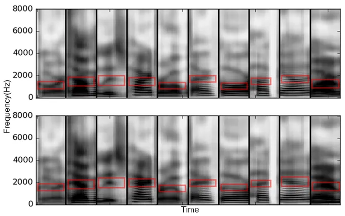

Figure 3: Modify the phone from /aa/ (top) to /ae/ (bottom). Each
segment is 200ms long.

Figure 4 illustrates modifying 10 instances from a female speaker falk0
to a male speaker madc0 with the latent attribute shift
$`\bm{v}_{falk0\rightarrow madc0}`$. The harmonics (horizontal stripes)
decrease after modification, while the spectrum envelope remains the
same, indicating that the phonetic content is not changed.

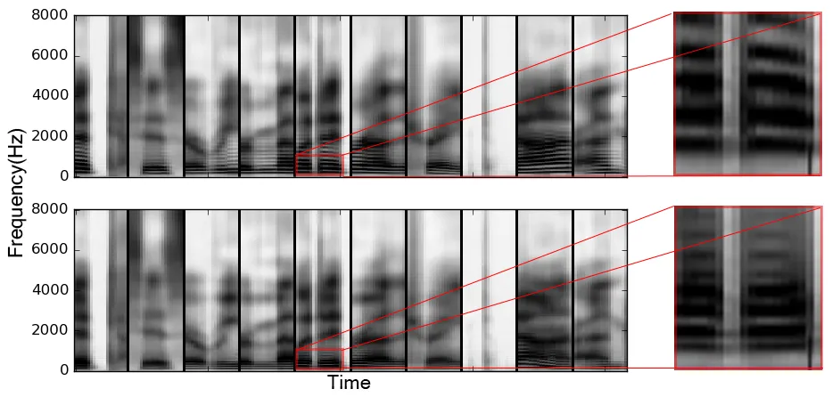

Figure 4: Modify from a female (top) to a male (bottom). Each segment is
200ms long.

In an attempt to quantify our latent attribute perturbation, we trained
convolutional phonetic and speaker classifiers so that we could measure
the difference of the posterior of each attribute before and after
modification. The 58-class phone classifier achieves a test accuracy of
$`72.2\%`$, while the 462-class speaker classifier achieves a test
accuracy of $`44.2\%`$.

The shifts in posterior distributions of the phone and speaker
classifications on the modified data are shown in Table 2. The upper
half of the table contains results for speech segments that were
transformed from /aa/ to /ae/. The first row shows that the average /aa/
posterior was $`34\%`$ while the average correct speaker posterior was
$`51\%`$. The second row shows that after modification to an /ae/, the
average phone posteriors shift dramatically to be $`30\%`$ /ae/, while
slightly degrading the average correct speaker posterior.

The lower part of the table shows the results of speech segments that
had speaker identity modified from speaker ‘falk0’ to ‘madc0’. The third
row shows an average speaker posterior of $`44\%`$ for ‘falk0’ in the
unmodified samples, while the average correct phone posterior was
$`55\%`$. After modification we see that the average speaker posterior
has shifted to be $`29\%`$ ‘madc0’ while slightly degrading the average
correct phone posterior.

|                |        |        |        |            |
| -------------- | ------ | ------ | ------ | ---------- |
| Modify Phone   |        | /aa/   | /ae/   | ori. spk.  |
|                | before | 34.06% | 0.45%  | 50.78%     |
|                | after  | 0.24%  | 29.73% | 41.66%     |
| Modify Speaker |        | falk0  | madc0  | ori. phone |
|                | before | 44.48% | 0.02%  | 54.61%     |
|                | after  | 3.11%  | 28.71% | 48.71%     |

Table 2: Average posteriors over 10 instances of source, target, and
fixed attributes before and after modification.

### 6.4 Random Sampling from the Latent Space

One of the advantages of VAEs is that the prior $`p_{\theta}(z)`$ is
assumed to be a centered isotropic Gaussian, which enables us to sample
latent vectors and reconstruct speech-like segments. Here, we
investigate the syllable-level and word-level datasets.

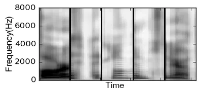

(a) Syllable-level

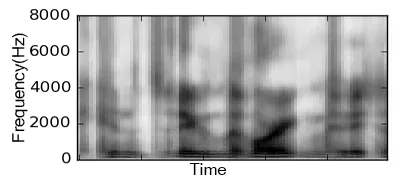

(b) Word-level

Figure 5: Random samples drawn from models trained with syllable-level
and word-level dataset. The segments in (a) are 200ms, and the segment
in (b) is 1s.

Figure 5 (a) shows five random samples from the syllable-level model,
which look and sound reasonable; however, we observe that random samples
drawn from the word-level model are less natural because of excessive
closures (vertical stripes), as shown in Figure 5 (b). The failure from
drawing random samples implies that there is discrepancy between the
assumed prior and the true prior. We hypothesize that because
per-dimension KL-divergence values are computed, and correlations among
dimensions are not penalized, the covariance matrix of the true prior
may not be diagonal. We estimate the covariance matrix of the true prior
by sampling the latent representations of the entire test set and
compute the full covariance matrix. Figure 6 compares the syllable model
and the word model on the sum of off-diagonal covariance scale for each
dimension. We can observe that the word-level model has higher
correlations between different dimensions than the syllable-level model.

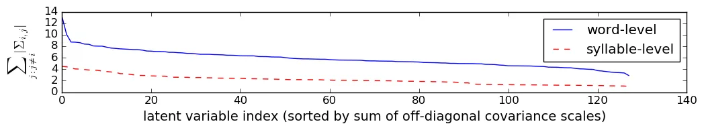

Figure 6: Comparison of sum of off-diagonal covariance scales for each
dimension for the syllable and word-level dataset.

### 6.5 Walking in the Latent Space

Finally, we explore the operation of interpolation in the latent space
between speech segments. Since $`p(\bm{z})`$ is log-concave, the
interpolated $`\bm{z}_{int}=\alpha\bm{z}_{a}+(1-\alpha)\bm{z}_{b}`$,
where $`\alpha\in[0,1]`$, would have
$`p(\bm{z}_{int})\geq\min(p(\bm{z}_{a}),p(\bm{z}_{b}))`$. Therefore it
should also generate reasonable speech-like segments. Figure 7 shows the
transition between a male /ey/ to a female /ay/ using VAE and AE
respectively. For VAE, we can clearly observe the pitch shifting and the
formant contour transforming; however for AE it is more akin to
interpolation in the raw feature space, where the magnitude of one
segment goes down as the other goes up.

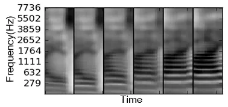

(a) VAE

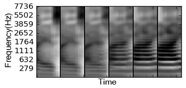

(b) AE

Figure 7: Interpolation in the latent space using VAE and AE. Each
segment is 200ms long.

## 7 Conclusions and Future Work

In this paper, we present a convolutional VAE to model the speech
generation process, and learn latent representations for speech in an
unsupervised framework. The abilities to decompose the learned latent
representations and modify attributes of speech segments are
demonstrated qualitatively and quantitatively. For future work, we plan
to extend to hierarchical recurrent models in order to capture
information at different time scales, and generate speech of variable
lengths.

## References

- \[1\] N. Jaitly and G. E. Hinton, “Vocal tract length perturbation
  (VTLP) improves speech recognition,” in _ICML workshop on Deep
  Learning for Audio, Speech, and Language Processing_, 2013.
- \[2\] X. Cui, V. Goel, and B. Kingsbury, “Data augmentation for deep
  neural network acoustic modeling,” _IEEE/ACM Trans. Audio, Speech and
  Lang. Proc._, vol. 23, no. 9, pp. 1469–1477, 2015.
- \[3\] A. Kain and M. W. Macon, “Spectral voice conversion for
  text-to-speech synthesis,” in _ICASSP_, 1998.
- \[4\] Y. Stylianou, “Voice transformation: A survey.” in
  _ICASSP_. IEEE, 2009, pp. 3585–3588.
- \[5\] T. Toda, Y. Ohtani, and K. Shikan, “Eigenvoice conversion based
  on gaussian mixture model,” in _Interspeech_, 2006, pp. 2446–2449.
- \[6\] D. Wong, B. Juang, and D. Cheng, “Very low data rate speech
  compression with LPC vector and matrix quantization,” in _Acoustics,
  Speech, and Signal Processing, IEEE International Conference on
  ICASSP’83._, vol. 8. IEEE, 1983, pp. 65–68.
- \[7\] D. P. Kingma and M. Welling, “Auto-encoding variational bayes,”
  _arXiv preprint arXiv:1312.6114_, 2013.
- \[8\] I. Goodfellow, J. Pouget-Abadie, M. Mirza, B. Xu,
  D. Warde-Farley, S. Ozair, A. Courville, and Y. Bengio, “Generative
  adversarial nets,” in _Advances in neural information processing
  systems_, 2014, pp. 2672–2680.
- \[9\] Z. Wu, E. S. Chng, and H. Li, “Conditional restricted boltzmann
  machine for voice conversion,” in _ChinaSIP_, 2013.
- \[10\] T. Nakashika, T. Takiguchi, and Y. Ariki, “Voice conversion
  using speaker-dependent conditional restricted boltzmann machine,”
  _EURASIP Journal on Audio, Speech, and Music Processing_, vol. 2015,
  no. 1, p. 8, 2015.
- \[11\] T. Nakashika, T. Takiguchi, Y. Minami, T. Nakashika,
  T. Takiguchi, and Y. Minami, “Non-parallel training in voice
  conversion using an adaptive restricted boltzmann machine,” _IEEE/ACM
  Trans. Audio, Speech and Lang. Proc._, vol. 24, no. 11, pp. 2032–2045,
  Nov. 2016.
- \[12\] A. Radford, L. Metz, and S. Chintala, “Unsupervised
  representation learning with deep convolutional generative adversarial
  networks,” _arXiv preprint arXiv:1511.06434_, 2015.
- \[13\] A. B. L. Larsen, S. K. Sønderby, H. Larochelle, and O. Winther,
  “Autoencoding beyond pixels using a learned similarity metric,” _arXiv
  preprint arXiv:1512.09300_, 2015.
- \[14\] M. Blaauw and J. Bonada, “Modeling and transforming speech
  using variational autoencoders,” _Interspeech 2016_, pp.
  1770–1774, 2016.
- \[15\] C.-C. Hsu, H.-T. Hwang, Y.-C. Wu, Y. Tsao, and H.-M. Wang,
  “Voice conversion from non-parallel corpora using variational
  auto-encoder,” in _Asia-Pacific Signal and Information Processing
  Association Annual Summit and Conference (APSIPA)_. IEEE, 2016, pp.
  1–6.
- \[16\] A. van den Oord, S. Dieleman, H. Zen, K. Simonyan, O. Vinyals,
  A. Graves, N. Kalchbrenner, A. Senior, and K. Kavukcuoglu, “Wavenet: A
  generative model for raw audio,” _CoRR abs/1609.03499_, 2016.
- \[17\] S. Mehri, K. Kumar, I. Gulrajani, R. Kumar, S. Jain, J. Sotelo,
  A. Courville, and Y. Bengio, “SampleRNN: An unconditional end-to-end
  neural audio generation model,” _arXiv preprint
  arXiv:1612.07837_, 2016.
- \[18\] S. Tan and K. C. Sim, “Learning utterance-level normalisation
  using variational autoencoders for robust automatic speech
  recognition,” in _Spoken Language Technology Workshop (SLT), 2016
  IEEE_. IEEE, 2016, pp. 43–49.
- \[19\] D. Harwath and J. R. Glass, “Learning word-like units from
  joint audio-visual analysis,” _arXiv preprint arXiv:1701.07481_, 2017.
- \[20\] J. S. Garofolo, L. F. Lamel, W. M. Fisher, J. G. Fiscus, and
  D. S. Pallett, “DARPA TIMIT acoustic-phonetic continous speech corpus
  CD-ROM. NIST speech disc 1-1.1,” _NASA STI/Recon technical report n_,
  vol. 93, 1993.
- \[21\] V. Zue, S. Seneff, and J. Glass, “Speech database development
  at MIT: TIMIT and beyond,” _Speech Communication_, vol. 9, no. 4, pp.
  351–356, 1990.
- \[22\] D. Kingma and J. Ba, “Adam: A method for stochastic
  optimization,” _arXiv preprint arXiv:1412.6980_, 2014.
