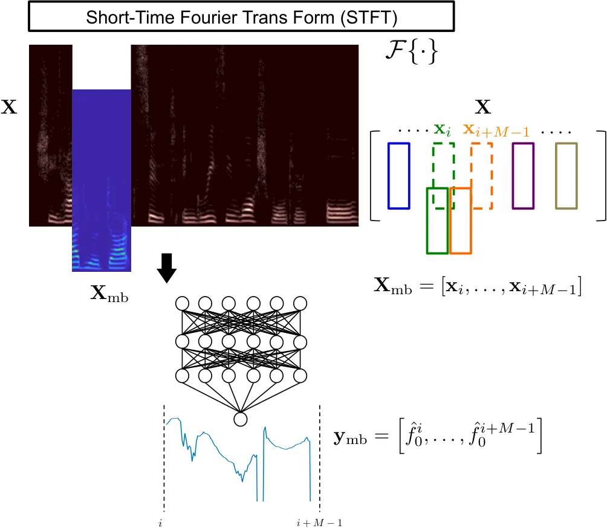
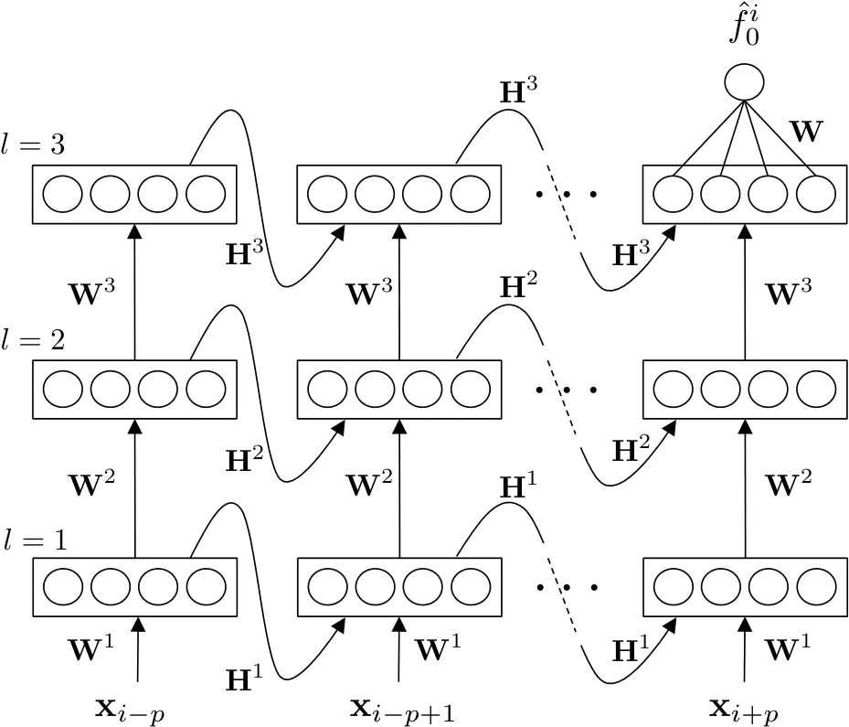

# A Regression Model of Recurrent Deep Neural Networks for Noise Robust Estimation of the Fundamental Frequency Contour of Speech

###### Abstract

The fundamental frequency ($`F0`$) contour of speech is a key aspect to
represent speech prosody that finds use in speech and spoken language
analysis such as voice conversion and speech synthesis as well as
speaker and language identification.

This work proposes new methods to estimate the $`F0`$ contour of speech
using deep neural networks (DNNs) and recurrent neural networks (RNNs).
They are trained using supervised learning with the ground truth of
$`F0`$ contours. The latest prior research addresses this problem first
as a frame-by-frame-classification problem followed by sequence tracking
using deep neural network hidden Markov model (DNN-HMM) hybrid
architecture. This study, however, tackles the problem as a regression
problem instead, in order to obtain $`F0`$ contours with higher
frequency resolution from clean and noisy speech.

Experiments using _PTDB-TUG_ corpus contaminated with additive noise
(_NOISEX-92_) show the proposed method improves gross pitch error (GPE)
by more than 25 % at signal-to-noise ratios (SNRs) between -10 dB and
+10 dB as compared with one of the most noise-robust $`F0`$ trackers,
PEFAC. Furthermore, the performance on fine pitch error (FPE) is
improved by approximately 20 % against a state-of-the-art DNN-HMM-based
approach.

|                                           |
| ----------------------------------------- |
| Akihiro Kato, Tomi Kinnunen               |
| School of Computing                       |
| University of Eastern Finland             |
| akihiro.kato@uef.fi, tomi.kinnunen@uef.fi |

Index Terms: $`F0`$ estimation, pitch estimation, prosody analysis,
voice conversion, speaker identification, language identification,
recurrent neural networks, regression model

## 1 Introduction

The _fundamental frequency_ ($`F0`$) represents the lowest frequency in
a quasi-periodic signal. In human speech production $`F0`$ is determined
by the movement of the vocal chords and the contour of $`F0`$s
represents important aspects of prosody. Therefore, $`F0`$ is one of the
key features of speech and is used in many applications including voice
conversion \[1\], speaker and language identification \[2, 3\], prosody
analysis \[4\], speech coding \[5\], speech synthesis \[6\] and speech
enhancement \[7, 8\].

Over the past decades, a variety of approaches to $`F0`$ estimation have
been proposed. Specifically, Robust Algorithm for Pitch Tracking (RAPT)
\[9\] and YIN \[10\] that exploit autocorrelation of a time-domain
signal are among the best methods to estimate $`F0`$ and have been
widely used in many applications \[11\]. However, it is well known that
these methods do not produce satisfactory results under noisy conditions
\[12\]. Several alternative robust frequency- and cepstral-domain $`F0`$
estimators have been developed. For instance, Pitch Estimation Filter
with Amplitude Compression (PEFAC) \[13\] has high performance in noisy
conditions. It analyses noisy signals in the log-frequency domain with a
matched filter and the universal long-term average speech spectrum.
Nonetheless, it is still challenging to achieve sufficient $`F0`$
estimation accuracy at low signal-to-noise ratios (SNRs) such as 0 dB
and below.

In addition to the instantaneous signal processing methods mentioned
above, various machine learning approaches that utilise generative
models, such as a Gaussian mixture model (GMM) and hidden Markov models
(HMMs) \[14, 15, 16, 17\], have been developed along with particle
filters \[18, 19\] to address the challenge related to severe noisy
conditions. In this context, models based on deep neural networks (DNNs)
have shown promising achievement in tackling the problem \[12, 20, 21\]
because of the explicit capability of DNNs for complex pattern mapping
as a discriminative model.

For classification problems, discriminative models can outperform
generative models when trained from large enough quantity of data
\[22\]. DNNs derive a discriminative model to represent arbitrarily
complex functions as long as they consist of large number of units in
their hidden layers. Consequently, they enable statistical models to
deal with higher dimensional input features having stronger correlation
than the preceding generative models. Thus, they have been successfully
applied to various speech applications showing great advantages in
performance over the existing statistical models \[23, 24, 25, 26, 27\].
Furthermore, recurrent neural networks (RNNs), in which each unit has a
connection pointing backward from its output to the input, might be more
suitable for time series signals of speech to track temporal dynamics.

In fact, the latest research have proposed DNN and RNN-based models for
$`F0`$ estimation, showing improvement in noise robustness as compared
to the conventional algorithms \[12, 20, 21, 28, 29, 30\]. These
state-of-the-art $`F0`$ estimators, however, still have a problem to be
solved: they first employ DNNs or RNNs to form a frame-by-frame
_classification_ model to decide a frequency state corresponding to
_quantised_ frequency, followed by frame-by-frame tracking to optimize
the most likely state sequence. This is achieved by utilising a hybrid
deep neural network hidden Markov model (DNN-HMM) architecture \[31\]
that has a successful history, for instance, in automatic speech
recognition (ASR) \[32\] and text-to-speech (TTS) \[6\]. Even if it is
convenient to treat $`F0`$ tracking as a classification task analogous
to speech recognition, the resulting estimated $`F0`$ contour has a
limited frequency resolution determined by the number of frequency
states. This is a potential draw-back in applications that require
high-precision $`F0`$ values, such as voice conversion, or micro-prosody
analysis for speaker and language characterisation.

To sum up our contribution, we aim at improving the state-of-the-art DNN
and RNN-based approaches to $`F0`$ estimation in terms of increased
tracking precision _and_ noise robustness, by treating the problem as a
_regression_ task instead of the DNN-HMM-based classification tasks
reviewed above. Even if our work is not the first work to address $`F0`$
tracking as a regression task where $`F0`$ values are predicted from
other speech representations \[14, 15, 16, 17\], we do improve over the
latest deep learning approaches. For maximum applicability of our
results, we treat the problem in a speaker-independent manner, and study
the sensitivity of the results under both unknown and known noise
conditions.

## 2 General framework

Before presenting our proposal in Section 3, we first review a general
framework of a DNN-based approach to $`F0`$ contour estimation. A speech
signal is first converted to a sequence of magnitude spectra by
short-time Fourier transform (STFT). A DNN-based $`F0`$ estimation model
trained by supervised learning then maps the spectral information to the
fundamental frequency contour, as illustrated in Fig. 1.



Figure 1: Overview of the DNN-based F0 estimation showing $`M`$ frames
are extracted from sequence of magnitude spectra, $`{\bf X}`$, into
mini-batch, $`{\bf X}_{\text{mb}}`$, and then mapped onto $`F0`$
contour, $`{\bf y}_{\text{mb}}`$.

Discrete time-domain speech signal, $`s(n)`$, is divided into $`I`$
frames, $`s_{0}(m),s_{1}(m),\dots,s_{I-1}(m)`$, where $`m`$ denotes time
sequence in a window function, and then transformed to the frequency
domain by STFT to derive a sequence of magnitude spectra, $`{\bf X}`$ as

```math
\displaystyle{\bf X} \displaystyle= \displaystyle\left[{\bf x}_{0},{\bf x}_{1},\dots,{\bf x}_{I-1}\right] \tag{1}
```

```math
\displaystyle{\bf x}_{i} \displaystyle= \displaystyle\left[|x_{i}(1)|,|x_{i}(2)|,\dots,|x_{i}(K)|\right]^{\top} \tag{2}
```

```math
\displaystyle x_{i}(k) \displaystyle= \displaystyle\mathcal{F}\left\{s_{i}(m)\right\} \tag{3}
```

where $`\mathcal{F}`${$`\cdot`$} denotes the discrete _Fourier
transform_ (DFT) and $`K`$ represents the number of DFT bins between 0
Hz and the Nyquist frequency of $`s(n)`$.

The input to the DNN is a subset of $`{\bf X}`$ which defines mini-batch
input, $`{\bf X}_{mb}`$, as

```math
{\bf X}_{\text{mb}}=\left[{\bf x}_{\mu 0},{\bf x}_{\mu 1},\dots,{\bf x}_{\mu(M-1)}\right] \tag{4}
```

where

```math
\{\mu 0,\mu 1,\dots,\mu(M-1)\}\subset\{0,1,\dots,I-1\} \tag{5}
```

and $`M`$ represents the mini-batch size.

Since the DNN is trained by supervised learning, the DNN maps the inputs
onto their target $`F0`$ values or states. Consequently, estimates of
the $`F0`$s or pitch candidates are finally derived by the DNN.

```math
{\bf y}_{\text{mb}}=\left[\hat{f}_{0}^{\mu 0},\hat{f}_{0}^{\mu 1},\dots,\hat{f}_{0}^{\mu(M-1)}\right]^{\top} \tag{6}
```

where $`\hat{f}_{0}^{i}`$ is the estimate of $`F0`$ at the $`i`$-th
frame.

To capture the characteristics of the temporal dynamics in speech in
addition to the static feature within a frame, RNNs can be applied to
the $`F0`$ estimation model instead of DNNs. The details of neural
network models for the preceding framework are discussed in Section 3.

## 3 DNN (RNN)-based regression models for F0 estimation

This section first discusses the DNN model for the proposed method to
estimate the $`F0`$ contour of speech in Section 3.1 followed by the RNN
model for the proposed method in Section 3.2.

### 3.1 DNN model

Since the neighbouring frames of the $`i`$-th frame may contain useful
information to estimate $`f_{0}^{i}`$ \[20\], the input mini-batch of
the DNN model includes augmented vector, $`{\bf x}^{i}`$, which
comprises $`{\bf x}_{i}`$ and its context as

```math
{\bf x}^{i}=\left[{\bf x}_{i-p}^{\top},\dots,{\bf x}_{i-1}^{\top},{\bf x}_{i}^{\top},{\bf x}_{i+1}^{\top},\dots,{\bf x}_{i+p}^{\top}\right]^{\top} \tag{7}
```

where $`p`$ denotes the number of the context frames which are added to
the both side of $`{\bf x}_{i}`$. Therefore, the input of the DNN is
illustrated as

```math
\displaystyle{\bf X}_{\text{mb}} \displaystyle= \displaystyle\left[{\bf x}^{\mu 0},\dots,{\bf x}^{\mu(M-1)}\right] \tag{8}
```

```math
\displaystyle= \displaystyle\left[\begin{array}[]{ccc}{\bf x}_{\mu 0-p}&\dots&{\bf x}_{\mu(M-1)-p}\\
\vdots&\ddots&\vdots\\
{\bf x}_{\mu 0}&\dots&{\bf x}_{\mu(M-1)}\\
\vdots&\ddots&\vdots\\
{\bf x}_{\mu 0+p}&\dots&{\bf x}_{\mu(M-1)+p}\end{array}\right]
```

where the frame indexes below zero are set to zero while the frame
indexes over $`I-1`$ are set to $`(I-1)`$ because the range of the frame
indexes are determined by Equation (1).

For mini-batch input, $`{\bf X}_{\text{mb}}`$, output of the $`l`$-th
layer of the DNN, $`{\bm{\Theta}}^{l}`$ is derived as

```math
\displaystyle{\bm{\Theta}}^{l} \displaystyle= \displaystyle g\left({\bf W}^{l}{\bm{\Phi}}^{l}\right) \tag{15}
```

```math
\displaystyle= \displaystyle\left[{\bm{\theta}}_{0}^{l},{\bm{\theta}}_{1}^{l},\dots,{\bm{\theta}}_{M-1}^{l}\right] \tag{16}
```

```math
\displaystyle= \displaystyle\left[\begin{array}[]{cccc}\theta_{10}^{l}&\theta_{11}^{l}&\dots&\theta_{1(M-1)}^{l}\\
\theta_{20}^{l}&\theta_{21}^{l}&\dots&\theta_{2(M-1)}^{l}\\
\vdots&\vdots&\ddots&\vdots\\
\theta_{q_{l}0}^{l}&\theta_{q_{l}1}^{l}&\dots&\theta_{q_{l}(M-1)}^{l}\end{array}\right]
```

```math
\displaystyle{\bf W}^{l} \displaystyle= \displaystyle\left[\begin{array}[]{cccc}w_{10}^{l}&w_{11}^{l}&\dots&w_{1q_{l-1}}^{l}\\
w_{20}^{l}&w_{21}^{l}&\dots&w_{2q_{l-1}}^{l}\\
\vdots&\vdots&\ddots&\vdots\\
w_{q_{l}0}^{l}&w_{q_{l}1}^{l}&\dots&w_{q_{l}q_{l-1}}^{l}\end{array}\right]
```

```math
\displaystyle{\bf\Phi}^{l} \displaystyle= \displaystyle\left[\begin{array}[]{cccc}1&1&\dots&1\\
{\bm{\theta}}_{0}^{l-1}&{\bm{\theta}}_{1}^{l-1}&\dots&{\bm{\theta}}_{M-1}^{l-1}\\
\end{array}\right]
```

```math
\displaystyle{\bm{\theta}}_{\lambda}^{0} \displaystyle= \displaystyle{\bf x}^{\mu\lambda} \tag{30}
```

where $`q_{l}`$ denotes the number of units excluding the bias unit in
the $`l`$-th layer, $`w_{jk}^{l}`$ is the weight between unit, $`k`$, in
the ($`l-1`$)-th layer and unit, $`j`$, in the $`l`$-th layer. Lastly,
$`g(\cdot)`$ represents an activation function.

In the context of $`F0`$ estimation, it is common to sort out the
problem as a classification task by applying the softmax function to the
output layer consisting of $`U`$ units in order to exploit a DNN-HMM
framework \[12, 20, 21, 28\]. In such cases, frequency states,
$`s_{u}\in\{s_{0},s_{1},\dots,s_{U-1}\}`$, representing _quantised
frequency_ are determined. Outputs from the DNN model give a posteriori
probabilities of each frequency state,
$`P(s_{u}|{\bf x^{i}}),\ \forall u=0,1,\dots,U-1`$, at the $`i`$-th
frame. Therefore, estimate of the $`F0`$ contour,
$`\hat{\bf f}^{\prime}_{0}`$, is obtained by tracking the most likely
frequency state at each frames.

Since a priori probability $`P(s_{u})`$ is computed during training,
where transition probabilities from $`s_{u}`$ to
$`s_{v},\ \gamma_{uv},\ \forall u,v=0,1,\dots,U-1`$, are also computed,
Bayes’ theorem derives $`P({\bf x}^{i}|s_{u})`$ as

```math
P\left({\bf x}^{i}\mid s_{u}\right)\propto\frac{P\left(s_{u}|{\bf x}^{i}\right)}{P\left(s_{u}\right)} \tag{31}
```

Hence, the Viterbi algorithm optimises $`\hat{\bf f}^{\prime}_{0}`$ as

```math
\displaystyle\hat{\bf f}_{0} \displaystyle= \displaystyle\arg\!\max_{\hat{\bf f}^{\prime}_{0}}{P\left(\hat{\bf f}^{\prime}_{0}\mid\gamma_{uv},P({\bf x}^{i}\mid s_{u}),{\bf X}\right)} \tag{32}
```

```math
\displaystyle~~~~~~~~~~~~~~~~~\text{for }\forall u,v=0,1,\dots,U-1
```

```math
\displaystyle~~~~~~~~~~~~~~~~~\text{for }\forall i=0,1,\dots,I-1
```

where

```math
{\bf X}=\left[{\bf x}^{0},{\bf x}^{1},\dots,{\bf x}^{I-1}\right] \tag{33}
```

This is referred to as DNN-HMM hybrid architecture being successfully
applied to many applications as mentioned in Section 1. However,
$`\hat{\bf f}_{0}`$, still comprises quantised values.

Alternatively, in the proposed method the $`F0`$ estimation model with
$`L`$ layer DNNs, i.e. DNNs consisting of ($`L-1`$) hidden layers and an
output layer, sets $`q_{L}`$ equal to 1 and applies the identity
function to the output layer. Consequently, the DNNs map the input onto
the target value directly as a regression model as follows.

```math
\displaystyle{\bm{\Theta}}^{L} \displaystyle= \displaystyle g\left({\bf W}^{L}{\bm{\Phi}}^{L}\right) \tag{34}
```

```math
\displaystyle= \displaystyle\left[w_{10}^{L}\dots w_{1q_{L-1}}^{L}\right]\left[\begin{array}[]{ccc}1&\dots&1\\
{\bm{\theta}}_{0}^{L-1}&\dots&{\bm{\theta}}_{M-1}^{L-1}\end{array}\right]~~~~~
```

```math
\displaystyle= \displaystyle\left[\hat{f}_{0}^{\mu 0}\dots\hat{f}_{0}^{\mu(M-1)}\right] \tag{38}
```

```math
\displaystyle= \displaystyle\left({\bf y}_{\text{mb}}\right)^{\top} \tag{39}
```

where $`g(\cdot)`$ is an identity function.

In the offline training process, $`{\bm{W}}^{l}`$ is optimised in
advance by mini-batch gradient descent with the backpropagation
algorithm \[33\] to minimise the MSE between $`{\bm{\Theta}}^{L}`$ and
the ground truth of the $`F0`$ contour.

### 3.2 RNN model

Units in RNN layers have connections to send their outputs back to their
own inputs in addition to the feedforward connections. Therefore, an RNN
layer receives its own output at the previous time sequence as well as
the current time sequence input from the previous layer. This behaviour
of RNN layers interpreted as memory cells is suitable to analyse
temporal dynamics in speech signals. Therefore, each instance in
$`{\bf X}_{\text{mb}}`$ of RNNs includes only a frame of one time
sequence, unlike instances in $`{\bf X}_{\text{mb}}`$ of DNNs
concatenated with the neighbouring frames, and its temporal context are
analysed sequence-to-sequence by exploiting the memory cells of RNNs.
Accordingly, a time sequence of the RNN inputs is represented as
follows.

```math
\displaystyle{\bf X}_{\text{mb}}^{0} \displaystyle= \displaystyle\left[{\bf x}_{\mu 0-p},\dots,{\bf x}_{\mu(M-1)-p}\right]
```

```math
\displaystyle{\bf X}_{\text{mb}}^{p-1} \displaystyle= \displaystyle\left[{\bf x}_{\mu 0-1},\dots,{\bf x}_{\mu(M-1)-1}\right]
```

```math
\displaystyle{\bf X}_{\text{mb}}^{p} \displaystyle= \displaystyle\left[{\bf x}_{\mu 0},\dots,{\bf x}_{\mu(M-1)}\right]
```

```math
\displaystyle{\bf X}_{\text{mb}}^{p+1} \displaystyle= \displaystyle\left[{\bf x}_{\mu 0+1},\dots,{\bf x}_{\mu(M-1)+1}\right]
```

```math
\displaystyle{\bf X}_{\text{mb}}^{2p} \displaystyle= \displaystyle\left[{\bf x}_{\mu 0+p},\dots,{\bf x}_{\mu(M-1)+p}\right] \tag{40}
```

where

```math
\left\{\mu 0,\mu 1,\dots,\mu(M-1)\right\}\subset\left\{0,1,\dots,I-1\right\} \tag{41}
```

$`{\bf X}_{\text{mb}}^{n}`$ represents the mini-batch of the RNN input
at time sequence, $`n`$. $`M`$ and $`I`$ denote the mini-batch size and
the total number of frames in the dataset respectively while $`p`$ is
the period to analyse temporal context, i.e. $`p`$ for both of the past
and future makes $`2p+1`$ time-sequence analysis in totall.

The RNN model in the proposed method takes a form of _encoder_ structure
as illustrated in Figure 2.



Figure 2: An unrolled diagram showing the RNN-based model of the
proposed method. The model is formed taking an encoder structure.

Output of RNN layer, $`l`$, at time sequence, $`n`$
$`(n=0,1,\dots,2p)`$, $`{\bm{\theta}}_{n}^{l}`$, is derived as follows
with respect to one instance, $`{\bf x}_{i}`$, in a mini-batch.

```math
\displaystyle{\bm{\theta}}_{n}^{l} \displaystyle= \displaystyle g\left({\bf W}^{l}{\bm{\phi}}_{n}^{l}+{\bf H}^{l}{\bm{\phi}}_{n-1}^{l+1}\right) \tag{42}
```

```math
\displaystyle{\bm{\phi}}_{n}^{l} \displaystyle= \displaystyle\left[1,({\bm{\theta}}_{n}^{l-1})^{\top}\right]^{\top} \tag{43}
```

```math
\displaystyle{\bm{\theta}}_{n}^{0} \displaystyle= \displaystyle\left[1,({\bf x}_{i-p+n})^{\top}\right]^{\top} \tag{44}
```

where $`{\bf W}^{l}`$ is the weight matrix from the output of layer
$`l-1`$ to the input of layer $`l`$ (feedforward) while $`{\bf H}^{l}`$
denotes the weight matrix from the output of layer $`l`$ to the input of
layer $`l`$ (feedback). The form of $`{\bf W}^{l}`$ and $`{\bf H}^{l}`$
is same as weight matrices of DNNs shown in Equation (3.1).

Only the last time sequence has the output layer consisting of a unit
connected with the previous RNN layer with feedforward weight matrix,
$`{\bf W}`$, to output the estimate of $`F0`$ at frame $`i`$.

```math
\displaystyle y \displaystyle= \displaystyle g\left({\bf W}{\bm{\phi}}_{2p}^{L}\right) \tag{45}
```

```math
\displaystyle= \displaystyle\hat{f}_{0}^{i} \tag{46}
```

where $`g(\cdot)`$ is the identity function and $`L`$ denotes the number
of RNN layers. Therefore, this algorithm is equivalent to an encoder, in
which a sequence of observation,
$`[{\bf x}_{i-p},\dots,{\bf x}_{i-1},{\bf x}_{i},{\bf x}_{i+1},\dots,{\bf x}_{i+p}]`$,
is encoded to $`\hat{f}_{0}^{i}`$.

## 4 Experiments

In our experiments we address both accuracy and noise robustness of the
proposed methods and compare them with _RAPT_ \[9\], _YIN_ \[10\],
_PEFAC_ \[13\] and a state-of-the-art DNN-HMM-based approach (_DNN-HMM_)
\[21\] as representatives of existing methods. \[21\] also has reported
that there was no significant difference in performance between DNN-HMM
and their RNN-based classification approach. Therefore, we selected
DNN-HMM approach for the competition of our approach.

### 4.1 Datasets (PTDB-TUG corpus)

For the experiments, we adopt PTDB-TUG corpus \[11\]. Since the proposed
methods and DNN-HMM require a training and cross-validation (CV)
datasets for offline training, the training set constitutes of 2640
utterances spoken by 16 speakers (8 males / 8 females), 165 utterances
from each. The CV dataset consists of other 576 utterances spoken by the
same 16 speakers, i.e. 36 utterances each. For the test dataset, we use
944 utterances spoken by 4 unknown speakers (two males / two females)
that are not in the training and CV datasets (_unknown_ speakers), i.e.
236 utterances each, are contained as well as other 560 utterances
spoken by the 16 speakers (_known_ speakers) in order to make a _speaker
independent_ (SI) test set. Table 1 summarises the data allocation to
each dataset.

| Subset   | Speakers            | Utts (/ Spkr) | Duration |
| -------- | ------------------- | ------------- | -------- |
| Training | 8 F + 8 M           | 2,640 (165)   | 307 min  |
| CV       | 8 F + 8 M           | 576 (36)      | 67 min   |
| Test     | 8 F + 8 M (Known)   | 560 (35)      | 61 min   |
|          | 2 F + 2 M (Unknown) | 944 (236)     | 104 min  |

Table 1: Data allocation from PTDB-TUG to the datasets. Utts, Spkrs, F
and M are abbreviations for Utterances, Speakers, Females and Males
respectively.

The PTDB-TUG corpus contains ground truths $`F0`$ contours of each
utterances, obtained from laryngograph signals recorded in a clean
condition to which a Kaiser filter and RAPT are applied. They are used
in the following experiments as the ground truth.

### 4.2 Noisy conditions (NOISEX-92)

Speech in each dataset is sampled at 16kHz and the sampled signals in
the training and CV datasets are contaminated with six types of additive
noise at five levels of SNR while eight types of additive noise at five
levels of SNR are added to the test dataset. The eight types of noise
for the test dataset are referred to as Babble, F16, Factory1, Leopard,
Machinegun, Pink, Volvo and White in NOISEX-92 \[34\]. Factory1 and Pink
are not applied to the training and CV datasets so that these two types
of noise play a role of unknown noise for the proposed methods and
DNN-HMM at tests. All the utterances in the datasets make noisy speech
with each noise type at SNRs of -10, -5, 0, 5 and 10 dB. Consequently,
the training dataset amounts 81,840 utterances (9,517 min), i.e. 2,640
$`\times`$ (6 noise $`\times`$ 5 level + 1 clean), and the CV dataset
becomes 17,856 utterances (2,077 min) while the test dataset amount
60,160 utterances (6,600 min), i.e. (560 + 944) $`\times`$ 8 noise
$`\times`$ 5 level, in total. Table 2 summarises the noise types used
for training and test sets.

| Type (NOISEX-92) | Training | Test | Stationarity |
| ---------------- | -------- | ---- | ------------ |
| Clean            | Yes      | No   | -            |
| Babble           | Yes      | Yes  | Low          |
| F16              | Yes      | Yes  | High         |
| Factory1         | No       | Yes  | Low          |
| Leopard          | Yes      | Yes  | Low          |
| Machinegun       | Yes      | Yes  | Low          |
| Pink             | No       | Yes  | High         |
| Volvo            | Yes      | Yes  | High         |
| White            | Yes      | Yes  | High         |

Table 2: The summary of additive noise used in experiments.

### 4.3 Training and Test settings

The speech signals in the datasets are framed into 25 ms frames at 5 ms
intervals and then the first 400 frames and 200 frames at the tail in
each utterance are removed to reduce non-speech frames. For
frequency-domain analysis of the proposed methods, STFT is applied with
1024-point FFT in order to obtain time-frequency domain power spectral
density (PSD) and the first 513 bins in the frequency-domain, i.e.
$`0\leq\omega\leq\pi`$, at each frame are used for the mini-batch
analysis. Procedures for feature extraction and $`F0`$ quantisation for
DNN-HMM follow \[21\].

RAPT, YIN and PEFAC analyse the input speech using digital signal
processing (DSP) operations whereas DNN-HMM and the proposed methods
with a DNN regression model (_DNN-REG_) and with an RNN regression model
(_RNN-REG_) exploit machine learning (ML) to estimate the $`F0`$ contour
of speech. The key features of the comparative methods are summarized in
Table 3.

|         |          |           |                |
| ------- | -------- | --------- | -------------- |
| Method  | Approach | Signal    | Analysis       |
|         |          | Domain    |                |
| RASP    | DSP      | Time      | AC + DP        |
| YIN     |          | Time      | SDF + AM       |
| PEFAC   |          | Log-Freq. | AC + MF + DP   |
| DNN-HMM | ML       | Log-Freq. | Classification |
| DNN-REG |          | Freq.     | Regression     |
| RNN-REG |          | Freq.     | Regression     |

Table 3: Key features of each $`F0`$ estimation method used in tests.
AC, DP, SDF, AM and MF are abbreviations for autocorrelation, dynamic
programming, squared difference function, aperiodicity measure and
matching filter.

Hyperparameters of the neural network models, i.e. DNN-HMM, DNN-REG and
RNN-REG, are empirically selected by cross-validation tests with the CV
dataset. The number of hidden layers are set equal to three with 1024
units each, and the mini-batch size is set to 200 frames. In DNN-REG and
DNN-HMM the hidden layers are activated by ReLU function \[35\]. Random
unit dropout (50 %) and batch normalisation \[36\] with momentum of 0.9
are applied during training. Hidden layers of RNN-REG are activated by
$`tanh`$ function.

To capture temporal dynamics of input signals, seven previous frames and
seven following frames are concatenated with the target frame and then
input to the DNN in DNN-REG and DNN-HMM whereas fifteen consecutive time
sequences centring the target frame input to the RNN in RNN-REG. The
preceding hyper parameter settings are summarised in Table 4.

|              |                |             |            |
| ------------ | -------------- | ----------- | ---------- |
| Parameter    | DNN-HMM        | DNN-REG     | RNN-REG    |
| Output Layer | Classification | Regression  | Regression |
| \#units      | 68             | 1           | 1          |
| activation   | Softmax        | Identity    | Identity   |
| Hidden Layer | Forward        | Forward     | RNN        |
| \#layers     | 3              | 3           | 3          |
| \#units      | 1024           | 1024        | 1024       |
| activation   | ReLU           | ReLU        | $`\tanh`$  |
| dropout      | $`0.5^{*}`$    | $`0.5^{*}`$ | No         |
| batch norm.  | Yes^(∗)        | Yes^(∗)     | No         |
| Input        | 1,005 dim      | 7,695 dim   | 513 dim    |
| mini-batch   | 200            | 200         | 200        |
| context      | 7 + 7          | 7 + 7       | 7 + 7      |

Table 4: Hyper parameter settings for DNN-HMM, DNN-REG and RNN-REG. (\*:
applied only to training)

### 4.4 Metrics of performance

Performance of the $`F0`$ contour estimation methods is evaluated using
standard metrics used in $`F0`$ tracking literature: gross pitch error
(GPE) rate and fine pitch error (FPE) \[37\]. GPE frames are voiced
frames in which the error between the estimate of pitch period
($`1/\hat{f}0`$) and the ground truth ($`1/f0`$) is more than the period
corresponding to 10 samples, i.e. 0.625 ms. Therefore, GPE rate is
determined as

```math
\text{GPE rate}=\frac{N_{\text{GPE}}}{N_{v}} \tag{47}
```

where $`N_{\text{GPE}}`$ and $`N_{v}`$ denote the number of GPE frames
and voiced frames per utterance respectively. FPE frames, in turn, are
voiced frames excluding GPE frames. Mean of FPEs, $`\mu_{\text{FPE}}`$,
represents the bias in $`F0`$ estimation whereas Standard deviation of
FPEs, $`\sigma_{\text{FPE}}`$, measures the accuracy of estimation
\[37\].

```math
\displaystyle\mu_{\text{FPE}} \displaystyle= \displaystyle\frac{1}{N_{\text{FPE}}}\sum_{i=1}^{N_{\text{FPE}}}\epsilon_{i} \tag{48}
```

```math
\displaystyle\sigma_{\text{FPE}} \displaystyle= \displaystyle\sqrt{\frac{1}{N_{\text{FPE}}}\sum_{i=1}^{N_{\text{FPE}}}\left(\epsilon_{i}-\mu_{\text{FPE}}\right)^{2}} \tag{49}
```

```math
\displaystyle\epsilon_{i} \displaystyle= \displaystyle\left|\hat{f}_{0}^{i}-f_{0}^{i}\right| \tag{50}
```

where $`\hat{f}_{0}^{i}`$ and $`f_{0}^{i}`$ denote the estimate and
grand truth of $`F0`$ respectively at the $`i`$-th frame in FPE frames
while $`N_{\text{FPE}}`$ is the number of FPE frames.

### 4.5 Results and discussion

Figure 3 (a) illustrates GPE rates of each method at different SNRs in
the multi noise condition including Babble, F16, Leopard, Machinegun,
Volvo and White noise, which are also shown during training, i.e. the
known noise condition. (b) represents GPE rates in Factory1 and Pink
noise as the unknown noise condition.

Figure 3: GPE rate of each method at SNRs of -10, -5, 0, 5, 10 dB in
(a): the known noise condition including Babble, F16, Leopard,
Machinegun, Volvo and White noise and (b): the unknown noise condition
comprising Factory1 and Pink noise.

RNN-REG shows the performance on almost same level as DNN-HMM in terms
of GPE rate. They are superior to the other methods over the SNR range
between -10 dB and 10 dB in both known and unknown noise conditions
giving GPE rate of around 22 % at -10 dB in known noise although it
increases to 33 % in unknown noise. PEFAC and DNN-REG also show
noise-robustness as compared with YIN and RAPT but GPE rates are always
from 10 to 20 percentage point higher than RNN-REG and DNN-HMM.

GPE frames are equivalent to failure in $`F0`$ estimation at voiced
frames \[37\]. In that sense, $`F0`$ estimation with YIN at SNRs below
10 dB, RAPT at less than 0 dB and PEFAC and DNN-REG at -10 dB and below
are likely to have unreliable frames accounting for more than 40 % of
voiced frames. Conversely, RNN-REG and DNN-HMM keep estimation failure
below 33 % of voiced frames even at -10 dB in unknown noise. This brings
substantial advantage in $`F0`$ contour estimation from noisy speech.

Figure 4 (a) and (b) illustrate the performance of PEFAC, HMM-DNN,
DNN-REG and RNN-REG in terms of FPE at SNRs of -10, -5, 0, 5 and 10 dB
in the known and unknown noise conditions respectively as scatter plots
of $`\mu_{\text{FPE}}`$ and $`\sigma_{\text{FPE}}`$. YIN and RAPT are
eliminated from this evaluation because sufficient amount of frames for
FPE analysis are not brought by those methods in such noisy conditions.

Figure 4: scatter plots of $`\mu_{\text{FPE}}`$ and
$`sigma_{\text{FPE}}`$ at SNRs of -10, -5, 0, 5, 10 dB in (a): the known
noise condition including Babble, F16, Leopard, Machinegun, Volvo and
White noise and (b): the unknown noise condition comprising Factory1 and
Pink noise.

Since $`\mu_{\text{FPE}}`$ represents the bias in $`F0`$ estimation
while $`\sigma_{\text{FPE}}`$ is a measure of the accuracy in the
estimation \[37\], RNN-REG performs best in terms of both bias and
accuracy of estimation over the SNR range between -10 dB and 10 dB in
the known and unknown noise conditions. Although PEFAC shows strong
noise-robustness in both accuracy and bias, RNN-REG outperforms it by 31
% in known noise and 24 % in unknown noise according to the distance of
their centroids. DNN-HMM performs slightly better than PEFAC but the
performance against RNN-REG is lower by 17 % in both known and unknown
noise conditions. DNN-REG performs on the same level as PEFAC in known
noise but it substantially loses noise-robustness in unknown noise and
thus, the performance at SNRs of -5 dB and below in unknown noise is
behind the other three methods.

In comparison between DNN-REG and DNN-HMM, the classification model in
DNN-HMM performs better than the DNN regression model in DNN-REG in
terms of GPE rate and FPE because the regression task to map noisy power
spectra onto the exact $`F0`$ value is more difficult than the
classification task to classify them into quantised frequencies.
However, RNN regression improves the DNN regression by capturing
temporal dynamics by optimising recurrent weights unlike DNNs augmenting
the input with consecutive frames which produce a lot of poor-correlated
connections into the network, e.g. a connection between the first bin in
a past frame and the last bin in a future frame. Consequently, RNN
regression accuracy outperforms the resolution of the quantised
frequencies in the classification task.

Figure 5 illustrates $`F0`$ contours of spoken word “DARK” estimated by
RNN-REG and DNN-HMM in a clean condition and they are compared with the
ground truth (_REF_). (a), (b), (c) and (d) show the $`F0`$ contours
spoken by female speaker-01, female speaker-02, male speaker-03 and male
speaker-04 respectively. Utterances of these four speakers are not
included in the training dataset, i.e. they are unknown speakers.

Figure 5: $`F0`$ contours of word ‘DARK” spoken by (a) Female
speaker-01, (b) Female speaker-02, (c) Male speaker-03 and (d) male
speaker-04. The $`F0`$ contours are estimated by RNN-REG and DNN-HMM and
compared with the ground truth (REF).

The figures demonstrate the advantage of our RNN regression approach to
$`F0`$ contour estimation over DNN-HMM representing the classification
approach showing that the $`F0`$ contours estimated by RNN-REG is closer
to the ground truth and more natural than DNN-HMM. Simultaneously, they
clarify higher potential of the proposed method (RNN-REG) to track
prosody of different speakers.

## 5 Conclusion

We addressed the problem of $`F0`$ contour estimation by using DNN and
RNN-based regression techniques, with the aim of obtaining accurate
$`F0`$ estimates with improved noise-robustness. While the DNN-based
approach failed to provide accurate regression for the improvement, the
RNN-based variant shows considerable achievement. Compared to PEFAC, one
of the most noise-robust autocorrelation-based $`F0`$ trackers, the
proposed method yielded a relative improvement exceeding 20% in gross
pitch error (GPE) rate at SNRs between -10 dB and +10 dB in unknown
noise conditions. Furthermore, our RNN-based regression model
outperformed a state-of-the-art, DNN-HMM-based $`F0`$ tracker, in terms
of fine pitch error (FPE) by approximately 20 % without substantially
impacting GPE.

Comparison of the estimated $`F0`$ contours of clean speech demonstrates
an advantage of the proposed method over DNN-HMM approach in producing
more natural $`F0`$ trajectories. This work focused solely on the $`F0`$
tracking itself, but our near-future plans involve integrating our
proposal to applications such as voice conversion and prosody-based
speaker and language recognition.

## 6 Acknowledgement

This work was supported in part by Academy of Finland (Proj. No.
309629). The authors wish to acknowledge CSC - IT Center for Science,
Finland, for computational resources.

## References

- \[1\] Seyed Hamidreza Mohammadi and Alexander Kain, “An overview of
  voice conversion systems,” Speech Communication, vol. 88, pp.
  65–82, 2017.
- \[2\] Pedro A Torres-Carrasquillo, Fred Richardson, Shahan Nercessian,
  Douglas Sturim, William Campbell, Youngjune Gwon, Swaroop Vattam,
  Najim Dehak, Harish Mallidi, Phani Sankar Nidadavolu, et al., “The
  MIT-LL, JHU and LRDE NIST 2016 speaker recognition evaluation system,”
  Proceedings of INTERSPEECH, pp. 1333–1337, August 2017.
- \[3\] Dipanjan Nandi, Debadatta Pati, and K Sreenivasa Rao,
  “Parametric representation of excitation source information for
  language identification,” Computer Speech and Language, vol. 41, pp.
  88–115, January 2017.
- \[4\] Elizabeth Godoy, James R Williamson, and Thomas F Quatieri,
  “Canonical correlation analysis and prediction of perceived rhythmic
  prominences and pitch tones in speech,” Proceedings of INTERSPEECH,
  pp. 3206–3210, August 2017.
- \[5\] Vivek Rajendran, Ananthapadmanabhan A Kandhadai, and Venkatesh
  Krishnan, “Systems, methods, and apparatus for signal encoding using
  pitch-regularizing and non-pitch-regularizing coding,” US Patent
  9,653,088, 2017.
- \[6\] Xin Wang, Shinji Takaki, and Junichi Yamagishi, “An RNN-based
  quantized F0 model with multi-tier feedback links for text-to-speech
  synthesis,” Proceedings of INTERSPEECH, pp. 20–24, August 2017.
- \[7\] Akihiro Kato and Ben Milner, “Using hidden Markov models for
  speech enhancement,” Proceedings of INTERSPEECH, pp. 2695–2699, 2014.
- \[8\] Akihiro Kato and Ben Milner, “HMM-based speech enhancement using
  sub-word models and noise adaptation,” Proceedings of INTERSPEECH, pp.
  3748–3752, September 2016.
- \[9\] David Talkin, “A robulst algorithm for pitch tracking (RAPT),”
  Speech coding and synthesis, pp. 495–518, 1995.
- \[10\] Hideki Kawahara, “YIN, a fundamental frequency estimator for
  speech and music,” Journal of the Acoustical Society of America, vol.
  111, no. 4, pp. 1917–1930, April 2002.
- \[11\] Gregor Pirker, Michael Wohlmayr, Stefan Petrik, and Franz
  Pernkopf, “A pitch tracking corpus with evaluation on multipitch
  tracking scenario,” Proceedings of INTERSPEECH, pp. 1509–1512, 2011.
- \[12\] Dongmei Wang, Philipos C Loizou, and John HL Hansen, “F0
  estimation in noisy speech based on long-term harmonic feature
  analysis combined with neural network classification,” Proceedings of
  INTERSPEECH, pp. 2258–2262, September 2014.
- \[13\] Sira Gonzalez and Mike Brookes, “PEFAC - A pitch estimation
  algorithm robust to high levels of noise,” IEEE Transactions on Audio,
  Speech, and Language Processing, vol. 22, no. 2, pp. 518–530,
  February 2014.
- \[14\] Ben Milner and Xu Shao, “Prediction of fundamental frequency
  and voicing from Mel-frequency cepstral coefficients for unconstrained
  speech reconstruction,” IEEE Transactions on Audio, Speech, and
  Language Processing, vol. 15, no. 1, pp. 24–33, 2007.
- \[15\] Jonathan Le Roux, Hirokazu Kameoka, Nobutaka Ono, Alain
  de Cheveigné, and Shigeki Sagayama, “Single and multiple F0 contour
  estimation through parametric spectrogram modeling of speech in noisy
  environments,” IEEE Transactions on Audio, Speech, and Language
  Processing, vol. 15, no. 4, pp. 1135–1145, May 2007.
- \[16\] Fei Sha, J Ashley Burgoyne, and Lawrence K Saul, “Multiband
  statistical learning for f0 estimation in speech,” Proceedings of IEEE
  International Conference on Acoustics, Speech and Signal
  Processing, 2004.
- \[17\] Z. Jin and D. Wang, “HMM-based multipitch tracking for noisy
  and reverberant speech,” IEEE Transactions on Audio, Speech, and
  Language Processing, vol. 19, no. 5, pp. 1091–1102, July 2011.
- \[18\] Geliang Zhang and Simon Godsill, “Fundamental frequency
  estimation in speech signals with variable rate particle filters,”
  IEEE/ACM Transactions on Audio, Speech and Language Processing, vol.
  24, no. 5, pp. 890–900, May 2016.
- \[19\] Habib Hajimolahoseini, Rassoul Amirfattahi, Saeed Gazor, and
  Hamid Soltanian-Zadeh, “Robust estimation and tracking of pitch period
  using an efficient bayesian filter,” IEEE/ACM Transactions on Audio,
  Speech and Language Processing, vol. 24, no. 7, pp. 1219–1229,
  July 2016.
- \[20\] K. Han and D. Wang, “Neural networks for supervised pitch
  tracking in noise,” Proceedings of IEEE International Conference on
  Acoustics, Speech and Signal Processing, pp. 1488–1492, May 2014.
- \[21\] Kun Han and DeLiang Wang, “Neural network based pitch tracking
  in very noisy speech,” IEEE/ACM Transactions on Audio, Speech and
  Language Processing, vol. 22, no. 12, pp. 2158–2168, December 2014.
- \[22\] Andrew Y Ng and Michael I Jordan, “On discriminative vs.
  generative classifiers: A comparison of logistic regression and naive
  bayes,” Advances in Neural Information Processing Systems, pp.
  841–848, 2002.
- \[23\] Dong Yu and Li Deng, “Deep learning and its applications to
  signal and information processing,” IEEE Signal Processing Magazine,
  vol. 28, no. 1, pp. 145–154, January 2011.
- \[24\] Geoffrey Hinton, Li Deng, Dong Yu, George E Dahl, Abdel-rahman
  Mohamed, Navdeep Jaitly, Andrew Senior, Vincent Vanhoucke, Patrick
  Nguyen, Tara N Sainath, et al., “Deep neural networks for acoustic
  modeling in speech recognition: The shared views of four research
  groups,” IEEE Signal Processing Magazine, vol. 29, no. 6, pp. 82–97,
  November 2012.
- \[25\] Heiga Zen, Andrew Senior, and Mike Schuster, “Statistical
  parametric speech synthesis using deep neural networks,” Proceedings
  of IEEE International Conference on Acoustics, Speech and Signal
  Processing, pp. 7962–7966, May 2013.
- \[26\] XiaoLei Zhang and DeLiang Wang, “A deep ensemble learning
  method for monaural speech separation,” IEEE/ACM Transactions on
  Audio, Speech and Language Processing, vol. 24, no. 5, pp. 967–977,
  May 2016.
- \[27\] Yong Xu, Jun Du, Li-Rong Dai, and Chin-Hui Lee, “An
  experimental study on speech enhancement based on deep neural
  networks,” IEEE Signal Processing Letters, vol. 21, no. 1, pp.
  65–68, 2014.
- \[28\] Prateek Verma and Ronald W Schafer, “Frequency estimation from
  waveforms using multi-layered neural networks,” Proceedings of
  INTERSPEECH, pp. 2165–2169, September 2016.
- \[29\] Bin Liu, Jianhua Tao, Dawei Zhang, and Yibin Zheng, “A novel
  pitch extraction based on jointly trained deep BLSTM recurrent neural
  networks with bottleneck features,” Proceedings of IEEE International
  Conference on Acoustics, Speech and Signal Processing, pp.
  336–340, 2017.
- \[30\] D. Wang, C. Yu, and J. H. L. Hansen, “Robust harmonic features
  for classification-based pitch estimation,” IEEE/ACM Transactions on
  Audio, Speech and Language Processing, vol. 25, no. 5, pp. 952–964,
  May 2017.
- \[31\] George E dahl, Dong Yu, Li Deng, and Alex Acero,
  “Context-dependent pre-trained deep neural networks for
  large-vocabulary speech recognition,” IEEE Transactions on Audio,
  Speech, and Language Processing, vol. 20, no. 1, pp. 30–42,
  January 2012.
- \[32\] William Chan, Navdeep Jaitly, Quoc Le, and Oriol Vinyals,
  “Listen, attend and spell: A neural network for large vocabulary
  conversational speech recognition,” Proceedings of IEEE International
  Conference on Acoustics, Speech and Signal Processing, pp.
  4960–4964, 2016.
- \[33\] David E Rumelhart, Geoffrey E Hinton, and Ronald J Williams,
  “Learning internal representations by error propagation,” 1985.
- \[34\] Andrew Varga and Herman JM Steeneken, “Assessment for automatic
  speech recognition: II. NOISEX-92: A database and an experiment to
  study the effect of additive noise on speech recognition systems,”
  Speech Communication, vol. 12, no. 3, pp. 247–251, 1993.
- \[35\] G. E. Dahl, T. N. Sainath, and G. E. Hinton, “Improving deep
  neural networks for LVCSR using rectified linear units and dropout,”
  Proceedings of IEEE International Conference on Acoustics, Speech and
  Signal Processing, pp. 8609–8613, May 2013.
- \[36\] Sergey Ioffe and Christian Szegedy, “Batch normalization:
  Accelerating deep network training by reducing internal covariate
  shift,” Proceedings of International Conference on Machine Learning,
  vol. 37, pp. 448–456, July 2015.
- \[37\] Lawrence Rabiner, Md Cheng, A Rosenberg, and C McGonegal, “A
  comparative performance study of several pitch detection algorithms,”
  IEEE Transactions on Acoustics, Speech and Signal Processing, vol. 24,
  no. 5, pp. 399–418, October 1976.
