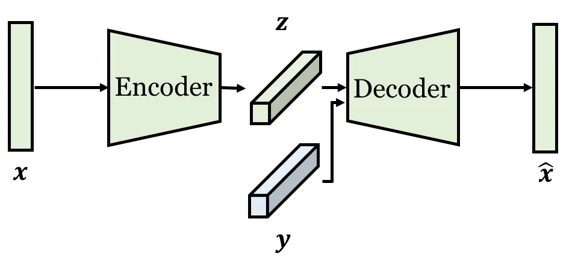
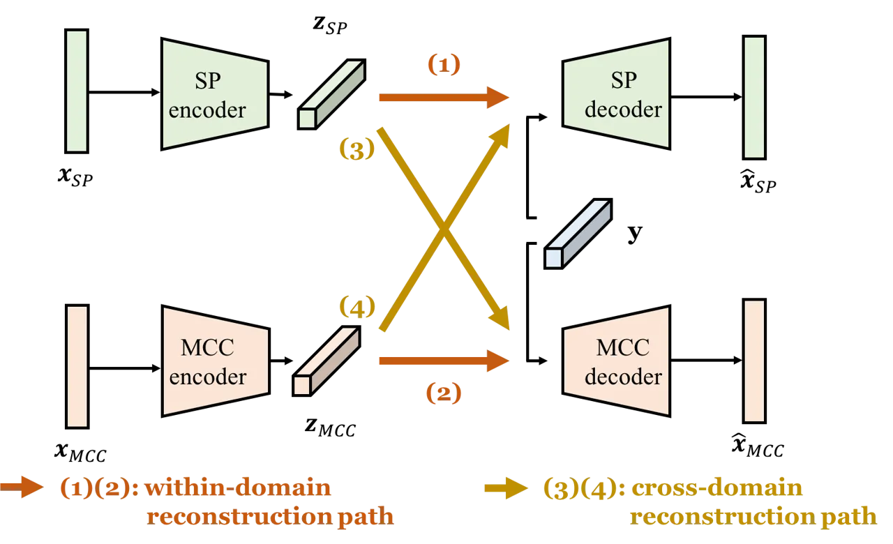
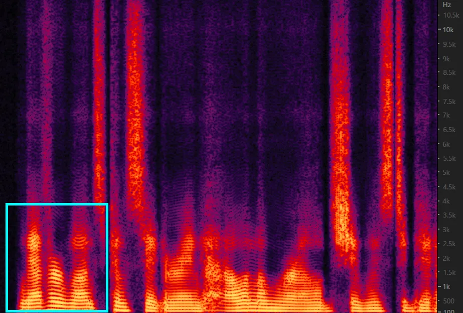
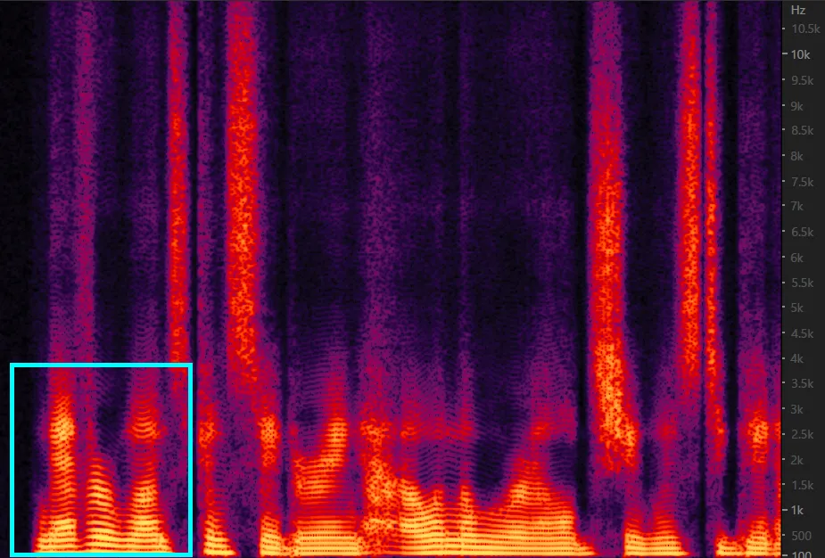
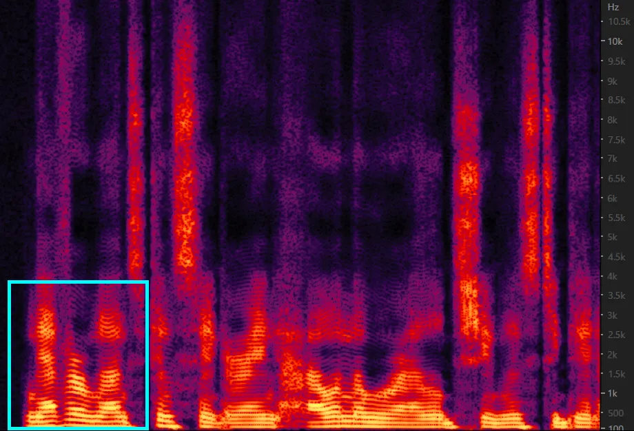
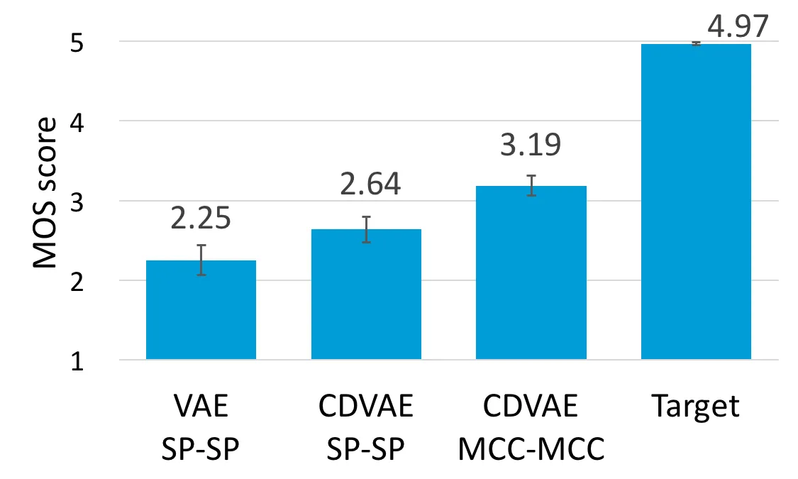
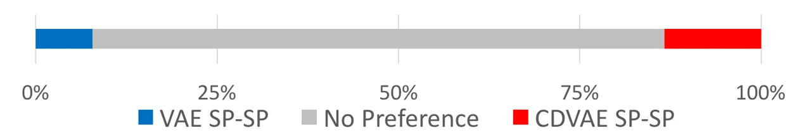
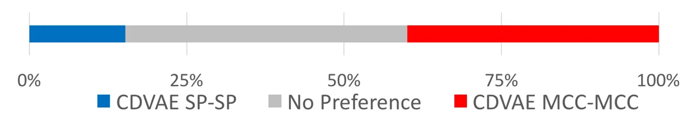

# Voice Conversion Based on Cross-Domain Features Using Variational Auto Encoders

###### Abstract

An effective approach to non-parallel voice conversion (VC) is to
utilize deep neural networks (DNNs), specifically variational auto
encoders (VAEs), to model the latent structure of speech in an
unsupervised manner. A previous study has confirmed the effectiveness of
VAE using the STRAIGHT spectra for VC. However, VAE using other types of
spectral features such as mel-cepstral coefficients (MCCs), which are
related to human perception and have been widely used in VC, have not
been properly investigated. Instead of using one specific type of
spectral feature, it is expected that VAE may benefit from using
multiple types of spectral features simultaneously, thereby improving
the capability of VAE for VC. To this end, we propose a novel VAE
framework (called cross-domain VAE, CDVAE) for VC. Specifically, the
proposed framework utilizes both STRAIGHT spectra and MCCs by explicitly
regularizing multiple objectives in order to constrain the behavior of
the learned encoder and decoder. Experimental results demonstrate that
the proposed CDVAE framework outperforms the conventional VAE framework
in terms of subjective tests.

Wen-Chin Huang¹², Hsin-Te Hwang¹, Yu-Huai Peng¹, Yu Tsao³, Hsin-Min
Wang¹

¹Institute of Information Science, Academia Sinica, Taipei  
²Department of Computer Science and Information Engineering, National
Taiwan University, Taipei  
³Research Center for Information Technology Innovation, Academia Sinica,
Taipei

{unilight,whm}@iis.sinica.edu.tw; yu.tsao@citi.sinica.edu.tw

Index Terms: Voice Conversion, Variational Auto Encoder.

## 1 Introduction

Voice conversion (VC) aims to convert the speech from a source to that
of a target without changing the linguistic content. While there are a
wide variety of types and applications of VC, here we consider the most
typical one, i.e., speaker voice conversion \[1\]. By formulating the
task into a regression problem in machine learning, a conversion
function that maps the acoustic features of a source speaker to those of
a target speaker is to be learned. Numerous approaches have been
proposed, such as Gaussian mixture model (GMM)-based methods \[1, 2\],
deep neural network (DNN)-based methods \[3, 4\], and exemplar-based
methods \[5, 6, 7\]. Most of them require parallel training data, i.e.,
the source and target speakers utter the same transcripts for training.
Since such data is hard to collect, non-parallel training has long
remained one of the ultimate goals in VC.

DNNs have demonstrated its great capability in solving complex tasks in
recent years, due to the rising accessibility of powerful computational
resources. Recently, variational auto encoders (VAEs) \[8\] have been
successfully applied to non-parallel VC \[9\]. Specifically, the
conversion function is composed by an encoder-decoder pair. The encoder
first encodes the input into a latent content code. Then, the decoder
mixes the latent content code and the target speaker code to generate
the output. The encoder-decoder network and speaker codes are trained
through back-propagation of the reconstruction error, along with a
Kullback-Leibler (KL)-divergence loss that regularizes the distribution
of the latent variable. Therefore, there is no need for parallel
training data. On the other hand, cycle-consistent adversarial networks
(CycleGAN) \[10\] have also been introduced to non-parallel VC \[11,
12\]. There are also methods that require external resources, such as
transcriptions of training data, text-to-speech (TTS) systems, and
speaker-independent automatic speech recognition (SI-ASR) systems. In
non-parallel VC based on TTS \[13\], the TTS reference voices are used
to create two parallel training copora: one between the source and TTS
voices and the other between the TTS and target voices. While in
non-parallel VC based on SI-ASR \[14\], the phonetic PosteriorGrams
(PPGs) are used to bridge the source and target voices. In this paper,
we focus on VAE-based VC.

Although the effectiveness of VAE using the STRAIGHT spectra \[15\] for
VC has been confirmed in \[9\], VAE using other types of spectral
features such as mel-cepstral coefficients (MCCs) \[16\], which are
related to human perception and have been widely used in VC, have not
been properly investigated. We expect that VAE-based VC may benefit from
using multiple types of spectral features simultaneously. To this end,
we propose a novel VAE framework, called cross-domain VAE (CDVAE), by
extending the conventional VAE framework to jointly consider two kinds
of spectral features, namely the STRAIGHT spectra (called SP for short
hereafter) and MCCs. In the VAE framework for VC, an ideal, well-trained
encoder is analogous to a speech/phone recognizer, such that the latent
representations encoded from SP and MCCs should be similar and capable
of self- or cross-reconstructing both kinds of spectral features. To
achieve this goal, we introduce two additional cross-domain
reconstruction errors, along with a latent similarity constraint, into
the training objective.

The remainder of this paper is organized as follows. In Section 2, we
first review the non-parallel VAE-based VC. The proposed CDVAE framework
is described in Section 3. Experimental settings and results are
presented in Section 4. Finally, we conclude the paper with discussions
in Section 5.

## 2 Non-parallel Voice Conversion via Variational Auto Encoder

Figure 1(a) depicts the structure of a typical VAE-based VC system
\[9\]. The conversion function is formulated as an encoder-decoder
network. Specifically, Given an observed (source or target) spectral
frame $`\bm{{x}}`$, a speaker-independent encoder $`E_{\theta}`$ with
parameter set $`\theta`$ encodes $`\bm{{x}}`$ into a latent code:
$`\bm{{z}}=E_{\theta}(\bm{{x}})`$. A speaker code $`\bm{{y}}`$ is then
concatenated with the latent code, and passed to a conditional decoder
$`G_{\phi}`$ with parameter set $`\phi`$ to reconstruct the input. Thus,
the conversion function $`f`$ of VAE-based VC can be expressed as:
$`\hat{\bm{{x}}}=f(\bm{{x}})=G_{\phi}(\bm{{z}},\bm{{y}})`$. The model
parameters can be obtained by maximizing the variational lower bound:

```math
\mathcal{L}(\theta,\phi;\bm{{x}},\bm{{y}})=\mathcal{L}_{recon}(\bm{{x}},\bm{{y}})+\mathcal{L}_{lat}(\bm{{x}}), \tag{1}
```

```math
\mathcal{L}_{recon}(\bm{{x}},\bm{{y}})=\mathbb{E}_{q_{\theta}(\bm{{z}}|\bm{{x}})}\bigl[\log p_{\phi}(\bm{{x}}|\bm{{z}},\bm{{y}})\bigr], \tag{2}
```

```math
\mathcal{L}_{lat}(\bm{{x}})=-D_{KL}(q_{\theta}(\bm{{z}}|\bm{{x}})\|p(\bm{{z}})), \tag{3}
```

where $`q_{\theta}(\bm{{z}}|\bm{{x}})`$ is the approximate posterior,
$`p_{\phi}(\bm{{x}}|\bm{{z}},\bm{{y}})`$ is the data likelihood, and
$`p(\bm{{z}})`$ is the prior distribution of the latent space.
$`\mathcal{L}_{recon}`$ is simply a reconstruction term as in any
vanilla auto encoder, whereas $`\mathcal{L}_{lat}`$ regularizes the
encoder to align the approximate posterior with the prior distribution.

The VAE framework makes several assumptions. First,
$`p_{\phi}(\bm{{x}}|\bm{{z}},\bm{{y}})`$ is assumed to follow a normal
distribution whose covariance is an identity matrix. Second,
$`p(\bm{{z}})`$ is set to be a standard normal distribution. Third, the
expectation over $`\bm{{z}}`$ is approximated by sampling via a
linear-transformation based re-parameterization trick \[17\]. With these
simplifications, we can avoid intractability and optimize the
auto-encoder parameter sets $`\theta\cup\phi`$ via back-propagation.
Note that the speaker codes can be either fixed one-hot representations
\[9, 18\] or learned during training (with the speaker codes randomly
initialized) as in the implementation codes¹¹ 1
https://github.com/JeremyCCHsu/vae-npvc released by the first author of
\[9\].

In the conversion phase, given an input source frame, the encoder first
encodes it into a latent code. Then, the decoder blends the latent code
and the target speaker code to generate the converted spectral features.

|                   |               |         |         |         |         |
| ----------------- | ------------- | ------- | ------- | ------- | ------- |
| Method            |               | SF1-TF1 | SF1-TM1 | SM1-TF1 | SM1-TM1 |
| Baseline          | VAE SP-SP     | 6.35    | 6.28    | 6.46    | 6.13    |
|                   | VAE MCC-MCC   | 8.26    | 9.04    | 9.01    | 7.74    |
| Proposed          | CDVAE SP-SP   | 6.30    | 6.33    | 6.44    | 6.13    |
|                   | CDVAE SP-MCC  | 6.36    | 6.36    | 6.49    | 6.14    |
|                   | CDVAE MCC-SP  | 6.43    | 6.40    | 6.40    | 6.14    |
|                   | CDVAE MCC-MCC | 6.47    | 6.43    | 6.47    | 6.13    |
| Before conversion |               | 8.31    | 9.09    | 9.07    | 7.77    |

Table 1: Mean Mel-cepstral distortion \[dB\] of all non-silent frames
from the baseline and proposed frameworks.



(a) VAE-based VC



(b) CDVAE-based VC

Figure 1: Illustration of the VAE-based VC and CDVAE-based VC.

## 3 Cross-Domain Variational Auto Encoder for Voice Conversion

The goal of the proposed framework is to utilize spectral features of
different properties extracted from the same observed speech frame. As
dipcited in Figure 1(b), the CDVAE framework is a collection of
encoder-decoder pairs, one for each kind of spectral feature. Here, we
consider the SP and MCCs (extracted by the STRAIGHT vocoder \[15\]) as
two kinds of spectral features (denoted as
$`\bm{{x}}_{\lx@scalerel@obj{SP}}`$ and
$`\bm{{x}}_{\lx@scalerel@obj{MCC}}`$ ). Next, we describe the training
objectives and conversion procedure.

### 3.1 Within-domain reconstruction paths

In Figure 1(b), paths (1) and (2) depict the within-domain
reconstruction paths. Specifically, the encoders first encode the
corresponding input spectral features into their respective latent
representations:

```math
\displaystyle\bm{{z}}_{\lx@scalerel@obj{SP}}=E_{\lx@scalerel@obj{SP}}(\bm{{x}}_{\lx@scalerel@obj{SP}}),\bm{{z}}_{\lx@scalerel@obj{MCC}}=E_{\lx@scalerel@obj{MCC}}(\bm{{x}}_{\lx@scalerel@obj{MCC}}), \tag{4}
```

where $`E_{\lx@scalerel@obj{SP}}`$ and $`E_{\lx@scalerel@obj{MCC}}`$ are
the encoders for SP and MCCs, respectively. Blending the speaker code
with the latent code, the decoders attempt to reconstruct the input
spectral features:

```math
\displaystyle\hat{\bm{{x}}}_{\lx@scalerel@obj{SP}}=G_{\lx@scalerel@obj{SP}}(\bm{{z}}_{\lx@scalerel@obj{SP}},\bm{{y}}),\hat{\bm{{x}}}_{\lx@scalerel@obj{MCC}}=G_{\lx@scalerel@obj{MCC}}(\bm{{z}}_{\lx@scalerel@obj{MCC}},\bm{{y}}), \tag{5}
```

where $`G_{\lx@scalerel@obj{SP}}`$ and $`G_{\lx@scalerel@obj{MCC}}`$ are
the decoders for SP and MCCs, respectively. The within-domain
reconstruction loss is defined as:

```math
\displaystyle\mathcal{L}_{wi} \displaystyle=\mathcal{L}_{recon}(\bm{{x}}_{\lx@scalerel@obj{SP}},\bm{{y}})+\mathcal{L}_{recon}(\bm{{x}}_{\lx@scalerel@obj{MCC}},\bm{{y}}), \tag{6}
```

where $`\mathcal{L}_{recon}`$ is the same as $`\mathcal{L}_{recon}`$ in
(2). The KL-Divergence loss is defined as:

```math
\mathcal{L}_{KLD}=\mathcal{L}_{lat}(\bm{{x}}_{\lx@scalerel@obj{SP}})+\mathcal{L}_{lat}(\bm{{x}}_{\lx@scalerel@obj{MCC}}), \tag{7}
```

where $`\mathcal{L}_{lat}`$ is the same as $`\mathcal{L}_{lat}`$ in (3).
Optimizing the two loss terms, $`\mathcal{L}_{wi}`$ and
$`\mathcal{L}_{KLD}`$, is realized by training two VAEs for SP and MCCs,
respectively. Next, we describe how we further regularize the behavior
of the proposed CDVAE model.

### 3.2 Cross-domain reconstruction paths

In Figure 1(b), paths (3) and (4) depict the cross-domain reconstruction
paths. Specifically, for an input frame, we take the SP latent
representation $`\bm{{z}}_{\lx@scalerel@obj{SP}}`$ as the input of the
MCC decoder (i.e., path (3)), and take the MCC latent representation
$`\bm{{z}}_{\lx@scalerel@obj{MCC}}`$ as the input of the SP decoder
(i.e., path (4)), where $`\bm{{z}}_{\lx@scalerel@obj{SP}}`$ and
$`\bm{{z}}_{\lx@scalerel@obj{SMCC}}`$ are obtained in (4). The two paths
also generates two outputs:

```math
\displaystyle\hat{\bm{{x}}}_{\lx@scalerel@obj{MCC}}=G_{\lx@scalerel@obj{MCC}}(\bm{{z}}_{\lx@scalerel@obj{SP}},\bm{{y}}),\hat{\bm{{x}}}_{\lx@scalerel@obj{SP}}=G_{\lx@scalerel@obj{SP}}(\bm{{z}}_{\lx@scalerel@obj{MCC}},\bm{{y}}). \tag{8}
```

Therefore, we define the cross-domain reconstruction loss as:

```math
\displaystyle\mathcal{L}_{cross} \displaystyle=\mathcal{L}_{recon}(\bm{{x}}_{\lx@scalerel@obj{SP}},\bm{{y}})+\mathcal{L}_{recon}(\bm{{x}}_{\lx@scalerel@obj{MCC}},\bm{{y}}). \tag{9}
```

In short, we introduce two extra reconstruction streams. By optimizing
the cross-domain reconstruction loss, we enforce the SP latent code to
contain enough information to reconstruct the input MCCs, and vice
versa. As a result, the behavior of the encoders from both feature
domains are constrained to be the same, i.e., they are expected to
extract similar latent information from different types of input
spectral features.

### 3.3 Latent similarity loss

The cross-domain satisfaction loss in (9) implicitly guarantees the
latent codes of two feature types to be close to each other. To
explicitly reinforce this constraint, we add a latent similarity loss to
the training objective:

```math
\mathcal{L}_{sim}=\|\bm{{z}}_{\lx@scalerel@obj{SP}}-\bm{{z}}_{\lx@scalerel@obj{MCC}}\|_{1}. \tag{10}
```

Our preliminary results confirmed the effectiveness of introducing this
loss in improving the speech quality.

### 3.4 Training and conversion procedures

Overall, the training objective of the CDVAE framework combines the
within-domain reconstruction loss, cross-domain reconstruction loss,
KL-divergence loss, and latent similarity loss:

```math
\displaystyle\mathcal{L}=\mathcal{L}_{wi}+\mathcal{L}_{KLD}+\mathcal{L}_{cross}+\mathcal{L}_{sim}. \tag{11}
```

The model parameters can be learned by maximizing (11). In the
conversion phase, there are four conversion paths (i.e., two
within-domain and two cross-domain paths). Given a source speech frame,
one can use either SP or MCCs as the input spectral feature. The
corresponding encoder then encodes it into the latent code. Depending on
the selected output spectral feature type, one then feed the
corresponding decoder with the latent code and target speaker code to
generate the converted spectral feature.

## 4 Experiments

### 4.1 Experimental settings

The proposed CDVAE framework was evaluated on the Voice Conversion
Challenge 2018 dataset \[19\], which included recordings of professional
US English speakers with a sampling rate of 22050 Hz. We used a subset
of speakers, including two male speakers (SM1 and TM1) and two female
speakers (SF1 and TF1). The training set consisted of 81 utterances per
speaker while the testing set consisted of 35 utterances per speaker.
Although each speaker uttered the same sentences in the corpus, we did
not deliberately divide the training set into disjoint (non-parallel)
subsets for two reasons: 1) The performance of the baseline VAE-based VC
framework stayed unaffected regardless of the division of the training
set \[9\]. Similar results were also observed for the proposed framework
in our preliminary experiments. 2) The training processes of the
baseline and proposed frameworks did not take advantage of the alignment
information of the corpus.

The STRAIGHT vocoder \[15\] was used to extract speech parameters
(including 513-dimensional SP, 513-dimensional AP, and $`F_{0}`$) and
reconstruct the waveform. 35-dimensional MCCs (including the 0-th
coefficient for the frame power) were further extracted from the SP
features. Note that the SP features were normalized as described in
\[9\] in both baseline and proposed frameworks. In the conversion phase,
for both baseline and proposed frameworks, the energy and AP were kept
unmodified, and $`F_{0}`$ was converted using a linear mean-variance
transformation in the log-$`F_{0}`$ domain.







.

Figure 2: Spectrograms of the converted speeches. Clearer formant
structure by CDVAE can be observed in the blue box. From left to right:
VAE SP-SP, CDVAE SP-SP, CDVAE MCC-MCC



Figure 3: MOS for naturalness with 95% confidence intervals.



(a) VAE SP-SP vs. CDVAE SP-SP



(b) CDVAE SP-SP vs. CDVAE MCC-MCC

Figure 4: Preference on speaker similarity.

### 4.2 Evaluations

We compared the proposed CDVAE framework with the baseline VAE framework
\[9\]. Specifically, we trained three models and evaluated their output
results:

- •
  VAE SP-SP: The baseline VAE framework trained on SP as described in
  Section 2.
- •
  VAE MCC-MCC: Another baseline VAE framework as described in Section 2,
  but trained on MCCs.
- •
  CDVAE: The proposed CDVAE framework as described in Section 3, trained
  on both SP and MCCs. The converted spectral features obtained from
  path (1) to (4) as depicted in Figure 1(b) were referred to CDVAE
  SP-SP, CDVAE MCC-MCC, CDVAE SP-MCC, and CDVAE MCC-SP, respectively.

We used Hsu’s codes1 to construct the baseline systems (i.e., VAE SP-SP
and VAE MCC-MCC). Specifically, the baseline systems consisted of a CNN
\[20\] -based encoder and decoder. Layer normalization \[21\] was
applied after each layer except for the last layer of the decoder. The
latent space was 128-dimensional, and the output of the encoder
contained the mean and log-variance vectors of the latent distribution.
The speaker code was 128-dimensional with random initialization,
simultaneously optimized with the encoders and decoders. The size of
mini-batch was 16, and the optimizer was ADAM \[17\] with a constant
0.0001 learning rate. The proposed system simply consisted of two VAEs
with the same network architectures and training hyperparameters, except
that we empirically used a mini-batch of 1.

#### 4.2.1 Objective Evaluations

We reported mean Mel-cepstral distortion (MCD) values on the testing set
to evaluate the proposed and baseline frameworks. The results in Table 1
show that the proposed framework successfully performed spectral
conversion in both SP and MCC domains (cf. CDVAE SP-SP and CDVAE
MCC-MCC) while the baseline VAE framework only performed well in the SP
domain (cf. VAE SP-SP). The MCD values of VAE MCC-MCC were almost
identical to those before conversion, implying that the VAE framework
totally failed in the MCC domain. Similar results were also found in a
recent study \[22\]. In addition, CDVAE MCC-MCC even outperformed the
baseline VAE SP-SP. To our best knowledge, this is the first time that
VAE-based VC successfully works on MCCs. This result demonstrates the
potential of our proposed framework in various extensively studied
low-dimensional perceptual features. From Table 1, we also observe that
CDVAE-based within-domain conversion and cross-domain conversion were
equally successful. The result further confirmed that the additional
cross-domain reconstruction loss and latent similarity loss did play a
good role in learning the latent representation of speech.

Figure 2 shows the spectrograms of the converted speeches obtained by
VAE SP-SP, CDVAE SP-SP and CDVAE MCC-MCC. We can see that CDVAE MCC-MCC
produced more spectral details, particularly in the higher frequency
bands (4k-8kHz). Clearer formant structures in the lower frequency bands
can also be observed in our CDVAE framework, particularly CDVAE MCC-MCC,
as highlighted in the figure.

#### 4.2.2 Subjective Evaluations

We chose a subset of systems for subjective evaluation, namely VAE
SP-SP, CDVAE SP-SP, and CDVAE MCC-MCC. The VAE MCC-MCC system was
eliminated because of poor performance. CDVAE SP-MCC and CDVAE MCC-SP
were eliminated because they were considered auxiliary by-products and
the naturalness and speaker similarity of the output speeches did not
stand out from others.

For each conversion pair, ten sentences were randomly selected from the
testing set, thereby resulting in 40 (4$`\times`$10) test sentences.
Nine subjects were recruited to conduct the naturalness and speaker
similarity tests. For all the compared systems, the global variance
post-filtering method \[23\] and a low-pass filter with a Gaussian
window were applied to the converted spectral features to overcome the
discontinuity and over-smoothing problems.

First, we conducted the mean opinion score (MOS) test using a five-point
scale for naturalness evaluation. Figure 3 depicts the overall average
scores (including the score of natural target speech). The results
demonstrate that two proposed systems outperformed the baseline system,
and CDVAE MCC-MCC outperformed CDVAE SP-SP. This is encouraging, since
our initial motivation is to improve naturalness using perception-based
spectral features such as MCCs instead of SP.

Next, we conducted the ABX test to evaluate speaker similarity as
described in \[9\]. The results in Figure 4 show that the proposed CDVAE
SP-SP system slightly outperformed the baseline VAE SP-SP system, and
CDVAE MCC-MCC was superior to CDVAE SP-SP. Overall, our systems
outperformed the baseline system in both subjective tests.²² 2
https://unilight.github.io/CDVAE-Demo/

## 5 Discussion

In Section 4, we have shown that our proposed CDVAE framework
successfully utilizes cross-domain features to improve the capability of
VAE for VC, and outperforms the baseline VAE-based VC system in the
subjective tests. The question is: how does the underlying speech model
benefit from our framework?

Recall that the viability of the VAE framework relies on the
decomposition of input frames, which is assumed to be composed of a
latent code (in VC, phonetic code or linguistic content) and a speaker
code. Ideally, when applying VAE to VC, the latent code should contain
solely the phonetic information of the frame, with no information about
the speaker. However, this decomposition is not explicitly guaranteed.
Hand-crafted features like SP or MCCs possess their own natures, thus
even for the same input frame, the required information to reconstruct
the inputs from different feature domains may differ. When trained with
one feature alone, only the necessary information to reconstruct that
feature is left in the latent code, thus the VAE framework might fit the
property of that specific feature too well, losing the generalization
ability. One way to reinforce decomposition is to involve as many
speakers as possible during training, which may not necessarily lead to
better decomposition. Our proposed framework forces the encoder to act
more like a speaker-independent phone recognizer, thus filters out
unnecessary, speaker-dependent information of the input feature. As a
result, our framework not only achieves cross-domain feature property
satisfaction, but learns more disentangled latent representation of
speech.

In the future, we plan to investigate in detail the above assumption. In
addition, Wasserstein generative adversarial network (WGAN) \[24\] has
been introduced to the conventional VAE-based VC method \[18\] for
improving the naturalness of converted speech, so we also plan to
introduce WGAN to the proposed framework.

## 6 Acknowledgement

This work was supported in part by the Ministry of Science and
Technology of Taiwan under Grants: MOST 105-2221-E001-012-MY3 and MOST
107-2221-E-001-008-MY3.

## References

- \[1\] Y. Stylianou, O. Cappe, and E. Moulines, “Continuous
  probabilistic transform for voice conversion,” _IEEE Transactions on
  Speech and Audio Processing_, vol. 6, no. 2, pp. 131–142, Mar 1998.
- \[2\] T. Toda, A. W. Black, and K. Tokuda, “Voice conversion based on
  maximum-likelihood estimation of spectral parameter trajectory,” _IEEE
  Transactions on Audio, Speech, and Language Processing_, vol. 15,
  no. 8, pp. 2222–2235, Nov 2007.
- \[3\] S. Desai, A. W. Black, B. Yegnanarayana, and K. Prahallad,
  “Spectral mapping using artificial neural networks for voice
  conversion,” _IEEE Transactions on Audio, Speech, and Language
  Processing_, vol. 18, no. 5, pp. 954–964, July 2010.
- \[4\] L. H. Chen, Z. H. Ling, L. J. Liu, and L. R. Dai, “Voice
  conversion using deep neural networks with layer-wise generative
  training,” _IEEE/ACM Transactions on Audio, Speech, and Language
  Processing_, vol. 22, no. 12, pp. 1859–1872, Dec 2014.
- \[5\] R. Takashima, T. Takiguchi, and Y. Ariki, “Exemplar-based voice
  conversion in noisy environment,” in _Proc. SLT_, 2012, pp. 313–317.
- \[6\] Z. Wu, T. Virtanen, E. S. Chng, and H. Li, “Exemplar-based
  sparse representation with residual compensation for voice
  conversion,” _IEEE/ACM Transactions on Audio, Speech, and Language
  Processing_, vol. 22, no. 10, pp. 1506–1521, Oct 2014.
- \[7\] Y.-C. Wu, H.-T. Hwang, C.-C. Hsu, Y. Tsao, and H.-M. Wang,
  “Locally linear embedding for exemplar-based spectral conversion,” in
  _Proc. Interspeech_, 2016, pp. 1652–1656.
- \[8\] D. P. Kingma and M. Welling, “Auto-encoding variational bayes.”
  _CoRR_, vol. abs/1312.6114, 2013.
- \[9\] C.-C. Hsu, H.-T. Hwang, Y.-C. Wu, Y. Tsao, and H.-M. Wang,
  “Voice conversion from non-parallel corpora using variational
  auto-encoder,” in _Proc. APISPA ASC_, 2016, pp. 1–6.
- \[10\] J.-Y. Zhu, T. Park, P. Isola, and A. A. Efros, “Unpaired
  image-to-image translation using cycle-consistent adversarial
  networks,” in _Proc. ICCV_, 2017, pp. 2223–2232.
- \[11\] T. Kaneko and H. Kameoka, “Parallel-Data-Free Voice Conversion
  Using Cycle-Consistent Adversarial Networks,” _ArXiv e-prints_,
  Nov. 2017.
- \[12\] F. Fang, J. Yamagishi, I. Echizen, and J. Lorenzo-Trueba,
  “High-quality nonparallel voice conversion based on cycle-consistent
  adversarial network,” in _Proc. ICASSP_, 2018, pp. 5284–5288.
- \[13\] Y.-C. Wu, P. L. Tobing, T. Hayashi, K. Kobayashi, and T. Toda,
  “The nu non-parallel voice conversion system for the voice conversion
  challenge 2018,” in _Proc. Odyssey_, 2018, pp. 211–218.
- \[14\] L. Sun, K. Li, H. Wang, S. Kang, and H. Meng, “Phonetic
  posteriorgrams for many-to-one voice conversion without parallel data
  training,” in _Proc. ICME_, 2016, pp. 1–6.
- \[15\] H. Kawahara, I. Masuda-Katsuse, and A. de Cheveigné,
  “Restructuring speech representations using a pitch-adaptive
  time–frequency smoothing and an instantaneous-frequency-based f0
  extraction: Possible role of a repetitive structure in sounds,”
  _Speech Communication_, vol. 27, no. 3, pp. 187 – 207, 1999.
- \[16\] T. Fukada, K. Tokuda, T. Kobayashi, and S. Imai, “An adaptive
  algorithm for mel-cepstral analysis of speech,” in _Proc. ICASSP_,
  1992, pp. 137–140.
- \[17\] D. P. Kingma and J. Ba, “Adam: A method for stochastic
  optimization.” _CoRR_, vol. abs/1412.6980, 2014.
- \[18\] C.-C. Hsu, H.-T. Hwang, Y.-C. Wu, Y. Tsao, and H.-M. Wang,
  “Voice conversion from unaligned corpora using variational
  autoencoding wasserstein generative adversarial networks,” in _Proc.
  Interspeech_, 2017, pp. 3364–3368.
- \[19\] J. Lorenzo-Trueba, J. Yamagishi, T. Toda, D. Saito,
  F. Villavicencio, T. Kinnunen, and Z. Ling, “The voice conversion
  challenge 2018: Promoting development of parallel and nonparallel
  methods,” in _Proc. Odyssey_, 2018, pp. 195–202.
- \[20\] A. Krizhevsky, I. Sutskever, and G. E. Hinton, “Imagenet
  classification with deep convolutional neural networks,” in _Proc.
  NIPS_, 2012, pp. 1097–1105.
- \[21\] L. J. Ba, R. Kiros, and G. E. Hinton, “Layer normalization,”
  _CoRR_, vol. abs/1607.06450, 2016.
- \[22\] Y. Saito, Y. Ijima, K. Nishida, and S. Takamichi, “Non-parallel
  voice conversion using variational autoencoders conditioned by
  phonetic posteriorgrams and d-vectors,” in _Proc. ICASSP_, 2018, pp.
  5274–5278.
- \[23\] H. Silén, E. Hel, J. Nurminen, and M. Gabbouj, “Ways to
  implement global variance in statistical speech synthesis,” in _Proc.
  Interspeech_, 2012, pp. 1436–1439.
- \[24\] M. Arjovsky, S. Chintala, and L. Bottou, “Wasserstein GAN,”
  _CoRR_, vol. abs/1701.07875, 2017.
