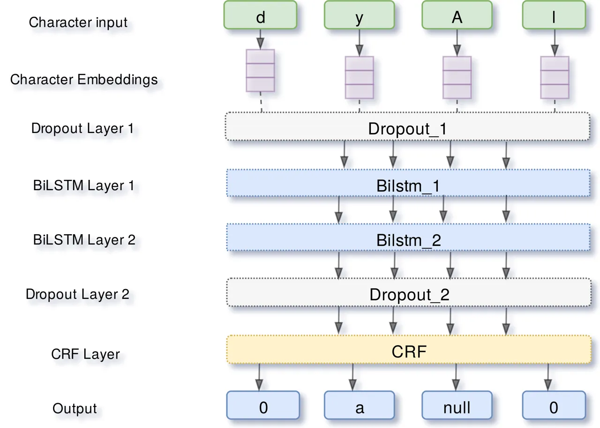
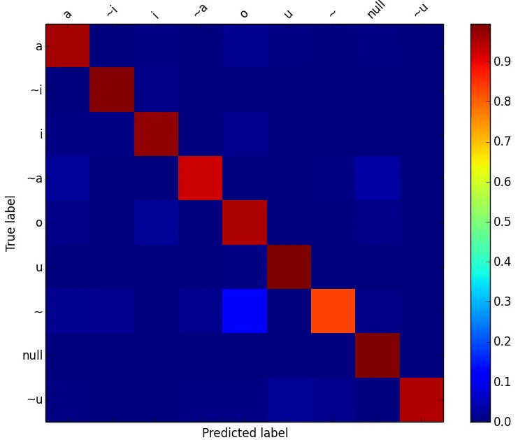
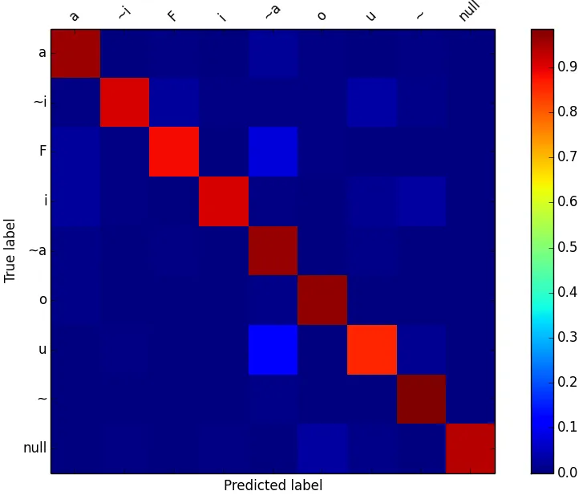

# Diacritization of Maghrebi Arabic Sub-Dialects

Ahmed Abdelali^(∗)    Mohammed Attia^(⋆)    Younes Samih^(†)    Kareem
Darwish^(∗)    Hamdy Mubarak^(∗) Affiliation: ^(∗)Qatar Computing
Research Institute, ^(⋆)Google Inc., ^(†)University of Düsseldorf
Affiliation: ^(∗)aabdelali@hbku.edu.qa, ^(⋆)attia@google.com,
^(†)samih@phil.hhu.de Affiliation: ^(∗)kdarwish@@hbku.edu.qa,
^(∗)hmubarak@hbku.edu.qa

###### Abstract

Diacritization process attempt to restore the short vowels in Arabic
written text; which typically are omitted. This process is essential for
applications such as Text-to-Speech (TTS). While diacritization of
Modern Standard Arabic (MSA) still holds the lion share, research on
dialectal Arabic (DA) diacritization is very limited. In this paper, we
present our contribution and results on the automatic diacritization of
two sub-dialects of Maghrebi Arabic, namely Tunisian and Moroccan, using
a character-level deep neural network architecture that stacks two
bi-LSTM layers over a CRF output layer. The model achieves word error
rate of 2.7% and 3.6% for Moroccan and Tunisian respectively and is
capable of implicitly identifying the sub-dialect of the input.

## 1 Introduction

Arabic is typically written without diacritics (short vowels)¹¹ 1 List
of Arabic diacritics: fatha (a), damma (u), kasra (i), sukun (o), shadda
($`\sim`$)., which require restoration during reading to pronounce words
correctly given their context. For MSA, diacritics serve dual function,
namely: word-internal diacritics dictate pronunciation and lexical
choice; and end of word diacritics (aka case endings) indicate syntactic
role. Conversely, dialects overwhelming use sukun, which typically
indicates the absence of a vowel, as case endings, eliminating the need
for syntactic disambiguation. Thus, DA diacritic recovery mostly
involves restoring word-internal diacritics. Diacritic restoration is
crucial for applications such as text-to-speech (TTS) to enable the
proper pronunciation of words. Though sub-dialects could be
orthographically identical, regional phonological variations necessitate
specific tuning for sub-dialects. In this paper we present new
state-of-the-art Arabic diacritization of two sub-dialects of Maghrebi,
namely Moroccan (MOR) and Tunisian (TUN). We employ a character-level
Deep Neural Network (DNN) architecture that stacks two bi-LSTM layers
over a Conditional Random Fields (CRF) output layer. The model achieves
word error rate (WER) of 2.7% and 3.6% for MOR and TUN respectively.
Further, the model is capable of implicitly identifying the sub-dialect
of the input enabling joint learning and eliminating the need for
specifying the sub-dialect of the input. We compare our approach to an
earlier work based on CRF sequence labeling Kareem et al. (2018). Our
contributions are:

- •
  Our novel work on Maghrebi diacritization shows some traits of
  Maghrebi (e.g. effective out-of-context diacritization) and provides
  strong results.
- •
  Improve earlier results of using CRF.
- •
  We explore cross dialect and joint training between MOR and TUN. Our
  DNN approach can effectively train and test on multi-dialectal data
  without explicit dialect identification.

## 2 Background

Most research on Arabic diacritization was devoted to MSA for a number
of reasons among which the availability of resources. Till recent,
written dialects was very scarce. Since dialects have mostly eliminated
case endings, we focus on word-internal diacritization. Many approaches
have been explored for word-internal diacritization of MSA such as
Hidden Markov Models Gal (2002); Darwish et al. (2017), finite state
transducers Nelken and Shieber (2005), character-based maximum entropy
based classification Zitouni et al. (2006), and deep learning Abandah
et al. (2015); Belinkov and Glass (2015); Rashwan et al. (2015). Darwish
et al. (2017) compared their system to others on a common test set. They
achieved a WER of 3.29% compared 3.04% for Rashwan et al. (2015), 6.73%
for Habash and Rambow (2007), and 14.87 for Belinkov and Glass (2015).
Azmi and Almajed (2015) survey much of the literature on MSA
diacritization. For dialectal diacritization, the literature is rather
scant. Habash et al. (2012) developed a morphological analyzer for
dialectal Egyptian, which also performs diacritization using a finite
state transducer that encodes manually crafted rules. They report an
overall analysis accuracy of 92.1% without reporting diacrtization
results specifically. Khalifa et al. (2017) developed a morphological
analyzer for dialectal Gulf verbs, which also attempts to recover
diacritics. Again, they did not specifically report on diacritization
results. Jarrar et al. (2017) annotated and diacritized a corpus of
dialectal Palestinian containing 43k words.(Kareem et al., 2018) used a
collection of 8,200 verses from Moroccan and Tunisian dialectal Bible to
build a Linear Chain CRF to recover word diacritics. They achieved a
word level diacritization error of 2.9% and 3.8% on Moroccan and
Tunisian respectively.

## 3 Data

We used the same data for  Kareem et al. (2018) that is composed of two
translations of the New Testament into two Maghrebi sub-dialects, namely
Moroccan²² 2 Translated by Morocco Bible Society and Tunisian³³ 3
Translated by United Bible Societies, UK. Both contains 8,200 verses
each with 134,324 and 131,923 words for MOR and TUN respectively. Table
1 gives a sample verse from both dialects with English translation. The
data has two distinguishing properties, namely: it is religious in
nature; and spelling is mostly consistent. Other dialectal text from
social media differ in both of these aspects. For future work, we plan
to extend this work to social media text.

| Lang. | Verse (Matthew 10:12)                                                               |
| ----- | ----------------------------------------------------------------------------------- |
| MOR   | \set@arabfont اَهيِلاَّم ىَلْع وُمّْلَس ،ْراَد يِشْل وُتْلَخْد اَلِإْو\arab@strut   |
| TUN   | \set@arabfont اَهيِف يِّلا ْساَّنلا ىَلْع اوُمّْلَس ْراَدْل اوُلْخْدُتكو\arab@strut |
| MSA   | \set@arabfont ِهْيَلَع اوُمِّلَس َتْيَبْلٱ َنوُلُخْدَت َنيِحَو\arab@strut           |
| EN    | As you enter the home, greet those who live there                                   |

Table 1: Sample verse from Bibles

We split the data into 5 folds for cross validation, where training
splits were further split 70/10 for training/validation. Given the
training portions of each split, Table 2 shows the distribution of the
number of observed diacritized forms per word. As shown, 89% and 82% of
words have one diacritized form for MOR and TUN respectively. We further
analyzed the words with more than one form. The percentage of words
where one form was used more than 99% of time was 53.8% and 55.5% for
MOR and TUN respectively. Similarly, the percentage of words where the
most frequent form was used less than 70% was 6.1% and 8.5% for MOR and
TUN respectively. We looked at alternative diacritized forms and found
that the less common alternatives involve: omission of default
diacritics (ex. fatha before alef – \set@arabfontاذاه\arab@strut (hA\*A)
vs. \set@arabfontاَذاَه\arab@strut (haA\*aA) – “this”); use of
shadda–sukun instead of sukun (ex. \set@arabfontاوُرْهَّطِي\arab@strut
(yiT$`\sim`$ahoruwA) vs. \set@arabfontاوُرّْهَّطِي\arab@strut
(yiT$`\sim`$ah$`\sim`$oruwA) – “to purify”); use of alternative
diacritized forms that have nearly identical pronunciation (ex.
\set@arabfontاوُبْذْكِن\arab@strut (niko\*obuwA) vs.
\set@arabfontاوُبّْذَكْن\arab@strut (noka\*$`\sim`$obuwA) – “we deny”); and
far less commonly varying forms (ex. \set@arabfontْقِّلَق\arab@strut
(qal$`\sim`$iqo – “to cause anxiety”) – vs. \set@arabfontْقَلْق\arab@strut
(qolaqo – “anxious”)).

|                   |       |       |       |      |
| ----------------- | ----- | ----- | ----- | ---- |
|                   | MOR   | TUN   | MSA   |      |
|                   | Bible | Bible | Bible | News |
| Most Freq         | 99.1  | 98.9  | 92.1  | 92.8 |
| No. of Seen Forms |       |       |       |      |
| 1                 | 89.0  | 81.8  | 51.7  | 69.0 |
| 2                 | 10.2  | 8.2   | 20.4  | 26.8 |
| 3                 | 0.8   | 5.6   | 13.5  | 2.9  |
| 4                 | 0.0   | 2.3   | 7.1   | 1.1  |
| $`\geq`$5         | 0.0   | 0.0   | 7.3   | 0.1  |

Table 2: Distribution of the number of dicaritized forms per word

Further, we used the most frequent diacritized form for each word, and
we automatically diacritized the training set (“Most Freq” line in Table
2). The accuracy was 99.1% and 98.9% for MOR and TUN respectively. This
indicates that diacritizing words out of context may achieve up to 99%
accuracy. We compared this to the MSA version of the same Bible verses
(132,813 words) and a subset of diacrtized MSA news articles of
comparable size (143,842 words) after removing case-endings. As Table 2
shows, MSA words, particularly for the Bible, have many more possible
diacritized forms, and picking the most frequent diacritized form leads
to significantly lower accuracy compared to dialects. We compared the
overlap between training and test splits. We found that 93.8% and 93.4
of the test words were observed during training for MOR and TUN
respectively. If we use the most frequent diacritized forms observed in
training, we can diacritize 92.8% and 92.0% of MOR and TUN words
respectively. Thus, the job of a diacritizer is primarily to diacritize
words previously unseen words, rather than to disambiguate between
different forms. We also compared the cross coverage between the MOR and
TUN datasets. The overlap is approximately 61%, and the diacritized form
in one dialect matches that of another dialect less than two thirds of
the time. This suggests that cross dialect training will yield
suboptimal results. Other notable aspects of MOR and TUN that set them
apart from MSA are: both allow leading letters in words to have sukun
(MOR: 34% and TUN: 26% of words); MOR uses a shadda–sukun combination;
and both allow consecutive letters to have sukun (ex. all letter in the
MOR word \set@arabfontْصْياَلْبْلْلْو\arab@strut (wololobolaAyoSo – “and
places”) have sukun save one).

## 4 Proposed Approach

Capitalizing on the success of neural approaches  Belinkov and Glass
(2015); Abandah et al. (2015) and more precisely biLSTMs and CRF Lample
et al. (2016); Ling et al. (2015), we implemented the architecture shown
in Figure 1 with four layers: one input, one output, and two hidden
layers. At the input, a look-up table of randomly initialized embeddings
maps each input character to a d-dimensional vector. The output from the
character fixed-dimensional embeddings is used as input to the two
hidden layers containing two stacked Bidirectional Long Short Term
Memory (biLSTM) Schuster and Paliwal (1997) layers. BiLSTMs have shown
their effectiveness in processing sequential data as they capture
long-short term dependencies within the characters Graves (2012). At the
output layer, a CRF layer is applied over the hidden representation of
the two stacked biLSTMs to obtain the probability distribution over all
labels. Since biLSTMs produce probability distribution for each output
independently from other outputs, CRFs help overcome this independence
assumptions and impose sequence labeling constraints. In our scenario,
this was 12 possible tags representing one of the possible diacritics or
none.

Figure 1: DNN architecture

We used Adam Kingma and Ba (2014) to optimize for the cross entropy
objective function. Side experiments with stochastic gradient descent
with momentum, AdaDelta  Zeiler (2012), and RMSProp Dauphin et al.
(2015) did not lead to improvements. To avoid overfitting, we applied
dropout Srivastava et al. (2014) and early stopping. Dropout prevents
co-adaptation of the hidden units by randomly setting a portion of
hidden units to zero during training. We used early stopping with
patience equal to 10. If validation error did not improve enough after
this number of times, training is stopped. We tuned hyper-parameters on
the development dataset by using random search resulting in the
following parameters:

|                 |                  |       |
| --------------- | ---------------- | ----- |
| Layer           | Hyper-Parameters | Value |
| Bi-LSTM         | state size       | 200   |
|                 | initial state    | 0.0   |
| Dropout         | dropout rate     | 0.25  |
| Characters Emb. | dimension        | 100   |
|                 | batch size       | 5     |
|                 | learning rate    | 0.01  |
|                 | decay rate       | 0.05  |

The baseline results provided by  (Kareem et al., 2018) used CRF
sequence labeling Lafferty et al. (2001), which has shown effectiveness
for many sequence labeling tasks. CRFs effectively combine state-level
and transition features. CRF++ implementation of a CRF sequence labeler
with L2 regularization and default value of 10 for the generalization
parameter ‘‘C’’⁴⁴ 4
[https://github.com/taku910/crfpp](https://github.com/taku910/crfpp)
with letters as the inputs and per letter diacritics as labels was used.
For features, given a word of character sequence $`c_{n}`$ … $`c_{-2}`$,
$`c_{-1}`$, $`c_{0}`$, $`c_{1}`$, $`c_{2}`$ … $`c_{m}`$, we used a
combination of character n-gram features, namely unigram ($`c_{0}`$),
bigrams ($`c_{-1}^{0}`$; $`c_{0}^{1}`$), trigrams ($`c_{-2}^{0}`$;
$`c_{-1}^{1}`$; $`c_{0}^{2}`$), 4-grams ($`c_{-3}^{0}`$; $`c_{-2}^{1}`$;
$`c_{-1}^{2}`$; $`c_{0}^{3}`$), and Brown Clusters Brown et al. (1992).
Given that the vast majority of dialectal words have only one possible
diacritized form, the CRF is trained on individual words out of context.
 Kareem et al. (2018).

## 5 Results and Discussion

We conducted three sets of experiments in contrast to previous results
using CRF which achieved WER of 3.1% and 4.0% for MOR and TUN
respectively (Table 3). The DNN model edged the CRF approach with 0.4%
drop in WER for both dialects (Table 4 (a)).

|                            |          |            |      |
| -------------------------- | -------- | ---------- | ---- |
|                            |          | Error Rate |      |
| Training Set               | Test Set | Character  | Word |
| (a) Uni-dialectal Training |          |            |      |
| Moroccan                   | Moroccan | 1.1        | 2.9  |
| Tunisian                   | Tunisian | 1.7        | 3.8  |
| (b) Cross Training         |          |            |      |
| Moroccan                   | Tunisian | 20.1       | 47.0 |
| Tunisian                   | Moroccan | 20.8       | 48.9 |
| (c) Combined Training      |          |            |      |
| Combined                   | Moroccan | 12.6       | 34.2 |
| Combined                   | Tunisian | 9.5        | 23.8 |

Table 3: CRF Results with Brown clusters reported by  Kareem et al.
(2018)

|                            |          |           |      |
| -------------------------- | -------- | --------- | ---- |
|                            |          | Accuracy  |      |
| Training Set               | Test Set | Character | Word |
| (a) Uni-dialectal Training |          |           |      |
| MOR                        | MOR      | 1.0       | 2.7  |
| TUN                        | TUN      | 1.6       | 3.6  |
| (b) Cross Training         |          |           |      |
| MOR                        | TUN      | 21.4      | 48.2 |
| TUN                        | MOR      | 22.3      | 49.4 |
| (c) Combined Training      |          |           |      |
| Joint                      | MOR      | 1.3       | 3.7  |
| Joint                      | TUN      | 2.1       | 4.9  |

Table 4: DNN Results – Average Across All Folds

Second, we tested if sub-dialects can learn from each other. Tables 3
(b) and 4 (b) show that cross-dialectal results were significantly lower
than mono-dialectal ones, confirming that dialects are phonetically
divergent. Identical words with different diacritized forms in both
dialects abound. Examples include { \set@arabfontْةَقْطْنَم\arab@strut
(manoToqapo), \set@arabfontْةَقِطْنْم\arab@strut (manoTiqapo)} (region) and
{ \set@arabfontْلُفْط\arab@strut (Tofulo), \set@arabfontْلَفْط\arab@strut
(Tofalo)} (boy) in MOR and TUN respectively. Third, we combined training
data from both dialects, and we tested on individual dialects. Tables 3
(c) and 4 (c) show the results of joint training. While the CRF baseline
results were significantly worse, DNN WER increased by 1% and 1.3% for
MOR and TUN respectively. The results suggest that unlike CRFs, our DNN
model was implicitly identifying the sub-dialect.

|           |           |       |                                                                                                    |
| --------- | --------- | ----- | -------------------------------------------------------------------------------------------------- |
| T         | P         | R     | Examples                                                                                           |
| MOR       |           |       |                                                                                                    |
| $`\sim`$  | $`\sim`$u | 8.8%  | \set@arabfontْهَبّتلا\arab@strut $`\rightarrow`$\set@arabfontْهَبُّتلا\arab@strut “the hill”       |
|           |           |       | (Alt$`\sim`$baho$`\rightarrow`$Alt$`\sim`$ubaho)                                                   |
| $`\sim`$a | $`\sim`$u | 2.5%  | \set@arabfontةَقَدَّصلا\arab@strut $`\rightarrow`$\set@arabfontةَقْدُّصلا\arab@strut “the charity” |
|           |           |       | (AlS$`\sim`$adaqap$`\rightarrow`$AlS$`\sim`$udaqap)                                                |
| o         | $`\sim`$  | 3.4%  | \set@arabfontْلّطَعْت\arab@strut $`\rightarrow`$\set@arabfontْلّطَعّت\arab@strut “delays”          |
|           |           |       | (toEaT$`\sim`$lo$`\rightarrow`$t$`\sim`$EaT$`\sim`$lo)                                             |
| TUN       |           |       |                                                                                                    |
| o         | $`\sim`$  | 14.3% | \set@arabfontْلاَمْجلا\arab@strut $`\rightarrow`$\set@arabfontْلاَمّجلا\arab@strut “camels”        |
|           |           |       | (Aljomal$`\rightarrow`$Alj$`\sim`$mal)                                                             |
| $`\sim`$i | $`\sim`$  | 2.1%  | \set@arabfontاَهْتِّلَغ\arab@strut $`\rightarrow`$\set@arabfontاَهْتّلَغ\arab@strut “its fruits”   |
|           |           |       | (gal$`\sim`$itoha$`\rightarrow`$gal$`\sim`$toha)                                                   |
| a         | $`\sim`$a | 3.0%  | \set@arabfontْفاَيْض\arab@strut $`\rightarrow`$\set@arabfontْفاَّيَض\arab@strut “guests”           |
|           |           |       | (DoyaAf$`\rightarrow`$Day$`\sim`$aAf)                                                              |

Table 5: Most common diacritic prediction errors (T: Truth, P:
Predicted, R: Ratio)

Figure 2: Confusion Matrix for Moroccan using Combined approach.

Figure 3: Confusion Matrix for Tunisian using Combined approach.

Figures 2 and 3 displays the combined model confusion matrices. While
both figures shows that the joint model was able to predict accurately
the correct diacritic (label); Some errors can be noted, manly errors
involve shadda ($`\sim`$) or sukun (o); Table 5 details the most common
errors for both sub-dialects with error examples. The most common errors
involved fatha (a), shadda ($`\sim`$), sukun (o), and kasra (i). We also
looked at the percentage of errors for individual diacritics (or
combinations in which they appear) using mono-dialectal and joint
training. The break-down was as follows:

|                   | MOR  |       | TUN  |       |
| ----------------- | ---- | ----- | ---- | ----- |
|                   | Mono | Joint | Mono | Joint |
| fatha (a)         | 68.4 | 58.1  | 83.0 | 51.0  |
| sukun (o)         | 63.3 | 64.9  | 55.8 | 56.1  |
| shadda ($`\sim`$) | 48.5 | 42.7  | 30.4 | 29.0  |
| kasra (i)         | 14.6 | 14.6  | 52.7 | 43.7  |
| damma (u)         | 11.8 | 13.4  | 20.5 | 19.1  |

The breakdown shows that error types in MOR and TUN were rather
different. For example, kasra error were more pronounced in TUN than
MOR. Also, joint training affected different diacritics differently. For
example, joint training for TUN caused a very large drop in errors for
fatha. Given our results, we suggest that an effective strategy for
robust dialectal diacritization would involve: a) building, with the
help of our model, a large lookup table for the most common words with
one possible diacritized form for each dialect, which would account for
99% of the words, and using simple lookup for seen words in the lookup
table and using the diacritization model otherwise; and b) using a
mono-dialectal model in application where the sub-dialect is known (ex.
chat app in a specific country) and resorting to the combined model
otherwise (ex. tweets of unknown source).

## 6 Conclusion

In this paper, we have presented the diacritization of Maghrebi Arabic,
a dialect family used in Northern Africa. This work will help enable NLP
to model conversational Arabic in dialog systems. We noted that
dialectal Arabic is less contextual and more predictable than Modern
Standard Arabic, and high levels of accuracy can be achieved if enough
data is available. We used a character-level DNN architecture that
stacks two biLSTM layers over a CRF output layer. Mono-dialectal
training achieved WER less than 3.6%. Though sub-dialects are
phonetically divergent, our joint training model implicitly identifies
sub-dialects, leading to small increases in WER.

## References

- Abandah et al. (2015) Gheith A Abandah, Alex Graves, Balkees
  Al-Shagoor, Alaa Arabiyat, Fuad Jamour, and Majid Al-Taee. 2015.
  Automatic diacritization of arabic text using recurrent neural
  networks. _International Journal on Document Analysis and Recognition
  (IJDAR)_, 18(2):183–197.
- Azmi and Almajed (2015) Aqil M Azmi and Reham S Almajed. 2015. A
  survey of automatic arabic diacritization techniques. _Natural
  Language Engineering_, 21(03):477–495.
- Belinkov and Glass (2015) Yonatan Belinkov and James Glass. 2015.
  Arabic diacritization with recurrent neural networks. In _Proceedings
  of the 2015 Conference on Empirical Methods in Natural Language
  Processing_, pages 2281–2285, Lisbon, Portugal.
- Brown et al. (1992) Peter F Brown, Peter V Desouza, Robert L Mercer,
  Vincent J Della Pietra, and Jenifer C Lai. 1992. Class-based n-gram
  models of natural language. _Computational linguistics_,
  18(4):467–479.
- Darwish et al. (2017) Kareem Darwish, Hamdy Mubarak, and Ahmed
  Abdelali. 2017. Arabic diacritization: Stats, rules, and hacks. In
  _Proceedings of the Third Arabic Natural Language Processing
  Workshop_, pages 9–17.
- Dauphin et al. (2015) Yann Dauphin, Harm de Vries, and Yoshua
  Bengio. 2015. Equilibrated adaptive learning rates for non-convex
  optimization. In _Advances in neural information processing systems_,
  pages 1504–1512.
- Gal (2002) Ya’akov Gal. 2002. An HMM approach to vowel restoration in
  arabic and hebrew. In _Proceedings of the ACL-02 workshop on
  Computational approaches to Semitic languages_, pages 1–7. Association
  for Computational Linguistics.
- Graves (2012) Alex Graves. 2012. _Supervised sequence labelling with
  recurrent neural networks_, volume 385. Springer.
- Habash et al. (2012) Nizar Habash, Ramy Eskander, and Abdelati
  Hawwari. 2012. A morphological analyzer for egyptian arabic. In
  _Proceedings of the twelfth meeting of the special interest group on
  computational morphology and phonology_, pages 1–9. Association for
  Computational Linguistics.
- Habash and Rambow (2007) Nizar Habash and Owen Rambow. 2007. Arabic
  diacritization through full morphological tagging. In _Human Language
  Technologies 2007: The Conference of the North American Chapter of the
  Association for Computational Linguistics; Companion Volume, Short
  Papers_, pages 53–56. Association for Computational Linguistics.
- Jarrar et al. (2017) Mustafa Jarrar, Nizar Habash, Faeq Alrimawi,
  Diyam Akra, and Nasser Zalmout. 2017. Curras: an annotated corpus for
  the palestinian arabic dialect. _Language Resources and Evaluation_,
  51(3):745–775.
- Kareem et al. (2018) Darwish Kareem, Abdelali Ahmed, Mubarak Hamdy,
  Samih Younes, and Attia Mohammed. 2018. Diacritization of arabic
  dialects. In _Proceedings of the Eleventh International Conference on
  Language Resources and Evaluation (LREC 2018)_.
- Khalifa et al. (2017) Salam Khalifa, Sara Hassan, and Nizar
  Habash. 2017. A morphological analyzer for gulf arabic verbs. _WANLP
  2017 (co-located with EACL 2017)_, page 35.
- Kingma and Ba (2014) Diederik P. Kingma and Jimmy Ba. 2014. [Adam: A
  method for stochastic optimization](http://arxiv.org/abs/1412.6980).
  _CoRR_, abs/1412.6980.
- Lafferty et al. (2001) John Lafferty, Andrew McCallum, and Fernando CN
  Pereira. 2001. Conditional random fields: Probabilistic models for
  segmenting and labeling sequence data. _Proceedings of the 18th
  International Conference on Machine Learning 2001 (ICML 2001)_, pages
  282–289.
- Lample et al. (2016) Guillaume Lample, Miguel Ballesteros, Sandeep
  Subramanian, Kazuya Kawakami, and Chris Dyer. 2016. Neural
  architectures for named entity recognition. _arXiv preprint
  arXiv:1603.01360_.
- Ling et al. (2015) Wang Ling, Yulia Tsvetkov, Silvio Amir, Ramon
  Fermandez, Chris Dyer, Alan W Black, Isabel Trancoso, and Chu-Cheng
  Lin. 2015. Not all contexts are created equal: Better word
  representations with variable attention. In _Proceedings of the 2015
  Conference on Empirical Methods in Natural Language Processing_, pages
  1367–1372.
- Nelken and Shieber (2005) Rani Nelken and Stuart M Shieber. 2005.
  Arabic diacritization using weighted finite-state transducers. In
  _Proceedings of the ACL Workshop on Computational Approaches to
  Semitic Languages_, pages 79–86. Association for Computational
  Linguistics.
- Rashwan et al. (2015) Mohsen Rashwan, Ahmad Al Sallab, M. Raafat, and
  Ahmed Rafea. 2015. Deep learning framework with confused sub-set
  resolution architecture for automatic arabic diacritization. In _IEEE
  Transactions on Audio, Speech, and Language Processing_, pages
  505–516.
- Schuster and Paliwal (1997) Mike Schuster and Kuldip K Paliwal. 1997.
  Bidirectional recurrent neural networks. _IEEE Transactions on Signal
  Processing_, 45(11):2673–2681.
- Srivastava et al. (2014) Nitish Srivastava, Geoffrey E Hinton, Alex
  Krizhevsky, Ilya Sutskever, and Ruslan Salakhutdinov. 2014. Dropout: a
  simple way to prevent neural networks from overfitting. _Journal of
  machine learning research_, 15(1):1929–1958.
- Zeiler (2012) Matthew D Zeiler. 2012. Adadelta: an adaptive learning
  rate method. _arXiv preprint arXiv:1212.5701_.
- Zitouni et al. (2006) Imed Zitouni, Jeffrey S Sorensen, and Ruhi
  Sarikaya. 2006. Maximum entropy based restoration of arabic
  diacritics. In _Proceedings of the 21st International Conference on
  Computational Linguistics and the 44th annual meeting of the
  Association for Computational Linguistics_, pages 577–584. Association
  for Computational Linguistics.
