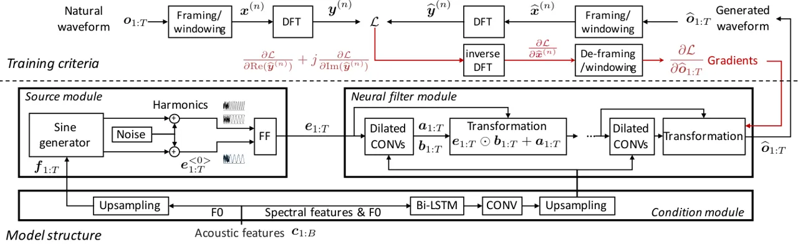
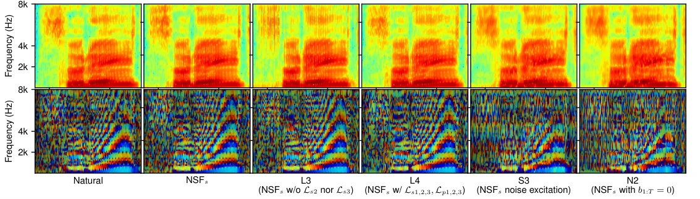
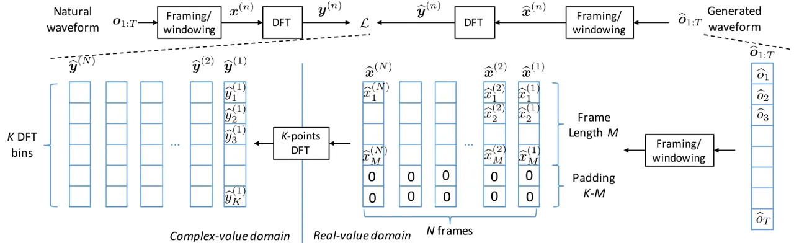
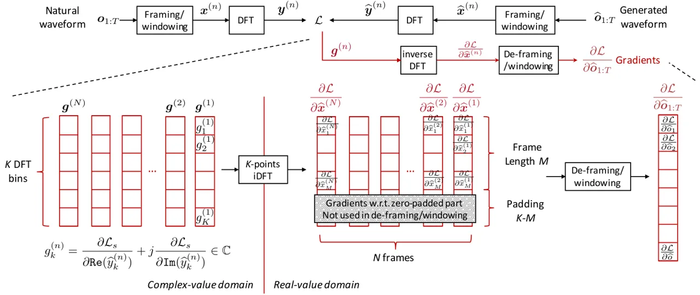
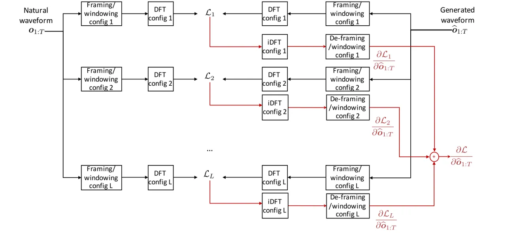

# Neural source-filter-based waveform model for statistical parametric speech synthesis

Xin Wang    Shinji Takaki    Junichi Yamagishi\sthanksThis work was
partially supported by JST CREST Grant Number JPMJCR18A6, Japan and by
MEXT KAKENHI Grant Numbers (16H06302, 16K16096, 17H04687, 18H04120,
18H04112, 18KT0051), Japan

###### Abstract

Neural waveform models such as the WaveNet are used in many recent
text-to-speech systems, but the original WaveNet is quite slow in
waveform generation because of its autoregressive (AR) structure.
Although faster non-AR models were recently reported, they may be
prohibitively complicated due to the use of a distilling training method
and the blend of other disparate training criteria. This study proposes
a non-AR neural source-filter waveform model that can be directly
trained using spectrum-based training criteria and the stochastic
gradient descent method. Given the input acoustic features, the proposed
model first uses a source module to generate a sine-based excitation
signal and then uses a filter module to transform the excitation signal
into the output speech waveform. Our experiments demonstrated that the
proposed model generated waveforms at least 100 times faster than the AR
WaveNet and the quality of its synthetic speech is close to that of
speech generated by the AR WaveNet. Ablation test results showed that
both the sine-wave excitation signal and the spectrum-based training
criteria were essential to the performance of the proposed model.

###### Index Terms: 

speech synthesis, neural network, waveform modeling

^(†)^(†)address: ¹National Institute of Informatics, Japan  
wangxin@nii.ac.jp, takaki@nii.ac.jp, jyamagis@nii.ac.jp

## 1 Introduction

Text-to-speech (TTS) synthesis, a technology that converts texts into
speech waveforms, has been advanced by using end-to-end architectures
\[1\] and neural-network-based waveform models \[2, 3, 4\]. Among those
waveform models, the WaveNet \[2\] directly models the distributions of
waveform sampling points and has demonstrated outstanding performance.
The vocoder version of WaveNet \[5\], which converts the acoustic
features into the waveform, also outperformed other vocoders for the
pipeline TTS systems \[6\].

As an autoregressive (AR) model, the WaveNet is quite slow in waveform
generation because it has to generate the waveform sampling points one
by one. To improve the generation speed, the Parallel WaveNet \[3\] and
the ClariNet \[4\] introduce a distilling method to transfer ‘knowledge’
from a teacher AR WaveNet to a student non-AR model that simultaneously
generates all the waveform sampling points. However, the concatenation
of two large models and the mix of distilling and other training
criteria reduce the model interpretability and raise the implementation
cost.

In this paper, we propose a neural source-filter waveform model that
converts acoustic features into speech waveforms. Inspired by classical
speech modeling methods \[7, 8\], we used a source module to generate a
sine-based excitation signal with a specified fundamental frequency
(F0). We then used a dilated-convolution-based filter module to
transform the sine-based excitation into the speech waveform. The
proposed model was trained by minimizing spectral amplitude and phase
distances, which can be efficiently implemented using discrete Fourier
transforms (DFTs). Because the proposed model is a non-AR model, it
generates waveforms much faster than the AR WaveNet. A large-scale
listening test showed that the proposed model was close to the AR
WaveNet in terms of the Mean opinion score (MOS) on the quality of
synthetic speech. An ablation test showed that both the sine-wave
excitation and the spectral amplitude distance were crucial to the
proposed model.

The model structure and training criteria are explained in Section 2,
after which the experiments are described in Section 3. Finally, this
paper is summarized and concluded in Section 4.



Figure 1: Structure of proposed model. $`B`$ and $`T`$ denote lengths of
input feature sequence and output waveform, respectively. FF, CONV, and
Bi-LSTM denote feedforward, convolutional, and bi-directional recurrent
layers, respectively. DFT denotes discrete Fourier transform.

## 2 Proposed model and training criteria

### 2.1 Model structure

The proposed model (shown in Figure 1) converts an input acoustic
feature sequence $`\bm{c}_{1:B}`$ of length $`B`$ into a speech waveform
$`\widehat{\bm{o}}_{1:T}`$ of length $`T`$. It includes a source module
that generates an excitation signal $`\bm{e}_{1:T}`$, a filter module
that transforms $`\bm{e}_{1:T}`$ into the speech waveform, and a
condition module that processes the acoustic features for the source and
filter modules. None of the modules takes the previously generated
waveform sample as the input. The waveform is assumed to be real-valued,
i.e., $`\widehat{o}_{t}\in\mathbb{R},0<{t}\leq{T}`$.

#### 2.1.1 Condition module

The condition module takes as input the acoustic feature sequence
$`\bm{c}_{1:B}=\{\bm{c}_{1},\cdots,\bm{c}_{B}\}`$, where each
$`\bm{c}_{b}=[f_{b},\bm{s}_{b}^{\top}]^{\top}`$ contains the F0
$`f_{b}`$ and the spectral features $`\bm{s}_{b}`$ of the $`b`$-th
speech frame. The condition module upsamples the F0 by duplicating
$`f_{b}`$ to every time step within the $`b`$-th frame and feeds the
upsampled F0 sequence $`\bm{f}_{1:T}`$ to the source module. Meanwhile,
it processes $`\bm{c}_{1:B}`$ using a bi-directional recurrent layer
with long-short-term memory (LSTM) units \[9\] and a convolutional
(CONV) layer, after which the processed features are upsampled and sent
to the filter module. The LSTM and CONV were used so that the condition
module was similar to that of the WaveNet-vocoder \[10\] in the
experiment. They can be replaced with a feedforward layer in practice.

#### 2.1.2 Source module

Given the input F0 sequence $`\bm{f}_{1:T}`$, the source module
generates a sine-based excitation signal
$`{\bm{e}_{1:T}}=\{e_{1},\cdots,e_{T}\}`$, where
$`{e}_{t}\in\mathbb{R},\forall{t}\in\{1,\cdots,T\}`$. Suppose the F0
value of the $`t`$-th time step is $`f_{t}\in\mathbb{R}_{\geq{0}}`$, and
$`f_{t}=0`$ denotes being unvoiced. By treating $`f_{t}`$ as the
instantaneous frequency \[11\], a signal $`\bm{e}_{1:T}^{<0>}`$ can be
generated as

```math
\displaystyle{e}_{t}^{<0>}=\begin{cases}\alpha\sin(\sum_{k=1}^{t}2\pi\frac{{f}_{k}}{N_{s}}+{\phi})+{n}_{t},&\text{if }{f_{t}}>0\\
\frac{1}{3\sigma}{n}_{t},&\text{if }f_{t}=0\\
\end{cases}, \tag{1}
```

where $`{n}_{t}\sim\mathcal{N}(0,\sigma^{2})`$ is a Gaussian noise,
$`\phi\in[-\pi,\pi]`$ is a random initial phase, and $`N_{s}`$ is equal
to the waveform sampling rate.

Although we can directly set $`\bm{e}_{1:T}=\bm{e}_{1:T}^{<0>}`$, we
tried two additional tricks. First, a ‘best’ phase $`\phi^{*}`$ for
$`\bm{e}_{1:T}^{<0>}`$ can be determined in the training stage by
maximizing the correlation between $`\bm{e}_{1:T}^{<0>}`$ and the
natural waveform $`\bm{o}_{1:T}`$. During generation, $`\phi`$ is
randomly generated. The second method is to generate harmonics by
increasing $`f_{k}`$ in Equation (1) and use a feedforward (FF) layer to
merge the harmonics and $`\bm{e}_{1:T}^{<0>}`$ into $`\bm{e}_{1:T}`$. In
this paper we use 7 harmonics and set $`\sigma=0.003`$ and
$`\alpha=0.1`$.

#### 2.1.3 Neural filter module

Given the excitation signal $`{\bm{e}_{1:T}}`$ from the source module
and the processed acoustic features from the condition module, the
filter module modulates $`{\bm{e}_{1:T}}`$ using multiple stages of
dilated convolution and affine transformations similar to those in
ClariNet \[4\]. For example, the first stage takes $`{\bm{e}_{1:T}}`$
and the processed acoustic features as input and produces two signals
$`\bm{a}_{1:T}`$ and $`\bm{b}_{1:T}`$ using dilated convolution. The
$`{\bm{e}_{1:T}}`$ is then transformed using
$`{\bm{e}_{1:T}}\odot{\bm{b}_{1:T}}+\bm{a}_{1:T}`$, where $`\odot`$
denotes element-wise multiplication. The transformed signal is further
processed in the following stages, and the output of the final stage is
used as generated waveform $`\widehat{\bm{o}}_{1:T}`$.

The dilated convolution blocks are similar to those in Parallel WaveNet
\[3\]. Specifically, each block contains multiple dilated convolution
layers with a filter size of 3. The outputs of the convolution layers
are merged with the features from the condition module through gated
activation functions \[3\]. After that, the merged features are
transformed into $`\bm{a}_{1:T}`$ and $`\tilde{\bm{b}}_{1:T}`$. To make
sure that $`\bm{b}_{1:T}`$ is positive, $`\bm{b}_{1:T}`$ is
parameterized as $`\bm{b}_{1:T}=\exp(\tilde{\bm{b}}_{1:T})`$.

Unlike ClariNet or Parallel WaveNet, the proposed model does not use the
distilling method. It is unnecessary to compute the mean and standard
deviation of the transformed signal. Neither is it necessary to form the
convolution and transformation blocks as an inverse autoregressive flow
\[12\].

### 2.2 Training criteria in frequency domain

Because speech perception heavily relies on acoustic cues in the
frequency domain, we define training criteria that minimize the spectral
amplitude and phase distances, which can be implemented using DFTs.
Given these criteria, the proposed model is trained using the stochastic
gradient descent (SGD) method.

#### 2.2.1 Spectral amplitude distance

Following the convention of short-time Fourier analysis, we conduct
waveform framing and windowing before producing the spectrum of each
frame. For the generated waveform $`\widehat{\bm{o}}_{1:T}`$, we use
$`\widehat{\bm{x}}^{(n)}=[\widehat{x}^{(n)}_{1},\cdots,\widehat{x}^{(n)}_{M}]^{\top}\in\mathbb{R}^{M}`$
to denote the $`n`$-th waveform frame of length $`M`$. We then use
$`\widehat{\bm{y}}^{(n)}=[\widehat{y}^{(n)}_{1},\cdots,\widehat{y}^{(n)}_{K}]^{\top}\in\mathbb{C}^{K}`$
to denote the spectrum of $`\widehat{\bm{x}}^{(n)}`$ calculated using
$`K`$-point DFT. We similarly define $`\bm{x}^{(n)}`$ and
$`\bm{y}^{(n)}`$ for the natural waveform $`\bm{o}_{1:T}`$.

Suppose the waveform is sliced into $`N`$ frames. Then the log spectral
amplitude distance is defined as follows:

```math
\mathcal{L}_{s}=\frac{1}{2}\sum_{n=1}^{N}\sum_{k=1}^{K}\Big[\log\frac{\texttt{Re}(y_{k}^{(n)})^{2}+\texttt{Im}(y_{k}^{(n)})^{2}}{\texttt{Re}(\widehat{y}_{k}^{(n)})^{2}+\texttt{Im}(\widehat{y}_{k}^{(n)})^{2}}\Big]^{2}, \tag{2}
```

where $`\texttt{Re}(\cdot)`$ and $`\texttt{Im}(\cdot)`$ denote the real
and imaginary parts of a complex number, respectively.

Although $`\mathcal{L}_{s}`$ is defined on complex-valued spectra, the
gradient
$`\frac{\partial{\mathcal{L}_{s}}}{\partial{\widehat{\bm{o}}_{1:T}}}\in\mathbb{R}^{T}`$
for SGD training can be efficiently calculated. Let us consider the
$`n`$-th frame and compose a complex-valued vector
$`\bm{g}^{(n)}=\frac{\partial{\mathcal{L}_{s}}}{\partial{\texttt{Re}(\widehat{\bm{y}}^{(n)})}}+j\frac{\partial{\mathcal{L}_{s}}}{\partial{\texttt{Im}(\widehat{\bm{y}}^{(n)})}}\in\mathbb{C}^{K}`$,
where the $`k`$-th element is
$`{g}^{(n)}_{k}=\frac{\partial{\mathcal{L}_{s}}}{\partial{\texttt{Re}(\widehat{{y}}_{k}^{(n)})}}+j\frac{\partial{\mathcal{L}_{s}}}{\partial{\texttt{Im}(\widehat{{y}}_{k}^{(n)})}}\in\mathbb{C}`$.
It can be shown that, as long as $`\bm{g}^{(n)}`$ is Hermitian
symmetric, the inverse DFT of $`\bm{g}^{(n)}`$ is equal to
$`\frac{\partial\mathcal{L}_{s}}{\partial\widehat{\bm{x}}^{(n)}}=[\frac{\partial\mathcal{L}_{s}}{\partial\widehat{{x}}_{1}^{(n)}},\cdots,\frac{\partial\mathcal{L}_{s}}{\partial\widehat{{x}}_{m}^{(n)}},\frac{\partial\mathcal{L}_{s}}{\partial\widehat{{x}}_{M}^{(n)}}]\in\mathbb{R}^{M}`$
¹¹ 1 In the implementation using fast Fourier transform,
$`\widehat{\bm{x}}^{(n)}`$ of length $`M`$ is zero-padded to length
$`K`$ before DFT. Accordingly, the inverse DFT of $`\bm{g}^{(n)}`$ also
gives the gradients w.r.t. the zero-padded part, which should be
discarded (see
[https://arxiv.org/abs/1810.11946](https://arxiv.org/abs/1810.11946))..
Using the same method,
$`\frac{\partial\mathcal{L}_{s}}{\partial\widehat{\bm{x}}^{(n)}}`$ for
$`{n}\in\{1,\cdots,N\}`$ can be computed in parallel. Given
$`\{\frac{\partial\mathcal{L}_{s}}{\partial\widehat{\bm{x}}^{(1)}},\cdots,\frac{\partial\mathcal{L}_{s}}{\partial\widehat{\bm{x}}^{(N)}}\}`$,
the value of each
$`\frac{\partial{\mathcal{L}_{s}}}{\partial{\widehat{{o}}_{t}}}`$ in
$`\frac{\partial{\mathcal{L}_{s}}}{\partial{\widehat{\bm{o}}_{1:T}}}`$
can be easily accumulated since the relationship between
$`\widehat{{o}}_{t}`$ and each $`\widehat{x}^{(n)}_{m}`$ has been
determined by the framing and windowing operations.

In fact,
$`\frac{\partial{\mathcal{L}_{s}}}{\partial{\widehat{\bm{o}}_{1:T}}}\in\mathbb{R}^{T}`$
can be calculated in the same manner no matter how we set the framing
and DFT configuration, i.e., the values of $`N`$, $`M`$, and $`K`$.
Furthermore, multiple $`\mathcal{L}_{s}`$s with different configurations
can be computed, and the gradients
$`\frac{\partial{\mathcal{L}_{s}}}{\partial{\widehat{\bm{o}}_{1:T}}}`$
can be simply summed up. For example, using the three
$`\mathcal{L}_{s}`$s in Table 1 was found to be essential to the
proposed model (see Section 3.3).

The Hermitian symmetry of $`\bm{g}^{(n)}`$ is satisfied if
$`\mathcal{L}_{s}`$ is carefully defined. For example,
$`\mathcal{L}_{s}`$ can be the square error or Kullback-Leibler
divergence (KLD) of the spectral amplitudes \[13, 14\]. The phase
distance defined below also satisfies the requirement.

|                                           |                                           |                                           |                                           |
| ----------------------------------------- | ----------------------------------------- | ----------------------------------------- | ----------------------------------------- |
|                                           | $`\mathcal{L}_{s1}`$&$`\mathcal{L}_{p1}`$ | $`\mathcal{L}_{s2}`$&$`\mathcal{L}_{p2}`$ | $`\mathcal{L}_{s3}`$&$`\mathcal{L}_{p3}`$ |
| DFT bins $`K`$                            | 512                                       | 128                                       | 2048                                      |
| Frame length $`M`$                        | 320 (20 ms)                               | 80 (5 ms)                                 | 1920 (120 ms)                             |
| Frame shift                               | 80 (5 ms)                                 | 40 (2.5 ms)                               | 640 (40 ms)                               |
| Note: all configurations use Hann window. |                                           |                                           |                                           |

Table 1: Three framing and DFT configurations for $`\mathcal{L}_{s}`$
and $`\mathcal{L}_{p}`$

#### 2.2.2 Phase distance

Given the spectra, a phase distance \[15\] is computed as

```math
\begin{split}&\mathcal{L}_{p}=\frac{1}{2}\sum_{n=1}^{N}\sum_{k=1}^{K}\Big|1-\exp(j(\widehat{\theta}^{(n)}_{k}-{\theta}^{(n)}_{k}))\Big|^{2}\\
&=\sum_{n=1}^{N}\sum_{k=1}^{K}\Big[1-\frac{\texttt{Re}(\widehat{y}_{k}^{(n)})\texttt{Re}({y}_{k}^{(n)})+\texttt{Im}(\widehat{y}_{k}^{(n)})\texttt{Im}({y}_{k}^{(n)})}{|\widehat{y}_{k}^{(n)}||{y}_{k}^{(n)}|}\Big]\end{split}, \tag{3}
```

where $`\widehat{\theta}^{(n)}_{k}`$ and $`\theta^{(n)}_{k}`$ are the
phases of $`\widehat{y}^{(n)}_{k}`$ and $`{y}^{(n)}_{k}`$, respectively.
The gradient
$`\frac{\partial{\mathcal{L}_{p}}}{\partial{\widehat{\bm{o}}_{1:T}}}`$
can be computed by the same procedure as
$`\frac{\partial{\mathcal{L}_{s}}}{\partial{\widehat{\bm{o}}_{1:T}}}`$.
Multiple $`\mathcal{L}_{p}`$s and $`\mathcal{L}_{s}`$s with different
framing and DFT configurations can be added up as the ultimate training
criterion $`\mathcal{L}`$. For different $`\mathcal{L}_{*}`$s,
additional DFT/iDFT and framing/windowing blocks should be added to the
model in Figure 1.

## 3 Experiments

### 3.1 Corpus and features

This study used the same Japanese speech corpus and data division recipe
as our previous study \[16\]. This corpus \[17\] contains neutral
reading speech uttered by a female speaker. Both validation and test
sets contain 480 randomly selected utterances. Among the 48-hour
training data, 9,000 randomly selected utterances (15 hours) were used
as the training set in this study. For the ablation test in Section 3.3,
the training set was further reduced to 3,000 utterances (5 hours).
Acoustic features, including 60 dimensions of Mel-generalized cepstral
coefficients (MGCs) \[18\] and 1 dimension of F0, were extracted from
the 48 kHz waveforms at a frame shift of 5 ms using WORLD \[19\]. The
natural waveforms were then downsampled to 16 kHz for model training and
the listening test.

### 3.2 Comparison of proposed model, WaveNet, and WORLD

The first experiment compared the four models listed in Table 2²² 2 The
models were implemented using a modified CURRENNT toolkit \[20\] on a
single P100 Nvidia GPU card. Codes, recipes, and generated speech can be
found on
[https://nii-yamagishilab.github.io](https://nii-yamagishilab.github.io)..
The WAD model, which was trained in our previous study \[6\], contained
a condition module, a post-processing module, and 40 dilated CONV
blocks, where the $`k`$-th CONV block had a dilation size of
$`2^{\text{modulo}(k,10)}`$. WAC was similar to WAD but used a Gaussian
distribution to model the raw waveform at the output layer \[4\].

The proposed NSF contained 5 stages of dilated CONV and transformation,
each stage including 10 convolutional layers with a dilation size of
$`2^{\text{modulo}(k,10)}`$ and a filter size of 3. Its condition module
was the same as that of WAD and WAC. NSF was trained using
$`\mathcal{L}=\mathcal{L}_{s1}+\mathcal{L}_{s2}+\mathcal{L}_{s3}`$, and
the configuration of each $`\mathcal{L}_{s*}`$ is listed in Table 1. The
phase distance $`\mathcal{L}_{p*}`$ was not used in this test.

| WOR | WORLD vocoder                                            |
| --- | -------------------------------------------------------- |
| WAD | WaveNet-vocoder for 10-bit discrete $`\mu`$-law waveform |
| WAC | WaveNet-vocoder using Gaussian dist. for raw waveform    |
| NSF | Proposed model for raw waveform                          |

Table 2: Models for comparison test in Section 3.2

Figure 2: MOS scores of natural speech, synthetic speech given natural
acoustic features (blue), and synthetic speech given acoustic features
generated from acoustic models (red). White dots are mean values.

Each model generated waveforms using natural and generated acoustic
features, where the generated acoustic features were produced by the
acoustic models in our previous study \[6\]. The generated and natural
waveforms were then evaluated by paid native Japanese speakers. In each
evaluation round the evaluator listened to one speech waveform in each
screen and rated the speech quality on a 1-to-5 MOS scale. The evaluator
can take at most 10 evaluation rounds and can replay the sample during
evaluation. The waveforms in an evaluation round were for the same text
and were played in a random order. Note that the waveforms generated
from NSF and WAC were converted to 16-bit PCM format before evaluation.

| WAD   | NSF (memory-save mode) | NSF (normal mode) |
| ----- | ---------------------- | ----------------- |
| 0.19k | 20k                    | 227k              |

Table 3: Average number of waveform points generated in 1 s

A total of 245 evaluators conducted 1444 valid evaluation rounds in all,
and the results are plotted in Figure 2. Two-sided Mann-Whitney tests
showed that the difference between any pair of models is statistically
significant ($`p<0.01`$) except NSF and WAC when the two models used
generated acoustic features. In general, NSF outperformed WOR and WAC
but performed slightly worse than WAD. The gap of the mean MOS scores
between NSF and WAD was about 0.12, given either natural or generated
acoustic features. A possible reason for this result may be the
difference between the non-AR and AR model structures, which is similar
to the difference between the finite and infinite impulse response
filters. WAC performed worse than WAD because some syllables were
perceived to be trembling in pitch, which may be caused by the random
sampling generation method. WAD alleviated this artifact by using a
one-best generation method in voiced regions \[6\].



Figure 3: Spectrogram (top) and instantaneous frequency (bottom) of
natural waveform and waveforms generated from models in Table 4 given
natural acoustic features in test set (utterance AOZORAR_03372_T01).
Figures are plotted using 5 ms frame length and 2.5 ms frame shift.

After the MOS test, we compared the waveform generation speed of NSF and
WAD. The implementation of NSF has a normal generation mode and a
memory-save one. The normal mode allocates all the required GPU memory
once but cannot generate waveforms longer than 6 seconds because of the
insufficient memory space in a single GPU card. The memory-save mode can
generate long waveforms because it releases and allocates the memory
layer by layer, but the repeated memory operations are time consuming.

We evaluated NSF using both modes on a smaller test set, in which each
of the 80 generated test utterances was around 5 seconds long. As the
results in Table 3 show, NSF is much faster than WAD. Note that WAD
allocates and re-uses a small size of GPU memory, which needs no
repeated memory operation. WAD is slow mainly because of the AR
generation process. Of course, both WAD and NSF can be improved if our
toolkit is further optimized. Particularly, if the memory operation can
be sped up, the memory-save mode of NSF will be much faster.

### 3.3 Ablation test on proposed model

This experiment was an ablation test on NSF. Specifically, the 11
variants of NSF listed in Table 4 were trained using the 5-hour training
set. For a fair comparison, NSF was re-trained using the 5-hour data,
and this variant is referred to as NSF$`{}_{\text{s}}`$. The speech
waveforms were generated given the natural acoustic features and rated
in 1444 evaluation rounds by the same group of evaluators in
Section 3.2. This test excluded natural waveform for evaluation.

| NSF\_(s) | NSF trained on 5-hour data                                                                                                           |
| -------- | ------------------------------------------------------------------------------------------------------------------------------------ |
| L1       | NSF*(s) without using $`\mathcal{L}*{s3}`$ssssssssss (i.e., $`\mathcal{L}=\mathcal{L}_{s1}+\mathcal{L}_{s2}`$)                       |
| L2       | NSF*(s) without using $`\mathcal{L}*{s2}`$ssssssssss (i.e., $`\mathcal{L}=\mathcal{L}_{s1}+\mathcal{L}_{s3}`$)                       |
| L3       | NSF*(s) without using $`\mathcal{L}*{s2}`$ nor $`\mathcal{L}_{s3}`$sssssssss (i.e., $`\mathcal{L}=\mathcal{L}_{s1}`$)                |
| L4       | NSF*(s) using $`\mathcal{L}=\mathcal{L}*{s1}+\mathcal{L}_{s2}+\mathcal{L}_{s3}+\mathcal{L}_{p1}+\mathcal{L}_{p2}+\mathcal{L}\_{p3}`$ |
| L5       | NSF\_(s) using KLD of spectral amplitudes                                                                                            |
| S1       | NSF\_(s) without harmonics                                                                                                           |
| S2       | NSF\_(s) without harmonics or ‘best’ phase $`\phi^{*}`$                                                                              |
| S3       | NSF\_(s) only using noise as excitation                                                                                              |
| N1       | NSF*(s) with $`{\bm{b}*{1:T}}=1`$ in filter’s transformation layers                                                                  |
| N2       | NSF*(s) with $`{\bm{b}*{1:T}}=0`$ in filter’s transformation layers                                                                  |

Table 4: Models for ablation test (Section 3.3)

Figure 4: MOS scores of synthetic samples from NSF\_(s) and its variants
given natural acoustic features. White dots are mean MOS scores.

The results are plotted in Figure 4. The difference between NST*(s) and
any other model except S2 was statistically significant ($`p<0.01`$).
Comparison among NST*(s), L1, L2, and L3 shows that using multiple
$`\mathcal{L}_{s}`$s listed in Table 1 is beneficial. For L3 that used
only $`\mathcal{L}_{s1}`$, the generated waveform points clustered
around one peak in each frame, and the waveform suffered from a
pulse-train noise. This can be observed from L3 of Figure 3, whose
spectrogram in the high frequency band shows more clearly vertical
strips than other models. Accordingly, this artifact can be alleviated
by adding $`\mathcal{L}_{s2}`$ with a frame length of 5 ms for model
training, which explained the improvement in L1. Using phase distance
(L4) didn’t improve the speech quality even though the value of the
phase distance was consistently decreased on both training and
validation data.

The good result of S2 indicates that a single sine-wave excitation with
a random initial phase also works. Without the sine-wave excitation, S3
generated waveforms that were intelligible but lacked stable harmonic
structure. N1 slightly outperformed NSF\_(s) while N2 produced unstable
harmonic structures. Because the transformation in N1 is equivalent to
skip-connection \[21\], the result indicates that the skip-connection
may help the model training.

## 4 Conclusion

In this paper, we proposed a neural waveform model with separated source
and filter modules. The source module produces a sine-wave excitation
signal with a specified F0, and the filter module uses dilated
convolution to transform the excitation into a waveform. Our experiment
demonstrated that the sine-wave excitation was essential for generating
waveforms with harmonic structures. We also found that multiple
spectral-based training criteria and the transformation in the filter
module contributed to the performance of the proposed model. Compared
with the AR WaveNet, the proposed model generated speech with a similar
quality at a much faster speed.

The proposed model can be improved in many aspects. For example, it is
possible to simplify the dilated convolution blocks. It is also possible
to try classical speech modeling methods, including glottal waveform
excitations \[22, 23\], two-bands or multi-bands approaches \[24, 25\]
on waveforms. When applying the model to convert linguistic features
into the waveform, we observed the over-smoothing affect in the
high-frequency band and will investigate the issue in the future work.

## References

- \[1\] Jonathan Shen, Ruoming Pang, Ron J Weiss, Mike Schuster, Navdeep
  Jaitly, Zongheng Yang, Zhifeng Chen, Yu Zhang, Yuxuan Wang,
  Rj Skerrv-Ryan, et al., “Natural TTS synthesis by conditioning WaveNet
  on Mel spectrogram predictions,” in Proc. ICASSP, 2018, pp. 4779–4783.
- \[2\] Aaron van den Oord, Sander Dieleman, Heiga Zen, Karen Simonyan,
  Oriol Vinyals, Alex Graves, Nal Kalchbrenner, Andrew Senior, and Koray
  Kavukcuoglu, “WaveNet: A generative model for raw audio,” arXiv
  preprint arXiv:1609.03499, 2016.
- \[3\] Aaron van den Oord, Yazhe Li, Igor Babuschkin, Karen Simonyan,
  Oriol Vinyals, Koray Kavukcuoglu, George van den Driessche, Edward
  Lockhart, Luis Cobo, Florian Stimberg, Norman Casagrande, Dominik
  Grewe, Seb Noury, Sander Dieleman, Erich Elsen, Nal Kalchbrenner,
  Heiga Zen, Alex Graves, Helen King, Tom Walters, Dan Belov, and Demis
  Hassabis, “Parallel WaveNet: Fast high-fidelity speech synthesis,” in
  Proc. ICML, 2018, pp. 3918–3926.
- \[4\] Wei Ping, Kainan Peng, and Jitong Chen, “Clarinet: Parallel wave
  generation in end-to-end text-to-speech,” in Proc. ICLP, 2019.
- \[5\] Akira Tamamori, Tomoki Hayashi, Kazuhiro Kobayashi, Kazuya
  Takeda, and Tomoki Toda, “Speaker-dependent WaveNet vocoder,” in Proc.
  Interspeech, 2017, pp. 1118–1122.
- \[6\] Xin Wang, Jaime Lorenzo-Trueba, Shinji Takaki, Lauri Juvela, and
  Junichi Yamagishi, “A comparison of recent waveform generation and
  acoustic modeling methods for neural-network-based speech synthesis,”
  in Proc. ICASSP, 2018, pp. 4804–4808.
- \[7\] Per Hedelin, “A tone oriented voice excited vocoder,” in Proc.
  ICASSP. IEEE, 1981, vol. 6, pp. 205–208.
- \[8\] Robert McAulay and Thomas Quatieri, “Speech analysis/synthesis
  based on a sinusoidal representation,” IEEE Trans. on Acoustics,
  Speech, and Signal Processing, vol. 34, no. 4, pp. 744–754, 1986.
- \[9\] Alex Graves, Supervised Sequence Labelling with Recurrent Neural
  Networks, Ph.D. thesis, Technische Universität München, 2008.
- \[10\] Xin Wang, Shinji Takaki, and Junichi Yamagishi, “Investigation
  of WaveNet for text-to-speech synthesis,” Tech. Rep. 6, SIG Technical
  Reports, feb 2018.
- \[11\] John R Carson and Thornton C Fry, “Variable frequency electric
  circuit theory with application to the theory of
  frequency-modulation,” Bell System Technical Journal, vol. 16, no. 4,
  pp. 513–540, 1937.
- \[12\] Diederik P Kingma, Tim Salimans, Rafal Jozefowicz, Xi Chen,
  Ilya Sutskever, and Max Welling, “Improved variational inference with
  inverse autoregressive flow,” in Proc. NIPS, 2016, pp. 4743–4751.
- \[13\] Daniel D Lee and H Sebastian Seung, “Algorithms for
  non-negative matrix factorization,” in Proc. NIPS, 2001, pp. 556–562.
- \[14\] Shinji Takaki, Hirokazu Kameoka, and Junichi Yamagishi, “Direct
  modeling of frequency spectra and waveform generation based on phase
  recovery for DNN-based speech synthesis,” in Proc. Interspeech, 2017,
  pp. 1128–1132.
- \[15\] Shinji Takaki, Toru Nakashika, Xin Wang, and Junichi Yamagishi,
  “STFT spectral loss for training a neural speech waveform model,” in
  Proc. ICASSP, 2019, p. (accepted).
- \[16\] Hieu-Thi Luong, Xin Wang, Junichi Yamagishi, and Nobuyuki
  Nishizawa, “Investigating accuracy of pitch-accent annotations in
  neural-network-based speech synthesis and denoising effects,” in Proc.
  Interspeech, 2018, pp. 37–41.
- \[17\] Hisashi Kawai, Tomoki Toda, Jinfu Ni, Minoru Tsuzaki, and
  Keiichi Tokuda, “XIMERA: A new TTS from ATR based on corpus-based
  technologies,” in Proc. SSW5, 2004, pp. 179–184.
- \[18\] Keiichi Tokuda, Takao Kobayashi, Takashi Masuko, and Satoshi
  Imai, “Mel-generalized cepstral analysis a unified approach,” in Proc.
  ICSLP, 1994, pp. 1043–1046.
- \[19\] Masanori Morise, Fumiya Yokomori, and Kenji Ozawa, “WORLD: A
  vocoder-based high-quality speech synthesis system for real-time
  applications,” IEICE Trans. on Information and Systems, vol. 99, no.
  7, pp. 1877–1884, 2016.
- \[20\] Felix Weninger, Johannes Bergmann, and Björn Schuller,
  “Introducing CURRENT: The Munich open-source CUDA recurrent neural
  network toolkit,” The Journal of Machine Learning Research, vol. 16,
  no. 1, pp. 547–551, 2015.
- \[21\] Kaiming He, Xiangyu Zhang, Shaoqing Ren, and Jian Sun, “Deep
  residual learning for image recognition,” in Proc. CVPR, 2016, pp.
  770–778.
- \[22\] Gunnar Fant, Johan Liljencrants, and Qi-guang Lin, “A
  four-parameter model of glottal flow,” STL-QPSR, vol. 4, no. 1985, pp.
  1–13, 1985.
- \[23\] Lauri Juvela, Bajibabu Bollepalli, Manu Airaksinen, and Paavo
  Alku, “High-pitched excitation generation for glottal vocoding in
  statistical parametric speech synthesis using a deep neural network,”
  in Proc. ICASSP, 2016, pp. 5120–5124.
- \[24\] John Makhoul, R Viswanathan, Richard Schwartz, and AWF Huggins,
  “A mixed-source model for speech compression and synthesis,” The
  Journal of the Acoustical Society of America, vol. 64, no. 6, pp.
  1577–1581, 1978.
- \[25\] D. W. Griffin and J. S. Lim, “Multiband excitation vocoder,”
  IEEE Transactions on Acoustics, Speech, and Signal Processing, vol.
  36, no. 8, pp. 1223–1235, Aug 1988.

## Appendix A Forward computation

Figure 5 plots the two steps to derive the spectrum from the generated
waveform $`\widehat{\bm{o}}_{1:T}`$. We use
$`\widehat{\bm{x}}^{(n)}=[\widehat{x}^{(n)}_{1},\cdots,\widehat{x}^{(n)}_{M}]^{\top}\in\mathbb{R}^{M}`$
to denote the $`n`$-th waveform frame of length $`M`$. We then use
$`\widehat{\bm{y}}^{(n)}=[\widehat{y}^{(n)}_{1},\cdots,\widehat{y}^{(n)}_{K}]^{\top}\in\mathbb{C}^{K}`$
to denote the spectrum of $`\widehat{\bm{x}}^{(n)}`$ calculated using
$`K`$-point DFT, i.e.,
$`\widehat{\bm{y}}^{(n)}=\text{DFT}_{K}(\widehat{\bm{x}}^{(n)})`$. For
fast Fourier transform, $`K`$ is set to the power of 2, and
$`\widehat{\bm{x}}^{(n)}`$ is zero-padded to length $`K`$ before DFT.



Figure 5: Framing/windowing and DFT steps. $`T`$, $`M`$, $`K`$ denotes
waveform length, frame length, and number of DFT bins.

### A.1 Framing and windowing

The framing and windowing operation is also parallelized over
$`\widehat{x}^{(n)}_{m}`$ using for_each command in CUDA/Thrust.
However, for explanation, let’s use the matrix operation in Figure 6. In
other words, we compute

```math
\widehat{x}^{(n)}_{m}=\sum_{t=1}^{T}\widehat{o}_{t}w^{(n,m)}_{t}, \tag{4}
```

where $`w^{(n,m)}_{t}`$ is the element in the
$`\big[(n-1)\times{M}+m\big]`$-th row and the $`t`$-th column of the
transformation matrix $`\bm{W}`$.

Figure 6: A matrix format of framing/windowing operation, where
$`\bm{w}_{1:M}`$ denote coefficients of Hann window.

### A.2 DFT

Our implementation uses cuFFT (cufftExecR2C and cufftPlan1d) ³³ 3
https://docs.nvidia.com/cuda/cufft/index.html to compute
$`\{\bm{y}^{(1)},\cdots,\bm{y}^{(N)}\}`$ in parallel.

## Appendix B Backward computation

For back-propagation, we need to compute the gradient
$`\frac{\partial{\mathcal{L}}}{\partial{\widehat{\bm{o}}_{1:T}}}\in\mathbb{R}^{T}`$
following the steps plotted in Figure 7.



Figure 7: Steps to compute gradients

### B.1 The 2nd step: from $`\frac{\partial\mathcal{L}}{\partial\widehat{{x}}^{(n)}_{m}}`$ to $`\frac{\partial{\mathcal{L}}}{\partial{\widehat{{o}}_{t}}}`$

Suppose we have
$`\{\frac{\partial\mathcal{L}}{\partial\widehat{\bm{x}}^{(1)}},\cdots,\frac{\partial\mathcal{L}}{\partial\widehat{\bm{x}}^{(N)}}\}`$,
where each
$`\frac{\partial\mathcal{L}}{\partial\widehat{\bm{x}}^{(n)}}\in\mathbb{R}^{M}`$
and
$`\frac{\partial\mathcal{L}}{\partial\widehat{{x}}^{(n)}_{m}}\in\mathbb{R}`$.
Then, we can compute
$`\frac{\partial{\mathcal{L}}}{\partial{\widehat{{o}}_{t}}}`$ on the
basis Equation (4) as

```math
\frac{\partial{\mathcal{L}}}{\partial{\widehat{{o}}_{t}}}=\sum_{n=1}^{N}\sum_{m=1}^{M}\frac{\partial\mathcal{L}}{\partial\widehat{{x}}^{(n)}_{m}}w_{t}^{(n,m)}, \tag{5}
```

where $`w_{t}^{(n,m)}`$ are the framing/windowing coefficients. This
equation explains what we mean by saying
‘$`\frac{\partial{\mathcal{L}}}{\partial{\widehat{{o}}_{t}}}`$ can be
easily accumulated the relationship between $`\widehat{{o}}_{t}`$ and
each $`\widehat{x}^{(n)}_{m}`$ has been determined by the framing and
windowing operations’.

Our implementation uses CUDA/Thrust for*each command to launch $`T`$
threads and compute
$`\frac{\partial{\mathcal{L}}}{\partial{\widehat{{o}}*{t}}},t\in\{1,\cdots,T\}`$
in parallel. Because $`\widehat{o}_{t}`$ is only used in a few frames
and there is only one $`w_{t}^{(n,m)}\neq 0`$ for each $`\{n,t\}`$,
Equation (5) can be optimized as

```math
\frac{\partial{\mathcal{L}}}{\partial{\widehat{{o}}_{t}}}=\sum_{n=N_{t,min}}^{N_{t,max}}\frac{\partial\mathcal{L}}{\partial\widehat{{x}}^{(n)}_{m_{t,n}}}w_{t}^{(n,m_{t,n})}, \tag{6}
```

where $`[N_{t,min},N_{t,max}]`$ is the frame range that
$`\widehat{o}_{t}`$ appears, and $`m_{t,n}`$ is the position of
$`\widehat{o}_{t}`$ in the $`n`$-th frame.

### B.2 The 1st step: compute $`\frac{\partial\mathcal{L}}{\partial\widehat{{x}}^{(n)}_{m}}`$

Remember that
$`\widehat{\bm{y}}^{(n)}=[\widehat{y}^{(n)}_{1},\cdots,\widehat{y}^{(n)}_{K}]^{\top}\in\mathbb{C}^{K}`$
is the K-points DFT spectrum of
$`\widehat{\bm{x}}^{(n)}=[\widehat{x}^{(n)}_{1},\cdots,\widehat{x}^{(n)}_{M}]^{\top}\in\mathbb{R}^{M}`$.
Therefore we know

```math
\displaystyle\texttt{Re}(\widehat{{y}}^{(n)}_{k}) \displaystyle=\sum_{m=1}^{M}\widehat{x}^{(n)}_{m}\cos(\frac{2\pi}{K}(k-1)(m-1)), \tag{7}
```

```math
\displaystyle\texttt{Im}(\widehat{{y}}^{(n)}_{k}) \displaystyle=-\sum_{m=1}^{M}\widehat{x}^{(n)}_{m}\sin(\frac{2\pi}{K}(k-1)(m-1)), \tag{8}
```

where $`k\in[1,K]`$. Note that, although the sum should be
$`\sum_{m=1}^{K}`$, the summation over the zero-padded part
$`\sum_{m=M+1}^{K}0\cos(\frac{2\pi}{K}(k-1)(m-1))`$ can be safely
ignored ⁴⁴ 4 Although we can avoid zero-padding by setting $`K=M`$, in
practice $`K`$ is usually the power of 2 while the frame length $`M`$ is
not..

Suppose we compute a log spectral amplitude distance $`\mathcal{L}`$
over the $`N`$ frames as

```math
\mathcal{L}=\frac{1}{2}\sum_{n=1}^{N}\sum_{k=1}^{K}\Big[\log\frac{\texttt{Re}(y_{k}^{(n)})^{2}+\texttt{Im}(y_{k}^{(n)})^{2}}{\texttt{Re}(\widehat{y}_{k}^{(n)})^{2}+\texttt{Im}(\widehat{y}_{k}^{(n)})^{2}}\Big]^{2}. \tag{9}
```

Because $`\mathcal{L}`$, $`\widehat{{x}}^{(n)}_{m}`$,
$`\texttt{Re}(\widehat{{y}}^{(n)}_{k})`$, and
$`\texttt{Im}(\widehat{{y}}^{(n)}_{k})`$ are real-valued numbers, we can
compute the gradient
$`\frac{\partial\mathcal{L}}{\partial\widehat{{x}}^{(n)}_{m}}`$ using
the chain rule:

```math
\displaystyle\frac{\partial\mathcal{L}}{\partial\widehat{{x}}^{(n)}_{m}} \displaystyle=\sum_{k=1}^{K}\frac{\partial\mathcal{L}}{\partial\texttt{Re}(\widehat{y}_{k}^{(n)})}\frac{\partial\texttt{Re}(\widehat{y}_{k}^{(n)})}{\partial\widehat{{x}}^{(n)}_{m}}+\sum_{k=1}^{K}\frac{\partial\mathcal{L}}{\partial\texttt{Im}(\widehat{y}_{k}^{(n)})}\frac{\partial\texttt{Im}(\widehat{y}_{k}^{(n)})}{\partial\widehat{{x}}^{(n)}_{m}} \tag{10}
```

```math
\displaystyle=\sum_{k=1}^{K}\frac{\partial\mathcal{L}}{\partial\texttt{Re}(\widehat{y}_{k}^{(n)})}\cos(\frac{2\pi}{K}(k-1)(m-1))-\sum_{k=1}^{K}\frac{\partial\mathcal{L}}{\partial\texttt{Im}(\widehat{y}_{k}^{(n)})}\sin(\frac{2\pi}{K}(k-1)(m-1)). \tag{11}
```

Once we compute
$`\frac{\partial\mathcal{L}}{\partial\widehat{{x}}^{(n)}_{m}}`$ for each
$`m`$ and $`n`$, we can use Equation (6) to compute the gradient
$`\frac{\partial{\mathcal{L}}}{\partial{\widehat{{o}}_{t}}}`$.

### B.3 Implementation of the 1st step using inverse DFT

Because
$`\frac{\partial\mathcal{L}}{\partial\texttt{Re}(\widehat{y}_{k}^{(n)})}`$
and
$`\frac{\partial\mathcal{L}}{\partial\texttt{Im}(\widehat{y}_{k}^{(n)})}`$
are real numbers, we can directly implement Equation (11) using matrix
multiplication. However, a more efficient way is to use inverse DFT
(iDFT).

Suppose a complex valued signal
$`\bm{g}=[{g}_{1},{g}_{2},\cdots,{g}_{L}]\in\mathbb{C}^{K}`$, we compute
$`\bm{b}=[b_{1},\cdots,b_{K}]`$ as the K-point inverse DFT of $`\bm{g}`$
by ⁵⁵ 5 cuFFT performs un-normalized FFTs, i.e., the scaling factor
$`\frac{1}{K}`$ is not used.

```math
\displaystyle b_{m}= \displaystyle\sum_{k=1}^{K}g_{k}e^{j\frac{2\pi}{K}(k-1)(m-1)} \tag{12}
```

```math
\displaystyle= \displaystyle\sum_{k=1}^{K}[\texttt{Re}(g_{k})+j\texttt{Im}(g_{k})][\cos(\frac{2\pi}{K}(k-1)(m-1))+j\sin(\frac{2\pi}{K}(k-1)(m-1))] \tag{13}
```

```math
\displaystyle= \displaystyle\sum_{k=1}^{K}\texttt{Re}(g_{k})\cos(\frac{2\pi}{K}(k-1)(m-1))-\sum_{k=1}^{K}\texttt{Im}(g_{k})\sin(\frac{2\pi}{K}(k-1)(m-1)) \tag{14}
```

```math
\displaystyle+j\Big[\sum_{k=1}^{K}\texttt{Re}(g_{k})\sin(\frac{2\pi}{K}(k-1)(m-1))+\sum_{k=1}^{K}\texttt{Im}(g_{k})\cos(\frac{2\pi}{K}(k-1)(m-1))\Big]. \tag{15}
```

For the first term in Line 15, we can write

```math
\displaystyle\sum_{k=1}^{K}\texttt{Re}(g_{k})\sin(\frac{2\pi}{K}(k-1)(m-1)) \tag{16}
```

```math
\displaystyle= \displaystyle\texttt{Re}(g_{0})\sin(\frac{2\pi}{K}(1-1)(m-1))+\texttt{Re}(g_{\frac{K}{2}+1})\sin(\frac{2\pi}{K}(\frac{K}{2}+1-1)(m-1)) \tag{17}
```

```math
\displaystyle+\sum_{k=2}^{\frac{K}{2}}\texttt{Re}(g_{k})\sin(\frac{2\pi}{K}(k-1)(m-1))+\sum_{k=\frac{K}{2}+2}^{K}\texttt{Re}(g_{k})\sin(\frac{2\pi}{K}(k-1)(m-1)) \tag{18}
```

```math
\displaystyle= \displaystyle\sum_{k=2}^{\frac{K}{2}}\Big[\texttt{Re}(g_{k})\sin(\frac{2\pi}{K}(k-1)(m-1))+\texttt{Re}(g_{(K+2-k}))\sin(\frac{2\pi}{K}({K}+2-k-1)(m-1))\Big] \tag{19}
```

```math
\displaystyle= \displaystyle\sum_{k=2}^{\frac{K}{2}}\Big[\texttt{Re}(g_{k})-\texttt{Re}(g_{(K+2-k}))\Big]\sin(\frac{2\pi}{K}(k-1)(m-1)) \tag{20}
```

Note that in Line (17),
$`\texttt{Re}(g_{1})\sin(\frac{2\pi}{K}(1-1)(m-1))=\texttt{Re}(g_{1})\sin(0)=0`$,
and
$`\texttt{Re}(g_{\frac{K}{2}+1})\sin(\frac{2\pi}{K}(\frac{K}{2}+1-1)(m-1))=\texttt{Re}(g_{\frac{K}{2}+1})\sin((m-1)\pi)=0`$.

It is easy to those that Line (20) is equal to 0 if
$`\texttt{Re}(g_{k})=\texttt{Re}(g_{(K+2-k)})`$, for any
$`k\in[2,\frac{K}{2}]`$. Similarly, it can be shown that
$`\sum_{k=1}^{K}\texttt{Im}(g_{k})\cos(\frac{2\pi}{K}(k-1)(m-1))=0`$ if
$`\texttt{Im}(g_{k})=-\texttt{Im}(g_{(K+2-k)}),k\in[2,\frac{K}{2}]`$ and
$`\texttt{Im}(g_{1})=\texttt{Im}(g_{(\frac{K}{2}+1)})=0`$. When these
two terms are equal to 0, the imaginary part in Line (15) will be 0, and
$`b_{m}=\sum_{k=1}^{K}g_{k}e^{j\frac{2\pi}{K}(k-1)(m-1)}`$ in Line (12)
will be a real number.

To summarize, if $`\bm{g}`$ satisfies the conditions below

```math
\displaystyle\texttt{Re}(g_{k}) \displaystyle=\texttt{Re}(g_{(K+2-k)}),\quad{}k\in[2,\frac{K}{2}] \tag{21}
```

```math
\displaystyle\texttt{Im}(g_{k}) \displaystyle=\begin{cases}-\texttt{Im}(g_{(K+2-k)}),\qquad{}k\in[2,\frac{K}{2}]\\
0,\qquad\qquad\qquad\qquad{}k=\{1,\frac{K}{2}+1\}\end{cases} \tag{22}
```

inverse DFT of $`\bm{g}`$ will be real-valued:

```math
\sum_{k=1}^{K}g_{k}e^{j\frac{2\pi}{K}(k-1)(m-1)}=\sum_{k=1}^{K}\texttt{Re}(g_{k})\cos(\frac{2\pi}{K}(k-1)(m-1))-\sum_{k=1}^{K}\texttt{Im}(g_{k})\sin(\frac{2\pi}{K}(k-1)(m-1)) \tag{23}
```

This is a basic concept in signal processing: the iDFT of a
conjugate-symmetric (Hermitian)⁶⁶ 6 It should be called circular
conjugate symmetry in strict sense signal will be a real-valued signal.

We can observer from Equation (23) and (11) that, if
$`\Big[\frac{\partial\mathcal{L}}{\partial\texttt{Re}(\widehat{y}_{1}^{(n)})}+j\frac{\partial\mathcal{L}}{\partial\texttt{Im}(\widehat{y}_{1}^{(n)})},\cdots,\frac{\partial\mathcal{L}}{\partial\texttt{Re}(\widehat{y}_{K}^{(n)})}+j\frac{\partial\mathcal{L}}{\partial\texttt{Im}(\widehat{y}_{K}^{(n)})}\Big]^{\top}`$
is conjugate-symmetric, the gradient vector
$`\frac{\partial\mathcal{L}}{\partial\widehat{\bm{x}}^{(n)}}=[\frac{\partial\mathcal{L}}{\partial\widehat{{x}}^{(n)}_{1}},\cdots,\frac{\partial\mathcal{L}}{\partial\widehat{{x}}^{(n)}_{M}}]^{\top}`$
be computed using iDFT:

```math
\begin{bmatrix}\frac{\partial\mathcal{L}}{\partial\widehat{{x}}^{(n)}_{1}}\\[10.00002pt]
\frac{\partial\mathcal{L}}{\partial\widehat{{x}}^{(n)}_{2}}\\[10.00002pt]
\cdots\\[10.00002pt]
\frac{\partial\mathcal{L}}{\partial\widehat{{x}}^{(n)}_{M}}\\[10.00002pt]
\frac{\partial\mathcal{L}}{\partial\widehat{{x}}^{(n)}_{M+1}}\\[10.00002pt]
\cdots\\[10.00002pt]
\frac{\partial\mathcal{L}}{\partial\widehat{{x}}^{(n)}_{K}}\end{bmatrix}=\text{iDFT}(\begin{bmatrix}\frac{\partial\mathcal{L}}{\partial\texttt{Re}(\widehat{y}_{1}^{(n)})}+j\frac{\partial\mathcal{L}}{\partial\texttt{Im}(\widehat{y}_{1}^{(n)})}\\[10.00002pt]
\frac{\partial\mathcal{L}}{\partial\texttt{Re}(\widehat{y}_{2}^{(n)})}+j\frac{\partial\mathcal{L}}{\partial\texttt{Im}(\widehat{y}_{2}^{(n)})}\\[10.00002pt]
\cdots\\[10.00002pt]
\frac{\partial\mathcal{L}}{\partial\texttt{Re}(\widehat{y}_{M}^{(n)})}+j\frac{\partial\mathcal{L}}{\partial\texttt{Im}(\widehat{y}_{M}^{(n)})}\\[10.00002pt]
\frac{\partial\mathcal{L}}{\partial\texttt{Re}(\widehat{y}_{M+1}^{(n)})}+j\frac{\partial\mathcal{L}}{\partial\texttt{Im}(\widehat{y}_{M+1}^{(n)})}\\[10.00002pt]
\cdots\\[10.00002pt]
\frac{\partial\mathcal{L}}{\partial\texttt{Re}(\widehat{y}_{K}^{(n)})}+j\frac{\partial\mathcal{L}}{\partial\texttt{Im}(\widehat{y}_{K}^{(n)})}\end{bmatrix}). \tag{24}
```

Note that
$`\{\frac{\partial\mathcal{L}}{\partial\widehat{{x}}^{(n)}_{M+1}},\cdots,\frac{\partial\mathcal{L}}{\partial\widehat{{x}}^{(n)}_{K}}\}`$
are the gradients w.r.t to the zero-padded part, which will not be used
and can safely set to 0. The iDFT of a conjugate symmetric signal can be
executed using cuFFT cufftExecC2R command. It is more efficient than
other implementations of Equation (11) because

- •
  there is no need to compute the imaginary part;
- •
  there is no need to compute and allocate GPU memory for $`g_{k}`$
  where $`k\in[\frac{K}{2}+2,K]`$ because of the conjugate symmetry;
- •
  iDFT can be executed for all the $`N`$ frames in parallel.

### B.4 Conjugate symmetry complex-valued gradient vector

The conjugate symmetry of
$`\Big[\frac{\partial\mathcal{L}}{\partial\texttt{Re}(\widehat{y}_{1}^{(n)})}+j\frac{\partial\mathcal{L}}{\partial\texttt{Im}(\widehat{y}_{1}^{(n)})},\cdots,\frac{\partial\mathcal{L}}{\partial\texttt{Re}(\widehat{y}_{K}^{(n)})}+j\frac{\partial\mathcal{L}}{\partial\texttt{Im}(\widehat{y}_{K}^{(n)})}\Big]^{\top}`$
is satisfied if $`\mathcal{L}`$ is carefully chosen. Luckily, most of
the common distance metrics can be used.

#### B.4.1 Log spectral amplitude distance

Given the log spectral amplitude distance $`\mathcal{L}_{s}`$ in
Equation (9), we can compute

```math
\displaystyle\frac{\partial\mathcal{L}_{s}}{\partial\texttt{Re}(\widehat{y}_{k}^{(n)})} \displaystyle=\Big[\log[\texttt{Re}(\widehat{y}_{k}^{(n)})^{2}+{\texttt{Im}(\widehat{y}_{k}^{(n)}})^{2}]-\log[\texttt{Re}(y_{k}^{(n)})^{2}+\texttt{Im}(y_{k}^{(n)})^{2}]\Big]\frac{2\texttt{Re}(\widehat{y}_{k}^{(n)})}{\texttt{Re}(\widehat{y}_{k}^{(n)})^{2}+{\texttt{Im}(\widehat{y}_{k}^{(n)}})^{2}} \tag{25}
```

```math
\displaystyle\frac{\partial\mathcal{L}_{s}}{\partial\texttt{Im}(\widehat{y}_{k}^{(n)})} \displaystyle=\Big[\log[\texttt{Re}(\widehat{y}_{k}^{(n)})^{2}+{\texttt{Im}(\widehat{y}_{k}^{(n)}})^{2}]-\log[\texttt{Re}(y_{k}^{(n)})^{2}+\texttt{Im}(y_{k}^{(n)})^{2}]\Big]\frac{2\texttt{Im}(\widehat{y}_{k}^{(n)})}{\texttt{Re}(\widehat{y}_{k}^{(n)})^{2}+{\texttt{Im}(\widehat{y}_{k}^{(n)}})^{2}} \tag{26}
```

Because $`\widehat{\bm{y}}^{(n)}`$ is the DFT spectrum of the
real-valued signal, $`\widehat{\bm{y}}^{(n)}`$ is conjugate symmetric,
and $`\texttt{Re}(\widehat{y}_{k}^{(n)})`$ and
$`\texttt{Im}(\widehat{y}_{k}^{(n)})`$ satisfy the condition in
Equations (21) and (22), respectively. Because the amplitude
$`\texttt{Re}(\widehat{y}_{k}^{(n)})^{2}+{\texttt{Im}(\widehat{y}_{k}^{(n)}})^{2}`$
does not change the symmetry,
$`\frac{\partial\mathcal{L}_{s}}{\partial\texttt{Re}(\widehat{y}_{k}^{(n)})}`$
and
$`\frac{\partial\mathcal{L}_{s}}{\partial\texttt{Im}(\widehat{y}_{k}^{(n)})}`$
also satisfy the conditions in Equations (21) and (22), respectively,
and
$`\Big[\frac{\partial\mathcal{L}_{s}}{\partial\texttt{Re}(\widehat{y}_{1}^{(n)})}+j\frac{\partial\mathcal{L}_{s}}{\partial\texttt{Im}(\widehat{y}_{1}^{(n)})},\cdots,\frac{\partial\mathcal{L}_{s}}{\partial\texttt{Re}(\widehat{y}_{K}^{(n)})}+j\frac{\partial\mathcal{L}_{s}}{\partial\texttt{Im}(\widehat{y}_{K}^{(n)})}\Big]^{\top}`$
is conjugate-symmetric.

#### B.4.2 Phase distance

Let $`\widehat{\theta}^{(n)}_{k}`$ and $`\theta^{(n)}_{k}`$ to be the
phases of $`\widehat{y}^{(n)}_{k}`$ and $`{y}^{(n)}_{k}`$, respectively.
Then, the phase distance is defined as

```math
\displaystyle\mathcal{L}_{p} \displaystyle=\frac{1}{2}\sum_{n=1}^{N}\sum_{k=1}^{K}\Big|1-\exp(j(\widehat{\theta}^{(n)}_{k}-{\theta}^{(n)}_{k}))\Big|^{2} \tag{27}
```

```math
\displaystyle=\frac{1}{2}\sum_{n=1}^{N}\sum_{k=1}^{K}\Big|1-\cos(\widehat{\theta}^{(n)}_{k}-{\theta}^{(n)}_{k}))-j\sin(\widehat{\theta}^{(n)}_{k}-{\theta}^{(n)}_{k}))\Big|^{2} \tag{28}
```

```math
\displaystyle=\frac{1}{2}\sum_{n=1}^{N}\sum_{k=1}^{K}\Big[\big(1-\cos(\widehat{\theta}^{(n)}_{k}-{\theta}^{(n)}_{k}))\big)^{2}+\sin(\widehat{\theta}^{(n)}_{k}-{\theta}^{(n)}_{k}))^{2}\Big] \tag{29}
```

```math
\displaystyle=\frac{1}{2}\sum_{n=1}^{N}\sum_{k=1}^{K}\Big[1+\cos(\widehat{\theta}^{(n)}_{k}-{\theta}^{(n)}_{k}))^{2}+\sin(\widehat{\theta}^{(n)}_{k}-{\theta}^{(n)}_{k}))^{2}-2\cos(\widehat{\theta}^{(n)}_{k}-{\theta}^{(n)}_{k}))\Big] \tag{30}
```

```math
\displaystyle=\sum_{n=1}^{N}\sum_{k=1}^{K}\Big(1-\cos(\widehat{\theta}^{(n)}_{k}-{\theta}^{(n)}_{k}))\Big) \tag{31}
```

```math
\displaystyle=\sum_{n=1}^{N}\sum_{k=1}^{K}\Big[1-\big(\cos(\widehat{\theta}^{(n)}_{k})\cos({\theta}^{(n)}_{k}))+\sin(\widehat{\theta}^{(n)}_{k})\sin({\theta}^{(n)}_{k}))\big)\Big] \tag{32}
```

```math
\displaystyle=\sum_{n=1}^{N}\sum_{k=1}^{K}\Big[1-\frac{\texttt{Re}(\widehat{y}_{k}^{(n)})\texttt{Re}({y}_{k}^{(n)})+\texttt{Im}(\widehat{y}_{k}^{(n)})\texttt{Im}({y}_{k}^{(n)})}{\sqrt{\texttt{Re}(\widehat{y}_{k}^{(n)})^{2}+\texttt{Im}(\widehat{y}_{k}^{(n)})^{2}}\sqrt{\texttt{Re}({y}_{k}^{(n)})^{2}+\texttt{Im}({y}_{k}^{(n)})^{2}}}\Big], \tag{33}
```

where

```math
\displaystyle\cos(\widehat{\theta}_{k}^{(n)}) \displaystyle=\frac{\texttt{Re}(\widehat{y}_{k}^{(n)})}{\sqrt{\texttt{Re}(\widehat{y}_{k}^{(n)})^{2}+\texttt{Im}(\widehat{y}_{k}^{(n)})^{2}}},\quad\cos({\theta}_{k}^{(n)})=\frac{\texttt{Re}({y}_{k}^{(n)})}{\sqrt{\texttt{Re}({y}_{k}^{(n)})^{2}+\texttt{Im}({y}_{k}^{(n)})^{2}}} \tag{34}
```

```math
\displaystyle\sin(\widehat{\theta}_{k}^{(n)}) \displaystyle=\frac{\texttt{Im}(\widehat{y}_{k}^{(n)})}{\sqrt{\texttt{Re}(\widehat{y}_{k}^{(n)})^{2}+\texttt{Im}(\widehat{y}_{k}^{(n)})^{2}}},\quad\sin({\theta}_{k}^{(n)})=\frac{\texttt{Im}({y}_{k}^{(n)})}{\sqrt{\texttt{Re}({y}_{k}^{(n)})^{2}+\texttt{Im}({y}_{k}^{(n)})^{2}}}. \tag{35}
```

Therefore, we get

```math
\displaystyle\frac{\partial{\mathcal{L}_{p}}}{\partial\texttt{Re}(\widehat{y}_{k}^{(n)})}= \displaystyle-\cos(\theta_{k}^{(n)})\frac{\partial{\cos(\widehat{\theta}_{k}^{(n)})}}{\partial\texttt{Re}(\widehat{y}_{k}^{(n)})}-\sin(\theta_{k}^{(n)})\frac{\partial{\sin(\widehat{\theta}_{k}^{(n)})}}{\partial\texttt{Re}(\widehat{y}_{k}^{(n)})} \tag{36}
```

```math
\displaystyle= \displaystyle-\cos(\theta_{k}^{(n)})\frac{\sqrt{\texttt{Re}(\widehat{y}_{k}^{(n)})^{2}+\texttt{Im}(\widehat{y}_{k}^{(n)})^{2}}-\texttt{Re}(\widehat{y}_{k}^{(n)})\frac{1}{2}\frac{2\texttt{Re}(\widehat{y}_{k}^{(n)})}{\sqrt{\texttt{Re}(\widehat{y}_{k}^{(n)})^{2}+\texttt{Im}(\widehat{y}_{k}^{(n)})^{2}}}}{{\texttt{Re}(\widehat{y}_{k}^{(n)})^{2}+\texttt{Im}(\widehat{y}_{k}^{(n)})^{2}}}-\sin(\theta_{k}^{(n)})\frac{-\texttt{Im}(\widehat{y}_{k}^{(n)})\frac{1}{2}\frac{2\texttt{Re}(\widehat{y}_{k}^{(n)})}{\sqrt{\texttt{Re}(\widehat{y}_{k}^{(n)})^{2}+\texttt{Im}(\widehat{y}_{k}^{(n)})^{2}}}}{{\texttt{Re}(\widehat{y}_{k}^{(n)})^{2}+\texttt{Im}(\widehat{y}_{k}^{(n)})^{2}}} \tag{37}
```

```math
\displaystyle= \displaystyle-\cos(\theta_{k}^{(n)})\frac{\texttt{Re}(\widehat{y}_{k}^{(n)})^{2}+\texttt{Im}(\widehat{y}_{k}^{(n)})^{2}-\texttt{Re}(\widehat{y}_{k}^{(n)})^{2}}{\big({\texttt{Re}(\widehat{y}_{k}^{(n)})^{2}+\texttt{Im}(\widehat{y}_{k}^{(n)})^{2}}\big)^{\frac{3}{2}}}-\sin(\theta_{k}^{(n)})\frac{-\texttt{Im}(\widehat{y}_{k}^{(n)})\texttt{Re}(\widehat{y}_{k}^{(n)})}{\big({\texttt{Re}(\widehat{y}_{k}^{(n)})^{2}+\texttt{Im}(\widehat{y}_{k}^{(n)})^{2}}\big)^{\frac{3}{2}}} \tag{38}
```

```math
\displaystyle= \displaystyle-\frac{\texttt{Re}({y}_{k}^{(n)})\texttt{Re}(\widehat{y}_{k}^{(n)})^{2}+\texttt{Re}({y}_{k}^{(n)})\texttt{Im}(\widehat{y}_{k}^{(n)})^{2}-\texttt{Re}({y}_{k}^{(n)})\texttt{Re}(\widehat{y}_{k}^{(n)})^{2}-\texttt{Im}({y}_{k}^{(n)})\texttt{Im}(\widehat{y}_{k}^{(n)})\texttt{Re}(\widehat{y}_{k}^{(n)})}{\big({\texttt{Re}({y}_{k}^{(n)})^{2}+\texttt{Im}({y}_{k}^{(n)})^{2}}\big)^{\frac{1}{2}}\big({\texttt{Re}(\widehat{y}_{k}^{(n)})^{2}+\texttt{Im}(\widehat{y}_{k}^{(n)})^{2}}\big)^{\frac{3}{2}}} \tag{39}
```

```math
\displaystyle= \displaystyle-\frac{\texttt{Re}({y}_{k}^{(n)})\texttt{Im}(\widehat{y}_{k}^{(n)})-\texttt{Im}({y}_{k}^{(n)})\texttt{Re}(\widehat{y}_{k}^{(n)})}{\big({\texttt{Re}({y}_{k}^{(n)})^{2}+\texttt{Im}({y}_{k}^{(n)})^{2}}\big)^{\frac{1}{2}}\big({\texttt{Re}(\widehat{y}_{k}^{(n)})^{2}+\texttt{Im}(\widehat{y}_{k}^{(n)})^{2}}\big)^{\frac{3}{2}}}\texttt{Im}(\widehat{y}_{k}^{(n)}) \tag{40}
```

```math
\displaystyle\frac{\partial{\mathcal{L}_{p}}}{\partial\texttt{Im}(\widehat{y}_{k}^{(n)})}= \displaystyle-\cos(\theta_{k}^{(n)})\frac{\partial{\cos(\widehat{\theta}_{k}^{(n)})}}{\partial\texttt{Im}(\widehat{y}_{k}^{(n)})}-\sin(\theta_{k}^{(n)})\frac{\partial{\sin(\widehat{\theta}_{k}^{(n)})}}{\partial\texttt{Im}(\widehat{y}_{k}^{(n)})} \tag{41}
```

```math
\displaystyle= \displaystyle-\frac{\texttt{Im}({y}_{k}^{(n)})\texttt{Re}(\widehat{y}_{k}^{(n)})-\texttt{Re}({y}_{k}^{(n)})\texttt{Im}(\widehat{y}_{k}^{(n)})}{\big({\texttt{Re}({y}_{k}^{(n)})^{2}+\texttt{Im}({y}_{k}^{(n)})^{2}}\big)^{\frac{1}{2}}\big({\texttt{Re}(\widehat{y}_{k}^{(n)})^{2}+\texttt{Im}(\widehat{y}_{k}^{(n)})^{2}}\big)^{\frac{3}{2}}}\texttt{Re}(\widehat{y}_{k}^{(n)}). \tag{42}
```

Because both $`\bm{y}^{(n)}`$ and $`\bm{\widehat{y}}^{(n)}`$ are
conjugate-symmetric, it can be easily observed that
$`\frac{\partial{\mathcal{L}_{p}}}{\partial\texttt{Re}(\widehat{y}_{k}^{(n)})}`$
and
$`\frac{\partial{\mathcal{L}_{p}}}{\partial\texttt{Re}(\widehat{y}_{k}^{(n)})}`$
satisfy the condition in Equations (21) and (22), respectively.

## Appendix C Multiple distance metrics

Different distance metrics can be merged easily. For example, we can
define

```math
\mathcal{L}=\mathcal{L}_{s1}+\cdots+\mathcal{L}_{sS}+\mathcal{L}_{p1}+\cdots+\mathcal{L}_{pP}, \tag{43}
```

where $`\mathcal{L}_{s*}\in\mathbb{R}`$ and
$`\mathcal{L}_{p*}\in\mathbb{R}`$ may use different numbers of DFT bins,
frame length, or frame shift. Although the dimension of the gradient
vector
$`\frac{\partial\mathcal{L}_{*}}{\partial\widehat{\bm{x}}^{(n)}}`$ may
be different, the gradient
$`\frac{\partial\mathcal{L}_{*}}{\partial{\widehat{\bm{o}}_{1:T}}}\in\mathbb{R}^{T}`$
will always be a real-valued vector of dimension $`T`$ after
de-framing/windowing. The gradients then will be simply merged together
as

```math
\frac{\partial\mathcal{L}}{\partial{\widehat{\bm{o}}_{1:T}}}=\frac{\partial\mathcal{L}_{s1}}{\partial{\widehat{\bm{o}}_{1:T}}}+\cdots+\frac{\partial\mathcal{L}_{sS}}{\partial{\widehat{\bm{o}}_{1:T}}}+\frac{\partial\mathcal{L}_{p1}}{\partial{\widehat{\bm{o}}_{1:T}}}+\cdots+\frac{\partial\mathcal{L}_{pP}}{\partial{\widehat{\bm{o}}_{1:T}}}. \tag{44}
```



Figure 8: Using multiple distances
$`\{\mathcal{L}_{1},\cdots,\mathcal{L}_{L}\}`$
