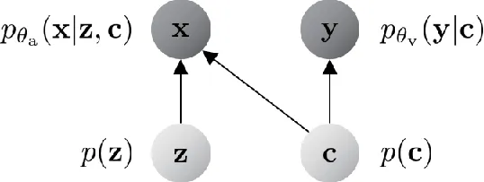
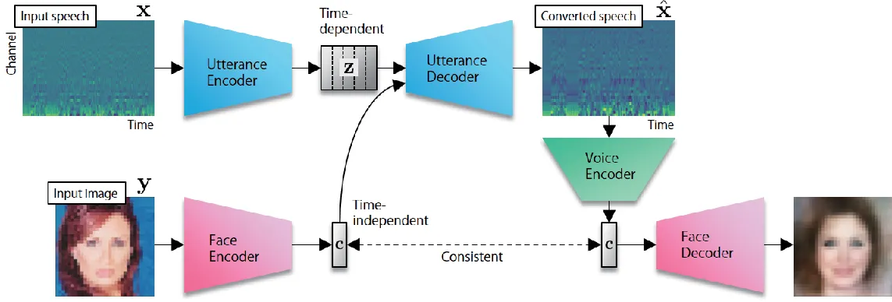
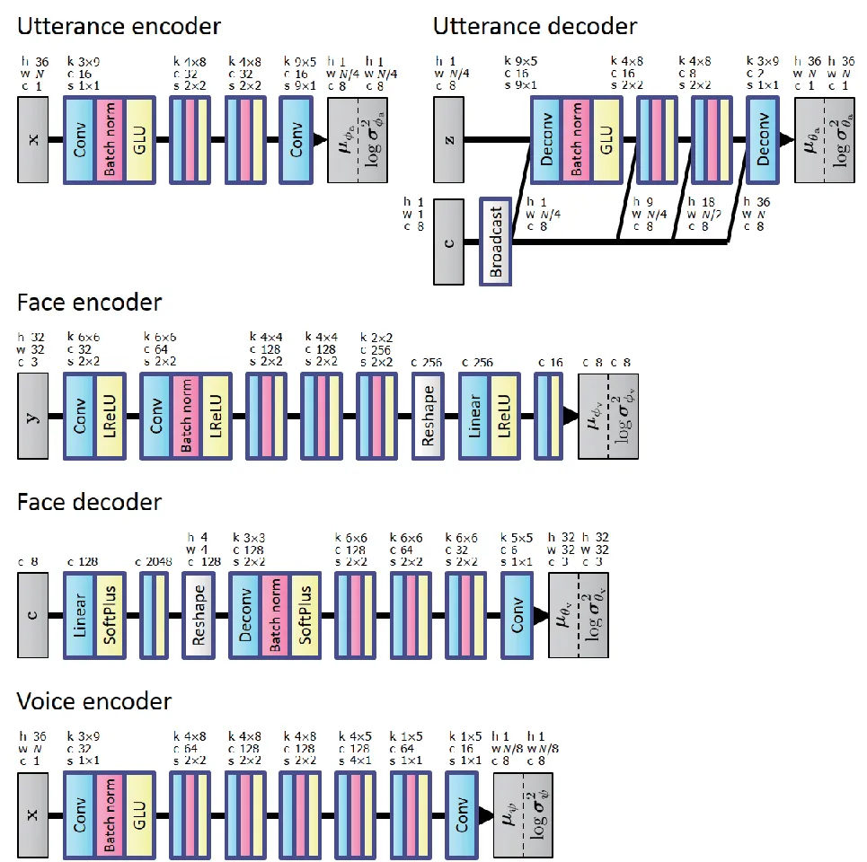
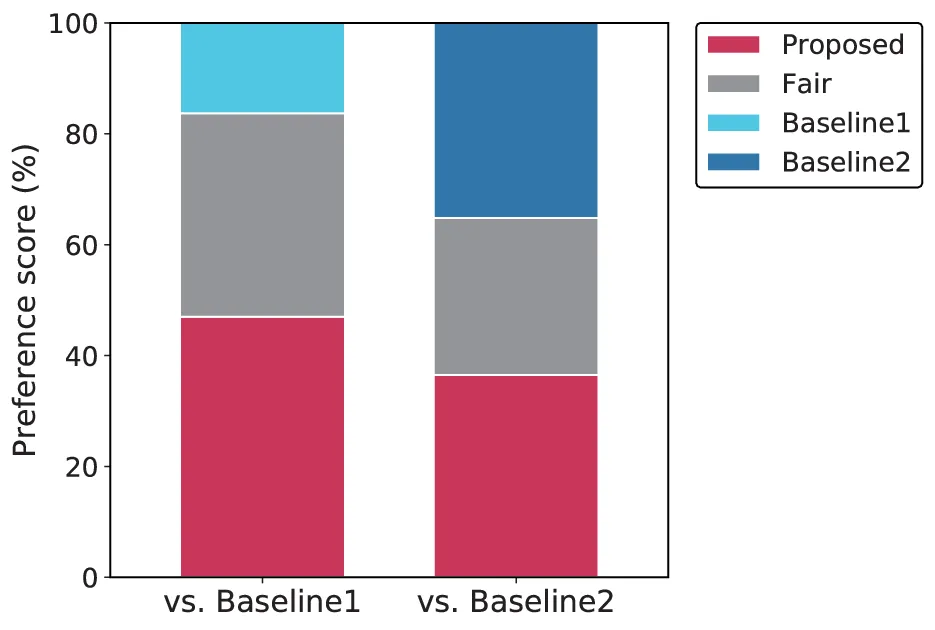
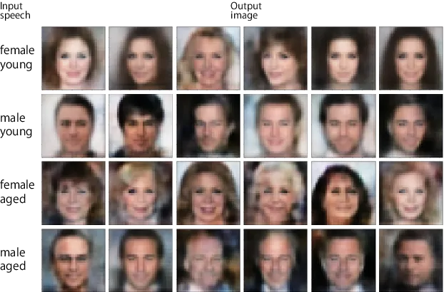

# Crossmodal Voice Conversion

###### Abstract

Humans are able to imagine a person’s voice from the person’s appearance
and imagine the person’s appearance from his/her voice. In this paper,
we make the first attempt to develop a method that can convert speech
into a voice that matches an input face image and generate a face image
that matches the voice of the input speech by leveraging the correlation
between faces and voices. We propose a model, consisting of a speech
converter, a face encoder/decoder and a voice encoder. We use the latent
code of an input face image encoded by the face encoder as the auxiliary
input into the speech converter and train the speech converter so that
the original latent code can be recovered from the generated speech by
the voice encoder. We also train the face decoder along with the face
encoder to ensure that the latent code will contain sufficient
information to reconstruct the input face image. We confirmed
experimentally that a speech converter trained in this way was able to
convert input speech into a voice that matched an input face image and
that the voice encoder and face decoder can be used to generate a face
image that matches the voice of the input speech.

Hirokazu Kameoka, Kou Tanaka, Aarón Valero Puche, Yasunori Ohishi,
Takuhiro Kaneko

NTT Communication Science Laboratories, Nippon Telegraph and Telephone
Corporation

hirokazu.kameoka.uh@hco.ntt.co.jp

Index Terms: crossmodal audio/visual generation, voice conversion, face
image generation, deep generative models

## 1 Introduction

Humans are able to imagine a person’s voice solely from that person’s
appearance and imagine the person’s appearance solely from his/her
voice. Although such predictions are not always accurate, the fact that
we can sense if there is a mismatch between voice and appearance should
indicate the possibility of being a certain correlation between voices
and appearance. In fact, recent studies by Smith et al. \[1\] have
revealed that the information provided by faces and voices is so similar
that people can match novel faces and voices of the same sex, ethnicity,
and age-group at a level significantly above chance. Here, an
interesting question is whether it is technically possible to predict
the voice of a person only from an image of his/her face and predict a
person’s face only from his/her voice. In this paper, we make the first
attempt to develop a method that can convert speech into a voice that
matches an input face image and that can generate a face image that
matches the voice providing input speech by learning and leveraging the
underlying correlation between faces and voices.

Several attempts have recently been made to tackle the tasks of
crossmodal audio/image processing, including voice/face recognition
\[2\] and audio/image generation \[3, 4, 5\]. The former task involves
detecting which of two given face images is that of the speaker, given
only an audio clip of someone speaking. Hence, this task differs from
ours in that it does not involve audio/image generation. The latter task
involves generating sounds from images/videos. The methods presented in
\[3, 4, 5\] are designed to predict very short sound clips (e.g., 0.5 to
2 seconds long) such as the sounds made by musical instruments, dogs,
and babies crying, and are unsuited to generating longer audio clips
with richer variations in time such as speech utterances. By contrast,
our task is crossmodal voice conversion (VC), namely converting given
speech utterances where the target voice characteristics are determined
by visual inputs.

VC is a technique for converting the voice characteristics of an input
utterance such as the perceived identity of a speaker while preserving
linguistic information. Potential applications of VC techniques include
speaker-identity modification, speaking aids, speech enhancement, and
pronunciation conversion. Typically, many conventional VC methods
utilize accurately aligned parallel utterances of source and target
speech to train acoustic models for feature mapping \[6, 7, 8\].
Recently, some attempts have also been made to develop non-parallel VC
methods \[9, 10, 11, 12, 13, 14, 15, 16\], which require no parallel
utterances, transcriptions, or time alignment procedures. One approach
to non-parallel VC involves a framework based on conditional variational
autoencoders (CVAEs) \[11, 12, 13, 14\]. As the name implies,
variational autoencoders (VAEs) \[17\] are a probabilistic counterpart
of autoencoders, consisting of encoder and decoder networks. CVAEs
\[18\] are an extended version of VAEs where the encoder and decoder
networks can additionally take an auxiliary input. By using acoustic
features as the training examples and the associated attribute (e.g.,
speaker identity) labels as the auxiliary input, the networks are able
to learn how to convert an attribute of source speech to a target
attribute according to the attribute label fed into the decoder. As a
different approach, in \[15\] we proposed a method using a variant of a
generative adversarial network (GAN) \[19\] called a cycle-consistent
GAN (CycleGAN) \[20, 21, 22\]. Although this method was shown to work
reasonably well, one major limitation is that it is designed to learn
only mappings between a pair of domains. To overcome this limitation, we
subsequently proposed in \[16\] a method incorporating an extension of
CycleGAN called StarGAN \[23\]. This method is capable of simultaneously
learning mappings between multiple domains using a single generator
network where the attributes of the generator outputs are controlled by
an auxiliary input. StarGAN uses an auxiliary classifier to train the
generator so that the attributes of the generator outputs are correctly
predicted by the classifier. We further proposed a method based on a
concept that combined StarGAN and CVAE, called an auxiliary classifier
VAE (ACVAE) \[14\]. An ACVAE employs a generator with a CVAE structure
and uses an auxiliary classifier to train the generator in the same way
as StarGAN. Training the generator in this way can be interpreted as
increasing the lower bound of the mutual information between the
auxiliary input and the generator output.

In this paper, we propose extending the idea behind the ACVAE to build a
model for crossmodal VC. Specifically, we use the latent code of an
auxiliary face image input encoded by a face encoder as the auxiliary
input into the speech generator and use a voice encoder to train the
generator so that the original latent code can be recovered from the
generated speech using the voice encoder. We also train a face decoder
along with the face encoder to ensure that the latent code will contain
sufficient information to reconstruct the input face image. In this way,
the speech generator is expected to learn how to convert input speech
into a voice characteristic that matches an auxiliary face image input
and the voice encoder and the face decoder can be used to generate a
face image that matches the voice characteristic of input speech.

## 2 Method

### 2.1 Variational Autoencoder (VAE)

Our model employs VAEs \[17, 18\] as building blocks. Here, we briefly
introduce the principle behind VAEs.

VAEs are stochastic neural network models consisting of encoder and
decoder networks. The encoder aims to encode given data
$`\bm{\mathbf{x}}`$ into a (typically) lower dimensional latent
representation $`\bm{\mathbf{z}}`$ whereas the decoder aims to recover
the data $`\bm{\mathbf{x}}`$ from the latent representation
$`\bm{\mathbf{z}}`$. The decoder is modeled as a neural network (decoder
network) that produces a set of parameters for a conditional
distribution $`p_{\theta}(\bm{\mathbf{x}}|\bm{\mathbf{z}})`$ where
$`\theta`$ denotes the network parameters. To obtain an encoder using
$`p_{\theta}(\bm{\mathbf{x}}|\bm{\mathbf{z}})`$, we must compute the
posterior
$`p_{\theta}(\bm{\mathbf{z}}|\bm{\mathbf{x}})=p_{\theta}(\bm{\mathbf{x}}|\bm{\mathbf{z}})p(\bm{\mathbf{z}})/p_{\theta}(\bm{\mathbf{x}})`$.
However, computing the exact posterior is usually difficult since
$`p_{\theta}(\bm{\mathbf{x}})`$ involves an intractable integral over
$`\bm{\mathbf{z}}`$. The idea of VAEs is to sidestep the direct
computation of this posterior by introducing another neural network
(encoder network) for approximating the exact posterior
$`p_{\theta}(\bm{\mathbf{z}}|\bm{\mathbf{x}})`$. As with the decoder
network, the encoder network generates a set of parameters for the
conditional distribution $`q_{\phi}(\bm{\mathbf{z}}|\bm{\mathbf{x}})`$
where $`\phi`$ denotes the network parameters. The goal of VAEs is to
learn the parameters of the encoder and decoder networks so that the
encoder distribution $`q_{\phi}(\bm{\mathbf{z}}|\bm{\mathbf{x}})`$
becomes consistent with the posterior
$`p_{\theta}(\bm{\mathbf{z}}|\bm{\mathbf{x}})\propto p_{\theta}(\bm{\mathbf{x}}|\bm{\mathbf{z}})p(\bm{\mathbf{z}})`$.
We can show that the Kullback-Leibler (KL) divergence between
$`q_{\phi}(\bm{\mathbf{z}}|\bm{\mathbf{x}})`$ and
$`p_{\theta}(\bm{\mathbf{z}}|\bm{\mathbf{x}})`$ is given as

```math
{\rm KL}[q_{\phi}(\bm{\mathbf{z}}|\bm{\mathbf{x}})\|p_{\theta}(\bm{\mathbf{z}}|\bm{\mathbf{x}})]=\log p(\bm{\mathbf{x}})\\
-\mathbb{E}_{\bm{\mathbf{z}}\sim q_{\phi}(\bm{\mathbf{z}}|\bm{\mathbf{x}})}[\log p_{\theta}(\bm{\mathbf{x}}|\bm{\mathbf{z}})]+{\rm KL}[q_{\phi}(\bm{\mathbf{z}}|\bm{\mathbf{x}})\|p(\bm{\mathbf{z}})]. \tag{1}
```

Here, it should be noted that since
$`{\rm KL}[q_{\phi}(\bm{\mathbf{z}}|\bm{\mathbf{x}})\|p_{\theta}(\bm{\mathbf{z}}|\bm{\mathbf{x}})]\geq 0`$,
$`\mathbb{E}_{\bm{\mathbf{z}}\sim q_{\phi}(\bm{\mathbf{z}}|\bm{\mathbf{x}})}[\log p_{\theta}(\bm{\mathbf{x}}|\bm{\mathbf{z}})]-{\rm KL}[q_{\phi}(\bm{\mathbf{z}}|\bm{\mathbf{x}})\|p(\bm{\mathbf{z}})]`$
is shown to be a lower bound for $`\log p(\bm{\mathbf{x}})`$. Given
training examples,

```math
\mathcal{J}(\theta,\phi)=\mathbb{E}_{\bm{\mathbf{x}}\sim p_{\rm d}(\bm{\mathbf{x}})}\big[\mathbb{E}_{\bm{\mathbf{z}}\sim q_{\phi}(\bm{\mathbf{z}}|\bm{\mathbf{x}})}[\log p_{\theta}(\bm{\mathbf{x}}|\bm{\mathbf{z}})]\\
-{\rm KL}[q_{\phi}(\bm{\mathbf{z}}|\bm{\mathbf{x}})\|p(\bm{\mathbf{z}})]\big], \tag{2}
```

can be used as the training criterion to be maximized with respect to
$`\theta`$ and $`\phi`$, where
$`\mathbb{E}_{\bm{\mathbf{x}}\sim p_{\rm d}(\bm{\mathbf{x}})}[\cdot]`$
denotes the sample mean over the training examples. Obviously,
$`\mathcal{J}(\theta,\phi)`$ is maximized when the exact posterior is
obtained
$`q_{\phi}(\bm{\mathbf{z}}|\bm{\mathbf{x}})=p_{\theta}(\bm{\mathbf{z}}|\bm{\mathbf{x}})`$.

One typical way of modeling
$`q_{\phi}(\bm{\mathbf{z}}|\bm{\mathbf{x}})`$,
$`p_{\theta}(\bm{\mathbf{x}}|\bm{\mathbf{z}})`$ and
$`p(\bm{\mathbf{z}})`$ is to assume Gaussian distributions

```math
\displaystyle q_{\phi}(\bm{\mathbf{z}}|\bm{\mathbf{x}}) \displaystyle=\mathcal{N}(\bm{\mathbf{z}}|{\bm{\mu}}_{\phi}(\bm{\mathbf{x}}),{\rm diag}({\bm{\sigma}}_{\phi}^{2}(\bm{\mathbf{x}}))), \tag{3}
```

```math
\displaystyle p_{\theta}(\bm{\mathbf{x}}|\bm{\mathbf{z}}) \displaystyle=\mathcal{N}(\bm{\mathbf{x}}|{\bm{\mu}}_{\theta}(\bm{\mathbf{z}}),{\rm diag}({\bm{\sigma}}_{\theta}^{2}(\bm{\mathbf{z}}))), \tag{4}
```

```math
\displaystyle p(\bm{\mathbf{z}}) \displaystyle=\mathcal{N}(\bm{\mathbf{z}}|{\bf 0},{\bf I}), \tag{5}
```

where $`{\bm{\mu}}_{\phi}(\bm{\mathbf{x}})`$ and
$`{\bm{\sigma}}_{\phi}^{2}(\bm{\mathbf{x}})`$ are the outputs of an
encoder network with parameter $`\phi`$, and
$`{\bm{\mu}}_{\theta}(\bm{\mathbf{z}})`$ and
$`{\bm{\sigma}}_{\theta}^{2}(\bm{\mathbf{z}})`$ are the outputs of a
decoder network with parameter $`\theta`$. The first term of (2) can be
interpreted as an autoencoder reconstruction error. Here, it should be
noted that to compute this term, we must compute the expectation with
respect to
$`\bm{\mathbf{z}}\sim q_{\phi}(\bm{\mathbf{z}}|\bm{\mathbf{x}})`$. Since
this expectation cannot be expressed in an analytical form, one way of
computing it involves using a Monte Carlo approximation. However, simply
sampling $`\bm{\mathbf{z}}`$ from
$`q_{\phi}(\bm{\mathbf{z}}|\bm{\mathbf{x}})`$ does not work, since once
$`\bm{\mathbf{z}}`$ is sampled, $`\bm{\mathbf{z}}`$ is no longer a
function of $`\phi`$ and so it becomes impossible to evaluate the
gradient of $`\mathcal{J}(\theta,\phi)`$ with respect to $`\phi`$.
Fortunately, by using a reparameterization
$`\bm{\mathbf{z}}={\bm{\mu}}_{\phi}(\bm{\mathbf{x}})+{\bm{\sigma}}_{\phi}(\bm{\mathbf{x}})\odot{\bm{\epsilon}}`$
with
$`{\bm{\epsilon}}\sim\mathcal{N}({\bm{\epsilon}}|{\mathbf{0}},{\mathbf{I}})`$,
sampling $`\bm{\mathbf{z}}`$ from
$`q_{\phi}(\bm{\mathbf{z}}|\bm{\mathbf{x}})`$ can be replaced by
sampling $`{\bm{\epsilon}}`$ from the distribution, which is independent
of $`\phi`$. This allows us to compute the gradient of the first term of
$`\mathcal{J}(\theta,\phi)`$ with respect to $`\phi`$ by using a Monte
Carlo approximation of the expectation
$`\mathbb{E}_{\bm{\mathbf{z}}\sim q_{\phi}(\bm{\mathbf{z}}|\bm{\mathbf{x}})}[\cdot]`$.
The second term is given as the negative KL divergence between
$`q_{\phi}(\bm{\mathbf{z}}|\bm{\mathbf{x}})`$ and
$`p(\bm{\mathbf{z}})=\mathcal{N}(\bm{\mathbf{z}}|{\mathbf{0}},{\mathbf{I}})`$.
This term can be interpreted as a regularization term that forces each
element of the encoder output to be uncorrelated and normally
distributed. It should be noted that when
$`q_{\phi}(\bm{\mathbf{z}}|\bm{\mathbf{x}})`$ and $`p(\bm{\mathbf{z}})`$
are Gaussians, this term can be expressed as a function of $`\phi`$.

Conditional VAEs (CVAEs) \[18\] are an extended version of VAEs with the
only difference being that the encoder and decoder networks can take an
auxiliary input $`c`$. With CVAEs, (3) and (4) are replaced with

```math
\displaystyle q_{\phi}(\bm{\mathbf{z}}|\bm{\mathbf{x}},c) \displaystyle=\mathcal{N}(\bm{\mathbf{z}}|{\bm{\mu}}_{\phi}(\bm{\mathbf{x}},c),{\rm diag}({\bm{\sigma}}_{\phi}^{2}(\bm{\mathbf{x}},c))), \tag{6}
```

```math
\displaystyle p_{\theta}(\bm{\mathbf{x}}|\bm{\mathbf{z}},c) \displaystyle=\mathcal{N}(\bm{\mathbf{x}}|{\bm{\mu}}_{\theta}(\bm{\mathbf{z}},c),{\rm diag}({\bm{\sigma}}_{\theta}^{2}(\bm{\mathbf{z}},c))), \tag{7}
```

and the training criterion to be maximized becomes

```math
\mathcal{J}(\theta,\phi)=\mathbb{E}_{(\bm{\mathbf{x}},c)\sim p_{\rm d}(\bm{\mathbf{x}},c)}\big[\mathbb{E}_{\bm{\mathbf{z}}\sim q_{\phi}(\bm{\mathbf{z}}|\bm{\mathbf{x}},c)}[\log p_{\theta}(\bm{\mathbf{x}}|\bm{\mathbf{z}},c)]\\
-{\rm KL}[q_{\phi}(\bm{\mathbf{z}}|\bm{\mathbf{x}},c)\|p(\bm{\mathbf{z}})]\big], \tag{8}
```

where
$`\mathbb{E}_{(\bm{\mathbf{x}},c)\sim p_{\rm d}(\bm{\mathbf{x}},c)}[\cdot]`$
denotes the sample mean over the training examples.

### 2.2 Proposed model

We use
$`\bm{\mathbf{x}}=[\bm{\mathbf{x}}_{1},\ldots,\bm{\mathbf{x}}_{N}]\in\mathbb{R}^{D\times N}`$
and $`\bm{\mathbf{y}}\in\mathbb{R}^{I\times J}`$ to denote the acoustic
feature vector sequence of a speech utterance and the face image of the
corresponding speaker. Now, we combine two VAEs to model the joint
distribution of $`\bm{\mathbf{x}}`$ and $`\bm{\mathbf{y}}`$. The encoder
for speech (hereafter, the utterance encoder) aims to encode
$`\bm{\mathbf{x}}`$ into a time-dependent latent variable sequence
$`\bm{\mathbf{z}}=[\bm{\mathbf{z}}_{1},\ldots,\bm{\mathbf{z}}_{N^{\prime}}]\in\mathbb{R}^{D^{\prime}\times N^{\prime}}`$
whereas the decoder (hereafter, the utterance decoder) aims to
reconstruct $`\bm{\mathbf{x}}`$ from $`\bm{\mathbf{z}}`$ using an
auxiliary input $`\bm{\mathbf{c}}`$. Ideally, we would like
$`\bm{\mathbf{z}}`$ to capture only the linguistic information contained
in $`\bm{\mathbf{x}}`$ and $`\bm{\mathbf{c}}`$ to contain information
about the target voice characteristics. Hence, we expect that the
encoder and decoder work as acoustic models for speech recognition and
speech synthesis so that they can be used to convert the voice of an
input utterance according to the auxiliary input $`\bm{\mathbf{c}}`$. We
use the time-independent latent code of an image $`\bm{\mathbf{y}}`$
encoded by the encoder for face images (hereafter, the face encoder) as
the auxiliary input $`\bm{\mathbf{c}}`$ into the utterance decoder. The
decoder for face images (hereafter, the face decoder) is designed to
reconstruct $`\bm{\mathbf{y}}`$ from $`\bm{\mathbf{c}}`$. Fig. 1 shows
the assumed graphical model for the joint distribution
$`p(\bm{\mathbf{x}},\bm{\mathbf{y}})`$.

Our model can be formally described as follows. The utterance/face
decoders and the utterance/face encoders are represented as the
conditional distributions
$`p_{\theta_{\rm a}}(\bm{\mathbf{x}}|\bm{\mathbf{z}},\bm{\mathbf{c}})`$,
$`p_{\theta_{\rm v}}(\bm{\mathbf{y}}|\bm{\mathbf{c}})`$,
$`q_{\phi_{\rm a}}(\bm{\mathbf{z}}|\bm{\mathbf{x}})`$ and
$`q_{\phi_{\rm v}}(\bm{\mathbf{c}}|\bm{\mathbf{y}})`$, expressed using
NNs with parameters $`\theta_{\rm a}`$, $`\theta_{\rm v}`$,
$`\phi_{\rm a}`$ and $`\phi_{\rm v}`$, respectively. Our aim is to
approximate the exact posterior
$`p(\bm{\mathbf{z}},\bm{\mathbf{c}}|\bm{\mathbf{x}},\bm{\mathbf{y}})\propto p_{\theta_{\rm a}}(\bm{\mathbf{x}}|\bm{\mathbf{z}},\bm{\mathbf{c}})p_{\theta_{\rm v}}(\bm{\mathbf{y}}|\bm{\mathbf{c}})`$
by
$`q(\bm{\mathbf{z}},\bm{\mathbf{c}}|\bm{\mathbf{x}},\bm{\mathbf{y}})=q_{\phi_{\rm a}}(\bm{\mathbf{z}}|\bm{\mathbf{x}})q_{\phi_{\rm v}}(\bm{\mathbf{c}}|\bm{\mathbf{y}})`$.
The KL divergence between these distributions is given as

```math
\displaystyle{\rm KL}[q(\bm{\mathbf{z}},\bm{\mathbf{c}}|\bm{\mathbf{x}},\bm{\mathbf{y}})\|p(\bm{\mathbf{z}},\bm{\mathbf{c}}|\bm{\mathbf{x}},\bm{\mathbf{y}})]=\log p(\bm{\mathbf{x}},\bm{\mathbf{y}})
```

```math
\displaystyle~~~~~~~~-\mathbb{E}_{\bm{\mathbf{c}}\sim q_{\phi_{\rm v}}(\bm{\mathbf{c}}|\bm{\mathbf{y}}),\bm{\mathbf{z}}\sim q_{\phi_{\rm a}}(\bm{\mathbf{z}}|\bm{\mathbf{x}})}[\log p_{\theta_{\rm a}}(\bm{\mathbf{x}}|\bm{\mathbf{z}},\bm{\mathbf{c}})]
```

```math
\displaystyle~~~~~~~~-\mathbb{E}_{\bm{\mathbf{c}}\sim q_{\phi_{\rm v}}(\bm{\mathbf{c}}|\bm{\mathbf{y}})}[\log p_{\theta_{\rm v}}(\bm{\mathbf{y}}|\bm{\mathbf{c}})]
```

```math
\displaystyle~~~~~~~~+{\rm KL}[q_{\phi_{\rm a}}(\bm{\mathbf{z}}|\bm{\mathbf{x}})\|p(\bm{\mathbf{z}})]+{\rm KL}[q_{\phi_{\rm v}}(\bm{\mathbf{c}}|\bm{\mathbf{y}})\|p(\bm{\mathbf{c}})]. \tag{9}
```

Hence, given the training examples of speech and face pairs
$`\{\bm{\mathbf{x}}_{m},\bm{\mathbf{y}}_{m}\}_{m=1}^{M}`$, we can use

```math
\displaystyle\mathcal{J}(\theta_{\rm a},\phi_{\rm a},\theta_{\rm v},\phi_{\rm v})
```

```math
\displaystyle= \displaystyle\mathbb{E}_{(\bm{\mathbf{x}},\bm{\mathbf{y}})\sim p_{\rm d}(\bm{\mathbf{x}},\bm{\mathbf{y}})}\mathbb{E}_{\bm{\mathbf{c}}\sim q_{\phi_{\rm v}}(\bm{\mathbf{c}}|\bm{\mathbf{y}}),\bm{\mathbf{z}}\sim q_{\phi_{\rm a}}(\bm{\mathbf{z}}|\bm{\mathbf{x}})}[\log p_{\theta_{\rm a}}(\bm{\mathbf{x}}|\bm{\mathbf{z}},\bm{\mathbf{c}})]
```

```math
\displaystyle+ \displaystyle\mathbb{E}_{\bm{\mathbf{y}}\sim p_{\rm d}(\bm{\mathbf{y}})}\mathbb{E}_{\bm{\mathbf{c}}\sim q_{\phi_{\rm v}}(\bm{\mathbf{c}}|\bm{\mathbf{y}})}[\log p_{\theta_{\rm v}}(\bm{\mathbf{y}}|\bm{\mathbf{c}})]
```

```math
\displaystyle- \displaystyle\mathbb{E}_{\bm{\mathbf{x}}\sim p_{\rm d}(\bm{\mathbf{x}})}{\rm KL}[q_{\phi_{\rm a}}(\bm{\mathbf{z}}|\bm{\mathbf{x}})\|p(\bm{\mathbf{z}})]
```

```math
\displaystyle- \displaystyle\mathbb{E}_{\bm{\mathbf{y}}\sim p_{\rm d}(\bm{\mathbf{y}})}{\rm KL}[q_{\phi_{\rm v}}(\bm{\mathbf{c}}|\bm{\mathbf{y}})\|p(\bm{\mathbf{c}})], \tag{10}
```

as the training criterion to be maximized with respect to
$`\theta_{\rm a}`$, $`\phi_{\rm a}`$, $`\theta_{\rm v}`$, and
$`\phi_{\rm v}`$, where
$`\mathbb{E}_{({\bm{\mathbf{x}}},{\bm{\mathbf{y}}})\sim p_{\rm d}({\bm{\mathbf{x}}},{\bm{\mathbf{y}}})}[\cdot]`$,
$`\mathbb{E}_{\bm{\mathbf{x}}\sim p_{\rm d}({\bm{\mathbf{x}}})}[\cdot]`$
and
$`\mathbb{E}_{\bm{\mathbf{y}}\sim p_{\rm d}({\bm{\mathbf{y}}})}[\cdot]`$
denote the sample means over the training examples. We assume the
encoder/decoder distributions for $`\bm{\mathbf{x}}`$ and
$`\bm{\mathbf{y}}`$ to be Gaussian distributions:

```math
\displaystyle q_{\phi_{\rm a}}(\bm{\mathbf{z}}|\bm{\mathbf{x}}) \displaystyle={\mathcal{N}}(\bm{\mathbf{z}}|{\bm{\mu}}_{\phi_{\rm a}}(\bm{\mathbf{x}}),{\rm diag}({\bm{\sigma}}_{\phi_{\rm a}}^{2}(\bm{\mathbf{x}}))), \tag{11}
```

```math
\displaystyle p_{\theta_{\rm a}}(\bm{\mathbf{x}}|\bm{\mathbf{z}},\bm{\mathbf{c}}) \displaystyle={\mathcal{N}}(\bm{\mathbf{x}}|{\bm{\mu}}_{\theta_{\rm a}}(\bm{\mathbf{z}},\bm{\mathbf{c}}),{\rm diag}({\bm{\sigma}}_{\theta_{\rm a}}^{2}(\bm{\mathbf{z}},\bm{\mathbf{c}}))), \tag{12}
```

```math
\displaystyle q_{\phi_{\rm v}}(\bm{\mathbf{c}}|\bm{\mathbf{y}}) \displaystyle={\mathcal{N}}(\bm{\mathbf{c}}|{\bm{\mu}}_{\phi_{\rm v}}(\bm{\mathbf{y}}),{\rm diag}({\bm{\sigma}}_{\phi_{\rm v}}^{2}(\bm{\mathbf{y}}))), \tag{13}
```

```math
\displaystyle p_{\theta_{\rm v}}(\bm{\mathbf{y}}|\bm{\mathbf{c}}) \displaystyle={\mathcal{N}}(\bm{\mathbf{y}}|{\bm{\mu}}_{\theta_{\rm v}}(\bm{\mathbf{c}}),{\rm diag}({\bm{\sigma}}_{\theta_{\rm v}}^{2}(\bm{\mathbf{c}}))), \tag{14}
```

where $`{\bm{\mu}}_{\phi_{\rm a}}(\bm{\mathbf{x}})`$ and
$`{\bm{\sigma}}_{\phi_{\rm a}}^{2}(\bm{\mathbf{x}})`$ are the outputs of
the utterance encoder network,
$`{\bm{\mu}}_{\theta_{\rm a}}(\bm{\mathbf{z}},\bm{\mathbf{c}})`$ and
$`{\bm{\sigma}}_{\theta_{\rm a}}^{2}(\bm{\mathbf{z}},\bm{\mathbf{c}})`$
are the outputs of the utterance decoder network,
$`{\bm{\mu}}_{\phi_{\rm v}}(\bm{\mathbf{y}})`$ and
$`{\bm{\sigma}}_{\phi_{\rm v}}^{2}(\bm{\mathbf{y}})`$ are the outputs of
the face encoder network, and
$`{\bm{\mu}}_{\theta_{\rm v}}(\bm{\mathbf{c}})`$ and
$`{\bm{\sigma}}_{\theta_{\rm v}}^{2}(\bm{\mathbf{c}})`$ are the outputs
of the face decoder network. We further assume $`p(\bm{\mathbf{z}})`$
and $`p(\bm{\mathbf{c}})`$ to be standard Gaussian distributions, namely
$`p(\bm{\mathbf{z}})={\mathcal{N}}(\bm{\mathbf{z}}|{\mathbf{0}},{\mathbf{I}})`$
and
$`p(\bm{\mathbf{c}})={\mathcal{N}}(\bm{\mathbf{c}}|{\mathbf{0}},{\mathbf{I}})`$.
It should be noted that we can use the same reparametrization trick as
in 2.1 to compute the gradients of
$`\mathcal{J}(\theta_{\rm a},\phi_{\rm a},\theta_{\rm v},\phi_{\rm v})`$
with respect to $`\phi_{\rm a}`$ and $`\phi_{\rm v}`$.

Since there are no explicit restrictions on the manner in which the
utterance decoder may use the auxiliary input $`\bm{\mathbf{c}}`$, we
introduce an information-theoretic regularization term to assist the
utterance decoder output to be correlated with $`\bm{\mathbf{c}}`$ as
far as possible. The mutual information for
$`\bm{\mathbf{x}}\sim p_{\theta_{\rm a}}(\bm{\mathbf{x}}|\bm{\mathbf{z}},\bm{\mathbf{c}})`$
and $`\bm{\mathbf{c}}`$ conditioned on $`\bm{\mathbf{z}}`$ can be
written as

```math
\displaystyle\mathcal{I}(\theta_{\rm a}) \displaystyle=\iint p(\bm{\mathbf{c}}^{\prime},\bm{\mathbf{x}})\log\frac{p(\bm{\mathbf{c}}^{\prime},\bm{\mathbf{x}})}{p(\bm{\mathbf{c}}^{\prime})p(\bm{\mathbf{x}})}\mbox{d}\bm{\mathbf{x}}\mbox{d}\bm{\mathbf{c}}^{\prime}
```

```math
\displaystyle=\iint p(\bm{\mathbf{x}})p(\bm{\mathbf{c}}^{\prime}|\bm{\mathbf{x}})\log p(\bm{\mathbf{c}}^{\prime}|\bm{\mathbf{x}})\mbox{d}\bm{\mathbf{x}}\mbox{d}\bm{\mathbf{c}}^{\prime}+H
```

```math
\displaystyle=\mathbb{E}_{\bm{\mathbf{x}}\sim p_{\theta_{\rm a}}(\bm{\mathbf{x}}|\bm{\mathbf{z}},\bm{\mathbf{c}}),\bm{\mathbf{c}}^{\prime}\sim p(\bm{\mathbf{c}}|\bm{\mathbf{x}})}[\log p(\bm{\mathbf{c}}^{\prime}|\bm{\mathbf{x}})]+H, \tag{15}
```

where $`H`$ represents the entropy of $`\bm{\mathbf{c}}`$, which can be
considered a constant term. In practice, $`\mathcal{I}(\theta_{\rm a})`$
is hard to optimize directly since it requires access to the posterior
$`p(\bm{\mathbf{c}}|\bm{\mathbf{x}})`$. Fortunately, we can obtain the
lower bound of the first term of $`\mathcal{I}(\theta_{\rm a})`$ by
introducing an auxiliary distribution
$`r(\bm{\mathbf{c}}|\bm{\mathbf{x}})`$

```math
\displaystyle\mathbb{E}_{\bm{\mathbf{x}}\sim p_{\theta_{\rm a}}(\bm{\mathbf{x}}|\bm{\mathbf{z}},\bm{\mathbf{c}}),\bm{\mathbf{c}}^{\prime}\sim p(\bm{\mathbf{c}}|\bm{\mathbf{x}})}[\log p(\bm{\mathbf{c}}^{\prime}|\bm{\mathbf{x}})]
```

```math
\displaystyle= \displaystyle\mathbb{E}_{\bm{\mathbf{x}}\sim p_{\theta_{\rm a}}(\bm{\mathbf{x}}|\bm{\mathbf{z}},\bm{\mathbf{c}}),\bm{\mathbf{c}}^{\prime}\sim p(\bm{\mathbf{c}}|\bm{\mathbf{x}})}\left[\log\frac{r(\bm{\mathbf{c}}^{\prime}|\bm{\mathbf{x}})p(\bm{\mathbf{c}}^{\prime}|\bm{\mathbf{x}})}{r(\bm{\mathbf{c}}^{\prime}|\bm{\mathbf{x}})}\right]
```

```math
\displaystyle\geq \displaystyle\mathbb{E}_{\bm{\mathbf{x}}\sim p_{\theta_{\rm a}}(\bm{\mathbf{x}}|\bm{\mathbf{z}},\bm{\mathbf{c}}),\bm{\mathbf{c}}^{\prime}\sim p(\bm{\mathbf{c}}|\bm{\mathbf{x}})}[\log r(\bm{\mathbf{c}}^{\prime}|\bm{\mathbf{x}})]
```

```math
\displaystyle= \displaystyle\mathbb{E}_{\bm{\mathbf{x}}\sim p_{\theta_{\rm a}}(\bm{\mathbf{x}}|\bm{\mathbf{z}},\bm{\mathbf{c}})}[\log r(\bm{\mathbf{c}}|\bm{\mathbf{x}})]. \tag{16}
```

This technique of lower bounding mutual information is called
variational information maximization \[24\]. The equality holds in (16)
when
$`r(\bm{\mathbf{c}}|\bm{\mathbf{x}})=p(\bm{\mathbf{c}}|\bm{\mathbf{x}})`$.
Hence, maximizing the lower bound (16) with respect to
$`r(\bm{\mathbf{c}}|\bm{\mathbf{x}})`$ corresponds to approximating
$`p(\bm{\mathbf{c}}|\bm{\mathbf{x}})`$ by
$`r(\bm{\mathbf{c}}|\bm{\mathbf{x}})`$ as well as approximating
$`\mathcal{I}(\theta_{\rm a})`$ by this lower bound. We can therefore
indirectly increase $`\mathcal{I}(\theta_{\rm a})`$ by increasing the
lower bound alternately with respect to
$`p_{\theta_{\rm a}}(\bm{\mathbf{x}}|\bm{\mathbf{z}},\bm{\mathbf{c}})`$
and $`r(\bm{\mathbf{c}}|\bm{\mathbf{x}})`$. One way to do this involves
expressing $`r(\bm{\mathbf{c}}|\bm{\mathbf{x}})`$ using an NN and
training it along with all other networks. Let us use the notation
$`r_{\psi}(\bm{\mathbf{c}}|\bm{\mathbf{x}})`$ to indicate
$`r(\bm{\mathbf{c}}|\bm{\mathbf{x}})`$ expressed using an NN with
parameter $`\psi`$. The role of
$`r_{\psi}(\bm{\mathbf{c}}|\bm{\mathbf{x}})`$ (hereafter, the voice
encoder) is to recover time-independent information about the voice
characteristics of $`\bm{\mathbf{x}}`$. For example, we can assume
$`r_{\psi}(\bm{\mathbf{c}}|\bm{\mathbf{x}})`$ to be a Gaussian
distribution

```math
\displaystyle r_{\psi}(\bm{\mathbf{c}}|\bm{\mathbf{x}})={\mathcal{N}}(\bm{\mathbf{c}}|{\bm{\mu}}_{\psi}(\bm{\mathbf{x}}),{\rm diag}({\bm{\sigma}}_{\psi}^{2}(\bm{\mathbf{x}}))), \tag{17}
```

where $`{\bm{\mu}}_{\psi}(\bm{\mathbf{x}})`$ and
$`{\bm{\sigma}}_{\psi}^{2}(\bm{\mathbf{x}})`$ are the outputs of the
voice encoder network. Under this assumption, (16) becomes a negative
weighted squared error between
$`\bm{\mathbf{c}}\sim q_{\phi_{\rm v}}(\bm{\mathbf{c}}|\bm{\mathbf{y}})`$
and $`{\bm{\mu}}_{\psi}(\bm{\mathbf{x}})`$. Thus, maximizing (16)
corresponds to forcing the outputs of the face and voice encoders to be
as consistent as possible. Hence, the regularization term that we would
like to maximize with respect to $`\theta_{\rm a}`$, $`\phi_{\rm a}`$,
$`\phi_{\rm v}`$ and $`\psi`$ becomes

```math
\mathcal{R}(\theta_{\rm a},\phi_{\rm a},\phi_{\rm v},\psi)=\mathbb{E}_{\tilde{\bm{\mathbf{x}}}\sim p_{\rm d}(\tilde{\bm{\mathbf{x}}}),\tilde{\bm{\mathbf{y}}}\sim p_{\rm d}(\tilde{\bm{\mathbf{y}}})}\\
\mathbb{E}_{\bm{\mathbf{z}}\sim q_{\phi_{\rm a}}(\bm{\mathbf{z}}|\tilde{\bm{\mathbf{x}}}),\bm{\mathbf{c}}\sim q_{\phi_{\rm v}}(\bm{\mathbf{c}}|\tilde{\bm{\mathbf{y}}})}\mathbb{E}_{\bm{\mathbf{x}}\sim p_{\theta_{\rm a}}(\bm{\mathbf{x}}|\bm{\mathbf{z}},\bm{\mathbf{c}})}[\log r_{\psi}(\bm{\mathbf{c}}|\bm{\mathbf{x}})], \tag{18}
```

where
$`\mathbb{E}_{\tilde{\bm{\mathbf{x}}}\sim p_{\rm d}(\tilde{\bm{\mathbf{x}}})}[\cdot]`$
and
$`\mathbb{E}_{\tilde{\bm{\mathbf{y}}}\sim p_{\rm d}(\tilde{\bm{\mathbf{y}}})}[\cdot]`$
denote the sample means over the training examples. Here, it should be
noted that to compute
$`\mathcal{R}(\theta_{\rm a},\phi_{\rm a},\phi_{\rm v},\psi)`$, we must
sample $`\bm{\mathbf{z}}`$ from
$`q_{\phi_{\rm a}}(\bm{\mathbf{z}}|\bm{\mathbf{x}})`$,
$`\bm{\mathbf{c}}`$ from
$`q_{\phi_{\rm v}}(\bm{\mathbf{c}}|\bm{\mathbf{y}})`$ and
$`\bm{\mathbf{x}}`$ from
$`p_{\theta_{\rm a}}(\bm{\mathbf{x}}|\bm{\mathbf{z}},\bm{\mathbf{c}})`$.
Fortunately, we can use the same reparameterization trick as in 2.1 to
compute the gradients of
$`\mathcal{R}(\theta_{\rm a},\phi_{\rm a},\phi_{\rm v},\psi)`$ with
respect to $`\theta_{\rm a}`$, $`\phi_{\rm a}`$, $`\phi_{\rm v}`$ and
$`\psi`$.

Overall, the training criterion to be maximized becomes

```math
\displaystyle\mathcal{J}(\theta_{\rm a},\phi_{\rm a},\theta_{\rm v},\phi_{\rm v})+\mathcal{R}(\theta_{\rm a},\phi_{\rm a},\phi_{\rm v},\psi). \tag{19}
```

Fig. 2 shows the overview of the proposed model.



Figure 1: Graphical model for $`p(\bm{\mathbf{x}},\bm{\mathbf{y}})`$



Figure 2: Overview of the present model

### 2.3 Generation processes

Given the acoustic feature sequence $`\bm{\mathbf{x}}`$ of input speech
and a target face image $`\bm{\mathbf{y}}`$, $`\bm{\mathbf{x}}`$ can be
converted via

```math
\displaystyle\hat{\bm{\mathbf{x}}}={\bm{\mu}}_{\theta_{\rm a}}({\bm{\mu}}_{\phi_{\rm a}}(\bm{\mathbf{x}}),{\bm{\mu}}_{\phi_{\rm v}}(\bm{\mathbf{y}})). \tag{20}
```

A time-domain signal can then be generated using an appropriate vocoder.
We can also generate a face image corresponding to the input speech
$`\bm{\mathbf{x}}`$ via

```math
\displaystyle\hat{\bm{\mathbf{y}}}={\bm{\mu}}_{\theta_{\rm v}}({\bm{\mu}}_{\psi}(\bm{\mathbf{x}})). \tag{21}
```

### 2.4 Network architectures

Utterance encoder/decoder:  As detailed in Fig. 3, the utterance
encoder/decoder networks are designed using fully convolutional
architectures with gated linear units (GLUs) \[25\]. The output of the
GLU block used in the present model is defined as
$`\mathsf{GLU}(\bm{\mathbf{X}})=\mathsf{B}_{1}(\mathsf{L}_{1}(\bm{\mathbf{X}}))\odot\sigma(\mathsf{B}_{2}(\mathsf{L}_{2}(\bm{\mathbf{X}})))`$
where $`\bm{\mathbf{X}}`$ is the layer input, $`\mathsf{L}_{1}`$ and
$`\mathsf{L}_{2}`$ denote convolution layers, $`\mathsf{B}_{1}`$ and
$`\mathsf{B}_{2}`$ denote batch normalization layers, and $`\sigma`$
denotes a sigmoid gate function. We used 2D convolutions to design the
convolution layers in the encoder and decoder, where
$`{\bm{\mathbf{x}}}`$ is treated as an image of size $`D\times N`$ with
1 channel.

Face encoder/decoder:  The face encoder/decoder networks are designed
using architectures inspired by those introduced in \[26\] for
conditional image generation.

Voice encoder:  As with the utterance encoder/decoder, the voice encoder
is designed using a fully convolutional architecture with GLUs. As shown
in Fig. 3, the voice encoder is designed to produce a time sequence of
the means (and variances) of latent vectors. Here, we expect each of
these latent vectors to represent information about the voice
characteristics of input speech within a different time region, which
must be time-independent. One way of implementing (17) would be to add a
pooling layer after the final layer so that the network produces the
time average of the latent vectors. However, rather than the time
average of these values, we would want each of these values to be as
close to $`\bm{\mathbf{c}}`$ as possible. Hence, here we choose to
implement (17) by treating $`\bm{\mathbf{c}}`$ as a broadcast version of
the latent code generated from the face encoder so that the
$`\bm{\mathbf{c}}`$ and $`{\bm{\mu}}_{\psi}(\bm{\mathbf{x}})`$ arrays
have compatible shapes.



Figure 3: Architectures of the utterance encoder/decoder, the face
encoder/decoder and the voice encoder. Here, the input and output of
each of the networks are interpreted as images, where “h”, “w” and “c”
denote the height, width and channel number, respectively. “Conv”,
“Deconv” and “Linear” denote convolution, transposed convolution and
affine transform, “Batch norm”, “GLU”, “LReLU” and “SoftPlus” denote
batch normalization, GLU, leaky rectified linear unit and softplus
layers, and “Broadcast” and “Reshape” denote broadcasting and reshaping
operations, respectively. “k”, “c” and “s” denote the kernel size,
output channel number and stride size of a convolution layer.

## 3 Experiments

To evaluate the proposed method, we created a virtual dataset consisting
of speech and face pairs by combining the Voice Conversion Challenge
2018 (VCC2018) \[27\] and Large-scale CelebFaces Attributes (CelebA)
\[28\] datasets. First, we divided the speech data in the VCC2018
dataset and the face image data in the CelebA dataset into training and
test sets. For each set, we segmented the speech and face image data
according to gender (male/female) and age (young/aged) attributes. We
then treated each pair, which consisted of a speech signal and a face
image randomly selected from groups with the same attributes, as
virtually paired data. This indicates that the correlation between each
speech and face image data pair was artificial. However, despite this,
we believe that testing with this dataset can still provide a useful
insight into the ability of the present method to capture and leverage
the underlying correlation to convert speech or to generate images in a
crossmodal manner.

All the face images were downsampled to 32$`\times`$32 pixels and all
the speech signals were sampled at 22,050 Hz. For each utterance, a
spectral envelope, a logarithmic fundamental frequency (log $`F_{0}`$),
and aperiodicities (APs) were extracted every 5 ms using the WORLD
analyzer \[29, 30\]. 36 mel-cepstral coefficients (MCCs) were then
extracted from each spectral envelope using the Speech Processing
Toolkit (SPTK) \[31\]. The aperiodicities were used directly without
modification. The signals of the converted speech were obtained from the
converted acoustic feature sequences using the WORLD synthesizer.

We implemented two methods as baselines for comparison, which assume the
availability of the gender and age attribute label assigned to each
data. One is a naive method that simply adjusts the mean and variance of
the feature vectors of the input speech for each feature dimension so
that they match those of the training examples with the same attributes
as the input speech. We refer to this method as “Baseline1”. The other
is a two-stage method, which performs face attribute detection followed
by attribute-conditioned VC. For the face attribute detector, we used
the same architecture as the face encoder described in Fig. 3 with the
only difference being that we added a softmax layer after the final
layer so that the network produced the probabilities of the input face
image being “male” and “young”. We trained this network using gender/age
attribute labels. For the attribute-conditioned VC, we used the ACVAE-VC
\[14\], also trained using gender/age attribute labels. We refer to this
method as “Baseline2”.

We conducted ABX tests to compare how well the voice of speech generated
by each of the methods matched the face image input, where “A” and “B”
were converted speech samples obtained with the proposed and baseline
methods and “X” was the face image used for the auxiliary input. With
these listening tests, “A” and “B” were presented in random order to
eliminate bias in the order of stimuli. Eleven listeners participated in
our listening tests. Each listener was presented “A”,“B”,“X”$`\times`$
30 utterances. Each listener was then asked to select “A”, “B” or “fair”
by evaluating which of the two matches “X” better. The results are shown
in Fig. 4. As the results reveal, the proposed method significantly
outperformed Baseline1 and performed comparably to Baseline2. It is
particularly noteworthy that the performance of the proposed method was
comparable to that of Baseline2 even though the baseline methods had the
advantage of using the attribute labels. Audio examples are provided at
\[32\].

Fig. 5 shows several examples of the face images predicted by the
proposed method from female and male speech. As can be seen from these
examples, the gender and age of the predicted face images are reasonably
consistent with those of the input speech, demonstrating an interesting
effect of the proposed method.



Figure 4: Results of the ABX test.



Figure 5: Examples of the face images predicted from young female, young
male, aged female and aged male speech, respectively (from top to bottom
rows).

## 4 Conclusions

This paper described the first attempt to solve the crossmodal VC
problem by introducing an extension of our previously proposed
non-parallel VC method called ACVAE-VC. Through experiments using a
virtual dataset combining the VCC2018 and CelebA datasets, we confirmed
that our method could convert input speech into a voice that matches an
auxiliary face image input and generate a face image that matches input
speech reasonably well. We are also interested in developing a
crossmodal text-to-speech system, where the task is to synthesize speech
from text with voice characteristics determined by an auxiliary face
image input.

Acknowledgements: We thank Mr. Ken Shirakawa (Kyoto University) for his
help in annotating the virtual corpus during his summer internship at
NTT. This work was supported by JSPS KAKENHI 17H01763.

## References

- \[1\] H. M. J. Smith, A. K. Dunn, T. Baguley, and P. C. Stacey,
  “Concordant cues in faces and voices: Testing the backup signal
  hypothesis,” _Evolutionary Psychology_, vol. 14, no. 1, pp.
  1–10, 2016.
- \[2\] A. Nagrani, S. Albanie, and A. Zisserman, “Seeing voices and
  hearing faces: Cross-modal biometric matching,” _arXiv:1804.00326
  \[cs.CV\]_, 2018.
- \[3\] L. Chen, S. Srivastava, Z. Duan, and C. Xu, “Deep cross-modal
  audio-visual generation,” _arXiv:1704.08292 \[cs.CV\]_, 2017.
- \[4\] Y. Zhou, Z. Wang, C. Fang, T. Bui, and T. L. Berg, “Visual to
  sound: Generating natural sound for videos in the wild,”
  _arXiv:1712.01393 \[cs.CV\]_, 2018.
- \[5\] W.-L. Hao, Z. Zhang, and H. Guan, “CMCGAN: A uniform framework
  for cross-modal visual-audio mutual generation,” in _Proc.
  AAAI_, 2018.
- \[6\] Y. Stylianou, O. Cappé, and E. Moulines, “Continuous
  probabilistic transform for voice conversion,” _IEEE Trans. SAP_,
  vol. 6, no. 2, pp. 131–142, 1998.
- \[7\] T. Toda, A. W. Black, and K. Tokuda, “Voice conversion based on
  maximum-likelihood estimation of spectral parameter trajectory,” _IEEE
  Trans. ASLP_, vol. 15, no. 8, pp. 2222–2235, 2007.
- \[8\] K. Kobayashi and T. Toda, “sprocket: Open-source voice
  conversion software,” in _Proc. Odyssey_, 2018, pp. 203–210.
- \[9\] F.-L. Xie, F. K. Soong, and H. Li, “A KL divergence and
  DNN-based approach to voice conversion without parallel training
  sentences,” in _Proc. Interspeech_, 2016, pp. 287–291.
- \[10\] T. Kinnunen, L. Juvela, P. Alku, and J. Yamagishi,
  “Non-parallel voice conversion using i-vector PLDA: Towards unifying
  speaker verification and transformation,” in _Proc. ICASSP_, 2017, pp.
  5535–5539.
- \[11\] C.-C. Hsu, H.-T. Hwang, Y.-C. Wu, Y. Tsao, and H.-M. Wang,
  “Voice conversion from non-parallel corpora using variational
  auto-encoder,” in _Proc. APSIPA_, 2016.
- \[12\] ——, “Voice conversion from unaligned corpora using variational
  autoencoding Wasserstein generative adversarial networks,” in _Proc.
  Interspeech_, 2017, pp. 3364–3368.
- \[13\] Y. Saito, Y. Ijima, K. Nishida, and S. Takamichi, “Non-parallel
  voice conversion using variational autoencoders conditioned by
  phonetic posteriorgrams and d-vectors,” in _Proc. ICASSP_, 2018, pp.
  5274–5278.
- \[14\] H. Kameoka, T. Kaneko, K. Tanaka, and N. Hojo, “ACVAE-VC:
  Non-parallel many-to-many voice conversion with auxiliary classifier
  variational autoencoder,” _arXiv:1808.05092 \[stat.ML\]_, Aug. 2018.
- \[15\] T. Kaneko and H. Kameoka, “Parallel-data-free voice conversion
  using cycle-consistent adversarial networks,” _arXiv:1711.11293
  \[stat.ML\]_, Nov. 2017.
- \[16\] H. Kameoka, T. Kaneko, K. Tanaka, and N. Hojo, “StarGAN-VC:
  Non-parallel many-to-many voice conversion with star generative
  adversarial networks,” _arXiv:1806.02169 \[cs.SD\]_, Jun. 2018.
- \[17\] D. P. Kingma and M. Welling, “Auto-encoding variational Bayes,”
  in _Proc. ICLR_, 2014.
- \[18\] D. P. Kingma, D. J. Rezendey, S. Mohamedy, and M. Welling,
  “Semi-supervised learning with deep generative models,” in _Adv.
  NIPS_, 2014, pp. 3581–3589.
- \[19\] I. Goodfellow, J. Pouget-Abadie, M. Mirza, B. Xu,
  D. Warde-Farley, S. Ozair, A. Courville, and Y. Bengio, “Generative
  adversarial nets,” in _Adv. NIPS_, 2014, pp. 2672–2680.
- \[20\] J.-Y. Zhu, T. Park, P. Isola, and A. A. Efros, “Unpaired
  image-to-image translation using cycle-consistent adversarial
  networks,” in _Proc. ICCV_, 2017, pp. 2223–2232.
- \[21\] T. Kim, M. Cha, H. Kim, J. K. Lee, and J. Kim, “Learning to
  discover cross-domain relations with generative adversarial networks,”
  in _Proc. ICML_, 2017, pp. 1857–1865.
- \[22\] Z. Yi, H. Zhang, P. Tan, and M. Gong, “DualGAN: Unsupervised
  dual learning for image-to-image translation,” in _Proc. ICCV_, 2017,
  pp. 2849–2857.
- \[23\] Y. Choi, M. Choi, M. Kim, J.-W. Ha, S. Kim, and J. Choo,
  “StarGAN: Unified generative adversarial networks for multi-domain
  image-to-image translation,” _arXiv:1711.09020 \[cs.CV\]_, Nov. 2017.
- \[24\] D. Barber and F. V. Agakov, “The IM algorithm: A variational
  approach to information maximization,” in _Proc. NIPS_, 2003.
- \[25\] Y. N. Dauphin, A. Fan, M. Auli, and D. Grangier, “Language
  modeling with gated convolutional networks,” in _Proc. ICML_, 2017,
  pp. 933–941.
- \[26\] X. Yan, J. Yang, K. Sohn, and H. Lee, “Attribute2Image:
  Conditional image generation from visual attributes,” in _Proc.
  ECCV_, 2016.
- \[27\] J. Lorenzo-Trueba, J. Yamagishi, T. Toda, D. Saito,
  F. Villavicencio, T. Kinnunen, and Z. Ling, “The voice conversion
  challenge 2018: Promoting development of parallel and nonparallel
  methods,” _arXiv:1804.04262 \[eess.AS\]_, Apr. 2018.
- \[28\] Z. Liu, P. Luo, X. Wang, and X. Tang, “Deep learning face
  attributes in the wild,” in _Proc. ICCV_, 2015.
- \[29\] M. Morise, F. Yokomori, and K. Ozawa, “WORLD: a vocoder-based
  high-quality speech synthesis system for real-time applications,”
  _IEICE Trans. Inf. Syst._, vol. E99-D, no. 7, pp. 1877–1884, 2016.
- \[30\]
  https://github.com/JeremyCCHsu/Python-Wrapper-for-World-Vocoder.
- \[31\] https://github.com/r9y9/pysptk.
- \[32\]
  http://www.kecl.ntt.co.jp/people/kameoka.hirokazu/Demos/crossmodal-vc/.
