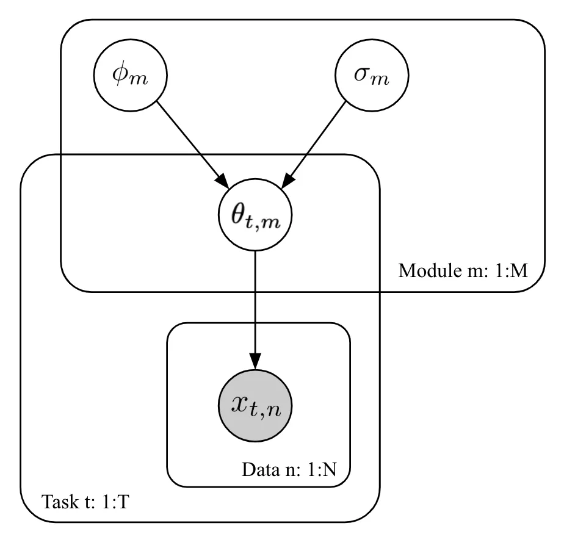
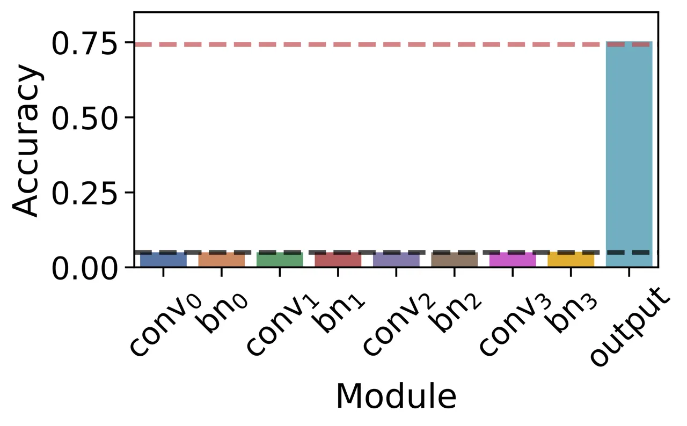
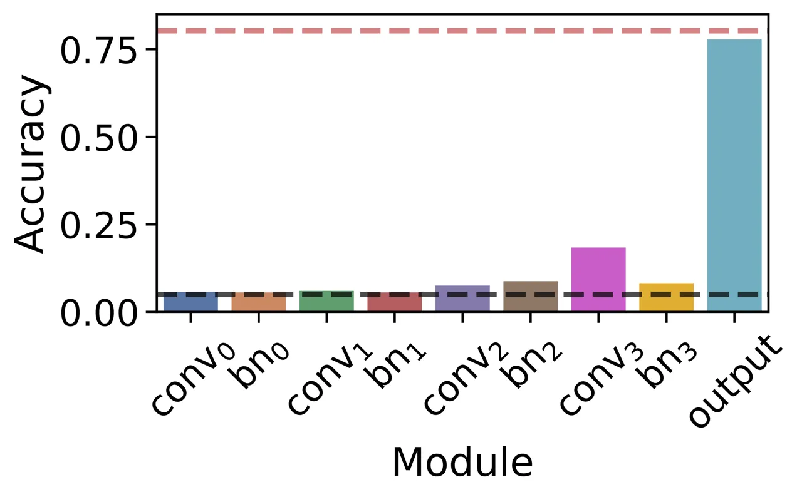
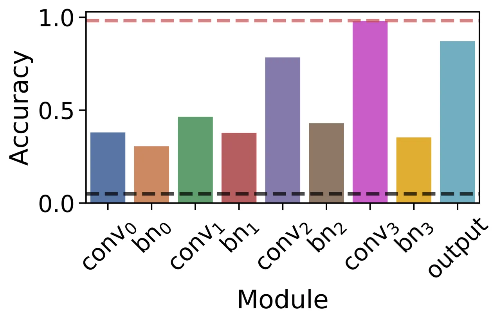
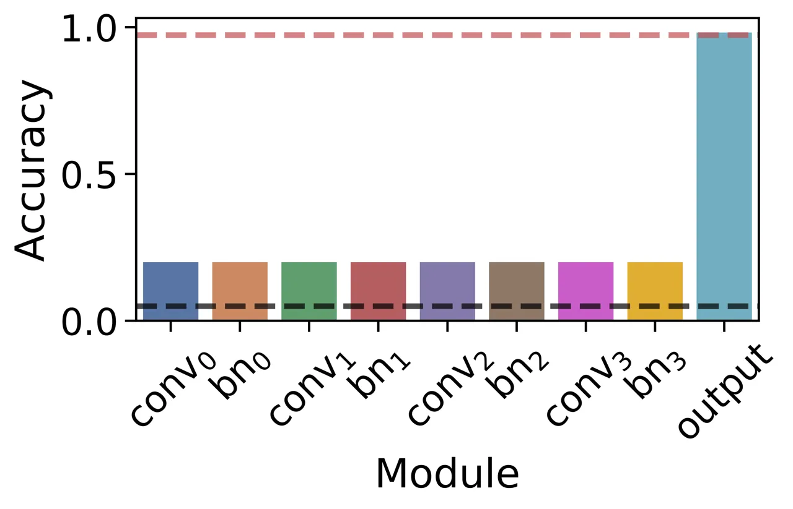
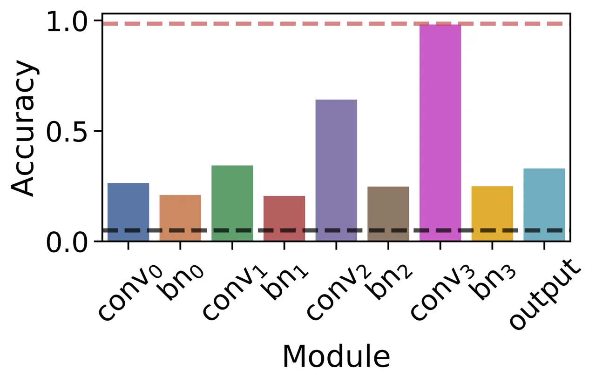
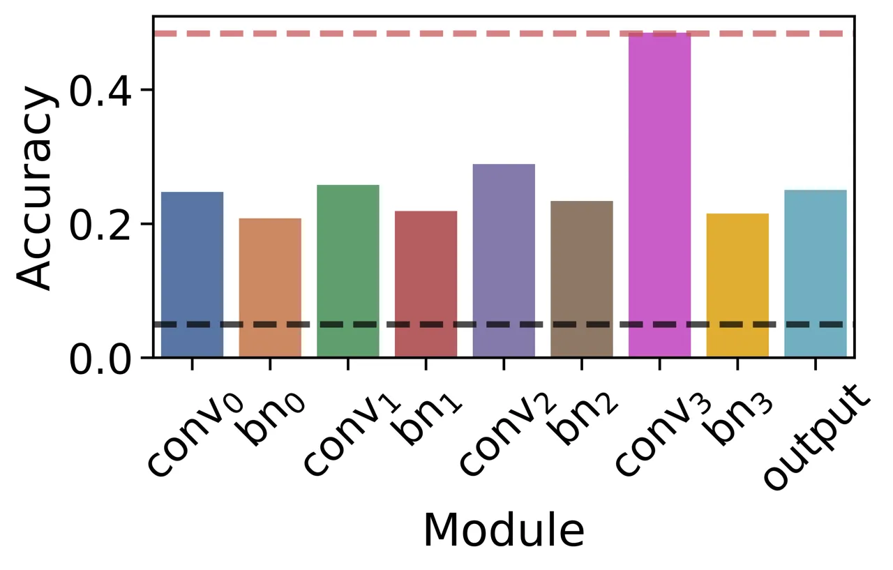
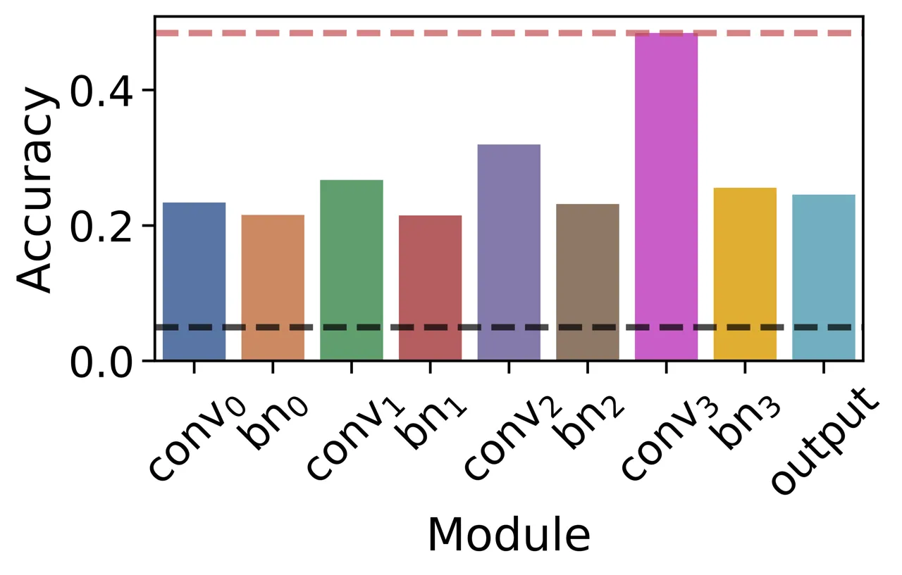
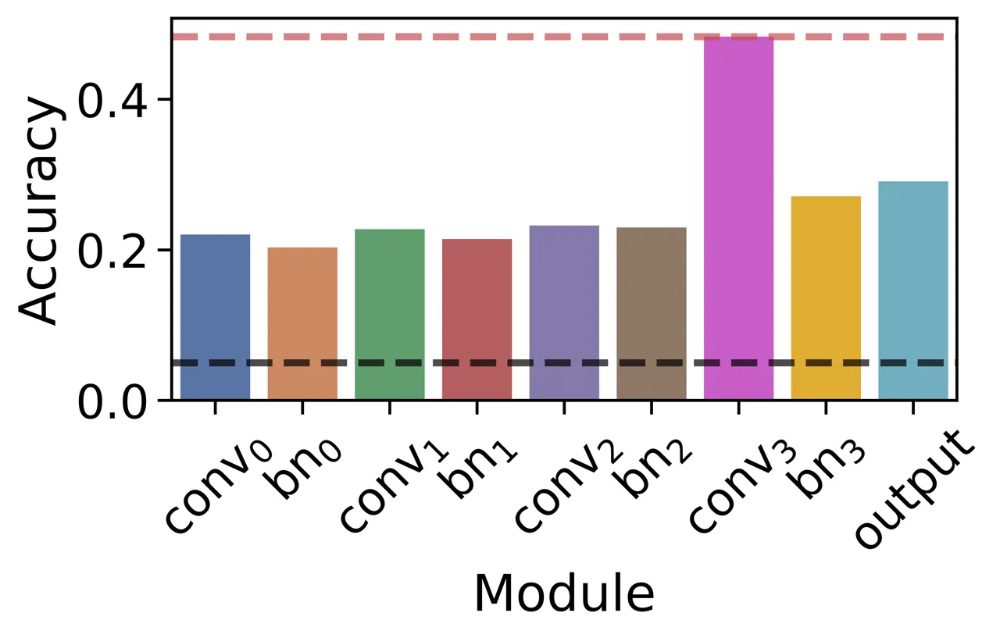

# Modular Meta-Learning with Shrinkage

Yutian Chen ^(†)^(†)thanks: Equal contribution.    Abram L. Friesen^(\*)
   Feryal Behbahani    Arnaud Doucet    David Budden    Matthew
W. Hoffman Affiliation: DeepMind Affiliation: London, UK
Affiliation: {yutianc, abef}@google.com    Nando de Freitas

###### Abstract

Many real-world problems, including multi-speaker text-to-speech
synthesis, can greatly benefit from the ability to meta-learn large
models with only a few task-specific components. Updating only these
task-specific modules then allows the model to be adapted to low-data
tasks for as many steps as necessary without risking overfitting.
Unfortunately, existing meta-learning methods either do not scale to
long adaptation or else rely on handcrafted task-specific architectures.
Here, we propose a meta-learning approach that obviates the need for
this often sub-optimal hand-selection. In particular, we develop general
techniques based on Bayesian shrinkage to automatically discover and
learn both task-specific and general reusable modules. Empirically, we
demonstrate that our method discovers a small set of meaningful
task-specific modules and outperforms existing meta-learning approaches
in domains like few-shot text-to-speech that have little task data and
long adaptation horizons. We also show that existing meta-learning
methods including MAML, iMAML, and Reptile emerge as special cases of
our method.

## 1 Introduction

The goal of meta-learning is to extract shared knowledge from a large
set of training tasks to solve held-out tasks more efficiently. One
avenue for achieving this is to learn task-agnostic modules and reuse or
repurpose these for new tasks. Reusing or repurposing modules can reduce
overfitting in low-data regimes, improve interpretability, and
facilitate the deployment of large multi-task models on limited-resource
devices as parameter sharing allows for significant savings in memory.
It can also enable batch evaluation of reused modules across tasks,
which can speed up inference time on GPUs.

These considerations are important in domains like few-shot
text-to-speech synthesis (TTS), characterized by large speaker-adaptable
models, limited training data for speaker adaptation, and long
adaptation horizons \[1\]. Adapting the model to a new task for more
optimization steps generally improves the model capacity without
increasing the number of parameters. However, many meta-learning methods
are designed for quick adaptation, and hence are inapplicable in this
_few data and long adaptation_ regime. For those that are
applicable \[2, 3, 4, 5\], adapting the full model to few data can then
fail because of overfitting. To overcome this, modern TTS models combine
shared core modules with handcrafted, adaptable, speaker-specific
modules \[6, 1, 7, 8\]. This hard coding strategy is often suboptimal.
As data increases, these hard-coded modules quickly become a bottleneck
for further improvement, even in a few-shot regime. For this reason, we
would like to automatically learn the smallest set of modules needed to
adapt to a new speaker and then adapt these for as long as needed.

Automatically learning reusable and broadly applicable modular
mechanisms is an open challenge in causality, transfer learning, and
domain adaptation \[9, 10, 11, 12\]. In meta-learning, most existing
gradient-based algorithms, such as MAML \[13\], do not encourage
meta-training to develop reusable and general modules, and either ignore
reusability or manually choose the modules to fix \[14, 15, 5, 16, 17,
18\]. Some methods implicitly learn a simple form of modularity for some
datasets  \[17, 19\] but it is limited.

In this paper, we introduce a novel approach for automatically finding
reusable modules. Our approach employs a principled hierarchical
Bayesian model that exploits a statistical property known as shrinkage,
meaning that low-evidence estimates tend towards their prior mean; e.g.,
see Gelman et al. \[20\]. This is accomplished by first partitioning any
neural network into arbitrary groups of parameters, which we refer to as
modules. We assign a Gaussian prior to each module with a scalar
variance. When the variance parameter shrinks to zero for a specific
module, as it does if the data does not require the module parameters to
deviate from the prior mean, then all of the module’s parameters become
tied to the prior mean during task adaptation. This results in a set of
automatically learned modules that can be reused at deployment time and
a sparse set of remaining modules that are adapted subject to the
estimated prior.

Estimating the prior parameters in our model corresponds to
meta-learning, and we present two principled methods for this based on
maximizing the predictive log-likelihood. Importantly, both methods
allow many adaptation steps. By considering non-modular variants of our
model, we show that MAML \[13\], Reptile \[2\], and iMAML \[3\] emerge
as special cases. We compare our proposed shrinkage-based methods with
their non-modular baselines on multiple low-data, long-adaptation
domains, including a challenging variant of Omniglot and TTS. Our
modular, shrinkage-based methods exhibit higher predictive power in
low-data regimes without sacrificing performance when more data is
available. Further, the discovered modular structures corroborate common
knowledge about network structure in computer vision and provide new
insights about WaveNet \[21\] layers in TTS.

In summary, we introduce a hierarchical Bayesian model for modular
meta-learning along with two parameter-estimation methods, which we show
generalize existing meta-learning algorithms. We then demonstrate that
our approach enables identification of a small set of meaningful
task-specific modules. Finally, we show that our method prevents
overfitting and improves predictive performance on problems that require
many adaptation steps given only small amounts of data.

### 1.1 Related Work

Multiple Bayesian meta-learning approaches have been proposed to either
provide model uncertainty in few-shot learning \[22, 23, 24, 25\] or to
provide a probabilistic interpretation and extend existing non-Bayesian
works \[26, 27, 28\]. However, to the best of our knowledge, none of
these account for modular structure in their formulation. While we use
point estimates of variables for computational reasons, more
sophisticated inference methods from these works can also be used within
our framework.

Modular meta-learning approaches based on MAML-style backpropagation
through short task adaptation horizons have also been proposed. The most
relevant of these, Alet et al. \[29\], proposes to learn a modular
network architecture, whereas our work identifies the adaptability of
each module. In other work, Zintgraf et al. \[16\] hand-designs the
task-specific and shared parameters, and the M-Net in Lee and Choi
\[14\] provides an alternative method for learning adaptable modules by
sampling binary mask variables. In all of the above, however,
backpropagating through task adaptation is computationally prohibitive
when applied to problems that require longer adaptation horizons. While
it is worth investigating how to extend these works to this setting, we
leave this for future work.

Many other meta-learning works \[14, 15, 5, 30, 31, 32\] learn the
learning rate (or a preconditioning matrix) which can have a similar
modular regularization effect as our approach if applied modularly with
fixed adaptation steps. However, these approaches and ours pursue
fundamentally different and orthogonal goals. Learning the learning rate
aims at fast optimization by fitting to local curvature, without
changing the task loss or associated stationary point. In contrast, our
method learns to control how far each module will move from its
initialization by changing that stationary point. In problems requiring
long task adaptation, these two approaches lead to different behaviors,
as we demonstrate in Appendix C. Further, most of these works also rely
on backpropagating through gradients, which does not scale well to the
long adaptation horizons considered in this work. Overall, generalizing
beyond the training horizon is challenging for “learning-to-optimize”
approaches  \[33, 34\]. While WarpGrad \[5\] does allow long adaptation
horizons, it is not straightforward to apply its use of a functional
mapping from inputs to a preconditioning matrix for module discovery and
we leave this for future work.

Finally, L2 regularization is also used for task adaptation in continual
learning \[35, 36\] and meta-learning \[37, 38, 39, 3\]. However, in
these works, the regularization scale(s) are either treated as
hyper-parameters or adapted per dimension with a different criterion
from our approach. It is not clear how to learn the regularization scale
at a module level in these works.

## 2 Gradient-based Meta-Learning

We begin with a general overview of gradient-based meta-learning, as
this is one of the most common approaches to meta-learning. In this
regime, we assume that there are many tasks, indexed by $`t`$, and that
each of these tasks has few data. That is, each task is associated with
a finite dataset $`\mathcal{D}_{t}=\{\mathbf{x}_{t,n}\}`$ of size
$`N_{t}`$, which can be partitioned into training and validation sets,
$`\mathcal{D}_{t}^{\text{train}}`$ and $`\mathcal{D}_{t}^{\text{val}}`$
respectively.  To solve a task, gradient-based meta-learning adapts
_task-specific parameters_ $`\boldsymbol{\theta}_{t}\in\real^{D}`$ by
minimizing a loss function
$`\ell(\mathcal{D}_{t};\boldsymbol{\theta}_{t})`$ using a local
optimizer. Adaptation is made more efficient by sharing a set of _meta
parameters_ $`\boldsymbol{\phi}\in\real^{D}`$ between tasks, which are
typically used to initialize the task parameters.

Algorithm 1 summarizes a typical stochastic meta-training procedure,
which includes MAML \[13\], implicit MAML (iMAML) \[3\], and
Reptile \[2\]. Here, TaskAdapt executes one step of optimization of the
task parameters. The meta-update $`\Delta_{t}`$ specifies the
contribution of task $`t`$ to the meta parameters. At test time,
multiple steps of TaskAdapt are run on each new test task.

Input: Batch size $`B`$, steps $`L`$, and learning rate $`\alpha`$

Initialize $`\boldsymbol{\phi}`$

while _not done_ do

     $`\{t_{1},\dots,t_{B}\}\leftarrow`$ sample mini-batch of tasks

     for _each task $`t`$ in $`\{t_{1},\dots,t_{B}\}`$_ do

          Initialize
$`\boldsymbol{\theta}_{t}\leftarrow\boldsymbol{\phi}`$

          for _step $`l=1\dots L`$_ do

               $`\boldsymbol{\theta}_{t}\leftarrow\textsc{TaskAdapt}(\mathcal{D}_{t},\boldsymbol{\phi},\boldsymbol{\theta}_{t})`$

          end for

     end for

      _//_ _Meta update_

     $`\boldsymbol{\phi}\leftarrow\boldsymbol{\phi}-\alpha\cdot\frac{1}{B}\sum_{t}\Delta_{t}(\mathcal{D}_{t},\boldsymbol{\phi},\boldsymbol{\theta}_{t})`$

end while

Algorithm 1 Meta-learning pseudocode.



Figure 1: (Left) Structure of a typical meta-learning algorithm. (Right)
Bayesian shrinkage graphical model. The shared meta parameters
$`\boldsymbol{\phi}`$ serve as the initialization of the neural network
parameters for each task $`\boldsymbol{\theta}_{t}`$. The
$`\boldsymbol{\sigma}`$ are shrinkage parameters. By learning these, the
model automatically decides which subsets of parameters (i.e., modules)
to fix for all tasks and which to adapt at test time.

MAML implements task adaptation by applying gradient descent to minimize
the training loss
$`\ell_{t}^{\text{train}}(\boldsymbol{\theta}_{t})=\ell(\mathcal{D}^{\text{train}}_{t};\boldsymbol{\theta}_{t})`$
with respect to the task parameters. It then updates the meta parameters
by gradient descent on the validation loss
$`\ell_{t}^{\text{val}}(\boldsymbol{\theta}_{t})=\ell(\mathcal{D}^{\text{val}}_{t};\boldsymbol{\theta}_{t})`$,
resulting in the meta update
$`\Delta_{t}^{\text{MAML}}=\nabla_{\boldsymbol{\phi}}\,\ell_{t}^{\text{val}}(\boldsymbol{\theta}_{t}(\boldsymbol{\phi})).`$
This approach treats the task parameters as a function of the meta
parameters, and hence requires backpropagating through the entire
$`L`$-step task adaptation process. When $`L`$ is large, as in TTS
systems \[1\], this becomes computationally prohibitive.

Reptile and iMAML avoid this computational burden of MAML. Reptile
instead optimizes $`\boldsymbol{\theta}_{t}`$ on the entire dataset
$`\mathcal{D}_{t}`$, and moves $`\boldsymbol{\phi}`$ towards the adapted
task parameters, yielding
$`\Delta_{t}^{\text{Reptile}}=\boldsymbol{\phi}-\boldsymbol{\theta}_{t}.`$
Conversely, iMAML introduces an L2 regularizer
$`\frac{\lambda}{2}||\boldsymbol{\theta}_{t}-\boldsymbol{\phi}||^{2}`$
and optimizes the task parameters on the regularized training loss.
Provided that this task adaptation process converges to a stationary
point, _implicit differentiation_ enables the computation of the meta
gradient based only on the final solution of the adaptation process,
$`\Delta_{t}^{\text{iMAML}}=\big(\mathbf{I}+\tfrac{1}{\lambda}\nabla^{2}_{\boldsymbol{\theta}_{t}}\ell_{t}^{\text{train}}(\boldsymbol{\theta}_{t})\big)^{-1}\nabla_{\boldsymbol{\theta}_{t}}\ell_{t}^{\text{val}}(\boldsymbol{\theta}_{t}).`$
See Rajeswaran et al. \[3\] for details.

## 3 Modular Bayesian Meta-Learning

In standard meta-learning, the meta parameters $`\boldsymbol{\phi}`$
provide an initialization for the task parameters
$`\boldsymbol{\theta}`$ at test time. That is, all the neural network
parameters are treated equally, and hence they must all be updated at
test time. This strategy is inefficient and prone to overfitting. To
overcome it, researchers often split the network parameters into two
groups, a group that varies across tasks and a group that is shared; see
for example \[1, 16\]. This division is heuristic, so in this work we
explore ways of automating it to achieve better results and to enable
automatic discovery of task independent modules. More precisely, we
assume that the network parameters can be partitioned into $`M`$
disjoint modules
$`\boldsymbol{\theta}_{t}=(\boldsymbol{\theta}_{t,1},\ldots,\boldsymbol{\theta}_{t,m},\ldots,\boldsymbol{\theta}_{t,M})`$
where $`\boldsymbol{\theta}_{t,m}`$ are the parameters in module $`m`$
for task $`t`$. This view of modules is very general. Modules can
correspond to layers, receptive fields, the encoder and decoder in an
auto-encoder, the heads in a multi-task learning model, or any other
grouping of interest.

We adopt a hierarchical Bayesian model, shown in Figure 1, with a
factored probability density:

```math
p(\boldsymbol{\theta}_{1:T},\mathcal{D}|\boldsymbol{\sigma}^{2},\boldsymbol{\phi})=\prod_{t=1}^{T}\prod_{m=1}^{M}{\cal N}(\boldsymbol{\theta}_{t,m}|\boldsymbol{\phi}_{m},\sigma_{m}^{2}\mathbf{I})\prod_{t=1}^{T}p(\mathcal{D}_{t}|\boldsymbol{\theta}_{t}). \tag{1}
```

The $`\boldsymbol{\theta}_{t,m}`$ are conditionally independent and
normally distributed
$`\boldsymbol{\theta}_{t,m}\sim{\cal N}(\boldsymbol{\theta}_{t,m}|\boldsymbol{\phi}_{m},\sigma_{m}^{2}\mathbf{I})`$
with mean $`\boldsymbol{\phi}_{m}`$ and variance $`\sigma_{m}^{2}`$,
where $`\mathbf{I}`$ is the identity matrix.

The $`m`$-th module scalar shrinkage parameter $`\sigma_{m}^{2}`$
measures the degree to which $`\boldsymbol{\theta}_{t,m}`$ can deviate
from $`\boldsymbol{\phi}_{m}`$. More precisely, for values of
$`\sigma_{m}^{2}`$ near zero, the difference between parameters
$`\boldsymbol{\theta}_{t,m}`$ and mean $`\boldsymbol{\phi}_{m}`$ will be
shrunk to zero and thus module $`m`$ will become task independent. Thus
by learning the parameters $`\boldsymbol{\sigma}^{2}`$, we discover
which modules are task independent. These independent modules can be
reused at test time, reducing the computational burden of adaptation and
likely improving generalization. Shrinkage is often used in automatic
relevance determination for sparse feature selection \[40\].

We place uninformative priors on $`\boldsymbol{\phi}_{m}`$ and
$`\sigma_{m}`$, and follow an empirical Bayes approach to learn their
values from data. This formulation allows the model to automatically
learn which modules to reuse—i.e. those modules for which
$`\sigma_{m}^{2}`$ is near zero—and which to adapt at test time.

## 4 Meta-Learning as Parameter Estimation

By adopting the hierarchical Bayesian model from the previous section,
the problem of meta-learning becomes one of estimating the parameters
$`\boldsymbol{\phi}`$ and $`\boldsymbol{\sigma}^{2}`$. A standard
solution to this problem is to maximize the marginal likelihood
$`p(\mathcal{D}|\boldsymbol{\phi},\boldsymbol{\sigma}^{2})=\int p(\mathcal{D}|\boldsymbol{\theta})p(\boldsymbol{\theta}|\boldsymbol{\phi},\boldsymbol{\sigma}^{2})\,\textrm{d}\boldsymbol{\theta}`$.
We can also assign a prior over $`\boldsymbol{\phi}`$. In both cases,
the marginalizations are intractable, so we must seek scalable
approximations.

It may be tempting to estimate the parameters by maximizing
$`p(\boldsymbol{\theta}_{1:T},\mathcal{D}|\boldsymbol{\sigma}^{2},\boldsymbol{\phi})`$
w.r.t.
$`(\boldsymbol{\sigma}^{2},\boldsymbol{\phi},\boldsymbol{\theta}_{1:T})`$,
but the following lemma suggests that this naive approach leads to all
task parameters being tied to the prior mean, i.e. no adaptation will
occur (see Appendix A for a proof):

###### Lemma 1.

The function
$`f:(\boldsymbol{\sigma}^{2},\boldsymbol{\phi},\boldsymbol{\theta}_{1:T})\mapsto\log p(\boldsymbol{\theta}_{1:T},\mathcal{D}|\boldsymbol{\sigma}^{2},\boldsymbol{\phi})`$
diverges to $`+\infty`$ as $`\boldsymbol{\sigma}^{2}\rightarrow 0^{+}`$
when $`\boldsymbol{\theta}_{t,m}=\boldsymbol{\phi}_{m}`$ for all
$`t\in\{1,...,T\},m\in\{1,...,M\}`$.

The undesirable result of Lemma 1 is caused by the use of point estimate
of $`\boldsymbol{\theta}_{1:T}`$ in maximum likelihood estimation of
$`\boldsymbol{\sigma}^{2}`$ and $`\boldsymbol{\phi}`$. In the following
two subsections, we propose two principled alternative approaches for
parameter estimation based on maximizing the predictive likelihood over
validation subsets.

### 4.1 Parameter estimation via the predictive likelihood

Our goal is to minimize the average negative predictive log-likelihood
over $`T`$ validation tasks,

```math
\displaystyle\ell_{\mathrm{PLL}}(\boldsymbol{\sigma}^{2}\hskip-2.84526pt,\boldsymbol{\phi}) \displaystyle\hskip-2.84526pt=-\frac{1}{T}\hskip-2.84526pt\sum_{t=1}^{T}\hskip-1.13809pt\log p\left(\mathcal{D}_{t}^{\text{val}}|\mathcal{D}_{t}^{\text{train}}\hskip-2.84526pt,\boldsymbol{\sigma}^{2}\hskip-2.84526pt,\boldsymbol{\phi}\right)\hskip-2.84526pt=\frac{1}{T}\hskip-2.84526pt\sum_{t=1}^{T}\hskip-1.13809pt\log\hskip-2.84526pt\int\hskip-2.84526ptp(\mathcal{D}_{t}^{\text{val}}|\boldsymbol{\theta}_{t})\,p(\boldsymbol{\theta}_{t}|\mathcal{D}_{t}^{\text{train}}\hskip-2.84526pt,\boldsymbol{\sigma}^{2}\hskip-2.84526pt,\boldsymbol{\phi})\,\textrm{d}\boldsymbol{\theta}_{t}. \tag{2}
```

To justify this goal, assume that the training and validation data is
distributed i.i.d according to some distribution
$`\nu(\mathcal{D}_{t}^{\text{train}},\mathcal{D}_{t}^{\text{val}})`$.
Then, the law of large numbers implies that as $`T\rightarrow\infty`$,

```math
\displaystyle\ell_{\mathrm{PLL}}(\boldsymbol{\sigma}^{2},\boldsymbol{\phi})\rightarrow\mathbb{E}_{\nu(\mathcal{D}_{t}^{\text{train}})}[\textrm{KL}(\nu(\mathcal{D}_{t}^{\text{val}}|\mathcal{D}_{t}^{\text{train}})||p\left(\mathcal{D}_{t}^{\text{val}}|\mathcal{D}_{t}^{\text{train}},\boldsymbol{\sigma}^{2},\boldsymbol{\phi}\right))]+\textrm{H}(\nu(\mathcal{D}_{t}^{\text{val}}|\mathcal{D}_{t}^{\text{train}})), \tag{3}
```

where KL denotes the Kullback-Leibler divergence and H the entropy. Thus
minimizing $`\ell_{\mathrm{PLL}}`$ with respect to the meta parameters
corresponds to selecting the predictive distribution
$`p\left(\mathcal{D}_{t}^{\text{val}}|\mathcal{D}_{t}^{\text{train}},\boldsymbol{\sigma}^{2},\boldsymbol{\phi}\right)`$
that is closest (approximately) to the true predictive distribution
$`\nu(\mathcal{D}_{t}^{\text{val}}|\mathcal{D}_{t}^{\text{train}})`$ on
average. This criterion can be thought of as an approximation to a
Bayesian cross-validation criterion \[41\].

Computing $`\ell_{\mathrm{PLL}}`$ is not feasible due to the intractable
integral in equation (2). Instead we make use of a simple maximum a
posteriori (MAP) approximation of the task parameters:

```math
\displaystyle\hat{\boldsymbol{\theta}}_{t}(\boldsymbol{\sigma}^{2},\boldsymbol{\phi})=\argmin\limits_{\boldsymbol{\theta}_{t}}\ell_{t}^{\text{train}}(\boldsymbol{\theta}_{t},\boldsymbol{\sigma}^{2},\boldsymbol{\phi}),~\text{where }\ell_{t}^{\text{train}}\coloneqq-\log p\left(\mathcal{D}_{t}^{\text{train}}|\boldsymbol{\theta}_{t}\right)-\log p\left(\boldsymbol{\theta}_{t}|\boldsymbol{\sigma}^{2},\boldsymbol{\phi}\right). \tag{4}
```

We note for clarity that $`\ell_{t}^{\text{train}}`$ corresponds to the
negative log of equation (1) for a single task. Using these MAP
estimates, we can approximate
$`\ell_{\mathrm{PLL}}(\boldsymbol{\sigma}^{2},\boldsymbol{\phi})`$ as
follows:

```math
\displaystyle\hat{\ell}_{\mathrm{PLL}}(\boldsymbol{\sigma}^{2},\boldsymbol{\phi})=\frac{1}{T}\sum_{t=1}^{T}\ell_{t}^{\text{val}}(\hat{\boldsymbol{\theta}}_{t}(\boldsymbol{\sigma}^{2},\boldsymbol{\phi})),\;\;~\text{ where }\ell_{t}^{\text{val}}\coloneqq-\log p\big(\mathcal{D}_{t}^{\text{val}}|\hat{\boldsymbol{\theta}}_{t}\big). \tag{5}
```

We use this loss to construct a meta-learning algorithm with the same
structure as Algorithm 1. Individual task adaptation follows from
equation (4) and meta updating from minimizing
$`\hat{\ell}_{\mathrm{PLL}}(\boldsymbol{\sigma}^{2},\boldsymbol{\phi})`$
in equation (5) with an unbiased gradient estimator and a mini-batch of
sampled tasks.

Minimizing equation (5) is a bi-level optimization problem that requires
solving equation (4) implicitly. If optimizing
$`\ell_{t}^{\text{train}}`$ requires only a small number of local
optimization steps, we can compute the update for $`\boldsymbol{\phi}`$
and $`\boldsymbol{\sigma}^{2}`$ with back-propagation through
$`\hat{\boldsymbol{\theta}}_{t}`$, yielding

```math
\displaystyle\Delta_{t}^{\text{$\boldsymbol{\sigma}${}-MAML{}}}=\nabla_{\boldsymbol{\sigma}^{2},\boldsymbol{\phi}}\,\ell_{t}^{\text{val}}(\hat{\boldsymbol{\theta}}_{t}(\boldsymbol{\sigma}^{2},\boldsymbol{\phi})). \tag{6}
```

This update reduces to that of MAML if
$`\sigma_{m}^{2}\rightarrow\infty`$ for all modules and is thus denoted
as $`\boldsymbol{\sigma}`$-MAML.

We are however more interested in long adaptation horizons for which
back-propagation through the adaptation becomes computationally
expensive and numerically unstable. Instead, we apply the _implicit
function theorem_ on equation (4) to compute the gradient of
$`\hat{\boldsymbol{\theta}}_{t}`$ with respect to
$`\boldsymbol{\sigma}^{2}`$ and $`\boldsymbol{\phi}`$, giving

```math
\displaystyle\Delta_{t}^{\text{$\boldsymbol{\sigma}${}-iMAML{}}}=-\nabla_{\boldsymbol{\theta}_{t}}\ell_{t}^{\text{val}}(\boldsymbol{\theta}_{t})\mathbf{H}_{\boldsymbol{\theta}_{t}\boldsymbol{\theta}_{t}}^{-1}\mathbf{H}_{\boldsymbol{\theta}_{t}\boldsymbol{\Phi}}, \tag{7}
```

where $`\boldsymbol{\Phi}=(\boldsymbol{\sigma}^{2},\boldsymbol{\phi})`$
is the full vector of meta-parameters,
$`\mathbf{H}_{ab}=\nabla_{a,b}^{2}\ell_{t}^{\text{train}}`$, and
derivatives are evaluated at the stationary point
$`\boldsymbol{\theta}_{t}=\hat{\boldsymbol{\theta}}_{t}(\boldsymbol{\sigma}^{2},\boldsymbol{\phi})`$.
A detailed derivation is provided in Section B.1. Various approaches
have been proposed to approximate the inverse Hessian \[3, 42, 43, 44\].
We use the conjugate gradient algorithm. We show in Section B.2 that the
meta update for $`\boldsymbol{\phi}`$ is equivalent to that of iMAML
when $`\sigma_{m}^{2}`$ is constant for all $`m`$, and thus refer to
this more general method as $`\boldsymbol{\sigma}`$-iMAML.

In summary, our goal of maximizing the predictive likelihood of
validation data conditioned on training data for our hierarchical
Bayesian model results in modular generalizations of the MAML and iMAML
approaches. In the following subsection, we will see that the same is
also true for Reptile.

### 4.2 Estimating $`\boldsymbol{\phi}`$ via MAP approximation

If we instead let $`\boldsymbol{\phi}`$ be a random variable with prior
distribution $`p(\boldsymbol{\phi})`$, then we can derive a different
variant of the above algorithm. We return to the predictive
log-likelihood introduced in the previous section but now integrate out
the central parameter $`\boldsymbol{\phi}`$. Since $`\boldsymbol{\phi}`$
depends on all training data we will rewrite the average predictive
likelihood in terms of the joint posterior over
$`(\boldsymbol{\theta}_{1:T},\boldsymbol{\phi})`$, i.e.

```math
\displaystyle\ell_{\mathrm{PLL}}(\boldsymbol{\sigma}^{2}) \displaystyle\hskip-1.42262pt=\hskip-1.42262pt-\frac{1}{T}\log p(\mathcal{D}_{1:T}^{\text{val}}|\mathcal{D}_{1:T}^{\text{train}},\boldsymbol{\sigma}^{2})\hskip-1.42262pt=\hskip-1.42262pt-\frac{1}{T}\log\hskip-2.84526pt\int\hskip-4.2679pt\Big(\hskip-1.42262pt\prod_{t=1}^{T}p(\mathcal{D}_{t}^{\text{val}}|\boldsymbol{\theta}_{t})\hskip-1.42262pt\Big)p(\boldsymbol{\theta}_{1:T},\boldsymbol{\phi}|\mathcal{D}_{1:T}^{\text{train}},\boldsymbol{\sigma}^{2})\textrm{d}\boldsymbol{\theta}_{1:T}\textrm{d}\boldsymbol{\phi}. \tag{8}
```

Again, to address the intractable integral we make use of a MAP
approximation, except in this case we approximate both the task
parameters and the central meta parameter as

```math
\displaystyle\hskip-10.00002pt(\hat{\boldsymbol{\theta}}_{1:T}(\boldsymbol{\sigma}^{2}),\hat{\boldsymbol{\phi}}(\boldsymbol{\sigma}^{2}))\hskip-1.42262pt=\argmin\limits_{\boldsymbol{\theta}_{1:T},\hskip-1.42262pt\boldsymbol{\phi}}\,\hskip-2.84526pt-\hskip-1.42262pt\log p(\boldsymbol{\theta}_{1:T},\boldsymbol{\phi}|\mathcal{D}_{1:T}^{\text{train}},\boldsymbol{\sigma}^{2})\hskip-1.42262pt=\argmin\limits_{\boldsymbol{\theta}_{1:T},\hskip-1.42262pt\boldsymbol{\phi}}\hskip-2.84526pt\sum_{t=1}^{T}\hskip-1.42262pt\ell_{t}^{\text{train}}(\boldsymbol{\theta}_{t},\boldsymbol{\sigma}^{2},\hskip-1.42262pt\boldsymbol{\phi})\hskip-1.42262pt-\hskip-1.42262pt\log p(\boldsymbol{\phi}). \tag{9}
```

We assume a flat prior for $`\boldsymbol{\phi}`$ in this paper and thus
drop the second term above. Note that when the number of training tasks
$`T`$ is small, an informative prior would be preferred. We can then
estimate the shrinkage parameter $`\boldsymbol{\sigma}^{2}`$ by plugging
this approximation into Eq. 8. This method gives the same task
adaptation update as the previous section but a meta update of the form

```math
\displaystyle\Delta_{t,\boldsymbol{\phi}_{m}}^{\text{$\boldsymbol{\sigma}${}-Reptile{}}}=\frac{1}{\sigma_{m}^{2}}(\boldsymbol{\phi}_{m}-\hat{\boldsymbol{\theta}}_{m,t}),~~\Delta_{t,\boldsymbol{\sigma}^{2}}^{\text{$\boldsymbol{\sigma}${}-Reptile{}}}=-\nabla_{\boldsymbol{\theta}_{t}}\ell_{t}^{\text{val}}(\boldsymbol{\theta}_{t})\mathbf{H}_{\boldsymbol{\theta}_{t}\boldsymbol{\theta}_{t}}^{-1}\mathbf{H}_{\boldsymbol{\theta}_{t}\boldsymbol{\sigma}^{2}}\,, \tag{10}
```

where derivatives are evaluated at
$`\boldsymbol{\theta}_{t}=\hat{\boldsymbol{\theta}}_{t}(\boldsymbol{\sigma}^{2})`$,
and the gradient of $`\hat{\boldsymbol{\phi}}`$ w.r.t.
$`\boldsymbol{\sigma}^{2}`$ is ignored. Due to lack of space, further
justification and derivation of this approach is provided in
Sections B.3 and B.4.

We can see that Reptile is a special case of this method when
$`\sigma_{m}^{2}\rightarrow\infty`$ and we choose a learning rate
proportional to $`\sigma_{m}^{2}`$ for $`\boldsymbol{\phi}_{m}`$. We
thus refer to it as $`\boldsymbol{\sigma}`$-Reptile.

Table 1 compares our proposed algorithms with existing algorithms in the
literature. Our three algorithms reduce to the algorithms on the left
when $`\sigma_{m}^{2}\rightarrow\infty`$ or a constant scalar for all
modules. Another variant of MAML for long adaptation, first-order MAML,
can be recovered as a special case of iMAML when using one step of
conjugate gradient descent to compute the inverse Hessian \[3\].

|                                              |                | Fixed $`\boldsymbol{\sigma}^{2}`$ | Learned $`\boldsymbol{\sigma}^{2}`$ | Allows long adaptation? |
| -------------------------------------------- | -------------- | --------------------------------- | ----------------------------------- | ----------------------- |
| $`\hat{\boldsymbol{\phi}}_{\mathrm{joint}}`$ |                | Reptile                           | $`\boldsymbol{\sigma}`$-Reptile     | ✓                       |
| $`\hat{\boldsymbol{\phi}}_{\mathrm{PLL}}`$   | Back-prop.     | MAML                              | $`\boldsymbol{\sigma}`$-MAML        | $`\times`$              |
|                                              | Implicit grad. | iMAML                             | $`\boldsymbol{\sigma}`$-iMAML       | ✓                       |

Table 1: The above algorithms result from different approximations to
the predictive likelihood.

### 4.3 Task-Specific Module Selection

When the parameters $`\boldsymbol{\phi}`$ and
$`\boldsymbol{\sigma}^{2}`$ are estimated accurately, the values of
$`\sigma_{m}^{2}`$ for task-independent modules shrink towards zero. The
remaining modules with non-zero $`\sigma_{m}^{2}`$ are considered
task-specific \[40\]. In practice, however, the estimated value of
$`\sigma_{m}^{2}`$ will never be exactly zero due to the use of
stochastic optimization and the approximation in estimating the meta
gradients. We therefore apply a weak regularization on
$`\boldsymbol{\sigma}^{2}`$ to encourage its components to be small
unless nonzero values are supported by evidence from the task data (see
Appendix D for details).

While the learned $`\sigma_{m}^{2}`$ values are still non-zero, in most
of our experiments below, the estimated value $`\sigma_{m}^{2}`$ for
task-independent modules is either numerically indistinguishable from
$`0`$ or at least two orders of magnitude smaller than the value for the
task-specific modules. This reduces the gap between meta-training, where
all modules have non-zero $`\sigma_{m}^{2}`$, and meta-testing, where a
sparse set of modules are selected for adaptation. The exception to this
is the text-to-speech experiment where we find the gap of
$`\sigma_{m}^{2}`$ between modules to not be as large as in the image
experiments. Thus, we instead rank the modules by the value of
$`\sigma_{m}^{2}`$ and select the top-ranked modules as task-specific.

Ranking and selecting task-specific modules using the estimated value of
$`\sigma_{m}^{2}`$ allows us to trade off between module sparsity and
model capacity in practice, and achieves robustness against overfitting.
It remains unclear in theory, however, if the task sensitivity of a
module is always positively correlated with $`\sigma_{m}^{2}`$
especially when the size of modules varies widely. This is an
interesting question that we leave for future investigation.

## 5 Experimental Evaluation

We evaluate our shrinkage-based methods on challenging meta-learning
domains that have small amounts of data and require long adaptation
horizons, such as few-shot text-to-speech voice synthesis. The aim of
our evaluation is to answer the following three questions: (1) Does
shrinkage enable automatic discovery of a small set of task-specific
modules? (2) Can we adapt only the task-specific modules without
sacrificing performance? (3) Does incorporating a shrinkage prior
improve performance and robustness to overfitting in problems with
little data and long adaptation horizons?

### 5.1 Experiment setup

Our focus is on long adaptation, low data regimes. To this end, we
compare iMAML and Reptile to their corresponding shrinkage variants,
$`\boldsymbol{\sigma}`$-iMAML and $`\boldsymbol{\sigma}`$-Reptile. For
task adaptation with the shrinkage variants, we use proximal gradient
descent \[45\] for the image experiments, and introduce a proximal
variant of Adam \[46\] (pseudocode in Algorithm 3) for the
text-to-speech (TTS) experiments. The proximal methods provide
robustness to changes in the prior strength $`\boldsymbol{\sigma}^{2}`$
over time. We provide further algorithmic details in Appendix D. We
evaluate on the following domains.

Few-shot image classification. We use the augmented Omniglot protocol of
Flennerhag et al. \[4\], which necessitates long-horizon adaptation. For
each alphabet, $`20`$ characters are sampled to define a $`20`$-class
classification problem. The domain is challenging because both train and
test images are randomly augmented. Following Flennerhag et al. \[4\],
we use a 4-layer convnet and perform $`100`$ steps of task adaptation.
We consider two regimes: (Large-data regime) We use $`30`$ training
alphabets ($`T=30`$), $`15`$ training images ($`K=15`$), and $`5`$
validation images per class. Each image is randomly re-scaled,
translated, and rotated. (Small-data regime) To study the effect of
overfitting, we vary $`T\in\{5,10,15,20\}`$ and $`K\in\{1,3,5,10,15\}`$,
and augment only by scaling and translating.

Text-to-speech voice synthesis. Training a neural TTS model from scratch
typically requires tens of hours of speech data. In the few-shot
learning setting \[6, 1, 7, 8\], the goal is to adapt a trained model to
a new speaker based on only a few minutes of data. Earlier work
unsuccessfully applied fast-adaptation methods such as MAML to
synthesizing utterances \[1\]. Instead, their state-of-the-art method
first pretrains a multi-speaker model comprised of a shared core network
and a speaker embedding module and then finetunes either the entire
model or the embedding only. We remove the manually-designed speaker
embedding layers and perform task adaptation and meta-updates on only
the core network.

The core network is a WaveNet vocoder model \[21\] with $`30`$ residual
causal dilated convolutional blocks as the backbone, consisting of
roughly 3M parameters. For computational reasons, we use only one
quarter of the channels of the standard network. As a result, sample
quality does not reach production level but we expect the comparative
results to apply to the full network. We meta-train with tasks of
$`100`$ training utterances (about $`8`$ minutes) using 100 task
adaptation steps, then evaluate on held-out speakers with either $`100`$
or $`50`$ (about $`4`$ minutes) utterances and up to $`10,000`$
adaptation steps. For more details see Section E.2.

Short adaptation. While our focus is on long adaptation, we conduct
experiments on short-adaptation datasets (sinusoid regression, standard
Omniglot, and miniImageNet) for completeness in Appendix E.

### 5.2 Module discovery

To determine whether shrinkage discovers task-specific modules, we
examine the learned prior strengths of each module and then adapt
individual (or a subset of the) modules to assess the effect on
performance due to adapting the chosen modules. In these experiments, we
treat each layer as a module but other choices of modules are
straightforward.

(a) $`\boldsymbol{\sigma}^{2}`$ for $`\boldsymbol{\sigma}`$-iMAML.

(b) $`\boldsymbol{\sigma}^{2}`$ for $`\boldsymbol{\sigma}`$-Reptile.



(c) $`\boldsymbol{\sigma}`$-iMAML accuracy.



(d) $`\boldsymbol{\sigma}`$-Reptile accuracy.

Figure 2: Module discovery with $`\boldsymbol{\sigma}`$-iMAML and
$`\boldsymbol{\sigma}`$-Reptile for large-data augmented Omniglot. (a,b)
The learned $`\boldsymbol{\sigma}^{2}`$ for each module (y-axis is log
scale). (c,d) Test accuracy when only that layer is adapted versus when
all layers are adapted using the learned $`\boldsymbol{\sigma}^{2}`$.

Image classification. Fig. 2 shows our module discovery results on
large-data augmented Omniglot for $`\boldsymbol{\sigma}`$-iMAML and
$`\boldsymbol{\sigma}`$-Reptile using the standard network (4 conv
layers, 4 batch-norm layers, and a linear output layer). In each case,
the learned $`\boldsymbol{\sigma}^{2}`$ (Fig. 2(a,b)) of the output
layer is considerably larger than the others. Fig. 2(c,d) show that the
model achieves high accuracy when adapting only this
shrinkage-identified module, giving comparable performance to that
achieved by adapting all layers according to
$`\boldsymbol{\sigma}^{2}`$. This corroborates the conventional belief
that the output layers of image classification networks are more
task-specific while the input layers are more general, and bolsters
other meta-learning studies \[17, 25\] that propose to adapt only the
output layer.

However, the full story is not so clear cut. Our module discovery
results (Appendix E) on standard few-shot short-adaptation image
classification show that in those domains adapting the penultimate layer
is best, which matches an observation in Arnold et al. \[19\]. Further,
on sinusoid regression, adapting the first layer performed best. Thus,
there is no single best modular structure across domains.

Text-to-speech. Fig. 3 shows the learned $`\sigma^{2}`$ for each layer
of our TTS WaveNet model, which consists of 4 layers per residual block
and 123 layers in total (Section E.2 shows the full architecture). Most
$`\sigma^{2}`$ values are too small to be visible. The dilated conv
layers between blocks 10 and 21 have the largest $`\sigma^{2}`$ values
and thus require the most adaptability, suggesting that these blocks
model the most speaker-specific features. These layers have a receptive
field of $`43`$–$`85`$ ms, which matches our intuition about the domain
because earlier blocks learn to model high-frequency sinusoid-like
waveforms and later blocks model slow-changing prosody. WaveNet inputs
include the fundamental frequency (f0), which controls the change of
pitch, and a sequence of linguistic features that provides the prosody.
Both the earlier and later residual blocks can learn to be
speaker-invariant given these inputs. Therefore, it is this middle range
of temporal variability that contains the information about speaker
identity. We select the $`12`$ layers with $`\sigma^{2}`$ values above
$`3.0`$ for adaptation below. This requires adding only 16% of the
network parameters for each new voice. Note that this domain exhibits
yet another type of modular structure from those above.

### 5.3 Predictive Performance

Image classification accuracy. For each algorithm, we perform extensive
hyperparameter tuning on validation data. Details are provided in
Appendix E. Table 2 shows the test accuracy for augmented Omniglot in
the large-data regime. Both shrinkage variants obtain modest accuracy
improvements over their non-modular counterparts. We expect only this
small improvement over the non-shrinkage variants, however, as the heavy
data augmentation in this domain reduces overfitting.

We now reduce the amount of augmentation and data to make the domain
more challenging. Fig. 4 shows our results in this small-data regime.
Both shrinkage variants significantly improve over their non-shrinkage
counterparts when there are few training instances per alphabet. This
gap grows as the number of training instances decreases, demonstrating
that shrinkage helps prevent overfitting. Interestingly, the Reptile
variants begin to outperform the iMAML variants as the number of
training instances increases, despite the extra validation data used by
the iMAML variants. Results for all combinations of alphabets and
instances are shown in the appendix.

Figure 3: Learned $`\boldsymbol{\sigma}^{2}`$ of WaveNet modules. Every
block contains four layers (See Appendix E.2 for details).

|                                 |                   |
| ------------------------------- | ----------------- |
| $`\boldsymbol{\sigma}`$-iMAML   | $`73.6\pm 1.3\%`$ |
| iMAML                           | $`72.8\pm 1.2\%`$ |
| $`\boldsymbol{\sigma}`$-Reptile | $`78.9\pm 1.2\%`$ |
| Reptile                         | $`77.8\pm 1.1\%`$ |

Table 2: Average test accuracy and $`95\%`$ confidence intervals for
$`10`$ runs on large-data augmented Omniglot.

Figure 4: Mean test accuracy and $`95\%`$ confidence intervals for
$`10`$ runs on small-data aug. Omniglot as a function of the number of
alphabets (left, $`1`$ image per character) and instances (right, $`15`$
alphabets).

Text-to-speech sample quality. The state-of-the art approaches for this
domain \[1\] are to finetune either the entire model (aka. SEA-All) or
just the speaker embedding (SEA-Emb). We compare these two methods to
meta-training with Reptile and $`\boldsymbol{\sigma}`$-Reptile. We also
tried to run $`\boldsymbol{\sigma}`$-MAML and
$`\boldsymbol{\sigma}`$-iMAML but $`\boldsymbol{\sigma}`$-MAML ran out
of memory with one adaptation step and $`\boldsymbol{\sigma}`$-iMAML
trained too slowly.

We evaluate the generated sample quality using two voice synthesis
metrics: (1) the voice similarity between a sample and real speaker
utterances using a speaker verification model \[47, 1\], and (2) the
sample naturalness measured by the mean opinion score (MOS) from human
raters. Fig. 5 shows the distribution of sample similarities for each
method, along with an upper (lower) bound computed from real utterances
between the same (different) speakers. Sample naturalness for each
method is shown in Table 3, along with an upper bound created by
training the same model on $`40`$ hours of data.

$`\boldsymbol{\sigma}`$-Reptile and Reptile clearly outperform SEA-All
and SEA-Emb. $`\boldsymbol{\sigma}`$-Reptile has comparable median
similarity with Reptile, and its sample naturalness surpasses Reptile
with both 8 minutes of speech data, and 4 minutes, which is less than
used in meta-training. Overall, the $`\boldsymbol{\sigma}`$-Reptile
samples have the highest quality despite adapting only $`12`$ of the
$`123`$ modules. SEA-All and Reptile, which adapt all modules, overfit
quickly and underperform, despite adaptation being early-stopped.
Conversely, SEA-Emb underfits and does not improve with more data
because it only tunes the speaker embedding.

Figure 5: Box-plot of voice similarity measurements from utterances
(higher is better).

|                                             | 4 mins                    | 8 mins                    |
| ------------------------------------------- | ------------------------- | ------------------------- |
| SEA-Emb                                     | $`1.51\pm 0.05`$          | $`1.57\pm 0.05`$          |
| SEA-All                                     | $`1.41\pm 0.04`$          | $`1.73\pm 0.06`$          |
| Reptile                                     | $`\textbf{1.93}\pm 0.05`$ | $`2.09\pm 0.06`$          |
| $`\boldsymbol{\sigma}`$-Reptile             | $`\textbf{1.98}\pm 0.06`$ | $`\textbf{2.28}\pm 0.06`$ |
| Trained with 40 hours of data (upper bound) | $`2.59\pm 0.07`$          |                           |

Table 3: Mean opinion score of sample naturalness. Scores range from 1–5
(higher is better).

### 5.4 Discussion

We thus answer all three experimental questions in the affirmative. In
both image classification and text-to-speech, the learned shrinkage
priors correspond to meaningful and interesting task-specific modules.
These modules differ between domains, however, indicating that they
should be learned from data. Studying these learned modules allows us to
discover new or existing knowledge about the behavior of different parts
of the network, while adapting only the task-specific modules provides
the same performance as adapting all layers. Finally, learning and using
our shrinkage prior helps prevent overfitting and improves performance
in low-data, long-adaptation regimes.

## 6 Conclusions

This work proposes a hierarchical Bayesian model for meta-learning that
places a shrinkage prior on each module to allow learning the extent to
which each module should adapt, without a limit on the adaptation
horizon. Our formulation includes MAML, Reptile, and iMAML as special
cases, empirically discovers a small set of task-specific modules in
various domains, and shows promising improvement in a practical TTS
application with low data and long task adaptation. As a general modular
meta-learning framework, it allows many interesting extensions,
including incorporating alternative Bayesian inference algorithms,
modular structure learning, and learn-to-optimize methods.

## Broader Impact

This paper presents a general meta-learning technique to automatically
identify task-specific modules in a model for few-shot machine learning
problems. It reduces the need for domain experts to hand-design
task-specific architectures, and thus further democratizes machine
learning, which we hope will have a positive societal impact. In
particular, general practitioners who can not afford to collect a large
amount of labeled data will be able to take advantage of a pre-trained
generic meta-model and adapt its task-specific components to a new task
based on limited data. One example application might be to adapt a
multilingual text-to-speech model to a low-resource language or the
dialect of a minority ethnic group.

As a data-driven method, like other machine learning techniques, the
task-independent and task-specific modules discovered by our method are
based on the distribution of tasks in the meta-training phase.
Adaptation may not generalize to a task with characteristics that
fundamentally differ from those of the training distribution. Applying
our method to a new task without examining the task similarity runs the
risk of transferring induced bias from meta-training to the
out-of-distribution task. For example, a meta image classification model
trained only on vehicles is unlikely to be able to be finetuned to
accurately identify a pedestrian based on the adaptable modules
discovered during meta-training. To mitigate this problem, we suggest ML
practitioners first understand whether the characteristics of the new
task match those of the training task distribution before applying our
method.

## Acknowledgments and Disclosure of Funding

The authors thank Alexander Novikov for his code for computing
Hessian-vector products; Yi Yang for helpful discussions on the
meta-learning dataset design; Sander Dieleman, Norman Casagrande and
Chenjie Gu for their advice on the TTS model; and Sarah Henderson and
Claudia Pope for their organizational help.

All authors are employees of DeepMind, which was the sole source of
funding for this work. None of the authors have competing interests.

## References

- \[1\] Yutian Chen, Yannis Assael, Brendan Shillingford, David Budden,
  Scott Reed, Heiga Zen, Quan Wang, Luis C. Cobo, Andrew Trask, Ben
  Laurie, Caglar Gulcehre, Aaron van den Oord, Oriol Vinyals, and Nando
  de Freitas. Sample efficient adaptive text-to-speech. In
  _International Conference on Learning Representations_, 2019.
- \[2\] Alex Nichol, Joshua Achiam, and John Schulman. On first-order
  meta-learning algorithms. _arXiv preprint arXiv:1803.02999_, 2018.
- \[3\] Aravind Rajeswaran, Chelsea Finn, Sham M Kakade, and Sergey
  Levine. Meta-learning with implicit gradients. In _Advances in Neural
  Information Processing Systems_, pages 113–124, 2019.
- \[4\] Sebastian Flennerhag, Pablo G. Moreno, Neil D. Lawrence, and
  Andreas Damianou. Transferring knowledge across learning processes. In
  _International Conference on Learning Representations_, 2019a.
- \[5\] Sebastian Flennerhag, Andrei A Rusu, Razvan Pascanu, Francesco
  Visin, Hujun Yin, and Raia Hadsell. Meta-learning with warped gradient
  descent. In _International Conference on Learning Representations_,
  2019b.
- \[6\] Sercan Arik, Jitong Chen, Kainan Peng, Wei Ping, and Yanqi Zhou.
  Neural voice cloning with a few samples. In _Advances in Neural
  Information Processing Systems_, pages 10019–10029, 2018.
- \[7\] Ye Jia, Yu Zhang, Ron Weiss, Quan Wang, Jonathan Shen, Fei Ren,
  Patrick Nguyen, Ruoming Pang, Ignacio Lopez Moreno, and Yonghui Wu.
  Transfer learning from speaker verification to multispeaker
  text-to-speech synthesis. In _Advances in Neural Information
  Processing Systems_, pages 4480–4490, 2018.
- \[8\] Yaniv Taigman, Lior Wolf, Adam Polyak, and Eliya Nachmani.
  Voiceloop: Voice fitting and synthesis via a phonological loop. In
  _International Conference on Learning Representations_, 2018.
- \[9\] Jonas Peters, Dominik Janzing, and Bernhard Schölkopf. _Elements
  of Causal Inference: Foundations and Learning Algorithms_. MIT
  Press, 2017.
- \[10\] Giambattista Parascandolo, Niki Kilbertus, Mateo Rojas-Carulla,
  and Bernhard Schölkopf. Learning independent causal mechanisms. In
  _International Conference on Machine Learning_, pages 4036–4044, 2018.
- \[11\] Martin Arjovsky, Léon Bottou, Ishaan Gulrajani, and David
  Lopez-Paz. Invariant risk minimization. _arXiv preprint
  arXiv:1907.02893_, 2019.
- \[12\] Yoshua Bengio, Tristan Deleu, Nasim Rahaman, Nan Rosemary Ke,
  Sebastien Lachapelle, Olexa Bilaniuk, Anirudh Goyal, and Christopher
  Pal. A meta-transfer objective for learning to disentangle causal
  mechanisms. In _International Conference on Learning
  Representations_, 2020.
- \[13\] Chelsea Finn, Pieter Abbeel, and Sergey Levine. Model-agnostic
  meta-learning for fast adaptation of deep networks. In _International
  Conference on Machine Learning_, pages 1126–1135, 2017.
- \[14\] Yoonho Lee and Seungjin Choi. Gradient-based meta-learning with
  learned layerwise metric and subspace. In _International Conference on
  Machine Learning_, 2018.
- \[15\] Eunbyung Park and Junier B Oliva. Meta-curvature. In _Advances
  in Neural Information Processing Systems_, pages 3309–3319, 2019.
- \[16\] Luisa M. Zintgraf, Kyriacos Shiarlis, Vitaly Kurin, Katja
  Hofmann, and Shimon Whiteson. Fast context adaptation via
  meta-learning. In _International Conference on Machine
  Learning_, 2019.
- \[17\] Aniruddh Raghu, Maithra Raghu, Samy Bengio, and Oriol Vinyals.
  Rapid learning or feature reuse? towards understanding the
  effectiveness of MAML. _arXiv preprint arXiv:1909.09157_, 2019.
- \[18\] Andrei A. Rusu, Dushyant Rao, Jakub Sygnowski, Oriol Vinyals,
  Razvan Pascanu, Simon Osindero, and Raia Hadsell. Meta-learning with
  latent embedding optimization. In _International Conference on
  Learning Representations_, 2019.
- \[19\] Sébastien MR Arnold, Shariq Iqbal, and Fei Sha. Decoupling
  adaptation from modeling with meta-optimizers for meta learning.
  _arXiv preprint arXiv:1910.13603_, 2019.
- \[20\] Andrew Gelman, John B Carlin, Hal S Stern, David B Dunson, Aki
  Vehtari, and Donald B Rubin. _Bayesian Data Analysis_. Chapman and
  Hall/CRC, 2013.
- \[21\] Aaron van den Oord, Sander Dieleman, Heiga Zen, Karen Simonyan,
  Oriol Vinyals, Alex Graves, Nal Kalchbrenner, Andrew Senior, and Koray
  Kavukcuoglu. WaveNet: A generative model for raw audio. _arXiv
  preprint arXiv:1609.03499_, 2016.
- \[22\] Sachin Ravi and Alex Beatson. Amortized Bayesian meta-learning.
  In _International Conference on Learning Representations_, 2019.
- \[23\] Harrison Edwards and Amos Storkey. Towards a neural
  statistician. In _International Conference on Learning
  Representations_, 2017.
- \[24\] Marta Garnelo, Dan Rosenbaum, Christopher Maddison, Tiago
  Ramalho, David Saxton, Murray Shanahan, Yee Whye Teh, Danilo Rezende,
  and S. M. Ali Eslami. Conditional neural processes. In _International
  Conference on Machine Learning_, pages 1704–1713, 2018.
- \[25\] Jonathan Gordon, John Bronskill, Matthias Bauer, Sebastian
  Nowozin, and Richard E. Turner. Meta-learning probabilistic inference
  for prediction. In _International Conference on Learning
  Representations_, 2019.
- \[26\] Erin Grant, Chelsea Finn, Sergey Levine, Trevor Darrell, and
  Thomas Griffiths. Recasting gradient-based meta-learning as
  hierarchical Bayes. In _International Conference on Learning
  Representations_, 2018.
- \[27\] Jaesik Yoon, Taesup Kim, Ousmane Dia, Sungwoong Kim, Yoshua
  Bengio, and Sungjin Ahn. Bayesian model-agnostic meta-learning. In
  _Conference on Neural Information Processing Systems_, pages
  7332–7342, 2018.
- \[28\] Chelsea Finn, Kelvin Xu, and Sergey Levine. Probabilistic
  model-agnostic meta-learning. In _Conference on Neural Information
  Processing Systems_, pages 9516–9527, 2018.
- \[29\] Ferran Alet, Tomás Lozano-Pérez, and Leslie P Kaelbling.
  Modular meta-learning. In _2nd Conference on Robot Learning_, 2018.
- \[30\] Zhenguo Li, Fengwei Zhou, Fei Chen, and Hang Li. Meta-SGD:
  Learning to learn quickly for few-shot learning. _arXiv preprint
  arXiv:1707.09835_, 2017.
- \[31\] Hae Beom Lee, Hayeon Lee, Donghyun Na, Saehoon Kim, Minseop
  Park, Eunho Yang, and Sung Ju Hwang. Learning to balance: Bayesian
  meta-learning for imbalanced and out-of-distribution tasks. In
  _International Conference on Learning Representations_, 2020.
- \[32\] Mikhail Khodak, Maria-Florina F Balcan, and Ameet S Talwalkar.
  Adaptive gradient-based meta-learning methods. In _Advances in Neural
  Information Processing Systems_, pages 5915–5926, 2019.
- \[33\] Marcin Andrychowicz, Misha Denil, Sergio Gomez, Matthew W
  Hoffman, David Pfau, Tom Schaul, Brendan Shillingford, and Nando
  de Freitas. Learning to learn by gradient descent by gradient descent.
  In _Conference on Neural Information Processing Systems_, pages
  3981–3989, 2016.
- \[34\] Yuhuai Wu, Mengye Ren, Renjie Liao, and Roger Grosse.
  Understanding short-horizon bias in stochastic meta-optimization.
  _International Conference on Learning Representations_, 2018.
- \[35\] James Kirkpatrick, Razvan Pascanu, Neil Rabinowitz, Joel
  Veness, Guillaume Desjardins, Andrei A Rusu, Kieran Milan, John Quan,
  Tiago Ramalho, Agnieszka Grabska-Barwinska, et al. Overcoming
  catastrophic forgetting in neural networks. _Proceedings of the
  National Academy of Sciences_, 2017.
- \[36\] Friedemann Zenke, Ben Poole, and Surya Ganguli. Continual
  learning through synaptic intelligence. In _International Conference
  on Machine Learning_, 2017.
- \[37\] Giulia Denevi, Carlo Ciliberto, Riccardo Grazzi, and
  Massimiliano Pontil. Learning-to-learn stochastic gradient descent
  with biased regularization. In _International Conference on Machine
  Learning_, pages 1566–1575, 2019.
- \[38\] Giulia Denevi, Carlo Ciliberto, Dimitris Stamos, and
  Massimiliano Pontil. Learning to learn around a common mean. In
  S. Bengio, H. Wallach, H. Larochelle, K. Grauman, N. Cesa-Bianchi, and
  R. Garnett, editors, _Advances in Neural Information Processing
  Systems_, pages 10169–10179, 2018.
- \[39\] Pan Zhou, Xiaotong Yuan, Huan Xu, Shuicheng Yan, and Jiashi
  Feng. Efficient meta learning via minibatch proximal update. In
  _Advances in Neural Information Processing Systems_, pages
  1532–1542, 2019.
- \[40\] Michael E Tipping. Sparse bayesian learning and the relevance
  vector machine. _Journal of Machine Learning Research_,
  1(Jun):211–244, 2001.
- \[41\] Edwin Fong and CC Holmes. On the marginal likelihood and
  cross-validation. _Biometrika_, 107(2):489–496, 2020.
- \[42\] Yoshua Bengio. Gradient-based optimization of hyperparameters.
  _Neural Computation_, 12(8):1889–1900, 2000.
- \[43\] Fabian Pedregosa. Hyperparameter optimization with approximate
  gradient. In _International Conference on Machine Learning_, pages
  737–746, 2016.
- \[44\] Jonathan Lorraine, Paul Vicol, and David Duvenaud. Optimizing
  millions of hyperparameters by implicit differentiation. _arXiv
  preprint arXiv:1911.02590_, 2019.
- \[45\] Yoram Singer and John C Duchi. Efficient learning using
  forward-backward splitting. In Y. Bengio, D. Schuurmans, J. D.
  Lafferty, C. K. I. Williams, and A. Culotta, editors, _Advances in
  Neural Information Processing Systems_, pages 495–503. Curran
  Associates, Inc., 2009.
- \[46\] Diederik P Kingma and Jimmy Ba. Adam: A method for stochastic
  optimization. In _International Conference on Learning
  Representations_, 2014.
- \[47\] Li Wan, Quan Wang, Alan Papir, and Ignacio Lopez Moreno.
  Generalized end-to-end loss for speaker verification. In
  _International Conference on Acoustics, Speech, and Signal
  Processing_, pages 4879–4883. IEEE, 2018.
- \[48\] Brenden M. Lake, Ruslan Salakhutdinov, and Joshua B. Tenenbaum.
  Human-level concept learning through probabilistic program induction.
  _Science_, 350(6266):1332–1338, 2015.
- \[49\] Adam Santoro, Sergey Bartunov, Matthew Botvinick, Daan
  Wierstra, and Timothy Lillicrap. Meta-learning with memory-augmented
  neural networks. In _International Conference on Machine Learning_,
  pages 1842–1850, 2016.
- \[50\] Oriol Vinyals, Charles Blundell, Timothy P. Lillicrap, Koray
  Kavukcuoglu, and Daan Wierstra. Matching networks for one shot
  learning. In _Conference on Neural Information Processing Systems_,
  pages 3630–3638, 2016.
- \[51\] Sachin Ravi and Hugo Larochelle. Optimization as a model for
  few-shot learning. In _International Conference on Learning
  Representations_, 2017.
- \[52\] Sergey Ioffe and Christian Szegedy. Batch normalization:
  Accelerating deep network training by reducing internal covariate
  shift. In _International Conference on Machine Learning_, pages
  448–456, 2015.

Appendix

This appendix contains the supplementary material for the main text. In
Appendix A, we first prove Lemma 1 and then provide a detailed analysis
of the introduced estimation approaches on a simple example. In
Appendix B, we provide details of the derivation of the implicit
gradients in Eqs. 7 and 10, show the equivalence of
$`\boldsymbol{\sigma}`$-iMAML and iMAML when $`\sigma_{m}^{2}`$ is
shared across all modules and fixed, and provide more discussion on the
objective introduced in Section 4.2. In Appendix C, we demonstrate the
different behavior of approaches that meta-learn the learning rate per
module versus our approach that meta-learns the shrinkage prior per
module, on two synthetic problems. In Appendix D, we provide additional
details about our implementation of the iMAML baseline and our shrinkage
algorithms. Finally, in Appendix E, we explain the experiments in more
detail, provide information about the setup and hyperparameters, and
present additional results.

## Appendix A Analysis

In this section, we first prove Lemma 1, which shows in general that it
is not feasible to estimate all the parameters
$`(\boldsymbol{\sigma}^{2},\boldsymbol{\phi},\boldsymbol{\theta}_{1:T})`$
jointly by optimizing the joint log-density. We then provide detailed
analysis of the properties of the two estimation approaches introduced
in Section 4 for a simple hierarchical normal distribution example.
Finally, we discuss the pathological behavior when estimating
$`\boldsymbol{\sigma}^{2}`$ from the joint log-density in the same
example.

### A.1 Maximization of $`\log p(\boldsymbol{\theta}_{1:T},\mathcal{D}|\boldsymbol{\sigma}^{2},\boldsymbol{\phi})`$

Lemma 1 states that the function
$`f:(\boldsymbol{\sigma}^{2},\boldsymbol{\phi},\boldsymbol{\theta}_{1:T})\mapsto\log p(\boldsymbol{\theta}_{1:T},\mathcal{D}|\boldsymbol{\sigma}^{2},\boldsymbol{\phi})`$
diverges to $`+\infty`$ as $`\boldsymbol{\sigma}\rightarrow 0^{+}`$ when
$`\theta_{t,m}=\boldsymbol{\phi}_{m}`$ for all
$`t\in\{1,...,T\},m\in\{1,...,M\}`$. We first establish here this
result.

###### Proof of Lemma 1.

For simplicity, we prove the result for $`M=1`$ and $`N_{t}=N`$. The
extension to the general case is straightforward. We have

```math
\displaystyle\log p(\theta_{1:T},\mathbf{x}_{1:T}|\phi,\sigma^{2})=-\frac{T}{2}\log\sigma^{2}-\frac{1}{2}\sum_{t=1}^{T}\frac{(\theta_{t}-\phi)^{2}}{\sigma^{2}}+\sum_{t=1}^{T}\sum_{i=1}^{N}\log p(x_{t,n}|\theta_{t})\,.
```

From this expression, it is clear that when $`\theta_{t}=\phi`$ for all
$`t`$, then
$`\log p(\theta_{1:T},\mathbf{x}_{1:T}|\phi,\sigma^{2})\rightarrow+\infty`$
as $`\sigma^{2}\rightarrow 0^{+}`$. ∎

This shows that the global maximum of
$`\log p(\theta_{1:T},\mathbf{x}_{1:T}|\phi,\sigma^{2})`$ does not exist
in general, and thus we should not use this method for estimating
$`\sigma^{2}`$.

This negative result illustrates the need for alternative estimators. In
the following sections, we analyze the asymptotic behavior of the
estimates of $`\boldsymbol{\phi}`$ and $`\boldsymbol{\sigma}^{2}`$
proposed in Section 4 as the number of training tasks
$`T\rightarrow\infty`$ in a simple example. In Section A.2.3, we analyze
the behavior of Lemma 1 when optimizing
$`\log p(\theta_{1:T},\mathbf{x}_{1:T}|\phi,\sigma^{2})`$ w.r.t.
$`\boldsymbol{\sigma}^{2}`$ with a local optimizer.

### A.2 Analysis of estimates in a simple example

To illustrate the asymptotic behavior of different learning strategies
as $`T\rightarrow\infty`$, we consider a simple model with $`M=1`$
module, $`D_{t}=D=1`$ for all tasks and normally distributed
observations. We use non-bolded symbols to denote that all variables are
scalar in this section.

###### Example 1 (Univariate normal).

```math
\displaystyle M=1,D_{t}=1,N_{t}=N,\forall t=1,\dots,T,
```

```math
\displaystyle x_{t,n}\sim{\cal N}(x_{t,n}|\theta_{t},1),\forall t=1,\dots,T,n=1,\dots,N.
```

It follows that

```math
\displaystyle p(\theta_{1:T},\mathbf{x}_{1:T}|\phi,\sigma^{2})=\prod_{t=1}^{T}\left({\cal N}(\theta_{t}|\phi,\sigma^{2})\prod_{n=1}^{N}{\cal N}(x_{t,n}|\theta_{t},1)\right)\,, \tag{11}
```

and we use the notation for the negative joint log-density up to a
constant

```math
\displaystyle\ell_{\mathrm{joint}}(\theta_{1:T},\phi,\sigma^{2}) \displaystyle=-\log p(\theta_{1:T},\mathbf{x}_{1:T}|\phi,\sigma^{2})
```

```math
\displaystyle=\frac{T}{2}\log\sigma^{2}+\frac{1}{2}\sum_{t=1}^{T}\frac{(\theta_{t}-\phi)^{2}}{\sigma^{2}}+\frac{1}{2}\sum_{t=1}^{T}\sum_{n=1}^{N}(x_{t,n}-\theta_{t})^{2}
```

```math
\displaystyle=\sum_{t=1}^{T}\ell_{t}^{\text{train}}(\theta_{t},\phi,\sigma^{2})\,. \tag{12}
```

We also assume there exists a set of independently sampled validation
data $`\mathbf{y}_{1:T}`$ where $`y_{t,n}\sim{\cal N}(y|\theta_{t},1)`$
for $`t\in\{1,\dots,T\},n\in\{1,\dots,K\}`$. The corresponding negative
log-likelihood given point estimates $`\hat{\theta}_{1:T}`$ is given up
to a constant by

```math
\displaystyle\hat{\ell}_{\mathrm{PLL}}=\sum_{t=1}^{T}\ell_{t}^{\text{val}}(\hat{\theta}_{t})=\frac{1}{2}\sum_{t=1}^{T}\sum_{k=1}^{K}(y_{t,k}-\hat{\theta}_{t})^{2}. \tag{13}
```

We denote by $`\phi_{\mathrm{True}}`$ and $`\sigma_{\mathrm{True}}`$ the
true value of $`\phi`$ and $`\sigma`$ for the data generating process
described above.

#### A.2.1 Estimating $`\boldsymbol{\phi}`$ and $`\boldsymbol{\phi}`$ with predictive log-likelihood

We first show that when we estimate $`\theta_{t}`$ with MAP on
$`\ell_{t}^{\text{train}}`$ and estimate $`\phi`$ and $`\sigma^{2}`$
with the predictive log-likelihood as described in Section 4.1, the
estimates $`\hat{\phi}`$ and $`\hat{\sigma}^{2}`$ are consistent.

###### Proposition 1.

Let
$`\hat{\theta}_{t}(\phi,\sigma^{2})=\arg\min_{\theta_{t}}\ell_{t}^{\text{train}}(\theta_{t},\phi,\sigma^{2})`$
and define
$`(\hat{\phi},\hat{\sigma}^{2})=\arg_{\phi,\sigma^{2}}\{\nabla_{(\phi,\sigma^{2})}\hat{\ell}_{\mathrm{PLL}}(\hat{\theta}_{1:T})=0\}`$
then, as $`T\rightarrow\infty`$, we have

```math
\hat{\phi}(\hat{\sigma}^{2})\rightarrow\phi_{\mathrm{True}},\quad\hat{\sigma}^{2}\rightarrow\sigma_{\mathrm{True}}^{2},
```

in probability.

###### Proof.

We denote the sample average

```math
\displaystyle\bar{x}_{t}:=\frac{1}{N}\sum_{n,t}x_{n,t},\quad\bar{y}_{t}:=\frac{1}{K}\sum_{k,t}y_{k,t}\,, \tag{14}
```

and the average over all tasks
$`\bar{x}=\frac{1}{T}\sum_{t=1}^{T}\bar{x}_{t}`$,
$`\bar{y}=\frac{1}{T}\sum_{t=1}^{T}\bar{y}_{t}`$.

The equation $`\nabla_{\theta_{t}}\ell_{t}^{\text{train}}=0`$ gives

```math
\displaystyle\hat{\theta}_{t}(\phi,\sigma^{2})=\frac{\sum_{n=1}^{N}x_{t,n}+\phi/\sigma^{2}}{N+1/\sigma^{2}}=\frac{\bar{x}_{t}+\phi/N\sigma^{2}}{1+1/N\sigma^{2}}. \tag{15}
```

By plugging Eq. 15 in Eq. 7, it follows that

```math
\displaystyle\nabla_{\sigma^{2}}\hat{\ell}_{\mathrm{PLL}} \displaystyle=-\sum_{t}\nabla_{\theta_{t}}\ell_{t}^{\text{val}}(\theta_{t})\mathbf{H}^{-1}_{\theta_{t}\theta_{t}}\mathbf{H}_{\theta_{t}\sigma^{2}}
```

```math
\displaystyle=\frac{K}{N\sigma^{4}\left(1+\frac{1}{N\sigma^{2}}\right)}\sum_{t}(\theta_{t}-\bar{y}_{t})(\theta_{t}-\phi)
```

```math
\displaystyle=\frac{K}{N\sigma^{4}(1+\frac{1}{N\sigma^{2}})^{3}}\cdot
```

```math
\displaystyle\quad\quad\sum_{t}\left(\bar{x}_{t}-\bar{y}_{t}+\frac{1}{N\sigma^{2}}(\phi-\bar{y}_{t})\right)(\bar{x}_{t}-\phi)\,. \tag{16}
```

We then solve $`\nabla_{\sigma^{2}}\hat{\ell}_{\mathrm{PLL}}=0`$ as a
function of $`\phi`$,

```math
\displaystyle\hat{\sigma}^{2}(\phi)=\frac{\frac{1}{T}\sum_{t}(\bar{x}_{t}-\phi)(\bar{y}_{t}-\phi)}{\frac{N}{T}\sum_{t}(\bar{x}_{t}-\bar{y}_{t})(\bar{x}_{t}-\phi)}. \tag{17}
```

Similarly, we solve
$`\nabla_{\phi}\hat{\ell}_{\mathrm{PLL}}(\hat{\theta}_{1:T}(\phi,\sigma^{2})=0`$
as

```math
\displaystyle\nabla_{\phi}\hat{\ell}_{\mathrm{PLL}} \displaystyle=-\sum_{t}\nabla_{\theta_{t}}\ell_{t}^{\text{val}}(\theta_{t})\mathbf{H}^{-1}_{\theta_{t}\theta_{t}}\mathbf{H}_{\theta_{t}\phi}
```

```math
\displaystyle=-\frac{K}{1+N\sigma^{2}}\sum_{t=1}^{T}\left(\bar{y}_{t}-\frac{\bar{x}_{t}+\phi/N\sigma^{2}}{1+1/N\sigma^{2}}\right)=0,
```

this yields

```math
\displaystyle\hat{\phi}(\sigma^{2})=\bar{y}+N\sigma^{2}(\bar{y}-\bar{x}). \tag{19}
```

By combining Eq. 17 to Eq. 19, we obtain

```math
\displaystyle\hat{\phi}=\frac{\overline{x(x-y)}\bar{y}+\overline{xy}(\bar{y}-\bar{x})}{\bar{x}(\bar{y}-\bar{x})+\overline{x(x-y)}} \tag{20}
```

where, for a function $`f`$ of variable $`x,y`$, we define
$`\overline{f(x,y)}:=\frac{1}{T}\sum_{t}f(\bar{x}_{t},\bar{y}_{t})`$.

Following the data generating process, the joint distribution of
$`\bar{x}_{t}`$ and $`\bar{y}_{t}`$ with $`\theta_{t}`$ integrated out
is jointly normal and satisfies

```math
\displaystyle[\bar{x}_{t},\bar{y}_{t}]^{T}\sim{\cal N}\left(\phi_{\mathrm{True}}\boldsymbol{1}_{2},\begin{bmatrix}\sigma_{\mathrm{True}}^{2}+\frac{1}{N}&\sigma_{\mathrm{True}}^{2}\\
\sigma_{\mathrm{True}}^{2}&\sigma_{\mathrm{True}}^{2}+\frac{1}{K}\end{bmatrix}\right). \tag{21}
```

As $`T\rightarrow\infty`$, it follows from the law of large numbers and
Slutsky’s lemma that $`\hat{\phi}\rightarrow\phi_{\mathrm{True}}`$ in
probability. Consequently, it also follows from (17) that
$`\hat{\sigma}^{2}\rightarrow\sigma^{2}_{\mathrm{True}}`$ in
probability. ∎

#### A.2.2 Estimating $`\phi`$ with MAP and $`\sigma^{2}`$ with predictive log-likelihood

Alternatively, we can follow the approach described in Section 4.2 to
estimate both $`\theta_{1:T}`$ and $`\phi`$ with MAP on
$`\ell_{\mathrm{joint}}`$ (Eq. 12), i.e.,

```math
\displaystyle(\hat{\phi}(\sigma^{2}),\hat{\theta}_{1:T}(\sigma^{2}))=\arg\max_{(\phi,\theta_{1:t})}\ell_{\mathrm{joint}}(\theta_{1:T},\phi,\sigma^{2})\,, \tag{22}
```

and estimate $`\sigma^{2}`$ with the predictive log-likelihood by
finding the root of the approximate implicit gradient in Eq. 10.

We first show that given any fixed value of $`\sigma^{2}`$, the MAP
estimate of $`\phi`$ is consistent.

###### Proposition 2 (Consistency of MAP estimate of $`\phi`$).

For any fixed $`\sigma>0`$, $`\hat{\phi}(\sigma^{2})=\bar{x}`$, so
$`\hat{\phi}(\sigma^{2})\rightarrow\phi_{\mathrm{True}}`$ in probability
as $`T\rightarrow\infty`$.

###### Proof of Proposition 2.

The equation $`\nabla_{\phi}\ell_{\mathrm{joint}}=0`$ for
$`\ell_{\mathrm{joint}}`$ defined in Eq. 12 gives

```math
\displaystyle\hat{\phi}(\sigma^{2})=\frac{1}{T}\sum_{t=1}^{T}\hat{\theta}_{t}(\sigma^{2}). \tag{23}
```

By summing Eq. 15 over $`t=1,...,T`$ and using Eq. 23, we obtain

```math
\displaystyle\hat{\phi}(\sigma^{2}) \displaystyle=\bar{x},\quad\hat{\theta}_{t}(\sigma^{2})=\frac{\bar{x}_{t}+\frac{\bar{x}}{N\sigma^{2}}}{1+\frac{1}{N\sigma^{2}}}. \tag{24}
```

The distribution of $`\bar{x}`$ follows directly from Eq. 21. Therefore,
$`\hat{\phi}(\sigma^{2})`$ is unbiased for any $`T`$ and it is
additionally consistent by Chebyshev’s inequality as
$`T\rightarrow\infty`$. ∎

Now we show that estimating $`\sigma^{2}`$ by finding the roots of the
implicit gradient in Eq. 10 is also consistent.

###### Proposition 3.

Let
$`(\hat{\phi}(\sigma^{2}),\hat{\theta}_{1:T}(\sigma^{2}))=\arg\max_{(\phi,\theta_{1:T})}\ell_{\mathrm{joint}}(\theta_{1:T},\phi,\sigma^{2})`$
and define
$`\hat{\sigma}^{2}=\arg_{\sigma^{2}}\{\nabla_{\sigma^{2}}\hat{\ell}_{\mathrm{PLL}}(\hat{\theta}_{1:T})=0\}`$
where the gradient is defined as in Eq. 10, then, as
$`T\rightarrow\infty`$, we have

```math
\hat{\phi}(\hat{\sigma}^{2})\rightarrow\phi_{\mathrm{True}},\quad\hat{\sigma}^{2}\rightarrow\sigma_{\mathrm{True}}^{2},
```

in probability.

###### Proof.

From Eq. 10, we follow the same derivation as Eq. 17 and get the root of
the gradient for $`\sigma^{2}`$ as a function of $`\hat{\phi}`$:

```math
\displaystyle\hat{\sigma}^{2}(\hat{\phi})=\frac{\frac{1}{T}\sum_{t}(\bar{x}_{t}-\hat{\phi})(\bar{y}_{t}-\hat{\phi})}{\frac{N}{T}\sum_{t}(\bar{x}_{t}-\bar{y}_{t})(\bar{x}_{t}-\hat{\phi})}. \tag{25}
```

By plugging Eq. 24, it follows from the joint distribution of
$`(\bar{x}_{t},\bar{y}_{t})`$ (Eq. 21), the law of large numbers and
Slutsky’s lemma that
$`\hat{\sigma}^{2}\rightarrow\sigma^{2}_{\mathrm{True}}`$ in probability
as $`T\rightarrow\infty`$. ∎

#### A.2.3 MAP estimate of $`\sigma^{2}`$

From Lemma 1, we know that maximizing $`\ell_{\mathrm{joint}}`$ (Eq. 12)
w.r.t. $`(\theta_{t},\phi,\sigma^{2})`$ is bound to fail. Here we show
the specific $`\sigma^{2}`$ estimate one would obtain by following
gradient descent on $`\ell_{\mathrm{joint}}`$ in the running example.

Let $`S`$ denote the sample variance of $`\bar{x}_{t}`$ across tasks,
that is

```math
\displaystyle S=\frac{\sum_{t=1}^{T}(\bar{x}_{t}-\bar{x})^{2}}{T}\,. \tag{26}
```

We can easily establish from Eq. 21 that

```math
\displaystyle S\sim\frac{\sigma_{\mathrm{True}}^{2}+\frac{1}{N}}{T}\chi_{T-1}^{2}\,, \tag{27}
```

where $`\chi_{T-1}^{2}`$ is the standard Chi-squared random variable
with $`T-1`$ degrees of freedom. Although $`\hat{\phi}(\sigma^{2})`$ is
consistent whenever $`\sigma^{2}>0`$, the following proposition shows
that maximizing
$`\ell_{\mathrm{joint}}(\hat{\theta}_{1:T}(\sigma^{2}),\hat{\phi}(\sigma^{2}),\sigma^{2})`$
w.r.t. $`\sigma^{2}`$ remains problematic.

###### Proposition 4 (Estimation of $`\sigma`$ by gradient descent).

Minimizing the function
$`\sigma^{2}\mapsto\ell_{\mathrm{joint}}(\hat{\theta}_{1:T}(\sigma^{2}),\hat{\phi}(\sigma^{2}),\sigma^{2})`$
by gradient descent will diverge at $`\sigma\rightarrow 0^{+}`$ if
either of the following two conditions is satisfied

1.  1.  $`S<\frac{4}{N}`$,
2.  2.  $`\sigma^{2}`$ is initialized in
        $`\left(0,\frac{1}{2}\left(S-\frac{2}{N}-\sqrt{S(S-\frac{4}{N})}\right)\right)`$.

Otherwise, it converges to a local minimum
$`\hat{\sigma}^{2}=\frac{1}{2}\left(S-\frac{2}{N}+\sqrt{S(S-\frac{4}{N})}\right)`$.

###### Corollary 1.

As the number of training tasks $`T\rightarrow\infty`$, condition 1 is
equivalent to

```math
\sigma_{\mathrm{True}}^{2}<\frac{3}{N}
```

while the upper endpoint of the interval in condition 2 becomes

```math
\frac{1}{2}\left(\sigma_{\mathrm{True}}^{2}-\frac{1}{N}-\sqrt{(\sigma_{\mathrm{True}}^{2}+\frac{1}{N})(\sigma_{\mathrm{True}}^{2}-\frac{3}{N})}\right)\,,
```

beyond which the $`\sigma^{2}`$ estimate converges to

```math
\displaystyle\hat{\sigma}^{2}=\frac{1}{2}\left(\sigma_{\mathrm{True}}^{2}-\frac{1}{N}+\sqrt{(\sigma_{\mathrm{True}}^{2}+\frac{1}{N})(\sigma_{\mathrm{True}}^{2}-\frac{3}{N})}\right)\,. \tag{28}
```

###### Proofs of Proposition 4 and Corollary 1.

It follows from Eq. 24 that

```math
\displaystyle\hat{\theta}_{t}(\sigma)-\hat{\phi}(\sigma) \displaystyle=\frac{\bar{x}_{t}-\bar{x}}{1+\frac{1}{N\sigma^{2}}}. \tag{29}
```

By solving $`\nabla_{\sigma^{2}}\ell_{\mathrm{joint}}=0`$, we obtain

```math
\displaystyle\hat{\sigma}^{2}=\frac{\sum_{t=1}^{T}(\theta_{t}-\phi)^{2}}{T}. \tag{30}
```

Plugging Eq. 29 into this expression yields

```math
\displaystyle\hat{\sigma}^{2}=\frac{\sum_{t=1}^{T}(\bar{x}_{t}-\bar{x})^{2}}{T(1+\frac{1}{N\hat{\sigma}^{2}})^{2}}=\frac{S}{(1+\frac{1}{N\hat{\sigma}^{2}})^{2}}. \tag{31}
```

Hence, by rearranging this expression, we obtain the following quadratic
equation for $`\hat{\sigma}^{2}`$

```math
\displaystyle\hat{\sigma}^{4}+(2/N-S)\hat{\sigma}^{2}+1/N^{2}=0. \tag{32}
```

Positive roots of Eq. 32 exist if and only if

```math
\displaystyle S\geq\frac{4}{N}. \tag{33}
```

When condition (33) does not hold, no stationary point exists and
gradient descent from any initialization will diverge toward
$`\hat{\sigma}^{2}\rightarrow 0^{+}`$ as it can be checked that
$`\nabla_{\sigma^{2}}\ell_{\mathrm{joint}}<0`$. Figs. 6(a) and 6(c)
illustrate $`\ell_{\mathrm{joint}}`$ and
$`\nabla_{\sigma^{2}}\ell_{\mathrm{joint}}`$ as a function of
$`\sigma^{2}`$ in this case.

When the condition above is satisfied, there exist two (or one when
$`S=4/N`$, an event of zero probability) roots at:

```math
\displaystyle\sigma_{\mathrm{root}}^{2} \displaystyle=\frac{1}{2}\left(S-\frac{2}{N}\pm\sqrt{S(S-\frac{4}{N})}\right). \tag{34}
```

By checking the sign of the gradient
$`\nabla_{\sigma^{2}}\ell_{\mathrm{joint}}`$ and plugging it in to
Eq. 29, we find that the left root is a local maximum and the right root
is a local minimum. So if one follows gradient descent to estimate
$`\sigma^{2}`$, it will converge towards $`0^{+}`$ when $`\sigma^{2}`$
is initialized below the left root and to the second root otherwise.
Figs. 6(b) and 6(d) illustrate the function of $`\ell_{\mathrm{joint}}`$
and its gradient as a function of $`\sigma^{2}`$ when $`\phi`$ and
$`\theta_{t}`$ are at their stationary point and condition 1 is
satisfied.

To prove the corollary, we note that it follows from Eq. 21 that
$`S\rightarrow\sigma_{\mathrm{True}}^{2}+\frac{1}{N}`$ as
$`T\rightarrow\infty`$. Hence the condition Eq. 33 approaches

```math
\displaystyle\sigma_{\mathrm{True}}^{2}\geq\frac{3}{N}. \tag{35}
```

Similarly, when $`T\rightarrow\infty`$, Eq. 35 becomes

```math
\displaystyle\sigma_{\mathrm{root}}^{2} \displaystyle=\frac{1}{2}\left(\sigma_{\mathrm{True}}^{2}-\frac{1}{N}\pm\sqrt{(\sigma_{\mathrm{True}}^{2}+\frac{1}{N})(\sigma_{\mathrm{True}}^{2}-\frac{3}{N})}\right). \tag{36}
```

∎

(a) $`\ell_{\mathrm{joint}}(\sigma^{2})`$ when stationary points do not
exist.

(b) $`\ell_{\mathrm{joint}}(\sigma^{2})`$ when stationary points exist.

(c) $`\nabla_{\sigma^{2}}\ell_{\mathrm{joint}}`$ when stationary points
do not exist.

(d) $`\nabla_{\sigma^{2}}\ell_{\mathrm{joint}}`$ when stationary points
exist.

Figure 6: Example of $`\ell_{\mathrm{joint}}(\sigma^{2})`$ up to a
constant, and its gradient w.r.t. $`\sigma^{2}`$. Orange dots denote
stationary points.

## Appendix B Derivation of the approximate gradient of predictive log-likelihood in Section 4

### B.1 Implicit gradient of $`\boldsymbol{\sigma}`$-iMAML in Eq. 7

###### Lemma 2.

(Implicit differentiation) Let $`\hat{\mathbf{y}}(\mathbf{x})`$ be the
stationary point of function $`f(\mathbf{x},\mathbf{y})`$, i.e.
$`\nabla_{\mathbf{y}}f(\mathbf{x},\mathbf{y})|_{\mathbf{y}=\hat{\mathbf{y}}(\mathbf{x})}=0~\forall\mathbf{x}`$,
then the gradient of $`\hat{\mathbf{y}}`$ w.r.t. $`\mathbf{x}`$ can be
computed as

```math
\displaystyle\nabla_{\mathbf{x}}\hat{\mathbf{y}}(\mathbf{x})=-(\nabla_{\mathbf{y}\mathbf{y}}^{2}f)^{-1}\nabla_{\mathbf{y}\mathbf{x}}^{2}f. \tag{37}
```

By applying the chain rule, the gradient of the approximate predictive
log-likelihood $`\ell_{t}^{\text{val}}(\hat{\boldsymbol{\theta}}_{t})`$
(from Eq. 5) w.r.t. the meta variables
$`\boldsymbol{\Phi}=(\boldsymbol{\sigma}^{2},\boldsymbol{\phi})`$ is
given by

```math
\displaystyle\nabla_{\boldsymbol{\Phi}}\ell_{t}^{\text{val}}(\hat{\boldsymbol{\theta}}_{t}(\boldsymbol{\Phi}))=\nabla_{\hat{\boldsymbol{\theta}}_{t}}\ell_{t}^{\text{val}}(\hat{\boldsymbol{\theta}}_{t})\nabla_{\boldsymbol{\Phi}}\hat{\boldsymbol{\theta}}_{t}(\boldsymbol{\Phi})\,. \tag{38}
```

Applying Lemma 2 to the joint log-density on the training subset in
Eq. 4,
$`\ell_{t}^{\text{train}}(\boldsymbol{\theta}_{t},\boldsymbol{\Phi})`$.
We have

```math
\nabla_{\boldsymbol{\Phi}}\hat{\boldsymbol{\theta}}_{t}(\boldsymbol{\Phi})=-\left(\nabla^{2}_{\boldsymbol{\theta}_{t}\boldsymbol{\theta}_{t}}\ell_{t}^{\text{train}}\right)^{-1}\nabla^{2}_{\boldsymbol{\theta}_{t}\boldsymbol{\Phi}}\ell_{t}^{\text{train}}. \tag{39}
```

Plug the equation above to Eq. 38 and we obtain the implicit gradient of
$`\ell_{t}^{\text{val}}`$ in Eq. 7.

### B.2 Equivalence between $`\boldsymbol{\sigma}`$-iMAML and iMAML when $`\boldsymbol{\sigma}_{m}^{2}`$ is constant

When all modules share a constant variance,
$`\sigma_{m}^{2}\equiv\sigma^{2}`$, we expand the log-prior term for
task parameters $`\boldsymbol{\theta}_{t}`$ in
$`\ell_{t}^{\text{train}}`$ (4) and plug in the normal prior assumption
as follows,

```math
\displaystyle\log p(\boldsymbol{\theta}_{t}|\boldsymbol{\sigma}^{2},\boldsymbol{\phi}) \displaystyle=\sum_{m=1}^{M}\bigg(-\frac{D_{m}}{2}\log(2\pi\sigma_{m}^{2})-\frac{\|\boldsymbol{\theta}_{mt}-\boldsymbol{\phi}_{m}\|^{2}}{2\sigma_{m}^{2}}\bigg)
```

```math
\displaystyle=-\frac{D}{2}\log(2\pi\sigma^{2})-\frac{\|\boldsymbol{\theta}_{t}-\boldsymbol{\phi}\|^{2}}{2\sigma^{2}}. \tag{40}
```

By plugging the equation above to Eq. 7, we obtain the update for
$`\boldsymbol{\phi}`$ as

```math
\displaystyle\Delta_{t}^{\text{$\boldsymbol{\sigma}${}-iMAML{}}} \displaystyle=\nabla_{\boldsymbol{\theta}_{t}}\ell_{t}^{\text{val}}(\boldsymbol{\theta}_{t})\left(\frac{1}{\sigma^{2}}\mathbf{I}-\nabla^{2}_{\boldsymbol{\theta}_{t}\boldsymbol{\theta}_{t}}\log p(\mathcal{D}_{t}^{\text{train}}|\boldsymbol{\theta}_{t})\right)^{-1}\frac{1}{\sigma^{2}}\mathbf{I}
```

```math
\displaystyle=\nabla_{\boldsymbol{\theta}_{t}}\ell_{t}^{\text{val}}(\boldsymbol{\theta}_{t})\left(\mathbf{I}-\sigma^{2}\nabla^{2}_{\boldsymbol{\theta}_{t}\boldsymbol{\theta}_{t}}\log p(\mathcal{D}_{t}^{\text{train}}|\boldsymbol{\theta}_{t})\right)^{-1}. \tag{41}
```

This is equivalent to the update of iMAML by defining the regularization
scale $`\lambda=1/\sigma^{2}`$ and plugging in the definition of
$`\ell_{t}^{\text{train}}:=-\log p(\mathcal{D}_{t}^{\text{train}}|\boldsymbol{\theta}_{t})`$
in Section 2.

### B.3 Discussion on the alternative procedure for Bayesian parameter learning (Section 4.2)

By plugging the MAP of $`\boldsymbol{\phi}`$ (Eq. 9) into Eq. 8 and
scaling by $`1/T`$, we derive the approximate predictive log-likelihood
as

```math
\displaystyle\hat{\ell}_{\mathrm{PLL}}(\boldsymbol{\sigma}^{2})=\frac{1}{T}\sum_{t=1}^{T}\ell_{t}^{\text{val}}(\hat{\boldsymbol{\theta}}_{t}(\boldsymbol{\sigma}^{2})). \tag{42}
```

It is a sensible strategy to estimate both the task parameters
$`\boldsymbol{\theta}_{1:T}`$ and the prior center $`\boldsymbol{\phi}`$
with MAP on the training joint log-density and estimate the prior
variance $`\boldsymbol{\sigma}^{2}`$ on the predictive log-likelihood.
If
$`\hat{\boldsymbol{\phi}}(\boldsymbol{\sigma}^{2})\rightarrow\bar{\boldsymbol{\phi}}(\boldsymbol{\sigma}^{2})`$
as $`T\rightarrow\infty`$ we can think of both
$`\ell_{\mathrm{PLL}}(\boldsymbol{\sigma}^{2})`$ and
$`\hat{\ell}_{\mathrm{PLL}}(\boldsymbol{\sigma}^{2})`$ as approximations
to

```math
\displaystyle\tilde{\ell}_{\mathrm{PLL}}(\boldsymbol{\sigma}^{2})=-\frac{1}{T}\sum_{t=1}^{T}\log p(\mathcal{D}_{t}^{\text{val}}|\mathcal{D}_{t}^{\text{train}},\bar{\boldsymbol{\phi}}(\boldsymbol{\sigma}^{2}),\boldsymbol{\sigma}^{2}), \tag{43}
```

which, for
$`(\mathcal{D}_{t}^{\text{train}},\mathcal{D}_{t}^{\text{val}})\overset{\textrm{i.i.d.}}{\sim}\nu`$,
converges by the law of large numbers as $`T\rightarrow\infty`$ towards

```math
\displaystyle\tilde{\ell}_{\mathrm{PLL}}(\boldsymbol{\sigma}^{2})\rightarrow-\mathbb{E}_{\nu(\mathcal{D}_{t}^{\text{train}},\mathcal{D}_{t}^{\text{val}})}[\log p(\mathcal{D}_{t}^{\text{val}}|\mathcal{D}_{t}^{\text{train}},\bar{\boldsymbol{\phi}}(\boldsymbol{\sigma}^{2}),\boldsymbol{\sigma}^{2})]. \tag{44}
```

Similarly to Eq. 3, it can be shown that minimizing the r.h.s. of Eq. 42
is equivalent to minimizing the average KL

```math
\displaystyle\mathbb{E}_{\nu(\mathcal{D}_{t}^{\text{train}})}[\textrm{KL}(\nu(\mathcal{D}_{t}^{\text{val}}|\mathcal{D}_{t}^{\text{train}})||p\left(\mathcal{D}_{t}^{\text{val}}|\mathcal{D}_{t}^{\text{train}},\bar{\boldsymbol{\phi}}(\boldsymbol{\sigma}^{2}),\boldsymbol{\sigma}^{2}\right))]. \tag{45}
```

### B.4 Meta update of $`\boldsymbol{\sigma}`$-Reptile in Eq. 10

The meta update for $`\boldsymbol{\phi}`$ can then be obtained by
differentiating (9) with respect to $`\boldsymbol{\phi}`$.

To derive the gradient of Eq. 42 with respect to
$`\boldsymbol{\sigma}`$, notice that when $`\boldsymbol{\phi}`$ is
estimated as the MAP on the training subsets of all tasks, it becomes a
function of $`\boldsymbol{\sigma}^{2}`$. Denote by
$`\ell^{\mathrm{joint}}(\boldsymbol{\Theta},\boldsymbol{\sigma}^{2})`$
the objective in Eq. 9 where
$`\boldsymbol{\Theta}=(\boldsymbol{\theta}_{1:T},\boldsymbol{\phi})`$ is
the union of all task parameters $`\boldsymbol{\theta}_{t}`$ and the
prior central $`\boldsymbol{\phi}`$. It requires us to apply the
implicit function theorem to
$`\ell^{\mathrm{joint}}(\boldsymbol{\Theta},\boldsymbol{\sigma}^{2})`$
in order to compute the gradient of the approximate predictive
log-likelihood w.r.t. $`\boldsymbol{\sigma}^{2}`$. However, the Hessian
matrix
$`\nabla^{2}_{\boldsymbol{\Theta},\boldsymbol{\Theta}}\ell^{\mathrm{joint}}`$
has a size of $`D(T+1)\times D(T+1)`$ where $`D`$ is the size of a model
parameter $`\boldsymbol{\theta}_{t}`$, which becomes too expensive to
compute when $`T`$ is large.

Instead, we take an approximation and ignore the dependence of
$`\hat{\boldsymbol{\phi}}`$ on $`\boldsymbol{\sigma}^{2}`$. Then
$`\boldsymbol{\phi}`$ becomes a constant when computing
$`\nabla_{\boldsymbol{\sigma}^{2}}\hat{\boldsymbol{\theta}}_{t}(\boldsymbol{\sigma}^{2})`$,
and the derivation in Section B.1 applies by replacing
$`\boldsymbol{\Phi}`$ with $`\boldsymbol{\sigma}^{2}`$, giving the
implicit gradient in Eq. 10.

## Appendix C Synthetic Experiments to Compare MAML, Meta-SGD and Shrinkage

In this section, we demonstrate the difference in behavior between
learning the learning rate per module and learning the shrinkage prior
per module on two synthetic few-shot learning problems.

In the first experiment we show that when the number of task adaptation
steps in meta-training is sufficiently large for task parameters to
reach convergence, meta-learning the learning rate per module has a
similar effect as shrinkage regularization when evaluated at the same
adaptation step in meta-testing; however, this does not generalize to
other adaptation horizons. In the second experiment, when the required
number of adaptation steps is longer than meta-training allows, the
learned learning rate is determined by the local curvature of the task
likelihood function whereas the learned shrinkage variance is determined
by task similarity from the data generation prior. Grouping parameters
with similar learned learning rates or variances then induces different
“modules,” which correspond to different aspects of the meta-learning
problem (namely, adaptation curvature vs. task similarity).

We compare the following three algorithms:

1.  1.  vanilla MAML\[13\]: does not have modular modeling; learns the
        initialization and uses a single learning rate determined via
        hyper-parameter search.
2.  2.  Meta-SGD\[30\]: learns the initialization as well as a separate
        learning rate for each parameter.
3.  3.  $`\boldsymbol{\sigma}`$-Reptile: learns the initialization and prior
        variance $`\sigma_{m}^{2}`$ for each module.

We run each algorithm on two few-shot learning problems, both of which
have the same hierarchical normal data generation process:

```math
\displaystyle\boldsymbol{\theta}_{m,t} \displaystyle\sim{\cal N}(\boldsymbol{\theta}_{m,t}|\boldsymbol{\phi}_{m},\sigma_{m}^{2}),
```

```math
\displaystyle\mathbf{x}_{t,n} \displaystyle\sim{\cal N}(\mathbf{x}_{t,n}|\boldsymbol{\mu}(\boldsymbol{\theta}_{t}),\Xi)\,,
```

for each latent variable dimension $`m`$, task $`t`$, and data point
$`n`$. The hyper-parameters $`\boldsymbol{\phi}`$ and
$`\boldsymbol{\sigma}^{2}`$ are shared across all tasks but unknown, and
each parameter dimension $`\theta_{m}`$ has different prior variance,
$`\sigma_{m}^{2}`$. For simplicity, we let every parameter dimension
$`m`$ correspond to one module for Meta-SGD and
$`\boldsymbol{\sigma}`$-Reptile. The $`n`$-th observation
$`\mathbf{x}_{t,n}`$ for task $`t`$ is sampled from a Gaussian
distribution. The mean is a known function of task parameter
$`\boldsymbol{\theta}`$. The observation noise variance
$`\Xi=\text{diag}(\boldsymbol{\xi}^{2})=\text{diag}(\xi_{1}^{2},\dots,\xi_{D}^{2})`$
is a fixed and known diagonal matrix. The difference between the two
problems is that $`\boldsymbol{\mu}`$ is a linear function of
$`\boldsymbol{\theta}_{t}`$ in the first problem and non-linear in the
second.

The task is few-shot density estimation, that is, to estimate the
parameters $`\boldsymbol{\theta}_{\tilde{t}}`$ of a new task
$`\mathcal{T}_{\tilde{t}}`$ given a few observations
$`\{\mathbf{x}_{\tilde{t},n}\}`$, where
$`N_{t}^{\text{train}}=N_{t}^{\text{val}}`$ for all tasks. To understand
the behavior of different algorithms under different task loss
landscapes we examine different transformation functions
$`\boldsymbol{\mu}`$.

Note that the data generation process matches the Bayesian hierarchical
model of shrinkage and thus $`\boldsymbol{\sigma}`$-Reptile may have an
advantage in terms of predictive performance. However, the main purpose
of this section is to demonstrate the behavior of these approaches and
not to focus on which performs better in this simple task.

For each method, we use gradient descent for task adaptation to optimize
the training loss (negative log-likelihood), and then evaluate the
generalization loss on holdout tasks. MAML meta-learns the
initialization of TaskAdapt, $`\boldsymbol{\phi}`$, while Meta-SGD
meta-learns both $`\boldsymbol{\phi}`$ and a per-parameter learning rate
$`\alpha_{m}`$, and $`\boldsymbol{\sigma}`$-Reptile meta-learns the
shrinkage prior mean $`\boldsymbol{\phi}`$ and per-parameter variance
$`\boldsymbol{\sigma}_{m}^{2}`$. Hyperparameters for each algorithm
(i.e., learning rates, number of adaptation steps, and initial values of
$`\boldsymbol{\sigma}`$) were chosen by extensive random search. We
chose the values that minimized the generalization loss in meta-test.
Because the model is small, we are able to run MAML and Meta-SGD for up
to 200 task adaptation steps.

### C.1 Experiment 1: Linear transformation

(a) Illustration of the hierarchical normal distribution with linear
$`\mu`$.

(b) Generalization loss in meta-testing.

Figure 7: Experiment 1: Linear transform.

Figure 8: Mean absolute error of the estimate of each parameter as a
function of task adaptation step.

We begin with a simple model – a joint normal posterior distribution
over $`\boldsymbol{\theta}_{t}`$ with parameters

```math
\displaystyle M= \displaystyle 8,
```

```math
\displaystyle D= \displaystyle 9,
```

```math
\displaystyle\boldsymbol{\phi}= \displaystyle\boldsymbol{1}_{M},
```

```math
\displaystyle\boldsymbol{\sigma}= \displaystyle[8,8,8,8,2,2,2,2],
```

```math
\displaystyle\boldsymbol{\xi}= \displaystyle[8,8,8,8,5,5,5,5,1],
```

and transformation

```math
\displaystyle\boldsymbol{\mu}(\boldsymbol{\theta}_{t})=[\mathbf{I}_{M},\nicefrac{{\boldsymbol{1}_{M}}}{{\sqrt{M}}}]^{\top}\boldsymbol{\theta}_{t}.
```

The mean of the observations is thus $`\boldsymbol{\theta}`$ in the
first $`M`$ dimensions and $`\tfrac{1}{\sqrt{M}}\sum_{m}\theta_{m}`$ in
the final dimension. To make each task nontrivial, we let
$`\boldsymbol{\xi}`$ be small in the final dimension (i.e., $`\xi_{M}`$
is small) so that the posterior of $`\boldsymbol{\theta}`$ is restricted
to a small subspace near the
$`\sum_{m}\theta_{m}=\frac{\sqrt{M}}{N_{t}^{\text{train}}}\sum_{n}x_{t,n}`$
hyperplane. Gradient descent thus converges slowly regardless of the
number of observations. Fig. 7(a) shows an example of this model for the
first two dimensions.

Clearly, there are two distinct modules, $`\boldsymbol{\theta}_{1:4}`$
and $`\boldsymbol{\theta}_{5:8}`$ but, in this experiment, we do not
give the module structure to the algorithms and instead treat each
dimension as a separate module. This allows us to evaluate how well the
algorithms can identify the module structure from data.

Note that for every task the loss function is quadratic and its Hessian
matrix is constant in the parameter space. It is therefore an ideal
situation for Meta-SGD to learn an optimal preconditioning matrix (or
learning rate per dimension).

Fig. 7(b) shows the generalization loss on meta-testing tasks. With the
small number of observations for each task, the main challenge in this
task is overfitting. Meta-SGD and $`\boldsymbol{\sigma}`$-Reptile obtain
the same minimum generalization loss, and both are better than the
non-modular MAML algorithm. Importantly, Meta-SGD reaches the minimum
loss at step 95, which is the number of steps in meta-training, and then
begins to overfit. In contrast, $`\boldsymbol{\sigma}`$-Reptile does not
overfit due to its learned regularization.

Fig. 8 further explains the different behavior of the three algorithms.
The mean absolute error (MAE) for each of the 8 parameter dimensions is
shown as a function of task adaptation step. MAML shares a single
learning rate for all parameters, and thus begins to overfit in
different dimensions at different steps, resulting in worse performance.
Meta-SGD is able to learn two groups of learning rates, one per each
ground-truth module. It learns to coordinate the two learning rates so
that they reach the lowest error at the same step, after which it starts
to overfit. The learning rate is limited by the curvature enforced by
the last observation dimension. $`\boldsymbol{\sigma}`$-Reptile shares a
single learning rate so the error of every dimension drops at about the
same speed initially and each dimension reaches its minimum at different
steps. It learns two groups of variances so that all parameters are
properly regularized and maintain their error once converged, instead of
overfitting.

### C.2 Experiment 2: Nonlinear transform.

(a) Illustration of the hierarchical normal distribution with non-linear
$`\mu`$.

(b) Generalization loss in meta-testing.

Figure 9: Experiment 2: Nonlinear spiral transform.

In the second experiment, we explore a more challenging optimization
scenario where the mean is a nonlinear transformation of the task
parameters. Specifically,

```math
\displaystyle M= \displaystyle 10,
```

```math
\displaystyle D= \displaystyle 10,
```

```math
\displaystyle\boldsymbol{\sigma}= \displaystyle[4,4,4,4,4,4,4,4,8,8],
```

```math
\displaystyle\boldsymbol{\phi}= \displaystyle 2\cdot\boldsymbol{1}_{M},
```

```math
\displaystyle\boldsymbol{\xi}= \displaystyle 10\cdot\boldsymbol{1}_{D}.
```

The true modules are $`\boldsymbol{\theta}_{1:8}`$ and
$`\boldsymbol{\theta}_{9:10}`$. The transformation
$`\boldsymbol{\mu}_{t}(\boldsymbol{\theta}_{t})`$ is a “swirl” effect
that rotates non-overlapping pairs of consecutive parameters with an
angle proportional to their $`L_{2}`$ distance from the origin.
Specifically, each consecutive non-overlapping pair
$`(\mu_{t,d},\mu_{t,d+1})`$ is defined as

```math
\displaystyle\begin{bmatrix}\mu_{t,d}\\
\mu_{t,d+1}\end{bmatrix} \displaystyle=\mathrm{Rot}\left(\omega\sqrt{\theta_{t,d}^{2}+\theta_{t,d+1}^{2}}\right)\cdot\begin{bmatrix}\theta_{t,d}\\
\theta_{t,d+1}\end{bmatrix},\quad\text{for~~}d=1,3,...,M-1,
```

where

```math
\displaystyle\mathrm{Rot}(\varphi)=\begin{bmatrix}\cos\varphi&-\sin\varphi\\
\sin\varphi&\cos\varphi\\
\end{bmatrix}, \tag{46}
```

and $`\omega=\nicefrac{{\pi}}{{5}}`$ is the angular velocity of the
rotation. This is a nonlinear volume-preserving mapping that forms a
spiral in the observation space. Fig. 9(a) shows an example of the prior
and likelihood function in $`2`$-dimensions of the parameter space.

Compared to the previous example, this highly nonlinear loss surface
with changing curvature is more realistic. First-order optimizers are
constrained by the narrow valley formed by the “swirly” likelihood
function, and thus all algorithms require hundreds of adaptation steps
to minimize the loss.

In this case, the best per-parameter learning rate learned by Meta-SGD
is restricted by the highest curvature in the likelihood function along
the optimization trajectory. In contrast, the optimal per-parameter
variance estimated by $`\boldsymbol{\sigma}`$-Reptile depends on the
prior variance $`\sigma_{m}^{2}`$ in the data generating process,
regardless of the value of $`\omega`$, given that optimization
eventually converges.

As a consequence, Meta-SGD and $`\boldsymbol{\sigma}`$-Reptile exhibit
very different behaviors in their predictive performance in Fig. 9(b).
Meta-SGD overfits after about 700 steps, while
$`\boldsymbol{\sigma}`$-Reptile keeps improving after 1000 steps.

Also, because MAML and Meta-SGD require backpropagation through the
adaptation process, when the number of adaptations steps is higher than
100, we notice that meta-training becomes unstable. As a result, the
best MAML and Meta-SGD hyperparameter choice has fewer than 100
adaptation steps in meta-training. These methods then fail to generalize
to the longer optimization horizon required in this problem.

We do not show the per-parameter MAE trajectory as in the previous
section because this optimization moves through a spiraling, highly
coupled trajectory in the parameter space, and thus per-parameter MAE is
not a good metric to measure the progress of optimization.

## Appendix D Algorithm Implementation Details

### D.1 Implementation details for iMAML

In this work, we implement and compare our algorithm to iMAML-GD — the
version of iMAML that uses gradient descent within task adaptation \[3,
Sec. 4\] — as this better matches the proximal gradient descent
optimizer used in our shrinkage algorithms.

In our implementation of conjugate gradient descent, to approximate the
inverse Hessian we apply a damping term following Rajeswaran et al.
\[3\] and restrict the number of conjugate gradient steps to 5 for
numerical stability. The meta update is then

```math
\displaystyle\Delta_{t}^{\text{iMAML}}=\Big((1+d)\mathbf{I}+\tfrac{1}{\lambda}\nabla^{2}_{\boldsymbol{\theta}_{t}}\ell_{t}^{\text{train}}(\boldsymbol{\theta}_{t})\Big)^{-1}\nabla_{\boldsymbol{\theta}_{t}}\ell_{t}^{\text{val}}(\boldsymbol{\theta}_{t}), \tag{47}
```

where $`d`$ is the damping coefficient. We treat $`d`$ and the number of
conjugate gradient steps as hyperparameters and choose values using
hyperparameter search.

### D.2 Implementation details for shrinkage prior algorithms

As in iMAML, we apply damping to the Hessian matrix when running
conjugate gradient descent to approximate the product
$`\nabla_{\boldsymbol{\theta}_{t}}\ell_{t}^{\text{val}}(\hat{\boldsymbol{\theta}}_{t})\mathbf{H}_{\hat{\boldsymbol{\theta}}_{t}\hat{\boldsymbol{\theta}}_{t}}^{-1}`$
in $`\boldsymbol{\sigma}`$-iMAML (Eq. 7) and
$`\boldsymbol{\sigma}`$-Reptile (Eq. 10),

```math
\displaystyle\mathbf{H}_{\hat{\boldsymbol{\theta}}_{t}\hat{\boldsymbol{\theta}}_{t}}=-\tilde{d}\mathbf{I}-\boldsymbol{\Sigma}^{-1}-\nabla_{\hat{\boldsymbol{\theta}}_{t}\hat{\boldsymbol{\theta}}_{t}}\log p\left(\mathcal{D}_{t}^{\text{train}}|\boldsymbol{\theta}_{t}\right), \tag{48}
```

where
$`\boldsymbol{\Sigma}=\mathrm{Diag}(\sigma_{1}^{2}\mathbf{I}_{D_{1}},\sigma_{2}^{2}\mathbf{I}_{D_{2}},\dots,\sigma_{M}^{2}\mathbf{I}_{D_{M}})`$,
and $`\mathrm{Diag}(\dots,\mathbf{B}_{m},\dots)`$ denotes a block
diagonal matrix with $`m`$-th block $`\mathbf{B}_{m}`$. Note that the
damped update rule reduces to that of iMAML when
$`\sigma_{m}^{2}=1/\lambda,\forall m`$ and $`\tilde{d}=d\lambda`$.

Additionally, we apply a diagonal pre-conditioning matrix in the same
structure as $`\boldsymbol{\Sigma}`$,
$`\mathbf{P}=\mathrm{Diag}(p_{1}\mathbf{I}_{D_{1}},p_{2}\mathbf{I}_{D_{2}},\dots,p_{M}\mathbf{I}_{D_{M}})`$
with $`p_{m}=\max\{\sigma_{m}^{-2}/10^{3},1\}`$ to prevent an
ill-conditioned Hessian matrix when the prior variance becomes small
(strong prior).

We also clip the value of $`\sigma_{m}^{2}`$ to be in
$`[10^{-5},10^{5}]`$. This clipping improves the stability of meta
learning, and the range is large enough to not affect the MAP estimate
of $`\hat{\boldsymbol{\theta}}_{t}`$.

Finally, we incorporate a weak regularizer on the shrinkage variance to
encourage sparsity in the discovered adaptable modules. The regularized
objective for learning $`\boldsymbol{\sigma}^{2}`$ becomes

```math
\displaystyle\frac{1}{T}\ell_{\mathrm{PLL}}+\beta\log\mathrm{IG}(\boldsymbol{\sigma}^{2})\,, \tag{49}
```

where $`\mathrm{IG}`$ is the inverse Gamma distribution with shape
$`\alpha=1`$ and scale $`\beta`$. Unless otherwise stated, we use
$`\beta=10^{-5}`$ for sinusoid and image experiments, and
$`\beta=10^{-7}`$ for text-to-speech experiments. We find that this
regularization simply reduces the learned $`\sigma_{m}^{2}`$ of
irrelevant modules without affecting generalization performance.

### D.3 Proximal Gradient Descent and Proximal Adam with L2 regularization

The pseudo-code of Proximal Gradient Descent \[45\] with an L2
regularization is presented in Algorithm 2. We also modify the Adam
optimizer \[46\] to be a proximal method and present the pseudo-code in
Algorithm 3.

Input: Parameter $`\boldsymbol{\theta}_{t}`$, gradient
$`\mathbf{g}_{t}`$, step size $`\alpha_{t}`$, regularization center
$`\boldsymbol{\phi}`$, L2 regularization scale $`\lambda`$.

$`\boldsymbol{\theta}_{t+\frac{1}{2}}=\boldsymbol{\theta}_{t}-\alpha_{t}\mathbf{g}_{t}`$

$`\boldsymbol{\theta}_{t+1}=(\boldsymbol{\theta}_{t+\frac{1}{2}}-\boldsymbol{\phi})/(1+\lambda\alpha_{t})+\boldsymbol{\phi}`$

return $`\boldsymbol{\theta}_{t+1}`$

Algorithm 2 Proximal Gradient Descent with L2 Regularization.

Input: Parameter $`\boldsymbol{\theta}_{t}`$, gradient
$`\mathbf{g}_{t}`$, step size $`\alpha_{t}`$, regularization center
$`\boldsymbol{\phi}`$, L2 regularization scale $`\lambda`$, $`\epsilon`$
for Adam.

$`\boldsymbol{\theta}_{t+\frac{1}{2}},\hat{\mathbf{v}}_{t+1}=\mathrm{Adam}(\boldsymbol{\theta}_{t},\mathbf{g}_{t},\alpha_{t})`$

$`\boldsymbol{\theta}_{t+1}=(\boldsymbol{\theta}_{t+\frac{1}{2}}-\boldsymbol{\phi})/(1+\lambda\alpha_{t}/\sqrt{\hat{\mathbf{v}}_{t+1}+\epsilon})+\boldsymbol{\phi}`$

return $`\boldsymbol{\theta}_{t+1}`$

Algorithm 3 Proximal Adam with L2 Regularization.

## Appendix E Experiment Details and Additional Short Adaptation Experiments

In our experiments, we treat each layer (e.g., the weights and bias for
a convolutional layer are a single layer) as a module, including
batch-normalization layers which we adapt as in previous work \[13\].
Other choices of modules are straightforward but we leave exploring
these for future work. For the chosen hyperparameters, we perform a
random search for each experiment and choose the setting that performs
best on validation data.

### E.1 Augmented Omniglot experiment details

We follow the many-shot Omniglot protocol of Flennerhag et al. \[4\],
which takes the $`46`$ Omniglot alphabets that have $`20`$ or more
character classes and creates one $`20`$-way classification task for
each alphabet by sampling $`20`$ character classes from that alphabet.
These classes are then kept fixed for the duration of the experiment. Of
the $`46`$ alphabets, $`10`$ are set aside as a held-out test set, and
the remainder are split between train and validation. The assignments of
alphabets to splits and of classes to tasks is determined by a random
seed at the beginning of each experiment. For each character class,
there are $`20`$ images in total, $`15`$ of which are set aside for
training (i.e., task adaptation) and $`5`$ for validation. This split is
kept consistent across all experiments. All Omniglot images are
downsampled to $`28\times 28`$. Note that this protocol differs
significantly from the standard few-shot Omniglot protocol (discussed
below), where each task is created by selecting $`N`$ different
characters (from any alphabet), randomly rotating each character by
$`\{0,90,180,270\}`$ degrees, and then randomly selecting $`K`$ image
instances of that (rotated) character.

At each step of task adaptation and when computing the validation loss,
a batch of images is sampled from the task. Each of these images is
randomly augmented by re-scaling it by a factor sampled from
$`[0.8,1.2]`$, and translating it by a factor sampled from
$`[-0.2,0.2]`$. In the large-data regime, images are also randomly
rotated by an angle sampled from $`\{0,\dots,359\}`$ degrees. In the
small-data regime, no rotation is applied.

We use the same convolutional network architecture as Flennerhag et al.
\[4\], which differs slightly from the network used for few-shot
Omniglot (detailed below). Specifically, the few-shot Omniglot
architecture employs convolutions with a stride of 2 with no max
pooling, whereas the architecture for many-shot Omniglot uses a stride
of 1 with $`2\times 2`$ max pooling. In detail, the architecture for
many-shot Omniglot consists of $`4`$ convolutional blocks, each made up
of a $`3\times 3`$ convolutional layer with $`64`$ filters, a
batch-normalization layer, a ReLU activation, and a $`2\times 2`$
max-pooling layer, in that order. The output of the final convolutional
block is fed into an output linear layer and then a cross-entropy loss.

|                                                                   |           |            |                                 |                               |
| ----------------------------------------------------------------- | --------- | ---------- | ------------------------------- | ----------------------------- |
|                                                                   | Reptile   | iMAML      | $`\boldsymbol{\sigma}`$-Reptile | $`\boldsymbol{\sigma}`$-iMAML |
| Meta-training                                                     |           |            |                                 |                               |
| Meta optimizer                                                    | SGD       | Adam       | Adam                            | Adam                          |
| Meta learning rate ($`\boldsymbol{\phi}`$)                        | 1.2       | 1.8e-3     | 6.2e-3                          | 5.4e-3                        |
| Meta learning rate ($`\log\boldsymbol{\sigma}^{2}`$)              | \-        | \-         | 1.6e-2                          | 0.5                           |
| Meta training steps                                               | 5k        | 5k         | 5k                              | 5k                            |
| Meta batch size (# tasks)                                         | 20        | 20         | 20                              | 20                            |
| Damping coefficient                                               | \-        | 0.1        | 0.16                            | 9e-2                          |
| Conjugate gradient steps                                          | \-        | 1          | 4                               | 5                             |
| Task adaptation (adaptation step for meta-test is in parentheses) |           |            |                                 |                               |
| Task optimizer                                                    | Adam      | ProximalGD | ProximalGD                      | ProximalGD                    |
| Task learning rate                                                | 9.4e-3    | 0.5        | 0.52                            | 0.37                          |
| Task adaptation steps                                             | 100 (100) | 100 (100)  | 100 (100)                       | 100 (100)                     |
| Task batch size (# images)                                        | 20        | 20         | 20                              | 20                            |

Table 4: Hyperparameters for the large-data augmented Omniglot
classification experiment. Chosen with random search on validation task
set.

#### E.1.1 Large-data regime

In the large-data regime, we use $`30`$ alphabets for training, each
with $`15`$ image instances per character class. Hyperparameters for
each algorithm in this domain are shown in Table 4. For iMAML, we use
$`\lambda=1.3`$e$`-4`$.

Fig. 2 shows the learned variances and resulting test accuracies when
adapting different modules. We find in this dataset all the shrinkage
algorithms choose the last linear layer for adaptation, and the
performance matches that of adapting all layers with learned variance
within a $`95\%`$ confidence interval of 0.08.

|                                                      |         |            |                                 |                               |
| ---------------------------------------------------- | ------- | ---------- | ------------------------------- | ----------------------------- |
|                                                      | Reptile | iMAML      | $`\boldsymbol{\sigma}`$-Reptile | $`\boldsymbol{\sigma}`$-iMAML |
| Meta-training                                        |         |            |                                 |                               |
| Meta optimizer                                       | SGD     | Adam       | Adam                            | Adam                          |
| Meta learning rate ($`\boldsymbol{\phi}`$)           | 0.1     | 1e-3       | 1.4e-4                          | 2e-4                          |
| Meta learning rate ($`\log\boldsymbol{\sigma}^{2}`$) | \-      | \-         | 5e-3                            | 1.3                           |
| Meta training steps                                  | 1000    | 1000       | 1000                            | 1000                          |
| Meta batch size (# tasks)                            | 20      | 20         | 20                              | 20                            |
| Damping coefficient                                  | \-      | 0.5        | 1e-3                            | 2e-3                          |
| Conjugate gradient steps                             | \-      | 2          | 5                               | 3                             |
| Regularization scale ($`\beta`$)                     | \-      | \-         | 1e-6                            | 1e-7                          |
| Task adaptation                                      |         |            |                                 |                               |
| Task optimizer                                       | Adam    | ProximalGD | ProximalGD                      | ProximalGD                    |
| Task learning rate                                   | 4e-3    | 0.4        | (see Table 6)                   | (see Table 6)                 |
| Task adaptation steps                                | 100     | 100        | 100                             | 100                           |
| Task batch size (# images)                           | 20      | 20         | 20                              | 20                            |

Table 5: Hyperparameters for the small-data augmented Omniglot
experiment. Chosen with random search on validation task set.

| \# train instances                      | 1    | 3    | 5    | 10   | 15   |
| --------------------------------------- | ---- | ---- | ---- | ---- | ---- |
| $`\boldsymbol{\sigma}`$-Reptile task LR | 0.4  | 0.31 | 0.22 | 0.12 | 0.03 |
| $`\boldsymbol{\sigma}`$-iMAML task LR   | 0.25 | 0.17 | 0.14 | 0.1  | 0.05 |

Table 6: Task optimizer learning rate for different numbers of training
instances per character class in small-data augmented Omniglot.

(a) $`1`$ image instance per character.

(b) $`3`$ image instance per character.

(c) $`5`$ image instance per character.

(d) $`10`$ image instance per character.

(e) $`15`$ image instance per character.

Figure 10: Test accuracy on augmented Omniglot in the small-data regime
as a function of the number of training alphabets. In each plot, the
number of instances per class is fixed. Each data point is the average
of $`10`$ runs and $`95\%`$ confidence intervals are shown.

(a) $`5`$ training alphabets.

(b) $`10`$ training alphabets.

(c) $`15`$ training alphabets.

(d) $`20`$ training alphabets.

Figure 11: Test accuracy on augmented Omniglot in the small-data regime
as a function of the number of training instances. In each plot, the
number of training alphabets is fixed. Each data point is the average of
$`10`$ runs and $`95\%`$ confidence intervals are shown.

#### E.1.2 Small-data regime

In the small-data regime, we evaluate the performance of Reptile, iMAML,
$`\boldsymbol{\sigma}`$-Reptile, and $`\boldsymbol{\sigma}`$-iMAML
across variants of the many-shot augmented Omniglot task with different
numbers of training alphabets and training image instances per character
class, without rotation augmentation. We train each algorithm $`10`$
times with each of $`5,10,15,`$ and $`20`$ training alphabets and
$`1,3,5,10,`$ and $`15`$ training instances per character class.

We meta-train all algorithms for $`1000`$ steps using $`100`$ steps of
adaptation per task. We use a meta-batch size of $`20`$, meaning that
the same task can appear multiple times within a batch, although the
images will be different in each task instance due to data augmentation.
At meta-evaluation time, we again perform $`100`$ steps of task
adaptation on the task-train instances of each test alphabet, and report
the accuracy on the task-validation instances.

Hyperparameters for each of the $`4`$ algorithms that we evaluate on
small-data augmented Omniglot are listed in Table 5. These were chosen
based on a comprehensive hyperparameter search on separate validation
data. For Reptile, we use a linear learning rate decay that reaches
$`0`$ at the end of meta-training, as in Nichol et al. \[2\]. For iMAML,
we use an L2 regularization scale of $`\lambda=1/\sigma^{2}=1`$e$`-3`$.
For $`\boldsymbol{\sigma}`$-iMAML and $`\boldsymbol{\sigma}`$-Reptile,
we use a different task optimizer learning rate for different numbers of
instances. These learning rates are presented in Table 6.

Due to the space limit, we show results with 1 training instance per
character class and results with 15 training alphabets in Fig. 4 of the
main text. The full results of the $`20`$ experimental conditions are
presented in Figs. 10 and 11, which respectively show the performance of
each method as the number of training instances and alphabets vary. As
discussed in the main text, each shrinkage variant outperforms or
matches its corresponding non-shrinkage variant in nearly every
condition. Improvements by the shrinkage variants are more consistent
and pronounced when the amount of training data is limited.

### E.2 Few-shot Text-to-Speech experiment details

Figure 12: Architecture of the multi-speaker WaveNet model. The
single-speaker WaveNet model used by Reptile and
$`\boldsymbol{\sigma}`$-Reptile, does not include the speaker embedding
lookup table and the corresponding conditional input layer.

For few-shot text-to-speech synthesis, various works \[6, 1, 7, 8\] have
made use of speaker-encoding networks or trainable speaker embedding
vectors to adapt to a new voice based on a small amount of speech data.
These works achieved success to some extent when there were a few
training utterances, but the performance saturated quickly beyond 10
utterances \[7\] due to the bottleneck in the speaker specific
components. Arik et al. \[6\] and Chen et al. \[1\] found that the
performance kept improving with more utterances by fine-tuning the
entire TTS model, but the adaptation process had to be terminated early
to prevent overfitting. As such, some modules may still be underfit
while others have begun to overfit, similar to the behavior seen for
MAML in Fig. 8.

In this paper, we examine the advantages of shrinkage for a WaveNet
model \[21\]. The same method applies to other TTS architectures as
well. In preliminary experiments, we found iMAML and
$`\boldsymbol{\sigma}`$-iMAML meta-learn much more slowly than Reptile
and $`\boldsymbol{\sigma}`$-Reptile. We conjecture that this is because
iMAML and $`\boldsymbol{\sigma}`$-iMAML compute meta-gradients based
only on the validation data from the last mini-batch of task adaptation.
In contrast, the meta update for $`\boldsymbol{\phi}`$ from Reptile and
$`\boldsymbol{\sigma}`$-Reptile accumulates the task parameter updates
computed from training mini-batches through the adaptation process. With
a task adaptation horizon of 100 steps, this leads to significantly
different data efficiencies. As a result, we only evaluate Reptile and
$`\boldsymbol{\sigma}`$-Reptile for this experiment.

The WaveNet model is an augoregressive generative model. At every step,
it takes the sequence of waveform samples generated up to that step, and
the concatenated fundamental frequency (f0) and linguistic feature
sequences as inputs, and predicts the sample at the next step. The
sequence of fundamental frequency controls the dynamics of the pitch in
an utterance. The short-time frequency is important for WaveNet to
predict low level sinusoid-like waveform features. The linguistic
features encode the sequence of phonemes from text. They are used by
WaveNet to generate speech with corresponding content. The dynamics of
the fundamental frequency in f0 together with the phoneme duration
contained in the linguistic feature sequence contains important
information about the prosody of an utterance (word speed, pauses,
emphasis, emotion, etc), which change at a much slower time-scale. While
the fundamental frequency and prosody in the inputs contain some
information about the speaker identity, the vocal tract characteristics
of a voice that is unique to each speaker cannot be inferred from the
inputs, and has to be learned by the WaveNet model from waveform samples
through task adaptation.

The full architecture of a multi-speaker WaveNet model used by SEA-Emb
and SEA-All in Chen et al. \[1\] is shown in Fig. 12. For Reptile and
$`\boldsymbol{\sigma}`$-Reptile, we use a single-speaker model
architecture that excludes the speaker embedding lookup table and
associated conditional input layers in the residual blocks. The
single-speaker model is comprised of one input convolutional layer with
$`1\times 1`$ kernel, one input skip-output $`1\times 1`$ layer, 30
residual of dilated causal-convolutional blocks (each including 4
layers), and 2 $`1\times 1`$ output layers before feeding into a 256-way
softmax layer. We treat every layer as a module, for a total of 123
modules (the output layer of the last block is not used for prediction).

To speed up meta-learning, we first pretrain a single-speaker model with
all training speaker data mixed, and initialize
$`\boldsymbol{\sigma}`$-Reptile and Reptile with that pretrained model.
This is reminiscent of other meta-learning works for few-shot image
classification that use a pretrained multi-head model to warm-start when
the backbone model (e.g. ResNet) is large. This pretrained TTS model
learns to generate speech-like samples but does not maintain a
consistent voice through a single sentence In contrast to other
meta-learning works that fix the feature extracting layers, we then
meta-learn all WaveNet layers to identify most task-specific modules.

We run the multispeaker training and pre-training for meta-learning
methods for 1M steps on a proprietary dataset of 61 speakers each with 2
hours of speech data with 8-bit encoding sampled at 24K frequency. For
$`\boldsymbol{\sigma}`$-Reptile and Reptile, we further run
meta-learning for 8K meta-steps with 100 task adaptation steps in the
inner loop for the same set of speakers. Each task consists of 100
utterances (roughly 8 minutes of speech). We evaluate the model on 10
holdout speakers, in two data settings, with 100 utterances or 50
utterances (roughly 4 minutes of speech) per task. We run up to 10,000
task adaptation steps in meta-test. SEA-All and Reptile both finetune
all parameters. They overfit quickly in meta-testing after about 1,500
and 3,000 adaptation steps with 4-min and 8-min of data, respectively.
We therefore early terminate task adaptation for these algorithms to
prevent overfitting.

To measure the sample quality of naturalness, we have human evaluators
rate each sample on a five-point Likert Scale (1: Bad, 2: Poor, 3: Fair,
4: Good, 5: Excellent) and then we compute the mean opinion score (MOS).
This is the standard approach to evaluate the quality of TTS models.

Voice similarity is computed as follows. We use a pretrained speaker
verification model \[47\] that outputs an embedding vector, $`d(x)`$,
known as a $`d`$-vector, for each utterance $`x`$. We first compute the
mean of $`d`$-vectors from real utterances of each test speaker, $`t`$.
$`\bar{d}_{t}:=\sum_{n}d(x_{t,n})/N_{t}`$. Given a model adapted to
speaker $`t`$, we compute the sample similarity for every sample
utterance $`x_{i}`$ as

```math
\displaystyle\mathrm{sim}(x_{i},t)=\mathrm{cos}(d(x_{i}),\bar{d}_{t})\,.
```

### E.3 Additional short adaptation experiment: sinusoid regression

We follow the standard sinusoid regression protocol of Finn et al.
\[13\] in which each task consists of regressing input to output of a
sinusoid $`y=a\sin(x-b)`$ uniformly sampled with amplitude
$`a\in[0.1,5]`$ and phase $`b\in[0,\pi]`$. Each task is constructed by
sampling $`10`$ labelled data points from input range $`x\in[-5,5]`$. We
learn a regression function with a 2-layer neural network with 40 hidden
units and ReLU nonlinearities and optimise the mean-squared error (MSE)
between predictions and true output values.

Our method is agnostic to the choice of modules. For this small model,
consider each set of network parameters as a separate module. In total,
we define 6 modules: $`\{b_{i},w_{i}\}`$, for $`i=0,1,2`$, where
$`b_{i}`$ and $`w_{i}`$ denote the bias and weights of each layer. We
run each shrinkage variant for 100K meta-training steps, and evaluate
the generalization error on 100 holdout tasks. The hyperparameters of
all three shrinkage algorithm variants are given in Table 7.

We show the learned variance from $`\boldsymbol{\sigma}`$-MAML,
$`\boldsymbol{\sigma}`$-iMAML and $`\boldsymbol{\sigma}`$-Reptile in
Fig. 13(13(a),13(d),13(g)) respectively. In all experiments, we observe
that the learned variances $`\sigma_{m}^{2}`$ for the first 2 modules
($`b_{0},w_{0}`$) are significantly larger than the rest. This implies
that our method discovers that these modules are task-specific and
should change during adaptation whereas the other modules are
task-independent.

To confirm that the learned variances correspond to task-specificity, we
adapt one layer at a time on holdout tasks and keep the other layers
fixed. Fig. 13 shows that adapting only the discovered first layer
results in both low error and accurately reconstructed sinusoids,
whereas adapting the other modules does not.

|                                                      |                              |                                 |                               |
| ---------------------------------------------------- | ---------------------------- | ------------------------------- | ----------------------------- |
|                                                      | $`\boldsymbol{\sigma}`$-MAML | $`\boldsymbol{\sigma}`$-Reptile | $`\boldsymbol{\sigma}`$-iMAML |
| Meta-training                                        |                              |                                 |                               |
| Meta optimizer                                       | Adam                         | Adam                            | Adam                          |
| Meta learning rate ($`\boldsymbol{\phi}`$)           | 9.8e-4                       | 3.0e-3                          | 5.7e-3                        |
| Meta learning rate ($`\log\boldsymbol{\sigma}^{2}`$) | 4.4e-3                       | 1.4e-4                          | 1.8e-3                        |
| Meta training steps                                  | 100k                         | 100k                            | 100k                          |
| Meta batch size (# tasks)                            | 5                            | 5                               | 5                             |
| Damping coefficient                                  | \-                           | 6e-3                            | 0.5                           |
| Conjugate gradient steps                             | \-                           | 7                               | 1                             |
| Task adaptation                                      |                              |                                 |                               |
| Task optimizer                                       | ProximalGD                   | ProximalGD                      | ProximalGD                    |
| Task learning rate                                   | 8.3e-4                       | 1.4e-4                          | 3.9e-4                        |
| Task adaptation steps                                | 68                           | 100                             | 100                           |
| Task batch size (# data points)                      | 10                           | 10                              | 10                            |

Table 7: Hyperparameters for the few-shot sinusoid regression
experiment. Chosen with random search on validation task set.

(a) Learned $`\boldsymbol{\sigma}`$ for each module
($`\boldsymbol{\sigma}`$-MAML).

(b) MSE under different adaptation schemes.

(c) Prediction after 60 steps of adaptation.

(d) Learned $`\boldsymbol{\sigma}`$ for each module
($`\boldsymbol{\sigma}`$-iMAML).

(e) MSE under different adaptation schemes.

(f) Prediction after 60 steps of adaptation.

(g) Learned $`\sigma`$ for each module
($`\boldsymbol{\sigma}`$-Reptile).

(h) MSE under different adaptation schemes.

(i) Prediction after 60 steps of adaptation.

Figure 13: Sinusoid regression with $`\boldsymbol{\sigma}`$-MAML (top
row), $`\boldsymbol{\sigma}`$-iMAML (middle row), and
$`\boldsymbol{\sigma}`$-Reptile (bottom row). In the left column
(13(a),13(d),13(g)) we show the learned $`\sigma_{m}`$ for each module.
In the middle column (13(b),13(e),13(h)) we show the mean squared error,
averaged over 100 tasks, as a function of task adaptation step, while
adapting only a single module (the dashed lines) or using the learned
$`\boldsymbol{\sigma}`$ (pink). Finally, the right column
(13(c),13(f),13(i)) shows predictions under each adaptation scheme. Note
that the model trained using the learned $`\boldsymbol{\sigma}`$ (pink)
overlaps with the model with the first layer adapted (dark blue) in
(13(b)–13(c),13(e)–13(f),13(h)–13(i)).

### E.4 Additional short adaptation experiment: few-shot image classification

We next look at two standard benchmarks for few-shot image
classification, Omniglot and miniImageNet, which perform task adaptation
in meta-training for up to 20 steps.

#### E.4.1 Few-shot Omniglot

The Omniglot dataset \[48, 49\] consists of 20 samples of 1623
characters from 50 different alphabets. The dataset is augmented by
creating new characters that are rotations of each of the existing
characters by $`0,90,180,`$ or $`270`$ degrees. We follow the standard
$`N`$-way $`K`$-shot classification setting where a task is generated by
randomly sampling $`N`$ characters and training the model on $`K`$
instances of each  \[49, 50, 51\]. Character classes are partitioned
into separate meta-train and meta-test splits, and the instances
(images) of each character are also split into separate (task) train and
(task) validation subsets.

We use the same $`4`$-block convolutional architecture as in Finn et al.
\[13\]. This architecture consists of $`4`$ convolutional blocks, each
made up of a $`3\times 3`$ convolutional layer with $`64`$ filters and
stride $`2`$, a batch-normalization layer \[52\], and a ReLU activation,
in that order. The output of the final convolutional block is fed into
an output linear layer and a softmax, and trained with the cross-entropy
loss. All images are downsampled to $`28\times 28`$.

Hyperparameters for the six algorithms evaluated in this experiment are
presented in Table 8. Module discovery and classification performance
for this dataset are discussed below.

|                                                                                   |        |         |            |                              |                                 |                               |
| --------------------------------------------------------------------------------- | ------ | ------- | ---------- | ---------------------------- | ------------------------------- | ----------------------------- |
|                                                                                   | MAML   | Reptile | iMAML      | $`\boldsymbol{\sigma}`$-MAML | $`\boldsymbol{\sigma}`$-Reptile | $`\boldsymbol{\sigma}`$-iMAML |
| Meta-training                                                                     |        |         |            |                              |                                 |                               |
| Meta optimizer                                                                    | Adam   | SGD     | Adam       | Adam                         | SGD                             | Adam                          |
| Meta learning rate ($`\boldsymbol{\phi}`$)                                        | 4.8e-3 | 1.8     | 1e-3       | 1.7e-4                       | 1.6                             | 7.8e-3                        |
| Meta learning rate ($`\log\boldsymbol{\sigma}^{2}`$)                              | \-     | \-      | \-         | 7.4e-3                       | 7e-4                            | 4e-3                          |
| Meta training steps                                                               | 60k    | 100k    | 60k        | 60k                          | 100k                            | 60K                           |
| Meta batch size (# tasks)                                                         | 32     | 5       | 32         | 32                           | 5                               | 32                            |
| Damping coefficient                                                               | \-     | \-      | 1.0        | \-                           | 6e-3                            | 0.18,                         |
| Conjugate gradient steps                                                          | \-     | \-      | 4          | \-                           | 1                               | 2                             |
| Task adaptation (adaptation step and batch size for meta-test are in parentheses) |        |         |            |                              |                                 |                               |
| Task optimizer                                                                    | SGD    | Adam    | ProximalGD | ProximalGD                   | Adam                            | ProximalGD                    |
| Task learning rate                                                                | 0.968  | 8e-4    | 0.23       | 0.9                          | 6e-4                            | 1.3                           |
| Task adaptation steps                                                             | 1 (50) | 5 (50)  | 19 (50)    | 3 (50)                       | 8 (50)                          | 8 (50)                        |
| Task batch size (# images)                                                        | 5 (5)  | 10 (5)  | 5 (5)      | 5 (5)                        | 10 (5)                          | 5 (5)                         |

Table 8: Hyperparameters for the few-shot Omniglot classification.
Chosen with random search on the validation task set.

#### E.4.2 miniImageNet

The miniImageNet dataset \[50, 51\] is, as the name implies, a smaller
and easier many-task, few-shot variant of the ImageNet dataset. However,
its images are larger and more challenging than those of Omniglot.
miniImageNet consists of $`100`$ classes ($`64`$ train, $`12`$
validation, and $`24`$ test) with images downsampled to $`84\times 84`$.
We follow the standard miniImageNet protocol and train in the $`N`$-way
$`K`$-shot paradigm using the same $`4`$-block convolutional
architecture as in previous work \[50, 13\]. Each convolutional block
consists of a $`3\times 3`$ convolutional layer with $`32`$ filters, a
batch-normalization layer \[52\], and a ReLU activation, in that order.
As in Omniglot, the output of the final convolutional block is fed into
an output linear layer and a softmax, and trained with the cross-entropy
loss.

Hyperparameters for each algorithm on miniImageNet are presented in
Table 9. For iMAML, we use $`\lambda=0.14`$. Module discovery and
classification performance for this dataset are discussed below.

|                                                                                   |        |         |            |                              |                                 |                               |
| --------------------------------------------------------------------------------- | ------ | ------- | ---------- | ---------------------------- | ------------------------------- | ----------------------------- |
|                                                                                   | MAML   | Reptile | iMAML      | $`\boldsymbol{\sigma}`$-MAML | $`\boldsymbol{\sigma}`$-Reptile | $`\boldsymbol{\sigma}`$-iMAML |
| Meta-training                                                                     |        |         |            |                              |                                 |                               |
| Meta optimizer                                                                    | Adam   | SGD     | Adam       | Adam                         | Adam                            | Adam                          |
| Meta learning rate ($`\boldsymbol{\phi}`$)                                        | 1e-3   | 0.45    | 2.5e-4     | 1e-3                         | 6e-4                            | 2e-4                          |
| Meta learning rate ($`\log\boldsymbol{\sigma}^{2}`$)                              | \-     | \-      | \-         | 5e-2                         | 2.5e-2                          | 0.2                           |
| Meta training steps                                                               | 60k    | 100k    | 60k        | 60k                          | 100k                            | 60k                           |
| Meta batch size (# tasks)                                                         | 4      | 5       | 4          | 5                            | 3                               | 5                             |
| Damping coefficient                                                               | \-     | \-      | 6.5e-2     | \-                           | 1e-2                            | 2e-3                          |
| Conjugate gradient steps                                                          | \-     | \-      | 5          | \-                           | 3                               | 2                             |
| Task adaptation (adaptation step and batch size for meta-test are in parentheses) |        |         |            |                              |                                 |                               |
| Task optimizer                                                                    | SGD    | Adam    | ProximalGD | ProximalGD                   | ProximalGD                      | ProximalGD                    |
| Task learning rate                                                                | 1e-2   | 1.5e-3  | 4e-2       | 0.1                          | 1.35                            | 1.6                           |
| Task adaptation steps                                                             | 5 (50) | 5 (50)  | 17 (50)    | 5 (50)                       | 7 (50)                          | 1 (50)                        |
| Task batch size (# images)                                                        | 5 (5)  | 10 (5)  | 5 (5)      | 5 (5)                        | 10 (5)                          | 5 (5)                         |

Table 9: Hyperparameters for the few-shot miniImageNet classification
experiment. Chosen with random search on validation task set.

(a) Learned $`\sigma^{2}`$ for $`\boldsymbol{\sigma}`$-MAML.

(b) Learned $`\sigma^{2}`$, $`\boldsymbol{\sigma}`$-iMAML.

(c) Learned $`\sigma^{2}`$ for $`\boldsymbol{\sigma}`$-Reptile.



(d) Accuracy for $`\boldsymbol{\sigma}`$-MAML.



(e) Accuracy, $`\boldsymbol{\sigma}`$-iMAML.



(f) Accuracy for $`\boldsymbol{\sigma}`$-Reptile.

Figure 14: Learned variances and test accuracies on Omniglot. (a) & (b)
& (c) show the learned variance per module with
$`\boldsymbol{\sigma}`$-MAML, $`\boldsymbol{\sigma}`$-iMAML and
$`\boldsymbol{\sigma}`$-Reptile, respectively. (d) & (e) & (f) show the
average test accuracy at the end of task adaptation with
$`\boldsymbol{\sigma}`$-MAML, $`\boldsymbol{\sigma}`$-iMAML and
$`\boldsymbol{\sigma}`$-Reptile. Each bar shows the accuracy after task
adaptation either with all layers frozen except one. Colors map to the
colors of (a) & (b) & (c). $`\mathrm{bn}_{i}`$ and $`\mathrm{conv}_{i}`$
denote $`i`$-th batch normalization layer and convolutional layer, and
$`\mathrm{output}`$ is the linear output layer. The pink dashed line
shows the accuracy after adaptation with the learned $`\sigma`$ and the
black dashed line is the chance accuracy.

(a) Learned $`\sigma^{2}`$ for $`\boldsymbol{\sigma}`$-MAML.

(b) Learned $`\sigma^{2}`$, $`\boldsymbol{\sigma}`$-iMAML.

(c) Learned $`\sigma^{2}`$ for $`\boldsymbol{\sigma}`$-Reptile.



(d) Accuracy for $`\boldsymbol{\sigma}`$-MAML.



(e) Accuracy, $`\boldsymbol{\sigma}`$-iMAML.



(f) Accuracy for $`\boldsymbol{\sigma}`$-Reptile.

Figure 15: Learned variances and test accuracies on miniImageNet. (a) &
(b) & (c) show the learned variance per module with
$`\boldsymbol{\sigma}`$-MAML, $`\boldsymbol{\sigma}`$-iMAML and
$`\boldsymbol{\sigma}`$-Reptile, respectively. (d) & (e) & (f) show the
average test accuracy during at the end of task adaptation with
$`\boldsymbol{\sigma}`$-MAML, $`\boldsymbol{\sigma}`$-iMAML and
$`\boldsymbol{\sigma}`$-Reptile. Each bar shows the accuracy after task
adaptation either with all layers frozen except one. Colors map to the
colors of (a) & (b) & (c). $`\mathrm{bn}_{i}`$ and $`\mathrm{conv}_{i}`$
denote $`i`$-th batch normalization layer and convolutional layer, and
$`\mathrm{output}`$ is the linear output layer. The pink dashed line
shows the accuracy after adaptation with the learned $`\sigma`$ and the
black dashed line is the chance accuracy.

Figure 16: Learned variances of the last conv layer vs output linear
layer with $`\boldsymbol{\sigma}`$-iMAML from multiple runs.

|                                 |                            |                            |
| ------------------------------- | -------------------------- | -------------------------- |
|                                 | Omniglot                   | miniImageNet               |
|                                 | $`N5`$ $`K1`$              | $`N5`$ $`K1`$              |
| $`\boldsymbol{\sigma}`$-MAML    | $`98.8\pm 0.4\%`$          | $`\mathbf{47.7\pm 0.5\%}`$ |
| MAML                            | $`98.7\pm 0.7\%`$          | $`46.1\pm 0.8\%`$          |
| $`\boldsymbol{\sigma}`$-iMAML   | $`97.2\pm 0.8\%`$          | $`47.6\pm 1.1\%`$          |
| iMAML                           | $`97.2\pm 1.2\%`$          | $`47.2\pm 1.4\%`$          |
| $`\boldsymbol{\sigma}`$-Reptile | $`\mathbf{97.8\pm 0.5\%}`$ | $`47.0\pm 0.9\%`$          |
| Reptile                         | $`96.9\pm 0.6\%`$          | $`47.4\pm 0.9\%`$          |

Table 10: Test accuracy on few-shot Omniglot and few-shot miniImageNet.
For each algorithm, we report the mean and $`95\%`$ confidence interval
over $`10`$ different runs. For each pair of corresponding methods, we
bold the entry if there exists a statistically significant difference.

#### E.4.3 Module discovery

We first discuss module discovery for these two datasets and then
compare classification accuracies in the next section.

Fig. 14 and Fig. 15 present our module discovery results for all three
shrinkage algorithms on few-shot Omniglot and miniImageNet. We see that
after training there is always one layer that has a learned variance
that is much larger than all other layers. As shown in Fig. 14(d-e) and
Fig. 15(d-e), we observe that by adapting only this task-specific
module, the model is able to achieve high accuracy at test time, equal
to the performance achieved when adapting all layers according to the
learned $`\boldsymbol{\sigma}^{2}`$. Conversely, adapting only the
task-independent modules leads to poor performance.

Importantly, it is always one of the final two output layers that has
the highest learned variance, meaning that these two layers are the most
task-specific. This corroborates the conventional belief in
image-classification convnets that output layers are more task-specific
while input layers are more general, which is also validated in other
meta-learning works \[17, 25\].

However, in most of the subfigures in Fig. 14 and Fig. 15, it is
actually the penultimate layer that is most task-specific and should be
adapted. The only algorithm for which the penultimate layer was not the
most task-specific was $`\boldsymbol{\sigma}`$-iMAML in the Omniglot
experiment. To study this further, we run $`\boldsymbol{\sigma}`$-iMAML
on Omniglot repeatedly with a random initialization and hyper-parameter
settings and keep the learned models that achieve at least $`95\%`$ test
accuracy. In Fig. 16, we show the learned $`\sigma_{m}^{2}`$ of the
final convolutional layer ($`conv_{3}`$) and the linear output layer
($`output`$) from those runs. In almost every case, $`conv_{3}`$
dominates $`output`$ by an order of magnitude, meaning that the
selection of the output layer in Fig. 14 was a rare event due to
randomness. Adapting $`conv_{3}`$ remains the most stable choice, and
most runs that adapt only it achieve a test accuracy that is not
statistically significantly different from the result in Fig. 14(b). Our
results extend the results of the above meta-learning works that focus
only on adapting the final output layer, and match a recent independent
observation in Arnold et al. \[19\].

Considering the different task-specific modules discovered in augmented
Omniglot, TTS, sinusoid regression, and these two short-adaptation
datasets, it is clearly quite challenging to hand-select task-specific
modules a priori. Instead, meta-learning a shrinkage prior provides a
flexible and general method for identifying the task-specific and
task-independent modules for the domain at hand.

Learning a prior for a single module.  
We also tried learning a single shared prior $`\sigma^{2}`$ for all
variables. When using a single module like this, $`\sigma^{2}`$ grows
steadily larger during meta-learning, and the shrinkage algorithms
simply reduce to their corresponding standard meta-learning algorithms
without the shrinkage prior. This highlights the necessity of learning
different priors for different components of a model.

This observation differs from the results of Rajeswaran et al. \[3\],
which reported an optimal value of $`\lambda=1/\sigma^{2}=2`$ for iMAML.
One possible explanation for this difference is that too small of a
value for $`\lambda`$ leads to instability in computing the implicit
gradient, which hinders learning. Also, when searching for the optimal
$`\lambda`$ as a hyperparameter the dependence of the validation loss on
$`\lambda`$ becomes less clear when $`\lambda`$ is sufficiently small.
In our few-shot Omniglot experiments, we find that the best value of
$`\lambda`$ for iMAML is $`\lambda=0.025`$.

#### E.4.4 Classification accuracy

We compare the predictive performance of all methods on held-out tasks
in Table 10. While many of the results are not statistically different,
the shrinkage variants show a modest but consistent improvement over the
non-shrinkage algorithms. Further, $`\boldsymbol{\sigma}`$-MAML does
significantly outperform MAML on miniImageNet and
$`\boldsymbol{\sigma}`$-Reptile does significantly outperform Reptile in
Omniglot.

Note that we do not in general expect the shrinkage variants to
significantly outperform their counterparts here because the latter do
not exhibit overfitting issues on these datasets and have comparable or
better accuracy than other Bayesian methods in the literature \[26,
22\].
