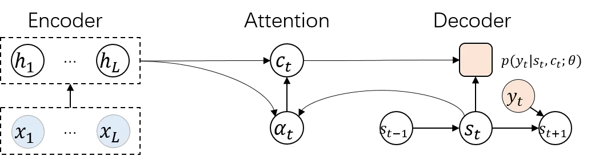
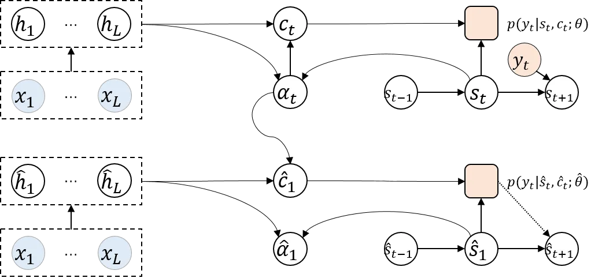
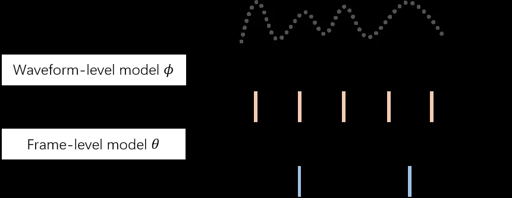
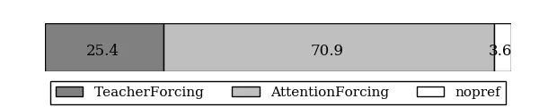

# Attention Forcing for Sequence-to-sequence Model Training

Qingyun Dou    Yiting Lu    Joshua Efiong & Mark J. F. Gales
Affiliation: Cambridge University Engineering Department
Affiliation: Trumpington St, Cambridge CB2 1PZ
Email: [{qd212,ytl28,je369,mjfg100}@cam.ac.uk](mailto:)

###### Abstract

Auto-regressive sequence-to-sequence models with attention mechanism
have achieved state-of-the-art performance in many tasks such as machine
translation and speech synthesis. These models can be difficult to
train. The standard approach, teacher forcing, guides a model with
reference output history during training. The problem is that the model
is unlikely to recover from its mistakes during inference, where the
reference output is replaced by generated output. Several approaches
deal with this problem, largely by guiding the model with generated
output history. To make training stable, these approaches often require
a heuristic schedule or an auxiliary classifier. This paper introduces
attention forcing, which guides the model with generated output history
and reference attention. This approach can train the model to recover
from its mistakes, in a stable fashion, without the need for a schedule
or a classifier. In addition, it allows the model to generate output
sequences aligned with the references, which can be important for
cascaded systems like many speech synthesis systems. Experiments on
speech synthesis show that attention forcing yields significant
performance gain. Experiments on machine translation show that for tasks
where various re-orderings of the output are valid, guiding the model
with generated output history is challenging, while guiding the model
with reference attention is beneficial.

|     |
| --- |
|     |

## 1 Introduction

Auto-regressive sequence-to-sequence (seq2seq) models with attention
mechanism are widely used in a variety of areas including Neural Machine
Translation (NMT) (Neubig, 2017; Huang et al., 2016) and speech
synthesis (Shen et al., 2018; Wang et al., 2018), also known as
Text-To-Speech (TTS). These models excel at connecting sequences of
different length, but can be difficult to train. A standard approach is
teacher forcing, which guides a model with reference output history
during training. This makes the model unlikely to recover from its
mistakes during inference, where the reference output is replaced by
generated output. One alternative is to train the model in free running
mode, where the model is guided by generated output history. This
approach often struggles to converge, especially for attention-based
models, which need to infer the correct output and align it with the
input at the same time.

Several approaches are introduced to tackle the above problem, namely
scheduled sampling (Bengio et al., 2015) and professor forcing (Lamb
et al., 2016). Scheduled sampling randomly decides, for each time step,
whether the reference or generated output token is added to the output
history. The probability of choosing the reference output token decays
from 1 to 0 with a heuristic schedule. A natural extension is
sequence-level scheduled sampling, where the decision is made for each
sequence instead of token. Professor forcing views the seq2seq model as
a generator. During training, the generator operates in both teacher
forcing mode and free running mode. In teacher forcing mode, it tries to
maximize the standard likelihood. In free running mode, it tries to fool
a discriminator, which is trained to tell if the model is running in
teacher forcing mode. To make training stable, the above approaches
require either a well tuned schedule, or a well trained discriminator.

This paper introduces attention forcing, which guides the model with
generated output history and reference attention. This approach makes
training stable by decoupling the learning of the output and that of the
alignment. There is no need for a schedule or a discriminator.
Furthermore, for cascaded systems like many TTS systems, attention
forcing can be particularly useful. A model trained with attention
forcing can generate (in attention forcing mode) output sequences
aligned with the references. These output sequences can be used to train
a downstream model, enabling it to fix some upstream errors. The TTS
experiments show that attention forcing yields significant gain in
speech quality. The NMT experiments show that for tasks where various
re-orderings of the output are valid, guiding the model with generated
output history can be problematic, while guiding the model with
reference attention yields slight but consistent gain in BLEU score
(Papineni et al., 2002).

## 2 Sequence-to-sequence generation

Sequence-to-sequence generation can be defined as the problem of mapping
an input sequence $`\bm{x}_{1:L}`$ to an output sequence
$`\bm{y}_{1:T}`$. From a probabilistic perspective, a model
$`\bm{\theta}`$ estimates the distribution of $`\bm{y}_{1:T}`$ given
$`\bm{x}_{1:L}`$, typically as a product of distributions conditioned on
output history:

```math
p(\bm{y}_{1:T}|\bm{x}_{1:L};\bm{\theta})=\textstyle\prod_{t=1}^{T}p(\bm{y}_{t}|\bm{y}_{1:t-1},\bm{x}_{1:L};\bm{\theta}) \tag{1}
```

Ideally, the model is trained through minimizing the KL-divergence
between the true distribution $`p(\bm{y}_{1:T}|\bm{x}_{1:L})`$ and the
estimated distribution:

```math
\begin{split}\hat{\bm{\theta}}&=\underset{\bm{\theta}}{\mathrm{argmin}}\medspace\mathbb{E}_{\bm{x}_{1:L}\sim p(\bm{x}_{1:L})}\mathrm{KL}\big(p(\bm{y}_{1:T}|\bm{x}_{1:L})||p(\bm{y}_{1:T}|\bm{x}_{1:L};\bm{\theta})\big)\\
&=\underset{\bm{\theta}}{\mathrm{argmin}}\medspace\mathbb{E}_{\bm{x}_{1:L}\sim p(\bm{x}_{1:L})}\mathbb{E}_{\bm{y}_{1:T}\sim p(\bm{y}_{1:T}|\bm{x}_{1:L})}\log\big(p(\bm{y}_{1:T}|\bm{x}_{1:L})/p(\bm{y}_{1:T}|\bm{x}_{1:L};\bm{\theta})\big)\end{split} \tag{2}
```

In practice, this is approximated by minimizing the Negative
Log-Likelihood (NLL) of some training data
$`\{\bm{y}^{(n)}_{1:T},\bm{x}^{(n)}_{1:L}\}_{1}^{N}`$, sampled from the
true distribution:

```math
\begin{split}\hat{\bm{\theta}}&=\underset{\bm{\theta}}{\mathrm{argmin}}-\textstyle\sum_{n=1}^{N}\log p(\bm{y}^{(n)}_{1:T}|\bm{x}^{(n)}_{1:L};\bm{\theta})\\
\end{split} \tag{3}
```

While $`L`$ and $`T`$ are functions of $`n`$, the subscripts are omitted
to simplify notations, i.e. $`L_{n}`$ and $`T_{n}`$ are written as $`L`$
and $`T`$. At inference stage, given an input $`\bm{x}^{*}_{1:L}`$, the
output $`\hat{\bm{y}}_{1:T}`$ can be obtained through searching for the
most probable sequence from the estimated distribution:

```math
\displaystyle\hat{\bm{y}}_{1:T} \displaystyle=\underset{\bm{y}_{1:T}}{\mathrm{argmax}}\medspace p(\bm{y}_{1:T}|\bm{x}^{*}_{1:L};\hat{\bm{\theta}}) \tag{4}
```

The exact search is computationally expensive, and is often approximated
by greedy search if the output space is continuous, or beam search if
the output space is discrete (Bengio et al., 2015).

### 2.1 Attention-based seq2seq model

Attention mechanisms (Bahdanau et al., 2014; Chorowski et al., 2015) are
commonly used to connect sequences of different length. This paper
focuses on attention-based encoder-decoder models. For these models, the
probability $`p(\bm{y}_{t}|\bm{y}_{1:t-1},\bm{x}_{1:L};\bm{\theta})`$ is
estimated as:

```math
\displaystyle p(\bm{y}_{t}|\bm{y}_{1:t-1},\bm{x}_{1:L};\bm{\theta}) \displaystyle\approx p(\bm{y}_{t}|\bm{y}_{1:t-1},\bm{\alpha}_{t},\bm{x}_{1:L};\bm{\theta})\approx p(\bm{y}_{t}|\bm{s}_{t},\bm{c}_{t};\bm{\theta}_{y}) \tag{5}
```

```math
\displaystyle\bm{s}_{t} \displaystyle=f(\bm{y}_{1:t-1};\bm{\theta}_{s}) \tag{6}
```

```math
\displaystyle\bm{c}_{t} \displaystyle=f(\bm{\alpha}_{t},\bm{x}_{1:L};\bm{\theta}_{c}) \tag{7}
```

$`\bm{\theta}=\{\bm{\theta}_{y},\bm{\theta}_{s},\bm{\theta}_{c}\}`$.
$`\bm{\alpha}_{t}`$ is an alignment vector (a set of attention weights).
$`\bm{s}_{t}`$ is a state vector representing the output history
$`\bm{y}_{1:t-1}`$, and $`\bm{c}_{t}`$ is a context vector summarizing
$`\bm{x}_{1:L}`$ for the prediction of $`\bm{y}_{t}`$. The following
equations, as well as figure 1, give a more detailed illustration of how
$`\bm{\alpha}_{t}`$, $`\bm{s}_{t}`$ and $`\bm{c}_{t}`$ can be computed:

```math
\displaystyle\bm{h}_{1:L} \displaystyle=f(\bm{x}_{1:L};\bm{\theta}_{h}) \tag{8}
```

```math
\displaystyle\bm{s}_{t} \displaystyle=f(\bm{s}_{t-1},\bm{y}_{t-1};\bm{\theta}_{s}) \tag{9}
```

```math
\displaystyle\bm{\alpha}_{t} \displaystyle=f(\bm{s}_{t},\bm{h}_{1:L};\bm{\theta}_{\alpha}) \tag{10}
```

```math
\displaystyle\bm{c}_{t} \displaystyle=\textstyle\sum_{l=1}^{L}\alpha_{t,l}\bm{h}_{l} \tag{11}
```

```math
\displaystyle\hat{\bm{y}}_{t} \displaystyle\sim p(\bm{y}_{t}|\bm{s}_{t},\bm{c}_{t};\bm{\theta}_{y}) \tag{12}
```

First the encoder maps $`\bm{x}_{1:L}`$ to an encoding sequence
$`\bm{h}_{1:L}`$. For each decoder time step, $`\bm{s}_{t}`$ is updated
with $`\bm{y}_{t-1}`$. Based on $`\bm{h}_{1:L}`$ and $`\bm{s}_{t}`$, the
attention mechanism computes $`\bm{\alpha}_{t}`$, and then
$`\bm{c}_{t}`$ as the weighted sum of $`\bm{h}_{1:L}`$. Finally, the
decoder estimates a distribution based on $`\bm{s}_{t}`$ and
$`\bm{c}_{t}`$, and optionally generates an output token
$`\hat{\bm{y}_{t}}`$ by either sampling or taking the most probable
token. Note that the output history $`\bm{y}_{1:t-1}`$ plays an
important role, as it impacts
$`p(\bm{y}_{t}|\bm{s}_{t},\bm{c}_{t};\bm{\theta}_{y})`$ through both
$`\bm{s}_{t}`$ and $`\bm{c}_{t}`$. Also note that there are many forms
of attention-based encoder-decoder models. While attention forcing is
illustrated with this particular form, it is not limited to it.



Figure 1: Illustration of an attention-based encoder-decoder model

### 2.2 Training approaches

As shown in equations 2 and 3, minimizing the KL-divergence between the
true distribution and the model distribution can be approximated by
minimizing the NLL. This motivates the approach to train the model in
teacher forcing mode, where
$`p(\bm{y}_{t}|\bm{y}_{1:t-1},\bm{x}_{1:L};\bm{\theta})`$ is computed
with the correct output history $`\bm{y}_{1:t-1}`$, as shown in
equations 5 and 6. In this case, the loss can be written as:

```math
\begin{split}\mathcal{L}_{y}^{(\tt T)}(\bm{\theta})&=-\textstyle\sum_{n=1}^{N}\log p(\bm{y}^{(n)}_{1:T}|\bm{x}^{(n)}_{1:L};\bm{\theta})=-\textstyle\sum_{n=1}^{N}\sum_{t=1}^{T}\log p(\bm{y}^{(n)}_{t}|\bm{y}^{(n)}_{1:t-1},\bm{x}^{(n)}_{1:L};\bm{\theta})\end{split} \tag{13}
```

This approach yields the correct model (zero KL-divergence) if the
following assumptions hold: 1) the model is powerful enough ; 2) the
model is optimized correctly; 3) there is enough training data to
approximate the expectation shown in equation 2. In practice, these
assumptions are often not true, hence the model is prone to make
mistakes. To illustrate the problem, suppose there is a reference output
$`\bm{y}^{*}_{1:T}`$ for the test input $`\bm{x}^{*}_{1:L}`$. Due to
data sparsity in high-dimensional space, $`\bm{x}^{*}_{1:L}`$ is likely
to be unseen during training. If the probability
$`p(\bm{y}^{*}_{t}|\bm{y}^{*}_{1:t-1},\bm{x}^{*}_{1:L};\bm{\theta})`$ is
wrongly estimated to be small at time step $`t`$, the probability of the
reference output sequence
$`p(\bm{y}^{*}_{1:T}|\bm{x}^{*}_{1:L};\bm{\theta})`$ will also be small,
i.e. it will be unlikely for the model to generate $`\bm{y}^{*}_{1:T}`$.

In practice, the model can be assessed by some loss
$`\mathcal{D}(\bm{y}^{*}_{1:T},\hat{\bm{y}}_{1:T})`$ between the
reference output $`\bm{y}^{*}_{1:T}`$ and the generated output
$`\hat{\bm{y}}_{1:T}`$. Taking the expected value yields the Bayes risk:
$`\mathbb{E}_{\hat{\bm{y}}_{1:T}\sim p(\bm{y}_{1:T}|\bm{x}^{*}_{1:L};\bm{\theta})}\mathcal{D}(\bm{y}^{*}_{1:T},\hat{\bm{y}}_{1:T})`$.
This motivates training the model with the following loss:

```math
\begin{split}\mathcal{L}_{y}^{(\tt B)}(\bm{\theta})&=\textstyle\sum_{n=1}^{N}\mathbb{E}_{\hat{\bm{y}}_{1:T}\sim p(\bm{y}_{1:T}|\bm{x}^{(n)}_{1:L};\bm{\theta})}\mathcal{D}(\bm{y}^{(n)}_{1:T},\hat{\bm{y}}_{1:T})\\
&\approx\textstyle\sum_{n=1}^{N}\sum_{m=1}^{M}p(\hat{\bm{y}}^{(n,m)}_{1:T}|\bm{x}^{(n)}_{1:L};\bm{\theta})\mathcal{D}(\bm{y}^{(n)}_{1:T},\hat{\bm{y}}^{(n,m)}_{1:T})\end{split} \tag{14}
```

$`\hat{\bm{y}}^{(n,m)}`$ is sampled from the estimated distribution
$`p(\bm{y}_{1:T}|\bm{x}^{(n)}_{1:L};\bm{\theta})`$. $`\mathcal{D}`$ is
minimal when the two sequences are equal. So the model is trained to not
only assign high probability to the reference sequences in the training
data, but also assign low probability to other sequences. This makes
minimum Bayes risk training prone to overfitting.

Very often, $`\mathcal{D}`$ is computed at sub-sequence level. Examples
include BLEU score for NMT, word error rate for speech recognition and
root mean square error for TTS. So if an approach trains the model to
predict the reference output, based on erroneous output history, it will
indirectly reduce the Bayes risk. One example is to train the model in
free running mode, where
$`p(\bm{y}_{t}|\bm{y}_{1:t-1},\bm{x}_{1:L};\bm{\theta})`$ is estimated
with the generated output history:

```math
\displaystyle p(\bm{y}_{t}|\bm{y}_{1:t-1},\bm{x}_{1:L};\bm{\theta}) \displaystyle\approx p(\bm{y}_{t}|\hat{\bm{y}}_{1:t-1},\bm{x}_{1:L};\bm{\theta})\approx p(\bm{y}_{t}|\bm{s}_{t},\bm{c}_{t};\bm{\theta}_{y}) \tag{15}
```

```math
\displaystyle\bm{s}_{t} \displaystyle=f(\hat{\bm{y}}_{1:t-1};\bm{\theta}_{s}) \tag{16}
```

$`\hat{\bm{y}}_{t}`$ is obtained from the estimated distribution
$`p(\bm{y}_{t}|\bm{s}_{t},\bm{c}_{t};\bm{\theta}_{y})`$, as shown in
equation 12. (The approaches discussed in this section are designed for
all auto-regressive models, with or without attention mechanism. So the
realization $`\bm{c}_{t}`$ is not shown.) The corresponding loss
function is:

```math
\begin{split}\mathcal{L}_{y}^{(\tt F)}(\bm{\theta})&=-\textstyle\sum_{n=1}^{N}\sum_{t=1}^{T}\log p(\bm{y}^{(n)}_{t}|\hat{\bm{y}}^{(n)}_{1:t-1},\bm{x}^{(n)}_{1:L};\bm{\theta})\end{split} \tag{17}
```

Note that if there is enough data and modeling power, and the model is
optimized correctly, the distribution
$`\prod_{t=1}^{T}p(\bm{y}_{t}|\hat{\bm{y}}_{1:t-1},\bm{x}_{1:L};\bm{\theta})`$
can be the same as the true distribution
$`p(\bm{y}_{1:T}|\bm{x}_{1:L})`$. The problem with this approach is that
training often struggles to converge. One concern is that the model
needs to learn to infer the correct output and align that with the input
at the same time. Therefore, several approaches, namely scheduled
sampling and professor forcing, are proposed to train the model in a
mode between teacher forcing and free running.

Scheduled sampling (Bengio et al., 2015) randomly decides, for each time
step, whether the reference or generated output token is added to the
output history $`\widetilde{\bm{y}}_{1:t-1}`$. For this approach,
$`p(\bm{y}_{t}|\bm{y}_{1:t-1},\bm{x}_{1:L};\bm{\theta})`$ is estimated
as:

```math
\displaystyle p(\bm{y}_{t}|\bm{y}_{1:t-1},\bm{x}_{1:L};\bm{\theta}) \displaystyle\approx p(\bm{y}_{t}|\widetilde{\bm{y}}_{1:t-1},\bm{x}_{1:L};\bm{\theta})\approx p(\bm{y}_{t}|\bm{s}_{t},\bm{c}_{t};\bm{\theta}_{y}) \tag{18}
```

```math
\displaystyle\bm{s}_{t} \displaystyle=f(\widetilde{\bm{y}}_{1:t-1};\bm{\theta}_{s}) \tag{19}
```

```math
\displaystyle\widetilde{\bm{y}}_{t} \displaystyle=\left\{\begin{matrix}\bm{y}_{t}&\text{ with probability }&\epsilon\\
\hat{\bm{y}}_{t}&\text{ with probability }&1-\epsilon\end{matrix}\right. \tag{20}
```

$`\epsilon`$ gradually decays from 1 to 0 with a heuristic schedule.
Considering that during training, $`\widetilde{\bm{y}}_{1:t-1}`$ is
mostly an inconsistent mixture of the reference output and the generated
output, a natural extension is sequence-level scheduled sampling (Bengio
et al., 2015), where the decision is made for each sequence instead of
token:

```math
\displaystyle\widetilde{\bm{y}}_{1:t-1} \displaystyle=\left\{\begin{matrix}\bm{y}_{1:t-1}&\text{ with probability }&\epsilon\\
\hat{\bm{y}}_{1:t-1}&\text{ with probability }&1-\epsilon\end{matrix}\right. \tag{21}
```

This type of training improves the results of many experiments, but
sometimes leads to worse results (Wang et al., 2017; Bengio et al.,
2015). One concern is that the decay schedule does not fit the learning
pace of the model.

Professor forcing (Lamb et al., 2016) is an alternative trade-off.
During training, the model $`\bm{\theta}`$ is viewed as a generator,
which generates two output sequences for each input sequence,
respectively in teacher forcing mode and free running mode¹¹ 1 The term
”teacher forcing”, as well as ”attention forcing”, can refer to either
an operation mode, or the approach to train a model in that operation
mode. An operation mode can be used not only to train a model, but also
to generate from it. For example, in teacher forcing mode, given the
reference output $`\bm{y}_{1:T}`$, a model can generate a guided output
$`\bm{y}^{\prime}_{1:T}`$, without evaluating the loss.
$`\bm{y}^{\prime}_{1:T}`$ is likely to be different but similar to
$`\bm{y}_{1:T}`$, and can be useful for training the discriminator.. For
the training example $`\{\bm{y}^{(n)}_{1:T},\bm{x}^{(n)}_{1:L}\}`$, let
$`\bm{y}^{\prime(n)}_{1:T}`$ denote the output generated in teacher
forcing mode, and $`\hat{\bm{y}}^{(n)}_{1:T}`$ the output generated in
free running forcing mode, this can be expressed as:

```math
\displaystyle\forall_{t}\medspace\bm{y}^{\prime(n)}_{t}\sim p(\bm{y}_{t}|\bm{y}^{(n)}_{1:t-1},\bm{x}^{(n)}_{1:L};\bm{\theta}) \tag{22}
```

```math
\displaystyle\forall_{t}\medspace\hat{\bm{y}}^{(n)}_{t}\sim p(\bm{y}_{t}|\hat{\bm{y}}^{(n)}_{1:t-1},\bm{x}^{(n)}_{1:L};\bm{\theta}) \tag{23}
```

In addition to the final output, some intermediate output sequences are
saved. Let $`\bm{\beta}^{\prime(n)}_{1:T}`$ and
$`\hat{\bm{\beta}}^{(n)}_{1:T}`$ denote the intermediate output
sequences generated respectively in teacher forcing and free running
mode. These generated sequences form a dataset
$`\{\bm{y}^{\prime(n)}_{1:T},\bm{\beta}^{\prime(n)}_{1:T},\hat{\bm{y}}^{(n)}_{1:T},\hat{\bm{\beta}}^{(n)}_{1:T}\}_{1}^{N}`$
that is used to train a discriminator $`\bm{\psi}`$. $`\bm{\psi}`$ is
trained to predict the probability that a group of sequences is
generated in teacher forcing mode, and the loss function is:

```math
\mathcal{L}_{\psi}(\bm{\psi}|\bm{\theta})=-\textstyle\sum_{n=1}^{N}\Big(\log\big(f(\bm{y}^{\prime(n)}_{1:T},\bm{\beta}^{\prime(n)}_{1:T};\bm{\psi})\big)+\log\big(1-f(\hat{\bm{y}}^{(n)}_{1:T},\hat{\bm{\beta}}^{(n)}_{1:T};\bm{\psi})\big)\Big) \tag{24}
```

While this loss function is optimized w.r.t. $`\bm{\psi}`$, it depends
on $`\bm{\theta}`$, hence the notation $`\bm{\psi}|\bm{\theta}`$. For
the generator $`\bm{\theta}`$, there are three training objectives. The
first one is the standard likelihood shown in equation 13. The second
one is to fool the discriminator in free running mode:

```math
\mathcal{L}^{({\tt F})}_{\beta}(\bm{\theta}|\bm{\psi})=-\textstyle\sum_{n=1}^{N}\log\big(f(\hat{\bm{y}}^{(n)}_{1:T},\hat{\bm{\beta}}^{(n)}_{1:T};\bm{\psi})\big) \tag{25}
```

The third one, which is optional, is to fool the discriminator in
teacher forcing mode:

```math
\mathcal{L}^{({\tt T})}_{\beta}(\bm{\theta}|\bm{\psi})=-\textstyle\sum_{n=1}^{N}\log\big(1-f(\bm{y}^{\prime(n)}_{1:T},\bm{\beta}^{\prime(n)}_{1:T};\bm{\psi})\big) \tag{26}
```

This approach makes the distribution
$`p(\bm{y}_{t}|\hat{\bm{y}}_{1:t-1},\bm{x}_{1:L};\bm{\theta})`$
estimated in free running mode similar to the corresponding distribution
$`p(\bm{y}_{t}|\bm{y}_{1:t-1},\bm{x}_{1:L};\bm{\theta})`$ estimated in
teacher forcing mode. In addition, it regularizes some hidden layers,
encouraging them to behave as if in teacher forcing mode. The
disadvantage is that it requires designing and training the
discriminator.

## 3 Attention forcing

### 3.1 Guiding the model with attention

For attention-based seq2seq generation, we propose a new algorithm:
attention forcing. The basic idea is to use reference attention (i.e.
reference alignment) and generated output to guide the model during
training. In attention forcing mode, the model does not need to learn to
simultaneously infer the output and align it with the input. As the
reference alignment is known, the decoder can focus on inferring the
output, and the attention mechanism can focus on generating the correct
alignment.

Let $`\hat{\bm{\theta}}`$ denote the model that is trained in attention
forcing mode, and later used for inference. In attention forcing mode,
$`p(\bm{y}_{t}|\bm{y}_{1:t-1},\bm{x}_{1:L};\hat{\bm{\theta}})`$ is
estimated with the generated output $`\hat{\bm{y}}_{1:t-1}`$ and the
reference alignment $`\bm{\alpha}_{t}`$, and equation 5 becomes:

```math
\displaystyle p(\bm{y}_{t}|\bm{y}_{1:t-1},\bm{x}_{1:L};\hat{\bm{\theta}}) \displaystyle\approx p(\bm{y}_{t}|\hat{\bm{y}}_{1:t-1},\bm{\alpha}_{t},\bm{x}_{1:L};\hat{\bm{\theta}})\approx p(\bm{y}_{t}|\hat{\bm{s}}_{t},\hat{\bm{c}}_{t};\hat{\bm{\theta}}_{y}) \tag{27}
```

$`\hat{\bm{s}}_{t}`$ and $`\hat{\bm{c}}_{t}`$ denote the state vector
and context vector generated by $`\hat{\bm{\theta}}`$. Details of
attention forcing can be illustrated by figure 2, as well as the
following equations:

```math
\displaystyle\bm{h}_{1:L} \displaystyle=f(\bm{x}_{1:L};\bm{\theta}_{h}) \displaystyle\hat{\bm{h}}_{1:L} \displaystyle=f(\bm{x}_{1:L};\hat{\bm{\theta}}_{h}) \tag{28}
```

```math
\displaystyle\bm{s}_{t} \displaystyle=f(\bm{s}_{t-1},\bm{y}_{t-1};\bm{\theta}_{s}) \displaystyle\hat{\bm{s}}_{t} \displaystyle=f(\hat{\bm{s}}_{t-1},\hat{\bm{y}}_{t-1};\hat{\bm{\theta}}_{s}) \tag{29}
```

```math
\displaystyle\bm{\alpha}_{t} \displaystyle=f(\bm{s}_{t},\bm{h}_{1:L};\bm{\theta}_{\alpha}) \displaystyle\hat{\bm{\alpha}}_{t} \displaystyle=f(\hat{\bm{s}}_{1:t-1},\hat{\bm{h}}_{1:L};\hat{\bm{\theta}}_{\alpha}) \tag{30}
```

```math
\displaystyle\hat{\bm{c}}_{t} \displaystyle=\textstyle\sum_{l=1}^{L}\alpha_{t,l}\hat{\bm{h}}_{l} \tag{31}
```

```math
\displaystyle\hat{\bm{y}}_{t} \displaystyle\sim p(\bm{y}_{t}|\hat{\bm{s}}_{t},\hat{\bm{c}}_{t};\hat{\bm{\theta}}_{y}) \tag{32}
```

The right side of the equations 28 to 30, as well as equations 31 and
32, show how the attention forcing model $`\hat{\bm{\theta}}`$ operates.
$`\hat{\bm{h}}_{l}`$ and $`\hat{\bm{\alpha}}_{t}`$ denote the encoding
and alignment vectors generated by $`\hat{\bm{\theta}}`$.
$`\hat{\bm{s}}_{t}`$ is computed with $`\hat{\bm{y}}_{1:t-1}`$. While an
alignment $`\hat{\bm{\alpha}}_{t}`$ is generated by
$`\hat{\bm{\theta}}`$, it is not used by the decoder, because
$`\hat{\bm{c}}_{t}`$ is computed with the reference alignment
$`\bm{\alpha}_{t}`$. In most cases, $`\bm{\alpha}_{t}`$ is not
available. One option of obtaining it is shown by the left side of
equations 28 to 30, which is the same as equations 8 to 10. The option
is to generate $`\bm{\alpha}_{t}`$ from a teacher forcing model
$`\bm{\theta}`$. $`\bm{\theta}`$ is trained in teacher forcing mode, as
described in section 2.2. Once trained, it can generate
$`\bm{\alpha}_{t}`$, again in teacher forcing mode.



Figure 2: Illustration of attention forcing

During inference, the attention forcing model operates in free running
mode. In this case, equation 31 becomes
$`\hat{\bm{c}}_{t}=\textstyle\sum_{l=1}^{L}\hat{\alpha}_{t,l}\hat{\bm{h}}_{l}`$.
The decoder is guided by $`\hat{\bm{\alpha}}_{t}`$, instead of
$`\bm{\alpha}_{t}`$.

During training, there are two objectives: to infer the reference output
and to imitate the reference alignment. For the first objective, the
loss function is:

```math
\begin{split}\mathcal{L}_{y}^{(\tt A)}(\bm{\theta},\hat{\bm{\theta}})&=-\textstyle\sum_{n=1}^{N}\sum_{t=1}^{T}\log p(\bm{y}^{(n)}_{t}|\hat{\bm{y}}^{(n)}_{1:t-1},\bm{\alpha}^{(n)}_{t},\bm{x}^{(n)}_{1:L};\bm{\theta},\hat{\bm{\theta}})\end{split} \tag{33}
```

For the second objective, as an alignment corresponds to a categorical
distribution, the loss function is the average KL-divergence between the
reference alignment and the generated alignment:

```math
\begin{split}\mathcal{L}_{\alpha}^{(\tt A)}(\bm{\theta},\hat{\bm{\theta}})&=\textstyle\sum_{n=1}^{N}\sum_{t=1}^{T}\mathrm{KL}(\bm{\alpha}_{t}^{(n)}||\hat{\bm{\alpha}}_{t}^{(n)})=\textstyle\sum_{n=1}^{N}\sum_{t=1}^{T}\sum_{l=1}^{L}\alpha_{t,l}^{(n)}\log\frac{\alpha_{t,l}^{(n)}}{\hat{\alpha}_{t,l}^{(n)}}\end{split} \tag{34}
```

The two losses can be jointly optimized as
$`\mathcal{L}_{y,\alpha}^{(\tt A)}=\mathcal{L}_{y}^{(\tt A)}+\gamma\mathcal{L}_{\alpha}^{(\tt A)}`$.
$`\gamma`$ is a scaling factor that should be set according to the
dynamic range of the two losses, which roughly indicates the norm of the
gradient. The alignment loss $`\mathcal{L}_{\alpha}^{(\tt A)}`$ can be
interpreted as a regularization term, which encourages the attention
mechanism of $`\hat{\bm{\theta}}`$ to behave like that of
$`\bm{\theta}`$. Our default optimization option is as follows.
$`\bm{\theta}`$ is trained in teacher forcing mode, with the loss
$`\mathcal{L}_{y}^{(\tt T)}`$ shown in equation 13, and then fixed to
generate the reference attention. $`\hat{\bm{\theta}}`$ is trained with
the joint loss $`\mathcal{L}_{y,\alpha}^{(\tt A)}`$. In our experiments,
this option makes training more stable, most probably because the
reference attention is the same from epoch to epoch. There are several
alternative options. One example is to tie $`\bm{\theta}`$ and
$`\hat{\bm{\theta}}`$, i.e. use only one set of model parameters, and
train it with the joint loss $`\mathcal{L}_{y,\alpha}^{(\tt A)}`$. This
option is less stable, but more efficient.

### 3.2 Comparison with related approaches

Intuitively, attention forcing, as well as scheduled sampling and
professor forcing, is in the middle of teacher forcing and free running.
Unlike scheduled sampling, attention forcing does not require a decay
schedule, which can be difficult to tune. While the scaling factor
$`\gamma`$ is hyper parameter, it can be set according to the dynamic
ranges of the two losses, as described in section 3.1. In addition, it
can be tuned according the alignment vector, which is an interpretable
indicator of how well the attention mechanism works. In terms of
regularization, attention forcing is similar to professor forcing. The
output layer of the attention mechanism, which can be viewed as a
special hidden layer, is encouraged to behave as if in teacher forcing
mode. The difference is that attention forcing does not require a
discriminator to learn a loss function, as the KL-divergence is natural
loss function for the alignment vector.

A limitation of attention forcing is that it is less general than the
approaches described in section 2.2, which are well defined for all
auto-regressive models, with or without attention mechanism. To apply
attention forcing to a model without attention mechanism, attention
needs to be defined first. For convolutional neural networks, for
example, attention maps can be defined based on activation or gradient
(Zagoruyko & Komodakis, 2016).

## 4 Application to speech synthesis

Attention forcing has a feature that is essential for many cascaded
systems: when the reference alignment is available, the output can be
generated in attention forcing mode, and will be aligned with the
reference. TTS is a typical example. For TTS, the task is to map a
sequence of characters $`\bm{x}_{1:L}`$ to a sequence of waveform
samples $`\bm{w}_{1:J}`$. Directly mapping $`\bm{x}_{1:L}`$ to
$`\bm{w}_{1:J}`$ is difficult because the two sequences are not aligned
and are orders of magnitude different in length. (10 characters can
correspond to more than 1000 waveform samples.) As shown in figure 3,
TTS is often realized by first mapping $`\bm{x}_{1:L}`$ to a vocoder
feature sequence $`\bm{y}_{1:T}`$, and then mapping $`\bm{y}_{1:T}`$ to
$`\bm{w}_{1:J}`$. The vocoder feature sequence is a compact and
interpretable representation of the waveform; a vocoder can be used to
map vocoder features to waveform or reversely, with a series of signal
processing techniques. Each feature frame corresponds to a window of
waveform samples, i.e. each time step in the feature sequence
corresponds to a fixed number of time steps in the waveform sequence.



Figure 3: Illustration of a speech synthesis system

The model mapping $`\bm{x}_{1:L}`$ to $`\bm{y}_{1:T}`$ can be referred
to as the frame-level model $`\bm{\theta}`$, and the model mapping
$`\bm{y}_{1:T}`$ to $`\bm{w}_{1:J}`$ can be referred to as the
waveform-level model $`\bm{\phi}`$. Conventionally, $`\bm{\phi}`$ is a
vocoder, and is not learnable. $`\bm{\theta}`$ contains a text
processing frontend, a duration model and a feature model (Li et al.,
2018). The text processing frontend extracts linguistic features from
$`\bm{x}_{1:L}`$; the duration model predicts the duration of each
linguistic feature; the feature model maps the linguistic features to
$`\bm{y}_{1:T}`$. This paper focuses on the state-of-the-art approach,
where $`\bm{\theta}`$, as well as $`\bm{\phi}`$, is a neural network.
$`\bm{\phi}`$ can be considered a neural vocoder, which is not limited
by the assumptions made by the conventional vocoders (Lorenzo-Trueba
et al., 2018; Kalchbrenner et al., 2018). $`\bm{\theta}`$ is an
attention-based seq2seq model, as described in section 2.1. Compared
with the conventional approach, the attention-based model has several
advantages, such as performance gain and less need for data labeling
(Wang et al., 2017). Note that as shown in figure 3, $`\bm{\theta}`$
learns not only to map a character sequence to a feature sequence, but
also to align them. In contrast, $`\bm{\phi}`$ does not align its input
and output (Shen et al., 2018; Oord et al., 2016).

The training dataset
$`\{\bm{w}^{(n)}_{1:J},\bm{x}^{(n)}_{1:L}\}_{1}^{N}`$ usually contains
pairs of waveform $`\bm{w}^{(n)}_{1:J}`$ and text
$`\bm{x}^{(n)}_{1:L}`$. (To simplify notations, the superscript ^((n))
is be omitted by default in the following discussion.) For each
$`\bm{w}_{1:J}`$, a vocoder feature sequence $`\bm{y}_{1:T}`$ can be
extracted. The frame-level model $`\bm{\theta}`$ is trained with
$`\{\bm{y}_{1:T},\bm{x}_{1:L}\}`$. The waveform-level model
$`\bm{\phi}`$ can be trained with $`\{\bm{w}_{1:J},\bm{y}_{1:T}\}`$, or
$`\{\bm{w}_{1:J},\hat{\bm{y}}_{1:T}\}`$, where $`\hat{\bm{y}}_{1:T}`$ is
generated by $`\bm{\theta}`$. Training with $`\hat{\bm{y}}_{1:T}`$
allows $`\bm{\phi}`$ to fix some mistakes made by $`\bm{\theta}`$, but
this is only possible when $`\hat{\bm{y}}_{1:T}`$ is aligned with
$`\bm{w}_{1:J}`$. To ensure the alignment, the standard approach is to
train $`\bm{\theta}`$ in teacher forcing mode, and then generate from it
in the same mode. This paper proposes an alternative approach: to use
attention forcing instead of teacher forcing. As analyzed in section
3.1, training $`\bm{\theta}`$ with attention forcing improves its
performance. Furthermore, in attention forcing mode, each output
$`\hat{\bm{y}}_{t}`$ is predicted based on $`\hat{\bm{y}}_{1:t-1}`$
(instead of $`\bm{y}_{1:t-1}`$), hence $`\hat{\bm{y}}_{1:T}`$ is more
likely (than in teacher forcing mode) to contain errors that
$`\bm{\theta}`$ makes at inference stage. Training $`\bm{\phi}`$ with
$`\hat{\bm{y}}_{1:T}`$ can enable it to correct the errors, improving
the quality of the waveform. Note that if $`\bm{\theta}`$ is trained
with scheduled sampling or professor forcing, it is often not possible
to predict, based only on generated output history, a vocoder feature
sequence aligned with the reference waveform. Also note that
$`\bm{\phi}`$ is trained in teacher forcing mode, as it does not have
attention mechanism. Hence the rest of this section focuses on
discussing $`\bm{\theta}`$ at training stage and inference stage.

During training, it is often assumed that the output tokens follow a
certain type of distribution, so that minimizing the loss
$`\mathcal{L}_{y}^{(\tt A)}`$ shown in equation 33 can be approximated
by minimizing some distance metric between $`\bm{y}_{1:T}`$ and
$`\hat{\bm{y}}_{1:T}`$. For example, assuming that the distribution
shown in equation 27 is a Laplace distribution, minimizing
$`\mathcal{L}_{y}^{(\tt A)}`$ is equivalent to minimizing the average
$`\ell_{1}`$ distance:

```math
\displaystyle\underset{\bm{\theta},\hat{\bm{\theta}}}{\mathrm{argmin}}\medspace\mathcal{L}_{y}^{(\tt A)}(\bm{\theta},\hat{\bm{\theta}}) \displaystyle\approx\underset{\bm{\theta},\hat{\bm{\theta}}}{\mathrm{argmin}}\textstyle\sum_{n=1}^{N}\sum_{t=1}^{T}||\bm{y}^{(n)}_{t}-\hat{\bm{y}}^{(n)}_{t}||_{1} \tag{35}
```

```math
\displaystyle\hat{\bm{y}}_{t} \displaystyle=\underset{\bm{y}_{t}}{\mathrm{argmax}}\medspace p(\bm{y}_{t}|\hat{\bm{y}}_{1:t-1},\bm{\alpha}_{t},\bm{x}_{1:L};\hat{\bm{\theta}}) \tag{36}
```

The notation is the same as in section 3.1. $`\hat{\bm{\theta}}`$
denotes the attention forcing model; $`\bm{\theta}`$ denotes the teacher
forcing model generating reference alignment. Equation 36 replaces
equation 32. In this case, $`\hat{\bm{y}}_{t}`$ is not sampled, and is
always the mode of the predicted distribution. During inference, the
exact search (equation 4) is approximated by greedy search: (Note that
for TTS, the main difference between training and inference is the
alignment, which influences duration more than quality.)

```math
\displaystyle\forall_{t}\medspace\hat{\bm{y}}_{t} \displaystyle=\underset{\bm{y}_{t}}{\mathrm{argmax}}\medspace p(\bm{y}_{t}|\hat{\bm{y}}_{1:t-1},\hat{\bm{\alpha}}_{t},\bm{x}^{*}_{1:L};\hat{\bm{\theta}}) \tag{37}
```

## 5 Experiments

### 5.1 Speech Synthesis

The TTS experiments are conducted on LJ dataset (Ito, 2017), which
contains 13,100 utterances from a single speaker. The utterances vary in
length from 1 to 10 seconds, totaling approximately 24 hours. A
transcription is provided for each waveform, and the corresponding
vocoder features are extracted with PML vocoder (Degottex et al., 2016).
The training-validation-test split is 13000-50-50. The waveform-level
model is the Hierarchical Recurrent Neural Network (HRNN) neural vocoder
(Mehri et al., 2016; Dou et al., 2018). The model structure is exactly
the same as described in Dou et al. (2018), and the model configuration
is adjusted for efficiency. The frame-level model is very similar to
Tacotron (Wang et al., 2017). The model structure and configuration are
the same as described in Wang et al. (2017), except that: 1) the decoder
target is vocoder features; 2) the attention mechanism is the hybrid
(content-based + location-based) attention (Chorowski et al., 2015); 3)
each decoding step predicts 5 vocoder feature frames. The neural vocoder
is always trained with teacher forcing. The frame-level model is trained
with either teacher forcing or attention forcing. Details of the setup
(data, models and training) are presented in appendix A.2.1.

Two TTS systems are built: a teacher forcing system and an attention
forcing system. For the teacher forcing system, the frame-level model
$`\bm{\theta}`$ is trained in teacher forcing mode. The neural vocoder
$`\bm{\phi}`$ is trained with the vocoder features generated (in teacher
forcing mode) by $`\bm{\theta}`$. For the attention forcing system, the
frame-level model $`\hat{\bm{\theta}}`$ is trained in attention forcing
mode, with reference attention generated (in teacher forcing mode) by
$`\bm{\theta}`$. At this stage, $`\hat{\bm{\theta}}`$ is updated, while
$`\bm{\theta}`$ is fixed. The neural vocoder $`\hat{\bm{\phi}}`$ is
trained with the vocoder features generated (in attention forcing mode)
by $`\hat{\bm{\theta}}`$. At inference stage, all the models operate in
free-running mode.

For TTS, human perception is the gold-standard. The two systems are
compared in a subjective listening test. Over 30 workers from Amazon
Mechanical Turk are instructed to listen to pairs of utterances, and
indicate which one they prefer in terms of overall quality. Each
comparison includes 5 pairs of utterances randomly selected among all
the test utterances. Figure 4 shows the result of the listening test.
Each number indicates the percentage of a certain preference. Most
participants prefer attention forcing. We strongly encourage readers to
listens to the generated utterances²² 2 Generated test utterances are
randomly selected and made available at
[http://mi.eng.cam.ac.uk/~qd212/iclr2020/samples.html](http://mi.eng.cam.ac.uk/~qd212/iclr2020/samples.html).
It is obvious that attention forcing yields utterances that are
significantly more natural and expressive.



Figure 4: Result of the listening test comparing teacher forcing and
attention forcing

### 5.2 Machine translation

The NMT experiments are conducted on the English-to-Vietnamese task in
IWSLT 2015. It is a low resource NMT task, where training set contains
133K sentence pairs. The Stanford pre-processed data is used. The TED
tst2012 is used as a validation set, and BLEU scores on TED tst2013 are
reported. The scores use a 4-gram corpus level BLEU with equal weights.
Google’s attention-based encoder-decoder LSTM model (Wu et al., 2016) is
adopted. Details of the setup (data, model and training) are presented
in appendix A.2.2.

Our initial experiments show that directly applying attention forcing to
NMT can degrade the performance. One concern is that for translation,
various re-orderings of the output sequence are valid. In this case,
guiding the model with generated output can be problematic, as the
reference output can take an ordering that is different from the
generated output. To see if this is the reason, we tried a modified
attention forcing mode, where the model is guided with reference
attention and reference output. The right side of equation 29 becomes:
$`\hat{\bm{s}}_{t}=f(\hat{\bm{s}}_{t-1},\bm{y}_{t-1};\hat{\bm{\theta}}_{s})`$.
$`\hat{\bm{s}}_{t}`$ is computed with the reference output
$`\bm{y}_{1:t-1}`$, and matches the reference attention
$`\bm{\alpha}_{t}`$ Other parts of attention forcing (equations 28 to 31) stay the same, hence $`\hat{\bm{y}}_{t}`$ is predicted with
$`\bm{y}_{1:t-1}`$ and $`\bm{\alpha}_{t}`$.

In the following experiments, two NMT models are compared: one is
trained in teacher forcing mode, with the NLL loss in equation 13; the
other is trained in the modified attention forcing mode described above,
with both the NLL loss and the attention loss in equation 34. An
ensemble of 10 models are trained with teacher forcing. Then each model
generates reference attention for a corresponding model trained with
additional attention loss. The average performance of the teacher
forcing models is 26.35 BLEU, and adding the attention loss yields an
average +0.35 BLEU gain. 9 of out 10 times, the performance improves.
The slight but consistent gain shows that for NMT, guiding the model
with generated output is indeed the cause degrading the performance. It
also shows that guiding the model with reference attention can be
beneficial. One possible reason is that the attention loss regularizes
the attention mechanism. Another is that the model does not need to
learn to simultaneously infer the output and align it with the input.

## 6 Conclusion

This paper introduces attention forcing, which guides a seq2seq model
with generated output history and reference attention. This approach can
train the model to recover from its mistakes, in a stable fashion,
without the need for a schedule or a classifier. In addition, it allows
the model to generate output sequences aligned with the reference output
sequences, which can be important for cascaded systems like many TTS
systems. The TTS experiments show that attention forcing yields
significant gain in speech quality. The NMT experiments show that for
tasks where various re-orderings of the output are valid, guiding the
model with generated output history can be problematic, while guiding
the model with reference attention yields slight but consistent gain in
BLEU score.

## References

- Bahdanau et al. (2014) Dzmitry Bahdanau, Kyunghyun Cho, and Yoshua
  Bengio. Neural machine translation by jointly learning to align and
  translate. _arXiv preprint arXiv:1409.0473_, 2014.
- Bengio et al. (2015) Samy Bengio, Oriol Vinyals, Navdeep Jaitly, and
  Noam Shazeer. Scheduled sampling for sequence prediction with
  recurrent neural networks. In _Advances in Neural Information
  Processing Systems_, pp. 1171–1179, 2015.
- Chorowski et al. (2015) Jan K Chorowski, Dzmitry Bahdanau, Dmitriy
  Serdyuk, Kyunghyun Cho, and Yoshua Bengio. Attention-based models for
  speech recognition. In _Advances in Neural Information Processing
  Systems_, pp. 577–585, 2015.
- Chung et al. (2014) Junyoung Chung, Caglar Gulcehre, KyungHyun Cho,
  and Yoshua Bengio. Empirical evaluation of gated recurrent neural
  networks on sequence modeling. _arXiv preprint arXiv:1412.3555_, 2014.
- Degottex et al. (2016) Gilles Andre Degottex, Pierre Kim Lanchantin,
  and Mark John Gales. A pulse model in log-domain for a uniform
  synthesizer. In _Acoustics, Speech and Signal Processing (ICASSP),
  2013 IEEE International Conference on_, pp. 230–236. IEEE, 2016.
- Dou et al. (2018) Qingyun Dou, Moquan Wan, Gilles Degottex, Zhiyi Ma,
  and Mark JF Gales. Hierarchical rnns for waveform-level speech
  synthesis. In _2018 IEEE Spoken Language Technology Workshop (SLT)_,
  pp. 618–625. IEEE, 2018.
- Huang et al. (2016) Po-Yao Huang, Frederick Liu, Sz-Rung Shiang, Jean
  Oh, and Chris Dyer. Attention-based multimodal neural machine
  translation. In _Proceedings of the First Conference on Machine
  Translation: Volume 2, Shared Task Papers_, pp. 639–645, 2016.
- Ito (2017) Keith Ito. The lj speech dataset.
  [https://keithito.com/LJ-Speech-Dataset/](https://keithito.com/LJ-Speech-Dataset/), 2017.
- Kalchbrenner et al. (2018) Nal Kalchbrenner, Erich Elsen, Karen
  Simonyan, Seb Noury, Norman Casagrande, Edward Lockhart, Florian
  Stimberg, Aaron van den Oord, Sander Dieleman, and Koray Kavukcuoglu.
  Efficient neural audio synthesis. _arXiv preprint
  arXiv:1802.08435_, 2018.
- Kingma & Ba (2014) Diederik Kingma and Jimmy Ba. Adam: A method for
  stochastic optimization. _arXiv preprint arXiv:1412.6980_, 2014.
- Lamb et al. (2016) Alex M Lamb, Anirudh Goyal Alias Parth Goyal, Ying
  Zhang, Saizheng Zhang, Aaron C Courville, and Yoshua Bengio. Professor
  forcing: A new algorithm for training recurrent networks. In _Advances
  In Neural Information Processing Systems_, pp. 4601–4609, 2016.
- Li et al. (2018) Naihan Li, Shujie Liu, Yanqing Liu, Sheng Zhao, Ming
  Liu, and Ming Zhou. Close to human quality tts with transformer.
  _arXiv preprint arXiv:1809.08895_, 2018.
- Lorenzo-Trueba et al. (2018) Jaime Lorenzo-Trueba, Thomas Drugman,
  Javier Latorre, Thomas Merritt, Bartosz Putrycz, and Roberto
  Barra-Chicote. Robust universal neural vocoding. _arXiv preprint
  arXiv:1811.06292_, 2018.
- Luong et al. (2015) Minh-Thang Luong, Hieu Pham, and Christopher D
  Manning. Effective approaches to attention-based neural machine
  translation. _arXiv preprint arXiv:1508.04025_, 2015.
- Mehri et al. (2016) Soroush Mehri, Kundan Kumar, Ishaan Gulrajani,
  Rithesh Kumar, Shubham Jain, Jose Sotelo, Aaron Courville, and Yoshua
  Bengio. Samplernn: An unconditional end-to-end neural audio generation
  model. _arXiv preprint arXiv:1612.07837_, 2016.
- Neubig (2017) Graham Neubig. Neural machine translation and
  sequence-to-sequence models: A tutorial. _arXiv preprint
  arXiv:1703.01619_, 2017.
- Oord et al. (2016) Aaron van den Oord, Sander Dieleman, Heiga Zen,
  Karen Simonyan, Oriol Vinyals, Alex Graves, Nal Kalchbrenner, Andrew
  Senior, and Koray Kavukcuoglu. Wavenet: A generative model for raw
  audio. _arXiv preprint arXiv:1609.03499_, 2016.
- Papineni et al. (2002) Kishore Papineni, Salim Roukos, Todd Ward, and
  Wei-Jing Zhu. Bleu: a method for automatic evaluation of machine
  translation. In _Proceedings of the 40th annual meeting on association
  for computational linguistics_, pp. 311–318. Association for
  Computational Linguistics, 2002.
- Shen et al. (2018) Jonathan Shen, Ruoming Pang, Ron J Weiss, Mike
  Schuster, Navdeep Jaitly, Zongheng Yang, Zhifeng Chen, Yu Zhang,
  Yuxuan Wang, Rj Skerrv-Ryan, et al. Natural tts synthesis by
  conditioning wavenet on mel spectrogram predictions. In _2018 IEEE
  International Conference on Acoustics, Speech and Signal Processing
  (ICASSP)_, pp. 4779–4783. IEEE, 2018.
- Srivastava et al. (2015) Rupesh Kumar Srivastava, Klaus Greff, and
  Jürgen Schmidhuber. Highway networks. _arXiv preprint
  arXiv:1505.00387_, 2015.
- Wang et al. (2017) Yuxuan Wang, RJ Skerry-Ryan, Daisy Stanton, Yonghui
  Wu, Ron J Weiss, Navdeep Jaitly, Zongheng Yang, Ying Xiao, Zhifeng
  Chen, Samy Bengio, et al. Tacotron: Towards end-to-end speech
  synthesis. _arXiv preprint arXiv:1703.10135_, 2017.
- Wang et al. (2018) Yuxuan Wang, Daisy Stanton, Yu Zhang,
  RJ Skerry-Ryan, Eric Battenberg, Joel Shor, Ying Xiao, Fei Ren,
  Ye Jia, and Rif A Saurous. Style tokens: Unsupervised style modeling,
  control and transfer in end-to-end speech synthesis. _arXiv preprint
  arXiv:1803.09017_, 2018.
- Wu et al. (2016) Yonghui Wu, Mike Schuster, Zhifeng Chen, Quoc V Le,
  Mohammad Norouzi, Wolfgang Macherey, Maxim Krikun, Yuan Cao, Qin Gao,
  Klaus Macherey, et al. Google’s neural machine translation system:
  Bridging the gap between human and machine translation. _arXiv
  preprint arXiv:1609.08144_, 2016.
- Zagoruyko & Komodakis (2016) Sergey Zagoruyko and Nikos Komodakis.
  Paying more attention to attention: Improving the performance of
  convolutional neural networks via attention transfer. _arXiv preprint
  arXiv:1612.03928_, 2016.

## Appendix A Appendix

### A.1 Details of sequence-to-sequence generation

The exact search shown in equation 4 is computationally expensive, and
is often approximated by greedy search if the output space is
continuous, or beam search if the output space is discrete (Bengio
et al., 2015). For greedy search, the model generates the output
sequence one token at a time based on previous output tokens, until a
special end-of-sequence token is generated. For beam search, a heap of
$`b`$ best candidate sequences is kept. At each time step, the
candidates are updated by extending each candidate by one step, and
pruning the heap to only keep $`b`$ best candidates. The beam search
stops when no new sequences are added.

### A.2 Details of experimental setup

#### A.2.1 Speech synthesis

The TTS experiments are conducted on LJ dataset (Ito, 2017). This public
domain dataset contains 13,100 utterances from a single speaker reading
passages from 7 non-fiction books. The utterances vary in length from 1
to 10 seconds and have a total length of approximately 24 hours. A
transcription (character sequence) is provided for each utterance
(waveform sequence). The waveforms are resampled to 16kHz to increase
the efficiency of neural vocoders. Corresponding vocoder features are
extracted at the frame rate of 0.2kHz, using a PML vocoder (Degottex
et al., 2016). The training-validation-test split is 13000-50-50.

The frame-level model is very similar to Tacotron (Wang et al., 2017), a
powerful attention-based encoder-decoder model. The differences are: 1)
the decoder target is vocoder features; 2) the attention mechanism is
the hybrid (content-based + location-based) attention described in
Chorowski et al. (2015); 3) the reduction factor is 5, i.e. each
decoding step predicts 5 vocoder feature frames. Apart from these, the
model structure is the same as described in Wang et al. (2017). The
input characters are represented as one-hot vectors. The encoder has an
embedding layer mapping the one-hot vectors to continuous vectors, a
bottleneck layer with dropout, and a CBHG module generating the final
encoding sequence. The CBHG module consists of a bank of 1-D
convolutional filters, followed by highway networks (Srivastava et al., 2015) and a bidirectional GRU. The decoder has a stack of GRUs with
vertical residual connections and generates the intermediate vocoder
features. These features are post-processed by another CBHG module,
yielding the final vocoder features. The model configuration is the same
as described by Table 1 in Wang et al. (2017).

The waveform-level model is the Hierarchical Recurrent Neural Network
(HRNN) neural vocoder (Mehri et al., 2016; Dou et al., 2018). The HRNN
structure is a hierarchy of tiers; each tier includes several neural
network layers and operates at a different frequency. The lowest tier
operates at waveform-level frequency, and outputs distributions of
waveform samples. Each higher tier operates at a lower frequency, and
supervises the tier below it. The model configuration is as follows.
Tier 0 is a 4-layer DNN, including three fully connected layers with
ReLU activation and a softmax output layer; the dimension is 1024 for
the first two fully connected layers, and is 256 for the other two
layers. The other tiers are all 1-layer RNNs; Gated Recurrent Unit
(GRU) (Chung et al., 2014) is used and the dimension is 512 for all
layers. The frequencies for tiers 0 to 3 are respectively 16kHz, 8kHz,
2kHz and 0.4kHz. This neural vocoder models each waveform sample with a
categorical distribution. Hence the waveform samples are quantized into
256 integer values.

The frame-level model is trained with either teacher forcing or
attention forcing. In both cases, the $`\ell_{1}`$ loss shown in
equation 35 is used for both the decoder and post-processing CBHG. The
two losses have equal weights. For attention forcing, the additional
alignment loss shown in equation 34 is used for the attention mechanism,
and the scaling factor $`\gamma`$ is 50. The neural vocoder is always
trained in teacher forcing mode, and the loss function is shown in
equation 13. For all experiments, the optimizer is Adam (Kingma & Ba,
2014), and the initial learning rate is 0.001.

#### A.2.2 Machine translation

The NMT experiments are conducted on the English-to-Vietnamese task in
IWSLT 2015. It is a low resource NMT task, with the parallel training
set containing 133K sentence pairs. The Stanford pre-processed data
([https://nlp.stanford.edu/projects/nmt/](https://nlp.stanford.edu/projects/nmt/))
is used. The attention-based encoder-decoder LSTM model (Wu et al., 2016) is adopted. The model is simplified with a smaller number of LSTM
layers due to the small scale of data: the encoder has 2 layers of
bi-LSTM and the decoder has 4 layers of uni-LSTM; the general form of
Luong attention Luong et al. (2015) is used; both English and Vietnamese
word embeddings have 200 dimensions and are randomly initialised. Adam
optimiser is used with a learning rate of 0.002 and the maximum gradient
norm is set to be 1. Dropout is used with a probability of 0.2. During
inference, predictions are made using beam search with a width of 10.
