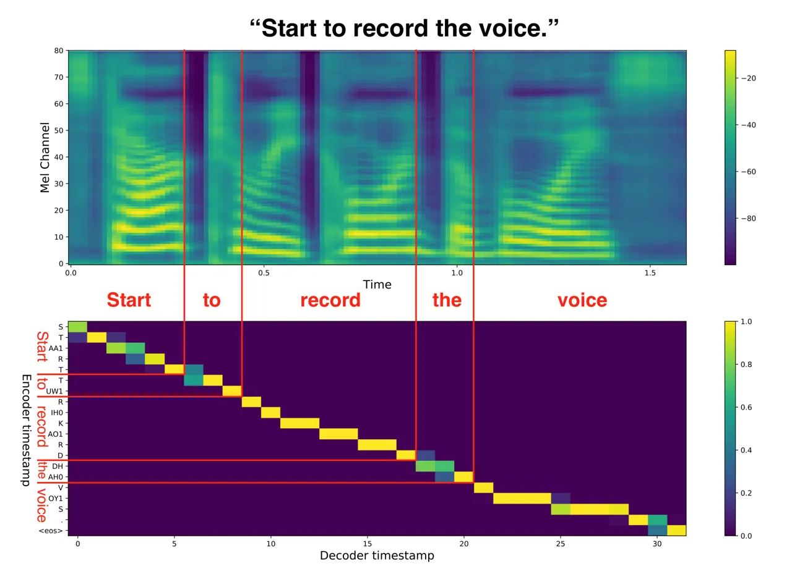
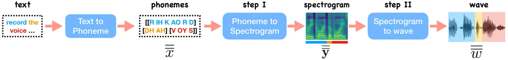
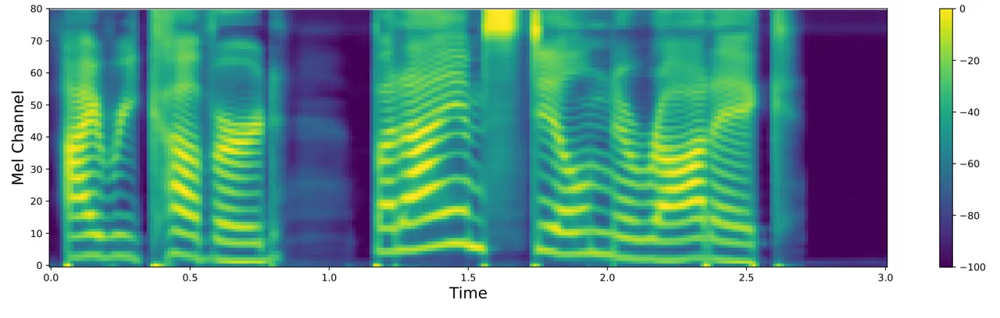
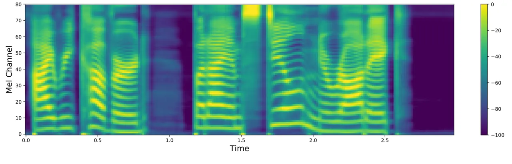

# Incremental Text-to-Speech Synthesis with Prefix-to-Prefix Framework Thanks:   M. M. and B. Z. contributed equally; M. M. co-directed the project (with L. H.), and was responsible for the majority of ideas and implementations; B. Z. improved the speech quality significantly and implemented the ideas on different TTS systems. See our generated audio samples and demos at [https://inctts.github.io/](https://inctts.github.io/). ^(§)Currently address: Kwai Inc., Seattle, WA. ^(¶)Current address: Amazon, San Francisco, CA.

Mingbo Ma^(†\*)   Baigong Zheng  Kaibo Liu^(†)   Renjie Zheng^(†)
Email: <mingboma@baidu.com>    Hairong Liu^(†)   Kainan Peng   Kenneth
Church^(†)   Liang Huang   ^(†)Baidu Research, Sunnyvale, CA, USA   
^(‡)Oregon State University, Corvallis, OR, USA
Email: <lianghuang@baidu.com>

###### Abstract

Text-to-speech synthesis (TTS) has witnessed rapid progress in recent
years, where neural methods became capable of producing audios with high
naturalness. However, these efforts still suffer from two types of
latencies: (a) the computational latency (synthesizing time), which
grows linearly with the sentence length, and (b) the input latency in
scenarios where the input text is incrementally available (such as in
simultaneous translation, dialog generation, and assistive
technologies). To reduce these latencies, we propose a neural
incremental TTS approach using the prefix-to-prefix framework from
simultaneous translation. We synthesize speech in an online fashion,
playing a segment of audio while generating the next, resulting in an
$`O(1)`$ rather than $`O(n)`$ latency. Experiments on English and
Chinese TTS show that our approach achieves similar speech naturalness
compared to full sentence TTS, but only with a constant (1–2 words)
latency.

## 1 Introduction

Text-to-speech synthesis (TTS) generates speech from text, and is an
important task with wide applications in dialog systems, speech
translation, natural language user interface, assistive technologies,
etc. Recently, it has benefited greatly from deep learning, with neural
TTS systems becoming capable of generating audios with high naturalness
Oord et al. (2016); Shen et al. (2018).



Figure 1: Monotonic spectrogram-to-text attention.

State-of-the-art neural TTS systems generally consist of two stages: the
text-to-spectrogram stage which generates an intermediate acoustic
representation (linear- or mel-spectrogram) from the text, and the
spectrogram-to-wave stage (vocoder) which converts the aforementioned
acoustic representation into actual wave signals. In both stages, there
are sequential approaches based on the seq-to-seq framework, as well as
more recent parallel methods. The first stage, being relatively fast, is
usually sequential Wang et al. (2017); Shen et al. (2018); Li et al.
(2019) with a few exceptions Ren et al. (2019); Peng et al. (2019),
while the second stage, being much slower, is more commonly parallel
Oord et al. (2018); Prenger et al. (2019).

Figure 2: Full-sentence TTS vs. our proposed incremental TTS with
prefix-to-prefix framework (with $`k_{1}=1`$ and $`k_{2}=0`$ in Eq. 7).
Our increnemtnal TTS has much lower latency than full-sentence TTS. Our
idea can be summarized by a Unix pipeline: cat text \| text2phone \|
phone2spec \| spec2wave \| play (see also Fig. 3), where different
modules can be processed parallelly.

Despite these successes, standard full-sentence neural TTS systems still
suffer from two types of latencies: (a) the computational latency
(synthesizing time), which still grows linearly with the sentence length
even using parallel inference (esp. in the second stage), and (b) the
input latency in scenarios where the input text is incrementally
generated or revealed, such as in simultaneous translation Bangalore
et al. (2012); Ma et al. (2019), dialog generation Skantze and
Hjalmarsson (2010); Buschmeier et al. (2012), and assistive technologies
Elliott (2003). Especially in simultaneous speech-to-speech translation
Zheng et al. (2020b), there are many efforts have been made in the
simultaneous text-to-text translation stage to reduce the latency with
either fixed Ma et al. (2019); Zheng et al. (2019c); Zheng et al.
(2020c) or adaptive on-line decoding policy Zheng et al. (2019b); Zheng
et al. (2019a); Zheng et al. (2020a); Zheng et al. (2020b). But the
conventional full-sentence TTS has to wait until the full translation is
available, causing the undesirable delay. These latencies limit the
applicability of neural TTS.

To reduce these latencies, we propose a neural incremental TTS approach
borrowing the recently proposed prefix-to-prefix framework for
simultaneous translation Ma et al. (2019). Our idea is based on two
observations: (a) in both stages, the dependencies on input are very
local (see Fig. 1 for the monotonic attention between text and
spectrogram, for example); and (b) audio playing is inherently
sequential in nature, but can be done simultaneously with audio
generation, i.e., playing a segment of audio while generating the next.
In a nutshell, we start to generate the spectrogram for the first word
after receiving the first two words, and this spectrogram is fed into
the vocoder right away to generate the waveform for the first word,
which is also played immediately (see Fig. 2). This results in an
$`O(1)`$ rather than $`O(n)`$ latency. Experiments on English and
Chinese TTS show that our approach achieves similar speech naturalness
compared to full sentence methods, but only with a constant (1--2 words)
latency.¹¹ 1 There also exist incremental TTS efforts using non-neural
techniques Baumann and Schlangen (2012c); Baumann and Schlangen (2012b);
Baumann (2014b); Pouget et al. (2015); Yanagita et al. (2018) which are
fundamentally different from our work. See also Sec. 5.

This paper makes following contributions:

- •
  From the model point of view, with monotonic attention in TTS, we
  don’t need to retrain the model, and only need to adapt the inference.
  This is different from all other previous incremental adaptations in
  simultaneous translation, ASR and TTS Ma et al. (2019); Novitasari
  et al. (2019); Yanagita et al. (2019) which rely on new training
  algorithms and/or different training data preprocessing.
- •
  From a practical point of view, our adaptation reduces the TTS latency
  from $`O(n)`$ to $`O(1)`$, which reduces the TTS response time
  significantly. We also demonstrate that our neural incremental TTS
  pipeline (including vocoder) can support efficient inference with both
  CPU and GPU. This is a meaningful step towards the potential use of
  on-device TTS (as opposed to the prevalent cloud-based TTS).

## 2 Preliminaries: Neural TTS

We briefly review the full-sentence neural TTS pipeline to set up the
notations. As shown in Fig. 3, the neural-based text-to-speech synthesis
system generally has two main steps: (1) the text-to-spectrogram step
which converts a sequence of textual features (e.g. characters,
phonemes, words) into another sequence of spectrograms
(e.g. mel-spectrogram or linear-spectrogram); and (2) the
spectrogram-to-wave step, which takes the predicted spectrograms and
generates the audio wave by a vocoder.



Figure 3: Pipeline of conventional full-sentence neural TTS; see also
Fig. 2.

|          |                         |                                    |                        |
| -------- | ----------------------- | ---------------------------------- | ---------------------- |
|          | data type               | examples                           |                        |
| subword  | scalar                  | $`x`$                              | a phoneme or a char.   |
|          |                         | $`w`$                              | a sample in wave       |
|          | vector                  | $`{\bm{y}}`$                       | a spectrogram frame    |
| word     | seq. of scalars         | $`\overline{x}`$                   | phonemes in a word     |
|          |                         | $`\overline{w}`$                   | waveform of a word     |
|          | seq. of vectors         | $`\overline{{\bm{y}}}`$            | spectrogram of a word  |
| sentence | seq. of seq. of scalars | $`\overline{\overline{x}}`$        | phonemes in a sentence |
|          |                         | $`\overline{\overline{w}}`$        | waveform of a sentence |
|          | seq. of seq. of vectors | $`\overline{\overline{{\bm{y}}}}`$ | spectrogram of a sent. |

Table 1: Summary of notations. We distinguish vectors (over frequencies)
and sequences (over time).

### 2.1 Step I: Text-to-Spectrogram

Neural-based text-to-spectrogram systems employ the seq-to-seq framework
to encode the source text sequence (characters or phonemes; the latter
can be obtained from a prediction model or some heuristic rules; see
details in Sec. 4) and decode the spectrogram sequentially Wang et al.
(2017); Shen et al. (2018); Ping et al. (2017); Li et al. (2019).

Regardless the actual design of seq-to-seq framework, with the
granularity defined on words, the encoder always takes as input a word
sequence
$`\overline{\overline{x}}=[\overline{x_{1}},\overline{x_{2}},...,\overline{x_{m}}]`$
, where any word $`\overline{x_{t}}=[x_{t,1},x_{t,2},...]`$ could be a
sequence of phonemes or characters, and produces another sequence of
hidden states
$`\overline{\overline{\bm{h}}}=\overline{\overline{\bm{f}}}(\overline{\overline{x}})=\left[\overline{\bm{h}_{1}},\overline{\bm{h}_{2}},...,\overline{\bm{h}_{m}}\right]`$
to represent the textual features (see Tab. 1 for notations).

On the other side, the decoder produces the spectrogram
$`\overline{{\bm{y}}_{t}}`$ for the $`t^{th}`$ word given the entire
sequence of hidden states and the previously generated spectrogram,
denoted by
$`\overline{\overline{{\bm{y}}_{<t}}}=[\overline{{\bm{y}}_{1}},...,\overline{{\bm{y}}_{t-1}}]`$,
where $`\overline{{\bm{y}}_{t}}=[{\bm{y}}_{t,1},{\bm{y}}_{t,2},...]`$ is
a sequence of spectrogram frames with
$`{\bm{y}}_{t,i}\in\mathbb{R}^{d_{y}}`$ being the $`i^{th}`$ frame (a
vector) of the $`t^{th}`$ word, and $`d_{y}`$ is the number of bands in
the frequency domain (80 in our experiments). Formally, on a word level,
we define the inference process as follows:

```math
\overline{{\bm{y}}_{t}}=\overline{\bm{\phi}}(\overline{\overline{x}},\overline{\overline{{\bm{y}}_{<t}}}), \tag{1}
```

and for each frame within one word, we have

```math
{\bm{y}}_{t,i}={\bm{\phi}}(\overline{\overline{x}},\overline{\overline{{\bm{y}}_{<t}}}\circ\overline{\overline{{\bm{y}}_{t,<i}}}), \tag{2}
```

where
$`\overline{\overline{{\bm{y}}_{t,<i}}}=[[{\bm{y}}_{t,1},...,{\bm{y}}_{t,i-1}]]`$,
and $`\circ`$ represents concatenation between two sequences.

### 2.2 Step II: Spectrogram-to-Wave

Given a sequence of acoustic features
$`\overline{\overline{{\bm{y}}}}`$, the vocoder generates waveform
$`\overline{\overline{w}}=[\overline{w_{1}},\overline{w_{2}},...,\overline{w_{m}}]`$,
where $`\overline{w_{t}}=[w_{t,1},w_{t,2},...]`$ is the waveform of the
$`t^{th}`$ word, given the linear- or mel-spectrograms. The vocoder
model can be either autoregressive Oord et al. (2016) or
non-autoregressive  Oord et al. (2018); Ping et al. (2018); Prenger
et al. (2019); Kim et al. (2019); Yamamoto et al. (2020).

For the sake of both computation efficiency, and sound quality, we
choose a non-autoregressive model as our vocoder, which can be defined
as follows: without losing generality:

```math
\overline{\overline{w}}=\overline{\overline{\psi}}(\overline{\overline{{\bm{y}}}},\overline{\overline{z}}) \tag{3}
```

where the vocoder function $`\overline{\overline{\psi}}`$ takes the
spectrogram $`\overline{\overline{{\bm{y}}}}`$ and a random signal
$`\overline{\overline{z}}`$ as input to generate the wave signal
$`\overline{\overline{w}}`$. Here $`\overline{\overline{z}}`$ is drawn
from a simple tractable distribution, such as a zero mean spherical
Gaussian distribution $`\mathcal{N}(0,I)`$. The length of each
$`\overline{z_{t}}`$ is determined by the length of
$`\overline{{\bm{y}}_{t}}`$, and we have
$`|\overline{z_{t}}|=\gamma\cdot|\overline{{\bm{y}}_{t}}|`$. Based on
different STFT procedure, $`\gamma`$ can be 256 or 300. More
specifically, the wave generation of the $`t^{th}`$ word can be defined
as follows

```math
\overline{w_{t}}=\overline{\psi}(\overline{\overline{{\bm{y}}}},\overline{\overline{z}},t) \tag{4}
```

## 3 Incremental TTS

Both steps in the above full-sentence TTS pipeline require fully
observed source text or spectrograms as input. Here we first propose a
general framework to do inference at both steps with partial source
information, then we present one simple specific example in this
framework.

### 3.1 Prefix-to-Prefix Framework

Ma et al. (2019) propose a prefix-to-prefix framework for simultaneous
machine translation. Given a monotonic non-decreasing function $`g(t)`$,
the model would predict each target word $`b_{t}`$ based on current
available source prefix $`\overline{a_{\leq g(t)}}`$ and the predicted
target words $`\overline{b_{<t}}`$:

```math
p(\overline{b}\mid\overline{a})=\textstyle\prod_{t=1}^{|\overline{b}|}p(b_{t}\mid\overline{a_{\leq{g(t)}}},\,\overline{b_{<t}})
```

As a simple example in this framework, they present a wait-$`k`$ policy,
which first wait $`k`$ source words, and then alternates emitting one
target word and receiving one source word. With this policy, the output
is always $`k`$ words behind the input. This policy can be defined with
the following function

```math
g_{\text{wait-}k}(t)=\min\{k+t-1,|\overline{a}|\}. \tag{5}
```

### 3.2 Prefix-to-Prefix for TTS

As shown in Fig. 1, there is no long distance reordering between input
and output sides in the task of Text-to-Spectrogram, and the alignment
from output side to the input side is monotonic. One way to utilize this
monotonicity is to generate each audio piece for each word
independently, and after generating audios for all words, we can
concatenate those audios together. However, this naive approach mostly
produces robotic speech with unnatural prosody. In order to generate
speech with better prosody, we need to consider some contextual
information when generating audio for each word. This is also necessary
to connect audio pieces smoothly.

To solve the above issue, we propose a prefix-to-prefix framework for
TTS, which is inspired by the above-mentioned prefix-to-prefix framework
for simultaneous translation. Within this new framework, our per-word
spectrogram $`\overline{{\bm{y}}_{t}}`$ and wave-form
$`\overline{w_{t}}`$ are both generated incrementally as follows:

```math
\displaystyle\overline{{\bm{y}}_{t}} \displaystyle=\overline{\bm{\phi}}(\overline{\overline{x_{\leq g(t)}}},\overline{\overline{{\bm{y}}_{<t}}}), \tag{6}
```

```math
\displaystyle\overline{w_{t}} \displaystyle=\overline{\psi}(\overline{\overline{{\bm{y}}_{\leq h(t)}}},\overline{\overline{z_{\leq h(t)}}},t)
```

where $`g(t)`$ and $`h(t)`$ are monotonic functions that define the
number of words being conditioned on when generating results for the
$`t^{th}`$ word.

### 3.3 Lookahead-$`k`$ Policy

As a simple example in the prefix-to-prefix framework, we define two
lookahead polices for the two steps (spectrogram and wave) with
$`h(\cdot)`$ and $`g(\cdot)`$ functions, resp. These are similar to the
monotonic function in wait-$`k`$ policy Ma et al. (2019) in Eq. 5
(except that lookahead-$`k`$ is wait-$`(k\!+\!1)`$):

```math
\begin{matrix}g_{\text{lookahead-}k_{1}}(t)=\min\{k_{1}+t,|\overline{\overline{x}}|\}\\
h_{\text{lookahead-}k_{2}}(t)=\min\{k_{2}+t,|\overline{\overline{{\bm{y}}}}|\}\end{matrix} \tag{7}
```

Intuitively, the function $`g_{\text{lookahead-}k_{1}}(\cdot)`$ implies
that the spectrogram generation of the $`t^{th}`$ word is conditioned on
$`(t+k_{1})`$ words, with the last $`k_{1}`$ being the lookahead.
Similarly, the function $`h_{\text{lookahead-}k_{2}}(\cdot)`$ implies
that the wave generation of the $`t^{th}`$ word is conditioned on
$`(t+k_{2})`$ words’ spectrograms. Combining these together, we can
obtain a lookahead-$`k`$ policy for the whole TTS system, where
$`k=k_{1}+k_{2}`$. An example of lookahead-1 policy is provided in
Fig. 2, where we take $`k_{1}=1`$ for the spectrogram generation and
$`k_{2}=0`$ for the wave generation.

## 4 Implementation Details

In this section, we provide some implementation details for the two
steps (spectrogram and wave). We assume the given text input is
normalized, and we use an existing grapheme-to-phoneme tool²² 2 We use
g2pE Park and Kim (2019)
([https://github.com/Kyubyong/g2p](https://github.com/Kyubyong/g2p)) for
English and pypinyin
([https://github.com/mozillazg/python-pinyin](https://github.com/mozillazg/python-pinyin))
for Chinese. to generate phonemes for the given text. For some languages
like Chinese, we need to use an existing tool³³ 3 We use jieba
([https://github.com/fxsjy/jieba](https://github.com/fxsjy/jieba)) to do
text segmentation for Chinese. to do text segmentation before generating
phonemes.

In the following, we assume the pre-trained models for both steps are
given, and we only perform inference-time adaptations. For the first
step, we use the Tacotron 2 model Shen et al. (2018), which takes
generated phonemes as input, and for the second step we use the Parallel
WaveGAN vocoder Yamamoto et al. (2020).

### 4.1 Incremental Generation of Spectrogram

Different from full sentence scenario, where we feed the entire source
text to the encoder, we gradually provide source text input to the model
word by word when more input words are available. By our
prefix-to-prefix framework, we will predict mel spectrogram for the
$`t^{th}`$ word, when there are $`g(t)`$ words available. Thus, the
decoder predicts the $`i^{th}`$ spectrogram frame of the $`t^{th}`$ word
with only partial source information as follows:

```math
{\bm{y}}_{t,i}=\bm{\phi}(\overline{\overline{x_{\leq g(t)}}},\overline{\overline{{\bm{y}}_{<t}}}\circ\overline{\overline{{\bm{y}}_{t,<i}}}) \tag{8}
```

where
$`\overline{\overline{{\bm{y}}_{t,<i}}}=[[{\bm{y}}_{t,1},...,{\bm{y}}_{t,i-1}]]`$
represents the first $`i-1`$ spectrogram frames in the $`t^{th}`$ word.

In order to obtain the corresponding relationship between the predicted
spectrogram and the currently available source text, we rely on the
attention alignment applied in our decoder, which is usually monotonic.
To the $`i^{th}`$ spectrogram frame of the $`t^{th}`$ word, we can
define the attention function $`\bm{\sigma}`$ in our decoder as follows

```math
{\mathbf{c}}_{t,i}=\bm{\sigma}(\overline{\overline{x_{\leq t+1}}},\overline{\overline{{\bm{y}}_{<t}}}\circ\overline{\overline{{\bm{y}}_{t,<i}}}) \tag{9}
```

The output $`\mathbf{c}_{t,i}`$ represents the alignment distribution
over the input text for the $`i^{th}`$ predicted spectrogram frame. And
we choose the input element with the highest probability as the
corresponding input element for this predicted spectrogram, that is,
$`\operatornamewithlimits{\mathbf{argmax}}\mathbf{c}_{t,i}`$. When we
have
$`\operatornamewithlimits{\mathbf{argmax}}\mathbf{c}_{t,i}>\sum_{\tau=1}^{t}|\overline{x_{\tau}}|`$,
it implies that the $`i^{th}`$ spectrogram frame corresponds to the
$`(t+1)^{th}`$ word, and all the spectrogram frames for the $`t^{th}`$
word are predicted.

When the encoder observes the entire source sentence, a special symbol
\<eos\> was feed into the encoder, and the decoder continue to generate
spectrogram word by word. The decoding process ends when the binary
“stop” predictor of the model predicts the probability larger than
$`0.5`$.

### 4.2 Generation of Waveform

After we obtain the predicted spectrograms for a new word, we feed them
into our vocoder to generate waveform. Since we use a non-autoregressive
vocoder, we can generate each audio piece for those given spectrograms
in the same way as full sentence generation. Thus, we do not need to
make modification on the vocoder model implementation. Then the
straightforward way to generate each audio piece is to apply Eq. 4 at
each step $`t`$ conditioned on the spectrograms of each word
$`\overline{{\bm{y}}_{t}}`$. However, when we concatenate the audio
pieces generated in this way, we observe some noise at the connecting
part of two audio pieces.

To avoid such noise, we sample a long enough random vector as the input
vector $`\overline{\overline{z}}`$ and fix it when generating audio
pieces. Further, we append additional $`\delta`$ number of spectrogram
frames to each side of the current spectrograms
$`\overline{{\bm{y}}_{t}}`$ if possible. That is, at most $`\delta`$
number of last frames in $`\overline{{\bm{y}}_{t-1}}`$ are added in
front of $`\overline{{\bm{y}}_{t}}`$, and at most $`\delta`$ number of
first frames in $`\overline{{\bm{y}}_{t+1}}`$ are added at the end of
$`\overline{{\bm{y}}_{t}}`$. This may give a longer audio piece than we
need, so we can remove the extra parts from that. Formally, the
generation procedure of wave for each word can be defined as follows

```math
\overline{w_{t}}=\overline{\psi}(\overline{\overline{{\bm{y}}_{[t-1:h(t)]}}},\overline{\overline{z_{[t-1:h(t)]}}},t) \tag{10}
```

where
$`\overline{\overline{{\bm{y}}_{[t-1:h(t)]}}}=[\overline{{\bm{y}}_{t-1}},\dots,\overline{{\bm{y}}_{h(t)}}]`$
and
$`\overline{\overline{z_{[t-1:h(t)]}}}=[\overline{z_{t-1}},\dots,\overline{z_{h(t)}}]`$.

## 5 Related Work

There are some existing work about incremental TTS based Hidden Markov
Model (HMM). Baumann and Schlangen (2012c) propose an incremental spoken
dialogue system architecture and toolkit called INPROTK, including
recognition, dialogue management and TTS modules. With this toolkit,
 Baumann and Schlangen (2012b) present a component for incremental
speech synthesis, which is not fully incremental on the HMM level.
Pouget et al. (2015) propose a training strategy based on HMM with
unknown linguistic features for incremental TTS. Baumann (2014a);
Baumann (2014b) proposes use linguistic features and choose default
values when they are not available. The above works all focus on
stress-timed languages, such as English and German, while Yanagita
et al. (2018) propose a system for Japanese, a mora-timed language.
These systems require full context labels of linguistic features, making
it difficult to improve the audio quality when input text is revealed
incrementally. Further, each component in their systems is trained and
tuned separately, resulting in error propagation.

There is parallel work from Yanagita et al. (2019), which introduced a
different neural approach for segment-based incremental TTS. Their
proposed solution synthesizes each segment (could be as long as half
sentence) at a time, thus not strictly incremental on the word level.
When they perform word-level synthesis, as it is shown in their paper,
there is a huge performance drop from 3.01 (full-sentence) to 2.08.
Their proposed approach has to retain the basic full-sentence model with
segmented texts and audios which were obtained from forced alignment
(different models for different latencies), while we only make
adaptations to the decoder at inference time with an existing
well-trained full-sentence model. Our model not only uses previous
context, but also use limited, a few lookahead words for better prosody
and pronunciation. The above advantages of our model guarantee that our
model achieves similar performance with full-sentence model with much
lower latency on word-level inference. On the contrary, the model from
Yanagita et al. (2019) did not use lookahead information at all, which
can be problematic in the cases when word has multiple pronunciation
that depends on following word. For example, there are two
pronunciations for the word “the” which are “DH IY” and “DH AH”. When
the word after “the” starts with vowel sound, “DH IY” is the correct
option while “DH AH” is used only when the following word begins with
consonant sound. Lookabead information is more important in liaison,
where the final consonant of one word links with the first vowel of the
next word, e.g., “an apple”, “think about it”, and “there is a”. This
problem is even more severe in other languages like French. More
generally, co-articulation is common in most languages, where lookahead
is needed.

## 6 Experiments

### 6.1 Experimental Setup

[TABLE]

Table 2: MOS ratings: with 95% confidence intervals for comparing the
audio qualities of different methods on English and Chinese. We can
incrementally synthesize high quality audios with our lookahead-1 and
lookahead-2 policies. The method of Yanagita et al. (2019) uses
augmented data to train the model and needs more steps to converge, but
its audio quality is worse than that of lookahead-1 policy. Prosody
analysis: phoneme level duration (in ms) and pitch deviation (in Hz)
RMSE of different methods compare against to full-sentence (smaller RMSE
is better) in English and Chinese. In full-sentence generation of
English, the mean phoneme duration and pitch are 97.41 ms and 237.23 Hz
respectively. In full-sentence generation of Chinese, the mean phoneme
duration and pitch are 89.93 ms and 252.73 Hz respectively. $`\dagger`$
represents the performance of our proposed methods.

##### Datasets

We evaluate our methods on English and Chinese. For English, we use a
proprietary speech dataset containing 13,708 audio clips (i.e.,
sentences) from a female speaker and the corresponding transcripts. For
Chinese, we use a public speech dataset⁴⁴ 4
[https://www.data-baker.com/open_source.html](https://www.data-baker.com/open_source.html)
containing 10,000 audio clips from a female speaker and the transcripts.
We downsample the audio data to 24 kHz, and split the dataset into three
sets: the last 100 sentences for testing, the second last 100 for
validation and the others for training. Our mel-spectrogram has 80
bands, and is computed through a short time Fourier transform (STFT)
with window size 1200 and hop size 300.

##### Models

We take the Tacotron 2 model Shen et al. (2018) as our
phoneme-to-spectrogram model and train it with additional guided
attention loss Tachibana et al. (2018) which speeds up convergence. Our
vocoder is the same as that in the Parallel WaveGAN paper Yamamoto
et al. (2020), which consists of 30 layers of dilated residual
convolution blocks with exponentially increasing three dilation cycles,
64 residual and skip channels and the convolution filter size 3.

##### Inference

In our experiments, we find that synthesis on a word-level severely
slows down synthesis, because many words are synthesized more than once
due to overlap (our method will generate at most $`2\delta`$ additional
spectrogram frames for each given spectrogram sequence, as described in
Sec. 4.2). Therefore, below we do inference on a chunk-level, where each
chunk consists of one or more words depending on a hyper-parameter
$`l`$: a chunk contains the minimum number of words such that the number
of phonemes in this chunk is at least $`l`$ which is 6 for English and 4
for Chinese.

In the following sections, we consider three different policies:
lookahead-2 ($`k_{1}\!=\!1`$ in text-to-spectrogram, $`k_{2}\!=\!1`$ in
spectrogram-to-wave), lookahead-1 policy ($`k_{1}\!=\!1,k_{2}\!=\!0`$)
and lookahead-0 policy ($`k_{1}\!=\!k_{2}\!=\!0`$). For lookahead-2
policy, we set $`\delta=15`$ on English and $`\delta=10`$ on Chinese
(see Sec. 4.2 for the definition of $`\delta`$). All methods are with
GeForce TITAN-X GPU.

### 6.2 Audio Quality

In this section, we compare the audio qualities of different methods.
For this purpose, we choose 80 sentences from our test set and generate
audio samples for these sentences with different methods, which include
(1) Ground Truth Audio; (2) Ground Truth Mel, where we convert the
ground truth mel spectrograms into audio samples using our vocoder; (3)
Full-sentence, where we first predict all mel spectrograms given the
full sentence text and then convert those to audio samples; (4)
Lookahead-2, where we incrementally generate audio samples with
lookahead-2 policy; (5) Lookahead-1, where we incrementally generate
audio samples with lookahead-1 policy; (6) Lookahead-0, where we
incrementally generate audio samples with lookahead-0 policy; (7)
Yanagita et al. (2019) (2 words), where we follow the method in Yanagita
et al. (2019) and synthesize with incremental unit as two words; (8)
Yanagita et al. (2019) (1 word), where we follow the method in Yanagita
et al. (2019) and synthesize with incremental unit as one word⁵⁵ 5 We
use the “Independent” approach from the original paper for connecting
the units in the both baselines, as this is shown to have better prosody
in the original paper Yanagita et al. (2019).; (9) Lookahead-0-indep,
where we generate audio pieces independently for each chunk without
surrounding context information. These audios are sent to Amazon
Mechanical Turk where each sample received 10 human ratings scaled from
1 to 5. The MOS (Mean Opinion Score) of this evaluation is provided in
Table 2.

From Table 2, we notice that lookahead-2 policy generates comparable
audio quality to the full-sentence method. Lookahead-0 has poor
performance due to lack of following words’ information. But it still
outperforms lookahead-0-indep since lookahead-0-indep does not use any
previous context information. Note that we use a neural vocoder to
synthesize our audios in the two Yanagita et al. (2019) baselines, and
their MOS scores in the above table are much higher than then original
paper.

Following the prosody analysis in Baumann and Schlangen (2012a), we
perform the similar prosody analysis of the difference between various
methods in Table  2. Duration and pitch are two essential components for
prosody. We evaluate how the duration and pitch under different
incremental generation settings deviate from those in full-sentence with
root mean squared error (RMSE).

The RMSE for both duration and pitch of lookahead-1 and lookahead-2 are
much lower compared with lookahead-0-indep and lookahead-0. The RMSE of
lookahead-2 is slightly better than lookahead-1 which also agrees the
results of MOS in Table  2. Compared with Yanagita et al. (2019)’s
models, lookahead-1 and lookahead-2 achieves much better duration and
pitch RMSE.

In the cases of lookahead-0, our proposed model is slightly worse (0.15
in MOS, about 3.8$`\%`$) than Yanagita et al. (2019)’s models since we
don’t retrain the model. But Yanagita et al. (2019)’s model needs
retraining and special preprocessing of training data. In all other
settings, lookahead-1 and lookahead-2, our model gets the best
performance.

As discussed in latter part of Section.5, some languages seem to require
less lookahead; for example, our experiments on Chinese TTS in this
paper showed that improvement from lookahead is smaller than English in
Table  2. However, this is due to the fact that our Chinese dataset is
mostly formal text that does not expose co-articulation, but in informal
fast speech, co-articulation between word boundaries is more common
(such as third-tone sandhi) where you need lookahead Chen and Yuan
(2007); Yuan and Chen (2014).

### 6.3 Visual Analysis

To make visual comparison, Fig. 4 shows mel-spectrograms obtained from
full-sentence TTS and lookahead-1 policy. We can see that the
mel-spectrogram from lookahead-1 policy is very similar to that by
full-sentence TTS. This comparison also proves that our incremental TTS
can approximate the quality of full-sentence TTS.





Figure 4: Mel-spectrograms comparison between full-sentence TTS (top),
and our lookahead-1 policy (bottom). These two mel-spectrograms are very
similar.

### 6.4 Latency

Figure 5: MOS score against computational latency for English and
Chinese. “look”$`*`$ denotes lookahead-$`*`$, and “ya” denotes baselines
from Yanagita et al. (2019).

We next compare the latencies of full-sentence TTS and our proposed
lookahead-2 and lookahead-1 policies. We consider two different
scenarios: (1) when all text input is immediately available; and (2)
when the text input is revealed incrementally. The first setting is the
same as conventional TTS, while the second is required in applications
like simultaneous translation, dialog generation, and assistive
technologies.

#### 6.4.1 All Input Available

Figure 6: Averaged computational latency of different methods for
English (upper) and Chinese (lower). Full-sentence method has its
latency increasing with the sentence length, while our incremental
methods have constant latency with different sentence lengths.

Figure 7: Time balance $`{\mathit{TB}}(t)`$ (the higher the better) for
all sentences in the 300-sentence set for English (upper) and Chinese
(lower). Audio can play continuously if $`{\mathit{TB}}(t)\geq 0`$ for
all $`t`$, which is true for all plots. Lookahead-1 policy is on the
left side and lookahead-2 is on the right side.

For this scenario, there is no input latency, and we only need to
consider computational latency. For full-sentence method, this will be
the synthesizing time of the whole audio sample; while for our
incremental method, this latency will be the synthesizing time of the
first chunk if the next audio piece can be generated before the current
audio piece playing finishes. We first compare this latency, and then
show the audio pieces can be played continuously without interruptions.
Specifically, we do inference with different methods on 300 sentences
(including 100 sentences from our validation set, test set and training
set respectively) and average the results over sentences with the same
length. The results for English and Chinese are provided in Fig. 6.

As shown in Fig. 6, we observe that the latency of full-sentence TTS
scales linearly with sentence length, being 1.5+ seconds for long
English sentences (125+ phonemes) and 1+ seconds for long Chinese
sentences (70+ phonemes). By contrast, our incremental TTS have constant
latency that does not grow with sentence length, which is generally
under 0.3 seconds for both English and Chinese regardless of different
sentence length.

Fig. 5 compares the latency and MOS with different policies against to
several baselines from Yanagita et al. (2019) on English dataset. To
make a fair comparison with baseline, we use the model from Yanagita
et al. (2019) and follow our lookahead-0 policy to generate
“en-ya-look0” in Fig. 5. Compared with lookahead-0, “en-ya-look0” has
higher MOS score since it is retrained with chunk-based dataset.
However, when a small amount of lookahead is allowed, our lookahead 1
and 2 outperform “en-ya-w1” and “en-ya-w2” easily. This also demonstrate
the importance of lookahead information.

##### Continuity

We next show that our method is fast enough so that the generated audios
can be played continuously without interruption, i.e., the generation of
the next audio chunk will finish before the audio playing of the current
chunk ends (see Fig. 8). Let $`a_{t}`$ be the playing time of the
$`t^{th}`$ synthesized audio chunk, and $`syn_{t}`$ be its synthesis
time. We define the time balance $`{\mathit{TB}}(t)`$ at the $`t^{th}`$
step as follows (assume $`{\mathit{TB}}(0)=0`$):

```math
\displaystyle{\mathit{TB}}(t) \displaystyle=\max\{{\mathit{TB}}(t-1),0\}+(a_{t}-s_{t+1})
```

Intuitively, $`{\mathit{TB}}(t)`$ denotes the “surplus” time between the
end of audio playing of the $`t^{th}`$ audio chunk and the end of
synthesizing the $`(t+1)^{th}`$ audio piece. If
$`{\mathit{TB}}(t)\geq 0`$ for all $`t`$, then the audio of the whole
sentence can be played seamlessly. Fig. 7 computes the time balance at
each step for all sentences in the 300-sentence set for English and
Chinese. We find that the time balance is always positive for both
languages and both policies.

Figure 8: An example for time balance. The first two steps have positive
time balance, implying the first three audio pieces can be played
continuously. The third step have negative time balance, meaning that
there will be some interruption after the third piece.

Figure 9: Average chunk lag of different methods on English (upper) and
Chinese (lower). Full-sentence TTS suffers from a delay that increases
linearly with the sentence length, while our incremental methods have
constant delay.

#### 6.4.2 Input Given Incrementally

To mimic this scenario, we design a “shadowing” experiment where the
goal is to repeat the sentence from the speaker with a latency as low as
possible; this practice is routinely used to train a simultaneous
interpreter Lambert (1992). For this experiment, our latency needs to
include both the computational latency and input latency. Here we define
the averaged chunk lag as the average lag time between the ending time
of each input audio chunk and the ending time of the playing of the
corresponding generated audio chunk (see Fig. 10).

Figure 10: An example for chunk lags. The arrows represent the lags for
different chunks.

We take the ground-truth audios as inputs and extract the ending time of
each chunk in those audios by the Montreal Forced Aligner McAuliffe
et al. (2017). The ending time of our chunk can be obtained by combining
the generation time, audio playing time and input chunk ending time. We
average the latency results over sentences with the same length and the
results are provided in Fig. 9.

We find that the latency of our methods is almost constant for different
sentence lengths, which is under 2.5 seconds for English and Chinese;
while the latency of full-sentence method increases linearly with the
sentence length. Compared with Fig. 6, larger latency is expected due to
input latency.

## 7 Conclusions

We have presented a prefix-to-prefix inference framework for incremental
TTS system, and a lookahead-$`k`$ policy that the audio generation is
always $`k`$ words behind the input. We show that this policy can
achieve good audio quality compared with full-sentence method but with
low latency in different scenarios: when all the input are available and
when input is given incrementally.

## References

- Bangalore et al. (2012) Srinivas Bangalore, Vivek Kumar
  Rangarajan Sridhar, Prakash Kolan, Ladan Golipour, and Aura
  Jimenez. 2012. Real-time incremental speech-to-speech translation of
  dialogs. In _Proc. of NAACL-HLT_.
- Baumann (2014a) Timo Baumann. 2014a. Decision tree usage for
  incremental parametric speech synthesis. In _2014 IEEE International
  Conference on Acoustics, Speech and Signal Processing (ICASSP)_, pages
  3819–3823. IEEE.
- Baumann (2014b) Timo Baumann. 2014b. Partial representations improve
  the prosody of incremental speech synthesis. In _Fifteenth Annual
  Conference of the International Speech Communication Association_.
- Baumann and Schlangen (2012a) Timo Baumann and David Schlangen. 2012a.
  Evaluating prosodic processing for incremental speech synthesis.
- Baumann and Schlangen (2012b) Timo Baumann and David Schlangen. 2012b.
  INPRO_iSS: A component for just-in-time incremental speech synthesis.
  In _Proceedings of the ACL 2012 System Demonstrations_, pages 103–108.
- Baumann and Schlangen (2012c) Timo Baumann and David Schlangen. 2012c.
  The INPROTK 2012 release. In _NAACL-HLT Workshop on Future Directions
  and Needs in the Spoken Dialog Community: Tools and Data_, pages
  29–32. Association for Computational Linguistics.
- Buschmeier et al. (2012) Hendrik Buschmeier, Timo Baumann, Benjamin
  Dosch, Stefan Kopp, and David Schlangen. 2012. Combining incremental
  language generation and incremental speech synthesis for adaptive
  information presentation. In _Proceedings of the 13th Annual Meeting
  of the Special Interest Group on Discourse and Dialogue_, pages
  295–303. Association for Computational Linguistics.
- Chen and Yuan (2007) Yiya Chen and Jiahong Yuan. 2007. A corpus study
  of the 3rd tone sandhi in standard chinese.
- Elliott (2003) CARL Elliott. 2003. The perfect voice. _C. Elllott,
  Better than well: American medicine meets the American dream_, pages
  1–27.
- Kim et al. (2019) Sungwon Kim, Sang-Gil Lee, Jongyoon Song, Jaehyeon
  Kim, and Sungroh Yoon. 2019. FloWaveNet: A generative flow for raw
  audio. In _International Conference on Machine Learning_, pages
  3370–3378.
- Lambert (1992) Sylvie Lambert. 1992. Shadowing. _Meta: Journal des
  traducteurs/Meta: Translators’ Journal_, 37(2):263–273.
- Li et al. (2019) Naihan Li, Shujie Liu, Yanqing Liu, Sheng Zhao, and
  Ming Liu. 2019. Neural speech synthesis with Transformer network. In
  _AAAI_.
- Ma et al. (2019) Mingbo Ma, Liang Huang, Hao Xiong, Renjie Zheng,
  Kaibo Liu, Baigong Zheng, Chuanqiang Zhang, Zhongjun He, Hairong Liu,
  Xing Li, Hua Wu, and Haifeng Wang. 2019. [STACL: Simultaneous
  translation with implicit anticipation and controllable latency using
  prefix-to-prefix framework](https://doi.org/10.18653/v1/P19-1289). In
  _Proceedings of the 57th Annual Meeting of the Association for
  Computational Linguistics_, pages 3025–3036, Florence, Italy.
  Association for Computational Linguistics.
- McAuliffe et al. (2017) Michael McAuliffe, Michaela Socolof, Sarah
  Mihuc, Michael Wagner, and Morgan Sonderegger. 2017. Montreal Forced
  Aligner: Trainable text-speech alignment using Kaldi. In
  _Interspeech_.
- Novitasari et al. (2019) Sashi Novitasari, Andros Tjandra, Sakriani
  Sakti, and Satoshi Nakamura. 2019. Sequence-to-sequence learning via
  attention transfer for incremental speech recognition.
- Oord et al. (2018) Aaron Oord, Yazhe Li, Igor Babuschkin, Karen
  Simonyan, Oriol Vinyals, Koray Kavukcuoglu, George Driessche, Edward
  Lockhart, Luis Cobo, Florian Stimberg, et al. 2018. Parallel WaveNet:
  Fast high-fidelity speech synthesis. In _International Conference on
  Machine Learning_, pages 3915–3923.
- Oord et al. (2016) Aaron van den Oord, Sander Dieleman, Heiga Zen,
  Karen Simonyan, Oriol Vinyals, Alex Graves, Nal Kalchbrenner, Andrew
  Senior, and Koray Kavukcuoglu. 2016. Wavenet: A generative model for
  raw audio. _arXiv preprint arXiv:1609.03499_.
- Park and Kim (2019) Kyubyong Park and Jongseok Kim. 2019. g2pE.
  GitHub.
- Peng et al. (2019) Kainan Peng, Wei Ping, Zhao Song, and Kexin
  Zhao. 2019. Parallel neural text-to-speech. _arXiv preprint
  arXiv:1905.08459_.
- Ping et al. (2018) Wei Ping, Kainan Peng, and Jitong Chen. 2018.
  ClariNet: Parallel wave generation in end-to-end text-to-speech.
  _arXiv preprint arXiv:1807.07281_.
- Ping et al. (2017) Wei Ping, Kainan Peng, Andrew Gibiansky,
  Sercan Ömer Arik, Ajay Kannan, Sharan Narang, Jonathan Raiman, and
  John L. Miller. 2017. Deep Voice 3: Scaling text-to-speech with
  convolutional sequence learning. In _ICLR_.
- Pouget et al. (2015) Maël Pouget, Thomas Hueber, Gérard Bailly, and
  Timo Baumann. 2015. HMM training strategy for incremental speech
  synthesis. In _Sixteenth Annual Conference of the International Speech
  Communication Association_.
- Prenger et al. (2019) Ryan Prenger, Rafael Valle, and Bryan
  Catanzaro. 2019. Waveglow: A flow-based generative network for speech
  synthesis. In _ICASSP 2019-2019 IEEE International Conference on
  Acoustics, Speech and Signal Processing (ICASSP)_, pages 3617–3621.
  IEEE.
- Ren et al. (2019) Yi Ren, Yangjun Ruan, Xu Tan, Tao Qin, Sheng Zhao,
  Zhou Zhao, and Tie-Yan Liu. 2019. FastSpeech: Fast, robust and
  controllable text to speech. _arXiv preprint arXiv:1905.09263_.
- Shen et al. (2018) Jonathan Shen, Ruoming Pang, Ron Weiss, Mike
  Schuster, Navdeep Jaitly, Zongheng Yang, Zhifeng Chen, Yu Zhang,
  Yuxuan Wang, Rj Skerrv-Ryan, Rif Saurous, Yannis Agiomvrgiannakis, and
  Yonghui Wu. 2018. Natural TTS synthesis by conditioning WaveNet on MEL
  spectrogram predictions. In _Interspeech_.
- Skantze and Hjalmarsson (2010) Gabriel Skantze and Anna
  Hjalmarsson. 2010. Towards incremental speech generation in dialogue
  systems. In _Proceedings of the 11th Annual Meeting of the Special
  Interest Group on Discourse and Dialogue_, pages 1–8. Association for
  Computational Linguistics.
- Tachibana et al. (2018) Hideyuki Tachibana, Katsuya Uenoyama, and
  Shunsuke Aihara. 2018. Efficiently trainable text-to-speech system
  based on deep convolutional networks with guided attention. In _2018
  IEEE International Conference on Acoustics, Speech and Signal
  Processing (ICASSP)_, pages 4784–4788. IEEE.
- Wang et al. (2017) Yuxuan Wang, RJ Skerry-Ryan, Daisy Stanton, Yonghui
  Wu, Ron J. Weiss, Navdeep Jaitly, Zongheng Yang, Ying Xiao, Zhifeng
  Chen, Samy Bengio, Quoc Le, Yannis Agiomyrgiannakis, Rob Clark, and
  Rif A. Saurous. 2017. [Tacotron: Towards end-to-end speech
  synthesis](https://arxiv.org/abs/1703.10135). In _Interspeech_.
- Yamamoto et al. (2020) Ryuichi Yamamoto, Eunwoo Song, and Jae-Min
  Kim. 2020. Parallel WaveGAN: A fast waveform generation model based on
  generative adversarial networks with multi-resolution spectrogram. In
  _ICASSP 2020-2020 IEEE International Conference on Acoustics, Speech
  and Signal Processing (ICASSP)_, pages 6199–6203. IEEE.
- Yanagita et al. (2018) Tomoya Yanagita, Sakriani Sakti, and Satoshi
  Nakamura. 2018. Incremental TTS for Japanese language. In
  _Interspeech_, pages 902–906.
- Yanagita et al. (2019) Tomoya Yanagita, Sakriani Sakti, and Satoshi
  Nakamura. 2019. Neural iTTS: Toward Synthesizing Speech in Real-time
  with End-to-end Neural Text-to-Speech Framework. In _Proc. 10th ISCA
  Speech Synthesis Workshop_.
- Yuan and Chen (2014) Jiahong Yuan and Yiya Chen. 2014. 3 rd tone
  sandhi in standard chinese: A corpus approach. _Journal of Chinese
  Linguistics_.
- Zheng et al. (2020a) Baigong Zheng, Kaibo Liu, Renjie Zheng, Mingbo
  Ma, and Liang Huang. 2020a. Simultaneous translation policies: From
  fixed to adaptive. In _ACL_.
- Zheng et al. (2019a) Baigong Zheng, Renjie Zheng, Mingbo Ma, and Liang
  Huang. 2019a. Simpler and faster learning of adaptive policies for
  simultaneous translation. In _EMNLP_.
- Zheng et al. (2019b) Baigong Zheng, Renjie Zheng, Mingbo Ma, and Liang
  Huang. 2019b. Simultaneous translation with flexible policy via
  restricted imitation learning. In _ACL_.
- Zheng et al. (2019c) Renjie Zheng, Mingbo Ma, Baigong Zheng, and Liang
  Huang. 2019c. Speculative beam search for simultaneous translation. In
  _EMNLP_.
- Zheng et al. (2020b) Renjie Zheng, Mingbo Ma, Baigong Zheng, Kaibo
  Liu, and Liang Huang. 2020b. Fluent and low-latency simultaneous
  speech-to-speech translation with self-adaptive training. In _Findings
  of EMNLP_.
- Zheng et al. (2020c) Renjie Zheng, Mingbo Ma, Baigong Zheng, Kaibo
  Liu, and Liang Huang. 2020c. Opportunistic decoding with timely
  correction for simultaneous translation. In _ACL_.
