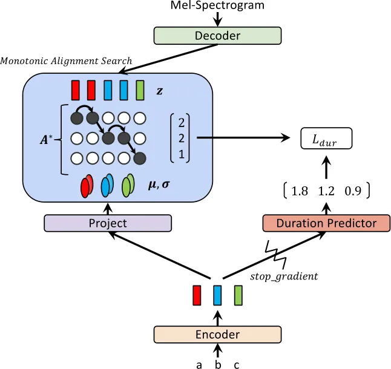
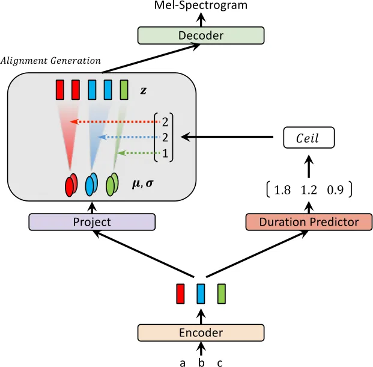
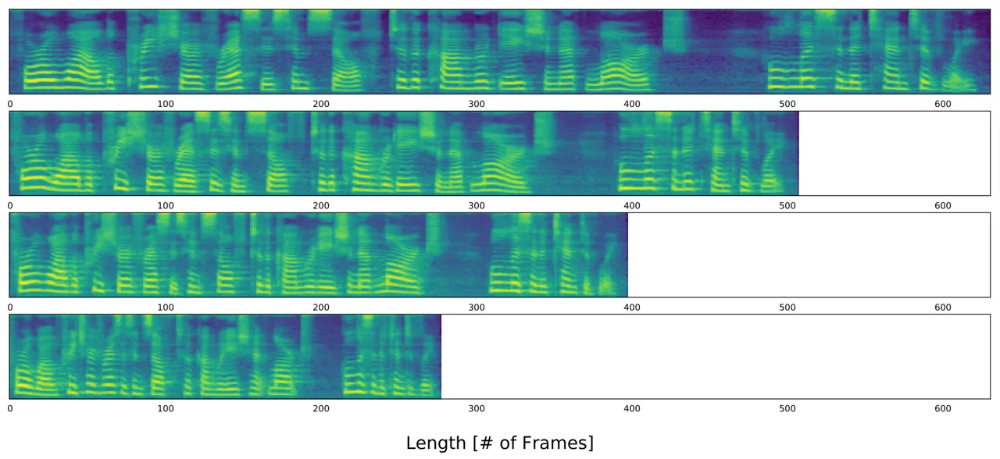

# Glow-TTS: A Generative Flow for Text-to-Speech via Monotonic Alignment Search

Jaehyeon Kim Affiliation: Kakao Enterprise
Email: [jay.xyz@kakaoenterprise.com](mailto:)    Sungwon Kim
Affiliation: Data Science & AI Lab. Affiliation: Seoul National
University Email: [ksw0306@snu.ac.kr](mailto:)    Jungil Kong
Affiliation: Kakao Enterprise
Email: [henry.k@kakaoenterprise.com](mailto:)    Sungroh Yoon
^(†)^(†)thanks: Corresponding author Affiliation: Data Science & AI Lab.
Affiliation: Seoul National University
Email: [sryoon@snu.ac.kr](mailto:)

###### Abstract

Recently, text-to-speech (TTS) models such as FastSpeech and ParaNet
have been proposed to generate mel-spectrograms from text in parallel.
Despite the advantage, the parallel TTS models cannot be trained without
guidance from autoregressive TTS models as their external aligners. In
this work, we propose Glow-TTS, a flow-based generative model for
parallel TTS that does not require any external aligner. By combining
the properties of flows and dynamic programming, the proposed model
searches for the most probable monotonic alignment between text and the
latent representation of speech on its own. We demonstrate that
enforcing hard monotonic alignments enables robust TTS, which
generalizes to long utterances, and employing generative flows enables
fast, diverse, and controllable speech synthesis. Glow-TTS obtains an
order-of-magnitude speed-up over the autoregressive model, Tacotron 2,
at synthesis with comparable speech quality. We further show that our
model can be easily extended to a multi-speaker setting.

## 1 Introduction

Text-to-speech (TTS) is a task in which speech is generated from text,
and deep-learning-based TTS models have succeeded in producing natural
speech. Among neural TTS models, autoregressive models, such as Tacotron
2 \[23\] and Transformer TTS \[13\], have shown state-of-the-art
performance. Despite the high synthesis quality of autoregressive TTS
models, there are a few difficulties in deploying them directly in
real-time services. As the inference time of the models grows linearly
with the output length, undesirable delay caused by generating long
utterances can be propagated to the multiple pipelines of TTS systems
without designing sophisticated frameworks \[14\]. In addition, most of
the autoregressive models show a lack of robustness in some cases \[20,
16\]. For example, when an input text includes repeated words,
autoregressive TTS models sometimes produce serious attention errors.

To overcome such limitations of the autoregressive TTS models, parallel
TTS models, such as FastSpeech \[20\], have been proposed. These models
can synthesize mel-spectrograms significantly faster than the
autoregressive models. In addition to the fast sampling, FastSpeech
reduces the failure cases of synthesis, such as mispronouncing,
skipping, or repeating words, by constraining its alignment to be
monotonic. However, to train the parallel TTS models, well-aligned
attention maps between text and speech are necessary. Recently proposed
parallel models extract attention maps from their external aligners,
pre-trained autoregressive TTS models \[16, 20\]. Therefore, the
performance of the models critically depends on that of the external
aligners.

In this work, we eliminate the necessity of any external aligner and
simplify the training procedure of parallel TTS models. Here, we propose
Glow-TTS, a flow-based generative model for parallel TTS that can
internally learn its own alignment.

By combining the properties of flows and dynamic programming, Glow-TTS
efficiently searches for the most probable monotonic alignment between
text and the latent representation of speech. The proposed model is
directly trained to maximize the log-likelihood of speech with the
alignment. We demonstrate that enforcing hard monotonic alignments
enables robust TTS, which generalizes to long utterances, and employing
flows enables fast, diverse, and controllable speech synthesis.

Glow-TTS can generate mel-spectrograms 15.7 times faster than the
autoregressive TTS model, Tacotron 2, while obtaining comparable
performance. As for robustness, the proposed model outperforms Tacotron
2 significantly when input utterances are long. By altering the latent
representation of speech, we can synthesize speech with various
intonation patterns and regulate the pitch of speech. We further show
that our model can be extended to a multi-speaker setting with only a
few modifications. Our source code¹¹ 1
[https://github.com/jaywalnut310/glow-tts](https://github.com/jaywalnut310/glow-tts).
and synthesized audio samples²² 2
[https://jaywalnut310.github.io/glow-tts-demo/index.html](https://jaywalnut310.github.io/glow-tts-demo/index.html).
are publicly available.

## 2 Related Work

Alignment Estimation between Text and Speech. Traditionally, hidden
Markov models (HMMs) have been used to estimate unknown alignments
between text and speech \[19, 25\]. In speech recognition, CTC has been
proposed as a method of alleviating the downsides of HMMs, such as the
assumption of conditional independence over observations, through a
discriminative neural network model \[6\]. Both methods above can
efficiently estimate alignments through forward-backward algorithms with
dynamic programming. In this work, we introduce a similar dynamic
programming method to search for the most probable alignment between
text and the latent representation of speech, where our modeling differs
from CTC in that it is generative, and from HMMs in that it can sample
sequences in parallel without the assumption of conditional independence
over observations.

Text-to-Speech Models. TTS models are a family of generative models that
synthesize speech from text. TTS models, such as Tacotron 2 \[23\], Deep
Voice 3 \[17\] and Transformer TTS \[13\], generate a mel-spectrogram
from text, which is comparable to that of the human voice. Enhancing the
expressiveness of TTS models has also been studied. Auxiliary embedding
methods have been proposed to generate diverse speech by controlling
factors such as intonation and rhythm \[24, 32\], and some works have
aimed at synthesizing speech in the voices of various speakers \[9, 5\].
Recently, several works have proposed methods to generate
mel-spectrogram frames in parallel. FastSpeech \[20\], and
ParaNet \[16\] significantly speed up mel-spectrogram generation over
autoregressive TTS models, while preserving the quality of synthesized
speech. However, both parallel TTS models need to extract alignments
from pre-trained autoregressive TTS models to alleviate the length
mismatch problem between text and speech. Our Glow-TTS is a standalone
parallel TTS model that internally learns to align text and speech by
leveraging the properties of flows and dynamic programming.

Flow-based Generative Models. Flow-based generative models have received
a lot of attention due to their advantages \[7, 4, 21\]. They can
estimate the exact likelihood of the data by applying invertible
transformations. Generative flows are simply trained to maximize the
likelihood. In addition to efficient density estimation, the
transformations proposed in \[2, 3, 12\] guarantee fast and efficient
sampling. Prenger et al. \[18\] and Kim et al. \[10\] introduced these
transformations for speech synthesis to overcome the slow sampling speed
of an autoregressive vocoder, WaveNet \[29\]. Their proposed models both
synthesized raw audio significantly faster than WaveNet. By applying
these transformations, Glow-TTS can synthesize a mel-spectrogram given
text in parallel.

In parallel with our work, AlignTTS \[34\], Flowtron \[28\], and
Flow-TTS \[15\] have been proposed. AlignTTS and Flow-TTS are parallel
TTS models without the need of external aligners, and Flowtron is a
flow-based model which shows the ability of style transfer and
controllability of speech variation. However, AlignTTS is not a
flow-based model but a feed-forward network, and Flowtron and Flow-TTS
use soft attention modules. By employing both hard monotonic alignments
and generative flows, our model combines the best of both worlds in
terms of robustness, diversity and controllability.

## 3 Glow-TTS



(a) An abstract diagram of the training procedure.



(b) An abstract diagram of the inference procedure.

Figure 1: Training and inference procedures of Glow-TTS.

Inspired by the fact that a human reads out text in order, without
skipping any words, we design Glow-TTS to generate a mel-spectrogram
conditioned on a monotonic and non-skipping alignment between text and
speech representations. In Section 3.1, we formulate the training and
inference procedures of the proposed model, which are also illustrated
in Figure 1. We present our alignment search algorithm in Section 3.2,
which removes the necessity of external aligners from training, and the
architecture of all components of Glow-TTS (i.e., the text encoder,
duration predictor, and flow-based decoder) is covered in Section 3.3.

### 3.1 Training and Inference Procedures

Glow-TTS models the conditional distribution of mel-spectrograms
$`P_{X}(x|c)`$ by transforming a conditional prior distribution
$`P_{Z}(z|c)`$ through the flow-based decoder
$`f_{dec}:z\rightarrow x`$, where $`x`$ and $`c`$ denote the input mel
spectrogram and text sequence, respectively. By using the change of
variables, we can calculate the exact log-likelihood of the data as
follows:

```math
\log{P_{X}(x|c)}=\log{P_{Z}(z|c)}+\log{\left|\det{\frac{\partial{f_{dec}^{-1}(x)}}{\partial{x}}}\right|} \tag{1}
```

We parameterize the data and prior distributions with network parameters
$`\theta`$ and an alignment function $`A`$. The prior distribution
$`P_{Z}`$ is the isotropic multivariate Gaussian distribution and all
the statistics of the prior distribution, $`\mu`$ and $`\sigma`$, are
obtained by the text encoder $`f_{enc}`$. The text encoder maps the text
condition $`c=c_{1:T_{text}}`$ into the statistics,
$`\mu=\mu_{1:T_{text}}`$ and $`\sigma=\sigma_{1:T_{text}}`$, where
$`T_{text}`$ denotes the length of the text input. In our formulation,
the alignment function $`A`$ stands for the mapping from the index of
the latent representation of speech to that of statistics from
$`f_{enc}`$: $`A(j)=i`$ if $`z_{j}\sim N(z_{j};\mu_{i},\sigma_{i})`$. We
assume the alignment function $`A`$ to be monotonic and surjective to
ensure Glow-TTS not to skip or repeat the text input. Then, the prior
distribution can be expressed as follows:

```math
\log{P_{Z}(z|c;\theta,A)}=\sum_{j=1}^{T_{mel}}{\log{\mathcal{N}(z_{j};\mu_{A(j)},\sigma_{A(j)})}}, \tag{2}
```

where $`T_{mel}`$ denotes the length of the input mel-spectrogram.

Our goal is to find the parameters $`\theta`$ and the alignment $`A`$
that maximize the log-likelihood of the data, as in Equation 3. However,
it is computationally intractable to find the global solution. To tackle
the intractability, we reduce the search space of the parameters and
alignment by decomposing the objective into two subsequent problems:
$`(i)`$ searching for the most probable monotonic alignment $`A^{*}`$
with respect to the current parameters $`\theta`$, as in Equation 4, and
$`(ii)`$ updating the parameters $`\theta`$ to maximize the
log-likelihood $`\log{p_{X}(x|c;\theta,A^{*}})`$. In practice, we handle
these two problems using an iterative approach. At each training step,
we first find $`A^{*}`$, and then update $`\theta`$ using the gradient
descent. The iterative procedure is actually one example of widely used
Viterbi training \[19\], which maximizes log likelihood of the most
likely hidden alignment. The modified objective does not guarantee the
global solution of Equation 3, but it still provides a good lower bound
of the global solution.

```math
\max_{\theta,A}{L(\theta,A)}=\max_{\theta,A}{\log{P_{X}(x|c;A,\theta})} \tag{3}
```

```math
\displaystyle A^{*} \displaystyle=\argmax_{A}{\log{P_{X}(x|c;A,\theta})}=\argmax_{A}{\sum_{j=1}^{T_{mel}}{\log\mathcal{N}(z_{j};\mu_{A(j)},\sigma_{A(j)}}}) \tag{4}
```

To solve the alignment search problem $`(i)`$, we introduce an alignment
search algorithm, monotonic alignment search (MAS), which we describe in
Section 3.2.

To estimate the most probable monotonic alignment $`A^{*}`$ at
inference, we also train the duration predictor $`f_{dur}`$ to match the
duration label calculated from the alignment $`A^{*}`$, as in
Equation 5. Following the architecture of FastSpeech \[20\], we append
the duration predictor on top of the text encoder and train it with the
mean squared error loss (MSE) in the logarithmic domain. We also apply
the stop gradient operator $`sg[\cdot]`$, which removes the gradient of
input in the backward pass \[30\], to the input of the duration
predictor to avoid affecting the maximum likelihood objective. The loss
for the duration predictor is described in Equation 6.

```math
d_{i}=\sum_{j=1}^{T_{mel}}{1_{A^{*}(j)=i}},i=1,...,T_{text} \tag{5}
```

```math
L_{dur}=MSE(f_{dur}(sg[f_{enc}(c)]),d) \tag{6}
```

During inference, as shown in Figure 1(b), the statistics of the prior
distribution and alignment are predicted by the text encoder and
duration predictor. Then, a latent variable is sampled from the prior
distribution, and a mel-spectrogram is synthesized in parallel by
transforming the latent variable through the flow-based decoder.

### 3.2 Monotonic Alignment Search

(a) An example of monotonic alignments

(b) Calculating the maximum log-likelihood $`Q`$.

(c) Backtracking the most probable alignment $`A^{*}`$.

Figure 2: Illustrations of the monotonic alignment search.

As mentioned in Section 3.1, MAS searches for the most probable
monotonic alignment between the latent variable and the statistics of
the prior distribution, which are came from the input speech and text,
respectively. Figure 2(a) shows one example of possible monotonic
alignments.

We present our alignment search algorithm in Algorithm 1. We first
derive a recursive solution over partial alignments and then find the
entire alignment.

Let $`Q_{i,j}`$ be the maximum log-likelihood where the statistics of
the prior distribution and the latent variable are partially given up to
the $`i`$-th and $`j`$-th elements, respectively. Then, $`Q_{i,j}`$ can
be recursively formulated with $`Q_{i-1,j-1}`$ and $`Q_{i,j-1}`$, as in
Equation 7, because if the last elements of partial sequences, $`z_{j}`$
and $`\{\mu_{i},\sigma_{i}\}`$, are aligned, the previous latent
variable $`z_{j-1}`$ should have been aligned to either
$`\{\mu_{i-1},\sigma_{i-1}\}`$ or $`\{\mu_{i},\sigma_{i}\}`$ to satisfy
monotonicity and surjection.

```math
\displaystyle Q_{i,j} \displaystyle=\max_{A}{\sum_{k=1}^{j}{\log\mathcal{N}(z_{k};\mu_{A(k)},\sigma_{A(k)}}})=\max(Q_{i-1,j-1},Q_{i,j-1})+{\log\mathcal{N}(z_{j};\mu_{i},\sigma_{i}}) \tag{7}
```

This process is illustrated in Figure 2(b). We iteratively calculate all
the values of $`Q`$ up to $`Q_{T_{text},T_{mel}}`$.

Similarly, the most probable alignment $`A^{*}`$ can be obtained by
determining which $`Q`$ value is greater in the recurrence relation,
Equation 7. Thus, $`A^{*}`$ can be found efficiently with dynamic
programming by caching all $`Q`$ values; all the values of $`A^{*}`$ are
backtracked from the end of the alignment, $`A^{*}(T_{mel})=T_{text}`$,
as in Figure 2(c).

The time complexity of the algorithm is $`O(T_{text}\times T_{mel})`$.
Even though the algorithm is difficult to parallelize, it runs
efficiently on CPU without the need for GPU executions. In our
experiments, it spends less than 20 ms on each iteration, which amounts
to less than 2% of the total training time. Furthermore, we do not need
MAS during inference, as the duration predictor is used to estimate the
alignment.

Input: latent representation $`z`$, the statistics of prior distribution
$`\mu`$ , $`\sigma`$, the mel-spectrogram length $`T_{mel}`$, the text
length $`T_{text}`$

Output: monotonic alignment $`A^{*}`$

Initialize $`Q_{\cdot,\cdot}\leftarrow-\infty`$, a cache to store the
maximum log-likelihood calculations

Compute the first row
$`Q_{1,j}\leftarrow\sum_{k=1}^{j}{\log\mathcal{N}(z_{k};\mu_{1},\sigma_{1})}`$,
for all $`j`$

for $`j=2`$ to $`T_{mel}`$ do

  for $`i=2`$ to $`\min(j,T_{text})`$ do

   $`Q_{i,j}\leftarrow\max(Q_{i\scalebox{0.75}[1.0]{$-$}1,j\scalebox{0.75}[1.0]{$-$}1},Q_{i,j\scalebox{0.75}[1.0]{$-$}1})+\log\mathcal{N}(z_{j};\mu_{i},\sigma_{i})`$

  end for

end for

Initialize $`A^{*}(T_{mel})\leftarrow T_{text}`$

for $`j=T_{mel}-1`$ to $`1`$ do

  $`A^{*}(j)\leftarrow\argmax_{i\in\{A^{*}(j+1)-1,A^{*}(j+1)\}}Q_{i,j}`$

end for

Algorithm 1 Monotonic Alignment Search

### 3.3 Model Architecture

Each component of Glow-TTS is briefly explained in this section, and the
overall model architecture and model configurations are shown in
Appendix A.

#### Decoder.

The core part of Glow-TTS is the flow-based decoder. During training, we
need to efficiently transform a mel-spectrogram into the latent
representation for maximum likelihood estimation and our internal
alignment search. During inference, it is necessary to transform the
prior distribution into the mel-spectrogram distribution efficiently for
parallel decoding. Therefore, our decoder is composed of a family of
flows that can perform forward and inverse transformation in parallel.
Specifically, our decoder is a stack of multiple blocks, each of which
consists of an activation normalization layer, invertible 1x1
convolution layer, and affine coupling layer. We follow the affine
coupling layer architecture of WaveGlow \[18\], except we do not use the
local conditioning \[29\].

For computational efficiency, we split 80-channel mel-spectrogram frames
into two halves along the time dimension and group them into one
160-channel feature map before the flow operations. We also modify 1x1
convolution to reduce the time-consuming calculation of the Jacobian
determinant. Before every 1x1 convolution, we split the feature map into
40 groups along the channel dimension and perform 1x1 convolution on
them separately. To allow channel mixing in each group, the same number
of channels are extracted from one half of the feature map separated by
coupling layers and the other half, respectively. A detailed description
can be found in Appendix A.1.

#### Encoder and Duration Predictor.

We follow the encoder structure of Transformer TTS \[13\] with two
slight modifications. We remove the positional encoding and add relative
position representations \[22\] into the self-attention modules instead.
We also add a residual connection to the encoder pre-net. To estimate
the statistics of the prior distribution, we append a linear projection
layer at the end of the encoder. The duration predictor is composed of
two convolutional layers with ReLU activation, layer normalization, and
dropout followed by a projection layer. The architecture and
configuration of the duration predictor are the same as those of
FastSpeech \[20\].

## 4 Experiments

To evaluate the proposed methods, we conduct experiments on two
different datasets. For the single speaker setting, a single female
speaker dataset, LJSpeech  \[8\], is used, which consists of 13,100
short audio clips with a total duration of approximately 24 hours. We
randomly split the dataset into the training set (12,500 samples),
validation set (100 samples), and test set (500 samples). For the
multi-speaker setting, the train-clean-100 subset of the LibriTTS corpus
\[33\] is used, which consists of audio recordings of 247 speakers with
a total duration of about 54 hours. We first trim the beginning and
ending silence of all the audio clips and filter out the data with text
lengths over 190. We then split it into the training (29,181 samples),
validation (88 samples), and test sets (442 samples). Additionally,
out-of-distribution text data are collected for the robustness test.
Similar to \[1\], we extract 227 utterances from the first two chapters
of the book Harry Potter and the Philosopher’s Stone. The maximum length
of the collected data exceeds 800.

We compare Glow-TTS with the best publicly available autoregressive TTS
model, Tacotron 2 \[26\]. For all the experiments, phonemes are chosen
as input text tokens. We follow the configuration for the
mel-spectrogram of \[27\], and all the generated mel-spectrograms from
both models are transformed to raw waveforms through the pre-trained
vocoder, WaveGlow \[27\].

During training, we simply set the standard deviation $`\sigma`$ of the
learnable prior to be a constant 1. Glow-TTS was trained for 240K
iterations using the Adam optimizer \[11\] with the Noam learning rate
schedule \[31\]. This required only 3 days with mixed precision training
on two NVIDIA V100 GPUs.

To train muli-speaker Glow-TTS, we add the speaker embedding and
increase the hidden dimension. The speaker embedding is applied in all
affine coupling layers of the decoder as a global conditioning  \[29\].
The rest of the settings are the same as for the single speaker setting.
For comparison, We also trained Tacotron 2 as a baseline, which
concatenates the speaker embedding with the encoder output at each time
step. We use the same model configuration as the single speaker one. All
multi-speaker models were trained for 960K iterations on four NVIDIA
V100 GPUs.

## 5 Results

### 5.1 Audio Quality

| Method                                 | 9-scale MOS       |
| -------------------------------------- | ----------------- |
| GT                                     | 4.54 $`\pm`$ 0.06 |
| GT (Mel + WaveGlow)                    | 4.19 $`\pm`$ 0.07 |
| Tacotron2 (Mel + WaveGlow)             | 3.88 $`\pm`$ 0.08 |
| Glow-TTS ($`T=0.333`$, Mel + WaveGlow) | 4.01 $`\pm`$ 0.08 |
| Glow-TTS ($`T=0.500`$, Mel + WaveGlow) | 3.96 $`\pm`$ 0.08 |
| Glow-TTS ($`T=0.667`$, Mel + WaveGlow) | 3.97 $`\pm`$ 0.08 |

Table 1: The Mean Opinion Score (MOS) of single speaker TTS models with
95$`\%`$ confidence intervals.

We measure the mean opinion score (MOS) via Amazon Mechanical Turk to
compare the quality of all audio clips, including ground truth (GT), and
the synthesized samples; 50 sentences are randomly chosen from the test
set for the evaluation. The results are shown in Table 1. The quality of
speech converted from the GT mel-spectrograms by the vocoder
(4.19$`\pm`$0.07) is the upper limit of the TTS models. We vary the
standard deviation (i.e., temperature $`T`$) of the prior distribution
at inference; Glow-TTS shows the best performance at the temperature of
0.333. For any temperature, it shows comparable performance to Tacotron 2. We also analyze side-by-side evaluation between Glow-TTS and Tacotron 2. The result is shown in Appendix B.2.

### 5.2 Sampling Speed and Robustness

Sampling Speed. We use the test set to measure the sampling speed of the
models. Figure 3(a) demonstrates that the inference time of our model is
almost constant at 40ms, regardless of the length, whereas that of
Tacotron 2 linearly increases with the length due to the sequential
sampling. On average, Glow-TTS shows a 15.7 times faster synthesis speed
than Tacotron 2.

We also measure the total inference time for synthesizing 1-minute
speech in an end-to-end setting with Glow-TTS and WaveGlow. The total
inference time to synthesize the 1-minute speech is only 1.5 seconds³³ 3
We generated a speech sample from our abstract paragraph, which we
mention as the 1-minute speech. and the inference time of Glow-TTS and
WaveGlow accounts for 4$`\%`$ and 96$`\%`$ of the total inference time,
respectively; the inference time of Glow-TTS takes only 55ms to
synthesize the mel-spectrogram, which is negligible compared to that of
the vocoder.

Robustness. We measure the character error rate (CER) of the synthesized
samples from long utterances in the book Harry Potter and the
Philosopher’s Stone via the Google Cloud Speech-To-Text API.⁴⁴ 4
[https://cloud.google.com/speech-to-text](https://cloud.google.com/speech-to-text)
Figure 3(b) shows that the CER of Tacotron 2 starts to grow when the
length of input characters exceeds about 260. On the other hand, even
though our model has not seen such long texts during training, it shows
robustness to long texts. We also analyze attention errors on specific
sentences. The results are shown in Appendix B.1.

(a) The inference time comparison for Tacotron 2 and Glow-TTS (yellow:
Tacotron2, blue: Glow-TTS).

(b) Robustness to the length of input utterances (yellow: Tacotron2,
blue: Glow-TTS).

Figure 3: Comparison of inference time and length robustness.

### 5.3 Diversity and Controllability

Because Glow-TTS is a flow-based generative model, it can synthesize
diverse samples; each latent representation $`z`$ sampled from an input
text is converted to a different mel-spectrogram $`f_{dec}(z)`$.
Specifically, the latent representation $`z\sim\mathcal{N}(\mu,T)`$ can
be expressed as follows:

```math
z=\mu+\epsilon*T \tag{8}
```

where $`\epsilon`$ denotes a sample from the standard normal
distribution and $`\mu`$ and $`T`$ denote the mean and standard
deviation (i.e., temperature) of the prior distribution, respectively.

To decompose the effect of $`\epsilon`$ and $`T`$, we draw pitch tracks
of synthesized samples in Figure 4 by varying $`\epsilon`$ and $`T`$ one
at a time. Figure 4(a) demonstrates that diverse stress or intonation
patterns of speech arise from $`\epsilon`$, whereas Figure 4(b)
demonstrates that we can control the pitch of speech while maintaining
similar intonation by only varying $`T`$. Additionally, we can control
speaking rates of speech by multiplying a positive scalar value across
the predicted duration of the duration predictor. The result is
visualized in Figure 5; the values multiplied by the predicted duration
are 1.25, 1.0, 0.75, and 0.5.

(a) Pitch tracks of the generated speech samples from the same sentence
with different gaussian noise $`\epsilon`$ and the same temperature
$`T=0.667`$.

(b) Pitch tracks of the generated speech samples from the same sentence
with different temperatures $`T`$ and the same gaussian noise
$`\epsilon`$.

Figure 4: The fundamental frequency (F0) contours of synthesized speech
samples from Glow-TTS trained on the LJ dataset.



Figure 5: Mel-spectrograms of the generated speech samples with
different speaking rates.

### 5.4 Multi-Speaker TTS

| Method                                 | 9-scale MOS       |
| -------------------------------------- | ----------------- |
| GT                                     | 4.54 $`\pm`$ 0.07 |
| GT (Mel + WaveGlow)                    | 4.22 $`\pm`$ 0.07 |
| Tacotron2 (Mel + WaveGlow)             | 3.35 $`\pm`$ 0.12 |
| Glow-TTS ($`T=0.333`$, Mel + WaveGlow) | 3.20 $`\pm`$ 0.12 |
| Glow-TTS ($`T=0.500`$, Mel + WaveGlow) | 3.31 $`\pm`$ 0.12 |
| Glow-TTS ($`T=0.667`$, Mel + WaveGlow) | 3.45 $`\pm`$ 0.11 |

Table 2: The Mean Opinion Score (MOS) of a multi-speaker TTS with
95$`\%`$ confidence intervals.

Audio Quality. We measure the MOS as done in Section 5.1; we select 50
speakers, and randomly sample one utterance per a speaker from the test
set for evaluation. The results are presented in Table 2. The quality of
speech converted from the GT mel-spectrograms (4.22$`\pm`$0.07) is the
upper limit of the TTS models. Our model with the best configuration
achieves 3.45 MOS, which results in comparable performance to Tacotron 2.

Speaker-Dependent Duration. Figure 6(a) shows the pitch tracks of
generated speech from the same sentence with different speaker
identities. As the only difference in input is speaker identities, the
result demonstrates that our model differently predicts the duration of
each input token with respect to the speaker identities.

Voice Conversion. As we do not provide any speaker identity into the
encoder, the prior distribution is forced to be independent from speaker
identities. In other words, Glow-TTS learns to disentangle the latent
representation $`z`$ and the speaker identities. To investigate the
degree of disentanglement, we transform a GT mel-spectrogram into the
latent representation with the correct speaker identity and then invert
it with different speaker identities. The detailed method can be found
in Appendix B.3 The results are presented in Figure 6(b). It shows that
converted samples have different pitch levels while maintaining a
similar trend.

(a) Pitch tracks of the generated speech samples from the same sentence
with different speaker identities.

(b) Pitch tracks of the voice conversion samples with different speaker
identities.

Figure 6: The fundamental frequency (F0) contours of synthesized speech
samples from Glow-TTS trained on the LibriTTS dataset.

## 6 Conclusion

In this paper, we proposed a new type of parallel TTS model, Glow-TTS.
Glow-TTS is a flow-based generative model that is directly trained with
maximum likelihood estimation. As the proposed model finds the most
probable monotonic alignment between text and the latent representation
of speech on its own, the entire training procedure is simplified
without the necessity of external aligners. In addition to the simple
training procedure, we showed that Glow-TTS synthesizes mel-spectrograms
15.7 times faster than the autoregressive baseline, Tacotron 2, while
showing comparable performance. We also demonstrated additional
advantages of Glow-TTS, such as the ability to control the speaking rate
or pitch of synthesized speech, robustness, and extensibility to a
multi-speaker setting. Thanks to these advantages, we believe the
proposed model can be applied in various TTS tasks such as prosody
transfer or style modeling.

## Broader Impact

In this paper, researchers introduce Glow-TTS, a diverse, robust and
fast text-to-speech (TTS) synthesis model. Neural TTS models including
Glow-TTS, could be applied in many applications which require naturally
synthesized speech. Some of the applications are AI voice assistant
services, audiobook services, advertisements, automotive navigation
systems and automated answering services. Therefore, by utilizing the
models for synthesizing natural sounding speech, the providers of such
applications could improve user satisfaction. In addition, the fast
synthesis speed of the proposed model could be beneficial for some
service providers who provide real time speech synthesis services.
However, because of the ability to synthesize natural speech, the TTS
models could also be abused through cyber crimes such as fake news or
phishing. It means that TTS models could be used to impersonate voices
of celebrities for manipulating behaviours of people, or to imitate
voices of someone’s friends or family for fraudulent purposes. With the
development of speech synthesis technology, the growth of studies to
detect real human voice from synthesized voices seems to be needed.
Neural TTS models could sometimes synthesize undesirable speech with
slurry or wrong pronunciations. Therefore, it should be used carefully
in some domain where even a single pronunciation mistake is critical
such as news broadcast. Additional concern is about the training data.
Many corpus for speech synthesis contain speech data uttered by a
handful of speakers. Without the detailed consideration and restriction
about the range of uses the TTS models have, the voices of the speakers
could be overused than they might expect.

## Acknowledgments

We would like to thank Jonghoon Mo, Hyeongseok Oh, Hyunsoo Lee, Yongjin
Cho, Minbeom Cho, Younghun Oh, and Jaekyoung Bae for helpful discussions
and advice. This work was partially supported by the BK21 FOUR program
of the Education and Research Program for Future ICT Pioneers, Seoul
National University in 2020.

## References

- \[1\] Eric Battenberg, R. J. Skerry-Ryan, Soroosh Mariooryad, Daisy
  Stanton, David Kao, Matt Shannon, and Tom Bagby. Location-relative
  attention mechanisms for robust long-form speech synthesis. In
  _International Conference on Acoustics, Speech and Signal Processing_,
  pages 6194–6198, 2020.
- \[2\] Laurent Dinh, David Krueger, and Yoshua Bengio. Nice: Non-linear
  independent components estimation. _arXiv preprint
  arXiv:1410.8516_, 2014.
- \[3\] Laurent Dinh, Jascha Sohl-Dickstein, and Samy Bengio. Density
  estimation using real NVP. In _International Conference on Learning
  Representations_, 2017.
- \[4\] Conor Durkan, Artur Bekasov, Iain Murray, and George
  Papamakarios. Neural spline flows. In _Advances in Neural Information
  Processing Systems_, pages 7509–7520, 2019.
- \[5\] Andrew Gibiansky, Sercan Ömer Arik, Gregory Frederick Diamos,
  John Miller, Kainan Peng, Wei Ping, Jonathan Raiman, and Yanqi Zhou.
  Deep voice 2: Multi-speaker neural text-to-speech. In _Advances in
  Neural Information Processing Systems_, pages 2962–2970, 2017.
- \[6\] Alex Graves, Santiago Fernández, Faustino Gomez, and Jürgen
  Schmidhuber. Connectionist temporal classification: labelling
  unsegmented sequence data with recurrent neural networks. In
  _International Conference on Machine Learning_, pages 369–376, 2006.
- \[7\] Emiel Hoogeboom, Rianne van den Berg, and Max Welling. Emerging
  convolutions for generative normalizing flows. In _International
  Conference on Machine Learning_, pages 2771–2780, 2019.
- \[8\] Keith Ito. The lj speech dataset.
  [https://keithito.com/LJ-Speech-Dataset/](https://keithito.com/LJ-Speech-Dataset/), 2017.
- \[9\] Ye Jia, Yu Zhang, Ron J. Weiss, Quan Wang, Jonathan Shen, Fei
  Ren, Zhifeng Chen, Patrick Nguyen, Ruoming Pang, Ignacio Lopez-Moreno,
  and Yonghui Wu. Transfer learning from speaker verification to
  multispeaker text-to-speech synthesis. In _Advances in Neural
  Information Processing Systems_, pages 4485–4495, 2018.
- \[10\] Sungwon Kim, Sang-Gil Lee, Jongyoon Song, Jaehyeon Kim, and
  Sungroh Yoon. Flowavenet: A generative flow for raw audio. In
  _International Conference on Machine Learning_, pages 3370–3378, 2019.
- \[11\] Diederik P. Kingma and Jimmy Ba. Adam: A method for stochastic
  optimization. In _International Conference on Learning
  Representations_, 2015.
- \[12\] Diederik P. Kingma and Prafulla Dhariwal. Glow: Generative flow
  with invertible 1x1 convolutions. In _Advances in Neural Information
  Processing Systems_, pages 10236–10245, 2018.
- \[13\] Naihan Li, Shujie Liu, Yanqing Liu, Sheng Zhao, and Ming Liu.
  Neural speech synthesis with transformer network. In _AAAI_, pages
  6706–6713, 2019.
- \[14\] Mingbo Ma, Baigong Zheng, Kaibo Liu, Renjie Zheng, Hairong Liu,
  Kainan Peng, Kenneth Church, and Liang Huang. Incremental
  text-to-speech synthesis with prefix-to-prefix framework. _arXiv
  preprint arXiv:1911.02750_, 2019.
- \[15\] Chenfeng Miao, Shuang Liang, Minchuan Chen, Jun Ma, Shaojun
  Wang, and Jing Xiao. Flow-tts: A non-autoregressive network for text
  to speech based on flow. In _International Conference on Acoustics,
  Speech and Signal Processing_, pages 7209–7213, 2020.
- \[16\] Kainan Peng, Wei Ping, Zhao Song, and Kexin Zhao.
  Non-autoregressive neural text-to-speech. In _International Conference
  on Machine Learning_, pages 10192–10204, 2020.
- \[17\] Wei Ping, Kainan Peng, Andrew Gibiansky, Sercan Ömer Arik, Ajay
  Kannan, Sharan Narang, Jonathan Raiman, and John Miller. Deep voice 3:
  Scaling text-to-speech with convolutional sequence learning. In
  _International Conference on Learning Representations_, 2018.
- \[18\] Ryan Prenger, Rafael Valle, and Bryan Catanzaro. Waveglow: A
  flow-based generative network for speech synthesis. In _International
  Conference on Acoustics, Speech and Signal Processing_, pages
  3617–3621, 2019.
- \[19\] Lawrence R Rabiner. A tutorial on hidden markov models and
  selected applications in speech recognition. _Proceedings of the
  IEEE_, 77(2):257–286, 1989.
- \[20\] Yi Ren, Yangjun Ruan, Xu Tan, Tao Qin, Sheng Zhao, Zhou Zhao,
  and Tie-Yan Liu. Fastspeech: Fast, robust and controllable text to
  speech. In _Advances in Neural Information Processing Systems_, pages
  3165–3174, 2019.
- \[21\] Joan Serrà, Santiago Pascual, and Carlos Segura Perales. Blow:
  a single-scale hyperconditioned flow for non-parallel raw-audio voice
  conversion. In _Advances in Neural Information Processing Systems_,
  pages 6790–6800, 2019.
- \[22\] Peter Shaw, Jakob Uszkoreit, and Ashish Vaswani. Self-attention
  with relative position representations. In _Conference of the North
  American Chapter of the Association for Computational Linguistics:
  Human Language Technologies_, pages 464–468, 2018.
- \[23\] Jonathan Shen, Ruoming Pang, Ron J. Weiss, Mike Schuster,
  Navdeep Jaitly, Zongheng Yang, Zhifeng Chen, Yu Zhang, Yuxuan Wang,
  R. J. Skerry-Ryan, Rif A. Saurous, Yannis Agiomyrgiannakis, and
  Yonghui Wu. Natural TTS synthesis by conditioning wavenet on mel
  spectrogram predictions. In _International Conference on Acoustics,
  Speech and Signal Processing_, pages 4779–4783, 2018.
- \[24\] R. J. Skerry-Ryan, Eric Battenberg, Ying Xiao, Yuxuan Wang,
  Daisy Stanton, Joel Shor, Ron J. Weiss, Rob Clark, and Rif A. Saurous.
  Towards end-to-end prosody transfer for expressive speech synthesis
  with tacotron. In _International Conference on Machine Learning_,
  pages 4700–4709, 2018.
- \[25\] Keiichi Tokuda, Yoshihiko Nankaku, Tomoki Toda, Heiga Zen,
  Junichi Yamagishi, and Keiichiro Oura. Speech synthesis based on
  hidden markov models. _Proceedings of the IEEE_,
  101(5):1234–1252, 2013.
- \[26\] Rafael Valle. Tacotron 2.
  [https://github.com/NVIDIA/tacotron2](https://github.com/NVIDIA/tacotron2), 2018.
- \[27\] Rafael Valle. Waveglow.
  [https://github.com/NVIDIA/waveglow](https://github.com/NVIDIA/waveglow), 2019.
- \[28\] Rafael Valle, Kevin Shih, Ryan Prenger, and Bryan Catanzaro.
  Flowtron: an autoregressive flow-based generative network for
  text-to-speech synthesis. _arXiv preprint arXiv:2005.05957_, 2020.
- \[29\] Aäron van den Oord, Sander Dieleman, Heiga Zen, Karen Simonyan,
  Oriol Vinyals, Alex Graves, Nal Kalchbrenner, Andrew W. Senior, and
  Koray Kavukcuoglu. Wavenet: A generative model for raw audio. _arXiv
  preprint arXiv:1609.03499_, 2016.
- \[30\] Aäron van den Oord, Oriol Vinyals, and Koray Kavukcuoglu.
  Neural discrete representation learning. In _Advances in Neural
  Information Processing Systems_, pages 6306–6315, 2017.
- \[31\] Ashish Vaswani, Noam Shazeer, Niki Parmar, Jakob Uszkoreit,
  Llion Jones, Aidan N. Gomez, Lukasz Kaiser, and Illia Polosukhin.
  Attention is all you need. In _Advances in Neural Information
  Processing Systems_, pages 5998–6008, 2017.
- \[32\] Yuxuan Wang, Daisy Stanton, Yu Zhang, R. J. Skerry-Ryan, Eric
  Battenberg, Joel Shor, Ying Xiao, Ye Jia, Fei Ren, and Rif A. Saurous.
  Style tokens: Unsupervised style modeling, control and transfer in
  end-to-end speech synthesis. In _International Conference on Machine
  Learning_, pages 5167–5176, 2018.
- \[33\] Heiga Zen, Viet Dang, Rob Clark, Yu Zhang, Ron J. Weiss,
  Ye Jia, Zhifeng Chen, and Yonghui Wu. Libritts: A corpus derived from
  librispeech for text-to-speech. In _Interspeech_, pages
  1526–1530, 2019.
- \[34\] Zhen Zeng, Jianzong Wang, Ning Cheng, Tian Xia, and Jing Xiao.
  Aligntts: Efficient feed-forward text-to-speech system without
  explicit alignment. In _International Conference on Acoustics, Speech
  and Signal Processing_, pages 6714–6718, 2020.

 

Supplementary Material of

Glow-TTS: A Generative Flow for Text-to-Speech via Monotonic Alignment
Search

 

## Appendix A

### A.1. Details of the Model Architecture

The detailed encoder architecture is depicted in Figure 7. Some
implementation details that we use in the decoder, and the decoder
architecture are depicted in Figure 8.

We design the grouped 1x1 convolutions to be able to mix channels. For
each group, the same number of channels are extracted from one half of
the feature map separated by coupling layers and the other half,
respectively. Figure 8(c) shows an example. If a coupling layer divides
a 8-channel feature map \[a, b, g, h, m, n, s, t\] into two halves \[a,
b, g, h\] and \[m, n, s, t\], we implement to group them into \[a, b, m,
n\] and \[g, h, s, t\] when the number of groups is 2, or \[a, m\], \[b,
n\], \[g, s\], \[h, t\] when the number of groups is 4.

Figure 7: The encoder architecture of Glow-TTS. The encoder gets a text
sequence and processes it through the encoder pre-net and Transformer
encoder. Then, the last projection layer and duration predictor of the
encoder use the hidden representation $`h`$ to predict the statistics of
prior distribution and duration, respectively.

(a) The decoder architecture of Glow-TTS. The decoder gets a
mel-spectrogram and squeezes it. The, the decoder processes it through a
number of flow blocks. Each flow block contains activation normalization
layer, affine coupling layer, and invertible 1x1 convolution layer. The
decoder reshapes the output to make equal to the input size.

(b) An illustration of $`Squeeze`$ and $`UnSqueeze`$ operations. When
squeezing, the channel size doubles up and the number of time steps
becomes a half. If the number of time steps is odd, we simply ignore the
last element of mel-spectrogram sequence. It corresponds to about 11 ms
audio, which makes no difference in quality.

(c) An illustration of our invertible 1x1 convolution. Two partitions
used for coupling layers are colored blue and white, respectively. If
input channel size is 8 and the number of groups is 2, we share a small
4x4 matrix as a kernel of the invertible 1x1 convolution layer. After
channel mixing, we split the input into each group, and perform 1x1
convolution separately.

Figure 8: The decoder architecture of Glow-TTS and the implementation
details used in the decoder.

### A.2. Hyper-parameters

Hyper-parameters of Glow-TTS are listed in Table 3. Contrary to the
prevailing thought that flow-based generative models need the huge
number of parameters, the total number of parameters of Glow-TTS (28.6M)
is lower than that of FastSpeech (30.1M).

| Hyper-Parameter                                        | Glow-TTS (LJ Dataset) |
| ------------------------------------------------------ | --------------------- |
| Embedding Dimension                                    | 192                   |
| Pre-net Layers                                         | 3                     |
| Pre-net Hidden Dimension                               | 192                   |
| Pre-net Kernel Size                                    | 5                     |
| Pre-net Dropout                                        | 0.5                   |
| Encoder Blocks                                         | 6                     |
| Encoder Multi-Head Attention Hidden Dimension          | 192                   |
| Encoder Multi-Head Attention Heads                     | 2                     |
| Encoder Multi-Head Attention Maximum Relative Position | 4                     |
| Encoder Conv Kernel Size                               | 3                     |
| Encoder Conv Filter Size                               | 768                   |
| Encoder Dropout                                        | 0.1                   |
| Duration Predictor Kernel Size                         | 3                     |
| Duration Predictor Filter Size                         | 256                   |
| Decoder Blocks                                         | 12                    |
| Decoder Activation Norm Data-dependent Initialization  | True                  |
| Decoder Invertible 1x1 Conv Groups                     | 40                    |
| Decoder Affine Coupling Dilation                       | 1                     |
| Decoder Affine Coupling Layers                         | 4                     |
| Decoder Affine Coupling Kernel Size                    | 5                     |
| Decoder Affine Coupling Filter Size                    | 192                   |
| Decoder Dropout                                        | 0.05                  |
| Total Number of Parameters                             | 28.6M                 |

Table 3: Hyper-parameters of Glow-TTS.

## Appendix B

### B.1. Attention Error Analysis

| Model                  | Attention Mask | Repeat | Mispronounce | Skip | Total |
| ---------------------- | -------------- | ------ | ------------ | ---- | ----- |
| DeepVoice 3 \[16\]     | X              | 12     | 10           | 15   | 37    |
| DeepVoice 3 \[16\]     | O              | 1      | 4            | 3    | 8     |
| ParaNet \[16\]         | X              | 1      | 4            | 7    | 12    |
| ParaNet \[16\]         | O              | 2      | 4            | 0    | 6     |
| Tacotron 2             | X              | 0      | 2            | 1    | 3     |
| Glow-TTS ($`T=0.333`$) | X              | 0      | 3            | 1    | 4     |

Table 4: Attention error counts for TTS models on the 100 test
sentences.

We measured attention alignment results using 100 test sentences used in
ParaNet \[16\]. The average length and maximum length of test sentences
are 59.65 and 315, respectively. Results are shown in Table 4. The
results of DeepVoice 3 and ParaNet are taken from \[16\] and are not
directly comparable due to the difference of grapheme-to-phoneme
conversion tools.

Attention mask \[16\] is a method of computing attention only over a
fixed window around target position at inference time. When constraining
attention to be monotonic by applying attention mask technique, models
make fewer attention errors.

Tacotron 2, which uses location sensitive attention, also makes little
attention errors. Though Glow-TTS perform slightly worse than Tacotron 2
on the test sentences, Glow-TTS does not lose its robustness to
extremely long sentences while Tacotron 2 does as we show in
Section 5.2.

### B.2. Side-by-side Evaluation between Glow-TTS and Tacotron 2

We conducted 7-point CMOS evaluation between Tacotron 2 and Glow-TTS
with the sampling temperature 0.333, which are both trained on the
LJSpeech dataset. Through 500 ratings on 50 items, Glow-TTS wins
Tacotron 2 by a gap of 0.934 as in Table 5, which shows preference
towards our model over Tacotron 2.

| Model                  | CMOS  |
| ---------------------- | ----- |
| Tacotron 2             | 0     |
| Glow-TTS ($`T=0.333`$) | 0.934 |

Table 5: The Comparative Mean Opinion Score (CMOS) of single speaker TTS
models

### B.3. Voice Conversion Method

To transform a mel-spectrogram $`x`$ of a source speaker $`s`$ to a
target mel-spectrogram $`\hat{x}`$ of a target speaker $`\hat{s}`$, we
first find the latent representation $`z`$ through the inverse pass of
the flow-based decoder $`f_{dec}`$ with the source speaker identity
$`s`$.

```math
\displaystyle z=f_{dec}^{-1}(x|s) \tag{9}
```

Then, we get the target mel-spectrogram $`\hat{x}`$ through the forward
pass of the decoder with the target speaker identity $`\hat{s}`$.

```math
\displaystyle\hat{x}=f_{dec}(z|\hat{s}) \tag{10}
```
