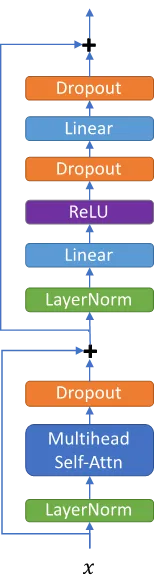
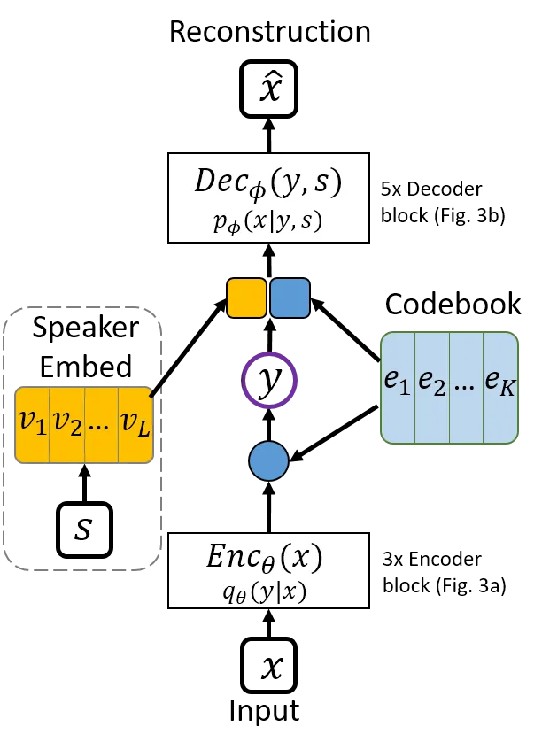
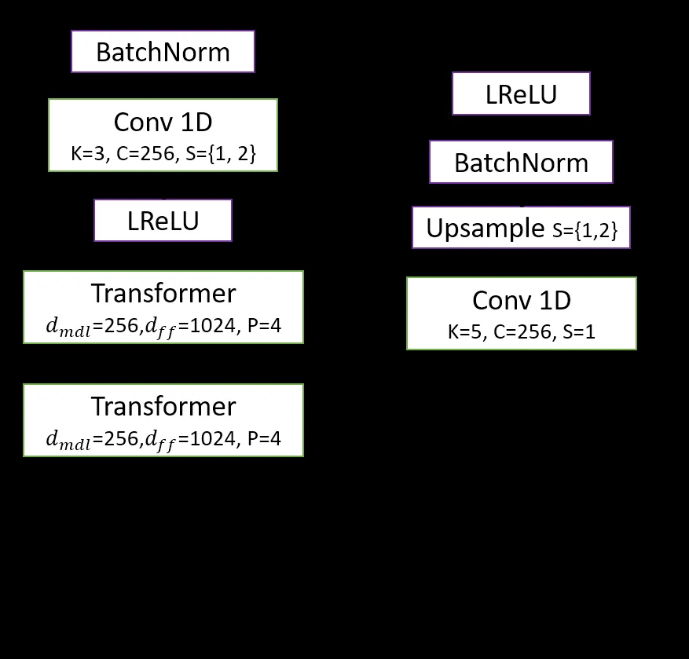
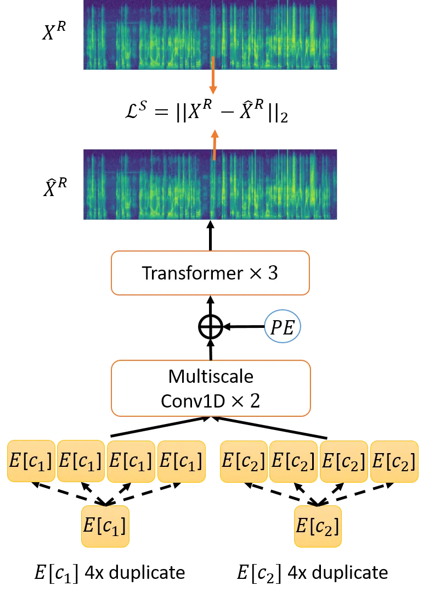

# Transformer VQ-VAE for Unsupervised Unit Discovery and Speech Synthesis: ZeroSpeech 2020 Challenge

Andros Tjandra Affiliation: Nara Institute of Science and Technology,
Japan Email: [andros.tjandra.ai6@is.naist.jp](mailto:)    Sakriani Sakti
Affiliation: Nara Institute of Science and Technology, Japan
Affiliation: RIKEN, Center for Advanced Intelligence Project AIP, Japan
Email: [ssakti@is.naist.jp](mailto:)    Satoshi Nakamura
Affiliation: Nara Institute of Science and Technology, Japan
Affiliation: RIKEN, Center for Advanced Intelligence Project AIP, Japan
Email: [s-nakamura@is.naist.jp](mailto:)

###### Abstract

In this paper, we report our submitted system for the ZeroSpeech 2020
challenge on Track 2019. The main theme in this challenge is to build a
speech synthesizer without any textual information or phonetic labels.
In order to tackle those challenges, we build a system that must address
two major components such as 1) given speech audio, extract subword
units in an unsupervised way and 2) re-synthesize the audio from novel
speakers. The system also needs to balance the codebook performance
between the ABX error rate and the bitrate compression rate. Our main
contribution here is we proposed Transformer-based VQ-VAE for
unsupervised unit discovery and Transformer-based inverter for the
speech synthesis given the extracted codebook. Additionally, we also
explored several regularization methods to improve performance even
further.

Index Terms: unsupervised unit discovery, zero-speech, clustering,
speech synthesize, deep learning

## 1 Introduction

Many speech technologies such as automatic speech recognition (ASR) and
speech synthesis (TTS) has been used widely around the world. However,
most such systems only cover rich-resource languages. For low-resource
languages, using such technologies remains limited since most of those
systems require many labeled datasets to achieve good performance.
Furthermore, some languages have more extreme limitations, including no
written form or textual interpretation for their context. In the
ZeroSpeech challenge \[1\], we addressed the latter problem by only
learning the language elements directly from untranscribed speech.

ZeroSpeech 2020 has three challenges: 2017 Track 1, 2017 Track 2, and 2019. In this paper, we focus on the ZeroSpeech 2019 Track, where the
task is called as TTS without Text. This challenge has two major
components that need to be addressed: 1) given speech audio, extract
subword-like units that contain only context information with an
unsupervised learning method and 2) re-synthesize the speech into a
different speaker’s voice.

To simultaneously solve these challenges, our strategy is to develop a
primary model that disentangles the speech signals into two major
factors: context and speaker information. After the disentanglement
process, a secondary model predicts the target speech representation
given the context extracted by the primary model. Following our success
in a previous challenge \[2\] in ZeroSpeech 2019 and several prior
publications on quantization-based approaches \[3, 4, 5\], we used a
vector quantized variational autoencoder (VQ-VAE) as the primary model
and a codebook inverter as the secondary model. To improve our result,
we introduced Transformer module \[6\] to capture the long-term
information from the sequential data inside the VQ-VAE. We also explored
several regularization methods to improve the robustness and codebook
discrimination scores. Based on our experiment, all these combined
methods significantly improved the ABX error rate.

## 2 Self-Attention and Transformer Module

The Transformer is a variant of deep learning modules that consist of
several non-linear projections and a self-attention mechanism \[6\].
Unlike recurrent neural networks (RNNs) such as a simple RNN or
long-short term memory (LSTM) \[7\] modules, a Transformer module
doesn’t have any recurrent connection between the previous and current
time-steps. However, a Transformer module utilizes self-attention
modules to model the dependency across different time-steps.

Given input sequence
$`X=[x_{1},x_{2},...,x_{S}]\in\mathbb{R}^{S\times d_{in}}`$ where $`S`$
denotes the input length and $`d_{in}`$ is the input dimension, a
Transformer module produces hidden representation
$`Z=[z_{1},z_{2},...,z_{S}]\in\mathbb{R}^{S\times d_{in}}`$. Figure 1
shows the complete process inside a Transformer module.



Figure 1: A Transformer module

Input sequence $`X`$ is normalized by a layer-norm and processed by a
multi-head self-attention module. Self-attention module inputs are
denoted as $`Q`$ (query), $`K`$ (key), and $`V`$ (value) where
$`\{Q,K,V\}\in\mathbb{R}^{S\times d_{k}}`$. To calculate the output from
a self-attention block, we apply the following formula:

```math
\displaystyle\texttt{Attention}(Q,K,V)=\texttt{softmax}\left(\frac{QK^{T}}{\sqrt{d_{k}}}\right)V. \tag{1}
```

Since a Transformer module employed multi-head self-attention instead of
single head self-attention, input $`Q,K,V`$ needed to be varied to
generate non-identical representation for each head. Therefore, for each
head $`p\in\{1..P\}`$, we projected input $`X`$ with different matrices
$`W^{Q}_{p},W^{K}_{p},W^{V}_{p}`$ and combined the output of many single
head self-attentions by concatenations and a linear projection:

```math
\displaystyle\texttt{Multi-Head}(Q,K,V)=\texttt{Concat}(h_{1},...,h_{P})W^{O} \tag{2}
```

```math
\displaystyle\forall p\in\{1..P\},h_{p}=\texttt{Attention}(QW_{p}^{Q},KW_{p}^{K},VW_{p}^{V}) \tag{3}
```

where input projection matrices
$`W^{Q}_{p}\in\mathbb{R}^{d_{mdl}\times d_{k}},W^{K}_{p}\in\mathbb{R}^{d_{mdl}\times d_{k}},W^{V}_{p}\in\mathbb{R}^{d_{mdl}\times d_{k}}`$,
output projection matrix $`W^{O}\in\mathbb{R}^{Pd_{k}\times d_{mdl}}`$
and dimension of $`d_{k}=\frac{d_{mdl}}{P}`$. After we got the output
from the self-attention, we applied layer normalization \[8\], two
linear projections, and a rectified linear unit (ReLU) activation
function.

## 3 Unsupervised Subword Discovery

Normally, a speech utterance can be factored into several bits of latent
information, including context, speaker’s speaking style, background
noise, emotions, etc. Here, we assume that the speech only contains two
factors: context and the speaker’s speaking style. In this case, the
context denotes the unit that captures the speech information itself in
the discretized form, which resembles phonemes or subwords. Therefore,
to capture the context without any supervision, we used a generative
model called a vector quantized variational autoencoder (VQ-VAE) \[9\]
to extract the discrete symbols. There are some differences between a
VQ-VAE with a normal autoencoder \[10\] and a normal variational
autoencoder (VAE) \[11\] itself. The VQ-VAE encoder maps the input
features into a finite set of discrete latent variables, and the
standard autoencoder or VAE encoder maps input features into continuous
latent variables. Therefore, a VQ-VAE encoder has stricter constraints
due to the limited number of codebooks, which enforces the latent
variable compression explicitly via quantization. On the other hand,
standard VAE encoder has a one-to-one mapping between the input and
latent variables. Due to the nature of the unsupervised subword
discovery task, a VQ-VAE is more suitable for the subword discovery task
compared to a normal autoencoder or VAE.



Figure 2: VQ-VAE for unsupervised unit discovery consists of several
parts: encoder $`\text{Enc}^{VQ}_{\theta}(x)=q_{\theta}(y|x)`$, decoder
$`\text{Dec}^{VQ}_{\phi}(y,s)=p_{\phi}(x|y,s)`$, codebooks
$`\mathbf{E}=[e_{1},..,e_{K}]`$, and speaker embedding
$`\mathbf{V}=[v_{1},..,v_{L}]`$.



Figure 3: Building block inside VQ-VAE encoder and decoder: a) Encoder
consisted of 2x Transformer layer and 1D convolution with stride to
downsample input sequence length; b) Decoder consisted of 1D
convolution, followed by up-sampling to recover original input sequence
shape.

We shows the VQ-VAE model in Fig. 2. Here, we define
$`\mathbf{E}=[e_{1},..,e_{K}]\in\mathbb{R}^{K\times D_{e}}`$ as a
collection of codebook vectors and
$`\mathbf{V}=[v_{1},..,v_{L}]\in\mathbb{R}^{L\times D_{v}}`$ as a
collection of speaker embedding vectors. At the encoding step, input
$`x`$ denotes such speech features as MFCC (Mel-frequency cepstral
coefficients) or Mel-spectrogram and auxiliary input $`s\in\{1,..,L\}`$
denotes the speaker ID from speech feature $`x`$. In Fig. 3, we show the
details for the building block inside the encoder and decoder modules.
Encoder $`q_{\theta}(y|x)`$ outputs a discrete latent variable
$`y\in\{1,..K\}`$. To transform an input in continuous variable into a
discrete variable, the encoder first produces intermediate continuous
representation $`{z}\in\mathbb{R}^{D_{e}}`$. Later on, we scan through
all codebooks to find which codebook has a minimum distance between
$`{z}`$ and a vector in $`\mathbf{E}`$. We define this process by the
following equations:

```math
\displaystyle q_{\theta}(y=c|x) \displaystyle=\begin{cases}1\quad\text{if }\,c=\argmin_{i}\text{Dist}({z},e_{i})\\
0\quad\text{else }\end{cases} \tag{4}
```

```math
\displaystyle e_{c} \displaystyle=\mathbb{E}_{q_{\theta}(y|x)}[\mathbf{E}] \tag{5}
```

```math
\displaystyle=\sum_{i=1}^{K}q_{\theta}(y=i|x)\,e_{i}. \tag{6}
```

where
$`\text{Dist}(\cdot,\cdot):\mathbb{R}^{D_{e}}\times\mathbb{R}^{D_{e}}\rightarrow\mathbb{R}`$
is a function that calculates the distance between two vectors. In this
paper, we define $`\text{Dist}(a,b)=\|a-b\|_{2}`$ as the L2-norm
distance.

After the closest codebook index $`c\in\{1,..,K\}`$ is found, we
substitute latent variable $`{z}`$ with nearest codebook vector
$`e_{c}`$. Later, decoder $`p_{\phi}(x|y,s)`$ uses codebook vector
$`e_{c}`$ and speaker embedding $`v_{s}`$ to reconstruct input feature
$`\hat{x}`$.

### 3.1 VQ-VAE objective

Given input reconstruction across all time-step $`\forall t\in[1..T]`$,
$`\hat{X}=[\hat{x}_{1},..,\hat{x}_{T}]`$ and closest codebook index
$`[c_{1},..,c_{T}]`$, we calculate the VQ-VAE objective:

```math
\displaystyle\mathcal{L}_{VQ}=\sum_{t=1}^{T}-\log p_{\phi}(x_{t}|y_{t},s)+\gamma\|{z_{t}}-\text{sg}(e_{c_{t}})\|_{2}^{2},, \tag{7}
```

where function $`\text{sg}(\cdot)`$ stops the gradient:

```math
\displaystyle x=sg(x);\quad\quad\frac{\partial\,\text{sg}(x)}{\partial\,x}=0. \tag{8}
```

The first term is a negative log-likelihood to measure the
reconstruction loss between original input $`x_{t}`$ and reconstruction
$`\hat{x}_{t}`$ to optimize encoder parameters $`\theta`$ and decoder
parameters $`\phi`$. The second term minimizes the distance between
intermediate representation $`{z_{t}}`$ and nearest codebook
$`e_{c_{t}}`$, but the gradient is only back-propagated into encoder
parameters $`\theta`$ as commitment loss. The impact from commitment
loss controlled with a hyper-parameter $`\gamma`$ (we use
$`\gamma=0.25`$). To update the codebook vectors, we use an exponential
moving average (EMA) \[12\]. EMA updates the codebook $`\mathbf{E}`$
independently regardless of the optimizer’s type and update rules,
therefore the model is more robust against different optimizer’s choice
and hyper-parameters (e.g., learning rate, momentum) and also avoids
posterior collapse problem \[13\].

### 3.2 Model regularization

#### 3.2.1 Temporal smoothing

Since our input datasets are sequential data, we introduced temporal
smoothing between the encoded hidden vectors between two consecutive
time-steps:

```math
\displaystyle\mathcal{L}_{reg}=\sum_{i=1}^{T-1}\|z_{t}-z_{t+1}\|_{2}^{2}. \tag{9}
```

The final loss is defined:

```math
\displaystyle\mathcal{L}=\mathcal{L}_{VQ}+\lambda\mathcal{L}_{reg}, \tag{10}
```

where $`\lambda`$ denotes the coefficient for the regularization term.

#### 3.2.2 Temporal jitter

Temporal jitter regularization \[3\] is used to prevent the latent
vector co-adaptation and to reduce the model sensitivity near the unit
boundary. In the practice, we could apply the temporal jitter by:

```math
\displaystyle j_{t} \displaystyle\sim Categorical(p,p,1-2*p)\in\{1,2,3\} \tag{11}
```

```math
\displaystyle\hat{c_{t}} \displaystyle=\begin{cases}{c_{t-1}},&\text{if }j_{t}=1\text{ and }t>1\\
{c_{t+1}},&\text{if }j_{t}=2\text{ and }t<T\\
{c_{t}},&\text{else }\end{cases} \tag{12}
```

```math
\displaystyle e_{t} \displaystyle=\mathbf{E}[{\hat{c_{t}}]} \tag{13}
```

where $`p`$ is the jitter probability, $`c_{t}`$ is the closest codebook
index at time-$`t`$ and $`\hat{c_{t}}`$ is the new assigned codebook
index after the jitter operation.

## 4 Codebook Inverter

A codebook inverter model is used to generate the speech representation
given the predicted codebook from our Transformer VQ-VAE. The input is
$`[\mathbf{E}[c_{1}],..,\mathbf{E}[c_{T}]]`$, and the output is the
following speech representation sequence (here we use linear magnitude
spectrogram):
$`\mathbf{X}^{R}=[\mathbf{X}^{R}_{1},..,\mathbf{X}^{R}_{S}]`$.

In Fig. 4, we show our codebook inverter architecture that consists of
two multiscale 1D convolutions and three Transformer layers with
additional sinusoidal position encoding to help the model distinguish
the duplicated codebook positions.



Figure 4: Codebook inverter: given codebook sequence
$`[\mathbf{E}[y_{1}],..,\mathbf{E}[y_{T}]]`$, we predict corresponding
linear magnitude spectrogram
$`\hat{\mathbf{X}}^{R}=[x^{R}_{1},..x^{R}_{S}]`$. If lengths between
$`S`$ and $`T`$ are different, we consecutively duplicate each codebook
by $`r`$-times.

Depends on the VQ-VAE encoder architecture, the predicted codebook
sequence length $`T`$ could be shorter than $`S`$ because the VQ-VAE
encoder $`q_{\theta}(y|x)`$ have several convolutional layers with
stride larger than one. Therefore, to re-align the codebook sequence
representation with the speech representation, we duplicate each
codebook occurrences $`\forall t\in\{1..T\}\,\mathbf{E}[{c_{t}}]`$ into
$`r`$ copies side-by-side where $`r=S/T`$. To train a codebook inverter,
we set the objective function:

```math
\displaystyle{\cal L}_{INV}=\|\mathbf{X}^{R}-\hat{\mathbf{X}}^{R}\|_{2} \tag{14}
```

to minimize the L2-norm between predicted spectrogram
$`\hat{\mathbf{X}}^{R}=\text{Inv}_{\rho}([\mathbf{E}[c_{1}],...,\mathbf{E}[c_{T}]])`$
and groundtruth spectrogram $`\mathbf{X}^{R}`$. We defined
$`\text{Inv}_{\rho}`$ as the inverter parameterized by $`\rho`$. During
the inference step, Griffin-Lim \[14\] is used to reconstruct the phase
from the spectrogram and applied an inverse short-term Fourier transform
(STFT) to invert it into a speech waveform.

## 5 Experiment

In this section, we describe our pipeline, including feature
preprocessing, model settings, and hyperparameters.

### 5.1 Experimental Set-up

There are two datasets for two languages, English data for the
development dataset, and a surprising Austronesian language for the test
dataset. Each language dataset contains subset datasets: (1) a voice
dataset for speech synthesis, (2) a unit discovery dataset, (3) an
optional parallel dataset from the target voice to another speaker’s
voice, and (4) a test dataset. The source corpora for the surprise
language are described here \[15, 16\], and further details can be found
\[17\]. We only used (1) and (2) for training the VQ-VAE codebook and
inverter and (4) for evaluation.

For the speech input, we experimented with two different feature
representations, such as Mel-spectrogram (with 80 dimensions, 25-ms
window size, 10-ms time-steps) and MFCC (with 39 dimensions, 13 main
$`+\Delta+\Delta^{2}`$, 25-ms window size, 10-ms time-steps). Both MFCC
and Mel-spectrogram are generated by the Librosa package \[18\]. All
models are implemented with PyTorch library \[19\]. We use Adam \[11\]
optimizer with learning rate $`1e-4`$ for training both models.

### 5.2 Experimental Results

In this subsection, we report our experiment based on different
scenarios and hyperparameters with the English dataset. First, we use
different features as the input for VQ-VAE in Table 1. We compared the
effect of using log Mel-spectrogram with 80 dimensions versus
MFCC$`+\Delta+\Delta^{2}`$ with 39 dimensions.

| Model                 | ABX   | Bitrate |
| --------------------- | ----- | ------- |
| TrfVQVAE with log-Mel | 33.79 | 171.05  |
| TrfVQVAE with MFCC    | 21.91 | 170.42  |

Table 1: ABX and Bitrate result between MFCC and log Melspectrogram
features on Transformer VQ-VAE (TrfVQVAE with $`K=128`$, stride
$`4\times`$)

Based on the result on Table 1, we determined that MFCC provides much
better results in terms of ABX error rate. From this point, we use MFCC
as the VQ-VAE input features. In Table 2, we compared our proposed model
with our submission from previous challenge \[2\] and we also explored
different codebook sizes to determine the trade-off between the ABX
error rate and bitrate.

| Model                                        | ABX   | Bitrate |
| -------------------------------------------- | ----- | ------- |
| Conv VQVAE (stride $`4\times`$, K=256) \[2\] | 24.17 | 184.32  |
| TrfVQVAE (stride $`4\times`$, K=64)          | 22.72 | 141.82  |
| TrfVQVAE (stride $`4\times`$, K=128)         | 21.91 | 170.42  |
| TrfVQVAE (stride $`4\times`$, K=256)         | 21.94 | 194.69  |
| TrfVQVAE (stride $`4\times`$, K=512)         | 21.6  | 217.47  |

Table 2: ABX and Bitrate result between our last year submission and new
proposed Transformer VQ-VAE.

Based on the result on Table 2, by using Transformer VQ-VAE, we
outperformed our previous best submission by -2.2 ABX error rate and
with a similar bitrate. Later on, by using small codebook sizes
$`K=64`$, we reduce the bitrate by -30 points compared to $`K=128`$, but
we sacrifice the +0.8 ABX error rate. We explored different
regularization methods to improve transformer VQ-VAE’s performance in
Table 3. In Table 3, we show the result from Transformer VQ-VAE (stride
$`4\times`$, K=128) with different $`\lambda`$ smoothing coefficient,
different jitter probability and the combination between both
regularization methods. We found out that by combining both temporal
smoothing and jittering, we get -1.77 ABX error rate improvement.

[TABLE]

Table 3: ABX and Bitrate result between different temporal smoothing
coefficient $`\lambda`$, jitter probability $`p`$, and their combination
for Transformer VQ-VAE regularization. (Notes: $`\bigstar`$ denotes our
submitted system. After the submission, we continue the experiment and
we found out another hyperparameters combination brings even lower ABX
than our submitted system.)

## 6 Conclusions

We described our approach for the ZeroSpeech 2020 challenge on Track 2019. For the unsupervised unit discovery task, we proposed a new
architecture: Transformer VQ-VAE to capture the context of the speech
into a sequence of discrete latent variables. Additionally, we also use
the Transformer block inside our codebook inverter architecture.
Compared to our last year’s submission, replacing convolutional layers
with Transformer gives a significant improvement up to -2.2 ABX error
rate. To improve the result further, we investigated several
regularization methods. In the end, combining both temporal smoothing
and jittering improved the Transformer VQ-VAE performance up to -1.77
ABX error rate compared to the un-regularized model.

## 7 Acknowledgements

Part of this work was supported by JSPS KAKENHI Grant Numbers JP17H06101
and JP17K00237.

## References

- \[1\] E. Dunbar, R. Algayres, J. Karadayi, M. Bernard, J. Benjumea,
  X.-N. Cao, L. Miskic, C. Dugrain, L. Ondel, A. W. Black, L. Besacier,
  S. Sakti, and E. Dupoux, “The Zero Resource Speech Challenge 2019: TTS
  without T,” in _Interspeech 2019 - 20th Annual Conference of the
  International Speech Communication Association_, Graz, Austria,
  Sep. 2019. \[Online\]. Available:
  [https://hal.archives-ouvertes.fr/hal-02274112](https://hal.archives-ouvertes.fr/hal-02274112)
- \[2\] A. Tjandra, B. Sisman, M. Zhang, S. Sakti, H. Li, and
  S. Nakamura, “VQVAE Unsupervised Unit Discovery and Multi-Scale
  Code2Spec Inverter for Zerospeech Challenge 2019,” in _Proc.
  Interspeech 2019_, 2019, pp. 1118–1122. \[Online\]. Available:
  [http://dx.doi.org/10.21437/Interspeech.2019-3232](http://dx.doi.org/10.21437/Interspeech.2019-3232)
- \[3\] J. Chorowski, R. J. Weiss, S. Bengio, and A. v. d. Oord,
  “Unsupervised speech representation learning using Wavenet
  autoencoders,” _arXiv preprint arXiv:1901.08810_, 2019.
- \[4\] A. Baevski, S. Schneider, and M. Auli, “vq-wav2vec:
  Self-supervised learning of discrete speech representations,” _arXiv
  preprint arXiv:1910.05453_, 2019.
- \[5\] R. Eloff, A. Nortje, B. van Niekerk, A. Govender, L. Nortje,
  A. Pretorius, E. Van Biljon, E. van der Westhuizen, L. van Staden, and
  H. Kamper, “Unsupervised acoustic unit discovery for speech synthesis
  using discrete latent-variable neural networks,” _arXiv preprint
  arXiv:1904.07556_, 2019.
- \[6\] A. Vaswani, N. Shazeer, N. Parmar, J. Uszkoreit, L. Jones, A. N.
  Gomez, L. Kaiser, and I. Polosukhin, “Attention is all you need,” in
  _Advances in Neural Information Processing Systems_, 2017, pp.
  5998–6008.
- \[7\] S. Hochreiter and J. Schmidhuber, “Long short-term memory,”
  _Neural computation_, vol. 9, no. 8, pp. 1735–1780, 1997.
- \[8\] J. L. Ba, J. R. Kiros, and G. E. Hinton, “Layer normalization,”
  _arXiv preprint arXiv:1607.06450_, 2016.
- \[9\] A. van den Oord, O. Vinyals _et al._, “Neural discrete
  representation learning,” in _Advances in Neural Information
  Processing Systems_, 2017, pp. 6306–6315.
- \[10\] P. Vincent, H. Larochelle, Y. Bengio, and P.-A. Manzagol,
  “Extracting and composing robust features with denoising
  autoencoders,” in _Proceedings of the 25th international conference on
  Machine learning_. ACM, 2008, pp. 1096–1103.
- \[11\] D. P. Kingma and J. Ba, “Adam: A method for stochastic
  optimization,” _arXiv preprint arXiv:1412.6980_, 2014.
- \[12\] L. Kaiser, S. Bengio, A. Roy, A. Vaswani, N. Parmar,
  J. Uszkoreit, and N. Shazeer, “Fast decoding in sequence models using
  discrete latent variables,” in _International Conference on Machine
  Learning_, 2018, pp. 2395–2404.
- \[13\] A. Roy, A. Vaswani, N. Parmar, and A. Neelakantan, “Towards a
  better understanding of vector quantized autoencoders,”
  _OpenReview_, 2018.
- \[14\] D. Griffin and J. Lim, “Signal estimation from modified
  short-time Fourier transform,” _IEEE Transactions on Acoustics,
  Speech, and Signal Processing_, vol. 32, no. 2, pp. 236–243, 1984.
- \[15\] S. Sakti, R. Maia, S. Sakai, T. Shimizu, and S. Nakamura,
  “Development of HMM-based Indonesian speech synthesis,” _Proc.
  Oriental COCOSDA_, 01 2008.
- \[16\] S. Sakti, E. Kelana, H. Riza, S. Sakai, K. Markov, and
  S. Nakamura, “Development of Indonesian large vocabulary continuous
  speech recognition system within A-STAR project,” in _Proceedings of
  the Workshop on Technologies and Corpora for Asia-Pacific Speech
  Translation (TCAST)_, 2008. \[Online\]. Available:
  [https://www.aclweb.org/anthology/I08-8004](https://www.aclweb.org/anthology/I08-8004)
- \[17\] J. K. M. B. J. B.
  X.-N. C. L. M. C. D. L. O. A. W. B. L. B. S. S. E. D. E. Dunbar,
  R. Algayres, “The zero resource speech challenge 2019: TTS without T,”
  in _Twentieth Annual Conference of the International Speech
  Communication Association (INTERSPEECH 2019)_, 2019, p. to be appear.
- \[18\] B. McFee, C. Raffel, D. Liang, D. P. Ellis, M. McVicar,
  E. Battenberg, and O. Nieto, “librosa: Audio and music signal analysis
  in Python,” 2015.
- \[19\] A. Paszke, S. Gross, F. Massa, A. Lerer, J. Bradbury,
  G. Chanan, T. Killeen, Z. Lin, N. Gimelshein, L. Antiga, A. Desmaison,
  A. Kopf, E. Yang, Z. DeVito, M. Raison, A. Tejani, S. Chilamkurthy,
  B. Steiner, L. Fang, J. Bai, and S. Chintala, “Pytorch: An imperative
  style, high-performance deep learning library,” in _Advances in Neural
  Information Processing Systems 32_, H. Wallach, H. Larochelle,
  A. Beygelzimer, F. d Alché-Buc, E. Fox, and R. Garnett, Eds. Curran
  Associates, Inc., 2019, pp. 8024–8035.
