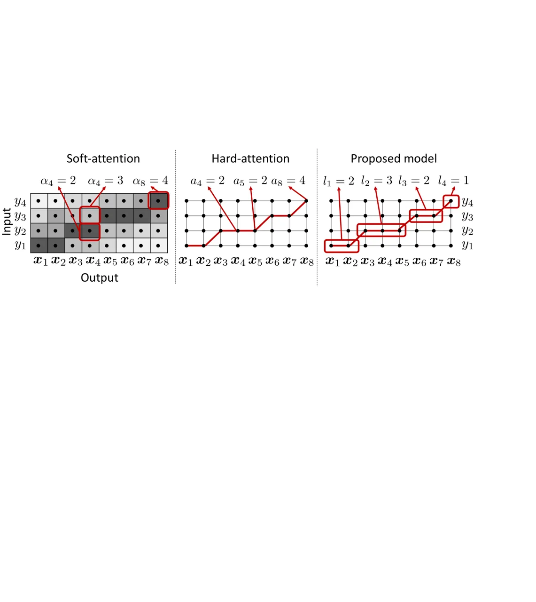
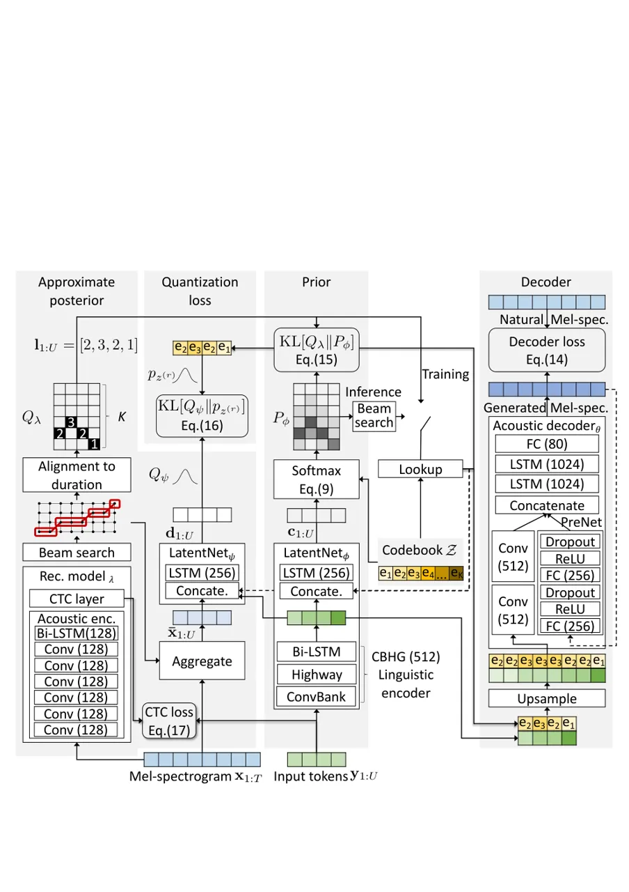

# End-to-End Text-to-Speech using Latent Duration based on VQ-VAE

Yusuke Yasuda^(†⋆)    Xin Wang^(†)    Junichi Yamagishi^(†⋆)
^(†)^(†)thanks: This work was partially supported by a JST CREST Grant
(JPMJCR18A6, VoicePersonae project), Japan, MEXT KAKENHI Grants
(16H06302, 18H04120, 18H04112, 18KT0051, 19K24371), Japan. The numerical
calculations were carried out on the TSUBAME 3.0 supercomputer at the
Tokyo Institute of Technology.

###### Abstract

Explicit duration modeling is a key to achieving robust and efficient
alignment in text-to-speech synthesis (TTS). We propose a new TTS
framework using explicit duration modeling that incorporates duration as
a discrete latent variable to TTS and enables joint optimization of
whole modules from scratch. We formulate our method based on conditional
VQ-VAE to handle discrete duration in a variational autoencoder and
provide a theoretical explanation to justify our method. In our
framework, a connectionist temporal classification (CTC) -based force
aligner acts as the approximate posterior, and text-to-duration works as
the prior in the variational autoencoder. We evaluated our proposed
method with a listening test and compared it with other TTS methods
based on soft-attention or explicit duration modeling. The results
showed that our systems rated between soft-attention-based methods
(Transformer-TTS, Tacotron2) and explicit duration modeling-based
methods (Fastspeech).

###### Index Terms: 

text-to-speech, duration modeling, variational auto-encoder, vector
quantization

^(†)^(†)address: ^(†)National Institute of Informatics, Japan ^(⋆)The
Graduate University for Advanced Sciences, Japan

## 1 Introduction

Sequence-to-sequence text-to-speech (TTS) typically consists of a text
encoder to encode an input character or phoneme sequence, an acoustic
decoder to generate an acoustic feature sequence, and a neural vocoder
to convert the acoustic features into output waveforms. Another
indispensable part is the learning of alignment between input and output
sequences. Most of the recent models \[1, 2, 3, 4, 5\] use
soft-attention \[6, 7\] and learn the “probabilities” for each output
step of being aligned with input steps. There is also a TTS model using
hard-attention \[8\] and one that learns the latent alignment with a
forward-backward algorithm \[9\].

Being either deterministic or latent, both soft- and hard-attention
techniques parameterize the alignment on the basis of an atomic
probability $`P(\alpha_{n}=m)`$ that indicates the likelihood of the
$`n`$-th output step being aligned with the $`m`$-th input step. Such a
probability, however, does not directly tell how many output steps are
likely to be emitted from the $`m`$-th input token. For TTS tasks,
knowing the probability $`P(l_{m}=k)`$ of generating $`k\in\mathbb{N}`$
output steps from the $`m`$-th input token is more useful from the
perspective of speech production process. It also allows direct control
of the duration $`l`$, avoids the engineering trick in soft-attention to
predict “when to stop”, and guarantees monotonic alignment between input
and output.

In this paper, we propose a new neural TTS system with such a latent
duration model. In contrast to soft- or hard-attention-based systems,
our proposed latent duration model directly parameterizes
$`P(l_{m}=k)`$, as shown in Fig. 1. Moreover, in contrast to recent
neural TTS systems that also replace attention with duration models
\[10, 11, 12, 13, 14\], our latent duration model is jointly trained
with other components in the TTS systems. This is achieved using a deep
variational Bayesian approach \[15\]. Since the duration in TTS systems
is discrete, our proposed model is similar to the vector quantized
auto-encoder (VQ-VAE) \[16\], but rather than simply following the
heuristic VQ-VAE training criteria, we define our VQ-VAE framework on
the basis of variational inference theory. Experiments on an English
speech database showed promising results when comparing our proposed
model with Tactron \[4\], Transformer \[5\], and Fast Speech TTS systems
\[10\].

After introducing related methods in Section 2, we describe the proposed
TTS system in Section 3. Experiments are explained in Section 4. We
conclude with a brief summary in Section 5.

## 2 Related works

### 2.1 Duration modeling in TTS

Explicit duration modeling was recently incorporated into neural TTS
systems as an alternative to soft- and hard-attention for more robust
alignment modeling. For example, FastSpeech \[10\] trains a duration
predictor with alignment obtained from a soft-attention-based teacher
model, AlignTTS \[11\] extracts duration using an aligner based on hard
and monotonic alignment, and DurIAN \[13\] and FastSpeech2 \[14\] use
external force aligners to extract the duration.

All four systems above use independent duration and aligner models, and
as such they require multiple training phases to construct a whole TTS
system. In contrast, recent models such as JDI-T \[13\] and Glow-TTS
\[17\] can train the TTS and duration model jointly. Glow-TTS \[17\]
treats duration as a latent variable, although it is not formulated as a
VAE. Note that all methods above treat duration as a continuous value,
even though duration in those TTS systems corresponds to the number of
frames, which is intrinsically discrete.

Our proposed method differs from the previous works in three key
aspects: 1) duration is modeled as a discrete variable, 2) duration is
treated as a latent variable using the VQ-VAE framework, and 3) all
components in our model are jointly trainable from scratch. Note that
duration has also been treated as a latent variable in the classical
hidden semi-Markov based parametric speech synthesis \[18\].

### 2.2 Vector quantized autoencoder for speech tasks

VQ-VAE \[16\] has been applied to various speech synthesis tasks,
including diverse and controllable TTS \[19, 20\], a new TTS framework
based on symbol-to-symbol translation \[21\], speech coding \[22\],
voice conversion \[23\], and representation learning \[24, 25, 26, 27\].

Among the related methods, Sun et al. applied conditional VQ-VAE to TTS,
although their objective was diverse TTS for data augmentation rather
than duration modeling \[20\]. Their method relies on soft-attention to
align speech and phoneme. The new TTS framework using VQ-VAE \[21\]
treats TTS as sequence transduction by encoding target speech into a
sequence of discrete phoneme-like symbols. As a result, mapping from
text to speech symbols can be tackled using machine translation methods.
However, they still require soft-attention to align text and speech
symbols.

Our system uses VQ-VAE to model the latent discrete duration, which has
never been explored before. Furthermore, we derive the training criteria
on the basis of variational inference.

## 3 Proposed TTS system

In this section, we explain the proposed TTS system as a probabilistic
model and then describe its implementation.

### 3.1 Model definition and variational lower bound

Let us write the input sequence of discrete tokens as
$`\mathbf{y}_{1:U}=(y_{1},\cdots y_{U})`$, where $`y_{u}`$ is the
$`u`$-th token (e.g., letter or phone). We then use
$`\mathbf{x}_{1:T}=(\mathbf{x}_{1},\cdots,\mathbf{x}_{T})`$ to denote an
output sequence of acoustic features, where
$`\mathbf{x}_{t}\in\mathbb{R}^{O}`$ is for the $`t`$-th output time step
or _frame_. Our goal is to learn a good model
$`p(\mathbf{x}_{1:T}\mid\mathbf{y}_{1:U})`$.

We use $`\mathbf{l}_{1:U}=(l_{1},\cdots,l_{U})`$ to denote the latent
duration for $`\mathbf{y}_{1:U}`$, where the value of $`l_{u}`$ is equal
to the duration of the $`u`$-th input token. For example, in Fig. 1,
$`l_{2}=3`$ indicates that the second input token $`y_{2}`$ is aligned
with three output frames
$`(\mathbf{x}_{3},\mathbf{x}_{4},\mathbf{x}_{5})`$. For an output
sequence with a total duration of $`T`$, we constrain
$`T=\sum_{u}l_{u}`$. We further constrain $`1\leq l_{u}\leq K`$, where
$`K`$ is a hyper-parameter that decides the maximum value of duration.

Since $`l_{u}`$ is discrete for TTS systems, we can parameterize
$`p(\mathbf{x}_{1:T}\mid\mathbf{y}_{1:U})`$ with VQ-VAE. Let
$`\mathcal{Z}=\{\mathbf{e}_{1},\cdots,\mathbf{e}_{K}\}`$ be a codebook
with $`K`$ code words, where $`\mathbf{e}_{k}\in\mathbb{R}^{D}`$. We
then introduce a quantized latent vector $`z^{(q)}_{u}\in{\mathcal{Z}}`$
and an un-quantized latent vector $`z^{(r)}_{u}\in\mathbb{R}^{D}`$ for
the $`u`$-th input token. Because $`z^{(q)}_{u}\in{\mathcal{Z}}`$, we
can link $`z^{(q)}_{u}`$ with $`l_{u}`$ by setting
$`z^{(q)}_{u}=\mathbf{e}_{l_{u}},\forall{u}\in\{1,\cdots,U\}`$, which
avoids modeling $`z^{(q)}_{u}`$ and $`l_{u}`$ independently. We
additionally introduce $`z^{(r)}_{u}`$ because it allows us to derive
the VQ-VAE training criteria in a theoretically sound manner \[19\].

Model training through direct optimization of
$`p(\mathbf{x}_{1:T}|\mathbf{y}_{1:U})`$ is daunting, but the above
definition allows us to find a tractable variational lower bound
(ELBO)¹¹ 1 Details can be found in the appendix on \[28\].:

```math
\displaystyle\log p(\mathbf{x}_{1:T}\mid\mathbf{y}_{1:U})
```

```math
\displaystyle= \displaystyle\log\sum_{\forall\mathbf{z}^{(q)}_{1:U}}\int_{\mathbf{{z}}^{(r)}_{1:U}}p(\mathbf{x}_{1:T},\mathbf{z}^{(q)}_{1:U},\mathbf{{z}}^{(r)}_{1:U}\mid\mathbf{y}_{1:U})d\mathbf{{z}}^{(r)}_{1:U} \tag{1}
```

```math
\displaystyle\geq \displaystyle\mathbb{E}_{Q_{\lambda}(\mathbf{z}^{(q)}_{1:U})}[\underbrace{\log p_{\theta}(\mathbf{x}_{1:T}\mid\mathbf{z}^{(q)}_{1:U},\mathbf{y}_{1:U})}_{\text{Decoder}}] \tag{2}
```

```math
\displaystyle-\mathrm{KL}[{Q_{\lambda}(\mathbf{z}^{(q)}_{1:U}})\|\underbrace{P_{\phi}(\mathbf{z}^{(q)}_{1:U}\mid\mathbf{y}_{1:U})}_{\text{Prior}}] \tag{3}
```

```math
\displaystyle-\mathbb{E}_{Q_{\lambda}(\mathbf{z}^{(q)}_{1:U})}\Big\{\mathrm{KL}[{Q_{\psi}(\mathbf{{z}}^{(r)}_{1:U}\mid\mathbf{z}^{(q)}_{1:U})}\|\underbrace{p(\mathbf{{z}}^{(r)}_{1:U}\mid\mathbf{z}^{(q)}_{1:U})}_{\text{Vector quantization}}]\Big\}. \tag{4}
```

To avoid notation clutter, we hide the condition
$`\mathbf{x}_{1:T},\mathbf{y}_{1:U}`$ in approximate posteriors
$`Q_{\psi}(\mathbf{z}^{(r)}_{1:U}\mid\mathbf{z}^{(q)}_{1:U},\mathbf{y}_{1:U},\mathbf{x}_{1:T})`$
and
$`Q_{\lambda}(\mathbf{z}^{(q)}_{1:U}\mid\mathbf{y}_{1:U},\mathbf{x}_{1:T})`$.
$`\mathbf{x}_{1:T}`$ in the decoder is assumed to be independent of
$`\mathbf{z}^{(r)}_{1:U}`$ given $`\mathbf{z}^{(q)}_{1:U}`$ and
$`\mathbf{y}_{1:U}`$. Furthermore, $`\mathbf{z}^{(r)}_{1:U}`$ is assumed
to depend only on $`\mathbf{z}^{(q)}_{1:U}`$. KL denotes the
Kullback–Leibler divergence.



Figure 1: Illustration of alignment in soft-attention (left),
hard-attention (middle), and proposed models (right). In soft- and
hard-attention, alignments $`\alpha_{n}=m`$ and $`a_{n}=m`$ denote that
output $`\mathbf{y}_{n}`$ is aligned with input $`x_{m}`$. In the
proposed model, $`z_{m}=l`$ indicates that $`x_{m}`$ emits
$`l\in\mathbb{N}`$ consecutive output steps.

### 3.2 Model parameterization

Each term in the ELBO of Eq. (2–4) can be parameterized using neural
networks and calculated in a closed form.

#### 3.2.1 Approximate posteriors

We first define the approximate posterior for $`\mathbf{z}^{(q)}_{1:U}`$
as

```math
\displaystyle Q_{\lambda}(\mathbf{z}^{(q)}_{1:U}\mid\mathbf{y}_{1:U},\mathbf{x}_{1:T})
```

```math
\displaystyle= \displaystyle\prod_{u=1}^{U}P(\mathbf{z}^{(q)}_{u}\mid\mathbf{y}_{1:U},\mathbf{x}_{1:T})=\prod_{u=1}^{U}\mathcal{I}(\mathbf{z}^{(q)}_{u}=\mathbf{e}_{l_{u}}), \tag{5}
```

where $`\mathcal{I}(\cdot)`$ is an indicator function and $`l_{u}`$ is
the code word index (and duration) for the $`u`$-th input token. We then
define

```math
\displaystyle Q_{\psi}(\mathbf{z}^{(r)}_{1:U}\mid\mathbf{z}^{(q)}_{1:U},\mathbf{y}_{1:U},\mathbf{x}_{1:T})
```

```math
\displaystyle= \displaystyle\prod_{u=1}^{U}p(\mathbf{z}^{(r)}_{u}\mid\mathbf{z}^{(q)}_{u-1},\mathbf{y}_{1:U},\mathbf{x}_{1:T})=\prod_{u=1}^{U}\mathcal{N}(\mathbf{z}^{(r)}_{u};\mathbf{d}_{u},\sigma^{2}\mathbf{I}), \tag{6}
```

where $`\mathcal{N}`$ is a multivariate Gaussian, $`\sigma^{2}`$ is a
hyper-parameter, and $`\mathbf{d}_{u}`$ is computed by a neural network
as
$`\mathbf{d}_{u}=\mathrm{LatentNet}_{\psi}(\mathbf{z}^{(q)}_{u-1},\mathbf{\bar{x}}_{u},y_{u})`$.

Since $`\mathbf{x}_{1:T}`$ has $`T`$ frames while $`\mathbf{y}_{1:U}`$
has $`U`$ tokens, we aggregate $`\mathbf{x}_{1:T}`$ as
$`\mathbf{\bar{x}}_{1:U}=(\mathbf{\bar{x}}_{1},\cdots,\mathbf{\bar{x}}_{U})`$
before feeding it to $`\mathrm{LatentNet}_{\psi}(\cdot)`$. The
aggregation is conducted by averaging $`\mathbf{x}_{t}`$ that correspond
to the $`u`$-th token, given the value of $`\mathbf{l}_{1:u}`$. For
example, in Fig. 1, we get
$`\mathbf{\bar{x}}_{1}=\frac{\mathbf{x}_{1}+\mathbf{x}_{2}}{2}`$ and
$`\mathbf{\bar{x}}_{2}=\frac{\mathbf{x}_{3}+\mathbf{x}_{4}+\mathbf{x}_{5}}{3}`$
given $`l_{1}=2`$ and $`l_{2}=3`$.

We let $`Q_{\lambda}`$ be an indicator function, following the idea of
VQ-VAE. The value of $`l_{u}`$ during training is produced by another
surrogate model (explained in Section 3.3). A Gaussian posterior
$`Q_{\psi}`$ is inspired by the original VAE \[15\]. It is used to
compute the KL divergence in Eq. (4), which is explained in
Section 3.2.4.

#### 3.2.2 Decoder

Similar to other models, our model uses an auto-regressive decoder.
Given $`\mathbf{y}_{1:U}`$, $`\mathbf{l}_{1:U}=(l_{1},\cdots,l_{U})`$,
and
$`\mathbf{z}^{(q)}_{1:U}=(\mathbf{z}^{(q)}_{1}=\mathbf{e}_{l_{1}},\cdots,\mathbf{z}^{(q)}_{U}=\mathbf{e}_{l_{U}})`$,
the PDF of $`\mathbf{x}_{1:T}`$ is defined as

```math
\displaystyle p_{\theta}(\mathbf{x}_{1:T}\mid\mathbf{z}^{(q)}_{1:U},\mathbf{y}_{1:U})
```

```math
\displaystyle= \displaystyle\prod_{t=1}^{T}p(\mathbf{x}_{t}\mid\mathbf{x}_{t-1},\mathbf{\widehat{z}}^{(q)}_{t},\widehat{y}_{t})=\prod_{t=1}^{T}\mathcal{N}(\mathbf{x}_{t};\mathbf{\mu}_{t},\sigma_{d}^{2}\mathbf{I}), \tag{7}
```

where
$`\mathbf{\mu}_{t}=\text{Decoder}_{\theta}(\mathbf{x}_{t-1},\mathbf{\widehat{z}}^{(q)}_{t},\widehat{y}_{t})`$.
Note that
$`\mathbf{\widehat{y}}_{1:T}=\{\widehat{y}_{1},\cdots,\widehat{y}_{T}\}`$
and
$`\mathbf{\widehat{z}}^{(q)}_{1:T}=\{\widehat{\mathbf{z}}^{(q)}_{1},\cdots,\widehat{\mathbf{z}}^{(q)}_{T}\}`$
are upsampled from $`\mathbf{y}_{1:U}`$ and $`\mathbf{z}^{(q)}_{1:U}`$
by duplicating each $`y_{u}`$ and $`z^{(q)}_{u}`$ for $`l_{u}`$
iterations.

#### 3.2.3 Prior

The prior for $`\mathbf{z}^{(q)}_{1:U}`$ is defined as

```math
\displaystyle P_{\phi}(\mathbf{z}^{(q)}_{1:U}\mid\mathbf{y}_{1:U}) \displaystyle=\prod_{u=1}^{U}P(\mathbf{z}^{(q)}_{u}\mid\mathbf{z}^{(q)}_{u-1},y_{u}), \tag{8}
```

where the probability of observing
$`\mathbf{z}^{(q)}_{u}=\mathbf{e}_{l}`$ is computed as

```math
\displaystyle P(\mathbf{z}^{(q)}_{u}=\mathbf{e}_{l}\mid\mathbf{z}^{(q)}_{u-1},y_{u}) \displaystyle=\frac{\exp(-\|\mathbf{c}_{u}-\mathbf{e}_{l}\|_{2}^{2})}{\sum_{k=1}^{K}\exp(-\|\mathbf{c}_{u}-\mathbf{e}_{k}\|_{2}^{2})}. \tag{9}
```

The activation vector $`\mathbf{c}_{u}`$ is computed through a neural
network as
$`\mathbf{c}_{u}=\mathrm{LatentNet}_{\phi}(\mathbf{z}^{(q)}_{u-1},y_{u})`$.
Note that the prior calculates the probability of selecting $`l`$-th
codeword $`\mathbf{e}_{l}`$ for each input token $`y_{u}`$, which also
decides its duration $`l_{u}=l`$.

Given Eqs. (8) and Eq. (5), we compute Eq. (3) in the ELBO as

```math
\displaystyle\mathrm{KL}[Q_{\lambda}(\mathbf{z}^{(q)}_{1:U}\mid\mathbf{x}_{1:T},\mathbf{y}_{1:U})\|P_{\phi}(\mathbf{z}^{(q)}_{1:U}\mid\mathbf{y}_{1:U})]
```

```math
\displaystyle= \displaystyle-\log P(\mathbf{z}^{(q)}_{1:U}=(\mathbf{e}_{l_{1}},\cdots,\mathbf{e}_{l_{U}})\mid\mathbf{y}_{1:U}) \tag{10}
```

```math
\displaystyle= \displaystyle\sum_{u=1}^{U}\Big\{\|\mathbf{c}_{u}-\mathbf{e}_{l_{u}}\|_{2}^{2}+\log\sum_{k=1}^{K}\exp(-\|\mathbf{c}_{u}-\mathbf{e}_{k}\|_{2}^{2})\Big\}. \tag{11}
```

Since $`Q_{\lambda}`$ is an indicator function, the value of the KL
divergence is equal to the prior models’ likelihood on the codeword
$`\{\mathbf{e}_{l_{1}},\cdots,\mathbf{e}_{l_{U}}\}`$ produced by the
approximate posterior $`Q_{\lambda}`$.

#### 3.2.4 Vector quantization

For the vector quantization term in Eq. (4), we factorize it as

```math
\displaystyle p(\mathbf{{z}}^{(r)}_{1:U}\mid\mathbf{z}^{(q)}_{1:U})=\prod_{u=1}^{U}\mathcal{N}(\mathbf{{z}}^{(r)}_{u};\mathbf{z}^{(q)}_{u},\sigma^{2}\mathbf{I}), \tag{12}
```

and we assume that
$`\mathbf{{z}}^{(r)}_{u}=\mathbf{{z}}^{(q)}_{u}+\mathbf{\eta}`$, where
$`\mathbf{\eta}\sim\mathcal{N}(0,\sigma^{2}\mathbf{I})`$. In other
words, the quantization loss is Gaussian-distributed. The
hyper-parameter $`\sigma`$ is the same as that in Section 3.2.1.

Given Eqs. (12) and Eq. (6), we compute Eq. (4) in the ELBO as

```math
\displaystyle\mathbb{E}_{Q_{\lambda}(\mathbf{z}^{(q)}_{1:U})}\Big\{\mathrm{KL}\big[{Q_{\psi}(\mathbf{{z}}^{(r)}_{1:U}\mid\mathbf{z}^{(q)}_{1:U})}\|{p(\mathbf{{z}}^{(r)}_{1:U}\mid\mathbf{z}^{(q)}_{1:U},\mathbf{y}_{1:U})}\big]\Big\}
```

```math
\displaystyle= \displaystyle\sum_{u=1}^{U}\frac{1}{2\sigma^{2}}\|\mathbf{d}_{u}-\mathbf{e}_{l_{u}}\|_{2}^{2}. \tag{13}
```

Note that $`Q_{\lambda}`$ is an indicator function, and the KL
divergence between two Gaussian distributions has a closed form. We hide
$`\mathbf{x}_{1:T},\mathbf{y}_{1:U}`$ in $`Q_{\lambda}`$ and
$`Q_{\psi}`$ to avoid notation clutter.


Figure 2: Proposed TTS system. Dashed line denotes feedback loop. Number
in bracket denotes neural layer size. FC denotes a fully connected
layer. During inference, only prior and decoder are used.

### 3.3 CTC-based alignment search

In Section 3.2.1, we define the approximate posterior
$`Q_{\lambda}(\mathbf{z}^{(q)}_{1:U}\mid\mathbf{x}_{1:T},\mathbf{y}_{1:U})`$
as an indicator function. This corresponds to the ideal case where,
given $`\mathbf{x}_{1:T}`$ and $`\mathbf{y}_{1:U}`$, $`Q_{\lambda}`$ can
perfectly infer the value of $`\mathbf{l}_{1:U}`$ and assign probability
zero to other values. In practice, we use a CTC-based recognition model
$`P_{\lambda}(\mathbf{y}_{1:U}\mid\mathbf{x}_{1:T})`$ to produce
$`\mathbf{l}_{1:U}`$.

This is done by first searching for the optimal alignment
$`\mathbf{a}^{\ast}_{1:T}`$ from the CTC trellis \[3\], i.e.,
$`\mathbf{a^{\ast}}_{1:T}=\arg\max_{\mathbf{a}_{1:T}}P_{\lambda}(\mathbf{y}_{1:U},\mathbf{a}_{1:T}\mid\mathbf{x}_{1:T})`$.
The alignment variable $`a_{t}`$ is similar to that in hard-attention in
Fig. 1. We then directly convert $`\mathbf{a}^{\ast}_{1:T}`$ into
$`l_{1:U}`$ as the example on right side of Fig. 1 shows.

The sampled $`l_{1:U}`$ must satisfy $`T=\sum_{u}l_{u}`$ and
$`1\leq l_{u}\leq K`$. This can be achieved by excluding the invalid
alignment path from the CTC trellis. This is detailed in the appendix.

### 3.4 Training criterion in summary

With all the components explained in Sections 3.2 and 3.3, we summarize
the training criterion of the proposed model as

```math
\displaystyle\mathcal{L}(\theta,\psi,\phi,\lambda,\mathcal{Z})
```

```math
\displaystyle= \displaystyle\mathbb{E}_{Q_{\lambda}(\mathbf{z}^{(q)}_{1:U})}[\log p_{\theta}(\mathbf{x}_{1:T}\mid\mathbf{z}^{(q)}_{1:U},\mathbf{y}_{1:U})] \tag{14}
```

```math
\displaystyle-\sum_{u=1}^{U}\Big\{\|\mathbf{c}_{u}-\mathbf{e}_{l_{u}}\|_{2}^{2}+\log\sum_{k=1}^{K}\exp({-\|\mathbf{c}_{u}-\mathbf{e}_{k}\|_{2}^{2}})\Big\} \tag{15}
```

```math
\displaystyle-\sum_{u=1}^{U}\frac{1}{2\sigma^{2}}\|\mathbf{d}_{u}-\mathbf{e}_{l_{u}}\|_{2}^{2} \tag{16}
```

```math
\displaystyle+\gamma\log\sum_{\forall\mathbf{a}_{1:T}}P_{\lambda}(\mathbf{y}_{1:U},\mathbf{a}_{1:T}\mid\mathbf{x}_{1:T}). \tag{17}
```

Equations  (14)–(16) correspond to the ELBO in Section 3.1, and the last
line is for the CTC model. The vectors $`\mathbf{d}_{u}`$ and
$`\mathbf{c}_{u}`$ are computed as
$`\mathbf{d}_{u}=\mathrm{LatentNet}_{\psi}(\mathbf{z}^{(q)}_{u-1},\mathbf{\bar{x}}_{u},y_{u})`$
and
$`\mathbf{c}_{u}=\mathrm{LatentNet}_{\phi}(\mathbf{z}^{(q)}_{u-1},y_{u})`$.

The decoder parameter $`\theta`$ is trained with Eq. (14); the
$`\mathrm{LatentNet}_{\phi}`$ in prior is trained with Eq. (15); and the
$`\mathrm{LatentNet}_{\psi}`$ in approximate posterior is trained with
Eq. (16). The codebook
$`\mathcal{Z}=\{\mathbf{e}_{1},\cdots,\mathbf{e}_{K}\}`$ is trained with
Eqs. (15–16). All the components are jointly trained. During inference,
only the prior and decoder network are used.

### 3.5 Implementation

The implemented TTS system is shown in Fig. 2. The acoustic encoder in
the CTC model consists of convolution layers followed by a bidirectional
LSTM, which is similar to that in \[30\]. The
$`\mathrm{LatentNet}_{\phi}`$ in the prior consists of an CBHG-based
linguistic encoder \[1\] and an additional LSTM layer.
$`\mathrm{LatentNet}_{\psi}`$ has only one LSTM layer. The decoder is
similar to that in \[1\], which consists of pre-net bottleneck layers,
convolutional layers, LSTM, and linear output layers. The decoder
receives input from the linguistic encoder. A more detailed explanation
is provided in the appendix.

## 4 Experiment

### 4.1 Experimental conditions

In the experiment, we treated the duration in three frames as one unit.
This grouping allowed us to reduce the codebook size $`K`$ to 13.
Accordingly, the value of the latent duration can be $`l_{u}=k`$, where
$`k\in\{3,6,\cdots,39\}`$. Each codebook vector $`e_{k}`$ has 32
dimensions.

We configured $`\sigma_{d}=3.0`$ in Eq. (7), and $`\sigma=0.4`$ in
Eq. (13). Square distance in Eqs. (11) and  (13) was decomposed into
$`f(a,b)=\alpha\|a-\mathrm{sg}[b]\|_{2}^{2}+\beta\|\mathrm{sg}[a]-b\|_{2}^{2}`$,
where $`\mathrm{sg}[\cdot]`$ is a stop gradient operator. We configured
$`\alpha=1.0,\beta=0.0`$ for Eq. (11), and $`\alpha=2.0,\beta=1.0`$ for
Eq. (13). We set $`\gamma=0.5`$ for CTC loss in Eq. (17). We used the
Adam optimizer \[31\] with a fixed learning rate of $`5\times 10^{-5}`$
to optimize the objective. Durations were sampled with a beam width of 3
during training and of 10 during inference.

We used LJSpeech²² 2 https://keithito.com/LJ-Speech-Dataset/, an English
speech corpus containing about 24 hours of recordings from a female
speaker. We used 12,600 utterances for training, 250 for validation, and
250 for testing.

We built three versions of the proposed system that use character or
phoneme as the input tokens $`\mathbf{y}_{1:U}`$:

- •
  CC uses characters as input tokens;
- •
  PP uses phonemes as input tokens; and
- •
  CP uses characters as the input of the linguistic encoder and
  character-aligned phonemes as the CTC target.

The phoneme labels are obtained with a G2P module³³ 3
https://github.com/Kyubyong/g2p. All systems use 80-dimensional
Mel-spectrogram. Waveform were generated with WaveNet \[32\]⁴⁴ 4 For
fair comparison with TTS systems, we used a public WaveNet called
ljspeech.wavenet.mol.v1 provided by ESPNet..

We conducted a listening test to evaluate the performance of our
proposed TTS system. We included nine systems in the listening test:
natural samples (Natural), analysis-by-synthesis (ABS), Transformer-TTS
\[5\], FastSpeech \[10\], two Tacotron2 models \[4\] as reference
systems, and the three proposed systems⁵⁵ 5 Audio samples are available
at
[https://nii-yamagishilab.github.io/sample-tts-latent-duration/](https://nii-yamagishilab.github.io/sample-tts-latent-duration/).
The reference systems are public models built by the ESPNet-TTS team
\[33\]: transformer.v3, fastspeech.v3, tacotron2.v2, and tacotron2.v3.
We selected these reference systems in order to compare our proposed
system with TTS systems that use different duration modeling approaches;
specifically, FastSpeech uses an external duration model, Tacotron-based
systems use soft-attention, and Transformer-TTS uses soft-attention with
positional encoding.

We recruited 200 Japanese listeners through crowdsourcing. In each
listening set, one listener was asked to evaluate the quality of 36
audio samples using a five-grade mean-opinion-score (MOS) scale. We
collected 17,856 evaluation scores in total.

### 4.2 Experimental results

Figure 3 shows the results of the listening test. Our proposed systems
got $`2.99\pm 0.04`$ for the character-based system (CC),
$`3.04\pm 0.04`$ for phoneme-based system (PP), and $`3.16\pm 0.04`$ for
the character and phoneme combination system (CP). For reference
systems, transformer.v3, tacotron2.v3, tacotron2.v2, and fastspeech.v3
got $`4.03\pm 0.03`$, $`3.77\pm 0.03`$, $`3.71\pm 0.03`$, and
$`2.66\pm 0.04`$, respectively.

Overall, our proposed systems were rated between the
soft-attention-based systems (Transformer-TTS and Tacotron2) and
FastSpeech that uses an external duration model instead of
soft-attention. Among the proposed systems, the character and phoneme
combination system (CP) obtained the best score. We found that phoneme
labels estimated by the G2P module contained errors, which resulted in
mispronunciations of the synthesized speech in the PP condition.

Although our proposed systems were rated worse than the
soft-attention-based systems, we argue that this is not surprising, as
there was a strong assumption in our model. Specifically, the current
framework automatically estimates the duration of given input symbols,
but it does not insert any short pauses between the symbols. It does not
determine the duration of the short pauses, either. In other words, we
set a constraint that the sum of duration of each input character is
equal to speech duration, that is, $`T=\sum_{u}l_{u}`$, and this
constraint does not consider the duration of any short pauses, which may
be inserted into any phrase boundary. Obviously this makes synthesized
speech unnatural perceptually, since the synthetic speech of the
proposed system has neither short pauses nor phrase breaks. Our model
needs to have a more appropriate constraint where we exclude the total
duration of short pauses and an additional mechanism to insert short
pauses at appropriate phrase boundaries. This is our next step.

Figure 3: Results of listening test. Red dots denote mean MOS values.

## 5 Conclusion

We proposed a sequence-to-sequence TTS system that treats duration as a
discrete latent variable. During training, we can conceptually interpret
the approximate posterior network as a force aligner and the prior
network as a text-to-duration model. However, all the components are
jointly trained from scratch by maximizing a theoretically derived
variational lower bound. For generation, the prior extracts linguistic
features and predicts the latent duration, and the decoder generates the
acoustic features from the input text. We experimentally compared three
versions of our proposed TTS method with other sequence-to-sequence TTS
systems, including FastSpeech, Tacotron2, and Transformer-TTS, and found
that our systems had better naturalness than FastSpeech but were rated
lower than Transformer-TTS and Tacotron2. We presume that the inferior
naturalness was caused by the lack of appropriate modeling of short
pauses. One possible solution to improve our systems is to automatically
determine short pauses during training and insert them at inference
time. This will be the focus of our future work.

## References

- \[1\] Y. Wang, R. Skerry-Ryan, D. Stanton, Y. Wu, R. J. Weiss,
  N. Jaitly, Z. Yang, Y. Xiao, Z. Chen, S. Bengio, Q. Le,
  Y. Agiomyrgiannakis, R. Clark, and R. A. Saurous, “Tacotron: Towards
  end-to-end speech synthesis,” in Proc. Interspeech, 2017, pp.
  4006–4010.
- \[2\] J. Sotelo, S. Mehri, K. Kumar, J. F. Santos, K. Kastner,
  A. Courville, and Y. Bengio, “Char2wav: End-to-end speech synthesis,”
  in Proc. ICLR (Workshop Track), 2017.
- \[3\] W. Ping, K. Peng, A. Gibiansky, S. Ö. Arik, A. Kannan,
  S. Narang, J. Raiman, and J. Miller, “Deep Voice 3: Scaling
  text-to-speech with convolutional sequence learning,” in Proc.
  ICLR, 2018.
- \[4\] J. Shen, R. Pang, R. J. Weiss, M. Schuster, N. Jaitly, Z. Yang,
  Z. Chen, Y. Zhang, Y. Wang, R. Ryan, R. A. Saurous,
  Y. Agiomyrgiannakis, and Y. Wu, “Natural TTS synthesis by conditioning
  WaveNet on Mel spectrogram predictions,” in Proc. ICASSP, 2018, pp.
  4779–4783.
- \[5\] N. Li, S. Liu, Y. Liu, S. Zhao, and M. Liu, “Neural speech
  synthesis with transformer network,” in Proc. AAAI, 2019, pp.
  6706–6713.
- \[6\] D. Bahdanau, K. Cho, and Y. Bengio, “Neural machine translation
  by jointly learning to align and translate,” in Proc. ICLR, 2015.
- \[7\] J. Chorowski, D. Bahdanau, D. Serdyuk, K. Cho, and Y. Bengio,
  “Attention-based models for speech recognition,” in Proc. NIPS, 2015,
  pp. 577–585.
- \[8\] Y. Yasuda, X. Wang, and J. Yamagishi, “Initial investigation of
  encoder-decoder end-to-end TTS using marginalization of monotonic hard
  alignments,” in Proc. SSW, 2019, pp. 211–216.
- \[9\] L. R. Rabiner, “A tutorial on hidden Markov models and selected
  applications in speech recognition,” Proceedings of the IEEE, vol. 77,
  no. 2, pp. 257–286, 1989.
- \[10\] Y. Ren, Y. Ruan, X. Tan, T. Qin, S. Zhao, Z. Zhao, and T.-Y.
  Liu, “FastSpeech: Fast, robust and controllable text to speech,” in
  Proc. NIPS, 2019, pp. 3165–3174.
- \[11\] Z. Zeng, J. Wang, N. Cheng, T. Xia, and J. Xiao, “AlignTTS:
  Efficient feed-forward text-to-speech system without explicit
  alignment,” in Proc. ICASSP, 2020, pp. 6714–6718.
- \[12\] C. Yu, H. Lu, N. Hu, M. Yu, C. Weng, K. Xu, P. Liu, D. Tuo,
  S. Kang, G. Lei, D. Su, and D. Yu, “DurIAN: Duration informed
  attention network for multimodal synthesis,” arXiv, vol.
  abs/1909.01700, 2019.
- \[13\] D. Lim, W. Jang, G. O, H. Park, B. Kim, and J. Yoon, “JDI-T:
  jointly trained duration informed transformer for text-to-speech
  without explicit alignment,” axXiv:2005.07799, 2020.
- \[14\] Y. Ren, C. Hu, X. Tan, T. Qin, S. Zhao, Z. Zhao, and T. Liu,
  “Fastspeech 2: Fast and high-quality end-to-end text to speech,” CoRR,
  vol. abs/2006.04558, 2020.
- \[15\] D. P. Kingma and M. Welling, “Auto-encoding variational bayes,”
  in Proc. ICLR, 2014.
- \[16\] A. van den Oord, O. Vinyals, and K. Kavukcuoglu, “Neural
  discrete representation learning,” in Proc. NIPS, 2017, pp. 6306–6315.
- \[17\] J. Kim, S. Kim, J. Kong, and S. Yoon, “Glow-TTS: A generative
  flow for text-to-speech via monotonic alignment search,” CoRR, vol.
  abs/2005.11129, 2020.
- \[18\] H. Zen, K. Tokuda, T. Masuko, T. Kobayashi, and T. Kitamura,
  “Hidden semi-markov model based speech synthesis,” in Proc.
  Interspeech, 2004.
- \[19\] G. E. Henter, J. Lorenzo-Trueba, X. Wang, and J. Yamagishi,
  “Deep encoder-decoder models for unsupervised learning of controllable
  speech synthesis,” arXiv, 2018.
- \[20\] G. Sun, Y. Zhang, R. J. Weiss, Y. Cao, H. Zen, A. Rosenberg,
  B. Ramabhadran, and Y. Wu, “Generating diverse and natural
  text-to-speech samples using a quantized fine-grained vae and
  autoregressive prosody prior,” in Proc. ICASSP, 2020, pp. 6699–6703.
- \[21\] T. Hayashi and S. Watanabe, “Discretalk: Text-to-speech as a
  machine translation problem,” axXiv, 2020.
- \[22\] C. Gârbacea, A. van den Oord, Y. Li, F. S. C. Lim, A. Luebs,
  O. Vinyals, and T. C. Walters, “Low bit-rate speech coding with VQ-VAE
  and a wavenet decoder,” in Proc. ICASSP, 2019, pp. 735–739.
- \[23\] S. Ding and R. Gutierrez-Osuna, “Group Latent Embedding for
  Vector Quantized Variational Autoencoder in Non-Parallel Voice
  Conversion,” in Proc. Interspeech, 2019, pp. 724–728.
- \[24\] J. Chorowski, R. J. Weiss, S. Bengio, and A. van den Oord,
  “Unsupervised speech representation learning using WaveNet
  autoencoders,” IEEE/ACM Trans. ASLP, vol. 27, no. 12, pp.
  2041–2053, 2019.
- \[25\] A. Tjandra, B. Sisman, M. Zhang, S. Sakti, H. Li, and
  S. Nakamura, “VQVAE Unsupervised Unit Discovery and Multi-Scale
  Code2Spec Inverter for Zerospeech Challenge 2019,” in Proc.
  Interspeech, 2019, pp. 1118–1122.
- \[26\] X. Wang, S. Takaki, J. Yamagishi, S. King, and K. Tokuda, “A
  vector quantized variational autoencoder (VQ-VAE) autoregressive
  neural $`f_{0}`$ model for statistical parametric speech synthesis,”
  IEEE/ACM Trans. ASLP, vol. 28, pp. 157–170, 2020.
- \[27\] Y. Zhao, H. Li, C. Lai, J. Williams, E. Cooper, and
  J. Yamagishi, “Improved prosody from learned F0 codebook
  representations for VQ-VAE speech waveform reconstruction,” in Proc.
  Interspeech (accepted), 2020.
- \[28\] Y. Yasuda, X. Wang, and J. Yamagishi, “End-to-end
  text-to-speech using latent duration based on vq-vae,” CoRR, vol.
  abs/2010.09602, 2020.
- \[29\] A. Graves, S. Fernández, F. Gomez, and J. Schmidhuber,
  “Connectionist temporal classification: Labelling unsegmented sequence
  data with recurrent neural networks,” in Proc. ICML, 2006, pp.
  369–376.
- \[30\] V. Klimkov, S. Ronanki, J. Rohnke, and T. Drugman,
  “Fine-grained robust prosody transfer for single-speaker neural
  text-to-speech,” in Proc. Interspeech, 2019, pp. 4440–4444.
- \[31\] D. P. Kingma and J. Ba, “Adam: A method for stochastic
  optimization,” in Proc. ICLR, 2014.
- \[32\] A. van den Oord, S. Dieleman, H. Zen, K. Simonyan, O. Vinyals,
  A. Graves, N. Kalchbrenner, A. Senior, and K. Kavukcuoglu, “Wavenet: A
  generative model for raw audio,” arXiv preprint
  arXiv:1609.03499, 2016.
- \[33\] T. Hayashi, R. Yamamoto, K. Inoue, T. Yoshimura, S. Watanabe,
  T. Toda, K. Takeda, Y. Zhang, and X. Tan, “Espnet-TTS: Unified,
  reproducible, and integratable open source end-to-end text-to-speech
  toolkit,” in Proc. ICASSP, 2020, pp. 7654–7658.

## Appendix A Variational lower bound for proposed model

### A.1 ELBO in detail

To recap, we use $`\mathbf{x}_{1:T}`$ and $`\mathbf{y}_{1:U}`$ to denote
the output acoustic feature and input linguistic (e.g., phoneme and
character) sequences, respectively. We use $`\mathbf{z}^{(q)}_{u}`$ to
denote the quantized latent and $`\mathbf{z}^{(r)}_{u}`$ to denote the
un-quantized latent vectors for the $`u`$-th input token,
$`\forall{u}\in\{1,\cdots,U\}`$. We further assume
$`\mathbf{z}^{(r)}_{u}\in\mathbb{R}^{D}`$, where $`D`$ is the dimension
of the latent vector. For the quantized latent variable, we let
$`\mathbf{z}^{(q)}_{u}\in\mathcal{Z}=\{\mathbf{e}_{1},\cdots,\mathbf{e}_{K}\}`$,
where $`\mathcal{Z}`$ is the codebook with $`K`$ code words, and
$`\mathbf{e}_{k}\in\mathbb{R}^{D},\forall{k}\in\{1,\cdots,K\}`$.

We treat
$`\mathbf{z}^{(q)}_{1:U}=(\mathbf{z}^{(q)}_{1},\cdots,\mathbf{z}^{(q)}_{U})`$
and
$`\mathbf{z}^{(r)}_{1:U}=(\mathbf{z}^{(r)}_{1},\cdots,\mathbf{z}^{(r)}_{U})`$
as latent variables. With Jensen’s inequality, we have

```math
\displaystyle\log p(\mathbf{x}_{1:T}\mid\mathbf{y}_{1:U}) \tag{18}
```

```math
\displaystyle= \displaystyle\log\sum_{\forall\mathbf{z}^{(q)}_{1:U}}\int_{\mathbf{{z}}^{(r)}_{1:U}}p(\mathbf{x}_{1:T},\mathbf{z}^{(q)}_{1:U},\mathbf{{z}}^{(r)}_{1:U}\mid\mathbf{y}_{1:U})d\mathbf{{z}}^{(r)}_{1:U} \tag{19}
```

```math
\displaystyle= \displaystyle\log\sum_{\forall\mathbf{z}^{(q)}_{1:U}}\int_{\mathbf{z}^{(r)}_{1:U}}\underbrace{p_{\theta}(\mathbf{x}_{1:T}\mid\mathbf{z}^{(q)}_{1:U},\mathbf{y}_{1:U})}_{(\mathbf{x}_{1:T}\perp\!\!\!\perp\mathbf{z}^{(r)}_{1:U})|\mathbf{z}^{(q)}_{1:U}}\,p(\mathbf{{z}}^{(r)}_{1:U}\mid\mathbf{{z}}^{(q)}_{1:U},\mathbf{y}_{1:U})P_{\phi}(\mathbf{z}^{(q)}_{1:U}\mid\mathbf{y}_{1:U})d\mathbf{{z}}^{(r)}_{1:U} \tag{20}
```

```math
\displaystyle\geq \displaystyle\sum_{\forall\mathbf{z}^{(q)}_{1:U}}\int_{\mathbf{z}^{(r)}_{1:U}}\underbrace{Q(\mathbf{z}^{(q)}_{1:U},\mathbf{{z}}^{(r)}_{1:U}\mid\mathbf{x}_{1:T},\mathbf{y}_{1:U})}_{\text{approximate posterior}}\log\frac{p_{\theta}(\mathbf{x}_{1:T}\mid\mathbf{z}^{(q)}_{1:U},\mathbf{y}_{1:U})\,p(\mathbf{{z}}^{(r)}_{1:U}\mid\mathbf{{z}}^{(q)}_{1:U},\mathbf{y}_{1:U})P_{\phi}(\mathbf{z}^{(q)}_{1:U}\mid\mathbf{y}_{1:U})}{\underbrace{Q(\mathbf{z}^{(q)}_{1:U},\mathbf{{z}}^{(r)}_{1:U}\mid\mathbf{x}_{1:T},\mathbf{y}_{1:U})}_{\text{approximate posterior, factorize it to }Q(z^{(q)})Q(z^{(r)}|z^{(q)})}}d\mathbf{{z}}^{(r)}_{1:U} \tag{21}
```

```math
\displaystyle= \displaystyle\sum_{\forall\mathbf{z}^{(q)}_{1:U}}\int_{\mathbf{z}^{(r)}_{1:U}}Q(\mathbf{z}^{(q)}_{1:U},\mathbf{{z}}^{(r)}_{1:U}\mid\mathbf{x}_{1:T},\mathbf{y}_{1:U})\underbrace{\log\frac{p_{\theta}(\mathbf{x}_{1:T}\mid\mathbf{z}^{(q)}_{1:U},\mathbf{y}_{1:U})\,p(\mathbf{{z}}^{(r)}_{1:U}\mid\mathbf{{z}}^{(q)}_{1:U},\mathbf{y}_{1:U})P_{\phi}(\mathbf{z}^{(q)}_{1:U}\mid\mathbf{y}_{1:U})}{Q_{\psi}(\mathbf{{z}}^{(r)}_{1:U}\mid\mathbf{z}^{(q)}_{1:U},\mathbf{x}_{1:T},\mathbf{y}_{1:U})Q_{\lambda}(\mathbf{z}^{(q)}_{1:U}\mid\mathbf{x}_{1:T},\mathbf{y}_{1:U})}}_{\text{decompose this term}}d\mathbf{{z}}^{(r)}_{1:U} \tag{22}
```

```math
\displaystyle= \displaystyle\sum_{\forall\mathbf{z}^{(q)}_{1:U}}\underbrace{\int_{\mathbf{z}^{(r)}_{1:U}}Q(\mathbf{z}^{(q)}_{1:U},\mathbf{{z}}^{(r)}_{1:U}\mid\mathbf{x}_{1:T},\mathbf{y}_{1:U})}_{\text{integrate out}\,\mathbf{{z}}^{(r)}_{1:U}}\log p_{\theta}(\mathbf{x}_{1:T}\mid\mathbf{z}^{(q)}_{1:U},\mathbf{y}_{1:U})d\mathbf{{z}}^{(r)}_{1:U} \tag{23}
```

```math
\displaystyle+\sum_{\forall\mathbf{z}^{(q)}_{1:U}}\underbrace{\int_{\mathbf{z}^{(r)}_{1:U}}Q(\mathbf{z}^{(q)}_{1:U},\mathbf{{z}}^{(r)}_{1:U}\mid\mathbf{x}_{1:T},\mathbf{y}_{1:U})}_{\text{integrate out}\,\mathbf{{z}}^{(r)}_{1:U}}\log\frac{P_{\phi}(\mathbf{z}^{(q)}_{1:U}\mid\mathbf{y}_{1:U})}{Q_{\lambda}(\mathbf{z}^{(q)}_{1:U}\mid\mathbf{x}_{1:T},\mathbf{y}_{1:U})}d\mathbf{{z}}^{(r)}_{1:U} \tag{24}
```

```math
\displaystyle+\sum_{\forall\mathbf{z}^{(q)}_{1:U}}\int_{\mathbf{z}^{(r)}_{1:U}}\underbrace{Q(\mathbf{z}^{(q)}_{1:U},\mathbf{{z}}^{(r)}_{1:U}\mid\mathbf{x}_{1:T},\mathbf{y}_{1:U})}_{Q(\mathbf{z}^{(q)}_{1:U})Q(\mathbf{z}^{(r)}_{1:U}\mid\mathbf{z}^{(q)}_{1:U})}\log\frac{p(\mathbf{{z}}^{(r)}_{1:U}\mid\mathbf{{z}}^{(q)}_{1:U},\mathbf{y}_{1:U})}{Q_{\psi}(\mathbf{{z}}^{(r)}_{1:U}\mid\mathbf{z}^{(q)}_{1:U},\mathbf{x}_{1:T},\mathbf{y}_{1:U})}d\mathbf{{z}}^{(r)}_{1:U} \tag{25}
```

```math
\displaystyle= \displaystyle\mathbb{E}_{Q_{\lambda}(\mathbf{z}^{(q)}_{1:U}\mid\mathbf{x}_{1:T},\mathbf{y}_{1:U})}[{\log p_{\theta}(\mathbf{x}_{1:T}\mid\mathbf{z}^{(q)}_{1:U},\mathbf{y}_{1:U})}] \tag{26}
```

```math
\displaystyle+\sum_{\forall\mathbf{z}^{(q)}_{1:U}}Q_{\lambda}(\mathbf{z}^{(q)}_{1:U}\mid\mathbf{x}_{1:T},\mathbf{y}_{1:U})\log\frac{P_{\phi}(\mathbf{z}^{(q)}_{1:U}\mid\mathbf{y}_{1:U})}{Q_{\lambda}(\mathbf{z}^{(q)}_{1:U}\mid\mathbf{x}_{1:T},\mathbf{y}_{1:U})}d\mathbf{{z}}^{(r)}_{1:U} \tag{27}
```

```math
\displaystyle+\sum_{\forall\mathbf{z}^{(q)}_{1:U}}Q_{\lambda}(\mathbf{z}^{(q)}_{1:U}\mid\mathbf{x}_{1:T},\mathbf{y}_{1:U})\int_{\mathbf{z}^{(r)}_{1:U}}Q_{\psi}(\mathbf{{z}}^{(r)}_{1:U}\mid\mathbf{z}^{(q)}_{1:U},\mathbf{x}_{1:T},\mathbf{y}_{1:U})\log\frac{p(\mathbf{{z}}^{(r)}_{1:U}\mid\mathbf{{z}}^{(q)}_{1:U},\mathbf{y}_{1:U})}{Q_{\psi}(\mathbf{{z}}^{(r)}_{1:U}\mid\mathbf{z}^{(q)}_{1:U},\mathbf{x}_{1:T},\mathbf{y}_{1:U})}d\mathbf{{z}}^{(r)}_{1:U} \tag{28}
```

```math
\displaystyle= \displaystyle\mathbb{E}_{Q_{\lambda}(\mathbf{z}^{(q)}_{1:U}\mid\mathbf{x}_{1:T},\mathbf{y}_{1:U})}[\underbrace{\log p_{\theta}(\mathbf{x}_{1:T}\mid\mathbf{z}^{(q)}_{1:U},\mathbf{y}_{1:U})}_{\text{Decoder}}] \tag{29}
```

```math
\displaystyle-\mathrm{KL}[{Q_{\lambda}(\mathbf{z}^{(q)}_{1:U}\mid\mathbf{x}_{1:T},\mathbf{y}_{1:U})}\|\underbrace{P_{\phi}(\mathbf{z}^{(q)}_{1:U}\mid\mathbf{y}_{1:U})}_{\text{Prior}}] \tag{30}
```

```math
\displaystyle-\mathbb{E}_{Q_{\lambda}(\mathbf{z}^{(q)}_{1:U}\mid\mathbf{x}_{1:T},\mathbf{y}_{1:U})}\Big\{\mathrm{KL}[{Q_{\psi}(\mathbf{{z}}^{(r)}_{1:U}\mid\mathbf{z}^{(q)}_{1:U},\mathbf{x}_{1:T},\mathbf{y}_{1:U})}\|\underbrace{p(\mathbf{{z}}^{(r)}_{1:U}\mid\mathbf{z}^{(q)}_{1:U},\mathbf{y}_{1:U})}_{\text{Vector quantization}}]\Big\} \tag{31}
```

```math
\displaystyle= \displaystyle\text{ELBO}(\mathbf{x}_{1:T},\mathbf{y}_{1:U}) \tag{32}
```

Equations (29)–(31) denote the evidence lower bound (ELBO). In Eq. (20),
we assume
$`(\mathbf{x}_{1:T}\perp\!\!\!\perp\mathbf{z}^{(r)}_{1:U})|\mathbf{z}^{(q)}_{1:U}`$,
which means that $`\mathbf{x}_{1:T}`$ is conditionally independent of
$`\mathbf{z}^{(r)}_{1:U}`$, given $`\mathbf{z}^{(q)}_{1:U}`$ and
$`\mathbf{y}_{1:U}`$. We use the chain rule to factorize the
distribution
$`p(\mathbf{x}_{1:T},\mathbf{z}^{(q)}_{1:U},\mathbf{{z}}^{(r)}_{1:U}\mid\mathbf{y}_{1:U})=p_{\theta}(\mathbf{x}_{1:T}\mid\mathbf{z}^{(q)}_{1:U},\mathbf{y}_{1:U})\,p(\mathbf{{z}}^{(r)}_{1:U}\mid\mathbf{{z}}^{(q)}_{1:U},\mathbf{y}_{1:U})P_{\phi}(\mathbf{z}^{(q)}_{1:U}\mid\mathbf{y}_{1:U})`$.
The definition of each part of the ELBO is explained in the following
subsections.

### A.2 Approximate posterior

We define
$`Q(\mathbf{z}^{(q)}_{1:U},\mathbf{z}^{(r)}_{1:U}\mid\mathbf{y}_{1:U},\mathbf{x}_{1:T})`$
as

```math
Q(\mathbf{z}^{(q)}_{1:U},\mathbf{z}^{(r)}_{1:U}\mid\mathbf{y}_{1:U},\mathbf{x}_{1:T})=Q_{\psi}(\mathbf{z}^{(r)}_{1:U}\mid\mathbf{z}^{(q)}_{1:U},\mathbf{y}_{1:U},\mathbf{x}_{1:T})Q_{\lambda}(\mathbf{z}^{(q)}_{1:U}\mid\mathbf{y}_{1:U},\mathbf{x}_{1:T}), \tag{33}
```

where

```math
\displaystyle Q_{\lambda}(\mathbf{z}^{(q)}_{1:U}\mid\mathbf{y}_{1:U},\mathbf{x}_{1:T})=\prod_{u=1}^{U}P(\mathbf{z}^{(q)}_{u}\mid\mathbf{y}_{1:U},\mathbf{x}_{1:T})=\prod_{u=1}^{U}\mathcal{I}(\mathbf{z}^{(q)}_{u}=\mathbf{e}_{l_{u}}), \tag{34}
```

and

```math
\displaystyle Q_{\psi}(\mathbf{z}^{(r)}_{1:U}\mid\mathbf{z}^{(q)}_{1:U},\mathbf{y}_{1:U},\mathbf{x}_{1:T})= \displaystyle\prod_{u=1}^{U}p(\mathbf{z}^{(r)}_{u}\mid\mathbf{z}^{(q)}_{u-1},\mathbf{y}_{1:U},\mathbf{x}_{1:T})=\prod_{u=1}^{U}\mathcal{F}(\mathbf{z}^{(r)}_{u}-\mathbf{d}_{u}), \tag{35}
```

```math
\displaystyle\mathbf{d}_{u} \displaystyle=\mathrm{LatentPredictor}_{\psi}(\mathbf{z}^{(q)}_{u-1},\mathbf{\bar{x}}_{u},y_{u}). \tag{36}
```

In the above equations, $`l_{u}`$ is the codeword index for the $`u`$-th
input token, $`\mathcal{I}(\cdot)`$ is an indicator function, and
$`\mathcal{F}(\cdot)`$ is any fixed unimodal probability density
function centered on the origin, such as the isotropic Gaussian
$`\mathcal{F}(\mathbf{x})=\mathcal{N}(\mathbf{x};0,\mathbf{I})`$. The
LatentPredictor is a neural network with a parameter set $`\psi`$.

Note that $`\mathbf{\bar{x}}_{u}`$ is from an aggregated acoustic
features sequence
$`\mathbf{\bar{x}}_{1:U}=(\mathbf{\bar{x}}_{1},\cdots,\mathbf{\bar{x}}_{U})`$,
which has the same length $`U`$ as the linguistic feature input
$`\mathbf{\bar{y}}_{1:U}`$. The aggregation is conducted on the basis of
the value of codeword indices. Suppose the value of
$`\mathbf{z}^{(q)}_{1:U}`$ is
$`(\mathbf{e}_{l_{1}},\cdots,\mathbf{e}_{l_{U}})`$. Then the aggregation
can be written as

```math
\displaystyle\mathbf{\bar{x}}_{1:U}=\mathrm{Aggregate}(\mathbf{x}_{1:T},\mathbf{l}_{1:U})=\left\{\mathbf{\bar{x}}_{u}\middle|\mathbf{\bar{x}}_{u}=\sum_{t\in\mathcal{T}(l_{1:u})}\mathbf{x}_{t}/l_{u}\right\}, \tag{37}
```

where $`\mathbf{l}_{1:U}=(l_{1},\cdots,l_{U})`$ is the index sequence.
The function
$`\mathcal{T}(l_{1:u})=\{t|t\in[\mathcal{T}(l_{1:(u-1)})+1,\mathcal{T}(l_{1:(u-1)})+l_{u}]\}`$
returns the output time steps that belong to the $`u`$-th input token,
given the initial condition $`\mathcal{T}(l_{1:0})=0`$. For example, if
we know $`l_{1}=2`$ and $`l_{2}=3`$, $`\mathcal{T}(l_{1:1})=\{1,2\}`$
and $`\mathcal{T}(l_{1:2})=\{3,4,5\}`$.

### A.3 Decoder

Just to repeat the definition of the decoder, given
$`\mathbf{y}_{1:U}`$, $`\mathbf{l}_{1:U}=(l_{1},\cdots,l_{U})`$ and
$`\mathbf{z}^{(q)}_{1:U}=(\mathbf{z}^{(q)}_{1}=\mathbf{e}_{l_{1}},\cdots,\mathbf{z}^{(q)}_{U}=\mathbf{e}_{l_{U}})`$,
the PDF of $`\mathbf{x}_{1:T}`$ is defined as

```math
\displaystyle p_{\theta}(\mathbf{x}_{1:T}\mid\mathbf{z}^{(q)}_{1:U},\mathbf{y}_{1:U})=\prod_{t=1}^{T}p(\mathbf{x}_{t}\mid\mathbf{x}_{t-1},\mathbf{\widehat{z}}^{(q)}_{t},\widehat{y}_{t})=\prod_{t=1}^{T}\mathcal{N}(\mathbf{x}_{t};\mathbf{\mu}_{t},\sigma_{d}^{2}\mathbf{I}), \tag{38}
```

where
$`\mathbf{\mu}_{t}=\text{Decoder}_{\theta}(\mathbf{x}_{t-1},\mathbf{\widehat{z}}^{(q)}_{t},\widehat{y}_{t})`$.
Note that
$`\mathbf{\widehat{y}}_{1:T}=\{\widehat{y}_{1},\cdots,\widehat{y}_{T}\}`$
and
$`\mathbf{\widehat{z}}^{(q)}_{1:T}=\{\widehat{\mathbf{z}}^{(q)}_{1},\cdots,\widehat{\mathbf{z}}^{(q)}_{T}\}`$
are upsampled from $`\mathbf{y}_{1:U}`$ and $`\mathbf{z}^{(q)}_{1:U}`$
by duplicating each $`\mathbf{y}_{u}`$ and $`\mathbf{y}_{u}`$ for
$`l_{u}`$ iterations.

### A.4 Prior

We assume the prior probability of observing the $`l`$-th codeword
$`\mathbf{e}_{l}`$ to be

```math
\displaystyle P_{\phi}(\mathbf{z}^{(q)}_{1:U}=\mathbf{e}_{l}\mid\mathbf{y}_{1:U}) \displaystyle=\prod_{u=1}^{U}P(\mathbf{z}^{(q)}_{u}=\mathbf{e}_{l}\mid\mathbf{z}^{(q)}_{u-1},y_{u})=\prod_{u=1}^{U}\frac{\exp(-\|\mathbf{c}_{u}-\mathbf{e}_{l}\|_{2}^{2})}{\sum_{k=1}^{K}\exp(-\|\mathbf{c}_{u}-\mathbf{e}_{k}\|_{2}^{2})}, \tag{39}
```

```math
\displaystyle\mathbf{c}_{u} \displaystyle=\mathrm{LatentPredictor}_{\phi}(\mathbf{z}^{(q)}_{u-1},y_{u}), \tag{40}
```

where $`\mathrm{LatentPredictor}_{\phi}(\mathbf{z}^{(q)}_{u-1},y_{u})`$
is a neural network with parameter $`\phi`$.

With Eqs. (39) and Eq. (34), the KL divergence in Eq. (30) can be
computed as

```math
\displaystyle\mathrm{KL}[Q_{\lambda}(\mathbf{z}^{(q)}_{1:U}\mid\mathbf{x}_{1:T},\mathbf{y}_{1:U})\|P_{\phi}(\mathbf{z}^{(q)}_{1:U}\mid\mathbf{y}_{1:U})]= \displaystyle\mathbb{E}_{Q_{\lambda}(\mathbf{z}^{(q)}_{1:U}\mid\mathbf{x}_{1:T},\mathbf{y}_{1:U})}[\log\frac{Q_{\lambda}(\mathbf{z}^{(q)}_{1:U}\mid\mathbf{x}_{1:T},\mathbf{y}_{1:U})}{P_{\phi}(\mathbf{z}^{(q)}_{1:U}\mid\mathbf{y}_{1:U})}], \tag{41}
```

```math
\displaystyle= \displaystyle-\mathbb{E}_{Q_{\lambda}(\mathbf{z}^{(q)}_{1:U}\mid\mathbf{x}_{1:T},\mathbf{y}_{1:U})}[\log P_{\phi}(\mathbf{z}^{(q)}_{1:U}\mid\mathbf{y}_{1:U})]-\underbrace{H(Q_{\lambda}(\mathbf{z}^{(q)}_{1:U}\mid\mathbf{x}_{1:T},\mathbf{y}_{1:U}))}_{=0\text{ for indicator function}}, \tag{42}
```

```math
\displaystyle= \displaystyle-\log P_{\phi}(\mathbf{z}^{(q)}_{1:U}=(\mathbf{e}_{l_{1}},\cdots,\mathbf{e}_{l_{U}})\mid\mathbf{y}_{1:U}), \tag{43}
```

```math
\displaystyle= \displaystyle\sum_{u=1}^{U}\|\mathbf{c}_{u}-\mathbf{e}_{l_{u}}\|_{2}^{2}+\log\sum_{k=1}^{K}\exp(-\|\mathbf{c}_{u}-\mathbf{e}_{k}\|_{2}^{2}). \tag{44}
```

Note that the $`H(\cdot)`$ term calculates the entropy of the indicator
function, which is equal to 0.

### A.5 Vector quantization

In the final term in Eq. (31), let us define

```math
\displaystyle p(\mathbf{{z}}^{(r)}_{1:U}\mid\mathbf{z}^{(q)}_{1:U},\mathbf{y}_{1:U})=\prod_{u=1}^{U}p(\mathbf{{z}}^{(r)}_{u}\mid\mathbf{z}^{(q)}_{u})=\prod_{u=1}^{U}\mathcal{N}(\mathbf{{z}}^{(r)}_{u};\mathbf{z}^{(q)}_{u},\sigma^{2}\mathbf{I}), \tag{45}
```

where $`\mathbf{I}`$ is an identity matrix and $`\sigma^{2}`$ is a fixed
parameter. For the first equality, we assume that
$`\mathbf{{z}}^{(r)}_{u}`$ is conditionally independent from
$`\mathbf{y}_{1:U}`$, $`\mathbf{z}^{(q)}_{v}`$, and
$`\mathbf{z}^{(r)}_{v},{v}{\neq{u}}`$. This second equality assumes that
$`\mathbf{{z}}^{(r)}_{u}=\mathbf{{z}}^{(q)}_{u}+\mathbf{\eta}`$, where
$`\mathbf{\eta}\sim\mathcal{N}(0,\sigma^{2}\mathbf{I})`$. In this case,
we assume the quantization loss is from a Gaussian distribution.

With Eqs. (35) and Eq. (45), we can compute Eq. (31) in ELBO as

```math
\displaystyle\mathbb{E}_{\underbrace{Q_{\lambda}(\mathbf{z}^{(q)}_{1:U}\mid\mathbf{x}_{1:T},\mathbf{y}_{1:U})}_{\text{indicator function}}}\Big\{\mathrm{KL}\big[{Q_{\psi}(\mathbf{{z}}^{(r)}_{1:U}\mid\mathbf{z}^{(q)}_{1:U},\mathbf{x}_{1:T},\mathbf{y}_{1:U})}\|{p(\mathbf{{z}}^{(r)}_{1:U}\mid\mathbf{z}^{(q)}_{1:U},\mathbf{y}_{1:U})}\big]\Big\}, \tag{46}
```

```math
\displaystyle= \displaystyle\mathrm{KL}\big[{Q_{\psi}(\mathbf{{z}}^{(r)}_{1:U}\mid\mathbf{z}^{(q)}_{1:U}=\mathbf{e}_{1:U},\mathbf{x}_{1:T},\mathbf{y}_{1:U})}\|{p(\mathbf{{z}}^{(r)}_{1:U}\mid\mathbf{z}^{(q)}_{1:U}=\mathbf{e}_{1:U},\mathbf{y}_{1:U})}\big], \tag{47}
```

```math
\displaystyle= \displaystyle\sum_{u=1}^{U}\mathrm{KL}\big[p(\mathbf{z}^{(r)}_{u}\mid\mathbf{z}^{(q)}_{u-1}=\mathbf{e}_{l_{u-1}},\mathbf{y}_{1:U},\mathbf{x}_{1:T})\|\mathcal{N}(\mathbf{{z}}^{(r)}_{u};\mathbf{z}^{(q)}_{u}=\mathbf{e}_{l_{u}},\sigma^{2}\mathbf{I})\big]. \tag{48}
```

In Eq. (35), we defined that
$`p(\mathbf{z}^{(r)}_{u}\mid\mathbf{z}^{(q)}_{u-1},\mathbf{y}_{1:U},\mathbf{x}_{1:T})=\mathcal{F}(\mathbf{z}^{(r)}_{u}-\mathbf{d}_{u})`$,
where $`\mathcal{F}(\cdot)`$ can be a unimodal distribution and
$`\mathbf{d}_{u}=\mathrm{LatentPredictor}_{\psi}(\mathbf{z}^{(q)}_{u-1},\mathbf{\bar{x}}_{u},y_{u})`$.
Now let us define
$`\mathcal{F}(\mathbf{x})=\mathcal{N}(\mathbf{x};0,\sigma^{2}\mathbf{I})`$,
whose covariance matrix is the same as that for
$`\mathcal{N}(\mathbf{{z}}^{(r)}_{u};\mathbf{z}^{(q)}_{u},\sigma^{2}\mathbf{I})`$.
Accordingly, we have
$`p(\mathbf{z}^{(r)}_{u}\mid\mathbf{z}^{(q)}_{u-1},\mathbf{y}_{1:U},\mathbf{x}_{1:T})=\mathcal{N}(\mathbf{{z}}^{(r)}_{u};\mathbf{d}_{u},\sigma^{2}\mathbf{I})`$.
The KL divergence between the two multivariate Gaussians can be
analytically computed as

```math
\displaystyle\mathrm{KL}\big[\mathcal{N}(\mathbf{{z}}^{(r)}_{u};\mathbf{d}_{u},\sigma^{2}\mathbf{I})\|\mathcal{N}(\mathbf{{z}}^{(r)}_{u};\mathbf{z}^{(q)}_{u}=\mathbf{e}_{l_{u}},\sigma^{2}\mathbf{I})\big]=\frac{1}{2\sigma^{2}}\|\mathbf{d}_{u}-\mathbf{e}_{l_{u}}\|_{2}^{2}. \tag{49}
```

By plugging the KL divergence into Eq. (48), we have

```math
\displaystyle\mathbb{E}_{\underbrace{Q_{\lambda}(\mathbf{z}^{(q)}_{1:U}\mid\mathbf{x}_{1:T},\mathbf{y}_{1:U})}_{\text{indicator function}}}\Big\{\mathrm{KL}\big[{Q_{\psi}(\mathbf{{z}}^{(r)}_{1:U}\mid\mathbf{z}^{(q)}_{1:U},\mathbf{x}_{1:T},\mathbf{y}_{1:U})}\|{p(\mathbf{{z}}^{(r)}_{1:U}\mid\mathbf{z}^{(q)}_{1:U},\mathbf{y}_{1:U})}\big]\Big\}=\sum_{u=1}^{U}\frac{1}{2\sigma^{2}}\|\mathbf{d}_{u}-\mathbf{e}_{l_{u}}\|_{2}^{2}. \tag{50}
```

### A.6 In summary

With Eqs. (44) and (50), we get the final form for the ELBO:

```math
\displaystyle\text{ELBO}(\mathbf{x}_{1:T},\mathbf{y}_{1:U})= \displaystyle\mathbb{E}_{Q_{\lambda}(\mathbf{z}^{(q)}_{1:U})}[\log p_{\theta}(\mathbf{x}_{1:T}\mid\mathbf{z}^{(q)}_{1:U},\mathbf{y}_{1:U})], \tag{51}
```

```math
\displaystyle-\sum_{u=1}^{U}\Big\{\|\mathbf{c}_{u}-\mathbf{e}_{l_{u}}\|_{2}^{2}+\log\sum_{k=1}^{K}\exp({-\|\mathbf{c}_{u}-\mathbf{e}_{k}\|_{2}^{2}})\Big\}, \tag{52}
```

```math
\displaystyle-\sum_{u=1}^{U}\frac{1}{2\sigma^{2}}\|\mathbf{d}_{u}-\mathbf{e}_{l_{u}}\|_{2}^{2}, \tag{53}
```

where
$`\mathbf{d}_{u}=\mathrm{LatentPredictor}_{\psi}(\mathbf{z}^{(q)}_{u-1},\mathbf{\bar{x}}_{u},y_{u})`$
and
$`\mathbf{c}_{u}=\mathrm{LatentPredictor}_{\phi}(\mathbf{z}^{(q)}_{u-1},y_{u})`$.

Our derivation is similar to \[1\]. However, we further take into
account the condition $`y_{1:U}`$ and define a parametric form for the
prior in Eq. (39) rather than assuming it to be uniform. This parametric
prior leads to the loss in Eq. (52), which is not included in
unconditional models. We further assume a Gaussian for
$`p(\mathbf{z}^{(r)}_{u}\mid\mathbf{z}^{(q)}_{u-1},\mathbf{y}_{1:U},\mathbf{x}_{1:T})=\mathcal{F}(\mathbf{z}^{(r)}_{u}-\mathbf{d}_{u})`$,
rather than assuming it to be a Dirac delta function.

Note how Eqs. (51) and (53) are similar to the original training
criteria of VQ-VAE (with $`\beta=1`$). Our derivation can thus be used
to interpret conditional VQ-VAE.

### A.7 Alternative to Gaussian quantization noise

As an alternative to the procedure in Section A.5, we may also define
the vector quantization part as

```math
\displaystyle p(\mathbf{{z}}^{(r)}_{1:U}\mid\mathbf{z}^{(q)}_{1:U},\mathbf{y}_{1:U})=\prod_{u=1}^{U}p(\mathbf{{z}}^{(r)}_{u}\mid\mathbf{z}^{(q)}_{u})=\prod_{u=1}^{U}Z\frac{\mathcal{N}(\mathbf{{z}}^{(r)}_{u};\mathbf{z}^{(q)}_{u},\sigma^{2}\mathbf{I})}{\frac{1}{K}\sum_{k=1}^{K}\mathcal{N}(\mathbf{{z}}^{(r)}_{u};\mathbf{e}_{k},\sigma^{2}\mathbf{I})}, \tag{54}
```

where $`Z`$ is a scalar to normalize the PDF so that
$`\int p(\mathbf{{z}}^{(r)}_{1:U}\mid\mathbf{z}^{(q)}_{1:U},\mathbf{y}_{1:U})d\mathbf{{z}}^{(r)}_{1:U}=1`$.

Then, the KL divergence can be computed as

```math
\displaystyle\mathbb{E}_{\underbrace{Q_{\lambda}(\mathbf{z}^{(q)}_{1:U}\mid\mathbf{x}_{1:T},\mathbf{y}_{1:U})}_{\text{indicator function}}}\Big\{\mathrm{KL}\big[{Q_{\psi}(\mathbf{{z}}^{(r)}_{1:U}\mid\mathbf{z}^{(q)}_{1:U},\mathbf{x}_{1:T},\mathbf{y}_{1:U})}\|{p(\mathbf{{z}}^{(r)}_{1:U}\mid\mathbf{z}^{(q)}_{1:U},\mathbf{y}_{1:U})}\big]\Big\}, \tag{55}
```

```math
\displaystyle= \displaystyle\sum_{u=1}^{U}\mathrm{KL}\Big[\mathcal{N}(\mathbf{{z}}^{(r)}_{u};\mathbf{d}_{u},\sigma^{2}\mathbf{I})\|\frac{\mathcal{N}(\mathbf{{z}}^{(r)}_{u};\mathbf{z}^{(q)}_{u}=\mathbf{e}_{l_{u}},\sigma^{2}\mathbf{I})}{\frac{1}{K}\sum_{k=1}^{K}\mathcal{N}(\mathbf{{z}}^{(r)}_{u};\mathbf{e}_{k},\sigma^{2}\mathbf{I})}Z\Big], \tag{56}
```

```math
\displaystyle= \displaystyle\sum_{u=1}^{U}\Big\{\mathrm{KL}\big[\mathcal{N}(\mathbf{{z}}^{(r)}_{u};\mathbf{d}_{u},\sigma^{2}\mathbf{I})\|\mathcal{N}(\mathbf{{z}}^{(r)}_{u};\mathbf{z}^{(q)}_{u}=\mathbf{e}_{l_{u}},\sigma^{2}\mathbf{I})\big]-\mathrm{KL}\Big[\mathcal{N}(\mathbf{{z}}^{(r)}_{u};\mathbf{d}_{u},\sigma^{2}\mathbf{I})\|{\frac{1}{ZK}\sum_{k=1}^{K}\mathcal{N}(\mathbf{{z}}^{(r)}_{u};\mathbf{e}_{k},\sigma^{2}\mathbf{I})}\Big]\Big\}, \tag{57}
```

```math
\displaystyle= \displaystyle\sum_{u=1}^{U}\Big\{\frac{1}{2\sigma^{2}}\|\mathbf{d}_{u}-\mathbf{e}_{l_{u}}\|_{2}^{2}-\mathrm{KL}\Big[\mathcal{N}(\mathbf{{z}}^{(r)}_{u};\mathbf{d}_{u},\sigma^{2}\mathbf{I})\|{\frac{1}{ZK}\sum_{k=1}^{K}\mathcal{N}(\mathbf{{z}}^{(r)}_{u};\mathbf{e}_{k},\sigma^{2}\mathbf{I})}\Big]\Big\}. \tag{58}
```

For the KL divergence between Gaussian and the mixture of Gaussian,
there is no closed form. If we use approximation (variational
approximation in \[2\]), we get

```math
\displaystyle\mathrm{KL}\Big[\mathcal{N}(\mathbf{{z}}^{(r)}_{u};\mathbf{d}_{u},\sigma^{2}\mathbf{I})\|\frac{1}{K}{\sum_{k=1}^{K}\mathcal{N}(\mathbf{{z}}^{(r)}_{u};\mathbf{e}_{k},\sigma^{2}\mathbf{I})}\Big]\approx-\log\frac{1}{K}\sum_{k=1}^{K}\exp(-\frac{1}{2\sigma^{2}}\|\mathbf{d}_{u}-\mathbf{e}_{k}\|_{2}^{2}). \tag{59}
```

With Eqs. (59) and (58), we have

```math
\displaystyle\mathbb{E}_{\underbrace{Q_{\lambda}(\mathbf{z}^{(q)}_{1:U}\mid\mathbf{x}_{1:T},\mathbf{y}_{1:U})}_{\text{indicator function}}}\Big\{\mathrm{KL}\big[{Q_{\psi}(\mathbf{{z}}^{(r)}_{1:U}\mid\mathbf{z}^{(q)}_{1:U},\mathbf{x}_{1:T},\mathbf{y}_{1:U})}\|{p(\mathbf{{z}}^{(r)}_{1:U}\mid\mathbf{z}^{(q)}_{1:U},\mathbf{y}_{1:U})}\big]\Big\}, \tag{60}
```

```math
\displaystyle\approx \displaystyle\sum_{u=1}^{U}\Big\{\frac{1}{2\sigma^{2}}\|\mathbf{d}_{u}-\mathbf{e}_{l_{u}}\|_{2}^{2}+\log\sum_{k=1}^{K}\exp(-\frac{1}{2\sigma^{2}}\|\mathbf{d}_{u}-\mathbf{e}_{k}\|_{2}^{2})\Big\}. \tag{61}
```

Here we ignore the constant term on $`\frac{1}{ZK}`$. While it is also
possible to use Eq. (61) for the ELBO, in this paper we use the form in
Eq. (50).

## Appendix B Sampling of duration with CTC

Sampled duration $`\mathbf{l}_{1:U}`$ from
$`Q_{\lambda}(\mathbf{z}^{(q)}_{1:U}\mid\mathbf{x}_{1:T},\mathbf{y}_{1:U})`$
must satisfy two constraints: $`1\leq l_{u}\leq K`$ and
$`T=\sum_{u=1}^{U}l_{u}`$. Furthermore, the sampled $`\mathbf{l}_{1:U}`$
should be reasonably accurate so that we do not have to draw many
samples during model training. Note that the sampled duration is used in
$`\mathrm{Aggregate}(\mathbf{x}_{1:T},\mathbf{z}^{(q)}_{1:U}=\mathbf{l}_{1:U})`$
and
$`\mathrm{Upsample}(\mathbf{y}_{1:U},\mathbf{z}^{(q)}_{1:U}=\mathbf{l}_{1:U})`$
to align the acoustic features $`\mathbf{x}_{1:T}`$ with linguistic
feature sequence $`\mathbf{y}_{1:U}`$.

The above requirements motivate us to implement
$`Q_{\lambda}(\mathbf{z}^{(q)}_{1:U}\mid\mathbf{x}_{1:T},\mathbf{y}_{1:U})`$
with the help of a recognition model
$`P_{\lambda}(\mathbf{y}_{1:U}\mid\mathbf{x}_{1:T})`$ based on
connectionist temporal classification (CTC) \[3\]. Since CTC
parameterizes the alignment as a trellis (see Fig. 4(b)), it is
straightforward to convert the monotonic CTC alignment into the duration
$`\mathbf{z}_{1:U}`$. Furthermore, the constraint
$`T=\sum_{u=1}^{U}z_{u}`$ can be satisfied by only considering the CTC
alignments that start from $`(t,u)=(1,1)`$ and end at $`(t,u)=(T,U)`$.
Alignment that does not satisfy $`1\leq z_{u}\leq K`$ can also be
directly excluded from the trellis, as Fig. 4(a) illustrates. Last but
not least, if $`P_{\lambda}(\mathbf{y}_{1:U}\mid\mathbf{x}_{1:T})`$ is
well trained, we can select the alignment $`\mathbf{a^{\ast}}_{1:T}`$
that maximizes
$`P_{\lambda}(\mathbf{a}_{1:T}\mid\mathbf{x}_{1:T},\mathbf{y}_{1:U})`$,
and $`\mathbf{z}_{1:U}`$ derived from $`\mathbf{a^{\ast}}_{1:T}`$ is
expected to be sufficiently accurate.

To recap, CTC predicts linguistic features $`\mathbf{y}_{1:U}`$ from
acoustic features $`\mathbf{x}_{1:T}`$ by marginalizing all possible
alignments $`\mathbf{a}_{1:T}`$. The monotonic alignment is represented
in alignment transition variable $`a_{t}\in\{\varnothing,\mathbb{I}\}`$,
where the blank symbol $`\varnothing`$ means keeping the current
linguistic label position, and the shift symbol $`\mathbb{I}`$ means
transition to the next linguistic label position⁶⁶ 6 Because we are
interested in alignment rather than output labels, instead of including
blank label $`\varnothing`$ to output symbols as one class, we separate
conditional probability at each time step into alignment transition
probability $`P_{\lambda}(a_{t}|x_{t})`$ and output probability
$`P_{\lambda}(\bar{y}_{t}|x_{t})`$.. Accordingly, the probability of
observing $`\mathbf{y}_{1:U}`$ given $`\mathbf{x}_{1:U}`$ is defined as

```math
\displaystyle P_{\lambda}(\mathbf{y}_{1:U}\mid\mathbf{x}_{1:T})=\sum_{\forall\mathbf{a}}P_{\lambda}(\mathbf{y}_{1:U},\mathbf{a}_{1:T}\mid\mathbf{x}_{1:T}) \displaystyle\approx\sum_{\forall\mathbf{a}_{1:T}}\prod_{t=1}^{T}P_{\lambda}(a_{t}|x_{t})P_{\lambda}(\hat{y}_{t}|x_{t}), \tag{62}
```

```math
\displaystyle\{\hat{y}_{1}\cdots,\hat{y}_{T}\} \displaystyle=\mathrm{Upsample}(\mathbf{y}_{1:U},\mathrm{AlignmentToDuration}(\mathbf{a}_{1:T})) \tag{63}
```

```math
\displaystyle\mathbf{z}_{1:U}=\{z_{1},\cdots,z_{U}\} \displaystyle=\mathrm{AlignmentToDuration}(\mathbf{a}_{1:T})=\left\{z_{u}\middle|\sum_{t\in\mathcal{T}(z_{1:u})}\delta(a_{t}=\varnothing)+1\right\}. \tag{64}
```

During training, the likelihood in Eq. (62) can be computed efficiently
with a forward-backward algorithm (as shown in Fig. 4(b)) or written as

```math
\displaystyle P_{\lambda}(\mathbf{y}_{1:U}\mid\mathbf{x}_{1:T}) \displaystyle=\sum_{t=1}^{T}\sum_{u=1}^{U}\alpha(t,u)\beta(t,u), \tag{65}
```

```math
\displaystyle\alpha(t,u) \displaystyle=\alpha(t-1,u)p(a_{t}=\varnothing|x_{t})p(\hat{y}_{t}|x_{t})+\alpha(t-1,u-1)p(a_{t}=\mathbb{I}|x_{t})p(\hat{y}_{t}|x_{t}) \tag{66}
```

```math
\displaystyle\beta(t,u) \displaystyle=\beta(t+1,u)p(a_{t+1}=\varnothing|x_{t+1})p(\hat{y}_{t}|x_{t+1})+\beta(t+1,u+1)p(a_{t+1}=\mathbb{I}|x_{t+1})p(\hat{y}_{t+1}|x_{t+1}). \tag{67}
```

This recognition model is jointly trained with other components of the
proposed model, as explained in the next section.

(a)

(b)

Figure 4: (a) Example trellis of CTC-based recognition model and (b)
constraints on possible path.

To sample a good alignment from the CTC model, note that the
$`\mathbf{a}^{\ast}_{1:T}`$ that maximizes
$`P_{\lambda}(\mathbf{a}_{1:T}\mid\mathbf{x}_{1:T},\mathbf{y}_{1:U})`$
also maximizes the joint probability
$`P_{\lambda}(\mathbf{y}_{1:U},\mathbf{a}_{1:T}\mid\mathbf{x}_{1:T})`$.
This can be shown by

```math
\displaystyle\mathbf{a^{\ast}}_{1:T} \displaystyle=\arg\max_{\mathbf{a}_{1:T}}P_{\lambda}(\mathbf{a}_{1:T}\mid\mathbf{x}_{1:T},\mathbf{y}_{1:U}),
```

```math
\displaystyle=\arg\max_{\mathbf{a}_{1:T}}P_{\lambda}(\mathbf{y}_{1:U}\mid\mathbf{x}_{1:T})P_{\lambda}(\mathbf{a}_{1:T}\mid\mathbf{x}_{1:T},\mathbf{y}_{1:U}),
```

```math
\displaystyle=\arg\max_{\mathbf{a}_{1:T}}P_{\lambda}(\mathbf{y}_{1:U},\mathbf{a}_{1:T}\mid\mathbf{x}_{1:T}), \tag{68}
```

where $`P_{\lambda}(\mathbf{y}_{1:U}\mid\mathbf{x}_{1:T})`$ is constant
against $`\mathbf{a}_{1:T}`$. Since the recognition model can optimize
the joint probability for all possible alignments by marginalization
$`P_{\lambda}(\mathbf{y}_{1:U}\mid\mathbf{x}_{1:T})=\sum_{\forall\mathbf{a}}P_{\lambda}(\mathbf{y}_{1:U},\mathbf{a}_{1:T}\mid\mathbf{x}_{1:T})`$,
the $`\mathbf{a}^{\ast}_{1:T}`$ that maximizes
$`P_{\lambda}(\mathbf{a}_{1:T}\mid\mathbf{x}_{1:T},\mathbf{y}_{1:U})`$,
or equivalently
$`P_{\lambda}(\mathbf{y}_{1:U},\mathbf{a}_{1:T}\mid\mathbf{x}_{1:T})`$,
is expected to be sufficiently accurate for evaluating the ELBO of the
proposed model.

Accordingly, we use the following criterion to acquire
$`\mathbf{a}^{\ast}_{1:T}`$ and then convert it into the duration
sequence $`\mathbf{z}_{1:T}`$:

```math
\displaystyle\mathbf{a}^{\ast}_{1:T} \displaystyle=\arg\max_{\mathbf{a}_{1:T}}P_{\lambda}(\mathbf{y}_{1:U},\mathbf{a}_{1:T}\mid\mathbf{x}_{1:T}), \tag{69}
```

```math
\displaystyle\mathbf{l}_{1:U} \displaystyle=\mathrm{AlignmentToDuration}(\mathbf{a^{\ast}}_{1:T}). \tag{70}
```

While we could use a simple greedy search for Eq. (69), the outcome
might be inferior due to the independence assumption assumed by CTC. In
practice, we search for the N best duration by beam search. The search
is conducted on the trellis produced by CTC, where the score of each
lattice point $`\alpha(t,u)\beta(t,u)`$ is computed by using its
statistics through the forward-backward algorithm.

## Appendix C Detailed discussion on model architecture

Figure 5 shows the network architecture of our proposed TTS system. The
trainable parts include the $`\mathrm{LatentNet}_{\psi}`$ and the CTC
model in the approximate posterior, $`\mathrm{LatentNet}_{\phi}`$ in the
prior, the acoustic decoder, and the codebook. The detailed structure is
explained as follows.

- •
  Acoustic encoder in CTC-based recognition model: It consists of six
  convolutional layers, each of which has 128 output dimensions and 3
  kernels. Its output layer is a bi-directional LSTM layer with 128
  dimensions.
- •
  LatentNet*(ψ): It contains an LSTM layer with 256 output dimensions.
  Its input is the concatenation of the aggregated acoustic features
  $`\mathbf{\bar{x}}*{u}`$, the output of the linguistic encoder for the
$`u`$-th token, and the feedback code of the previous token
$`\mathbf{z}^{(q)}_{u-1}=\mathbf{e}_{l*{u-1}}`$. Note that
$`\mathrm{LatentNet}*{\psi}`$ sequentially computes $`\mathbf{d}\_{u}`$
from $`u=1`$ to $`u=U`$.
- •
  Linguistic encoder in prior: It is based on the CBHG encoder in
  Tacotron. However, the GRU layer is replaced with an LSTM layer with
  zoneout regularization. The layer size of the CBHG encoder is 512.
- •
  LatentNet*(ϕ): It contains an LSTM layer with 256 output dimensions.
  Its input is the concatenation of the linguistic encoder’s output and
  the feedback code of the previous token
  $`\mathbf{z}^{(q)}*{u-1}=\mathbf{e}_{l_{u-1}}`$. Note that
$`\mathrm{LatentNet}_{\phi}`$ sequentially computes $`\mathbf{c}_{u}`$
from $`u=1`$ to $`u=U`$.
- •
  Decoder: It contains two CNN layers with 512 units and 5 and 7 kernels
  to process the upsampled linguistic features. The acoustic features
  fed back from the previous step are transformed with a pre-net, after
  which they are concatenated with the processed linguistic features and
  fed to the two LSTM layers with 1024 output dimensions and the output
  fully connected (FC) layer. The pre-net consists of fully connected
  layers, ReLU activation functions, and dropout layers.

All components are jointly trained. During inference, the prior predicts
the duration or codebook indices $`\mathbf{l}_{1:U}`$, given input
$`\mathbf{y}_{1:U}`$. The retrieved code words
$`(\mathbf{z}^{(q)}_{l_{1}},\cdots,\mathbf{z}^{(q)}_{l_{U}})`$ and the
output of the linguistic encoder are fed to the decoder for acoustic
feature generation.



Figure 5: Detailed architecture of proposed TTS model. Dashed line
denotes feedback loop. Number in bracket denotes neural layer size. FC
denotes a fully connected layer. During inference, only prior and
decoder are used.

## Appendix Reference

- \[1\] G. E. Henter, J. Lorenzo-Trueba, X. Wang, and J. Yamagishi,
  “Deep encoder-decoder models for unsupervised learning of controllable
  speech synthesis,” arXiv, 2018.
- \[2\] J.-L. Durrieu, J.-P. Thiran, and F. Kelly, “Lower and upper
  bounds for approximation of the Kullback-Leibler divergence between
  Gaussian mixture models,” in Proc. ICASSP. Ieee, 2012, pp. 4833–4836.
- \[3\] A. Graves, S. Fernández, F. Gomez, and J. Schmidhuber,
  “Connectionist temporal classification: Labelling unsegmented sequence
  data with recurrent neural networks,” in Proc. ICML, 2006, pp.
  369–376.
