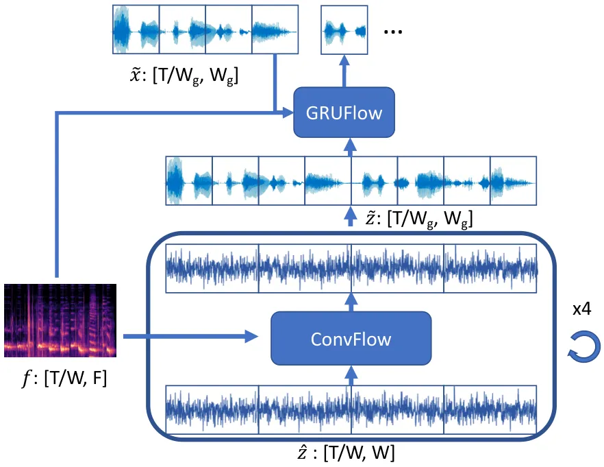
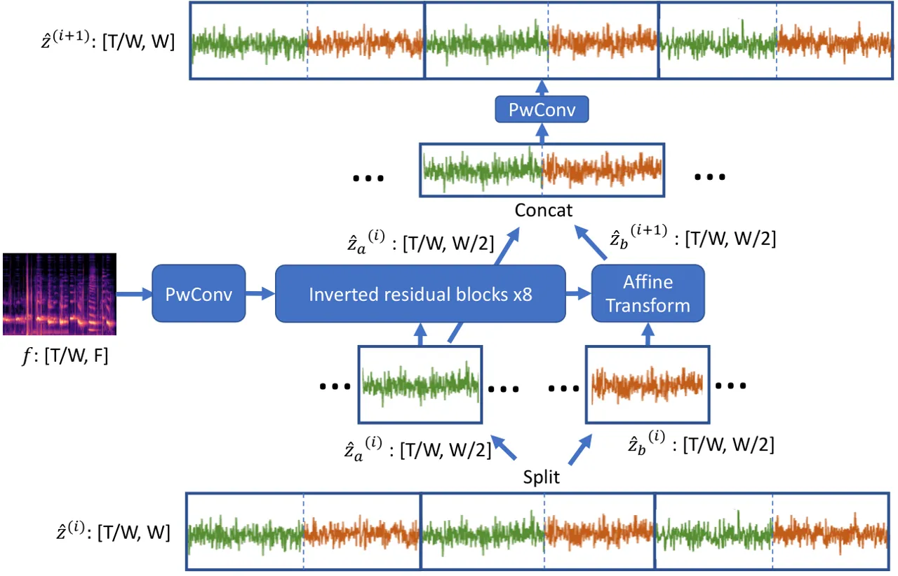
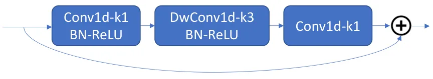
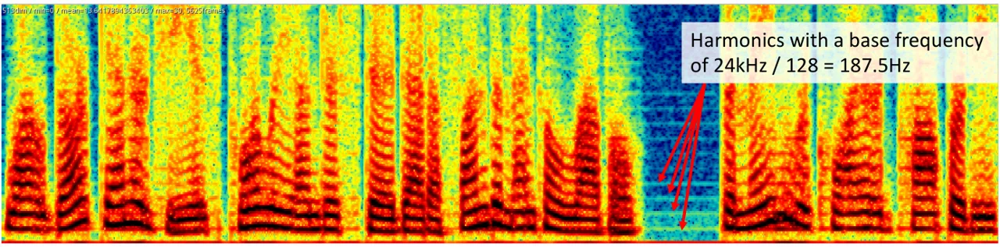
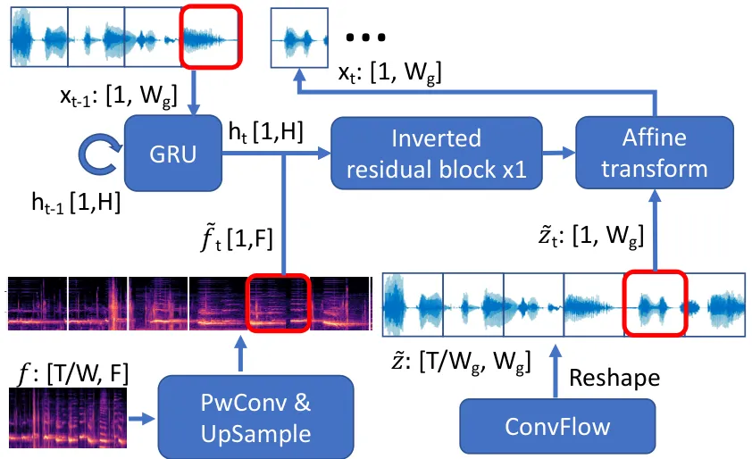
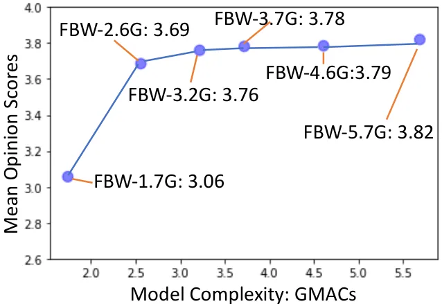

# FBWave: Efficient and Scalable Neural Vocoders for Streaming Text-To-Speech on the Edge

Bichen Wu    Qing He    Peizhao Zhang    Thilo Koehler    Kurt Keutzer
   Peter Vajda ^(†)^(†)thanks: Correspondence to Bichen Wu: wbc@fb.com

###### Abstract

Nowadays more and more applications can benefit from edge-based
text-to-speech (TTS). However, most existing TTS models are too
computationally expensive and are not flexible enough to be deployed on
the diverse variety of edge devices with their equally diverse
computational capacities. To address this, we propose FBWave, a family
of efficient and scalable neural vocoders that can achieve optimal
performance-efficiency trade-offs for different edge devices. FBWave is
a hybrid flow-based generative model that combines the advantages of
autoregressive and non-autoregressive models. It produces high quality
audio and supports streaming during inference while remaining highly
computationally efficient. Our experiments show that FBWave can achieve
similar audio quality to WaveRNN while reducing MACs by 40x. More
efficient variants of FBWave can achieve up to 109x fewer MACs while
still delivering acceptable audio quality. Audio demos are available at
[https://bichenwu09.github.io/vocoder_demos](https://bichenwu09.github.io/vocoder_demos).

###### Index Terms: 

Text-to-Speech, Generative Models, Normalizing Flows, Efficient Deep
Learning, Edge Computing

^(†)^(†)address: ¹Facebook Reality Labs, ²Facebook AI, ³UC Berkeley

## 1 Introduction

Voice user interfaces (VUI) are absolutely essential for some
applications and desirable for many others. A key component in these
interfaces is text-to-speech (TTS), which translates text into speech
audio. Previous TTS systems are mostly deployed on cloud servers with
generated audios sent to users through the internet. However, in recent
years, due to privacy concerns, concerns around internet stability and
availability, and fast progress of edge computing, increasingly more
applications would require or benefit from deploying TTS on devices such
as smart watches, AR/VR glasses, home assistant devices, and mobile
phones.

This adds new challenges for TTS technologies in several ways: 1)
Although previous TTS systems are able to generate speech audios with
good quality \[1, 2, 3\], their computational costs are prohibitively
high for edge devices. 2) Deploying TTS to the edge entails dealing with
a greater diversity of devices, with each device having its own
computational budget. For example, a TTS model that can run on mobile
phones may still be too big for smart watches. To cope with this, we not
only need one efficient model, but a family of efficient and scalable
models that can achieve good quality-efficiency trade-offs under
different computational constraints. Our paper aims to address these
challenges.

Current state-of-the-art TTS models usually contain two components: the
first one generates acoustic features from input text \[4, 5, 6, 7\];
and the second model, also referred to as a vocoder, accepts the
acoustic features and generates audio samples. Since a vocoder needs to
generate samples at a high frequency, typically 16-24K samples per
second, it is usually the computational bottleneck of a TTS system. Our
paper is focused on vocoders. Despite the recent progress of vocoders,
previous work has not been able to fully address the challenges of
edge-based TTS. Early success of neural vocoders are mainly
autoregressive models, such as WaveNet \[1\], WaveRNN \[3\]. These
models can generate high fidelity audios, but they are not efficient,
due to their high model complexity and the nature of autoregression.
Recent research efforts have been focusing on building
non-autoregressive models, such as WaveGlow \[2\]. WaveGlow is a
generative flow-based model that can synthesize high-fidelity audios
using a parallel architecture. However, the model is extremely
computationally expensive, as it requires 231 GMACs to compute 1 second
of 22kHz audio, which is far beyond the capacity of edge devices.
Following WaveGlow, SqueezeWave \[8\] shows that the computational cost
of WaveGlow can be reduced by modifying the model to operate at a
coarser temporal resolution. In addition, MelGAN and variants \[9, 10\]
also adopt non-autoregressive architectures and train the models
following the paradigm of GAN \[11\]. However, audios generated by
non-autoregressive models suffer from a periodic artifact since their
output audio samples lacks continuity, and the quality further
deteriorates when used in a streaming pipeline.

To overcome this, we propose FBWave, a hybrid flow-based model that
consists of a non-autoregressive convolution-based flow (ConvFlow) and
an autoregressive GRU-based flow (GRUFlow). The GRUFlow mitigates the
artifacts in WaveGlow and SqueezeWave by improving the continuity in
generated samples. This allows us to use fewer layers of ConvFlows and
let ConvFlows operate at a lower frequency, both of which lead to
significant MAC reduction. It also enables the model to operate in a
streaming pipeline. In ConvFlow and GRUFlow, we adopted inverted
residual blocks to replace the complex WaveNet-like functions used in
WaveGlow \[2\] and SqueezeWave \[8\], which leads to MAC reduction and
faster training. FBWave achieves much better audio quality than
SqueezeWave \[8\], but remains to be computationally efficient and
requires much fewer MACs than previous work \[2, 3\]. To adapt to
different devices with different budgets, we control the FBWave using a
few architecture hyperparameters to obtain a family of models with
different quality-efficiency trade-offs. Our experiments show that
FBWave can achieve similar audio quality compared to WaveRNN \[3\] while
using 40x fewer MACs and a smaller FBWave can deliver acceptable audio
quality using 109x fewer MACs.

## 2 Method

FBWave is a hybrid flow-based generative model, as shown in Fig. 1. It
contains a series of invertible transformation functions to convert a
simple distribution, such as spherical Gaussian, to a complex audio
distribution conditioned on the acoustic features. A generative flow can
be described as

```math
\textbf{x}=g_{k}\circ g_{k-1}\cdot\cdots g_{1}(\textbf{z}), \tag{1}
```

where $`\textbf{x}\in\mathbf{R}^{T}`$ is the audio sequence with $`T`$
samples, $`\textbf{z}\in\mathbf{R}^{T}`$ is sampled from a simple
distribution. $`g_{i}(\cdot)`$ can take any form of invertible
functions. We adopt two types of functions, a convolution-based
non-autoregressive flow function (ConvFlow), as shown in Fig. 2, and a
GRU-based autoregressive flow function (GRUFlow), as shown in Fig. 5.



Figure 1: The overall diagram of FBWave.

### 2.1 ConvFlow



Figure 2: The diagram of ConvFlow.

A ConvFlow is similar to the generative flows in Glow\[12\],
WaveGlow\[2\], and Squeezewave\[8\]. For an input sequence
$`\mathbf{z}^{(i)}\in\mathbf{R}^{T}`$, a ConvFlow first reshapes
$`\mathbf{z}^{(i)}`$ to
$`\hat{\mathbf{z}}^{(i)}\in\mathbf{R}^{T/W\times W}`$, a sequence of
$`T/W`$ windows with each window containing $`W`$ contiguous samples. To
construct an invertible function, we split $`\hat{\mathbf{z}}^{(i)}`$
along the second (channel) dimension to two tensors as
$`\hat{\mathbf{z}}_{a}^{(i)},\hat{\mathbf{z}}_{b}^{(i)}\in\mathbf{R}^{T/W\times W/2}`$,
and compute

```math
\begin{gathered}\mathbf{s}^{(i)},\mathbf{b}^{(i)}=\text{IRB}(\text{concat}(\hat{\mathbf{z}}_{a}^{(i)},\mathbf{f})),\\
\hat{\mathbf{z}}_{b}^{(i+1)}=(\hat{\mathbf{z}}_{b}^{(i)}-\mathbf{b}^{(i)})/\mathbf{s}^{(i)},\\
\hat{\mathbf{z}}^{(i+1)}=\text{PwConv}(\text{concat}(\hat{\mathbf{z}}_{a}^{(i)},\hat{\mathbf{z}}_{b}^{(i+1)})).\end{gathered} \tag{2}
```

$`\mathbf{f}\in\mathbf{R}^{T/W\times F}`$ is the feature computed by the
upstream TTS pipeline. $`\text{IRB}(\cdot)`$ is a series of inverted
residual block functions used to compute affine transformation
coefficients
$`\mathbf{s}^{(i)},\mathbf{b}^{(i)}\in\mathbf{R}^{T/W\times W/2}`$.
$`\text{PwConv}(\cdot)`$ is a 1D point-wise convolution. It computes the
output as
$`\mathbf{\hat{z}}_{t}^{(i+1)}=\mathbf{K}\mathbf{\hat{z}}_{t}^{(i)}`$
for $`t=1,\cdots,T/W`$, and $`\mathbf{K}\in\mathbf{R}^{W\times W}`$ is
the weight matrix.



Figure 3: The diagram of an inverted residual block.

A major difference between FBWave and either WaveGlow or SqueezeWave is
the adoption of 1D inverted residual blocks (IRBs) in the ConvFlow. IRBs
have become the de facto building block for efficient computer vision
models \[13, 14\]. As shown in Fig. 3, an IRB consists of a point-wise
convolution, a depthwise convolution with a kernel size of 3, and
another point-wise convolution, in parallel with a skip-connection that
adds the input to the output. The input and output have the same channel
size $`C`$, while the intermediate tensor can have a large channel size
$`E\times C`$. The MACs of an inverted residual block is proportional to
$`\mathcal{O}(EC^{2}T/W)`$. IRBs are simpler than the WaveNet-like
functions used in WaveGlow and its training converges faster.

ConvFlow functions are non-autoregressive – samples in different windows
are computed without depending on each other. This causes discontinuity
between samples in different windows, which leads to notable artifacts
in the generated audio. Using SqueezeWave as an example, we analyzed the
spectrogram of a snippet of 24kHz audios generated by SqueezeWave. As
shown in Fig. 4, we can observe harmonics with a base frequency of
187.5Hz = 24kHz / 128, where 128 is the window size used by SqueezeWave.
Similar artifacts can also be observed in audios generated by WaveGlow.
We observed further quality drop when using such models in a streaming
pipeline, where the models are only exposed to a small segment of input
features, instead of all the features.



Figure 4: Harmonics observed in the spectrogram of audios generated by
SqueezeWave. The base frequency of the harmonics is 24kHz / 128 =
187.5Hz, with 24kHz as the audio frequency and 128 as the window size of
SqueezeWave.

### 2.2 GRUFlow

To address the limitation of continuity and streamability of ConvFlow,
we introduce a GRU-augmented autoregressive flow to process the output
ConvFlow functions. At each time step, we use a GRU to take the previous
output $`\mathbf{\tilde{x}}_{t-1}\in\mathbf{R}^{W_{g}}`$ as input and
compute a representation $`\mathbf{h}_{t}\in\mathbf{R}^{H}`$ encoding
the previous states. $`W_{g}<W`$ is the window size of the GRUFlow,
$`H`$ is the GRU’s state dimension. We concatenate $`\mathbf{h}_{t}`$
and the upsampled feature $`\mathbf{\tilde{f}}_{t}`$ and feed to an IRB
to compute the affine transformation coefficients and convert the input
as

```math
\begin{gathered}\mathbf{h}_{t}=GRU(\mathbf{\tilde{x}}_{t-1},\mathbf{h}_{t-1})\\
\mathbf{s}_{t},\mathbf{b}_{t}=IRB(\text{concat}(\mathbf{h}_{t},\mathbf{\tilde{f}}_{t}))\\
\mathbf{\tilde{x}}_{t}=(\tilde{\mathbf{z}}_{t}-\mathbf{b}_{t})/\mathbf{s}_{t},\end{gathered} \tag{3}
```

GRUFlow achieves better continuity than ConvFlow since
$`\mathbf{\tilde{x}}_{t}`$ is conditioned on previous outputs. This also
allows it to be used in a streaming pipeline. We set the IRB’s channel
size the same as the GRU’s hidden state dimension $`H`$, the MACs for
the GRUFlow is proportional to $`\mathcal{O}(H^{2}T/W_{g})`$.



Figure 5: The diagram of GRUFlow.

### 2.3 Training FBWave

To train FBWave, we maximize the log-likelihood of observed audio
sequences $`\mathbf{x}`$. To compute log-likelihood, we first compute
$`\mathbf{z}`$ from $`\mathbf{x}`$ by inverting Equation (1), with each
$`g_{i}(\cdot)`$ instantiated as Equation (2) or (3). Equation (3) is
invertible since given the output $`\mathbf{\tilde{x}}_{t-1}`$, we can
compute $`\mathbf{s}_{t},\mathbf{b}_{t}`$ and compute the input at
step-$`t`$ as
$`\mathbf{\hat{z}}_{t}=\mathbf{\hat{s}}_{t}\odot\mathbf{\hat{x}}_{t}+\mathbf{\hat{b}}_{t}`$.
To invert Equation (2), we first invert the point-wise convolution by
$`\mathbf{\hat{z}}_{t}^{(i)}=\mathbf{K}^{-1}\mathbf{\hat{z}}_{t}^{(i+1)}`$,
where $`\mathbf{K}^{-1}`$ is the inverse matrix of $`\mathbf{K}`$. Next,
the affine transformation in (2) can be inverted by feeding in half of
the output $`\hat{\mathbf{z}}_{a}^{(i+1)}`$, which is the same as
$`\hat{\mathbf{z}}_{a}^{(i)}`$, to compute
$`\mathbf{s}^{(i)},\mathbf{b}^{(i)}`$, then compute the other half of
the input
$`\hat{\mathbf{z}}_{b}^{(i)}=\hat{\mathbf{z}}_{b}^{(i+1)}\odot\mathbf{s}^{(i)}+\mathbf{b}^{(i)}`$.

Next, we compute the log-likelihood

```math
\log P(\mathbf{x})=\log P(\mathbf{z})+\sum_{i=1}^{k}\log|\det(Jg_{i}^{-1}(\mathbf{z}^{(i+1)})|, \tag{4}
```

where $`\log\deg(Jg_{i}^{-1}(\mathbf{z}^{(i+1)}))`$ denotes the log
determinant of the Jacobian of $`g_{i}^{-1}(\mathbf{z}^{(i+1)})`$. For
affine transformations in GRUFlow and ConvFlow, it can be computed as

```math
\log|\deg(Jg_{\text{affine}}^{-1}(\mathbf{z}^{(i+1)}))|=\sum_{t,k}|\mathbf{s}_{t,k}|. \tag{5}
```

For ConvFlow, we also need to compute

```math
\log|\deg(Jg_{\text{PwConv}}^{-1}(\mathbf{z}^{(i+1)}))|=T/W\times\log|\det(K^{-1})|. \tag{6}
```

Finally, to compute $`\log P(\mathbf{z})`$ in Equation (4), previous
work \[2, 8, 12\] assume that $`\mathbf{z}`$ comes from a spherical
Gaussian distribution and compute it as
$`\log P(\mathbf{z})=-\sum_{ij}\mathbf{z}^{2}_{ij}/(2\sigma^{2})`$. In
our experiment, we found that using Laplace distribution
$`P(\mathbf{z})`$ leads to more stable training and better audio
quality. So instead we compute
$`\log P(\mathbf{z})=-\sum_{ij}|\mathbf{z}_{ij}|/\sigma`$.

### 2.4 Scalable architectures

The computational cost of FBWave can be controlled by a few architecture
hyperparameters. For a given sequence length of $`T`$, the MACs of
ConvFlow is proportional to $`\mathcal{O}(C^{2}ET/W)`$, where $`C`$ is
the channel size of the IRB, $`E`$ is the expansion ratio, and $`W`$ is
the window size. For the GRUFlow, its MACs is proportional to
$`\mathcal{O}(H^{2}T/W_{g})`$, with $`H`$ as GRU’s hidden dimension and
the IRB’s channel size, and $`W_{g}`$ as its window size. By tunning
$`C,H,E,W_{g},W`$, we obtain a wide range of models to fit in the
compute budgets of different devices.

## 3 Experiments

We conduct experiments to evaluate the audio quality and the efficiency
of FBWave. In many previous works \[2, 8\], a vocoder’s performance is
evaluated by synthesizing audios from mel-spectrograms extracted from
ground-truth audios. However, generating audios from grouth-truth
acoustic features is a much simpler task than synthesizing using
features predicted by the upstream TTS models. Using the ground truth
acoustic features, even parametric vocoders such as the STRAIGHT vocoder
\[15\] or the WORLD vocoder \[16\] can generate high quality audios. So
instead, we evaluate FBWave by using it in an industrial TTS pipeline.

Our TTS pipeline (see Section 4.2 of \[17\] for details) consists of a
prosody model that predicts the durations of each phone and an acoustic
model that predicts a 13-dimensional Mel-frequency cepstral coefficients
(MFCCs) feature, a 1-dimensional fundamental frequency (log-F0) feature,
and a 5-dimensional periodicity feature for each frame. Our feature
frame has a window size of $`10.666`$ms and frame shift of $`5.333`$ms.
With an audio sampling rate at 24kHz, the spectral feature’s frequency
is 128 times slower than the audio frequency. We train FBWave using a
dataset recorded in a voice production studio by a professional voice
talent. It contains 40,244 utterance, approximately 40 hours of training
data.

We train FBWave using the Adam optimizer \[18\] with a batch size of 64,
a learning rate of 1e-3, and we decay the learning rate by
$`\exp`$(-5e-3) per epoch. Each audio segment in a batch consists of
8192 samples. We use batch normalization \[19\] as it leads to faster
convergence than weight normalization \[20\] used by \[2, 8, 9\]. Our
model is extremely efficient to train so even the largest model can be
trained using a single Nvidia V100 GPU. In comparison, training WaveGlow
with a batch size of 24 requires 8 V100 GPUs.

To evaluate the efficiency, we measure the number of MACs
(multiplication-and-accumulate operations) needed to generate 1 second
of 24 kHz audio. The MAC count is hardware-agnostic, which is ideal for
evaluating models targeting different devices. To evaluate the audio
quality, we conduct mean opinion score (MOS) tests on the generated
audios with 400 participants who rate a each sample with a score between
1-5 (1:bad - 5:excellent). The test set includes 60 utterances ranging
from 1 to over 30 seconds.

First, we compare FBWave with baseline models, including WaveRNN \[3\],
SqueezeWave \[8\], and a classic source-filter parametric model similar
to \[15\]. We report the MOS score and the MAC count in Table 1. As we
can see, FBWave achieves competitive MOS scores compared to WaveRNN and
WaveRNN (94% sparsity), while the computational cost is 40x and 3.8x
smaller, respectively. Compared with the parametric model and
SqueezeWave\[8\], FBWave models achieve much higher MOS scores. After
quantization, FBWave can achieve an streaming inference speed of 0.7 RTF
(real-time factor) on a Samsung S8 smart phone. A qualitative evaluation
of the audios also reveal that the quality of FBWave is similar to
WaveRNN models and much better than the parametric model and
SqueezeWave. Audios generated by different models for the MOS test are
available at
[https://bichenwu09.github.io/vocoder_demos](https://bichenwu09.github.io/vocoder_demos).

By tuning the architecture hyperparameters of FBWave, we obtain a family
of efficient models. We train them and run another MOS test to compare
these models, and plot their MOS scores and MACs in Fig. 6. As we can
see, as we shrink FBWave models, the MOS scores drop very slowly. Even
our smallest model, FBW-1.7G, can deliver acceptable audio quality while
its computational cost is 109x smaller than WaveRNN. This family of
FBWave models can be adapted to different target devices with diverse
computational capacity.

|                         | MOS               | GMACs |
| ----------------------- | ----------------- | ----- |
| Ground truth            | 4.41 $`\pm`$ 0.33 | \-    |
| WaveRNN \[3\]           | 4.13 $`\pm`$ 0.04 | 184.6 |
| WaveRNN (sparse) \[3\]  | 4.09 $`\pm`$ 0.04 | 17.5  |
| Parametric Model \[15\] | 3.08 $`\pm`$ 0.06 | \-    |
| SqueezeWave \[8\]       | 2.70 $`\pm`$ 0.06 | 3.8   |
| FBWave-4.6G (ours)      | 3.81 $`\pm`$ 0.04 | 4.6   |

Table 1: Comparing FBWave with baseline models.



Figure 6: Audio quality (MOS scores) and the efficiency (MACS) trade-off
of FBWave family models.

## 4 Conclusions

We present FBWave, a family of efficient and scalable neural vocoders
for edge-based TTS. We propose a hybrid-flow architecture that uses an
autoregressive flow on top of a parallel flow such that the model can be
used in a streaming pipeline for on-device TTS. Moreover, the
autoregressive flow mitigates the discontinuity in audios generated by
parallel flows, which leads to significant quality improvement, as
confirmed by MOS tests and qualitative evaluations. By controlling the
model using architecture parameters, we obtain a family of FBWave models
that are 40 - 109x more efficient than a WaveRNN model while still
deliver competitive audio quality under different constraints for
different target devices.

## References

- \[1\] Aaron van den Oord, Sander Dieleman, Heiga Zen, Karen Simonyan,
  Oriol Vinyals, Alex Graves, Nal Kalchbrenner, Andrew Senior, and Koray
  Kavukcuoglu, “Wavenet: A generative model for raw audio,” arXiv
  preprint arXiv:1609.03499, 2016.
- \[2\] Ryan Prenger, Rafael Valle, and Bryan Catanzaro, “Waveglow: A
  flow-based generative network for speech synthesis,” in ICASSP
  2019-2019 IEEE International Conference on Acoustics, Speech and
  Signal Processing (ICASSP). IEEE, 2019, pp. 3617–3621.
- \[3\] Nal Kalchbrenner, Erich Elsen, Karen Simonyan, Seb Noury, Norman
  Casagrande, Edward Lockhart, Florian Stimberg, Aaron van den Oord,
  Sander Dieleman, and Koray Kavukcuoglu, “Efficient neural audio
  synthesis,” arXiv preprint arXiv:1802.08435, 2018.
- \[4\] Yuxuan Wang, RJ Skerry-Ryan, Daisy Stanton, Yonghui Wu, Ron J
  Weiss, Navdeep Jaitly, Zongheng Yang, Ying Xiao, Zhifeng Chen, Samy
  Bengio, et al., “Tacotron: Towards end-to-end speech synthesis,” arXiv
  preprint arXiv:1703.10135, 2017.
- \[5\] J. Shen, R. Pang, R. J. Weiss, M. Schuster, N. Jaitly, Z. Yang,
  Z. Chen, Y. Zhang, Y. Wang, R. Skerrv-Ryan, R. A. Saurous,
  Y. Agiomvrgiannakis, and Y. Wu, “Natural tts synthesis by conditioning
  wavenet on mel spectrogram predictions,” in 2018 IEEE International
  Conference on Acoustics, Speech and Signal Processing (ICASSP), April
  2018, pp. 4779–4783.
- \[6\] Naihan Li, Shujie Liu, Yanqing Liu, Sheng Zhao, and Ming Liu,
  “Neural speech synthesis with transformer network,” in Proceedings of
  the AAAI Conference on Artificial Intelligence, 2019, vol. 33, pp.
  6706–6713.
- \[7\] Yi Ren, Yangjun Ruan, Xu Tan, Tao Qin, Sheng Zhao, Zhou Zhao,
  and Tie-Yan Liu, “Fastspeech: Fast, robust and controllable text to
  speech,” in Advances in Neural Information Processing Systems, 2019,
  pp. 3171–3180.
- \[8\] Bohan Zhai, Tianren Gao, Flora Xue, Daniel Rothchild, Bichen Wu,
  Joseph E Gonzalez, and Kurt Keutzer, “Squeezewave: Extremely
  lightweight vocoders for on-device speech synthesis,” arXiv preprint
  arXiv:2001.05685, 2020.
- \[9\] Kundan Kumar, Rithesh Kumar, Thibault de Boissiere, Lucas
  Gestin, Wei Zhen Teoh, Jose Sotelo, Alexandre de Brébisson, Yoshua
  Bengio, and Aaron C Courville, “Melgan: Generative adversarial
  networks for conditional waveform synthesis,” in Advances in Neural
  Information Processing Systems, 2019, pp. 14910–14921.
- \[10\] Geng Yang, Shan Yang, Kai Liu, Peng Fang, Wei Chen, and Lei
  Xie, “Multi-band melgan: Faster waveform generation for high-quality
  text-to-speech,” arXiv preprint arXiv:2005.05106, 2020.
- \[11\] Ian Goodfellow, Jean Pouget-Abadie, Mehdi Mirza, Bing Xu, David
  Warde-Farley, Sherjil Ozair, Aaron Courville, and Yoshua Bengio,
  “Generative adversarial nets,” in Advances in neural information
  processing systems, 2014, pp. 2672–2680.
- \[12\] Durk P Kingma and Prafulla Dhariwal, “Glow: Generative flow
  with invertible 1x1 convolutions,” in Advances in neural information
  processing systems, 2018, pp. 10215–10224.
- \[13\] Bichen Wu, Xiaoliang Dai, Peizhao Zhang, Yanghan Wang, Fei Sun,
  Yiming Wu, Yuandong Tian, Peter Vajda, Yangqing Jia, and Kurt Keutzer,
  “Fbnet: Hardware-aware efficient convnet design via differentiable
  neural architecture search,” in Proceedings of the IEEE Conference on
  Computer Vision and Pattern Recognition, 2019, pp. 10734–10742.
- \[14\] Mark Sandler, Andrew Howard, Menglong Zhu, Andrey Zhmoginov,
  and Liang-Chieh Chen, “Mobilenetv2: Inverted residuals and linear
  bottlenecks,” in Proceedings of the IEEE conference on computer vision
  and pattern recognition, 2018, pp. 4510–4520.
- \[15\] Hideki Kawahara, “Straight, exploitation of the other aspect of
  vocoder: Perceptually isomorphic decomposition of speech sounds,”
  Acoustical science and technology, vol. 27, no. 6, pp. 349–353, 2006.
- \[16\] Masanori Morise, Fumiya Yokomori, and Kenji Ozawa, “World: a
  vocoder-based high-quality speech synthesis system for real-time
  applications,” IEICE TRANSACTIONS on Information and Systems, vol. 99,
  no. 7, pp. 1877–1884, 2016.
- \[17\] Yang Gao, Weiyi Zheng, Zhaojun Yang, Thilo Kohler, Christian
  Fuegen, and Qing He, “Interactive text-to-speech via semi-supervised
  style transfer learning,” arXiv preprint arXiv:2002.06758, 2020.
- \[18\] Diederik P Kingma and Jimmy Ba, “Adam: A method for stochastic
  optimization,” arXiv preprint arXiv:1412.6980, 2014.
- \[19\] Sergey Ioffe and Christian Szegedy, “Batch normalization:
  Accelerating deep network training by reducing internal covariate
  shift,” arXiv preprint arXiv:1502.03167, 2015.
- \[20\] Tim Salimans and Durk P Kingma, “Weight normalization: A simple
  reparameterization to accelerate training of deep neural networks,” in
  Advances in neural information processing systems, 2016, pp. 901–909.
