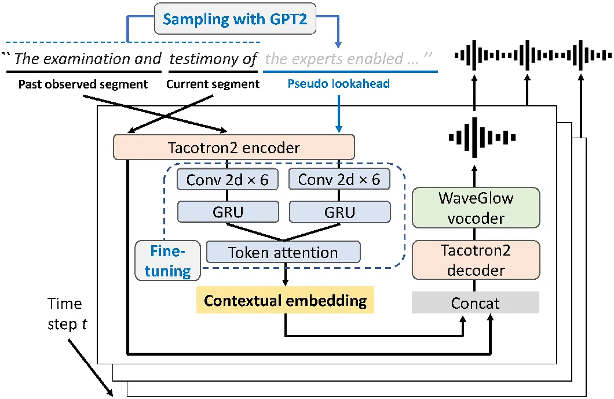
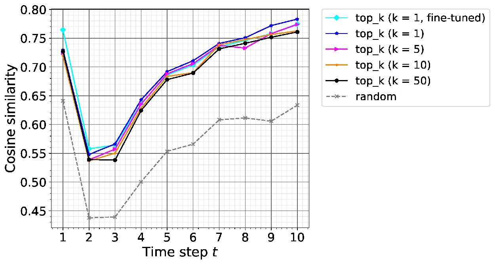

# Incremental Text-to-Speech Synthesis Using Pseudo Lookahead with Large Pretrained Language Model

Takaaki Saeki    Shinnosuke Takamichi    Hiroshi Saruwatari
^(†)^(†)thanks: The authors are with Graduate School of Information
Science and Technology, The University of Tokyo, 7-3-1 Hongo, Bunkyo-ku,
Tokyo 113-8656, Japan (e-mail: { takaaki_saeki, shinnosuke_takamichi,
hiroshi_saruwatari }@ipc.i.u-tokyo.ac.jp). ^(†)^(†)thanks: Part of this
work was supported by JSPS KAKENHI Grant Number 17H06101 and 19H01116,
and the MIC/SCOPE \#182103104.

###### Abstract

This letter presents an incremental text-to-speech (TTS) method that
performs synthesis in small linguistic units while maintaining the
naturalness of output speech. Incremental TTS is generally subject to a
trade-off between latency and synthetic speech quality. It is
challenging to produce high-quality speech with a low-latency setup that
does not make much use of an unobserved future sentence (hereafter,
“lookahead”). To resolve this issue, we propose an incremental TTS
method that uses a pseudo lookahead generated with a language model to
take the future contextual information into account without increasing
latency. Our method can be regarded as imitating a human’s incremental
reading and uses pretrained GPT2, which accounts for the large-scale
linguistic knowledge, for the lookahead generation. Evaluation results
show that our method 1) achieves higher speech quality than the method
taking only observed information into account and 2) achieves a speech
quality equivalent to waiting for the future context observation.

###### Index Terms: 

incremental text-to-speech synthesis, end-to-end text-to-speech
synthesis, language model, contextual embedding

## I Introduction

Simultaneous speech-to-speech translation (SST) \[1, 2\] enables
interactive speech communication without language barriers. It consists
of three modules that perform incremental processing: automatic speech
recognition (ASR), machine translation (MT), and text-to-speech
synthesis (TTS). Recent advances in deep learning have made remarkable
progress in the quality of TTS, as well as in ASR and MT. It is now
possible to artificially generate high-quality speech comparable to
human natural speech by modeling time-series information in the whole
sentence with deep neural networks. In contrast to the typical
sentence-level TTS frameworks, incremental TTS requires handling small
linguistic segments at the level of a few words, which makes it more
challenging. Therefore, incremental TTS suffers from a trade-off between
the naturalness of the output speech and latency in the synthesis.
Low-latency incremental TTS should process the current segment using
only an observed segment, rather than waiting for an unobserved future
segment ahead of the current segment (hereafter, “lookahead”). However,
this makes it difficult to output a speech segment that leads naturally
to the lookahead, causing synthetic speech quality to deteriorate.

This letter proposes a method to perform high-quality and low-latency
synthesis using a pseudo lookahead generated with a large-scale
pretrained language model. When we humans need to read an unknown
sentence sequentially (e.g., reading a new book), we can predict future
information on the basis of the observed segment. Then we can read out
the segment so that it is naturally connected to the past observed and
predicted contexts. To computationally imitate this mechanism, our
method predicts the lookahead using pretrained GPT2 \[3\], which is
trained on datasets from various domains. It can enhance synthetic
speech quality without increasing the latency by using the pseudo
lookahead as the future contextual information instead of waiting for
the ground-truth lookahead. This method is effective and applicable to
other incremental TTS frameworks (e.g., prefix-to-prefix
decoding \[4\]). The model architecture is a Tacotron2 \[5\]-based
end-to-end TTS model, which incorporates a contextual embedding
network \[6\] that considers the past observed and the future unobserved
contexts, and consistently trains the entire model to achieve the
high-quality synthesis of the current segment. We also propose a
language model-guided fine-tuning method to estimate the contextual
embedding that is more suitable for the predicted sentence with GPT2.
Evaluation results show that our method 1) achieves higher speech
quality than the method taking only observed information into account
and 2) achieves a speech quality equivalent to waiting for the future
context observation.

## II Related works

In recent years, the quality of TTS has dramatically improved with the
shift from cascade statistical parametric speech synthesis \[7, 8, 9\]
to end-to-end TTS \[10, 5, 11\], which generates a mel-spectrogram from
text with a single model. Several studies have focused on incremental
TTS with end-to-end architectures \[12, 4, 13, 14\]. The first attempt
at end-to-end neural incremental TTS \[12\] uses a Tacotron \[10\]-based
model to achieve high-quality synthesis. This method is a segment-level
incremental TTS just like ours, and it has difficulty generating natural
speech segments because the synthesis process is isolated from the past
observed and unobserved future contexts, as we discuss in Section IV.
Ma et al. proposed a prefix-to-prefix framework for incremental TTS with
a lookahead-$`k`$ policy that waits to observe future $`k`$ words and
synthesizes a current segment \[4\]. In contrast to this framework, our
work focuses on instantly synthesizing speech from a current segment
without waiting for the lookahead. The TTS model we use has a contextual
embedding network designed in the prior work for sentence-level
TTS \[6\]. This method aims at parallel synthesis by focusing on
intonational phrases, and both pre- and post-phrases of an input phrase
can be used for the inference process, while we can only use the
pre-segment of the current segment.



Fig. 1: Model architecture of proposed method with contextual embedding
network to consider past observed segment and pseudo lookahead.

## III Method

This section describes our proposed incremental TTS method.
Section III-A presents an inference algorithm, which integrates a
sentence generation with GPT2. Section III-B describes a model
architecture for generating a speech segment considering both past
observed and future unobserved contexts. Section III-C presents a
language model-guided fine-tuning method. Finally, Section III-D
provides a detailed analysis of the proposed method.

### III-A Incremental synthesis with pseudo lookahead

First, we define the synthetic unit for incremental TTS as “the current
segment”, which consists of $`N`$ words. In the time step $`t`$,
$`\textrm{\boldmath$w$}_{1:Nt}=\textrm{\boldmath$w$}_{1},\cdots,\textrm{\boldmath$w$}_{n},\cdots,\textrm{\boldmath$w$}_{Nt}`$
represents “the observed segment” and the last $`N`$-word sequence
$`\textrm{\boldmath$w$}_{N(t-1)+1:Nt}=\textrm{\boldmath$w$}_{N(t-1)+1},\cdots,\textrm{\boldmath$w$}_{Nt}`$
is a current segment, where $`\textrm{\boldmath$w$}_{n}`$ denotes the
$`n`$-th word. Furthermore, we define
$`\textrm{\boldmath$w$}_{1:N(t-1)}=\textrm{\boldmath$w$}_{1},\cdots,\textrm{\boldmath$w$}_{N(t-1)}`$
as “the past observed segment” to distinguish between the observed
segments with and without the current segment. GPT2 \[3\] is an
auto-regressive language model that assumes the probability distribution
of an $`M`$-word sequence $`\textrm{\boldmath$w$}_{1:M}`$ can be
decomposed into the product of conditional probabilities, as

```math
\displaystyle p(\textrm{\boldmath$w$}_{1:M})={\displaystyle\prod_{m=1}^{M}}p\left(\textrm{\boldmath$w$}_{m}|\textrm{\boldmath$w$}_{1:m-1}\right). \tag{1}
```

In accordance with this modeling, we can obtain a future $`L`$-word
sequence
$`\hat{\textrm{\boldmath$w$}}_{Nt+1:Nt+L}=\hat{\textrm{\boldmath$w$}}_{Nt+1},\cdots,\hat{\textrm{\boldmath$w$}}_{Nt+L}`$
by sampling from the probability distribution
$`p(\textrm{\boldmath$w$}_{Nt+1:Nt+L}|\textrm{\boldmath$w$}_{1:Nt})`$,
where $`\hat{\textrm{\boldmath$w$}}_{Nt+1:Nt+L}`$ becomes the “pseudo
lookahead” used for the future contextual information of incremental
TTS. Since the TTS model uses a character or phoneme sequence instead of
the word sequence $`\textrm{\boldmath$w$}_{n}`$, we define the character
or phoneme sequence corresponding to $`\textrm{\boldmath$w$}_{n}`$ as
$`\textrm{\boldmath$x$}_{n}`$. Defining the TTS model as $`G(\cdot)`$,
the output mel-spectrogram $`\textrm{\boldmath$y$}_{t}`$ can be obtained
by

```math
\displaystyle\textrm{\boldmath$y$}_{t}=G\left(\textrm{\boldmath$x$}_{N(t-1)+1:Nt}|\textrm{\boldmath$x$}_{1:N(t-1)},\hat{\textrm{\boldmath$x$}}_{Nt+1:Nt+L},\textrm{\boldmath$\theta$}_{G}\right), \tag{2}
```

where $`\textrm{\boldmath$\theta$}_{G}`$ denotes parameters of
$`G(\cdot)`$. When we define $`\textrm{\boldmath$z$}_{t}`$ as the
waveform synthesized from mel-spectrogram $`\textrm{\boldmath$y$}_{t}`$,
waveform synthesis is performed using WaveGlow \[15\] vocoder
$`V(\cdot)`$ as:

```math
\displaystyle\textrm{\boldmath$z$}_{t}=V\left(\textrm{\boldmath$y$}_{t}|\textrm{\boldmath$\theta$}_{V}\right), \tag{3}
```

where $`\textrm{\boldmath$\theta$}_{V}`$ denotes parameters of
$`V(\cdot)`$. We incrementally synthesize the output speech by
concatenating $`\textrm{\boldmath$z$}_{t}`$ to the audio waveform
$`\textrm{\boldmath$z$}_{1:t-1}`$ that has been output so far.

The naturalness of synthesized speech and latency in synthesis highly
depend on $`N`$. Although it is desirable to make $`N`$ smaller to
develop low-latency incremental TTS, the naturalness of output speech
degrades as $`N`$ decreases. In our preliminary experiment, we found
that our proposed method often outputs unintelligible speech with
$`N=1`$, as reported in Yanagita et al.’s work \[12\]. Therefore, we set
$`N`$ to two for our evaluation in this study.

### III-B TTS model architecture

The incremental TTS model we use is a Tacotron2 \[5\]-based end-to-end
model conditioned on both past observed and unobserved future segments.
It has a module for contextual embedding \[6\], as shown in Fig. 1.
Character or phoneme sequences of the current segment
$`\textrm{\boldmath$x$}_{N(t-1)+1:Nt}`$, the past observed segment
$`\textrm{\boldmath$x$}_{1:N(t-1)}`$ and the lookahead
$`\hat{\textrm{\boldmath$x$}}_{Nt+1:Nt+L}`$ are sent to the Tacotron2
encoder. When we define $`\textrm{\boldmath$h$}_{1:N(t-1)}`$ and
$`\hat{\textrm{\boldmath$h$}}_{Nt+1:Nt+L}`$ as hidden states of the past
observed segment and the pseudo lookahead, respectively,
$`\textrm{\boldmath$h$}_{1:N(t-1)}`$ and
$`\hat{\textrm{\boldmath$h$}}_{Nt+1:Nt+L}`$ are separately sent to
additional encoders, which stack six 2-D convolutional layers and a
gated recurrent unit (GRU) layer. The outputs are concatenated and sent
to a token attention layer based on a global style token \[16\]. We
define the network that estimates contextual embedding from the output
of the Tacotron2 encoder as the “contextual embedding network” and
denote it as $`F(\cdot)`$. We can obtain the contextual embedding with
the pseudo lookahead $`\textrm{\boldmath$e$}_{\mathrm{pseudo}}`$ as:

```math
\displaystyle\textrm{\boldmath$e$}_{\mathrm{pseudo}}=F(\textrm{\boldmath$h$}_{1:N(t-1)},\hat{\textrm{\boldmath$h$}}_{Nt+1:Nt+L}). \tag{4}
```

Then $`\textrm{\boldmath$e$}_{\mathrm{pseudo}}`$ is replicated and
concatenated with every state of $`\textrm{\boldmath$h$}_{N(t-1)+1:Nt}`$
to form the input of the decoder, where
$`\textrm{\boldmath$h$}_{N(t-1)+1:Nt}`$ is the hidden state of the
current segment. The contextual encoders for the past observed and
unobserved future segments share the same parameters, and we used the
same values for the hyperparameters of the contextual embedding network
as Cong et al. \[6\]. By jointly training the contextual embedding
network and the encoder-decoder network of Tacotron2, we attain natural
speech segments by considering both the past and future contexts.

When we train the TTS model, we use the ground-truth sentence in the
training data as the unobserved future segment. To extract the past
observed segment $`\textrm{\boldmath$x$}_{\leq N(t-1)}`$, the current
segment $`\textrm{\boldmath$x$}_{N(t-1)+1:Nt}`$, and the unobserved
future segment $`\textrm{\boldmath$x$}_{Nt+1\geq}`$, we use the sliding
text window \[6\] with a fixed number of words, whereas the original one
uses the text window with a fixed number of phrases. Finally, we extract
the ground-truth waveform corresponding to the current segment with
forced alignment.

### III-C Language model-guided fine-tuning

As we described in Section III-A, the lookahead prediction makes use of
linguistic knowledge of a large pretrained language model for
incremental TTS. This method, however, results in a mismatch between the
ground-truth lookahead used during training and the pseudo lookahead
during inference. In other words, the TTS model cannot fully utilize the
pseudo lookahead generated with GPT2 since the TTS model does not take
the lookahead prediction into account.

Therefore, we propose a language model-guided fine-tuning method to use
the pseudo lookahead for incremental TTS more effectively. In contrast
to the training procedure described in Section III-B, we use the pseudo
lookahead generated with GPT2 as the unobserved future segment during
the fine-tuning. GPT2 generates the unobserved future segments as
training data by using the past observed segments and the current
segments extracted with the sliding text window. Let
$`\textrm{\boldmath$e$}_{\mathrm{pseudo}}`$ be the contextual embedding
obtained by using the pseudo lookahead, and
$`\textrm{\boldmath$e$}_{\mathrm{truth}}`$ be the contextual embedding
with the ground-truth lookahead. Our goal is to enable the contextual
embedding network to use the pseudo lookahead for the contextual
information to the same extent as the actual lookahead. Therefore, we
add the additional loss $`L_{\mathrm{sim}}`$ to the loss for the TTS
model training with a weight $`\alpha_{\mathrm{sim}}`$ to maximize the
cosine similarity between $`\textrm{\boldmath$e$}_{\mathrm{pseudo}}`$
and $`\textrm{\boldmath$e$}_{\mathrm{truth}}`$, as

```math
\displaystyle\alpha_{\mathrm{sim}}\cdot L_{\mathrm{sim}}=\alpha_{\mathrm{sim}}\cdot\left(1-Sim\left(\textrm{\boldmath$e$}_{\mathrm{pseudo}},\textrm{\boldmath$e$}_{\mathrm{truth}}\right)\right), \tag{5}
```

where $`Sim(\cdot)`$ denotes the cosine similarity. Then, unlike the TTS
model training, we fix the weights of both the encoder and decoder
networks of Tacotron2, and we only train the contextual embedding
network. These operations help the TTS model to consider the contextual
information in a way that better fits the prediction of GPT2.

### III-D Discussion



Fig. 2: Average cosine similarity for time step $`t`$. We 1) investigate
the effect of $`k`$ in the top-$`k`$ sampling and 2) compare the cases
with and without the proposed fine-tuning method for $`k=1`$.

First, we analyze how close the pseudo lookahead generated with GPT2 is
to the ground-truth lookahead. For each time step $`t`$, we calculate
the average cosine similarity between the contextual embedding obtained
with the pseudo lookahead and that with the ground-truth lookahead. When
the cosine similarity is high, the pseudo lookahead is expected to
produce an equivalent effect on the synthesized speech to the actual
observation of the ground-truth lookahead. Furthermore, we investigate
the effect of the sampling strategy of GPT2. GPT2 generates a sentence
by randomly sampling from the distribution of the most probable $`k`$
words, which is called top-$`k`$ sampling \[17\]. When we set a large
value to $`k`$, GPT2 performs random sampling from various word
candidates. When $`k`$ is one, GPT2 uses deterministic generation on the
basis of the maximum likelihood.

Fig. 2 shows the analysis results. Note that we used the same
experimental conditions as those described in Section IV-A. The label
“top\_$`k`$ ($`k=K`$)” ($`K=1,5,10,50`$) denotes the case where
top-$`k`$ sampling with $`k=K`$ is used without the fine-tuning method,
and “top\_$`k`$ ($`k=1`$, fine-tuned)” represents the case where
top-$`k`$ sampling with $`k=1`$ is applied with the fine-tuning method.
The label “random” denotes the case without a language model, where we
used random English words as the lookahead sentences. Comparing the
results with “top\_$`k`$ ($`k=K`$)” and “random”, we can see that the
lookahead generation with all $`k`$ cases led to better scores than the
“random” case, demonstrating the effectiveness of the pseudo lookahead
with GPT2. Furthermore, we found that the contextual embedding obtained
with the pseudo lookahead tended to become closer to the ground-truth,
as the value of $`k`$ decreased. We also conducted subjective
evaluations on synthetic speech quality for this aspect and found that
the $`k=1`$ case produced output speech with significantly higher
naturalness than the $`k=5`$ and $`k=50`$ cases. Intuitively, a large
value of $`k`$ enables diverse sentence generation, and a small $`k`$
produces objectively plausible sentences. The results suggest that we
need to make the value of $`k`$ small for incremental TTS on a regular
speech corpus. Note that the cosine similarity for $`t=1`$ was higher
than that for all the $`t=2-5`$ cases even in “random”. This result
indicates that, when $`t=1`$, the contextual embedding network focused
much more on “the beginning of the sentence” than the future unobserved
content. Examining “top\_$`k`$ ($`k=1`$, fine-tuned)”, the cosine
similarity with the fine-tuning was better for $`t=1`$ and $`2`$ and
became lower than that in some non-fine-tuning cases as $`t`$ increased.
Since the fine-tuning method takes into account the pseudo lookahead
with GPT2 during training, it could estimate the contextual embedding
more closely to that with the ground-truth lookahead when the input
segments were not well observed, i.e., at the beginning of the sentence.
However, as $`t`$ increased and the segments of the original sentence
came in, the cosine similarity with the fine-tuning converged to the
same level as that without the fine-tuning.

## IV Experimental evaluations

### IV-A Experimental conditions

We used LJSpeech \[18\], a dataset consisting of 13,100 short audio
clips of a female English speaker lasting approximately 24 hours. We
randomly selected 100 and 500 sentences from the entire dataset for
validation and test sets, respectively, and used the rest as a training
set. When extracting a mel-spectrogram from each audio clip with
short-time Fourier transform, we used 1024-sample frame size, 256-sample
hop size, a Hann window function, and an 80 channel mel-filterbank at a
sampling frequency of 22.05 kHz. To use contextual information in the
training process, we used the sliding text window described in
Section III-B with the window length $`3`$ and the hop size $`1`$. As
described in Section III-A, we set the number of words in each input
segment $`N`$ to two in the synthesis process. When extracting a
waveform of each current segment, we used a Kaldi-based forced-alignment
toolkit \[19\]. We used the pretrained GPT2¹¹ 1
https://github.com/graykode/gpt-2-Pytorch and WaveGlow²² 2
https://github.com/NVIDIA/waveglow models for the evaluation. On the
basis of a preliminary experiment in which we calculated the cosine
similarity values over time steps for different $`L`$, we selected
$`L=5`$ as the setting that produces the closest lookahead to using the
ground-truth future segment. When performing the sampling operation with
GPT2, we applied top-$`k`$ sampling with $`k=1`$ in all cases. We
trained the TTS model with a batch size of $`160`$ distributed across
four NVIDIA V100 GPUs for 76000 iterations, for which we observed the
convergence in all the training cases. When performing the fine-tuning,
we trained only the contextual embedding network with a batch size of
$`32`$ on a NVIDIA Geforce GTX 1080Ti GPU for 4000 iterations, where we
used $`\alpha_{\mathrm{sim}}=10^{-3}`$. We used the Adam \[20\]
optimizer with $`\beta_{1}=0.9`$, $`\beta_{2}=0.999`$, and
$`\epsilon=10^{-6}`$. We set a learning rate of $`10^{-3}`$ and
$`10^{-4}`$ in the TTS model training and the fine-tuning, respectively,
applying $`L_{2}`$ regularization with weight $`10^{-6}`$.

### IV-B Evaluation cases

To investigate the effectiveness of lookahead prediction with GPT2, we
conducted objective and subjective evaluations by comparing the
following methods: (1) Ground-truth, ground-truth audio clips included
in the test data; (2) Full-sentence, sentence-level Tacotron2
model \[5\]; (3) Independent, where the TTS model synthesized a current
speech segment independently of the contextual information \[12\];
(4) Unicontext, where the TTS model used only the past observed segment
for context conditioning of the TTS model; (5) Bicontext, which is the
proposed method described in Section III without the fine-tuning method;
(6) Bicontext (truth), where we used ground-truth test transcripts for
unobserved future sentences like the conventional lookahead-$`k`$
strategy \[4\] that waits for observing $`k`$ words; and (7) Bicontext
(fine-tuned), which applied the fine-tuning method to Bicontext. Audio
samples³³ 3 https://takaaki-saeki.github.io/itts_lm_demo/ synthesized
with these methods are publicly available.

### IV-C Objective evaluations

Unlike the utterance-level TTS, incremental TTS is more prone to fail in
synthesis and to output non-recognizable speech. Therefore, we measured
the word error rate (WER) and character error rate (CER), defined as the
word- and character-level Levenshtein distance \[21\], using the
state-of-the-art ASR model to evaluate how natural and easy the output
speech is to recognize as a human utterance. We used a joint-CTC
Transformer-based model \[22\] trained on librispeech \[23\], which is
included in ESPnet \[24\]. Table I lists the results.

First, both the CER and WER were vast for Independent. In some cases,
the Independent did not predict the stop flag correctly due to the lack
of contextual information, which caused a sluggish part in the output
speech and significantly increased the insertion rate. As a result,
Bicontext synthesized output speech that was easier to recognize than
that with Independent. Furthermore, the error rates of Bicontext were
lower than those of Unicontext, which used only the observed context,
thus demonstrating the effectiveness of the pseudo lookahead with GPT2
for incremental TTS. Finally, examining Bicontext (fine-tuned), we can
see that the fine-tuning method decreased the error rates to a level
comparable to that of Bicontext (truth), which used the test transcript
for the lookahead.

|                        |        |        |                  |
| ---------------------- | ------ | ------ | ---------------- |
| Method                 | CER    | WER    | MOS              |
| Ground-truth           | 5.1 %  | 17.9 % | $`4.28\pm 0.13`$ |
| Full-sentence          | 5.5 %  | 18.2 % | $`3.82\pm 0.12`$ |
| Bicontext (truth)      | 8.2 %  | 24.2 % | $`3.36\pm 0.16`$ |
| Independent            | 38.9 % | 96.9 % | $`2.69\pm 0.20`$ |
| Unicontext             | 22.8 % | 53.9 % | $`2.99\pm 0.18`$ |
| Bicontext              | 11.9 % | 29.8 % | $`3.38\pm 0.14`$ |
| Bicontext (fine-tuned) | 8.0 %  | 22.5 % | $`3.44\pm 0.16`$ |

TABLE I: CER, WER, and MOS for each method described in Section IV-B.

### IV-D Subjective evaluations

To evaluate the quality of output speech, we conducted a mean opinion
score (MOS) evaluation test \[25\] on naturalness. Forty listeners
recruited through Amazon Mechanical Turk \[26\] participated in the
evaluation, and each listener evaluated 35 speech samples, where we
randomly chose five samples from the output utterances of the test data
for each method. Table I shows the average MOS scores with 95 %
confidence intervals.

First, our proposed methods scored significantly higher than
Independent, which is based on the prior work \[12\]. Furthermore, the
proposed methods outperformed Unicontext, which considered only the past
observed context, thus demonstrating that the pseudo lookahead with GPT2
significantly improves the naturalness of synthesized speech. When we
compare the proposed methods, Bicontext and Bicontext (fine-tuned), the
average score of Bicontext (fine-tuned) was higher, suggesting that
language model-guided fine-tuning leads to more effective pseudo
lookahead generation. Finally, our proposed methods achieved naturalness
comparable to Bicontext (truth), which uses the lookahead information
(like the method of Ma et al. \[4\]). This result indicates that the
pseudo-lookahead conditioning with a language model-guided fine-tuning
improves the quality equivalently to waiting for the actual lookahead
observations without increasing the latency. Note that we also conducted
AB tests for Bicontext, Bicontext (fine-tuned), and Bicontext (truth),
but we did not find any significant differences between them as in the
MOS evaluation test.

## V Conclusion

In this letter, we proposed an incremental text-to-speech (TTS) method
using the pseudo lookahead generated with a large pretrained language
model. This method synthesizes a current speech segment while generating
the unobserved future information with GPT2 instead of waiting for its
actual observation. We also proposed a language model-guided fine-tuning
method to use the pseudo lookahead for incremental TTS more effectively.
Experimental results demonstrated the effectiveness of our methods in
terms of both the synthetic speech quality and the latency. In future
work, we will further enhance our method towards an incremental TTS with
a quality equivalent to sentence-level TTS using only observed
information.

## References

- \[1\] S. Bangalore, V. K. Rangarajan Sridhar, P. Kolan, L. Golipour,
  and A. Jimenez, “Real-time incremental speech-to-speech translation of
  dialogs,” in Proc. NAACL, Montreal, Canada, Jun 2012, pp. 437–445.
- \[2\] K. Sudoh, T. Kano, S. Novitasari, T. Yanagita, S. Sakti, and
  S. Nakamura, “Simultaneous speech-to-speech translation system with
  neural incremental ASR, MT, and TTS,” arXiv, vol.
  abs/2011.04845, 2020.
- \[3\] A. Radford, J. Wu, R. Child, D. Luan, D. Amodei, and
  I. Sutskever, “Language models are unsupervised multitask learners,”
  https://openai.com/blog/better-language-models/, 2019.
- \[4\] M. Ma, B. Zheng, K. Liu, R. Zheng, H. Liu, K. Peng, K. Church,
  and L. Huang, “Incremental text-to-speech synthesis with
  prefix-to-prefix framework,” in Proc. EMNLP, Online, Nov. 2020, pp.
  3886–3896.
- \[5\] J. Shen, R. Pang, R. J. Weiss, M. Schuster, N. Jaitly, Z. Yang,
  Z. Chen, Y. Zhang, Y. Wang, R. Skerrv-Ryan, R. A. Saurous,
  Y. Agiomvrgiannakis, and Y. Wu, “Natural TTS synthesis by conditioning
  WaveNet on mel spectrogram predictions,” in Proc. ICASSP, Calgary,
  Canada, Apr. 2018, pp. 4779–4783.
- \[6\] Y. Cong, R. Zhang, and J. Luan, “PPSpeech: Phrase based parallel
  end-to-end TTS system,” arXiv, vol. abs/2008.02490, 2020.
- \[7\] K. Tokuda, H. Zen, and A. W. Black, “An HMM-based speech
  synthesis system applied to English,” in Proc. IEEE WSS, Santa Monica,
  U.S.A., Sep. 2002, pp. 227–230.
- \[8\] H. Zen, K. Tokuda, and A. Black, “Statistical parametric speech
  synthesis,” Speech Communication, vol. 51, no. 11, pp.
  1039–1064, 2009.
- \[9\] H. Zen, A. Senior, and M. Schuster, “Statistical parametric
  speech synthesis using deep neural networks,” in Proc. ICASSP,
  Vancouver, Canada, May 2013, pp. 7962–7966.
- \[10\] Y. Wang, R. J. Skerry-Ryan, D. Stanton, Y. Wu, Ron J. Weiss,
  N. Jaitly, Z. Yang, Y. Xiao, Z. Chen, S. Bengio, Q. Le,
  Y. Agiomyrgiannakis, R. Clark, and R. A. Saurous, “Tacotron: Towards
  end-to-end speech synthesis,” arXiv, vol. abs/1609.03499, 2017.
- \[11\] N. Li, S. Liu, Y. Liu, S. Zhao, and M. Liu, “Neural speech
  synthesis with transformer network,” in Proc. AAAI, Honolulu, U.S.A.,
  July 2019, pp. 6706–6713.
- \[12\] T. Yanagita, S. Sakti, and S. Nakamura, “Neural iTTS: Toward
  synthesizing speech in real-time with end-to-end neural text-to-speech
  framework,” in Proc. SSW, Vienna, Austria, Sep. 2019, pp. 183–188.
- \[13\] B. Stephenson, L. Besacier, L. Girin, and T. Hueber, “What the
  future brings: Investigating the impact of lookahead for incremental
  neural TTS,” in Proc. Interspeech, Online, Oct. 2020, pp. 215–219.
- \[14\] D. S. R. Mohan, R. Lenain, L. Foglianti, T. H. Teh, M. Staib,
  and A. Torresquintero, “Incremental text to speech for neural
  sequence-to-sequence models using reinforcement learning,” in Proc.
  Interspeech, Online, Oct. 2020, pp. 3186–3190.
- \[15\] R. Prenger, R. Valle, and B. Catanzaro, “WaveGlow: A flow-based
  generative network for speech synthesis,” arXiv, vol.
  abs/1811.00002, 2018.
- \[16\] Y. Wang, D. Stanton, Y. Zhang, R. Skerry-Ryan, E. Battenberg,
  J. Shor, Y. Xiao, F. Ren, Y. Jia, and R. A. Saurous, “Style Tokens:
  Unsupervised style modeling, control and transfer in end-to-end speech
  synthesis,” arXiv, vol. abs/1803.09017, 2018.
- \[17\] A. Fan, M. Lewis, and Y. Dauphin, “Hierarchical neural story
  generation,” in Proc. ACL, Melbourne, Australia, July 2018, pp.
  889–898.
- \[18\] K. Ito and L. Johnson, “The LJ Speech Dataset,”
  https://keithito.com/LJ-Speech-Dataset/, 2017.
- \[19\] R. M. Ochshorn and M. Hawkins., “Gentle: A robust yet lenient
  forced aligner built on Kaldi,”
  https://lowerquality.com/gentle/, 2017.
- \[20\] D. Kingma and B. Jimmy, “Adam: A method for stochastic
  optimization,” arXiv, vol. abs/1412.6980, 2014.
- \[21\] V. Levenshtein, “Binary codes capable of correcting deletions,
  insertions and reversals,” Soviet Physics Doklady, vol. 10, no. 8, pp.
  707–710, Feb. 1966.
- \[22\] S. Kim, T. Hori, and S. Watanabe, “Joint CTC-attention based
  end-to-end speech recognition using multi-task learning,” in Proc.
  ICASSP, New Orleans, U.S.A., Mar. 2017, pp. 4835–4839.
- \[23\] V. Panayotov, G. Chen, D. Povey, and S. Khudanpur,
  “Librispeech: An ASR corpus based on public domain audio books,” in
  Proc. ICASSP, South Brisbane, Australia, Apr. 2015, pp. 5206–5210.
- \[24\] S. Watanabe, T. Hori, S. Karita, T. Hayashi, J. Nishitoba,
  Y. Unno, N. E. Y. Soplin, J. Heymann, M. Wiesner, N. Chen,
  A. Renduchintala, and T. Ochiai, “ESPnet: End-to-end speech processing
  toolkit,” arXiv, vol. abs/1804.00015, 2018.
- \[25\] R. Streijl, S. Winkler, and D. Hands, “Mean opinion score (MOS)
  revisited: methods and applications, limitations and alternatives,”
  Multimedia Systems, vol. 22, pp. 213–227, Mar. 2016.
- \[26\] M. Buhrmester, T. Kwang, and S. D. Gosling, “Amazon’s
  Mechanical Turk: A new source of inexpensive, yet high-quality,
  data?,” Perspectives on Psychological Science, vol. 6, no. 1, pp.
  3–5, 2011.
