# ![[Uncaptioned image]](arxiv-2103-03927--3a627c3064d2.figures/figure-1.webp) πτικακυστικ\acctonosη Σ\acctonosυνθεση Φων\acctonosης Σ\acctonosυντµη Βιβλιγραφικ\acctonosη Ανασκ\acctonosπηση

Ευθ\acctonosυµις Γεωργ\acctonosιυ και Αθαν\acctonosασις
Κατσαµ\acctonosανης Affiliation: Ινστιτ\acctonosυτ Επεξεργασ\acctonosιας
τυ Λ\acctonosγυ, Ε.Κ. ΑΘΗΝΑ

###### Περ\acctonosιληψη

Ηπαρ\acctonosυσαβιβλιγραφικ\acctonosηανασκ\acctonosπησηµελετ\acctonosαειτπρ\acctonosβληµατηςπτικακυστικ\acctonosηςσ\acctonosυνθεσηςφων\acctonosης.
υσιαστικ\acctonosα δηλαδ\acctonosη εξετ\acctonosαζυµε πως
µπρ\acctonosυµε απ\acctonos κ\acctonosαπι κε\acctonosιµεν εισ\acctonosδυ
να συνθ\acctonosεσυµε µια ανθρωπ\acctonosµρφη πτικ\acctonosη ρ\acctonosη
καθ\acctonosως επ\acctonosισης και την αντ\acctonosιστιχη φων\acctonosη.
Εξαιτ\acctonosιας της πλ\acctonosυ µεγ\acctonosαλης πλυπλκ\acctonosτητας
τυ πρβλ\acctonosηµατς αυτ\acctonosυ, χρει\acctonosαζεται να τ
µελετ\acctonosησυµε σε δ\acctonosυ επιµ\acctonosερυς τµ\acctonosηµατα.
Συγκεκριµ\acctonosενα, αυτ\acctonos της σ\acctonosυνθεσης φων\acctonosης
απ\acctonos κε\acctonosιµεν (text-to-speech synthesis) καθ\acctonosως
και τη σ\acctonosυνθεση ανθρωπ\acctonosµρφης ρ\acctonosης απ\acctonos
φων\acctonosη. Σε \acctonosτι αφρ\acctonosα τη σ\acctonosυνθεση
φων\acctonosης µελετ\acctonosαµε τ\acctonosσ τα δ\acctonosικτυα πυ
κ\acctonosανυν την απεικ\acctonosνιση απ\acctonos τ κε\acctonosιµεν σε
κ\acctonosαπια ενδι\acctonosαµεση αναπρ\acctonosασταση καθ\acctonosως
επ\acctonosισης και τα δ\acctonosικτυα πυ παρ\acctonosαγυν φων\acctonosη
απ\acctonos τις ενδι\acctonosαµεσες αυτ\acctonosες
αναπραστ\acctonosασεις. Ως πρς την πτικ\acctonosη σ\acctonosυνθεση,
κατηγριπι\acctonosυµε τις πρσεγγ\acctonosισεις µε β\acctonosαση τ αν
παρ\acctonosαγυν ανθρ\acctonosωπινα πρ\acctonosσωπα \acctonosη
ανθρωπ\acctonosµρφες φιγ\acctonosυρες. Πρσπ\acctonosαθεια
γ\acctonosινεται επ\acctonosισης να παρυσιαστε\acctonosι η
σηµασ\acctonosια της επιλγ\acctonosης των µντ\acctonosελων
πρσ\acctonosωπυ στη δε\acctonosυτερη περ\acctonosιπτωση. Καθ\acctonosλη
την \acctonosεκταση της ανασκ\acctonosπησης, παρυσι\acctonosαζυµε τις
σηµαντικ\acctonosτερες, κατ\acctonosα τη γν\acctonosωµη µας,
εργασ\acctonosιες και στα δ\acctonosυ αυτ\acctonosα πεδ\acctonosια,
πρσπαθ\acctonosωντας να δ\acctonosωσυµε β\acctonosαση στα
πλενεκτ\acctonosηµατα και µεινεκτ\acctonosηµατα της κ\acctonosαθε µιας.

###### Περιεχ\acctonosµενα

1.  1 Εισαγωγ\acctonosη
    1.  1.1 Περιγραφ\acctonosητυΠρβλ\acctonosηµατς
    2.  1.2 Σ\acctonosυνθεσηΦων\acctonosης
    3.  1.3 Oπτικακυστικ\acctonosη Σ\acctonosυνθεση Φων\acctonosης
2.  2 Τπρ\acctonosβληµαµετατρπ\acctonosηςκειµ\acctonosενυσεφων\acctonosη
    1.  2.1 Neural Vocoders
        1.  2.1.1 Autoregressive Models
        2.  2.1.2 Normalizing Flow Approaches
        3.  2.1.3 GAN-based Πρσεγγ\acctonosισεις
    2.  2.2 Σ\acctonosυνψη
3.  3 Απεικ\acctonosνιση κειµ\acctonosενυ σε φασµατγρ\acctonosαφηµα και
    end-to-end πρσεγγ\acctonosισεις στη σ\acctonosυνθεση φων\acctonosης
    1.  3.1 Πρσεγγ\acctonosισειςστηβιβλιγραφ\acctonosια
    2.  3.2 Tacotron & Tacotron 2
    3.  3.3 Transformer-based approaches
    4.  3.4 Σ\acctonosυνψη end-to-end µεθ\acctonosδων
4.  4 Τ πρ\acctonosβληµα µετατρπ\acctonosης φων\acctonosης σε
    ανθρωπ\acctonosµρφη πτικ\acctonosη ρ\acctonosη.
    1.  4.1 Πρπαρασκευαστικ\acctonosες\acctonosεννιες
    2.  4.2
        πτικ\acctonosησ\acctonosυνθεσηανθρωπ\acctonosµρφηςφιγ\acctonosυραςαπ\acctonosφων\acctonosη
    3.  4.3
        πτικ\acctonosησ\acctonosυνθεσηανθρ\acctonosωπινυπρσ\acctonosωπυαπ\acctonosφων\acctonosη
    4.  4.4 MakeItTalk
    5.  4.5 \acctonosΑλλεςΠρσεγγ\acctonosισεις
5.  5 Σ\acctonosυνψηκαιΣυµπερ\acctonosασµατα
6.  Αναφρ\acctonosες

## 1 Εισαγωγ\acctonosη

H αλληλεπ\acctonosιδραση ανθρ\acctonosωπυ-µηχαν\acctonosης (human
computer interaction) στν $`21`$ αι\acctonosωνα αυξ\acctonosανεται µε
ραγδα\acctonosιυς ρυθµ\acctonosυς, εξαιτ\acctonosιας της
συνεχ\acctonosµενης τεχνλγικ\acctonosης εξ\acctonosελιξης.
Ειδικ\acctonosτερα σε καθηµεριν\acctonos πλ\acctonosεν επ\acctonosιπεδ ,
σε µικρ\acctonosτερ \acctonosη µεγαλ\acctonosυτερ βαθµ\acctonos,
\acctonosεχυµε επαφ\acctonosη µε εικνικ\acctonosυς, φυσικ\acctonosυς
\acctonosη \acctonosεξυπνυς πρ\acctonosακτρες (agents¹¹ 1
Ωςπρ\acctonosακτρας(agent) νε\acctonosιται µια ντ\acctonosτητα η
π\acctonosια αντιλαµβ\acctonosανεται τ περιβ\acctonosαλλν της
µ\acctonosεσω αλληλεπ\acctonosιδρασης µε αυτ\acctonos.
Παρ\acctonosαδειγµα φυσικ\acctonosυ agent ε\acctonosιναι \acctonosενα
ρµπ\acctonosτ εν\acctonosω εικνικ\acctonosυ \acctonosενα avatar.). Πι
συγκεκριµ\acctonosενα αυτ\acctonosι ι agents συµµετ\acctonosεχυν σε
πληθ\acctonosωρα εφαρµγ\acctonosων απ\acctonos καθηµεριν\acctonosες
δραστηρι\acctonosτητες (chatbots, πλ\acctonosηγηση στ διαδ\acctonosικτυ)
µ\acctonosεχρι και παιδαγωγικ\acctonosυς σκπ\acctonosυς (learning
assistants) \[Johnson et al., 2000\].

Ητεχνητ\acctonosηνηµσ\acctonosυνη(artificial intelligence)
απσκπε\acctonosι στ να µεγιστπι\acctonosησει τη φυσικ\acctonosτητα στην
αλληλεπ\acctonosιδραση ανθρ\acctonosωπυ µηχαν\acctonosης.
Λαµβ\acctonosανντας υπ\acctonosψιν τ γεγν\acctonosς \acctonosτι η
βασικ\acctonosη συνιστ\acctonosωσα επικινων\acctonosιας ε\acctonosιναι η
µιλ\acctonosια και συνεπακ\acctonosλυθα η ανθρ\acctonosωπινη
φων\acctonosη, αντιλαµβαν\acctonosµαστε τ π\acctonosσ ζωτικ\acctonosης
σηµασ\acctonosιας ε\acctonosιναι η αν\acctonosαπτυξη αλγρ\acctonosιθµων
πυ παρ\acctonosαγυν ρεαλιστικ\acctonosη ανθρ\acctonosωπινη
φων\acctonosη. Λ\acctonosγω \acctonosµως της πλυτρπικ\acctonosης
(multimodal) φ\acctonosυσης της φων\acctonosης \[Ekman, 1984\]
εξ\acctonosισυ σηµαντικ\acctonos ε\acctonosιναι να παρ\acctonosαξυµε και
πτικ\acctonosη φωτρεαλιστικ\acctonosη πληρφρ\acctonosια. \acctonosΕχει
απδειχθε\acctonosι \acctonosαλλωστε απ\acctonos µελετητ\acctonosες πως
συνδυασµ\acctonosς πτικ\acctonosης και φωνητικ\acctonosης
πληρφρ\acctonosιας επιφ\acctonosερει τα καλ\acctonosυτερα
δυνατ\acctonosα απτελ\acctonosεσµατα ως πρς την ευρωστ\acctonosια της
επικινων\acctonosιας \[Sumby and Pollack, 1954\].

Ηπαρ\acctonosυσαβιβλιγραφικ\acctonosηανασκ\acctonosπησηπραγµατε\acctonosυεταιτπρ\acctonosβληµατηςπτικακυστικ\acctonosηςσ\acctonosυνθεσηςφων\acctonosης(audio-visual
speech synthesis). Σκπ\acctonosς τυ υπ\acctonos εξ\acctonosεταση
πρβλ\acctonosηµατς ε\acctonosιναι δθε\acctonosισας γραπτ\acctonosης
περιγραφ\acctonosης να παρ\acctonosαξυµε \acctonosενα
φωτ-ρεαλιστικ\acctonos β\acctonosιντε τ π\acctonosι θα
συνδε\acctonosυεται απ\acctonos \acctonosενα επιπλ\acctonosεν
σ\acctonosηµα φων\acctonosης. Φυσικ\acctonosα τ\acctonosσ η
πτικ\acctonosη \acctonosσ και η ακυστικ\acctonosη συνιστ\acctonosωσα πυ
συντ\acctonosιθενται θα πρ\acctonosεπει να ε\acctonosιναι
συγχρνισµ\acctonosενες.

### 1.1 Περιγραφ\acctonosητυΠρβλ\acctonosηµατς

Μετατπ\acctonosιζνταςτηνπαρυσ\acctonosιασησεπιτεχνικ\acctonosεπ\acctonosιπεδµπρ\acctonosυµενακ\acctonosανυµετιςακ\acctonosλυθεςγενικ\acctonosεςπαρατηρ\acctonosησεις.
\acctonosπως \acctonosισως ε\acctonosιναι φανερ\acctonos τ
πρ\acctonosβληµα της πτικακυστικ\acctonosης σ\acctonosυνθεσης
φων\acctonosης διαιρε\acctonosιται σε δ\acctonosυ
υπ\acctonos-πρβλ\acctonosηµατα και συγκεκριµ\acctonosενα τη
σ\acctonosυνθεση

- •
  φων\acctonosηςαπ\acctonosκε\acctonosιµεν(text-to-speech synthesis)
- •
  πτικ\acctonosηςσυνιστ\acctonosωσαςαπ\acctonosηχητικ\acctonosσ\acctonosηµα

Καιταδ\acctonosυπρβλ\acctonosηµατα\acctonosεχυνµελετηθε\acctonosιστηβιβλιγραφ\acctonosιααλλ\acctonosατενδιαφ\acctonosερντωνερευνητ\acctonosωνε\acctonosιναισαφ\acctonosωςπρσανατλισµ\acctonosενστησ\acctonosυνθεσηφων\acctonosης(speech
synthesis) σε σχ\acctonosεση µε τα δ\acctonosυ.

Ε\acctonosιναιγεγν\acctonosςπωςαπ\acctonosτηβιβλιγραφ\acctonosιααπυσι\acctonosαζυνεργασ\acctonosιεςιπ\acctonosιεςµελετ\acctonosανεκαθλικ\acctonosατπρ\acctonosβληµαπυθ\acctonosελυµεναεπιλ\acctonosυσυµε.
Αυτ\acctonos φε\acctonosιλεται εν πλλ\acctonosις στην
πλυπλκ\acctonosτητα τυ συνδυαστικ\acctonosυ πρβλ\acctonosηµατς πυ
θ\acctonosελυµε να επιλ\acctonosυσυµε. Συγκεκριµ\acctonosενα,
ακ\acctonosµα και ι δ\acctonosυ γενικ\acctonosες κατευθ\acctonosυνσεις
πυ σκιαγραφ\acctonosησαµε πρηγυµ\acctonosενως, χωρ\acctonosιζνται σε
επιµ\acctonosερυς περιχ\acctonosες κ\acctonosαθε µ\acctonosια
απ\acctonos τις π\acctonosιες χρ\acctonosηζει ιδια\acctonosιτερης
ερευνητικ\acctonosης µεταχε\acctonosιρισης. Στη συν\acctonosεχεια
παρυσι\acctonosαζυµε µια βιβλιγραφικ\acctonosη ανασκ\acctonosπηση των
µεθ\acctonosδων και αλγρ\acctonosιθµων επ\acctonosι των
κατευθ\acctonosυνσεων αυτ\acctonosων.

### 1.2 Σ\acctonosυνθεσηΦων\acctonosης

Μετηραγδα\acctonosιαεξ\acctonosελιξητηςβαθι\acctonosαςµηχανικ\acctonosηςµ\acctonosαθησης(deep
learning) ως ερευνητικ\acctonosυ πεδ\acctonosιυ πλλ\acctonosα
πρβλ\acctonosηµατα επιλ\acctonosυθηκαν πλ\acctonosυ απδτικ\acctonosτερα
απ’\acctonosτι µε παλαι\acctonosτερες πρσεγγ\acctonosισεις \[Krizhevsky
et al., 2012, LeCun et al., 1998\].

\acctonos

Ενααπ\acctonosαυτ\acctonosαταπρβλ\acctonosηµατασταπ\acctonosιαητεχνητ\acctonosηνηµσ\acctonosυνηξεπ\acctonosερασεκατ\acctonosαπλ\acctonosυτιςπρηγ\acctonosυµενεςπρσεγγ\acctonosισειςκαιπλησ\acctonosισασετα\acctonosριατης[ανθρ\acctonosωπινης
δια\acctonosισθησης](https://deepmind.com/blog/article/wavenet-generative-model-raw-audio)
ε\acctonosιναι και η σ\acctonosυνθεση φων\acctonosης \[Oord et al.,
2016\]. Oι παλαι\acctonosτερες πρσεγγ\acctonosισεις βασ\acctonosιζνται
στην αν\acctonosαλυση κειµ\acctonosενυ µε σκπ\acctonos την
εξαγωγ\acctonosη κ\acctonosαπιων γλωσσικ\acctonosων
χαρακτηριστικ\acctonosων τα π\acctonosια δ\acctonosιννται ως
ε\acctonosισδ σε κ\acctonosαπι ακυστικ\acctonos µντ\acctonosελ (acoustic
model), π.χ GMMs. Τ acoustic model µε τη σειρ\acctonosα τυ
τρφδτε\acctonosι την \acctonosεξδ\acctonos τυ, συν\acctonosηθως
φασµατγραφ\acctonosηµατα (spectrograms), σε \acctonosενα
σ\acctonosυστηµα σ\acctonosυνθεσης φων\acctonosης τ π\acctonosι
παρ\acctonosαγει την τελικ\acctonosη συνθετικ\acctonosη φων\acctonosη. Η
πραναφερθε\acctonosισα διαδικασ\acctonosια φα\acctonosινεται και στ
Σχ\acctonosηµα 1.

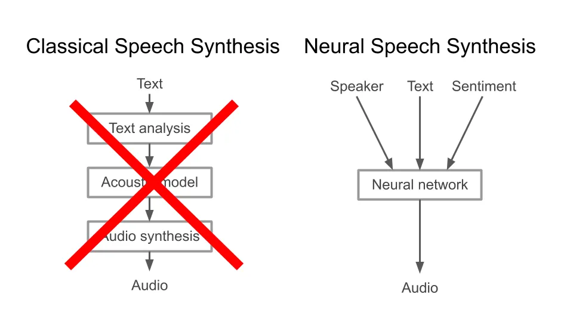

Σχ\acctonosηµα 1: Κλασικ\acctonosη και Νευρωνικ\acctonosη
πρσ\acctonosεγγιση Σ\acctonosυνθεσης Φων\acctonosης

Μεταβα\acctonosιννταςτ\acctonosωρασεπρσεγγ\acctonosισειςµεβ\acctonosασητανευρωνικ\acctonosαδ\acctonosικτυα,
η βασικ\acctonosη ιδ\acctonosεα ε\acctonosιναι να
αντικαταστ\acctonosησυµε τα επιµ\acctonosερυς υπσυστ\acctonosηµατα
ε\acctonosιτε µε µια ενια\acctonosια ε\acctonosιτε µε πλλαπλ\acctonosες
αρχιτεκτνικ\acctonosες. Για παρ\acctonosαδειγµα ε\acctonosιναι
σ\acctonosυνηθες \[Wang et al., 2017\] \acctonosενα υπδ\acctonosικτυ της
συνλικ\acctonosης αρχιτεκτνικ\acctonosης να αναλαµβ\acctonosανει να
απεικν\acctonosισει τη λεκτικ\acctonosη περιγραφ\acctonosη
(κε\acctonosιµεν) σε καπιυ ε\acctonosιδυς spectrogram και στη
συν\acctonosεχεια να χρησιµπιηθε\acctonosι \acctonosενας vocoder,
π\acctonosις αναλαµβ\acctonosανει να ανακατσκευ\acctonosασει τ
ηχητικ\acctonos σ\acctonosηµα απ\acctonos τη φασµατικ\acctonosη τυ
αναπαρ\acctonosασταση.

### 1.3 Oπτικακυστικ\acctonosη Σ\acctonosυνθεση Φων\acctonosης

\acctonos

ταν αναφερ\acctonosµαστε στ πρ\acctonosβληµα της πτικακυστικ\acctonosης
σ\acctonosυνθεσης φων\acctonosης τ\acctonosτε ιδανικ\acctonosα
αυτ\acctonos πυ θ\acctonosελυµε να πετ\acctonosυχυµε ε\acctonosιναι να
κατασκευ\acctonosασυµε \acctonosεναν αλγ\acctonosριθµ π\acctonosις θα
µπρε\acctonosι να εκφ\acctonosερεται µε τν \acctonosιδι τρ\acctonosπ πυ
θα τ \acctonosεκανε και \acctonosενας \acctonosανθρωπς. Αυτ\acctonos
σηµα\acctonosινει \acctonosτι θα πρ\acctonosεπει αφεν\acctonosς να
µπρε\acctonosι να εκδηλ\acctonosωνει τ τι θ\acctonosελει να πει
αφετ\acctonosερυ να κ\acctonosανει τις κατ\acctonosαλληλες
κιν\acctonosησεις πυ χρησιµπι\acctonosυνε και ι \acctonosιδιι ι
\acctonosανθρωπι.

Εξετ\acctonosαζνταςτπρ\acctonosβληµαλ\acctonosιγπιπρσεκτικ\acctonosα,
µπρ\acctonosυµε να π\acctonosυµε πως αρχικ\acctonosα, η
(παραγ\acctonosµενη) φων\acctonosη σε συνδυασµ\acctonos µε τις
εκφρ\acctonosασεις τυ πρσ\acctonosωπυ παρ\acctonosτι ε\acctonosιναι
αρκετ\acctonosα συσχετισµ\acctonosενες (correlated) σαν \acctonosεννιες,
βρ\acctonosισκνται στην πραγµατικ\acctonosτητα σε δ\acctonosυ
τελε\acctonosιως διαφρετικ\acctonosυς χ\acctonosωρυς. Συνεπ\acctonosως
θα πρ\acctonosεπει να βρ\acctonosυµε κ\acctonosαπιν
(µη-γραµµικ\acctonos) µετασχηµατισµ\acctonos πυ να µας
απεικν\acctonosιζει απ\acctonos τν ακυστικ\acctonos στν πτικ\acctonos
χ\acctonosωρ αν\acctonosαλγα µε τ τι θ\acctonosελυµε να π\acctonosυµε.
Συνλικ\acctonosα θα πρ\acctonosεπει να \acctonosεχυµε \acctonosενα
δ\acctonosικτυ τ π\acctonosι θα αναλαµβ\acctonosανει να
µαθα\acctonosινει τ\acctonosετιυς µετασχηµατισµ\acctonosυς.

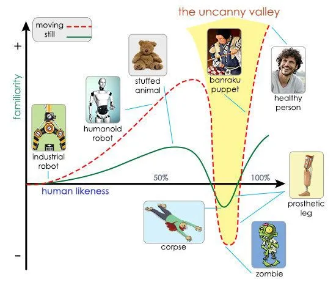

Σχ\acctonosηµα 2: Uncanny Valley Effect
([Source](https://areewitoelar.medium.com/the-uncanny-valley-of-improv-446befa2b89c))

Τακυστικ\acctonosσ\acctonosηµαπεριγρ\acctonosαφεταιε\acctonosιτεαπυεθε\acctonosιαςωςκυµατµρφ\acctonosηε\acctonosιτεµ\acctonosεσωφασµατικ\acctonosωναναπαραστ\acctonosασεων.
Ως πρς την πτικ\acctonosη συνιστ\acctonosωσα τ\acctonosωρα θα
χρειαστε\acctonosι να κατασκευ\acctonosασυµε µια ανθρωπ\acctonosµρφη
κεφαλ\acctonosη (cartoon, avatar) η π\acctonosια να κινε\acctonosιται σε
συµφων\acctonosια µε τ ηχητικ\acctonos σ\acctonosηµα. Ιδια\acctonosιτερη
\acctonosεµφαση πρ\acctonosεπει να δωθε\acctonosι σε αυτ\acctonos τ
πρ\acctonosβληµα καθ\acctonosως εξαιτ\acctonosιας της υψηλ\acctonosης
µεταβλητ\acctonosτητας και πλυπλκ\acctonosτητας πυ
παρυσι\acctonosαζεται, υπ\acctonosαρχει η πιθαν\acctonosτητα να
πρκληθε\acctonosι τ λεγ\acctonosµεν uncanny valley effect²² 2
Εξαιτ\acctonosιαςτυεξελιγµ\acctonosενυπτικ\acctonosυσυστ\acctonosηµατςπυ\acctonosεχειαναπτ\acctonosυξει\acctonosανθρωπςατ\acctonosελειεςαναφρικ\acctonosαµετηνπτικ\acctonosησυνιστ\acctonosωσαγ\acctonosιννταιπλ\acctonosυ\acctonosευκλααντιληπτ\acctonosες.
\[Seyama and Nagayama, 2007, Mori et al., 2012\].

## 2 Τπρ\acctonosβληµαµετατρπ\acctonosηςκειµ\acctonosενυσεφων\acctonosη

Τπρ\acctonosβληµατηςσ\acctonosυνθεσηςφων\acctonosηςαπ\acctonosκε\acctonosιµεν\acctonosηαλλι\acctonosωςText-to-Speech
(TTS) Synthesis ε\acctonosιναι \acctonosενα αρκετ\acctonosα
δ\acctonosυσκλ πρ\acctonosβληµα πυ καλε\acctonosιται να
επιλ\acctonosυσει ταυτ\acctonosχρνα τρ\acctonosια σηµαντικ\acctonosα
πρβλ\acctonosηµατα. Αρχικ\acctonosα µια πτικ\acctonosη τυ ε\acctonosιναι
\acctonosτι απτελε\acctonosι \acctonosενα πρ\acctonosβληµα
απσυµπ\acctonosιεσης (decompression) αφ\acctonosυ υσιαστικ\acctonosα
θ\acctonosελει να απεικν\acctonosισει περιρισµ\acctonosενυς
γραφικ\acctonosυς-κειµενικ\acctonosυς χαρακτ\acctonosηρες σε µια
κυµατµρφ\acctonosη η π\acctonosια απτελε\acctonosιται απ\acctonos
αρκετ\acctonosες χιλι\acctonosαδες δε\acctonosιγµατα. Επιπλ\acctonosεν,
θα πρ\acctonosεπει να αντιστιχ\acctonosισυµε κ\acctonosαθε
µν\acctonosαδα κειµ\acctonosενυ σε \acctonosενα τµ\acctonosηµα µια
κυµατµρφ\acctonosης συνεπ\acctonosως λ\acctonosυνντας ταυτ\acctonosχρνα
και \acctonosενα πρ\acctonosβληµα
συγχρνισµ\acctonosυ-ευθυγρ\acctonosαµµισης (alignment) των δ\acctonosυ
συνιστωσ\acctonosων. Τρ\acctonosιτν, καλ\acctonosυµαστε να
επιλ\acctonosυσυµε τ ευρ\acctonosυτετ πρ\acctonosβληµα
απεικ\acctonosνισης µιας ακλυθ\acctonosιας σε µ\acctonosια
\acctonosαλλη, τ π\acctonosι στη βιβλιγραφ\acctonosια
αναφ\acctonosερεται ως translation πρ\acctonosβληµα.

Στηνεν\acctonosτητααυτ\acctonosηθαεπικτρωθ\acctonosυµεστηνπεριγραφ\acctonosηπρσεγγ\acctonosισεωντυπρβλ\acctonosηµατςσ\acctonosυνθεσηςφων\acctonosηςµεχρ\acctonosησηβαθι\acctonosωννευρωνικ\acctonosωνδικτ\acctonosυων.
Συγκεκριµ\acctonosενα ι πρσεγγ\acctonosισεις αυτ\acctonosες
µπρ\acctonosυν να χωριστ\acctonosυν σε δ\acctonosυ επιµ\acctonosερυς
κατηγρ\acctonosιες, αν\acctonosαλγα µε τ µ\acctonosερς της
διαδικασ\acctonosιας της σ\acctonosυνθεσης πυ εστι\acctonosαζυν.
Συγκεκριµ\acctonosενα χωρ\acctonosιζνται:

- •
  σεαυτ\acctonosεςπυλ\acctonosυνυντπρ\acctonosβληµατηςπαραγωγ\acctonosηςκυµατµρφ\acctonosηςαπ\acctonosακυστικ\acctonosαχαρακτηριστικ\acctonosα,
  δηλαδ\acctonosη vocoders
- •
  σεαυτ\acctonosεςπυαπεικν\acctonosιζυντιςλεξικ\acctonosεςαναπαραστ\acctonosασειςσεφασµατικ\acctonosπεριεχ\acctonosµενκαισυν\acctonosηθωςσυνδε\acctonosυνταιαπ\acctonosκ\acctonosαπιvocoder

Δενε\acctonosιναιδ\acctonosυσκλκανε\acctonosιςναδειτηναναλγ\acctonosιαµεταξ\acctonosυτωνπαραδσιακ\acctonosωναλγρ\acctonosιθµωνκαιτωνπισ\acctonosυγχρνωνπρσεγγ\acctonosισεωνπυαφρ\acctonosυντηναναπαρ\acctonosαστασητηςκυµατµρφ\acctonosης.
Σε \acctonosτι αφρ\acctonosα την κατασκευ\acctonosη µιας end-to-end
πρσ\acctonosεγγισης, συν\acctonosηθως χρησιµπι\acctonosυνται δ\acctonosυ
δ\acctonosικτυα. \acctonosΕνα πυ απεικν\acctonosιζει τ κε\acctonosιµεν
σε ακυστικ\acctonosη πληρφρ\acctonosια και \acctonosεναν vocoder πυ
κατασευ\acctonosαζει µια κυµατµρφ\acctonosη βασιζ\acctonosµενς σε
αυτ\acctonosες. Για τ λ\acctonosγ αυτ\acctonos ι δ\acctonosυ
αυτ\acctonosες πρσεγγ\acctonosισεις δεν θα πρ\acctonosεπει να
θεωρ\acctonosυνται διαφρετικ\acctonosες, \acctonosη π\acctonosσ
µ\acctonosαλλν αντιπαραθετικ\acctonosες, αλλ\acctonosα
συµπληρωµατικ\acctonosες καθ\acctonosως η µ\acctonosια κ\acctonosανει
\acctonosαµεση χρ\acctonosηση της \acctonosαλλης. λ\acctonosγς πυ τ
συνλικ\acctonos πρ\acctonosβληµα αντιµετωπ\acctonosιζεται σαν
δ\acctonosυ επιµ\acctonosερυς υππρβλ\acctonosηµατα \acctonosεγκειται στη
δυσκλ\acctonosια και την πλυπλκ\acctonosτητα τυ καθεν\acctonosς. Στη
συν\acctonosεχεια περιγρ\acctonosαφυµε αναλυτικ\acctonosα τις δυ
αυτ\acctonosες κατηγρ\acctonosιες.

### 2.1 Neural Vocoders

Στην εν\acctonosτητα αυτ\acctonosη παρυσι\acctonosαζυµαι τις πι
ενδιαφ\acctonosερυσες και συγχρ\acctonosνως µε υψηλ\acctonosες
επιδ\acctonosσεις πρσεγγ\acctonosισεις σχετικ\acctonosα µε
αρχιτεκτνικ\acctonosες πυ χρησιµπι\acctonosυνται ως neural vocoders.
\acctonosπως απεικν\acctonosιζεται και στ Σχ\acctonosηµα 3 τα
δ\acctonosικτυα αυτ\acctonosα απσκπ\acctonosυν στ να απεικν\acctonosισυν
ακυστικ\acctonosα χαρακτηριστικ\acctonosα (acoustic features) $`c_{i}`$
στα δε\acctonosιγµατα (τιµ\acctonosες) της αντ\acctonosιστιχης
κυµατµρφ\acctonosης $`o_{i}`$. Η παρ\acctonosαµετρς $`\Theta`$
συµβλ\acctonosιζει τις “ελε\acctonosυθερες" παραµ\acctonosετρυς τυ
δικτ\acctonosυυ τις π\acctonosιες καλ\acctonosυµαστε να
εκπαιδε\acctonosυσυµε µ\acctonosεσω των αλγρ\acctonosιθµων
µ\acctonosαθησης \[Rumelhart et al., 1986\].

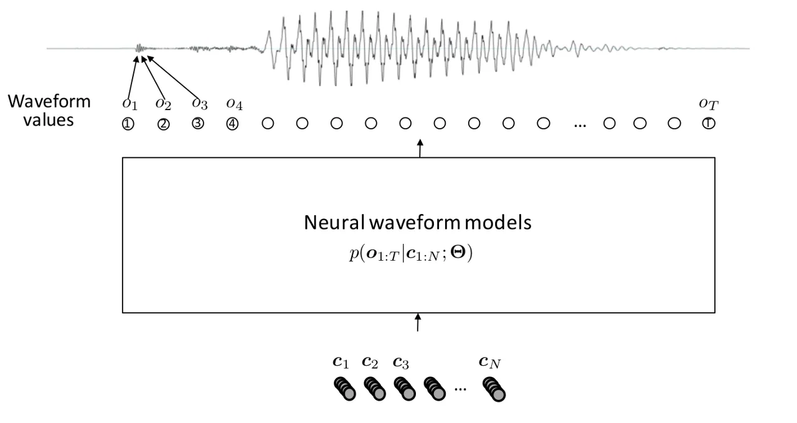

Σχ\acctonosηµα 3: Neural Vocoders
([Source](https://www.slideshare.net/jyamagis/tutorial-on-endtoend-texttospeech-synthesis-part-1-neural-waveform-modeling))

Παρ\acctonosατγεγν\acctonosς\acctonosτιυπαχυνπλυ\acctonosαριθµεςπρσεγγ\acctonosισεις,
τα βασικ\acctonosα δµικ\acctonosα στιχε\acctonosια πυ
τρππι\acctonosυνται ε\acctonosιναι:

- •
  ηαρχιτεκτνικ\acctonosητυµντ\acctonosελυαυτ\acctonosυκαθἀυτ\acctonosυ
  (π.χ dilated convolutions, normalizing flow, GAN)
- •
  η/ι συν\acctonosαρτηση/εις κ\acctonosστυς πυ χρησιµπι\acctonosυνται
  (loss functions)
- •
  επιπλ\acctonosενµετασχηµατισµ\acctonosιπυµετασχηµατ\acctonosιζυντπρ\acctonosβληµασεκ\acctonosαπιπιαπλ\acctonos(knowledge-based
  transforms)

Αφ\acctonosυπεριγρ\acctonosαψαµεταδµικ\acctonosαστιχε\acctonosιατωνπρσεγγ\acctonosισεωνπαραθ\acctonosετυµεεπιγραµµατικ\acctonosακαιτιςεπιµ\acctonosερυςπρσεγγ\acctonosισειςτιςπ\acctonosιεςστησυν\acctonosεχειαπαρυσι\acctonosαζυµεσεµεγαλ\acctonosυτερβ\acctonosαθς.
Αρχικ\acctonosα θα παρυσι\acctonosασυµε τις λεγ\acctonosµενες
αυτπαλινδρµικ\acctonosες µεθ\acctonosδυς (autoregressive) \[Van den Oord
et al., 2016\], ι π\acctonosιες κ\acctonosανυν χρ\acctonosηση dilated
convolutions και ε\acctonosιναι ι πρ\acctonosωτες πυ παρυσ\acctonosιασαν
απτελ\acctonosεσµατα πυ πρσεγγ\acctonosιζυν τ ανθρ\acctonosωπιν
σ\acctonosυστηµα παραγωγ\acctonosης φων\acctonosης, απ\acctonos
\acctonosαπψη πι\acctonosτητας. Ακλυθ\acctonosυν ι µ\acctonosεθδι
βασισµ\acctonosενες σε µντ\acctonosελα καννικπιηµ\acctonosενης
ρ\acctonosης (normalizing flow) \[Rezende and Mohamed, 2015, Kingma et
al., 2016, Papamakarios et al., 2017\], ι π\acctonosιες
µετασχηµατ\acctonosιζυν τ τελικ\acctonos πρ\acctonosβληµα σε πι
απλ\acctonosα εφαρµ\acctonosζντας διαδχικ\acctonosυς
µετασχηµατισµ\acctonosυς σε µια κατανµ\acctonosη πιθαν\acctonosτητας και
τ\acctonosελς θα παρυσι\acctonosασυµε κ\acctonosαπιες µεθ\acctonosδυς πυ
βασ\acctonosιζνται στα περ\acctonosιφηµα Generative Adversarial Networks
(GANs) \[Goodfellow et al., 2014\].

#### 2.1.1 Autoregressive Models

Η πρ\acctonosωτη δυλει\acctonosα στ πεδ\acctonosι αυτ\acctonos, πυ
εισ\acctonosηγαγε η DeepMind, ε\acctonosιναι τ περ\acctonosιφηµ WaveNet
\[Oord et al., 2016\] τ π\acctonosι υσιαστικ\acctonosα ε\acctonosιναι
\acctonosενα πλ\acctonosηρως πιθανκρατικ\acctonos (probabilistic) και
autoregressive µντ\acctonosελ. Με \acctonosαλλα λ\acctonosγια,
κ\acctonosαθε \acctonosεξδς ε\acctonosιναι µια κατανµ\acctonosη
πιθαν\acctonosτητας π\acctonosανω στα δυνατ\acctonosα δε\acctonosιγµατα
της κυµατµρφ\acctonosης και ταυτ\acctonosχρνα εξαρτ\acctonosαται
απ\acctonos τα δε\acctonosιγµατα \acctonosλων των πρηγ\acctonosυµενων
χρνικ\acctonosων βηµ\acctonosατων.

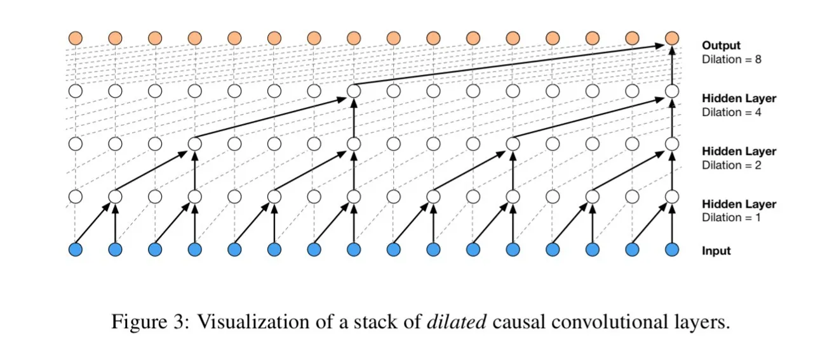

Σχ\acctonosηµα 4: Dilated Convolutions from \[Oord et al., 2016\]

Πρκειµ\acctonosενυναµντελπιηθ\acctonosυνιπλ\acctonosυµακρχρ\acctonosνιεςεξαρτ\acctonosησεις(long-time
dependencies) πυ εµφαν\acctonosιζνται στα ηχητικ\acctonosα
σ\acctonosηµατα, ι συγγραφε\acctonosις χρησιµπ\acctonosιησαν τις
λεγ\acctonosµενες διεσταλµ\acctonosενες συνελ\acctonosιξεις (dilated³³ 3
Στηβιβλιγραφ\acctonosιααναφ\acctonosερνταικαιωςa-trous πυ στη
γαλλικ\acctonosη σηµα\acctonosινει “µε τρ\acctonosυπες”. convolutions).
Η βασικ\acctonosη τυς τρππ\acctonosιηση \acctonosεναντι τυ
κλασικ\acctonosυ CNN \[LeCun et al., 1998\] ε\acctonosιναι πως
αυξ\acctonosανυν τ δεκτικ\acctonos πεδ\acctonosι (resceptive field) και
συνεπ\acctonosως τυς δ\acctonosινει τη δυνατ\acctonosτητα να
σχετ\acctonosιζυν δε\acctonosιγµατα της εισ\acctonosδυ τα π\acctonosια
απ\acctonosεχυν πλ\acctonosυ στη χρνικ\acctonosη δι\acctonosασταση.
Φυσικ\acctonosα \acctonosλα αυτ\acctonosα για να επιτευχθ\acctonosυν
απαιτ\acctonosυν αρκετ\acctonosα επ\acctonosιπεδα αυξ\acctonosανντας
κατ\acctonosα πλ\acctonosυ τις παραµ\acctonosετρυς τυ µντ\acctonosελυ.
Σχηµατικ\acctonosα η βασικ\acctonosη ιδ\acctonosεα φα\acctonosινεται και
στ Σχ\acctonosηµα 4.

βασικ\acctonosςλ\acctonosγςγιατηδηµτικ\acctonosτητατυWaveNet
ε\acctonosιναι η παραγωγ\acctonosη φων\acctonosης υψηλ\acctonosης
πι\acctonosτητας, της π\acctonosιας η φυσικ\acctonosτητα
πρσεγγ\acctonosιζει ανθρ\acctonosωπινα επ\acctonosιπεδα. Παρ\acctonosλα
αυτ\acctonosα τ WaveNet π\acctonosασχει απ\acctonos δ\acctonosυ
πλ\acctonosυ σβαρ\acctonosα ζητ\acctonosηµατα. Τ πρ\acctonosωτ
ε\acctonosιναι η χρ\acctonosηση πλλαπλ\acctonosων συναρτ\acctonosησεων
κ\acctonosστυς (loss functions) κατ\acctonosα τη δι\acctonosαρκεια της
εκπα\acctonosιδευσης τυ δικτ\acctonosυυ πυ µπρε\acctonosι να
δηγ\acctonosησει σε αστ\acctonosαθειες \acctonosη σε
τετριµµ\acctonosενες λ\acctonosυσεις υψηλ\acctonosης εντρπ\acctonosιας
(mode collapse) εαν δεν σταθµιστ\acctonosυν σωστ\acctonosα. Τ
δε\acctonosυτερ και \acctonosισως πι ενδιαφ\acctonosερν απ\acctonos
πρακτικ\acctonosη σκπι\acctonosα ε\acctonosιναι η υπερβλικ\acctonosα
αργ\acctonosη παραγωγ\acctonosη ν\acctonosεων δειγµ\acctonosατων.

Εστι\acctonosαζυµεστo δε\acctonosυτερ µειν\acctonosεκτηµα, τ π\acctonosι
ε\acctonosιναι εγγεν\acctonosες χαρακτηριστικ\acctonos της
autoregressive φ\acctonosυσης τυ δικτ\acctonosυυ. Μπρε\acctonosι
κατ\acctonosα τη δι\acctonosαρκεια της εκπα\acctonosιδευσης τ
πρ\acctonosβληµα αυτ\acctonos να µην ε\acctonosιναι εµφαν\acctonosες
καθ\acctonosως µας δ\acctonosιδεται η κυµατµρφ\acctonosη εξ\acctonosδυ
και συνεπ\acctonosως \acctonosλι ι υπλγισµ\acctonosι µπρ\acctonosυν να
παραλληλπιηθ\acctonosυν, παρ\acctonosλα αυτ\acctonosα κατ\acctonosα τη
δι\acctonosαρκεια σ\acctonosυνθεσης θα πρ\acctonosεπει να
περιµ\acctonosενυµε τ δ\acctonosικτυ να παρ\acctonosαξει \acctonosενα
δε\acctonosιγµα πρκειµ\acctonosενυ να παρ\acctonosαξυµε τ
επ\acctonosµεν. Συνεπ\acctonosως η διαδικασ\acctonosια σ\acctonosυνθεσης
δεν µπρε\acctonosι να παραλληλπιηθε\acctonosι. ι τρ\acctonosπι πυ
\acctonosεχυνε πρταθε\acctonosι στη βιβλιγραφ\acctonosια για να
αντιµετωπιστ\acctonosυν τα πρβλ\acctonosηµατα αργ\acctonosης
σ\acctonosυνθεσης χωρ\acctonosιζνται σε µεθ\acctonosδυς πυ
τε\acctonosινυν να παραλληλπι\acctonosησυν \acctonosη/και να
απλπι\acctonosησυν τυς εµπλεκ\acctonosµενυς υπλγισµ\acctonosυς
(engineering based acceleration) και σε µεθ\acctonosδυς πυ
τε\acctonosινυν να χρησιµπι\acctonosησυν κ\acctonosαπια γν\acctonosωση
απ\acctonos πεδ\acctonosια \acctonosπως η επεξεργασ\acctonosια
σ\acctonosηµατς (knowledge-based acceleration).

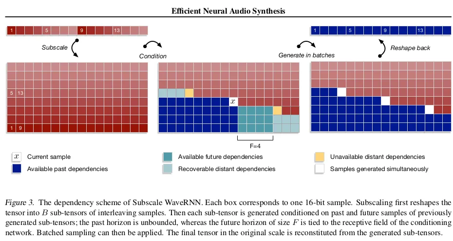

Σχ\acctonosηµα 5: WaveRNN batch generation trick \[Kalchbrenner et al.,
2018\]

Engineering Based Acceleration. Σε αυτ\acctonosη την κατηγρ\acctonosια
αν\acctonosηκει τ WaveRNN \[Kalchbrenner et al., 2018\] πυ
ε\acctonosιναι µια πι απδτικ\acctonosη πρσ\acctonosεγγιση τυ
αρχικ\acctonosυ WaveNet. Η βασικ\acctonosη ιδ\acctonosεα π\acctonosισω
απ\acctonos αυτ\acctonosη την πρσ\acctonosεγγιση ε\acctonosιναι πως
µπρ\acctonosυµε να παρ\acctonosαξυµε πλλαπλ\acctonosα δε\acctonosιγµατα
την \acctonosιδια χρνικ\acctonosη στιγµ\acctonosη. \acctonosΑρα
αν\acctonosαλγα µε τ π\acctonosσα δε\acctonosιγµατα επιλ\acctonosεγυµε
να παρ\acctonosαξυµε σε κ\acctonosαθε β\acctonosηµα τ\acctonosσ πι
γρ\acctonosηγρη γ\acctonosινεται η πρσ\acctonosεγγισ\acctonosη µας.
Φυσικ\acctonosα υπ\acctonosαρχει \acctonosενα trade-off µεταξ\acctonosυ
τυ πλ\acctonosηθυς των παραγ\acctonosµενων δειγµ\acctonosατων και της
τελικ\acctonosης πι\acctonosτητας. Σχηµατικ\acctonosα η
πρσ\acctonosεγγιση \acctonosπως παρυσι\acctonosαστηκε στην
πρωτ\acctonosτυπη εργασ\acctonosια φα\acctonosινεται στ Σχ\acctonosηµα 5.

Μιαακ\acctonosµηπρσ\acctonosεγγισηπυνµ\acctonosαζεταιFFTNet \[Jin et
al., 2018\] χρησιµπιε\acctonosι \acctonosενα trick πυ θυµ\acctonosιζει
τν κλασικ\acctonos αλγ\acctonosριθµ FFT \[Cooley and Tukey, 1965\] µιας
και χωρ\acctonosιζει τα στιχε\acctonosια εισ\acctonosδυ σε δ\acctonosυ
υπκατηγρ\acctonosιες πυ η κ\acctonosαθε µια περι\acctonosεχει τ
µισ\acctonos τυ αρχικ\acctonosυ αριθµ\acctonosυ δειγµ\acctonosατων. Τ
“σπ\acctonosασιµ" αυτ\acctonos µας επιτρ\acctonosεπει να
υπλγ\acctonosισυµε τις τελικ\acctonosες πσ\acctonosτητες µε
παρ\acctonosαλληλ τρ\acctonosπ.

Knowledge Based Acceleration. Μια υπσχ\acctonosµενη πρσ\acctonosεγγιση
ε\acctonosιναι τ LPCNet \[Valin and Skoglund, 2019\] τ π\acctonosι,
\acctonosπως υπδεικν\acctonosυεται απ\acctonos τ \acctonosνµ\acctonosα
τυ, συνδυ\acctonosαζει τη γνωστ\acctonosη LPC µ\acctonosεθδ απ\acctonos
την επεξεργασ\acctonosια σηµ\acctonosατων \[O’Shaughnessy, 1988\] µε τ
WaveRNN, πρκειµ\acctonosενυ να αφαιρ\acctonosεσει ρισµ\acctonosεν
υπλγιστικ\acctonos φ\acctonosρτ απ\acctonos την αρχικ\acctonosη
αρχιτεκτνικ\acctonosη µε απ\acctonosωτερ σκπ\acctonos να κ\acctonosανει
την εκπα\acctonosιδευση “ευκλ\acctonosτερη" και να δηµιυργ\acctonosησει
γρηγρ\acctonosτερη παραγωγ\acctonosη ν\acctonosεων δειγµ\acctonosατων.

#### 2.1.2 Normalizing Flow Approaches

Αυτ\acctonosη η εν\acctonosτητα εισ\acctonosαγει vocoders πυ
εκµεταλλε\acctonosυνται \acctonosενα ισχυρ\acctonos στατιστικ\acctonos
εργαλε\acctonosι, τ π\acctonosι χρησιµπιε\acctonosιται για την
εκτ\acctonosιµηση της πυκν\acctonosτητας (density estimation) και
νµ\acctonosαζεται µαλπιµ\acctonosενη ρ\acctonosη (normalizing flow).
\acctonosΕνα γενετικ\acctonos (generative) µντ\acctonosελ
βασισµ\acctonosεν στη µ\acctonosεθδ normalizing-flow
κατασκευ\acctonosαζεται ως µε µια ακλυθ\acctonosια διαδχικ\acctonosων
αναστρ\acctonosεψιµων µετασχηµατισµ\acctonosων \[Rezende and Mohamed,
2015, Kingma and Dhariwal, 2018\]. Σε γενικ\acctonosες γραµµ\acctonosες,
αυτ\acctonosα τα µντ\acctonosελα µαθα\acctonosινυν ρητ\acctonosα
(explicitly) την κατανµ\acctonosη δεδµ\acctonosενων $`p(x)`$ και
επµ\acctonosενως η συν\acctonosαρτηση κ\acctonosστυς (loss function)
ε\acctonosιναι απλ\acctonosως η negative-log-likelihood.

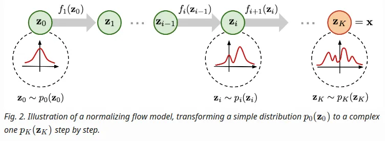

Σχ\acctonosηµα 6: Normalizing Flow: Εκκιν\acctonosωντας απ\acctonos µια
απλ\acctonosη κατανµ\acctonosη $`p_{0}`$ και εφαρµ\acctonosζντας
διαδχικ\acctonosυς µετασχηµατισµ\acctonosυς ι π\acctonosιι
εκπαιδε\acctonosυνται ($`f_{i}`$) καταλ\acctonosηγυµε σε µια
πρσ\acctonosεγγιση της υπ\acctonos εξ\acctonosετασης κατανµ\acctonosης
$`x`$.
([Source](https://lilianweng.github.io/lil-log/2018/10/13/flow-based-deep-generative-models.html))

Στπλα\acctonosισιτυπρβλ\acctonosηµατςσ\acctonosυνθεσηςµιλ\acctonosιαςαπ\acctonosκε\acctonosιµεν(TTS),
η ιδ\acctonosεα των normalizing flows εισ\acctonosαγεται
πρκειµ\acctonosενυ να “απλπιηθε\acctonosι" η απεικ\acctonosνιση πυ
καλε\acctonosιται να µ\acctonosαθει τ δ\acctonosικτυ, \acctonosπως
φα\acctonosινεται στ Σχ\acctonosηµα 7. Αυτ\acctonos µπρ\acctonosυµε να τ
επιτ\acctonosυχυµε εφαρµ\acctonosζντας πλλαπλ\acctonosυς
(αντ\acctonosιστρφυς) µετασχηµατισµ\acctonosυς µαλπ\acctonosιησης
ρ\acctonosης (normalizing flow) στ one-hot διαν\acctonosυσµατα της
εξ\acctonosδυ $`\mathbf{o}`$. Η δια\acctonosισθηση π\acctonosισω
απ\acctonos αυτ\acctonos ε\acctonosιναι \acctonosτι
µετασχηµατ\acctonosιζυµε ι ακλυθ\acctonosιες µε ισχυρ\acctonosη
χρνικ\acctonosη συσχ\acctonosετιση σε ακλυθ\acctonosιες µε
ασθεν\acctonosεστερυς χρνικ\acctonosυς συσχετισµ\acctonosυς,
απλπι\acctonosωντας \acctonosετσι την διαδικασ\acctonosια
σ\acctonosυνθεσης.

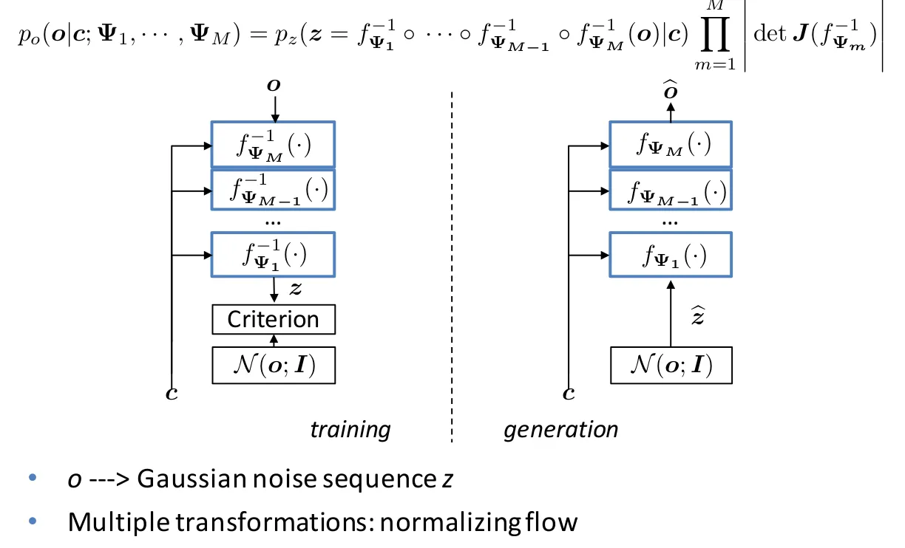

Σχ\acctonosηµα 7: Normalizing Flow TTS
([Source](https://www.slideshare.net/jyamagis/tutorial-on-endtoend-texttospeech-synthesis-part-1-neural-waveform-modeling))

Θαπρ\acctonosεπεινασηµειωθε\acctonosι\acctonosτιηεπιλγ\acctonosηδιαφρετικ\acctonosωνεπιµ\acctonosερυςµετασχηµατισµ\acctonosων$`f_{\Psi_{m}}(\cdot)`$
απφ\acctonosερει φυσικ\acctonosα διαφρετικ\acctonosες χρνικ\acctonosες
πλυπλκ\acctonosτητες και επµ\acctonosενως διαφρετικ\acctonosες
στρατηγικ\acctonosες εκπα\acctonosιδευσης. Για να συνδ\acctonosεσυµε την
παρ\acctonosυσα πρσ\acctonosεγγιση µε την αρχιτεκτνικ\acctonosη WaveNet
κ\acctonosανυµε τις εξ\acctonosης δ\acctonosυ παρατηρ\acctonosησεις. Τ
WaveNet ε\acctonosιναι πλ\acctonosηρως παραλληλπι\acctonosησµι
κατ\acctonosα τη δι\acctonosαρκεια της εκπα\acctonosιδευσης
(λ\acctonosγω της συνελικτικ\acctonosης τυ φ\acctonosυσης) απ\acctonos
τη στιγµ\acctonosη πυ δ\acctonosινεται η κυµατµρφ\acctonosη
εξ\acctonosδυ. Αυτ\acctonos δεν συµβα\acctonosινει µε τη
σ\acctonosυνθεση ωστ\acctonosσ, \acctonosπυ η πλ\acctonosηρης
κυµατµρφ\acctonosη δεν ε\acctonosιναι διαθ\acctonosεσιµη και
πρ\acctonosεπει να περιµ\acctonosενυµε να δηµιυργηθε\acctonosι
\acctonosενα δε\acctonosιγµα για να πρχωρ\acctonosησυµε στ
επ\acctonosµεν.

Ταµντ\acctonosελαInverse Autoregressive Flow (IAF) \[Kingma et al.,
2016\] \acctonosπως αυτ\acctonosα πυ περιγρ\acctonosαφνται σε
αυτ\acctonosην την εν\acctonosτητα συµπεριφ\acctonosερνται µε
δυ\accdialytikaικ\acctonos τρ\acctonosπ. Συγκεκριµ\acctonosενα
παρυσι\acctonosαζυν χαµηλ\acctonosτερη ταχ\acctonosυτητα
εκαπ\acctonosιδευσης και υψηλ\acctonosτερη ταχ\acctonosυτητα
σ\acctonosυνθεσης. Αυτ\acctonos συµβα\acctonosινει δι\acctonosτι ι
πλλαπλ\acctonosι µετασχηµατισµ\acctonosι πυ εισ\acctonosαγνται
αυξ\acctonosανυν την πλυπλκ\acctonosτητα τυ µντ\acctonosελυ µε
απτ\acctonosελεσµα να ε\acctonosιναι πι δ\acctonosυσκλ για τ
µντ\acctonosελ να µ\acctonosαθει τυς κατ\acctonosαλληλυς normalizing
flow µετασχηµατισµ\acctonosυς. Εαν \acctonosµως ι ενδι\acctonosαµεσι
µετασχηµατισµ\acctonosι \acctonosηταν γνωστ\acctonosι µε κ\acctonosαπι
τρ\acctonosπ τ\acctonosτε η διαδικασ\acctonosια της σ\acctonosυνθεσης θα
\acctonosηταν πλ\acctonosυ πι απλ\acctonosη.

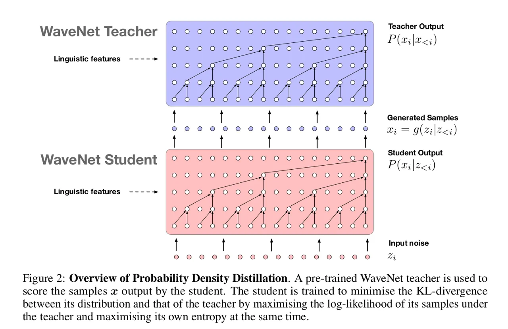

Σχ\acctonosηµα 8: Parallel WaveNet \[Oord et al., 2017\]

ΤParallelWaveNet \[Oord et al., 2017\] ε\acctonosιναι µια
δυλει\acctonosα απ\acctonos τυς \acctonosιδιυς συγγραφε\acctonosις µε τ
αρχικ\acctonos WaveNet. Σε αυτ\acctonosην εισ\acctonosαγεται η
λεγ\acctonosµενη Probability Density Distillation πυ στχε\acctonosυει να
συνδυ\acctonosασει τα πλενεκτ\acctonosηµατα και απ\acctonos τα
δ\acctonosυ µντ\acctonosελα. Με \acctonosαλλα λ\acctonosγια,
δεδµ\acctonosενυ εν\acctonosς πρ-εκπαιδευµ\acctonosενυ WaveNet (parent),
εκπαιδε\acctonosυει \acctonosενα IAF WaveNet, \acctonosπως
φα\acctonosινεται στ Σχ\acctonosηµα 8. H τεχνικ\acctonosη knowledge
distillation \[Ba and Caruana, 2014, Hinton et al., 2015\]
επιταχ\acctonosυνει τη διαδικασ\acctonosια εκπα\acctonosιδευσης,
καθ\acctonosως ι ενδι\acctonosαµεσες κατανµ\acctonosες δ\acctonosιννται
τ\acctonosωρα απ\acctonos τ parent (γνικ\acctonos) µντ\acctonosελ σε
\acctonosλες τις ενδι\acctonosαµεσες ρ\acctonosες. Αυτ\acctonos
\acctonosεχει ως απτ\acctonosελεσµα την αρκετ\acctonosα
ταχ\acctonosυτερη εκπα\acctonosιδευση καθ\acctonosως επ\acctonosισης και
την ταχ\acctonosυτερη σ\acctonosυνθεση φων\acctonosης.

Μιαακ\acctonosµηπιαπτελεσµατικ\acctonosηπρσ\acctonosεγγισηεισ\acctonosηχθηµ\acctonosεσωτυλεγ\acctonosµενυClariNet
\[Ping et al., 2019\], η π\acctonosια σε αντ\acctonosιθεση µε τυς
συγγραφε\acctonosις τυ Parallel WaveNet, χρησιµπιε\acctonosι
αρκετ\acctonosα απλ\acctonosυστερυς ενδι\acctonosαµεσυς
µετασχηµατισµ\acctonosυς και συγκεκριµ\acctonosενα διαδχικ\acctonosυς
Gaussian. H διαδικασ\acctonosια εκµ\acctonosαθησης των
αντ\acctonosιστιχων παραµ\acctonosετρων \acctonosεγκειται στην
ελαχιτπ\acctonosιηση µιας µαλπιηµ\acctonosενης (regularized)
KL-divergence (απ\acctonosκλιση) µεταξ\acctonosυ των υψηλ\acctonosων
κρυφ\acctonosων των κατανµ\acctonosων εξ\acctonosδων τυς.

Σ\acctonosυγκριση Parallel WaveNet και ClariNet. Παρ\acctonosλ πυ και τα
δ\acctonosυ δ\acctonosικτυα συνθ\acctonosετυν την µιλ\acctonosια µε
παρ\acctonosαλληλ τρ\acctonosπ, χρει\acctonosαζνται πλλαπλ\acctonosες
συναρτ\acctonosησεις κ\acctonosστυς (loss functions) για να
δηµιυργ\acctonosησυν ρεαλιστικ\acctonosη µιλ\acctonosια \[Oord et al.,
2017, Ping et al., 2019\] (η βιβλιγραφ\acctonosια αναφ\acctonosερει τ
πρ\acctonosβληµα “ρµπτικ\acctonosης-µεταλλικ\acctonosης" φων\acctonosης
ως τ συνηθ\acctonosεστερ) και για να απφ\acctonosυγυν πρβλ\acctonosηµατα
mode collapse. Επιπλ\acctonosεν, τ Parallel WaveNet χρησιµπιε\acctonosι
µια Mixture of Logistics (MoL) κατανµ\acctonosη για τν
πρ-εκπαιδευµ\acctonosεν parent WaveNet. Η κατανµ\acctonosη αυτ\acctonosη
\acctonosµως δεν διαθ\acctonosετει λ\acctonosυση κλειστ\acctonosης
µρφ\acctonosης για την απ\acctonosκλιση KL και αντἀυτ\acctonosυ
χρησιµπιε\acctonosιται εκτ\acctonosιµηση τ\acctonosυπυ Monte Carlo
\[Ceperley et al., 1977, Doubilet et al., 1985\]. Η πρσ\acctonosεγγιση
Monte Carlo αναπ\acctonosφευκτα εισ\acctonosαγει µια ανταλλαγ\acctonosη
(trade-off) µεταξ\acctonosυ σταθερ\acctonosτητας και ταχ\acctonosυτητας.
Τ ClariNet, απ\acctonos την \acctonosαλλη πλευρ\acctonosα,
πρ\acctonosτεινε τη χρ\acctonosηση µιας και µ\acctonosν
κατανµ\acctonosης Gauss, η KL απ\acctonosκλιση της π\acctonosιας
εκφρ\acctonosαζεται µε κλειστ\acctonosη µρφ\acctonosη και παρ\acctonosτι
πι απλ\acctonosη επιλ\acctonosυει µερικ\acctonosως την αστ\acctonosαθεια
πυ εισ\acctonosαγει η πρσ\acctonosεγγιση τυ Monte Carlo πυ
κ\acctonosανει χρ\acctonosηση τ Parallel WaveNet.

Επιλ\acctonosυντας πρβλ\acctonosηµατα αστ\acctonosαθειας. Με
σκπ\acctonos τ\acctonosωρα να αντιµετωπιστε\acctonosι τ πρ\acctonosβληµα
της αστ\acctonosαθειας κατ\acctonosα τη δι\acctonosαρκεια της
εκπα\acctonosιδευσης \acctonosεχυν πρταθε\acctonosι κ\acctonosαπιες
ακ\acctonosµα µ\acctonosεθδι, ι π\acctonosιες επ\acctonosισης
βασ\acctonosιζνται στη µ\acctonosεθδ normalizing flow.
Συγκεκριµ\acctonosενα µντ\acctonosελα \acctonosπως τ WaveGlow \[Prenger
et al., 2018\], τ FloWaveNet \[Kim et al., 2019\] και µετ\acctonosεπειτα
τ WaveFlow \[Ping et al., 2020\]. Αυτ\acctonosα τα µντ\acctonosελα
δηµιυργ\acctonosυν ταχ\acctonosυτερη σ\acctonosυνθεση και
εκπα\acctonosιδευση σε επ\acctonosιπεδ εν\acctonosς σταδ\acctonosιυ,
χρησιµπι\acctonosωντας µια µναδικ\acctonosη συν\acctonosαρτηση
κ\acctonosστυς. Η χρ\acctonosηση εν\acctonosς µ\acctonosν loss function
αντιµετωπ\acctonosιζει επιτυχ\acctonosως τα ζητ\acctonosηµατα
σταθερ\acctonosτητας κατ\acctonosα τη δι\acctonosαρκεια
εκπα\acctonosιδευσης. Ωστ\acctonosσ, λ\acctonosγω της απυσ\acctonosιας
εν\acctonosς γνικ\acctonosυ µντ\acctonosελυ, η διαδικασ\acctonosια
εκπα\acctonosιδευσης διαρκε\acctonosι περισσ\acctonosτερ απ\acctonos
εκε\acctonosινη των αντ\acctonosιστιχων distillation
πρσεγγ\acctonosισεων (Parallel WaveNet, ClariNet). Μια βασικ\acctonosη
ιδ\acctonosεα π\acctonosισω απ\acctonos αµφ\acctonosτερες τις
πρσεγγ\acctonosισεις (WaveGlow, FloWaveNet) πυ βασ\acctonosιζνται σε
normalizing flows ε\acctonosιναι τελεστ\acctonosης squeeze. Στην
υσ\acctonosια η πρ\acctonosαξη αυτ\acctonosη µαδπιε\acctonosι τα
ηχητικ\acctonosα δε\acctonosιγµατα σε επιµ\acctonosερυς groups. Στ
WaveGlow συγκεκριµ\acctonosενα µαδπι\acctonosυνται τα δε\acctonosιγµατα
αν\acctonosα $`8`$, εν\acctonosω στ FloWaveNet µαδπι\acctonosυνται σε
\acctonosαρτια και περριτ\acctonosα. To WaveFlow µε τη σειρ\acctonosα τυ
παρ\acctonosεχει µια ενπιηµ\acctonosενη πρσ\acctonosεγγιση η
π\acctonosια περι\acctonosεχει τ\acctonosσ τ WaveNet \acctonosσ και τ
WaveGlow σαν ειδικ\acctonosες περιπτ\acctonosωσεις. Μελετ\acctonosα στην
υσ\acctonosια τ trade-off µεταξ\acctonosυ παραλληλπ\acctonosιησης και
χωρητικ\acctonosτητας δικτ\acctonosυυ. Σχηµατικ\acctonosα
παραθ\acctonosετυµε τ squeeze operation πυ υλπιε\acctonosι τ WaveGlow
καθ\acctonosως επ\acctonosισης και \acctonosενα δµικ\acctonos
στιχε\acctonosι της αρχιτεκτνικ\acctonosης τυ.

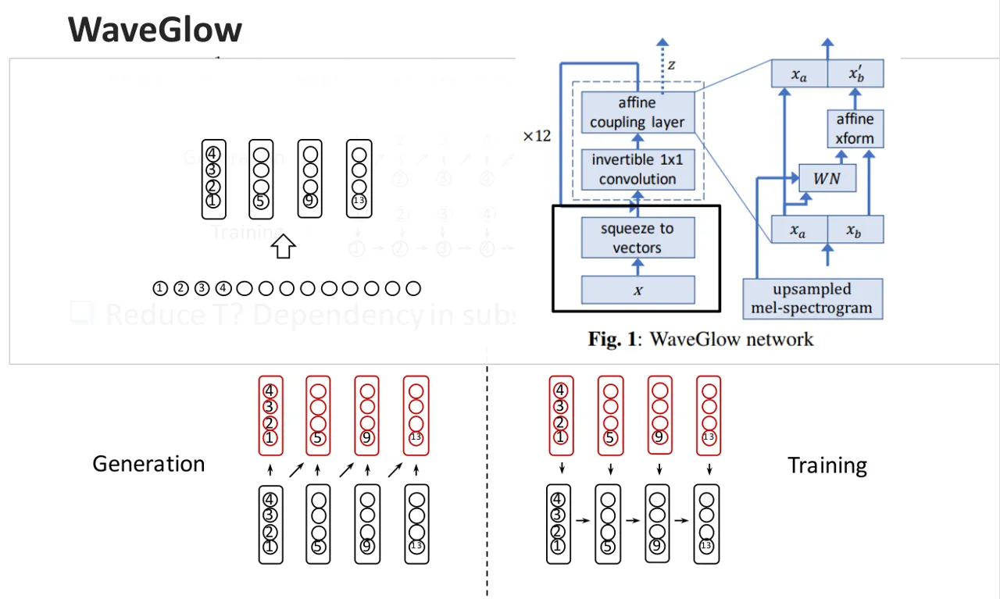

Σχ\acctonosηµα 9: Wave Glow squeeze operation
([Source](https://www.slideshare.net/jyamagis/tutorial-on-endtoend-texttospeech-synthesis-part-1-neural-waveform-modeling))

#### 2.1.3 GAN-based Πρσεγγ\acctonosισεις

Στην εν\acctonosτητα αυτ\acctonosη παρυσι\acctonosαζνται
εργασ\acctonosιες ι π\acctonosιες στηρ\acctonosιζνται στα
λεγ\acctonosµενα Generative Adversarial Networks (GANs) \[Goodfellow et
al., 2014\] τα π\acctonosια εισ\acctonosηχθησαν τ 2014 και
\acctonosεκττε \acctonosεχυν βρει ευρ\acctonosυτατη εφαρµγ\acctonosη
στην \acctonosραση υπλγιστ\acctonosων.

Παρ\acctonosλααυτ\acctonosα, η εφαρµγ\acctonosη τυς στ πεδ\acctonosι της
µντελπ\acctonosιησης \acctonosηχυ/φων\acctonosης ε\acctonosιναι
µ\acctonosεχρι και σ\acctonosηµερα αρκετ\acctonosα περιρισµ\acctonosενη.
Συγκεκριµ\acctonosενα πρτ\acctonosαθηκε µια αρχιτεκτνικ\acctonosη
υπ\acctonos τ \acctonosνµα GANSynth \[Engel et al., 2019\], η
π\acctonosια χρησιµπιε\acctonosιται για να παρ\acctonosαγει µε
συνθετικ\acctonos τρ\acctonosπ διαφρετικ\acctonosα µυσικ\acctonosα
ηχχρ\acctonosωµατα µντελπι\acctonosωντας STFT µ\acctonosετρα και
φ\acctonosασεις⁴⁴ 4 i.e magnitudes and angles of a complex number.. Mια
\acctonosαλλη πρσ\acctonosεγγιση \[Neekhara et al., 2019\]
απεικν\acctonosιζει mel-specs σε απλ\acctonosα magnitude spectorgrams
στα π\acctonosια µπρ\acctonosυν να εφαρµστ\acctonosυν κατ\acctonosαλληλι
αλγ\acctonosρθµι αν\acctonosακτησης φ\acctonosασης µε απ\acctonosωτερ
σκπ\acctonos την ανακατασκευ\acctonosη τυ αρχικ\acctonosυ
σ\acctonosηµατς.

Μιαεργασ\acctonosιαπυεφ\acctonosαπτεταιστααντικε\acctonosιµεναπυπραγµατε\acctonosυεταιηπαρ\acctonosυσαβιβλιγραφικ\acctonosηανασκ\acctonosπησηχρησιµπιε\acctonosι\acctonosεναGAN
για να κ\acctonosανει distill \acctonosενα autoregressive µντ\acctonosελ
πυ παρ\acctonosαγει συνθετικ\acctonosη φων\acctonosη \[Yamamoto et al.,
2019\]. Παρ\acctonosλα αυτ\acctonosα τα πειραµατικ\acctonosα τυς
απτελ\acctonosεσµατα \acctonosεδειξαν πως χρησιµπι\acctonosωντας
\acctonosενα adversarial loss απ\acctonos µ\acctonosν τυ δεν
ε\acctonosιναι αρκετ\acctonos για να συνθ\acctonosεσει υψηλ\acctonosης
πι\acctonosτητας κυµατµρφ\acctonosες.

Ηπισχετικ\acctonosηεργασ\acctonosια\[Kumar et al., 2019\] στη
σ\acctonosυνθεση φων\acctonosης νµ\acctonosαζεται MelGAN και
υσιαστικ\acctonosα εισ\acctonosαγει µια non-autoregressive
πλ\acctonosηρως συνελικτικ\acctonosη πρσ\acctonosεγγιση πυ
παρ\acctonosαγει κυµατµρφ\acctonosες σε \acctonosενα GAN setup. Η
πρσ\acctonosεγγιση αυτ\acctonosη ε\acctonosιναι αρκετ\acctonosα πι
γρ\acctonosηγρη στην παραγωγ\acctonosη φων\acctonosης απ’\acctonosτι ι
αντ\acctonosιστιχες autoregressive και περι\acctonosεχει πλ\acctonosυ
λιγ\acctonosτερες παραµ\acctonosετρυς.

Συγκεκριµ\acctonosεναγ\acctonosινεταιλ\acctonosγςγια$`24.7`$ m.
παραµ\acctonosετρυς στ WaveNet \[Shen et al., 2018\], για $`10`$ m.
παραµ\acctonosετρυς στ ClariNet \[Ping et al., 2019\] και για $`87.9`$ m
παραµ\acctonosετρυς στ WaveGlow \[Prenger et al., 2018\], µε τ WaveGlow
να δ\acctonosινει τις καλ\acctonosυτερες επιδ\acctonosσεις απ\acctonos
\acctonosαπψη ταχ\acctonosυτητας σ\acctonosυνθεσης. To MelGAN
\acctonosεχει τ\acctonosσ µικρ\acctonosτερ αριθµ\acctonos
παραµ\acctonosετρων ($`4.26`$ m), \acctonosσ και πλ\acctonosυ
υψηλ\acctonosτερη ταχ\acctonosυτητα παραγωγ\acctonosης
κυµατµρφ\acctonosων.

H αρχιτεκτνικ\acctonosη τυ MelGAN απτελε\acctonosιται πρφαν\acctonosως
απ\acctonos \acctonosεναν generator καθ\acctonosως και \acctonosεναν
discriminator. Σε \acctonosτι αφρ\acctonosα τ generator ι
συγγραφε\acctonosις αναφ\acctonosερυν \acctonosτι τα επιµ\acctonosερυς
µεγ\acctonosεθη της αρχιτεκτνικ\acctonosης \acctonosεχυν
επιλεγε\acctonosι µε πλ\acctonosυ πρσεκτικ\acctonos τρ\acctonosπ
διαφρετικ\acctonosα η πρσ\acctonosεγγιση δεν \acctonosηταν
επιτυχ\acctonosης. Για τν discriminator αναφ\acctonosερεται πως
χρησιµπιε\acctonosιται µια multi-scale αρχιτεκτνικ\acctonosη πυ
περι\acctonosεχει 3 discriminators, καθ\acctonosενας απ\acctonos τυς
π\acctonosιυς αναλαµβ\acctonosανει \acctonosηχ διαφρετικ\acctonosης
κλ\acctonosιµακας (scale). Αναφ\acctonosερυµε επ\acctonosισης
\acctonosτι τα τελικ\acctonosα απτελ\acctonosεσµατα παραγωγ\acctonosης
φων\acctonosης κρ\acctonosιθηκαν υπδε\acctonosεστερα \acctonosαλλων
πρσεγγ\acctonosισεων \acctonosπως τ WaveGlow και τ WaveNet.

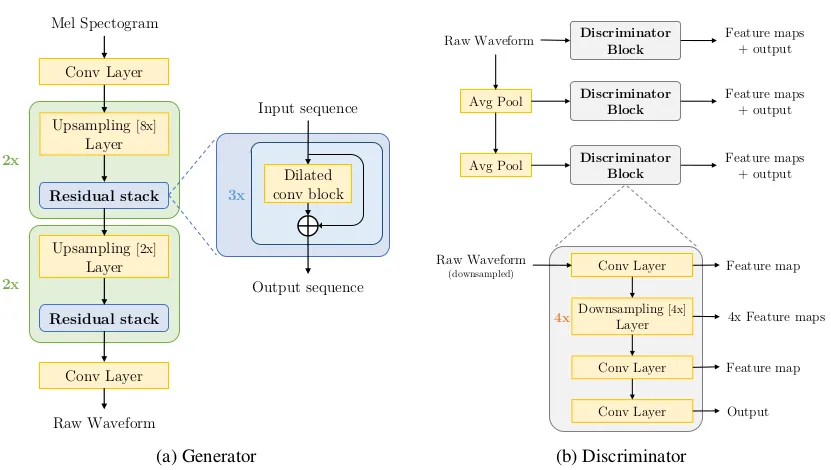

Σχ\acctonosηµα 10: MelGAN \[Kumar et al., 2019\]

Mια ακ\acctonosµα δυλει\acctonosα ε\acctonosιναι τ TTS-GAN \[Bińkowski
et al., 2019\] πυ υσιαστικ\acctonosα απτελε\acctonosι µια large-scale
πρσ\acctonosεγγιση τυ πρβλ\acctonosηµατς σ\acctonosυνθεσης
φων\acctonosης. Η υσιαστικ\acctonosη συνεισφρ\acctonosα ε\acctonosιναι
πρακτικ\acctonosα η εκπα\acctonosιδευση εν\acctonosς µεγ\acctonosαλης
κλ\acctonosιµακας GAN, µε 44h δεδµ\acctonosενων και batch size της
τ\acctonosαξης τυ 1024. Σε \acctonosτι αφρ\acctonosα τ generator
χρησιµπι\acctonosυνται 567 features ανα 5ms και σταδιακ\acctonosα
εφαρµ\acctonosζεται upsampling της αναπαρ\acctonosαστασης, εν\acctonosω
υπ\acctonosαρχυν παρ\acctonosαλληλα και residual συνδ\acctonosεσεις.
Συνλικ\acctonosα Generator περι\acctonosεχει 30 επ\acctonosιπεδα. Σε
\acctonosτι αφρ\acctonosα τν discriminator υσιαστικ\acctonosα
χρησιµπι\acctonosυνται πλλαπλ\acctonosι discriminators πυ
συγκρ\acctonosινυν τυχα\acctonosια τµ\acctonosηµατα µιας
κυµατµρφ\acctonosης για διαφρετικ\acctonosα χρνικ\acctonosα
παρ\acctonosαθυρα (µεταβλητ\acctonosτητα αν\acctonosαλυσης ως πρς τ
χρ\acctonosν).

### 2.2 Σ\acctonosυνψη

Στηνεν\acctonosτητααυτ\acctonosησυνψ\acctonosιζυµεταβασικ\acctonosαχαρακτηριστικ\acctonosατωνneural
vocoders πυ παρυσι\acctonosαστηκαν. Μια πρ\acctonosωτη
κατηγριπ\acctonosιηση µπρε\acctonosι να γ\acctonosινει µε β\acctonosαση
την αρχιτεκτνικ\acctonosη πρσ\acctonosεγγιση. Συγκεκριµ\acctonosενα
µπρ\acctonosυµε να π\acctonosυµε πως ι πρσεγγ\acctonosισεις
χωρ\acctonosιζνται σε τρε\acctonosις υπκατηγρ\acctonosιες i) τις
autoregressive, και τις non-autoregressive πυ χωρ\acctonosιζνται στις
ii) normalizing-flow και στις iii) GAN πρσεγγ\acctonosισεις.

Ωςπρςτηνπι\acctonosτητατηςπαραγ\acctonosµενηςσυνθετικ\acctonosηςφων\acctonosηςταρχικ\acctonosWaveNet
\[Oord et al., 2016\] ε\acctonosιναι µ\acctonosεχρι και σ\acctonosηµερα
η καλ\acctonosυτερη δυνατ\acctonosη πρσ\acctonosεγγιση. Παρ\acctonosλα
αυτ\acctonosα π\acctonosασχει απ\acctonos δ\acctonosυ πλ\acctonosυ
σβαρ\acctonosα ζητ\acctonosηµατα. Αφεν\acctonosς εξαιτ\acctonosιας της
autoregressive φ\acctonosυσης και των πλλ\acctonosων παραµ\acctonosετρων
παρυσι\acctonosαζει πλ\acctonosυ αργ\acctonosη σ\acctonosυνθεση
φων\acctonosης, καθιστ\acctonosωντας την ακατ\acctonosαλληλη
πρσ\acctonosεγγιση για real-time εφαρµγ\acctonosες εν\acctonosω
επιπλ\acctonosεν η εκπα\acctonosιδευση ε\acctonosιναι αρκετ\acctonosα
επ\acctonosιπνη καθ\acctonosως απαιτε\acctonosιται εκτεταµ\acctonosενη
αναζ\acctonosητηση κατ\acctonosαλληλων υπερπαραµ\acctonosετρων
\acctonosωστε η πρσ\acctonosεγγιση να συγκλ\acctonosινει
τελικ\acctonosα.

Γιατυςπαραπ\acctonosανωλ\acctonosγυς\acctonosεχυνπρταθε\acctonosιτ\acctonosσιπρσεγγ\acctonosισειςnormalizing
flow \acctonosπως και ι generative adversarial. Σε \acctonosτι
αφρ\acctonosα τις normalizing flow δυλει\acctonosες, ι
περισσ\acctonosτερες χρει\acctonosαζνται \acctonosενα
πρεκαπιδευµ\acctonosεν γν\acctonosεα WaveNet πρ\acctonosαγµα πυ
αυτ\acctonosµατα συνεπ\acctonosαγεται πως πρ\acctonosεπει να
εκπαιδε\acctonosυσυµε \acctonosενα τ\acctonosετι µντ\acctonosελ
πρ\acctonosωτα. Τ πρ\acctonosβληµα πυ αντιµετωπ\acctonosιζυν ι
πρσεγγ\acctonosισεις αυτ\acctonosες ε\acctonosιναι η αργ\acctonosη
σ\acctonosυνθεση φων\acctonosης. Τ parent µντ\acctonosελ
χρει\acctonosαζεται καθ\acctonosως ι πρσεγγ\acctonosισεις αυτ\acctonosες
αυξ\acctonosανυν τν αριθµ\acctonos των παραµ\acctonosετρων
καθιστ\acctonosωντας σχεδ\acctonosν αδ\acctonosυνατ να
εκπαιδευτε\acctonosι \acctonosενα τ\acctonosσ γκ\acctonosωδες
δ\acctonosικτυ και να πετ\acctonosυχει απτελ\acctonosεσµατα
κντ\acctonosα στα ανθρ\acctonosωπινα επ\acctonosιπεδα.

Ηπισηµαντικ\acctonosη\acctonosισωςπρσ\acctonosεγγισηπυεπιλ\acctonosυεικαιταδ\acctonosυπραναφερθ\acctonosενταπρβλ\acctonosηµαταως\acctonosεναβαθµ\acctonosχωρ\acctonosις\acctonosµωςναµει\acctonosωνειπλ\acctonosυτηνπι\acctonosτητατηςπαραγ\acctonosωµενηςφων\acctonosηςε\acctonosιναιτWaveGlow
\[Prenger et al., 2018\] τ π\acctonosι χρησιµπιε\acctonosι \acctonosενα
trick παραγωγ\acctonosης πλλ\acctonosων δειγµ\acctonosατων
ταυτ\acctonosχρνα και επιπλ\acctonosεν χρησιµπιε\acctonosι \acctonosενα
και µ\acctonosν loss κ\acctonosανντας την εκπα\acctonosιδευσ\acctonosη
τυ τετριµµ\acctonosενη διαδικασ\acctonosια.

Τ\acctonosελς, τ MelGAN \[Kumar et al., 2019\] ε\acctonosιναι µια
πρσ\acctonosεγγιση η π\acctonosια χρησιµπιε\acctonosι GANs και
ε\acctonosιναι η πρ\acctonosωτη πυ πετυχα\acctonosινει καλ\acctonosα
απτελ\acctonosεσµατα ως πρς την πι\acctonosτητα της παραγ\acctonosµενης
φων\acctonosης, παρ\acctonosλα αυτ\acctonosα υπδε\acctonosεστερα των
υπ\acctonosλιπων πρσεγγ\acctonosισεων. Στα θετικ\acctonosα της
µεθ\acctonosδυ επ\acctonosισης συγκαταλ\acctonosεγεται χαµηλ\acctonosς
αριθµ\acctonosς παραµ\acctonosετρων, εν\acctonosω στα αρνητικ\acctonosα
η πλ\acctonosυ πρσεκτικ\acctonosα επιλεγµ\acctonosενη
αρχιτεκτνικ\acctonosη τυ generator.

## 3 Απεικ\acctonosνισηκειµ\acctonosενυσεφασµατγρ\acctonosαφηµακαιend-to-end πρσεγγ\acctonosισεις στη σ\acctonosυνθεση φων\acctonosης

Η τεχνητ\acctonosη παραγωγ\acctonosη ανθρ\acctonosωπινης µιλ\acctonosιας
ε\acctonosιναι γνωστ\acctonosη ως σ\acctonosυνθεση µιλ\acctonosιας.
Αυτ\acctonosη η τεχνικ\acctonosη πυ βασ\acctonosιζεται στη
µηχανικ\acctonosη εκµ\acctonosαθηση µπρε\acctonosι να εφαρµστε\acctonosι
σε πληθ\acctonosωρα εφαρµγ\acctonosων \acctonosπως
κε\acctonosιµεν-σε-µιλ\acctonosια, δηµιυργ\acctonosια µυσικ\acctonosης,
παραγωγ\acctonosη µιλ\acctonosιας, συσκευ\acctonosες µε
δυνατ\acctonosτητα µιλ\acctonosιας, συστ\acctonosηµατα πλ\acctonosηγησης
και πρσβασιµ\acctonosτητα για \acctonosατµα µε πρβλ\acctonosηµατα
\acctonosρασης. Αλλ\acctonosα πριν πρχωρ\acctonosησυµε, υπ\acctonosαρχυν
µερικ\acctonosες συγκεκριµ\acctonosενες, παραδσιακ\acctonosες
στρατηγικ\acctonosες για τη σ\acctonosυνθεση µιλ\acctonosιας πυ
πρ\acctonosεπει να περιγρ\acctonosαψυµε εν συντµ\acctonosια:
συναθριστικ\acctonosες (concatenative) και παραµετρικ\acctonosες
(parametric).

Στηνconcatenative πρσ\acctonosεγγιση, ι µιλ\acctonosιες απ\acctonos µια
µεγ\acctonosαλη β\acctonosαση δεδµ\acctonosενων χρησιµπι\acctonosυνται
για τη δηµιυργ\acctonosια ν\acctonosεας, ακυστικ\acctonosης
µιλ\acctonosιας. Σε περ\acctonosιπτωση πυ απαιτε\acctonosιται
διαφρετικ\acctonos στυλ µιλ\acctonosιας, χρησιµπιε\acctonosιται µια
ν\acctonosεα β\acctonosαση δεδµ\acctonosενων µε φωνητικ\acctonosες
φων\acctonosες. Αυτ\acctonos περιρ\acctonosιζει την
επεκτασιµ\acctonosτητα αυτ\acctonosης της πρσ\acctonosεγγισης. Η
παραµετρικ\acctonosη πρσ\acctonosεγγιση χρησιµπιε\acctonosι µια
καταγεγραµµ\acctonosενη ανθρ\acctonosωπινη φων\acctonosη και µια
συν\acctonosαρτηση µε \acctonosενα σ\acctonosυνλ παραµ\acctonosετρων πυ
µπρ\acctonosυν να τρππιηθ\acctonosυν για να αλλ\acctonosαξυν τη
φων\acctonosη. Ωστ\acctonosσ, ι πρσεγγ\acctonosισεις Deep Learning
δηµιυργ\acctonosυν µια ακλυθ\acctonosια νευρωνικ\acctonosων
µντ\acctonosελων πυ στχε\acctonosυυν στην απεικ\acctonosνιση της
ακλυθ\acctonosιας κειµ\acctonosενυ στην πρωτγεν\acctonosη
κυµατµρφ\acctonosη \acctonosηχυ.

Στηνεν\acctonosτητααυτ\acctonosηθαµελετ\acctonosησυµεπρσεγγ\acctonosισειςπυβασ\acctonosιζνταικυρ\acctonosιωςστηνκατασκευ\acctonosητυ“front-end"
στη σ\acctonosυνθεση φων\acctonosης. Δηλαδ\acctonosη
ρχιτεκτνικ\acctonosες πυ αναλαµβ\acctonosανυν να απεικν\acctonosισυν µια
λεκτικ\acctonosη περιγραφ\acctonosη σε κ\acctonosαπια ενδι\acctonosαµεση
ακυστικ\acctonosη αναπαρ\acctonosασταση απ\acctonos την π\acctonosια
µετ\acctonosα θα συντεθε\acctonosι τ τελικ\acctonos ηχητικ\acctonos
σ\acctonosηµα.

### 3.1 Πρσεγγ\acctonosισειςστηβιβλιγραφ\acctonosια

Στηνεν\acctonosτητααυτ\acctonosηθαπαρυσι\acctonosασυµεκ\acctonosαπιεςδυλει\acctonosεςπυεστι\acctonosαζυνε\acctonosιτεστπρ\acctonosωτκµµ\acctonosατιτηςπαραγωγ\acctonosηςspectrogram
(seq2seq τυ Σχ\acctonosηµατς 11) απ\acctonos κε\acctonosιµεν
ε\acctonosιτε στην πλ\acctonosηρη end-to-end πρσ\acctonosεγγιση.
Σχηµατικ\acctonosα η διαδικασ\acctonosια φα\acctonosινεται
παρακ\acctonosατω. Να σηµειωθε\acctonosι πως τ σχ\acctonosηµα
αναφ\acctonosερεται στην παραγωγ\acctonosη mel-spectrogram, εν\acctonosω
τ πρ\acctonosασιν πλα\acctonosισι πυ αναγρ\acctonosαφει MelGAN Generator
µπρε\acctonosι να αντικατσταθε\acctonosι απ\acctonos πιαδ\acctonosηππτε
neural vocoder αρχιτεκτνικ\acctonosη.

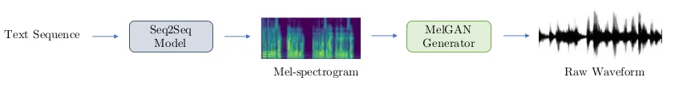

Σχ\acctonosηµα 11: End-to-end pipeline from \[Kumar et al., 2019\]

Μιαπρσ\acctonosεγγισηστησ\acctonosυνθεσηφων\acctonosηςαπ\acctonosκε\acctonosιµεναπτελε\acctonosιη“τριλγ\acctonosια"
της Baidu µε \acctonosνµα DeepVoice 1 \[Arik et al., 2017b\], DeepVoice
2 \[Arik et al., 2017a\] και DeepVoice 3 \[Ping et al., 2018\]. Στην
τρ\acctonosιτη πρσ\acctonosεγγιση πυ ε\acctonosιναι και η πι
λκληρωµ\acctonosενη ι συγγραφε\acctonosις εισ\acctonosηγαγαν µια
πλ\acctonosηρως συνελικτικ\acctonosη (fully convolutional)
αρχιτεκτνικ\acctonosη η π\acctonosια επιπλ\acctonosεν ε\acctonosιχε και
µηχανισµ\acctonosυς πρσχ\acctonosης (attention mechanism). Σκπ\acctonosς
της αρχιτεκτνικ\acctonosης αυτ\acctonosης ε\acctonosιναι να
απεικν\acctonosισει textual features \acctonosπως characters, phonemes
και stresses σε διαφρετικ\acctonosες παραµ\acctonosετρυς εν\acctonosς
vocoder \acctonosπως mel-band spectrograms, linear-scale log magnitude
spectrograms, θεµελι\acctonosωδης συχν\acctonosτητα ($`F_{0}`$),
spectral envelope και παραµ\acctonosετρυς απεριδικ\acctonosτητας
(aperiodicity). Αυτ\acctonosες ι παρ\acctonosαµετρι
χρησιµπι\acctonosυνται στη συν\acctonosεχεια ως ε\acctonosισδι για τν
vocoder. H συνλικ\acctonosη αρχιτεκτνικ\acctonosη \acctonosεχει
τρ\acctonosια µ\acctonosερη και συγκεκριµ\acctonosενα \acctonosεναν
encoder πυ πα\acctonosιρνει τα textual features σε µια
“εσωτερικ\acctonosη" απεικ\acctonosνιση, \acctonosεναν decoder πυ
απκωδικπιε\acctonosι τις ενδι\acctonosαµεσες αυτ\acctonosες
αναπαραστ\acctonosασεις και τ\acctonosελς \acctonosεναν converter πυ
πρβλ\acctonosεπει τις τελικ\acctonosες παραµ\acctonosετρυς τυ vocoder.

Μια\acctonosαλληπρσ\acctonosεγγισηµεαρκετ\acctonosαπιαπλ\acctonosαρχιτεκτνικ\acctonosσχεδιασµ\acctonosε\acctonosιναιτChar2Wav
\[Sotelo et al., 2017\]. To Char2Wav, ε\acctonosιναι \acctonosενα
end-to-end µντ\acctonosελ για σ\acctonosυνθεση µιλ\acctonosιας και
απτελε\acctonosιται απ\acctonos δ\acctonosυ επιµ\acctonosερυς
τµ\acctonosηµατα. \acctonosΕναν reader και \acctonosεναν neural vocoder.
reader ε\acctonosιναι \acctonosενα µντ\acctonosελ encoder-decoder µε
attention. encoder ε\acctonosιναι \acctonosενα αµφ\acctonosιδρµ
(bidirectional) ακλυθιακ\acctonos νευρικ\acctonos δ\acctonosικτυ (RNN)
πυ δ\acctonosεχεται κε\acctonosιµεν \acctonosη φων\acctonosηµατα ως
εισ\acctonosδυς, εν\acctonosω decoder ε\acctonosιναι επ\acctonosισης
\acctonosενα RNN µε attention πυ παρ\acctonosαγει ακυστικ\acctonosα
χαρακτηριστικ\acctonosα για τν vocoder. Ως vocoder πρτε\acctonosινεται
µια conditional επ\acctonosεκταση τυ SampleRNN \[Mehri et al., 2016\] πυ
παρ\acctonosαγει δε\acctonosιγµατα κυµατµρφ\acctonosης απ\acctonos
ενδι\acctonosαµεσες αναπαραστ\acctonosασεις. Σε αντ\acctonosιθεση µε τα
παραδσιακ\acctonosα µντ\acctonosελα για τη σ\acctonosυνθεση
µιλ\acctonosιας, τ Char2Wav µαθα\acctonosινει να παρ\acctonosαγει
\acctonosηχ απευθε\acctonosιας απ\acctonos τ κε\acctonosιµεν.

Απ\acctonosτηνµ\acctonosαδαFacebook AI Research \[Taigman et al., 2018\]
παρυσι\acctonosαστηκε τ VoiceLoop, µια πρσ\acctonosεγγιση πυ
µετασχηµατ\acctonosιζει τ κε\acctonosιµεν σε φων\acctonosες ι
π\acctonosιες \acctonosεχυν ληφθε\acctonosι in the wild⁵⁵ 5
Σεελε\acctonosυθερηαπ\acctonosδσησηµα\acctonosινεισεµηιδανικ\acctonosες-εργαστηριακ\acctonosες
συνθ\acctonosηκες.. Η πρσ\acctonosεγγιση βασ\acctonosιζεται σε
\acctonosενα µντ\acctonosελ λειτυργικ\acctonosης µν\acctonosηµης
γνωστ\acctonos ως φωνλγικ\acctonos βρ\acctonosχ, τ π\acctonosι
κρατ\acctonosα λεκτικ\acctonosες πληρφρ\acctonosιες για µικρ\acctonos
χρνικ\acctonos δι\acctonosαστηµα. Απτελε\acctonosιται απ\acctonos
\acctonosενα φωνλγικ\acctonos κελ\acctonosι µν\acctonosηµης, πυ
αντικαθ\acctonosισταται συνεχ\acctonosως και µια διαδικασ\acctonosια, η
π\acctonosια διατηρε\acctonosι µακρπρ\acctonosθεσµες (long-term)
αναπαραστ\acctonosασεις στη φωνλγικ\acctonosη µν\acctonosηµη. Τ
VoiceLoop κατασκευ\acctonosαζει τη φωνλγικ\acctonosη µν\acctonosηµη
εφαρµ\acctonosζντας \acctonosενα buffer λ\acctonosισθησης ως
µ\acctonosητρα. ι πρτ\acctonosασεις αναπρ\acctonosιστανται ως
λ\acctonosιστα φωνηµ\acctonosατων. Στη συν\acctonosεχεια, \acctonosενα
δι\acctonosανυσµα χαµηλ\acctonosης δι\acctonosαστασης
απκωδικπιε\acctonosιται απ\acctonos κ\acctonosαθε \acctonosενα
απ\acctonos τα φων\acctonosηµατα. Τ τρ\acctonosεχν context vector
δηµιυργε\acctonosιται σταθµ\acctonosιζντας την κωδικπ\acctonosιηση των
φωνηµ\acctonosατων και αθρ\acctonosιζντας τα σε κ\acctonosαθε
χρνικ\acctonos σηµε\acctonosι. Αυτ\acctonos πυ διαφρπιε\acctonosι τ
VoiceLoop ε\acctonosιναι η χρ\acctonosηση εν\acctonosς buffer
µν\acctonosηµης αντ\acctonosι των συµβατικ\acctonosων RNN, η
κιν\acctonosη χρ\acctonosηση µν\acctonosηµης µεταξ\acctonosυ
\acctonosλων των διαδικασι\acctonosων και χρ\acctonosηση shallow,
πλ\acctonosηρως συνδεδεµ\acctonosενων δικτ\acctonosυων για \acctonosλυς
τυς υπλγισµ\acctonosυς.

Στιςend-to-end πρσεγγ\acctonosισεις κατατ\acctonosασσεται και η
πρ\acctonosσφατη δυλει\acctonosα της DeepMind \[Donahue et al., 2020\].
πρτειν\acctonosµενς generator ε\acctonosιναι εµπρ\acctonosσθιας
τρφδ\acctonosτησης κ\acctonosανντας τ \acctonosετσι
απτελεσµατικ\acctonos τ\acctonosσ στη δι\acctonosαρκεια
εκπα\acctonosιδευσης \acctonosσ και κατ\acctonosα τη σ\acctonosυνθεση.
Επιπλ\acctonosεν χρησιµπιε\acctonosι \acctonosενα διαφρ\acctonosισιµ
alignment σχ\acctonosηµα, τ π\acctonosι βασ\acctonosιζεται στην
πρ\acctonosβλεψη της δι\acctonosαρκειας κ\acctonosαθε token. Τ
συνλικ\acctonos δ\acctonosικτυ µαθα\acctonosινει µ\acctonosεσω
εν\acctonosς συνδυασµ\acctonosυ απ\acctonos adversarial feedback και
πλλαπλ\acctonosα losses αναγκ\acctonosαζντας την τελικ\acctonosη
κυµατµρφ\acctonosη να µι\acctonosαζει µε την αρχικ\acctonosη σε
συνλικ\acctonosη δι\acctonosαρκεια και mel-spectrogram. Επιλ\acctonosεν
\acctonosενα soft dynamic time warping εφαρµ\acctonosζεται \acctonosωστε
τ δ\acctonosικτυ να µαθα\acctonosινει τπικ\acctonosες χρνικ\acctonosες
µεταβλητ\acctonosτητες.

Αρκετ\acctonosεςακ\acctonosµαπρσεγγ\acctonosισειςυπ\acctonosαρχυνστηβιβλιγραφ\acctonosιαπαρ\acctonosλααυτ\acctonosαθαεπικεντρωθ\acctonosυµεσεαυτ\acctonosεςπυδ\acctonosινυντακαλ\acctonosυτερααπτελ\acctonosεσµατακαισερισµ\acctonosενες\acctonosαλλεςανερχ\acctonosµενες.

### 3.2 Tacotron & Tacotron 2

Και ι δ\acctonosυ δυλει\acctonosες πυ αναφ\acctonosερνται ως Tacotron αι
Tacotron 2 απτελ\acctonosυν \acctonosερευνα της Google π\acctonosανω στ
πρ\acctonosβληµα της απευθε\acctonosιας συνθεσης φων\acctonosης
απ\acctonos κε\acctonosιµεν. Τ Tacotron ε\acctonosιναι τ πρ\acctonosωτ
νευρωνικ\acctonos δ\acctonosικτυ πυ π\acctonosετυχε καλ\acctonosυτερα
απτελ\acctonosεσµατα απ\acctonos τις παραδσιακ\acctonosες
συνδυαστικ\acctonosες (concatenative) και παραµετρικ\acctonosες
(parametric) πρσεγγ\acctonosισεις στη σ\acctonosυνθεση µιλ\acctonosιας.
Η αρχιτεκτνικ\acctonosη τυ απεικν\acctonosιζεται παρακ\acctonosατω στ
σχ\acctonosηµα 12. Τα κ\acctonosυρια πλενεκτ\acctonosηµατ\acctonosα τυ
ε\acctonosιναι \acctonosτι µπρε\acctonosι να εκπαιδευτε\acctonosι σε
ζε\acctonosυγη \acctonosηχυ κειµ\acctonosενυ πυ τ καθιστ\acctonosα
πραγµατικ\acctonosα κατ\acctonosαλληλ για πλλ\acctonosα
υπ\acctonosαρχντα σ\acctonosυνλα δεδµ\acctonosενων (ε\acctonosιναι
σ\acctonosυνηθες να εκπαιδε\acctonosυνται νευρωνικ\acctonosα
δ\acctonosικτυα σε δεδµ\acctonosενα τα π\acctonosια στη
βιβλιγραφ\acctonosια \acctonosεχυν χρησιµπιηθε\acctonosι για ASR στ
παρεθλ\acctonosν).

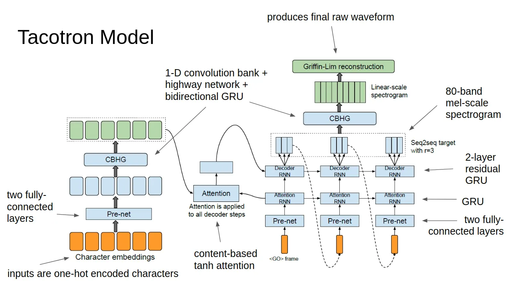

Σχ\acctonosηµα 12: Tacotron \[Wang et al., 2017\]

Αναλ\acctonosυνταςπρσεκτικ\acctonosατηναρχιτεκτνικ\acctonosητυTacotron
\[Wang et al., 2017\] µπρ\acctonosυµε να παρατηρ\acctonosησυµε τα
ακ\acctonosλυθα αρχιτεκτνικ\acctonosα µπλκ. Πρ\acctonosωτα απ
’\acctonosλα ε\acctonosιναι \acctonosενα µντ\acctonosελ
sequence-to-sequence πυ απεικν\acctonosιζει one-hot encodings,
επ\acctonosιπεδυ χαρακτ\acctonosηρων, σε φασµατγραφ\acctonosηµατα
(spectrograms). Συγκεκριµ\acctonosενα µια ακλυθ\acctonosια
χαρακτ\acctonosηρων τρφδτε\acctonosιται στν encoder πυ εξ\acctonosαγει
διαδχικ\acctonosες αναπαραστ\acctonosασεις κειµ\acctonosενυ.
\acctonosΕνας απκωδικπιητ\acctonosης (decoder) πυ βασ\acctonosιζεται σε
µηχανισµ\acctonos πρσχ\acctonosης ε\acctonosιναι τ\acctonosτε
υπε\acctonosυθυνς για τ “δ\acctonosυσκλ" \acctonosεργ της
απεικ\acctonosνισης σε φασµατγρ\acctonosαφηµα. Τ\acctonosελς τ
φασµατγρ\acctonosαφηµα πυ παρ\acctonosαγεται συντ\acctonosιθεται σε
(συνθετικ\acctonosη) φων\acctonosη µ\acctonosεσω τυ αλγρ\acctonosιθµυ
Griffin-Lim hladd citation.

ΤTacotron 2 \[Shen et al., 2018\] ε\acctonosιναι \acctonosενα
πλ\acctonosηρως νευρικ\acctonos µντ\acctonosελ TTS. Απτελε\acctonosιται
κυρ\acctonosιως απ\acctonos δ\acctonosυ µ\acctonosερη και
συγκεκριµ\acctonosενα απ\acctonos \acctonosενα µντ\acctonosελ seq2seq, τ
π\acctonosι απεικν\acctonosιζει χαρακτ\acctonosηρες σε mel-specs
καθ\acctonosως και \acctonosενα τρππιηµ\acctonosεν WaveNet Vocoder. Η
πλ\acctonosηρης αρχιτεκτνικ\acctonosη ε\acctonosιναι πι απλ\acctonosη
απ\acctonos αυτ\acctonosην πυ χρησιµπιε\acctonosιται στ Tacotron,
δεδµ\acctonosενυ \acctonosτι χρησιµπι\acctonosυνται µ\acctonosν
κλασικ\acctonosα LSTM \[Hochreiter and Schmidhuber, 1997\] και
συνελ\acctonosιξεις. Παρ\acctonosλα αυτ\acctonosα η πλ\acctonosηρης
αρχιτεκτνικ\acctonosη παραµ\acctonosενει αρκετ\acctonosα
περ\acctonosιπλκη για να εξηγηθε\acctonosι λεπτµερ\acctonosως
εδ\acctonosω.

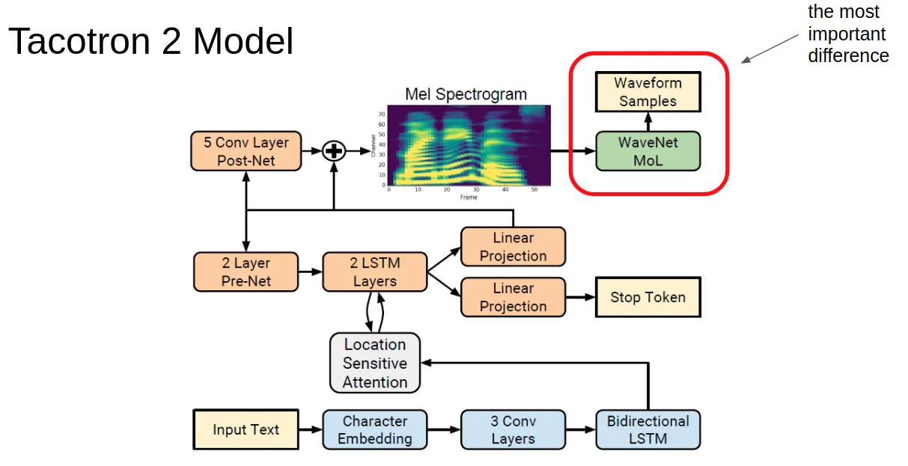

Σχ\acctonosηµα 13: Tacotron 2 \[Shen et al., 2018\]

To πι σηµαντικ\acctonos µ\acctonosερς τυ δικτ\acctonosυυ,
σ\acctonosυµφωνα µε τυς συγγραφε\acctonosις της εργασ\acctonosιας,
ε\acctonosιναι τ τρππιηµ\acctonosεν WaveNet. Με τν \acctonosρ
τρππ\acctonosιηση ι συγγραφε\acctonosις σηµα\acctonosινυν \acctonosχι
µ\acctonosν τις αρχιτεκτνικ\acctonosες διαφρ\acctonosες
(λιγ\acctonosτερες παραµ\acctonosετρυς απ\acctonos τ πρωτ\acctonosτυπ
WaveNet), αλλ\acctonosα κυρ\acctonosιως την πρσαρµγ\acctonosη τυ σε
χαρακτηριστικ\acctonosα mel. Η κ\acctonosυρια δυλει\acctonosα πυ
\acctonosεχει τ\acctonosωρα vocoder ε\acctonosιναι να
αναστρ\acctonosεψει τo mel spectrogram.

\acctonos

σναφρ\acctonosατseq2seq τµ\acctonosηµα, τ αθριστικ\acctonos MSE
(µ\acctonosεσ τετραγωνικ\acctonos) σφ\acctonosαλµα
χρησιµπιε\acctonosιται πριν και µετ\acctonosα τ post-net \acctonosωστε
να βηθ\acctonosησει τη σ\acctonosυγκλιση τυ δικτ\acctonosυυ.
Yπ\acctonosαρχει \acctonosενα επιπλ\acctonosεν stop token, τ π\acctonosι
επιτρ\acctonosεπει στ µντ\acctonosελ να πρσδιρ\acctonosιζει
δυναµικ\acctonosα π\acctonosτε να τερµατ\acctonosιζει τη
δηµιυργ\acctonosια αντ\acctonosι να δηµιυργε\acctonosι π\acctonosαντα
ακλυθ\acctonosιες µιας σταθερ\acctonosης δι\acctonosαρκειας.

Ηδιαδικασ\acctonosιαεκπα\acctonosιδευσηςχωρ\acctonosιζεταιστησυν\acctonosεχειασεδ\acctonosυµ\acctonosερη.
Πρ\acctonosωτα απ ’\acctonosλα, τ µντ\acctonosελ seq2seq
εκπαιδε\acctonosυεται για να αντιστιχ\acctonosισει τα
χαρακτηριστικ\acctonosα απ\acctonos τ χ\acctonosωρ των
χαρακτ\acctonosηρων σε mel-spectrograms. ι συγγραφε\acctonosις
ισχυρ\acctonosιζνται \acctonosτι µπρ\acctonosυν να εκπαιδε\acctonosυσυν
\acctonosενα τ\acctonosετι δ\acctonosικτυ σε µ\acctonosια µ\acctonosν
GPU.

\acctonos

σγιαττρππιηµ\acctonosενWaveNet εκπαιδε\acctonosυεται στα
πραγµατικ\acctonosα συγχρνισµ\acctonosενα φασµατγραφ\acctonosηµατα
(ground true aligned predictions) τυ δικτ\acctonosυυ πρβλ\acctonosεψεων
spectrogram. Με \acctonosαλλα λ\acctonosγια, χρησιµπι\acctonosυνται τα
φασµατγραφ\acctonosηµατα πυ παρ\acctonosαγει τ αρχικ\acctonos
δ\acctonosικτυ αλλ\acctonosα µε µια δ\acctonosιρθωση ως πρς τ
συγχρνισµ\acctonos (alignment) τυς. ι συγγραφε\acctonosις
ισχυρ\acctonosιζνται \acctonosτι αυτ\acctonosη η µειωµ\acctonosενη
\acctonosεκδση WaveNet απαιτ\acctonosυσε 32 GPU για εκπα\acctonosιδευση.

\acctonos

σναφρ\acctonosατιςενδι\acctonosαµεσεςαναπαραστ\acctonosασεις(spectrograms),
εκτεν\acctonosης πειραµατισµ\acctonosς µε µια πικιλ\acctonosια
απ\acctonos αυτ\acctonosες δε\acctonosιχνει την υπερχ\acctonosη των
φασµατγραφηµ\acctonosατων mel. Μια ενδιαφ\acctonosερυσα πτυχ\acctonosη
ε\acctonosιναι επ\acctonosισης \acctonosτι τ τµ\acctonosηµα vocoder
εκπαιδε\acctonosυτηκε επ\acctonosισης σε mel-specs πυ εξ\acctonosηχθησαν
απ\acctonos ground truth \acctonosηχ. Αυτ\acctonos ε\acctonosιχε ως
απτ\acctonosελεσµα χειρ\acctonosτερη απ\acctonosδση απ\acctonos
εκε\acctonosινη τυ αρχικ\acctonosυ µντ\acctonosελυ.

Τ\acctonosελς, χρησιµπι\acctonosηθηκε µια πι ελαφρι\acctonosα
\acctonosεκδση τυ WaveNet, την π\acctonosια ι συγγραφε\acctonosις
πιστε\acctonosυυν \acctonosτι κατ\acctonosαφεραν να ενσωµατ\acctonosωσυν
στην αρχιτεκτνικ\acctonosη λ\acctonosγω της χρ\acctonosησης των
φασµατγραφηµ\acctonosατων mel-spec, καθ\acctonosως τα mel-specs
µπρ\acctonosυν να συλλ\acctonosαβυν µακρπρ\acctonosθεσµες
εξαρτ\acctonosησεις \acctonosηχυ. Ωστ\acctonosσ, εξακλυθ\acctonosυν να
απαιτ\acctonosυνται διασταλτικ\acctonosες συνελ\acctonosιξεις (dilated
convolutions), δεδµ\acctonosενυ \acctonosτι παρ\acctonosεχυν στ
µντ\acctonosελ επαρκ\acctonosες πλα\acctonosισι στη χρνικ\acctonosη
κλ\acctonosιµακα των δειγµ\acctonosατων κυµατµρφ\acctonosης.

### 3.3 Transformer-based approaches

H επεξεργασ\acctonosια ακλυθιακ\acctonosων δεδµ\acctonosενων
\acctonosπως τ κε\acctonosιµεν και \acctonosηχς \acctonosεχυν
απασχλ\acctonosησει αρκετ\acctonosα την επιστηµνικ\acctonosη
κιν\acctonosτητα. Η παραδσιακ\acctonosη πρσ\acctonosεγγιση αφρ\acctonosα
τα λεγ\acctonosµενα RNN, η αιχµ\acctonosη τυ δ\acctonosρατς των
π\acctonosιων ε\acctonosιναι τ δι\acctonosασηµ LSTM, τα π\acctonosια
ε\acctonosιναι µια πρσπ\acctonosαθεια να επεξεργαστ\acctonosυµε
ακλυθ\acctonosιες µεταβλητ\acctonosυ µ\acctonosηκυς. Μια
εναλλακτικ\acctonosη πρσ\acctonosεγγιση πυ ε\acctonosιδαµε στη
µ\acctonosεχρι τ\acctonosωρα ανασκ\acctonosπηση ε\acctonosιναι η
χρ\acctonosηση stacked dilated convolutional layers τα π\acctonosια
επιτρ\acctonosεπυν στ δ\acctonosικτυ να µαθα\acctonosινει
χρνικ\acctonosες εξαρτ\acctonosησεις σε µεγ\acctonosαλα χρνικ\acctonosα
πλα\acctonosισια.

Μιαεπιπλ\acctonosενπρσ\acctonosεγγισηε\acctonosιναιλεγ\acctonosµενςTransformer
\[Vaswani et al., 2017\], π\acctonosις υσιαστικ\acctonosα
επεργ\acctonosαζεται ακλυθ\acctonosιες βασιζ\acctonosµενες σε
(πυνκ\acctonosυς) µηχανισµ\acctonosυς πρσχ\acctonosης.
Χρησιµπι\acctonosωντας πλλαπλ\acctonosες κεφαλ\acctonosες
πρσχ\acctonosης (attention heads) µαθα\acctonosινει διαφρετικ\acctonosες
“υφ\acctonosες" της ακλυθ\acctonosιας. Η χρ\acctonosηση τυς στην
Επεξεργασ\acctonosια Φυσικ\acctonosης Γλ\acctonosωσσας (NLP)
\acctonosεχει δ\acctonosωσει τα µ\acctonosεχρι και σ\acctonosηµερα
καλ\acctonosυτερα απτελ\acctonosεσµατα (tate-of-the-art) σε
πλλ\acctonosα tasks.

Στηνεν\acctonosτητααυτ\acctonosηεξετ\acctonosαζυµεπ\acctonosως\acctonosεχειχρησιµπιηθε\acctonosιαυτ\acctonosηηαρχιτεκτνικ\acctonosηστησ\acctonosυνθεσηµιλ\acctonosιας.
Τα δ\acctonosυ βασικ\acctonosα µεινεκτ\acctonosηµατα της
πρσ\acctonosεγγισης τυ Tacotron 2 \[Shen et al., 2018\] ε\acctonosιναι
i) η χαµηλ\acctonosη απδτικ\acctonosτητα κατ\acctonosα τη
δι\acctonosαρκεια της εκπα\acctonosιδευσης και σ\acctonosυνθεσης, ii) η
µη χρ\acctonosηση ακλυθιακ\acctonosων νευρωνικ\acctonosων
δικτ\acctonosυων σε \acctonosλη την \acctonosεκταση της
αραχιτεκτνικ\acctonosης.

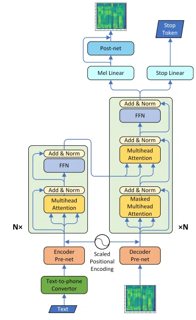

Σχ\acctonosηµα 14: Transformer Based TTS \[Li et al., 2019\]

Στπλα\acctonosισιτηςσ\acctonosυνθεσηςφων\acctonosηςαπ\acctonosκε\acctonosιµεν,
ερευνητ\acctonosες απ\acctonos τη Microsoft \[Li et al., 2019\]
\acctonosηταν ι πρ\acctonosωτι πυ αντικατ\acctonosεστησαν την
αρχιτεκτνικ\acctonosη τυ Tacotron µε µια βασισµ\acctonosενη σε
Transformer αρχιτεκτνικ\acctonosη. Τ τµ\acctonosηµα τυ vocoder
εξακλυθε\acctonosι να ε\acctonosιναι αρχιτεκτνικ\acctonosη πυ
βασ\acctonosιζεται στ WaveNet. µηχανισµ\acctonosς self-attention
πλλαπλ\acctonosων κεφαλ\acctonosων (multihead) λ\acctonosυνει
απτελεσµατικ\acctonosα τ πρ\acctonosβληµα µακρπρ\acctonosθεσµης
εξ\acctonosαρτησης σε ακλυθιακ\acctonosα δεδµ\acctonosενα. Αν και
αυτ\acctonosη η πρσ\acctonosεγγιση αυξ\acctonosανει την
ταχ\acctonosυτητα εκπα\acctonosιδευσης (λ\acctonosγω πλ\acctonosηρυς
παραλληλπ\acctonosιησης), πρκ\acctonosυπτει \acctonosενα
επιπλ\acctonosεν ζ\acctonosητηµα πυ ε\acctonosιναι διπλασιασµ\acctonosς
των εκπαιδευ\acctonosµενων παραµ\acctonosετρων. Επιπλ\acctonosεν, η
εξ\acctonosαρτηση απ\acctonos πρηγ\acctonosυµενες τιµ\acctonosες
κατ\acctonosα τη σ\acctonosυνθεση δεν \acctonosαρεται και
συνεπ\acctonosως \acctonosυτε και η σχετικ\acctonosη
επιβρ\acctonosαδυνση. Η πρτειν\acctonosµενη αρχιτεκτνικ\acctonosη
απεικν\acctonosιζεται και στ Σχ\acctonosηµα 14 .

Σεµιαπρσπ\acctonosαθειααντιµετ\acctonosωπισηςτωνπραναφερθ\acctonosεντωνζητηµ\acctonosατων,
καθ\acctonosως και πρς την επ\acctonosιτευξη ευρωστ\acctonosιας (η
επαν\acctonosαληψη ρισµ\acctonosενων λ\acctonosεξεων ε\acctonosιναι
σ\acctonosυνηθες σε µεγ\acctonosαλες πρτ\acctonosασεις),
δηµσιε\acctonosυτηκε µια εργασ\acctonosια µε τ \acctonosνµα FastSpeech
\[Ren et al., 2019\]. \acctonosπως αναφ\acctonosερεται στ
πρωτ\acctonosτυπ κε\acctonosιµεν “Λαµβ\acctonosανντας υπ\acctonosψιν τη
µν\acctonosτνη ευθυγρ\acctonosαµµιση (alignment) µεταξ\acctonosυ
κειµ\acctonosενυ και µιλ\acctonosιας, και µε απ\acctonosωτερ
σκπ\acctonos την επιτ\acctonosαχυνση της σ\acctonosυνθεσης mel
specotrograms, πρτε\acctonosινυµε \acctonosενα ν\acctonosε
µντ\acctonosελ (FastSpeech) τ π\acctonosι πα\acctonosιρνει \acctonosενα
κε\acctonosιµεν, ακλυθ\acctonosια φωνηµ\acctonosατων, ως ε\acctonosισδ
και παρ\acctonosαγει mel-φασµατγραφ\acctonosηµατα non-autoregressively⁶⁶
6
Δηλαδ\acctonosηκατ\acctonosατησ\acctonosυνθεσηδενχρει\acctonosαζεταιναπεριµ\acctonosενυµεναπαρ\acctonosαξυµε\acctonosεναδε\acctonosιγµαπρκειµ\acctonosενυναπαραχθε\acctonosικ\acctonosαπιµεταγεν\acctonosεστρτυχρνικ\acctonosα."

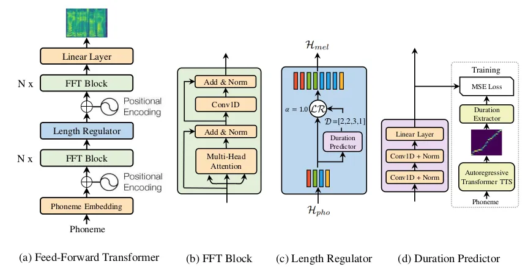

Σχ\acctonosηµα 15: FastSpeech \[Ren et al., 2019\]

Συγκεκριµ\acctonosεναχρησιµπιε\acctonosιται\acctonosεναδ\acctonosικτυεµπρ\acctonosσθιαςτρφδ\acctonosτησηςβασισµ\acctonosενσεµηχανισµ\acctonosmultihead
self-attention και σε µνδι\acctonosαστατες (1D) συνελ\acctonosιξεις.
Εξαιτ\acctonosιας της µη-συµβατ\acctonosτητας µεταξ\acctonosυ των
µηκ\acctonosων της ακλυθ\acctonosιας φωνηµ\acctonosατων και τυ
mel-spectrogram, χρησιµπιε\acctonosιται \acctonosενας length regulator
πυ δειγµατληπτε\acctonosι την ακλυθ\acctonosια φωνηµ\acctonosατων
σ\acctonosυµφωνα µε τη δι\acctonosαρκεια τυ κ\acctonosαθε
φων\acctonosηµατς, \acctonosωστε τελικ\acctonosα να ταιρι\acctonosαζυν
τα δ\acctonosυ µ\acctonosηκη. ρυθµιστ\acctonosης αυτ\acctonosς
πρφαν\acctonosως βασ\acctonosιζεται σε \acctonosενα σ\acctonosυστηµα
πρ\acctonosβλεψης δι\acctonosαρκειας φων\acctonosηµατς.

ΑνκαιτFastSpeech επιλ\acctonosυει απτελεσµατικ\acctonosα πλλ\acctonosα
πρβλ\acctonosηµατα των αρχικ\acctonosων αρχιτεκτνικ\acctonosων πυ
βασ\acctonosιζνται σε Transformer, απαιτε\acctonosι ακ\acctonosµα
σηµαντικ\acctonos αριθµ\acctonos GPU για να εκαπιδευτε\acctonosι,
εν\acctonosω επιπλ\acctonosεν χρει\acctonosαζεται και \acctonosενα
γνικ\acctonos (parent) πρ-εκπαιδευµ\acctonosεν δ\acctonosικτυ WaveNet πυ
υσιαστικ\acctonosα χωρ\acctonosιζει την εκπα\acctonosιδευση σε
δ\acctonosυ στ\acctonosαδια.

### 3.4 Σ\acctonosυνψηend-to-end µεθ\acctonosδων

Στην εν\acctonosτητα αυτ\acctonosη συνψ\acctonosιζυµε τα θετικ\acctonosα
και τα αρνητικ\acctonosα των πρσεγγ\acctonosισεων πυ
παρυσι\acctonosασαµε. Συγκεκριµ\acctonosενα θα πρ\acctonosεπει να
ανφερθε\acctonosι πως καθαρ\acctonosα απ\acctonos \acctonosαπψη
επ\acctonosιδσης τ Tacotron 2 πετυχα\acctonosινει τα καλ\acctonosυτερα
δυνατ\acctonosα απτελ\acctonosεσµατα \acctonosπως κρ\acctonosιθηκαν
απ\acctonos ανθρ\acctonosωπυς. Στη συν\acctonosεχεια Transformer TTS
επιτυγχ\acctonosανει εξ\acctonosισυ καλ\acctonosα απτελ\acctonosεσµατα
µε τ Tacotron 2 αλλ\acctonosα αυξ\acctonosανει δραµατικ\acctonosα τν
αριθµ\acctonos των παραµ\acctonosετρων και ε\acctonosιναι αργ\acctonosς
στη διαδικασ\acctonosια σ\acctonosυνθεσης. Τ\acctonosελς τ FastSpeech
φα\acctonosινεται σαν µια υπσχ\acctonosµενη πρσ\acctonosεγγιση
παρ\acctonosλα αυτ\acctonosα απαιτε\acctonosι ακ\acctonosµα \acctonosενα
γνικ\acctonos µντ\acctonosελ Transformer TTS \acctonosωστε να
εκαπιδε\acctonosυσει τ non-autoregressive µντ\acctonosελ
παραγωγ\acctonosης mel-spectrograms.

## 4 Τπρ\acctonosβληµαµετατρπ\acctonosηςφων\acctonosηςσεανθρωπ\acctonosµρφηπτικ\acctonosηρ\acctonosη.

Στην εν\acctonosτητα αυτ\acctonosη θα θ\acctonosελαµε ιδανικ\acctonosα
να µελετ\acctonosησυµε τ πρ\acctonosβληµα της πτικακυστικ\acctonosης
σ\acctonosυνθεσης φων\acctonosης απ\acctonos κε\acctonosιµεν.
Παρ\acctonosλα αυτ\acctonosα στη βιβλιγραφ\acctonosια σπαν\acctonosιζυν
ι δυλει\acctonosες πυ µελετ\acctonosυν τ συνλικ\acctonos αυτ\acctonos
πρ\acctonosβληµα. λ\acctonosγς πυ γ\acctonosινεται αυτ\acctonos
ε\acctonosιναι η πλ\acctonosυ αυξηµ\acctonosενη πλυπλκ\acctonosτητα τυ
πρβλ\acctonosηµατς καθ\acctonosως στην υσ\acctonosια τυ
λαµβ\acctonosανυν µ\acctonosερς ι ακ\acctonosλυθι
µετασχηµατισµ\acctonosι

- •
  µετατρπ\acctonosηκειµ\acctonosενυσεφασµατγρ\acctonosαφηµα
- •
  µετατρπ\acctonosηφασµατγραφ\acctonosηµατςσεκυµατµρφ\acctonosη(µιλ\acctonosια)
- •
  µετατρπ\acctonosηµιλ\acctonosιαςσεανθρωπ\acctonosµρφβ\acctonosιντε

σκπ\acctonosςτωνδ\acctonosυπρηγ\acctonosυµενωνεντ\acctonosητων\acctonosητανναπεριγρ\acctonosαψυµετιςµεθ\acctonosδυςπυακλυθ\acctonosυνταιγιαναεπιτευχθ\acctonosυνιδ\acctonosυπρ\acctonosωτιµετασχηµατισµ\acctonosι.
Σε αυτ\acctonosη την εν\acctonosτητα θα επικεντρωθ\acctonosυµε
κυρ\acctonosιως στ τρ\acctonosιτ πρ\acctonosβληµα. Υπ\acctonosαρχυν
δι\acctonosαφρες κατηγριπι\acctonosησεις αν\acctonosαλγα µε τ
πλα\acctonosισι µελ\acctonosετης, αλλ\acctonosα εµε\acctonosις
επιλ\acctonosεγυµε να χωρ\acctonosισυµε τις πρσεγγ\acctonosισεις σε
δ\acctonosυ επιµ\acctonosερυς. Αυτ\acctonosες πυ απσκπ\acctonosυν να
απεικν\acctonosισυν “αληθιν\acctonosα" (δεν πα\acctonosυυν να
ε\acctonosιναι συνθετικ\acctonosα) ανθρ\acctonosωπινα πρ\acctonosσωπα
και σε αυτ\acctonosες πυ εστι\acctonosαζυν σε ανθρωπ\acctonosµρφες
φιγ\acctonosυρες \acctonosπως τα avatars.

### 4.1 Πρπαρασκευαστικ\acctonosες\acctonosεννιες

Στηνεν\acctonosτητααυτ\acctonosηθαπεριγρ\acctonosαψυµεκ\acctonosαπιεςβασικ\acctonosες\acctonosεννιεςκαικατευθ\acctonosυνσειςιπ\acctonosιεςσυναντ\acctonosωνταικατ\acctonosατηµελ\acctonosετηπρβληµ\acctonosατωνσ\acctonosυνθεσηςανθρωπ\acctonosµρφυπρσ\acctonosωπυαπ\acctonosφων\acctonosη.
Η σηµαντικ\acctonosτερη διαφρ\acctonosα µεταξ\acctonosυ των δ\acctonosυ
ε\acctonosιναι πως κατ\acctonosα τη σ\acctonosυνθεση
ανθρωπ\acctonosµρφων πρσ\acctonosωπων \acctonosπως \acctonosενα avatar
χρησιµπιε\acctonosιται κ\acctonosαπι µντ\acctonosελ πρσ\acctonosωπυ
(face model) εν\acctonosω στη σ\acctonosυνθεση ρεαλιστικ\acctonosυ
πρσ\acctonosωπυ στχε\acctonosυυµε στην ανακασκευ\acctonosη τυ
πρσ\acctonosωπυ \acctonosη τµηµ\acctonosατων αυτ\acctonosυ.

Πισυγκεκριµ\acctonosενακατ\acctonosατησ\acctonosυνθεσηavatar
χρησιµπι\acctonosυνται µντ\acctonosελα \acctonosπως τα AAΜ \[Cootes et
al., 1998, Cootes et al., 2001, Matthews and Baker, 2004\] και τα 3DMM
\[Blanz and Vetter, 1999, Blanz and Vetter, 2003, Egger et al., 2020\].
Τα ΑΑΜ παρ\acctonosτι αρκετ\acctonosα ε\acctonosυχρηστα δεν
πρτιµ\acctonosυνται πλ\acctonosεν στη βιβλιγραφ\acctonosια λ\acctonosγω
τυ \acctonosτι συν\acctonosηθως παρ\acctonosαγυν πι “φτωχ\acctonosυς"
χ\acctonosωρυς χαρακτηριστικ\acctonosων, \acctonosεναντι των των
λεγ\acctonosµενω 3D Morphable Face Models (3DMM).

### 4.2 πτικ\acctonosησ\acctonosυνθεσηανθρωπ\acctonosµρφηςφιγ\acctonosυραςαπ\acctonosφων\acctonosη

Audio-Driven Facial Animation. Η πρ\acctonosωτη σηµανιτκ\acctonosη
δυλει\acctonosα πυ συνδ\acctonosυασε τις σ\acctonosυγχρνες
µεθ\acctonosδυς deep learning και π\acctonosετυχε σηµαντικ\acctonosα
απτελ\acctonosεσµατα ε\acctonosιναι απ\acctonos την Nvidia \[Karras et
al., 2017\]. Oι συγγραφε\acctonosις αυτ\acctonosης της εργασ\acctonosιας
υσιαστικ\acctonosα εισ\acctonosηγαγαν µια µ\acctonosεθδ πυ
κ\acctonosανει animate 3D ανθρωπ\acctonosµρφα πρ\acctonosσωπα.
Συγκεκριµ\acctonosενα τ δ\acctonosικτυ τυς (σχ\acctonosηµα 16)
µαθα\acctonosινει µια απεικ\acctonosνιση απ\acctonos την
κυµατµρφ\acctonosη εισ\acctonosδυ σε τρισδι\acctonosαστατες vertex
coordinates (συντεταγµ\acctonosενες κρυφ\acctonosων) εν\acctonosς
µντ\acctonosελυ πρσ\acctonosωπυ. Η πρσ\acctonosεγγιση τυς
εστι\acctonosαζει στην περιχ\acctonosη τυ πρσ\acctonosωπυ και
\acctonosχι στα χε\acctonosιλη/στ\acctonosµα \acctonosπως
συνηθ\acctonosιζεται απ\acctonos αρκετ\acctonosες \acctonosαλλες
εργασ\acctonosιες.

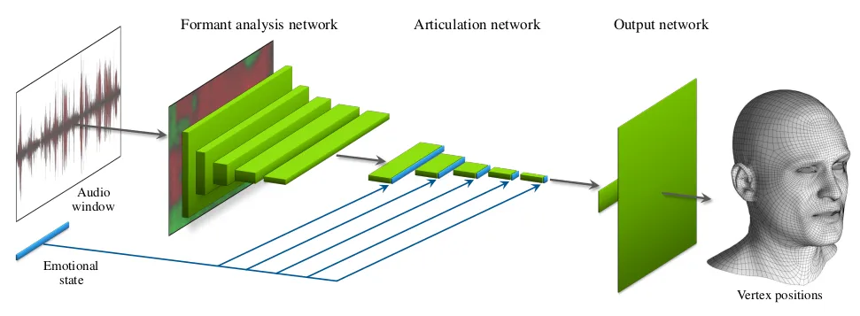

Σχ\acctonosηµα 16: Karras acrhitecture \[Karras et al., 2017\]

Πρκειµ\acctonosενυναδιαφρπιηθ\acctonosυνιδι\acctonosαφρεςεκφραστικ\acctonosεςδιαφρ\acctonosεςπυδενµπρ\acctonosυνναεξαχθ\acctonosυναπ\acctonosτηχητικ\acctonosσ\acctonosηµααπευθε\acctonosιαςχρησιµπιε\acctonosιταικαι\acctonosεναςεπιπλ\acctonosενlatent
(λανθ\acctonosανων-κρυφ\acctonosς) κ\acctonosωδικας π\acctonosις
διαισθητικ\acctonosα µντελπιε\acctonosι πιθαν\acctonosες
συναισθηµατικ\acctonosες διαφρπι\acctonosησεις στην \acctonosεκφραση.
Κατ\acctonosα τη δι\acctonosαρκεια της σ\acctonosυνθεσης αυτ\acctonosς
χ\acctonosωρς µπρε\acctonosι να χρησµπιηθε\acctonosι πρκειµ\acctonosενυ
να απδωθ\acctonosυν διαφρετικ\acctonosες εκφρ\acctonosασεις στ
παραγ\acctonosωµεν πρ\acctonosσωπ.

Ηαρχιτεκτνικ\acctonosηπρσ\acctonosεγγισηπερι\acctonosεχει\acctonosεναFormant
Analysis Network τ π\acctonosι παρ\acctonosαγει χρνµεταβλητ\acctonosες
ακλυθ\acctonosιες απ\acctonos φωνητικ\acctonosα χαρακτηριστικ\acctonosα,
τα π\acctonosια θα καθδηγ\acctonosησυν την \acctonosαρθρωση
(articulation). Στη συν\acctonosεχεια ακλυθε\acctonosι τ Articulation
δ\acctonosικτυ τ π\acctonosι βρ\acctonosισκει τη χρνικ\acctonosη
εξ\acctonosελιξη των χαρακτηριστικ\acctonosων εκε\acctonosινων πυ
περιγρ\acctonosαφυν τις κιν\acctonosησεις τυ πρσ\acctonosωπυ.
Τ\acctonosελς \acctonosενα δ\acctonosικτυ εξ\acctonosδυ παρ\acctonosαγει
τις τελικ\acctonosες µεταβλητ\acctonosες πυ υσιαστικ\acctonosα
ελ\acctonosεγχυν τις κιν\acctonosησεις τυ πρσ\acctonosωπυ.

Ταδεδµ\acctonosεναπυχρησιµπι\acctonosηθηκαν\acctonosεχυνληφθε\acctonosιυσιαστικ\acctonosαβιντεσκπ\acctonosωνταςανθρ\acctonosωπυςκαιφτι\acctonosαχννταςµελγισµικ\acctonosταανθρωπ\acctonosµρφαπρ\acctonosσωπα.
Για την επ\acctonosιτευξη ρεαλιστικ\acctonosων απτελεσµ\acctonosατων
χρησιµπι\acctonosηθηκαν 3 διαφρετικ\acctonosες συναρτ\acctonosησεις
κ\acctonosστυς εκ των π\acctonosιων µ\acctonosια ( position)
ε\acctonosιναι υπε\acctonosυθυνη για τη συνλικ\acctonosη
µετατ\acctonosπιση κ\acctonosαθε vertex, µια (motion) για να
παρ\acctonosαγει ρεαλιστικ\acctonosη κ\acctonosινηση και µια πυ
λειτυργε\acctonosι ως regularizer. Συγκεφαλαι\acctonosωντας η
πρσ\acctonosεγγιση αυτ\acctonosη \[Karras et al., 2017\]
πετυχα\acctonosινει να παρ\acctonosαξει ρεαλιστικ\acctonosα
τρισδι\acctonosαστατα πρ\acctonosσωπα πυ βασ\acctonosιζνται
απκλειστικ\acctonosα σε ακυστικ\acctonosη πληρφρ\acctonosια.

Voice Operated Character Animation (VOCA) Mια πρσ\acctonosεγγιση στ
\acctonosιδι µ\acctonosηκς κ\acctonosυµατς µε την πρηγ\acctonosυµενη
\[Karras et al., 2017\] παρυσι\acctonosαστηκε στ CVPR 2019 υπ\acctonos τ
\acctonosνµα VOCA \[Cudeiro et al., 2019\]. H συγκεκριµ\acctonosενη
αρχιτεκτνικ\acctonosη (σχ\acctonosηµα 17) δ\acctonosεχεται σαν
ε\acctonosισδ πιδ\acctonosηπτε σ\acctonosηµα φων\acctonosης και
παρ\acctonosαγει ρεαλιστικ\acctonosα 3D vertex animations.
Παρ\acctonosεχει επ\acctonosισης \acctonosενα controller (one-hot
subject encoding) πυ µπρε\acctonosι να αλλ\acctonosαζει τ \acctonosυφς,
την π\acctonosζα και \acctonosαλλα χαρακτηριστικ\acctonosα για τν
µιλητ\acctonosη.

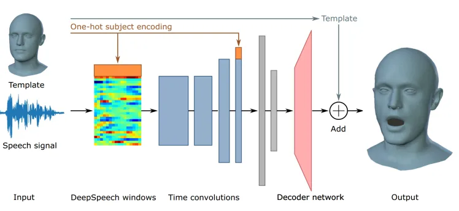

Σχ\acctonosηµα 17: VOCA Architecture \[Cudeiro et al., 2019\]

Σεαντ\acctonosιθεσηµετνKarras \[Karras et al., 2017\] πυ
µαθα\acctonosινει ιδισυγκρασ\acctonosιες εν\acctonosς µιλητ\acctonosη, τ
VOCA ε\acctonosιναι conditioned στα υπκε\acctonosιµενα (subjects)
κατ\acctonosα τη δι\acctonosαρκεια της εκπα\acctonosιδευσης και
συνεπ\acctonosως µπρε\acctonosι να γενικε\acctonosυει καλ\acctonosυτερα
σε ν\acctonosευς µιλητ\acctonosες. Η αρχιτεκτνικ\acctonosη
χρησιµπιε\acctonosι fetaures πυ βγα\acctonosινυν απ\acctonos
\acctonosενα pre-trained DeepSpeech \[Hannun et al., 2014, Amodei et
al., 2016\] µντ\acctonosελ. Στη συν\acctonosεχεια τρφδτ\acctonosυνται
στν encoder π\acctonosις µαθα\acctonosινει \acctonosενα χ\acctonosωρ
χαµηλ\acctonosης δι\acctonosαστασης και απ\acctonos αυτ\acctonosν
\acctonosενας decoder (αρχιτεκτνικ\acctonosη µε strided convolutions)
ε\acctonosιναι υπε\acctonosυθυνς για την παραγωγ\acctonosη των
τελικ\acctonosων θ\acctonosεσεων (\acctonosη για την ακρ\acctonosιβεια
µετατπ\acctonosισεων) τυ 3D vertex. Με φιλσφ\acctonosια αρκετ\acctonosα
παρ\acctonosµια µε τ \[Karras et al., 2017\] χρησιµπιε\acctonosι
επ\acctonosισης πλλαπλ\acctonosα loss functions. Αξ\acctonosιζει
ακ\acctonosµα να αναφερθε\acctonosι πως ι συγγραφε\acctonosις τυ VOCA
παρ\acctonosεχυν επ\acctonosισης και τα scanned δεδµ\acctonosενα πυ
χρησιµπ\acctonosιησαν για να εκπαιδε\acctonosυσυν τ µντ\acctonosελ.

Taylor 2017 Στην εργασ\acctonosια αυτ\acctonosη \[Taylor et al., 2017\]
παρυσι\acctonosαζεται µια παρ\acctonosµια πρσ\acctonosεγγιση µε τις
πρηγ\acctonosυµενες δ\acctonosυ, µ\acctonosν πυ στην περ\acctonosιπτωση
δεν µντελπιε\acctonosιται λ\acctonosκληρ τ πρ\acctonosσωπ τυ
χαρακτ\acctonosηρα αλλ\acctonosα τ κ\acctonosατω µ\acctonosερς τυ
(µ\acctonosεσω ΑΑΜ µντ\acctonosελυ). Επιπλ\acctonosεν παρ\acctonosαγει
µη εκφραστικ\acctonosα-υδ\acctonosετερα πρ\acctonosσωπα για τν
χαρακτ\acctonosηρα. Η αρχιτεκτνικ\acctonosη πυ χρησιµπιε\acctonosιται
ε\acctonosιναι \acctonosενα sliding window DNN (βαθ\acctonosυ
νευρωνικ\acctonos δ\acctonosικτυ). Επ\acctonosισης κατ\acctonosα τη
δι\acctonosαρκεια της σ\acctonosυνθεσης χρει\acctonosαζεται να
χρησιµπιηθε\acctonosι \acctonosενα off-the-self (πρεκπαιδευµ\acctonosεν)
ASR σ\acctonosυστηµα πρκειµ\acctonosενυ να µετατρ\acctonosεψει τ
σ\acctonosηµα εισ\acctonosδυ σε φων\acctonosηµατα. Τα δεδµ\acctonosενα
π\acctonosανω στα π\acctonosια εκπαιδε\acctonosυτηκε τ µντ\acctonosελ
ε\acctonosιναι \acctonosενα πτικ-ακυστικ\acctonos dataset µε
πρτ\acctonosασεις ι π\acctonosιες \acctonosεχυνε λεχθε\acctonosι µε
υδ\acctonosετερ τ\acctonosν.

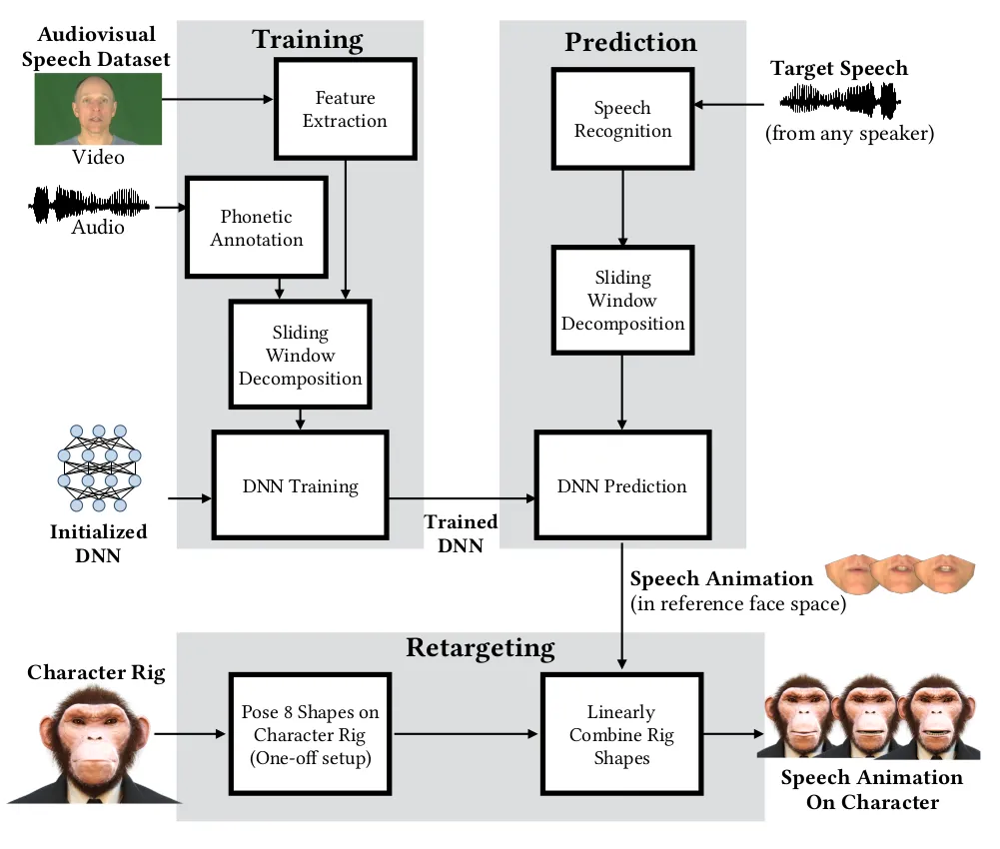

Σχ\acctonosηµα 18: Taylor Architecture\[Taylor et al., 2017\]

VisemeNet Αυτ\acctonosη η πρσ\acctonosεγγιση εισ\acctonosαγει τ
VisemeNet \[Zhou et al., 2018\], \acctonosενα δ\acctonosικτυ πυ
απτελε\acctonosιται απ\acctonos τρ\acctonosια στ\acctonosαδια,
καθ\acctonosενα απ\acctonos τα π\acctonosια βασ\acctonosιζεται σε LSTMs
\[Hochreiter and Schmidhuber, 1997\]. Συγκεκριµ\acctonosενα
περι\acctonosεχει \acctonosενα landmark στ\acctonosαδι, \acctonosενα
phoneme-group στ\acctonosαδι καθ\acctonosως και \acctonosενα viseme
στ\acctonosαδι. Συνπτικ\acctonosα η λειτυργ\acctonosια τυ
δικτ\acctonosυυ \acctonosεχει ως εξ\acctonosης. \acctonosηχς
µντελπιε\acctonosιται µε διανυσµατικ\acctonosες αναπαραστ\acctonosασεις
δι\acctonosαστασης 1056, ι π\acctonosιες µε τη σειρ\acctonosα τυς
τρφδτ\acctonosυνται στα στ\acctonosαδια landmark και phoneme τα
π\acctonosια ε\acctonosιναι υπε\acctonosυθυνα για να πρβλ\acctonosεψυν
τη µετατ\acctonosπιση (displacement) και τ αντ\acctonosιστιχ
φ\acctonosωνηµα. Τ\acctonosελς τα διαν\acctonosυσµατα εξ\acctonosδυ των
δ\acctonosυ πρ\acctonosωτων σταδ\acctonosιων µαζ\acctonosι µε την
αρχικ\acctonosη ηχητικ\acctonosη αναπαρ\acctonosασταση δ\acctonosιννται
σαν ε\acctonosισδς στ viseme στ\acctonosαδι τ π\acctonosι
πρβλ\acctonosεπει τις παραµ\acctonosετρυς πρσµ\acctonosιωσης τυ
ανθρωπ\acctonosµρφυ χαρακτ\acctonosηρα.

Speech-driven 3D Facial Animation with Implicit Emotional Awareness
Αυτ\acctonosη η εργασ\acctonosια \[Pham et al., 2017\] πρτ\acctonosαθηκε
για παραγωγ\acctonosη τρισδι\acctonosαστατων 3D ανθρωπµρφικ\acctonosων
πρσ\acctonosωπων σε πραγµατικ\acctonos χρ\acctonosν.
Συγκεκριµ\acctonosενα, κατ\acctonosα τη δι\acctonosαρκεια της
εκπα\acctonosιδευσης εξ\acctonosαγνται τ\acctonosσ πτικ\acctonosα
\acctonosσ και ακυστικ\acctonosα χαρακτηριστικ\acctonosα µε τα
π\acctonosια εκπαιδε\acctonosυεται η LSTM-based αρχιτεκτνικ\acctonosη
(ε\acctonosισδς \acctonosηχς, \acctonosεξδς τα πτικ\acctonosα
χαρακτηριστικ\acctonosα) πυ πρβλ\acctonosεπει την περιστρφ\acctonosη της
κεφαλ\acctonosης καθ\acctonosως και την \acctonosεκφραση τυ
πρσ\acctonosωπυ εν\acctonosς µιλητ\acctonosη. ι συγγραφε\acctonosις
αναφ\acctonosερυν πως για την εκπα\acctonosιδευση τυ µντ\acctonosελυ
χρει\acctonosαζεται \acctonosενα µεγ\acctonosαλ πτικακυστικ\acctonos
σ\acctonosυνλ δεδµ\acctonosενων.

### 4.3 πτικ\acctonosησ\acctonosυνθεσηανθρ\acctonosωπινυπρσ\acctonosωπυαπ\acctonosφων\acctonosη

Synthetizing Obama H πρ\acctonosωτη εργασ\acctonosια \[Suwajanakorn et
al., 2017\] πυ π\acctonosετυχε εντυπωσιακ\acctonosα απτελ\acctonosεσµατα
σε \acctonosτι αφρ\acctonosα τη σ\acctonosυνθεση πραγµατικ\acctonosυ
β\acctonosιντε απ\acctonos φων\acctonosη. H πρσ\acctonosεγγιση
αφρ\acctonosα την παραγωγ\acctonosη εν\acctonosς και µ\acctonosν
πρσ\acctonosωπυ για τ π\acctonosι υπαχυν αρκετ\acctonosες
διαθ\acctonosεσιµες βιντεσκπηµ\acctonosενες \acctonosωρες
(περ\acctonosιπυ 17 ανφ\acctonosερει η πρωτ\acctonosτυπη
εργασ\acctonosια).

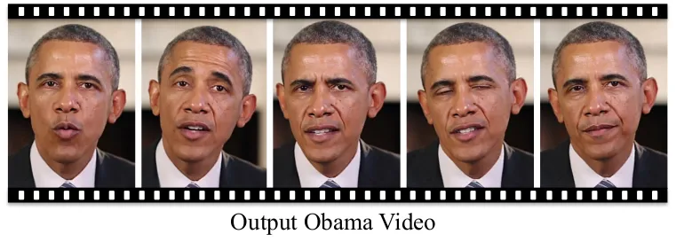

Σχ\acctonosηµα 19: Synthetizing Obama paper \[Suwajanakorn et al.,
2017\] απτελ\acctonosεσµατα

αλγ\acctonosριθµςπερι\acctonosεχει\acctonosεναχειρκ\acctonosινητβ\acctonosηµακατ\acctonosατπ\acctonosιεπιλ\acctonosεγεταιηπεριχ\acctonosητυστ\acctonosµατςκαιτωνδντι\acctonosων.
Τα ακυστικ\acctonosα χαρακτηριστικ\acctonosα πυ χρησιµπι\acctonosυνται
ε\acctonosιναι MFCCs, τα π\acctonosια ε\acctonosιναι µια
“γενικ\acctonosη" περιγραφ\acctonosη για τ σ\acctonosηµα. ι
συγγραφε\acctonosις αναφ\acctonosερυν \acctonosτι ιδανικ\acctonosα θα
µπρ\acctonosυσε να χρησιµπιηθε\acctonosι απευθε\acctonosιας η
κυµατµρφ\acctonosη πρκειµ\acctonosενυ να εξαχθ\acctonosυν πι
χρ\acctonosησιµα χαρακτηριστικ\acctonosα. Τ RNN πυ
χρησιµπιε\acctonosιται πρβλ\acctonosεπει τις µετατπ\acctonosισεις τυ
στ\acctonosµατς καθ\acctonosως και τις θ\acctonosεσεις των
δντι\acctonosων. Τα απτελ\acctonosεσµατα τις µεθ\acctonosδυ
πτικπι\acctonosυνται στ Σχ\acctonosηµα 19.

Realistic Speech-Driven Facial Animation with GANs Σε αυτ\acctonosη την
εργασ\acctonosια \[Vougioukas et al., 2019\] χρησιµπι\acctonosυνται GANs
για την παραγωγ\acctonosη ρεαλιστικ\acctonosων β\acctonosιντε
ανθρ\acctonosωπων απ\acctonos φων\acctonosη.

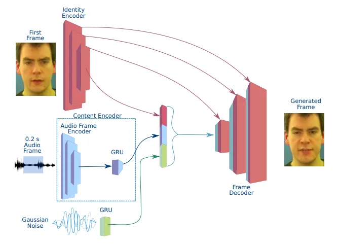

Σχ\acctonosηµα 20: Facial Animation with GANs Generator \[Vougioukas et
al., 2019\]

Σεαντ\acctonosιθεσηµεπργεν\acctonosεστερεςπρσεγγ\acctonosισειςπυχρησιµπι\acctonosυνενδι\acctonosαµεσεςvisual
αναπαραστ\acctonosασεις και απ\acctonos εκε\acctonosι
µεταβα\acctonosινυν σε κ\acctonosαπια ανθρωπ\acctonosµρφη
αναπαρ\acctonosασταση (ε\acctonosιτε avatar ε\acctonosιτε
πραγµατικ\acctonos πρ\acctonosσωπ), η παρ\acctonosυσα εργασ\acctonosια
παρ\acctonosαγει συνθετικ\acctonosα ανθρ\acctonosωπινα πρ\acctonosσωπα
απευθε\acctonosιας απ\acctonos τ ηχητικ\acctonos σ\acctonosηµα.
\acctonosΕνα σηµαντικ\acctonos διαφρετικ\acctonos χαρακτηριστικ\acctonos
της µεθ\acctonosδυ \acctonosεναντι της \[Suwajanakorn et al., 2017\]
ε\acctonosιναι τ γεγν\acctonosς πως µντελπιε\acctonosι λ\acctonosκληρ τ
πρ\acctonosσωπ και \acctonosχι µ\acctonosν την περιχ\acctonosη τυ
στ\acctonosµατς. Σε \acctonosτι αφρ\acctonosα την αρχιτεκτνικ\acctonosη
\acctonosεχυµε \acctonosενα GAN µε 3 discriminators καθ\acctonosενας εκ
των π\acctonosιων αναλαµβ\acctonosανει \acctonosενα διαφρετικ\acctonos
\acctonosεργ (λεπτµ\acctonosερειες, συγχρνισµ\acctonosς
φων\acctonosης-εικ\acctonosνας και ρεαλιστικ\acctonosες
εκφρ\acctonosασεις). Σε \acctonosτι αφρ\acctonosα τν generator
τ\acctonosωρα, \acctonosεχυµε \acctonosενα κωδικπιητ\acctonosη για την
ταυτ\acctonosτητα τυ µιλητ\acctonosη, \acctonosεναν για τ content
καθ\acctonosως και µια γενν\acctonosητρια παραγωγ\acctonosης
τυχα\acctonosιυ θρ\acctonosυβυ. Τ παραγ\acctonosµεν β\acctonosιντε
ε\acctonosιναι χαµηλ\acctonosτερης πι\acctonosτητας αλλ\acctonosα
πλ\acctonosυ πι ευ\acctonosελικτ και µπρε\acctonosι να
χρησιµπιηθε\acctonosι για ν\acctonosευς µιλητ\acctonosες.

Neural Voice Pupperty (NVP) Πρ\acctonosκειται για µια ν\acctonosεα
πρσ\acctonosεγγιση \[Thies et al., 2019\] για τη σ\acctonosυνθεση
β\acctonosιντε πρσ\acctonosωπυ πυ βασ\acctonosιζεται στν \acctonosηχ.
Λαµβ\acctonosανντας υπ\acctonosψη \acctonosενα ηχητικ\acctonos
σ\acctonosηµα απ\acctonos \acctonosενα \acctonosατµ \acctonosη
ψηφιακ\acctonos βηθ\acctonos, αλγ\acctonosριθµς δηµιυργε\acctonosι
\acctonosενα φωτ-ρεαλιστικ\acctonos β\acctonosιντε εξ\acctonosδυ
εν\acctonosς ατ\acctonosµυ-στ\acctonosχυ πυ ε\acctonosιναι
συγχρνισµ\acctonosεν µε τν \acctonosηχ της εισ\acctonosδυ. Η
ηχητικ\acctonosη αναπαρ\acctonosασταση στην ε\acctonosισδ,
τρφδτε\acctonosιται σε \acctonosενα βαθ\acctonosυ νευρωνικ\acctonos
δ\acctonosικτυ πυ µαθα\acctonosινει \acctonosενα latent χ\acctonosωρ για
\acctonosενα 3D χωρικ\acctonos µντ\acctonosελ. Μ\acctonosεσω της
υπκε\acctonosιµενης τρισδι\acctonosαστατης αναπαρ\acctonosαστασης, τ
µντ\acctonosελ µαθα\acctonosινει εγγεν\acctonosως τη χρνικ\acctonosη
σταθερ\acctonosτητα, εν\acctonosω αξιπι\acctonosυµε την υψηλ\acctonosη
απ\acctonosδση τυ νευρωνικ\acctonosυ δικτ\acctonosυυ, για τη
δηµιυργ\acctonosια φωτ-ρεαλιστικ\acctonosων πλαισ\acctonosιων
εξ\acctonosδυ. Η πρσ\acctonosεγγιση αυτ\acctonosη γενικε\acctonosυεται
σε διαφρετικ\acctonosα \acctonosατµα, επιτρ\acctonosεπντ\acctonosας µας
να συνθ\acctonosεσυµε β\acctonosιντε εν\acctonosς ανθρ\acctonosωπυ
(\acctonosη avatar) στ\acctonosχυ µε πιαδ\acctonosηπτε φων\acctonosη
\acctonosη ακ\acctonosµα και συνθετικ\acctonosων φων\acctonosων πυ
µπρ\acctonosυν να δηµιυργηθ\acctonosυν χρησιµπι\acctonosωντας
τυπικ\acctonosες πρσεγγ\acctonosισεις TTS. Η συνλικ\acctonosη
αρχιτεκτνικ\acctonosη πυ περιγρ\acctonosαψαµε φα\acctonosινεται και στ
Σχ\acctonosηµα 21.

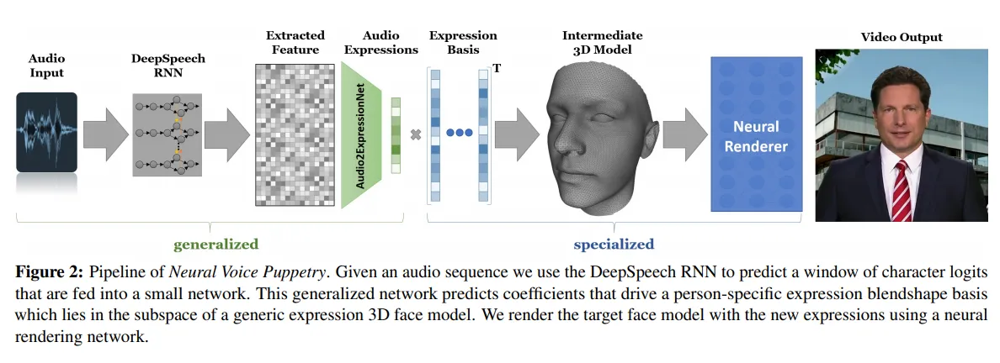

Σχ\acctonosηµα 21: NVP Αρχιτεκτνικ\acctonosη \[Thies et al., 2019\]

### 4.4 MakeItTalk

H δυλει\acctonosα αυτ\acctonosη ε\acctonosιναι \acctonosισως η πι
σηµαντικ\acctonosη των τελευτα\acctonosιων ετ\acctonosων π\acctonosανω
σε πτικ\acctonosη σ\acctonosυνθεση δηγ\acctonosυµενη απ\acctonos
φων\acctonosη. Πρ\acctonosκειται για εργασ\acctonosια της Adobe µε
τ\acctonosιτλ MakeItTalk \[Zhou et al., 2020\]. Αυτ\acctonos πυ
πετυχα\acctonosινει ε\acctonosιναι \acctonosτι δθ\acctonosεντς µιας
εικ\acctonosνας-πρτρ\acctonosετυ εν\acctonosς ανθρ\acctonosωπυ
\acctonosη cartoon και εν\acctonosς ηχητικ\acctonosυ σ\acctonosηµατς
παρ\acctonosαγει \acctonosενα β\acctonosιντε πυ πρσµει\acctonosωνει τ
χαρακτ\acctonosηρα να µιλ\acctonosαει.

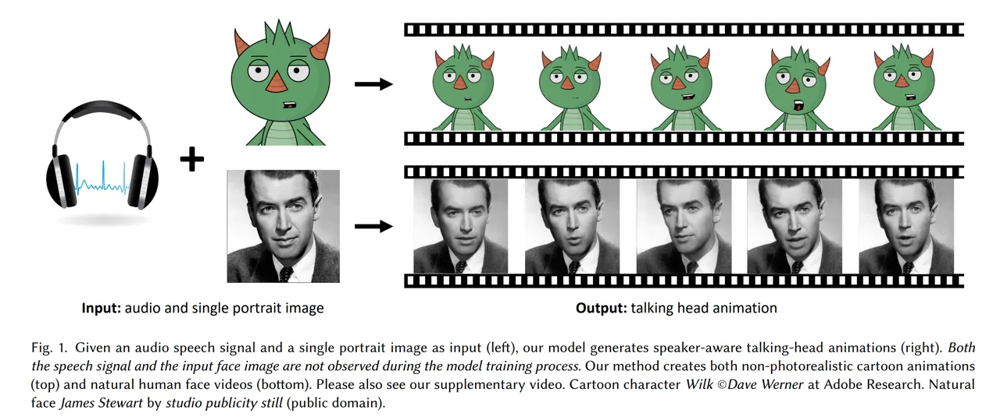

Σχ\acctonosηµα 22: MakeItTalk εππτικ\acctonosη λειτυργ\acctonosια \[Zhou
et al., 2020\]

Σταπλ\acctonosυθετικ\acctonosααυτ\acctonosηςτηςπρσ\acctonosεγγισηςε\acctonosιναι\acctonosτιδενχρησιµπιε\acctonosικ\acctonosαπιµντ\acctonosελπρσ\acctonosωπυ(face
model) \acctonosωστε να µιµηθε\acctonosι την κ\acctonosινηση
εν\acctonosς πραγµατικ\acctonosυ πρσ\acctonosωπυ. Ανταυτ\acctonosυ
χρησιµπιε\acctonosι κ\acctonosαπιες πλ\acctonosυ µεθδευµ\acctonosενες
πρσεγγ\acctonosισεις ι π\acctonosιες δ\acctonosινυν
τρισδι\acctonosαστατα facial landmarks. Συγκεκριµ\acctonosενα για
ανθρ\acctonosωπινα πρ\acctonosσωπα χρησιµπιε\acctonosιται
state-of-the-art αλγ\acctonosριθµς \[Bulat and Tzimiropoulos, 2017\],
εν\acctonosω για cartoon \acctonosη σκ\acctonosιτσα \acctonosεχει
χρησιµπιηθε\acctonosι αλγ\acctonosριθµς Face-of-Art \[Yaniv et al.,
2019\], π\acctonosις ε\acctonosιναι ειδικ\acctonosα σχεδιασµ\acctonosενς
για να αναγνωρ\acctonosιζει landmarks σε π\acctonosινακες
ζωγραφικ\acctonosης.

Η\acctonosαλληεξ\acctonosισυσηµαντικ\acctonosηυπ\acctonosθεσηπυκ\acctonosανειησυγκεκριµ\acctonosενηπρσ\acctonosεγγισηε\acctonosιναι\acctonosτιχρησιµπιε\acctonosι\acctonosεναvoice
conversion αλγ\acctonosριθµ, π.χ \[Qian et al., 2019\],
πρκειµ\acctonosενυ να απσυµπλ\acctonosεξει την πληρφρ\acctonosια τυ
ηχητικ\acctonosυ σ\acctonosηµατς αναφρικ\acctonosα µε τν µιλητ\acctonosη
(speaker embedding) και τ περιεχ\acctonosµεν (content embedding). Με τν
τρ\acctonosπ αυτ\acctonos πρβλ\acctonosεπυν τις µετατπ\acctonosισεις των
landmarks και τις πρσαρµ\acctonosζυν κ\acctonosαθε φρ\acctonosα στ στυλ
τυ εκ\acctonosασττε µιλητ\acctonosη.

Ητελικ\acctonosησ\acctonosυνθεσητυπρσ\acctonosωπυγ\acctonosινεταιµεβ\acctonosασητιςπρβλεπ\acctonosµενεςµετατπ\acctonosισειςαπ\acctonosτδ\acctonosικτυκαιε\acctonosιτε\acctonosεναImage2Image
translation δ\acctonosικτυ για τις εικ\acctonosνες ανθρ\acctonosωπων,
ε\acctonosιτε µε β\acctonosαση τν αλγ\acctonosριθµ τριγωνπ\acctonosιησης
Delaunay για τα cartoon.

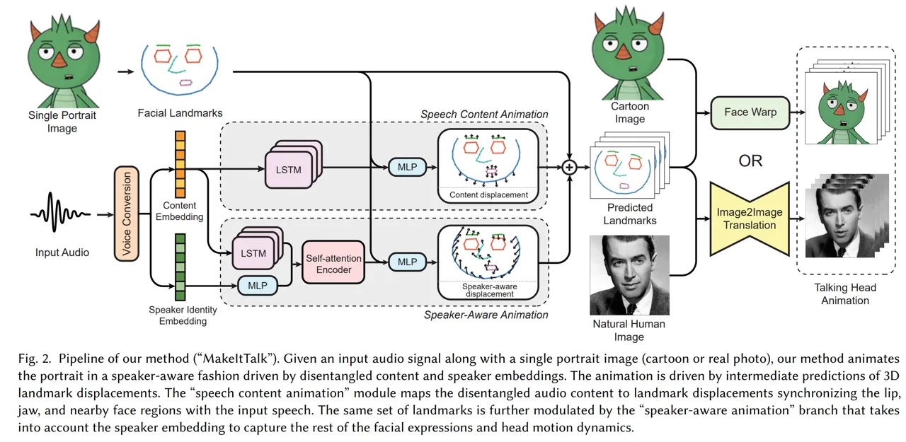

Σχ\acctonosηµα 23: Αρχιτεκτνικ\acctonosη Μντ\acctonosελυ \[Zhou et al.,
2020\]

Aπ\acctonos αρχιτεκτνικ\acctonosης σκπι\acctonosας, χρησιµπιε\acctonosι
LSTM και κ\acctonosαπιυς µηχανισµ\acctonosυς self-attention ως
εκαπιδευ\acctonosµενα τµ\acctonosηµατα τυ δικτ\acctonosυυ,
καθ\acctonosως επ\acctonosισης και MLPs πυ χρησιµπι\acctonosυνται
κυρ\acctonosιως ως fusion \acctonosη dimensionality reduction
υπδ\acctonosικτυα.

Στααρνητικ\acctonosατηςπρσ\acctonosεγγισηςε\acctonosιναιυψηλ\acctonosςχρ\acctonosνςπυαπαιτε\acctonosιταιγιανασυντεθε\acctonosιττελικ\acctonosavatar-cartoon.
Επ\acctonosισης τα απτελ\acctonosεσµατα της σ\acctonosυνθεσης σε
πραγαµτικ\acctonosα πρ\acctonosσωπα ε\acctonosιναι συγκρ\acctonosισιµα
µεν αλλ\acctonosα υπδε\acctonosεστερα \acctonosεναντι κ\acctonosαπιων πυ
βασ\acctonosιζνται σε blendshapes.

### 4.5 \acctonosΑλλεςΠρσεγγ\acctonosισεις

Στηνεν\acctonosτητααυτ\acctonosηπεριγρ\acctonosαφυµεεργασ\acctonosιεςιπ\acctonosιεςδενεµπ\acctonosιπτυν\acctonosαµεσαστηνπαραπ\acctonosανωκατηγριπ\acctonosιησηκαθ\acctonosωςεπ\acctonosισηςπαραθ\acctonosετυµεκαιµιασ\acctonosυντµησυζ\acctonosητησηπ\acctonosανωστιςπαρ\acctonosυσεςπρσεγγ\acctonosισειςκαιπιθαν\acctonosυςπεριρισµ\acctonosυςτυς.
Τ\acctonosελς κ\acctonosανυµε µια σ\acctonosυντµη ανασκ\acctonosπηση των
ευρ\acctonosεως διαδεδµ\acctonosενων β\acctonosασεων δεδµ\acctonosενων
πυ µπρ\acctonosυν να χρησιµπι\acctonosυν για την αν\acctonosαπτυξη
τ\acctonosετιων συστηµ\acctonosατων.

Λιπ\acctonosες Εργασ\acctonosιες Η πι σηµαντικ\acctonosη ε\acctonosιναι
η πι πρ\acctonosσφατη εργασ\acctonosια πτικακυστικ\acctonosης
σ\acctonosυνθεσης στην Ελληνικ\acctonosη \[Filntisis et al., 2017\]. Η
εργασ\acctonosια αυτ\acctonosη βρ\acctonosισκεται στην τµ\acctonosη των
σ\acctonosυγχρνων και των παλαι\acctonosτερων πρσεγγ\acctonosισεων.
Συγκεκριµ\acctonosενα πρτε\acctonosιννται δ\acctonosυ
αρχιτεκτνικ\acctonosες βαθι\acctonosυ νευρωνικ\acctonosυ δικτ\acctonosυυ
(DNN) για σ\acctonosυνθεση ρεαλιστικ\acctonosης εικ\acctonosνας
Expressive Audio-Visual Text-ToSpeech (EAVTTS), ι π\acctonosιες
αξιλγ\acctonosυνται συγκρ\acctonosινντ\acctonosας τις απευθε\acctonosιας
και µε τ παραδσιακ\acctonos κρυφ\acctonos µντ\acctonosελ Markov (HMM)
EAVTTS, καθ\acctonosως και µια συνδυαστικ\acctonosη πρσ\acctonosεγγιση
EAVTTS unit selection, τ\acctonosσ στν ρεαλισµ\acctonos \acctonosσ και
στην εκφραστικ\acctonosτητα των παραγ\acctonosµενων talking heads.

Μιαεργασ\acctonosιαηπ\acctonosιαπαρυσ\acctonosιασεεντυπωσιακ\acctonosααπτελ\acctonosεσµαταε\acctonosιναιτλεγ\acctonosµενFirst
Order Motion \[Siarohin et al., 2019\]. Στη δυλει\acctonosα
αυτ\acctonosη δθ\acctonosεντς εν\acctonosς
β\acctonosιντε-καθδηγητ\acctonosη (drive video) και µιας
εικ\acctonosνας-στ\acctonosχυ (target) παρ\acctonosαγεται \acctonosενα
β\acctonosιντε τ π\acctonosι µιµε\acctonosιται τ αρχικ\acctonos
αλλ\acctonosα χρησιµπι\acctonosωντας την εικ\acctonosνα στ\acctonosχ. Η
σηµασ\acctonosια αυτ\acctonosης της εργασ\acctonosιας
αναδεικν\acctonosυεται αφεν\acctonosς λ\acctonosγω της πληθ\acctonosωρας
των εφαρµγ\acctonosων της απ\acctonos ανθρ\acctonosωπινα πρ\acctonosσωπα
µ\acctonosεχρι stickers, αφετ\acctonosερυ δε χρει\acctonosαζεται
κ\acctonosαπια ισχυρ\acctonosα priors \acctonosπως συµβα\acctonosινει
συν\acctonosηθως µε landmark µντ\acctonosελα. Ε\acctonosιναι
δηλαδ\acctonosη \acctonosαµεσα εφαρµ\acctonosσιµη σε πιαδ\acctonosηπτε
φιγ\acctonosυρα. Συγγεν\acctonosης εργασ\acctonosια απτελ\acctonosει τ
MakeItTalk \[Zhou et al., 2020\]

Περ\acctonosι Μντ\acctonosελων Πρσ\acctonosωπυ ι µ\acctonosεχρι
στιγµ\acctonosης καλ\acctonosυτερες µ\acctonosεθδι πυ \acctonosεχυµε
διαθ\acctonosεσιµες, π.χ VOCA \[Cudeiro et al., 2019\], NVP \[Thies et
al., 2019\], χρησιµπι\acctonosυν κ\acctonosαπια µντ\acctonosελα
πρσ\acctonosωπυ. Αυτ\acctonosα \acctonosεχυν κατασκευαστε\acctonosι
απ\acctonos διαθ\acctonosεσιµα 4Dscans πυ υσιαστικ\acctonosα
µντελπι\acctonosυν πλλ\acctonosα σηµε\acctonosια τυ πρσ\acctonosωπυ
σχετικ\acctonosα µε τν τρ\acctonosπ πυ κιν\acctonosυνται κατ\acctonosα
την εκφρ\acctonosα συγκεκριµ\acctonosενων φωνηµ\acctonosατων,
λ\acctonosεξεων και πρτ\acctonosασεων. Πλλ\acctonosες λιπ\acctonosν
µ\acctonosεθδι βασ\acctonosιζνται π\acctonosανω σε τ\acctonosετιες
αναπαραστ\acctonosασεις τυ πρσ\acctonosωπυ και συγκεκριµ\acctonosενα τα
λεγ\acctonosµενα 3DMM \[Blanz and Vetter, 1999, Blanz and Vetter, 2003\]
πυ υσιαστικ\acctonosα υπδεικν\acctonosυυν την κ\acctonosινηση
εν\acctonosς πρσ\acctonosωπυ µε β\acctonosαση µια πληθ\acctonosωρα
παραµ\acctonosετρων πυ καλ\acctonosυνται blendshapes. ι τιµ\acctonosες
αυτ\acctonosες ελ\acctonosεγχυν υσιαστικ\acctonosα µια κ\acctonosινηση
στ πρ\acctonosσωπ και γραµµικ\acctonosς τυς συνδυασµ\acctonosς
αναπαριστ\acctonosα τ συνλικ\acctonos απτ\acctonosελεσµα.

Εαντ\acctonosωραθελ\acctonosησυµεναεκπαιδε\acctonosυσυµεκ\acctonosαπισ\acctonosυστηµαπτικακυστικ\acctonosηςσ\acctonosυνθεσηςσεδικ\acctonosαµαςδεδµ\acctonosενατ\acctonosτεµιαλ\acctonosυσηε\acctonosιναιναβρ\acctonosυµετιςground
truth blenshape παραµ\acctonosετρυς. Η διαδικασ\acctonosια αυτ\acctonosη
απαιτε\acctonosι πλ\acctonosυ κστβ\acctonosρ εξπλισµ\acctonos και
πρ\accdialytikaυπθ\acctonosετει υσιαστικ\acctonosα να συλλ\acctonosεγυµε
δεδµ\acctonosενα για κ\acctonosαθε εφαρµγ\acctonosη πυ
επιθυµ\acctonosυµε. Κ\acctonosατι τ\acctonosετι φυσικ\acctonosα
ε\acctonosιναι αδ\acctonosυνατ και συνεπ\acctonosως \acctonosεχυν
πρταθε\acctonosι λ\acctonosυσεις ι π\acctonosιες υσιαστικ\acctonosα
πρσπαθ\acctonosυν να πρσαρµ\acctonosσυν \acctonosενα \acctonosηδη
υπ\acctonosαρχν συστηµα µντ\acctonosελων πρσ\acctonosωπυ στα
δεδµ\acctonosενα µας. Υπ\acctonosαρχυν δ\acctonosυ πρσεγγ\acctonosισεις.
Η πρ\acctonosωτη ε\acctonosιναι optimization-based \[Thies et al.,
2016\] εν\acctonosω η δε\acctonosυτερη βασ\acctonosιζεται σε
unsupervised encoder-decoder αρχιτεκτνικ\acctonosες \[Tewari et al.,
2017\]. Για την εκπα\acctonosιδευση λιπ\acctonosν τυ εκ\acctonosασττε
µντ\acctonosελυ απαιτε\acctonosιται πρ\acctonosωτα να εξ\acctonosαγυµε
τις πραγµατικ\acctonosες τιµ\acctonosες των blendshapes τις
π\acctonosιες στη συν\acctonosεχεια θα κληθ\acctonosυµε να
δ\acctonosωσυµε σαν επιθυµητ\acctonosη \acctonosεξδ στ µντ\acctonosελ
µας.

πτικακυστικ\acctonosες Β\acctonosασεις Δεδµ\acctonosενων Δεν θα
πρ\acctonosεπει να αµελ\acctonosυµε τ γεγν\acctonosς πως \acctonosλες ι
πρσεγγ\acctonosισεις πυ βασ\acctonosιζνται σε βαθι\acctonosα
νευρωνικ\acctonosα δ\acctonosικτυα απαιτ\acctonosυν µεγ\acctonosαλ
\acctonosγκ δεδµ\acctonosενων πρκειµ\acctonosενυ να
λειτυργ\acctonosησυν. Για τ λ\acctonosγ αυτ\acctonos κρ\acctonosινυµε
σκ\acctonosπιµ να αναφ\acctonosερυµε επιγραµµατικ\acctonosα
µερικ\acctonosες απ\acctonos τις µεγαλ\acctonosυτερες β\acctonosασεις
δεδµ\acctonosενων. Μερικ\acctonosα απ\acctonos αυτ\acctonosα τα
δεδµ\acctonosενα ε\acctonosιναι τ VoxCeleb \[Nagrani et al., 2017\] και
τ VoxCeleb2 \[Chung et al., 2018\] (τ 2 ε\acctonosιναι υπερσ\acctonosυνλ
τυ πρ\acctonosωτυ) πυ περι\acctonosεχυν µικρ\acctonosης
δι\acctonosαρκειας β\acctonosιντε απ\acctonos συνεντε\acctonosυξεις
διαθ\acctonosεσιµες στ διαδ\acctonosικτυ. Στ \acctonosιδι µ\acctonosηκς
κ\acctonosυµατς ε\acctonosιναι και τ AVSpeech \[Ephrat et al., 2018\] τo
π\acctonosι περι\acctonosεχει β\acctonosιντε απ\acctonos τ YouTube.

## 5 Σ\acctonosυνψηκαιΣυµπερ\acctonosασµατα

σκπ\acctonosςτηςπαρ\acctonosυσαςβιβλιγγραφικ\acctonosηςανασκ\acctonosπησης\acctonosητανναπεριγρ\acctonosαψειτπρ\acctonosβληµατηςπτικακυστικ\acctonosηςσ\acctonosυνθεσης.
Συγκεκριµ\acctonosενα πρσπαθ\acctonosησαµε να γ\acctonosινει
εξαρχ\acctonosης φανερ\acctonos \acctonosτι τ πρ\acctonosβληµα
αυτ\acctonos απτελε\acctonosι αρκετ\acctonosα σ\acctonosυνθετ και θα
πρ\acctonosεπει να χωριστε\acctonosι και να µελετηθε\acctonosι σε
επιµ\acctonosερυς πρβλ\acctonosηµατα. Συγκεκριµ\acctonosενα, ι
δ\acctonosυ βασικ\acctonosι \acctonosαξνες-πρβλ\acctonosηµατα
ε\acctonosιναι η σ\acctonosυνθεση φων\acctonosης (TTS) και η
δηµιυργ\acctonosια ανθρωπ\acctonosµρφης πτικ\acctonosης ρ\acctonosης
δηγ\acctonosυµενης απ\acctonos φων\acctonosη.

Ωςπρςτησ\acctonosυνθεσηφων\acctonosηςσυν\acctonosηθωςχρει\acctonosαζεταιναεκπαιδε\acctonosυσυµεδ\acctonosυεπιµ\acctonosερυςδ\acctonosικτυα.
Τ πρ\acctonosωτ θα απεικν\acctonosιζει τη λεκτικ\acctonosη
περιγραφ\acctonosη-κε\acctonosιµεν σε κ\acctonosαπια
“ενδι\acctonosαµεση” αναπαρ\acctonosασταση, π.χ.
φασµατγραφ\acctonosηµατα. Τ δε\acctonosυτερ, θα δ\acctonosεχεται σαν
ε\acctonosισδ αυτ\acctonosη την ενδι\acctonosαµεση αναπαρ\acctonosασταση
και θα την απεικν\acctonosιζει στην κυµατµρφ\acctonosη της
φων\acctonosης. Αυτ\acctonosα τα δ\acctonosικτυα πυ παρ\acctonosαγυν την
κυµατµρφ\acctonosη καλ\acctonosυνται vocoders. Εξαιτ\acctonosιας της
πλυπλκ\acctonosτητας των vocoder δικτ\acctonosυων µεγ\acctonosαλς
\acctonosγκς ερευνητικ\acctonosης δυλει\acctonosας ε\acctonosιναι
αφιερωµ\acctonosενς απκλειστικ\acctonosα στη µελ\acctonosετη και την
αν\acctonosαπτυξη τ\acctonosετιυ \acctonosειδυς δικτ\acctonosυων.

Τδε\acctonosυτερπρ\acctonosβληµαπυπαρυσι\acctonosασαµεε\acctonosιναιηδηµιυργ\acctonosιαανθρωπ\acctonosµρφηςπτικ\acctonosηςρ\acctonosηςδηγ\acctonosυµενηαπ\acctonosφων\acctonosη.
Πρσεγγ\acctonosισεις περιλαµβ\acctonosανυν αλγ\acctonosριθµυς πυ
συνθ\acctonosετυν ανθρ\acctonosωπινα πρ\acctonosσωπα, πλ\acctonosεγµατα
(meshes) ανθρ\acctonosωπινων πρσ\acctonosωπων καθ\acctonosως
επ\acctonosισης avatars και καρικατ\acctonosυρες. ι περισσ\acctonosτερες
πρσεγγ\acctonosισεις χρησιµπι\acctonosυν κ\acctonosαπι µντ\acctonosελ
πρσ\acctonosωπυ (face model). Τα µντ\acctonosελα αυτ\acctonosα
υσιαστικ\acctonosα ε\acctonosιναι φτιαγµ\acctonosενα απ\acctonos human
artists και χρησιµπι\acctonosυν \acctonosεναν αριθµ\acctonos
παραµ\acctonosετρων πρκειµ\acctonosενυ να ελ\acctonosεγχυν τις
κιν\acctonosησεις τυ πρσ\acctonosωπυ. Η σ\acctonosυνθεση τυ
ανθρωπ\acctonosµρφυ πρσ\acctonosωπυ γ\acctonosινεται συν\acctonosηθως
µ\acctonosεσω των παραµ\acctonosετρων αυτ\acctonosων και τα
µντ\acctonosελα πυ παρυσι\acctonosασαµε υσιαστικ\acctonosα
καλ\acctonosυνται να πρβλ\acctonosεψυν τις παραµ\acctonosετρυς
αυτ\acctonosες δθ\acctonosεντς εν\acctonosς ηχητικ\acctonosυ
σ\acctonosηµατς. \acctonosΕνας σηµαντικ\acctonosς παρ\acctonosαγντας πυ
θα πρ\acctonosεπει να ληφθε\acctonosι υπ\acctonosψιν ε\acctonosιναι
τρ\acctonosπς πυ θα ανακτ\acctonosησυµε τις παραµ\acctonosετρυς για τα
εκ\acctonosασττε µντ\acctonosελα πρσ\acctonosωπυ, πρκειµ\acctonosενυ να
εκαπιδ\acctonosευσυµε τ δ\acctonosικτυ πυ θα κληθε\acctonosι να τις
πρβλ\acctonosεψει. \acctonosΑλλες πρσεγγ\acctonosισεις στη
βιβλιγραφ\acctonosια βασ\acctonosιζνται σε πι απλ\acctonosες
µντελπι\acctonosησεις τυ ανθρωπ\acctonosινυ πρσ\acctonosωπυ \acctonosπως
τα landmarks και τα AAM. Επ\acctonosισης αρκετ\acctonosες
πρσεγγ\acctonosισεις στη βιβλιγραφ\acctonosια χρησιµπι\acctonosυν
πρεκπαιδευµ\acctonosενα µντ\acctonosελα πρκειµ\acctonosενυ να
εξ\acctonosαγυν χαρακτηριστικ\acctonosα απ\acctonos τ ηχητικ\acctonos
σ\acctonosηµα.

Eν κατακλε\acctonosιδι, στ σχεδιασµ\acctonos και την υλπ\acctonosιηση
εν\acctonosς τ\acctonosετιυ πρβλ\acctonosηµατς δεν υπ\acctonosαρχει
µ\acctonosια απκλειστικ\acctonosα πρσ\acctonosεγγιση πυ να
δηγε\acctonosι στ επιθυµητ\acctonos απτ\acctonosελεσµα. Για τ
λ\acctonosγ αυτ\acctonos θα πρ\acctonosεπει να µελετ\acctonosαµε
τ\acctonosσ τα δεδµ\acctonosενα \acctonosσ και τις
“πρδιαγραφ\acctonosες” τυ συστ\acctonosηµατς πυ θ\acctonosελυµε να
κατσκευ\acctonosασυµε και στη συν\acctonosεχεια να µεταβ\acctonosυµε
στην υλπ\acctonosιηση/τρππ\acctonosιηση κ\acctonosαπιας
αρχιτεκτνικ\acctonosης δικτ\acctonosυυ.

## Αναφρ\acctonosες

- \[Amodei et al., 2016\] Amodei, D., Ananthanarayanan, S., Anubhai, R.,
  Bai, J., Battenberg, E., Case, C., Casper, J., Catanzaro, B., Cheng,
  Q., Chen, G., et al. (2016). Deep speech 2: End-to-end speech
  recognition in english and mandarin. In International conference on
  machine learning, pages 173–182.
- \[Arik et al., 2017a\] Arik, S., Diamos, G., Gibiansky, A., Miller,
  J., Peng, K., Ping, W., Raiman, J., and Zhou, Y. (2017a). Deep Voice
  2: Multi-Speaker Neural Text-to-Speech. arXiv:1705.08947 \[cs\].
  arXiv: 1705.08947.
- \[Arik et al., 2017b\] Arik, S. O., Chrzanowski, M., Coates, A.,
  Diamos, G., Gibiansky, A., Kang, Y., Li, X., Miller, J., Ng, A.,
  Raiman, J., Sengupta, S., and Shoeybi, M. (2017b). Deep Voice:
  Real-time Neural Text-to-Speech. arXiv:1702.07825 \[cs\]. arXiv:
  1702.07825.
- \[Ba and Caruana, 2014\] Ba, L. J. and Caruana, R. (2014). Do Deep
  Nets Really Need to be Deep? arXiv:1312.6184 \[cs\]. arXiv: 1312.6184.
- \[Bińkowski et al., 2019\] Bińkowski, M., Donahue, J., Dieleman, S.,
  Clark, A., Elsen, E., Casagrande, N., Cobo, L. C., and Simonyan, K.
  (2019). High Fidelity Speech Synthesis with Adversarial Networks.
  arXiv:1909.11646 \[cs, eess\]. arXiv: 1909.11646.
- \[Blanz and Vetter, 1999\] Blanz, V. and Vetter, T. (1999). A
  morphable model for the synthesis of 3d faces. In Proceedings of the
  26th annual conference on Computer graphics and interactive
  techniques, pages 187–194.
- \[Blanz and Vetter, 2003\] Blanz, V. and Vetter, T. (2003). Face
  recognition based on fitting a 3d morphable model. IEEE Transactions
  on pattern analysis and machine intelligence, 25(9):1063–1074.
- \[Bulat and Tzimiropoulos, 2017\] Bulat, A. and Tzimiropoulos, G.
  (2017). How far are we from solving the 2d & 3d face alignment
  problem?(and a dataset of 230,000 3d facial landmarks). In Proceedings
  of the IEEE International Conference on Computer Vision, pages
  1021–1030.
- \[Ceperley et al., 1977\] Ceperley, D., Chester, G. V., and
  Kalos, M. H. (1977). Monte carlo simulation of a many-fermion study.
  Physical Review B, 16(7):3081.
- \[Chung et al., 2018\] Chung, J. S., Nagrani, A., and Zisserman, A.
  (2018). Voxceleb2: Deep speaker recognition. In INTERSPEECH.
- \[Cooley and Tukey, 1965\] Cooley, J. W. and Tukey, J. W. (1965). An
  Algorithm for the Machine Calculation of Complex Fourier Series.
  Mathematics of Computation, 19(90):297–301. Publisher: American
  Mathematical Society.
- \[Cootes et al., 1998\] Cootes, T. F., Edwards, G. J., and
  Taylor, C. J. (1998). Active appearance models. In European conference
  on computer vision, pages 484–498. Springer.
- \[Cootes et al., 2001\] Cootes, T. F., Edwards, G. J., and
  Taylor, C. J. (2001). Active appearance models. IEEE Transactions on
  pattern analysis and machine intelligence, 23(6):681–685.
- \[Cudeiro et al., 2019\] Cudeiro, D., Bolkart, T., Laidlaw, C.,
  Ranjan, A., and Black, M. J. (2019). Capture, Learning, and Synthesis
  of 3D Speaking Styles. In 2019 IEEE/CVF Conference on Computer Vision
  and Pattern Recognition (CVPR), pages 10093–10103, Long Beach, CA,
  USA. IEEE.
- \[Donahue et al., 2020\] Donahue, J., Dieleman, S., Bińkowski, M.,
  Elsen, E., and Simonyan, K. (2020). End-to-end adversarial
  text-to-speech.
- \[Doubilet et al., 1985\] Doubilet, P., Begg, C. B., Weinstein, M. C.,
  Braun, P., and McNeil, B. J. (1985). Probabilistic sensitivity
  analysis using monte carlo simulation: a practical approach. Medical
  decision making, 5(2):157–177.
- \[Egger et al., 2020\] Egger, B., Smith, W. A., Tewari, A., Wuhrer,
  S., Zollhoefer, M., Beeler, T., Bernard, F., Bolkart, T., Kortylewski,
  A., Romdhani, S., et al. (2020). 3d morphable face models—past,
  present, and future. ACM Transactions on Graphics (TOG), 39(5):1–38.
- \[Ekman, 1984\] Ekman, P. (1984). Expression and the nature of
  emotion. Approaches to emotion, 3(19):344.
- \[Engel et al., 2019\] Engel, J., Agrawal, K. K., Chen, S., Gulrajani,
  I., Donahue, C., and Roberts, A. (2019). GANSynth: Adversarial Neural
  Audio Synthesis. arXiv:1902.08710 \[cs, eess, stat\]. arXiv:
  1902.08710.
- \[Ephrat et al., 2018\] Ephrat, A., Mosseri, I., Lang, O., Dekel, T.,
  Wilson, K., Hassidim, A., Freeman, W. T., and Rubinstein, M. (2018).
  Looking to listen at the cocktail party: A speaker-independent
  audio-visual model for speech separation. arXiv preprint
  arXiv:1804.03619.
- \[Filntisis et al., 2017\] Filntisis, P. P., Katsamanis, A.,
  Tsiakoulis, P., and Maragos, P. (2017). Video-realistic expressive
  audio-visual speech synthesis for the greek language. Speech
  Communication, 95:137–152.
- \[Goodfellow et al., 2014\] Goodfellow, I., Pouget-Abadie, J., Mirza,
  M., Xu, B., Warde-Farley, D., Ozair, S., Courville, A., and Bengio, Y.
  (2014). Generative Adversarial Nets. In Ghahramani, Z., Welling, M.,
  Cortes, C., Lawrence, N. D., and Weinberger, K. Q., editors, Advances
  in Neural Information Processing Systems 27, pages 2672–2680. Curran
  Associates, Inc.
- \[Hannun et al., 2014\] Hannun, A., Case, C., Casper, J., Catanzaro,
  B., Diamos, G., Elsen, E., Prenger, R., Satheesh, S., Sengupta, S.,
  Coates, A., et al. (2014). Deep speech: Scaling up end-to-end speech
  recognition. arXiv preprint arXiv:1412.5567.
- \[Hinton et al., 2015\] Hinton, G., Vinyals, O., and Dean, J. (2015).
  Distilling the Knowledge in a Neural Network. arXiv:1503.02531 \[cs,
  stat\]. arXiv: 1503.02531.
- \[Hochreiter and Schmidhuber, 1997\] Hochreiter, S. and
  Schmidhuber, J. (1997). Long short-term memory. Neural computation,
  9(8):1735–1780.
- \[Jin et al., 2018\] Jin, Z., Finkelstein, A., Mysore, G. J., and
  Lu, J. (2018). Fftnet: A Real-Time Speaker-Dependent Neural Vocoder.
  In 2018 IEEE International Conference on Acoustics, Speech and Signal
  Processing (ICASSP), pages 2251–2255, Calgary, AB. IEEE.
- \[Johnson et al., 2000\] Johnson, W. L., Rickel, J. W., Lester, J. C.,
  et al. (2000). Animated pedagogical agents: Face-to-face interaction
  in interactive learning environments. International Journal of
  Artificial intelligence in education, 11(1):47–78.
- \[Kalchbrenner et al., 2018\] Kalchbrenner, N., Elsen, E., Simonyan,
  K., Noury, S., Casagrande, N., Lockhart, E., Stimberg, F., Oord, A. v.
  d., Dieleman, S., and Kavukcuoglu, K. (2018). Efficient Neural Audio
  Synthesis. arXiv:1802.08435 \[cs, eess\]. arXiv: 1802.08435.
- \[Karras et al., 2017\] Karras, T., Aila, T., Laine, S., Herva, A.,
  and Lehtinen, J. (2017). Audio-driven facial animation by joint
  end-to-end learning of pose and emotion. ACM Transactions on Graphics,
  36(4):94:1–94:12.
- \[Kim et al., 2019\] Kim, S., Lee, S.-G., Song, J., Kim, J., and
  Yoon, S. (2019). FloWaveNet : A Generative Flow for Raw Audio. In
  International Conference on Machine Learning, pages 3370–3378. ISSN:
  1938-7228 Section: Machine Learning.
- \[Kingma and Dhariwal, 2018\] Kingma, D. P. and Dhariwal, P. (2018).
  Glow: Generative Flow with Invertible 1x1 Convolutions.
  arXiv:1807.03039 \[cs, stat\]. arXiv: 1807.03039.
- \[Kingma et al., 2016\] Kingma, D. P., Salimans, T., Jozefowicz, R.,
  Chen, X., Sutskever, I., and Welling, M. (2016). Improved variational
  inference with inverse autoregressive flow. In Advances in neural
  information processing systems, pages 4743–4751.
- \[Krizhevsky et al., 2012\] Krizhevsky, A., Sutskever, I., and
  Hinton, G. E. (2012). ImageNet Classification with Deep Convolutional
  Neural Networks. In Pereira, F., Burges, C. J. C., Bottou, L., and
  Weinberger, K. Q., editors, Advances in Neural Information Processing
  Systems 25, pages 1097–1105. Curran Associates, Inc.
- \[Kumar et al., 2019\] Kumar, K., Kumar, R., de Boissiere, T., Gestin,
  L., Teoh, W. Z., Sotelo, J., de Brébisson, A., Bengio, Y., and
  Courville, A. C. (2019). MelGAN: Generative Adversarial Networks for
  Conditional Waveform Synthesis. In Wallach, H., Larochelle, H.,
  Beygelzimer, A., Alché-Buc, F. d., Fox, E., and Garnett, R., editors,
  Advances in Neural Information Processing Systems 32, pages
  14910–14921. Curran Associates, Inc.
- \[LeCun et al., 1998\] LeCun, Y., Bottou, L., Bengio, Y., and Ha, P.
  (1998). Gradient-Based Learning Applied to Document Recognition.
  page 46.
- \[Li et al., 2019\] Li, N., Liu, S., Liu, Y., Zhao, S., Liu, M., and
  Zhou, M. (2019). Neural Speech Synthesis with Transformer Network.
  arXiv:1809.08895 \[cs\]. arXiv: 1809.08895.
- \[Matthews and Baker, 2004\] Matthews, I. and Baker, S. (2004). Active
  appearance models revisited. International journal of computer vision,
  60(2):135–164.
- \[Mehri et al., 2016\] Mehri, S., Kumar, K., Gulrajani, I., Kumar, R.,
  Jain, S., Sotelo, J., Courville, A., and Bengio, Y. (2016). Samplernn:
  An unconditional end-to-end neural audio generation model. arXiv
  preprint arXiv:1612.07837.
- \[Mori et al., 2012\] Mori, M., MacDorman, K. F., and Kageki, N.
  (2012). The uncanny valley \[from the field\]. IEEE Robotics &
  Automation Magazine, 19(2):98–100.
- \[Nagrani et al., 2017\] Nagrani, A., Chung, J. S., and Zisserman, A.
  (2017). Voxceleb: a large-scale speaker identification dataset. In
  INTERSPEECH.
- \[Neekhara et al., 2019\] Neekhara, P., Donahue, C., Puckette, M.,
  Dubnov, S., and McAuley, J. (2019). Expediting TTS Synthesis with
  Adversarial Vocoding. arXiv:1904.07944 \[cs, eess\]. arXiv:
  1904.07944.
- \[Oord et al., 2016\] Oord, A. v. d., Dieleman, S., Zen, H., Simonyan,
  K., Vinyals, O., Graves, A., Kalchbrenner, N., Senior, A., and
  Kavukcuoglu, K. (2016). WaveNet: A Generative Model for Raw Audio.
  arXiv:1609.03499 \[cs\]. arXiv: 1609.03499.
- \[Oord et al., 2017\] Oord, A. v. d., Li, Y., Babuschkin, I.,
  Simonyan, K., Vinyals, O., Kavukcuoglu, K., Driessche, G. v. d.,
  Lockhart, E., Cobo, L. C., Stimberg, F., Casagrande, N., Grewe, D.,
  Noury, S., Dieleman, S., Elsen, E., Kalchbrenner, N., Zen, H., Graves,
  A., King, H., Walters, T., Belov, D., and Hassabis, D. (2017).
  Parallel WaveNet: Fast High-Fidelity Speech Synthesis.
  arXiv:1711.10433 \[cs\]. arXiv: 1711.10433.
- \[O’Shaughnessy, 1988\] O’Shaughnessy, D. (1988). Linear predictive
  coding. IEEE potentials, 7(1):29–32.
- \[Papamakarios et al., 2017\] Papamakarios, G., Pavlakou, T., and
  Murray, I. (2017). Masked autoregressive flow for density estimation.
  In Advances in Neural Information Processing Systems, pages 2338–2347.
- \[Pham et al., 2017\] Pham, H. X., Cheung, S., and Pavlovic, V.
  (2017). Speech-driven 3d facial animation with implicit emotional
  awareness: A deep learning approach. In Proceedings of the IEEE
  Conference on Computer Vision and Pattern Recognition Workshops, pages
  80–88.
- \[Ping et al., 2019\] Ping, W., Peng, K., and Chen, J. (2019).
  ClariNet: Parallel Wave Generation in End-to-End Text-to-Speech.
  arXiv:1807.07281 \[cs, eess\]. arXiv: 1807.07281.
- \[Ping et al., 2018\] Ping, W., Peng, K., Gibiansky, A., Arik, S. O.,
  Kannan, A., Narang, S., Raiman, J., and Miller, J. (2018). Deep Voice
  3: Scaling Text-to-Speech with Convolutional Sequence Learning.
  arXiv:1710.07654 \[cs, eess\]. arXiv: 1710.07654.
- \[Ping et al., 2020\] Ping, W., Peng, K., Zhao, K., and Song, Z.
  (2020). Waveflow: A compact flow-based model for raw audio. In
  International Conference on Machine Learning, pages 7706–7716. PMLR.
- \[Prenger et al., 2018\] Prenger, R., Valle, R., and Catanzaro, B.
  (2018). WaveGlow: A Flow-based Generative Network for Speech
  Synthesis. arXiv:1811.00002 \[cs, eess, stat\]. arXiv: 1811.00002.
- \[Qian et al., 2019\] Qian, K., Zhang, Y., Chang, S., Yang, X., and
  Hasegawa-Johnson, M. (2019). Autovc: Zero-shot voice style transfer
  with only autoencoder loss. arXiv preprint arXiv:1905.05879.
- \[Ren et al., 2019\] Ren, Y., Ruan, Y., Tan, X., Qin, T., Zhao, S.,
  Zhao, Z., and Liu, T.-Y. (2019). FastSpeech: Fast, Robust and
  Controllable Text to Speech. In Wallach, H., Larochelle, H.,
  Beygelzimer, A., Alché-Buc, F. d., Fox, E., and Garnett, R., editors,
  Advances in Neural Information Processing Systems 32, pages 3171–3180.
  Curran Associates, Inc.
- \[Rezende and Mohamed, 2015\] Rezende, D. and Mohamed, S. (2015).
  Variational inference with normalizing flows. In International
  Conference on Machine Learning, pages 1530–1538.
- \[Rumelhart et al., 1986\] Rumelhart, D. E., Hinton, G. E., and
  Williams, R. J. (1986). Learning representations by back-propagating
  errors. Nature, 323(6088):533–536. Number: 6088 Publisher: Nature
  Publishing Group.
- \[Seyama and Nagayama, 2007\] Seyama, J. and Nagayama, R. S. (2007).
  The uncanny valley: Effect of realism on the impression of artificial
  human faces. Presence: Teleoperators and virtual environments,
  16(4):337–351.
- \[Shen et al., 2018\] Shen, J., Pang, R., Weiss, R. J., Schuster, M.,
  Jaitly, N., Yang, Z., Chen, Z., Zhang, Y., Wang, Y., Skerry-Ryan, R.
  J., Saurous, R. A., Agiomyrgiannakis, Y., and Wu, Y. (2018). Natural
  TTS Synthesis by Conditioning WaveNet on Mel Spectrogram Predictions.
  arXiv:1712.05884 \[cs\]. arXiv: 1712.05884.
- \[Siarohin et al., 2019\] Siarohin, A., Lathuilière, S., Tulyakov, S.,
  Ricci, E., and Sebe, N. (2019). First Order Motion Model for Image
  Animation. In Wallach, H., Larochelle, H., Beygelzimer, A.,
  Alché-Buc, F. d., Fox, E., and Garnett, R., editors, Advances in
  Neural Information Processing Systems 32, pages 7137–7147. Curran
  Associates, Inc.
- \[Sotelo et al., 2017\] Sotelo, J., Mehri, S., Kumar, K., Santos, J.
  F., Kastner, K., Courville, A. C., and Bengio, Y. (2017). Char2wav:
  End-to-end speech synthesis. In ICLR.
- \[Sumby and Pollack, 1954\] Sumby, W. H. and Pollack, I. (1954).
  Visual contribution to speech intelligibility in noise. The journal of
  the acoustical society of america, 26(2):212–215.
- \[Suwajanakorn et al., 2017\] Suwajanakorn, S., Seitz, S. M., and
  Kemelmacher-Shlizerman, I. (2017). Synthesizing Obama: learning lip
  sync from audio. ACM Transactions on Graphics, 36(4):1–13.
- \[Taigman et al., 2018\] Taigman, Y., Wolf, L., Polyak, A., and
  Nachmani, E. (2018). VoiceLoop: Voice Fitting and Synthesis via a
  Phonological Loop. arXiv:1707.06588 \[cs\]. arXiv: 1707.06588.
- \[Taylor et al., 2017\] Taylor, S., Kim, T., Yue, Y., Mahler, M.,
  Krahe, J., Rodriguez, A. G., Hodgins, J., and Matthews, I. (2017). A
  deep learning approach for generalized speech animation. ACM
  Transactions on Graphics, 36(4):1–11.
- \[Tewari et al., 2017\] Tewari, A., Zollhofer, M., Kim, H., Garrido,
  P., Bernard, F., Perez, P., and Theobalt, C. (2017). Mofa: Model-based
  deep convolutional face autoencoder for unsupervised monocular
  reconstruction. In Proceedings of the IEEE International Conference on
  Computer Vision Workshops, pages 1274–1283.
- \[Thies et al., 2019\] Thies, J., Elgharib, M., Tewari, A., Theobalt,
  C., and Nießner, M. (2019). Neural Voice Puppetry: Audio-driven Facial
  Reenactment. arXiv:1912.05566 \[cs\]. arXiv: 1912.05566 version: 1.
- \[Thies et al., 2016\] Thies, J., Zollhofer, M., Stamminger, M.,
  Theobalt, C., and Nießner, M. (2016). Face2face: Real-time face
  capture and reenactment of rgb videos. In Proceedings of the IEEE
  conference on computer vision and pattern recognition, pages
  2387–2395.
- \[Valin and Skoglund, 2019\] Valin, J.-M. and Skoglund, J. (2019).
  LPCNet: Improving Neural Speech Synthesis Through Linear Prediction.
  arXiv:1810.11846 \[cs, eess\]. arXiv: 1810.11846.
- \[Van den Oord et al., 2016\] Van den Oord, A., Kalchbrenner, N.,
  Espeholt, L., Vinyals, O., Graves, A., et al. (2016). Conditional
  image generation with pixelcnn decoders. In Advances in neural
  information processing systems, pages 4790–4798.
- \[Vaswani et al., 2017\] Vaswani, A., Shazeer, N., Parmar, N.,
  Uszkoreit, J., Jones, L., Gomez, A. N., Kaiser, Ł., and Polosukhin, I.
  (2017). Attention is all you need. In Advances in neural information
  processing systems, pages 5998–6008.
- \[Vougioukas et al., 2019\] Vougioukas, K., Petridis, S., and
  Pantic, M. (2019). Realistic Speech-Driven Facial Animation with GANs.
  arXiv:1906.06337 \[cs, eess\]. arXiv: 1906.06337 version: 1.
- \[Wang et al., 2017\] Wang, Y., Skerry-Ryan, R. J., Stanton, D., Wu,
  Y., Weiss, R. J., Jaitly, N., Yang, Z., Xiao, Y., Chen, Z., Bengio,
  S., Le, Q., Agiomyrgiannakis, Y., Clark, R., and Saurous, R. A.
  (2017). Tacotron: Towards End-to-End Speech Synthesis.
  arXiv:1703.10135 \[cs\]. arXiv: 1703.10135.
- \[Yamamoto et al., 2019\] Yamamoto, R., Song, E., and Kim, J.-M.
  (2019). Probability density distillation with generative adversarial
  networks for high-quality parallel waveform generation.
  arXiv:1904.04472 \[cs, eess\]. arXiv: 1904.04472.
- \[Yaniv et al., 2019\] Yaniv, J., Newman, Y., and Shamir, A. (2019).
  The face of art: landmark detection and geometric style in portraits.
  ACM Transactions on Graphics (TOG), 38(4):1–15.
- \[Zhou et al., 2020\] Zhou, Y., Han, X., Shechtman, E., Echevarria,
  J., Kalogerakis, E., and Li, D. (2020). Makelttalk: speaker-aware
  talking-head animation. ACM Transactions on Graphics (TOG),
  39(6):1–15.
- \[Zhou et al., 2018\] Zhou, Y., Xu, Z., Landreth, C., Kalogerakis, E.,
  Maji, S., and Singh, K. (2018). Visemenet: Audio-driven
  animator-centric speech animation. ACM Transactions on Graphics (TOG),
  37(4):1–10.
