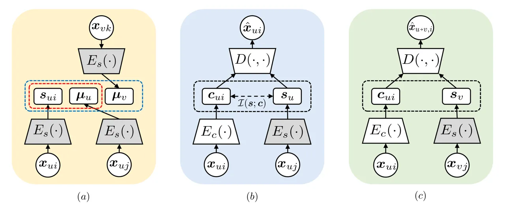
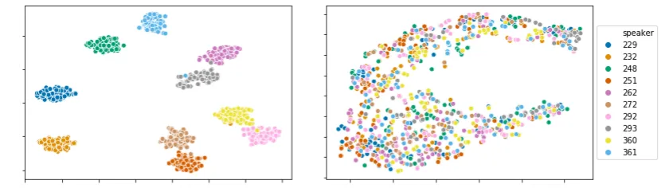
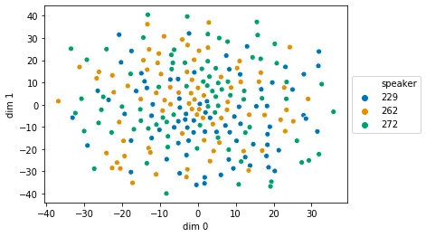
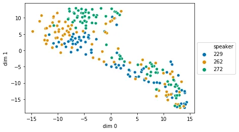
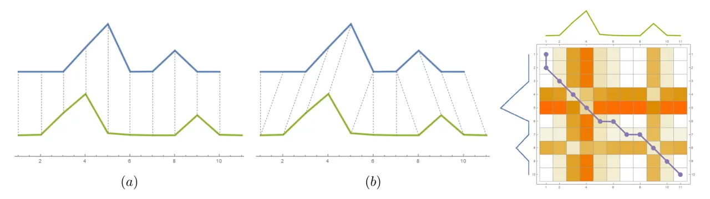
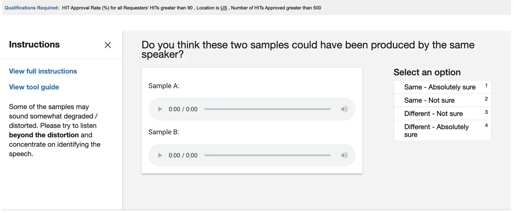
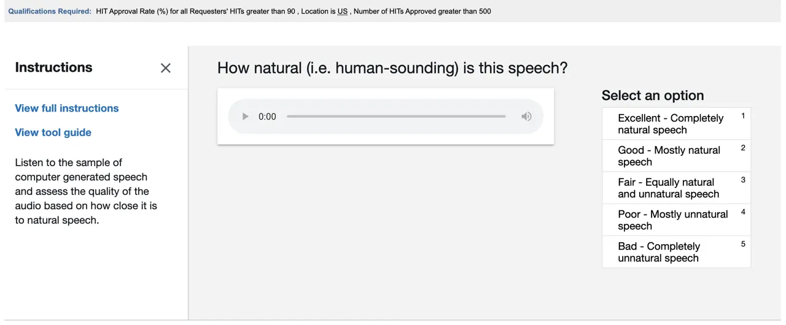

# Improving Zero-Shot Voice Style Transfer via Disentangled Representation Learning

Siyang Yuan Email: [siyang.yuan@duke.edu](mailto:)    Pengyu Cheng
^(†)^(†)thanks: Equal contribution. Affiliation: Duke University,
Durham, North Carolina, USA Email: [pengyu.cheng@duke.edu](mailto:)   
Ruiyi Zhang Affiliation: Duke University, Durham, North Carolina, USA   
Weituo Hao Affiliation: Duke University, Durham, North Carolina, USA   
Zhe Gan Affiliation: Microsoft, Redmond, Washington, USA    Lawrence
Carin Affiliation: Duke University, Durham, North Carolina, USA

###### Abstract

Voice style transfer, also called voice conversion, seeks to modify one
speaker’s voice to generate speech as if it came from another (target)
speaker. Previous works have made progress on voice conversion with
parallel training data and pre-known speakers. However, zero-shot voice
style transfer, which learns from non-parallel data and generates voices
for previously unseen speakers, remains a challenging problem. We
propose a novel zero-shot voice transfer method via disentangled
representation learning. The proposed method first encodes
speaker-related style and voice content of each input voice into
separated low-dimensional embedding spaces, and then transfers to a new
voice by combining the source content embedding and target style
embedding through a decoder. With information-theoretic guidance, the
style and content embedding spaces are representative and (ideally)
independent of each other. On real-world VCTK datasets, our method
outperforms other baselines and obtains state-of-the-art results in
terms of transfer accuracy and voice naturalness for voice style
transfer experiments under both many-to-many and zero-shot setups.

|     |
| --- |
|     |

## 1 Introduction

Style transfer, which automatically converts a data instance into a
target style, while preserving its content information, has attracted
considerable attention in various machine learning domains, including
computer vision (Gatys et al., 2016; Luan et al., 2017; Huang &
Belongie, 2017), video processing (Huang et al., 2017; Chen et al.,
2017), and natural language processing (Shen et al., 2017; Yang et al.,
2018; Lample et al., 2019; Cheng et al., 2020b). In speech processing,
style transfer was earlier recognized as voice conversion (VC) (Muda
et al., 2010), which converts one speaker’s utterance, as if it was from
another speaker but with the same semantic meaning. Voice style transfer
(VST) has received long-term research interest, due to its potential for
applications in security (Sisman et al., 2018), medicine (Nakamura
et al., 2006), entertainment (Villavicencio & Bonada, 2010) and
education (Mohammadi & Kain, 2017), among others.

Although widely investigated, VST remains challenging when applied to
more general application scenarios. Most of the traditional VST methods
require parallel training data, i.e., paired voices from two speakers
uttering the same sentence. This constraint limits the application of
such models in the real world, where data are often not pair-wise
available. Among the few existing models that address non-parallel
data (Hsu et al., 2016; Lee & Wu, 2006; Godoy et al., 2011), most
methods cannot handle many-to-many transfer (Saito et al., 2018; Kaneko
& Kameoka, 2018; Kameoka et al., 2018), which prevents them from
converting multiple source voices to multiple target speaker styles.
Even among the few non-parallel many-to-many transfer models, to the
best of our knowledge, only two models (Qian et al., 2019; Chou & Lee, 2019) allow zero-shot transfer, i.e., conversion from/to newly-coming
speakers (unseen during training) without re-training the model.

The only two zero-shot VST models (AUTOVC (Qian et al., 2019) and
AdaIN-VC (Chou & Lee, 2019)) share a common weakness. Both methods
construct encoder-decoder frameworks, which extract the style and the
content information into style and content embeddings, and generate a
voice sample by combining a style embedding and a content embedding
through the decoder. With the combination of the source content
embedding and the target style embedding, the models generate the
transferred voice, based only on source and target voice samples.
AUTOVC (Qian et al., 2019) uses a GE2E (Wan et al., 2018) pre-trained
style encoder to ensure rich speaker-related information in style
embeddings. However, AUTOVC has no regularizer to guarantee that the
content encoder does not encode any style information. AdaIN-VC (Chou &
Lee, 2019) applies instance normalization (Ulyanov et al., 2016) to the
feature map of content representations, which helps to eliminate the
style information from content embeddings. However, AdaIN-VC fails to
prevent content information from being revealed in the style embeddings.
Both methods cannot assure that the style and content embeddings are
disentangled without information revealed from each other.

With information-theoretic guidance, we propose a
disentangled-representation-learning method to enhance the
encoder-decoder zero-shot VST framework, for both style and content
information preservation. We call the proposed method
Information-theoretic Disentangled Embedding for Voice
Conversion (IDE-VC). Our model successfully induces the style and
content of voices into independent representation spaces by minimizing
the mutual information between style and content embeddings. We also
derive two new multi-group mutual information lower bounds, to further
improve the representativeness of the latent embeddings. Experiments
demonstrate that our method outperforms previous works under both
many-to-many and zero-shot transfer setups on two objective metrics and
two subjective metrics.

## 2 Background

In information theory, mutual information (MI) is a crucial concept that
measures the dependence between two random variables. Mathematically,
the MI between two variables $`{\bm{x}}`$ and $`{\bm{y}}`$ is

```math
\mathcal{I}({\bm{x}};{\bm{y}}):=\mathbb{E}_{p({\bm{x}},{\bm{y}})}\Big[\log\frac{p({\bm{x}},{\bm{y}})}{p({\bm{x}})p({\bm{y}})}\Big], \tag{1}
```

where $`p({\bm{x}})`$ and $`p({\bm{y}})`$ are marginal distributions of
$`{\bm{x}}`$ and $`{\bm{y}}`$, and $`p({\bm{x}},{\bm{y}})`$ is the joint
distribution. Recently, MI has attracted considerable interest in
machine learning as a criterion to minimize or maximize the dependence
between different parts of a model (Chen et al., 2016; Alemi et al.,
2016; Hjelm et al., 2018; Veličković et al., 2018; Song et al., 2019).
However, the calculation of exact MI values is challenging in practice,
since the closed form of joint distribution $`p({\bm{x}},{\bm{y}})`$ in
equation (1) is generally unknown. To solve this problem, several MI
estimators have been proposed. For MI maximization tasks, Nguyen,
Wainwright and Jordan (NWJ) (Nguyen et al., 2010) propose a lower bound
by representing (1) as an $`f`$-divergence (Moon & Hero, 2014):

```math
\mathcal{I}_{\text{NWJ}}:=\mathbb{E}_{p({\bm{x}},{\bm{y}})}[f({\bm{x}},{\bm{y}})]-e^{-1}\mathbb{E}_{p({\bm{x}})p({\bm{y}})}[e^{f({\bm{x}},{\bm{y}})}], \tag{2}
```

with a score function $`{f({\bm{x}},{\bm{y}})}`$. Another widely-used
sample-based MI lower bound is InfoNCE (Oord et al., 2018), which is
derived with Noise Contrastive Estimation (NCE) (Gutmann & Hyvärinen,
2010). With sample pairs $`\{({\bm{x}}_{i},{\bm{y}}_{i})\}_{i=1}^{N}`$
drawn from the joint distribution $`p({\bm{x}},{\bm{y}})`$, the InfoNCE
lower bound is defined as

```math
\mathcal{I}_{\text{NCE}}:=\mathbb{E}\Big[\frac{1}{N}\sum_{i=1}^{N}\log\frac{e^{f({\bm{x}}_{i},{\bm{y}}_{i})}}{\frac{1}{N}\sum_{j=1}^{N}e^{f({\bm{x}}_{i},{\bm{y}}_{j})}}\Big]. \tag{3}
```

For MI minimization tasks, Cheng et al. (2020a) proposed a contrastively
learned upper bound that requires the conditional distribution
$`p({\bm{x}}|{\bm{y}})`$:

```math
\mathcal{I}({\bm{x}};{\bm{y}})\leq\mathbb{E}\Big[\frac{1}{N}\sum_{i=1}^{N}\Big[\log p({\bm{x}}_{i}|{\bm{y}}_{i})-\frac{1}{N}\sum_{j=1}^{N}\log p({\bm{x}}_{j}|{\bm{y}}_{i})\Big]\Big]. \tag{4}
```

where the MI is bounded by the log-ratio of conditional distribution
$`p({\bm{x}}|{\bm{y}})`$ between positive and negative sample pairs. In
the following, we derive our information-theoretic disentangled
representation learning framework for voice style transfer based on the
MI estimators described above.

## 3 Proposed Model

We assume access to $`N`$ audio (voice) recordings from $`M`$ speakers,
where speaker $`u`$ has $`N_{u}`$ voice samples
$`\mathcal{X}_{u}=\{{\bm{x}}_{ui}\}_{i=1}^{N_{u}}`$. The proposed
approach encodes each voice input
$`{\bm{x}}\in\mathcal{X}=\cup_{u=1}^{M}\mathcal{X}_{u}`$ into a
speaker-related (style) embedding $`{\bm{s}}=E_{s}({\bm{x}})`$ and a
content-related embedding $`{\bm{c}}=E_{c}({\bm{x}})`$, using
respectively a style encoder $`E_{s}(\cdot)`$ and a content encoder
$`E_{c}(\cdot)`$. To transfer a source $`{\bm{x}}_{ui}`$ from
speaker $`u`$ to the target style of the voice of speaker $`v`$,
$`{\bm{x}}_{vj}`$, we combine the content embedding
$`{\bm{c}}_{ui}=E_{c}({\bm{x}}_{ui})`$ and the style embedding
$`{\bm{s}}_{vj}=E_{s}({\bm{x}}_{vj})`$ to generate the transferred voice
$`\hat{{\bm{x}}}_{u\to v,i}=D({\bm{s}}_{vj},{\bm{c}}_{ui})`$ with a
decoder $`D({\bm{s}},{\bm{c}})`$. To implement this two-step transfer
process, we introduce a novel mutual information (MI)-based learning
objective, that induces the style embedding $`{\bm{s}}`$ and content
embedding $`{\bm{c}}`$ into independent representation spaces (i.e.,
ideally, $`{\bm{s}}`$ contains rich style information of $`{\bm{x}}`$
with no content information, and vice versa). In the following, we first
describe our MI-based training objective in Section 3.1, and then
discuss the practical estimation of the objective in Sections 3.2 and
3.3.

### 3.1 MI-based Disentangling Objective

From an information-theoretic perspective, to learn representative
latent embedding $`({\bm{s}},{\bm{c}})`$, it is desirable to maximize
the mutual information between the embedding pair
$`({\bm{s}},{\bm{c}})`$ and the input $`{\bm{x}}`$. Meanwhile, the style
embedding $`{\bm{s}}`$ and the content $`{\bm{c}}`$ are desired to be
independent, so that we can control the style transfer process with
different style and content attributes. Therefore, we minimize the
mutual information $`\mathcal{I}({\bm{s}};{\bm{c}})`$ to disentangle the
style embedding and content embedding spaces. Consequently, our overall
disentangled-representation-learning objective seeks to minimize

```math
\mathcal{L}=\mathcal{I}({\bm{s}};{\bm{c}})-\mathcal{I}({\bm{x}};{\bm{s}},{\bm{c}})=\mathcal{I}({\bm{s}};{\bm{c}})-\mathcal{I}({\bm{x}};{\bm{c}}|{\bm{s}})-\mathcal{I}({\bm{x}};{\bm{s}}). \tag{5}
```

As discussed in Locatello et al. (Locatello et al., 2019), without
inductive bias for supervision, the learned representation can be
meaningless. To address this problem, we use the speaker identity
$`{\bm{u}}`$ as a variable with values $`\{1,\dots,M\}`$ to learn
representative style embedding $`{\bm{s}}`$ for speaker-related
attributes. Noting that the process from speaker $`u`$ to his/her voice
$`{\bm{x}}_{ui}`$ to the style embedding $`{\bm{s}}_{ui}`$ (as
$`{\bm{u}}\to{\bm{x}}\to{\bm{s}}`$) is a Markov Chain, we conclude
$`\mathcal{I}({\bm{s}};{\bm{x}})\geq\mathcal{I}({\bm{s}};{\bm{u}})`$
based on the MI data-processing inequality (Cover & Thomas, 2012) (as
stated in the Supplementary Material). Therefore, we replace
$`\mathcal{I}({\bm{s}};{\bm{x}})`$ in $`\mathcal{L}`$ with
$`\mathcal{I}({\bm{s}};{\bm{u}})`$ and minimize an upper bound instead:

```math
\bar{\mathcal{L}}=\mathcal{I}({\bm{s}};{\bm{c}})-\mathcal{I}({\bm{x}};{\bm{c}}|{\bm{s}})-\mathcal{I}({\bm{u}};{\bm{s}})\geq\mathcal{I}({\bm{s}};{\bm{c}})-\mathcal{I}({\bm{x}};{\bm{c}}|{\bm{s}})-\mathcal{I}({\bm{x}};{\bm{s}}), \tag{6}
```

In practice, calculating the MI is challenging, as we typically only
have access to samples, and lack the required distributions (Chen
et al., 2016). To solve this problem, below we provide several MI
estimates to the objective terms $`\mathcal{I}({\bm{s}};{\bm{c}})`$,
$`\mathcal{I}({\bm{x}};{\bm{c}}|{\bm{s}})`$ and
$`\mathcal{I}({\bm{u}};{\bm{s}})`$.

### 3.2 MI Lower Bound Estimation

To maximize $`\mathcal{I}({\bm{u}};{\bm{s}})`$, we derive the following
multi-group MI lower bound (Theorem 3.1) based on the NWJ bound
developed in Nguyen et al. (Nguyen et al., 2010). The detailed proof is
provided in the Supplementary Material. Let
$`{\bm{\mu}}^{(-ui)}_{v}={\bm{\mu}}_{v}`$ represent the mean of all
style embeddings in group $`\mathcal{X}_{v}`$, constituting the style
centroid of speaker $`v`$; $`{\bm{\mu}}^{(-ui)}_{u}`$ is the mean of all
style embeddings in group $`\mathcal{X}_{u}`$ except data point
$`{\bm{x}}_{ui}`$, representing a leave-$`{\bm{x}}_{ui}`$-out style
centroid of speaker $`u`$. Intuitively, we minimize
$`\|{\bm{s}}_{ui}-{\bm{\mu}}^{(-ui)}_{u}\|`$ to encourage the style
embedding of voice $`{\bm{x}}_{ui}`$ to be more similar to the style
centroid of speaker $`u`$, while maximizing
$`\|{\bm{s}}_{ui}-{\bm{\mu}}^{(-ui)}_{v}\|`$ to enlarge the margin
between $`{\bm{s}}_{ui}`$ and the other speakers’ style centroids
$`{\bm{\mu}}_{v}`$. We denote the right-hand side of (7) as
$`\hat{\mathcal{I}}_{1}`$.

###### Theorem 3.1.

Let
$`{\bm{\mu}}^{(-ui)}_{v}=\frac{1}{N_{v}}\sum_{k=1}^{N_{v}}{\bm{s}}_{vk}`$
if $`u\neq v`$; and
$`{\bm{\mu}}^{(-ui)}_{u}=\frac{1}{N_{u}-1}\sum_{j\neq i}{\bm{s}}_{uj}`$.
Then,

```math
\mathcal{I}({\bm{u}};{\bm{s}})\geq\mathbb{E}\Big[\frac{1}{N}\sum_{u=1}^{M}\sum_{i=1}^{N_{u}}\Big[-\|{\bm{s}}_{ui}-{\bm{\mu}}^{(-ui)}_{u}\|^{2}-\frac{{e}^{-1}}{N}\sum_{v=1}^{M}N_{v}\exp\{-\|{\bm{s}}_{ui}-{\bm{\mu}}^{(-ui)}_{v}\|^{2}\}\Big]\Big]. \tag{7}
```

To maximize $`\mathcal{I}({\bm{x}};{\bm{c}}|{\bm{s}})`$, we derive a
conditional mutual information lower bound below:

###### Theorem 3.2.

Assume that given $`{\bm{s}}={\bm{s}}_{u}`$, samples
$`\{({\bm{x}}_{ui},{\bm{c}}_{ui})\}_{i=1}^{N_{u}}`$ are observed. With a
variational distribution $`q_{\phi}({\bm{x}}|{\bm{s}},{\bm{c}})`$, we
have
$`\mathcal{I}({\bm{x}};{\bm{c}}|{\bm{s}})\geq\mathbb{E}[\hat{\mathcal{I}}]`$,
where

```math
\hat{\mathcal{I}}=\frac{1}{N}\sum_{u=1}^{M}\sum_{i=1}^{N_{u}}\Big[\log q_{\phi}({\bm{x}}_{ui}|{\bm{c}}_{ui},{\bm{s}}_{u})-\log\Big(\frac{1}{N_{u}}\sum_{j=1}^{N_{u}}q_{\phi}({\bm{x}}_{uj}|{\bm{c}}_{ui},{\bm{s}}_{u})\Big)\Big]. \tag{8}
```

Based on the criterion for $`{\bm{s}}`$ in equation (7), a well-learned
style encoder $`E_{s}`$ pulls all style embeddings $`{\bm{s}}_{ui}`$
from speaker $`u`$ together. Suppose $`{\bm{s}}_{u}`$ is representative
of the style embeddings of set $`\mathcal{X}_{u}`$. If we parameterize
the distribution
$`q_{\phi}({\bm{x}}|{\bm{s}},{\bm{c}})\propto\exp(-\|{\bm{x}}-D({\bm{s}},{\bm{c}})\|^{2})`$
with decoder $`D({\bm{s}},{\bm{c}})`$, then based on Theorem 3.2, we can
estimate the lower bound of $`\mathcal{I}({\bm{x}};{\bm{c}}|{\bm{s}})`$
with the following objective:

```math
\hat{\mathcal{I}}_{2}:=\frac{1}{N}\sum_{u=1}^{M}\sum_{i=1}^{N_{u}}\Big[-\|{\bm{x}}_{ui}-D({\bm{c}}_{ui},{\bm{s}}_{u})\|^{2}-\log\Big(\frac{1}{N_{u}}\sum_{j=1}^{N_{u}}\exp\{-\|{\bm{x}}_{uj}-D({\bm{c}}_{ui},{\bm{s}}_{u})\|^{2}\}\Big)\Big].
```

When maximizing $`\hat{\mathcal{I}}_{2}`$, for speaker $`u`$ with
his/her given voice style $`{\bm{s}}_{u}`$, we encourage the content
embedding $`{\bm{c}}_{ui}`$ to well reconstruct the original voice
$`{\bm{x}}_{ui}`$, with small
$`\|{\bm{x}}_{ui}-D({\bm{c}}_{ui},{\bm{s}}_{u})\|`$. Additionally, the
distance $`\|{\bm{x}}_{uj}-D({\bm{c}}_{ui},{\bm{s}}_{u})\|`$ is
minimized, ensuring $`{\bm{c}}_{ui}`$ does not contain information to
reconstruct other voices $`{\bm{x}}_{uj}`$ from speaker $`u`$. With
$`\hat{\mathcal{I}}_{2}`$, the correlation between $`{\bm{x}}_{ui}`$ and
$`{\bm{c}}_{ui}`$ is amplified, which improves $`{\bm{c}}_{ui}`$ in
preserving the content information.



Figure 1: Training and transfer processes. (a) Training style encoder
$`E_{s}`$ with objective $`\hat{\mathcal{I}}_{1}`$: All voice samples
are encoded into style embedding space. For style embedding
$`{\bm{s}}_{ui}`$ of $`{\bm{x}}_{ui}`$, we minimize its distance with
speaker $`u`$’s style centroid $`{\bm{\mu}}_{u}`$, and maximize its
distance to other speaker style centroids $`{\bm{\mu}}_{v}`$. (b)
Training for content encoder $`E_{c}`$ and decoder $`D`$ as objectives
$`\hat{\mathcal{I}}_{2},\hat{\mathcal{I}}_{3}`$: We encode content
$`{\bm{c}}_{ui}`$ from voice $`{\bm{x}}_{ui}`$ from speaker $`u`$. The
style of speaker $`u`$ is encoded from another speaker $`u`$’s voice
$`{\bm{x}}_{uj}`$. The dependency of style and content embedding is
minimized with $`\hat{\mathcal{I}}_{3}`$. With $`{\bm{c}}_{ui}`$ and
$`{\bm{s}}_{u}`$, the decoder reconstructs the voice $`{\bm{x}}_{ui}`$
as $`\hat{{\bm{x}}}_{ui}=D({\bm{s}}_{u},{\bm{c}}_{ui})`$. Then
$`\hat{\mathcal{I}}_{2}`$ is calculated based on the original voice
$`{\bm{c}}_{ui}`$ and the reconstruction $`\hat{{\bm{c}}}_{ui}`$. (c)
Transfer process: for zero-shot voice style transfer, with
$`{\bm{x}}_{ui}`$ from speaker $`u`$ and $`{\bm{x}}_{vj}`$ from
speaker $`v`$, we encode content $`{\bm{c}}_{ui}`$ and style
$`{\bm{s}}_{v}`$, and combine them together to generate a transferred
voice $`\hat{{\bm{x}}}_{u\to v,i}=D({\bm{s}}_{v},{\bm{c}}_{ui})`$.

### 3.3 MI Upper Bound Estimation

The crucial part of our framework is disentangling the style and the
content embedding spaces, which imposes (ideally) that the style
embedding $`{\bm{s}}`$ excludes any content information and vice versa.
Therefore, the mutual information between $`{\bm{s}}`$ and $`{\bm{c}}`$
is expected to be minimized. To estimate
$`\mathcal{I}({\bm{s}};{\bm{c}})`$, we derive a sample-based MI upper
bound in Theorem 3.3 base on  (4).

###### Theorem 3.3.

If $`p({\bm{s}}|{\bm{c}})`$ provides the conditional distribution
between variables $`{\bm{s}}`$ and $`{\bm{c}}`$, then

```math
\mathcal{I}({\bm{s}};{\bm{c}})\leq\mathbb{E}\Big[\frac{1}{N}\sum_{u=1}^{M}\sum_{i=1}^{N_{u}}\Big[\log p({\bm{s}}_{ui}|{\bm{c}}_{ui})-\frac{1}{N}\sum_{v=1}^{M}\sum_{j=1}^{N_{v}}\log p({\bm{s}}_{ui}|{\bm{c}}_{vj})\Big]\Big]. \tag{9}
```

The upper bound in (9) requires the ground-truth conditional
distribution $`p({\bm{s}}|{\bm{c}})`$, whose closed form is unknown.
Therefore, we use a probabilistic neural network
$`q_{\theta}({\bm{s}}|{\bm{c}})`$ to approximate
$`p({\bm{s}}|{\bm{c}})`$ by maximizing the log-likelihood
$`\mathcal{F}(\theta)=\sum_{u=1}^{M}\sum_{i=1}^{N_{u}}\log q_{\theta}({\bm{s}}_{ui}|{\bm{c}}_{ui})`$.
With the learned $`q_{\theta}({\bm{s}}|{\bm{c}})`$, the objective for
minimizing $`\mathcal{I}({\bm{s}};{\bm{c}})`$ becomes:

```math
\hat{\mathcal{I}}_{3}:=\frac{1}{N}\sum_{u=1}^{M}\sum_{i=1}^{N_{u}}\Big[\log q_{\theta}({\bm{s}}_{ui}|{\bm{c}}_{ui})-\frac{1}{N}\sum_{v=1}^{M}\sum_{j=1}^{N_{v}}\log q_{\theta}({\bm{s}}_{ui}|{\bm{c}}_{vj})\Big]. \tag{10}
```

When weights of encoders $`E_{c},E_{s}`$ are updated, the embedding
spaces $`{\bm{s}},{\bm{c}}`$ change, which leads to the changing of
conditional distribution $`p({\bm{s}}|{\bm{c}})`$. Therefore, the neural
approximation $`q_{\theta}({\bm{s}}|{\bm{c}})`$ must be updated again.
Consequently, during training, the encoders $`E_{c},E_{s}`$ and the
approximation $`q_{\theta}({\bm{s}}|{\bm{c}})`$ are updated iteratively.
In the Supplementary Material, we further discuss that with a good
approximation $`q_{\theta}({\bm{s}}|{\bm{c}})`$,
$`\hat{\mathcal{I}}_{3}`$ remains an MI upper bound.

### 3.4 Encoder-Decoder Framework

With the aforementioned MI estimates $`\hat{\mathcal{I}}_{1}`$,
$`\hat{\mathcal{I}}_{2}`$, and $`\hat{\mathcal{I}}_{3}`$, the final
training loss of our method is

```math
\mathcal{L}^{*}=[\hat{\mathcal{I}}_{3}-\hat{\mathcal{I}}_{1}-\hat{\mathcal{I}}_{2}]-\beta\mathcal{F}(\theta), \tag{11}
```

where $`\beta`$ is a positive number re-weighting the two objective
terms. Term
$`\hat{\mathcal{I}}_{3}-\hat{\mathcal{I}}_{1}-\hat{\mathcal{I}}_{2}`$ is
minimized w.r.t the parameters in encoders $`E_{c},E_{s}`$ and decoder
$`D`$; term $`\mathcal{F}(\theta)`$ as the likelihood function of
$`q_{\theta}({\bm{s}}|{\bm{c}})`$ is maximized w.r.t the parameter
$`\theta`$. In practice, the two terms are updated iteratively with
gradient descent (by fixing one and updating another). The training and
transfer processes of our model are shown in Figure 1. We name this
MI-guided learning framework as Information-theoretic Disentangled
Embedding for Voice Conversion (IDE-VC).

## 4 Related Work

Many-to-many Voice Conversion Traditional voice style transfer methods
mainly focus on one-to-one and many-to-one conversion tasks, which can
only transfer voices into one target speaking style. This constraint
limits the applicability of the methods. Recently, several many-to-many
voice conversion methods have been proposed, to convert voices in
broader application scenarios. StarGAN-VC (Kameoka et al., 2018) uses
StarGAN (Choi et al., 2018) to enable many-to-many transfer, in which
voices are fed into a unique generator conditioned on the target speaker
identity. A discriminator is also used to evaluate generation quality
and transfer accuracy. Blow (Serrà et al., 2019) is a flow-based
generative model (Kingma & Dhariwal, 2018), that maps voices from
different speakers into the same latent space via normalizing
flow (Rezende & Mohamed, 2015). The conversion is accomplished by
transforming the latent representation back to the observation space
with the target speaker’s identifier. Two other many-to-many conversion
models, AUTOVC (Qian et al., 2019) and AdaIN-VC (Chou & Lee, 2019),
extend applications into zero-shot scenarios, i.e., conversion from/to a
new speaker (unseen during training), based on only a few utterances.
Both AUTOVC and AdaIN-VC construct an encoder-decoder framework, which
extracts the style and content of one speech sample into separate latent
embeddings. Then when a new voice from an unseen speaker comes, both its
style and content embeddings can be extracted directly. However, as
discussed in the Introduction, both methods do not have explicit
regularizers to reduce the correlation between style and content
embeddings, which limits their performance.

Disentangled Representation Learning Disentangled representation
learning (DRL) aims to encode data points into separate independent
embedding subspaces, where different subspaces represent different data
attributes. DRL methods can be classified into unsupervised and
supervised approaches. Under unsupervised setups, Burgess et al. (2018),
Higgins et al. (2016) and Kim & Mnih (2018) use latent embeddings to
reconstruct the original data while keeping each dimension of the
embeddings independent with correlation regularizers. This has been
challenged by Locatello et al. (2019), in that each part of the learned
embeddings may not be mapped to a meaningful data attribute. In
contrast, supervised DRL methods effectively learn meaningful
disentangled embedding parts by adding different supervision to
different embedding components. Between the two embedding parts, the
correlation is still required to be reduced to prevent the revealing of
information to each other. The correlation-reducing methods mainly focus
on adversarial training between embedding parts (Hjelm et al., 2018; Kim
& Mnih, 2018), and mutual information minimization (Chen et al., 2018;
Cheng et al., 2020b). By applying operations such as switching and
combining, one can use disentangled representations to improve empirical
performance on downstream tasks, e.g. conditional generation (Burgess
et al., 2018), domain adaptation (Gholami et al., 2020), and few-shot
learning (Higgins et al., 2017).

## 5 Experiments

We evaluate our IDE-VC on real-world voice a dataset under both
many-to-many and zero-shot VST setups. The selected dataset is CSTR
Voice Cloning Toolkit (VCTK) (Yamagishi et al., 2019), which includes 46
hours of audio from 109 speakers. Each speaker reads a different sets of
utterances, and the training voices are provided in a non-parallel
manner. The audios are downsampled at 16kHz. In the following, we first
describe the evaluation metrics and the implementation details, and then
analyze our model’s performance relative to other baselines under
many-to-many and zero-shot VST settings.

### 5.1 Evaluation Metrics

Objective Metrics We consider two objective metrics: Speaker
verification accuracy (Verification) and the Mel-Cepstral Distance
(Distance) (Kubichek, 1993). The speaker verification accuracy measures
whether the transferred voice belongs to the target speaker. For fair
comparison, we used a third-party pre-trained speaker encoder
Resemblyzer¹¹ 1 https://github.com/resemble-ai/Resemblyzer to classify
the speaker identity from the transferred voices. Specifically, style
centroids for speakers are learned with ground-truth voice samples. For
a transferred voice, we encode it via the pre-trained speaker encoder
and find the speaker with the closest style centroid as the identity
prediction. For the Distance, the vanilla Mel-Cepstral Distance (MCD)
cannot handle the time alignment issue described in Section 2. To make
reasonable comparisons between the generation and ground truth, we apply
the Dynamic Time Warping (DTW) algorithm (Berndt & Clifford, 1994) to
automatically align the time-evolving sequences before calculating MCD.
This DTW-MCD distance measures the similarity of the transferred voice
and the real voice from the target speaker. Since the calculation of
DTW-MCD requires parallel data, we select voices with the same content
from the VCTK dataset as testing pairs. Then we transfer one voice in
the pair and calculate DTW-MCD with the other voice as reference.

Subjective Metrics Following Wester et al. (Wester et al., 2016), we use
the naturalness of the speech (Naturalness), and the similarity of the
transferred speech to target identity (Similarity) as subjective
metrics. For Naturalness, annotators are asked to rate the score from
1-5 for each transferred speech.For the Similarity, the annotators are
presented with two audios (the converted speech and the corresponding
reference), and are asked to rate the score from 1 to 4. For both
scores, the higher the better. Following the setting in Blow (Serrà
et al., 2019), we report Similarity defined as a total percentage from
the binary rating. The evaluation of both subjective metrics is
conducted on Amazon Mechanical Turk (MTurk)²² 2 https://www.mturk.com/.
More details about evaluation metrics are provided in the Supplementary
Material.

### 5.2 Implementation Details

Following AUTOVC (Qian et al., 2019), our model inputs are represented
via mel-spectrogram. The number of mel-frequency bins is set as 80. When
voices are generated, we adopt the WaveNet vocoder (Oord et al., 2016)
pre-trained on the VCTK corpus to invert the spectrogram signal back to
a waveform. The spectrogram is first upsampled with deconvolutional
layers to match the sampling rate, and then a standard 40-layer WaveNet
is applied to generate speech waveforms. Our model is implememted with
Pytorch and takes 1 GPU day on an Nvidia Xp to train.

Encoder Architecture The speaker encoder consists of a 2-layer long
short-term memory (LSTM) with cell size of 768, and a fully-connected
layer with output dimension 256. The speaker encoder is initialized with
weights from a pretrained GE2E (Wan et al., 2018) encoder. The input of
the content encoder is the concatenation of the mel-spectrogram signal
and the corresponding speaker embedding. The content encoder consists of
three convolutional layers with 512 channels, and two layers of a
bidirectional LSTM with cell dimension 32. Following the setup in
AUTOVC (Qian et al., 2019), the forward and backward outputs of the
bi-directional LSTM are downsampled by 16.

Decoder Architecture Following AUTOVC (Qian et al., 2019), the initial
decoder consists of a three-layer convolutional neural network (CNN)
with 512 channels, three LSTM layers with cell dimension 1024, and
another convolutional layer to project the output of the LSTM to
dimension of 80. To enhance the quality of the spectrogram, following
AUTOVC (Qian et al., 2019), we use a post-network consisting of five
convolutional layers with 512 channels for the first four layers, and 80
channels for the last layer. The output of the post-network can be
viewed as a residual signal. The final conversion signal is computed by
directly adding the output of the initial decoder and the post-network.
The reconstruction loss is applied to both the output of the initial
decoder and the final conversion signal.

Approximation Network Architecture As described in Section 3.3,
minimizing the mutual information between style and content embeddings
requires an auxiliary variational approximation
$`q_{\theta}({\bm{s}}|{\bm{c}})`$. For implementation, we parameterize
the variational distribution in the Gaussian distribution family
$`q_{\theta}({\bm{s}}|{\bm{c}})=\mathcal{N}({\bm{\mu}}_{\theta}({\bm{c}}),\bm{\sigma}_{\theta}^{2}({\bm{c}})\cdot\bm{\mathrm{I}})`$,
where mean $`{\bm{\mu}}_{\theta}(\cdot)`$ and variance
$`\bm{\sigma}^{2}_{\theta}(\cdot)`$ are two-layer fully-connected
networks with $`\tanh(\cdot)`$ as the activation function. With the
Gaussian parameterization, the likelihoods in objective
$`\hat{\mathcal{I}}_{3}`$ can be calculated in closed form.

### 5.3 Style Transfer Performance

| Metric        | Objective |                   | Subjective          |                  |
| ------------- | --------- | ----------------- | ------------------- | ---------------- |
|               | Distance  | Verification\[%\] | Naturalness \[1–5\] | Similarity \[%\] |
| StarGAN       | 6.73      | 71.1              | 2.77                | 51.5             |
| AdaIN-VC      | 6.98      | 85.5              | 2.19                | 50.8             |
| AUTOVC        | 6.73      | 89.9              | 3.25                | 55.0             |
| Blow          | 8.08      | \-                | 2.11                | 10.8             |
| IDE-VC (Ours) | 6.70      | 92.2              | 3.26                | 68.5             |

Table 1: Many-to-many VST evaluation results. For all metrics except
Distance, higher is better.

For the many-to-many VST task, we randomly select 10% of the sentences
for validation and 10% of the sentences for testing from the VCTK
dataset, following the setting in Blow (Serrà et al., 2019). The rest of
the data are used for training in a non-parallel scheme. For evaluation,
we select voice pairs from the testing set, in which each pair of voices
have the same content but come from different speakers. In each testing
pair, we conduct transfer from one voice to the other voice’s speaking
style, and then we compare the transferred voice and the other voice as
evaluating the model performance. We test our model with four
competitive baselines: Blow (Serrà et al., 2019)³³ 3 For Blow model, we
use the official implementation available on Github
(https://github.com/joansj/blow). We report the best result we can
obtain here, under training for 100 epochs (11.75 GPU days on Nvidia
V100)., AUTOVC (Qian et al., 2019), AdaIN-VC (Chou & Lee, 2019) and
StarGAN-VC (Kameoka et al., 2018). The detailed implementation of these
four methods are provided in the Supplementary Material. Table 1 shows
the subjective and objective evaluation for the many-to-many VST task.
Both methods with the encoder-decoder framework, AdaIN-VC and AUTOVC,
have competitive results. However, our IDE-VC outperforms the other
baselines on all metrics, demonstrating that the style-content
disentanglement in the latent space improves the performance of the
encoder-decoder framework.

| Metric        | Objective |                   | Subjective          |                  |
| ------------- | --------- | ----------------- | ------------------- | ---------------- |
|               | Distance  | Verification\[%\] | Naturalness \[1–5\] | Similarity \[%\] |
| AdaIN-VC      | 6.37      | 76.7              | 2.67                | 68.4             |
| AUTOVC        | 6.68      | 60.0              | 2.19                | 58.6             |
| IDE-VC (Ours) | 6.31      | 81.1              | 3.33                | 76.4             |

Table 2: Zero-Shot VST evaluation results. For all metrics except
Distance, higher is better.

For the zero-shot VST task, we use the same train-validation dataset
split as in the many-to-many setup. The testing data are selected to
guarantee that no test speaker has any utterance in the training set. We
compare our model with the only two baselines, AUTOVC (Qian et al., 2019) and AdaIN-VC (Chou & Lee, 2019), that are able to handle voice
transfer for newly-coming unseen speakers. We used the same
implementations of AUTOVC and AdaIN-VC as in the many-to-many VST. The
evaluation results of zero-shot VST are shown in Table 2, among the two
baselines AdaIN-VC performs better than AUTOVC overall.Our IDE-VC
outperforms both baseline methods, on all metrics. All three tested
models have encoder-decoder transfer frameworks, the superior
performance of IDE-VC indicates the effectiveness of our disentangled
representation learning scheme. More evaluation details are provided in
the supplementary material.

### 5.4 Disentanglement Discussion

Besides the performance comparison with other VST baselines, we
demonstrate the capability of our information-theoretic disentangled
representation learning scheme. First, we conduct a t-SNE (Maaten &
Hinton, 2008) visualization of the latent spaces of the IDE-VC model. As
shown in the left of Figure 2, style embeddings from the same speaker
are well clustered, and style embeddings from different speakers
separate in a clean manner. The clear pattern indicates our style
encoder $`E_{s}`$ can verify the speakers’ identity from the voice
samples. In contrast, the content embeddings (in the right of Figure 2)
are indistinguishable for different speakers, which means our content
encoder $`E_{c}`$ successfully eliminates speaker-related information
and extracts rich semantic content from the data.



Figure 2: Left: t-SNE visualization for speaker embeddings. Right: t-SNE
visualization for content embedding. The embeddings are extracted from
the voice samples of 10 different speakers.

|          | Accuracy\[%\] |
| -------- | ------------- |
| AUTOVC   | 9.5           |
| AdaIN-VC | 19.0          |
| IDE-VC   | 8.1           |

Table 3: Speaker identity prediction accuracy on content embedding.

We also empirically evaluate the disentanglement, by predicting the
speakers’ identity based on only the content embeddings. A two-layer
fully-connected network is trained on the testing set with a content
embedding as input, and the corresponding speaker identity as output. We
compare our IDE-VC with AUTOVC and AdaIN-VC, which also output content
embeddings. The classification results are shown in Table 3. Our IDE-VC
reaches the lowest classification accuracy, indicating that the content
embeddings learned by IDE-VC contains the least speaker-related
information. Therefore, our IDE-VC learns disentangled representations
with high quality compared with other baselines.

### 5.5 Ablation Study

|                                   | Distance | Verification\[%\] |
| --------------------------------- | -------- | ----------------- |
| Without $`\hat{\mathcal{I}}_{1}`$ | 9.81     | 11.1              |
| Without $`\hat{\mathcal{I}}_{3}`$ | 6.73     | 89.4              |
| IDE-VC                            | 5.66     | 92.2              |

Table 4: Ablation study with different training losses. Performance is
measured by objective metrics.

Moreover, we have considered an ablation study that addresses
performance effects from different learning losses in (11), with results
shown in Table 4. We compare our model with two models trained by part
of the loss function in (11), while keeping the other training setups
unchanged, including the model structure. From the results, when the
model is trained without the style encoder loss term
$`\hat{\mathcal{I}}_{1}`$, a transferred voice still is generated, but
with a large distance to the ground truth. The verification accuracy
also significantly decreases with no speaker-related information
utilized. When the disentangling term $`\hat{\mathcal{I}}_{3}`$ is
removed, the model still reaches competitive performance, because the
style encoder $`E_{s}`$ and decoder $`D`$ are well trained by
$`\hat{\mathcal{I}}_{1}`$ and $`\hat{\mathcal{I}}_{2}`$. However, when
adding term $`\hat{\mathcal{I}}_{3}`$, we disentangle the style and
content spaces, and improve the transfer quality with higher
verification accuracy and less distortion. The performance without term
$`\hat{\mathcal{I}}_{2}`$ is not reported, because the model cannot even
generate fluent speech without the reconstruction loss.

## 6 Conclusions

We have improved the encoder-decoder voice style transfer framework by
disentangled latent representation learning. To effectively induce the
style and content information of speech into independent embedding
latent spaces, we minimize a sample-based mutual information upper bound
between style and content embeddings. The disentanglement of the two
embedding spaces ensures the voice transfer accuracy without information
revealed from each other. We have also derived two new multi-group
mutual information lower bounds, which are maximized during training to
enhance the representativeness of the latent embeddings. On the
real-world VCTK dataset, our model outperforms previous works under both
many-to-many and zero-shot voice style transfer setups. Our model can be
naturally extended to other style transfer tasks modeling time-evolving
sequences, e.g., video and music style transfer. Moreover, our general
multi-group mutual information lower bounds have broader potential
applications in other representation learning tasks.

## Acknowledgements

This research was supported in part by the DOE, NSF and ONR.

## References

- Alemi et al. (2016) Alexander A Alemi, Ian Fischer, Joshua V Dillon,
  and Kevin Murphy. Deep variational information bottleneck. _arXiv
  preprint arXiv:1612.00410_, 2016.
- Berndt & Clifford (1994) Donald J Berndt and James Clifford. Using
  dynamic time warping to find patterns in time series. In _KDD
  workshop_, pp. 359–370. Seattle, WA, 1994.
- Burgess et al. (2018) Christopher P Burgess, Irina Higgins, Arka Pal,
  Loic Matthey, Nick Watters, Guillaume Desjardins, and Alexander
  Lerchner. Understanding disentangling in beta-vae. _arXiv preprint
  arXiv:1804.03599_, 2018.
- Chapaneri (2012) Santosh V Chapaneri. Spoken digits recognition using
  weighted mfcc and improved features for dynamic time warping.
  _International Journal of Computer Applications_, 40(3):6–12, 2012.
- Chen et al. (2017) Dongdong Chen, Jing Liao, Lu Yuan, Nenghai Yu, and
  Gang Hua. Coherent online video style transfer. In _Proceedings of the
  IEEE International Conference on Computer Vision_, pp.
  1105–1114, 2017.
- Chen et al. (2018) Tian Qi Chen, Xuechen Li, Roger B Grosse, and
  David K Duvenaud. Isolating sources of disentanglement in variational
  autoencoders. In _Advances in Neural Information Processing Systems_,
  pp. 2610–2620, 2018.
- Chen et al. (2016) Xi Chen, Yan Duan, Rein Houthooft, John Schulman,
  Ilya Sutskever, and Pieter Abbeel. Infogan: Interpretable
  representation learning by information maximizing generative
  adversarial nets. In _Advances in neural information processing
  systems_, pp. 2172–2180, 2016.
- Cheng et al. (2020a) Pengyu Cheng, Weituo Hao, Shuyang Dai, Jiachang
  Liu, Zhe Gan, and Lawrence Carin. Club: A contrastive log-ratio upper
  bound of mutual information. In _International Conference on Machine
  Learning_, pp. 1779–1788. PMLR, 2020a.
- Cheng et al. (2020b) Pengyu Cheng, Renqiang Min, Shen Dinghan,
  Christopher Malon, Yizhe Zhang, Li Yitong, and Lawrence Carin.
  Improving disentangled text representation learning with
  information-theoretic guidance. In _Proceedings of the 58th Annual
  Meeting of the Association for Computational Linguistics_, 2020b.
- Choi et al. (2018) Yunjey Choi, Minje Choi, Munyoung Kim, Jung-Woo Ha,
  Sunghun Kim, and Jaegul Choo. Stargan: Unified generative adversarial
  networks for multi-domain image-to-image translation. In _Proceedings
  of the IEEE conference on computer vision and pattern recognition_,
  pp. 8789–8797, 2018.
- Chou & Lee (2019) Ju-chieh Chou and Hung-Yi Lee. One-shot voice
  conversion by separating speaker and content representations with
  instance normalization. _Proc. Interspeech 2019_, pp. 664–668, 2019.
- Cover & Thomas (2012) Thomas M Cover and Joy A Thomas. _Elements of
  information theory_. John Wiley & Sons, 2012.
- Dhingra et al. (2013) Shivanker Dev Dhingra, Geeta Nijhawan, and
  Poonam Pandit. Isolated speech recognition using mfcc and dtw.
  _International Journal of Advanced Research in Electrical, Electronics
  and Instrumentation Engineering_, 2(8):4085–4092, 2013.
- Gatys et al. (2016) Leon A Gatys, Alexander S Ecker, and Matthias
  Bethge. Image style transfer using convolutional neural networks. In
  _Proceedings of the IEEE conference on computer vision and pattern
  recognition_, pp. 2414–2423, 2016.
- Gholami et al. (2020) Behnam Gholami, Pritish Sahu, Ognjen Rudovic,
  Konstantinos Bousmalis, and Vladimir Pavlovic. Unsupervised
  multi-target domain adaptation: An information theoretic approach.
  _IEEE Transactions on Image Processing_, 2020.
- Godoy et al. (2011) Elizabeth Godoy, Olivier Rosec, and Thierry
  Chonavel. Voice conversion using dynamic frequency warping with
  amplitude scaling, for parallel or nonparallel corpora. _IEEE
  Transactions on Audio, Speech, and Language Processing_,
  20(4):1313–1323, 2011.
- Gutmann & Hyvärinen (2010) Michael Gutmann and Aapo Hyvärinen.
  Noise-contrastive estimation: A new estimation principle for
  unnormalized statistical models. In _Proceedings of the Thirteenth
  International Conference on Artificial Intelligence and Statistics_,
  pp. 297–304, 2010.
- Higgins et al. (2016) Irina Higgins, Loic Matthey, Arka Pal,
  Christopher Burgess, Xavier Glorot, Matthew Botvinick, Shakir Mohamed,
  and Alexander Lerchner. beta-vae: Learning basic visual concepts with
  a constrained variational framework. In _International Conference on
  Learning Representations_, 2016.
- Higgins et al. (2017) Irina Higgins, Arka Pal, Andrei Rusu, Loic
  Matthey, Christopher Burgess, Alexander Pritzel, Matthew Botvinick,
  Charles Blundell, and Alexander Lerchner. Darla: Improving zero-shot
  transfer in reinforcement learning. In _Proceedings of the 34th
  International Conference on Machine Learning-Volume 70_, pp.
  1480–1490. JMLR. org, 2017.
- Hjelm et al. (2018) R Devon Hjelm, Alex Fedorov, Samuel
  Lavoie-Marchildon, Karan Grewal, Phil Bachman, Adam Trischler, and
  Yoshua Bengio. Learning deep representations by mutual information
  estimation and maximization. _arXiv preprint arXiv:1808.06670_, 2018.
- Hsu et al. (2016) Chin-Cheng Hsu, Hsin-Te Hwang, Yi-Chiao Wu, Yu Tsao,
  and Hsin-Min Wang. Voice conversion from non-parallel corpora using
  variational auto-encoder. In _2016 Asia-Pacific Signal and Information
  Processing Association Annual Summit and Conference (APSIPA)_, pp.
  1–6. IEEE, 2016.
- Huang et al. (2017) Haozhi Huang, Hao Wang, Wenhan Luo, Lin Ma, Wenhao
  Jiang, Xiaolong Zhu, Zhifeng Li, and Wei Liu. Real-time neural style
  transfer for videos. In _Proceedings of the IEEE Conference on
  Computer Vision and Pattern Recognition_, pp. 783–791, 2017.
- Huang & Belongie (2017) Xun Huang and Serge Belongie. Arbitrary style
  transfer in real-time with adaptive instance normalization. In
  _Proceedings of the IEEE International Conference on Computer Vision_,
  pp. 1501–1510, 2017.
- Kameoka et al. (2018) Hirokazu Kameoka, Takuhiro Kaneko, Kou Tanaka,
  and Nobukatsu Hojo. Stargan-vc: Non-parallel many-to-many voice
  conversion using star generative adversarial networks. In _2018 IEEE
  Spoken Language Technology Workshop (SLT)_, pp. 266–273. IEEE, 2018.
- Kaneko & Kameoka (2018) Takuhiro Kaneko and Hirokazu Kameoka.
  Cyclegan-vc: Non-parallel voice conversion using cycle-consistent
  adversarial networks. In _2018 26th European Signal Processing
  Conference (EUSIPCO)_, pp. 2100–2104. IEEE, 2018.
- Kim & Mnih (2018) Hyunjik Kim and Andriy Mnih. Disentangling by
  factorising. In _International Conference on Machine Learning_, pp.
  2649–2658, 2018.
- Kingma & Dhariwal (2018) Durk P Kingma and Prafulla Dhariwal. Glow:
  Generative flow with invertible 1x1 convolutions. In _Advances in
  Neural Information Processing Systems_, pp. 10215–10224, 2018.
- Kubichek (1993) Robert Kubichek. Mel-cepstral distance measure for
  objective speech quality assessment. In _Proceedings of IEEE Pacific
  Rim Conference on Communications Computers and Signal Processing_,
  volume 1, pp. 125–128. IEEE, 1993.
- Lample et al. (2019) Guillaume Lample, Sandeep Subramanian, Eric
  Smith, Ludovic Denoyer, Marc’Aurelio Ranzato, and Y-Lan Boureau.
  Multiple-attribute text rewriting. In _International Conference on
  Learning Representations_, 2019.
- Lee & Wu (2006) Chung-Han Lee and Chung-Hsien Wu. Map-based adaptation
  for speech conversion using adaptation data selection and non-parallel
  training. In _Ninth International Conference on Spoken Language
  Processing_, 2006.
- Locatello et al. (2019) Francesco Locatello, Stefan Bauer, Mario
  Lucic, Gunnar Raetsch, Sylvain Gelly, Bernhard Schölkopf, and Olivier
  Bachem. Challenging common assumptions in the unsupervised learning of
  disentangled representations. In _International Conference on Machine
  Learning_, pp. 4114–4124, 2019.
- Luan et al. (2017) Fujun Luan, Sylvain Paris, Eli Shechtman, and
  Kavita Bala. Deep photo style transfer. In _Proceedings of the IEEE
  Conference on Computer Vision and Pattern Recognition_, pp.
  4990–4998, 2017.
- Maaten & Hinton (2008) Laurens van der Maaten and Geoffrey Hinton.
  Visualizing data using t-sne. _Journal of machine learning research_,
  9(Nov):2579–2605, 2008.
- Mohammadi & Kain (2017) Seyed Hamidreza Mohammadi and Alexander Kain.
  An overview of voice conversion systems. _Speech Communication_,
  88:65–82, 2017.
- Moon & Hero (2014) Kevin R Moon and Alfred O Hero. Ensemble estimation
  of multivariate f-divergence. In _2014 IEEE International Symposium on
  Information Theory_, pp. 356–360. IEEE, 2014.
- Muda et al. (2010) Lindasalwa Muda, Mumtaj Begam, and Irraivan
  Elamvazuthi. Voice recognition algorithms using mel frequency cepstral
  coefficient (mfcc) and dynamic time warping (dtw) techniques. _arXiv
  preprint arXiv:1003.4083_, 2010.
- Nagrani et al. (2017) Arsha Nagrani, Joon Son Chung, and Andrew
  Zisserman. Voxceleb: a large-scale speaker identification dataset.
  _arXiv preprint arXiv:1706.08612_, 2017.
- Nakamura et al. (2006) Keigo Nakamura, Tomoki Toda, Hiroshi
  Saruwatari, and Kiyohiro Shikano. Speaking aid system for total
  laryngectomees using voice conversion of body transmitted artificial
  speech. In _Ninth International Conference on Spoken Language
  Processing_, 2006.
- Nguyen et al. (2010) XuanLong Nguyen, Martin J Wainwright, and
  Michael I Jordan. Estimating divergence functionals and the likelihood
  ratio by convex risk minimization. _IEEE Transactions on Information
  Theory_, 56(11):5847–5861, 2010.
- Oord et al. (2016) Aaron van den Oord, Sander Dieleman, Heiga Zen,
  Karen Simonyan, Oriol Vinyals, Alex Graves, Nal Kalchbrenner, Andrew
  Senior, and Koray Kavukcuoglu. Wavenet: A generative model for raw
  audio. _arXiv preprint arXiv:1609.03499_, 2016.
- Oord et al. (2018) Aaron van den Oord, Yazhe Li, and Oriol Vinyals.
  Representation learning with contrastive predictive coding. _arXiv
  preprint arXiv:1807.03748_, 2018.
- Panayotov et al. (2015) Vassil Panayotov, Guoguo Chen, Daniel Povey,
  and Sanjeev Khudanpur. Librispeech: an asr corpus based on public
  domain audio books. In _2015 IEEE International Conference on
  Acoustics, Speech and Signal Processing (ICASSP)_, pp. 5206–5210.
  IEEE, 2015.
- Qian et al. (2019) Kaizhi Qian, Yang Zhang, Shiyu Chang, Xuesong Yang,
  and Mark Hasegawa-Johnson. Autovc: Zero-shot voice style transfer with
  only autoencoder loss. In _International Conference on Machine
  Learning_, pp. 5210–5219, 2019.
- Rezende & Mohamed (2015) Danilo Rezende and Shakir Mohamed.
  Variational inference with normalizing flows. In _International
  Conference on Machine Learning_, pp. 1530–1538, 2015.
- Saito et al. (2018) Yuki Saito, Yusuke Ijima, Kyosuke Nishida, and
  Shinnosuke Takamichi. Non-parallel voice conversion using variational
  autoencoders conditioned by phonetic posteriorgrams and d-vectors. In
  _2018 IEEE International Conference on Acoustics, Speech and Signal
  Processing (ICASSP)_, pp. 5274–5278. IEEE, 2018.
- Serrà et al. (2019) Joan Serrà, Santiago Pascual, and Carlos Segura
  Perales. Blow: a single-scale hyperconditioned flow for non-parallel
  raw-audio voice conversion. In _Advances in Neural Information
  Processing Systems_, pp. 6790–6800, 2019.
- Shen et al. (2017) Tianxiao Shen, Tao Lei, Regina Barzilay, and Tommi
  Jaakkola. Style transfer from non-parallel text by cross-alignment. In
  _Advances in neural information processing systems_, pp.
  6830–6841, 2017.
- Sisman et al. (2018) Berrak Sisman, Mingyang Zhang, Sakriani Sakti,
  Haizhou Li, and Satoshi Nakamura. Adaptive wavenet vocoder for
  residual compensation in gan-based voice conversion. In _2018 IEEE
  Spoken Language Technology Workshop (SLT)_, pp. 282–289. IEEE, 2018.
- Song et al. (2019) Jiaming Song, Pratyusha Kalluri, Aditya Grover,
  Shengjia Zhao, and Stefano Ermon. Learning controllable fair
  representations. In _The 22nd International Conference on Artificial
  Intelligence and Statistics_, pp. 2164–2173, 2019.
- Ulyanov et al. (2016) Dmitry Ulyanov, Andrea Vedaldi, and Victor
  Lempitsky. Instance normalization: The missing ingredient for fast
  stylization. _arXiv preprint arXiv:1607.08022_, 2016.
- Veličković et al. (2018) Petar Veličković, William Fedus, William L
  Hamilton, Pietro Liò, Yoshua Bengio, and R Devon Hjelm. Deep graph
  infomax. _arXiv preprint arXiv:1809.10341_, 2018.
- Villavicencio & Bonada (2010) Fernando Villavicencio and Jordi Bonada.
  Applying voice conversion to concatenative singing-voice synthesis. In
  _Eleventh annual conference of the international speech communication
  association_, 2010.
- Wan et al. (2018) Li Wan, Quan Wang, Alan Papir, and Ignacio Lopez
  Moreno. Generalized end-to-end loss for speaker verification. In _2018
  IEEE International Conference on Acoustics, Speech and Signal
  Processing (ICASSP)_, pp. 4879–4883. IEEE, 2018.
- Wester et al. (2016) Mirjam Wester, Zhizheng Wu, and Junichi
  Yamagishi. Analysis of the voice conversion challenge 2016 evaluation
  results. In _Interspeech_, pp. 1637–1641, 2016.
- Yamagishi et al. (2019) Junichi Yamagishi, Christophe Veaux, Kirsten
  MacDonald, et al. Cstr vctk corpus: English multi-speaker corpus for
  cstr voice cloning toolkit (version 0.92). 2019.
- Yang et al. (2018) Zichao Yang, Zhiting Hu, Chris Dyer, Eric P Xing,
  and Taylor Berg-Kirkpatrick. Unsupervised text style transfer using
  language models as discriminators. In _Advances in Neural Information
  Processing Systems_, pp. 7287–7298, 2018.

## Appendix A Proofs

###### Theorem A.1 (Theorem 3.1).

Let
$`{\bm{\mu}}^{(-ui)}_{v}=\frac{1}{N_{v}}\sum_{k=1}^{N_{v}}{\bm{s}}_{vk}`$
if $`u\neq v`$; and
$`{\bm{\mu}}^{(-ui)}_{u}=\frac{1}{N_{u}-1}\sum_{j\neq i}{\bm{s}}_{uj}`$.
Then,

```math
\mathcal{I}({\bm{u}};{\bm{s}})\geq\mathbb{E}\Big[\frac{1}{N}\sum_{u=1}^{M}\sum_{i=1}^{N_{u}}\Big[-\|{\bm{s}}_{ui}-{\bm{\mu}}^{(-ui)}_{u}\|^{2}-\frac{{e}^{-1}}{N}\sum_{v=1}^{M}[N_{v}\exp(-\|{\bm{s}}_{ui}-{\bm{\mu}}^{(-ui)}_{v}\|^{2})]\Big]\Big]. \tag{12}
```

###### Proof of Theorem 3.1.

By the condition in the Theorem, we have the given sample pairs
$`\{(u,{\bm{s}}_{ui})\}_{1\leq u\leq M,1\leq i\leq N_{u}}`$. Not that
each pair of speaker identity and style embedding,
$`(u,{\bm{s}}_{ui})`$, can be regarded as a sample from the joint
distribution $`p({\bm{u}},{\bm{s}})`$. To clearify the proof, we change
the notation of random variables $`{\bm{u}}`$ and $`{\bm{s}}`$ to
$`{\bm{U}}`$ and $`{\bm{S}}`$, which are distinct to samples
$`\{(u,{\bm{s}}_{ui})\}\sim p({\bm{U}},{{\bm{S}}})`$.

For a sample pair $`(u,{\bm{s}}_{ui})`$, by the NWJ lower bound, we have

```math
\displaystyle\mathcal{I}({\bm{U}};{\bm{S}})\geq \displaystyle\mathbb{E}_{p({\bm{U}},{\bm{S}})}[f({\bm{U}},{\bm{S}})]-e^{-1}\mathbb{E}_{p({\bm{U}})p({\bm{S}})}[e^{f({\bm{U}},{\bm{S}})}]
```

```math
\displaystyle= \displaystyle\mathbb{E}_{p({\bm{S}})}\Big[\mathbb{E}_{p({\bm{U}}|{\bm{S}})}[f({\bm{U}},{\bm{S}})]-e^{-1}\mathbb{E}_{p({\bm{U}})}[e^{f({\bm{U}},{\bm{S}})}]\Big]
```

```math
\displaystyle= \displaystyle\mathbb{E}_{{\bm{s}}_{ui}\sim p({\bm{S}})}\Big[\mathbb{E}_{p({\bm{U}}|{\bm{S}}={\bm{s}}_{ui})}[f({\bm{U}},{\bm{S}}={\bm{s}}_{ui})]-e^{-1}\mathbb{E}_{p({\bm{U}})}[e^{f({\bm{U}},{\bm{S}}={\bm{s}}_{ui})}]\Big], \tag{13}
```

with a score function $`f({\bm{U}},{\bm{S}})`$. Given
$`{\bm{S}}={\bm{s}}_{ui}`$,
$`\mathbb{E}_{p({\bm{U}}|{\bm{S}}={\bm{s}}_{ui})}[f({\bm{U}},{\bm{S}}={\bm{s}}_{ui})]`$
has an unbiased estimation $`f({\bm{U}}=u,{\bm{S}}={\bm{s}}_{ui})`$;
$`\mathbb{E}_{p({\bm{U}})}[e^{f({\bm{U}},{\bm{S}}={\bm{s}}_{ui})}]`$ has
an unbiased estimation by taking average of all possible values
$`v\sim p({\bm{U}})`$ in samples $`\{(u,{\bm{s}}_{ui})\}`$,

```math
\mathbb{E}_{p({\bm{U}})}[e^{f({\bm{U}},{\bm{S}}={\bm{s}}_{ui})}]=\mathbb{E}\Big[\sum_{v=1}^{M}\frac{N_{v}}{N}e^{f({\bm{U}}=v,{\bm{S}}={\bm{s}}_{ui})}\Big]. \tag{14}
```

With the two estimations, (13) becomes

```math
\mathcal{I}({\bm{U}};{\bm{S}})\geq\mathbb{E}\Big[f(u,{\bm{s}}_{ui})-e^{-1}\sum_{v=1}^{M}\frac{N_{v}}{N}e^{f(v,{\bm{s}}_{ui})}\Big]. \tag{15}
```

Specifically, we select score function
$`f({\bm{U}}=v,{\bm{S}}={\bm{s}})=-\|{\bm{s}}-{\bm{\mu}}_{v}^{(-ui)}\|^{2}`$,
then (15) becomes

```math
\mathcal{I}({\bm{U}};{\bm{S}})\geq\mathbb{E}[\hat{\mathcal{I}}_{ui}]=\mathbb{E}\Big[-\|{\bm{s}}_{ui}-{\bm{\mu}}_{u}^{-(ui)}\|^{2}-e^{-1}\sum_{v=1}^{M}\frac{N_{v}}{N}e^{-\|{\bm{s}}_{ui}-{\bm{\mu}}^{(-ui)}_{v}\|^{2}}\Big]. \tag{16}
```

Since the selection of index $`ui`$ is arbitrary, we take an average on
all $`\hat{\mathcal{I}}_{ui}`$,

```math
\displaystyle\mathcal{I}({\bm{U}};{\bm{S}})\geq \displaystyle\frac{1}{N}\sum_{u=1}^{M}\sum_{i=1}^{N_{u}}\mathbb{E}_{(u,{\bm{s}}_{ui})\sim p({\bm{U}},{\bm{S}})}[\hat{\mathcal{I}}_{ui}]=\mathbb{E}[\frac{1}{N}\sum_{u=1}^{M}\sum_{i=1}^{N_{u}}\hat{\mathcal{I}}_{ui}]
```

```math
\displaystyle= \displaystyle\mathbb{E}\Big[\frac{1}{N}\sum_{u=1}^{M}\sum_{i=1}^{N_{u}}\Big[-\|{\bm{s}}_{ui}-{\bm{\mu}}^{(-ui)}_{u}\|^{2}-\frac{{e}^{-1}}{N}\sum_{v=1}^{M}[N_{v}\exp(-\|{\bm{s}}_{ui}-{\bm{\mu}}^{(-ui)}_{v}\|^{2})]\Big]\Big], \tag{17}
```

where the right-hand side of equation (7) is derived. ∎

###### Theorem A.2 (Theorem 3.2).

Assume that given $`{\bm{s}}={\bm{s}}_{u}`$, samples
$`\{({\bm{x}}_{ui},{\bm{c}}_{ui})\}_{i=1}^{N_{u}}`$ are observed. With a
variational distribution $`q_{\phi}({\bm{x}}|{\bm{s}},{\bm{c}})`$, we
have
$`\mathcal{I}({\bm{x}};{\bm{c}}|{\bm{s}})\geq\mathbb{E}[\hat{\mathcal{I}}]`$,
where

```math
\hat{\mathcal{I}}=\frac{1}{N}\sum_{u=1}^{M}\sum_{i=1}^{N_{u}}\Big[\log q_{\phi}({\bm{x}}_{ui}|{\bm{c}}_{ui},{\bm{s}}_{u})-\log(\frac{1}{N_{u}}\sum_{j=1}^{N_{u}}q_{\phi}({\bm{x}}_{uj}|{\bm{c}}_{ui},{\bm{s}}_{u}))\Big]. \tag{18}
```

###### Proof of Theorem 3.2 .

Given $`{\bm{s}}={\bm{s}}_{u}`$, we observe sample pair
$`\{{\bm{x}}_{ui},{\bm{c}}_{ui}\}_{i=1}^{N_{u}}`$. By the InfoNCE lower
bound (Oord et al., 2018), with a score function $`f`$, we have

```math
\mathcal{I}({\bm{x}};{\bm{c}}|{\bm{s}}={\bm{s}}_{u})\geq\mathbb{E}\Big[\frac{1}{N_{u}}\sum_{i=1}^{N_{u}}\Big[f({\bm{x}}_{ui},{\bm{c}}_{ui})-\log\left(\frac{1}{N_{u}}\sum_{j=1}^{N_{u}}e^{f({\bm{x}}_{uj},{\bm{c}}_{ui})}\right)\Big]\Big]. \tag{19}
```

We select
$`f({\bm{x}},{\bm{c}})=\log q_{\phi}({\bm{x}}|{\bm{c}},{\bm{s}}={\bm{s}}_{u})`$,
then

```math
\mathcal{I}({\bm{x}};{\bm{c}}|{\bm{s}}={\bm{s}}_{u})\geq\mathbb{E}\Big[\frac{1}{N_{u}}\sum_{i=1}^{N_{u}}\Big[\log q_{\phi}({\bm{x}}_{ui}|{\bm{c}}_{ui},{\bm{s}}_{u})-\log\left(\frac{1}{N_{u}}\sum_{j=1}^{N_{u}}q_{\phi}({\bm{x}}_{uj}|{\bm{c}}_{ui},{\bm{s}}_{u})\right)\Big]\Big]. \tag{20}
```

Taking expectation of $`{\bm{s}}`$ on both sides, we derive

```math
\mathcal{I}({\bm{x}};{\bm{c}}|{\bm{s}})\geq\mathbb{E}\Big[\frac{1}{N}\sum_{u=1}^{M}\sum_{i=1}^{N_{u}}\Big[\log q_{\phi}({\bm{x}}_{ui}|{\bm{c}}_{ui},{\bm{s}}_{u})-\log\left(\frac{1}{N_{u}}\sum_{j=1}^{N_{u}}q_{\phi}({\bm{x}}_{uj}|{\bm{c}}_{ui},{\bm{s}}_{u})\right)\Big]\Big]. \tag{21}
```

∎

###### Theorem A.3 (Theorem 3.3).

If $`p({\bm{s}}|{\bm{c}})`$ provides the conditional distribution
between variables $`{\bm{s}}`$ and $`{\bm{c}}`$, then

```math
\mathcal{I}({\bm{s}};{\bm{c}})\leq\mathbb{E}\Big[\frac{1}{N}\sum_{u=1}^{M}\sum_{i=1}^{N_{u}}\Big[\log p({\bm{s}}_{ui}|{\bm{c}}_{ui})-\frac{1}{N}\sum_{v=1}^{M}\sum_{j=1}^{N_{v}}\log p({\bm{s}}_{ui}|{\bm{c}}_{vj})\Big]\Big]. \tag{22}
```

###### Proof of Theorem 3.3.

By the upper bound in Cheng et al. (Cheng et al., 2020b), we have

```math
\mathcal{I}({\bm{s}};{\bm{c}})\leq\mathbb{E}_{p({\bm{s}},{\bm{c}})}[\log p({\bm{s}}|{\bm{c}})]-\mathbb{E}_{p({\bm{s}})p({\bm{c}})}[\log p({\bm{s}}|{\bm{c}})]. \tag{23}
```

With embedding samples
$`\{{\bm{s}}_{ui},{\bm{c}}_{ui}\}_{1\leq u\leq M,1\leq i\leq N_{u}}`$,
the right-hand side of (23) can be estimated by

```math
\mathcal{I}({\bm{s}};{\bm{c}})\leq\mathbb{E}\Big[\frac{1}{N}\sum_{u=1}^{M}\sum_{i=1}^{N_{u}}\Big[\log p({\bm{s}}_{ui}|{\bm{c}}_{ui})-\frac{1}{N}\sum_{v=1}^{M}\sum_{j=1}^{N_{v}}\log p({\bm{s}}_{ui}|{\bm{c}}_{vj})\Big]\Big]. \tag{24}
```

∎

#### Discussion on variational approximation

As mentioned in Section 3.3, we approximate $`p({\bm{s}}|{\bm{c}})`$
with a variational distribution $`q_{\theta}({\bm{s}}|{\bm{c}})`$ in
equation (10), since the closed form of $`p({\bm{s}}|{\bm{c}})`$ is
unknown. We claim that with $`q_{\theta}({\bm{s}}|{\bm{c}})`$ as a good
approximation of $`p({\bm{s}}|{\bm{c}})`$, equation (10) remains a MI
upper bound. We calculate the difference between
$`\mathcal{I}({\bm{s}};{\bm{c}})`$ and the approximated version of (23):

```math
\displaystyle{\Delta}:= \displaystyle\mathcal{I}({\bm{s}};{\bm{c}})-[\mathbb{E}_{p({\bm{s}},{\bm{c}})}[\log q_{\theta}({\bm{s}}|{\bm{c}})]-\mathbb{E}_{p({\bm{s}})p({\bm{c}})}[\log q_{\theta}({\bm{s}}|{\bm{c}})]]
```

```math
\displaystyle= \displaystyle\mathbb{E}_{p({\bm{s}},{\bm{c}})}[\log p({\bm{s}}|{\bm{c}})-\log p({\bm{s}})]-\mathbb{E}_{p({\bm{s}},{\bm{c}})}[\log q_{\theta}({\bm{s}}|{\bm{c}})]+\mathbb{E}_{p({\bm{s}})p({\bm{c}})}\Big[\log{q_{\theta}({\bm{s}}|{\bm{c}})}\Big]
```

```math
\displaystyle= \displaystyle\Big[\mathbb{E}_{p({\bm{s}},{\bm{c}})}[\log p({\bm{s}}|{\bm{c}})]-\mathbb{E}_{p({\bm{s}},{\bm{c}})}[\log q_{\theta}({\bm{s}}|{\bm{c}})]\Big]-\Big[\mathbb{E}_{p({\bm{s}})}[\log p({\bm{s}})]-\mathbb{E}_{p({\bm{s}})p({\bm{c}})}[\log q_{\theta}({\bm{s}}|{\bm{c}})]\Big]
```

```math
\displaystyle= \displaystyle\mathbb{E}_{p({\bm{s}},{\bm{c}})}[\log\frac{p({\bm{s}}|{\bm{c}})}{q_{\theta}({\bm{s}}|{\bm{c}})}]-\mathbb{E}_{p({\bm{s}})p({\bm{c}})}[\log\frac{p({\bm{s}})}{q_{\theta}({\bm{s}}|{\bm{c}})}]
```

```math
\displaystyle= \displaystyle\text{KL}(p({\bm{s}}|{\bm{c}})\|q_{\theta}({\bm{s}}|{\bm{c}}))-\text{KL}(p({\bm{s}})\|q_{\theta}({\bm{s}}|{\bm{c}})).
```

When $`q_{\theta}({\bm{s}}|{\bm{c}})`$ is a good approximation to
$`p({\bm{s}}|{\bm{c}})`$, the divergence
$`\text{KL}(p({\bm{s}}|{\bm{c}})\|q_{\theta}({\bm{s}}|{\bm{c}}))`$ can
be smaller than
$`\text{KL}(p({\bm{s}})\|q_{\theta}({\bm{s}}|{\bm{c}}))`$. Then
$`\Delta`$ remains negative, which indicates
$`[\mathbb{E}_{p({\bm{s}},{\bm{c}})}[\log q_{\theta}({\bm{s}}|{\bm{c}})]-\mathbb{E}_{p({\bm{s}})p({\bm{c}})}[\log q_{\theta}({\bm{s}}|{\bm{c}})]]`$
still be an MI upper bound.

## Appendix B Experiements

|        |          |                   |
| ------ | -------- | ----------------- |
|        | Distance | Verification\[%\] |
| AUTOVC | 6.59     | 41                |
| IDE-VC | 6.24     | 80                |

Table 5: Ablation study with bottleneck design for zero-shot VST. We set
sampling rate as 4. Performance is measured by objective metrics.

#### More ablation study on bottleneck design

We kept the same bottleneck design as AUTOVC to have a fair comparison
for the effectiveness of the proposed disentangled learning scheme. To
further provide evidence of effectiveness of IDE-VC , we also conducted
an ablation study in which the bottleneck is widened in Table 5.
Specifically, we use set sampling rate as 4 and conduct experiments
under the zero-shot setup. The results demonstrated that the bottleneck
design has little impact on the disentanglement ability of the proposed
model.

#### More ablation study on visualization

We further provide t-SNE visualization for content embedding from IDE-VC
and AUTOVC in Figure 3 and Figure 4 under same hyperparameter setups.
Comparing between the two t-SNE plottings, the content embeddings
generated with IDE-VC are more indistinguishable for different speakers
than the ones from AUTOVC, which proves that the proposed model has
stronger ability to eliminate speaker-related information in content
embedding.



Figure 3: t-SNE visualization for content embedding from IDE-VC . The
embeddings are extracted from the voice samples of 3 different speakers.



Figure 4: t-SNE visualization for content embedding from AUTOVC. The
embeddings are extracted from the voice samples of 3 different speakers.

#### Speaker encoder pretraining

Our speaker encoder is pretrained with GE2E loss on a combination of
VoxCeleb1 (Nagrani et al., 2017) and Librispeech (Panayotov et al., 2015) datasets, in total of 3549 speakers.

#### Implementation details

In our experiments, we use official implementation of AdaIN-VC⁴⁴ 4
https://github.com/jjery2243542/adaptive_voice_conversion, AUTOVC⁵⁵ 5
https://github.com/auspicious3000/autovc and Blow⁶⁶ 6
https://github.com/joansj/blow. Specifically, same pretrained speaker
encoder is used in AUTOVC (Qian et al., 2019) and our model for fair
comparison. Blow model is trained with 100 epochs and suggested
hyperparameters, the training takes over 10 GPU days on Nvidia V100 in
comparison with 1 GPU day on Nvidia Xp for our model. For StarGAN-VC, we
use an open source implementation⁷⁷ 7
https://github.com/liusongxiang/StarGAN-Voice-Conversion, which achieves
better performance according to multiple previous works (Qian et al.,
2019; Serrà et al., 2019). All above models are trained on all 109
speakers in VCTK dataset, and same splits are used for testing and
validation.

For our model, we use loss on validation set to conduct grid search on
hyperparameter $`\beta`$, and we use $`\beta=5`$ in final experiment.
The other hyperparameters are set as the same as in AUTOVC (Qian et al.,
2019).

#### Sample speeches

We also provide several sample conversed speeches on
https://idevc.github.io/.

## Appendix C Evaluation Details

#### Verification score

In details, in Resemblyzer, a pre-trained speaker encoder is provided
$`{\bm{s}}=E_{sr}({\bm{x}})`$. The voice profile for each speaker $`u`$
is first computed as
$`{\bm{s}}_{u}=\frac{1}{N_{t}}\sum_{n}^{N_{t}}E_{sr}({\bm{x}}_{un})`$,
in which $`N_{t}`$ represents the number of speeches each speaker has in
testing set, $`{\bm{x}}_{un}`$ represents the $`n`$-th speech of
speaker $`u`$ in testing set. For each speech conversed from $`i`$-th
speech of speaker $`u`$ to $`j`$-th speech of speaker $`v`$, represented
as $`\hat{{\bm{x}}}_{u_{i}\to v_{j}}`$, the speaker embedding is
computed with Resemblyzer:
$`\hat{{\bm{s}}}_{u_{i}\to v_{j}}=E_{sr}(\hat{{\bm{x}}}_{u_{i}\to v_{j}})`$.
Dot product is used to compute similarity between the speaker embedding
and the voice profile. If among all speakers in testing set, the speaker
embedding of the conversed speech has highest similarity score with the
target speaker’s profile $`{\bm{s}}_{v}`$, we view it as a success
conversion. The portion of success conversion among all conversion
trials is reported as verification score.

#### Details in evaluation for zero-shot VST

Based on setting in AdaIN-VC (Chou & Lee, 2019), subjective evaluation
is performed on converted voice between male to male, male to female,
female to male and female to female speakers. To reduce variance, 3
speakers are selected for each gender, thus, in total 36 pairs of
speakers. The speakers of these pairs were unseen during training.
Following the setting in AdaIN-VC (Chou & Lee, 2019), the converted
result of each pair was transfered from our proposed model with only one
source utterance and one target utterance.

Dynamic Time Wrapping When evaluating the voices generated by neural
networks from latent embeddings, the mismatching problem in time
alignment occurs due to the time shift and different speaking speeds in
the generation. Important voice patterns may be neglected when directly
calculating the Euclidean distance between the generated voice and the
ground-truth. One effective solution to the sequential time-alignment
problem is the Dynamic Time Wrapping (DTW) algorithm (Berndt & Clifford,
1994), which has been widely applied in speech recognition and
matching (Muda et al., 2010; Chapaneri, 2012; Dhingra et al., 2013). The
DTW algorithm seeks the optimal matching path
$`{\bm{P}}^{*}\in\mathcal{P}(T,S)`$ that minimizes the sequential
matching cost between two time series
$`{\bm{x}}=(x^{1},x^{2},\dots,x^{T})`$ and
$`{\bm{y}}=(y^{1},y^{2},\dots,y^{S})`$ (e.g., the purple path in the
right of Figure 5). A consecutive matching path
$`{\bm{P}}\in\mathcal{P}(T,S)`$ denotes a sequence of index pairs
$`{\bm{P}}=({\bm{p}}^{1},{\bm{p}}^{2},\dots,{\bm{p}}^{L})`$, in which
each pair $`{\bm{p}}^{l}=(t_{l},s_{l})`$ matches $`x^{t_{l}}`$ and
$`y^{s_{l}}`$ following the time order (i.e., $`{\bm{p}}^{1}=(1,1)`$,
$`{\bm{p}}^{L}=(T,S)`$, $`0\leq t_{l+1}-t_{l}\leq 1`$, and
$`0\leq s_{l+1}-s_{l}\leq 1`$). The DTW score is
$`\mathcal{S}_{\text{DTW}}({\bm{x}},{\bm{y}})=\min_{{\bm{P}}\in\mathcal{P}(T,S)}\sum_{l=1}^{L}d(x^{t_{l}},y^{s_{l}})`$,
where $`d(\cdot,\cdot)`$ is a ground distance measuring the
dissimilarity of any two points in time series. The optimization needed
for calculating the DTW score can be solved efficiently by dynamic
programming.



Figure 5: Left: $`(a)`$ The naive Euclidean distance matching between
two time series might miss the important voice patterns because of the
time shift and different speakers’ speaking speeds; $`(b)`$ DTW
automatically find the optimal matching that captures important voice
pattens. Right: DTW converts the time sequence matching problem into the
minimal cost path searching on the distance matrix.

#### Human Evaluation

Following Wester et al. (Wester et al., 2016), we use the naturalness of
the speech and the similarity of the transferred speech to target
identity as subjective metrics. Figure 6 and Figure 7 shows the contents
of the two human evaluation webpage layouts respectively.



Figure 6: Human evaluation: similarity



Figure 7: Human evaluation: naturalness

## Appendix D Data Processing Inequality

###### Theorem D.1.

If three variables $`{\bm{x}}\to{\bm{y}}\to{\bm{z}}`$ follow a markov
chain, then
$`\mathcal{I}({\bm{x}};{\bm{y}})\geq\mathcal{I}({\bm{x}};{\bm{z}})`$.
