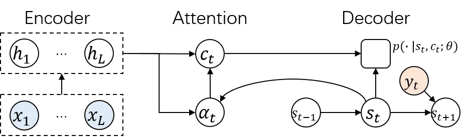
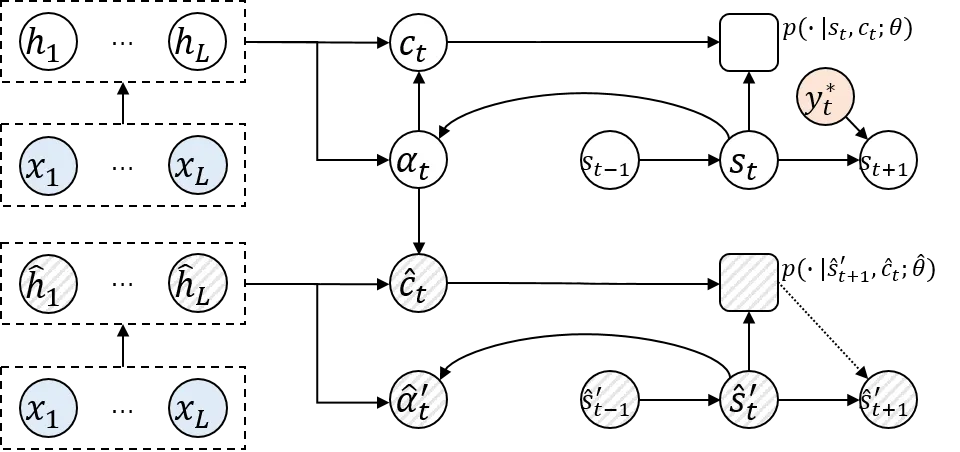
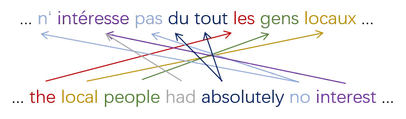
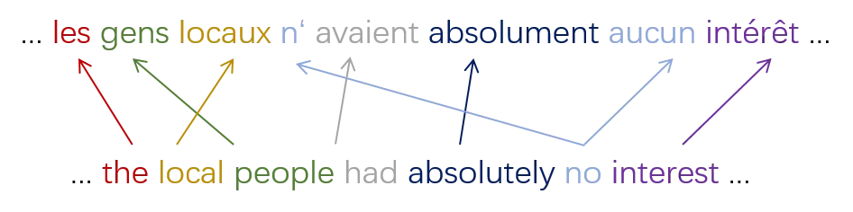
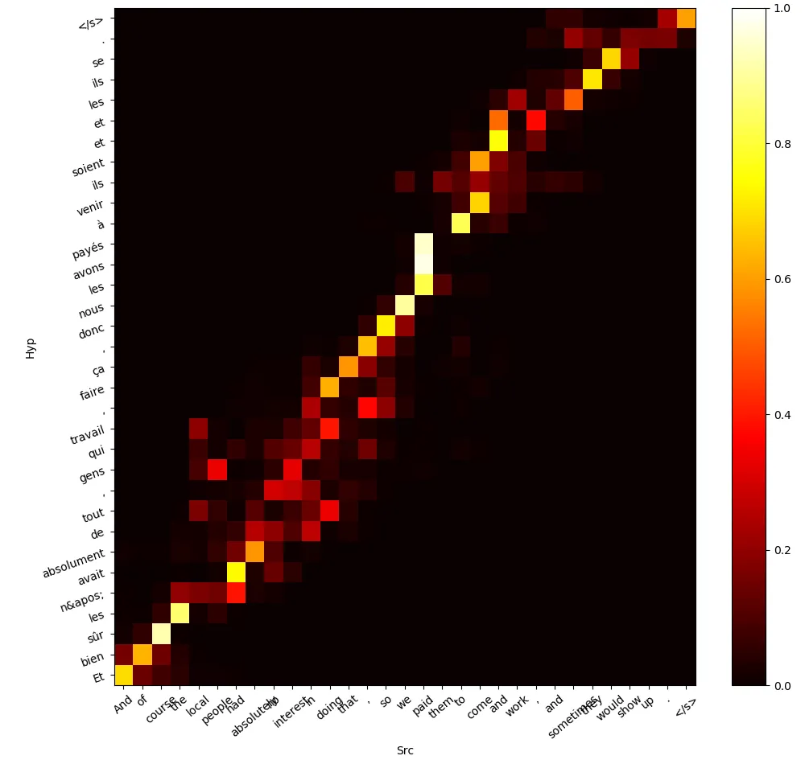
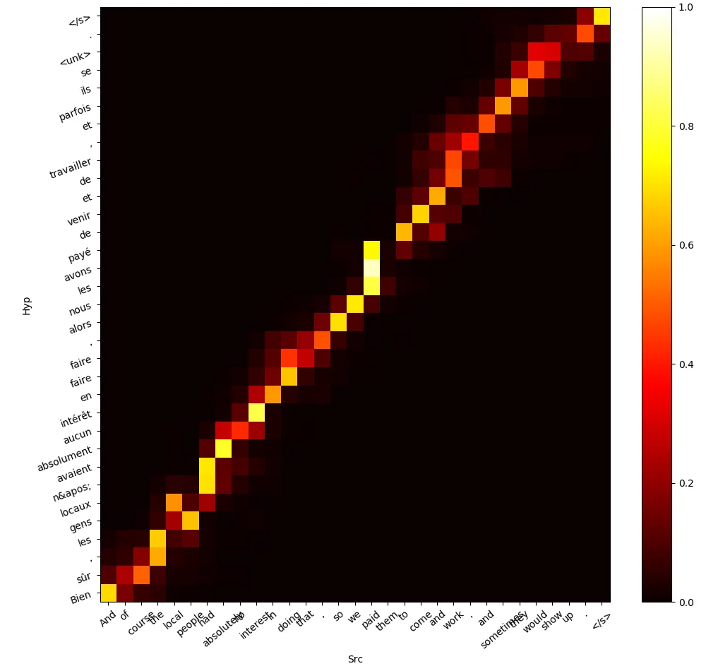
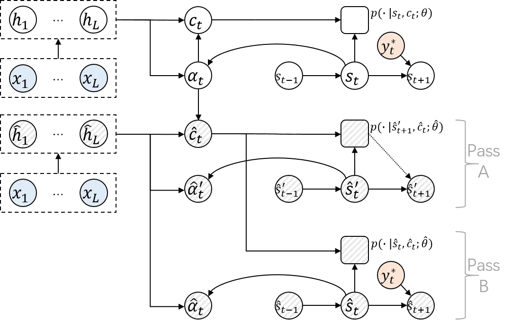
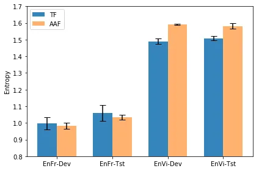
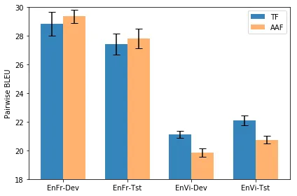

# Attention Forcing for Machine Translation

Qingyun Dou    Yiting Lu    Potsawee Manakul    Xixin Wu    Mark J. F.
Gales

###### Abstract

Auto-regressive sequence-to-sequence models with attention mechanisms
have achieved state-of-the-art performance in various tasks including
Text-To-Speech (TTS) and Neural Machine Translation (NMT). The standard
training approach, teacher forcing, guides a model with the reference
output history. At inference stage, the generated output history must be
used. This mismatch can impact performance. However, it is highly
challenging to train the model using the generated output. Several
approaches have been proposed to address this problem, normally by
selectively using the generated output history. To make training stable,
these approaches often require a heuristic schedule or an auxiliary
classifier. This paper introduces attention forcing for NMT. This
approach guides the model with the generated output history and
reference attention, and can reduce the training-inference mismatch
without a schedule or a classifier. Attention forcing has been
successful in TTS, but its application to NMT is more challenging, due
to the discrete and multi-modal nature of the output space. To tackle
this problem, this paper adds a selection scheme to vanilla attention
forcing, which automatically selects a suitable training approach for
each pair of training data. Experiments show that attention forcing can
improve the overall translation quality and the diversity of the
translations.

University of Cambridge {qd212,ylt28,pm574,xw369,mjfg100}@cam.ac.uk

## Introduction

Auto-regressive sequence-to-sequence (seq2seq) models with attention
mechanisms are used in a variety of areas including Neural Machine
Translation (NMT) (Neubig 2017; Huang et al. 2016) and speech synthesis
(Shen et al. 2018; Wang et al. 2018), also known as Text-To-Speech
(TTS). These models excel at connecting sequences of different length,
but can be difficult to train. A standard approach is teacher forcing,
which guides a model with reference output history during training. This
makes the model unlikely to recover from its mistakes during inference,
where the reference output is replaced by generated output. One
alternative is to train the model in free running mode, where the model
is guided by generated output history. This approach often struggles to
converge, especially for attention-based models, which need to infer the
correct output and align it with the input at the same time.

Several approaches have been introduced to tackle the above problem,
namely scheduled sampling (Bengio et al. 2015) and professor forcing
(Lamb et al. 2016). Scheduled sampling randomly decides whether the
reference or generated output token is added to the output history. The
probability of choosing the reference output token decays with a
heuristic schedule. Professor forcing views the seq2seq model as a
generator. During training, the generator operates in both teacher
forcing mode and free running mode. In teacher forcing mode, it tries to
maximize the standard likelihood. In free running mode, it tries to fool
a discriminator, which is trained to tell the mode of the generator.

This paper introduces attention forcing for NMT. This approach guides
the model with the generated output history and reference attention, and
can reduce the training-inference mismatch without a schedule or a
classifier. Attention forcing has been successful in TTS, but its
application to NMT is more challenging (Dou et al. 2019). Analysis in
this paper indicates that the difficulty comes from the discrete and
multi-modal nature of the output space. To tackle this problem, a
selection scheme is added to vanilla attention forcing: a suitable
training approach is automatically selected for each pair of training
data. Experiments show that attention forcing can improve the overall
translation quality and the diversity of the translations, especially
when the source and target languages are very different.

## Sequence-to-sequence Generation

Sequence-to-sequence generation can be defined as mapping an input
sequence $`\bm{x}_{1:L}`$ to an output sequence $`\bm{y}_{1:T}`$. From a
probabilistic perspective, a model $`\bm{\theta}`$ estimates the
distribution of $`\bm{y}_{1:T}`$ given $`\bm{x}_{1:L}`$, typically as a
product of conditional distributions:
$`p(\bm{y}_{1:T}|\bm{x}_{1:L};\bm{\theta})=\textstyle\prod_{t=1}^{T}p(\bm{y}_{t}|\bm{y}_{<t},\bm{x}_{1:L};\bm{\theta})`$.

Ideally, the model is trained through minimizing the KL-divergence
between the true distribution $`p(\bm{y}_{1:T}|\bm{x}_{1:L})`$ and the
estimated distribution. In practice, this is approximated by minimizing
the Negative Log-Likelihood (NLL) over some training data
$`\{\bm{y}^{*(n)}_{1:T},\bm{x}^{(n)}_{1:L}\}_{1}^{N}`$, sampled from the
true distribution:

```math
\displaystyle\begin{split}\mathcal{L}(\bm{\theta})&=\E_{\scalebox{0.8}{$\bm{x}_{1:L}$}}\mathrm{KL}\big(p(\bm{y}_{1:T}|\bm{x}_{1:L})||p(\bm{y}_{1:T}|\bm{x}_{1:L};\bm{\theta})\big)\\
&\propto-\textstyle\sum_{n=1}^{N}\log p(\bm{y}^{*(n)}_{1:T}|\bm{x}^{(n)}_{1:L};\bm{\theta})\end{split} \tag{1}
```

$`\mathcal{L}(\bm{\theta})`$ denotes the loss. To simplify the notation,
the sum over data $`\sum_{n=1}^{N}`$ and the superscript index ^((n))
will be omitted by default. During inference, given an input
$`\bm{x}_{1:L}`$, the output can be obtained through searching for the
most probable sequence from
$`p(\bm{y}_{1:T}|\bm{x}_{1:L};\bm{\theta})`$. The exact search is
expensive and is often approximated by greedy search for continuous
output, or beam search for discrete output (Bengio et al. 2015).

### Attention-based Sequence-to-sequence Models

Attention mechanisms (Bahdanau, Cho, and Bengio 2014; Chorowski et al. 2015) are commonly used to connect sequences of different length. This
paper focuses on attention-based encoder-decoder models. For these
models, the probability
$`p(\bm{y}_{t}|\bm{y}_{<t},\bm{x}_{1:L};\bm{\theta})`$ is estimated as:

```math
\displaystyle\begin{split}p(\bm{y}_{t}|\bm{y}_{<t},\bm{x}_{1:L};\bm{\theta})&\approx p(\bm{y}_{t}|\bm{y}_{<t},\bm{\alpha}_{t},\bm{x}_{1:L};\bm{\theta})\\
&\approx p(\bm{y}_{t}|\bm{s}_{t},\bm{c}_{t};\bm{\theta}_{y})\end{split} \tag{2}
```

$`\bm{\theta}=\{\bm{\theta}_{y},\bm{\theta}_{s},\bm{\theta}_{c}\}`$.
$`\bm{\alpha}_{t}`$ is an alignment vector (a set of attention weights).
$`\bm{s}_{t}`$ is a state vector representing the output history
$`\bm{y}_{<t}`$, and $`\bm{c}_{t}`$ is a context vector summarizing
$`\bm{x}_{1:L}`$ for the prediction of $`\bm{y}_{t}`$. Figure 1 and the
following equations give a more detailed illustration of how
$`\bm{\alpha}_{t}`$, $`\bm{s}_{t}`$ and $`\bm{c}_{t}`$ can be computed:

```math
\displaystyle\bm{h}_{1:L} \displaystyle=f(\bm{x}_{1:L};\bm{\theta}_{h}) \tag{3}
```

```math
\displaystyle\bm{s}_{t} \displaystyle=f(\bm{s}_{t-1},\bm{y}_{t-1};\bm{\theta}_{s}) \tag{4}
```

```math
\displaystyle\bm{\alpha}_{t} \displaystyle=f(\bm{s}_{t},\bm{h}_{1:L};\bm{\theta}_{\alpha}) \tag{5}
```

```math
\displaystyle\bm{c}_{t} \displaystyle=\textstyle\sum_{l=1}^{L}\alpha_{t,l}\bm{h}_{l} \tag{6}
```

```math
\displaystyle\bm{y}_{t} \displaystyle\sim p(\cdot|\bm{s}_{t},\bm{c}_{t};\bm{\theta}_{y}) \tag{7}
```

First the encoder maps $`\bm{x}_{1:L}`$ to an encoding sequence
$`\bm{h}_{1:L}`$. For each decoder time step, $`\bm{s}_{t}`$ is updated
with $`\bm{y}_{t-1}`$. Based on $`\bm{h}_{1:L}`$ and $`\bm{s}_{t}`$, the
attention mechanism computes $`\bm{\alpha}_{t}`$, and then
$`\bm{c}_{t}`$. Finally, the decoder estimates a distribution based on
$`\bm{s}_{t}`$ and $`\bm{c}_{t}`$, and optionally generates an output
token $`\hat{\bm{y}_{t}}`$. Note that while illustrated with this form
of attention, attention forcing is not limited to it.



Figure 1: Illustration of an attention-based encoder-decoder. The
blue/orange nodes represent the input/output data. The monochrome nodes
represent the variables generated from the model, among which the square
node corresponds to the distribution of the output variable.

### Training Approaches

As shown in equation 1, minimizing the KL-divergence can be approximated
by minimizing the NLL. This motivates teacher forcing, where the
reference output history is given to the model, and the loss can be
written as:

```math
\begin{split}\mathcal{L}_{y}^{(\tt T)}(\bm{\theta})&=-\textstyle\sum_{t=1}^{T}\log p(\bm{y}^{*}_{t}|\bm{y}^{*}_{<t},\bm{x}_{1:L};\bm{\theta})\end{split} \tag{8}
```

This approach yields the correct model (zero KL-divergence) if the
following assumptions hold: 1) the model is powerful enough ; 2) the
model is optimized correctly; 3) there is enough training data to
approximate the expectation shown in equation 1. However, these
assumptions are often not true. In addition, at inference stage, the
generated back history must be used. Hence the model is prone to
mistakes that can accumulate across time.

In practice, the model is often assessed by some distance
$`\mathcal{D}`$ between the reference $`\bm{y}_{1:T}`$ and the
prediction $`\hat{\bm{y}}^{\prime}_{1:T}`$. This motivates Minimun Bayes
Risk (MBR) training, which minimizes the expectation of
$`\mathcal{D}(\bm{y}_{1:T},\hat{\bm{y}}^{\prime}_{1:T})`$. This approach
allows directly optimizing $`\mathcal{D}`$ (Ranzato et al. 2015;
Bahdanau et al. 2016). Note that Reinforcement Learning (RL) is a type
of MBR training. $`\mathcal{D}`$ does not need to be differentiable, and
$`\bm{y}_{1:T}`$ and $`\hat{\bm{y}}^{\prime}_{1:T}`$ do not need to be
aligned. However, for many tasks such as TTS and NMT, there is no
gold-standard distance metric other than subjective human evaluation.

Although defined for sequences, $`\mathcal{D}`$ is usually computed at
sub-sequence level, e.g. BLEU score for NMT and $`L_{p}`$ distance for
TTS. So training the model to predict the reference output, based on
erroneous output history, indirectly reduces the Bayes risk. One example
is to train the model in free running mode, where the generated output
history is given to the model, and the probability term in equation 8
becomes
$`p(\bm{y}^{*}_{t}|\hat{\bm{y}}^{\prime}_{<t},\bm{x}_{1:L};\bm{\theta})`$.
This approach often struggles to converge, and several approaches are
proposed to tackle this problem, namely scheduled sampling and professor
forcing.

Scheduled sampling (Bengio et al. 2015) randomly decides whether the
reference or generated output is added to the history. For this
approach, the probability term in equation 8 becomes
$`p(\bm{y}^{*}_{t}|\widetilde{\bm{y}}_{<t},\bm{x}_{1:L};\bm{\theta})`$;
$`\widetilde{\bm{y}}_{t}=\bm{y}_{t}`$ with probability $`\epsilon`$, and
$`\hat{\bm{y}}^{\prime}_{t}`$ otherwise. $`\epsilon`$ gradually decays
from 1 to 0 with a heuristic schedule. This approach improves the
results in many cases (Bengio et al. 2015), but sometimes lead to worse
results (Bengio et al. 2015; Wang et al. 2017; Guo et al. 2019). One
concern is the decay schedule not fitting the learning pace of the
model, another is that $`\widetilde{\bm{y}}_{<t}`$ is usually an
inconsistent mixture of the reference and generated output. Professor
forcing (Lamb et al. 2016) is an alternative approach. During training,
the model generates two sequences for each input sequence, respectively
in teacher forcing mode and free running mode¹¹ 1 The term ”teacher
forcing”, as well as ”attention forcing”, can refer to either an
operation mode, or the approach to train a model in that operation mode.
An operation mode can be used not only to train a model, but also to
generate from it.. The output and/or some hidden sequences are used to
train a discriminator, which estimates the probability that a group of
sequences is generated in teacher forcing mode. For the generator, there
are two training objectives: 1) the standard NLL loss; 2) to fool the
discriminator in free running mode, and optionally in teacher forcing
mode. This approach regularizes the output and/or some hidden layers,
encouraging them to behave as if in teacher forcing mode, at the expense
of tuning the discriminator.

To our knowledge, teacher forcing is the most standard training approach
for many seq2seq tasks such as TTS and NMT. Despite its drawbacks, using
the reference output history usually makes it easy for training to
converge, and in some cases, the drawbacks can be alleviated without
changing the training approach. For example, one side effect of teacher
forcing is that there might be too much information in the output
history, to the extent that the model does not take enough information
from the input when predicting the next token. For TTS, the model might
learn to copy the previous token, as adjacent tokens are often similar;
for NMT, the model might behave like a language model, overlooking the
input. A natural solution is to reduce the frame rate, i.e. to
downsamlpe the output sequences. While straight-forward for TTS, this is
difficult to apply to NMT, due to the discrete nature of the output
space.

## Attention Forcing

### Vanilla Attention Forcing

The basic idea of attention forcing is to use the reference attention
and generated output to guide the model during training. In attention
forcing mode, the model does not need to learn to simultaneously infer
the output and align it with the input. As the reference alignment is
known, the decoder can focus on inferring the output, and the attention
mechanism can focus on generating the correct alignment.

Let $`\hat{\bm{\theta}}`$ denote the model trained with attention
forcing, and later used for inference. Let $`\hat{\bm{y}}_{1:T}`$ /
$`\hat{\bm{y}}^{\prime}_{1:T}`$ denote $`\hat{\bm{\theta}}`$’s output,
guided by the reference / generated output. The convention in this paper
is that if the generated output is used to produce a variable, a prime
(^(′)) will be added to its notation. In attention forcing mode, the
probability
$`p(\bm{y}^{*}_{t}|\bm{y}^{*}_{<t},\bm{x}_{1:L};\hat{\bm{\theta}})`$ is
estimated with the generated output $`\hat{\bm{y}}^{\prime}_{<t}`$ and
the reference alignment $`\bm{\alpha}_{t}`$:

```math
\begin{split}p(\bm{y}^{*}_{t}|\bm{y}^{*}_{<t},\bm{x}_{1:L};\hat{\bm{\theta}})&\approx p(\bm{y}^{*}_{t}|\hat{\bm{y}}^{\prime}_{<t},\bm{\alpha}_{t},\bm{x}_{1:L};\hat{\bm{\theta}})\\
&\approx p(\bm{y}^{*}_{t}|\hat{\bm{s}}^{\prime}_{t},\hat{\bm{c}}_{t};\hat{\bm{\theta}}_{y})\end{split} \tag{9}
```

$`\hat{\bm{s}}^{\prime}_{t}`$ and $`\hat{\bm{c}}_{t}`$ denote the state
vector and context vector generated by $`\hat{\bm{\theta}}`$. The
context vector does not depend on the generated output, hence the
notation $`\hat{\bm{c}}_{t}`$ instead of $`\hat{\bm{c}}^{\prime}_{t}`$.
Details of vanilla attention forcing are illustrated by figure 2, as
well as the following equations:

```math
\displaystyle\bm{h}_{1:L}=f(\bm{x}_{1:L};\bm{\theta}_{h}) \displaystyle\hat{\bm{h}}_{1:L}=f(\bm{x}_{1:L};\hat{\bm{\theta}}_{h}) \tag{10}
```

```math
\displaystyle\bm{s}_{t}=f(\bm{s}_{t-1},\bm{y}^{*}_{t-1};\bm{\theta}_{s}) \displaystyle\hat{\bm{s}}^{\prime}_{t}=f(\hat{\bm{s}}^{\prime}_{t-1},\hat{\bm{y}}^{\prime}_{t-1};\hat{\bm{\theta}}_{s}) \tag{11}
```

```math
\displaystyle\bm{\alpha}_{t}=f(\bm{s}_{t},\bm{h}_{1:L};\bm{\theta}_{\alpha}) \displaystyle\hat{\bm{\alpha}}^{\prime}_{t}=f(\hat{\bm{s}}^{\prime}_{t},\hat{\bm{h}}_{1:L};\hat{\bm{\theta}}_{\alpha}) \tag{12}
```

```math
\displaystyle\hat{\bm{c}}_{t} \displaystyle=\textstyle\sum_{l=1}^{L}\alpha_{t,l}\hat{\bm{h}}_{l} \tag{13}
```

```math
\displaystyle\hat{\bm{y}}^{\prime}_{t} \displaystyle\sim p(\cdot|\hat{\bm{s}}^{\prime}_{t},\hat{\bm{c}}_{t};\hat{\bm{\theta}}_{y}) \tag{14}
```

The right side of equations 10 to 12, as well as equations 13 and 14,
show how the attention forcing model $`\hat{\bm{\theta}}`$ operates.
$`\hat{\bm{s}}^{\prime}_{t}`$ is computed with
$`\hat{\bm{y}}^{\prime}_{<t}`$. While an alignment
$`\hat{\bm{\alpha}}^{\prime}_{t}`$ is generated by
$`\hat{\bm{\theta}}`$, it is not used by the decoder, because
$`\hat{\bm{c}}_{t}`$ is computed with the reference alignment
$`\bm{\alpha}_{t}`$. In most cases, $`\bm{\alpha}_{t}`$ is not
available. One option of obtaining it is shown by the left side of
equations 10 to 12: to generate $`\bm{\alpha}_{t}`$ from a teacher
forcing model $`\bm{\theta}`$. $`\bm{\theta}`$ is trained in teacher
forcing mode, and generates $`\bm{\alpha}_{t}`$ in the same mode.



Figure 2: Illustration of vanilla attention forcing. The white nodes
represent the variables from the teacher forcing model, and the shaded
nodes the attention forcing model.

During training, there are two objectives: to infer the reference output
and to imitate the reference alignment. The respective loss functions
are:

```math
\displaystyle\mathcal{L}_{y}^{(\tt A)}(\hat{\bm{\theta}}) \displaystyle=-\scalebox{1.0}{$\sum_{t=1}^{T}$}\log p(\bm{y}{{}^{*}_{t}}|\hat{\bm{y}}{{}^{\prime}_{<t}},\bm{\alpha}{{}_{t}},\bm{x}{{}_{1:L}};\hat{\bm{\theta}}) \tag{15}
```

```math
\displaystyle\mathcal{L}_{\alpha}^{(\tt A)}(\hat{\bm{\theta}}) \displaystyle=\scalebox{1.0}{$\sum_{t=1}^{T}$}\mathrm{KL}(\bm{\alpha}_{t}||\hat{\bm{\alpha}}_{t}^{\prime}) \tag{16}
```

As an alignment corresponds to a categorical distribution, KL-divergence
is a natural difference metric. The two losses can be jointly optimized
as
$`\mathcal{L}_{y,\alpha}^{(\tt A)}=\mathcal{L}_{y}^{(\tt A)}+\gamma\mathcal{L}_{\alpha}^{(\tt A)}`$.
$`\gamma`$ is a scaling factor that should be set according to the
dynamic range of the two losses. Our default optimization option is as
follows. $`\bm{\theta}`$ is trained in teacher forcing mode, and then
fixed to generate the reference attention. $`\hat{\bm{\theta}}`$ is
trained with the joint loss $`\mathcal{L}_{y,\alpha}^{(\tt A)}`$. This
option makes training more stable, most probably because the reference
attention is the same in each epoch. An alternative is to train
$`\bm{\theta}`$ and $`\hat{\bm{\theta}}`$ simultaneously to save time.
Another is to tie (parts of) $`\bm{\theta}`$ and $`\hat{\bm{\theta}}`$
to save memory.

At inference stage, the attention forcing model operates in free running
mode. In this case, equations 13 and 14 become
$`\hat{\bm{c}}^{\prime}_{t}=\textstyle\sum_{l=1}^{L}\hat{\alpha}^{\prime}_{t,l}\hat{\bm{h}}_{l}`$
and
$`\hat{\bm{y}}^{\prime}_{t}\sim p(\cdot|\hat{\bm{s}}^{\prime}_{t},\hat{\bm{c}}^{\prime}_{t};\hat{\bm{\theta}}_{y})`$.
The decoder is guided by $`\hat{\bm{\alpha}}^{\prime}_{t}`$, instead of
$`\bm{\alpha}_{t}`$.

### Challenges of the NMT Output Space

Previous research has shown that the vanilla form of attention forcing
yields significant performance gain for TTS, but not for NMT (Dou et al.
2019). Although both TTS and NMT are seq2seq tasks, they have
considerable differences. For TTS, the attention is monotonic, which is
relatively easy to learn. For NMT, the attention is much more
complicated: there may be multiple valid modes of attention. The
ordering of tokens can be changed while the meaning of the sequence
remains the same. If the model takes an ordering that is different from
the reference output, the token-level losses will mislead both the
output and the attention. To illustrate the problem, consider the
following example from our preliminary experiments on English-to-French
NMT. For the input ”… the local people had absolutely no interest …”,
the reference output is ”… n’intéresse pas du tout les gens locaux …”.
When using the generated output history, the model outputs ”… les gens
locaux n’avaient absolument aucun intérêt …”. Figure 3 shows the manual
alignments in these two cases. Figure 4 shows the model-generated
alignments, respectively using the reference and generated back
history.²² 2 The complete input is ”And of course the local people had
absolutely no interest in doing that, so we paid them to come and work,
and sometimes they would show up.” Obviously the alignment corresponding
to the reference output is not a sensible target for the generated
output.





Figure 3: Manual alignments between: left) the input and the reference
output; right) the input and the generated output.





Figure 4: Model-generated alignments using: left) the reference back
history; right) the generated back history.

Furthermore, even if the model happens to follow the reference ordering,
there might be other issues. The output of TTS is usually orders of
magnitude longer than that of NMT. For each time step, TTS has a
continuous one-dimensional output space, while NMT has a discrete
high-dimensional output space. Due to the length and sparsity of the NMT
output, the errors in the output history tend to be more serious, to the
extent that the token-level target is not appropriate. To illustrate the
problem, suppose the reference output is ”Thank you for listening”, and
the model predicts ”Thanks” at the first time step. In this case, the
next output should not be ”you”. ”For” would instead be a more sensible
target.

### Automatic Attention Forcing

To tackle the above issues, we introduce automatic attention forcing.
The basic idea is to automatically decide, for each pair of training
data, whether vanilla attention forcing will be used. This is realized
by tracking the alignment between the reference and the predicted
outputs. If they are relatively well-aligned, vanilla attention forcing
will be used, otherwise a more stable training mode will be used.



Figure 5: Illustration of automatic attention forcing. Passes A and B
share the same model parameters.

For each input sequence, the attention forcing model
$`\hat{\bm{\theta}}`$ takes two forward passes. As illustrated by figure
5, pass A is guided by the generated output history
$`\hat{\bm{y}}^{\prime}_{<t}`$, and pass B the reference output history
$`\bm{y}^{*}_{<t}`$. The two forward passes can be completed in
parallel, so no extra computation time is necessary. This can be
formulated as follows.

```math
\displaystyle\bm{h}_{1:L}=f(\bm{x}_{1:L};\bm{\theta}_{h}) \displaystyle\hat{\bm{h}}_{1:L}=f(\bm{x}_{1:L};\hat{\bm{\theta}}_{h}) \tag{17}
```

```math
\displaystyle\bm{s}_{t}=f(\bm{s}_{t-1},\bm{y}^{*}_{t-1};\bm{\theta}_{s}) \displaystyle\begin{matrix}\hat{\bm{s}}^{\prime}_{t}=f(\hat{\bm{s}}^{\prime}_{t-1},\hat{\bm{y}}^{\prime}_{t-1};\hat{\bm{\theta}}_{s})\\
\hat{\bm{s}}_{t}=f(\hat{\bm{s}}_{t-1},\bm{y}^{*}_{t-1};\hat{\bm{\theta}}_{s})\end{matrix} \tag{18}
```

```math
\displaystyle\bm{\alpha}_{t}=f(\bm{s}_{t},\bm{h}_{1:L};\bm{\theta}_{\alpha}) \displaystyle\begin{matrix}\hat{\bm{\alpha}}^{\prime}_{t}=f(\hat{\bm{s}}^{\prime}_{t},\hat{\bm{h}}_{1:L};\hat{\bm{\theta}}_{\alpha})\\
\hat{\bm{\alpha}}_{t}=f(\hat{\bm{s}}_{t},\hat{\bm{h}}_{1:L};\hat{\bm{\theta}}_{\alpha})\end{matrix} \tag{19}
```

```math
\displaystyle\hat{\bm{c}}_{t}=\textstyle\sum_{l=1}^{L}\alpha_{t,l}\hat{\bm{h}}_{l} \tag{20}
```

```math
\displaystyle\begin{matrix}\hat{\bm{y}}^{\prime}_{t}\sim p(\cdot|\hat{\bm{s}}^{\prime}_{t},\hat{\bm{c}}_{t};\hat{\bm{\theta}}_{y})\\
\hat{\bm{y}}_{t}\sim p(\cdot|\hat{\bm{s}}_{t},\hat{\bm{c}}_{t};\hat{\bm{\theta}}_{y})\end{matrix} \tag{21}
```

Next, the choice of training mode is made at the sequence level, which
ensures the consistency of the output history. If
$`\textstyle k\sum_{t=1}^{T}\mathrm{KL}(\bm{\alpha}_{t}||\hat{\bm{\alpha}}_{t};\hat{\bm{\theta}})>\sum_{t=1}^{T}\mathrm{KL}(\bm{\alpha}_{t}||\hat{\bm{\alpha}}^{\prime}_{t};\hat{\bm{\theta}})`$,
meaning that $`\hat{\bm{y}}^{\prime}_{1:T}`$ is well aligned with
$`\bm{y}^{*}_{1:T}`$, forward pass A will be used in the
backpropagation. The loss is the same as in vanilla attention forcing:

```math
\displaystyle\begin{split}\mathcal{L}_{y,\alpha}^{(\tt A)}(\hat{\bm{\theta}})&=\textstyle\sum_{t=1}^{T}\log p(\bm{y}^{*}_{t}|\bm{x}_{1:L},\hat{\bm{y}}^{\prime}_{<t},\bm{\alpha}_{t};\hat{\bm{\theta}})\\
&+\textstyle\gamma\sum_{t=1}^{T}\mathrm{KL}(\bm{\alpha}_{t}||\hat{\bm{\alpha}}^{\prime}_{t};\hat{\bm{\theta}}))\end{split} \tag{22}
```

Otherwise forward pass B will be used:

```math
\displaystyle\begin{split}\mathcal{L}_{y,\alpha}^{(\tt A)}(\hat{\bm{\theta}})&=\textstyle\sum_{t=1}^{T}\log p(\bm{y}^{*}_{t}|\bm{x}_{1:L},\bm{y}^{*}_{<t},\bm{\alpha}_{t};\hat{\bm{\theta}})\\
&+\textstyle\gamma\sum_{t=1}^{T}\mathrm{KL}(\bm{\alpha}_{t}||\hat{\bm{\alpha}}_{t};\hat{\bm{\theta}}))\end{split} \tag{23}
```

The KL attention loss is used to determine if the alignment is good
enough between the reference output $`\bm{y}^{*}_{1:T}`$ and the free
running output $`\hat{\bm{y}}^{\prime}_{1:T}`$. As both
$`\bm{\alpha}_{t}`$ and $`\hat{\bm{\alpha}}_{t}`$ are computed using
$`\bm{y}^{*}_{<t}`$, they are expected to be similar, yielding a
relatively small
$`\mathrm{KL}(\bm{\alpha}_{t}||\hat{\bm{\alpha}}_{t};\hat{\bm{\theta}})`$.
In contrast, $`\hat{\bm{\alpha}}^{\prime}_{t}`$ is computed using
$`\hat{\bm{y}}^{\prime}_{<t}`$, and
$`\mathrm{KL}(\bm{\alpha}_{t}||\hat{\bm{\alpha}}^{\prime}_{t};\hat{\bm{\theta}})`$
is expected to be larger. The hyper parameter $`k`$ is introduced to
determine how out-of-alignment $`\hat{\bm{y}}^{\prime}_{1:T}`$ and
$`\bm{y}^{*}_{1:T}`$ can be. If $`k=+\infty`$, automatic attention
forcing will be the same as vanilla attention forcing. In the following
section, unless otherwise stated, the term ”attention forcing” will
refer to automatic attention forcing.

An empirical issue is that as training progresses, most elements in the
alignment vectors will be close to 0. So the KL attention loss, which
involves the log of the elements, might be unstable. To improve
numerical stability, a trick is to smooth all alignment vectors with a
uniform distribution $`\bm{u}`$. For example,
$`\mathrm{KL}(\bm{\alpha}_{t}||\hat{\bm{\alpha}}_{t};\hat{\bm{\theta}})`$
can be smoothed as
$`\mathrm{KL}((1-\epsilon)\bm{\alpha}_{t}+\epsilon\bm{u}||(1-\epsilon)\hat{\bm{\alpha}}_{t}+\epsilon\bm{u};\hat{\bm{\theta}})`$.
$`\epsilon`$ is a small constant balancing the stability and accuracy of
training; it is set to $`e^{-10}`$ in our experiments.

### Comparison with Related Work

Intuitively, attention forcing, as well as scheduled sampling and
professor forcing, sits between teacher forcing and free running. An
advantage of attention forcing is that it does not require a schedule or
a discriminator, which can be difficult to tune. Variations of scheduled
sampling have been applied to NMT (Zhang et al. 2019; Duckworth et al.
2019); while (Zhang et al. 2019) finds it helpful, (Duckworth et al. 2019) reports slightly worse performance. Similarly, in TTS, both
positive (Liu et al. 2020) and negative (Guo et al. 2019) results have
been reported, showing that the schedule can be hard to tune.

In terms of regularization, attention forcing is similar to professor
forcing. The output layer of the attention mechanism is regularized, and
the KL-divergence is a well-established difference metric. (Guo et al. 2019) and (Liu et al. 2020) also perform hidden layer regularization,
and both regularize the decoder states, for which there is not a natural
difference metric. (Guo et al. 2019) introduces a specific
discriminator; (Liu et al. 2020) experiments with $`L_{1}`$ loss, and
one concern is the implicit assumption that the states are in $`L_{1}`$
space. The effect of regularization on attention mechanisms has been
studied in previous work (Yu et al. 2017b; Liu et al. 2016; Bao et al.
2018), where alternative approaches of obtaining reference attention are
introduced. (Bao et al. 2018) and (Yu et al. 2017b) require collecting
extra data for reference attention, and (Liu et al. 2016) uses a
statistical machine translation model to estimate them. In contrast, we
propose to generate the reference attention with a teacher forcing
model, which can be trained simultaneously with the attention forcing
model.

While this paper focuses on the discrete and multi-modal output space of
NMT, attention forcing can be applied to both continuous and discrete
outputs. Beam Search Optimization (BSO) (Wiseman and Rush 2016) is a
NMT-specific alternative. To deal with the training-inference mismatch,
it approximates beam search during training and penalizes the reference
output token falling off the beam. This limits the output space to be
discrete, so that beam search can be used. RL, a type of MBR, has also
been applied to NMT (Ranzato et al. 2015; Bahdanau et al. 2016). It
trains the model in free running mode, and allows using a sequence-level
loss. As discussed previously, a problem is that NMT does not have a
gold-standard objective metric. The model trained with one metric (e.g.
BLEU) might not excel at another (e.g. ROUGE) (Ranzato et al. 2015). To
tackle this issue, adversarial training has been combined with RL (Yu
et al. 2017a; Wu et al. 2018): a discriminator learns a loss function,
which is potentially better than standard metrics. For NMT, an
additional motivation is that the discrete output is not differentiable,
so RL is essential for training. Similar to the case of professor
forcing, the discriminator itself can be difficult to train (Zhang
et al. 2018).

A challenge of attention forcing is that when applying it to models
without an attention mechanism, attention needs to be defined first. For
convolutional neural networks, for example, attention maps can be
defined based on the activation or gradient (Zagoruyko and Komodakis
2016). Some recent work on TTS (Ren et al. 2019; Ren et al. 2020; Yu
et al. 2019; Donahue et al. 2020) uses a duration model instead of
attention. In this case, one-hot alignment vectors can be defined
according to the duration of input tokens.

## Experiments

### Experimental Setup

#### Data

The experiments are conducted on two NMT tasks: English-to-French (EnFr)
and English-to-Vietnamese (EnVi) in IWSLT 2015. For EnFr, the training
set contains 208k sentence pairs. The validation set is tst2013 and the
test set tst2014. For EnVi, the training set contains 133k sentence
pairs. The validation set is tst2012 and the test set tst2013. The
latter is expected to be a harder task, considering the differences
between the source and target languages in terms of syntax and lexicon.

#### Model, Training and Inference

The model is similar to Google’s attention-based encoder-decoder LSTM
(Wu et al. 2016). The differences are as follows. The model is
simplified with a smaller number of LSTM layers due to the small scale
of data: the encoder has 2 layers of bi-LSTM and the decoder has 4
layers of uni-LSTM; the general form of Luong attention (Luong, Pham,
and Manning 2015) is used; both English and Vietnamese word embeddings
have 200 dimensions and are randomly initialised. Adam optimiser is used
with a learning rate of 0.002 and the maximum gradient norm is set to
be 1. If there is a pretraining phase, the learning rate will be halved
afterwards. The batch size is 50. Dropout is used with a probability of
0.2. By default, the baseline models are trained with teacher forcing
for 60 epochs. The other models are pretrained with teacher forcing for
30 epochs, and then trained with attention forcing for 30 epochs. As
discussed previously, the scale $`\gamma`$ of the attention loss
$`\mathcal{L}_{\alpha}^{(\tt A)}`$ is set to 10, so that its dynamic
range is comparable to $`\mathcal{L}_{y}^{(\tt A)}`$. The default
inference approach is beam search; the beam size is 1, in order to
reduce the turnaround time. When investigating diversity, sampling
search is also adopted, which replaces the selecting operation by
sampling. The code for the experiments is available online.³³ 3
https://github.com/3dmaisons/af-mnt

#### Evaluation Metrics

To measure the overall translation quality and the diversity of the
translations, we use the following metrics. 1) BLEU (Papineni et al.
2002). The average of 1-to-4 gram BLEU scores are computed and a brevity
penalty is applied. The code for computing BLEU score is from the
open-source project.⁴⁴ 4 https://github.com/moses-smt/mosesdecoder
Higher BLEU indicates higher quality. 2) Pairwise BLEU (Shen et al.
2019). For a model $`\bm{\theta}`$, we use sampling search $`M`$ times
with different random seeds, obtaining a group of translations
$`\{\bm{y}^{\prime(m)}\}_{m=1}^{M}`$. $`\bm{y}^{\prime(m)}`$ denotes all
the output sentences in the dev or test set. Then we compute the average
BLEU between all pairs:
$`\frac{1}{M(M-1)}\sum_{n=1}^{M}\sum_{m=1}^{M}{\tt BLEU}(\bm{y}^{\prime(n)},\bm{y}^{\prime(m)})_{n\neq m}`$.
In our experiments, $`M`$ is set to 5. The more diverse the
translations, the lower the Pairwise BLEU. 3) Entropy. For a model
$`\bm{\theta}`$, we use beam search, and save the entropy $`e_{t}`$ of
the output token’s distribution at each time step. Let $`e_{1:T}`$
denote all time steps in the dev or test set, we compute the average
value: $`e=\frac{1}{T}\sum_{t=1}^{T}e_{t}`$. Higher $`e`$ means that the
model is less certain, and thus more likely to produce diverse outputs.
This process is deterministic, so there is no need to repeat it with
different random seeds.

### Investigation of Overall Performance

First, we compare Teacher Forcing (TF) and Vanilla Attention Forcing
(VAF). The models are trained respectively with TF and VAF. Our
preliminary experiments show that when starting from scratch, the TF
model performs much better than the VAF model. When pretraining is
adopted, the BLEU of VAF increases from 21.77 to 22.93 for EnFr, and
from 13.92 to 18.27 for EnVi. However, it does not outperform TF, as
shown by the first two rows in each section of table 1. In addition, we
observed that after the pretraining phase, when VAF is used, the BLEU
decreases. This result is expected, considering the discrete and
multi-modal nature of the NMT output space.

|      |          |       |       |       |
| ---- | -------- | ----- | ----- | ----- |
| Task | Training | $`k`$ | BLEU  |       |
|      |          |       | Dev   | Test  |
| EnFr | TF       | \-    | 34.65 | 30.70 |
|      | VAF      | \-    | 25.39 | 22.93 |
|      | AAF      | 2.5   | 34.73 | 31.44 |
|      | AAF      | 3.0   | 34.80 | 31.66 |
|      | AAF      | 3.5   | 34.71 | 31.34 |
| EnVi | TF       | \-    | 23.74 | 25.57 |
|      | VAF      | \-    | 16.63 | 18.27 |
|      | AAF      | 2.5   | 23.97 | 26.02 |
|      | AAF      | 3.0   | 23.81 | 25.71 |
|      | AAF      | 3.5   | 23.81 | 26.72 |

Table 1: BLEU of TF and AAF with different values of $`k`$. The higher
$`k`$ is, the more likely the generated output history is used.

Next, TF is compared with Automatic Attention Forcing (AAF). To speed up
convergence, pretraining is used by default. The hyper parameter $`k`$,
which controls the tendency to use generated outputs, is roughly tuned.
The higher $`k`$ is, the more likely the generated output history is
used. Table 1 shows the BLEU scores of AAF, resulting from different
values of $`k`$. With some simple tuning, AAF outperforms TF. The
performance is rather robust in a certain range of $`k`$. In the
following experiments, $`k`$ is set to 3.0 for EnFr and 3.5 for EnVi.

To reduce the randomness of the experiments, both TF and AAF are run
$`R=5`$ times with different random seeds. Let
$`\{\bm{\theta}^{(r)}\}_{r=1}^{R}`$ denote the group of TF models, and
$`\{\hat{\bm{\theta}}^{(r)}\}_{r=1}^{R}`$ the AAF models. For both
groups, the BLEU’s mean $`\pm`$ standard deviation is computed. Table 2
shows the results. For EnFr, AAF yields a consistent 0.44 gain in BLEU.
For EnVi, AAF yields a consistent 0.55 gain.

|      |          |                              |                              |
| ---- | -------- | ---------------------------- | ---------------------------- |
| Task | Training | BLEU                         |                              |
|      |          | Dev                          | Test                         |
| EnFr | TF       | 34.49$`\scriptstyle\pm`$0.16 | 31.10$`\scriptstyle\pm`$0.27 |
|      | AAF      | 34.79$`\scriptstyle\pm`$0.14 | 31.54$`\scriptstyle\pm`$0.14 |
| EnVi | TF       | 23.63$`\scriptstyle\pm`$0.10 | 25.86$`\scriptstyle\pm`$0.44 |
|      | AAF      | 23.72$`\scriptstyle\pm`$0.08 | 26.41$`\scriptstyle\pm`$0.33 |

Table 2: BLEU of TF and AAF, each approach is run 5 times, and the
BLEU’s mean $`\pm`$ std is shown. $`k=3.0`$ for EnFr, and $`k=3.5`$ for
EnVi.

### Investigation of Diversity

To measure the diversity among the translations, the entropy and
pairwise BLEU are computed for $`\{\bm{\theta}^{(r)}\}_{r=1}^{R}`$ and
$`\{\hat{\bm{\theta}}^{(r)}\}_{r=1}^{R}`$. Figure 6 shows the entropy
resulting from TF and AAF, for both EnFr and EnVi. The height of each
bar represents the mean, and the error bars the mean $`\pm`$ standard
deviation. For EnVi, AAF leads to higher entropy, which indicates higher
diversity. For EnFr, AAF and TF lead to similar levels of diversity,
especially when the standard deviation is considered. We believe that
the difference is due to the nature of the tasks. As English and French
have similar syntax and lexicon, the models tend to follow the word
order of the input sequence, regardless of the training approach. In
contrast, English and Vietnamese are more different. When trained with
AAF, the model benefits more from using generated back history, which is
more diverse than in EnFr. Figure 7 is the equivalent for pairwise BLEU,
and it confirms the above results. Note that pairwise BLEU correlates
negatively with diversity. For EnVi, AAF leads to lower pairwise BLEU,
i.e. higher diversity. For EnFr, the difference between AAF and TF is
negligible. Regardless of the metric, the EnVi translations are more
diverse than their EnFr counterpart (higher entropy and lower pairwise
BLEU). This also supports the analysis that the difference of the
results for EnFr and EnVi is due to the nature of the languages.



Figure 6: Entropy of TF and AAF, each approach is run 5 times, and the
entropy’s mean $`\pm`$ std is shown by the height and the error bars.
Higher entropy indicates higher diversity.



Figure 7: Pairwise BLEU of TF and AAF, each approach is run 5 times, and
the BLEU’s mean $`\pm`$ std is shown by the height and the error bars.
Lower pairwise BLEU indicates higher diversity.

## Conclusion

This paper introduces attention forcing for NMT. This approach guides a
seq2seq model with generated output history and reference attention, so
that the model learns to recover from its mistakes without the need for
a schedule or a classifier. Considering the discrete and multi-modal
nature of the NMT output space, a selection scheme is added to vanilla
attention forcing, which automatically selects a suitable training
approach for each pair of training data. Experiments show that attention
forcing can improve the overall translation quality and the diversity of
the translations, especially when the source and target languages are
very different in syntax and lexicon.

## References

- Bahdanau et al. (2016) Bahdanau, D.; Brakel, P.; Xu, K.; Goyal, A.;
  Lowe, R.; Pineau, J.; Courville, A.; and Bengio, Y. 2016. An
  actor-critic algorithm for sequence prediction. _arXiv preprint
  arXiv:1607.07086_ .
- Bahdanau, Cho, and Bengio (2014) Bahdanau, D.; Cho, K.; and
  Bengio, Y. 2014. Neural machine translation by jointly learning to
  align and translate. _arXiv preprint arXiv:1409.0473_ .
- Bao et al. (2018) Bao, Y.; Chang, S.; Yu, M.; and Barzilay, R. 2018.
  Deriving machine attention from human rationales. _arXiv preprint
  arXiv:1808.09367_ .
- Bengio et al. (2015) Bengio, S.; Vinyals, O.; Jaitly, N.; and
  Shazeer, N. 2015. Scheduled sampling for sequence prediction with
  recurrent neural networks. In _Advances in Neural Information
  Processing Systems_, 1171–1179.
- Chorowski et al. (2015) Chorowski, J. K.; Bahdanau, D.; Serdyuk, D.;
  Cho, K.; and Bengio, Y. 2015. Attention-based models for speech
  recognition. In _Advances in Neural Information Processing Systems_,
  577–585.
- Donahue et al. (2020) Donahue, J.; Dieleman, S.; Bińkowski, M.; Elsen,
  E.; and Simonyan, K. 2020. End-to-End Adversarial Text-to-Speech.
  _arXiv preprint arXiv:2006.03575_ .
- Dou et al. (2019) Dou, Q.; Lu, Y.; Efiong, J.; and Gales, M. J. 2019.
  Attention Forcing for Sequence-to-sequence Model Training. _arXiv
  preprint arXiv:1909.12289_ .
- Duckworth et al. (2019) Duckworth, D.; Neelakantan, A.; Goodrich, B.;
  Kaiser, L.; and Bengio, S. 2019. Parallel scheduled sampling. _arXiv
  preprint arXiv:1906.04331_ .
- Guo et al. (2019) Guo, H.; Soong, F. K.; He, L.; and Xie, L. 2019. A
  new gan-based end-to-end tts training algorithm. _arXiv preprint
  arXiv:1904.04775_ .
- Huang et al. (2016) Huang, P.-Y.; Liu, F.; Shiang, S.-R.; Oh, J.; and
  Dyer, C. 2016. Attention-based multimodal neural machine translation.
  In _Proceedings of the First Conference on Machine Translation: Volume
  2, Shared Task Papers_, 639–645.
- Lamb et al. (2016) Lamb, A. M.; Goyal, A. G. A. P.; Zhang, Y.; Zhang,
  S.; Courville, A. C.; and Bengio, Y. 2016. Professor forcing: A new
  algorithm for training recurrent networks. In _Advances In Neural
  Information Processing Systems_, 4601–4609.
- Liu et al. (2016) Liu, L.; Utiyama, M.; Finch, A.; and
  Sumita, E. 2016. Neural Machine Translation with Supervised Attention.
  In _Proceedings of COLING 2016, the 26th International Conference on
  Computational Linguistics: Technical Papers_, 3093–3102. Osaka, Japan:
  The COLING 2016 Organizing Committee. URL
  https://www.aclweb.org/anthology/C16-1291.
- Liu et al. (2020) Liu, R.; Sisman, B.; Li, J.; Bao, F.; Gao, G.; and
  Li, H. 2020. Teacher-student training for robust tacotron-based tts.
  In _ICASSP 2020-2020 IEEE International Conference on Acoustics,
  Speech and Signal Processing (ICASSP)_, 6274–6278. IEEE.
- Luong, Pham, and Manning (2015) Luong, M.-T.; Pham, H.; and Manning,
  C. D. 2015. Effective approaches to attention-based neural machine
  translation. _arXiv preprint arXiv:1508.04025_ .
- Neubig (2017) Neubig, G. 2017. Neural machine translation and
  sequence-to-sequence models: A tutorial. _arXiv preprint
  arXiv:1703.01619_ .
- Papineni et al. (2002) Papineni, K.; Roukos, S.; Ward, T.; and Zhu,
  W.-J. 2002. BLEU: a method for automatic evaluation of machine
  translation. In _Proceedings of the 40th annual meeting on association
  for computational linguistics_, 311–318. Association for Computational
  Linguistics.
- Ranzato et al. (2015) Ranzato, M.; Chopra, S.; Auli, M.; and
  Zaremba, W. 2015. Sequence level training with recurrent neural
  networks. _arXiv preprint arXiv:1511.06732_ .
- Ren et al. (2020) Ren, Y.; Hu, C.; Qin, T.; Zhao, S.; Zhao, Z.; and
  Liu, T.-Y. 2020. FastSpeech 2: Fast and High-Quality End-to-End
  Text-to-Speech. _arXiv preprint arXiv:2006.04558_ .
- Ren et al. (2019) Ren, Y.; Ruan, Y.; Tan, X.; Qin, T.; Zhao, S.; Zhao,
  Z.; and Liu, T.-Y. 2019. Fastspeech: Fast, robust and controllable
  text to speech. In _Advances in Neural Information Processing
  Systems_, 3171–3180.
- Shen et al. (2018) Shen, J.; Pang, R.; Weiss, R. J.; Schuster, M.;
  Jaitly, N.; Yang, Z.; Chen, Z.; Zhang, Y.; Wang, Y.; Skerrv-Ryan, R.;
  et al. 2018. Natural tts synthesis by conditioning wavenet on mel
  spectrogram predictions. In _2018 IEEE International Conference on
  Acoustics, Speech and Signal Processing (ICASSP)_, 4779–4783. IEEE.
- Shen et al. (2019) Shen, T.; Ott, M.; Auli, M.; and Ranzato, M. 2019.
  Mixture Models for Diverse Machine Translation: Tricks of the Trade.
  In _ICML_.
- Wang et al. (2017) Wang, Y.; Skerry-Ryan, R.; Stanton, D.; Wu, Y.;
  Weiss, R. J.; Jaitly, N.; Yang, Z.; Xiao, Y.; Chen, Z.; Bengio, S.;
  et al. 2017. Tacotron: Towards end-to-end speech synthesis. _arXiv
  preprint arXiv:1703.10135_ .
- Wang et al. (2018) Wang, Y.; Stanton, D.; Zhang, Y.; Skerry-Ryan, R.;
  Battenberg, E.; Shor, J.; Xiao, Y.; Ren, F.; Jia, Y.; and Saurous,
  R. A. 2018. Style tokens: Unsupervised style modeling, control and
  transfer in end-to-end speech synthesis. _arXiv preprint
  arXiv:1803.09017_ .
- Wiseman and Rush (2016) Wiseman, S.; and Rush, A. M. 2016.
  Sequence-to-sequence learning as beam-search optimization. _arXiv
  preprint arXiv:1606.02960_ .
- Wu et al. (2018) Wu, L.; Xia, Y.; Tian, F.; Zhao, L.; Qin, T.; Lai,
  J.; and Liu, T.-Y. 2018. Adversarial neural machine translation. In
  _Asian Conference on Machine Learning_, 534–549. PMLR.
- Wu et al. (2016) Wu, Y.; Schuster, M.; Chen, Z.; Le, Q. V.; Norouzi,
  M.; Macherey, W.; Krikun, M.; Cao, Y.; Gao, Q.; Macherey, K.;
  et al. 2016. Google’s neural machine translation system: Bridging the
  gap between human and machine translation. _arXiv preprint
  arXiv:1609.08144_ .
- Yu et al. (2019) Yu, C.; Lu, H.; Hu, N.; Yu, M.; Weng, C.; Xu, K.;
  Liu, P.; Tuo, D.; Kang, S.; Lei, G.; et al. 2019. Durian: Duration
  informed attention network for multimodal synthesis. _arXiv preprint
  arXiv:1909.01700_ .
- Yu et al. (2017a) Yu, L.; Zhang, W.; Wang, J.; and Yu, Y. 2017a.
  Seqgan: Sequence generative adversarial nets with policy gradient. In
  _Thirty-first AAAI conference on artificial intelligence_.
- Yu et al. (2017b) Yu, Y.; Choi, J.; Kim, Y.; Yoo, K.; Lee, S.-H.; and
  Kim, G. 2017b. Supervising neural attention models for video
  captioning by human gaze data. In _Proceedings of the IEEE Conference
  on Computer Vision and Pattern Recognition_, 490–498.
- Zagoruyko and Komodakis (2016) Zagoruyko, S.; and Komodakis, N. 2016.
  Paying more attention to attention: Improving the performance of
  convolutional neural networks via attention transfer. _arXiv preprint
  arXiv:1612.03928_ .
- Zhang et al. (2019) Zhang, W.; Feng, Y.; Meng, F.; You, D.; and
  Liu, Q. 2019. Bridging the Gap between Training and Inference for
  Neural Machine Translation. In _Proceedings of the 57th Annual Meeting
  of the Association for Computational Linguistics_, 4334–4343.
- Zhang et al. (2018) Zhang, Z.; Liu, S.; Li, M.; Zhou, M.; and
  Chen, E. 2018. Bidirectional generative adversarial networks for
  neural machine translation. In _Proceedings of the 22nd conference on
  computational natural language learning_, 190–199.
