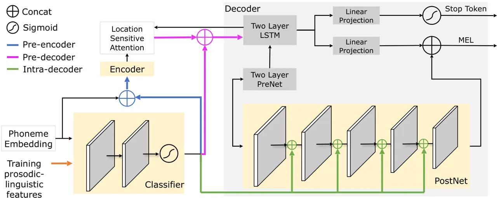

# Flavored Tacotron: Conditional Learning for Prosodic-linguistic Features

Mahsa Elyasi    Gaurav Bharaj

###### Abstract

Neural sequence-to-sequence text-to-speech synthesis (TTS), such as
Tacotron-2, transforms text into high-quality speech. However,
generating speech with natural prosody still remains a challenge. Yasuda
et. al. \[yasuda2020investigation\] show that unlike natural speech,
Tacotron-2’s encoder doesn’t fully represent prosodic features (e.g.
syllable stress in English) from characters, and result in flat
fundamental frequency variations.

In this work, we propose a novel carefully designed strategy for
conditioning Tacotron-2 on two fundamental prosodic features in English
– stress syllable and pitch accent, that help achieve more natural
prosody. To this end, we use of a classifier to learn these features in
an end-to-end fashion, and apply feature conditioning at three parts of
Tacotron-2’s Text-To-Mel Spectrogram: pre-encoder, post-encoder, and
intra-decoder. Further, we show that jointly conditioned features at
pre-encoder and intra-decoder stages result in prosodically natural
synthesized speech (vs. Tacotron-2), and allows the model to produce
speech with more accurate pitch accent and stress patterns.

Quantitative evaluations show that our formulation achieves higher
fundamental frequency contour correlation, and lower Mel Cepstral
Distortion measure between synthesized and natural speech. And
subjective evaluation shows that the proposed method’s Mean Opinion
Score of 4.14 fairs higher than baseline Tacotron-2, 3.91, when compared
against natural speech (LJSpeech corpus), 4.28.

^(†)^(†)address: AI Foundation, USA ^(†)^(†)email: {mahsa,
gaurav}@aifoundation.com

Index Terms: Text-to-speech synthesis, English prosody, Prosodic
feature, Pitch accent, End-to-end learning, Tacotron 2

## 1 Introduction

Text-To-Speech (TTS), a sequence-to-sequence problem, aims to synthesize
intelligible and natural sounding speech from input text. Generally, TTS
approaches can be categorized as: statistical parametric speech
synthesis (SPSS) and Neural sequence-to-sequence TTS. SPSS typically
consists of several domain-specific modules that require feature
engineering: a text analyzer to convert input text into linguistic and
prosodic features (front-end), a duration model to predict phoneme
duration, an acoustic model (back-end) to generate fundamental frequency
contour ($`F_{0}`$) and spectrum, and a vocoder to synthesize speech
from these acoustic features. Recent methods use neural
sequence-to-sequence techniques that represent these internal modules as
a single neural module. Here, output speech is directly inferred from
input text; this technique is ideally called end-to-end TTS ¹¹ 1 We
refer to them as neural sequence-to-sequence methods, since in-practice,
they are not fully end-to-end, where separate vocoder and
grapheme-to-phoneme methods are used for quality improvement..

The main advantage of a neural sequence-to-sequence TTS is that it does
not require explicit feature engineering or feature extraction. An
encoder-decoder architecture transforms input text to an intermediate
representation (Mel-Spectrogram) followed by a vocoder that infers
speech waveform directly from Mel-Spectrogram. The goal of encoder is to
extract robust linguistic and prosodic features from input text. For
example, encoder architecture in neural TTS method,
Tacotron 2 \[shen2018natural\], is inspired from work done in the field
of machine translation, that contracts a space to transform input text
into a cross-language linguistic representation. Such an encoder
architecture does not fully represent prosodic-linguistic features,
since it is not designed to explicitly assimilate prosodic information.

This inability to encode text-based prosodic-linguistic features is a
drawback of most neural sequence-to-sequence TTS methods, when compared
with SPSS (e.g. Merlin \[wu2016merlin\]) that uses a front-end text
processors (e.g. Festival \[black1998festival\]) to extract linguistic
and prosodic-linguistic features. One way to bridge the gap between SSPS
and neural sequence-to-sequence TTS is to enrich the input sequence with
explicit linguistic features. While, adding a complete set of engineered
features is counterintuitive to the neural sequence-to-sequence TTS
\[watts2019improvements\], we note that adding some structure can help
guide neural TTS towards better quality. Other works \[liu2019cross,
liu2020multi, fujimoto2019impacts, yasuda2019investigation,
luong2018investigating\] show that use of pitch accent (Japanese and
English), tone (Chinese) and stress syllables (Japanese, Chinese and
English) as additional inputs can help improve subjective and
quantitative evaluations. To the best of your knowledge, conditioning
pitch accent and stress syllable has not been shown for English
Tacotron 2, neither is applying it in a supervised fashion or at other
parts of Tacotron 2 rather than input. In this work, we present a method
to use a minimal set of features that help improve overall quality of
synthesized speech. To summarize, our contributions include:

- •
  A carefully designed strategy that conditions learnable prosodic
  features in the Tacotron 2’s Text-To-Mel Spectrogram (TTM).
- •
  Use of two fundamental prosodically related lexical features in
  English language – stress syllable and pitch accent.
- •
  Improved overall prosodic quality of generated speech, quantitative
  and subjective evaluations.

In Section 2, we summarize the details of neural sequence-to-sequence
TTS and the usage of prosodic-linguistic features. In Section 3, we
propose a new formulation for conditioning Tacotron 2 on these features
– stress syllable and pitch accent. In Section , we present the our
quantitative and subjective evaluations. Finally, in Section , we
discuss our findings and the future works.

## 2 Related Works

Figure 1: Proposed structural changes applied to Tacotron 2’s TTM for
conditioning on prosodic-linguistic features. The pre-encoder,
pre-decoder, and intra-decoder methods are differentiated through blue,
magenta, and green arrows. The red arrows only applied during the
training

Comprehensive linguistic representation is feasible when TTS’s encoder
and the training data are sufficiently rich in complexity and large,
respectively \[yasuda2020investigation\]. Increasing the complexity of
the encoder requires an increase in model size, and resultant training
iterations. Similarly, creating a dataset that matches the word-coverage
of a lexicon dictionary is challenging. For example, even large-scale
data such as LibriTTS \[zen2019libritts\] cannot offer such a
comprehensive word-coverage \[taylor2019analysis\]. Thus, several
studies attempt to use linguistically richer inputs. Regardless of
language, usage of phoneme input helps generate better results than
character input \[yasuda2020investigation\], in neural
sequence-to-sequence TTS (e.g., Tacotron 2).

Prosodic-linguist features, in addition to the phoneme inputs, is
essential in tonal (such as Chinese) and pitch accent languages (such as
Japanese) due to failure of neural sequence-to-sequence TTS systems in
generating intelligible speech from character only inputs. Thus, a
combination of tonal types and stress for Chinese, and pitch accent
types and stress for Japanese are often used as an additional
prosodic-linguist input features.

Two ways to add these features to the phoneme input include:
augmenting \[liu2020tone, suni2020prosodic\] and
conditioning \[liu2020multi, luong2018investigating\]. When augmenting,
the length of phoneme set is increased with respect to the number of
added features, while dimension of the phoneme embedding remains
unchanged. When conditioning, the length of phoneme set remains
unchanged, and dimension of the phoneme embedding is increased with
respect to the number of added features ²² 2 For example, consider a
language with $`n`$ voiced and $`m`$ unvoiced phonemes and a phoneme
embedding mechanism with $`k`$ dimension. For augmenting the syllable
stress feature, the length of the phoneme set will increase to
$`(2)n+m`$, while for conditioning the same features, size of the
phoneme embedding will increase to $`k+1`$..

Even though high quality synthesized speech using Tacotron 2, from
character input has been reported for English
language \[shen2018natural\], many studies prefer to use phoneme input
rather than the character input due to presence of mispronunciation and
inaccurate stress levels when the character input is used. One reason
for this preference is that the CNN-based encoder from Tacotron 2 is
more lightweight when compared to CBHG encoder,
Tacotron \[wang2017tacotron\] which makes it challenging to learn the
the disambiguation between underlying character pronunciation and stress
syllable patterns. In a comprehensive study, Yasuda et.
al. \[yasuda2020investigation, yasuda2019investigation\] have
investigated the effects of linguistic features in Tacotron based
synthesis in comparison with several SPSS systems for two languages
English and Japanese. They show that using phoneme input (augmented with
stress syllable) significantly improves the naturalness of synthesized
speech. In analysis of the synthesized speech with MOS lower than 2.5,
unnatural prosody was established as the main cause. They also report
that English Tacotron based systems generate flatter $`F_{0}`$ contour
than SSPS systems and natural speech, and result in unnatural prosody
and lower MOS measure. Similarly, Shen et. al. \[shen2018natural\] note
that unnatural prosody (specifically unnatural pitch accent) as the main
artifact in an analysis of English sentences.

Augmenting the phoneme inputs with stress syllables is a common practice
in training English Tacotron 2. Conditioning the stress syllable
features into the phoneme embedding vector is used to construct a
multi-lingual model \[liu2020multi, liu2019cross\]. Suni et.
al. \[suni2020prosodic\] uses the augmentation method to add three
prosodic-linguistic features: stress syllable (unstressed and stressed),
pitch accent (unaccented, accented, and emphasized), and phrase
boundary (no phrase, minor phrase and major phrase). The stress syllable
are added into the voiced phonemes (resulting two symbols per each),
while pitch accent and phrase boundary are encoded into nine symbols
that are each added before prominent word or a word followed by a phrase
boundary. Our method differs from \[suni2020prosodic\] in the following
ways: 1) they use raw features (extracted from speech) during training
and test, while we learn prediction of these features (extracted from
text) during the training. 2) they augment the features in to the input
of the Tacotron 2, while we condition Tacotron-2 on these features at
three different modules.

## 3 Method

We first introduce our baseline, then propose a carefully designed
strategy for conditional learning of prosodic features – stress syllable
and pitch accent, on the baseline. And in Section , we justify our
choice for the proposed conditioning strategy.

### 3.1 Baseline

We use Tacotron 2’s TTM to synthesize a Mel Spectrogram from input text,
and we use Parallel-Wavegan’s Vocoder \[yamamoto2020parallel\] to
synthesize waveforms from synthesized Mel Spectrogram features. We refer
to the combination of Tacotron 2’s TTM and Parallel-Wavgan’s Vocoder as
our baseline (see Table  for baseline’s details).

### 3.2 Proposed method

We note that in computer vision, it has been shown that adding
structured noise before every CNN modules of the network results in more
accurate image generation \[karras2019style\]. Further, coordinated
CNN \[liu2018intriguing\] shows that by conditioning a CNN module with
the input coordinates leads to more accurate prediction of object
coordination. In speech synthesis, it has been shown that
conditioning/augmenting linguistic features into the input improves the
speech naturalness. Also, conditioning speaker IDs before Tacotron’s
decoder is commonly used for training a multi-speaker TTS system. We
take inspiration from such approaches, and propose a novel structured
conditioning strategy that results in richer local variation in
$`F_{0}`$ contour.

Figure 1, illustrates the proposed structural changes to Tacotron 2’s
TTM for conditioning on prosodic-linguistic features. We use a
classifier that take the output of the phoneme embedding as input and
predict two dimensional binary vector as an output. This classifier
consists of two layers bidirectional LSTM followed by a fully connected
network and Sigmoid activation. Bi-LSTM followed by Conditional Random
Field layer is commonly used architecture for sequential labeling tasks.
Since, only two features need be predicted, we do not need a heavier
structure after the Bi-LSTM layers. Therefore, we use a fully connected
network with a Sigmoid activation.

We then use the learnt binary vector to condition at three stages of
Tacotron 2’s TTM :

- •
  Pre-encoder: where output of phoneme embedding and classifier are
  concatenated and encoded by the encoder.
- •
  Pre-decoder: where the output of attention and classifier are
  concatenated and passed to the decoder.
- •
  Intra-decoder: where the output of each CNN model in post-net and
  classifier are concatenated and passed to the next module.
