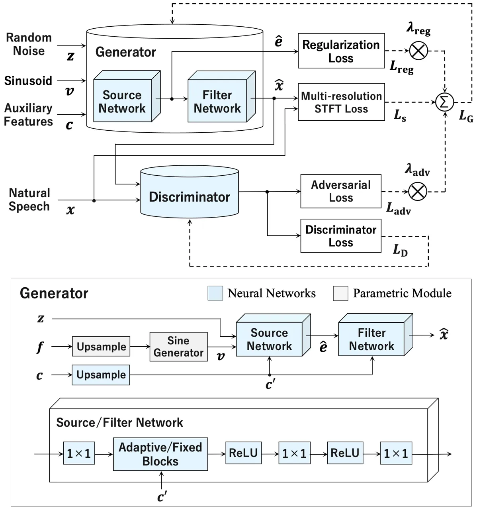

# Unified Source-Filter GAN: Unified Source-filter Network Based On Factorization of Quasi-Periodic Parallel WaveGAN

Reo Yoneyama    Yi-Chiao Wu    Tomoki Toda

###### Abstract

We propose a unified approach to data-driven source-filter modeling
using a single neural network for developing a neural vocoder capable of
generating high-quality synthetic speech waveforms while retaining
flexibility of the source-filter model to control their voice
characteristics. Our proposed network called unified source-filter
generative adversarial networks (uSFGAN) is developed by factorizing
quasi-periodic parallel WaveGAN (QPPWG), one of the neural vocoders
based on a single neural network, into a source excitation generation
network and a vocal tract resonance filtering network by additionally
implementing a regularization loss. Moreover, inspired by neural source
filter (NSF), only a sinusoidal waveform is additionally used as the
simplest clue to generate a periodic source excitation waveform while
minimizing the effect of approximations in the source filter model. The
experimental results demonstrate that uSFGAN outperforms conventional
neural vocoders, such as QPPWG and NSF in both speech quality and pitch
controllability.

^(†)^(†)address: ¹Nagoya University Furo-cho,Chikusa-ku,Nagoya,464–8601
Japan  
²Information Technology Center,Nagoya University Furo-cho,
Chikusa-ku,Nagoya, 464–8601 Japan^(†)^(†)email: ¹{yoneyama.reo,
yichiao.wu}@g.sp.m.is.nagoya-u.ac.jp, ²tomoki@icts.nagoya-u.ac.jp

Index Terms: Speech synthesis, neural vocoder, source-filter model,
generative adversarial networks, Parallel WaveGAN

## 1 Introduction

Currently, neural vocoders \[wavenet, pwn, pwg, samplernn, fftnet,
flowavenet, melgan, multi-melgan, waveffjord, hinet, waveglow, hooligan,
vocgan, pwngan, sa_pwngan, pap_gan, glotgan_2017, glotgan_2019, wavernn,
clarinet, nsf_2019, nsf_2020, lpcnet, nhv, gelp, glotnet\] usually
achieve very high-fidelity speech generation by directly modeling raw
speech waveforms using advanced neural networks without ad hoc designs.
On the other hand, because of the data-driven nature and unified network
architecture \[qpnet, qppwg\], the speech components controllability of
the neural vocoders are usually inferior to the conventional
source-filter vocoders \[straight, world\]. Therefore, it is desired to
develop a neural vocoder capable of high-fidelity and controllable
speech generation.

To improve the controllability, there have been proposed many generation
models integrating conventional parametric-based source-filter models
with deep neural network architectures \[nsf_2019, nsf_2020, lpcnet,
nhv, gelp, glotnet\]. For example, neural source-filter (NSF)
\[nsf_2019, nsf_2020\] realizes speech generation based on
non-autoregressive modeling by non-linear filtering of parametrically
generated source excitation signals with multiple dilated convolutional
layers. LPCNet \[lpcnet\] adopts a WaveRNN \[wavernn\]-like architecture
to generate residual signals while a linear filtering process is applied
to generate speech waveforms as in the conventional linear predictive
coding (LPC) vocoder \[lpc_1982, lpc_1995\]. Generative adversarial
network (GAN) based neural homomorphic vocoder (NHV) \[nhv\] first
develops neural-based linear-time-variant (LTV) filters with the input
pulse trains and white noise to generate mixed source excitations, and
then a trainable causal finite impulse response (FIR) filter is applied
to the excitations for generating the output waveforms. Although these
hybrid neural vocoders have successfully improved the controllability by
integrating parametric-based approaches, the synthetic speech quality of
these vocoders tends to be inferior to that of data-driven unified
neural vocoders. Moreover, there is still room for improvements in the
controllability.

To achieve high-fidelity and high-controllability speech generation, we
propose a GAN-based framework to introduce the source-filter model with
fewer ad hoc designs into a single neural network. The generator is
designed by factorizing quasi-periodic Parallel WaveGAN (QPPWG)
\[qppwg\] into two cascaded networks corresponding to the source
excitation generation and resonance filtering, and these two networks
are jointly optimized in the training stage. Only a sinusoidal waveform
is additionally used as the simplest clue to generate a periodic source
excitation waveform while minimizing the effect of approximations in the
source filter model. Moreover, to generate reasonable source excitation
signals, an additional auxiliary loss is applied to the source
excitation network. The main contributions of this paper are summarized
as follows:

- •
  We propose a unified framework for neural vocoders attaining an
  interpretable and tractable source-filter-like architecture, making it
  possible to well models excitation generation and resonance filtering
  while keeping the simplicity of training.
- •
  The proposed method achieves better fundamental frequency ($`F_{0}`$)
  controllability than the conventional neural vocoders, such as QPPWG
  and NSF, while attaining high-fidelity speech generation even in
  $`F_{0}`$ transformation scenarios.

## 2 Related work

This chapter describes non-AR neural vocoders: Parallel WaveGAN (PWG)
\[pwg\], QPPWG \[qppwg\], and NSF \[nsf_2019\]. PWG and QPPWG are the
basis of our method, and we use QPPWG as one of the baseline methods.
NSF is a semi-parametric neural vocoder based on the source-filter
model, which is used as the other baseline method.

### 2.1 Parallel WaveGAN (PWG)

PWG is a GAN-based method for generating raw waveforms. It is a compact
model without an autoregressive structure or a causal mechanism, and can
achieve fast speech generation with high fidelity. The model consists of
two networks, generator (G) and discriminator (D). The WaveNet-based
generator, which is conditioned by auxiliary features, learns to make
the discriminator recognize the generated sample as $`real`$. This
process can be written as follows:

```math
\mathcal{L}_{adv}(G,D)=\mathbb{E}_{\bm{z}\sim\mathcal{N}(0,I)}\left[(1-D(G(\bm{z})))^{2}\right], \tag{1}
```

where $`\bm{z}`$ is random noise distributed from Gaussian distribution.
Note that all auxiliary features of the generator are omitted in this
paper for simplicity.

The discriminator learns to identify the generated sample as $`fake`$
and the natural sample as $`real`$. This process can be written as
follows:

```math
\split\mathcal{L}_{D}(G,D)=\mathbb{E}_{\bm{x}\sim p_{data}}\left[(1-D(\bm{x}))^{2}\right]&\\
+\mathbb{E}_{\bm{z}\sim\mathcal{N}(0,I)}\left[D(G(\bm{z}))^{2}\right], \tag{2}
```

where $`\bm{x}`$ denotes the natural samples and $`p_{data}`$ denotes
the data distribution of the natural samples. PWG also adopts multi-STFT
loss \[pwg\] as an auxiliary loss $`\mathcal{L}_{aux}(G)`$ to improve
the training stability. In conclusion, the final loss function of the
generator can be written as a weighted sum of $`\mathcal{L}_{aux}`$ and
$`\mathcal{L}_{adv}`$ as follows:

```math
\mathcal{L}_{G}(G,D)=\mathcal{L}_{aux}(G)+\lambda_{adv}\mathcal{L}_{adv}(G,D) \tag{3}
```

where $`\lambda_{adv}`$ is hyperparameter for weight and empirically set
to 4.0 in this paper.

### 2.2 Quasi-periodic parallel WaveGAN (QPPWG)

Although PWG achieves high-fidelity speech generation, the fully
data-driven nature makes PWG lack the explicit controllability of each
speech component especially when unseen auxiliary features are given
such as $`F_{0}`$ outside the $`F_{0}`$ range of training data. To
alleviate this issue, in QPPWG pitch-dependent dilated convolution
neural networks (PDCNNs), which dynamically changes dilation sizes
adapting to pitch, are introduced to PWG. PDCNN facilitates QPPWG to
capture the very long-term dependencies of periodic components and makes
the pitch of the QPPWG-generated speech more consistent with the
auxiliary $`F_{0}`$.

For the ordinary dilated convolution neural networks, the dilation size
$`d`$, is predefined and time-invariant. The dilation sizes $`d_{t}`$ of
PDCNNs are dynamically defined at each time step $`t`$ as follows:

```math
d_{t}=d\times f_{s}/(f_{0,t}\times a) \tag{4}
```

where $`f_{s}`$ is the sampling rate, $`f_{0,t}`$ is an $`F_{0}`$ value
at time $`t`$, and $`a`$ is a hyperparameter called dense factor, which
determines the sparsity of the PDCNNs, and empirically set to 4.0 in
this paper.

### 2.3 Neural source-filter (NSF)

NSF is a neural vocoder based on source-filter model, and divided into
three modules: a condition module, a source module, and a filter module.
An $`F_{0}`$ sequence $`f_{0,1},\cdots,f_{0,T}`$ and a spectral feature
sequence (e.g. mel-spectrogram) are used as an input of NSF. The
condition module upsamples the input features and extracts feature
embeddings for the resonance filtering. In the source module, by
treating $`f_{0,t}`$ as the instantaneous frequency, the fixed number of
sinusoidal wave basis signals is generated, where the $`h`$-th basis
signal $`e_{t}^{(h)}`$ is given by

```math
e_{t}^{(h)}=\cases{\sin}\left(\displaystyle{\sum_{k=1}^{t}}2\pi\frac{hf_{0,k}}{f_{s}}+\phi\right)+n_{t}&\mbox{if}~f_{0,t}>0\\
\displaystyle{\frac{1}{3\sigma}n_{t}}\mbox{if}~f_{0,t}=0, \tag{5}
```

where $`f_{s}`$ is sampling frequency, $`\phi\in[-\pi,\pi]`$ is a random
initial phase, $`n_{t}\sim\mathcal{N}(0,\sigma^{2})`$ is a Gaussian
noise, and $`h`$ is the scale factor of the fundamental frequency. These
signals are merged using a feed-forward network to output the source
excitations. The filter module modulates the source signal using
multiple stages of dilated convolution and affine transformations
similar to those in ClariNet \[clarinet\]. NSF adopts multi-resolution
STFT loss to learn the difference between the output and the target
waveform in the spectral domain. Unlike that of PWG, it calculates the
mean square error (MSE) for the log power spectrum.

## 3 Proposed method: unified source-filter GAN (uSFGAN)

Our proposed method, uSFGAN is based on QPPWG, but differs on the
generator in several ways: (1) the generator is explicitly split into a
source-network and a filter-network; (2) a sinusoidal signal is used as
an additional input of the source-network, and (3) a regularization term
for the output of the source-network is added to the auxiliary loss. On
the other hand, the discriminator is the same as that of QPPWG.

### 3.1 Network architecture



Figure 1: Architecture of the proposed method, uSFGAN.

As the proposed architecture shown in Fig.1, the generator of uSFGAN
receives random noise $`\bm{z}`$ sampled from Gaussian distribution, an
$`F_{0}`$ sequence $`\bm{f}`$, and an auxiliary feature sequence
$`\bm{c}`$ as the input, where $`\bm{f}`$ and $`\bm{c}`$ are assumed to
be extracted per frame. A sinusoidal signal
$`\bm{v}=v_{1},\cdots,v_{T}`$ is first generated on the basis of
upsampled $`\bm{f}`$ as follows:

```math
v_{t}=\cases{\sin}\left(\displaystyle{\sum_{k=1}^{t}}2\pi\frac{f_{0,k}}{f_{s}}\right)&if~f_{0,t}>0\\
0if~f_{0,t}=0, \tag{6}
```

where $`f_{0,t}`$ is the instantaneous frequency at time $`t`$, and
$`f_{s}`$ is the sampling frequency. Unlike QPPWG adopting only noise
inputs, the sinusoidal signal input is used to make the estimation of
the harmonic components easier and improve the learning efficiency of
the proposed source-network. Then, $`\bm{v}`$ is combined with
$`\bm{z}`$ as a two-channel input of the source-network. The
source-network performs the pitch-dependent dilated convolution
conditioned on the upsampled auxiliary features $`\bm{c}`$ to output the
source excitation signal $`\hat{\bm{e}}`$. The generated source
excitation signal is used as the input to the filter-network and is also
used to calculate the spectral envelope regularization loss, which is
used for the auxiliary loss, as mentioned in Section 3.2. In the
filter-network, non-causal dilated convolution with fixed dilation sizes
is performed. The output waveform is input to the discriminator and also
used to calculate the multi-resolution STFT auxiliary loss.

### 3.2 Spectral envelope regularization loss

To encourage the source-network to output a reasonable source excitation
signal, one constraint is imposed on the output of the source-network.
As in the traditional source-filter vocoders, such as STRAIGHT
\[straight\] and WORLD \[world\], we assume that the spectral structure
of the source excitation signal consists of harmonic components and
stochastic components, and its spectral envelope is flat, i.e., the
power of spectral envelope is constant over all frequency. We adopt
regularization to satisfy this assumption on the spectral envelope of
the source excitation signal in the output of the source-network.

We use a simplified algorithm of cheaptrick \[cheaptrick\] to extract
the spectral envelope from the output signal of source-network. The
original algorithm of cheaptrick is composed of three steps: (1)
$`F_{0}`$ adaptive windowing and calculation of log power spectrum, (2)
$`F_{0}`$ adaptive smoothing in the spectral domain, and (3) $`F_{0}`$
adaptive liftering in the cepstrum domain. In order to speed up the
spectral envelope estimation process, we apply several modifications to
the cheaptrick algorithm. First, we directly use the $`F_{0}`$ values
given as the auxiliary feature $`\bm{f}`$ rather than extracting
$`F_{0}`$ values from the output signal. Those $`F_{0}`$ values are
further rounded to integers, and then, the corresponding windows and
liftering functions are obtained in advance. Moreover, the step (2) is
omitted because this process requires a relatively large processing time
and the $`F_{0}`$ adaptive spectral envelope extraction is still
performed by the $`F_{0}`$ adaptive liftering in the step (3). Although
these modification causes slight degradation of the spectral envelope
estimation accuracy, it doesn’t cause any significant issues as the
precise spectral envelope estimation is not necessary for the
regularization.

The spectral envelope regularization loss is given by

```math
\mathcal{L}_{reg}(G)=\frac{1}{2}\sum_{n=1}^{N}\sum_{k=1}^{K}\hat{E}_{k}^{(n)2}, \tag{7}
```

where $`\hat{E}_{k}^{(n)}`$ is the $`k`$-th frequency component of log
power spectral envelope extracted from $`\bm{\hat{e}}`$ at $`n`$-th time
frame by the simplified cheaptrick algorithm. Note that when this loss
reaches to 0, linear power values of the spectral envelope are 1 over
all frequency and time frames.

### 3.3 Training criteria

The same adversarial losses as QPPWG but different auxiliary losses are
adopted in uSFGAN training. Our method uses two types of auxiliary
losses: multi-resolution STFT loss and the spectral envelope
regularization loss. The STFT loss is defined as follows:

```math
\mathcal{L}_{s}(G)=\frac{1}{2}\sum_{n=1}^{N}\sum_{k=1}^{K}\left[\log\frac{\mbox{Re}(Y_{k}^{(n)})^{2}+\mbox{Im}(Y_{k}^{(n)})^{2}}{\mbox{Re}(\hat{Y}_{k}^{(n)})^{2}+\mbox{Im}(\hat{Y}_{k}^{(n)})^{2}}\right]^{2}, \tag{8}
```

where $`Y_{k}^{n}`$ and $`\hat{Y}_{k}^{n}`$ are the $`k`$-th STFT
component at the $`n`$-th time frame of a natural waveform and the
output waveform. Re and Im denote real part and imaginary part,
respectively. This STFT loss is different from that of PWG \[pwg\], but
the same as that of NSF \[nsf_2019, nsf_2020\]. Finally, our auxiliary
loss is represented as follows:

```math
\mathcal{L}_{aux}(G)=\frac{1}{M}\sum_{m=1}^{M}\mathcal{L}_{s}^{(m)}(G)+\lambda_{reg}\mathcal{L}_{reg}(G), \tag{9}
```

where $`M`$ is the number of STFT losses using various STFT parameters,
and $`\lambda_{reg}`$ is a hyperparameter balancing the two auxiliary
losses and empirically set to 1.0 in this paper.

## 4 Experimental evaluation

### 4.1 Experimental conditions

To investigate the effectiveness of our proposed method, we compared
four different models: publicly available pretrained NSF (hn-sinc-nsf-9
\[hn-sinc-nsf-9\]) model referred to as PT-NSF, NSF with WORLD features
referred to as WORLD-NSF, QPPWG, uSFGAN, and uSFGAN without the spectral
envelope regularization loss. We adopted $`F_{0}`$ conversion to
evaluate the controllability.

For the training data, we used 4000 utterances from CMU-ARCTIC database
\[arctic\] consisting of more than 1000 utterances each from four
speakers: slt, bdl, clb, and rms. We used a set of 264 utterances
consisting of 66 utterances from each speaker as validation data and
another set of 264 utterances as test data. The sampling frequency was
set to 16000 Hz by down-sampling.

WORLD-NSF used the same architecture as PT-NSF. QPPWG used 10 adaptive
blocks and 10 fixed blocks as the optimized setting. uSFGAN used 30
adaptive blocks for the source-network, and 30 fixed blocks for the
filter-network. uSFGAN was trained with the RAdam optimizer \[radam\]
($`\epsilon=10^{-6}`$) with 400 k iterations as in QPPWG. The generator
of uSFGAN is trained with only auxiliary loss in the first 100 k
iterations, and then trained with the adversarial loss as well as the
auxiliary loss in the remaining 300 k iterations. The parameter settings
of the multi-resolution STFT loss are shown in Table 4.1.

Table 1: Parameter settings for multi-resolution STFT loss. We apply a
hanning window before the FFT process.
