# Disentanglement Learning for Variational Autoencoders Applied to Audio-Visual Speech Enhancement

This work has been funded by the German Research Foundation (DFG) in the
transregio project Crossmodal Learning (TRR 169) and ahoi.digital.

###### Abstract

Recently, the standard variational autoencoder has been successfully
used to learn a probabilistic prior over speech signals, which is then
used to perform speech enhancement. Variational autoencoders have then
been conditioned on a label describing a high-level speech attribute
(e.g. speech activity) that allows for a more explicit control of speech
generation. However, the label is not guaranteed to be disentangled from
the other latent variables, which results in limited performance
improvements compared to the standard variational autoencoder. In this
work, we propose to use an adversarial training scheme for variational
autoencoders to disentangle the label from the other latent variables.
At training, we use a discriminator that competes with the encoder of
the variational autoencoder. Simultaneously, we also use an additional
encoder that estimates the label for the decoder of the variational
autoencoder, which proves to be crucial to learn disentanglement. We
show the benefit of the proposed disentanglement learning when a voice
activity label, estimated from visual data, is used for speech
enhancement.

|                                                                    |
| ------------------------------------------------------------------ |
| Guillaume Carbajal, Julius Richter, Timo Gerkmann                  |
| Signal Processing (SP), Universität Hamburg, Germany               |
| {guillaume.carbajal, julius.richter, timo.gerkmann}@uni-hamburg.de |

Index Terms—  Speech enhancement, conditional generative model,
variational autoencoder, disentanglement learning, adversarial training,
semi-supervised learning, audio-visual.

## 1 Introduction

Single-channel speech enhancement consists in recovering a speech signal
from a mixture signal captured with one microphone in a noisy
environment \[1\]. Common speech enhancement approaches estimate the
speech signal using a filter in the time-frequency domain to reduce
noise while avoiding speech artifacts \[2\]. Under the Gaussian
assumption, the optimal filter in the minimum mean square error sense
requires estimating the signal variances \[3, 4, 5\].

Recently, deep generative models based on the variational autoencoder
(VAE) have gained attention for learning the probability distribution of
complex data \[6\]. VAEs have been used to learn a prior distribution of
clean speech, and have been combined with an untrained non-negative
matrix factorization (NMF) noise model to estimate the signal variances
using a Monte Carlo expectation maximization (MCEM) algorithm \[7, 8\].
However, since the VAE speech model is trained with clean speech only in
an unsupervised manner, the speech prior generates a speech-like signal
when only noise is present. As a result, the VAE often outputs
speech-like noise when applied to noisy speech \[9\].

An increased robustness can be obtained by incorporating temporal
dependencies \[10\], noise-aware training \[11\], or by conditioning the
VAE on a label describing an attribute of the data that allows for a
more explicit control of data generation \[12\]. For various
speech-related tasks, VAEs have been conditioned on a label describing a
speech attribute, such as speaker identity \[13, 14\], phoneme \[14\] or
speech activity \[15\]. Ideally, the label should be independent from
the other latent dimensions to obtain an explicit control of speech
generation. However, the semi-supervised learning of conditional VAEs
does not guarantee that it will promote independence between the label
and the other latent dimensions \[16\]. As a result, the speech
generation can only partially be controlled by the label.

Disentanglement learning aims at making all the dimensions of the latent
distribution independent from each other \[17, 18, 19\], e.g. by holding
different axes of variation fixed during training \[20\].
Semi-supervised disentanglement approaches, on the other hand, tackle
the problem of making only some observed (often interpretable)
variations in the data independent from the other latent dimensions
which themselves remain entangled \[12, 16, 21\]. In particular, some of
them rely on adversarial training in the latent space for image
generation \[22, 23\].

In this work, we propose to use a semi-supervised disentanglement
approach based on adversarial training in the latent space. At training,
we use a discriminator that competes with the encoder of the VAE. The
discriminator aims at identifying the label from the other latent
dimensions, whereas the encoder aims at making it unable to estimate the
label. Simultaneously, we also use an additional encoder that estimates
the label for the decoder of the VAE, which proves to be crucial to
learn disentanglement during training. We show the benefit of the
proposed disentanglement learning when a voice activity label, estimated
from visual data, is used for speech enhancement.

The rest of this paper is organized as follows. In Section 2 we
summarize the background related to the VAE for speech enhancement.
Section 3 describes our proposed approach. The experimental setup is
described in Section 4 which is followed by the evaluation in Section 5.

## 2 Background

### 2.1 Mixture model and filtering

In the time-frequency domain using the short time Fourier transform
(STFT), the mixture signal $`x_{nf}\in\mathbb{C}`$ is the sum of the
clean speech $`s_{nf}\in\mathbb{C}`$ and the noise
$`b_{nf}\in\mathbb{C}`$:

```math
\displaystyle x_{nf}=\sqrt{g_{n}}\,s_{nf}+b_{nf}, \tag{1}
```

at time frame index $`n\in[1,N]`$ and frequency bin $`f\in[1,F]`$, where
$`N`$ denotes the number of time frames and $`F`$ the number of
frequency bins of the utterance. The scalar $`g_{n}\in\mathbb{R}_{+}`$
represents a frequency-independent but time-varying gain providing some
robustness with respect to the time-varying loudness of different speech
signals \[8\].

Under the Gaussian assumption, the clean speech $`s_{nf}`$ can be
estimated in the minimum mean square error sense using the Wiener
estimator:

```math
\widehat{s}_{nf}=\frac{\widehat{g}_{n}\widehat{v}_{s,nf}}{\widehat{g}_{n}\widehat{v}_{s,nf}+\widehat{v}_{b,nf}}\,x_{nf}, \tag{2}
```

where $`\widehat{v}_{s,nf}`$ and $`\widehat{v}_{b,nf}`$ are the
estimated variances of the clean speech $`s_{nf}`$ and the noise
$`b_{nf}`$, respectively. Under a local stationary assumption,
short-time power spectra $`|s_{nf}|^{2}`$ and $`|b_{nf}|^{2}`$ are
unbiased estimates of the signal variances \[24\].

### 2.2 VAE as speech prior

#### 2.2.1 Standard VAE

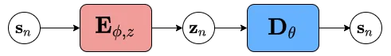

(a) Standard VAE

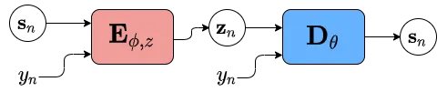

(b) Conditional VAE \[15\]

Figure 1: Training scheme for (a) the standard VAE and (b) the
conditional VAE.

The standard VAE is used to learn a prior over clean speech \[7, 8\].
Fig. 1a shows the training scheme of the standard VAE. At time frame
$`n`$, the frequency bins of clean speech
$`\mathbf{s}_{n}\in\mathbb{C}^{F}`$ are modeled as

```math
p_{\theta}(\mathbf{s}_{n}|\mathbf{z}_{n})=\mathcal{CN}(\mathbf{0},\text{diag}(\mathbf{D}_{\theta}(\mathbf{z}_{n}))),\hskip 9.24994pt\mathbf{z}_{n}\sim\mathcal{N}(\mathbf{0},\mathbf{I}), \tag{3}
```

where $`\mathbf{z}_{n}\in\mathbb{R}^{L}`$ denotes a latent variable of
dimension $`L`$ and
$`\mathbf{D}_{\theta}(\mathbf{z}_{n})\in\mathbb{R}_{+}^{F}`$ is the
output of the _decoder_ network $`\mathbf{D}_{\theta}(\cdot)`$
parametrized by $`\theta`$.

In variational inference, the posterior of $`\mathbf{z}_{n}`$ is
approximated as

```math
q_{\phi}(\mathbf{z}_{n}|\ \mathbf{s}_{n})=\mathcal{N}(\boldsymbol{\mu}_{\phi}(|\mathbf{s}_{n}|^{2}),\operatorname{diag}(\mathbf{v}_{\phi}(|\mathbf{s}_{n}|^{2}))), \tag{4}
```

where $`\boldsymbol{\mu}_{\phi}(|\mathbf{s}_{n}|^{2})\in\mathbb{R}^{D}`$
and $`\mathbf{v}_{\phi}(|\mathbf{s}_{n}|^{2})\in\mathbb{R}_{+}^{D}`$ are
the outputs of the _encoder_ network $`\mathbf{E}_{\phi,z}(\cdot)`$
parametrized by $`\phi`$.

The encoder $`\mathbf{E}_{\phi,z}(\cdot)`$ and decoder
$`\mathbf{D_{\theta}}(\cdot)`$ are jointly trained by maximizing a lower
bound of the marginal per-frame log-likelihood, called the evidence
lower bound (ELBO):

```math
\mathcal{L}_{\text{ELBO}}=\mathbb{E}_{q_{\phi}(\mathbf{z}_{n}|\mathbf{s}_{n})}[\log p_{\theta}(\mathbf{s}_{n}|\mathbf{z}_{n})]-\mathcal{D}_{\text{KL}}(q_{\phi}(\mathbf{z}_{n}|\mathbf{s}_{n})||p(\mathbf{z}_{n})), \tag{5}
```

where the first term is the reconstruction loss and
$`\mathcal{D}_{\text{KL}}(\cdot||\cdot)`$ denotes the Kullback-Leibler
divergence. However, since the training loss
$`\mathcal{L}_{\text{ELBO}}`$ is unsupervised, there is no explicit
control of speech generation.

#### 2.2.2 Conditional VAE

The VAE can be conditioned on a label $`y_{n}\in\mathcal{Y}`$ describing
a speech attribute (e.g. speech activity) that allows for a more
explicit control of speech generation \[15\]. A common approach is to
make use of the label $`y_{n}`$ by directly inputting it in both the
encoder $`\mathbf{E}_{\phi,z}(|\mathbf{s}_{n}|^{2},y_{n})`$ and the
decoder $`\mathbf{D}_{\theta}(\mathbf{z}_{n},y_{n})`$ (see Fig 1b) \[13,
14, 15\]. The training loss remains the same as for the standard VAE,
i.e. $`\mathcal{L_{\text{ELBO}}}`$.

### 2.3 Non-negative matrix factorization as noise model

As in Leglaive et al. \[8\], the noise variance is modeled with an
untrained NMF as

```math
v_{b,nf}=\left\{\mathbf{H}\mathbf{W}\right\}_{nf}, \tag{6}
```

where $`\mathbf{H}\in\mathbb{R}_{+}^{N\times K}`$ and
$`\mathbf{W}\in\mathbb{R}_{+}^{K\times F}`$ are two non-negative
matrices representing the temporal activations and spectral patterns of
the noise power spectrogram. $`K`$ denotes the NMF rank.

### 2.4 Clean speech estimation

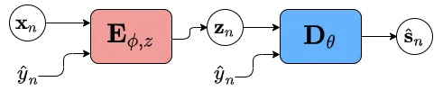

Figure 2: Estimation of the speech variance $`v_{s,nf}`$ at test time.

Speech variance estimation at test time is shown in Fig. 2. First, a
pretrained noise-robust classifier which is trained separately from the
VAE provides the label estimate $`\widehat{y}_{n}`$ from the mixture
$`\mathbf{x}_{n}`$ as input for the VAE. The outputs of the encoder and
decoder are then
$`\mathbf{E}_{\phi,z}(|\mathbf{x}_{n}|^{2},\widehat{y}_{n})`$ and
$`\mathbf{D}_{\theta}(\mathbf{z}_{n},\widehat{y}_{n})`$, respectively.
Given the speech prior provided by the VAE and the noise model, the
mixture signal $`x_{nf}`$ is distributed as

```math
x_{nf}|\ \mathbf{z}_{n}\sim\mathcal{CN}(0,{g}_{n}\{\mathbf{D}_{\theta}(\mathbf{z}_{n},\widehat{y}_{n})\}_{f}+\{\mathbf{H}\mathbf{W}\}_{nf}) \tag{7}
```

where $`\Theta_{u}=\{{g}_{n},{\mathbf{H}},{\mathbf{W}}\}`$ are the
unsupervised parameters to be estimated. Since the resulting
optimization problem is intractable due to the non-linear relation
between the speech variance $`v_{s,nf}`$ and the latent variable
$`\mathbf{z}_{n}`$, an MCEM algorithm is employed to iteratively
optimize the unsupervised parameters $`\Theta_{u}`$ \[8\]. At each
iteration, the estimated terms
$`\widehat{g}_{n}\{\mathbf{D}_{\theta}(\mathbf{z}_{n})\}_{f}`$ and
$`\{\widehat{\mathbf{H}}\widehat{\mathbf{W}}\}_{nf}`$ are supposed to
get closer to the true variances $`v_{s,nf}`$ and $`v_{b,nf}`$,
respectively.

Ideally, in order to obtain an explicit control of speech generation,
the label $`y_{n}`$ should be independent from the latent variable
$`\mathbf{z}_{n}`$. However, the training loss
$`\mathcal{L}_{\text{ELBO}}`$ does not guarantee that it will promote
independence between the label $`y_{n}`$ and the latent variable
$`\mathbf{z}_{n}`$ \[16\]. As a result, speech generation can only
partially be controlled by the label $`y_{n}`$.

## 3 Disentanglement learning

Inspired by recent work on semi-supervised disentanglement learning
\[22, 23\], we propose to use an adversarial training scheme on the
latent space to disentangle the label $`y_{n}`$ from the latent variable
$`\mathbf{z}_{n}`$. More particularly, we propose a different training
loss for the encoder of the VAE.

### 3.1 Architecture

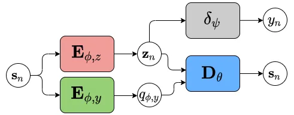

Figure 3: Adversarial training scheme for the conditional VAE

Fig. 3 shows the adversarial training scheme. At training, we use a
discriminator $`\boldsymbol{\delta}_{\psi}(\cdot)`$ that competes with
the encoder $`\mathbf{E}_{\phi,z}(\cdot)`$ of the VAE, which we refer to
as the _adversarial-encoder_. The discriminator
$`\boldsymbol{\delta}_{\psi}(\cdot)`$, parametrized by $`\psi`$, aims at
identifying the label $`y_{n}`$ from the latent variable
$`\mathbf{z}_{n}`$ whereas the _adversarial-encoder_
$`\mathbf{E}_{\phi,z}(\cdot)`$ aims at making it unable to estimate the
label $`y_{n}`$. Simultaneously, we also estimate the label $`y_{n}`$
using a classifier that we denote as the _classifier-encoder_
$`\mathbf{E}_{\phi,y}(\cdot)`$, parametrized by $`\phi`$.

Label $`y_{n}`$  We consider voice activity detection (VAD) for the
label, i.e. $`y_{n}\in\{0,1\}`$, which is here obtained from visual
data.

Discriminator $`\boldsymbol{\delta}_{\psi}(\cdot)`$   Similarly to Fader
Networks for image generation \[22\], the discriminator
$`\boldsymbol{\delta}_{\psi}(\cdot)`$ estimates the probability that the
label $`y_{n}=1`$, i.e.
$`p_{\psi}:=P(y_{n}=1|\mathbf{z}_{n})=\boldsymbol{\delta}_{\psi}(\mathbf{z}_{n})`$.
We use the binary cross entropy (BCE) as the learning objective:

```math
\mathcal{L}_{\text{dis}}=y_{n}\log p_{\psi}+(1-y_{n})\log(1-p_{\psi}). \tag{8}
```

Adversarial-Encoder $`\mathbf{E}_{\phi,z}(\cdot)`$  To force the
discriminator $`\boldsymbol{\delta}_{\psi}(\cdot)`$ to make incorrect
classification, adversarial approaches in image generation proposed to
use $`\mathcal{L}_{\text{adv-enc}}=-\mathcal{L}_{\text{dis}}`$ as the
training loss for the _adversarial-encoder_
$`\mathbf{E}_{\phi,z}(\cdot)`$ \[22, 23\]. However, this loss does not
make the discriminator $`\boldsymbol{\delta}_{\psi}(\cdot)`$ unable to
predict the label $`y_{n}`$. Instead, we thus propose to minimize the
negative binary entropy function with
$`q_{\phi,z}:=P(y_{n}=1|\mathbf{s}_{s})=\boldsymbol{\delta}_{\psi}(\mathbf{E}_{\phi,z}(|\mathbf{s}_{n}|^{2}))`$:

```math
\begin{split}\mathcal{L}_{\text{adv-enc}}&=q_{\phi,z}\log q_{\phi,z}+(1-q_{\phi,z})\log(1-q_{\phi,z}).\end{split} \tag{9}
```

Classifier-Encoder $`\mathbf{E}_{\phi,y}(\cdot)`$   Similarly to
Creswell et al. for image generation \[23\], we estimate the label
$`y_{n}`$ for the decoder $`\mathbf{D}_{\theta}(\cdot)`$ using the
_classifier-encoder_ $`\mathbf{E}_{\phi,y}(\cdot)`$ as
$`q_{\phi,y}:=P(y_{n}=1|\mathbf{s}_{n})=\mathbf{E}_{\phi,y}(|\mathbf{s}_{n}|^{2})`$.
We use the BCE as the learning objective:

```math
\mathcal{L}_{\text{clf-enc}}=y_{n}\log q_{\phi,y}+(1-y_{n})\log(1-q_{\phi,y}). \tag{10}
```

Decoder $`\mathbf{D}_{\theta}(\cdot)`$  Instead of using the binary
label $`y_{n}`$ as an input to the decoder such that
$`\mathbf{D}_{\theta}(\mathbf{z}_{n},y_{n})`$, we use the posterior
probability $`q_{\phi,y}`$ as a soft value, such that
$`\mathbf{D}_{\theta}(\mathbf{z}_{n},q_{\phi,y})`$.

### 3.2 Adversarial training

The complete loss of the conditional VAE is:

```math
\mathcal{L}_{\text{adv-VAE}}=\mathcal{L}_{\text{ELBO}}+\alpha\mathcal{L}_{\text{adv-enc}}+\beta\mathcal{L}_{\text{clf-enc}}. \tag{11}
```

At each step of the training, we update the networks as follows:

1.  1.  Update $`\mathbf{E}_{\phi,z}(\cdot)`$,
        $`\mathbf{E}_{\phi,y}(\cdot)`$ and $`\mathbf{D}_{\theta}(\cdot)`$
        using $`\mathcal{L}_{\text{adv-VAE}}`$
2.  2.  Update $`\boldsymbol{\delta}_{\psi}(\cdot)`$ using
        $`\alpha\mathcal{L}_{\text{dis}}`$^(†)^(†) $`\alpha`$ is related to
        $`\mathcal{L}_{\text{adv-enc}}`$ and proved to provide better
        results in practice.

### 3.3 Clean speech estimation

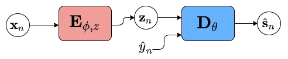

Figure 4: Estimation of the speech variance $`v_{s,nf}`$ at test time.

Speech variance estimation at test time is shown in Fig. 4. At test
time, we estimate the label $`y_{n}`$ with a pretrained noise-robust
classifier which is trained separately from the VAE on visual data. For
estimating the unsupervised parameters $`\Theta_{u}`$, we use the same
MCEM configuration as in Section 2.4.

## 4 Experimental setup

Dataset   For training, validation, and test we used the NTCD-TIMIT
dataset \[25\], which consists of audio-visual recordings. The visual
data consist of videos of the lip region at $`30`$ frames-per-second
(FPS). All audio signals have a sampling rate of $`16`$ kHz. In addition
to clean speech signals, we use the noisy versions, with 2 types of
stationary noise {Car, White} and four types of nonstationary noises
{Living Room, Cafe, Babble, Street}. We evaluate on 3 signal-to-noise
ratios (SNRs): {$`0`$, $`+5`$, $`+10`$} dB. Note that these levels were
computed on speech segments only. For training, the clean-speech and
visual sets used are of about $`5`$ h. For the test, the noisy speech
subset consists of $`15true876`$ utterances of about $`5`$ s each.

Baselines   For the noise-robust classifier estimating the label
$`y_{n}`$ at test time, we use the visual-only variant of Ariav and
Cohen’s audio-visual VAD classifier \[26\]. We pretrain the classifier
on the visual training set of the NTCD-TIMIT dataset. For the baselines,
we use the standard and the conditional VAEs, which we denote as _VAE_
and _CVAE_, respectively, both trained using
$`\mathcal{L}_{\text{ELBO}}`$.

Hyperparameter settings   The STFT is computed using a $`64\,\text{ms}`$
Hann window with 75% overlap, resulting in $`F=513`$ unique frequency
bins and an audio frame rate of $`62.5`$ FPS. To obtain the same visual
frame rate as the audio frame rate, we use FFMPEG \[27\]. This
guarantees that the audio and visual frames are synchronized. To obtain
the ground truth for the VAD label $`y_{n}`$, we use simple thresholding
in the time domain.

For a fair comparison between all the approaches, we consider a similar
architecture for each subnetwork. Tab. 1 shows the configuration of the
models. We set the dimension of the latent space to $`L=16`$. For the
loss, we empirically found that $`\alpha=\beta=10`$ provides excellent
performance. We use the Adam optimizer with standard configuration
\[28\]. We set the batch size to $`128`$. Early stopping with a patience
of $`10`$ epochs is performed using $`\mathcal{L}_{\text{adv-enc}}`$ on
the validation set. For the MCEM we follow the settings of Leglaive et
al. and set the NMF rank to $`K=10`$ \[8\].

|                                       | Hidden layers |          |                         | Output layer                |
| ------------------------------------- | ------------- | -------- | ----------------------- | --------------------------- |
| Subnetwork                            | \# layers     | \# units | act. fn                 | act. fn                     |
| $`\boldsymbol{\delta}_{\psi}(\cdot)`$ | $`2`$         | $`128`$  | $`\operatorname{ReLU}`$ | $`\operatorname{sigmoid}`$  |
| $`\mathbf{E}_{\phi,z}(\cdot)`$        | $`2`$         | $`128`$  | $`\operatorname{tanh}`$ | $`\operatorname{identity}`$ |
| $`\mathbf{E}_{\phi,y}(\cdot)`$        | $`2`$         | $`128`$  | $`\operatorname{ReLU}`$ | $`\operatorname{sigmoid}`$  |
| $`\mathbf{D}_{\theta}(\cdot)`$        | $`2`$         | $`128`$  | $`\operatorname{tanh}`$ | $`\operatorname{exp}`$      |

Table 1: Model configurations.

Metrics   To evaluate speech enhancement performance, we use the
scale-invariant signal-to-distortion ratio (SI-SDR) measured in dB
\[29\], raw scores of the extended short-time objective intelligibility
(ESTOI) with values between $`0`$ and $`1`$ \[30\], and the perceptual
objective listening quality analysis (POLQA) score with values between
$`1`$ and $`5`$ \[31\]. To evaluate the classification performance of
the visual-only VAD classifier used at test time, we use the F1-score
which combines the precision and recall rates.

| Model                                     | SI-SDR (dB)                   | ESTOI                     | POLQA                     |
| ----------------------------------------- | ----------------------------- | ------------------------- | ------------------------- |
| Mixture                                   | $`-1.3\pm 0.1`$               | $`0.38\pm 0.00`$          | $`1.40\pm 0.01`$          |
| _VAE_ + $`\mathcal{L}_{\text{ELBO}}`$     | $`\;\;\;3.9\pm 0.1`$          | $`0.36\pm 0.00`$          | $`1.52\pm 0.01`$          |
| _CVAE_ + $`\mathcal{L}_{\text{ELBO}}`$    | $`\;\;\ 4.6\pm 0.1`$          | $`0.38\pm 0.00`$          | $`\mathbf{1.57\pm 0.01}`$ |
| _CVAE_ + $`\mathcal{L}_{\text{adv-VAE}}`$ | $`\;\;\ \mathbf{5.3\pm 0.1}`$ | $`\mathbf{0.38\pm 0.00}`$ | $`1.56\pm 0.01`$          |

Table 2: Average performance for nonstationary noises. ESTOI and POLQA
are only evaluated during speech activity while the proposed
disentanglement yields strong improvements in speech absence.

| Model                                     | SI-SDR (dB)                | ESTOI                     | POLQA                     |
| ----------------------------------------- | -------------------------- | ------------------------- | ------------------------- |
| Mixture                                   | $`-6.8\pm 0.2`$            | $`0.46\pm 0.00`$          | $`1.65\pm 0.02`$          |
| _VAE_ + $`\mathcal{L}_{\text{ELBO}}`$     |    $`6.0\pm 0.2`$          | $`0.42\pm 0.00`$          | $`1.57\pm 0.01`$          |
| _CVAE_ + $`\mathcal{L}_{\text{ELBO}}`$    |    $`\mathbf{7.7\pm 0.1}`$ | $`\mathbf{0.46\pm 0.00}`$ | $`\mathbf{1.67\pm 0.01}`$ |
| _CVAE_ + $`\mathcal{L}_{\text{adv-VAE}}`$ |    $`6.8\pm 0.1`$          | $`0.43\pm 0.00`$          | $`1.57\pm 0.01`$          |

Table 3: Average performance for stationary noises.

## 5 Results

### 5.1 Average performance

The visual-only VAD classifier gives F1-score = 88% on the test set.
Fig. 5 shows an example of the reconstructed spectrograms by the VAEs,
i.e. without using the MCEM algorithm. The proposed _CVAE_ +
$`\mathcal{L}_{\text{adv-VAE}}`$ is the only approach with a meaningful
output when speech absence is detected, i.e. $`\widehat{y}_{n}=0`$. This
illustrates that disentanglement works with the proposed approach.

Tab. 2 shows the average results for nonstationary noises. _CVAE_ +
$`\mathcal{L}_{\text{adv-VAE}}`$ outperforms both _VAE_ +
$`\mathcal{L}_{\text{ELBO}}`$ and _CVAE_ + $`\mathcal{L}_{\text{ELBO}}`$
in terms of SI-SDR. This is again explained by our successful
disentanglement which prevents _CVAE_ + $`\mathcal{L}_{\text{adv-VAE}}`$
from outputting a noise-like signal when speech absence is detected,
i.e. $`\widehat{y}_{n}=0`$. Conversely, _VAE_ +
$`\mathcal{L}_{\text{ELBO}}`$ and _CVAE_ + $`\mathcal{L}_{\text{ELBO}}`$
often outputs speech-like noise when $`\widehat{y}_{n}=0`$. Note that,
unlike SI-SDR, the benefits of the proposed approach can not be visible
with ESTOI and POLQA because these metrics are only computed in speech
presence.

Tab. 3 shows the average results for stationary noises. _CVAE_ +
$`\mathcal{L}_{\text{adv-VAE}}`$ outperforms _VAE_ +
$`\mathcal{L}_{\text{ELBO}}`$ in terms of SI-SDR. However, _CVAE_ +
$`\mathcal{L}_{\text{adv-VAE}}`$ is outperfomed by _CVAE_ +
$`\mathcal{L}_{\text{ELBO}}`$. This is also explained by our successful
disentanglement which forces _CVAE_ + $`\mathcal{L}_{\text{adv-VAE}}`$
to output a signal when speech presence is detected, i.e.
$`\widehat{y}_{n}=1`$. Since stationary noise is present on the entire
utterance, unlike _VAE_ + $`\mathcal{L}_{\text{ELBO}}`$ and _CVAE_ +
$`\mathcal{L}_{\text{ELBO}}`$, _CVAE_ + $`\mathcal{L}_{\text{adv-VAE}}`$
is forced to output both speech and noise when speech presence is
detected which is not always beneficial, but can likely be addressed by
more informative labels in future work. Code and audio examples are
available online^(†)^(†) https://uhh.de/inf-sp-disentangled2021.

### 5.2 Analysis of the training scheme

While the above results show the performance of _CVAE_ with the proposed
training scheme using $`\mathcal{L}_{\text{adv-VAE}}`$, we need further
analysis regarding what contributes to the performance of the proposed
training scheme _CVAE_ + $`\mathcal{L}_{\text{adv-VAE}}`$. Since the
proposed disentanglement yields strong improvements in speech absence
while ESTOI and POLQA are only evaluated during speech presence, we only
consider SI-SDR here.

Tab. 4 shows the results on average and per noise stationarity with
variants of the proposed training scheme. The first line corresponds to
the proposed training scheme using _CVAE_ +
$`\mathcal{L}_{\text{adv-VAE}}`$. The second and third lines correspond
to the case where the binary label $`y_{n}`$ is used as an input to the
decoder $`\mathbf{D}_{\theta}(\mathbf{z}_{n},y_{n})`$, instead of the
soft value $`q_{\phi,y}`$. These training scheme variants are
outperformed by the initially-proposed training scheme _CVAE_ +
$`\mathcal{L}_{\text{adv-VAE}}`$ in terms of SI-SDR. We can also observe
this on Fig. 5f. Thus, we conclude that estimating $`q_{\phi,y}`$ using
the _classifier-encoder_ $`\mathbf{E}_{\phi,y}(\cdot)`$ as an input to
the decoder $`\mathbf{D}_{\theta}(\mathbf{z}_{n},q_{\phi,y})`$ is
crucial to learn disentanglement.

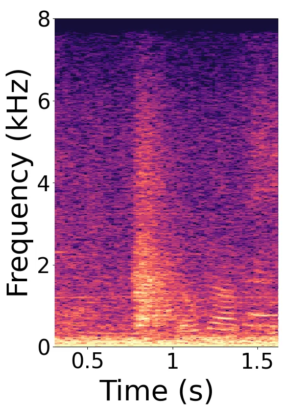

(a) Mixture

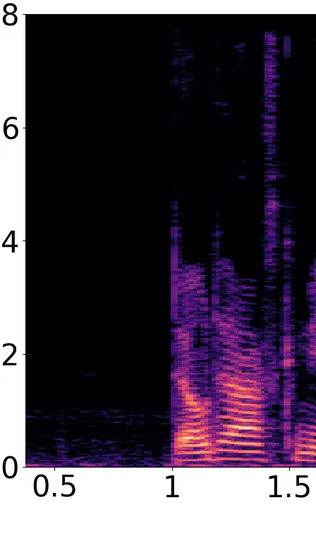

(b) Clean speech

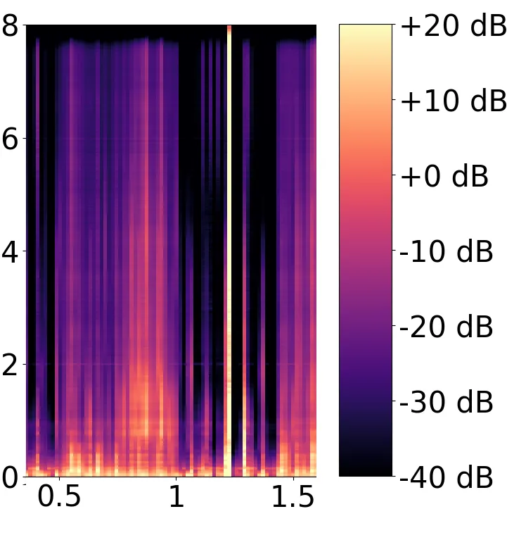

(c) _VAE_ + $`\mathcal{L}_{\text{ELBO}}`$

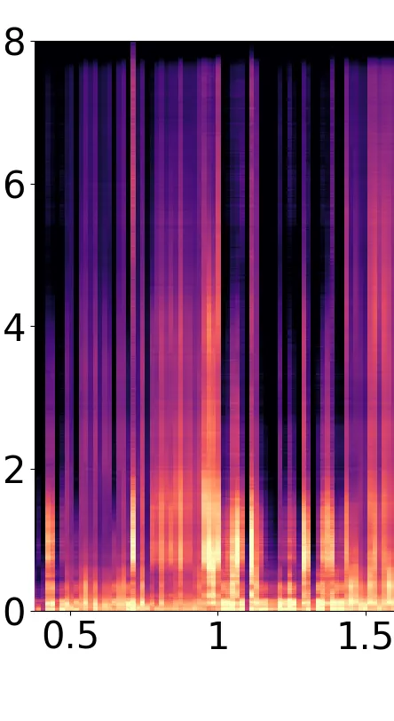

(d) _CVAE_ + $`\mathcal{L}_{\text{ELBO}}`$

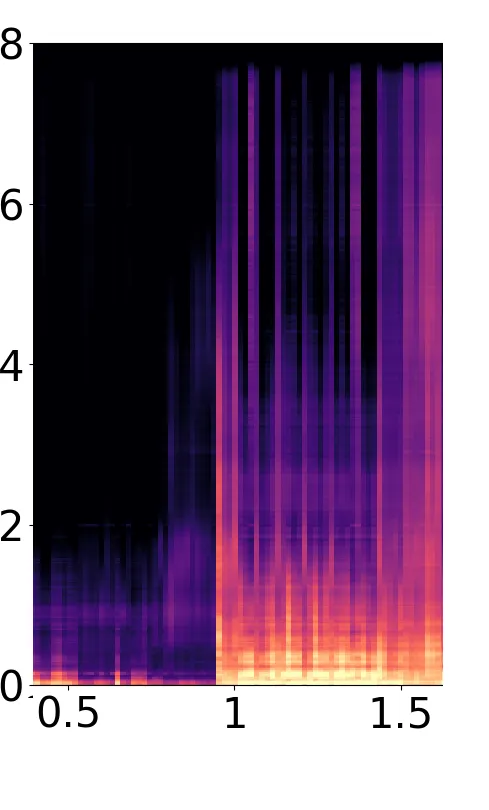

(e) _CVAE_ + $`\mathcal{L}_{\text{adv-VAE}}`$

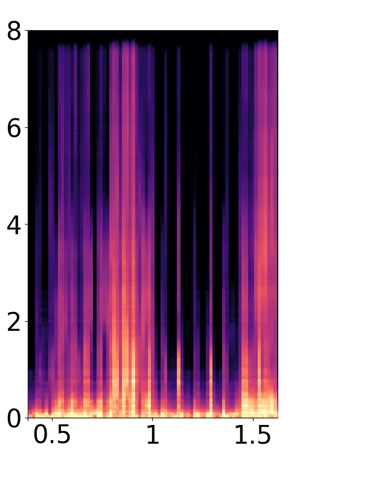

(f) _CVAE_ + $`\mathcal{L}_{\text{adv-VAE}}`$  
w/ $`\mathbf{D}_{\theta}(\mathbf{z_{n}},y_{n})`$, $`\beta=0`$

Figure 5: Reconstructed spectrograms (without MCEM).

|                                                                |                         |                         |                         |
| -------------------------------------------------------------- | ----------------------- | ----------------------- | ----------------------- |
|                                                                |                         | Noise stationarity      |                         |
| Training scheme                                                | Average                 | Nonstationary           | Stationary              |
| $`\mathcal{L}_{\text{adv-VAE}}`$                               | $`\mathbf{5.8\pm 0.1}`$ | $`\mathbf{5.3\pm 0.1}`$ | $`\mathbf{6.8\pm 0.1}`$ |
| w/ $`\mathbf{D}_{\theta}(\mathbf{z}_{n},y_{n})`$, $`\beta=0`$  | $`5.1\pm 0.1`$          | $`4.3\pm 0.1`$          | $`6.8\pm 0.1`$          |
| w/ $`\mathbf{D}_{\theta}(\mathbf{z}_{n},y_{n})`$, $`\beta=0`$, | $`5.1\pm 0.1`$          | $`4.4\pm 0.1`$          | $`6.4\pm 0.1`$          |
|  w/ $`\mathcal{L}_{\text{adv-enc}}=-\mathcal{L}_{\text{dis}}`$ |                         |                         |                         |

Table 4: Average SI-SDR (in dB) w.r.t. different training schemes.

## 6 Conclusion

In this work, we propose to use adversarial training to learn
disentanglement between a label describing speech activity and the other
latent variables of the VAE. We showed the beneficial effect of learning
disentanglement when reconstructing clean speech from noisy speech. In
the presence of nonstationary noise, the proposed approach outperforms
the standard and conditional VAEs, both trained using the ELBO as loss
function, in terms of SI-SDR. Our proposed approach is particularly
interesting for audio-visual speech enhancement, where speech activity
can be estimated from visual information, which is not affected by the
noisy environment.

## References

- \[1\] E. Vincent, T. Virtanen, and S. Gannot, Eds., _Audio Source
  Separation and Speech Enhancement_. Hoboken, NJ: John Wiley &
  Sons, 2018.
- \[2\] R. C. Hendriks, T. Gerkmann, and J. Jensen, _DFT-Domain Based
  Single-Microphone Noise Reduction for Speech Enhancement: A Survey of
  the State-of-the-Art_, ser. Synthesis Lectures on Speech and Audio
  Processing. Williston, VT: Morgan & Claypool, 2013, no. 11.
- \[3\] C. Breithaupt, T. Gerkmann, and R. Martin, “Cepstral Smoothing
  of Spectral Filter Gains for Speech Enhancement Without Musical
  Noise,” _IEEE Signal Processing Letters_, vol. 14, no. 12, pp.
  1036–1039, Dec. 2007.
- \[4\] C. Févotte, N. Bertin, and J.-L. Durrieu, “Nonnegative Matrix
  Factorization with the Itakura-Saito Divergence: With Application to
  Music Analysis,” _Neural Computation_, vol. 21, no. 3, pp. 793–830,
  Mar. 2009.
- \[5\] T. Gerkmann and R. C. Hendriks, “Unbiased MMSE-Based Noise Power
  Estimation With Low Complexity and Low Tracking Delay,” _IEEE
  Transactions on Audio, Speech, and Language Processing_, vol. 20,
  no. 4, pp. 1383–1393, May 2012.
- \[6\] D. P. Kingma and M. Welling, “An Introduction to Variational
  Autoencoders,” _Foundations and Trends in Machine Learning_, vol. 12,
  no. 4, pp. 307–392, 2019.
- \[7\] Y. Bando, M. Mimura, K. Itoyama, K. Yoshii, and T. Kawahara,
  “Statistical Speech Enhancement Based on Probabilistic Integration of
  Variational Autoencoder and Non-Negative Matrix Factorization,” in
  _ICASSP_, Apr. 2018, pp. 716–720.
- \[8\] S. Leglaive, L. Girin, and R. Horaud, “A variance modeling
  framework based on variational autoencoders for speech enhancement,”
  in _MLSP_, Sept. 2018, pp. 1–6.
- \[9\] Y. Bando, K. Sekiguchi, and K. Yoshii, “Adaptive neural speech
  enhancement with a denoising variational autoencoder,” in _ISCA
  Interspeech_, 2020, pp. 2437–2441.
- \[10\] J. Richter, G. Carbajal, and T. Gerkmann, “Speech Enhancement
  with Stochastic Temporal Convolutional Networks,” in _ISCA
  Interspeech_, Oct. 2020, pp. 4516–4520.
- \[11\] H. Fang, G. Carbajal, S. Wermter, and T. Gerkmann, “Variational
  autoencoder for speech enhancement with a noise-aware encoder,” in
  _ICASSP_, 2021, pp. 676–680.
- \[12\] D. P. Kingma, S. Mohamed, D. Jimenez Rezende, and M. Welling,
  “Semi-supervised learning with deep generative models,” in _NeurIPS_,
  vol. 27. Curran Associates, Inc., 2014, pp. 3581–3589.
- \[13\] H. Kameoka, L. Li, S. Inoue, and S. Makino, “Supervised
  determined source separation with multichannel variational
  autoencoder,” _Neural Computation_, vol. 31, no. 9, pp. 1891–1914,
  Sept. 2019.
- \[14\] Y. Du, K. Sekiguchi, Y. Bando, A. A. Nugraha, M. Fontaine,
  K. Yoshii, and T. Kawahara, “Semi-supervised Multichannel Speech
  Separation Based on a Phone- and Speaker-Aware Deep Generative Model
  of Speech Spectrograms,” in _EUSIPCO_, Jan. 2021, pp. 870–874.
- \[15\] G. Carbajal, J. Richter, and T. Gerkmann, “Guided variational
  autoencoder for speech enhancement with a supervised classifier,” in
  _ICASSP_, June 2021, pp. 681–685.
- \[16\] N. Siddharth, B. Paige, J.-W. van de Meent, A. Desmaison,
  N. Goodman, P. Kohli, F. Wood, and P. Torr, “Learning disentangled
  representations with semi-supervised deep generative models,” in
  _NeurIPS_, vol. 30. Curran Associates, Inc., 2017.
- \[17\] I. Higgins, L. Matthey, A. Pal, C. Burgess, X. Glorot,
  M. Botvinick, S. Mohamed, and A. Lerchner, “$`\beta`$-VAE: Learning
  basic visual concepts with a constrained variational framework,” in
  _ICLR_, 2017.
- \[18\] H. Kim and A. Mnih, “Disentangling by factorising,” in _Int.
  Conf. Machine Learning_, vol. 80. PMLR, July 2018, pp. 2649–2658.
- \[19\] R. T. Q. Chen, X. Li, R. B. Grosse, and D. K. Duvenaud,
  “Isolating sources of disentanglement in variational autoencoders,” in
  _NeurIPS_, vol. 31. Curran Associates, Inc., 2018.
- \[20\] E. Mathieu, T. Rainforth, N. Siddharth, and Y. W. Teh,
  “Disentangling Disentanglement in Variational Autoencoders,”
  vol. 97. PMLR, June 2019, pp. 4402–4412.
- \[21\] F. Locatello, M. Tschannen, S. Bauer, G. Rätsch, B. Schölkopf,
  and O. Bachem, “Disentangling Factors of Variation Using Few Labels,”
  in _ICLR_, 2020.
- \[22\] G. Lample, N. Zeghidour, N. Usunier, A. Bordes, L. Denoyer, and
  M. Ranzato, “Fader networks: Manipulating images by sliding
  attributes,” in _NeurIPS_, vol. 30. Curran Associates, Inc., 2017, pp.
  5969–5978.
- \[23\] A. Creswell, Y. Mohamied, B. Sengupta, and A. A. Bharath,
  “Adversarial Information Factorization,” _arXiv:1711.05175 \[cs\]_,
  Sept. 2018.
- \[24\] A. Liutkus, R. Badeau, and G. Richard, “Gaussian Processes for
  Underdetermined Source Separation,” _IEEE Transactions on Signal
  Processing_, vol. 59, no. 7, pp. 3155–3167, July 2011.
- \[25\] A. H. Abdelaziz, “NTCD-TIMIT: A New Database and Baseline for
  Noise-Robust Audio-Visual Speech Recognition,” in _ISCA Interspeech_,
  Aug. 2017, pp. 3752–3756.
- \[26\] I. Ariav and I. Cohen, “An End-to-End Multimodal Voice Activity
  Detection Using WaveNet Encoder and Residual Networks,” _IEEE Journal
  of Selected Topics in Signal Processing_, vol. 13, no. 2, pp. 265–274,
  May 2019.
- \[27\] FFmpeg Developers, “ffmpeg (version 4.3.2),” 2021. \[Online\].
  Available: http://ffmpeg.org/
- \[28\] D. P. Kingma and J. Ba, “Adam: A Method for Stochastic
  Optimization,” in _ICLR_, Dec. 2014.
- \[29\] J. L. Roux, S. Wisdom, H. Erdogan, and J. R. Hershey, “SDR –
  Half-baked or Well Done?” in _ICASSP_, May 2019, pp. 626–630.
- \[30\] J. Jensen and C. H. Taal, “An Algorithm for Predicting the
  Intelligibility of Speech Masked by Modulated Noise Maskers,”
  _IEEE/ACM Transactions on Audio, Speech, and Language Processing_,
  vol. 24, no. 11, pp. 2009–2022, Nov. 2016.
- \[31\] Int. Telecomm. Union (ITU-T) Rec., “Recommendation P.863:
  Perceptual objective listening quality assessment,” 2011.
