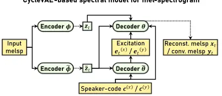
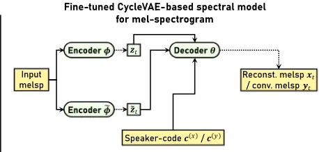
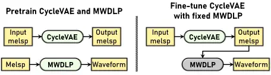
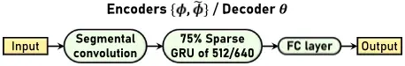

## Low-latency real-time non-parallel voice conversion based on cyclic variational autoencoder and multiband WaveRNN with data-driven linear prediction

Patrick Lumban Tobing1, Tomoki Toda1

1Nagoya University, Japan

patrick.lumbantobing@g.sp.m.is.nagoya-u.ac.jp, tomoki@icts.nagoya-u.ac.jp

## Abstract

This paper presents a low-latency real-time (LLRT) non-parallel voice conversion (VC) framework based on cyclic variational autoencoder (CycleVAE) and multiband WaveRNN with datadriven linear prediction (MWDLP). CycleVAE is a robust nonparallel multispeaker spectral model, which utilizes a speakerindependent latent space and a speaker-dependent code to generate reconstructed/converted spectral features given the spectral features of an input speaker. On the other hand, MWDLP is an efficient and a high-quality neural vocoder that can handle multispeaker data and generate speech waveform for LLRT applications with CPU. To accommodate LLRT constraint with CPU, we propose a novel CycleVAE framework that utilizes mel-spectrogram as spectral features and is built with a sparse network architecture. Further, to improve the modeling performance, we also propose a novel fine-tuning procedure that refines the frame-rate CycleVAE network by utilizing the waveform loss from the MWDLP network. The experimental results demonstrate that the proposed framework achieves highperformance VC, while allowing for LLRT usage with a singlecore of 2.1-2.7 GHz CPU on a real-time factor of 0.87-0.95, including input/output, feature extraction, on a frame shift of 10 ms, a window length of 27.5 ms, and 2 lookup frames.

Index Terms: non-parallel voice conversion, low-latency realtime, CycleVAE, multiband WaveRNN, waveform loss

## 1. Introduction

Voice conversion (VC) [1] is a technique for altering voice characteristics of a speech waveform from an input speaker to that of a desired target speaker while preserving the lingustic contents of the speech. Many real-world and/or research applications benefit from VC, such as for speech database augmentation [2], for recovery of impaired speech [3], for expressive speech synthesis [4], for singing voice [5], for body-conducted speech processing [6], and for speaker verification [7]. As the development of VC has been growing rapidly [8], it is also wise to pursue not only for the highest performance, but also for its feasibility on the constraints of real-world deployment/development, e.g., low-latency real-time (LLRT) [9] constraint with low-computational machines in its deployment and unavailability of parallel (paired) data between source and target speakers in its development.

To develop LLRT VC [9], the costs from input waveform analysis, conversion step, and output waveform generation are taken into account to obtain the acceptable amount of total delay. On the waveform analysis, several works use simple fast Fourier transform (FFT) [9, 10, 11, 12]. On the conversion module, where the spectral characteristics of speech waveform are usually modeled, a Gaussian mixture model is employed in [9], a simple multi layer perceptron is employed in [11, 12], while convolutional neural network (CNN) and recurrent neural network (RNN) are employed in [10]. On the waveform generation, source-filter vocoder based on STRAIGHT [13] is used in [9, 10], while WORLD [14] is used in [11], and direct waveform filtering is utilized in [5]. In all cases, parallel training data is required to develop the conversion model, while the quality of the waveform generation module is still limited. In this paper, we work to achieve flexible and high-quality LLRT VC, where it can be developed with non-parallel data and provide high-quality waveform using also neural network for waveform generation, i.e., neural vocoder.

Neural vocoder could provide high-quality speech waveform in copy-synthesis [15], in text-to-speech (TTS) [16], and in VC [8] systems, albeit, high computational cost impedes most of its use on LLRT applications. Essentially, neural vocoder architectures can be categorized into autoregressive (AR) [17, 18] and non-autoregressive (non-AR) [19, 20] models, on which the former depends on the previously generated waveform samples. In practice, ARmodels based onRNN (WaveRNN) [17, 18] can be developed with less layers than non-AR ones, which are built with multiple layers (deep) of CNN. In LLRT applications, where waveform synthesis is sequentially performed depending on the availability of input stream, it is more difficult for the deeper non-AR models to achieve this constraint while still preserving high-quality waveform. In this work, to reliably achieve LLRT VC, we utilize a high-quality AR model called multiband WaveRNN with data-driven linear prediction (MWDLP) [21], which has been proven to be capable of producing high-fidelity waveform in the most adverse conditions including on LLRT constraint.

On the other hand, to develop non-parallel VC, a shared space between speakers (speaker-independent) can be utilized as a reference point on which the linguistic contents of speech are generated. For instance, several works have employed the use of explicit text/phonetic space [22, 23]. An alternative way is to employ a linguistically unsupervised latent space that serves as a point of distribution for the content generation, such as in variational autoencoder (VAE) [24, 25] or generative adversarial network [26]. The unsupervised approach has more flexibility in terms of independency from linguistic features in its development, which could be of higher value in situations where reliable transcriptions are difficult to be obtained. In this work, we focus on the use of a robust model based on VAE called cyclic variational autoencoder (CycleVAE) [27] that is capable of handling non-parallel multispeaker data.

To achieve flexible and high-quality LLRT VC, we propose to combine CycleVAE-based spectral model and MWDLPbased neural vocoder. First, we propose to modify the spectral features of CycleVAE to be that of mel-spectrogram. Second, as in [17, 18, 21], we propose to employ sparsification for the CycleVAE network. Finally, to achieve high-performance VC, we propose a novel fine-tuning for the CycleVAE model with the use of waveform domain loss from the MWDLP.

## CycleVAE-based spectral model for mel-spectrogram

Figure 1: Diagram of proposed CycleVAE model for mel-spectrogram (melsp) spectral features (left) with its fine-tuned architecture (right), where the second decoder ˜θ (excitation) is discarded, while keeping the related second encoder ˜φ; Dotted lines denote sampling; Latent features are sampled from estimated posteriors; Reconstructed (reconst.) / converted (conv.) mel-spectrogram is sampled with estimated Gaussian parameters; Paths for speaker classifier (variational posterior of speaker-code) are omitted for brevity.

## 2. MWDLP-based neural vocoder

Let s = [s1, . . . , sts , . . . , sTs ]⊤ be the sequence of speech waveform samples, where ts and Ts respectively denotes the time indices and the length of the waveform samples. At band-level, the sequence of speech waveform samples is denoted as s(m) = [s(m) 1 , . . . , s(m) τ , . . . , s(m) T ]⊤ , where m denotes the mth band index, τ denotes the band-level time index, T = Ts/M denotes the length of the band-level waveform samples, which is downsampled from Ts by a factor of M [28], and the total number of bands is denoted as M. At frame-level, the sequence of conditioning feature vectors is denoted as x = [x⊤1 , . . . , x⊤t , . . . , x⊤T ]⊤ , where T denotes the length of the frame-level conditioning feature vector sequence, and at band-level, the sequence of conditioning feature vectors is denoted as ˜x = [˜x1, . . . , ˜xτ , . . . , ˜xT ].

In MWDLP [21], the likelihood of the sequence of waveform samples s is defined by the probability mass function (p.m.f.) of the discrete waveform samples as follows:

<!-- formula-not-decoded -->

where s(M) 1:τ-1 denotes the past samples of all band-levels waveform, p(m) τ = [p(m) τ [1], . . . , p(m) τ [b], . . . , p(m) τ [B]]⊤denotes the probability vector, the number of sample bins is denoted as B, and v(m) τ denotes a one-hot vector. Of the probability vector p(m) τ , the probability of each sample bin p(m) τ [b] is given by

<!-- formula-not-decoded -->

where exp(·) denotes the exponential function, ˆ o(m) τ [b] is the unnormalized probability (logit) of the bth sample bin for the mth band, and the vector of logits is denoted as ˆo(m) τ = [ˆ o(m) τ [1], . . . , ˆ o(m) τ [b], . . . , ˆ o(m) τ [B]]⊤ .

The linear prediction (LP) [29] is performed in the logit space of the discrete waveform samples as follows:

<!-- formula-not-decoded -->

where the residual logit vector is denoted as o(m) τ , the kth datadriven LP coefficient of the mth band is denoted as a(m) τ [k], k denotes the index of LP coefficient, and the total number of coefficients is denoted as K. {r(m) τ-1 , . . . , r(m) τ-K } are the trainable logit basis vectors corresponding to past K discrete samples. In Eq. 3, the network outputs are a(m) τ [k] and o(m) τ .

## 3. Proposed LLRT VC based on CycleVAE spectral model and MWDLP

## 3.1. CycleVAEmodel with mel-spectrogram features

To realize LLRT VC, in this work, we propose to use melspectrogram as the spectral features for CycleVAE model, where we extend the CycleVAE [25, 27] to incorporate estimation of intermediate excitation features, e.g., fundamental frequency (F0). Diagram of the proposed model is illustrated in the left side of Fig. 1.

Let xt = [x1[1], . . . , xt[d], . . . , xt[D]]⊤ and yt = [y1[1], . . . , yt[d], . . . , yt[D]]⊤ be the D-dimensional spectral feature vectors of an input speaker x and that of a converted speaker y at time t, respectively. The likelihood function of the input spectral feature vector xt is defined as follows:

<!-- formula-not-decoded -->

where {zt, ˜zt} denotes the latent feature vectors, c(x) t denotes a speaker-code vector of the input speaker x, and e(x) t denotes the excitation features. In VAE [30], posterior form of latent features pθ,˜θ (zt, ˜zt|xt) = pθ,˜θ (xt,zt,˜zt) pθ,˜θ (xt ) is utilized to handle the likelihood of Eq. (4) with Gibbs' inequality as follows:

<!-- formula-not-decoded -->

where Ψ = {θ, ˜θ,φ, ˜φ} and the variational/evidence lower bound (ELBO) L(Ψ; xt, c(x) t , e(x) t ) is given by

<!-- formula-not-decoded -->

and c(x) denotes a time-invariant speaker-code of the input speaker x. The sets of encoder and decoder parameters are respectively denoted as {φ, ˜φ} and {θ, ˜θ}. The prior distributions of latent features are denoted as pθ(zt) and p˜θ (˜zt). The variational posteriors are denoted as qφ(zt|xt) and q˜φ (˜zt|xt). In addition, to improve the latent disentanglement performance, we also utilize variational posterior qφ,˜φ (c(x) t |xt).

From Eq. (6), the conditional probability density function (p.d.f.) of the input spectral features xt, as well as of the converted spectral features yt , are given by

<!-- formula-not-decoded -->

<!-- formula-not-decoded -->

Figure 2: Proposed model development steps: separately pretrain CycleVAE spectral model and MWDLP neural vocoder (left), then fine-tune CycleVAE modules with fixed MWDLP to utilize its waveform domain loss (right).

where c(y) denotes the time-invariant speaker-code of the converted speaker y, e(y) t denotes the converted excitation features, e.g., linearly converted log-F0 [31], and

<!-- formula-not-decoded -->

the Hadamard product is denoted as ⊙, L(0, 1) denotes the standard Laplacian distribution. The Gaussian distribution with a mean vector µ and a covariance matrix Σ is denoted as N(;µ,Σ). The output of encoders {φ, ˜φ} are denoted as {µ(z) t ,σ(z) t ,µ(˜ z) t ,σ(˜ z) t }, while the output of decoder θ is denoted as {µ(x) t , diag(Σ(x) t )} or {µ(y) t , diag(Σ(y) t )}. To improve the conversion performance, we also utilize the p.d.f. of converted excitation p˜θ (e(y) t |˜zt, c(y) ) in a similar manner as in Eq. (6) of the excitation of input speaker. The reconstructed/converted mel-spectrogram is generated from sampling the Gaussian p.d.f. in Eq.(7) or (8), respectively.

To provide network regularization with cycle-consistency, an auxiliary for the likelihood of Eq. (4) is defined as follows:

<!-- formula-not-decoded -->

where by taking the expected values of the converted spectral yt through sampling from Eq. (8), Eq. (10) is rewritten as

<!-- formula-not-decoded -->

Therefore, as in Eq. (5), we approximate the true posterior pθ,˜θ (zt, ˜zt|xt, yt ) through the following form

<!-- formula-not-decoded -->

<!-- formula-not-decoded -->

Hence, the optimization of network parameters ˆΨ = {ˆθ, ˆ˜θ, ˆφ, ˆ˜φ} is performed with Eqs. (5) and (12) as follows:

<!-- formula-not-decoded -->

Figure 3: Network structure of encoders {φ, ˜φ} and decoder θ with a base GRU size of 512 and 640, respectively, which are sparsified to 75% density. Segmental convolution is made to take into account p previous and n succeeding frames, as in [21], with p = 3, n = 1 and p = 4, n = 0 for encoders and decoders, respectively.

## 3.2. Fine-tuningwithMWDLP-based waveform loss

As illustrated on the right side of Fig. 1 and Fig. (2), to perform fine-tuning with MWDLP loss, we discard the estimation of excitation, where the likelihood in Eq. (4) is rewritten as follows:

<!-- formula-not-decoded -->

As in Eqs. (5) and (6), the inequality form to approximate the true posterior pθ(zt, ˜ zt|xt) is as follows:

<!-- formula-not-decoded -->

where Λ = {θ, φ, ˜φ}, and the ELBO L(Λ; xt, c(x) t ) is given by

<!-- formula-not-decoded -->

Likewise, following Eq. (11), the auxiliary form of Eq. (15), to provide cycle-consistency, is defined as follows:

<!-- formula-not-decoded -->

Following Eqs. (12) and (13), the inequality form to approximate the true posterior pθ(zt, ˜ zt|xt, yt ) is defined as

<!-- formula-not-decoded -->

where the ELBO L(Λ; xt, yt , c(x) t , c(y) t ) is given by

<!-- formula-not-decoded -->

Finally, the set of updated parameters ˆΛ = {ˆθ, ˆφ, ˆ˜φ} is obtained by combining Eqs. (16), (19), and Eq. (1), i.e., the likelihood of the waveform samples fromMWDLP, as follows:

<!-- formula-not-decoded -->

where the conditioning feature vector ˜xτ is built from the sampled reconstructed mel-spectrogram xt of the input speaker x.

Table 1: Results of accuracy (acc.) measurement on log-globalvariance distance of mel-cepstrum (LGD), mel-cepstral distortion (MCD), unvoiced/voiced decision error (U/V), and rootmean-square-error of F0 between converted and target waveform on intra-lingual pairs.

| Intra-lingual acc. | LGD  | MCD [dB] | U/V [%] | F0 [Hz] |
| ------------------ | ---- | -------- | ------- | ------- |
| ASR+TTS [22]       | 0.29 | 6.91     | 16.20   | 22.29   |
| CycVAE+PWG [27]    | 0.34 | 6.67     | 14.36   | 24.91   |
| NU T23 [32]        | 0.28 | 7.50     | 18.94   | 23.20   |
| LLRT CycVAE        | 0.36 | 7.41     | 15.35   | 25.74   |
| LLRT CycVAE+FT     | 0.28 | 7.51     | 17.27   | 25.17   |

Table 2: Results of accuracy (acc.) measurement on log-globalvariance distance of mel-cepstrum (LGD), mel-cepstral distortion (MCD), unvoiced/voiced decision error (U/V), and rootmean-square-error of F0 between converted and target waveform on cross-lingual pairs.

| Cross-lingual acc. | LGD  | MCD [dB] | U/V [%] | F0 [Hz] |
| ------------------ | ---- | -------- | ------- | ------- |
| ASR+TTS [22]       | 0.39 | 8.78     | 14.84   | 21.12   |
| CycVAE+PWG [27]    | 0.34 | 7.56     | 13.86   | 22.83   |
| NU T23 [32]        | 0.24 | 8.50     | 16.33   | 22.68   |
| LLRT CycVAE        | 0.39 | 8.22     | 15.25   | 20.91   |
| LLRT CycVAE+FT     | 0.30 | 8.44     | 15.81   | 20.91   |

## 3.3. Network architecture and sparsification

The network architecture of the encoders and decoders of the proposed CycleVAE is illustrated in Fig.3. As in [21], a segmental convolution is utilized to take into account p preceding and n succeeding frames. To realize LLRT VC, we use p = 3, n = 1 for encoders of CycleVAE, p = 4, n = 0 for decoder of CycleVAE, and p = 5, n = 1 for the MWDLP neural vocoder, which yields a total of 2 lookup frames.

In addition, a sparsification procedure for CycleVAE network is also performed, as in [18, 21], with 75% target density for the gated recurrent unit (GRU) modules of encoders {φ, ˜φ} and decoder θ. The base hidden units size of GRU encoders is 512, while that of the decoder is 640. The target density ratios for each reset, update, and new gates of the GRU recurrent matrices are respectively 0.685, 0.685, 0.88.

## 4. Experimental evaluation

## 4.1. Experimental conditions

We used the Voice Conversion Challenge (VCC) 2020 [8] dataset, which consisted of 8 English speakers, 2 German speakers, 2 Finnish speakers, and 2 Mandarin speakers, each uttered 70 sentences in their languages. For the training set, 60 sentences were used, while the remaining 10 sentences were for the development set. Additional 25 English utterances from each speaker were provided for evaluation. In the evaluation, we utilized two baseline systems of VCC 2020: cascaded automatic speech recognition (ASR) with TTS (ASR+TTS) [22] and CycleVAE with Parallel WaveGAN (CycVAE+PWG) [27], as well as Nagoya University (NU) T23 system [32]. 2 English source, 2 English target (intra-lingual), and 2 German target (cross-lingual) speakers were utilized in the evaluation.

As spectral features, we used 80-dimensional melspectrogram, which was extracted frame-by-frame from magnitude spectra. The number of FFT length in analysis was 2048. 27.5 ms Hanning window with 10 ms frame shift were used. The sampling rate was 24, 000 Hz. As the target intermediate excitation features used in Section 3.1, we used F0, aperiodicities, and their voicing decisions, which were extracted from the speech waveform using WORLD [14]. The excitation e(y) t of converted speaker y was set to linearly converted log-F0 [31].

Table 3: Result on automatic speech recognition accuracy (ASR acc.) on intra- and cross-lingual conversions with word error rate (WER) and character error rate (CER) measurements.

| ASR acc.        | Intra-lingual - WER | Intra-lingual - CER | Cross-lingual - WER | Cross-lingual - CER |
| --------------- | ------------------- | ------------------- | ------------------- | ------------------- |
| Source          | 18.5                | 3.7                 | -                   | -                   |
| Target          | 17.5                | 3.0                 | 19.2                | 4.1                 |
| ASR+TTS [22]    | 25.1                | 7.5                 | 30.3                | 12.2                |
| CycVAE+PWG [27] | 28.2                | 9.6                 | 29.6                | 10.3                |
| NU T23 [32]     | 37.3                | 14.9                | 25.2                | 7.6                 |
| LLRT CycVAE     | 33.8                | 13.6                | 34.0                | 12.4                |
| LLRTCycVAE+FT   | 25.2                | 7.9                 | 26.1                | 7.9                 |

Other than the configuration of segmental convolution in Section 3.3, the hyperparameters of MWDLP neural vocoder was the same as in [21] with the use of K = 8 data-driven LP coefficients and STFT loss. As well as for the CycleVAE-based spectral model, the encoders {φ, ˜φ} and the decoder θ were set the same as in 3.3. On the other hand, the excitation decoder ˜θ described in Section 3.1 used the same structure as the other encoders/decoder, but utilizing a dense GRU with 128 hidden units. A classifier network with similar structure utilizing a GRU with 32 hidden units was employed to handle the variational speaker posteriors q(c(x) t |xt) and q(c(y) t |yt ). Additionally, each of the encoders was also set to estimate the speaker posteriors along with the latent posteriors.

The training procedure was as described in Sections 3.1 and 3.2, where the standard Laplacian prior was replaced with the posterior of the pretrained CycleVAE. In addition, we performed final fine-tuning of CycleVAE by fixing the encoders and updating only decoder θ (LLRT CycVAE+FT). In all CycleVAE optimizations, the spectral loss included Gaussian p.d.f. term and the loss of the sampled mel-spectrogram. Further, in the fine-tuning steps, we included loss from full-resolution magnitude spectra, which was obtained using inverted melfilterbank and the sampled mel-spectrogram. The waveform domain loss included the set of loss in [21] and the differences of the output of all MWDLP layers when fed with original spectra and generated spectra (layer-wise loss).

We used a single-core of Intel Xeon Gold 6230 2.1 GHz, Intel Xeon Gold 6142 2.6 GHz, and Intel i7-7500U 2.7 GHz CPUs to measure the real-time factor (RTF), which respectively yield 0.87, 0.87, and 0.95 RTFs. The total delay is 23.75 ms, which was the sum of the half of the window length (1st frame) and one frame shift, i.e., 2 lookup frames. The model development software, real-time implementation, and audio samples have been made available at

[https://github.com/patrickltobing/cyclevae-vc-neuralvoco.](https://github.com/patrickltobing/cyclevae-vc-neuralvoco)

## 4.2. Objective evaluation

In the objective evaluation, we measured the accuracies of the generated waveforms to the target ground truth and the accuracies of automatic speech recognition (ASR) output. The former was measured with the use of mel-cepstral distortion (MCD), root-mean-square error of F0, unvoiced/voiced decision error (U/V), and log of global variance [31] distance of the melcepstrum (LGD). The latter was measured with word error rate (WER) and character error rate (CER). 28-dimensional melcepstral coefficients were extracted from WORLD [14] spectral envelope to compute the MCD. For ASR, we used ESPnet's [33] latest pretrained model on LibriSpeech [34] data.

Table 4: Result of mean opinion score (MOS) test on naturalness for intra- and cross-lingual conversions in same-gender (SGD) and cross-gender (XGD) pairs. ∗ denotes systems with statistically significant different values (α &lt; 0.05) compared to LLRT CycleVAE+FT in each conversion categories.

| MOS             | All   | Intra-lingual - SGD | Intra-lingual - XGD | Cross-lingual - SGD | Cross-lingual - XGD |
| --------------- | ----- | ------------------- | ------------------- | ------------------- | ------------------- |
| Source          | 4.68  | -                   | -                   | -                   | -                   |
| Target          | 4.69  | -                   | -                   | -                   | -                   |
| ASR+TTS [22]    | 4.01  | 4.32∗               | 4.15∗               | 3.84                | 3.72                |
| CycVAE+PWG [27] | 3.85∗ | 3.85∗               | 3.75                | 3.94                | 3.87                |
| NU T23 [32]     | 4.23∗ | 4.30∗               | 4.21∗               | 4.23∗               | 4.21∗               |
| LLRT CycVAE     | 3.33∗ | 3.30∗               | 3.19∗               | 3.48∗               | 3.19∗               |
| LLRTCycVAE+FT   | 3.96  | 3.99                | 3.85                | 4.02                | 3.96                |

The results on the accuracies of the generated waveforms are shown in Tables 1 and 2, which correspond to the intraand the cross-lingual conversion pairs, respectively. It can be observed that the proposed LLRT system based on CycleVAE and MWDLP utilizing fine-tuning with waveform domain loss (LLRT CycVAE+FT) achieves better LGD values (less oversmoothed) in intra- and cross-lingual conversions than the proposed system without fine-tuning (LLRT CycleVAE) with values of 0.28 and 0.36, respectively, in intra-lingual, and 0.30 and 0.39, respectively, in cross-lingual. Furthermore, it beats the LGD values of CycVAE+PWG that uses non-LLRT system, and beats NU T23 system in MCD, U/V, and F0 for cross-lingual, which uses non-LLRT CycleVAE with WaveNet.

Lastly, the ASR result is shown in Table 3, which shows WERs and CERs for the intra- and the cross-lingual conversions. It can be clearly observed that the proposed LLRT CycVAE+FT outperforms the proposed system without fine-tuning LLRT CycVAE with WER and CER values of 26.1 and 7.9 in intra-lingual and of 25.2 and 7.9 in cross-lingual. These values are also lower than the non-LLRT CycleVAE system of the VCC 2020 baseline (CycVAE+PWG) and similar to that of the non-LLRT CycleVAE of NU T23 in cross-lingual conversions.

## 4.3. Subjective evaluation

In the subjective evaluation, we conducted two listening tests, each to judge the naturalness of speech waveform and the speaker similarity to a reference target speech. The former is conducted with a mean opinion score (MOS) test using a 5scaled score ranging from 1 (very bad) to 5 (very good). The latter is conducted with a speaker similarity test as in [8], where "same" or "not-same" decision had to be chosen along with "sure" or "not-sure" decision as a confidence measure. 10 utterances from the evaluation set was used. The number of participants on Amazon Mechanical Turk was 19 and 13, respectively, for MOS and speaker similarity tests.

The result of MOS test on naturalness is shown in Table 4. It can be observed that the proposed LLRT VC system benefits from the fine-tuning approach (LLRT CycleVAE+FT), yielding significantly higher naturalness in all categories than the LLRT CycleVAE system, with values of 3.96, 3.99, 3.85, 4.02, and 3.96 for all, intra-lingual same-gender (SGD), intralingual cross-gender (XGD), cross-lingual SGD and crosslingual XGD, respectively. On the other hand, the result of speaker similarity test is shown in Table 5. The tendency is also similar, where the proposed LLRT CycleVAE+FT system has better speaker accuracy than the LLRT CycleVAE in all categories, while achieving similar accuracies to the non-LLRT CycleVAE systems: CycVAE+PWG and NU T23 (cross-lingual).

Table 5: Result of speaker similarity [%] test for intra- and cross-lingual conversions in same-gender (SGD) and crossgender (XGD) pairs. ∗ denotes systems with statistically significant different values (α &lt; 0.05) compared to LLRT CycleVAE+FT in each conversion categories.

| Speaker similarity [%] | All    | Intra-lingual - SGD | Intra-lingual - XGD | Cross-lingual - SGD | Cross-lingual - XGD |
| ---------------------- | ------ | ------------------- | ------------------- | ------------------- | ------------------- |
| Source                 | 8.01   | -                   | -                   | -                   | -                   |
| Target                 | 90.05  | -                   | -                   | -                   | -                   |
| ASR+TTS [22]           | 89.43∗ | 91.80               | 87.10∗              | 84.12∗              | 87.90∗              |
| CycVAE+PWG [27]        | 78.63  | 85.25               | 77.42               | 74.19               | 77.78               |
| NU T23 [32]            | 80.24∗ | 93.50∗              | 89.60∗              | 71.77               | 66.13∗              |
| LLRT CycVAE            | 70.22  | 76.99               | 70.49               | 67.20               | 66.13∗              |
| LLRTCycVAE+FT          | 77.55  | 86.18               | 74.16               | 75.24               | 74.60               |

## 5. Discussion

The proposed method of fine-tuning the CycleVAE-based spectral model with MWDLP-based waveform modeling significantly improves the converted speech waveform. From our investigation, the use of mel-spectrogram sampling from Gaussian p.d.f. in Eqs.(7) and (8) works verywell with the waveform domain loss. In addition, we also found that layer-wise loss from neural vocoder helps to provide more natural outcome. Our reasoning is that the generated spectra will not be exactly the same as the natural spectra that corresponds to the natural waveform, but we assume that there is a domain for generated spectra that could provide quite reasonable approximation for generating the natural waveform by explicitly guiding through all layers of the neural vocoder in addition of the waveform loss.

The largest average RTF factors for each module are as follows: 0.14 for two encoders, 0.13 for decoder, 0.56 for MWDLP, and 0.12 for others including input/output, memory allocation, etc. The total of these RTF values, i.e., ∼9.5 ms, should be lower than the length of the frame shift, which is 10 ms. However, in practical situation, a larger margin is required to avoid glitching caused by outliers of RTF values that are larger than the frame shift. In future work, we will investigate lower size of MWDLP and/or 8-bit model quantization.

## 6. Conclusions

We have presented a novel low-latency real-time (LLRT) nonparallel voice conversion (VC) framework based on cyclic variational autoencoder (CycleVAE) and multiband WaveRNN with data-driven linear prediction (MWDLP). The proposed system utilizes mel-spectrogram features as the spectral parameters of the speech waveform, which are used in the CycleVAE-based spectral model and the MWDLP neural vocoder. To realize LLRT VC, CycleVAE modules undergo a sparsification procedure with respect to their recurrent matrices. In addition, we propose to use waveform domain loss from a fixed pretrained MWDLP to fine-tune the CycleVAE modules. The experimental resuts have demonstrated that the proposed system is capable of achieving high-performance VC, while allowing its usage for LLRT applications with 0.87-0.95 real-time factor using a single-core of 2.1-2.7 GHz CPU on 27.5 ms window length, 10 ms frame shift, and 2 lookup frames.

## 7. Acknowledgements

This work was partly supported by JSPS KAKENHI Grant Number 17H06101 and JST, CREST Grant Number JPMJCR19A3.

## 8. References

- [1] D. B. Childers, B. Yegnanarayana, and K. Wu, "Voice conversion: Factors responsible for quality," in Proc. ICASSP, Florida, USA, Mar. 1985, pp. 748-751.
- [2] M. Abe, S. Nakamura, K. Shikano, and H. Kuwabara, "Voice conversion through vector quantization," J. of the Acoust. Soc. of Japan (E), vol. 11, no. 2, pp. 71-76, 1990.
- [3] K. Tanaka, T. Toda, G. Neubig, S. Sakti, and S. Nakamura, "A hybrid approach to Electrolaryngeal speech enhancement based on spectral subtraction and statistical voice conversion," in Proc. INTERSPEECH, Lyon, France, Sep. 2013, pp. 3067-3071.
- [4] O. T¨urk and M. Schr¨oder, "Evaluation of expressive speech synthesis with voice conversion and copy resynthesis techniques," IEEE/ACM Trans. Audio Speech Lang. Process., vol. 18, no. 5, pp. 965-973, 2010.
- [5] K. Kobayashi, T. Toda, and S. Nakamura, "Intra-gender statistical singing voice conversion with direct waveform modification using log-spectral differential," Speech Commun., vol. 99, pp. 211-220, 2018.
- [6] T. Toda, M. Nakagiri, and K. Shikano, "Statistical voice conversion techniques for body-conducted unvoiced speech enhancement," IEEE Trans. Audio Speech Lang. Process., vol. 20, no. 9, pp. 2505-2517, 2012.
- [7] T. Kinnunen, Z.-Z. Wu, K. A. Lee, F. Sedlak, E. S. Chng, and H. Li, "Vulnerability of speaker verification systems against voice conversion spoofing attacks: The case of telephone speech," in Proc. ICASSP, Kyoto, Japan, Mar. 2012, pp. 4401-4404.
- [8] Y. Zhao, W.-C. Huang, X. Tian, J. Yamagishi, R. K. Das, T. Kinnunen, Z. Ling, and T. Toda, "Voice Conversion Challenge 2020 intra-lingual semi-parallel and cross-lingual voice conversion," in ISCA Joint Workshop for the Blizzard Challenge and Voice Conversion Challenge 2020, Shanghai, China, Oct. 2020, pp. 80-98.
- [9] T. Toda, T. Muramatsu, and H. Banno, "Implementation of computationally efficient real-time voice conversion," in Proc. INTERSPEECH, Portland, OR, USA, Sep. 2012.
- [10] K. Kobayashi and T. Toda, "Implementation of low-latency Electrolaryngeal speech enhancement based on multi-task CLDNN," in Proc. EUSIPCO, Amsterdam, Netherlands, Jan. 2021, pp. 396400.
- [11] R. Arakawa, S. Takamichi, and H. Saruwatari, "Implementation of DNN-based real-time voice conversion and its improvements by audio data augmentation and mask-shaped device," in Proc. SSW10, Vienna, Austria, Sep. 2019, pp. 93-98.
- [12] T. Saeki, Y. Saito, S. Takamichi, and H. Saruwatari, "Real-time, full-band, online DNN-based voice conversion system using a single CPU," Proc. INTERSPEECH, pp. 1021-1022, Oct. 2020.
- [13] H. Kawahara, I. Masuda-Katsuse, and A. De Cheveign´e, "Restructuring speech representations using a pitch-adaptive timefrequency smoothing and an instantaneous-frequency-based F0 extraction: Possible role of a repetitive structure in sounds," Speech Commun., vol. 27, pp. 187-207, 1999.
- [14] M. Morise, F. Yokomori, and K. Ozawa, "WORLD: A vocoderbased high-quality speech synthesis system for real-time applications," IEICE Trans. Inf. Syst., vol. 99, no. 7, pp. 1877-1884, 2016.
- [15] A. Tamamori, T. Hayashi, K. Kobayashi, K. Takeda, and T. Toda, "Speaker-dependent WaveNet vocoder," in Proc. INTERSPEECH, Stockholm, Sweden, Aug. 2017, pp. 1118-1122.
- [16] X. Zhou, Z.-H. Ling, and S. King, "The Blizzard Challenge 2020," in Proc. Joint Workshop for the Blizzard Challenge and Voice Conversion Challenge 2020, Shanghai, China, Oct. 2020, pp. 118.
- [17] N. Kalchbrenner, E. Elsen, K. Simonyan, S. Noury, N. Casagrande, E. Lockhart, F. Stimberg, A. v. d. Oord, S. Dieleman, and K. Kavukcuoglu, "Efficient neural audio synthesis," arXiv preprint arXiv:1802.08435, 2018.
- [18] J.-M. Valin and J. Skoglund, "LPCNet: Improving neural speech synthesis through linear prediction," in Proc. ICASSP, Brighton, UK, May 2019, pp. 5891-5895.
- [19] R. Prenger, R. Valle, and B. Catanzaro, "WaveGlow: A flowbased generative network for speech synthesis," in Proc. ICASSP, Brighton, UK, May 2019, pp. 3617-3621.
- [20] R. Yamamoto, E. Song, and J.-M. Kim, "Parallel WaveGAN: A fast waveform generation model based on generative adversarial networks with multi-resolution spectrogram," in Proc. ICASSP, Barcelona, Spain, May 2020, pp. 6199-6203.
- [21] P. L. Tobing and T. Toda, "High-fidelity and low-latency universal neural vocoder based on multiband WaveRNN with data-driven linear prediction for discrete waveform modeling," arXiv preprint arXiv:2105.09856, 2021.
- [22] W.-C. Huang, T. Hayashi, S. Watanabe, and T. Toda, "The sequence-to-sequence baseline for the Voice Conversion Challenge 2020: Cascading ASR and TTS," in Proc. Joint Workshop for the Blizzard Challenge and Voice Conversion Challenge 2020, Shanghai, China, Oct. 2020, pp. 160-164.
- [23] J.-X. Zhang, L.-J. Liu, Y.-N. Chen, Y.-J. Hu, Y. Jiang, Z.-H. Ling, and L.-R. Dai, "Voice conversion by cascading automatic speech recognition and text-to-speech synthesis with prosody transfer," in Proc. Joint Workshop for the Blizzard Challenge and Voice Conversion Challenge 2020, Shanghai, China, Oct. 2020, pp. 121125.
- [24] C.-C. Hsu, H.-T. Hwang, Y.-C. Wu, Y. Tsao, and H.-M. Wang, "Voice conversion from non-parallel corpora using variational auto-encoder," in Proc. APSIPA, Jeju, South Korea, Dec. 2016, pp. 1-6.
- [25] P. L. Tobing, Y.-C. Wu, T. Hayashi, K. Kobayashi, and T. Toda, "Non-parallel voice conversion with cyclic variational autoencoder," in Proc. INTERSPEECH, Graz, Austria, Sep. 2019, pp. 674-678.
- [26] T. Kaneko, H. Kameoka, K. Tanaka, and N. Hojo, "StarGANVC2: Rethinking conditional methods for StarGAN-based voice conversion," in Proc. INTERSPEECH, Graz, Austria, Sep. 2019, pp. 679-683.
- [27] P. L. Tobing, Y.-C. Wu, and T. Toda, "Baseline system of Voice Conversion Challenge 2020 with cyclic variational autoencoder and Parallel WaveGAN," in Proc. Joint Workshop for the Blizzard Challenge and Voice Conversion Challenge 2020, Shanghai, China, Oct. 2020, pp. 155-159.
- [28] T. Q. Nguyen, "Near-perfect-reconstruction pseudo-QMF banks," IEEE Trans. Sig. Process., vol. 42, no. 1, pp. 65-76, 1994.
- [29] B. S. Atal and S. L. Hanauer, "Speech analysis and synthesis by linear prediction of the speech wave," J. Acoust. Soc. Amer., vol. 50, no. 2B, pp. 637-655, 1971.
- [30] D. P. Kingma and J. Ba, "Auto-encoding variational bayes," arXiv preprint arXiv:1312.6114, 2013.
- [31] T. Toda, A. W. Black, and K. Tokuda, "Voice conversion based on maximum-likelihood estimation of spectral parameter trajectory," IEEE Transactions on Audio, Speech, and Language Processing, vol. 15, no. 8, pp. 2222-2235, 2007.
- [32] W.-C. Huang, P. L. Tobing, Y.-C. Wu, K. Kobayashi, and T. Toda, "The NU voice conversion system for the Voice Conversion Challenge 2020: On the effectiveness of sequence-to-sequence models and autoregressive neural vocoders," in Proc. Joint Workshop for the Blizzard Challenge and Voice Conversion Challenge 2020, Shanghai, China, Oct. 2020, pp. 165-169.
- [33] S. Watanabe, T. Hori, S. Karita, T. Hayashi, J. Nishitoba, Y. Unno, N. Enrique Yalta Soplin, J. Heymann, M. Wiesner, N. Chen, A. Renduchintala, and T. Ochiai, "ESPnet: End-to-end speech processing toolkit," in Proc. INTERSPEECH, Hyderabad, India, Sep. 2018, pp. 2207-2211.
- [34] V. Panayotov, G. Chen, D. Povey, and S. Khudanpur, "LibriSpeech: an ASR corpus based on public domain audio books," in Proc. ICASSP, South Brisbane, Queensland, Australia, Apr. 2015, pp. 5206-5210.
