# Learning to Efficiently Sample from Diffusion Probabilistic Models

Daniel Watson ^(†)^(†)thanks: Work done as part of the Google AI
Residency.    Jonathan Ho    Mohammad Norouzi    William Chan
Affiliation: Google Research, Brain Team
Email: [{watsondaniel,jonathanho,mnorouzi,williamchan}@google.com](mailto:)

###### Abstract

Denoising Diffusion Probabilistic Models (DDPMs) have emerged as a
powerful family of generative models that can yield high-fidelity
samples and competitive log-likelihoods across a range of domains,
including image and speech synthesis. Key advantages of DDPMs include
ease of training, in contrast to generative adversarial networks, and
speed of generation, in contrast to autoregressive models. However,
DDPMs typically require hundreds-to-thousands of steps to generate a
high fidelity sample, making them prohibitively expensive for high
dimensional problems. Fortunately, DDPMs allow trading generation speed
for sample quality through adjusting the number of refinement steps as a
post process. Prior work has been successful in improving generation
speed through handcrafting the time schedule by trial and error. We
instead view the selection of the inference time schedules as an
optimization problem, and introduce an exact dynamic programming
algorithm that finds the optimal discrete time schedules for any
pre-trained DDPM. Our method exploits the fact that ELBO can be
decomposed into separate KL terms, and given any computation budget,
discovers the time schedule that maximizes the training ELBO exactly.
Our method is efficient, has no hyper-parameters of its own, and can be
applied to any pre-trained DDPM with no retraining. We discover
inference time schedules requiring as few as 32 refinement steps, while
sacrificing less than 0.1 bits per dimension compared to the default
4,000 steps used on ImageNet 64x64 (Ho et al., 2020; Nichol and
Dhariwal, 2021).

## 1 Introduction

Denoising Diffusion Probabilistic Models (DDPMs) (Sohl-Dickstein et al.,
2015; Ho et al., 2020) have emerged as a powerful class of generative
models, which model the data distribution through an iterative denoising
process. DDPMs have been applied successfully to a variety of
applications, including unconditional image generation (Song and Ermon,
2019; Ho et al., 2020; Song et al., 2021; Nichol and Dhariwal, 2021),
shape generation (Cai et al., 2020), text-to-speech (Chen et al., 2021;
Kong et al., 2020) and single image super-resolution (Saharia et al.,
2021; Li et al., 2021).

DDPMs are easy to train, featuring a simple denoising objective (Ho
et al., 2020) with noise schedules that successfully transfer across
different models and datasets. This contrasts to Generative Adversarial
Networks (GANs) (Goodfellow et al., 2014), which require an inner-outer
loop optimization procedure that often entails instability and requires
careful hyperparameter tuning. DDPMs also admit a simple
non-autoregressive inference process; this contrasts to autoregressive
models with often prohibitive computational costs on high dimensional
data. The DDPM inference process starts with samples from the
corresponding prior noise distribution (e.g., standard Gaussian), and
iteratively denoises the samples under the fixed noise schedule.
However, DDPMs often need hundreds-to-thousands of denoising steps (each
involving a feedforward pass of a large neural network) to achieve
strong results. While this process is still much faster than
autoregressive models, this is still often computationally prohibitive,
especially when modeling high dimensional data.

There has been much recent work focused on improving the sampling speed
of DDPMs. WaveGrad (Chen et al., 2021) introduced a manually crafted
schedule requiring only 6 refinement steps; however, this schedule seems
to be only applicable to the vocoding task where there is a very strong
conditioning signal. Denoising Diffusion Implicit Models (DDIMs) (Song
et al., 2020a) accelerate sampling from pre-trained DDPMs by relying on
a family of non-Markovian processes. They accelerate the generative
process through taking multiple steps in the diffusion process. However,
DDIMs sacrifice the ability to compute log-likelihoods. Nichol and
Dhariwal (2021) also explored the use of ancestral sampling with a
subsequence of the original denoising steps, trying both a uniform
stride and other hand-crafted strides. San-Roman et al. (2021) improve
few-step sampling further by training a separate model after training a
DDPM to estimate the level of noise, and modifying inference to
dynamically adjust the noise schedule at every step to match the
predicted noise level.

All these fast-sampling techniques rely on a key property of DDPMs –
there is a decoupling between the training and inference schedule. The
training schedule need not be the same as the inference schedule, e.g.,
a diffusion model trained to use 1000 steps may actually use only 10
steps during inference. This decoupling characteristic is typically not
found in other generative models. In past work, the choice of inference
schedule was often considered a hyperpameter selection problem, and
often selected via intuition or extensive hyperparmeter exploration
(Chen et al., 2021). In this work, we view the choice of inference
schedule path as an independent optimization problem, wherein we attempt
to learn the best schedule. Our approach relies on a dynamic programming
algorithm, where given a fixed budget of $`K`$ refinement steps and a
pre-trained DDPM, we find the set of timesteps that maximizes the
corresponding evidence lower bound (ELBO). As an optimization objective,
the ELBO has a key decomposability property: the total ELBO is the sum
of individual KL terms, and for any two inference paths, if the
timesteps $`(s,t)`$ contiguously occur in both, they share a common KL
term, therefore admitting memoization.

Our main contributions are the following:

- •
  We introduce a dynamic programming algorithm that finds the optimal
  inference paths based on the ELBO for all possible computation budgets
  of $`K`$ refinement steps. The algorithm searches over $`T>K`$
  timesteps, only requiring $`\mathcal{O}(T)`$ neural network forward
  passes. It only needs to be applied once to a pre-trained DDPM, does
  not require training or retraining a DDPM, and is applicable to both
  time-discrete and time-continuous DDPMs.
- •
  We experiment with DDPM models from prior work. On both
  $`L_{\textrm{simple}}`$ CIFAR10 and $`L_{\textrm{hybrid}}`$ ImageNet
  64x64, we discover schedules which require only 32 refinement steps,
  yet sacrifice only 0.1 bits per dimension compared to their original
  counterparts with 1,000 and 4,000 steps, respectively.

## 2 Background on Denoising Diffusion Probabilistic Models

Denoising Diffusion Probabilistic Models (DDPMs) (Ho et al., 2020;
Sohl-Dickstein et al., 2015) are defined in terms of a forward Markovian
diffusion process $`q`$ and a learned reverse process $`p_{\theta}`$.
The forward diffusion process gradually adds Gaussian noise to a data
point $`{\bm{x}}_{0}`$ through $`T`$ iterations,

```math
\displaystyle q({\bm{x}}_{1:T}\mid{\bm{x}}_{0}) \displaystyle= \displaystyle\prod\nolimits_{t=1}^{T}q({\bm{x}}_{t}\mid{\bm{x}}_{t-1})~, \tag{1}
```

```math
\displaystyle q({\bm{x}}_{t}\mid{\bm{x}}_{t-1}) \displaystyle= \displaystyle\mathcal{N}({\bm{x}}_{t}\mid\sqrt{\alpha_{t}}\,{\bm{x}}_{t-1},(1-\alpha_{t})\bm{I})~, \tag{2}
```

where the scalar parameters $`\alpha_{1:T}`$ determine the variance of
the noise added at each diffusion step, subject to $`0<\alpha_{t}<1`$.
The learned reverse process aims to model $`q({\bm{x}}_{0})`$ by
inverting the forward process, gradually removing noise from signal
starting from pure Gaussian noise $`{\bm{x}}_{T}`$,

```math
\displaystyle p({\bm{x}}_{T}) \displaystyle= \displaystyle\mathcal{N}({\bm{x}}_{T}\mid\bm{0},\bm{I}) \tag{3}
```

```math
\displaystyle p_{\theta}({\bm{x}}_{0:T}) \displaystyle= \displaystyle p({\bm{x}}_{T})\prod\nolimits_{t=1}^{T}p_{\theta}({\bm{x}}_{t-1}\mid{\bm{x}}_{t}) \tag{4}
```

```math
\displaystyle p_{\theta}({\bm{x}}_{t-1}\mid{\bm{x}}_{t}) \displaystyle= \displaystyle\mathcal{N}({\bm{x}}_{t-1}\mid\mu_{\theta}({{\bm{x}}}_{t},t),\sigma_{t}^{2}\bm{I})~. \tag{5}
```

The parameters of the reverse process can be optimized by maximizing the
following variational lower bound on the training set,

```math
\mathbb{E}_{q}\log p({\bm{x}}_{0})\geq\mathbb{E}_{q}\left[\log p_{\theta}({\bm{x}}_{0}|{\bm{x}}_{1})-\!\sum_{t=2}^{T}D_{\mathrm{KL}}\big(q({\bm{x}}_{t-1}|{\bm{x}}_{t},{\bm{x}}_{0})\lVert p_{\theta}({\bm{x}}_{t-1}|{\bm{x}}_{t})\big)-L_{T}({\bm{x}}_{0})\right]\!\!\! \tag{6}
```

where
$`L_{T}({\bm{x}}_{0})=D_{\mathrm{KL}}\big(q({\bm{x}}_{T}|{\bm{x}}_{0})\,\lVert\,p({\bm{x}}_{T})\big)`$.
Nichol and Dhariwal (2021) have demonstrated that training DDPMs by
maximizing the ELBO yields competitive log-likelihood scores on both
CIFAR-10 and ImageNet $`64\!\times\!64`$ achieving $`2.94`$ and $`3.53`$
bits per dimension respectively.

Two notable properties of Gaussian diffusion process that help formulate
DDPMs tractably and efficiently include:

```math
\displaystyle q({\bm{x}}_{t}\mid{\bm{x}}_{0})\!\! \displaystyle\!\!=\!\! \displaystyle\!\!\mathcal{N}({\bm{x}}_{t}\mid\sqrt{\gamma_{t}}\,{\bm{x}}_{0},(1-\gamma_{t})\bm{I})~,\quad\quad\text{where}~\gamma_{t}=\prod\nolimits_{i=1}^{t}\alpha_{i}~, \tag{7}
```

```math
\displaystyle\!\!\!\!\!\!\!\!q({\bm{x}}_{t-1}\mid{\bm{x}}_{0},{\bm{x}}_{t})\!\! \displaystyle\!\!=\!\! \displaystyle\!\!\mathcal{N}\!\left(\!{\bm{x}}_{t-1}\,\Big|\,\frac{\sqrt{\gamma_{t-1}}\,(1-\alpha_{t}){\bm{x}}_{0}+\sqrt{\alpha_{t}}\,(1-\gamma_{t-1}){\bm{x}}_{t}}{1-\gamma_{t}},\frac{(1-\gamma_{t-1})(1-\alpha_{t})}{1-\gamma_{t}}\bm{I}\!\right).\!\! \tag{8}
```

Given the marginal distribution of $`{\bm{x}}_{t}`$ given
$`{\bm{x}}_{0}`$ in (7), one can sample from the
$`q({\bm{x}}_{t}\mid{\bm{x}}_{0})`$ independently for different $`t`$
and perform SGD on a randomly chosen KL term in (6). Furthermore, given
that the posterior distribution of $`{\bm{x}}_{t-1}`$ given
$`{\bm{x}}_{t}`$ and $`{\bm{x}}_{0}`$ is Gaussian, one can compute each
KL term in (6) between two Gaussians in closed form and avoid high
variance Monte Carlo estimation.

## 3 Linking DDPMs to Continuous Time Affine Diffusion Processes

Before describing our approach to efficiently sampling from DDPMs, it is
helpful to link DDPMs to continuous time affine diffusion processes, as
it shows the compatibility of our approach to both time-discrete and
time-continuous DDPMs. Let $`{\bm{x}}_{0}\sim q({\bm{x}}_{0})`$ denote a
data point drawn from the empirical distribution of interest and let
$`q({\bm{x}}_{t}|{\bm{x}}_{0})`$ denote a stochastic process for
$`t\in[0,1]`$ defined through an affine diffusion process through the
following stochastic differential equation (SDE):

```math
dX_{t}=f_{\textrm{sde}}(t)X_{t}dt+g_{\textrm{sde}}(t)dB_{t}~, \tag{9}
```

where $`f_{\textrm{sde}},g_{\textrm{sde}}:[0,1]\to[0,1]`$ are integrable
functions satisfying $`f_{\textrm{sde}}(0)=1`$ and
$`g_{\textrm{sde}}(0)=0`$.

Following Särkkä and Solin (2019) (section 6.1), we can compute the
exact marginals $`q({\bm{x}}_{t}|{\bm{x}}_{s})`$ for any
$`0\leq s<t\leq 1`$. This differs from Ho et al. (2020), where their
marginals are those of the discretized diffusion via Euler-Maruyama,
where it is not possible to compute marginals outside the discretization
since they are formulated as cumulative products. We get:

```math
q({\bm{x}}_{t}\mid{\bm{x}}_{s})=\mathcal{N}\left({\bm{x}}_{t}\,\Big|\,\psi(t,s){\bm{x}}_{s},\Big(\int_{s}^{t}\psi(t,u)^{2}g(u)^{2}du\Big)\bm{I}~\right) \tag{10}
```

where $`\psi(t,s)=\exp\left(\int_{s}^{t}f(u)du\right)`$. Since these
integrals are difficult to work with, we instead propose to define the
marginals directly as

```math
q({\bm{x}}_{t}\mid{\bm{x}}_{0})=\mathcal{N}({\bm{x}}_{t}\mid f(t){\bm{x}}_{0},g(t)^{2}\bm{I})~ \tag{11}
```

where $`f,g:[0,1]\rightarrow[0,1]`$ are differentiable, monotonic
functions satisfying $`f(0)=1,f(1)=0,g(0)=0,g(1)=1`$. Then, by implicit
differentiation it follows that the corresponding diffusion is

```math
\begin{split}dX_{t}=\frac{f^{\prime}(t)}{f(t)}X_{t}dt+\sqrt{2g(t)\left(g^{\prime}(t)-\frac{f^{\prime}(t)g(t)}{f(t)}\right)}dB_{t}~.\end{split} \tag{12}
```

To complete our formulation, let $`f_{ts}=\frac{f(t)}{f(s)}`$ and
$`g_{ts}=\sqrt{g(t)^{2}-f_{ts}^{2}g(s)^{2}}`$. Then, it follows that for
any $`0<s<t\leq 1`$ we have that

```math
\displaystyle q({\bm{x}}_{t}\mid{\bm{x}}_{s}) \displaystyle= \displaystyle\mathcal{N}\left({\bm{x}}_{t}\mid f_{ts}{\bm{x}}_{s},g_{ts}^{2}\bm{I}\right)~, \tag{13}
```

```math
\displaystyle q({\bm{x}}_{s}\mid{\bm{x}}_{t},{\bm{x}}_{0}) \displaystyle= \displaystyle\mathcal{N}\left({\bm{x}}_{s}\,\Big|\,\frac{1}{g_{t0}^{2}}(f_{s0}g_{ts}^{2}{\bm{x}}_{0}+f_{ts}g_{s0}^{2}{\bm{x}}_{t}),\frac{g_{s0}^{2}g_{ts}^{2}}{g_{t0}^{2}}\bm{I}\right)~, \tag{14}
```

Note that (13) and (14) can be thought of as generalizations of (7) and
(8) to continuous time diffusion, i.e., this formulation not only
includes that of Ho et al. (2020) as a special case, but also allows
training DDPMs by sampling $`t\sim\mathrm{Uniform}(0,1)`$ like Song
et al. (2021), and is compatible with any choice of SDE (as opposed to
Song et al. (2021) where one is limited to marginals and posteriors
where the integrals in Equation 10 can be solved analytically). More
importantly, we can also perform inference with any ancestral sampling
path (i.e., the timesteps can attain continuous values) by formulating
the reverse process in terms of the posterior distribution as

```math
p_{\theta}({\bm{x}}_{s}\mid{\bm{x}}_{t})=q\big({\bm{x}}_{s}\mid{\bm{x}}_{t},\hat{{\bm{x}}}_{0}=\tfrac{1}{f_{t0}}({\bm{x}}_{t}-g_{t0}\epsilon_{\theta}({\bm{x}}_{t},t))\big), \tag{15}
```

justifying the compatibility of our main approach with time-continuous
DDPMs. We note that this reverse process is also mathematically
equivalent to a reverse process based on a time-discrete DDPM derived
from a subsequence of the original timesteps as done by Song et al.
(2020a); Nichol and Dhariwal (2021).

For the case of $`s=0`$ in the reverse process, we follow the
parametrization of Ho et al. (2020) to obtain discretized log
likelihoods and compare our log likelihoods fairly with prior work.

## 4 Learning to Efficiently Sample from DDPMs

We now introduce our dynamic programming (DP) approach. In general,
after training a DDPM, there is a decoupling between training and
inference schedules. One can use a different inference schedule compared
to training. Additionally, we can optimize a loss or reward function
with respect to the timesteps themselves (after the DDPM is trained). In
this paper, we use the ELBO as our objective, however we note that it is
possible to directly optimize the timesteps with other metrics.

### 4.1 Optimizing the ELBO

In our work, we choose to optimize ELBO as our objective. We rely on one
key property of ELBO, its decomposability. We first make a few
observations. The DDPM models the transition probability
$`p_{\theta}(x_{s}\mid x_{t})`$, or the cost to move from
$`x_{t}\rightarrow x_{s}`$. Given a pretrained DDPM, one can construct
any valid ELBO path through it as long as two properties hold:

1.  1.  The path starts at $`t=0`$ and ends at $`t=1`$.
2.  2.  The path is contiguously connected without breaks.

We can construct an ELBO path that entails $`K\in\mathbb{N}`$ refinement
steps. I.e., for any $`K`$, and any given path of inference timesteps
$`0=t^{\prime}_{0}<t^{\prime}_{1}<...<t^{\prime}_{K-1}<t^{\prime}_{K}=1`$,
one can derive a corresponding ELBO

```math
-L_{\textrm{ELBO}}=\mathbb{E}_{q}D_{\mathrm{KL}}\big(q({\bm{x}}_{1}|{\bm{x}}_{0})\lVert p_{\theta}({\bm{x}}_{1})\big)+\sum_{i=1}^{K}L(t^{\prime}_{i},t^{\prime}_{i-1}) \tag{16}
```

where

```math
L(t,s)=\begin{cases}-\mathbb{E}_{q}\log p_{\theta}({\bm{x}}_{t}|{\bm{x}}_{0})&s=0\\
\mathbb{E}_{q}D_{\mathrm{KL}}\big(q({\bm{x}}_{s}|{\bm{x}}_{t},{\bm{x}}_{0})\lVert p_{\theta}({\bm{x}}_{s}|{\bm{x}}_{t})\big)&s>0\end{cases} \tag{17}
```

In other words, the ELBO is a sum of individual ELBO terms that are
functions of contiguous timesteps $`(t^{\prime}_{i},t^{\prime}_{i-1})`$.
Now the question remains, given a fixed budget $`K`$ steps, what is the
optimal ELBO path?

First, we observe that any two paths that share a $`(t,s)`$ transition
will share a common $`L(t,s)`$ term. We exploit this property in our
dynamic programming algorithm. When given a grid of timesteps
$`0=t_{0}<t_{1}<...<t_{T-1}<t_{T}=1`$ with $`T\geq K`$, it is possible
to efficiently find the exact optimum (i.e., finding
$`\{t^{\prime}_{1},...,t^{\prime}_{K-1}\}\subset\{t_{1},...,t_{T-1}\}`$
with the best ELBO) by memoizing all the individual $`L(t,s)`$ ELBO
terms for $`s,t\in\{t_{0},...,t_{T}\}`$ with $`s<t`$. We can then solve
the canonical least-cost-path problem on a directed graph where
$`s\to t`$ are nodes and the edge connecting them has cost $`L(t,s)`$.

For time-continuous DDPMs, the choice of grid (i.e., the
$`t_{1},...,t_{T-1}`$) can be arbitrary. For models trained with
discrete timesteps, the grid must be a subset of (or the full) original
steps used during training, unless the model was regularized during
training with methods such as the sampling procedure proposed by Chen
et al. (2021).

input: $`L,T`$  \# L = KL cost table (Equation 17)

$`D=\mathrm{np.full}((T+1,T+1),-1)`$

$`C=\mathrm{np.full}((T+1,T+1),\mathrm{np.inf})`$

$`C[0,0]=0`$

for _k $`\mathrm{in}`$ $`\mathrm{range}(1,T+1)`$_ do

    $`bpds=C[k,\,`$None$`]+L[:,:]`$

    $`C[k]=\mathrm{np.amin}(bpds,\mathrm{axis=}-1`$)

    $`D[k]=\mathrm{np.argmin}(bpds,\mathrm{axis=}-1`$)

end for

return _D_

Algorithm 1 Vectorized DP (all budgets)

input: $`D,K`$

$`optpath=[\,]`$

$`t=K`$

for _k $`\mathrm{in}`$ $`\mathrm{reversed(range(}(K))`$_ do

    $`optpath.\mathrm{append}(t)`$

    $`t=D[k,t]`$

end for

return _optpath_

Algorithm 2 Fetch shortest path of $`K`$ steps

### 4.2 Dynamic Programming Algorithm

We now outline our methodology to solve the least-cost-path problem. Our
solution is similar to Dijkstra’s algorithm, but it differs to the
classical least-cost-path problem where the latter is typically used, as
our problem has additional constraints: we restrict our search to paths
of exactly $`K+1`$ nodes, and the start and end nodes are fixed.

Let $`C`$ and $`D`$ be $`(K+1)\times(T+1)`$ matrices. $`C[k,t]`$ will be
the total cost of the least-cost-path of length $`k`$ from $`t`$ to 0.
$`D`$ will be filled with the timesteps corresponding to such paths;
i.e., $`D[k,t]`$ will be the timestep $`s`$ immediately previous to
$`t`$ for the optimal $`k`$-step path (assuming $`t`$ is also part of
such path).

We initialize $`C[0,0]=0`$ and all the other $`C[0,\cdot]`$ to
$`\infty`$ (the $`D[0,\cdot]`$ are irrelevant, but for ease of index
notation we keep them in this section). Then, for each $`k`$ from 1 to
$`K`$, we iteratively set, for each $`t`$,

```math
\displaystyle C[k,t] \displaystyle=\min_{s}\left(C[k-1,s]+L(t,s)\right)
```

```math
\displaystyle D[k,t] \displaystyle=\arg\min_{s}\left(C[k-1,s]+L(t,s)\right)
```

where $`L(t,s)`$ is the cost to transition from $`t`$ to $`s`$ (see
Equation 17). For all $`s\geq t`$, we set $`L(t,s)=\infty`$ (e.g., we
only move backwards in the diffusion process). This procedure captures
the shortest path cost in $`C`$ and the shortest path itself in $`D`$.

We further observe that running the DP algorithm for each $`k`$ from 1
to $`T`$ (instead of $`K`$), we can extract the optimal paths for all
possible budgets $`K`$. Algorithm 1 illustrates a vectorized version of
the procedure we have outlined in this section, while Algorithm 2 shows
how to explicitly extract the optimal paths from $`D`$.

### 4.3 Efficient Memoization

A priori, our dynamic programming approach appears to be inefficient
because it requires computing $`\mathcal{O}(T^{2})`$ terms (recall, as
we rely on all the $`L(t,s)`$ terms which depend on a neural network
forward pass). We however observe that a single forward pass of the DDPM
can be used to compute all the $`L(t,\cdot)`$ terms. This holds true
even in the case where the pre-trained DDPM learns the variances. For
example, in Nichol and Dhariwal (2021) instead of fixing them to
$`\tilde{g}_{ts}`$ as we outlined in the previous section, the forward
pass itself still only depends on $`t`$ and not $`s`$, and the variance
of $`p_{\theta}(x_{s}|x_{t})`$ is obtained by interpolating the forward
pass’s output logits $`\bm{v}`$ with
$`\exp(\bm{v}\log g_{ts}^{2}+(1-\bm{v})\log\tilde{g}_{ts}^{2})`$. Thus,
computing the table of all the $`L(t,s)`$ ELBO terms only requires
$`\mathcal{O}(T)`$ forward passes.

## 5 Experiments

We apply our method on a wide variety of pre-trained DDPMs from prior
work. This emphasizes the fact that our method is applicable to any
pre-trained DDPM model. In particular, we rely the CIFAR10 model
checkpoints released by Nichol and Dhariwal (2021) on both their
$`L_{\textrm{hybrid}}`$ and $`L_{\textrm{vlb}}`$ objectives. We also
showcase results on CIFAR10 (Krizhevsky et al., 2009) with the exact
configuration used by Ho et al. (2020), which we denote as
$`L_{\textrm{simple}}`$, as well as $`L_{\textrm{hybrid}}`$ on ImageNet
64x64 (Deng et al., 2009) following Nichol and Dhariwal (2021), training
these last two models ourselves for 800K and 3M steps, respectively, but
otherwise using the exact same configurations as the authors.

|                                           |      |      |      |      |      |      |      |
| ----------------------------------------- | ---- | ---- | ---- | ---- | ---- | ---- | ---- |
| Model $`\setminus`$ \# refinement steps   | 8    | 16   | 32   | 64   | 128  | 256  | All  |
| DistAug Transformer (Jun et al., 2020)    | –    | –    | –    | –    | –    | –    | 2.53 |
| DDPM++ (deep, sub-VP) (Song et al., 2021) | –    | –    | –    | –    | –    | –    | 2.99 |
| $`L_{\textrm{simple}}`$                   |      |      |      |      |      |      |      |
| Even stride                               | 6.95 | 6.15 | 5.46 | 4.91 | 4.47 | 4.14 | 3.73 |
| Quadratic stride                          | 5.39 | 4.86 | 4.52 | 3.84 | 3.74 | 3.73 |      |
| DP stride                                 | 4.59 | 3.99 | 3.79 | 3.74 | 3.73 | 3.72 |      |
| $`L_{\textrm{vlb}}`$                      |      |      |      |      |      |      |      |
| Even stride                               | 6.20 | 5.48 | 4.89 | 4.42 | 4.03 | 3.73 | 2.94 |
| Quadratic stride                          | 4.89 | 4.09 | 3.58 | 3.23 | 3.09 | 3.05 |      |
| DP stride                                 | 4.20 | 3.41 | 3.17 | 3.08 | 3.05 | 3.04 |      |
| $`L_{\textrm{hybrid}}`$                   |      |      |      |      |      |      |      |
| Even stride                               | 6.14 | 5.39 | 4.77 | 4.29 | 3.92 | 3.66 | 3.17 |
| Quadratic stride                          | 4.91 | 4.15 | 3.71 | 3.42 | 3.30 | 3.26 |      |
| DP stride                                 | 4.33 | 3.62 | 3.39 | 3.30 | 3.27 | 3.26 |      |

Table 1: Negative log likelihoods (bits/dim) in the few-step regime
across various DDPMs trained on CIFAR10, as well as state-of-the-art
unconditional generative models in the same dataset. The last column
corresponds to 1,000 steps for $`L_{\textrm{simple}}`$ and 4,000 steps
for all other models.

|                                                  |      |      |      |      |      |      |                       |
| ------------------------------------------------ | ---- | ---- | ---- | ---- | ---- | ---- | --------------------- |
| Model $`\setminus`$ \# refinement steps          | 8    | 16   | 32   | 64   | 128  | 256  | 4000                  |
| Routing Transformer (Roy et al., 2021)           | –    | –    | –    | –    | –    | –    | 3.43                  |
| $`L_{\textrm{vlb}}`$ (Nichol and Dhariwal, 2021) | –    | –    | –    | –    | –    | –    | 3.53                  |
| $`L_{\textrm{hybrid}}`$                          |      |      |      |      |      |      |                       |
| Even stride                                      | 6.07 | 5.38 | 4.82 | 4.39 | 4.08 | 3.87 | $`\textbf{3.55}^{*}`$ |
| Quadratic stride                                 | 4.83 | 4.14 | 3.82 | 3.65 | 3.58 | 3.56 |                       |
| DP stride                                        | 4.29 | 3.80 | 3.65 | 3.59 | 3.56 | 3.56 |                       |

Table 2: Negative log likelihoods (bits/dim) in the few-step regime for
a DDPM model trained with $`L_{\textrm{hybrid}}`$ on ImageNet 64x64
(Nichol and Dhariwal, 2021), as well as state-of-the-art unconditional
generative models in the same dataset. We underline that, with just 32
steps, our DP stride achieves a score of $`\leq 0.1`$ bits/dim higher
than the same model with the original 4,000 step budget (^(∗)the authors
report 3.57 bits/dim, but we trained the model for 3M rather than 1.5M
steps).

In our experiments, we always search over a grid that includes all the
timesteps used to train the model, i.e., $`\{t/T:t\in\{1,...,T-1\}\}`$.
For our CIFAR10 results, we computed the memoization tables with Monte
Carlo estimates over the full training dataset, while on ImageNet 64x64
we limited the number of datapoints in the Monte Carlo estimates to
16,384 images on the training dataset.

Figure 1: Negative log likelihoods (bits/dim) for $`L_{\textrm{vlb}}`$
CIFAR10 (left) and $`L_{\textrm{hybrid}}`$ ImageNet 64x64 (right) for
strides discovered via dynamic programming v.s. even and quadratic
strides.

For each pre-trained model, we compare the negative log likelihoods
(estimated using the full heldout dataset) of the strides discovered by
our dynamic programming algorithm against even and quadratic strides,
following Song et al. (2020a). We find that our dynamic programming
algorithm discovers strides resulting in much better log likelihoods
than the hand-crafted strides used in prior work, particularly in the
few-step regime. We provide a visualization of the log likelihood curves
as a function of computation budget in Figure 1 for
$`L_{\textrm{simple}}`$ CIFAR10 and $`L_{\textrm{hybrid}}`$ ImageNet
64x64 (Deng et al., 2009), a full list of the scores in the few-step
regime in Table 1, and a visualization of the discovered steps
themselves in Figure 2.

### 5.1 Comparison with FID

We further evaluate our discovered strides by reporting FID scores
(Heusel et al., 2017) on 50,000 model samples against the same number of
samples from the training dataset, as is standard in the literature. We
find that, although our strides are yield much better log likelihoods,
such optimization does not necessarily translate to also improving the
FID scores. Results are included in Figure 3. This weakened correlation
between log-likehoods and FID is consistent with observations in prior
work (Ho et al., 2020; Nichol and Dhariwal, 2021).

Figure 2: FID scores for $`L_{\textrm{simple}}`$ CIFAR10, as a function
of computation budget (left) and negative log likelihood (right).

### 5.2 Monte Carlo Ablation

To investigate the feasibility of our approach using minimal
computation, we experimented with setting the number of Monte Carlo
datapoints used to compute the dynamic programming table of negative log
likelihood terms to 128 samples (i.e., easily fit into a single batch of
GPU memory). We find that, for CIFAR10, the difference in log
likelihoods is negligible, while on ImageNet 64x64 there is a visible
yet slight improvement in negative log likelihood when filling the table
with more samples. We hypothesize that this is due to the higher
diversity of ImageNet. Nevertheless, we highlight that our procedure can
be applied very quickly (i.e., with just $`T`$ forward passes of a
neural network when using a single batch, as opposed to a running
average over batches), even for large models, to significantly improve
log their likelihoods in the few-step regime.

Figure 3: Negative log likelihoods (bits/dim) for
$`L_{\textrm{simple}}`$ CIFAR10 and $`L_{\textrm{hybrid}}`$ ImageNet
64x64 for strides discovered via dynamic programming with log-likelihood
term tables estimated with a varying number of datapoints.

32 steps 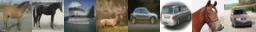
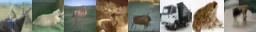
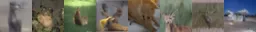

128 steps 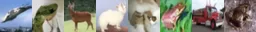
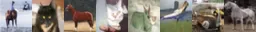
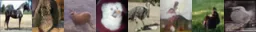

1,000 steps 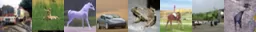

64 steps 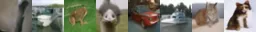
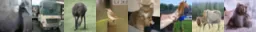
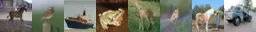

256 steps 
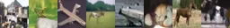
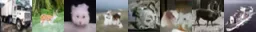

Real samples 

Figure 4: Non-cherrypicked $`L_{\textrm{simple}}`$ CIFAR10 samples for
even (top), quadratic (middle), and DP strides (bottom), for various
computation budgets. Samples are based on the same 8 random seeds.

32 steps 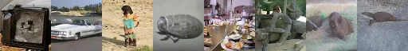
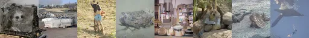
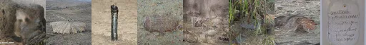

128 steps 
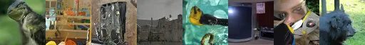
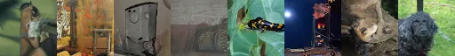

4,000 steps 

64 steps 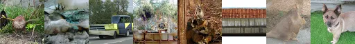
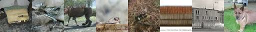
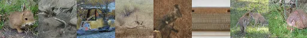

256 steps 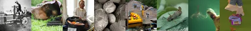
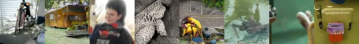
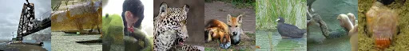

Real samples 

Figure 5: Non-cherrypicked $`L_{\textrm{hybrid}}`$ ImageNet 64x64
samples for even (top), quadratic (middle), and DP strides (bottom), for
various computation budgets. Samples are based on the same 8 random
seeds.

Figure 6: Timesteps discovered via dynamic programming for
$`L_{\textrm{simple}}`$ CIFAR10 (left) and $`L_{\textrm{hybrid}}`$
ImageNet 64x46 (right) for various computation budgets. Each step
(forward pass) is between two contiguous points. Our DP algorithm
prefers allocates steps towards the end of the diffusion, agreeing with
intuition from prior work where steps closer to $`{\bm{x}}_{0}`$ are
important as they capture finer image details, but curiously, it may
also allocate steps closer to $`{\bm{x}}_{1}`$, possibly to better break
modes early on in the diffusion process.

## 6 Related Work

DDPMs (Ho et al., 2020) have recently shown results that are competitive
with GANs (Goodfellow et al., 2014), and they can be traced back to the
work of Sohl-Dickstein et al. (2015) as a restricted family of deep
latent variable models. Dhariwal and Nichol (2021) have more recently
shown that DDPMs can outperform GANs in FID scores (Heusel et al.,
2017). Song and Ermon (2019) have also linked DDPMs to denoising score
matching (Vincent et al., 2008; Vincent et al., 2010), which is crucial
to the continuous-time formulation (Song et al., 2021). This connection
to score matching has been explored further by Song and Kingma (2021),
where other score-matching techniques (e.g., sliced score matching, Song
et al. (2020b)) have been shown to be valid DDPM objectives and DDPMs
are linked to energy-based models. More recent work on the few-step
regime of DDPMs (Song et al., 2020a; Chen et al., 2021; Nichol and
Dhariwal, 2021; San-Roman et al., 2021; Kong and Ping, 2021;
Jolicoeur-Martineau et al., 2021) has also guided our research efforts.
DDPMs are also very closely related to variational autoencoders (Kingma
and Welling, 2013), where more recent work has shown that, with many
stochastic layers, they can also attain competitive negative log
likelihoods in unconditional image generation (Child, 2020). Also very
closely related to DDPMs, there has also been work on non-autoregressive
modeling of text sequences that can be regarded as discrete-space DDPMs
with a forward process that masks or remove tokens (Lee et al., 2018; Gu
et al., 2019; Stern et al., 2019; Chan et al., 2020; Saharia et al.,
2020). The UNet architecture (Ronneberger et al., 2015) has been key to
the recent success of DDPMs, and as shown by Ho et al. (2020); Nichol
and Dhariwal (2021), augmenting UNet with self-attention (Shaw et al., 2018) in scales where attention is computationally feasible has helped
bring DDPMs closer to the current state-of-the-art autoregressive
generative models (Child et al., 2019; Jun et al., 2020; Roy et al.,
2021).

## 7 Conclusion and Discussion

By regarding the selection of the inference schedule as an optimization
problem, we present a novel and efficient dynamic programming algorithm
to discover the optimal inference schedule for a pre-trained DDPM. Our
DP algorithm finds an optimal inference schedule based on the ELBO given
a fixed computation budget. Our method need only be applied once to
discover the schedule, and does not require training or re-training the
DPPM. In the few-step regime, we discover schedules on
$`L_{\textrm{simple}}`$ CIFAR10 and $`L_{\textrm{hybrid}}`$ ImageNet
64x64 that require only 32 steps, yet sacrifice $`\leq 0.1`$ bits per
dimension compared to state-of-the-art DDPMs using hundreds-to-thousands
of refinement steps. Our approach only needs forward passes of the DDPM
neural network to fill the dynamic programming table of $`L(t,s)`$
terms, and we show that we can fill the dynamic programming table with
just $`\mathcal{O}(T)`$ forward passes. Moreover, we show that we can
estimate the table using only 128 Monte Carlo samples, finding this to
be sufficient even for datasets such as ImageNet with high diversity.
Our method achieves strong likelihoods with very few refinement steps,
outperforming prior work utilizing hand-crafted strides (Ho et al.,
2020; Nichol and Dhariwal, 2021).

Despite very strong log-likelihood results, especially in the few step
regime, we observe limitations to our method. There is a disconnect
between log-likehoods and FID scores, where improvements in
log-likelihoods do not necessarily translate to improvements in FID
scores. This is consistent with prior work, showing that the correlation
between log likelihood and FID can be mismatched (Ho et al., 2020;
Nichol and Dhariwal, 2021). We hope our work will encourage future
research exploiting our general framework of optimization post-training
in DDPMs, potentially utilizing gradient-based optimization over not
only the ELBO, but also other, non-decomposable metrics. We particularly
note that other sampling steps such as MCMC corrector steps or
alternative predictor steps (e.g., following the reverse SDE) (Song
et al., 2021) can also be incorporated into computation budget, and
general learning frameworks like reinforcement learning are well-suited
to explore this space as well as non-differentiable learning signals.

## References

- Cai et al. \[2020\] Ruojin Cai, Guandao Yang, Hadar Averbuch-Elor,
  Zekun Hao, Serge Belongie, Noah Snavely, and Bharath Hariharan.
  Learning Gradient Fields for Shape Generation. In _ECCV_, 2020.
- Chan et al. \[2020\] William Chan, Chitwan Saharia, Geoffrey Hinton,
  Mohammad Norouzi, and Navdeep Jaitly. Imputer: Sequence Modelling via
  Imputation and Dynamic Programming. In _ICML_, 2020.
- Chen et al. \[2021\] Nanxin Chen, Yu Zhang, Heiga Zen, Ron J. Weiss,
  Mohammad Norouzi, and William Chan. WaveGrad: Estimating Gradients for
  Waveform Generation. In _ICLR_, 2021.
- Child \[2020\] Rewon Child. Very deep vaes generalize autoregressive
  models and can outperform them on images. _arXiv preprint
  arXiv:2011.10650_, 2020.
- Child et al. \[2019\] Rewon Child, Scott Gray, Alec Radford, and Ilya
  Sutskever. Generating long sequences with sparse transformers. _arXiv
  preprint arXiv:1904.10509_, 2019.
- Deng et al. \[2009\] Jia Deng, Wei Dong, Richard Socher, Li-Jia Li,
  Kai Li, and Li Fei-Fei. Imagenet: A large-scale hierarchical image
  database. In _2009 IEEE conference on computer vision and pattern
  recognition_, pages 248–255. Ieee, 2009.
- Dhariwal and Nichol \[2021\] Prafulla Dhariwal and Alex Nichol.
  Diffusion models beat gans on image synthesis. _arXiv preprint
  arXiv:2105.05233_, 2021.
- Goodfellow et al. \[2014\] Ian J Goodfellow, Jean Pouget-Abadie, Mehdi
  Mirza, Bing Xu, David Warde-Farley, Sherjil Ozair, Aaron Courville,
  and Yoshua Bengio. Generative adversarial networks. _arXiv preprint
  arXiv:1406.2661_, 2014.
- Gu et al. \[2019\] Jiatao Gu, Changhan Wang, and Jake Zhao.
  Levenshtein Transformer. In _NeurIPS_, 2019.
- Heusel et al. \[2017\] Martin Heusel, Hubert Ramsauer, Thomas
  Unterthiner, Bernhard Nessler, and Sepp Hochreiter. Gans trained by a
  two time-scale update rule converge to a local nash equilibrium.
  _arXiv preprint arXiv:1706.08500_, 2017.
- Ho et al. \[2020\] Jonathan Ho, Ajay Jain, and Pieter Abbeel.
  Denoising Diffusion Probabilistic Models. _NeurIPS_, 2020.
- Jolicoeur-Martineau et al. \[2021\] Alexia Jolicoeur-Martineau, Ke Li,
  Rémi Piché-Taillefer, Tal Kachman, and Ioannis Mitliagkas. Gotta go
  fast when generating data with score-based models, 2021.
- Jun et al. \[2020\] Heewoo Jun, Rewon Child, Mark Chen, John Schulman,
  Aditya Ramesh, Alec Radford, and Ilya Sutskever. Distribution
  Augmentation for Generative Modeling. In _ICML_, 2020.
- Kingma and Welling \[2013\] Diederik P Kingma and Max Welling.
  Auto-Encoding Variational Bayes. In _ICLR_, 2013.
- Kong and Ping \[2021\] Zhifeng Kong and Wei Ping. On fast sampling of
  diffusion probabilistic models, 2021.
- Kong et al. \[2020\] Zhifeng Kong, Wei Ping, Jiaji Huang, Kexin Zhao,
  and Bryan Catanzaro. DiffWave: A Versatile Diffusion Model for Audio
  Synthesis. _arXiv preprint arXiv:2009.09761_, 2020.
- Krizhevsky et al. \[2009\] Alex Krizhevsky, Geoffrey Hinton, et al.
  Learning multiple layers of features from tiny images. _Technical
  Report_, 2009.
- Lee et al. \[2018\] Jason Lee, Elman Mansimov, and Kyunghyun Cho.
  Deterministic non-autoregressive neural sequence modeling by iterative
  refinement. _arXiv preprint arXiv:1802.06901_, 2018.
- Li et al. \[2021\] Haoying Li, Yifan Yang, Meng Chang, Huajun Feng,
  Zhihai Xu, Qi Li, and Yueting Chen. SRDiff: Single Image
  Super-Resolution with Diffusion Probabilistic Models.
  _arXiv:2104.14951_, 2021.
- Nichol and Dhariwal \[2021\] Alex Nichol and Prafulla Dhariwal.
  Improved denoising diffusion probabilistic models. _arXiv preprint
  arXiv:2102.09672_, 2021.
- Ronneberger et al. \[2015\] Olaf Ronneberger, Philipp Fischer, and
  Thomas Brox. U-net: Convolutional networks for biomedical image
  segmentation. In _International Conference on Medical image computing
  and computer-assisted intervention_, pages 234–241. Springer, 2015.
- Roy et al. \[2021\] Aurko Roy, Mohammad Saffar, Ashish Vaswani, and
  David Grangier. Efficient content-based sparse attention with routing
  transformers. _Transactions of the Association for Computational
  Linguistics_, 9:53–68, 2021.
- Saharia et al. \[2020\] Chitwan Saharia, William Chan, Saurabh Saxena,
  and Mohammad Norouzi. Non-Autoregressive Machine Translation with
  Latent Alignments. _EMNLP_, 2020.
- Saharia et al. \[2021\] Chitwan Saharia, Jonathan Ho, William Chan,
  Tim Salimans, David J Fleet, and Mohammad Norouzi. Image
  super-resolution via iterative refinement. _arXiv preprint
  arXiv:2104.07636_, 2021.
- San-Roman et al. \[2021\] Robin San-Roman, Eliya Nachmani, and Lior
  Wolf. Noise estimation for generative diffusion models. _arXiv
  preprint arXiv:2104.02600_, 2021.
- Särkkä and Solin \[2019\] Simo Särkkä and Arno Solin. _Applied
  stochastic differential equations_, volume 10. Cambridge University
  Press, 2019.
- Shaw et al. \[2018\] Peter Shaw, Jakob Uszkoreit, and Ashish Vaswani.
  Self-attention with relative position representations. _arXiv preprint
  arXiv:1803.02155_, 2018.
- Sohl-Dickstein et al. \[2015\] Jascha Sohl-Dickstein, Eric Weiss, Niru
  Maheswaranathan, and Surya Ganguli. Deep unsupervised learning using
  nonequilibrium thermodynamics. In _International Conference on Machine
  Learning_, pages 2256–2265. PMLR, 2015.
- Song et al. \[2020a\] Jiaming Song, Chenlin Meng, and Stefano Ermon.
  Denoising diffusion implicit models. _arXiv preprint
  arXiv:2010.02502_, 2020a.
- Song and Ermon \[2019\] Yang Song and Stefano Ermon. Generative
  Modeling by Estimating Gradients of the Data Distribution.
  _NeurIPS_, 2019.
- Song and Kingma \[2021\] Yang Song and Diederik P Kingma. How to train
  your energy-based models. _arXiv preprint arXiv:2101.03288_, 2021.
- Song et al. \[2020b\] Yang Song, Sahaj Garg, Jiaxin Shi, and Stefano
  Ermon. Sliced score matching: A scalable approach to density and score
  estimation. In _Uncertainty in Artificial Intelligence_, pages
  574–584. PMLR, 2020b.
- Song et al. \[2021\] Yang Song, Jascha Sohl-Dickstein, Diederik P.
  Kingma, Abhishek Kumar, Stefano Ermon, and Ben Poole. Score-Based
  Generative Modeling through Stochastic Differential Equations. In
  _ICLR_, 2021.
- Stern et al. \[2019\] Mitchell Stern, William Chan, Jamie Kiros, and
  Jakob Uszkoreit. Insertion Transformer: Flexible Sequence Generation
  via Insertion Operations. In _ICML_, 2019.
- Vincent et al. \[2008\] Pascal Vincent, Hugo Larochelle, Yoshua
  Bengio, and Pierre-Antoine Manzagol. Extracting and composing robust
  features with denoising autoencoders. In _Proceedings of the 25th
  international conference on Machine learning_, pages 1096–1103, 2008.
- Vincent et al. \[2010\] Pascal Vincent, Hugo Larochelle, Isabelle
  Lajoie, Yoshua Bengio, Pierre-Antoine Manzagol, and Léon Bottou.
  Stacked denoising autoencoders: Learning useful representations in a
  deep network with a local denoising criterion. _Journal of machine
  learning research_, 11(12), 2010.

## Appendix A Appendix

### A.1 Proof for Equation 12

From Equation 10, we get by implicit differentiation that

```math
\displaystyle f(t)=\psi(t,0)=\exp\left(\int_{0}^{t}f_{\textrm{sde}}(u)du\right)
```

```math
\displaystyle\Rightarrow \displaystyle f^{\prime}(t)=\exp\left(\int_{0}^{t}f_{\textrm{sde}}(u)du\right)\frac{d}{dt}\int_{0}^{t}f_{\textrm{sde}}(u)du=f(t)f_{\textrm{sde}}(t)
```

```math
\displaystyle\Rightarrow \displaystyle f_{\textrm{sde}}(t)=\frac{f^{\prime}(t)}{f(t)}
```

Similarly as above and also using the fact that
$`\psi(t,s)=\frac{\psi(t,0)}{\psi(s,0)}`$,

```math
\displaystyle g(t)^{2}=\int_{0}^{t}\psi(t,u)^{2}g_{\textrm{sde}}(u)^{2}du=\int_{0}^{t}\frac{f(t)^{2}}{f(u)^{2}}g_{\textrm{sde}}(u)^{2}du=f(t)^{2}\int_{0}^{t}\frac{g_{\textrm{sde}}(u)^{2}}{f(u)^{2}}du
```

```math
\displaystyle\Rightarrow \displaystyle 2g(t)g^{\prime}(t)=2f(t)f^{\prime}(t)\frac{g(t)^{2}}{f(t)^{2}}+f(t)^{2}\frac{d}{dt}\int_{0}^{t}\frac{g_{\textrm{sde}}(u)^{2}}{f(u)^{2}}du=2f_{\textrm{sde}}(t)g(t)^{2}+g_{\textrm{sde}}(t)^{2}
```

```math
\displaystyle\Rightarrow \displaystyle g_{\textrm{sde}}(t)=\sqrt{2(g(t)g^{\prime}(t)-f_{\textrm{sde}}(t)g(t)^{2})}.\qed
```

### A.2 Proof for Equations 13 and 14

From Equation 10 and $`\psi(t,s)=\frac{\psi(t,0)}{\psi(s,0)}`$ it is
immediate that $`f_{ts}`$ is the mean of $`q(x_{t}|x_{s})`$. To show
that $`g_{ts}^{2}`$ is the variance of $`q(x_{t}|x_{s})`$, Equation 10
implies that

```math
\displaystyle\mathrm{Var}[x_{t}|x_{s}] \displaystyle=\int_{s}^{t}\psi(t,u)^{2}g_{\textrm{sde}}(u)^{2}du
```

```math
\displaystyle=\int_{0}^{t}\psi(t,u)^{2}g_{\textrm{sde}}(u)^{2}du-\int_{0}^{s}\psi(t,u)^{2}g_{\textrm{sde}}(u)^{2}du
```

```math
\displaystyle=g(t)^{2}-\psi(t,0)^{2}\int_{0}^{s}\frac{\psi(s,u)^{2}}{\psi(s,u)^{2}\psi(u,0)^{2}}g_{\textrm{sde}}(u)^{2}du
```

```math
\displaystyle=g(t)^{2}-\psi(t,0)^{2}\int_{0}^{s}\frac{\psi(s,u)^{2}}{\psi(s,0)^{2}}g_{\textrm{sde}}(u)^{2}du
```

```math
\displaystyle=g(t)^{2}-\psi(t,s)^{2}g(s)^{2}
```

```math
\displaystyle=g(t)^{2}-f_{ts}g(s)^{2}.
```

The mean of $`q(x_{s}|x_{t},x_{0})`$ is given by the Gaussian conjugate
prior formula (where all the distributions are conditioned on
$`x_{0}`$). Let $`\mu=f_{ts}x_{s}`$, so we have a prior over $`\mu`$
given by

```math
x_{s}|x_{0}\sim\mathcal{N}(f_{s0}x_{0},g_{s0}^{2}I_{d})\Rightarrow\mu|x_{0}\sim\mathcal{N}(f_{s0}f_{ts}x_{0},f_{ts}^{2}g_{s0}^{2}I_{d})\sim\mathcal{N}(f_{t0}x_{0},f_{ts}^{2}g_{s0}^{2}I_{d}),
```

and a likelihood with mean $`\mu`$

```math
x_{t}|x_{s},x_{0}\sim x_{t}|x_{s}\sim\mathcal{N}(f_{ts}x_{s},g_{ts}^{2}I_{d})\Rightarrow x_{t}|\mu,x_{0}\sim x_{t}|\mu\sim\mathcal{N}(\mu,g_{ts}^{2}I_{d}).
```

Then it follows by the formula that $`\mu|x_{t},x_{0}`$ has variance

```math
\displaystyle\mathrm{Var}[\mu|x_{t},x_{0}]=\left(\frac{1}{f_{ts}^{2}g_{s0}^{2}}+\frac{1}{g_{ts}^{2}}\right)^{-1}=\left(\frac{g_{ts}^{2}+f_{ts}^{2}g_{s0}^{2}}{f_{ts}^{2}g_{s0}^{2}g_{ts}^{2}}\right)^{-1}=\frac{f_{ts}^{2}g_{s0}^{2}g_{ts}^{2}}{g_{ts}^{2}+f_{ts}^{2}g_{s0}^{2}}
```

```math
\displaystyle\Rightarrow \displaystyle\mathrm{Var}[x_{s}|x_{t},x_{0}]=\frac{1}{f_{ts}^{2}}\mathrm{Var}[\mu|x_{t},x_{0}]=\frac{g_{s0}^{2}g_{ts}^{2}}{g_{ts}^{2}+f_{ts}^{2}g_{s0}^{2}}=\frac{g_{s0}^{2}g_{ts}^{2}}{g_{t0}^{2}}=\tilde{g}_{ts}^{2}
```

and mean

```math
\displaystyle\mathbb{E}[\mu|x_{t},x_{0}]=\left(\frac{1}{f_{ts}^{2}g_{s0}^{2}}+\frac{1}{g_{ts}^{2}}\right)^{-1}\left(\frac{f_{t0}x_{0}}{f_{ts}^{2}g_{s0}^{2}}+\frac{x_{t}}{g_{ts}^{2}}\right)=\frac{f_{t0}g_{ts}^{2}x_{0}+f_{ts}^{2}g_{s0}^{2}x_{t}}{g_{ts}^{2}+f_{ts}^{2}g_{s0}^{2}}=\frac{f_{t0}g_{ts}^{2}x_{0}+f_{ts}^{2}g_{s0}^{2}x_{t}}{g_{t0}^{2}}
```

```math
\displaystyle\Rightarrow \displaystyle\mathbb{E}[x_{s}|x_{t},x_{0}]=\frac{1}{f_{ts}}\mathbb{E}[\mu|x_{t},x_{0}]=\frac{\cfrac{f_{t0}}{f_{ts}}g_{ts}^{2}x_{0}+f_{ts}g_{s0}^{2}x_{t}}{g_{t0}^{2}}=\frac{f_{s0}g_{ts}^{2}x_{0}+f_{ts}g_{s0}^{2}x_{t}}{g_{t0}^{2}}=\tilde{f}_{ts}(x_{t},x_{0}).\qed
```
