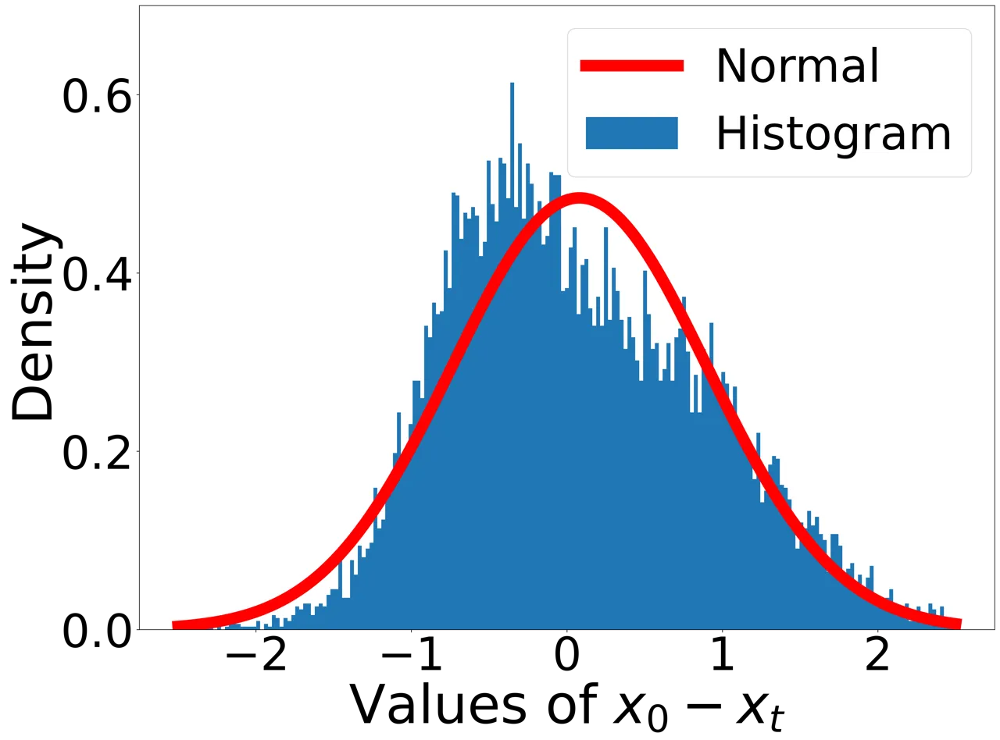
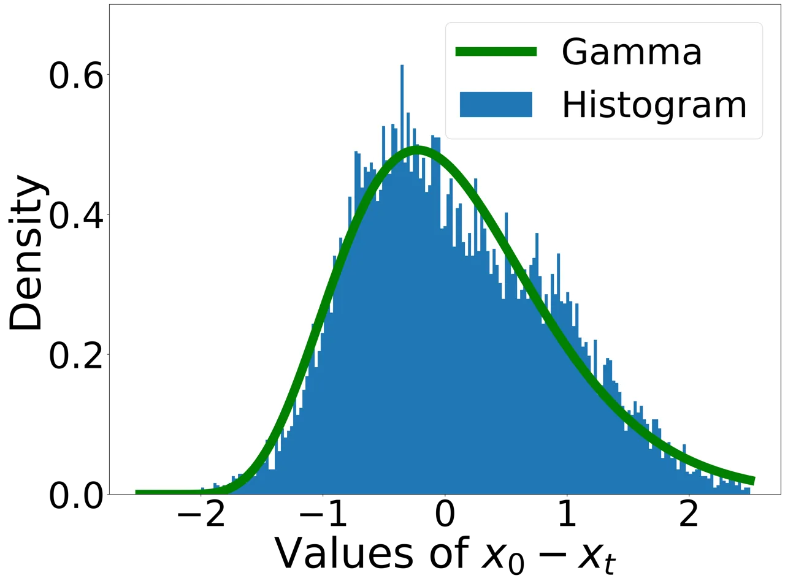
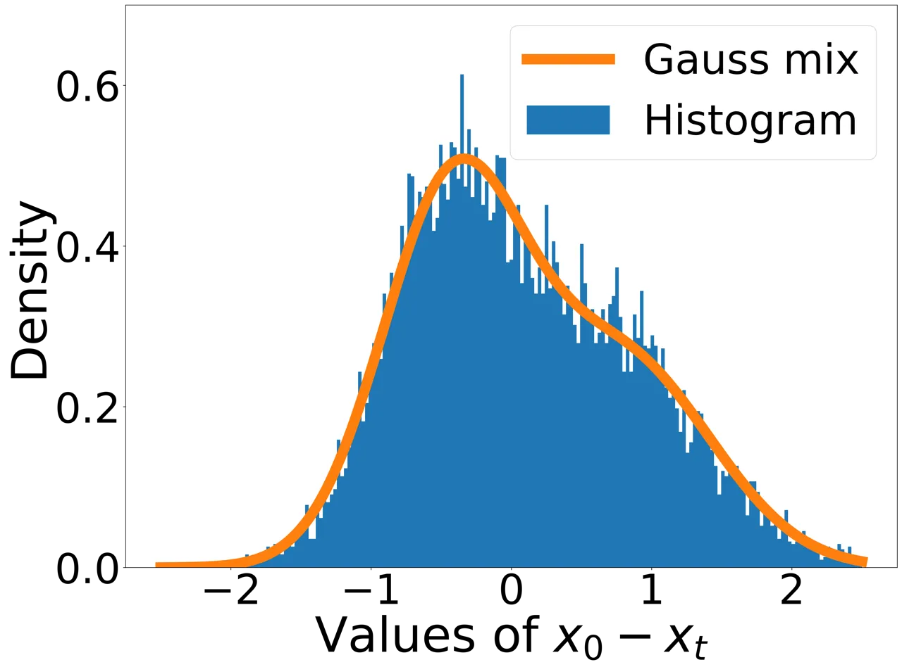
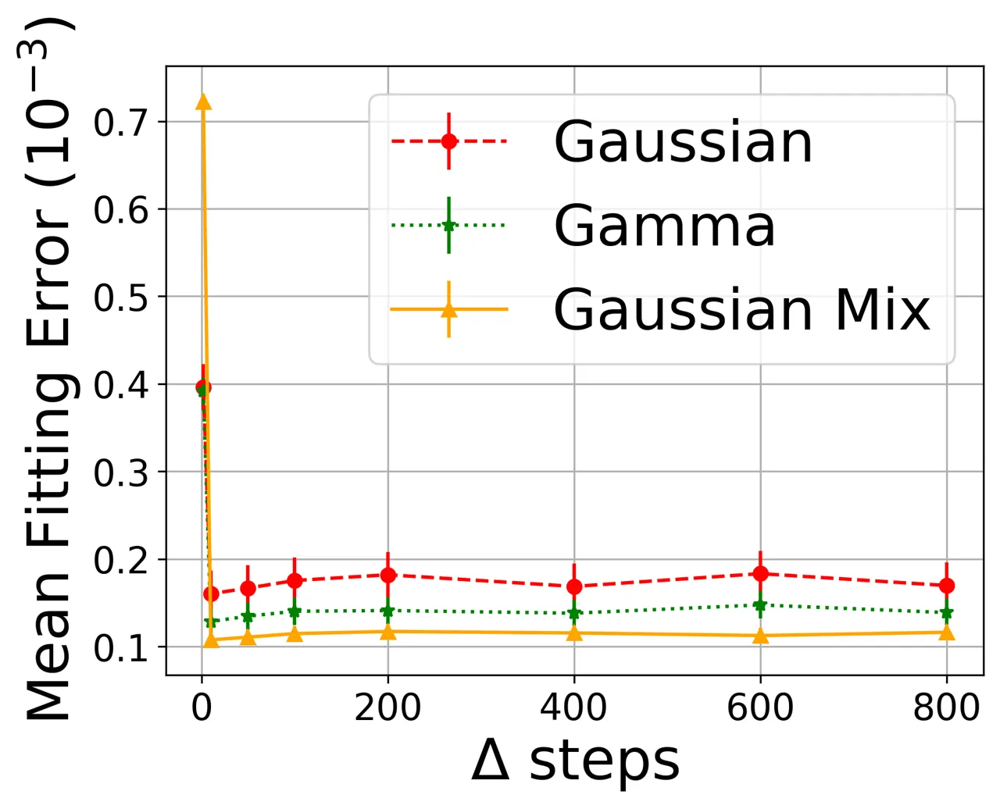
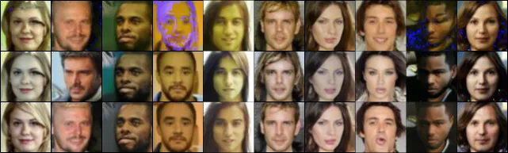

# Non Gaussian Denoising Diffusion Models

Eliya Nachmani\* Affiliation: Tel-Aviv University Affiliation: Facebook
AI Research Email: [enk100@gmail.com](mailto:)    Robin San Roman\*
Affiliation: École Normale Supérieure Paris-Saclay
Email: [sanroman.robin@gmail.com](mailto:)    Lior Wolf
Affiliation: Tel-Aviv University Email: [wolf@cs.tau.ac.il](mailto:)

###### Abstract

Generative diffusion processes are an emerging and effective tool for
image and speech generation. In the existing methods, the underline
noise distribution of the diffusion process is Gaussian noise. However,
fitting distributions with more degrees of freedom, could help the
performance of such generative models. In this work, we investigate
other types of noise distribution for the diffusion process.
Specifically, we show that noise from Gamma distribution provides
improved results for image and speech generation. Moreover, we show that
using a mixture of Gaussian noise variables in the diffusion process
improves the performance over a diffusion process that is based on a
single distribution. Our approach preserves the ability to efficiently
sample state in the training diffusion process while using Gamma noise
and a mixture of noise.

^(†)^(†) \*Equal contribution

## 1 Introduction

Deep generative neural networks has shown significant progress over the
last years. The main architectures for generation are: (i) VAE \[14\]
based, for example, NVAE \[30\] and VQ-VAE \[23\], (ii) GAN \[5\] based,
for example, StyleGAN \[12\] for vision application and WaveGAN \[3\]
for speech (iii) Flow-based, for example Glow \[13\] (iv) Autoregessive,
for example, Wavenet for speech \[22\] and (v) Diffusion Probabilistic
Models \[25\], for example, Denoising Diffusion Probabilistic Models
(DDPM) \[7\] and its implicit version DDIM \[26\].

Models from this last family have shown significant progress in
generation capabilities during the last years, e.g., \[25, 7, 2, 15\],
and have achieved comparable results to the state of the art generation
architecture in both images and speech.

A DDPM is a Markov chain of latent variables. Two processes are modeled:
(i) a diffusion process and (ii) a denoising process. During training,
the diffusion process learns to transform data samples into Gaussian
noise. The denoising is the reverse process and it is used during
inference to generate data samples, stating from Gaussian noise. The
second process can be condition on attributes to control the generation
sample. In order to get high quality synthesis, a large number of
denoising steps is used (i.e. $`1000`$ steps). A notable property of the
diffusion process is a closed form formulation of the noise that arises
from accumulating diffusion stems. This allows to sampling arbitrary
states in the Markov chain of the diffusion process without calculating
the previous steps.

In the Gaussian case, this property stems from the fact that adding
Gaussian distributions leads to another Gaussian distribution. Other
distributions have similar properties. For example, for the Gamma
distribution, the sum of two distributions that share the scale
parameter is a Gamma distribution of the same scale. The Poisson
distribution has a similar property. However, its discrete nature makes
it less suitable for DDPM.

In DDPM, the mean of the distribution is set at zero. The Gamma
distribution, with its two parameters (shape and scale), is better
suited to fit the data than a Gaussian distribution with one degree of
freedom (scale). Furthermore, the Gamma distribution generalizes other
distributions, and many other distributions can be derived from
it \[18\].

The added modeling capacity of the Gamma distribution can help speed up
the convergence of the DDPM model. Consider, for example, conventional
DDPM model that were trained with Gaussian noise on the CelebA
dataset \[20\]. After $`t`$ steps, one can compute the histogram of the
differences between the obtained image $`x_{t}`$ and the original noise
image $`x_{0}`$. Both a Gaussian distribution, Gamma distribution, and a
mixture of Gaussian can then be fitted to this histogram, as shown in
Fig. 1(a,b,c). Unsurprisingly, for a single step, both the Gaussian
distribution and the Gamma distribution can be fitted with the same
error, see Fig. 1(d). However, when trying to fit for more than a single
step, the Gamma distribution and the mixture of Gaussian becomes a much
better fit.

In this paper, we investigate two types of non-Gaussian noise
distribution: (i) Mixture of Gaussian, and (ii) Gamma. The two proposed
models maintain the property of the diffusion process to sample
arbitrary states without calculating the previous steps. Our results are
demonstrated in two major domains: vision and audio. In the first
domain, the proposed method is shown to provide a better FID score for
generated images. For speech data, we show that the proposed method
improves various measures, such as Perceptual Evaluation of Speech
Quality (PESQ), short-time objective intelligibility (STOI) and
Mel-Cepstral Distortion (MCD).

|                                                           |                                                           |                                                           |                                                           |
| --------------------------------------------------------- | --------------------------------------------------------- | --------------------------------------------------------- | --------------------------------------------------------- |
|  |  |  |  |
| \(a\)                                                     | \(b\)                                                     | \(c\)                                                     | \(d\)                                                     |

Figure 1: Fitting a distribution to the histogram of the difference
between $`x_{0}`$ and the image $`x_{t}`$ after $`t`$ DDPM steps, using
a pretrained (Gaussian) celebA (64x64) model. (a) The fitting of a
Gaussian to the histogram of a typical image after $`t-50`$ steps. (b)
Fitting a mixture of Gaussian distribution. (c) Fitting a Gamma
distribution. (d) The fitting error to Gaussian and Gamma distribution,
measured as the MSE between the histogram and the fitted probability
distribution function. Each point is the average value for the
generation of $`100`$ images. The vertical errorbars denote the standard
deviation.

## 2 Related Work

In their seminal work, Sohl-Dickstein et al. introduce the Diffusion
Probabilistic Model \[25\]. The model is applied to various domains,
such as time series and images. The main drawback in the proposed model
is the fact that it needs up to thousands of iterative steps in order to
generate valid data sample. Song et al. \[27\] proposed a diffusion
generative model based on Langevin dynamics and the score matching
method \[8\]. The model estimate the Stein score function \[19\] which
is the logarithm of the data density. Given the Stein score function,
the model can generate data points.

Denoising Diffusion Probabilistic Models (DDPM) \[7\] combine generative
models based on score matching and neural Diffusion Probabilistic Models
into a single model. Similarly, in \[2, 16\] a generative neural
diffusion process based on score matching was applied to speech
generation. These models achieve state of the art results for speech
generation, and show superior results over well-established methods,
such as Wavernn \[11\], Wavenet \[22\], and GAN-TTS \[1\].

Diffusion Implicit Models (DDIM) is a method to accelerate the denoising
process \[26\]. The model employs a non-Markovian diffusion process to
generate higher quality sample. The model helps to reduce the number of
diffusion steps, e.g., from a thousand steps to a few hundred.

Song et al. show that score based generative models can be considered as
a solution to a stochastic differential equation \[28\]. Gao et al.
provide an alternative approach to train an energy-based generative
model using a diffusion process \[4\].

Another line of work in audio is that of neural vocoders that are based
on a denoising diffusion process. WaveGrad \[2\] and DiffWave \[16\] are
conditioned on the mel-spectrogram and produce high fidelity audio
samples using as few as six step of the diffusion process. These models
outperform adversarial non-autoregressive baselines.

1:  Input: dataset $`d`$, diffusion process length $`T`$, noise schedule
$`\beta_{1},...,\beta_{T}`$

2:  repeat

3:   $`x_{0}\sim d(x_{0})`$

4:   $`t\sim\mathcal{U}(\{1,...,T\})`$

5:   $`\varepsilon\sim\mathcal{N}(0,I)`$

6:
  $`x_{t}=\sqrt{\bar{\alpha}_{t}}x_{0}+\sqrt{1-|\bar{\alpha}_{t}|}\varepsilon`$

7:   Take gradient descent step on:  
$`\|\varepsilon-\varepsilon_{\theta}(x_{t},t)\|_{1}`$

8:  until converged

Algorithm 1 DDPM training procedure.

1:  $`x_{T}\sim\mathcal{N}(0,I)`$

2:  for t= T, …, 1 do

3:   $`z\sim\mathcal{N}(0,I)`$

4:   $`\hat{\varepsilon}=\varepsilon_{\theta}(x_{t},t)`$

5:
  $`x_{t-1}=\frac{x_{t}-\frac{1-\alpha_{t}}{\sqrt{1-\bar{\alpha}_{t}}}\hat{\varepsilon}}{\sqrt{\alpha_{t}}}`$

6:   if $`t\neq 1`$ then

7:    $`x_{t-1}=x_{t-1}+\sigma_{t}z`$

8:   end if

9:  end for

10:  return $`x_{0}`$

Algorithm 2 DDPM sampling algorithm

## 3 Diffusion models for Various Distributions

We start by recapitulating the Gaussian case, after which we derive
diffusion models for mixtures of Gaussians and for the Gamma
distribution.

### 3.1 Background - Gaussian DDPM

Diffusion network learn the gradients of the data log density

```math
s(y)=\nabla_{y}\log p(y) \tag{1}
```

By using Langevin Dynamics and the gradients of the data log density
$`\nabla_{y}\log p(y)`$, a sample procedure from the probability can be
done by:

```math
\tilde{y}_{i+1}=\tilde{y}_{i}+\frac{\eta}{2}s(\tilde{y}_{i})+\sqrt{\eta}z_{i} \tag{2}
```

where $`z_{i}\sim\mathcal{N}(0,I)`$ and $`\eta>0`$ is the step size. The
diffusion process in DDPM \[7\] is defined by a Markov chain that
gradually adds Gaussian noise to the data according to a noise schedule.
The diffusion process is defined by:

```math
q(x_{1:T}|x_{0})=\prod_{t=1}^{T}q(x_{t}|x_{t-1})\,, \tag{3}
```

where T is the length of the diffusion process, and
$`x_{T},...,x_{t},x_{t-1},...,x_{0}`$ is a sequence of latent variables
with the same size as the clean sample $`x_{0}`$. The Diffusion process
is parameterized with a set of parameters called noise schedule
($`\beta_{1},\dots\beta_{T}`$) that defines the variance of the noise
added at each step:

```math
q(x_{t}|x_{t-1}):=\mathcal{N}(x_{t};\sqrt{1-\beta_{t}}x_{t-1},\beta_{t}\mathbf{I})\,, \tag{4}
```

Since we are using Gaussian noise random variable at each step The
diffusion process can be simulated for any number of steps with the
closed formula:

```math
x_{t}=\sqrt{\bar{\alpha}_{t}}x_{0}+\sqrt{1-\bar{\alpha}_{t}}\varepsilon\,, \tag{5}
```

where $`\alpha_{i}=1-\beta_{i}`$,
$`\bar{\alpha}_{t}=\prod_{i=1}^{t}\alpha_{i}`$ and
$`\varepsilon=\mathcal{N}(0,\mathbf{I})`$. The complete training
procedure is defined in Alg.1. Given the input dataset $`d`$, the
algorithm samples $`\epsilon`$, $`x_{0}`$ and $`t`$. The noisy latent
state $`x_{t}`$ is calculated and fed to the DDPM neural network
$`\varepsilon_{\theta}`$. A gradient descent step is taken in order to
estimate the $`\varepsilon`$ noise with the DDPM network
$`\varepsilon_{\theta}`$.

The inference procedure uses the trained model $`\varepsilon_{\theta}`$
and a variation of the Langevin dynamics. The following update from
\[26\] is used to reverse a step of the diffusion process:

```math
x_{t-1}=\dfrac{x_{t}-\frac{1-\alpha_{t}}{\sqrt{1-\bar{\alpha}_{t}}}\varepsilon_{\theta}(x_{t},t)}{\sqrt{\bar{\alpha}_{t}}}+\sigma_{t}\varepsilon\,, \tag{6}
```

where $`\varepsilon`$ is white noise and $`\sigma_{t}`$ is the standard
deviation of added noise. In \[26\] the authors use
$`{\sigma_{t}}^{2}=\beta_{t}`$. The complete inference algorithm present
at Alg. 2. Starting from a Gaussian noise and then step-by-step
reversing the diffusion process, by iteratively employing the update
rule of Eq. 6.

### 3.2 Mixture of Gaussian Noise

Eq. 4 can be written as:

```math
x_{t}=\sqrt{1-\beta_{t}}x_{t-1}+\sqrt{\beta_{t}}\epsilon_{t} \tag{7}
```

where $`\epsilon_{t}`$ is the Gaussian noise of step $`t`$. This can be
generalized by adding a mixture of Gaussians at each step, i.e.,

```math
x_{t}=\sqrt{1-\beta_{t}}x_{t-1}+\sqrt{\beta_{t}}(\sum_{i=0}^{C}{z_{i}\epsilon^{i}_{t}}) \tag{8}
```

where $`z_{i}`$ are boolean random variables and $`C`$ is the number of
Gaussian variables. We denote by $`p_{i}`$ the probability that
$`z_{i}=1`$ for the $`i`$ Gaussian variable ($`\sum_{i=0}^{C}p_{i}=1`$).

For simplicity, we focus on $`C=2`$, mixtures with an expectation of
zero, and two Gaussian distributions with the same variance
$`\phi_{t}^{2}`$ and the same weight ($`p=0.5`$):

```math
x_{t}=\sqrt{1-\beta_{t}}x_{t-1}+\sqrt{\beta_{t}}(b\epsilon^{1}_{t}+(1-b)\epsilon^{2}_{t})\,, \tag{9}
```

where $`\epsilon^{1}_{t}\sim N(m^{1}_{t},{\phi_{t}}^{2})`$,
$`\epsilon^{1}_{t}\sim N(m^{2}_{t},{\phi_{t}}^{2})`$ and
$`b\sim\mathcal{B}ernoulli(p)`$. In addition to the zero mean property
that we assume, we scale the variables such that the variance of
$`b\epsilon^{1}_{t}+(1-b)\epsilon^{2}_{t}`$ is one.

We reparametrize the added noise at each step as
$`\sqrt{\beta_{t}}X_{t}`$, i.e.

```math
X_{t}=b\epsilon^{1}_{t}+(1-b)\epsilon^{2}_{t}\,. \tag{10}
```

Since $`X_{t}`$ is zero mean and has a variance of one ($`E(X_{t})=0`$
and $`V(X_{t})=1`$), the added value at each step
$`\sqrt{\beta_{t}}X_{t}`$ will have zero mean and a $`\beta_{t}`$
variance. The following Lemma captures the relation between the two
means in this case.

###### Lemma 1.

Assuming that
$`\epsilon_{t}^{1}\sim\mathcal{N}(m_{t}^{1},{\phi_{t}}^{2})`$,
$`\epsilon_{t}^{2}\sim\mathcal{N}(m_{t}^{2},{\phi_{t}}^{2})`$,
$`b\sim Bernouilli(p)`$, $`E(X_{t})=0`$ and $`V(X_{t})=1`$. Then the
following equation hold:

```math
m_{t}^{1}=\sqrt{\frac{1-{\phi_{t}}^{2}}{p(1-p)+\frac{p^{3}}{1-p}+2p^{2}}} \tag{11}
```

```math
m_{t}^{2}=-\frac{p}{1-p}m_{t}^{1} \tag{12}
```

###### Proof.

The mean value of $`X_{t}`$ can be calculate as:

```math
\displaystyle E(X_{t}) \displaystyle=E(b\epsilon^{1}_{t})+E((1-b)\epsilon^{2}_{t})=E(b)E(\epsilon^{1}_{t})+E(1-b)E(\epsilon^{2}_{t})
```

```math
\displaystyle=E(b)E(\epsilon^{1}_{t})+E(1-b)E(\epsilon^{2}_{t})=pm_{t}^{1}+(1-p)m_{t}^{2}
```

since $`b,\epsilon^{1}_{t},\epsilon^{2}_{t}`$ are independent and due to
the linearity of the expectation. Since we assume that $`E(X_{t})=0`$,
we have:

```math
m_{t}^{2}=-\frac{p}{1-p}m_{t}^{1} \tag{13}
```

Denote $`X^{1}_{t}=b\epsilon^{1}_{t}`$ and
$`X^{2}_{t}=(1-b)\epsilon^{2}_{t}`$. The variance of $`X_{t}`$ is given
as:

```math
V(X_{t})=V(X^{1}_{t})+V(X^{2}_{t})+2cov(X^{1}_{t},X^{2}_{t}) \tag{14}
```

where $`cov(X^{1}_{t},X^{2}_{t})=-E(X^{1}_{t})E(X^{2}_{t})`$ since
$`X^{1}_{t}X^{2}_{t}=0`$. Therefore, Eq.14 becomes:

```math
V(X_{t})=V(X^{1}_{t})+V(X^{2}_{t})-2E(X^{1}_{t})E(X^{2}_{t}) \tag{15}
```

$`V(X^{1}_{t})`$ can be calculate as:

```math
\displaystyle V(X^{1}_{t}) \displaystyle=V(b\epsilon^{1}_{t})=V(\epsilon^{1}_{t})E(b^{2})+V(b)E(\epsilon^{1}_{t})^{2}={\phi_{t}}^{2}E(b)+p(1-p)({m_{t}^{1}})^{2}
```

```math
\displaystyle={\phi_{t}}^{2}p+p(1-p)({m_{t}^{1}})^{2}
```

since $`b^{2}=b`$. Similarly, we can show that
$`V(X^{2}_{t})={\phi_{t}}^{2}(1-p)+p(1-p)({m_{t}^{2}})^{2}`$. Therefore,
we have:

```math
\displaystyle V(X_{t}) \displaystyle={\phi_{t}}^{2}p+p(1-p)({m_{t}^{1}})^{2}+{\phi_{t}}^{2}(1-p)+p(1-p)({m_{t}^{2}})^{2}-2E(X^{1}_{t})E(X^{2}_{t})
```

```math
\displaystyle={\phi_{t}}^{2}p+p(1-p)({m_{t}^{1}})^{2}+{\phi_{t}}^{2}(1-p)+p(1-p)({m_{t}^{2}})^{2}-2pm_{t}^{1}(1-p)m_{t}^{2} \tag{16}
```

Substitute Eq.13 into Eq.16 we have:
$`V(X_{t})=({m_{t}^{1}})^{2}\left(p(1-p)+\frac{p^{3}}{1-p}+2p^{2}\right)+p{\phi_{t}}^{2}+(1-p){\phi_{t}}^{2}`$.
Since $`V(X_{t})=1`$ we have:

```math
m_{t}^{1}=\sqrt{\frac{1-{\phi_{t}}^{2}}{p(1-p)+\frac{p^{3}}{1-p}+2p^{2}}} \tag{17}
```

∎

Denote $`\mathcal{M}({\phi_{t}}^{2})`$ ($`\phi_{t}\in[0,1]`$) as the
mixture model with two equally weighed Gaussian components, each with a
variance of $`\phi_{t}^{2}`$ and means stated above. The closed form for
sampling $`x_{t}`$ from $`x_{0}`$ is given by:

```math
x_{t}=\sqrt{\bar{\alpha}_{t}}x_{0}+\sqrt{1-\bar{\alpha}_{t}}N_{t} \tag{18}
```

Where $`N_{t}\sim\mathcal{M}({\phi_{t}}^{2})`$ and $`\phi_{t}`$ is a
free hyperparameter. Similarly to Eq.6, the inference is given by:

```math
x_{t-1}=\dfrac{x_{t}-\frac{1-\alpha_{t}}{\sqrt{1-\bar{\alpha}_{t}}}\varepsilon_{\theta}(x_{t},t)}{\sqrt{\bar{\alpha}_{t}}}+\sigma_{t}N_{t} \tag{19}
```

The complete training procedure is given in Alg. 3. The input is the
standard deviation for each step ($`\phi_{t})_{t\in\{1...T\}}`$, the
dataset $`d`$, the total number of steps in the diffusion process $`T`$
and the noise schedule $`\beta_{1},...,\beta_{T}`$. For each batch, the
training algorithm samples an example $`x_{0}`$, a number of steps $`t`$
and the noise itself $`\varepsilon`$. Then it calculates $`x_{t}`$ from
$`x_{0}`$ by using Eq.18. The neural network $`\varepsilon_{\theta}`$
has an input $`x_{t}`$ and is condition on the number of step $`t`$. A
gradient descend step is used to approximate $`N_{t}`$ with the neural
network $`\varepsilon_{\theta}`$. The main differences from the single
Gaussian case (Alg. 1) are the following: (i) calculating the mixture of
Gaussian parameters (ii) and sampling $`N_{t}`$.

The inference procedure is given in Alg. 4. The algorithm starts from a
noise $`x_{T}`$ sampled from $`\mathcal{M}({\phi_{T}}^{2})`$. Then for
$`T`$ steps the algorithm estimates $`x_{t-1}`$ from $`x_{t}`$ by using
Eq.19. Note that as in \[26\] $`\sigma_{t}=\beta_{t}`$. The main
differences from the single Gaussian case (Alg. 2) is the following: (i)
the start sampling point $`x_{T}`$, (ii) and the sampling noise $`z`$.

1:  Input: The standard deviations ($`\phi_{t})_{t\in\{1...T\}}`$,
dataset $`d`$, diffusion process length $`T`$, noise schedule
$`\beta_{1},...,\beta_{T}`$

2:  repeat

3:   $`x_{0}\sim d(x_{0})`$

4:   $`t\sim\mathcal{U}(\{1,...,T\})`$

5:   $`N_{t}\sim\mathcal{M}({\phi_{t}}^{2})`$

6:
  $`x_{t}=\sqrt{\bar{\alpha}_{t}}x_{0}+\sqrt{1-|\bar{\alpha}_{t}|}N_{t}`$

7:   Take gradient descent step on:  
$`\|N_{t}-\varepsilon_{\theta}(x_{t},t)\|_{1}`$

8:  until converged

Algorithm 3 Mixture of Gaussian Training Algorithm

1:  $`x_{T}\sim\mathcal{M}({\phi_{T}}^{2})`$

2:  for t= T, …, 1 do

3:   $`z\sim\mathcal{M}({\phi_{t-1}}^{2})`$

4:   $`\hat{\varepsilon}=\varepsilon_{\theta}(x_{t},t)`$

5:
  $`x_{t-1}=\frac{x_{t}-\frac{1-\alpha_{t}}{\sqrt{1-\bar{\alpha}_{t}}}\hat{\varepsilon}}{\sqrt{\alpha_{t}}}`$

6:   if $`t\neq 1`$ then

7:    $`x_{t-1}=x_{t-1}+\sigma_{t}z`$

8:   end if

9:  end for

10:  return $`x_{0}`$

Algorithm 4 Mixture of Gaussian Inference Algorithm

### 3.3 Using the Gamma distribution for noise

Denote $`\Gamma(k,\theta)`$ as the Gamma distribution, where $`k`$ and
$`\theta`$ are the shape and the scale respectively. We modify Eq. 7 by
adding, during the diffusion process, noise that follows a Gamma
distribution:

```math
x_{t}=\sqrt{1-\beta_{t}}x_{t-1}+(g_{t}-\mathbb{E}(g_{t})) \tag{20}
```

where $`g_{t}\sim\Gamma(k_{t},\theta_{t})`$,
$`\theta_{t}=\sqrt{\bar{\alpha}_{t}}\theta_{0}`$ and
$`k_{t}=\dfrac{\beta_{t}}{\alpha_{t}{\theta_{0}}^{2}}`$. Note that
$`\theta_{0}`$ and $`\beta_{t}`$ are hyperparameters.

Since the sum of Gamma distribution (with the same scale parameter) is
distributed as Gamma distribution, one can derive a closed form for
$`x_{t}`$, i.e. an equation to calculate $`x_{t}`$ from $`x_{0}`$:

```math
x_{t}=\sqrt{\bar{\alpha}_{t}}x_{0}+(\bar{g}_{t}-\bar{k}_{t}\theta_{t}) \tag{21}
```

where $`\bar{g}_{t}\sim\Gamma(\bar{k}_{t},\theta_{t})`$ and
$`\bar{k}_{t}=\sum_{i=1}^{t}k_{i}`$.

###### Lemma 2.

Let $`\theta_{0}\in\mathbb{R}`$, Assuming $`\forall t\in\{1,...,T\}`$,
$`k_{t}=\dfrac{\beta_{t}}{\alpha_{t}{\theta_{0}}^{2}}`$,
$`\theta_{t}=\sqrt{\bar{\alpha}_{t}}\theta_{0}`$, and
$`g_{t}\sim\Gamma(k_{t},\theta_{t})`$. Then $`\forall t\in\{1,...,T\}`$
the following hold:

```math
E(g_{t}-E(g_{t}))=0,V(g_{t}-E(g_{t}))=\beta_{t} \tag{22}
```

```math
x_{t}=\sqrt{\bar{\alpha}_{t}}x_{0}+(\bar{g}_{t}-E(\bar{g}_{t})) \tag{23}
```

where $`\bar{g}_{t}\sim\Gamma(\bar{k}_{t},\theta_{t})`$ and
$`\bar{k}_{t}=\sum_{i=1}^{t}k_{i}`$

###### Proof.

The first part of Eq. 22 is immediate. The variance part is also
straightforward:

```math
V(g_{t}-E(g_{t}))=k_{t}{\theta_{t}}^{2}=\beta_{t}
```

Eq. 23 is proved by induction on $`t\in\{1,...T\}`$. For $`t=1`$:

```math
x_{1}=\sqrt{1-\beta_{1}}x_{0}+g_{1}-E(g_{1})
```

since $`\bar{k}_{1}=k_{1}`$, $`\bar{g}_{1}=g_{1}`$. We also have that
$`\sqrt{1-\beta_{1}}=\sqrt{\bar{\alpha}_{1}}`$. Thus we have:

```math
x_{1}=\sqrt{\bar{\alpha}_{1}}x_{0}+(\bar{g}_{1}-E(\bar{g}_{1}))
```

Assume Eq. 23 holds for some $`t\in\{1,...T\}`$. The next iteration is
obtained as

```math
\displaystyle x_{t+1} \displaystyle=\sqrt{1-\beta_{t+1}}x_{t}+g_{t+1}-E(g_{t+1}) \tag{24}
```

```math
\displaystyle=\sqrt{1-\beta_{t+1}}(\sqrt{\bar{\alpha}_{t}}x_{0}+(\bar{g}_{t}-E(\bar{g}_{t})))+g_{t+1}-E(g_{t+1}) \tag{25}
```

```math
\displaystyle=\sqrt{\bar{\alpha}_{t+1}}x_{0}+\sqrt{1-\beta_{t+1}}\bar{g}_{t}+g_{t+1}-(\sqrt{1-\beta_{t+1}}E(\bar{g}_{t})+E(g_{t+1})) \tag{26}
```

It remains to be proven that (i)
$`\sqrt{1-\beta_{t+1}}\bar{g}_{t}+g_{t+1}=\bar{g}_{t+1}`$ and (ii)
$`\sqrt{1-\beta_{t+1}}E(\bar{g}_{t})+E(g_{t+1})=E(\bar{g}_{t+1})`$.
Since $`\bar{g}_{t}\sim\Gamma(\bar{k}_{t},\theta_{t})`$ hold, then:

```math
\displaystyle\sqrt{1-\beta_{t+1}}\bar{g}_{t} \displaystyle\sim\Gamma(\bar{k}_{t},\sqrt{1-\beta_{t+1}}\theta_{t})=\Gamma(\bar{k}_{t},\theta_{t+1})
```

Therefore, we prove (i):

```math
\displaystyle\sqrt{1-\beta_{t+1}}\bar{g}_{t}+g_{t+1} \displaystyle\sim\Gamma(\bar{k}_{t}+k_{t+1},\theta_{t+1})=\Gamma(\bar{k}_{t+1},\theta_{t+1})
```

which implies that $`\sqrt{1-\beta_{t+1}}\bar{g}_{t}+g_{t+1}`$ and
$`\bar{g}_{t+1}`$ have the same probability distribution.

Furthermore, by the linearity of the expectation, one can obtain (ii):

```math
\displaystyle\sqrt{1-\beta_{t+1}}E(\bar{g}_{t})+E(g_{t+1}) \displaystyle=E(\sqrt{1-\beta_{t+1}}\bar{g}_{t}+g_{t+1})
```

```math
\displaystyle=E(\bar{g}_{t+1})
```

Thus, we have:

```math
x_{t+1}=\sqrt{\bar{\alpha}_{t+1}}x_{0}+(\bar{g}_{t+1}-E(\bar{g}_{t+1}))
```

which ends the proof by induction. ∎

Similarly to Eq.6 by using Langevin dynamics, the inference is given by:

```math
x_{t-1}=\dfrac{x_{t}-\frac{1-\alpha_{t}}{\sqrt{1-\bar{\alpha}_{t}}}\varepsilon_{\theta}(x_{t},t)}{\sqrt{\bar{\alpha}_{t}}}+\sigma_{t}\dfrac{\bar{g}_{t}-E(\bar{g}_{t})}{\sqrt{V(\bar{g}_{t})}} \tag{27}
```

In Algorithm 5 we describe the training procedure. As input we have the:
(i) initial scale $`\theta_{0}`$, (ii) the dataset $`d`$, (iii) the
number of maximum step in the diffusion process $`T`$ and (iv) the noise
schedule $`\beta_{1},...,\beta_{T}`$. The training algorithm sample: (i)
an example $`x_{0}`$, (ii) number of step $`t`$ and (iii) noise
$`\varepsilon`$. Then it calculates $`x_{t}`$ from $`x_{0}`$ by using
Eq.21. The neural network $`\varepsilon_{\theta}`$ has an input
$`x_{t}`$ and is condition on the time step $`t`$. Then it takes a
gradient descend step to approximate the normalized noise
$`\frac{\bar{g}_{t}-\bar{k}_{t}\theta_{t}}{\sqrt{1-|\bar{\alpha}_{t}|}}`$
with the neural network $`\varepsilon_{\theta}`$. The main changes
between Algorithm 5 and the single Gaussian case (i.e. Alg. 1) is the
following: (i) calculating the Gamma parameters, (ii) $`x_{t}`$ update
equation and (iii) the gradient update equation.

The inference procedure is given in Algorithm 6. The algorithm starts
from a zero mean noise $`x_{T}`$ sampled from
$`\Gamma(\theta_{T},\bar{k}_{T})`$. Then for $`T`$ steps the algorithm
estimates $`x_{t-1}`$ from $`x_{t}`$ by using Eq.27. Note that as in
\[26\] $`\sigma_{t}=\beta_{t}`$. Algorithm 6 change the single Gaussian
(i.e. Alg. 2) with the following: (i) the start sampling point
$`x_{T}`$, (ii) the sampling noise $`z`$ and (iii) the $`x_{t}`$ update
equation.

1:  Input: initial scale $`\theta_{0}`$, dataset $`d`$, diffusion
process length $`T`$, noise schedule $`\beta_{1},...,\beta_{T}`$

2:  repeat

3:   $`x_{0}\sim d(x_{0})`$

4:   $`t\sim\mathcal{U}(\{1,...,T\})`$

5:   $`\bar{g}_{t}\sim\Gamma(\bar{k}_{t},\theta_{t})`$

6:
  $`x_{t}=\sqrt{\bar{\alpha}_{t}}x_{0}+(\bar{g}_{t}-\bar{k}_{t}\theta_{t})`$

7:   Take gradient descent step on:  
$`\|\frac{\bar{g}_{t}-\bar{k}_{t}\theta_{t}}{\sqrt{1-|\bar{\alpha}_{t}|}}-\varepsilon_{\theta}(x_{t},t)\|_{1}`$

8:  until converged

Algorithm 5 Gamma Training Algorithm

1:  $`\gamma\sim\Gamma(\theta_{T},\bar{k}_{T})`$

2:  $`x_{T}=\gamma-\theta_{T}*\bar{k}_{T}`$

3:  for t = T, …, 1 do

4:
  $`x_{t-1}=\frac{x_{t}-\frac{1-\alpha_{t}}{\sqrt{1-\bar{\alpha}_{t}}}\epsilon(x_{t},t)}{\sqrt{\alpha_{t}}}`$

5:   if t \> 1 then

6:    $`z\sim\Gamma(\theta_{t-1},\bar{k}_{t-1})`$

7:
   $`z=\frac{z-\theta_{t-1}\bar{k}_{t-1}}{\sqrt{(1-\bar{\alpha}_{t})}}`$

8:    $`x_{t-1}=x_{t-1}+\sigma_{t}z`$

9:   end if

10:  end for

Algorithm 6 Gamma Inference Algorithm

## 4 Experiments

### 4.1 Speech Generation

For our speech experiments we used a version of Wavegrad \[2\] based on
this implementation \[31\] (under BSD-3-Clause License). We evaluate our
model with high level perceptual quality of speech measurements which
are PESQ \[24\], STOI \[29\] and MCD \[17\]. We used the standard
Wavegrad method with the Gaussian diffusion process as a baseline. We
use two Nvidia Volta V100 GPUs to train our models.

For all the experiments, the inference noise schedules
($`\beta_{0},..,\beta_{T}`$) were defined as described in the Wavegrad
paper \[2\]. For $`1000`$ and $`100`$ iterations the noise schedule is
linear, for $`25`$ iterations it comes from the Fibonacci and for $`6`$
iteration we performed a grid search that is model-dependent to find the
best noise schedule parameters. For other hyper-parameters (e.g.
learning rate, batch size, etc) we use the same as appearing in
Wavegrad \[2\].

For Gaussian mixture noise, we set $`C=2`$ which is a mixture of two
Gaussians. To ensure the symmetry of the distribution with respect to
$`0`$ we used equal probability of sampling from both Gaussian (i.e.
$`p_{1}=p_{2}=0.5`$). Wavegrad is trained using a continuous noise level
(i.e. $`\sqrt{\bar{\alpha}_{t}}`$) instead of a time step embedding
conditioning. Therefore, we set the standard deviation $`\phi_{t}`$ of
the Gaussians to be linearly dependent on the noise level
$`\phi_{t}=\phi_{start}+(\phi_{end}-\phi_{start})\sqrt{\bar{\alpha}_{t}}`$

where $`\phi_{end}`$ and $`\phi_{start}`$ is hyper-parameters. We
empirically observe that results are best starting from
$`\phi_{start}=1`$ and going toward $`\phi_{end}=0.5`$. With
$`\phi_{start}=1`$ from Eq.11 the added value at the last step is a
single Gaussian centred at $`0`$. Intuitively, at the end of the
inference process we should add small amount of noise which conduct with
single Gaussian centred at zero.

For Gamma noise, the training was performed using the following form of
Eq. 20, e.g. $`\theta_{t}=\sqrt{\bar{\alpha}_{t}}\theta_{0}`$ and
$`k_{t}=\dfrac{\beta_{t}}{\bar{\alpha}_{t}{\theta_{0}}^{2}}`$. Our best
result were obtained using $`\theta_{0}=0.001`$.

Results   In Tab. 1 we present the PESQ, STOI, and MCD measurement for
LJ dataset \[9\] (under Public Domain license). As can be seen, for a
mixture of Gaussian our results are better than the Wavgrad baseline for
all number of iterations in both PESQ and STOI. For the Gamma noise
distribution our results are better than Wavgrad for $`6,25,100`$
iteration in both scores. For $`1000`$ our STOI is better, while the
PESQ scores of the model based on the Gamma distribution is inferior but
very close to the baseline.

In terms of the MCD score, for a mixture of Gaussian our results are
better for all iterations. For Gamma distribution noise even though
improving speech distance metrics (e.g. STOI and PESQ) over Wavegrad,
our results are worse in MCD measurement. We quantitatively observe that
using the Gamma distribution, adds an amount of noise in the generated
samples which leads to less sharp spectrograms and hurts the MCD
measurement. We believe this is due to the bounded nature of the gamma
distribution. Sample results can be found under the following link:
[https://enk100.github.io/Non-Gaussian-Denoising-Diffusion-Models/](https://enk100.github.io/Non-Gaussian-Denoising-Diffusion-Models)

|                               | PESQ ($`\uparrow`$) |       |       |       | STOI ($`\uparrow`$) |       |       |       | MCD ($`\downarrow`$) |      |      |      |
| ----------------------------- | ------------------- | ----- | ----- | ----- | ------------------- | ----- | ----- | ----- | -------------------- | ---- | ---- | ---- |
| Model $`\setminus`$ Iteration | 6                   | 25    | 100   | 1000  | 6                   | 25    | 100   | 1000  | 6                    | 25   | 100  | 1000 |
| Single Gaussian (\[2\])       | 2.78                | 3.194 | 3.211 | 3.290 | 0.924               | 0.957 | 0.958 | 0.959 | 2.76                 | 2.67 | 2.64 | 2.65 |
| Mixture Gaussian              | 2.84                | 3.267 | 3.321 | 3.361 | 0.925               | 0.961 | 0.964 | 0.965 | 2.69                 | 2.46 | 2.44 | 2.43 |
| Gamma Distribution            | 3.07                | 3.208 | 3.214 | 3.208 | 0.948               | 0.972 | 0.969 | 0.969 | 2.89                 | 2.85 | 2.86 | 2.84 |

Table 1: PESQ, STOI, and MCD metrics for the LJ dataset for various
Wavgrad-like models.

### 4.2 Image Generation

Our model is based on the DDIM implementation available in \[10\] (under
the MIT license). We trained our model on two image datasets (i) CelebA
64x64 \[20\] and (ii) LSUN Church 256x256 \[32\]. The Fréchet Inception
Distance (FID) \[6\] is used as the benchmark metric. For all
experiments, similarly to previous work \[26\], we compute the FID score
with $`50,000`$ generated images using the torch-fidelity
implementation \[21\]. Similarly to \[26\], the training noise schedule
$`\beta_{1},...,\beta_{T}`$ is linearly with values raging from
$`0.0001`$ to $`0.02`$. For other hyper parameters (e.g. learning rate,
batch size etc) we use the same parameters that appear in DDPM \[7\]. We
use eight Nvidia Volta V100 GPUs to train our models.

For Image Generation using the Gaussian mixture we set the parameter
$`\phi_{t}`$ to be linearly dependent on time step number $`t`$
$`\phi_{t}=\phi_{start}+(\phi_{end}-\phi_{start})\frac{t}{T}`$
Empirically we found that results are best with settings similar to
those employed in the speech experiment $`\phi_{start}=1`$ and
$`\phi_{end}=0.5`$. As observed in the speech experiment, the model
performs best when the start of the diffusion process has a noise which
most likely value is zero. It led us to the use of $`\phi_{start}=1`$.
For Gamma distribution we use $`\theta_{0}=0.001`$.

Results   We test our models with the inference procedure from DDPM
\[7\] and DDIM \[26\]. In Tab. 2 we provide the FID score for CelebA
(64x64) dataset \[20\] (under non-commercial research purposes license).
As can be seen for DDPM inference procedure for $`10,20,50`$ steps, the
best results obtained from the mixture of Gaussian model, which improves
the results by a gap of $`268`$ FID scores for ten iterations. For
$`100`$ iteration, the best model is the Gamma which improves the
results by $`31`$ FID scores. For $`1000`$ iteration, the best results
obtained from the DDPM model, Nevertheless, our Gamma model obtains
results that are closer to the DDPM by a gap of $`0.83`$. For the DDIM
procedure, the best results obtained with the Gamma model for all number
of iteration. Furthermore, the mixture of Gaussian model improves the
results of the DDIM for $`10,20,50,100`$ and obtain comparable results
for $`1000`$ iterations. Fig. 2 presents samples generated by the three
models. Our models provide better quality images when comparing to
single Gaussian method.

In Tab. 3 we provide the FID score for the LSUN church dataset \[32\]
(under unknown license). As can be seen, the Gamma model improves the
results over the baseline for $`10,20,50,100`$ iterations.

We did not obtain the results for the mixture of Gaussian model due to
costly training of the diffusion process to such high resolution
dataset.

| Model $`\setminus`$ Iteration  | 10     | 20     | 50    | 100   | 1000 |
| ------------------------------ | ------ | ------ | ----- | ----- | ---- |
| Single Gaussian DDPM \[7\]     | 299.71 | 183.83 | 71.71 | 45.2  | 3.26 |
| Mixture Gaussian DDPM (ours)   | 31.21  | 25.51  | 18.87 | 14.69 | 5.57 |
| Gamma Distribution DDPM (ours) | 35.59  | 28.24  | 20.24 | 14.22 | 4.09 |
| Single Gaussian DDIM \[26\]    | 17.33  | 13.73  | 9.17  | 6.53  | 3.51 |
| Mixture Gaussian DDIM (ours)   | 12.01  | 9.27   | 7.32  | 6.13  | 3.71 |
| Gamma Distribution DDIM (ours) | 11.64  | 6.83   | 4.28  | 3.17  | 2.92 |

Table 2: FID score comparison for CelebA(64x64) dataset. Lower is
better.

| Model $`\setminus`$ Iteration  | 10    | 20    | 50    | 100   |
| ------------------------------ | ----- | ----- | ----- | ----- |
| Single Gaussian DDPM \[7\]     | 51.56 | 23.37 | 11.16 | 8.27  |
| Gamma Distribution DDPM (ours) | 28.56 | 19.68 | 10.53 | 7.87  |
| Single Gaussian DDIM \[26\]    | 19.45 | 12.47 | 10.84 | 10.58 |
| Gamma Distribution DDIM (ours) | 18.11 | 11.32 | 10.31 | 8.75  |

Table 3: FID score comparison for LSUN Church (256x256) dataset. Lower
is better.

|                                                           |
| --------------------------------------------------------- |
|  |

Figure 2: Typical examples of images generated with $`100`$ iterations
and $`\eta=0`$. For three different models trained with different noise
distributions - (i) First row - single Gaussian noise (ii) Second row -
Mixture of Gaussian noise, (iii) Third row - Gamma noise. All models
start from the same noise instance.

## 5 Limitations

While we were able to add two new distributions to the toolbox of
diffusion methods, we were not able to provide a complete
characterization of all suitable distributions. This effort is left as
future work. Additionally, our work suggests that the Gaussian noise
should be replaced. However, we still need to identify the conditions in
which each of the distributions would outperform the others.

## 6 Conclusions

We present two novel diffusion models. The first employs a mixture of
two Gaussians and the second the Gamma noise distribution. A key enabler
for using these distributions is a closed form formulation (Eq. 18 and
Eq. 21) of the multi-step noising process, which allows for efficient
training. These two models improve the quality of the generated image
and audio as well as the speed of generation in comparison to
conventional Gaussian-based diffusion processes.

## 7 Acknowledgments

This project has received funding from the European Research Council
(ERC) under the European Unions Horizon 2020 research and innovation
programme (grant ERC CoG 725974). The contribution of Eliya Nachmani is
part of a Ph.D. thesis research conducted at Tel Aviv University.

## References

- \[1\] Mikołaj Bińkowski, Jeff Donahue, Sander Dieleman, Aidan Clark,
  Erich Elsen, Norman Casagrande, Luis C Cobo, and Karen Simonyan. High
  fidelity speech synthesis with adversarial networks. arXiv preprint
  arXiv:1909.11646, 2019.
- \[2\] Nanxin Chen, Yu Zhang, Heiga Zen, Ron J. Weiss, Mohammad
  Norouzi, and William Chan. WaveGrad: Estimating gradients for waveform
  generation. 2020.
- \[3\] Chris Donahue, Julian McAuley, and Miller Puckette. Adversarial
  audio synthesis. arXiv preprint arXiv:1802.04208, 2018.
- \[4\] Ruiqi Gao, Yang Song, Ben Poole, Ying Nian Wu, and Diederik P
  Kingma. Learning energy-based models by diffusion recovery likelihood.
  arXiv preprint arXiv:2012.08125, 2020.
- \[5\] Ian J Goodfellow, Jean Pouget-Abadie, Mehdi Mirza, Bing Xu,
  David Warde-Farley, Sherjil Ozair, Aaron Courville, and Yoshua Bengio.
  Generative adversarial networks. arXiv preprint arXiv:1406.2661, 2014.
- \[6\] Martin Heusel, Hubert Ramsauer, Thomas Unterthiner, Bernhard
  Nessler, and Sepp Hochreiter. Gans trained by a two time-scale update
  rule converge to a local nash equilibrium. arXiv preprint
  arXiv:1706.08500, 2017.
- \[7\] Jonathan Ho, Ajay Jain, and Pieter Abbeel. Denoising diffusion
  probabilistic models. arXiv preprint arXiv:2006.11239, 2020.
- \[8\] Aapo Hyvärinen and Peter Dayan. Estimation of non-normalized
  statistical models by score matching. Journal of Machine Learning
  Research, 6(4), 2005.
- \[9\] Keith Ito and Linda Johnson. The lj speech dataset.
  [https://keithito.com/LJ-Speech-Dataset/](https://keithito.com/LJ-Speech-Dataset/), 2017.
- \[10\] Chenlin Meng Jiaming Song and Stefano Ermon. Denoising
  diffusion implicit models.
  [https://github.com/ermongroup/ddim](https://github.com/ermongroup/ddim), 2020.
- \[11\] Nal Kalchbrenner, Erich Elsen, Karen Simonyan, Seb Noury,
  Norman Casagrande, Edward Lockhart, Florian Stimberg, Aaron Oord,
  Sander Dieleman, and Koray Kavukcuoglu. Efficient neural audio
  synthesis. In International Conference on Machine Learning, pages
  2410–2419. PMLR, 2018.
- \[12\] Tero Karras, Samuli Laine, Miika Aittala, Janne Hellsten,
  Jaakko Lehtinen, and Timo Aila. Analyzing and improving the image
  quality of stylegan. In Proceedings of the IEEE/CVF Conference on
  Computer Vision and Pattern Recognition, pages 8110–8119, 2020.
- \[13\] Diederik P Kingma and Prafulla Dhariwal. Glow: Generative flow
  with invertible 1x1 convolutions. arXiv preprint
  arXiv:1807.03039, 2018.
- \[14\] Diederik P Kingma and Max Welling. Auto-encoding variational
  bayes. arXiv preprint arXiv:1312.6114, 2013.
- \[15\] Zhifeng Kong, Wei Ping, Jiaji Huang, Kexin Zhao, and Bryan
  Catanzaro. DiffWave: A versatile diffusion model for audio synthesis. 2020.
- \[16\] Zhifeng Kong, Wei Ping, Jiaji Huang, Kexin Zhao, and Bryan
  Catanzaro. Diffwave: A versatile diffusion model for audio synthesis.
  arXiv preprint arXiv:2009.09761, 2020.
- \[17\] R. Kubichek. Mel-cepstral distance measure for objective speech
  quality assessment. In Proceedings of IEEE Pacific Rim Conference on
  Communications Computers and Signal Processing, volume 1, pages
  125–128 vol.1, 1993.
- \[18\] Lawrence M Leemis and Jacquelyn T McQueston. Univariate
  distribution relationships. The American Statistician,
  62(1):45–53, 2008.
- \[19\] Qiang Liu, Jason Lee, and Michael Jordan. A kernelized stein
  discrepancy for goodness-of-fit tests. In International conference on
  machine learning, pages 276–284. PMLR, 2016.
- \[20\] Ziwei Liu, Ping Luo, Xiaogang Wang, and Xiaoou Tang. Deep
  learning face attributes in the wild. In Proceedings of International
  Conference on Computer Vision (ICCV), December 2015.
- \[21\] Anton Obukhov, Maximilian Seitzer, Po-Wei Wu, Semen Zhydenko,
  Jonathan Kyl, and Elvis Yu-Jing Lin. High-fidelity performance metrics
  for generative models in pytorch, 2020. Version: 0.2.0, DOI:
  10.5281/zenodo.3786540.
- \[22\] Aaron van den Oord, Sander Dieleman, Heiga Zen, Karen Simonyan,
  Oriol Vinyals, Alex Graves, Nal Kalchbrenner, Andrew Senior, and Koray
  Kavukcuoglu. Wavenet: A generative model for raw audio. arXiv preprint
  arXiv:1609.03499, 2016.
- \[23\] Ali Razavi, Aaron van den Oord, and Oriol Vinyals. Generating
  diverse high-fidelity images with vq-vae-2. arXiv preprint
  arXiv:1906.00446, 2019.
- \[24\] A. W. Rix, J. G. Beerends, M. P. Hollier, and A. P. Hekstra.
  Perceptual evaluation of speech quality (pesq)-a new method for speech
  quality assessment of telephone networks and codecs. In 2001 IEEE
  International Conference on Acoustics, Speech, and Signal Processing.
  Proceedings (Cat. No.01CH37221), volume 2, pages 749–752 vol.2, 2001.
- \[25\] Jascha Sohl-Dickstein, Eric Weiss, Niru Maheswaranathan, and
  Surya Ganguli. Deep unsupervised learning using nonequilibrium
  thermodynamics. In International Conference on Machine Learning, pages
  2256–2265. PMLR, 2015.
- \[26\] Jiaming Song, Chenlin Meng, and Stefano Ermon. Denoising
  diffusion implicit models. 2020.
- \[27\] Yang Song and Stefano Ermon. Generative modeling by estimating
  gradients of the data distribution. arXiv preprint
  arXiv:1907.05600, 2019.
- \[28\] Yang Song, Jascha Sohl-Dickstein, Diederik P Kingma, Abhishek
  Kumar, Stefano Ermon, and Ben Poole. Score-based generative modeling
  through stochastic differential equations. arXiv preprint
  arXiv:2011.13456, 2020.
- \[29\] C. H. Taal, R. C. Hendriks, R. Heusdens, and J. Jensen. An
  algorithm for intelligibility prediction of time–frequency weighted
  noisy speech. IEEE Transactions on Audio, Speech, and Language
  Processing, 19(7):2125–2136, 2011.
- \[30\] Arash Vahdat and Jan Kautz. Nvae: A deep hierarchical
  variational autoencoder. arXiv preprint arXiv:2007.03898, 2020.
- \[31\] Ivan Vovk. Wavegrad.
  [https://github.com/ivanvovk/WaveGrad](https://github.com/ivanvovk/WaveGrad), 2020.
- \[32\] Fisher Yu, Yinda Zhang, Shuran Song, Ari Seff, and Jianxiong
  Xiao. Lsun: Construction of a large-scale image dataset using deep
  learning with humans in the loop. arXiv preprint
  arXiv:1506.03365, 2015.
