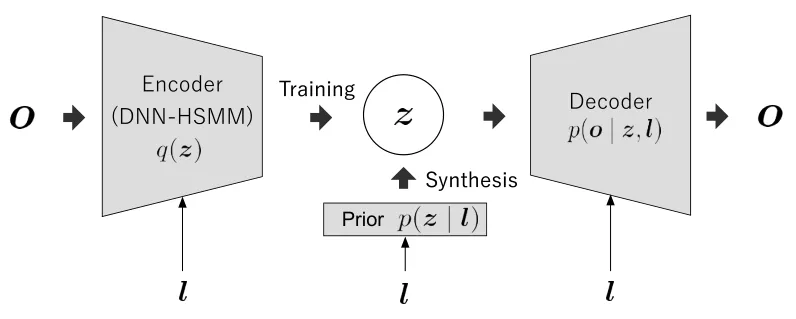
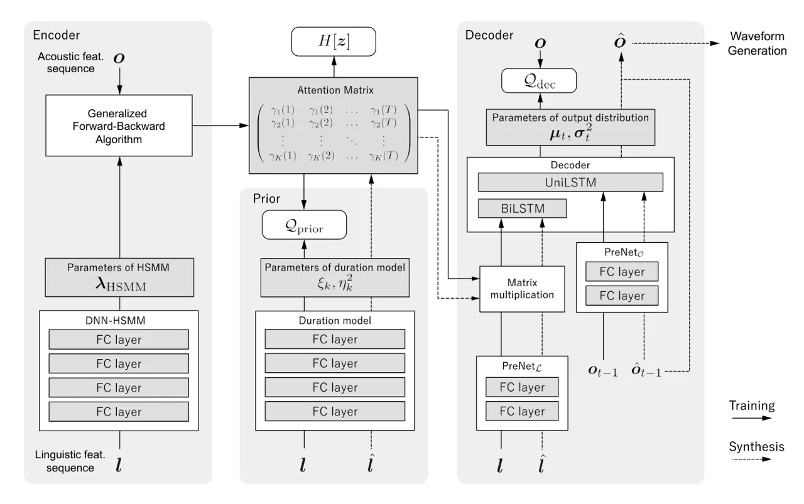

# Neural Sequence-to-Sequence Speech Synthesis Using a Hidden Semi-Markov Model Based Structured Attention Mechanism

Yoshihiko Nankaku, Kenta Sumiya, Takenori Yoshimura, Shinji Takaki, Kei
Hashimoto, Keiichiro Oura and Keiichi Tokuda

###### Abstract

This paper proposes a novel Sequence-to-Sequence (Seq2Seq) model
integrating the structure of Hidden Semi-Markov Models (HSMMs) into its
attention mechanism. In speech synthesis, it has been shown that methods
based on Seq2Seq models using deep neural networks can synthesize high
quality speech under the appropriate conditions. However, several
essential problems still have remained, i.e., requiring large amounts of
training data due to an excessive degree for freedom in alignment
(mapping function between two sequences), and the difficulty in handling
duration due to the lack of explicit duration modeling. The proposed
method defines a generative model to realize the simultaneous
optimization of alignments and model parameters based on the Variational
Auto-Encoder (VAE) framework, and provides monotonic alignments and
explicit duration modeling based on the structure of HSMM. The proposed
method can be regarded as an integration of Hidden Markov Model (HMM)
based speech synthesis and deep learning based speech synthesis using
Seq2Seq models, incorporating both the benefits. Subjective evaluation
experiments showed that the proposed method obtained higher mean opinion
scores than Tacotron 2 on relatively small amount of training data.

###### Index Terms: 

Speech Synthesis, Deep Neural Networks, Attention Mechanism, Hidden
Semi-Markov Models, Sequence-to-Sequence Models

^(†)^(†)address: Nagoya Institute of Technology, Japan

## 1 Introduction

There has been much recent research on end-to-end text-to-speech
synthesis based on neural networks. In essence, text-to-speech synthesis
is a sequence transform generating a sequence of acoustic features from
a sequence of characters. Therefore, it is well-suited to using a
Sequence-to-Sequence (Seq2Seq) model with an attention mechanism that
infers the relationship (alignment) between the sequences \[1\].
Although it has been shown that methods based on Seq2Seq models can
synthesize high quality speech under the appropriate conditions,
critical problems still have remained, i.e., requiring large amounts of
training data due to an excessive degree for freedom in alignment
obtained from the attention mechanism, and the difficulty in handling
duration because explicit alignment information cannot be obtained. To
overcome these problems, some improved techniques have been proposed
recently, e.g., applying constraints to attention which tends to yield
monotonic alignment \[2, 3\], and incorporating explicit alignment
and/or duration to Seq2Seq models \[4, 5, 6\]. However, no method has
yet been established that can perform overall optimization of both
alignment and model parameters while also considering duration.

An important fact to be noticed is that above mentioned problems were
appropriately solved in the conventional speech synthesis based on
hidden Markov models (HMM-based speech synthesis). HMM-based speech
synthesis uses a hidden semi-Markov model (HSMM), which is an HMM
incorporating a state duration model, with state sequence as a latent
variable representing alignment, and performing simultaneous
optimization while also considering duration. In this paper, we propose
a speech synthesis technique based on a Seq2Seq model with attention
mechanism incorporating an HSMM structure. The proposed method is
composed of a generative model based on a variational auto-encoder (VAE)
\[7\], in which the alignment between input and output sequences is
represented as latent variables as HSMM. The proposed method can also be
interpreted as one of forms of structured attention \[8\] using HSMM.
The alignment obtained by the proposed method is monotonic and
consistent over an entire sequence, therefore it is expected to be able
to build high quality systems using less training data than the
conventional Seq2Seq models. Moreover, since duration is handled
explicitly in the proposed model, it can be controlled in speech
synthesis. The proposed method can be regarded as an integration of
previous HMM-based speech synthesis and recent deep learning based
speech synthesis using Seq2Seq models, incorporating both the benefits.

## 2 Related Work

### 2.1 Seq2Seq models with an attention mechanism

Sequence-to-Sequence models using an attention mechanism \[9\] can learn
the time correspondence relationship between two sequences of different
lengths, and have been used in end-to-end speech synthesis models such
as Tacotron 2 \[1\]. These models are composed of three main elements:
an encoder, a decoder, and an attention mechanism. The attention
mechanism probabilistically selects an encoder hidden state for each
decoder time step, which enables it to obtain suitable latent
representations for sequences of various lengths. The context vector
$`\bm{c}_{i}`$, obtained by the attention mechanism for time $`i`$ is
represented by a weighted sum of encoder hidden states $`\bm{h}_{j}`$ as
follows.

```math
\bm{c}_{i}=\sum_{j=1}^{N}\alpha_{ij}\bm{h}_{j} \tag{1}
```

where $`\sum_{j}\alpha_{ij}=1`$, $`N`$ is the input sequence length, and
$`\alpha_{ij}`$ are probabilities representing the degree of attention
on the $`j`$th hidden state $`\bm{h}_{j}`$ in the encoder, computed from
$`\bm{h}_{j}`$ and the $`i-1`$th state in the decoder. Attention
corresponds to the alignment between linguistic and acoustic feature
sequences in speech synthesis, and can be obtained automatically through
training. However, the above mentioned attention mechanism has excessive
degree of freedom in matching function between two sequence and requires
suitable constraints to keep monotonic alignment in speech synthesis.
Moreover, estimating matching function does not take into account of the
duration of units in linguistic feature sequences, e.g., phones.

### 2.2 DNN-HSMM

A hidden semi-Markov models (HSMM) is a HMM incorporating a duration
model, and its likelihood function is given as follows.

```math
\displaystyle p(\bm{o}\mid\bm{l},\bm{\lambda}_{\text{HSMM}})=\sum_{\bm{z}}p(\bm{o},\bm{z}\mid\bm{l}) \tag{2}
```

```math
\displaystyle= \displaystyle\sum_{\bm{z}}\left\{\prod_{t=1}^{T}p(\bm{o}_{t}\mid z_{t},\bm{l})\prod_{k=1}^{K}p(d_{k}\mid\bm{l})\right\} \tag{3}
```

where $`\bm{o}=(\bm{o}_{1},\bm{o}_{2},\ldots,\bm{o}_{T})`$, and
$`\bm{l}=(\bm{l}_{1},\bm{l}_{2},\ldots,\bm{l}_{K})`$ represent acoustic
and linguistic feature values respectively, and $`\bm{z}`$ represents
the state sequence for alignment. State duration, $`d_{k}`$ represents
the duration of each state, $`k`$ in $`\bm{z}`$.

```math
\displaystyle\bm{z} \displaystyle= \displaystyle\left(z_{1},z_{2},\ldots,z_{T}\right) \tag{4}
```

```math
\displaystyle= \displaystyle(\underbrace{S_{1},\ldots,S_{1}}_{\times d_{1}},\underbrace{S_{2},\ldots,S_{2}}_{\times d_{2}},\ldots,\underbrace{S_{K},\ldots,S_{K}}_{\times d_{K}}) \tag{5}
```

Usually the parameters of HSMM are optimized by the
expectation-maximization (EM) algorithm for the maximum likelihood
estimates. The algorithm iteratively updates the the posterior
probability distribution $`p(\bm{z}\mid\bm{o},\bm{l})`$ and model
parameters $`\bm{\lambda}_{\text{HSMM}}`$, and the posterior probability
can be efficiently computed using a generalized forward-backward
algorithm \[11\]. A DNN-HSMM \[10\] has been proposed as a statistical
model for incorporating the qualities of an HSMM, i.e., handling
duration appropriately, into a neural network. In the DNN-HSMM, the
neural network takes linguistic features as input and generates HSMM
model parameters. Taking both output and duration probabilities as
Gaussian distributions, this yields:

```math
\displaystyle p(\bm{o}_{t}\mid z_{t}=k,\bm{l}) \displaystyle= \displaystyle{\cal N}(\bm{o}_{t}\mid\bm{\mu}_{k},\bm{\sigma}^{2}_{k}) \tag{6}
```

```math
\displaystyle p(d_{k}\mid\bm{l}) \displaystyle= \displaystyle{\cal N}(d_{k}\mid{\xi}_{k},{\eta}_{k}^{2}) \tag{7}
```

```math
\displaystyle\left\{\bm{\mu}_{k},\bm{\sigma}^{2}_{k},{\xi}_{k},{\eta}_{k}^{2}\right\} \displaystyle= \displaystyle\text{DNN}(\bm{l}_{k}) \tag{8}
```

This achieves a more flexible mapping from linguistic features to model
parameters than the decision-tree-based clustering used in HMM-based
speech synthesis, while duration and alignment can be appropriately
handled within the framework of statistical generative models. However,
due to the limitation that final acoustic features $`\bm{o}`$ are
generated by the HSMM, quality is somewhat inferior compared with recent
Seq2Seq models.

## 3 Proposed Method

### 3.1 HSMM based structured attention



Figure 1: VAE based structured attention



Figure 2: Proposed model structure

This paper proposes a novel Seq2Seq model based on an attention
mechanism integrating the structure of HSMM. The method defines a
generative model based on a variational auto-encoder (VAE) \[7\]
framework, in which the alignment between acoustic feature and
linguistic feature sequences is represented by the discrete latent
variable sequence corresponding to HSMM states. An overview of the
method is shown in Figure 1. We first define an evidence lower bound
(ELBO) based on the likelihood function $`p(\bm{o}\mid\bm{l})`$;

```math
\displaystyle\log p(\bm{o}\mid\bm{l})=\log\sum_{\bm{z}}p(\bm{o},\bm{z}\mid\bm{l}) \tag{9}
```

```math
\displaystyle\geq \displaystyle\sum_{\bm{z}}q(\bm{z})\log\frac{p(\bm{o},\bm{z}\mid\bm{l})}{q(\bm{z})} \tag{10}
```

```math
\displaystyle= \displaystyle\sum_{\bm{z}}q(\bm{z})\log p(\bm{o}\mid\bm{z},\bm{l})+\sum_{\bm{z}}q(\bm{z})\log p(\bm{z}\mid\bm{l})
```

```math
\displaystyle-\sum_{\bm{z}}q(\bm{z})\log q(\bm{z}) \tag{11}
```

```math
\displaystyle= \displaystyle\mathcal{L}_{\text{ELBO}} \tag{12}
```

where $`q(\bm{z})`$ and $`p(\bm{o}\mid\bm{z},\bm{l})`$ are the encoder
and decoder respectively, composed of separate neural networks. Usually,
prior distribution $`p(\bm{z}\mid\bm{l})`$ is set to a particular
distribution beforehand, e.g., a normal distribution. In the proposed
method, we assume it consists of a neural network that will be trained.

The VAE optimizes the neural network by maximizing the evidence lower
bound $`\mathcal{L}_{\text{ELBO}}`$. In the proposed model, latent
variable $`\bm{z}`$ represents a discrete state sequence similarly to an
HSMM, and the approximate posterior distribution $`q(\bm{z})`$
represented by the encoder is assumed to be composed of a DNN-HSMM:

```math
\displaystyle q(\bm{z}) \displaystyle= \displaystyle p(\bm{z}\mid\bm{o},\bm{\lambda}_{\text{HSMM}}) \tag{13}
```

```math
\displaystyle\bm{\lambda}_{\text{HSMM}} \displaystyle= \displaystyle\text{DNN-HSMM}(\bm{l}) \tag{14}
```

In other words, the proposed method uses the HSMM as an estimator for
state posterior probability $`q(\bm{z})`$ while the conventional
DNN-HSMM uses it as a generator of outputs acoustic features $`\bm{o}`$.
Normally, to calculate the ELBO (equation (12)), sampling the latent
variables from the posterior distribution is used in VAEs. However,
since $`\bm{z}`$ is a discrete variable sequence in the proposed method,
the following expectation is used to propagates encoder information to
the decoder

```math
\gamma_{k}(t)=p(z_{t}=k\mid\bm{o},\bm{l})=\sum_{\bm{z}}q(\bm{z})\delta(z_{t},k) \tag{15}
```

It can be clearly seen that $`\gamma_{k}(t)`$ is the attention itself,
that is, $`\gamma_{k}(t)`$ represents the degree of attention on
linguistic feature $`\bm{l}_{k}`$ when generating the frame for time
$`t`$. Even though the calculation of $`\gamma_{k}(t)`$ requires
counting all possible state sequences, it can be efficiently calculated
using a generalized forward-backward algorithm as in DNN-HSMM. This
enables the proposed method to estimate attention based on consistent
alignment over the entire sequences representing monotonic alignment.

From the definition of ELBO, the decoder can be defined as a neural
network with any structure whose inputs are $`\bm{z}`$ and $`\bm{l}`$,
and output is $`\bm{o}`$. However, as mentioned above, assuming
expectation
$`\bm{\gamma}=\left\{\gamma_{k}(t)\mid k=1,\ldots,K,t=1,\dots,T\right\}`$
instead of $`\bm{z}`$ is passed from the encoder, it means that the
decoder has the following approximation.

```math
\displaystyle\sum_{\bm{z}}q(\bm{z})\log p(\bm{o}\mid\bm{z},\bm{l}) \displaystyle\approx \displaystyle\log p(\bm{o}\mid\bm{\gamma},\bm{l}) \tag{16}
```

Moreover, by applying the structure similar to a conventional attention
mechanism, the exact same form as the decoder in Seq2Seq models:

```math
\displaystyle\log p(\bm{o}\mid\bm{\gamma},\bm{l}) \displaystyle= \displaystyle\log p(\bm{o}\mid\Braket{\bm{l}}) \tag{17}
```

```math
\displaystyle\Braket{\bm{l}} \displaystyle= \displaystyle(\Braket{\bm{l}_{1}},\Braket{\bm{l}_{2}},\ldots,\Braket{\bm{l}_{T}}) \tag{18}
```

```math
\displaystyle\Braket{\bm{l}_{t}} \displaystyle= \displaystyle\sum_{k=1}^{K}{\gamma_{k}{(t)}}f(\bm{l}_{k}) \tag{19}
```

where $`f(\cdot)`$ is the decoder PreNet (corresponding to the encoder
in the Seq2Seq model), and $`\Braket{\bm{l}_{t}}`$ is the context
vector. To perform the back-propagation to the encoder parameters,
although the original VAEs use the re-parameterization trick \[7\], the
proposed method can directly apply the back-propagation to the encoder
parameters through expectation $`\bm{\gamma}`$, because $`\bm{\gamma}`$
are composed of encoder parameters (HSMM).

The detailed structure of the proposed model is shown in Figure 2. In
the figure, $`\mathcal{Q}_{\text{dec}}`$, $`\mathcal{Q}_{\text{prior}}`$
and $`H[\bm{z}]`$ correspond to the terms in Equation (9), and are
computed as follows.

```math
\displaystyle\mathcal{Q}_{\text{dec}} \displaystyle= \displaystyle\log p(\bm{o}\mid\Braket{\bm{l}}) \tag{20}
```

```math
\displaystyle\mathcal{Q}_{\text{prior}} \displaystyle= \displaystyle\sum_{t=1}^{T}\sum_{d=1}^{D}\sum_{k=1}^{K}\gamma_{k}^{(d)}(t)\log p(d\mid\bm{l}_{k}) \tag{21}
```

```math
\displaystyle H[\bm{z}] \displaystyle= \displaystyle-\sum_{t=1}^{T}\sum_{k=1}^{K}{\gamma_{k}}(t)\log{\gamma_{k}}(t) \tag{22}
```

where $`\gamma_{k}^{(d)}(t)`$ is the probability that state $`k`$ is
continuously selected in the time interval from $`t-d`$ to $`t`$, and
can be computed similarly to $`\gamma_{k}(t)`$ by using the generalized
forward-backward algorithm. It is assumed that decoder
$`p(\bm{o}\mid\Braket{\bm{l}})`$ and prior distribution
$`p(d\mid\bm{l}_{k})`$ are Gaussian distributions whose parameters are
generated from the corresponding neural networks,
$`\text{Decoder}(\cdot)`$ and $`\text{Prior}(\cdot)`$, respectively.

```math
\displaystyle p(\bm{o}\mid\Braket{\bm{l}}) \displaystyle= \displaystyle\prod_{t=1}^{T}{\cal N}(\bm{o}_{t}\mid\bm{\mu}_{t},\bm{\sigma}^{2}_{t}) \tag{23}
```

```math
\displaystyle\left\{\bm{\mu}_{t},\bm{\sigma}^{2}_{t}\right\} \displaystyle= \displaystyle\text{Decoder}(\Braket{\bm{l}_{t}},h(\bm{o}_{t-1})) \tag{24}
```

```math
\displaystyle p(d_{k}\mid\bm{l}_{k}) \displaystyle= \displaystyle{\cal N}(d_{k}\mid{\xi}_{k},{\eta}_{k}^{2}) \tag{25}
```

```math
\displaystyle\left\{{\xi}_{k},{\eta}_{k}^{2}\right\} \displaystyle= \displaystyle\text{Prior}(\bm{l}_{k}) \tag{26}
```

For the decoder, even though any type of decoder can be used, e.g. LSTM
or a recent feed-forward Transformer \[4, 5\], this paper used an
autoregressive structure for comparison with Tactron 2. In the equation,
$`h(\cdot)=\text{PreNet}_{\mathcal{O}}(\cdot)`$ represents the
auto-regression PreNet. The prior distribution is configured as a neural
network separate from the encoder, but it shares parameters with the
encoder, and the duration distribution can also be used as the prior
distribution in the HSMM.

During the synthesis stage, the likely state sequence is computed from
prior distribution and encoder by:

```math
\hat{\bm{z}}=\arg\max_{\bm{z}}\prod_{k=1}^{K}{\cal N}(d_{k}\mid{\xi}_{k},{\eta}_{k}^{2})\\
 \tag{27}
```

The decoder generates acoustic features, driven using attention composed
of this $`\hat{\bm{z}}`$.

## 4 Evaluation

### 4.1 Experimental Conditions

To show the effectiveness of the proposed method, experiments were
conducted using speech data from a single male speaker. The speech
database consists of 503 Japanese sentences; 450 sentences were used as
training data, and remaining 53 sentences were used as test data. The
sampling rate of the speech data was 48 kHz. Three methods in addition
to the proposed method (PROPOSED) were compared; DNN-HSMM (DNN-HSMM),
Tacotron 2 (TACO), and a frame-unit acoustic model (FRAME). The target
acoustic features to be modeled included a 50-dimensional mel-cepstrum
coefficient vector extracted by STRAIGHT analysis \[12\], the
log-fundamental frequency, V/UV, and a 25-dimensional aperiodicity
features. For DNN-HSMM and PROPOSED, acoustic features with their
dynamic features were assumed to be generated from the HSMM. The HSMMs
had five states, structured left-to-right with no skips. As an input
feature vector, a 386-dimensional phoneme-unit linguistic feature was
used for TACO, and a 388-dimensional state-unit linguistic feature with
a phoneme internal state index was used for DNN-HSMM and PROPOSED. For
FRAME, we used a 394-dimensional frame-unit linguistic feature
consisting of the state-unit linguistic feature, using DNN-HSMM for
alignment and adding items including a position number within the state
segment and duration context. During synthesis in FRAME, the duration
estimated by DNN-HSMM was used. The model structure for DNN-HSMM is
similar to the encoder part of the proposed method (Figure 2), and
trained based on the maximizing likelihood criterion. The model
structure of TACO was adopted from the reference \[1\], replacing the
embedding layer with a linear transform and adding guided attention loss
($`g=0.2`$) \[3\] for training. The reduction factor of 3 was used, and
only monophone labels were enabled in the initial stage of training. The
decoder in the FRAME was the same as for the proposed method (Figure 2),
and training was conducted with the frame-unit linguistic feature as
input to the $`\text{PreNet}_{\mathcal{L}}(\cdot)`$. From preliminary
test results, the prior distribution and encoder duration model were
shared in PROPOSED. In the training procedure for PROPOSED, initial
training of the decoder was performed with setting the trained DNN-HSMM
to the encoder and then an overall optimization was conducted.
Adam\[13\] was used as the optimization algorithm for all training in
all methods.

### 4.2 Subjective Evaluation

Figure 3: Subjective evaluation results

The naturalness of synthesized speech was evaluated using Mean Opinion
Score (MOS) tests. For each of ten subjects, 15 sentences from the test
data were selected at random and evaluated in 5-scale scores. The
results of subjective evaluation are shown in Figure 3. The figure shows
that the PROPOSED received the highest score for naturalness, confirming
that the method is effective. In particular, PROPOSED obtained a higher
score than FRAME using the same decoder structure. This suggests that
the simultaneous optimization of alignment and model parameters was
effective in the proposed method. Comparing PROPOSED and DNN-HSMM, a
clear improvement of PROPOSED suggests that the flexible autoregressive
decoder structure contributed significantly to improving naturalness.
Because of the relatively small amount of training data, TACO obtained
poor alignment accuracy due to its over degree of freedom in attention,
and the proposed method was able to achieve suitable alignment due to
the suitable structured attention.

## 5 Conclusion

This paper proposed a method for Seq2Seq modeling using structured
attention based on HSMM. The proposed method is formulated based on a
VAE framework, and can be regarded as an integration form of the
conventional HMM speech synthesis and a neural network based Seq2Seq
model. Experimental results showed improvement in naturalness of
synthesized speech due to the simultaneous optimization of alignment and
model parameters based on VAE framework. The robust alignment estimation
based on the appropriate structure constraint using HSMM also
contributes to the quality of synthesized speech especially on the small
amount of training data. Future work includes evaluation using larger
speech database and application to fully end-to-end speech synthesis and
to multiple speaker models.

## References

- \[1\] J. Shen, et al.,“Natural TTS synthesis by conditioning WaveNet
  on mel spectrogram predictions,” Proc. ICASSP, pp. 4779-4783, 2018.
- \[2\] J.-X. zhang, et al.,“Forward attention in sequence-to-sequence
  acoustic modeling for speech synthesis,” Proc. ICASSP, pp.
  4789-4793, 2018.
- \[3\] H. Tachibana, et al.,“Efficiently trainable text-to-speech
  system based on deep convolutional networks with guided attention,”
  Proc. ICASSP, pp. 4784-4788, 2018.
- \[4\] Y. Ren, et al.,“FastSpeech: Fast, robust and controllable text
  to speech,” Proc. NIPS, pp. 3165-3174, 2019.
- \[5\] Z. zeng, et al.,“AlignTTS: Efficient feed-forward
  text-to-speech system without explicit alignment,” Proc. ICASSP, pp.
  6714-6718, 2020.
- \[6\] Y. Yasuda, et al.,“End-to-end text-to-speech using latent
  duration based on VQ-VAE,” arXiv:2010.09602, 2020.
- \[7\] D. P. Kingma, et al., “Auto-encoding variational bayes,” Proc.
  ICLR, 2014.
- \[8\] Y. Kim, et al.,“Structured attention networks,” Proc.
  ICLR, 2017.
- \[9\] D. Bahdanau, et al.,“Neural machine translation by jointly
  learning to align and translate,” Proceedings of the 3rd International
  Conference on Learning Representations (ICLR), 2015.
- \[10\] Keiichi Tokuda, et al., “Temporal modeling in neural network
  based statistical parametric speech synthesis,” 9th ISCA Speech
  Synthesis Workshop, pp. 113-118, 2016.
- \[11\] Heiga Zen, et al., “A hidden semi-Markov model-based speech
  synthesis system,” IEICE Transactions on Information & Systems,
  vol.E90-D, no.5, pp.825-834, 2007.
- \[12\] H. Kawahara, et al., “Restructuing speech representations
  using a pitch-adaptive time-frequency smoothing and an
  instantaneous-frequency-based F0 extraction: Possible role of a
  repetitive structure in sounds,” Speech Communcation, vol. 27, no. 3,
  pp. 187-207, 1999.
- \[13\] Diederik P. Kingma and Jimmy Lei Ba. “Adam: A method for
  stochastic optimization,” Proceedings of the 3rd International
  Conference on Learning Representations (ICLR), 2015.
