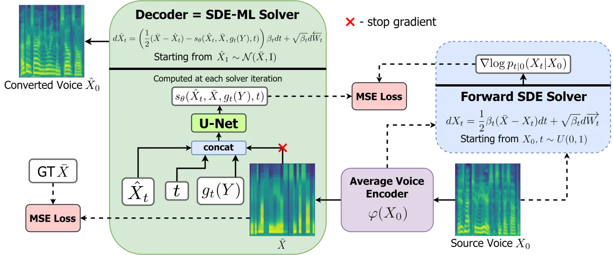
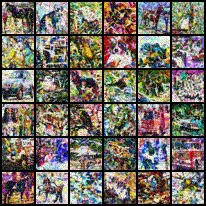
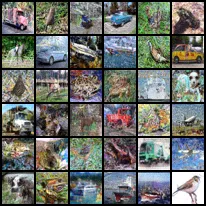
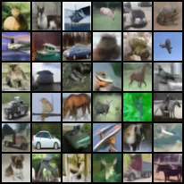
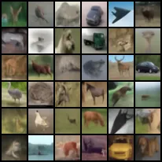

# Diffusion-Based Voice Conversion with Fast Maximum Likelihood Sampling Scheme

Vadim Popov    Ivan Vovk    Vladimir Gogoryan Affiliation: Huawei Noah’s
Ark Lab, Moscow, Russia
Email: [{vadim.popov,vovk.ivan,gogoryan.vladimir}@huawei.com](mailto:)
   Tasnima Sadekova    Mikhail Kudinov & Jiansheng Wei
Affiliation: Huawei Noah’s Ark Lab, Moscow, Russia
Email: [{sadekova.tasnima,kudinov.mikhail,weijiansheng}@huawei.com](mailto:)

###### Abstract

Voice conversion is a common speech synthesis task which can be solved
in different ways depending on a particular real-world scenario. The
most challenging one often referred to as one-shot many-to-many voice
conversion consists in copying target voice from only one reference
utterance in the most general case when both source and target speakers
do not belong to the training dataset. We present a scalable
high-quality solution based on diffusion probabilistic modeling and
demonstrate its superior quality compared to state-of-the-art one-shot
voice conversion approaches. Moreover, focusing on real-time
applications, we investigate general principles which can make diffusion
models faster while keeping synthesis quality at a high level. As a
result, we develop a novel Stochastic Differential Equations solver
suitable for various diffusion model types and generative tasks as shown
through empirical studies and justify it by theoretical analysis. The
code is publicly available at
[https://github.com/huawei-noah/Speech-Backbones/tree/main/DiffVC](https://github.com/huawei-noah/Speech-Backbones/tree/main/DiffVC).

|     |
| --- |
|     |

## 1 Introduction

Voice conversion (VC) is the task of copying the target speaker’s voice
while preserving the linguistic content of the utterance pronounced by
the source speaker. Practical VC applications often require a model
which is able to operate in one-shot mode (i.e. when only one reference
utterance is provided to copy the target speaker’s voice) for any source
and target speakers. Such models are usually referred to as one-shot
many-to-many models (or sometimes zero-shot many-to-many models, or just
any-to-any VC models). It is challenging to build such a model since it
should be able to adapt to a new unseen voice having only one spoken
utterance pronounced with it, so it was not until recently that
successful one-shot VC solutions started to appear.

Conventional one-shot VC models are designed as autoencoders whose
latent space ideally contains only the linguistic content of the encoded
utterance while target voice identity information (usually taking shape
of speaker embedding) is fed to the decoder as conditioning. Whereas in
the pioneering AutoVC model (Qian et al., 2019) only speaker embedding
from the pre-trained speaker verification network was used as
conditioning, several other models improved on AutoVC enriching
conditioning with phonetic features such as pitch and loudness (Qian
et al., 2020; Nercessian, 2020), or training voice conversion and
speaker embedding networks jointly (Chou & Lee, 2019). Also, several
papers (Lin et al., 2021; Ishihara & Saito, 2020; Liu et al., 2021b)
made use of attention mechanism to better fuse specific features of the
reference utterance into the source utterance thus improving the decoder
performance. Apart from providing the decoder with sufficiently rich
information, one of the main problems autoencoder VC models face is to
disentangle source speaker identity from speech content in the encoder.
Some models (Qian et al., 2019; Qian et al., 2020; Nercessian, 2020)
solve this problem by introducing an information bottleneck. Among other
popular solutions of the disentanglement problem one can mention
applying vector quantization technique to the content information (Wu
et al., 2020; Wang et al., 2021), utilizing features of Variational
AutoEncoders (Luong & Tran, 2021; Saito et al., 2018; Chou & Lee, 2019),
introducing instance normalization layers (Chou & Lee, 2019; Chen
et al., 2021b), and using Phonetic Posteriorgrams (PPGs) (Nercessian,
2020; Liu et al., 2021b).

The model we propose in this paper solves the disentanglement problem by
employing the encoder predicting “average voice”: it is trained to
transform mel features corresponding to each phoneme into mel features
corresponding to this phoneme averaged across a large multi-speaker
dataset. As for decoder, in our VC model, it is designed as a part of a
Diffusion Probabilistic Model (DPM) since this class of generative
models has shown very good results in speech-related tasks like raw
waveform generation (Chen et al., 2021a; Kong et al., 2021) and mel
feature generation (Popov et al., 2021; Jeong et al., 2021). However,
this decoder choice poses a problem of slow inference because DPM
forward pass scheme is iterative and to obtain high-quality results it
is typically necessary to run it for hundreds of iterations (Ho et al.,
2020; Nichol & Dhariwal, 2021). Addressing this issue, we develop a
novel inference scheme that significantly reduces the number of
iterations sufficient to produce samples of decent quality and does not
require model re-training. Although several attempts have been recently
made to reduce the number of DPM inference steps (Song et al., 2021a;
San-Roman et al., 2021; Watson et al., 2021; Kong & Ping, 2021; Chen
et al., 2021a), most of them apply to some particular types of DPMs. In
contrast, our approach generalizes to all popular kinds of DPMs and has
a strong connection with likelihood maximization.

This paper has the following structure: in Section 2 we present a
one-shot many-to-many VC model and describe DPM it relies on; Section 3
introduces a novel DPM sampling scheme and establishes its connection
with likelihood maximization; the experiments regarding voice conversion
task as well as those demonstrating the benefits of the proposed
sampling scheme are described in Section 4; we conclude in Section 5.

## 2 Voice conversion diffusion model

As with many other VC models, the one we propose belongs to the family
of autoencoders. In fact, any conditional DPM with data-dependent prior
(i.e. terminal distribution of forward diffusion) can be seen as such:
forward diffusion gradually adding Gaussian noise to data can be
regarded as encoder while reverse diffusion trying to remove this noise
acts as a decoder. DPMs are trained to minimize the distance (expressed
in different terms for different model types) between the trajectories
of forward and reverse diffusion processes thus, speaking from the
perspective of autoencoders, minimizing reconstruction error.
Data-dependent priors have been proposed by Popov et al. (2021) and Lee
et al. (2021), and we follow the former paper due to the flexibility of
the continuous DPM framework used there. Our approach is summarized in
Figure 1.



Figure 1: VC model training and inference. $`Y`$ stands for the training
mel-spectrogram at training and the target mel-spectrogram at inference.
Speaker conditioning in the decoder is enabled by the speaker
conditioning network $`g_{t}(Y)`$ where $`Y=\{Y_{t}\}_{t\in[0,1]}`$ is
the whole forward diffusion trajectory starting at $`Y_{0}`$. Dotted
arrows denote operations performed only at training.

### 2.1 Encoder

We choose average phoneme-level mel features as speaker-independent
speech representation. To train the encoder to convert input
mel-spectrograms into those of “average voice”, we take three steps: (i)
first, we apply Montreal Forced Aligner (McAuliffe et al., 2017) to a
large-scale multi-speaker LibriTTS dataset (Zen et al., 2019) to align
speech frames with phonemes; (ii) next, we obtain average mel features
for each particular phoneme by aggregating its mel features across the
whole LibriTTS dataset; (iii) the encoder is then trained to minimize
mean square error between output mel-spectrograms and ground truth
“average voice” mel-spectrograms (i.e. input mel-spectrograms where each
phoneme mel feature is replaced with the average one calculated on the
previous step).

The encoder has exactly the same Transformer-based architecture used in
Grad-TTS (Popov et al., 2021) except that its inputs are mel features
rather than character or phoneme embeddings. Note that unlike Grad-TTS
the encoder is trained separately from the decoder described in the next
section.

### 2.2 Decoder

Whereas the encoder parameterizes the terminal distribution of the
forward diffusion (i.e. the prior), the reverse diffusion is
parameterized with the decoder. Following Song et al. (2021c) we use Itô
calculus and define diffusions in terms of stochastic processes rather
than discrete-time Markov chains.

The general DPM framework we utilize consists of forward and reverse
diffusions given by the following Stochastic Differential Equations
(SDEs):

```math
dX_{t}=\frac{1}{2}\beta_{t}(\bar{X}-X_{t})dt+\sqrt{\beta_{t}}d\overrightarrow{W_{t}}\ , \tag{1}
```

```math
d\hat{X}_{t}=\left(\frac{1}{2}(\bar{X}-\hat{X}_{t})-s_{\theta}(\hat{X}_{t},\bar{X},t)\right)\beta_{t}dt+\sqrt{\beta_{t}}d\overleftarrow{W_{t}}\ , \tag{2}
```

where $`t\in[0,1]`$, $`\overrightarrow{W}`$ and $`\overleftarrow{W}`$
are two independent Wiener processes in $`\mathbb{R}^{n}`$,
$`\beta_{t}`$ is non-negative function referred to as noise schedule,
$`s_{\theta}`$ is the score function with parameters $`\theta`$ and
$`\bar{X}`$ is $`n`$-dimensional vector. It can be shown (Popov et al., 2021) that the forward SDE (1) allows for explicit solution:

```math
\Law(X_{t}|X_{0})=\mathcal{N}\left(e^{-\frac{1}{2}\int_{0}^{t}{\beta_{s}ds}}X_{0}+\left(1-e^{-\frac{1}{2}\int_{0}^{t}{\beta_{s}ds}}\right)\bar{X},\left(1-e^{-\int_{0}^{t}{\beta_{s}ds}}\right)\ide\right), \tag{3}
```

where $`\ide`$ is $`n\times n`$ identity matrix. Thus, if noise follows
linear schedule $`\beta_{t}=\beta_{0}+t(\beta_{1}-\beta_{0})`$ for
$`\beta_{0}`$ and $`\beta_{1}`$ such that
$`e^{-\int_{0}^{1}{\beta_{s}ds}}`$ is close to zero, then
$`\Law{(X_{1})}`$ is close to $`\mathcal{N}(\bar{X},\ide)`$ which is the
prior in this DPM. The reverse diffusion (2) is trained by minimizing
weighted $`L_{2}`$ loss:

```math
\theta^{*}=\argmin_{\theta}{\mathcal{L}(\theta)}=\argmin_{\theta}{\int_{0}^{1}{\lambda_{t}\mathbb{E}_{X_{0},X_{t}}\|s_{\theta}(X_{t},\bar{X},t)-\nabla{\log{p_{t|0}(X_{t}|X_{0})}}\|_{2}^{2}}}dt, \tag{4}
```

where $`p_{t|0}(X_{t}|X_{0})`$ is the probability density function (pdf)
of the conditional distribution (3) and
$`\lambda_{t}=1-e^{-\int_{0}^{t}{\beta_{s}ds}}`$. The distribution (3)
is Gaussian, so we have

```math
\nabla\log{p_{t|0}(X_{t}|X_{0})}=-\frac{X_{t}-X_{0}e^{-\frac{1}{2}\int_{0}^{t}{\beta_{s}ds}}-\bar{X}(1-e^{-\frac{1}{2}\int_{0}^{t}{\beta_{s}ds}})}{1-e^{-\int_{0}^{t}{\beta_{s}ds}}}. \tag{5}
```

At training, time variable $`t`$ is sampled uniformly from $`[0,1]`$,
noisy samples $`X_{t}`$ are generated according to the formula (3) and
the formula (5) is used to calculate loss function $`\mathcal{L}`$ on
these samples. Note that $`X_{t}`$ can be sampled without the necessity
to calculate intermediate values $`\{X_{s}\}_{0<s<t}`$ which makes
optimization task (4) time and memory efficient. A well-trained reverse
diffusion (2) has trajectories that are close to those of the forward
diffusion (1), so generating data with this DPM can be performed by
sampling $`\hat{X}_{1}`$ from the prior $`\mathcal{N}(\bar{X},\ide)`$
and solving SDE (2) backwards in time.

The described above DPM was introduced by Popov et al. (2021) for
text-to-speech task and we adapt it for our purposes. We put
$`\bar{X}=\varphi(X_{0})`$ where $`\varphi`$ is the encoder, i.e.
$`\bar{X}`$ is the “average voice” mel-spectrogram which we want to
transform into that of the target voice. We condition the decoder
$`s_{\theta}=s_{\theta}(\hat{X}_{t},\bar{X},g_{t}(Y),t)`$ on some
trainable function $`g_{t}(Y)`$ to provide it with information about the
target speaker ($`Y`$ stands for forward trajectories of the target
mel-spectrogram at inference and the ones of the training
mel-spectrogram at training). This function is a neural network trained
jointly with the decoder. We experimented with three input types for
this network:

- •
  d-only – the input is the speaker embedding extracted from the target
  mel-spectrogram $`Y_{0}`$ with the pre-trained speaker verification
  network employed in (Jia et al., 2018);
- •
  wodyn – in addition, the noisy target mel-spectrogram $`Y_{t}`$ is
  used as input;
- •
  whole – in addition, the whole dynamics of the target mel-spectrogram
  under forward diffusion $`\{Y_{s}|s=0.5/15,1.5/15,..,14.5/15\}`$ is
  used as input.

The decoder architecture is based on U-Net (Ronneberger et al., 2015)
and is the same as in Grad-TTS but with four times more channels to
better capture the whole range of human voices. The speaker conditioning
network $`g_{t}(Y)`$ is composed of $`2`$D convolutions and MLPs and
described in detail in Appendix H. Its output is $`128`$-dimensional
vector which is broadcast-concatenated to the concatenation of
$`\hat{X}_{t}`$ and $`\bar{X}`$ as additional $`128`$ channels.

### 2.3 Related VC models

To the best of our knowledge, there exist two diffusion-based voice
conversion models: VoiceGrad (Kameoka et al., 2020) and DiffSVC (Liu
et al., 2021a). The one we propose differs from them in several
important aspects. First, neither of the mentioned papers considers a
one-shot many-to-many voice conversion scenario. Next, these models take
no less than $`100`$ reverse diffusion steps at inference while we pay
special attention to reducing the number of iterations (see Section 3)
achieving good quality with as few as $`6`$ iterations. Furthermore,
VoiceGrad performs voice conversion by running Langevin dynamics
starting from the source mel-spectrogram, thus implicitly assuming that
forward diffusion trajectories starting from the mel-spectrogram we want
to synthesize are likely to pass through the neighborhood of the source
mel-spectrogram on their way to Gaussian noise. Such an assumption
allowing to have only one network instead of encoder-decoder
architecture is too strong and hardly holds for real voices. Finally,
DiffSVC performs singing voice conversion and relies on PPGs as
speaker-independent speech representation.

## 3 Maximum likelihood SDE solver

In this section, we develop a fixed-step first-order reverse SDE solver
that maximizes the log-likelihood of sample paths of the forward
diffusion. This solver differs from general-purpose Euler-Maruyama SDE
solver (Kloeden & Platen, 1992) by infinitesimally small values which
can however become significant when we sample from diffusion model using
a few iterations.

Consider the following forward and reverse SDEs defined in Euclidean
space $`\mathbb{R}^{n}`$ for $`t\in[0,1]`$:

```math
dX_{t}=-\frac{1}{2}\beta_{t}X_{t}dt+\sqrt{\beta_{t}}d\overrightarrow{W_{t}}\ \ (F),\ \ \ d\hat{X}_{t}=\left(-\frac{1}{2}\beta_{t}\hat{X}_{t}-\beta_{t}s_{\theta}(\hat{X}_{t},t)\right)dt+\sqrt{\beta_{t}}d\overleftarrow{W_{t}}\ \ (R), \tag{6}
```

where $`\overrightarrow{W}`$ is a forward Wiener process (i.e. its
forward increments $`\overrightarrow{W_{t}}-\overrightarrow{W_{s}}`$ are
independent of $`\overrightarrow{W_{s}}`$ for $`t>s`$) and
$`\overleftarrow{W}`$ is a backward Wiener process (i.e. backward
increments $`\overleftarrow{W_{s}}-\overleftarrow{W_{t}}`$ are
independent of $`\overleftarrow{W_{t}}`$ for $`s<t`$). Following Song
et al. (2021c) we will call DPM (6) Variance Preserving (VP). For
simplicity we will derive maximum likelihood solver for this particular
type of diffusion models. The equation (1) underlying VC diffusion model
described in Section 2 can be transformed into the equation (6-F) by a
constant shift and we will call such diffusion models Mean Reverting
Variance Preserving (MR-VP). VP model analysis carried out in this
section can be easily extended (see Appendices D, E and F) to MR-VP
model as well as to other common diffusion model types such as sub-VP
and VE described by Song et al. (2021c).

The forward SDE (6-F) allows for explicit solution:

```math
\Law(X_{t}|X_{s})=\mathcal{N}(\gamma_{s,t}X_{s},(1-\gamma_{s,t}^{2})\ide),\ \ \ \ \gamma_{s,t}=\exp{\left(-\frac{1}{2}\int_{s}^{t}{\beta_{u}du}\right)}, \tag{7}
```

for all $`0\leq s<t\leq 1`$. This formula is derived by means of Itô
calculus in Appendix A. The reverse SDE (6-R) parameterized with a
neural network $`s_{\theta}`$ is trained to approximate gradient of the
log-density of noisy data $`X_{t}`$:

```math
\theta^{*}=\argmin_{\theta}{\int_{0}^{1}{\lambda_{t}\mathbb{E}_{X_{t}}\|s_{\theta}(X_{t},t)-\nabla{\log{p_{t}(X_{t})}}\|_{2}^{2}}}dt, \tag{8}
```

where the expectation is taken with respect to noisy data distribution
$`\Law(X_{t})`$ with pdf $`p_{t}(\cdot)`$ and $`\lambda_{t}`$ is some
positive weighting function. Note that certain Lipschitz constraints
should be satisfied by coefficients of SDEs (6) to guarantee existence
of strong solutions (Liptser & Shiryaev, 1978), and throughout this
section we assume these conditions are satisfied as well as those from
(Anderson, 1982) which guarantee that paths $`\hat{X}`$ generated by the
reverse SDE (6-R) for the optimal $`\theta^{*}`$ equal forward SDE (6-F)
paths $`X`$ in distribution.

The generative procedure of a VP DPM consists in solving the reverse SDE
(6-R) backwards in time starting from
$`\hat{X}_{1}\sim\mathcal{N}(0,\ide)`$. Common Euler-Maruyama solver
introduces discretization error (Kloeden & Platen, 1992) which may harm
sample quality when the number of iterations is small. At the same time,
it is possible to design unbiased (Henry-Labordère et al., 2017) or even
exact (Beskos & Roberts, 2005) numerical solvers for some particular SDE
types. The Theorem 1 shows that in the case of diffusion models we can
make use of the forward diffusion (6-F) and propose a reverse SDE solver
which is better than the general-purpose Euler-Maruyama one in terms of
likelihood.

The solver proposed in the Theorem 1 is expressed in terms of the values
defined as follows:

```math
\mu_{s,t}=\gamma_{s,t}\frac{1-\gamma_{0,s}^{2}}{1-\gamma_{0,t}^{2}},\ \ \ \ \nu_{s,t}=\gamma_{0,s}\frac{1-\gamma_{s,t}^{2}}{1-\gamma_{0,t}^{2}},\ \ \ \ \sigma_{s,t}^{2}=\frac{(1-\gamma_{0,s}^{2})(1-\gamma_{s,t}^{2})}{1-\gamma_{0,t}^{2}}, \tag{9}
```

```math
\begin{split}\kappa_{t,h}^{*}=&\frac{\nu_{t-h,t}(1-\gamma_{0,t}^{2})}{\gamma_{0,t}\beta_{t}h}-1,\ \ \ \ \omega_{t,h}^{*}=\frac{\mu_{t-h,t}-1}{\beta_{t}h}+\frac{1+\kappa_{t,h}^{*}}{1-\gamma_{0,t}^{2}}-\frac{1}{2},\\
&(\sigma^{*}_{t,h})^{2}=\sigma^{2}_{t-h,t}+\frac{1}{n}\nu_{t-h,t}^{2}\mathbb{E}_{X_{t}}\left[\Tr{\left(\Var{(X_{0}|X_{t})}\right)}\right],\end{split} \tag{10}
```

where $`n`$ is data dimensionality, $`\Var{(X_{0}|X_{t})}`$ is the
covariance matrix of the conditional data distribution
$`\Law(X_{0}|X_{t})`$ (so, $`\Tr(\Var{(X_{0}|X_{t})})`$ is the overall
variance across all $`n`$ dimensions) and the expectation
$`\mathbb{E}_{X_{t}}[\cdot]`$ is taken with respect to the unconditional
noisy data distribution $`\Law(X_{t})`$.

###### Theorem 1.

Consider a DPM characterized by SDEs (6) with reverse diffusion trained
till optimality. Let $`N\in\mathbb{N}`$ be any natural number and
$`h=1/N`$. Consider the following class of fixed step size $`h`$ reverse
SDE solvers parameterized with triplets of real numbers
{$`(\hat{\kappa}_{t,h},\hat{\omega}_{t,h},\hat{\sigma}_{t,h})|t=h,2h,..,1`$}:

```math
\hat{X}_{t-h}=\hat{X}_{t}+\beta_{t}h\left(\left(\frac{1}{2}+\hat{\omega}_{t,h}\right)\hat{X}_{t}+(1+\hat{\kappa}_{t,h})s_{\theta^{*}}(\hat{X}_{t},t)\right)+\hat{\sigma}_{t,h}\xi_{t}, \tag{11}
```

where $`\theta^{*}`$ is given by (8), $`t=1,1-h,..,h`$ and $`\xi_{t}`$
are i.i.d. samples from $`\mathcal{N}(0,\ide)`$. Then:

1.  (i)
    Log-likelihood of sample paths $`X=\{X_{kh}\}_{k=0}^{N}`$ under
    generative model $`\hat{X}`$ is maximized for
    $`\hat{\kappa}_{t,h}=\kappa_{t,h}^{*}`$,
    $`\hat{\omega}_{t,h}=\omega_{t,h}^{*}`$ and
    $`\hat{\sigma}_{t,h}=\sigma^{*}_{t,h}`$.
2.  (ii)
    Assume that the SDE solver (11) starts from random variable
    $`\hat{X}_{1}\sim\Law{(X_{1})}`$. If $`X_{0}`$ is a constant or a
    Gaussian random variable with diagonal isotropic covariance matrix
    (i.e. $`\delta^{2}\ide`$ for $`\delta>0`$), then generative model
    $`\hat{X}`$ is exact for $`\hat{\kappa}_{t,h}=\kappa_{t,h}^{*}`$,
    $`\hat{\omega}_{t,h}=\omega_{t,h}^{*}`$ and
    $`\hat{\sigma}_{t,h}=\sigma^{*}_{t,h}`$.

The Theorem 1 provides an improved DPM sampling scheme which comes at no
additional computational cost compared to standard methods (except for
data-dependent term in $`\sigma^{*}`$ as discussed in Section 4.3) and
requires neither model re-training nor extensive search on noise
schedule space. The proof of this theorem is given in Appendix C. Note
that it establishes optimality of the reverse SDE solver (11) with the
parameters (10) in terms of likelihood of discrete paths
$`X=\{X_{kh}\}_{k=0}^{N}`$ while the optimality of continuous model
(6-R) on continuous paths $`\{X_{t}\}_{t\in[0,1]}`$ is guaranteed for a
model with parameters $`\theta=\theta^{*}`$ as shown in (Song et al.,
2021c).

The class of reverse SDE solvers considered in the Theorem 1 is rather
broad: it is the class of all fixed-step solvers whose increments at
time $`t`$ are linear combination of $`\hat{X}_{t}`$,
$`s_{\theta}(\hat{X}_{t},t)`$ and Gaussian noise with zero mean and
diagonal isotropic covariance matrix. As a particular case it includes
Euler-Maruyama solver ($`\hat{\kappa}_{t,h}\equiv 0`$,
$`\hat{\omega}_{t,h}\equiv 0`$,
$`\hat{\sigma}_{t,h}\equiv\sqrt{\beta_{t}h}`$) and for fixed $`t`$ and
$`h\to 0`$ we have $`\kappa^{*}_{t,h}=\bar{o}(1)`$,
$`\omega^{*}_{t,h}=\bar{o}(1)`$ and
$`\sigma^{*}_{t,h}=\sqrt{\beta_{t}h}(1+\bar{o}(1))`$ (the proof is given
in Appendix B), so the optimal SDE solver significantly differs from
general-purpose Euler-Maruyama solver only when $`N`$ is rather small or
$`t`$ has the same order as $`h`$, i.e. on the final steps of DPM
inference. Appendix G contains toy examples demonstrating the difference
of the proposed optimal SDE solver and Euler-Maruyama one depending on
step size.

The result (ii) from the Theorem 1 strengthens the result (i) for some
particular data distributions, but it may seem useless since in practice
data distribution is far from being constant or Gaussian. However, in
case of generation with strong conditioning (e.g. mel-spectrogram
inversion) the assumptions on the data distribution may become viable:
in the limiting case when our model is conditioned on $`c=\psi(X_{0})`$
for an injective function $`\psi`$, random variable $`X_{0}|c`$ becomes
a constant $`\psi^{-1}(c)`$.

## 4 Experiments

We trained two groups of models: Diff-VCTK models on VCTK (Yamagishi
et al., 2019) dataset containing $`109`$ speakers ($`9`$ speakers were
held out for testing purposes) and Diff-LibriTTS models on LibriTTS (Zen
et al., 2019) containing approximately $`1100`$ speakers ($`10`$
speakers were held out). For every model both encoder and decoder were
trained on the same dataset. Training hyperparameters, implementation
and data processing details can be found in Appendix I. For
mel-spectrogram inversion, we used the pre-trained universal HiFi-GAN
vocoder (Kong et al., 2020) operating at $`22.05`$kHz. All subjective
human evaluation was carried out on Amazon Mechanical Turk (AMT) with
Master assessors to ensure the reliability of the obtained Mean Opinion
Scores (MOS). In all AMT tests we considered unseen-to-unseen conversion
with $`25`$ unseen (for both Diff-VCTK and Diff-LibriTTS) speakers:
$`9`$ VCTK speakers, $`10`$ LibriTTS speakers and $`6`$ internal
speakers. For VCTK source speakers we also ensured that source phrases
were unseen during training. We place other details of listening AMT
tests in Appendix J. A small subset of speech samples used in them is
available at our demo page
[https://diffvc-fast-ml-solver.github.io](https://diffvc-fast-ml-solver.github.io)
which we encourage to visit.

[TABLE]

Table 1: Input types for speaker conditioning $`g_{t}(Y)`$ compared in
terms of speaker similarity.

As for sampling, we considered the following class of reverse SDE
solvers:

```math
\hat{X}_{t-h}=\hat{X}_{t}+\beta_{t}h\left(\left(\frac{1}{2}+\hat{\omega}_{t,h}\right)(\hat{X}_{t}-\bar{X})+(1+\hat{\kappa}_{t,h})s_{\theta}(\hat{X}_{t},\bar{X},g_{t}(Y),t)\right)+\hat{\sigma}_{t,h}\xi_{t}, \tag{12}
```

where $`t=1,1-h,..,h`$ and $`\xi_{t}`$ are i.i.d. samples from
$`\mathcal{N}(0,\ide)`$. For $`\hat{\kappa}_{t,h}=\kappa^{*}_{t,h}`$,
$`\hat{\omega}_{t,h}=\omega^{*}_{t,h}`$ and
$`\hat{\sigma}_{t,h}=\sigma^{*}_{t,h}`$ (where $`\kappa^{*}_{t,h}`$,
$`\omega^{*}_{t,h}`$ and $`\sigma^{*}_{t,h}`$ are given by (10)) it
becomes maximum likelihood reverse SDE solver for MR-VP DPM (1-2) as
shown in Appendix D. In practice it is not trivial to estimate variance
of the conditional distribution $`\Law{(X_{0}|X_{t})}`$, so we skipped
this term in $`\sigma^{*}_{t,h}`$ assuming this variance to be rather
small because of strong conditioning on $`g_{t}(Y)`$ and just used
$`\hat{\sigma}_{t,h}=\sigma_{t-h,t}`$ calling this sampling method ML-N
($`N=1/h`$ is the number of SDE solver steps). We also experimented with
Euler-Maruyama solver EM-N (i.e. $`\hat{\kappa}_{t,h}=0`$,
$`\hat{\omega}_{t,h}=0`$, $`\hat{\sigma}_{t,h}=\sqrt{\beta_{t}h}`$) and
“probability flow sampling” from (Song et al., 2021c) which we denote by
PF-N ($`\hat{\kappa}_{t,h}=-0.5`$, $`\hat{\omega}_{t,h}=0`$,
$`\hat{\sigma}_{t,h}=0`$).

### 4.1 Speaker conditioning analysis

For each dataset we trained three models – one for each input type for
the speaker conditioning network $`g_{t}(Y)`$ (see Section 2.2).
Although these input types had much influence neither on speaker
similarity nor on speech naturalness, we did two experiments to choose
the best models (one for each training dataset) in terms of speaker
similarity for further comparison with baseline systems. We compared
voice conversion results (produced by ML-30 sampling scheme) on $`92`$
source-target pairs. AMT workers were asked which of three models (if
any) sounded most similar to the target speaker and which of them (if
any) sounded least similar. For Diff-VCTK and Diff-LibriTTS models each
conversion pair was evaluated $`4`$ and $`5`$ times respectively.
Table 1 demonstrates that for both  Diff-VCTK and Diff-LibriTTS the best
option is wodyn, i.e. to condition the decoder at time $`t`$ on the
speaker embedding together with the noisy target mel-spectrogram
$`Y_{t}`$. Conditioning on $`Y_{t}`$ allows making use of
diffusion-specific information of how the noisy target sounds whereas
embedding from the pre-trained speaker verification network contains
information only about the clean target. Taking these results into
consideration, we used Diff-VCTK-wodyn and Diff-LibriTTS-wodyn in the
remaining experiments.

### 4.2 Any-to-any voice conversion

[TABLE]

Table 2: Subjective evaluation (MOS) of one-shot VC models trained on
VCTK. Ground truth recordings were evaluated only for VCTK speakers.

[TABLE]

Table 3: Subjective evaluation (MOS) of one-shot VC models trained on
large-scale datasets.

We chose four recently proposed VC models capable of one-shot
many-to-many synthesis as the baselines:

- •
  AGAIN-VC (Chen et al., 2021b), an improved version of a conventional
  autoencoder AdaIN-VC solving the disentanglement problem by means of
  instance normalization;
- •
  FragmentVC (Lin et al., 2021), an attention-based model relying on
  wav2vec 2.0 (Baevski et al., 2020) to obtain speech content from the
  source utterance;
- •
  VQMIVC (Wang et al., 2021), state-of-the-art approach among those
  employing vector quantization techniques;
- •
  BNE-PPG-VC (Liu et al., 2021b), an improved variant of PPG-based VC
  models combining a bottleneck feature extractor obtained from a
  phoneme recognizer with a seq2seq-based synthesis module.

As shown in (Kim et al., 2021), PPG-based VC models provide high voice
conversion quality competitive even with that of the state-of-the-art VC
models taking text transcription corresponding to the source utterance
as input. Therefore, we can consider BNE-PPG-VC a state-of-the-art model
in our setting.

Baseline voice conversion results were produced by the pre-trained VC
models provided in official GitHub repositories. Since only BNE-PPG-VC
has the model pre-trained on a large-scale dataset (namely, LibriTTS +
VCTK), we did two subjective human evaluation tests: the first one
comparing Diff-VCTK with AGAIN-VC, FragmentVC and VQMIVC trained on VCTK
and the second one comparing Diff-LibriTTS with BNE-PPG-VC. The results
of these tests are given in Tables 2 and 3 respectively. Speech
naturalness and speaker similarity were assessed separately. AMT workers
evaluated voice conversion quality on $`350`$ source-target pairs on
$`5`$-point scale. In the first test, each pair was assessed $`6`$ times
on average both in speech naturalness and speaker similarity evaluation;
as for the second one, each pair was assessed $`8`$ and $`9`$ times on
average in speech naturalness and speaker similarity evaluation
correspondingly. No less than $`41`$ unique assessors took part in each
test.

Table 2 demonstrates that our model performs significantly better than
the baselines both in terms of naturalness and speaker similarity even
when $`6`$ reverse diffusion iterations are used. Despite working almost
equally well on VCTK speakers, the best baseline VQMIVC shows poor
performance on other speakers perhaps because of not being able to
generalize to different domains with lower recording quality. Although
Diff-VCTK performance also degrades on non-VCTK speakers, it achieves
good speaker similarity of MOS $`3.6`$ on VCTK ones when ML-30 sampling
scheme is used and only slightly worse MOS $`3.5`$ when $`5`$x less
iterations are used at inference.

[TABLE]

Table 4: Reverse SDE solvers compared in terms of FID. $`N`$ is the
number of SDE solver steps.

Table 3 contains human evaluation results of Diff-LibriTTS for four
sampling schemes: ML-30 with $`30`$ reverse SDE solver steps and ML-6,
EM-6 and PF-6 with $`6`$ steps of reverse diffusion. The three schemes
taking $`6`$ steps achieved real-time factor (RTF) around $`0.1`$ on GPU
(i.e. inference was $`10`$ times faster than real time) while the one
taking $`30`$ steps had RTF around $`0.5`$. The proposed model
Diff-LibriTTS-ML-30 and the baseline BNE-PPG-VC show the same
performance on the VCTK test set in terms of speech naturalness the
latter being slightly better in terms of speaker similarity which can
perhaps be explained by the fact that BNE-PPG-VC was trained on the
union of VCTK and LibriTTS whereas our model was trained only on
LibriTTS. As for the whole test set containing unseen LibriTTS and
internal speakers also, Diff-LibriTTS-ML-30 outperforms BNE-PPG-VC model
achieving MOS $`4.0`$ and $`3.4`$ in terms of speech naturalness and
speaker similarity respectively. Due to employing PPG extractor trained
on a large-scale ASR dataset LibriSpeech (Panayotov et al., 2015),
BNE-PPG-VC has fewer mispronunciation issues than our model but
synthesized speech suffers from more sonic artifacts. This observation
makes us believe that incorporating PPG features in the proposed
diffusion VC framework is a promising direction for future research.

Table 3 also demonstrates the benefits of the proposed maximum
likelihood sampling scheme over other sampling methods for a small
number of inference steps: only ML-N scheme allows us to use as few as
$`N=6`$ iterations with acceptable quality degradation of MOS $`0.2`$
and $`0.1`$ in terms of naturalness and speaker similarity respectively
while two other competing methods lead to much more significant quality
degradation.

### 4.3 Maximum likelihood sampling









Figure 2: CIFAR-$`10`$ images randomly sampled from VP DPM by running
$`10`$ reverse diffusion steps with the following schemes (from left to
right): “euler-maruyama”, “probability flow”, “maximum likelihood
($`\tau=0.5`$)”, “maximum likelihood ($`\tau=1.0`$)”.

To show that the maximum likelihood sampling scheme proposed in Section
3 generalizes to different tasks and DPM types, we took the models
trained by Song et al. (2021c) on CIFAR-$`10`$ image generation task and
compared our method with other sampling schemes described in that paper
in terms of Fréchet Inception Distance (FID).

The main difficulty in applying maximum likelihood SDE solver is
estimating data-dependent term
$`\mathbb{E}[\Tr{(\Var{(X_{0}|X_{t})})}]`$ in $`\sigma^{*}_{t,h}`$.
Although in the current experiments we just set this term to zero, we
can think of two possible ways to estimate it: (i) approximate
$`\Var{(X_{0}|X_{t})}`$ with $`\Var{(\hat{X}_{0}|\hat{X}_{t}=X_{t})}`$:
sample noisy data $`X_{t}`$, solve reverse SDE with sufficiently small
step size starting from terminal condition $`\hat{X}_{t}=X_{t}`$ several
times, and calculate sample variance of the resulting solutions at
initial points $`\hat{X}_{0}`$; (ii) use the formula (58) from Appendix
C to calculate $`\Var{(X_{0}|X_{t})}`$ assuming that $`X_{0}`$ is
distributed normally with mean and variance equal to sample mean and
sample variance computed on the training dataset. Experimenting with
these techniques and exploring new ones seems to be an interesting
future research direction.

Another important practical consideration is that the proposed scheme is
proven to be optimal only for score matching networks trained till
optimality. Therefore, in the experiments whose results are reported in
Table 4 we apply maximum likelihood sampling scheme only when
$`t\leq\tau`$ while using standard Euler-Maruyama solver for $`t>\tau`$
for some hyperparameter $`\tau\in[0,1]`$. Such a modification relies on
the assumption that score matching network is closer to being optimal
for smaller noise.

Table 4 shows that despite likelihood and FID are two metrics that do
not perfectly correlate (Song et al., 2021b), in most cases our maximum
likelihood SDE solver performs best in terms of FID. Also, it is worth
mentioning that although $`\tau=1`$ is always rather a good choice,
tuning this hyperparameter can lead to even better performance. One can
find randomly chosen generated images for various sampling methods in
Figure 2.

## 5 Conclusion

In this paper, the novel one-shot many-to-many voice conversion model
has been presented. Its encoder design and powerful diffusion-based
decoder made it possible to achieve good results both in terms of
speaker similarity and speech naturalness even on out-of-domain unseen
speakers. Subjective human evaluation verified that the proposed model
delivers scalable VC solution with competitive performance. Furthermore,
aiming at fast synthesis, we have developed and theoretically justified
the novel sampling scheme. The main idea behind it is to modify the
general-purpose Euler-Maruyama SDE solver so as to maximize the
likelihood of discrete sample paths of the forward diffusion. Due to the
proposed sampling scheme, our VC model is capable of high-quality voice
conversion with as few as $`6`$ reverse diffusion steps. Moreover,
experiments on the image generation task show that all known diffusion
model types can benefit from the proposed SDE solver.

## References

- Anderson (1982) Brian D.O. Anderson. Reverse-time Diffusion Equation
  Models. _Stochastic Processes and their Applications_, 12(3):313 –
  326, 1982. ISSN 0304-4149.
- Baevski et al. (2020) Alexei Baevski, Yuhao Zhou, Abdelrahman Mohamed,
  and Michael Auli. wav2vec 2.0: A Framework for Self-Supervised
  Learning of Speech Representations. In _Advances in Neural Information
  Processing Systems_, volume 33, pp. 12449–12460. Curran Associates,
  Inc., 2020.
- Beskos & Roberts (2005) Alexandros Beskos and Gareth O. Roberts. Exact
  Simulation of Diffusions. _The Annals of Applied Probability_,
  15(4):2422–2444, 2005. ISSN 10505164.
- Chen et al. (2021a) Nanxin Chen, Yu Zhang, Heiga Zen, Ron J Weiss,
  Mohammad Norouzi, and William Chan. WaveGrad: Estimating Gradients for
  Waveform Generation. In _International Conference on Learning
  Representations_, 2021a.
- Chen et al. (2021b) Yen-Hao Chen, D. Wu, Tsung-Han Wu, and Hung
  yi Lee. Again-VC: A One-Shot Voice Conversion Using Activation
  Guidance and Adaptive Instance Normalization. In _ICASSP 2021 - 2021
  IEEE International Conference on Acoustics, Speech and Signal
  Processing (ICASSP)_, pp. 5954–5958, 2021b.
- Chou & Lee (2019) Ju-Chieh Chou and Hung-yi Lee. One-Shot Voice
  Conversion by Separating Speaker and Content Representations with
  Instance Normalization. In _Interspeech 2019, 20th Annual Conference
  of the International Speech Communication Association, Graz, Austria,
  15-19 September 2019_, pp. 664–668. ISCA, 2019.
- Henry-Labordère et al. (2017) Pierre Henry-Labordère, Xiaolu Tan, and
  Nizar Touzi. Unbiased Simulation of Stochastic Differential Equations.
  _The Annals of Applied Probability_, 27(6):3305–3341, 2017.
  ISSN 10505164.
- Ho et al. (2020) Jonathan Ho, Ajay Jain, and Pieter Abbeel. Denoising
  Diffusion Probabilistic Models. In _Advances in Neural Information
  Processing Systems 33: Annual Conference on Neural Information
  Processing Systems 2020, NeurIPS 2020, December 6-12, 2020, virtual_,
  volume 33. Curran Associates, Inc., 2020.
- Hyvärinen (2005) Aapo Hyvärinen. Estimation of Non-Normalized
  Statistical Models by Score Matching. _Journal of Machine Learning
  Research_, 6(24):695–709, 2005.
- Ishihara & Saito (2020) Tatsuma Ishihara and Daisuke Saito.
  Attention-Based Speaker Embeddings for One-Shot Voice Conversion. In
  _Interspeech 2020, 21st Annual Conference of the International Speech
  Communication Association, Virtual Event, Shanghai, China, 25-29
  October 2020_, pp. 806–810. ISCA, 2020.
- Jeong et al. (2021) Myeonghun Jeong, Hyeongju Kim, Sung Jun Cheon,
  Byoung Jin Choi, and Nam Soo Kim. Diff-TTS: A Denoising Diffusion
  Model for Text-to-Speech. In _Proc. Interspeech 2021_, pp.
  3605–3609, 2021.
- Jia et al. (2018) Ye Jia, Yu Zhang, Ron Weiss, Quan Wang, Jonathan
  Shen, Fei Ren, Zhifeng Chen, Patrick Nguyen, Ruoming Pang, Ignacio
  Lopez Moreno, and Yonghui Wu. Transfer Learning from Speaker
  Verification to Multispeaker Text-To-Speech Synthesis. In _Advances in
  Neural Information Processing Systems 31_, pp. 4480–4490. Curran
  Associates, Inc., 2018.
- Kameoka et al. (2020) Hirokazu Kameoka, Takuhiro Kaneko, Kou Tanaka,
  Nobukatsu Hojo, and Shogo Seki. VoiceGrad: Non-Parallel Any-to-Many
  Voice Conversion with Annealed Langevin Dynamics, 2020.
- Kim et al. (2021) Kang-wook Kim, Seung-won Park, and Myun-chul Joe.
  Assem-VC: Realistic Voice Conversion by Assembling Modern Speech
  Synthesis Techniques, 2021.
- Kingma et al. (2021) Diederik P. Kingma, Tim Salimans, Ben Poole, and
  Jonathan Ho. Variational Diffusion Models, 2021.
- Kloeden & Platen (1992) Peter E. Kloeden and Eckhard Platen.
  _Numerical Solution of Stochastic Differential Equations_, volume 23
  of _Stochastic Modelling and Applied Probability_. Springer-Verlag
  Berlin Heidelberg, 1992.
- Kong et al. (2020) Jungil Kong, Jaehyeon Kim, and Jaekyoung Bae.
  HiFi-GAN: Generative Adversarial Networks for Efficient and High
  Fidelity Speech Synthesis. In _Advances in Neural Information
  Processing Systems 33: Annual Conference on Neural Information
  Processing Systems 2020, NeurIPS 2020, December 6-12, virtual_, 2020.
- Kong & Ping (2021) Zhifeng Kong and Wei Ping. On Fast Sampling of
  Diffusion Probabilistic Models. In _ICML Workshop on Invertible Neural
  Networks, Normalizing Flows, and Explicit Likelihood Models_, 2021.
- Kong et al. (2021) Zhifeng Kong, Wei Ping, Jiaji Huang, Kexin Zhao,
  and Bryan Catanzaro. DiffWave: A Versatile Diffusion Model for Audio
  Synthesis. In _International Conference on Learning
  Representations_, 2021.
- Lee et al. (2021) Sang-gil Lee, Heeseung Kim, Chaehun Shin, Xu Tan,
  Chang Liu, Qi Meng, Tao Qin, Wei Chen, Sungroh Yoon, and Tie-Yan Liu.
  PriorGrad: Improving Conditional Denoising Diffusion Models with
  Data-Driven Adaptive Prior, 2021.
- Lin et al. (2021) Yist Y. Lin, Chung-Ming Chien, Jheng-Hao Lin,
  Hung-yi Lee, and Lin-Shan Lee. FragmentVC: Any-To-Any Voice Conversion
  by End-To-End Extracting and Fusing Fine-Grained Voice Fragments with
  Attention. In _ICASSP 2021 - 2021 IEEE International Conference on
  Acoustics, Speech and Signal Processing (ICASSP)_, pp.
  5939–5943, 2021.
- Liptser & Shiryaev (1978) Robert S. Liptser and Albert N. Shiryaev.
  _Statistics of Random Processes_, volume 5 of _Stochastic Modelling
  and Applied Probability_. Springer-Verlag, 1978.
- Liu et al. (2021a) Songxiang Liu, Yuewen Cao, Dan Su, and Helen Meng.
  DiffSVC: A Diffusion Probabilistic Model for Singing Voice Conversion,
  2021a.
- Liu et al. (2021b) Songxiang Liu, Yuewen Cao, Disong Wang, Xixin Wu,
  Xunying Liu, and Helen Meng. Any-to-Many Voice Conversion With
  Location-Relative Sequence-to-Sequence Modeling. _IEEE/ACM
  Transactions on Audio, Speech, and Language Processing_, 29:1717–1728,
  2021b.
- Luong & Tran (2021) Manh Luong and Viet Anh Tran. Many-to-Many Voice
  Conversion Based Feature Disentanglement Using Variational
  Autoencoder. In _Proc. Interspeech 2021_, pp. 851–855, 2021.
- McAuliffe et al. (2017) Michael McAuliffe, Michaela Socolof, Sarah
  Mihuc, Michael Wagner, and Morgan Sonderegger. Montreal Forced
  Aligner: Trainable Text-Speech Alignment Using Kaldi. In _Proc.
  Interspeech 2017_, pp. 498–502, 2017.
- Nercessian (2020) Shahan Nercessian. Improved Zero-Shot Voice
  Conversion Using Explicit Conditioning Signals. In _Interspeech 2020,
  21st Annual Conference of the International Speech Communication
  Association, Virtual Event, Shanghai, China, 25-29 October 2020_, pp.
  4711–4715. ISCA, 2020.
- Nichol & Dhariwal (2021) Alexander Quinn Nichol and Prafulla Dhariwal.
  Improved Denoising Diffusion Probabilistic Models. In _Proceedings of
  the 38th International Conference on Machine Learning_, volume 139 of
  _Proceedings of Machine Learning Research_, pp. 8162–8171. PMLR, 18–24
  Jul 2021.
- Panayotov et al. (2015) Vassil Panayotov, Guoguo Chen, Daniel Povey,
  and Sanjeev Khudanpur. Librispeech: An ASR Corpus Based on Public
  Domain Audio Books. In _2015 IEEE International Conference on
  Acoustics, Speech and Signal Processing (ICASSP)_, pp.
  5206–5210, 2015.
- Popov et al. (2021) Vadim Popov, Ivan Vovk, Vladimir Gogoryan, Tasnima
  Sadekova, and Mikhail Kudinov. Grad-TTS: A Diffusion Probabilistic
  Model for Text-to-Speech. In _Proceedings of the 38th International
  Conference on Machine Learning, ICML 2021, 18-24 July 2021, Virtual
  Event_, volume 139 of _Proceedings of Machine Learning Research_, pp.
  8599–8608. PMLR, 2021.
- Qian et al. (2019) Kaizhi Qian, Yang Zhang, Shiyu Chang, Xuesong Yang,
  and Mark Hasegawa-Johnson. AutoVC: Zero-Shot Voice Style Transfer with
  Only Autoencoder Loss. In _Proceedings of the 36th International
  Conference on Machine Learning_, volume 97 of _Proceedings of Machine
  Learning Research_, pp. 5210–5219. PMLR, 09–15 Jun 2019.
- Qian et al. (2020) Kaizhi Qian, Zeyu Jin, Mark Hasegawa-Johnson, and
  Gautham J. Mysore. F0-Consistent Many-To-Many Non-Parallel Voice
  Conversion Via Conditional Autoencoder. In _ICASSP 2020 - 2020 IEEE
  International Conference on Acoustics, Speech and Signal Processing
  (ICASSP)_, pp. 6284–6288, 2020.
- Ronneberger et al. (2015) Olaf Ronneberger, Philipp Fischer, and
  Thomas Brox. U-Net: Convolutional Networks for Biomedical Image
  Segmentation. In _Medical Image Computing and Computer-Assisted
  Intervention – MICCAI 2015_, pp. 234–241. Springer International
  Publishing, 2015.
- Saito et al. (2018) Yuki Saito, Yusuke Ijima, Kyosuke Nishida, and
  Shinnosuke Takamichi. Non-Parallel Voice Conversion Using Variational
  Autoencoders Conditioned by Phonetic Posteriorgrams and D-Vectors. In
  _2018 IEEE International Conference on Acoustics, Speech and Signal
  Processing (ICASSP)_, pp. 5274–5278, 2018.
- San-Roman et al. (2021) Robin San-Roman, Eliya Nachmani, and Lior
  Wolf. Noise Estimation for Generative Diffusion Models, 2021.
- Song et al. (2021a) Jiaming Song, Chenlin Meng, and Stefano Ermon.
  Denoising Diffusion Implicit Models. In _International Conference on
  Learning Representations_, 2021a.
- Song et al. (2021b) Yang Song, Conor Durkan, Iain Murray, and Stefano
  Ermon. Maximum Likelihood Training of Score-Based Diffusion Models,
  2021b.
- Song et al. (2021c) Yang Song, Jascha Sohl-Dickstein, Diederik P
  Kingma, Abhishek Kumar, Stefano Ermon, and Ben Poole. Score-Based
  Generative Modeling through Stochastic Differential Equations. In
  _International Conference on Learning Representations_, 2021c.
- Vincent (2011) Pascal Vincent. A Connection Between Score Matching and
  Denoising Autoencoders. _Neural Computation_, 23(7):1661–1674, 2011.
- Wang et al. (2021) Disong Wang, Liqun Deng, Yu Ting Yeung, Xiao Chen,
  Xunying Liu, and Helen Meng. VQMIVC: Vector Quantization and Mutual
  Information-Based Unsupervised Speech Representation Disentanglement
  for One-Shot Voice Conversion. In _Proc. Interspeech 2021_, pp.
  1344–1348, 2021.
- Watson et al. (2021) Daniel Watson, Jonathan Ho, Mohammad Norouzi, and
  William Chan. Learning to Efficiently Sample from Diffusion
  Probabilistic Models, 2021.
- Wu et al. (2020) Da-Yi Wu, Yen-Hao Chen, and Hung-yi Lee. VQVC+:
  One-Shot Voice Conversion by Vector Quantization and U-Net
  Architecture. In Helen Meng, Bo Xu, and Thomas Fang Zheng (eds.),
  _Interspeech 2020, 21st Annual Conference of the International Speech
  Communication Association, Virtual Event, Shanghai, China, 25-29
  October 2020_, pp. 4691–4695. ISCA, 2020.
- Yamagishi et al. (2019) Junichi Yamagishi, Christophe Veaux, and
  Kirsten MacDonald. CSTR VCTK Corpus: English Multi-speaker Corpus for
  CSTR Voice Cloning Toolkit (version 0.92), 2019.
- Zen et al. (2019) Heiga Zen, Rob Clark, Ron J. Weiss, Viet Dang,
  Ye Jia, Yonghui Wu, Yu Zhang, and Zhifeng Chen. LibriTTS: A Corpus
  Derived from LibriSpeech for Text-to-Speech. In _Interspeech_, 2019.

## Appendix A Forward VP SDE solution

Since function $`\gamma_{0,t}^{-1}X_{t}`$ is linear in $`X_{t}`$, taking
its differential does not require second order derivative term in Itô’s
formula:

```math
\begin{split}d(\gamma_{0,t}^{-1}X_{t})&=d\left(e^{\frac{1}{2}\int_{0}^{t}{\beta_{u}du}}X_{t}\right)\\
&=e^{\frac{1}{2}\int_{0}^{t}{\beta_{u}du}}\cdot\frac{1}{2}\beta_{t}X_{t}dt+e^{\frac{1}{2}\int_{0}^{t}{\beta_{u}du}}\cdot\left(-\frac{1}{2}\beta_{t}X_{t}dt+\sqrt{\beta_{t}}d\overrightarrow{W_{t}}\right)\\
&=\sqrt{\beta_{t}}e^{\frac{1}{2}\int_{0}^{t}{\beta_{u}du}}d\overrightarrow{W_{t}}.\end{split} \tag{13}
```

Integrating this expression from $`s`$ to $`t`$ results in an Itô’s
integral:

```math
e^{\frac{1}{2}\int_{0}^{t}{\beta_{u}du}}X_{t}-e^{\frac{1}{2}\int_{0}^{s}{\beta_{u}du}}X_{s}=\int_{s}^{t}{\sqrt{\beta_{\tau}}e^{\frac{1}{2}\int_{0}^{\tau}{\beta_{u}du}}d\overrightarrow{W_{\tau}}}, \tag{14}
```

or

```math
X_{t}=e^{-\frac{1}{2}\int_{s}^{t}{\beta_{u}du}}X_{s}+\int_{s}^{t}{\sqrt{\beta_{\tau}}e^{-\frac{1}{2}\int_{\tau}^{t}{\beta_{u}du}}d\overrightarrow{W_{\tau}}}. \tag{15}
```

The integrand on the right-hand side is deterministic and belongs to
$`L_{2}[0,1]`$ (for practical noise schedule choices), so its Itô’s
integral is a normal random variable, a martingale (meaning it has zero
mean) and satisfies Itô’s isometry which allows to calculate its
variance:

```math
\Var(X_{t}|X_{s})=\int_{s}^{t}{\beta_{\tau}}e^{-\int_{\tau}^{t}{\beta_{u}du}}\ide d\tau=\left(1-e^{-\int_{s}^{t}{\beta_{u}du}}\right)\ide. \tag{16}
```

Thus

```math
\Law(X_{t}|X_{s})=\mathcal{N}\left(e^{-\frac{1}{2}\int_{s}^{t}{\beta_{u}du}}X_{s},\left(1-e^{-\int_{s}^{t}{\beta_{u}du}}\right)\ide\right)=\mathcal{N}(\gamma_{s,t}X_{s},(1-\gamma_{s,t}^{2})\ide) \tag{17}
```

## Appendix B The optimal coefficients asymptotics

First derive asymptotics for $`\gamma`$:

```math
\gamma_{t-h,t}=e^{-\frac{1}{2}\int_{t-h}^{t}{\beta_{u}du}}=1-\frac{1}{2}\beta_{t}h+\bar{o}(h), \tag{18}
```

```math
\gamma_{0,t-h}^{2}=e^{-\int_{0}^{t-h}{\beta_{u}du}}=e^{-\int_{0}^{t}{\beta_{u}du}}e^{\int_{t-h}^{t}{\beta_{u}du}}=\gamma_{0,t}^{2}(1+\beta_{t}h)+\bar{o}(h), \tag{19}
```

```math
\gamma_{0,t-h}=e^{-\frac{1}{2}\int_{0}^{t-h}{\beta_{u}du}}=e^{-\frac{1}{2}\int_{0}^{t}{\beta_{u}du}}e^{\frac{1}{2}\int_{t-h}^{t}{\beta_{u}du}}=\gamma_{0,t}(1+\frac{1}{2}\beta_{t}h)+\bar{o}(h), \tag{20}
```

```math
\gamma_{t-h,t}^{2}=e^{-\int_{t-h}^{t}{\beta_{u}du}}=1-\beta_{t}h+\bar{o}(h). \tag{21}
```

Then find asymptotics for $`\mu`$, $`\nu`$ and $`\sigma^{2}`$:

```math
\mu_{t-h,t}=\left(1-\frac{1}{2}\beta_{t}h+\bar{o}(h)\right)\frac{1-\gamma_{0,t}^{2}-\gamma_{0,t}^{2}\beta_{t}h+\bar{o}(h)}{1-\gamma_{0,t}^{2}}=1-\frac{1}{2}\beta_{t}h-\frac{\gamma_{0,t}^{2}}{1-\gamma_{0,t}^{2}}\beta_{t}h+\bar{o}(h), \tag{22}
```

```math
\nu_{t-h,t}=(\gamma_{0,t}(1+\frac{1}{2}\beta_{t}h)+\bar{o}(h))\frac{\beta_{t}h+\bar{o}(h)}{1-\gamma_{0,t}^{2}}=\frac{\gamma_{0,t}}{1-\gamma_{0,t}^{2}}\beta_{t}h+\bar{o}(h), \tag{23}
```

```math
\sigma^{2}_{t-h,t}=\frac{1}{1-\gamma_{0,t}^{2}}(\beta_{t}h+\bar{o}(h))(1-\gamma_{0,t}^{2}(1+\beta_{t}h)+\bar{o}(h))=\beta_{t}h+\bar{o}(h). \tag{24}
```

Finally we get asymptotics for $`\kappa^{*}`$, $`\omega^{*}`$ and
$`\sigma^{*}`$:

```math
\begin{split}\kappa_{t,h}^{*}&=\frac{\nu_{t-h,t}(1-\gamma_{0,t}^{2})}{\gamma_{0,t}\beta_{t}h}-1=\frac{\gamma_{0,t-h}(1-\gamma_{t-h,t}^{2})}{\gamma_{0,t}\beta_{t}h}-1\\
&=\frac{(\beta_{t}h+\bar{o}(h))((1+\frac{1}{2}\beta_{t}h)\gamma_{0,t}+\bar{o}(h))}{\gamma_{0,t}\beta_{t}h}-1=\bar{o}(1),\end{split} \tag{25}
```

```math
\begin{split}&\beta_{t}h\omega_{t,h}^{*}=\mu_{t-h,t}-1+\frac{\nu_{t-h,t}}{\gamma_{0,t}}-\frac{1}{2}\beta_{t}h=1-\frac{1}{2}\beta_{t}h-\frac{\gamma_{0,t}^{2}}{1-\gamma_{0,t}^{2}}\beta_{t}h-1-\frac{1}{2}\beta_{t}h+\frac{1}{\gamma_{0,t}}\times\\
&\times\left(\frac{\gamma_{0,t}}{1-\gamma_{0,t}^{2}}\beta_{t}h+\bar{o}(h)\right)+\bar{o}(h)=\beta_{t}h\left(-1-\frac{\gamma_{0,t}^{2}}{1-\gamma_{0,t}^{2}}+\frac{1}{1-\gamma_{0,t}^{2}}\right)+\bar{o}(h)=\bar{o}(h),\end{split} \tag{26}
```

```math
\begin{split}&(\sigma^{*}_{t,h})^{2}=\sigma^{2}_{t-h,t}+\nu_{t-h,t}^{2}\mathbb{E}_{X_{t}}\left[\Tr\left(\Var{(X_{0}|X_{t})}\right)\right]/n=\beta_{t}h+\bar{o}(h)\\
&+\frac{\gamma_{0,t}^{2}}{(1-\gamma_{0,t}^{2})^{2}}\beta_{t}^{2}h^{2}\mathbb{E}_{X_{t}}\left[\Tr\left(\Var{(X_{0}|X_{t})}\right)\right]/n=\beta_{t}h(1+\bar{o}(1)).\end{split} \tag{27}
```

## Appendix C Proof of the Theorem 1

The key fact necessary to prove the Theorem 1 is established in the
following

###### Lemma 1.

Let $`p_{0|t}(\cdot|x)`$ be pdf of conditional distribution
$`\Law{(X_{0}|X_{t}=x)}`$. Then for any $`t\in[0,1]`$ and
$`x\in\mathbb{R}^{n}`$

```math
s_{\theta^{*}}(x,t)=-\frac{1}{1-\gamma_{0,t}^{2}}\left(x-\gamma_{0,t}\mathbb{E}_{p_{0|t}(\cdot|x)}X_{0}\right). \tag{28}
```

###### Proof of the Lemma 1.

As mentioned in (Song et al., 2021c), an expression alternative to (8)
can be derived for $`\theta^{*}`$ under mild assumptions on the data
density (Hyvärinen, 2005; Vincent, 2011):

```math
\theta^{*}=\argmin_{\theta}{\int_{0}^{1}{\lambda_{t}\mathbb{E}_{X_{0}\sim p_{0}(\cdot)}\mathbb{E}_{X_{t}\sim p_{t|0}(\cdot|X_{0})}\|s_{\theta}(X_{t},t)-\nabla{\log{p_{t|0}(X_{t}|X_{0})}}\|_{2}^{2}}}dt, \tag{29}
```

where $`\Law{(X_{0})}`$ is data distribution with pdf $`p_{0}(\cdot)`$
and $`\Law{(X_{t}|X_{0}=x_{0})}`$ has pdf $`p_{t|0}(\cdot|x_{0})`$. By
Bayes formula we can rewrite this in terms of pdfs $`p_{t}(\cdot)`$ and
$`p_{0|t}(\cdot|x_{t})`$ of distributions $`\Law{(X_{t})}`$ and
$`\Law{(X_{0}|X_{t}=x_{t})}`$ correspondingly:

```math
\theta^{*}=\argmin_{\theta}{\int_{0}^{1}{\lambda_{t}\mathbb{E}_{X_{t}\sim p_{t}(\cdot)}\mathbb{E}_{X_{0}\sim p_{0|t}(\cdot|X_{t})}\|s_{\theta}(X_{t},t)-\nabla{\log{p_{t|0}(X_{t}|X_{0})}}\|_{2}^{2}}}dt. \tag{30}
```

For any $`n`$-dimensional random variable $`\xi`$ with finite second
moment and deterministic vector $`a`$ we have

```math
\begin{split}\mathbb{E}\|\xi-a\|_{2}^{2}&=\mathbb{E}\|\xi-\mathbb{E}\xi+\mathbb{E}\xi-a\|_{2}^{2}=\mathbb{E}\|\xi-\mathbb{E}\xi\|_{2}^{2}+2\langle\mathbb{E}[\xi-\mathbb{E}\xi],\mathbb{E}\xi-a\rangle\\
&+\mathbb{E}\|\mathbb{E}\xi-a\|_{2}^{2}=\mathbb{E}\|\xi-\mathbb{E}\xi\|_{2}^{2}+\|\mathbb{E}\xi-a\|_{2}^{2}.\end{split} \tag{31}
```

In our case $`\xi=\nabla{\log{p_{t|0}(X_{t}|X_{0})}}`$ and
$`a=s_{\theta}(X_{t},t)`$, so
$`\mathbb{E}\|\xi-\mathbb{E}\xi\|_{2}^{2}`$ is independent of
$`\theta`$. Thus

```math
\theta^{*}=\argmin_{\theta}{\int_{0}^{1}{\lambda_{t}\mathbb{E}_{X_{t}\sim p_{t}(\cdot)}\|s_{\theta}(X_{t},t)-\mathbb{E}_{X_{0}\sim p_{0|t}(\cdot|X_{t})}\left[\nabla{\log{p_{t|0}(X_{t}|X_{0})}}\right]\|_{2}^{2}}}dt. \tag{32}
```

Therefore, the optimal score estimation network $`s_{\theta^{*}}`$ can
be expressed as

```math
s_{\theta^{*}}(x,t)=\mathbb{E}_{p_{0|t}(\cdot|x)}\left[\nabla{\log{p_{t|0}(x|X_{0})}}\right] \tag{33}
```

for all $`t\in[0,1]`$ and $`x\in\supp{\{p_{t}\}}=\mathbb{R}^{n}`$.

As proven in Appendix A, $`\Law{(X_{t}|X_{0})}`$ is Gaussian with mean
vector $`\gamma_{0,t}X_{0}`$ and covariance matrix
$`(1-\gamma_{0,t}^{2})\ide`$, so finally we obtain

```math
s_{\theta^{*}}(x,t)=\mathbb{E}_{p_{0|t}(\cdot|x)}\left[-\frac{1}{1-\gamma_{0,t}^{2}}\left(x-\gamma_{0,t}X_{0}\right)\right]=-\frac{1}{1-\gamma_{0,t}^{2}}\left(x-\gamma_{0,t}\mathbb{E}_{p_{0|t}(\cdot|x)}X_{0}\right). \tag{34}
```

∎

Now let us prove the Theorem 1.

###### Proof of the Theorem 1.

The sampling scheme (11) consists in adding Gaussian noise to a linear
combination of $`\hat{X}_{t}`$ and $`s_{\theta^{*}}(\hat{X}_{t},t)`$.
Combining (11) and the Lemma 1 we get

```math
\begin{split}&\hat{X}_{t-h}=\hat{\sigma}_{t,h}\xi_{t}+\hat{X}_{t}+\beta_{t}h\left(\left(\frac{1}{2}+\hat{\omega}_{t,h}\right)\hat{X}_{t}+(1+\hat{\kappa}_{t,h})s_{\theta^{*}}(\hat{X}_{t},t)\right)=\hat{\sigma}_{t,h}\xi_{t}\\
&+\left(1+\beta_{t}h\left(\frac{1}{2}+\hat{\omega}_{t,h}\right)\right)\hat{X}_{t}+\beta_{t}h(1+\hat{\kappa}_{t,h})\left(-\frac{1}{1-\gamma_{0,t}^{2}}\left(\hat{X}_{t}-\gamma_{0,t}\mathbb{E}_{p_{0|t}(\cdot|\hat{X}_{t})}X_{0}\right)\right)\\
&=\hat{\sigma}_{t,h}\xi_{t}+\left(1+\beta_{t}h\left(\frac{1}{2}+\hat{\omega}_{t,h}-\frac{1+\hat{\kappa}_{t,h}}{1-\gamma_{0,t}^{2}}\right)\right)\hat{X}_{t}+\frac{\gamma_{0,t}\beta_{t}h(1+\hat{\kappa}_{t,h})}{1-\gamma_{0,t}^{2}}\mathbb{E}_{p_{0|t}(\cdot|\hat{X}_{t})}X_{0},\end{split} \tag{35}
```

where $`\xi_{t}`$ are i.i.d. random variables from standard normal
distribution $`\mathcal{N}(0,\ide)`$ for $`t=1,1-h,..,h`$. Thus, the
distribution $`\hat{X}_{t-h}|\hat{X}_{t}`$ is also Gaussian:

```math
\Law{(\hat{X}_{t-h}|\hat{X}_{t})}=\mathcal{N}\left(\hat{\mu}_{t,h}(\hat{\kappa}_{t,h},\hat{\omega}_{t,h})\hat{X}_{t}+\hat{\nu}_{t,h}(\hat{\kappa}_{t,h})\mathbb{E}_{p_{0|t}(\cdot|\hat{X}_{t})}X_{0},\hat{\sigma}_{t,h}^{2}\ide\right), \tag{36}
```

```math
\hat{\mu}_{t,h}(\hat{\kappa}_{t,h},\hat{\omega}_{t,h})=1+\beta_{t}h\left(\frac{1}{2}+\hat{\omega}_{t,h}-\frac{1+\hat{\kappa}_{t,h}}{1-\gamma_{0,t}^{2}}\right), \tag{37}
```

```math
\hat{\nu}_{t,h}(\hat{\kappa}_{t,h})=\frac{\gamma_{0,t}\beta_{t}h(1+\hat{\kappa}_{t,h})}{1-\gamma_{0,t}^{2}}, \tag{38}
```

which leads to the following formula for the transition densities of the
reverse diffusion:

```math
\hat{p}_{t-h|t}(x_{t-h}|x_{t})=\frac{1}{\sqrt{2\pi}\hat{\sigma}_{t,h}^{n}}\exp\left(-\frac{\|x_{t-h}-\hat{\mu}_{t,h}x_{t}-\hat{\nu}_{t,h}\mathbb{E}_{p_{0|t}(\cdot|x_{t})}X_{0}\|_{2}^{2}}{2\hat{\sigma}^{2}_{t,h}}\right). \tag{39}
```

Moreover, comparing $`\hat{\mu}_{t,h}`$ and $`\hat{\nu}_{t,h}`$ with
$`\mu_{t-h,t}`$ and $`\nu_{t-h,t}`$ defined in (9) we deduce that

```math
\hat{\nu}_{t,h}=\nu_{t-h,t}\Leftrightarrow\frac{\gamma_{0,t}\beta_{t}h(1+\hat{\kappa}_{t,h})}{1-\gamma_{0,t}^{2}}=\nu_{t-h,t}\Leftrightarrow\hat{\kappa}_{t,h}=\kappa^{*}_{t,h}. \tag{40}
```

If we also want $`\hat{\mu}_{t,h}=\mu_{t-h,t}`$ to be satisfied, then we
should have

```math
1+\beta_{t}h\left(\frac{1}{2}+\hat{\omega}_{t,h}-\frac{1+\kappa^{*}_{t,h}}{1-\gamma_{0,t}^{2}}\right)=\mu_{t-h,t}\Leftrightarrow\left(\frac{\mu_{t-h,t}-1}{\beta_{t}h}-\omega^{*}_{t,h}+\hat{\omega}_{t,h}\right)\beta_{t}h+1=\mu_{t-h,t}, \tag{41}
```

i.e. $`\hat{\nu}_{t,h}=\nu_{t-h,t}`$ and $`\hat{\mu}_{t,h}=\mu_{t-h,t}`$
iff $`\hat{\kappa}_{t,h}=\kappa^{*}_{t,h}`$ and
$`\hat{\omega}_{t,h}=\omega^{*}_{t,h}`$ for the parameters
$`\kappa^{*}_{t,h}`$ and $`\omega^{*}_{t,h}`$ defined in (10).

As for the corresponding densities of the forward process $`X`$, they
are Gaussian when conditioned on the initial data point $`X_{0}`$:

```math
\Law{(X_{t-h}|X_{t},X_{0})}=\mathcal{N}(\mu_{t-h,t}X_{t}+\nu_{t-h,t}X_{0},\sigma_{t-h,t}^{2}\ide), \tag{42}
```

where coefficients $`\mu_{t-h,t}`$, $`\nu_{t-h,t}`$ and
$`\sigma_{t-h,t}`$ are defined in (9). This formula for
$`\Law{(X_{t-h}|X_{t},X_{0})}`$ follows from the general fact about
Gaussian distributions appearing in many recent works on diffusion
probabilistic modeling (Kingma et al., 2021): if
$`Z_{t}|Z_{s}\sim\mathcal{N}(\alpha_{t|s}Z_{s},\sigma_{t|s}^{2}\ide)`$
and
$`Z_{t}|Z_{0}\sim\mathcal{N}(\alpha_{t|0}Z_{0},\sigma_{t|0}^{2}\ide)`$
for $`0<s<t`$, then

```math
\Law{(Z_{s}|Z_{t},Z_{0})}=\mathcal{N}\left(\frac{\sigma_{s|0}^{2}}{\sigma_{t|0}^{2}}\alpha_{t|s}Z_{t}+\frac{\sigma_{t|s}^{2}}{\sigma_{t|0}^{2}}\alpha_{s|0}Z_{0},\frac{\sigma_{s|0}^{2}\sigma_{t|s}^{2}}{\sigma_{t|0}^{2}}\ide\right). \tag{43}
```

This fact is a result of applying Bayes formula to normal distributions.
In our case $`\alpha_{t|s}=\gamma_{s,t}`$ and
$`\sigma_{t|s}^{2}=1-\gamma_{s,t}^{2}`$.

To get an expression for the densities $`p_{t-h|t}(x_{t-h}|x_{t})`$
similar to (39), we need to integrate out the dependency on data
$`X_{0}`$ from Gaussian distribution $`\Law{(X_{t-h}|X_{t},X_{0})}`$:

```math
\begin{split}p_{t-h|t}(x_{t-h}|x_{t})=&\int{p_{t-h,0|t}(x_{t-h},x_{0}|x_{t})dx_{0}}=\int{p_{t-h|t,0}(x_{t-h}|x_{t},x_{0})p_{0|t}(x_{0}|x_{t})dx_{0}}\\
&=\mathbb{E}_{X_{0}\sim p_{0|t}(\cdot|x_{t})}[p_{t-h|t,0}(x_{t-h}|x_{t},X_{0})],\end{split} \tag{44}
```

which implies the following formula:

```math
p_{t-h|t}(x_{t-h}|x_{t})=\frac{1}{\sqrt{2\pi}\sigma_{t-h,t}^{n}}\mathbb{E}_{p_{0|t}(\cdot|x_{t})}\left[\exp\left(-\frac{\|x_{t-h}-\mu_{t-h,t}x_{t}-\nu_{t-h,t}X_{0}\|_{2}^{2}}{2\sigma^{2}_{t-h,t}}\right)\right]. \tag{45}
```

Note that in contrast with the transition densities (39) of the reverse
process $`\hat{X}`$, the corresponding densities (45) of the forward
process $`X`$ are not normal in general.

Our goal is to find parameters $`\hat{\kappa}`$, $`\hat{\omega}`$ and
$`\hat{\sigma}`$ that maximize log-likelihood of sample paths $`X`$
under probability measure with transition densities $`\hat{p}`$. Put
$`t_{k}=kh`$ for $`k=0,1,..,N`$ and write down this log-likelihood:

```math
\begin{split}&\int{p(x_{1},x_{1-h},..,x_{0})\left(\sum_{k=0}^{N-1}{\log{\hat{p}_{t_{k}|t_{k+1}}}(x_{t_{k}}|x_{t_{k+1}})}+\log{\hat{p}_{1}(x_{1})}\right)dx_{1}dx_{1-h}..dx_{0}}\\
&=\sum_{k=0}^{N-1}\int{p(x_{t_{k}},x_{t_{k+1}})\log{\hat{p}_{t_{k}|t_{k+1}}(x_{t_{k}}|x_{t_{k+1}})}dx_{t_{k+1}}dx_{t_{k}}}+\int{p(x_{1})\log{\hat{p}_{1}}(x_{1})dx_{1}}.\end{split} \tag{46}
```

The last term does not depend on $`\hat{\kappa}`$, $`\hat{\omega}`$ and
$`\hat{\sigma}`$, so we can ignore it. Let $`R_{k}`$ be the $`k`$-th
term in the sum above. Since we are free to have different coefficients
$`\hat{\kappa}_{t,h}`$, $`\hat{\omega}_{t,h}`$ and
$`\hat{\sigma}_{t,h}`$ for different steps, we can maximize each
$`R_{k}`$ separately. Terms $`R_{k}`$ can be expressed as

```math
\begin{split}R_{k}&=\int{p(x_{t_{k}},x_{t_{k+1}})\log{\hat{p}_{t_{k}|t_{k+1}}(x_{t_{k}}|x_{t_{k+1}})}dx_{t_{k+1}}dx_{t_{k}}}\\
&=\int{p(x_{t_{k+1}})p_{t_{k}|t_{k+1}}(x_{t_{k}}|x_{t_{k+1}})\log{\hat{p}_{t_{k}|t_{k+1}}(x_{t_{k}}|x_{t_{k+1}})}dx_{t_{k+1}}dx_{t_{k}}}\\
&=\mathbb{E}_{X_{t_{k+1}}}\left[\int{p_{t_{k}|t_{k+1}}(x_{t_{k}}|X_{t_{k+1}})\log{\hat{p}_{t_{k}|t_{k+1}}(x_{t_{k}}|X_{t_{k+1}})}dx_{t_{k}}}\right].\end{split} \tag{47}
```

From now on we will skip subscripts of $`\mu`$, $`\nu`$, $`\sigma`$,
$`\hat{\mu}`$, $`\hat{\nu}`$, $`\hat{\sigma}`$, $`\hat{\kappa}`$,
$`\hat{\omega}`$, $`\kappa^{*}`$ and $`\omega^{*}`$ for brevity. Denote

```math
Q(x_{t_{k}},X_{t_{k+1}},X_{0})=\frac{1}{\sqrt{2\pi}\sigma^{n}}\exp\left(-\frac{\|x_{t_{k}}-\mu X_{t_{k+1}}-\nu X_{0}\|_{2}^{2}}{2\sigma^{2}}\right)\log{\hat{p}_{t_{k}|t_{k+1}}(x_{t_{k}}|X_{t_{k+1}})}. \tag{48}
```

Using the formula (44) for the densities of $`X`$ together with the
explicit expression for the Gaussian density
$`p_{t_{k}|t_{k+1},0}(x_{t_{k}}|X_{t_{k+1}},X_{0})`$ and applying
Fubini’s theorem to change the order of integration, we rewrite
$`R_{k}`$ as

```math
\begin{split}R_{k}&=\mathbb{E}_{X_{t_{k+1}}}\left[\int{p_{t_{k}|t_{k+1}}(x_{t_{k}}|X_{t_{k+1}})}\log{\hat{p}_{t_{k}|t_{k+1}}(x_{t_{k}}|X_{t_{k+1}})}dx_{t_{k}}\right]\\
&=\mathbb{E}_{X_{t_{k+1}}}\left[\int{\mathbb{E}_{X_{0}\sim p_{0|t_{k+1}}(\cdot|X_{t_{k+1}})}\left[p_{t_{k}|t_{k+1},0}(x_{t_{k}}|X_{t_{k+1}},X_{0})\log{\hat{p}_{t_{k}|t_{k+1}}(x_{t_{k}}|X_{t_{k+1}})}\right]dx_{t_{k}}}\right]\\
&=\mathbb{E}_{X_{t_{k+1}}}\left[\int{\mathbb{E}_{X_{0}\sim p_{0|t_{k+1}}(\cdot|X_{t_{k+1}})}[Q(x_{t_{k}},X_{t_{k+1}},X_{0})]dx_{t_{k}}}\right]\\
&=\mathbb{E}_{X_{t_{k+1}}}\mathbb{E}_{X_{0}\sim p_{0|t_{k+1}}(\cdot|X_{t_{k+1}})}\left[\int{Q(x_{t_{k}},X_{t_{k+1}},X_{0})dx_{t_{k}}}\right].\end{split} \tag{49}
```

The formula (48) implies that the integral of
$`Q(x_{t_{k}},X_{t_{k+1}},X_{0})`$ with respect to $`x_{t_{k}}`$ can be
seen as expectation of
$`\log{\hat{p}_{t_{k}|t_{k+1}}(\xi|X_{t_{k+1}})}`$ with respect to
normal random variable $`\xi`$ with mean $`\mu X_{t_{k+1}}+\nu X_{0}`$
and covariance matrix $`\sigma^{2}\ide`$. Plugging in the expression
(39) into (48), we can calculate this integral:

```math
\begin{split}&\mathbb{E}_{\xi}\left[-\log{\sqrt{2\pi}}-n\log{\hat{\sigma}}-\frac{\|\xi-\hat{\mu}X_{t_{k+1}}-\hat{\nu}\mathbb{E}_{X_{0}^{\prime}\sim p_{0|t_{k+1}}(\cdot|X_{t_{k+1}})}X_{0}^{\prime}\|_{2}^{2}}{2\hat{\sigma}^{2}}\right]\\
&=-\log{\sqrt{2\pi}}-n\log{\hat{\sigma}}-\frac{\mathbb{E}_{\xi}\|\xi-\hat{\mu}X_{t_{k+1}}-\hat{\nu}\mathbb{E}_{p_{0|t_{k+1}}(\cdot|X_{t_{k+1}})}X_{0}^{\prime}\|_{2}^{2}}{2\hat{\sigma}^{2}}.\end{split} \tag{50}
```

Thus, terms $`R_{k}`$ we want to maximize equal

```math
R_{k}=-\log{\sqrt{2\pi}}-n\log{\hat{\sigma}}-\mathbb{E}_{X_{t_{k+1}}}\mathbb{E}_{X_{0}\sim p_{0|t_{k+1}}(\cdot|X_{t_{k+1}})}\frac{\mathbb{E}_{\xi}\|\xi-\hat{\mu}X_{t_{k+1}}-\hat{\nu}\mathbb{E}_{p_{0|t_{k+1}}(\cdot|X_{t_{k+1}})}X_{0}^{\prime}\|_{2}^{2}}{2\hat{\sigma}^{2}} \tag{51}
```

Maximizing $`R_{k}`$ with respect to
($`\hat{\kappa},\hat{\omega},\hat{\sigma}`$) is equivalent to minimizing
$`\mathbb{E}_{X_{t_{k+1}}}S_{k}`$ where $`S_{k}`$ is given by

```math
S_{k}=n\log{\hat{\sigma}}+\frac{1}{2\hat{\sigma}^{2}}\mathbb{E}_{X_{0}\sim p_{0|t_{k+1}}(\cdot|X_{t_{k+1}})}\mathbb{E}_{\xi}\|\xi-\hat{\mu}X_{t_{k+1}}-\hat{\nu}\mathbb{E}_{p_{0|t_{k+1}}(\cdot|X_{t_{k+1}})}X_{0}^{\prime}\|_{2}^{2}, \tag{52}
```

where the expectation with respect to
$`\xi\sim\mathcal{N}(\mu X_{t_{k+1}}+\nu X_{0},\sigma^{2}\ide)`$ can be
calculated using the fact that for every vector $`\hat{a}`$ we can
express $`\mathbb{E}_{\xi}\|\xi-\hat{a}\|_{2}^{2}`$ as

```math
\mathbb{E}\|\xi-\mathbb{E}\xi+\mathbb{E}\xi-\hat{a}\|_{2}^{2}=\mathbb{E}\|\xi-\mathbb{E}\xi\|_{2}^{2}+2\langle\mathbb{E}[\xi-\mathbb{E}\xi],\mathbb{E}\xi-\hat{a}\rangle+\mathbb{E}\|\mathbb{E}\xi-\hat{a}\|_{2}^{2}=n\sigma^{2}+\|\mathbb{E}\xi-\hat{a}\|_{2}^{2}. \tag{53}
```

So, the outer expectation with respect to $`\Law(X_{0}|X_{t_{k+1}})`$ in
(52) can be simplified:

```math
\begin{split}&\mathbb{E}_{X_{0}\sim p_{0|t_{k+1}}(\cdot|X_{t_{k+1}})}\left[n\sigma^{2}+\|(\mu-\hat{\mu})X_{t_{k+1}}+\nu X_{0}-\hat{\nu}\mathbb{E}_{X_{0}^{\prime}\sim p_{0|t_{k+1}}(\cdot|X_{t_{k+1}})}X_{0}^{\prime}\|^{2}_{2}\right]\\
&=n\sigma^{2}+\mathbb{E}_{X_{0}}\|((\mu-\hat{\mu})X_{t_{k+1}}+\nu X_{0}-\hat{\nu}\mathbb{E}_{X_{0}^{\prime}}X_{0}^{\prime}\|_{2}^{2}=n\sigma^{2}+(\mu-\hat{\mu})^{2}\|X_{t_{k+1}}\|_{2}^{2}\\
&+2\langle(\mu-\hat{\mu})X_{t_{k+1}},(\nu-\hat{\nu})\mathbb{E}_{X_{0}}X_{0}\rangle+\mathbb{E}_{X_{0}}{\|\nu X_{0}}-\hat{\nu}\mathbb{E}_{X_{0}^{\prime}}X_{0}^{\prime}\|_{2}^{2}=(\mu-\hat{\mu})^{2}\|X_{t_{k+1}}\|_{2}^{2}\\
&+2\langle(\mu-\hat{\mu})X_{t_{k+1}},(\nu-\hat{\nu})\mathbb{E}_{X_{0}}X_{0}\rangle+\nu^{2}\mathbb{E}_{X_{0}}\|X_{0}\|_{2}^{2}+\hat{\nu}^{2}\|\mathbb{E}_{X_{0}}X_{0}\|_{2}^{2}+n\sigma^{2}\\
&-2\nu\hat{\nu}\langle\mathbb{E}_{X_{0}}X_{0},\mathbb{E}_{X^{\prime}_{0}}X^{\prime}_{0}\rangle=\|(\mu-\hat{\mu})X_{t_{k+1}}+(\nu-\hat{\nu})\mathbb{E}_{X_{0}}X_{0})\|_{2}^{2}+\nu^{2}\mathbb{E}_{X_{0}}\|X_{0}\|_{2}^{2}\\
&-\nu^{2}\|\mathbb{E}_{X_{0}}X_{0}\|_{2}^{2}+n\sigma^{2},\end{split} \tag{54}
```

where all the expectations in the formula above are taken with respect
to the conditional data distribution $`\Law(X_{0}|X_{t_{k+1}})`$. So,
the resulting expression for the terms $`S_{k}`$ whose expectation with
respect to $`\Law{(X_{t_{k+1}})}`$ we want to minimize is

```math
\begin{split}S_{k}=n\log&{\hat{\sigma}}+\frac{1}{2\hat{\sigma}^{2}}\Bigl(n\sigma^{2}+\|(\mu-\hat{\mu})X_{t_{k+1}}+(\nu-\hat{\nu})\mathbb{E}{[X_{0}|X_{t_{k+1}}]}\|_{2}^{2}\\
&+\nu^{2}\left(\mathbb{E}\left[\|X_{0}\|_{2}^{2}|X_{t_{k+1}}\right]-\|\mathbb{E}[X_{0}|X_{t_{k+1}}]\|_{2}^{2}\right)\Bigr).\end{split} \tag{55}
```

Now it is clear that $`\kappa^{*}_{t_{k+1},h}`$ and
$`\omega^{*}_{t_{k+1},h}`$ are optimal because
$`\hat{\mu}_{t_{k+1},h}(\kappa^{*}_{t_{k+1},h},\omega^{*}_{t_{k+1},h})=\mu_{t_{k},t_{k+1}}`$
and
$`\hat{\nu}_{t_{k+1},h}(\kappa^{*}_{t_{k+1},h})=\nu_{t_{k},t_{k+1}}`$.
For this choice of parameters we have

```math
\mathbb{E}_{X_{t_{k+1}}}S_{k}=n\log{\hat{\sigma}}+\frac{1}{2\hat{\sigma}^{2}}\left(n\sigma^{2}+\nu^{2}\mathbb{E}_{X_{t_{k+1}}}\left[\mathbb{E}\left[\|X_{0}\|_{2}^{2}|X_{t_{k+1}}\right]-\|\mathbb{E}[X_{0}|X_{t_{k+1}}]\|_{2}^{2}\right]\right). \tag{56}
```

Note that
$`\mathbb{E}\left[\|X_{0}\|_{2}^{2}|X_{t_{k+1}}\right]-\|\mathbb{E}[X_{0}|X_{t_{k+1}}]\|_{2}^{2}=\Tr{(\Var{(X_{0}|X_{t_{k+1}})})}`$
is the overall variance of $`\Law{(X_{0}|X_{t_{k+1}})}`$ along all $`n`$
dimensions. Differentiating $`\mathbb{E}_{X_{t_{k+1}}}{S_{k}}`$ with
respect to $`\hat{\sigma}`$ shows that the optimal
$`\sigma^{*}_{t_{k+1},h}`$ should satisfy

```math
\frac{n}{\sigma^{*}_{t_{k+1},h}}-\frac{1}{(\sigma^{*}_{t_{k+1},h})^{3}}\left(n\sigma_{t_{k},t_{k+1}}^{2}+\nu_{t_{k},t_{k+1}}^{2}\mathbb{E}_{X_{t_{k+1}}}\left[\Tr{(\Var{(X_{0}|X_{t_{k+1}})})}\right]\right)=0, \tag{57}
```

which is indeed satisfied by the parameters $`\sigma^{*}_{t,h}`$ defined
in (10). Thus, the statement (i) is proven.

When it comes to proving that $`\hat{X}`$ is exact, we have to show that
$`\Law{(\hat{X}_{t_{k}})}=\Law{(X_{t_{k}})}`$ for every $`k=0,1,..,N`$.
By the assumption that $`\Law{(\hat{X}_{1})}=\Law{(X_{1})}`$ it is
sufficient to prove that
$`\hat{p}_{t_{k}|t_{k+1}}(x_{t_{k}}|x_{t_{k+1}})\equiv p_{t_{k}|t_{k+1}}(x_{t_{k}}|x_{t_{k+1}})`$
since the exactness will follow from this fact by mathematical
induction. If $`X_{0}`$ is a constant random variable,
$`\Law(X_{0}|X_{t})=\Law{(X_{0})}`$ also corresponds to the same
constant, so $`\Var{(X_{0}|X_{t})}=0`$ meaning that
$`\sigma^{*}_{t,h}=\sigma_{t-h,t}`$, and the formulae (39) and (45)
imply the desired result.

Let us now consider the second case when
$`X_{0}\sim\mathcal{N}(\bar{\mu},\delta^{2}\ide)`$. It is a matter of
simple but lengthy computations to prove another property of Gaussian
distributions similar to (43): if
$`Z_{0}\sim\mathcal{N}(\bar{\mu},\delta^{2}\ide)`$ and
$`Z_{t}|Z_{0}\sim\mathcal{N}(a_{t}Z_{0},b^{2}_{t}\ide)`$, then
$`Z_{0}|Z_{t}\sim\mathcal{N}(\frac{b_{t}^{2}}{b^{2}_{t}+\delta^{2}a^{2}_{t}}\bar{\mu}+\frac{\delta^{2}a_{t}}{b^{2}_{t}+\delta^{2}a^{2}_{t}}Z_{t},\frac{\delta^{2}b^{2}_{t}}{b_{t}^{2}+\delta^{2}a^{2}_{t}}\ide)`$
and
$`Z_{t}\sim\mathcal{N}(\bar{\mu}a_{t},{(b^{2}_{t}+\delta^{2}a^{2}_{t}})\ide)`$.
In our case $`a_{t}=\gamma_{0,t}`$ and $`b^{2}_{t}=1-\gamma_{0,t}^{2}`$,
therefore

```math
\Law{(X_{0}|X_{t})}=\mathcal{N}\left(\frac{1-\gamma^{2}_{0,t}}{1-\gamma_{0,t}^{2}+\delta^{2}\gamma^{2}_{0,t}}\bar{\mu}+\frac{\delta^{2}\gamma_{0,t}}{1-\gamma_{0,t}^{2}+\delta^{2}\gamma^{2}_{0,t}}X_{t},\frac{\delta^{2}(1-\gamma_{0,t}^{2})}{1-\gamma_{0,t}^{2}+\delta^{2}\gamma^{2}_{0,t}}\ide\right). \tag{58}
```

So, $`\Var{(X_{0}|X_{t})}`$ does not depend on $`X_{t}`$ and

```math
(\sigma^{*}_{t,h})^{2}=\sigma_{t-h,t}^{2}+\frac{\nu_{t-h,t}^{2}}{n}\mathbb{E}_{X_{t}}\left[\Tr{(\Var{(X_{0}|X_{t})})}\right]=\sigma_{t-h,t}^{2}+\nu_{t-h,t}^{2}\frac{\delta^{2}(1-\gamma_{0,t}^{2})}{1-\gamma_{0,t}^{2}+\delta^{2}\gamma^{2}_{0,t}}. \tag{59}
```

Since $`\Law{(X_{t}|X_{t-h})}`$, $`\Law{(X_{t-h})}`$ and
$`\Law{(X_{t})}`$ are Gaussian, Bayes formula implies that
$`\Law{(X_{t-h}|X_{t})}`$ is Gaussian as well with the following mean
and covariance matrix:

```math
\mathbb{E}[X_{t-h}|X_{t}]=\frac{\gamma_{0,t-h}(1-\gamma_{t-h,t}^{2})}{1-\gamma^{2}_{0,t}+\delta^{2}\gamma_{0,t}^{2}}\bar{\mu}+\frac{\gamma_{t-h,t}(1-\gamma^{2}_{0,t-h}+\delta^{2}\gamma_{0,t-h}^{2})}{1-\gamma^{2}_{0,t}+\delta^{2}\gamma_{0,t}^{2}}X_{t}, \tag{60}
```

```math
\Var{(X_{t-h}|X_{t})}=\frac{(1-\gamma_{t-h,t}^{2})(1-\gamma_{0,t-h}^{2}+\delta^{2}\gamma_{0,t-h}^{2})}{1-\gamma_{0,t}^{2}+\delta^{2}\gamma_{0,t}^{2}}\ide. \tag{61}
```

The distribution $`\Law{(\hat{X}_{t-h}|\hat{X}_{t})}`$ is also Gaussian
by the formula (39), so to conclude the proof we just need to show that
$`\mathbb{E}[\hat{X}_{t-h}|\hat{X}_{t}=x]=\mathbb{E}[X_{t-h}|X_{t}=x]`$
and $`\Var{(\hat{X}_{t-h}|\hat{X}_{t}=x)}=\Var{(X_{t-h}|X_{t}=x)}`$ for
every $`x\in\mathbb{R}^{n}`$ for the optimal parameters (10). Recall
that for $`\kappa^{*}_{t,h}`$ and $`\omega^{*}_{t,h}`$ we have
$`\hat{\mu}_{t,h}(\kappa^{*}_{t,h},\omega^{*}_{t,h})=\mu_{t-h,t}`$ and
$`\hat{\nu}_{t,h}(\kappa^{*}_{t,h})=\nu_{t-h,t}`$. Utilizing the
formulae (9), (39), (58) and the fact that
$`\gamma_{0,t-h}\cdot\gamma_{t-h,t}=\gamma_{0,t}`$ (following from the
definition of $`\gamma`$ in (7)) we conclude that

```math
\begin{split}&\mathbb{E}[\hat{X}_{t-h}|\hat{X}_{t}=x]=\hat{\mu}_{t,h}(\kappa^{*}_{t,h},\omega^{*}_{t,h})x+\hat{\nu}_{t,h}(\kappa^{*}_{t,h})\mathbb{E}_{p_{0|t}(\cdot|x)}X_{0}\\
&=\gamma_{t-h,t}\frac{1-\gamma_{0,t-h}^{2}}{1-\gamma_{0,t}^{2}}x+\gamma_{0,t-h}\frac{1-\gamma_{t-h,t}^{2}}{1-\gamma_{0,t}^{2}}\left[\frac{1-\gamma_{0,t}^{2}}{1-\gamma_{0,t}^{2}+\delta^{2}\gamma_{0,t}^{2}}\bar{\mu}+\frac{\delta^{2}\gamma_{0,t}}{1-\gamma_{0,t}^{2}+\delta^{2}\gamma_{0,t}^{2}}x\right]\\
&=\gamma_{0,t-h}\frac{1-\gamma_{t-h,t}^{2}}{1-\gamma_{0,t}^{2}+\delta^{2}\gamma_{0,t}^{2}}\bar{\mu}+\gamma_{t-h,t}\frac{(1-\gamma_{0,t-h}^{2})(1-\gamma_{0,t}^{2})+\delta^{2}\gamma_{0,t}^{2}(1-\gamma^{2}_{0,t-h})}{(1-\gamma_{0,t}^{2})(1-\gamma_{0,t}^{2}+\delta^{2}\gamma_{0,t}^{2})}x\\
&+\gamma_{t-h,t}\frac{\delta^{2}\gamma_{0,t-h}^{2}(1-\gamma^{2}_{t-h,t})}{(1-\gamma_{0,t}^{2})(1-\gamma_{0,t}^{2}+\delta^{2}\gamma_{0,t}^{2})}x=\gamma_{0,t-h}\frac{1-\gamma_{t-h,t}^{2}}{1-\gamma_{0,t}^{2}+\delta^{2}\gamma_{0,t}^{2}}\bar{\mu}\\
&+\gamma_{t-h,t}\frac{(1-\gamma_{0,t-h}^{2})(1-\gamma_{0,t}^{2})+\delta^{2}\gamma_{0,t-h}^{2}(1-\gamma_{0,t}^{2})}{(1-\gamma_{0,t}^{2})(1-\gamma_{0,t}^{2}+\delta^{2}\gamma_{0,t}^{2})}x=\gamma_{0,t-h}\frac{1-\gamma_{t-h,t}^{2}}{1-\gamma_{0,t}^{2}+\delta^{2}\gamma_{0,t}^{2}}\bar{\mu}\\
&+\gamma_{t-h,t}\frac{1-\gamma_{0,t-h}^{2}+\delta^{2}\gamma_{0,t-h}^{2}}{1-\gamma_{0,t}^{2}+\delta^{2}\gamma_{0,t}^{2}}x=\mathbb{E}[X_{t-h}|X_{t}=x],\end{split} \tag{62}
```

```math
\begin{split}&\Var{(\hat{X}_{t-h}|\hat{X}_{t}=x)}=(\sigma_{t,h}^{*})^{2}\ide=\left(\sigma_{t-h,t}^{2}+\nu_{t-h,t}^{2}\frac{\delta^{2}(1-\gamma_{0,t}^{2})}{1-\gamma_{0,t}^{2}+\delta^{2}\gamma^{2}_{0,t}}\right)\ide\\
&=\left(\frac{(1-\gamma_{0,t-h}^{2})(1-\gamma_{t-h,t}^{2})}{1-\gamma_{0,t}^{2}}+\gamma_{0,t-h}^{2}\frac{\delta^{2}(1-\gamma_{t-h,t}^{2})^{2}}{(1-\gamma_{0,t}^{2})(1-\gamma_{0,t}^{2}+\delta^{2}\gamma^{2}_{0,t})}\right)\ide\\
&=\frac{1-\gamma_{t-h,t}^{2}}{(1-\gamma_{0,t}^{2})(1-\gamma_{0,t}^{2}+\delta^{2}\gamma^{2}_{0,t})}\left((1-\gamma_{0,t-h}^{2})(1-\gamma_{0,t}^{2})+\delta^{2}\gamma_{0,t}^{2}(1-\gamma_{0,t-h}^{2})\right)\ide\\
&+\frac{1-\gamma_{t-h,t}^{2}}{(1-\gamma_{0,t}^{2})(1-\gamma_{0,t}^{2}+\delta^{2}\gamma^{2}_{0,t})}\left(\delta^{2}\gamma_{0,t-h}^{2}(1-\gamma_{t-h,t}^{2})\right)\ide\\
&=\frac{1-\gamma_{t-h,t}^{2}}{(1-\gamma_{0,t}^{2})(1-\gamma_{0,t}^{2}+\delta^{2}\gamma^{2}_{0,t})}\left((1-\gamma_{0,t-h}^{2})(1-\gamma_{0,t}^{2})+\delta^{2}\gamma_{0,t-h}^{2}(1-\gamma_{0,t}^{2})\right)\ide\\
&=\frac{(1-\gamma_{t-h,t}^{2})(1-\gamma_{0,t-h}^{2}+\delta^{2}\gamma_{0,t-h}^{2})}{1-\gamma_{0,t}^{2}+\delta^{2}\gamma_{0,t}^{2}}\ide=\Var{(X_{t-h}|X_{t}=x)}.\end{split} \tag{63}
```

∎

## Appendix D Reverse MR-VP SDE solver

MR-VP DPM is characterized by the following forward and reverse
diffusions:

```math
dX_{t}=\frac{1}{2}\beta_{t}(\bar{X}-X_{t})dt+\sqrt{\beta_{t}}d\overrightarrow{W_{t}}\ , \tag{64}
```

```math
d\hat{X}_{t}=\left(\frac{1}{2}\beta_{t}(\bar{X}-\hat{X}_{t})-\beta_{t}s_{\theta}(\hat{X}_{t},\bar{X},t)\right)dt+\sqrt{\beta_{t}}d\overleftarrow{W_{t}}. \tag{65}
```

Using the same method as in Appendix A, we can show that for $`s<t`$

```math
\Law{(X_{t}|X_{s})}=\mathcal{N}(\gamma_{s,t}X_{s}+(1-\gamma_{s,t})\bar{X},(1-\gamma_{s,t}^{2})\ide),\ \ \ \ \gamma_{s,t}=e^{-\frac{1}{2}\int_{s}^{t}{\beta_{u}du}}. \tag{66}
```

With the following notation:

```math
\mu_{s,t}=\gamma_{s,t}\frac{1-\gamma_{0,s}^{2}}{1-\gamma_{0,t}^{2}},\ \ \ \ \nu_{s,t}=\gamma_{0,s}\frac{1-\gamma_{s,t}^{2}}{1-\gamma_{0,t}^{2}},\ \ \ \ \sigma_{s,t}^{2}=\frac{(1-\gamma_{0,s}^{2})(1-\gamma_{s,t}^{2})}{1-\gamma_{0,t}^{2}} \tag{67}
```

we can write down the parameters of Gaussian distribution
$`X_{s}|X_{t},X_{0}`$:

```math
\mathbb{E}[X_{s}|X_{t},X_{0}]=\bar{X}+\mu_{s,t}(X_{t}-\bar{X})+\nu_{s,t}(X_{0}-\bar{X}),\ \ \Var{(X_{s}|X_{t},X_{0})}=\sigma_{s,t}^{2}\ide. \tag{68}
```

The Lemma 1 for MR-VP DPMs takes the following shape:

```math
\begin{split}s_{\theta^{*}}(x,\bar{X},t)&=-\frac{1}{1-\gamma_{0,t}^{2}}\left(x-(1-\gamma_{0,t})\bar{X}-\gamma_{0,t}\mathbb{E}_{p_{0|t}(\cdot|x)}X_{0}\right)\\
&=-\frac{1}{1-\gamma_{0,t}^{2}}\left((x-\bar{X})-\gamma_{0,t}\left(\mathbb{E}_{p_{0|t}(\cdot|x)}X_{0}-\bar{X}\right)\right).\end{split} \tag{69}
```

The class of reverse SDE solvers we consider is

```math
\hat{X}_{t-h}=\hat{X}_{t}+\beta_{t}h\left(\left(\frac{1}{2}+\hat{\omega}_{t,h}\right)(\hat{X}_{t}-\bar{X})+(1+\hat{\kappa}_{t,h})s_{\theta}(\hat{X}_{t},\bar{X},t)\right)+\hat{\sigma}_{t,h}\xi_{t}, \tag{70}
```

where $`t=1,1-h,..,h`$ and $`\xi_{t}`$ are i.i.d. samples from
$`\mathcal{N}(0,\ide)`$. Repeating the argument of the Theorem 1 leads
to the following optimal (in terms of likelihood of the forward
diffusion sample paths) parameters:

```math
\begin{split}\kappa_{t,h}^{*}=&\frac{\nu_{t-h,t}(1-\gamma_{0,t}^{2})}{\gamma_{0,t}\beta_{t}h}-1,\ \ \ \ \omega_{t,h}^{*}=\frac{\mu_{t-h,t}-1}{\beta_{t}h}+\frac{1+\kappa_{t,h}^{*}}{1-\gamma_{0,t}^{2}}-\frac{1}{2},\\
&(\sigma^{*}_{t,h})^{2}=\sigma^{2}_{t-h,t}+\frac{1}{n}\nu_{t-h,t}^{2}\mathbb{E}_{X_{t}}\left[\Tr{\left(\Var{(X_{0}|X_{t})}\right)}\right],\end{split} \tag{71}
```

which are actually the same as the optimal parameters (10) for VP DPM.
It is of no surprise since MR-VP DPM and VP-DPM differ only by a
constant shift.

## Appendix E Reverse sub-VP SDE solver

Sub-VP DPM is characterized by the following forward and reverse
diffusions:

```math
dX_{t}=-\frac{1}{2}\beta_{t}X_{t}dt+\sqrt{\beta_{t}(1-e^{-2\int_{0}^{t}{\beta_{u}du}})}d\overrightarrow{W_{t}}\ , \tag{72}
```

```math
d\hat{X}_{t}=\left(-\frac{1}{2}\beta_{t}\hat{X}_{t}-\beta_{t}\left(1-e^{-2\int_{0}^{t}{\beta_{u}du}}\right)s_{\theta}(\hat{X}_{t},t)\right)dt+\sqrt{\beta_{t}(1-e^{-2\int_{0}^{t}{\beta_{u}du}})}d\overleftarrow{W_{t}}. \tag{73}
```

Using the same method as in Appendix A, we can show that for $`s<t`$

```math
\Law{(X_{t}|X_{s})}=\mathcal{N}(\gamma_{s,t}X_{s},\left(1+\gamma_{0,t}^{4}-\gamma_{s,t}^{2}(1+\gamma_{0,s}^{4})\right)\ide),\ \ \ \ \gamma_{s,t}=e^{-\frac{1}{2}\int_{s}^{t}{\beta_{u}du}}. \tag{74}
```

Note that for $`s=0`$ this expression simplifies to

```math
\Law{(X_{t}|X_{0})}=\mathcal{N}(\gamma_{0,t}X_{0},(1-\gamma_{0,t}^{2})^{2}\ide). \tag{75}
```

With the following notation:

```math
\begin{split}\mu_{s,t}=&\gamma_{s,t}\left(\frac{1-\gamma_{0,s}^{2}}{1-\gamma_{0,t}^{2}}\right)^{2},\ \ \ \ \nu_{s,t}=\gamma_{0,s}\frac{1+\gamma_{0,t}^{4}-\gamma_{s,t}^{2}(1+\gamma_{0,s}^{4})}{(1-\gamma_{0,t}^{2})^{2}},\\
&\sigma_{s,t}^{2}=\frac{(1-\gamma_{0,s}^{2})^{2}(1+\gamma_{0,t}^{4}-\gamma_{s,t}^{2}(1+\gamma_{0,s}^{4}))}{(1-\gamma_{0,t}^{2})^{2}}\end{split} \tag{76}
```

we can write down the parameters of Gaussian distribution
$`X_{s}|X_{t},X_{0}`$:

```math
\mathbb{E}[X_{s}|X_{t},X_{0}]=\mu_{s,t}X_{t}+\nu_{s,t}X_{0},\ \ \Var{(X_{s}|X_{t},X_{0})}=\sigma_{s,t}^{2}\ide. \tag{77}
```

The Lemma 1 for sub-VP DPMs takes the following shape:

```math
s_{\theta^{*}}(x,t)=-\frac{1}{(1-\gamma_{0,t}^{2})^{2}}\left(x-\gamma_{0,t}\mathbb{E}_{p_{0|t}(\cdot|x)}X_{0}\right). \tag{78}
```

The class of reverse SDE solvers we consider is

```math
\hat{X}_{t-h}=\hat{X}_{t}+\beta_{t}h\left(\left(\frac{1}{2}+\hat{\omega}_{t,h}\right)\hat{X}_{t}+(1+\hat{\kappa}_{t,h})\left(1-e^{-2\int_{0}^{t}{\beta_{u}du}}\right)s_{\theta}(\hat{X}_{t},t)\right)+\hat{\sigma}_{t,h}\xi_{t}, \tag{79}
```

where $`t=1,1-h,..,h`$ and $`\xi_{t}`$ are i.i.d. samples from
$`\mathcal{N}(0,\ide)`$. Repeating the argument of the Theorem 1 leads
to the following optimal (in terms of likelihood of the forward
diffusion sample paths) parameters:

```math
\begin{split}\kappa_{t,h}^{*}=&\frac{\nu_{t-h,t}(1-\gamma_{0,t}^{2})}{\gamma_{0,t}\beta_{t}h(1+\gamma_{0,t}^{2})}-1,\ \ \ \ \omega_{t,h}^{*}=\frac{\mu_{t-h,t}-1}{\beta_{t}h}+\frac{(1+\kappa_{t,h}^{*})(1+\gamma_{0,t}^{2})}{1-\gamma_{0,t}^{2}}-\frac{1}{2},\\
&(\sigma^{*}_{t,h})^{2}=\sigma^{2}_{t-h,t}+\frac{1}{n}\nu_{t-h,t}^{2}\mathbb{E}_{X_{t}}\left[\Tr{\left(\Var{(X_{0}|X_{t})}\right)}\right].\end{split} \tag{80}
```

## Appendix F Reverse VE SDE solver

VE DPM is characterized by the following forward and reverse diffusions:

```math
dX_{t}=\sqrt{\left(\sigma_{t}^{2}\right)^{\prime}}d\overrightarrow{W_{t}}\ , \tag{81}
```

```math
d\hat{X}_{t}=-\left(\sigma_{t}^{2}\right)^{\prime}s_{\theta}(\hat{X}_{t},t)dt+\sqrt{\left(\sigma_{t}^{2}\right)^{\prime}}d\overleftarrow{W_{t}}. \tag{82}
```

Since for $`s<t`$

```math
X_{t}=X_{s}+\int_{s}^{t}{\sqrt{\left(\sigma_{u}^{2}\right)^{\prime}}d\overrightarrow{W_{u}}}\ , \tag{83}
```

similar argument as in Appendix A allows showing that

```math
\Law{(X_{t}|X_{s})}=\mathcal{N}\left(X_{s},\ide\cdot\int_{s}^{t}{\left(\sigma_{u}^{2}\right)^{\prime}du}\right)=\mathcal{N}(X_{s},(\sigma_{t}^{2}-\sigma_{s}^{2})\ide). \tag{84}
```

With the following notation:

```math
\mu_{s,t}=\frac{\sigma_{s}^{2}-\sigma_{0}^{2}}{\sigma_{t}^{2}-\sigma_{0}^{2}},\ \ \ \ \nu_{s,t}=\frac{\sigma_{t}^{2}-\sigma_{s}^{2}}{\sigma_{t}^{2}-\sigma_{0}^{2}},\ \ \ \ \sigma_{s,t}^{2}=\frac{(\sigma_{t}^{2}-\sigma_{s}^{2})(\sigma_{s}^{2}-\sigma_{0}^{2})}{\sigma_{t}^{2}-\sigma_{0}^{2}}, \tag{85}
```

we can write down the parameters of Gaussian distribution
$`X_{s}|X_{t},X_{0}`$:

```math
\mathbb{E}[X_{s}|X_{t},X_{0}]=\mu_{s,t}X_{t}+\nu_{s,t}X_{0},\ \ \Var{(X_{s}|X_{t},X_{0})}=\sigma_{s,t}^{2}\ide. \tag{86}
```

The Lemma 1 for VE DPMs takes the following shape:

```math
s_{\theta^{*}}(x,t)=-\frac{1}{\sigma_{t}^{2}-\sigma_{0}^{2}}\left(x-\mathbb{E}_{p_{0|t}(\cdot|x)}X_{0}\right). \tag{87}
```

Repeating the argument of the Theorem 1 leads to the following optimal
(in terms of likelihood of the forward diffusion sample paths) reverse
SDE solver:

```math
\hat{X}_{t-h}=\hat{X}_{t}+(\sigma_{t}^{2}-\sigma_{t-h}^{2})s_{\theta}(\hat{X}_{t},t)+\sigma_{t,h}^{*}\xi_{t}, \tag{88}
```

where

```math
(\sigma^{*}_{t,h})^{2}=\frac{(\sigma_{t}^{2}-\sigma_{t-h}^{2})(\sigma_{t-h}^{2}-\sigma_{0}^{2})}{\sigma_{t}^{2}-\sigma_{0}^{2}}+\frac{1}{n}\nu_{t-h,t}^{2}\mathbb{E}_{X_{t}}\left[\Tr{\left(\Var{(X_{0}|X_{t})}\right)}\right], \tag{89}
```

$`t=1,1-h,..,h`$ and $`\xi_{t}`$ are i.i.d. samples from
$`\mathcal{N}(0,\ide)`$.

## Appendix G Toy examples

In this section we consider toy examples where data distribution
$`X_{0}`$ is represented by a single point (corresponding to the case
(ii) of the Theorem 1) and by two points (corresponding to more general
case (i)). In the first case the point is unit vector $`i=(1,1,..,1)`$
of dimensionality $`100`$, in the second one two points $`i`$ and
$`-2i`$ have the same probability. We compare performance of two
solvers, Euler-Maruyama and the proposed Maximum Likelihood, depending
on the number $`N\in\{1,2,5,10,100,1000\}`$ of solver steps. The output
of the perfectly trained score matching network $`s_{\theta^{*}}`$ is
computed analytically and Gaussian noise with variance
$`\varepsilon\in\{0.0,0.1,0.5\}`$ is added to approximate the realistic
case when the network $`s_{\theta}`$ we use is not trained till
optimality. We considered VP diffusion model (6) with $`\beta_{0}=0.05`$
and $`\beta_{1}=20.0`$.

The results of the comparison are given in Table 5 and can be summarized
in the following:

- •
  for both methods, larger $`N`$ means better quality;
- •
  for both methods, more accurate score matching networks (smaller
  $`\varepsilon`$) means better quality;
- •
  for large number of steps, both methods perform the same;
- •
  it takes less number of steps for the proposed Maximum Likelihood
  solver to converge with a good accuracy to data distribution than it
  does for Euler-Maruyama solver;
- •
  in accordance with the statement (ii) of the Theorem 1, the optimal
  Maximum Likelihood solver leads to exact data reconstruction in the
  case when data distribution is constant and score matching network is
  trained till optimality (i.e. $`\varepsilon=0.0`$) irrespective of the
  number of steps $`N`$.

Also, in the second example where $`X_{0}\in\{i,-2i\}`$ the Maximum
Likelihood SDE solver reconstructs the probabilities of these two points
better than Euler-Maruyama which tends to output “$`i`$-samples” (which
are closer to the origin) more frequently than “$`-2i`$-samples”. E.g.
for $`\varepsilon=0.0`$ and $`N=10`$ the frequency of “$`i`$-samples”
generated by Euler-Maruyama scheme is $`54\%`$ while this frequency for
Maximum Likelihood scheme is $`50\%`$ ($`500k`$ independent runs were
used to calculate these frequencies).

[TABLE]

Table 5: Maximum Likelihood (ML) and Euler-Maruyama (EM) solvers
comparison in terms of Mean Square Error (MSE). MSE $`<0.001`$ is
denoted by conv, MSE $`>1.0`$ is denoted by div. $`N`$ is the number of
SDE solver steps, $`\varepsilon`$ is variance of Gaussian noise added to
perfect scores $`s_{\theta^{*}}`$.

## Appendix H Speaker conditioning network

The function $`x\cdot tanh(softplus(x))`$ is used as a non-linearity in
the speaker conditioning network $`g_{t}(Y)`$. First, time embedding
$`t_{e}`$ is obtained by the following procedure: time $`t\in[0,1]`$ is
encoded with positional encoding (Song et al., 2021c), then resulting
$`256`$-dimensional vector $`t^{\prime}`$ is passed through the first
linear module with $`1024`$ units, then a non-linearity is applied to it
and then it is passed through the second linear module with $`256`$
units. Next, noisy mel-spectrogram $`Y_{t}`$ for wodyn input type or
$`Y_{t}`$ concatenated with $`\{Y_{s}|s=0.5/15,1.5/15,..,14.5/15\}`$ for
whole is passed through $`6`$ blocks consisting of $`2`$D convolutional
layers each followed by instance normalization and Gated Linear Unit.
The number of input and output channels of these convolutions is
$`(1,64),(32,64),(32,128),(64,128),(64,256),(128,256)`$ for wodyn input
type and the same but with $`16`$ input channels in the first
convolution for whole input type. After the $`2`$nd and $`4`$th blocks
$`MLP_{1}(t_{e})`$ and $`MLP_{2}(t_{e})`$ are broadcast-added where
$`MLP_{1}`$ ($`MLP_{2}`$) are composed of a non-linearity followed by a
linear module with $`32`$ ($`64`$) units. After the last $`6`$th block
the result is passed through the final convolution with $`128`$ output
channels and average pooling along both time and frequency axes is
applied resulting in $`128`$-dimensional vector. All convolutions except
for the final one have (kernel, stride, zero padding) = $`(3,1,1)`$
while for the final one the corresponding parameters are $`(1,0,0)`$.
Denote the result of such processing of $`Y`$ by $`c`$ for wodyn and
whole input types.

Clean target mel-spectrogram $`Y_{0}`$ is used to obtain
$`256`$-dimensional speaker embedding $`d`$ with the pre-trained speaker
verification network (Jia et al., 2018) which is not trained. Vectors
$`d`$, $`c`$ and $`t^{\prime}`$ are concatenated (except for d-only
input type where we concatenate only $`d`$ and $`t^{\prime}`$), passed
through a linear module with $`512`$ units followed by a non-linearity
and a linear module with $`128`$ units. The resulting
$`128`$-dimensional vector is the output of the speaker conditioning
network $`g_{t}(Y)`$.

## Appendix I Training hyperparameters and other details

Encoders and decoders were trained with batch sizes $`128`$ and $`32`$
and Adam optimizer with initial learning rates $`0.0005`$ and $`0.0001`$
correspondingly. Encoders and decoders in VCTK models were trained for
$`500`$ and $`200`$ epochs respectively; as for LibriTTS models, they
were trained for $`300`$ and $`110`$ epochs. The datasets were
downsampled to $`22.05`$kHz which was the operating rate of our VC
models. VCTK recordings were preprocessed by removing silence in the
beginning and in the end of utterances. To fit GPU memory, decoders were
trained on random speech segments of approximately $`1.5`$ seconds
rather than on the whole utterances. Training segments for
reconstruction and the ones used as input to the speaker conditioning
network $`g_{t}(Y)`$ were different random segments extracted from the
same training utterances. Noise schedule parameters $`\beta_{0}`$ and
$`\beta_{1}`$ were set to $`0.05`$ and $`20.0`$.

Our VC models operated on mel-spectrograms with $`80`$ mel features and
sampling rate $`22.05`$kHz. Short-Time Fourier Transform was used to
calculate spectra with $`1024`$ frequency bins. Hann window of length
$`1024`$ was applied with hop size $`256`$.

For Diff-LibriTTS models we used simple spectral subtraction algorithm
in mel domain with spectral floor parameter $`\beta=0.02`$ as
post-processing to reduce background noise sometimes produced by these
models. Noise spectrum was estimated on speech fragments automatically
detected as the ones corresponding to silence in source mel-spectrogram.

## Appendix J Details of AMT tests

For fair comparison with the baselines all the recordings were
downsampled to $`16`$kHz; we also normalized their loudness. In speech
naturalness tests workers chosen by geographic criterion were asked to
assess the overall quality of the synthesized speech, i.e to estimate
how clean and natural (human-sounding) it was. Five-point Likert scale
was used: $`1`$ - “Bad”, $`2`$ - “Poor”, $`3`$ - “Fair”, $`4`$ - “Good”,
$`5`$ - “Excellent”. Assessors were asked to wear headphones and work in
a quiet environment. As for speaker similarity tests, workers were asked
to assess how similar synthesized samples sounded to target speech
samples in terms of speaker similarity. Assessors were asked not to pay
attention to the overall quality of the synthesized speech (e.g.
background noise or incorrect pronunciation). Five-point scale was used:
$`1`$ - “Different: absolutely sure”, $`2`$ - “Different: moderately
sure”, $`3`$ - “Cannot decide more same or more different”, $`4`$ -
“Same: moderately sure”, $`5`$ - “Same: absolutely sure”.
