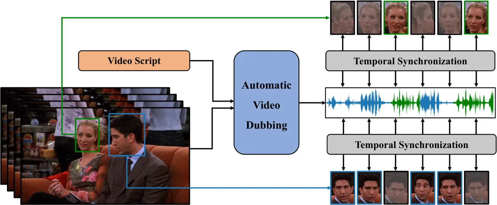
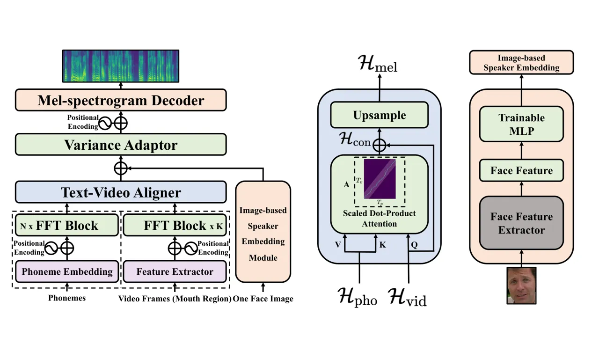
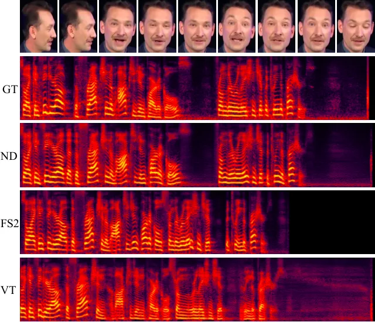

# Neural Dubber: Dubbing for Videos According to Scripts

Chenxu Hu    Qiao Tian Affiliation: ByteDance    Tingle Li
Affiliation: Shanghai Qi Zhi
Institute[https://tsinghua-mars-lab.github.io/NeuralDubber/](https://tsinghua-mars-lab.github.io/NeuralDubber/)
   Yuping Wang Affiliation: ByteDance    Yuxuan Wang
Affiliation: ByteDance    Hang Zhao ^(†)^(†)thanks: Corresponding to
hangzhao@mail.tsinghua.edu.cn Affiliation: Shanghai Qi Zhi
Institute[https://tsinghua-mars-lab.github.io/NeuralDubber/](https://tsinghua-mars-lab.github.io/NeuralDubber/)
   IIIS    Tsinghua University

###### Abstract

Dubbing is a post-production process of re-recording actors’ dialogues,
which is extensively used in filmmaking and video production. It is
usually performed manually by professional voice actors who read lines
with proper prosody, and in synchronization with the pre-recorded
videos. In this work, we propose Neural Dubber, the first neural network
model to solve a novel automatic video dubbing (AVD) task: synthesizing
human speech synchronized with the given video from the text. Neural
Dubber is a multi-modal text-to-speech (TTS) model that utilizes the lip
movement in the video to control the prosody of the generated speech.
Furthermore, an image-based speaker embedding (ISE) module is developed
for the multi-speaker setting, which enables Neural Dubber to generate
speech with a reasonable timbre according to the speaker’s face.
Experiments on the chemistry lecture single-speaker dataset and LRS2
multi-speaker dataset show that Neural Dubber can generate speech audios
on par with state-of-the-art TTS models in terms of speech quality. Most
importantly, both qualitative and quantitative evaluations show that
Neural Dubber can control the prosody of synthesized speech by the
video, and generate high-fidelity speech temporally synchronized with
the video. Our project page is at
[https://tsinghua-mars-lab.github.io/NeuralDubber/](https://tsinghua-mars-lab.github.io/NeuralDubber/).

## 1 Introduction

Dubbing is a post-production process of re-recording actors’ dialogues
in a controlled environment (i.e., a sound studio), which is extensively
used in filmmaking and video production. There are two common
application scenarios for dubbing. The first one is replacing previous
dialogues because poor sound quality is very common for speech recorded
on noise location or the scene itself is too challenging to record
high-quality audio. The second one is translating videos from one
language to another, i.e., replacing the actors’ voices in
foreign-language films with those of other performers speaking the
audience’s language. For example, an English video needs to be dubbed
into Chinese if it is shown in China.

In this paper, we mainly focus on the first application scenario, also
known as “automated dialogue replacement (ADR)”, in which the
professional voice actor watches original performance in the
pre-recorded video, and re-records each line to match the lip movement
with proper prosody such as stress, intonation and rhythm, which allows
their speech to be synchronized with the pre-recorded video. In this
scenario, the lip movement (viseme) in the video is consistent with the
given scripts (phoneme), and the pre-recorded high-definition video can
not be modified during the ADR process. However, as for the second
scenario (translation), the lip movement (viseme) in the original video
does not match the translated text to be pronounced. Yang et al. \[55\]
designed a system to solve dubbing in the translation scenario, which
produces translated audio following three steps: speech recognition,
translation, and speech synthesis, and changes visual content by
synthesizing lip movements to match the translated audio.

While dubbing is an impressive ability of professional voice actors, we
aim to achieve this ability computationally. We name this novel task
automatic video dubbing (AVD): synthesizing human speech that is
temporally synchronized with the given video according to the
corresponding text. The main challenges of the task are two-fold: (1)
temporal synchronization between synthesized speech and video, i.e., the
synthesized speech should be synchronized with the lip movement of the
speaker in the given video; (2) the content of the speech should be
consistent with the input text.

Text to speech (TTS) is a task closely related to dubbing, which aims at
converting given texts into natural and intelligible speech. However,
several limitations prevent TTS from being applied in the dubbing
problem: 1) TTS is a one-to-many mapping problem (i.e., multiple speech
variations can be spoken from the same text) \[38\], so it is hard to
control the variations (e.g., prosody, pitch and duration) in
synthesized speech during generation; 2) with only text as input, TTS
can not utilize the visual information from the video to control speech
synthesis, which greatly limits its applications in dubbing scenarios
where the synthesized speech are required to be synchronized with the
video.

We introduce Neural Dubber, the first model to solve the AVD task.
Neural Dubber is a multi-modal speech synthesis model, which generates
high-quality and lip-synced speech from the given text and video. In
order to control the duration and prosody of synthesized speech, Neural
Dubber works in a non-autoregressive way following \[38\]. The problem
of length mismatch between phoneme sequence and mel-spectrograms
sequence in non-autoregressive TTS is usually solved by up-sampling the
phoneme sequence according to the predicted phoneme duration. Meanwhile,
a phoneme duration predictor is needed, where the duration ground truth
is usually obtained from another model \[39, 38\] or itself during
training \[24\]. However, due to the natural correspondence between lip
movement and text \[10\], we do not need to get phoneme duration target
in advance like previous methods \[39, 38, 24\]. Instead, we use the
text-video aligner which adopts an attention module between the video
frames and phonemes, and then upsample the text-video context sequence
according to the length ratio of mel-spectrograms sequence and video
frame sequence. The text-video aligner not only solves the problem of
length mismatch, but also allows the lip movement in the video to
control the prosody of the generated speech explicitly by the attention
between video frames and phonemes.

In the real dubbing scenario, voice actors need to alter the timbre and
tone according to different performers in the video. In order to better
simulate the real case in the AVD task, we propose the image-based
speaker embedding (ISE) module, which aims to synthesize speech with
different timbres conditioning on the speakers’ face in the
multi-speaker setting. To the best of our knowledge, this is the first
attempt to predict a speaker embedding from a face image with the goal
of generating speech with a reasonable timbre that is consistent with
the speaker’s facial features (e.g., gender and age). This is achieved
by taking advantage of the natural co-occurrence of faces and speech in
videos without the supervision of speaker identity. With ISE, Neural
Dubber can synthesize speech with a reasonable timbre according to the
speaker’s face. In other words, Neural Dubber can use different face
images to control the timbre of the synthesized speech.

We conduct experiments on the chemistry lecture dataset from
Lip2Wav \[35\] for the single-speaker AVD, and the LRS2 \[1\] dataset
for the multi-speaker AVD. The results of extensive quantitative and
qualitative evaluations show that in terms of speech quality, Neural
Dubber is on par with state-of-the-art TTS models \[51, 41, 38\].
Furthermore, Neural Dubber can synthesize speech temporally synchronized
with the lip movement in video. In the multi-speaker setting, we
demonstrate that the ISE enables Neural Dubber to generate speech with
reasonable timbre based on the speaker’s face, resulting in Neural
Dubber outperforming FastSpeech 2 by a big margin in term of audio
quality. We attach some audio files and video clips generated by our
model in the project page.



Figure 1: The schematic diagram of the automatic video dubbing (AVD)
task. Given the video script and the video as input, the AVD task aims
to synthesize speech that is temporally synchronized with the video.
This is a scene where two people are talking with each other. The face
picture is gray to indicate that the person was not talking at that
time.

## 2 Related Work

##### Text to Speech.

Text to Speech (TTS) \[3, 41, 51, 39\], which aims to synthesize
intelligible, natural and high-quality speech from the input text, has
seen tremendous progress in recent years. Specifically, the prevalent
methods have shifted from concatenative synthesis \[19\], parametric
synthesis \[53\] to end-to-end neural network-based synthesis \[33, 41,
51\], where the quality of the synthesized speech is improved by a large
margin and is close to that of the human counterpart. The general
paradigm of end-to-end neural network-based methods usually first
generate the acoustic feature (e.g., mel-spectrogram) from text using
encoder-decoder architecture autoregressively \[51, 41, 34, 28\] or
non-autoregressively \[39, 38, 24\], then reconstruct the waveform
signal using vocoder \[16, 30, 37, 26, 54\]. When it comes to the recent
multi-speaker TTS system \[20\], the speaker embedding is often
extracted using speaker verification system, and is fed to the decoder
of the TTS system in order to encourage the model to obtain a timbre
inclination for the speaker of interest. Different from TTS, Neural
Dubber is conditioned not only on texts but also on videos, intending to
synthesize natural speech given both of them.

##### Talking Face Generation.

Talking face generation has a long history in computer vision, ranging
from viseme-based models \[14, 59\] to neural synthesis of 2D \[43, 46,
52\] or 3D \[21, 40, 45\] face. Recently neural synthesis approaches
have been proposed to generate realistic 2D video of talking heads.
Concretely speaking, Chung et al. \[9\] first generates lower face
animation using cropped frontal images. After then Zhou et al. \[58\]
further disentangles identity from speech using generative adversarial
networks (GANs). Wav2Lip \[36\] tries to explore the problem of visual
dubbing, i.e., lip-syncing a talking head video of an arbitrary person
to match a target speech segment. From our perspective, however, such
methods can not generate high-fidelity face and lip given speech,
spawning the results are of low resolution and look uncanny sometimes.
Besides, audios in most talking face pipelines need to be prepared in
advance, thus, strictly speaking, this does not belong to dubbing
(re-recording)¹¹ 1
[https://en.wikipedia.org/wiki/Dubbing\_(filmmaking)](<https://en.wikipedia.org/wiki/Dubbing_(filmmaking)>),
but to the face synchronization while given audio. In contrast to the
aforementioned works, Neural Dubber is not required to prepare audio
beforehand and modify the lip motion, but generates speech audio
synchronized with the video from scripts.

##### Lip to Speech Synthesis.

Given a video, the lip to speech task aims at synthesizing the
corresponding speech audio by directly judging from the lip motion.
While the conventional method \[22\] exploits the visual features
extracted from active appearance models, recent end-to-end methods have
also shed some light on it. In particular, Vid2Speech \[15\] and
Lipper \[27\] generate low-dimensional linear predictive coding features
to synthesize speech in the constrained scene. Vougioukas et al. \[49\]
using the GANs-based method to exert for quality gains. Lip2Wav \[35\]
has achieved promising results in real-life speaker-dependent scenarios,
but it is still somewhat incongruous and prone to collapse in the
multi-speaker setting. This is possibly because the word error rate in
lip reading task \[2, 4, 10, 12\] is still high, let alone the lip to
speech synthesis. In Neural Dubber, the textual information is provided,
allowing us to concentrate more on the alignment between the phoneme and
lip motion in video, instead of decoding speech from lip motion
directly.

## 3 Method

In this section, we first introduce the novel automatic video dubbing
(AVD) task; we then describe the overall architecture of our proposed
Neural Dubber; finally we detail the main components in Neural Dubber.

### 3.1 Automatic Video Dubbing

Given a sentence $`T`$ and a corresponding video clip (without audio)
$`V`$, the goal of automatic video dubbing (AVD) is to synthesize
natural and intelligible speech $`S`$ whose content is consistent with
the sentence $`T`$, and whose prosody is synchronized with the lip
movement of the active speaker in the video $`V`$. Compared to the
traditional speech synthesis task which only generates natural and
intelligible speech $`S`$ given the sentence $`T`$, AVD task is more
difficult due to the synchronization requirement.


(a) Neural Dubber



(b) Text-Video Aligner


(c) ISE Module

Figure 2: The architecture of Neural Dubber.

### 3.2 Neural Dubber

#### 3.2.1 Design Overview

Our Neural Dubber aims to solve the AVD task. Concretely, we formulate
the problem as follows: given a phoneme sequence
$`S_{p}=\left\{P_{1},P_{2},\ldots,P_{T_{p}}\right\}`$ and a video frame
sequence $`S_{v}=\left\{I_{1},I_{2},\ldots,I_{T_{v}}\right\}`$, we need
to predict a target mel-spectrograms sequence
$`S_{m}=\left\{Y_{1},Y_{2},\ldots,Y_{T_{m}}\right\}`$.

The overall model architecture of Neural Dubber is shown in Figure 2.
First, we apply a phoneme encoder $`f_{p}`$ and a video encoder
$`f_{v}`$ to process the phonemes and images respectively. Note that the
images we feed to the video encoder only contain mouth region of the
speaker following \[10, 32, 42\]. We use $`S_{v}^{m}`$ to represent
these images. After the encoding, raw phonemes turn into a sequence of
hidden representations
$`\mathcal{H}_{pho}=f_{p}(S_{p})\in\mathbb{R}^{T_{p}\times d}`$ while
images of mouth region turn into a sequence of hidden representations
$`\mathcal{H}_{vid}=f_{v}(S_{v}^{m})\in\mathbb{R}^{T_{v}\times d}`$.
Then we feed $`\mathcal{H}_{pho}`$ and $`\mathcal{H}_{vid}`$ into the
text-video aligner (which will be described in Section 3.2.3) and get
the expanded sequence $`\mathcal{H}_{mel}\in\mathbb{R}^{T_{m}\times d}`$
with the same length as the target mel-spectrograms sequence $`S_{m}`$.
Meanwhile, a face image randomly selected from the video frames is input
into image-based speaker embedding (ISE) module (which will be described
in Section 3.2.4) to generate a image-based speaker embedding (only used
in multi-speaker setting). We add $`\mathcal{H}_{mel}`$ and ISE together
and feed them into the variance adaptor to add some variance information
(e.g., pitch and energy). Finally, we use the mel-spectrogram decoder to
convert the adapted hidden sequence into mel-spectrograms sequence
following \[39\]. Different from FastSpeech 2 \[38\], our variance
adaptor consists of pitch and energy predictors without duration
predictor, because we solve the problem of length mismatch between the
phoneme and mel-spectrograms sequence in the text-video aligner and the
input of variance adaptor is as long as the mel-spectrograms sequence.

#### 3.2.2 Phoneme and Video Encoders

The phoneme encoder and video encoder are shown in Figure 2(a), which
are enclosed in a dashed box. The function of the phoneme encoder and
video encoder is to transform the original phoneme and image sequences
into hidden representation sequences which contain high-level semantics.
The phoneme encoder we use is similar to that in FastSpeech \[39\],
which consists of an embedding layer and N Feed-Forward Transformer
(FFT) blocks. The video encoder consists of a feature extractor and K
FFT blocks. The feature extractor is a CNN backbone that generates
feature representation for every input mouth image. And then we use the
FFT blocks to capture the dynamics of the mouth region because FFT is
based on self-attention \[48\] and 1D convolution where self-attention
and 1D convolution are suitable for capturing long-term and short-term
dynamics respectively.

#### 3.2.3 Text-Video Aligner

The most challenging aspect of the AVD task is alignment: (1) the
content of the generated speech should come from the input phonemes; (2)
the prosody of the generated speech should be aligned with the video in
time. So it does not make sense to produce speech solely from phonemes,
nor video. In our design, the text-video aligner (Figure 2(b)) aims to
find the correspondence between text and lip movement first, so that
synchronized speech can be generated in the later stage.

In the text-video aligner, an attention-based module learns the
alignment between the phoneme sequence and the video frame sequence, and
produces the text-video context sequence. Then an upsampling operation
is performed to change the length of the text-video context sequence
$`\mathcal{H}_{con}`$ from $`T_{v}`$ to $`T_{m}`$.

In practice, we adopt the popular Scaled Dot-Product Attention \[48\] as
the attention module, where $`\mathcal{H}_{vid}`$ is used as the query,
and $`\mathcal{H}_{pho}`$ is used as both the key and the value.

```math
\displaystyle\operatorname{Attention}(Q,K,V) \displaystyle=\operatorname{Attention}\left(\mathcal{H}_{vid},\mathcal{H}_{pho},\mathcal{H}_{pho}\right) \tag{1}
```

```math
\displaystyle=\operatorname{Softmax}\left(\frac{\mathcal{H}_{vid}\mathcal{H}_{pho}^{T}}{\sqrt{d}}\right)\mathcal{H}_{pho} \tag{2}
```

```math
\displaystyle=A\mathcal{H}_{pho}\in\mathbb{R}^{T_{v}\times d}, \tag{3}
```

where $`A`$ is the matrix of attention weights. After the attention
module, we get the text-video context sequence, i.e., the expanded
sequence of phoneme hidden representation by linear combination. We use
a residual connection \[18\] to add the $`\mathcal{H}_{vid}`$ for
efficient training. However, we use a dropout layer with a large dropout
rate to prevent mel-spectrograms from being generated directly from
visual information. The attention weight $`A`$ obtained after softmax is
the main determinant of the speed and prosody of the synthesized speech
like the attention weight between spectrograms and phonemes in \[51, 41,
28\]. The sequence of video hidden representations is used as the query,
so the attention weight is controlled by the video explicitly, and the
temporal alignment between video frames and phonemes is achieved. The
obtained monotonic alignment between video frames and phonemes
contributes to the synchronization between the synthesized speech and
the video on fine-grained (phoneme) level.

There is a natural temporal correspondence between the speech audio and
the video. In other words, once the alignment between video frames and
phonemes is achieved, the alignment between mel-spectrogram frames and
phonemes can be obtained. In practice, the length of a mel-spectrograms
sequence is $`n`$ times that of a video frame sequence. We denote the
$`n`$ as

```math
n=\frac{T_{mel}}{T_{v}}=\frac{sr/hs}{FPS}\in\mathbb{N}^{+}, \tag{4}
```

where sr denotes the sampling rate of the audio and hs denotes hop size
set when transforming the raw waveform into mel-spectrograms. We
upsample the text-video context sequence $`\mathcal{H}_{con}`$ to
$`\mathcal{H}_{mel}`$ with scale factor is $`n`$. In practice, we use
the upsampling method with nearest mode.

```math
\displaystyle\mathcal{H}_{con}=\left\{C_{1},C_{2},\ldots,C_{T_{v}}\right\}\in\mathbb{R}^{T_{v}\times d} \tag{5}
```

```math
\displaystyle\mathcal{H}_{mel}=\operatorname{Upsample}\left(\mathcal{H}_{con},n\right)\in\mathbb{R}^{T_{m}\times d}\vskip-2.84544pt \tag{6}
```

After that, the length of the text-video context sequence is expanded to
that of the mel-spectrograms sequence. Thus, the problem of length
mismatch between the phoneme and mel-spectrograms sequence is solved
without the supervision of fine grained alignment between phonemes and
mel-spectrograms. Because of the attention between video frames and
phonemes, the speed and part of prosody of synthesized speech are
controlled by the input video explicitly, which makes the synthesized
speech well synchronized with the input video.

##### Monotonic Alignment Constraint

In text to speech (TTS) task, the monotonic and diagonal alignments in
the attention weights between text and speech are important to ensure
the quality of synthesized speech \[51, 41, 44, 6\]. In Neural Dubber, a
multi-modal TTS model, the monotonic and diagonal alignments between
video frames and phonemes are also critical. So we adopt a diagonal
constraint on the attention weights to guide the text-video attention
module to learn right alignments following \[6\]. We formulate the
diagonal attention rate $`r`$ as

```math
r=\frac{\sum_{s=1}^{T_{v}}\sum_{t=\max\left(ks-b,1\right)}^{\min\left(ks+b,T_{p}\right)}A_{s,t}}{T_{v}},\vskip-8.5359pt \tag{7}
```

where $`k=\frac{T_{p}}{T_{v}}`$, $`b`$ is a hyperparameter for bandwidth
of the diagonal area. We add the diagonal constraint loss which is
defined as $`L_{DC}=-r`$ to our final loss for better alignments.

#### 3.2.4 Image-based Speaker Embedding Module

How much can we infer about the way people speak from their appearances?
In the real dubbing scenario, voice actors need to alter the timbre
according to different performers. In order to better simulate the real
case in AVD task, we aim to synthesize speech with different timbres
conditioning on the speakers’ faces in multi-speaker setting. There have
been many works \[29, 23, 13\] researching the correlation between voice
and speakers’ face recently, but none of them learn the joint
speaker-face embeddings to solve the multi-speaker text to speech task.
In this work, we propose image-based speaker embedding (ISE) module
(Figure 2(c)), a new multi-modal speaker embedding module, generates an
embedding that encapsulates the characteristics of the speaker’s voice
from an image of his/her face. The ISE module is trained with other
components of Neural Dubber from scratch in a self-supervised manner,
utilizing the natural co-occurrence of faces and speech audio in videos,
but without the supervision of speaker identity. We randomly select a
face image $`I_{i}^{f}`$ from
$`S_{v}^{f}=\left\{I_{1}^{f},I_{2}^{f},\ldots,I_{T_{v}}^{f}\right\}`$,
and obtain a high-level face feature by feeding the selected face image
into a pre-trained and fixed face recognition network \[31, 5\]. Then we
feed the face feature to a trainable MLP and gain the ISE. The predicted
ISE is directly broadcasted and added to $`\mathcal{H}_{mel}`$ so as to
control the timbre of synthesized speech. Our model learns face-voice
correlations which allow it to generate speech that coincides with
various voice attributes of the speakers (e.g., gender and age) inferred
from their faces.

## 4 Experiments and Results

### 4.1 Datasets

##### Single-speaker Dataset

In the single-speaker setting, we conduct experiments on the chemistry
lecture dataset from Lip2Wav \[35\]. With a large vocabulary size and a
lot of head movements, the dataset is originally used for the
unconstrained single-speaker lip to speech synthesis. To make it fit the
AVD task, we collect the official transcripts from YouTube. We need
corresponding sentence-level text and audio clips for training, so we
segment the long videos into sentence-level clips according to the start
and end timestamp of each sentence in the transcripts. Some segmented
sentence-level video clips contain frames that only capture the
PowerPoint but not lecturer face which can not be used for training. So
we conduct data cleaning to remove them. Finally, the dataset contains
6,640 samples, with the total video length of approximately 9 hours. We
randomly split the dataset into 3 sets: 6240 samples for training, 200
samples for validation, and 200 samples for testing. In the following
subsections, we refer to this dataset as chem for short.

##### Multi-speaker Dataset

In multi-speaker setting, we conduct experiments on the LRS2 \[1\]
dataset, which consists of thousands of sentences spoken by various
speakers on BBC channels. This dataset suits the AVD task well, because
each sample includes both the text and video pair. Note that we only
train on the training set of the LRS2 dataset, which only contains data
of approximately 29 hours. Compared to other multi-speaker speech
synthesis datasets \[56\], this dataset is quite small for multi-speaker
speech generation and does not provide the speaker identity for each
sample. The ISE module aids Neural Dubber in solving these problems.

### 4.2 Data Pre-processing

The video frames are sampled at 25 FPS. We detect and crop the face from
the video frames using $`S^{3}FD`$ \[57\] face detection
following \[35\]. The images input to the video encoder are resized to
$`96\times 96`$ in dimension, which only cover the mouth region of the
face, as shown in Figure 2(a). The face image input to the ISE module is
$`224\times 224`$ in dimension and covers the whole face of the speaker.
In order to alleviate the mispronunciation problem, we convert the text
sequences into the phoneme sequences \[3, 28, 38\] with an open-source
grapheme-to-phoneme tool. For the speech audio, we transform the raw
waveform into mel-spectrograms following \[41\]. The frame size and hop
size are set to 640 samples (40 ms) and 160 samples (10 ms) with respect
to the sample rate 16 kHz.

### 4.3 Model Configuration

##### Neural Dubber

Our Neural Dubber consists of 4 feed-forward Transformer (FFT)
blocks \[39\] in the phoneme encoder and the mel-spectrogram decoder,
and 2 FFT blocks in the video encoder. The feature extractor in the
video encoder is the ResNet18 \[18\] except for the first 2D convolution
layer being replaced by 3D convolutions \[32\]. The variance adaptor
contains pitch predictor and energy predictor. The configurations of the
FFT block, the mel-spectrogram decoder, the pitch predictor and the
energy predictor are the same as those in FastSpeech 2 \[38\]. In the
text-video aligner, the hidden size of the scaled dot-product attention
is set to 256, the number $`n`$ of the upsample operation is set to 4
according to Equation (4). In the ISE module, the face feature extractor
we use is a pre-trained and fixed ResNet50 trained on the VGGFace2 \[5\]
dataset. The face feature is a 4096-D feature that is extracted from the
penultimate layer (i.e., one layer prior to the classification layer) of
the network.

##### Baseline

Since automatic video dubbing is a new task that we propose, none of the
previous works focused on solving this task. So we propose a baseline
model based on the Tacotron \[51\] system with some modifications which
make it fit to the new AVD task. We call this baseline model Video-based
Tacotron. In order to make use of the information in video, we
concatenate the spectrogram frames with the corresponding hidden
representation of video frames, and use it as the decoder input:

```math
\quad Y^{{}^{\prime}}_{i-1}=Y_{i-1}\oplus\mathcal{H}_{vid}^{\lceil\frac{i}{n}\rceil}\quad, \tag{8}
```

where $`Y^{{}^{\prime}}_{i-1}`$ is the decoder input, $`\oplus`$
represents the concatenation operation, $`\mathcal{H}_{vid}`$ is the
hidden representation of video frames, which is obtained by the same way
as in Neural Dubber described in the Section 3.2.1 and $`n`$ is same as
that in Equation (4). The Video-based Tacotron implementation is based
on an open-source Tacotron repository ²² 2
[https://github.com/fatchord/WaveRNN](https://github.com/fatchord/WaveRNN)
where the attention is replaced with the location-sensitive
attention \[7\] according to \[41\] for better results. We set the
reduction factor $`r`$ to 2 and change the vocoder to Parallel
WaveGAN \[54\] for fair comparison.

### 4.4 Training and Inference

We train Neural Dubber on 1 NVIDIA V100 GPU. We use the Adam
optimizer \[25\] with $`\beta_{1}=0.9`$, $`\beta_{2}=0.98`$,
$`\varepsilon=10^{-9}`$ and follow the same learning rate schedule
in \[48\]. Our model is optimized with the loss similar to that
in \[38\]. We set the batchsize to 18 and 24 on chem dataset and LRS2
dataset respectively. It takes 200k/300k steps for training until
convergence on the chem/LRS2 dataset. In this work, we use Parallel
WaveGAN \[54\] as the vocoder to transform the generated
mel-spectrograms into audio samples. We train two Parallel WaveGAN
vocoders on the training set of chem dataset and LRS2 dataset
respectively, following an open-source implementation ³³ 3
[https://github.com/kan-bayashi/ParallelWaveGAN](https://github.com/kan-bayashi/ParallelWaveGAN).
Each Parallel WaveGan vocoder is trained on 1 NVIDIA V100 GPU for 1000K
steps. In the inference process, the output mel-spectrograms of Neural
Dubber are transformed into audio samples using the pre-trained Parallel
WaveGAN.

### 4.5 Evaluation

#### 4.5.1 Metrics

Since the AVD task aims to synthesize human speech synchronized with the
video from text, the audio quality and the audio-visual synchronization
(av sync) are the important evaluation criteria.

##### Human Evaluation

We conduct the mean opinion score (MOS) \[8\] evaluation on the test set
to measure the audio quality and the av sync. We randomly select 30
video clips from the test set, where each video clip is scored by at
least 20 raters, who are all native English speakers. We overlay the
synthesized speech on the original video before showing it to the rater,
following \[35\]. The text and the video are consistent among different
systems, so that all raters only examine the audio quality and the av
sync without other interference factors. For each video clip, the raters
are asked to rate scores of 1-5 from bad to excellent (higher score
indicates better quality) on the audio quality and the av sync,
respectively. We perform the MOS evaluation on Amazon Mechanical Turk
(MTurk).

##### Quantitative Evaluation

In order to measure the synchronization between the generated speech and
the video quantitatively, we use the pre-trained SyncNet \[11\], which
is publicly available⁴⁴ 4
[https://github.com/joonson/syncnet_python](https://github.com/joonson/syncnet_python),
following \[35\]. The method can explicitly test for synchronization
between speech audio and lip movements in unconstrained videos in the
wild \[11, 36\]. We adopt two metrics: Lip Sync Error - Distance (LSE-D)
and Lip Sync Error - Confidence (LSE-C) from Wav2Lip \[36\]. The two
metrics can be automatically calculated by the pre-trained SyncNet
model. LSE-D denotes the minimal distance between the audio and the
video features for different offset values. A lower LSE-D means the
speech audio and video are more synchronized. LSE-C denotes the
confidence that the audio and the video are synchronized with a certain
time offset. A lower LSE-C means that some parts of the video are
completely out of sync, where the audio and the video are uncorrelated.



Figure 3: Mel-spectrograms of audios synthesized by some systems: Ground
Truth (GT), Neural Dubber (ND), FastSpeech 2 (FS2) and Video-based
Tacotron (VT).

Figure 4: Speaker embedding visualization.

#### 4.5.2 Single-speaker AVD

We first conduct MOS evaluation on the chem single-speaker dataset, to
compare the audio quality and the av sync of the video clips generated
by Neural Dubber with other systems, including 1) GT, the ground-truth
video clips; 2) GT (Mel + PWG), where we first convert the ground-truth
audio into mel-spectrograms, and then convert it back to audio using
Parallel WaveGAN \[54\] (PWG); 3) FastSpeech 2 \[38\] (Mel + PWG); 4)
Video-based Tacotron (Mel + PWG). Note that the systems in 2), 3), 4)
and Neural Dubber use the same pre-trained Parallel WaveGAN for a fair
comparison. In addition, we compare Neural Dubber with those systems on
the test set using the LSE-D and LSE-C metrics. The results for
single-speaker AVD are shown in Table 1. It can be seen that Neural
Dubber can surpass the Video-based Tacotron baseline and is on par with
FastSpeech 2 in terms of audio quality, which demonstrates that Neural
Dubber can synthesize high-quality speech. Furthermore, in terms of the
av sync, Neural Dubber outperforms FastSpeech 2 and Video-based Tacotron
by a big margin and matches GT (Mel + PWG) system in both qualitative
and quantitative evaluations, which shows that Neural Dubber can control
the prosody of speech and generate speech synchronized with the video.
For FastSpeech 2 and Video-based Tacotron, the LSE-D is high and the
LSE-C is low, indicating that they can not generate speech synchronized
with the video.

| Method                           | Audio Quality     | AV Sync           | LSE-D $`\downarrow`$ | LSE-C $`\uparrow`$ |
| -------------------------------- | ----------------- | ----------------- | -------------------- | ------------------ |
| GT                               | 3.93 $`\pm`$ 0.08 | 4.13 $`\pm`$ 0.07 | 6.926                | 7.711              |
| GT (Mel + PWG)                   | 3.83 $`\pm`$ 0.09 | 4.05 $`\pm`$ 0.07 | 7.384                | 6.806              |
| FastSpeech 2 \[38\] (Mel + PWG)  | 3.71 $`\pm`$ 0.08 | 3.29 $`\pm`$ 0.09 | 11.86                | 2.805              |
| Video-based Tacotron (Mel + PWG) | 3.55 $`\pm`$ 0.09 | 3.03 $`\pm`$ 0.10 | 11.79                | 2.231              |
| Neural Dubber (Mel + PWG)        | 3.74 $`\pm`$ 0.08 | 3.91 $`\pm`$ 0.07 | 7.212                | 7.037              |

Table 1: The evaluation results for the single-speaker AVD. The
subjective metrics for audio quality and av sync are with 95% confidence
intervals.

We also show a qualitative comparison in Figure 4 which contains
mel-spectrograms of audios generated by the above systems. It shows that
the prosody of the audio generated by Neural Dubber is closed to that of
ground truth recording, i.e., well synchronized with the video.

In addition, we compare our method with another baseline \[17\] which
automatically stretches and compresses the audio signal to match the lip
movement given an unaligned face sequence and speech audio. We use the
speech generated by FastSpeech 2 (Mel + PWG) system, and then align the
pre-generated speech with the lip movement in video according to \[17\].
However, the quality and naturalness of its synthesized speech is much
worse than the pre-generated speech due to challenging alignments. So
this baseline is not comparable to our Neural Dubber.

#### 4.5.3 Multi-speaker AVD

Similar to Section 4.5.2, we conduct human evaluation and quantitative
evaluation on the LRS2 multi-speaker dataset to compare Neural Dubber
with other systems in multi-speaker setting. Due to the failure of
Video-based Tacotron in single-speaker AVD, we no longer compare our
model with it. Note that we can not add a trivial speaker embedding
module to FastSpeech 2, because the LRS2 dataset does not contain the
speaker identity for each video. So we directly train FastSpeech 2 on
the LRS2 dataset without modifications. The results are shown in
Table 2. We can see that Neural Dubber outperforms FastSpeech 2 by a
significant margin in terms of audio quality, exhibiting the
effectiveness of ISE in multi-speaker AVD. The qualitative and
quantitative evaluations show that the speech synthesized by Neural
Dubber is much better than that of FastSpeech 2 and is on par with the
ground truth recordings in terms of synchronization. These results show
that Neural Dubber can address the multi-speaker AVD which is more
challenging than the single-speaker AVD.

| Method                          | Audio Quality     | AV Sync           | LSE-D $`\downarrow`$ | LSE-C $`\uparrow`$ |
| ------------------------------- | ----------------- | ----------------- | -------------------- | ------------------ |
| GT                              | 3.97 $`\pm`$ 0.09 | 3.81 $`\pm`$ 0.10 | 7.214                | 6.755              |
| GT (Mel + PWG)                  | 3.92 $`\pm`$ 0.09 | 3.69 $`\pm`$ 0.11 | 7.317                | 6.603              |
| FastSpeech 2 \[38\] (Mel + PWG) | 3.15 $`\pm`$ 0.14 | 3.33 $`\pm`$ 0.10 | 10.17                | 3.714              |
| Neural Dubber (Mel + PWG)       | 3.58 $`\pm`$ 0.13 | 3.62 $`\pm`$ 0.09 | 7.201                | 6.861              |

Table 2: The evaluation results for the multi-speaker AVD. The
subjective metrics for audio quality and av sync are with 95% confidence
intervals.

In order to demonstrate that ISE enables Neural Dubber to control the
timbre by the input face image, some audio clips are generated by Neural
Dubber with the same phoneme sequence and mouth image sequence but
different speaker face images as input. We select 12 males and 12
females from the test set of LRS2 dataset for this evaluation. For each
person, we chose 10 face images with different head posture,
illumination and facial makeup, etc.

We visualize the speaker embedding of these audios in Figure 4 by using
a pre-trained speaker encoder \[50\] from an open-source repository⁵⁵ 5
[https://github.com/resemble-ai/Resemblyzer](https://github.com/resemble-ai/Resemblyzer).
We first use the speaker (voice) encoder to derive a high-level
representation, i.e., a 256-D embedding, from an audio, which summarizes
the characteristics of the voice in the audio. Then we use t-SNE \[47\]
to visualize the generated embedding. It can be seen that the utterances
generated from the images of the same speaker form a tight cluster, and
that the cluster representing each speaker is separated from each other.
In addition, there is a distinctive discrepancy between the speech
synthesized from the face images of different genders. It concludes that
Neural Dubber can use the face image to alter the timbre of the
generated speech.

#### 4.5.4 Comparing with the Lip-motion Based Speech Generation Method

Recently, some works have demonstrated the impressive ability to
generate speech directly from the lip motion. However, the quality and
intelligibility of the generated speech are relatively poor, and the
word error rate (WER) is very high. In this section, we compare with a
SOTA lip-motion based speech generation system Lip2Wav \[35\]. Because
Lip2Wav can only generate word-level speech in the multi-speaker
setting, we only compare Neural Dubber with Lip2Wav in the
single-speaker setting still on the chem dataset. We use the official
GitHub repository to train Lip2Wav on our version of the chemistry
lecture dataset. As we mentioned in Section 4.1, the dataset is
different from the original one in Lip2Wav. It only contains data of
approximately 9 hours, which is much less than the original one
(approximately 24 hours). In this experiment, the training and testing
sets of Neural Dubber and Lip2Wav are identical, so the results can be
compared directly. Following the Lip2Wav paper \[35\], we use STOI and
ESTOI for estimating the intelligibility and PESQ for measuring the
quality. In addition, using an out-of-the-box ASR system, we evaluate
the speech results using word error rates (WER). In order to eliminate
the influence of the ASR system, we also measure the WER for ground
truth speech audio. All these metrics are computed on the test dataset.

| Method               | STOI $`\uparrow`$ | ESTOI $`\uparrow`$ | PESQ $`\uparrow`$ | WER $`\downarrow`$ |
| -------------------- | ----------------- | ------------------ | ----------------- | ------------------ |
| Ground Truth         | NA                | NA                 | NA                | 7.57%              |
| Lip2Wav              | 0.282             | 0.176              | 1.194             | 72.70%             |
| Neural Dubber (ours) | 0.467             | 0.308              | 1.250             | 18.01%             |

Table 3: The comparison between Lip2Wav and Neural Dubber on the chem
single-speaker dataset.

As the comparison results in Table 3 show, Neural Dubber surpasses
Lip2Wav by a big margin in terms of speech quality and intelligibility.
Please note that STOI, ESTOI, and PESQ scores of Lip2Wav are lower than
those in  \[35\], because the training data we used is much less than
theirs. Most importantly, the WER of Neural Dubber is $`4\times`$ lower
than that of Lip2Wav. It shows that Neural Dubber outperforms Lip2Wav
significantly in pronunciation accuracy. WER of Lip2Wav is up to 72.70%,
indicating that it mispronounces a lot of content, which is unacceptable
in the AVD task. Just like it is unacceptable for an actor to always
mispronounce the lines. Please note that the WER of Lip2Wav we get is
consistent with the results in \[35\] (see its Table 5). In summary,
Neural Dubber far outperforms Lip2Wav in terms of speech
intelligibility, quality, and pronunciation accuracy (WER), and is much
more suitable for the AVD task.

## 5 Limitations and Societal Impact

When the script is changed to be different from what the speaker is
actually saying, our method can only deal with the situation of
modifying couple words. In addition, the lip movement of the modified
text should be similar to the original lip movement in the video. The
facial appearance may lead to timbre ambiguity due to the dataset bias.
It might be offensive. Our method can dub videos automatically, which
may be useful for filmmaking and video production.

## 6 Conclusion

In this work, we introduce a novel task, automatic video dubbing (AVD),
which aims to synthesize human speech synchronized with the given video
from text. To solve the AVD task, we propose Neural Dubber, a
multi-modal TTS model, which can generate lip-synced mel-spectrograms in
parallel. We design several key components including the video encoder,
the text-video aligner and the ISE module for Neural Dubber to better
solve the task. Our experimental results show that, in terms of speech
quality, Neural Dubber is on par with FastSpeech 2 on the chem dataset,
even outperforms FastSpeech 2 on the LRS2 dataset due to ISE’s help.
More importantly, Neural Dubber can synthesize speech temporally
synchronized with the video.

## References

- (1) Triantafyllos Afouras, Joon Son Chung, Andrew Senior, Oriol
  Vinyals, and Andrew Zisserman. Deep audio-visual speech recognition.
  IEEE transactions on pattern analysis and machine intelligence, 2018.
- (2) Triantafyllos Afouras, Joon Son Chung, and Andrew Zisserman. Deep
  lip reading: a comparison of models and an online application. In
  Interspeech, 2018.
- (3) Sercan Ö Arık, Mike Chrzanowski, Adam Coates, Gregory Diamos,
  Andrew Gibiansky, Yongguo Kang, Xian Li, John Miller, Andrew Ng,
  Jonathan Raiman, et al. Deep voice: Real-time neural text-to-speech.
  In International Conference on Machine Learning, pages 195–204.
  PMLR, 2017.
- (4) Yannis M Assael, Brendan Shillingford, Shimon Whiteson, and Nando
  De Freitas. Lipnet: End-to-end sentence-level lipreading. arXiv
  preprint arXiv:1611.01599, 2016.
- (5) Qiong Cao, Li Shen, Weidi Xie, Omkar M Parkhi, and Andrew
  Zisserman. Vggface2: A dataset for recognising faces across pose and
  age. In 2018 13th IEEE international conference on automatic face &
  gesture recognition (FG 2018), pages 67–74. IEEE, 2018.
- (6) Mingjian Chen, Xu Tan, Yi Ren, Jin Xu, Hao Sun, Sheng Zhao, Tao
  Qin, and Tie-Yan Liu. Multispeech: Multi-speaker text to speech with
  transformer. arXiv preprint arXiv:2006.04664, 2020.
- (7) Jan Chorowski, Dzmitry Bahdanau, Dmitriy Serdyuk, Kyunghyun Cho,
  and Yoshua Bengio. Attention-based models for speech recognition.
  arXiv preprint arXiv:1506.07503, 2015.
- (8) Min Chu and Hu Peng. Objective measure for estimating mean opinion
  score of synthesized speech, April 4 2006. US Patent 7,024,362.
- (9) Joon Son Chung, Amir Jamaludin, and Andrew Zisserman. You said
  that? In British Machine Vision Conference, 2017.
- (10) Joon Son Chung, Andrew Senior, Oriol Vinyals, and Andrew
  Zisserman. Lip reading sentences in the wild. In 2017 IEEE Conference
  on Computer Vision and Pattern Recognition (CVPR), pages 3444–3453.
  IEEE, 2017.
- (11) Joon Son Chung and Andrew Zisserman. Out of time: automated lip
  sync in the wild. In Asian conference on computer vision, pages
  251–263. Springer, 2016.
- (12) Joon Son Chung and Andrew Zisserman. Lip reading in profile. In
  British Machine Vision Conference, 2017.
- (13) Soo-Whan Chung, Hong Goo Kang, and Joon Son Chung. Seeing voices
  and hearing voices: learning discriminative embeddings using
  cross-modal self-supervision. arXiv preprint arXiv:2004.14326, 2020.
- (14) Pif Edwards, Chris Landreth, Eugene Fiume, and Karan Singh. Jali:
  an animator-centric viseme model for expressive lip synchronization.
  ACM Transactions on Graphics (TOG), 35(4):1–11, 2016.
- (15) Ariel Ephrat and Shmuel Peleg. Vid2speech: speech reconstruction
  from silent video. In 2017 IEEE International Conference on Acoustics,
  Speech and Signal Processing (ICASSP), pages 5095–5099. IEEE, 2017.
- (16) Daniel Griffin and Jae Lim. Signal estimation from modified
  short-time fourier transform. IEEE Transactions on acoustics, speech,
  and signal processing, 32(2):236–243, 1984.
- (17) Tavi Halperin, Ariel Ephrat, and Shmuel Peleg. Dynamic temporal
  alignment of speech to lips. In ICASSP 2019-2019 IEEE International
  Conference on Acoustics, Speech and Signal Processing (ICASSP), pages
  3980–3984. IEEE, 2019.
- (18) Kaiming He, Xiangyu Zhang, Shaoqing Ren, and Jian Sun. Deep
  residual learning for image recognition. In Proceedings of the IEEE
  conference on computer vision and pattern recognition, pages
  770–778, 2016.
- (19) Andrew J Hunt and Alan W Black. Unit selection in a concatenative
  speech synthesis system using a large speech database. In 1996 IEEE
  International Conference on Acoustics, Speech, and Signal Processing
  Conference Proceedings, pages 373–376. IEEE, 1996.
- (20) Ye Jia, Yu Zhang, Ron J Weiss, Quan Wang, Jonathan Shen, Fei Ren,
  Zhifeng Chen, Patrick Nguyen, Ruoming Pang, Ignacio Lopez Moreno,
  et al. Transfer learning from speaker verification to multispeaker
  text-to-speech synthesis. In Advances in Neural Information Processing
  Systems, 2018.
- (21) Tero Karras, Timo Aila, Samuli Laine, Antti Herva, and Jaakko
  Lehtinen. Audio-driven facial animation by joint end-to-end learning
  of pose and emotion. ACM Transactions on Graphics (TOG),
  36(4):1–12, 2017.
- (22) Christopher T Kello and David C Plaut. A neural network model of
  the articulatory-acoustic forward mapping trained on recordings of
  articulatory parameters. The Journal of the Acoustical Society of
  America, 116(4):2354–2364, 2004.
- (23) Changil Kim, Hijung Valentina Shin, Tae-Hyun Oh, Alexandre
  Kaspar, Mohamed Elgharib, and Wojciech Matusik. On learning
  associations of faces and voices. In Asian Conference on Computer
  Vision, pages 276–292. Springer, 2018.
- (24) Jaehyeon Kim, Sungwon Kim, Jungil Kong, and Sungroh Yoon.
  Glow-tts: A generative flow for text-to-speech via monotonic alignment
  search. arXiv preprint arXiv:2005.11129, 2020.
- (25) Diederik P Kingma and Jimmy Ba. Adam: A method for stochastic
  optimization. arXiv preprint arXiv:1412.6980, 2014.
- (26) Kundan Kumar, Rithesh Kumar, Thibault de Boissiere, Lucas Gestin,
  Wei Zhen Teoh, Jose Sotelo, Alexandre de Brébisson, Yoshua Bengio, and
  Aaron Courville. Melgan: Generative adversarial networks for
  conditional waveform synthesis. arXiv preprint arXiv:1910.06711, 2019.
- (27) Yaman Kumar, Rohit Jain, Khwaja Mohd Salik, Rajiv Ratn Shah,
  Yifang Yin, and Roger Zimmermann. Lipper: Synthesizing thy speech
  using multi-view lipreading. In Proceedings of the AAAI Conference on
  Artificial Intelligence, pages 2588–2595, 2019.
- (28) Naihan Li, Shujie Liu, Yanqing Liu, Sheng Zhao, and Ming Liu.
  Neural speech synthesis with transformer network. In Proceedings of
  the AAAI Conference on Artificial Intelligence, volume 33, pages
  6706–6713, 2019.
- (29) Arsha Nagrani, Samuel Albanie, and Andrew Zisserman. Learnable
  pins: Cross-modal embeddings for person identity. In Proceedings of
  the European Conference on Computer Vision (ECCV), pages 71–88, 2018.
- (30) Aaron van den Oord, Sander Dieleman, Heiga Zen, Karen Simonyan,
  Oriol Vinyals, Alex Graves, Nal Kalchbrenner, Andrew Senior, and Koray
  Kavukcuoglu. Wavenet: A generative model for raw audio. arXiv preprint
  arXiv:1609.03499, 2016.
- (31) Omkar M Parkhi, Andrea Vedaldi, and Andrew Zisserman. Deep face
  recognition. 2015.
- (32) Stavros Petridis, Themos Stafylakis, Pingehuan Ma, Feipeng Cai,
  Georgios Tzimiropoulos, and Maja Pantic. End-to-end audiovisual speech
  recognition. In 2018 IEEE international conference on acoustics,
  speech and signal processing (ICASSP), pages 6548–6552. IEEE, 2018.
- (33) Wei Ping, Kainan Peng, and Jitong Chen. Clarinet: Parallel wave
  generation in end-to-end text-to-speech. In International Conference
  on Learning Representations, 2019.
- (34) Wei Ping, Kainan Peng, Andrew Gibiansky, Sercan O Arik, Ajay
  Kannan, Sharan Narang, Jonathan Raiman, and John Miller. Deep voice 3:
  2000-speaker neural text-to-speech. Proc. ICLR, pages 214–217, 2018.
- (35) KR Prajwal, Rudrabha Mukhopadhyay, Vinay P Namboodiri, and
  CV Jawahar. Learning individual speaking styles for accurate lip to
  speech synthesis. In Proceedings of the IEEE/CVF Conference on
  Computer Vision and Pattern Recognition, pages 13796–13805, 2020.
- (36) KR Prajwal, Rudrabha Mukhopadhyay, Vinay P Namboodiri, and
  CV Jawahar. A lip sync expert is all you need for speech to lip
  generation in the wild. In Proceedings of the 28th ACM International
  Conference on Multimedia, pages 484–492, 2020.
- (37) Ryan Prenger, Rafael Valle, and Bryan Catanzaro. Waveglow: A
  flow-based generative network for speech synthesis. In ICASSP
  2019-2019 IEEE International Conference on Acoustics, Speech and
  Signal Processing (ICASSP), pages 3617–3621. IEEE, 2019.
- (38) Yi Ren, Chenxu Hu, Xu Tan, Tao Qin, Sheng Zhao, Zhou Zhao, and
  Tie-Yan Liu. Fastspeech 2: Fast and high-quality end-to-end text to
  speech. In International Conference on Learning Representations, 2021.
- (39) Yi Ren, Yangjun Ruan, Xu Tan, Tao Qin, Sheng Zhao, Zhou Zhao, and
  Tie-Yan Liu. Fastspeech: Fast, robust and controllable text to speech.
  In Advances in Neural Information Processing Systems, 2019.
- (40) Alexander Richard, Michael Zollhoefer, Yandong Wen, Fernando
  de la Torre, and Yaser Sheikh. Meshtalk: 3d face animation from speech
  using cross-modality disentanglement. arXiv preprint
  arXiv:2104.08223, 2021.
- (41) Jonathan Shen, Ruoming Pang, Ron J Weiss, Mike Schuster, Navdeep
  Jaitly, Zongheng Yang, Zhifeng Chen, Yu Zhang, Yuxuan Wang,
  Rj Skerrv-Ryan, et al. Natural tts synthesis by conditioning wavenet
  on mel spectrogram predictions. In 2018 IEEE International Conference
  on Acoustics, Speech and Signal Processing (ICASSP), pages 4779–4783.
  IEEE, 2018.
- (42) Themos Stafylakis and Georgios Tzimiropoulos. Combining residual
  networks with lstms for lipreading. arXiv preprint
  arXiv:1703.04105, 2017.
- (43) Supasorn Suwajanakorn, Steven M Seitz, and Ira
  Kemelmacher-Shlizerman. Synthesizing obama: learning lip sync from
  audio. ACM Transactions on Graphics (ToG), 36(4):1–13, 2017.
- (44) Hideyuki Tachibana, Katsuya Uenoyama, and Shunsuke Aihara.
  Efficiently trainable text-to-speech system based on deep
  convolutional networks with guided attention. In 2018 IEEE
  International Conference on Acoustics, Speech and Signal Processing
  (ICASSP), pages 4784–4788. IEEE, 2018.
- (45) Sarah Taylor, Taehwan Kim, Yisong Yue, Moshe Mahler, James Krahe,
  Anastasio Garcia Rodriguez, Jessica Hodgins, and Iain Matthews. A deep
  learning approach for generalized speech animation. ACM Transactions
  on Graphics (TOG), 36(4):1–11, 2017.
- (46) Justus Thies, Mohamed Elgharib, Ayush Tewari, Christian Theobalt,
  and Matthias Nießner. Neural voice puppetry: Audio-driven facial
  reenactment. In Proceedings of the European conference on computer
  vision (ECCV), pages 716–731, 2020.
- (47) Laurens Van der Maaten and Geoffrey Hinton. Visualizing data
  using t-sne. Journal of machine learning research, 9(11), 2008.
- (48) Ashish Vaswani, Noam Shazeer, Niki Parmar, Jakob Uszkoreit, Llion
  Jones, Aidan N Gomez, Lukasz Kaiser, and Illia Polosukhin. Attention
  is all you need. arXiv preprint arXiv:1706.03762, 2017.
- (49) Konstantinos Vougioukas, Stavros Petridis, and Maja Pantic.
  Realistic speech-driven facial animation with gans. International
  Journal of Computer Vision, 128(5):1398–1413, 2020.
- (50) Li Wan, Quan Wang, Alan Papir, and Ignacio Lopez Moreno.
  Generalized end-to-end loss for speaker verification. In 2018 IEEE
  International Conference on Acoustics, Speech and Signal Processing
  (ICASSP), pages 4879–4883. IEEE, 2018.
- (51) Yuxuan Wang, RJ Skerry-Ryan, Daisy Stanton, Yonghui Wu, Ron J
  Weiss, Navdeep Jaitly, Zongheng Yang, Ying Xiao, Zhifeng Chen, Samy
  Bengio, et al. Tacotron: Towards end-to-end speech synthesis. arXiv
  preprint arXiv:1703.10135, 2017.
- (52) Olivia Wiles, A Koepke, and Andrew Zisserman. X2face: A network
  for controlling face generation using images, audio, and pose codes.
  In Proceedings of the European conference on computer vision (ECCV),
  pages 670–686, 2018.
- (53) Zhizheng Wu, Oliver Watts, and Simon King. Merlin: An open source
  neural network speech synthesis system. In SSW, pages 202–207, 2016.
- (54) Ryuichi Yamamoto, Eunwoo Song, and Jae-Min Kim. Parallel wavegan:
  A fast waveform generation model based on generative adversarial
  networks with multi-resolution spectrogram. In ICASSP 2020-2020 IEEE
  International Conference on Acoustics, Speech and Signal Processing
  (ICASSP), pages 6199–6203. IEEE, 2020.
- (55) Yi Yang, Brendan Shillingford, Yannis Assael, Miaosen Wang, Wendi
  Liu, Yutian Chen, Yu Zhang, Eren Sezener, Luis C Cobo, Misha Denil,
  et al. Large-scale multilingual audio visual dubbing. arXiv preprint
  arXiv:2011.03530, 2020.
- (56) Heiga Zen, Viet Dang, Rob Clark, Yu Zhang, Ron J Weiss, Ye Jia,
  Zhifeng Chen, and Yonghui Wu. Libritts: A corpus derived from
  librispeech for text-to-speech. arXiv preprint arXiv:1904.02882, 2019.
- (57) Shifeng Zhang, Xiangyu Zhu, Zhen Lei, Hailin Shi, Xiaobo Wang,
  and Stan Z Li. S3fd: Single shot scale-invariant face detector. In
  Proceedings of the IEEE international conference on computer vision,
  pages 192–201, 2017.
- (58) Hang Zhou, Yu Liu, Ziwei Liu, Ping Luo, and Xiaogang Wang.
  Talking face generation by adversarially disentangled audio-visual
  representation. In Proceedings of the AAAI Conference on Artificial
  Intelligence, pages 9299–9306, 2019.
- (59) Yang Zhou, Zhan Xu, Chris Landreth, Evangelos Kalogerakis,
  Subhransu Maji, and Karan Singh. Visemenet: Audio-driven
  animator-centric speech animation. ACM Transactions on Graphics (TOG),
  37(4):1–10, 2018.
