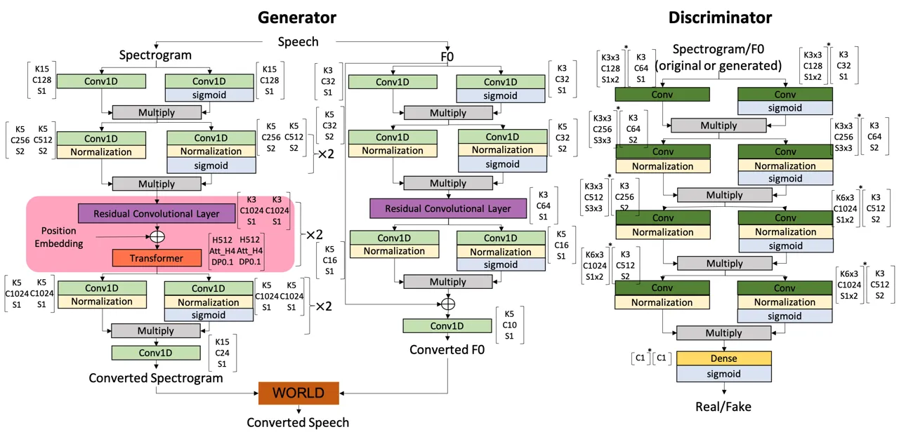
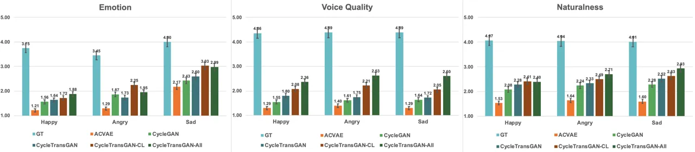

# CycleTransGAN-EVC: A CycleGAN-based Emotional Voice Conversion Model with Transformer

Changzeng Fu ^(†)^(†)thanks: This work was supported by the Grant-in-Aid
for Scientific Research on Innovative Areas JP20H05576 (model training),
and by JST, Moonshot R&D under Grant JPMJMS2011 (model evaluation).   
Chaoran Liu    Carlos Toshinori Ishi    Hiroshi Ishiguro

###### Abstract

In this study, we explore the transformer’s ability to capture
intra-relations among frames by augmenting the receptive field of
models. Concretely, we propose a CycleGAN-based model with the
transformer and investigate its ability in the emotional voice
conversion task. In the training procedure, we adopt curriculum learning
to gradually increase the frame length so that the model can see from
the short segment till the entire speech. The proposed method was
evaluated on the Japanese emotional speech dataset and compared to
several baselines (ACVAE, CycleGAN) with objective and subjective
evaluations. The results show that our proposed model is able to convert
emotion with higher strength and quality.

###### Index Terms: 

emotional speech conversion, cycle-consistent adversarial networks

^(†)^(†)address: ¹Graduate School of Engineering Science, Osaka
University, Japan  
²Advanced Telecommunications Research Institute International, Japan  
³Interactive Robot Research Team, Guardian Robot Project, RIKEN, Japan  
Email: changzeng.fu@irl.sys.es.osaka-u.ac.jp

## 1 Introduction

Emotional voice conversion is a special type of voice conversion (VC),
which aims to transform an utterance’s emotional features into a target
one while retaining the semantic information and speaker identity. Some
earlier research in this field focused on mapping the prosody and
spectrogram with partial least square regression \[1\], Gaussian Mixed
Model (GMM) \[2, 3\], and the sparse representation method \[4, 5\].
Recently, some researchers leverage deep learning methods to improve the
performance of EVC, such as deep neural network (DNN) \[6, 7\],
sequence-to-sequence model (seq2seq) with long-short-term memory network
(LSTM) \[8\], convolutional neural network (CNN) \[9\], as well as their
combinations with the attention mechanism \[10\]. However, these models
require to be trained on parallel data, that is, both the source and
target should be from the same speaker and have identical linguistic
information but in different emotions.

To reduce the models’ reliance on parallel training data, some novel
frameworks are introduced into this field. Gao et al. \[11\] proposed a
nonparallel data-driven emotional speech conversion method with an
auto-encoder. Lately, Ding et al. \[12\] adopted vector quantized
variational autoencoders (VQ-VAE) with the group latent embedding (GLE)
for nonparallel data training. Moreover, to better learn the mapping
function between non-parallel data distributions, cycle-consistent
adversarial network (CycleGAN) \[13, 14\] and variational
autoencoder-generative adversarial network (VAE-GAN) \[15\] were
introduced to EVC task. Furthermore, Moritani et al. \[16\] employed
starGAN to realize non-parallel spectral envelope transformation. These
EVC models with CNN-based layers trained on non-parallel data all
achieved a not bad performance.

Despite the progress made in non-parallel data training, there remains
some room to improve the quality of converted emotional voice. Because
speech is a time series with rich acoustic features, there are some
interactive temporal relationships among frames need to be considered.
Although CNNs are well-known for their ability to handle temporal data.
To process speech data, which is a sort of lengthy temporal sequence,
CNN-based models must be stacked very deep in order to widen the
receptive field. However, the temporal intra-relations would be diluted
layer by layer with this manner and make the model suffer from some
instability problems such as mispronunciations and skipped phonemes.



Figure 1: Neural networks for the proposed model. $`\times n`$ means the
indicated block repeats n times. The type of $`Conv`$ in discriminator
was variant for spectrogram and F0, $`Conv2D`$ was used for spectrogram
whereas $`Conv1D`$ for F0. The data between $`[\ ]`$ are
hyper-parameters we set in the experiment. $`K`$ indicates the kernel
size, $`C`$ stands for the number of filters, $`S`$ is the stride, $`H`$
represents the number of nods for the hidden layer,
$`Att\rule{2.84526pt}{0.14226pt}H`$ is an abbreviation for attention
head, $`DP`$ means the drop out process.$`[\ ]^{*}`$ indicates
hyper-parameters for $`2D`$ processing, $`[\ ]`$ for $`1D`$ processing.

Considering to augment the receptive field of models and the ability to
capture intra-relations among frames, the transformer has been widely
discussed in the field of computer vision \[17\] and natural language
processing \[18\], and its attention distance is also explored. However,
few studies have investigated the capabilities of transformers for the
task of speech generation or conversion. Therefore, to solve the
aforementioned problem, in this study:

- •
  We proposed a CycleGAN-based model with the transformer and
  investigated its ability in the EVC task, we named our model
  CycleTransGAN.
- •
  Moreover, to enhance the model’s ability for converting emotional
  voice, we adopted curriculum learning to gradually increase the frame
  length during the training.
- •
  The proposed method was evaluated on the Japanese emotional speech
  dataset and compared to several baselines (i.e. ACVAE \[19\], CycleGAN
  \[13\]) and the different configurations of our proposed model.

## 2 Proposed Method

### 2.1 Preprocessing

In this study, we extracted F0 and spectrogram from the speech as our
model’s inputs inspired by Zhou et al. \[13\], Ming et al. \[20\], and
Kaneko et al. \[21\]. The following contents demonstrate how the
extraction was conducted.

For extracting the F0 feature, the F0 contour was extracted firstly,
then, the continuous wavelet transform (CWT) was adopted to decompose it
into multiple temporal scales (see Eq.1). $`F0(x)`$ indicates the input
signal, and $`\phi`$ denotes the Mexican hat mother wavelet.

```math
\centering W(F0)(\tau,t)=\tau^{-1/2}\int F0(x)\phi(\frac{x-t}{\tau})dx\@add@centering \tag{1}
```

In this study, we set the CWT analysis at 10 scales with one octave
apart, which can be represented as:

```math
\centering W_{i}(F0)(t)=W_{i}(F0)(2^{i+1}\tau_{0},t)(i+2.5)^{-5/2}\@add@centering \tag{2}
```

where $`i\in[1,10]`$ and $`\tau_{0}=5ms`$. Finally, the signal is
approximately reconstructed as:

```math
\centering F0(t)=\sum_{i=1}^{10}W_{i}(F0)(t)(i+2.5)^{-5/2}\@add@centering \tag{3}
```

For the spectrogram extraction, a three-step method so-called CheapTrick
\[22\] was adopted. First, we calculated the power spectrogram based on
the windowed waveform as Eq.4, the $`y(t)`$ stands for the waveform,
while w(t) indicates the window function:

```math
\centering\int_{0}^{3\tau_{0}}(y(t)w(t))^{2}dt=1.125\int_{0}^{\tau_{0}}y^{2}(t)dt\@add@centering \tag{4}
```

Second, CheapTrick technique smooths the spectrogram with a window of
width $`2w_{0}/3`$, where $`w_{0}=2\pi/\tau_{0}`$:

```math
\centering P(w)=\frac{3}{2w_{0}}\int_{-w_{0}/3}^{w_{0}/3}P(w+\sigma)d\sigma\@add@centering \tag{5}
```

After that, the liftering is carried out in the quefrency domain to
eliminate the fluctuation:

```math
\displaystyle P(w)=exp(\mathcal{F}[l_{s}(\tau)l_{q}(\tau)p_{s}(\tau)]) \tag{6}
```

```math
\displaystyle l_{s}(\tau)=\frac{sin(\pi F0\tau)}{\pi F0\tau}
```

```math
\displaystyle l_{q}(\tau)=q_{0}+2q_{1}cos(2\pi\tau/\tau_{0})
```

```math
\displaystyle p_{s}(\tau)=\mathcal{F}^{-1}[log(P(w))]
```

where $`\mathcal{F}`$ and $`\mathcal{F}^{-1}`$ stands for the Fourier
transform and its inversion respectively. $`l_{s}(\tau)`$ indicates the
liftering function for smoothing the signal, $`l_{q}(\tau)`$ stands for
the liftering function for spectral recovery. $`p_{s}(\tau)`$ represents
the Cepstrum of $`P(w)`$. $`q_{0}`$ and $`q_{1}`$ were set to 1.18 and
-0.09 respectively.

### 2.2 Model and Training Strategy

Given the extracted F0 and spectrogram, we constructed a CycleGAN-based
model with the transformer to learn the converting function on
non-parallel data (see Fig.1).

For converting spectrogram, we first employed the 1-dimension CNN to
encode the features. Meanwhile, another CNN branch with sigmoid
activation function was designed, and multiply it with the encoded
features for selecting the salient ones. Then, we inserted a
normalization layer after 1-dimension CNN and repeated this CNN-based
block two times. After that, a residual convolutional followed with a
transformer layer was designed to capture the temporal relationships
among timesteps. The position embedding was added before feeding
features to the transformer. This block was also repeated two times.
Subsequently, the CNN-based block with a normalization layer was used to
do the feature selection again. Finally, we did a post processing with a
1-dimension CNN.

For converting F0, the structure of the neural network was similar to
the one for the spectrogram. By considering the quantity of information
carried by F0 is much less than that of the spectrogram, we removed the
transformer layer and only utilized each block once to reduce the number
of trainable parameters.

The CNN-based block was also used in the discriminator. Firstly, we
encoded features and selected the salient ones. Then, inserted a
normalization layer after the CNN layer and reused this block three
times. Finally, a dense layer with a sigmoid activation was employed to
output the real/fake label. Note that the types of CNN utilized in the
discriminator were different for spectrogram and F0; for spectrogram,
the 2-dimensional CNN was used, while the 1-dimensional CNN was employed
for F0. Furthermore, the proposed discriminator not only produced a
label at the utterance level, but also gave multiple outputs
(fine-grained level) that presented the real or false samples according
to the frames to determine how close each frame was to the real samples.

|             |         |       |       |       |
| ----------- | ------- | ----- | ----- | ----- |
|             | Neutral | Happy | Anger | Sad   |
| Train (min) | 61.23   | 74.15 | 59.29 | 61.23 |
| Test (min)  | 4.35    | 5.56  | 3.98  | 3.66  |
|             |         |       |       |       |

Table 1: Information of dataset.

1: $`lr=2e-4`$; $`optimizer=Adam(lr,\ beta\_1=0.5)`$;

2: $`input\ length=0.5s`$; $`\alpha=1`$; $`\beta=1`$;

3: $`epochs=500`$

4: while $`input\ length<=max\ length`$ do

5:   for epoch in epochs do

6:    if epoch$`>`$(epochs $`\times`$ 65%) then

7:      $`\alpha=1`$, $`\beta=0.5`$;

8:      $`lr+=-5e-8`$;

9:    end if

10:   end for

11:   $`input\ length\ +=0.5s`$;

12:   $`input\ length\ =min(input\ length\ ,max\ length)`$;

13:   $`\alpha=1`$, $`\beta=1`$;

14: end while

Algorithm 1 Training strategy



Figure 2: Comparisons of MOS with 95% confidence interval to evaluate
emotion similarity, voice quality, and naturalness. GT indicates the
ground truth.

The CycleGAN framework is incorporated with three types of loss: (1)
consistency loss, (2) identity loss, and (3) adversarial loss. Thus, the
loss functions for training the proposed model were defined as follows:
(1) Eq.7 demonstrates the cycle-consistency loss, where $`x_{a}`$ and
$`x_{b}`$ are samples from A emotion and B emotion, respectively,
$`G_{A\rightarrow B}`$ presents a generator to convert a sample from A
to B, and $`G_{B\rightarrow A}`$ for B to A. We calculated the L1 loss
to compare the distance between the reconstructed sample and the
original one, noted as $`\Arrowvert\cdot\Arrowvert_{1}`$. This loss is
supposed to make the emotional information of the input consistent with
the target one.

```math
\displaystyle\centering L_{cyc}(G_{A\rightarrow B}, \displaystyle G_{B\rightarrow A}) \tag{7}
```

```math
\displaystyle=E_{x_{a}}[\Arrowvert G_{B\rightarrow A}(G_{A\rightarrow B}(x_{a}))-x_{a}\Arrowvert_{1}]
```

```math
\displaystyle+E_{x_{b}}[\Arrowvert G_{A\rightarrow B}(G_{B\rightarrow A}(x_{b}))-x_{b}\Arrowvert_{1}]
```

\(2\) Eq.8 introduces the identity loss, which encourages the generator
to convert the input while retaining the original linguistic
information.

```math
\displaystyle\centering L_{id}(G_{A\rightarrow B},G_{B\rightarrow A}) \displaystyle=E_{x_{a}}[\Arrowvert G_{B\rightarrow A}(x_{a})-x_{a}\Arrowvert_{1}] \tag{8}
```

```math
\displaystyle+E_{x_{b}}[\Arrowvert G_{A\rightarrow B}(x_{b})-x_{b}\Arrowvert_{1}]
```

\(3\) The adversarial loss is demonstrated as following equations, where
$`D_{A}`$ and $`D_{B}`$ annotate discriminators for emotions A and B,
respectively. The final adversarial loss is defined as
$`L_{adv}=L_{adv}^{A}+L_{adv}^{B}`$. This loss attempts to tell whether
a generator follows the target distribution.

```math
\displaystyle\centering L_{adv}^{A}(G_{B\rightarrow A},D_{A}) \displaystyle=E_{x_{a}}[D_{A}(x_{a})] \tag{9}
```

```math
\displaystyle+E_{x_{b}}[log(1-D_{A}({G_{A\rightarrow B}(x_{b}))}]
```

```math
\displaystyle L_{adv}^{B}(G_{A\rightarrow B},D_{B}) \displaystyle=E_{x_{b}}[D_{B}(x_{b})]
```

```math
\displaystyle+E_{x_{a}}[log(1-D_{B}({G_{B\rightarrow A}(x_{a}))}]
```

Finally, the overall loss function is defined as:

```math
\centering L=L_{adv}+\alpha L_{cyc}+\beta L_{id}\@add@centering \tag{10}
```

where $`\alpha`$ and $`\beta`$ are constants that will be defined during
training. After converting spectrogram and F0, we employed WORLD vocoder
\[23\] to synthesize the waveform.

## 3 Experiment

### 3.1 Dataset

A Japanese emotional speech dataset \[24\] that contains non-parallel
happy, anger, sad, and neutral utterances was used in this study. Each
category of this dataset has 1070 utterances in total. We assigned 1000
utterances to the training set and the left 70 utterances for the
testing set, the duration of each emotion is presented in Table 1. In
this dataset, each sample has a similar corresponding one in other
emotions. However, these similar samples are not paralleled. Samples of
different emotions are used to express similar meanings with different
expressions and modal particles.

### 3.2 Settings and Baselines

The hyper-parameters were set as Fig.1 shows¹¹ 1 The implementation code
and samples can be found at: https://github.com/CZ26/CycleTransGAN-EVC.
Moreover, we designed a training schedule with curriculum learning. As
the Algorithm 1 demonstrates, we gradually increased the length of input
with 0.5 second every 500 epochs to allow the model to see from the
short speech to the long one. This strategy was supposed to introduce
more detailed emotional features to the model. Furthermore, the learning
rate was decaying, and the weight constant $`\beta`$ was changed to 0.5
from 1 after 325 epochs, and reset back to 1 every 500 epochs.

As for baselines, we retrained the ACVAE \[19\] and CycleGAN \[13\] on
the Japanese emotional speech dataset and compare the performance with
the proposed model. Additionally, to verify the effects of the
fine-grained level discriminator and curriculum learning, we modified
our proposed to different configurations, i.e., CycleTransGAN (without
curriculum learning and fine-grained level discriminator),
CycleTransGAN-CL (with curriculum learning only), CycleTransGAN-All
(with curriculum learning and fine-grained level discriminator).

### 3.3 Results

We adopted Mean Opinion Score (MOS) to subjectively evaluate emotional
level, voice quality and naturalness of the samples. We invited 15
subjects to participate in all the experiments, and each subject
evaluated 20 original utterances from the dataset and 75 converted
utterances. Fig. 2 presents the evaluation results with 95% confidence
interval. The ground truth is the score of original emotional samples.
For the scores of emotion evaluation, the CycleTransGAN-All model
achieves the highest score for happy emotion, while the CycleTransGAN-CL
achieves the highest score for angry and sad emotions. As for the
evaluation of voice quality and naturalness, the CycleTransGAN-all
outperforms all the other models. These results of CycleTransGAN-CL and
CycleTransGAN imply that using curriculum learning improves emotional
feature conversion by allowing the model to learn from the shorter
segment up to the entire sample. This is because the emotion of speech
tends to appear in partly rather than in the whole speech, and the
fine-grained level discriminator somewhat distracts the ability of the
model to focus on the salient segment. Therefore, it leads to
CycleTransGAN-All becomes inferior to CycleTransGAN-CL in terms of
emotion similarity.

## 4 Conclusion

In this study, we proposed a CycleGAN-based emotional voice conversion
model with a transformer, which is named CycleTransGAN. With the help of
the transformer, the model is able to augment the receptive field to a
wider range, which allows the generated speech to be more consistent in
terms of temporal features, solving the instability problems of
mispronunciations and skipped phonemes to some extent. The experiment
results show that the proposed models improve emotion similarity, voice
quality, and naturalness. However, the clarity and emotional strength of
the speech generated by the proposed models still need some further
improvements. Future works will mainly focus on these parts.

## References

- \[1\] Elina Helander, Tuomas Virtanen, Jani Nurminen, and Moncef
  Gabbouj, “Voice conversion using partial least squares regression,”
  IEEE Transactions on Audio, Speech, and Language Processing, vol. 18,
  no. 5, pp. 912–921, 2010.
- \[2\] Ryo Aihara, Ryoichi Takashima, Tetsuya Takiguchi, and Yasuo
  Ariki, “Gmm-based emotional voice conversion using spectrum and
  prosody features,” American Journal of Signal Processing, vol. 2, no.
  5, pp. 134–138, 2012.
- \[3\] Hiromichi Kawanami, Yohei Iwami, Tomoki Toda, Hiroshi
  Saruwatari, and Kiyohiro Shikano, “Gmm-based voice conversion applied
  to emotional speech synthesis,” 2003.
- \[4\] Huaiping Ming, Dongyan Huang, Lei Xie, Shaofei Zhang, Minghui
  Dong, and Haizhou Li, “Exemplar-based sparse representation of timbre
  and prosody for voice conversion,” in 2016 IEEE International
  Conference on Acoustics, Speech and Signal Processing (ICASSP). IEEE,
  2016, pp. 5175–5179.
- \[5\] Ryoichi Takashima, Tetsuya Takiguchi, and Yasuo Ariki,
  “Exemplar-based voice conversion using sparse representation in noisy
  environments,” IEICE Transactions on Fundamentals of Electronics,
  Communications and Computer Sciences, vol. 96, no. 10, pp.
  1946–1953, 2013.
- \[6\] Susmitha Vekkot, Deepa Gupta, Mohammed Zakariah, and
  Yousef Ajami Alotaibi, “Emotional voice conversion using a hybrid
  framework with speaker-adaptive dnn and particle-swarm-optimized
  neural network,” IEEE Access, vol. 8, pp. 74627–74647, 2020.
- \[7\] Zhaojie Luo, Tetsuya Takiguchi, and Yasuo Ariki, “Emotional
  voice conversion using deep neural networks with mcc and f0 features,”
  in 2016 IEEE/ACIS 15th International Conference on Computer and
  Information Science (ICIS). IEEE, 2016, pp. 1–5.
- \[8\] Carl Robinson, Nicolas Obin, and Axel Roebel,
  “Sequence-to-sequence modelling of f0 for speech emotion conversion,”
  in ICASSP 2019-2019 IEEE International Conference on Acoustics, Speech
  and Signal Processing (ICASSP). IEEE, 2019, pp. 6830–6834.
- \[9\] Hirokazu Kameoka, Kou Tanaka, Damian Kwaśny, Takuhiro Kaneko,
  and Nobukatsu Hojo, “Convs2s-vc: Fully convolutional
  sequence-to-sequence voice conversion,” IEEE/ACM Transactions on
  Audio, Speech, and Language Processing, vol. 28, pp. 1849–1863, 2020.
- \[10\] Heejin Choi and Minsoo Hahn, “Sequence-to-sequence emotional
  voice conversion with strength control,” IEEE Access, vol. 9, pp.
  42674–42687, 2021.
- \[11\] Jian Gao, Deep Chakraborty, Hamidou Tembine, and Olaitan
  Olaleye, “Nonparallel emotional speech conversion,” arXiv preprint
  arXiv:1811.01174, 2018.
- \[12\] Shaojin Ding and Ricardo Gutierrez-Osuna, “Group latent
  embedding for vector quantized variational autoencoder in non-parallel
  voice conversion.,” in INTERSPEECH, 2019, pp. 724–728.
- \[13\] Kun Zhou, Berrak Sisman, and Haizhou Li, “Transforming spectrum
  and prosody for emotional voice conversion with non-parallel training
  data,” arXiv preprint arXiv:2002.00198, 2020.
- \[14\] Songxiang Liu, Yuewen Cao, and Helen Meng, “Emotional voice
  conversion with cycle-consistent adversarial network,” arXiv preprint
  arXiv:2004.03781, 2020.
- \[15\] Yuexin Cao, Zhengchen Liu, Minchuan Chen, Jun Ma, Shaojun Wang,
  and Jing Xiao, “Nonparallel emotional speech conversion using
  vae-gan.,” in INTERSPEECH, 2020, pp. 3406–3410.
- \[16\] Asuka Moritani, Ryo Ozaki, Shoki Sakamoto, Hirokazu Kameoka,
  and Tadahiro Taniguchi, “Stargan-based emotional voice conversion for
  japanese phrases,” arXiv preprint arXiv:2104.01807, 2021.
- \[17\] Alexey Dosovitskiy, Lucas Beyer, Alexander Kolesnikov, Dirk
  Weissenborn, Xiaohua Zhai, Thomas Unterthiner, Mostafa Dehghani,
  Matthias Minderer, Georg Heigold, Sylvain Gelly, et al., “An image is
  worth 16x16 words: Transformers for image recognition at scale,” arXiv
  preprint arXiv:2010.11929, 2020.
- \[18\] Chuhan Wu, Fangzhao Wu, and Yongfeng Huang, “Da-transformer:
  Distance-aware transformer,” arXiv preprint arXiv:2010.06925, 2020.
- \[19\] Hirokazu Kameoka, Takuhiro Kaneko, Kou Tanaka, and Nobukatsu
  Hojo, “Acvae-vc: Non-parallel voice conversion with auxiliary
  classifier variational autoencoder,” IEEE/ACM Transactions on Audio,
  Speech, and Language Processing, vol. 27, no. 9, pp. 1432–1443, 2019.
- \[20\] Huaiping Ming, Dongyan Huang, Minghui Dong, Haizhou Li, Lei
  Xie, and Shaofei Zhang, “Fundamental frequency modeling using wavelets
  for emotional voice conversion,” in 2015 International Conference on
  Affective Computing and Intelligent Interaction (ACII). IEEE, 2015,
  pp. 804–809.
- \[21\] Takuhiro Kaneko and Hirokazu Kameoka, “Cyclegan-vc:
  Non-parallel voice conversion using cycle-consistent adversarial
  networks,” in 2018 26th European Signal Processing Conference
  (EUSIPCO). IEEE, 2018, pp. 2100–2104.
- \[22\] Masanori Morise, “Cheaptrick, a spectral envelope estimator for
  high-quality speech synthesis,” Speech Communication, vol. 67, pp.
  1–7, 2015.
- \[23\] Masanori Morise, Fumiya Yokomori, and Kenji Ozawa, “World: a
  vocoder-based high-quality speech synthesis system for real-time
  applications,” IEICE TRANSACTIONS on Information and Systems, vol. 99,
  no. 7, pp. 1877–1884, 2016.
- \[24\] Sara Asai, Koichiro Yoshino, Seitaro Shinagawa, Sakriani Sakti,
  and Satoshi Nakamura, “Emotional speech corpus for persuasive dialogue
  system,” in Proceedings of The 12th Language Resources and Evaluation
  Conference, 2020, pp. 491–497.
