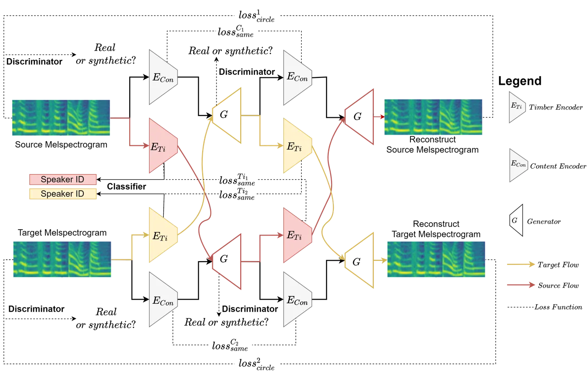
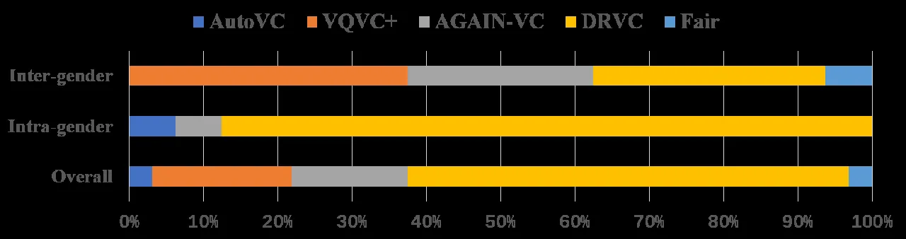
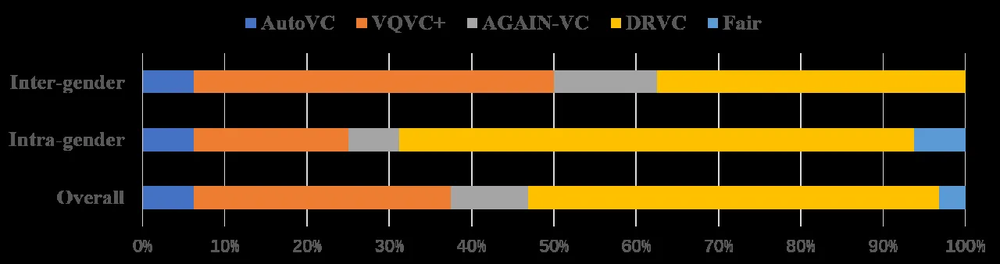

# DRVC: A Framework of Any-to-Any Voice Conversion with Self-Supervised Learning

Qiqi Wang    Xulong Zhang    Jianzong Wang    Ning Cheng    Jing Xiao
^(†)^(†)thanks: ^(\*) Corresponding author: Jianzong Wang,
jzwang@188.com. This paper is supported by the Key Research and
Development Program of Guangdong Province No. 2021B0101400003 and the
National Key Research and Development Program of China under grant No.
2018YFB0204403.

###### Abstract

Any-to-any voice conversion problem aims to convert voices for source
and target speakers, which are out of the training data. Previous works
wildly utilize the disentangle-based models. The disentangle-based model
assumes the speech consists of content and speaker style information and
aims to untangle them to change the style information for conversion.
Previous works focus on reducing the dimension of speech to get the
content information. But the size is hard to determine to lead to the
untangle overlapping problem. We propose the Disentangled Representation
Voice Conversion (DRVC) model to address the issue. DRVC model is an
end-to-end self-supervised model consisting of the content encoder,
timbre encoder, and generator. Instead of the previous work for reducing
speech size to get content, we propose a cycle for restricting the
disentanglement by the Cycle Reconstruct Loss and Same Loss. The
experiments show there is an improvement for converted speech on quality
and voice similarity.

###### Index Terms: 

Voice conversion, Any-to-any, Low resource, Self-supervised, Zero-shot

^(†)^(†)address: ¹Ping An Technology (Shenzhen) Co., Ltd., China  
²University of Auckland, New Zealand

## 1 Introduction

Voice conversion (VC) aims to generate a new voice with the source voice
content and target speaker timbre \[1, 2, 3, 4\]. VC models can be
roughly named as $`multiple_{1}`$-to-$`multiple_{2}`$ models, with
$`multiple_{1},multiple_{2}\in\{one,many,any\}`$, the
$`multiple_{1},multiple_{2}`$ represents the source speakers and the
target speakers, respectively. $`One`$ means the speaker is fixed,
whether the training or inferring process. $`Many`$ and $`any`$
represents the speaker is seen or unseen in the training process,
respectively.

One-to-one VC model is inefficient due to only being able to convert
voice between a fixed pair of source speaker and target speaker, such as
the CycleGAN-VC \[5, 6, 7\]. Even though the any-to-one and many-to-one
can work in uncertain source speaker\[8\], but the target speaker is
also fixed. For VC models with uncertain speaker pair, such as
many-to-many \[9, 10\] and any-to-any  \[11\], widely utilize the
disentanglement-based method. Disentanglement-based models assume that
the speech consists of the content and speaker style information. They
aim to split the two pieces of information from speeches and exchange
the content to achieve the conversion task. But the challenge is to
avoid the overlapping of untangling results \[12, 13\]. AutoVC proposes
to circumspection choose the content dimension to separate the content
information before combining it with the pre-trained speaker
information \[14\]. But it is hard to determine the number of reduced
sizes to avoid residual the source speaker information or loss of the
content. The similar problem also exists in VQVC+, which proposes to use
a codebook to obtain the content information by combining similar
dimensions \[15\]. The suitable codebook size is the key factor to get
mostly content information without speakers’ influence.

The image-to-image (I2I) task aims to convert the target image style to
the source image. Disentangled Representation for Image-to-Image
Translation (DRIT) assumes image consists of content and attribute
information, and two input images have same content \[16\]. Besides, it
novelty utilizes double exchange process for changing the content
information, one for synthesis new image, one for reconstructing image,
to reduce the overlapping of disentanglement.

Inspired by the double exchange process of DRIT, we propose to use the
process to address the untangle overlapping problem without
circumspection choose the content size. The proposed end-to-end
framework is Disentangled Representation Voice Conversion (DRVC).
Comparing to DRIT, we believe neither of the content or style
information is the same between the input speeches. Furthermore, we
design a cycle framework for the double exchange of the style
information with cycle loss and two discriminators. We experiment with
the model on VCC2018, both the subjective and objective results show our
model has better performance.

## 2 Proposed Model

In this section, we will introduce the proposed Disentangled
Representation Voice Conversion (DRVC). The proposed architecture for
voice conversion is shown in Fig.1.



Figure 1: Architecture of the Disentangled Representation Voice
Conversion (DRVC) model.

### 2.1 Overall Architecture

The proposed DRVC model consists the content encoder $`E_{Con}`$,
speaker style encoders $`E_{S}`$, generators $`G`$, voice discriminator
$`D_{v}`$, and domain classifier $`D_{S}`$. Take the target
mel-spectrogram $`B`$ as an example, the content encoder $`E_{Con}`$ map
the melspectrogram into content representation
($`E_{Con}:B\rightarrow C_{B}`$) and the timbre encoder $`E_{S}`$ map
the mel-spectrogram into timbre representation
($`E_{S}:B\rightarrow S_{B}`$). The content encoder and generator
structure are the same, which consists of three CNN layers with the head
and the tail by LSTM layer. We utilize the AdaIN-VC model speaker
encoder \[17\] as the style encoder. The voice discriminator $`D_{v}`$
aims to distinguish the input voice is real or synthesis voice. The
domain classifier $`D_{S}`$ aims to identify the embedding speaker style
information belongs which speaker. The voice discriminator and domain
classifier are multilayer perceptron with two hidden layer. As the voice
conversion target, the generator $`G`$ synthesize the voice conditioned
on both content and timbre vectors
($`G:{[C_{A},S_{B}]}\rightarrow\hat{B}`$).

### 2.2 Disentangle Content and Style Representations

We assume two input voices, $`a`$ and $`b`$, are spoken by two speakers,
$`A`$ and $`B`$. We define the speaker $`A`$ is source speaker, which
provide the content for converted speech. And the style information of
converted speech is given by speaker $`B`$, who is the target speaker.

The proposed DRVC model embeds input voice melspectrograms onto specific
content spaces, $`C_{A},C_{B}`$, and specific style spaces,
$`S_{A},S_{B}`$. It means the content encoder embeds the content
information from input speeches, and the timbre encoders should map the
voices to the specific style information.

```math
\begin{split}\{\boldsymbol{a_{C}},\boldsymbol{a_{S}}\}=\{E_{Con}({a}),E_{S}({a})\},\ \boldsymbol{a_{C}}\in C_{A},\boldsymbol{a_{S}}\in S_{A}\\
\{\boldsymbol{b_{C}},\boldsymbol{b_{S}}\}=\{E_{Con}({b}),E_{S}({b})\},\ \boldsymbol{b_{C}}\in C_{B},\boldsymbol{b_{S}}\in S_{B}\end{split} \tag{1}
```

where, $`a`$ and $`b`$ represent the input source voice mel-spectrogram
and target voice mel-spectrogram, respectively.

We apply two strategies to achieve representation disentanglement and
avoid the overlapping problem: same embedding losses and a domain
discriminator. The content and speaker style information should be
unaltered regardless of the embedding process and input speeches.

```math
\begin{split}\mathcal{L}^{C_{n}}_{same}=\mathbb{E}[|\boldsymbol{a_{C}}-\boldsymbol{\tilde{a_{C}}}|],\ \mathcal{L}^{S_{n}}_{same}=\mathbb{E}[|\boldsymbol{a_{S}}-\boldsymbol{\tilde{a_{S}}}|]\end{split} \tag{2}
```

where, $`\mathcal{L}^{C_{n}}_{same}`$, $`\mathcal{L}^{S_{n}}_{same}`$
are the same loss of content and style information, $`n\in\{a,b\}`$
represents the source and target domains, respectively. And,
$`\tilde{a_{C}}`$ and $`\tilde{a_{S}}`$ means the content and style
information after second conversion, respectively. For sum of content
same loss,
$`\mathcal{L}^{C}_{same}=\sum^{2}_{n}\mathcal{L}^{C_{n}}_{same}`$, and
sum of style same loss,
$`\mathcal{L}^{S}_{same}=\sum^{2}_{n}\mathcal{L}^{S_{n}}_{same}`$. The
total same loss is
$`\mathcal{L}_{same}=\mathcal{L}^{C}_{same}+\mathcal{L}^{S}_{same}`$.

The domain classifier $`D_{v}`$ aims to identify input style hidden
vector belongs to which speaker.

```math
p_{a}=D_{v}(\boldsymbol{a_{S}}),\ p_{b}=D_{v}(\boldsymbol{b_{S}}) \tag{3}
```

```math
\small\mathcal{L}_{domain}=-\frac{1}{2}(\sum_{i}y_{a}(i)log(p_{a}(i))+\sum_{i}y_{b}(i)log(p_{b}(i))) \tag{4}
```

where, $`y`$ is the real target, $`p`$ is the predicted target.

### 2.3 Cycle Loss

The proposed model performs voice conversion by combining the source
voice content $`\boldsymbol{a_{C}}`$ and the target voice timbre
$`\boldsymbol{b_{S}}`$. Similar to the CycleGAN-VC, we propose to use a
cycle process (i.e., $`B\rightarrow\tilde{A}\rightarrow\hat{B}`$) to
train the generator $`G`$. And we will exchange the timbre and content
information twice. Furthermore, we use a cross-cycle consistency as a
loss function $`\mathcal{L}_{cycle}`$.

First conversion. Given a non-corresponding pair of voices’
mel-spectrogram $`a`$ and $`b`$, we have the content information
$`\{\boldsymbol{a_{C},b_{C}}\}`$, and style information
$`\{\boldsymbol{a_{S},b_{S}}\}`$. Then we exchange the style information
$`\{\boldsymbol{a_{S},b_{S}}\}`$ to generate the
$`\{\tilde{a},\tilde{b}\}`$, where
$`\tilde{a}\in Target\ domain,\tilde{b}\in Source\ domain`$.

```math
\begin{split}\tilde{b}=G(\boldsymbol{b_{C}},\boldsymbol{a_{S}})\\
\tilde{a}=G(\boldsymbol{a_{C}},\boldsymbol{b_{S}})\end{split} \tag{5}
```

Second conversion. To encode the $`\tilde{b}`$ and $`\tilde{a}`$ into
$`\{\boldsymbol{\tilde{b}_{C},\tilde{b}_{S}}\}`$ and
$`\{\boldsymbol{\tilde{a}_{C},\tilde{a}_{S}}\}`$, we swap the style
information $`\{\boldsymbol{\tilde{a}_{S},\tilde{b}_{S}}\}`$ again to
converse the generated voices from first instance.

```math
\begin{split}\hat{a}=G(\boldsymbol{\tilde{a}_{C}},\boldsymbol{\tilde{b}_{S}})\\
\hat{b}=G(\boldsymbol{\tilde{b}_{C}},\boldsymbol{\tilde{a}_{S}})\end{split} \tag{6}
```

After the two stages conversion, the output $`\hat{a}`$ and $`\hat{b}`$
should be the reconstruct of the input $`a`$ and $`b`$. In other words,
the best target of the relation between the input and output is
$`\hat{a}=a`$ and $`\hat{b}=b`$. We use the cross-cycle consistency loss
$`\mathcal{L}_{cross}`$ to enforce this constraint.

```math
\begin{split}\mathcal{L}_{cycle}=\mathbb{E}_{a,b}[||G(E_{Con}(\tilde{a}),E_{S}(\tilde{b}))-a||_{1}\\
+||G(E_{Con}(\tilde{b}),E_{S}(\tilde{a}))-b||_{1}]\end{split} \tag{7}
```

Furthermore, to avoid the generator over-fitting, we propose an identity
loss. Identity loss aims to restrict the generator synthesize original
speech when inputting the original speech content and style information.

```math
\begin{split}\mathcal{L}_{id}=\mathbb{E}_{a,b}[||G(E_{Con}(a),E_{S}(a))-a||_{1}\\
+||G(E_{Con}(b),E_{S}(b))-b||_{1}]\end{split} \tag{8}
```

### 2.4 Adversarial Loss

Inspired by the GAN, we utilize an adversarial loss
$`\mathcal{L}_{adv}`$ to enforce the generated speech to be sound like
natural speech.

We train the voice discriminator by directly input the real voice
$`\{a,b\}`$ and synthesis speeches $`\{\tilde{a},\tilde{b}\}`$. We set
the synthesis speech is fake, and natural speech is real. Besides, we
add a Gradient Reversal Layer in the discriminator.

```math
F(\tfrac{\partial\mathcal{L}_{c}}{\partial\theta_{G}})=-\lambda(\tfrac{\partial\mathcal{L}_{R}}{\partial\theta_{G}}+\tfrac{\partial\mathcal{L}_{F}}{\partial\theta_{G}}) \tag{9}
```

where, $`F(\cdot)`$ is the mapping function of gradient reversal layer,
$`\lambda`$ is the weight adjustment parameters, $`\theta_{G}`$ is the
parameter of the generator. And, $`\mathcal{L}_{R}`$,
$`\mathcal{L}_{F}`$ are the classification loss of real and fake,
respectively. $`R`$ represents real, and $`F`$ means fake.

The adversarial loss $`\mathcal{L}_{adv}`$ is,

```math
\begin{split}\mathcal{L}_{adv}=\mathbb{E}_{R\sim p(a)}[logD_{S}(a)]+\mathbb{E}_{F\sim p(\tilde{a})}[logD_{S}(\tilde{a})]\\
+\mathbb{E}_{R\sim p(b)}[logD_{S}(b)]+\mathbb{E}_{F\sim p(\tilde{b})}[logD_{S}(\tilde{b})]\end{split} \tag{10}
```

where, real A speech $`a`$, real B speech $`b`$, fake A speech
$`\tilde{a}`$, and fake B speech $`\tilde{b}`$ are trained the
discriminator.

The full objective function of the DRVC is:

```math
\begin{split}\mathcal{L}_{all}=\lambda_{cycle}\mathcal{L}_{cycle}+\lambda_{id}\mathcal{L}_{id}+\lambda_{S}\mathcal{L}_{adv}\\
+\lambda_{domain}\mathcal{L}_{domain}+\lambda_{same}\mathcal{L}_{same}\end{split} \tag{11}
```

where, the $`\mathcal{L}_{all}`$ is the total loss of this framework.
The $`\lambda_{cycle}`$, $`\lambda_{id}`$, $`\lambda_{S}`$,
$`\lambda_{domain}`$ and $`\lambda_{same}`$ represent the weight of each
loss.

## 3 Experiments

### 3.1 Dataset

We conduct experiments on the VCC2018 dataset \[18\], which professional
US English speakers record. There are four females and four males voices
as sources, and two females and two males voices as targets. Each
speaker speeches are divided into 35 sentences for evaluation and 81
sentences for training. All speech data is sampling at 22050 Hz. We
utilize all speakers except VCC2SF3, VCC2TF1, VCC2SM3, and VCC2TM1
speakers to train the DRVC model. The remain speakers is used to test
the model performance on any-to-any phase. Besides, we choose VCC2SF4,
VCC2TF2, VCC2SM4, and VCC2TM2 speakers to test for many-to-many phase.

### 3.2 Model Configuration

Our proposed model was trained on a single NVIDIA V100 GPU. We set that
the $`\lambda_{cycle}=5`$, $`\lambda_{id}=2`$, $`\lambda_{S}=1`$,
$`\lambda_{domain}=10`$ and $`\lambda_{same}=50`$. Meanwhile, the decay
of the learning rate is pointed at $`5*10^{-6}`$ every epoch. Following
\[35\], we gradually changed the parameter
$`\lambda==\tfrac{2}{1+exp(-10*k)}-1`$ in speaker classifier, where
$`k`$ is the percentage of the training process. We utilize the Adam
optimizer with $`\beta_{1}=0.9`$, $`\beta_{2}=0.99`$,
$`\epsilon=10^{-9}`$. Besides, we utilize the Mel-GAN as the vocoder.

We utilize the offical codes of AutoVC \[14\], VQVC+ \[15\], and
AGAIN-VC \[19\] as the baselines. We strict follow the instruction of
the provided codes by the authors and use the same training and testing
database with us.

### 3.3 Subjective Evaluation Setting

We set two experiments. The first one aims to evaluate the model
any-to-any performance. There are four subtests, Female to Female
(VCC2SF3-VCC2TF1), Female to male (VCC2SF3-VCC2TM1), Male to Female
(VCC2SM3-VCC2TF1), and Male to Male (VCC2SM3-VCC2TM1). The second aims
to test the model on many-to-many phase. The test includes Female to
Female (VCC2SF4-VCC2TF2), Female to male (VCC2SF4-VCC2TM2), Male to
Female (VCC2SM4-VCC2TF2), and Male to Male (VCC2SM4-VCC2TM2). We
evaluate the synthetic voice performance by using the Mel-cepstral
distortion (MCD) \[20\]. Besides, we also set a subject evaluation tests
for Voice Similarity (VSS) and the speech quality on Mean Opinion Score
(MOS).

Both MOS and VSS are obtained by asking 30 people with an equal number
of gender to rate the output audio clips. About the knowledge
background, testers have different knowledge fields, such as Computer
Vision, Human Resources, Psychology, etc. Listeners can give zero to
five marks to show how they feel the voice is clear (five means the
best) on the MOS. On the VSS test, listeners need to fill the blank to
choose one of the most similar synthesis voices to real or choose none
of them is similar.

| Methods  | Any-to-Any         |                   | Many-to-Many      |                   |
| -------- | ------------------ | ----------------- | ----------------- | ----------------- |
|          | MCD $`\Downarrow`$ | MOS$`\Uparrow`$   | MCD$`\Downarrow`$ | MOS$`\Uparrow`$   |
| Real     | \-                 | 4.65 $`\pm`$ 0.12 | \-                | 4.66 $`\pm`$ 0.21 |
| VQVC+    | 7.47 $`\pm`$ 0.07  | 2.52 $`\pm`$ 0.42 | 7.78 $`\pm`$ 0.07 | 2.62 $`\pm`$ 0.22 |
| AutoVC   | 7.69 $`\pm`$ 0.21  | 2.95 $`\pm`$ 0.56 | 7.61 $`\pm`$ 0.17 | 3.17 $`\pm`$ 0.65 |
| AGAIN-VC | 7.42 $`\pm`$ 0.19  | 2.45 $`\pm`$ 0.34 | 7.64 $`\pm`$ 0.21 | 2.47 $`\pm`$ 0.58 |
| DRVC     | 7.39 $`\pm`$ 0.05  | 3.32 $`\pm`$ 0.36 | 7.59 $`\pm`$ 0.04 | 3.51 $`\pm`$ 0.52 |

Table 1: Comparison of different models in any-to-any and many-to-many.
$`\Downarrow`$ means lower score is better, and $`\Uparrow`$ means
bigger score is better.



(a) Any-to-any phase



(b) Many-to-many phase

Figure 2: Comparison of voice similarity on different models

### 3.4 Result and Discussion

Table 1 shows different models’ MCD and MOS results on both any-to-any
and many-to-many phases. Table 2 shows the ablation experiments result
for the proposed model. Figure 2 shows different models’ voice
similarity result.

Overall result Both subjective and objective shows the proposed model
achieves better performance. Our model average improves by about 0.4
marks in MOS and 0.05 marks on MCD. In inter-gender voice conversion,
the performance of DRVC is similar to the AGAIN-VC. Also, the MCD
results prove AGAIN-VC and MCD have close performance. But the proposed
model also gets a little better improvement on intra-gender voice
conversion. Figure 2 shows the proposed model has much better
performance. Because most of the listeners believe the synthesis
speeches made by DRVC are similar to the target speeches. Table 1 shows
the performance of the baselines is lower than the previously reported.
The previous works are trained based on the VCTK database, including 109
speakers and hundreds of utterances \[21\]. But the VCC2018 only
consists of eight speakers and 116 utterances per speaker is much
smaller than the VCTK. In other words, the utilized database is a
low-resource situation. It is why the baselines are low-performance than
their reports.

Any-to-Any Figure 2 and Table 1 show the proposed method has
outhperformance on all the three evaluation metrics. Especially, in the
intra-gender experiments, most of the listeners believe the synthesis
speeches by the proposed model are closly to the orginal speeches.

Many-to-Many Figure 2 shows all of these models have a better
performance on the many-to-many phase. Because the target speaker is
already seen in the training process, it will be easy to synthesize
speech. However, the many-to-many MCD result is better than any-to-any.
Due to the MCD calculates the differences on two mel-spectrograms and
mel-spectrograms can not represent the voice naturalness. It may have
different evaluation results. The MOS test shows the many-to-many has
better performance. Besides, the proposed model has a bigger ratio on
any-to-any in VSS evaluation. But it not represents the proposed model
worse in the many-to-many phase. Due to all methods are improved,
respondents may have disagreements. The number of respondents who chose
baseline is increasing. Even though the disagreement exists, the
proposed model also has a little better performance on the many-to-many
phase.

Ablation experiments We set the ablation experiments to compare the MCD
results by removing the used loss functions in DRVC. Table 2 shows to
utilize the full loss functions is much better than delete any one of
them. Besides, as expected to remove the Domain Loss or Voice Same Loss
pose the highest MCD result. Because the group of Domain Loss and Voice
Same Loss is used to restrict the speeches with the same speaker have
the same disentanglement results. The interesting finding is when
removing the adversarial loss also leads to the high MCD problem. The
reason is the synthesis speech without the adversarial loss restriction
is unnatural. These speeches may have more different frames than natural
speeches. The sounds of synthesis audio prove this reason which is the
most unnatural of these experiments.

| Model                      | MCD$`\Downarrow`$ |
| -------------------------- | ----------------- |
| DRVC w/o Cycle Loss        | 7.68 $`\pm`$ 0.26 |
| DRVC w/o Identity Loss     | 7.63 $`\pm`$ 0.14 |
| DRVC w/o Domain Loss       | 7.72 $`\pm`$ 0.12 |
| DRVC w/o Voice Same Loss   | 7.75 $`\pm`$ 0.32 |
| DRVC w/o Content Same Loss | 7.50 $`\pm`$ 0.32 |
| DRVC w/o Adversarial Loss  | 7.72 $`\pm`$ 0.35 |
| DRVC                       | 7.39 $`\pm`$ 0.05 |

Table 2: Ablation experiments on the proposed model. $`\Downarrow`$
means lower score is better.

## 4 Conclusion

We propose the Disentanglement Representative Voice Conversion (DRVC)
framework to address the disentanglement overlapping problem and avoid
subjectively choosing the content size. DRVC uses a cycle process, and a
series of untangling loss functions to restrict the content and style
information is non-overlapping. The experiment results with the VCC2018
dataset demonstrate that DRVC better performance on MOS and MCD.

## 5 Acknowledgement

This paper is supported by the Key Research and Development Program of
Guangdong Province No. 2021B0101400003 and the National Key Research and
Development Program of China under grant No. 2018YFB0204403.

## References

- \[1\] Songxiang Liu, Yuewen Cao, Disong Wang, Xixin Wu, Xunying Liu,
  and Helen Meng, “Any-to-many voice conversion with location-relative
  sequence-to-sequence modeling,” IEEE ACM Trans. Audio Speech Lang.
  Process., vol. 29, pp. 1717–1728, 2021.
- \[2\] Huaizhen Tang, Xulong Zhang, Jianzong Wang, Ning Cheng, and Jing
  Xiao, “Avqvc: One-shot voice conversion by vector quantization with
  applying contrastive learning,” in 2022 IEEE International Conference
  on Acoustics, Speech and Signal Processing (ICASSP2022). IEEE, 2022,
  pp. 1–5.
- \[3\] Mingjie Chen, Yanpei Shi, and Thomas Hain, “Towards low-resource
  stargan voice conversion using weight adaptive instance
  normalization,” in ICASSP, 2021, pp. 5949–5953.
- \[4\] Tomoki Hayashi, Wen-Chin Huang, Kazuhiro Kobayashi, and Tomoki
  Toda, “Non-autoregressive sequence-to-sequence voice conversion,” in
  ICASSP, 2021, pp. 7068–7072.
- \[5\] Xulong Zhang, Jianzong Wang, Ning Cheng, Edward Xiao, and Jing
  Xiao, “CycleGEAN:cycle generative enhanced adversarial network for
  voice conversion,” in IEEE Automatic Speech Recognition and
  Understanding Workshop (ASRU2021). 2021, pp. 1–6, IEEE.
- \[6\] Toru Nakashika, Tetsuya Takiguchi, and Yasuo Ariki, “Voice
  conversion using RNN pre-trained by recurrent temporal restricted
  boltzmann machines,” IEEE ACM Trans. Audio Speech Lang. Process., vol.
  23, no. 3, pp. 580–587, 2015.
- \[7\] Huaizhen Tang, Xulong Zhang, Jianzong Wang, Ning Cheng, Zhen
  Zeng, Edward Xiao, and Jing Xiao, “TGAVC: Improving autoencoder voice
  conversion with text-guided and adversarial training,” in IEEE
  Automatic Speech Recognition and Understanding Workshop (ASRU2021).
  2021, pp. 1–6, IEEE.
- \[8\] Lifa Sun, Kun Li, Hao Wang, Shiyin Kang, and Helen M. Meng,
  “Phonetic posteriorgrams for many-to-one voice conversion without
  parallel data training,” in ICME, 2016, pp. 1–6.
- \[9\] Yun Kyung Lee, Hyun Woo Kim, and Jeon Gue Park, “Many-to-many
  unsupervised speech conversion from nonparallel corpora,” IEEE Access,
  vol. 9, pp. 27278–27286, 2021.
- \[10\] Chao Wang and Yibiao Yu, “Non-parallel many-to-many voice
  conversion using local linguistic tokens,” in ICASSP, 2021, pp.
  5929–5933.
- \[11\] Yist Y. Lin, Chung-Ming Chien, Jheng-Hao Lin, Hung-yi Lee, and
  Lin-Shan Lee, “Fragmentvc: Any-to-any voice conversion by end-to-end
  extracting and fusing fine-grained voice fragments with attention,” in
  ICASSP, 2021, pp. 5939–5943.
- \[12\] Siyang Yuan, Pengyu Cheng, Ruiyi Zhang, Weituo Hao, Zhe Gan,
  and Lawrence Carin, “Improving zero-shot voice style transfer via
  disentangled representation learning,” in ICLR, 2021.
- \[13\] Zhonghao Li, Benlai Tang, Xiang Yin, Yuan Wan, Ling Xu, Chen
  Shen, and Zejun Ma, “Ppg-based singing voice conversion with
  adversarial representation learning,” in ICASSP, 2021, pp. 7073–7077.
- \[14\] Kaizhi Qian, Yang Zhang, Shiyu Chang, Xuesong Yang, and Mark
  Hasegawa-Johnson, “Autovc: Zero-shot voice style transfer with only
  autoencoder loss,” in ICML, 2019, vol. 97 of Proceedings of Machine
  Learning Research, pp. 5210–5219.
- \[15\] Da-Yi Wu, Yen-Hao Chen, and Hung-yi Lee, “VQVC+: one-shot voice
  conversion by vector quantization and u-net architecture,” in
  Interspeech, 2020, pp. 4691–4695.
- \[16\] Hsin-Ying Lee, Hung-Yu Tseng, Qi Mao, Jia-Bin Huang, Yu-Ding
  Lu, Maneesh Singh, and Ming-Hsuan Yang, “DRIT++: diverse
  image-to-image translation via disentangled representations,” Int. J.
  Comput. Vis., vol. 128, no. 10, pp. 2402–2417, 2020.
- \[17\] Ju-Chieh Chou and Hung-yi Lee, “One-shot voice conversion by
  separating speaker and content representations with instance
  normalization,” in Interspeech, 2019, pp. 664–668.
- \[18\] Jaime Lorenzo-Trueba, Junichi Yamagishi, Tomoki Toda, Daisuke
  Saito, Fernando Villavicencio, Tomi Kinnunen, and Zhen-Hua Ling, “The
  voice conversion challenge 2018: Promoting development of parallel and
  nonparallel methods,” in Odyssey, 2018, pp. 195–202.
- \[19\] Yen-Hao Chen, Da-Yi Wu, Tsung-Han Wu, and Hung-yi Lee,
  “Again-vc: A one-shot voice conversion using activation guidance and
  adaptive instance normalization,” in Proc. ICASSP, 2021, pp.
  5954–5958.
- \[20\] Erika Brandt, Frank Zimmerer, Bistra Andreeva, and Bernd
  Möbius, “Mel-cepstral distortion of german vowels in different
  information density contexts,” in Interspeech, 2017, pp. 2993–2997.
- \[21\] Christophe Veaux, Junichi Yamagishi, Kirsten MacDonald, et al.,
  “Superseded-cstr vctk corpus: English multi-speaker corpus for cstr
  voice cloning toolkit,” 2016.
