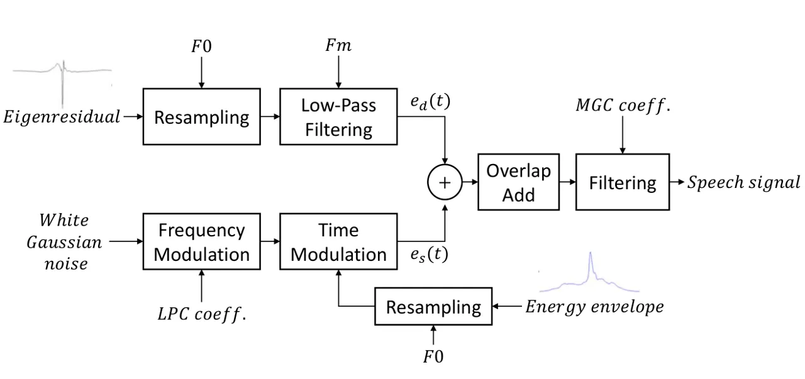
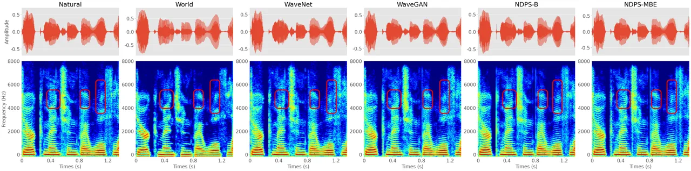
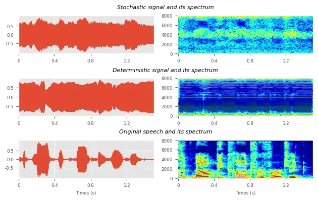
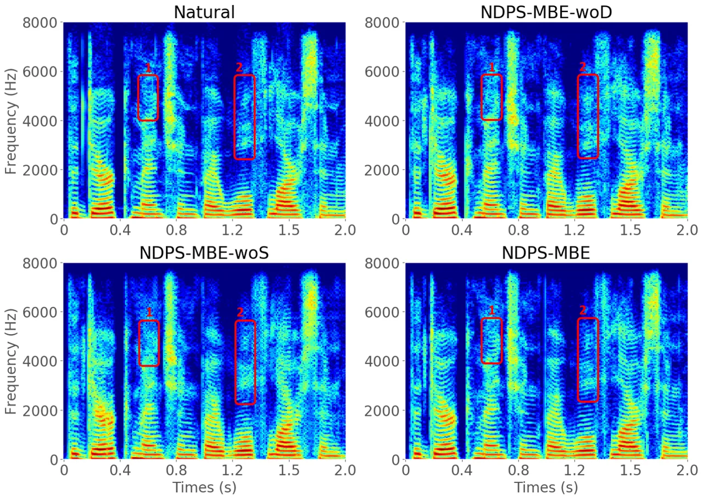
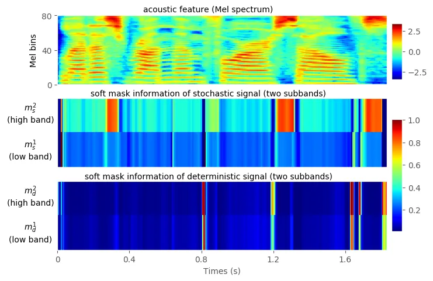
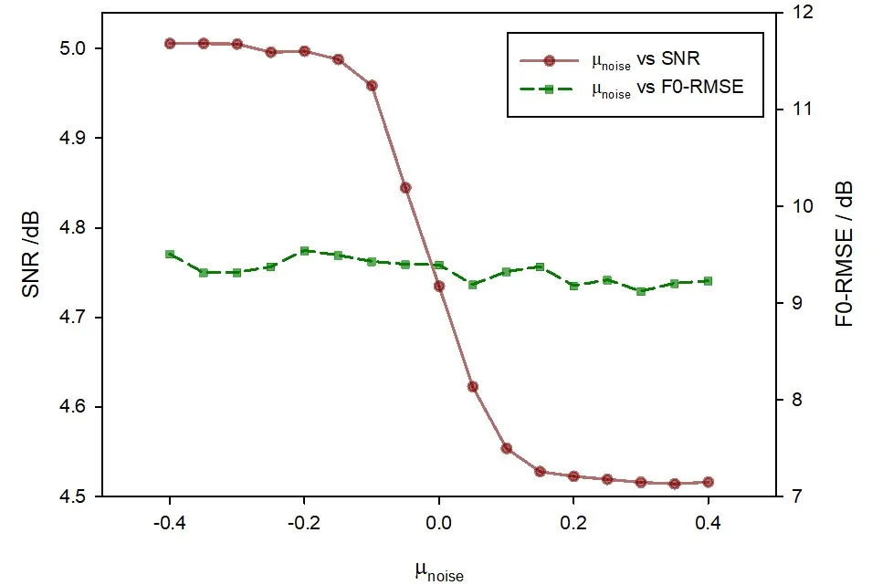
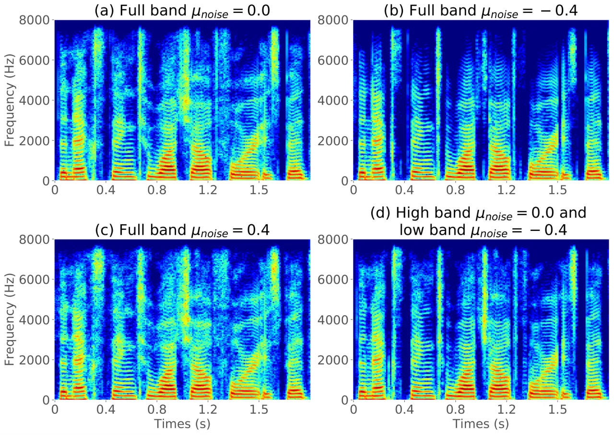

# NeuralDPS: Neural Deterministic Plus Stochastic Model with Multiband Excitation for Noise-Controllable Waveform Generation

Tao Wang    Ruibo Fu    Jiangyan Yi    Jianhua Tao    and Zhengqi Wen
^(†)^(†)thanks: T. Wang is with the National Laboratory of Pattern
Recognition, Institute of Automation, Chinese Academy of Science,
Beijing 100190, China, and also with the School of Artificial
Intelligence, University of Chinese Academy of Sciences, Beijing 100190,
China (e-mail: tao.wang@nlpr. ia.ac.cn).^(†)^(†)thanks: R. Fu, J. Yi, J.
Tao and Z. Wen are with the National Laboratory of Pattern Recognition,
Institute of Automation, Chinese Academy of Sciences, Beijing 100190,
China (e-mail: {ruibo.fu, jiangyan.yi, jhtao,
zqwen}@nlpr.ia.ac.cn).^(†)^(†)thanks: Corresponding Author: Ruibo Fu,
Jiangyan Yi, Jianhua Tao. E-mail: {ruibo.fu, jiangyan.yi,
jhtao}@nlpr.ia.ac.cn.

###### Abstract

The traditional vocoders have the advantages of high synthesis
efficiency, strong interpretability, and speech editability, while the
neural vocoders have the advantage of high synthesis quality. To combine
the advantages of two vocoders, inspired by the traditional
deterministic plus stochastic model, this paper proposes a novel neural
vocoder named NeuralDPS which can retain high speech quality and acquire
high synthesis efficiency and noise controllability. Firstly, this
framework contains four modules: a deterministic source module, a
stochastic source module, a neural V/UV decision module and a neural
filter module. The input required by the vocoder is just the spectral
parameter, which avoids the error caused by estimating additional
parameters, such as F0. Secondly, to solve the problem that different
frequency bands may have different proportions of deterministic
components and stochastic components, a multiband excitation strategy is
used to generate a more accurate excitation signal and reduce the neural
filter’s burden. Thirdly, a method to control noise components of speech
is proposed. In this way, the signal-to-noise ratio (SNR) of speech can
be adjusted easily. Objective and subjective experimental results show
that our proposed NeuralDPS vocoder can obtain similar performance with
the WaveNet and it generates waveforms at least 280 times faster than
the WaveNet vocoder. It is also 28% faster than WaveGAN’s synthesis
efficiency on a single CPU core. We have also verified through
experiments that this method can effectively control the noise
components in the predicted speech and adjust the SNR of speech.

###### Index Terms: 

vocoder, speech synthesis, deterministic plus stochastic, multiband
excitation, noise control

## I Introduction

A vocoder is used to generate a speech waveform with a parametric
representation that can be converted back into a speech waveform \[1\].
Since it is convenient to use the parameter representation to model
speech, the vocoders are widely used in various tasks, such as
statistical parametric speech synthesis \[2\], voice conversion \[3\],
singing voice synthesis \[4, 5\] and speech coding \[6, 7\]. A good
vocoder is considered to restore the original waveform as much as
possible through the parameter representation. However, since the
parameter representation of speech is usually lossy, this brings great
difficulties to model high-quality speech \[8\].

In terms of statistical parameter speech synthesis (SPSS) \[2\], the
source-filter model \[9\] is used as the basic model of traditional
vocoders. It assumes the speech is the convolution between the
excitation signal and the filter. Among them, the excitation signal is
the mixture of periodic signal and aperiodic signal, and the filter
models spectral envelope of speech which represents vocal tract \[10\].
This model works well for speech. The advantage of traditional vocoder
is that it runs fast, and the output speech can be modified by
modifying” the excitation signal and filter parameters \[11\]. But the
disadvantage is the low speech quality. There are two reasons for poor
speech quality, one is the inaccurate estimation of acoustic features,
and the other is the limitation of the physical model \[12, 13\].
Especially, the excitation signal is over-simple, which is usually
simulated by the superposition of a periodic signal controlled by the
fundamental frequency and a noise signal. Many researchers try to enrich
the excitation signal to make the pronunciation more natural and
accurate, such as the mixed excitation vocoder \[14\], glottal vocoder
\[15\], sinusoidal vocoder \[16, 17\], and deterministic plus stochastic
model \[18\]. Since this paper is inspired by the deterministic plus
stochastic vocoder, we take it as an example. It is proposed to retain a
more detailed excitation signal by substituting the pulse train with a
residual signal which is shown in Fig. 1. Quoting \[18\], the
deterministic component can be defined as anything in the signal that is
not noise (i.e., a perfectly predictable part), the stochastic component
is defined as the residual signal obtained by subtracting the original
speech signal’s sinusoidal components. Both components are then
overlap-added to obtain the total excitation signal. The final speech
signal is generated by inputting the total excitation signal to the
Mel-log spectrum approximation filter. Although this vocoder has
achieved competitive performance in traditional vocoders \[18\], the
synthesized speech is still not natural enough because it is still too
simple to use the traditional signal processing method to simulate human
pronunciation. However, its high generation efficiency and interpretable
characteristics still have efficient value.



Fig. 1: Workflow of the traditional deterministic plus stochastic
vocoder. Input features are the target pitch F0 and the MGC filter
coefficients. All other data is precomputed on a training dataset. The
deterministic component $`e_{d}(t)`$ consists of the eigen residual
resampled such that its length is twice the target pitch period. The
stochastic part $`e_{s}(t)`$ is a white noise modulated by the
autoregressive model and multiplied in time by the energy envelope. The
energy envelope is also resampled to the target pitch. Both components
are then overlap-added.

With the development of machine learning \[19\], more breakthroughs have
been reported for the vocoder. One of the pioneering works is WaveNet
\[20, 21\]. In this work, the source-filter model is abandoned, and the
speech generation is modeled by the convolutional neural network \[22\].
On this basis, works such as WaveRNN \[23\] and SampleRNN \[24\] are
derived. The generated speech of these vocoders can be comparable to
human voices. Their common idea is to generate waveform points through
autoregression form by only using a neural network. Because of the
autoregressive generation form, these vocoders can learn the temporal
relationship between sequences well and synthesize high-quality speech.
However, due to the larger number of speech waveform points, it is
inefficient to generate speech in autoregressive form \[25\]. To improve
the speed of synthesis, some parallel neural vocoders have been
proposed. According to the principle, these vocoders can be classified
into Flow-based model \[26\], GAN-based model \[27, 28, 29\], VAE-based
model \[30\], etc. \[25, 31\]. Most of these vocoders have in common
assumption that the speech can be mapped to a noise signal with a known
distribution. Based on this assumption, models with different principles
have different optimization criteria. For example, WaveGAN \[26\]
optimizes the generative model through joint training an adversarial
network \[27\]; WaveGLOW \[30\] is trained using a single cost function:
maximizing the likelihood of the training data. Although these networks
can produce high-quality speech, they often have low training efficiency
or instability because the assumption that the speech is completely
mapped from noise, which will increase the burden of neural filter.
Besides, since the neural network is hard to interpret, it’s impossible
to edit the speech like the traditional vocoder.

Some researchers try to combine traditional vocoder and neural network
vocoders to achieve good synthesis efficiency and speech quality.
According to the source-filter model, speech generation is mainly
divided into two modules: excitation module and filter module. The
neural network vocoder mentioned earlier simulates the excitation source
and the filter model at the same time. Some recent research works have
found that one part adopts traditional methods, and the other part
adopts a neural network, can generate high-quality speech while
maintaining high-efficiency synthesis. For example, LPCNET \[32\] uses a
simple all-pole linear filter to represent the vocal tract response
model. Then it uses a simple RNN network \[33\] to predict the residual
signal, which can reduce the complexity of the neural network and
improve the synthesis efficiency. However, LPCNET is still in the form
of autoregressive, which will face limitations when requires higher
efficiency. To achieve parallel synthesis, another study attempts to
improve from the excitation module. The neural source filter module
(NSF) \[34\] uses the fundamental frequency (F0) and the voiced and
unvoiced (V/UV) flags to simulate the excitation source, which can bring
prior knowledge to the neural vocoder. Similar work includes HiNet
\[35\], GlotNet \[36\], etc. However, specific parameter estimates are
required for the excitation model, such as F0 and V/UV flag. On the one
hand, inaccurate F0 estimates or V/UV flag estimates often introduce
very noticeable degradations in the synthesized speech. On the other
hand, the traditional excitation source is still too simple, which may
bring difficulties in reconstructing voice details. Therefore, a better
solution is to learn the excitation source automatically through neural
network, which can not only avoid the disadvantages of parameter
estimation and oversimplification of the traditional source model, but
also match the neural filter model more closely, the effect of vocoders
may be further improved.

This paper explores the approaches to improve the run-time efficiency of
neural vocoder by modeling a more suitable waveform generation model
through neural network. There are three main contributions. Firstly,
inspired by the traditional deterministic plus stochastic vocoder
\[18\], which views the source model from a broader perspective as
consisting of deterministic component and stochastic component, this
paper proposes a baseline neural deterministic plus stochastic (NDPS-B)
model. It has four parts: deterministic source module, stochastic source
module, neural V/UV decision module, and neural filter module. These
modules correspond to each module in the source-filter model, which has
good interpretability and can synthesize natural speech which is similar
to WaveNet. Secondly, since the speech may have different proportions of
deterministic signals and stochastic signals in different frequency
bands, a multiband excitation strategy is adopted to enrich the
excitation signal instead of employing a full band excitation signal.
The NeuralDPS with multiband excitation (NDPS-MBE) can further improve
the quality of synthesized speech. Thirdly, a method to control the
noise components of speech based on NeuralDPS is proposed. This method
can control the signal-to-noise ratio (SNR) of speech by just
controlling the mask value predicted by the neural V/UV decision module,
which can be applied in speech enhancement and other fields.

The experimental results demonstrate that the proposed NDPS-MBE vocoder
generates waveforms at least 280 times faster than the WaveNet vocoder
and it is also 28% faster than WaveGAN’s synthesis efficiency on a
single CPU core. The speech quality of NDPS-MBE is comparable to that of
WaveNet. In addition, we conduct detailed ablation experiments on
NDPS-MBE to verify each module’s role and improve the interpretability
of the model. We have also verified through experiments that we can
effectively control the noise components in the predicted speech and
adjust SNR of the speech.

This paper is structured as follows. The proposed vocoders (NDPS-B &
NDPS-MBE) and the way to control noise are described in Section II.
After explaining the experiments in Section III, we draw a conclusion in
Section IV.

Fig. 2: Structure of baseline NeuralDPS model (NDPS-B). Conv and
Upsample denote convolution and upsamping layers, respectively.

## II Neural deterministic plus stochastic model

In this section, we first propose a baseline neural deterministic plus
stochastic (NDPS-B) model that is parallel in generation and
straightforward in implementation. Based on the NDPS-B model, we add a
multiband excitation strategy to enrich the excitation signal’s
information and further improve speech quality, denoted as DNPS-MBE.
Finally, based on the proposed model, we present a method to control the
noise components in the synthesized speech.

### II-A Baseline NeuralDPS model (NDPS-B)

The baseline NeuralDPS (NDPS-B) shown in Fig. 2 is composed of four
modules, which converts the acoustic feature sequence (for example, Mel
spectrum \[37\]) $`\textbf{C}=[C_{1},\cdots,C_{B}]`$ of length $`B`$
into a speech waveform
$`\widehat{\textbf{O}}=[\widehat{O}_{1},\cdots,\widehat{O}_{T}]`$ of
length $`T`$. A deterministic source module is used to generate the
deterministic signal $`\bm{e_{d}}=[{e_{d}}_{1},\cdots,{e_{d}}_{T}]`$ and
a stochastic source module generates the stochastic signal
$`\bm{e_{s}}=[{e_{s}}_{1},\cdots,{e_{s}}_{T}]`$. A neural V/UV decision
module predicts the soft mask value of the deterministic signal and the
stochastic signal. Finally, a neural filter module is designed to output
the waveforms signal $`\widehat{\textbf{O}}`$ by combining the
deterministic signal $`\bm{e_{d}}`$ and the stochastic signal
$`\bm{e_{s}}`$ with the mask information.

#### II-A1 Deterministic Source Module

A deterministic signal is defined as anything that is not noise, in
other words, anything that can be perfectly predicted from the past
measured acoustic features. So the deterministic signal
$`\bm{e_{d}}=[{e_{d}}_{1},\cdots,{e_{d}}_{T}]`$ is generated from the
acoustic features C. Since the acoustic features are in the frequency
domain, while the excitation signal is in the time domain, we use a
series of upsampling and convolutional operations \[34\] to transform
acoustic features $`\bm{C}`$ into excitation signals $`\bm{e_{d}}`$ in
the time domain. A stack of residual blocks \[38\] follows each
transposed convolutional layer with dilated convolutions \[20\]. As the
number of network layers increases, the receptive field of convolution
layers will increase exponentially, leading to better long-range
correlation in the learned deterministic signal.

#### II-A2 Stochastic Source Module

In the traditional vocoders, the stochastic signal
$`\bm{e_{s}}=[{e_{s}}_{1},\cdots,{e_{s}}_{T}]`$ corresponds to a white
gaussian noise $`g(t)`$ convolved with a filter model $`h(t)`$ whose
time structure is controlled by an energy envelope $`r(t)`$ \[18\],
which can be expressed as:

```math
e_{s}(t)=r(t)\cdot[h(t)*g(t)] \tag{1}
```

The use of $`h(t)`$ and $`r(t)`$ is required to account respectively for
the spectral and temporal modulations.

In the stochastic source module, we use a multi-layer dilated
convolutional network to model the filter $`h(t)`$ and use the acoustic
features $`\bm{C}`$ as the condition information. Firstly, to combine
the acoustic features information, we upsample the acoustic features
through convolution and upsampling networks and get the hidden features
$`\bm{\widehat{C}}=[\widehat{C}_{1},\cdots,\widehat{C}_{T}]`$. Then, we
use the gaussian noise $`\bm{g}=[g_{1},\cdots,g_{T}]`$ as input and
expend it in dimension through an FF layer as
$`tanh(\bm{w}\cdot\bm{g}+\bm{b})`$, where $`\bm{w}`$ is the
transformation matrix and $`\bm{b}`$ is the bias. Thirdly, the expanded
signal is processed by a dilated-conv layer, summed with the conditioned
feature $`\bm{\widehat{C}}`$, processed by the gated activation unit
based on $`tanh`$ and $`sigmoid`$, and transformed by two additional FF
layers. This procedure is repeated $`n`$ times, and the dilation size of
the dilated convolution layer in the $`k`$-th stage is set to
$`2^{k-1}`$. It should be noted that the number of repetitions $`n`$
does not need to be too large because stochastic signals are similar to
noise and do not require too large receptive field. The output after the
$`n`$ stages is inputted to a FF layer with output dimension 1. The FF
layer’s output is the stochastic signal $`\bm{e_{s}}`$.

#### II-A3 neural V/UV decision module

Fig. 3: The structure of neural V/UV decision module.

The neural V/UV decision module simulates the function of deciding the
V/UV flag in the traditional vocoder. However, different from the
traditional V/UV decision module, this module predicts the soft mask
values of deterministic signal $`\bm{e_{d}}`$ and stochastic signal
$`\bm{e_{s}}`$. The range of the mask value is 0 to 1. At a specific
moment, the greater the mask value of an excitation signal
($`\bm{e_{d}}`$ or $`\bm{e_{s}}`$), the greater the probability of
selecting the excitation signal at that moment, which can help to obtain
more accurate excitation signal.

The structure of the neural V/UV decision module is shown in Fig. 3.
Firstly, we input the acoustic features $`\bm{C}`$ into several
convolutional layers to get the context information
$`\bm{C^{*}}=[C^{*}_{1},\cdots,C^{*}_{B}]`$. Then, the context
information $`\bm{C^{*}}`$ is input into two convolutional networks in
parallel, where the output dimension of the convolutional network is 1,
and the activation function is $`sigmoid`$. The two sets of signals
output by the two convolutional networks are used as frame-level mask
information, which is denoted as
$`\bm{m^{f}_{d}}=[{m^{f}_{d}}_{1},\cdots,{m^{f}_{d}}_{B}]`$ and
$`\bm{m^{f}_{s}}=[{m^{f}_{s}}_{1},\cdots,{m^{f}_{s}}_{B}]`$ with length
$`B`$. To map these frame-level mask value into the time dimension, we
upsample the $`\bm{m^{f}_{d}}`$ and $`\bm{m^{f}_{s}}`$ and obtain the
final mask value $`\bm{m_{d}}=[{m_{d}}_{1},\cdots,{m_{d}}_{T}]`$ and
$`\bm{m_{s}}=[{m_{s}}_{1},\cdots,{m_{s}}_{T}]`$ with length $`T`$. The
process can be expressed as:

```math
\bm{m_{d}}=upsample(sigmoid(\bm{w_{d}}\cdot\bm{C^{*}}+\bm{b_{d}})) \tag{2}
```

```math
\bm{m_{s}}=upsample(sigmoid(\bm{w_{s}}\cdot\bm{C^{*}}+\bm{b_{s}})) \tag{3}
```

where $`\bm{w_{d}}`$ and $`\bm{w_{s}}`$ are the transformation matrix of
the two convolutional networks, $`\bm{b_{d}}`$ and $`\bm{b_{s}}`$ are
the bias.

We use the soft mask value $`\bm{m_{d}}`$ and $`\bm{m_{s}}`$ to mask the
excitation $`\bm{e_{d}}`$ and $`\bm{e_{s}}`$. The masking mechanism can
be expressed as $`\bm{m_{d}}\odot\bm{e_{d}}`$ and
$`\bm{m_{s}}\odot\bm{e_{s}}`$, where $`\odot`$ denotes elements-wise
multiplication. It should be noted that since the mask value is
up-sampled from the mask information at the frame level, it is masked at
the frame level. The advantage of this is to prevent the mask from being
too fine-grained directly at every time instant.

#### II-A4 Neural Filter Module

The function of neural filter module is to receive the masked excitation
signal ($`\bm{m_{d}}\odot\bm{e_{d}}`$ and $`\bm{m_{s}}\odot\bm{e_{s}}`$)
and output the final waveform signal
$`\widehat{\textbf{O}}=[\widehat{O}_{1},\cdots,\widehat{O}_{T}]`$. The
structure of neural filter module is the same as that of stochastic
source module introduced in the Section II-A2. Firstly, we concatenate
the masked deterministic signal $`\bm{m_{d}}\odot\bm{e_{d}}`$ and the
masked stochastic signal $`\bm{m_{s}}\odot\bm{e_{s}}`$ in the non-time
dimension to obtain the total excitation signal, which is denoted as the
$`\bm{I}=[I_{1},\cdots,I_{T}]`$:

```math
\bm{I}=\text{cat}(\bm{m_{d}}\odot\bm{e_{d}},\bm{m_{s}}\odot\bm{e_{s}}) \tag{4}
```

The concatenation rather than addition operation is used here, which can
decouple the stochastic and deterministic signals intuitively. In this
way, the input of the neural filter will be the independent stochastic
signal and deterministic signal, rather than the total excitation signal
after addition.

Then the total excitation signal $`\bm{I}`$ is input into the neural
filter to obtain the final waveform signal $`\bm{\widehat{O}}`$, which
can be expressed as:

```math
\bm{\widehat{O}}=NeuralFilter(\bm{I},\bm{\widehat{C}}) \tag{5}
```

Where $`NeuralFilter`$ is the transformation process of the neural
filter and $`\bm{\widehat{C}}`$ is the hidden features of acoustic
features introduced in Section II-A2.

#### II-A5 Training Criterion

Two loss functions are defined between the predicted waveform
$`\bm{\widehat{O}}`$ and the natural reference $`\bm{O}`$, including a
multi-resolution amplitude spectrum loss and a waveform-domain
adversarial loss. These losses supervise the predicted waveform in
frequency domain and time domain to ensure that the model will not
overfit in any domain.

The multi-resolution amplitude spectrum loss is based on
multi-resolution STFT loss, which is the sum of the STFT losses with
different analysis parameters (i e., FFT size, window size, and
frameshift). For a single STFT loss, we minimize the spectral
convergence $`L_{sc}`$ and log STFT magnitude $`L_{mag}`$ between the
target $`\bm{O}`$ and the reference $`\bm{\widehat{O}}`$.

```math
L_{sc}(\bm{O},\bm{\widehat{O}})=\frac{\||STFT(\bm{O})|-\mid STFT(\bm{\widehat{O}})\|_{F}}{\||STFT(\bm{O})|\|_{F}} \tag{6}
```

```math
L_{\operatorname{mag}}(\bm{O},\bm{\widehat{O}})=\frac{1}{N}\|\log|STFT(\bm{O})|-\log\mid\operatorname{STFT}(\bm{\widehat{O}})\|_{1} \tag{7}
```

where $`\|\cdot\|_{F}`$ and $`\|\cdot\|_{1}`$ represent the Frobenius
and $`L_{1}`$ norms, respectively. $`|STFT(\cdot)|`$ indicates the STFT
function to compute magnitudes and $`N`$ is the number of elements in
the magnitude. For the multi-resolution STFT objective function, there
are $`M`$ single STFT losses with different analysis parameters. We
average the $`M`$ operations through:

```math
L_{stft}(G)=\mathbb{E}_{\bm{O},\bm{\widehat{O}}}\left[\frac{1}{M}\sum_{m=1}^{M}\left(L_{sc}^{m}(\bm{O},\bm{\widehat{O}})+L_{mag}^{m}(\bm{O},\bm{\widehat{O}})\right)\right] \tag{8}
```

Where G represents the generator, that is, the vocoder we propose. We
calculate the multi-resolution STFT loss between the output speech and
the natural speech. In the back-propagation process, the loss can be
propagated to the output of the model through STFT function, which is
discussed in detail in paper \[34\]. Then the gradient at the model
output can be propagated back to all the training parameters of the
model to guide the parameter update \[19\].

To further improve the performance of proposed model, a discriminator is
used to determine whether a waveform is true or false. Similar to
WaveGAN \[25\], the waveform-domain adversarial loss is defined as:

```math
L_{\mathrm{adv}}(G,D)=\mathbb{E}_{\bm{g}\sim N(0,I)}\left[(1-D(G(\bm{g},\bm{C})))^{2}\right] \tag{9}
```

where $`\bm{g}`$ denotes the input gaussian noise. G represents the
generator. D represents the discriminator. The input of D is speech
waveform. The output of the discriminator is the speech type, that is,
natural speech (represented by True) and speech synthesized by the
generator (represented by False).

Finally, the training criterion of the waveform generator is to minimize
the combined loss function:

```math
\mathcal{L}_{Comb}=L_{stft}(G)+\lambda L_{\mathrm{adv}}(G,D),(\lambda>0) \tag{10}
```

Where $`\lambda`$ is a hyperparameter.

### II-B NeuralDPS with multi-band excitation (NDPS-MBE)

Fig. 4: Structure of NeuralDPS model with multiband excitation
(NDPS-MBE). Conv and Upsample denote convolution and upsamping layers,
respectively. The neural V/UV decision module in multiband mode outputs
mask values of excitation signals $`{e_{d}(t)}`$ and $`e_{s}(t)`$ in
different frequency bands.

Although the neural V/UV decision module can learn adequate mask
information similar to V/UV flag, the mask information is for the
full-band speech signal. In the traditional vocoder, the disadvantage of
employing full-band V/UV flag to generate excitation signal is a ”buzzy”
quality especially noticeable in regions of speech which contain mixed
voicing or in regions of noise. This is because the full-band
voiced/unvoiced excitation model produces excitation spectra consisting
entirely of harmonics of the fundamental (voiced) or noise-like energy
(unvoiced) \[39\]. Although the neural filter can alleviate the shortage
of full-band excitation signal to a certain extent, it still brings
additional burden to the neural filter module, which causes some details
to be lost.

A better strategy is to enhance the excitation signal by generating
different frequency bands’ excitation signals, an idea similar to the
multiband excitation vocoder \[39\]. Therefore, we divide deterministic
signal $`\bm{e_{d}}`$ and stochastic signal $`\bm{e_{s}}`$ into several
subbands according to different frequency bands by using the M-channel
perfect-reconstruction (PR) cosine-modulated filter bank \[40\]. It has
emerged as an optimum filter bank with respect to implementation cost
and design ease. To only decompose the excitation signal into multi
subband signals, we just use the analysis filter of the M-channel PR
cosine-modulated filter bank.

The impulse response of the analysis filters $`h_{k}(n)`$ is
cosine-modulated versions of the prototype filter $`h(n)`$, which can be
expressed as:

```math
\displaystyle h_{k}(n) \displaystyle=2h(n)\cos\left((2k+1)\frac{\pi}{2M}\left(n-\frac{N-1}{2}\right)+(-1)^{k}\frac{\pi}{4}\right), \tag{11}
```

```math
\displaystyle(0\leq n\leq N-1,0\leq k\leq M-1)
```

|     | $`\beta`$ | $`N`$ | $`\omega_{c}`$ |
| --- | --------- | ----- | -------------- |
| M=2 | 9         | 62    | 0.142          |
| M=4 | 9         | 84    | 0.04           |

TABLE I: The parameters of prototype filter $`h(n)`$ when $`M=2`$ or
$`M=4`$. $`\beta`$ can be determined by the desired stopband attenuation
\[41\], $`N`$ is the filter order, and $`\omega_{c}`$ is the cutoff
frequency.

Fig. 5: The impulse responses of the analysis filter $`h_{k}(n)`$ when
$`M=2`$ or $`M=4`$ , where $`k`$ is the order of subbands.

Where $`h(n)`$ is the Kaiser window function and the $`N`$ is the length
of $`h(n)`$, $`M`$ is the number of subbands.

The design of the prototype filter $`h(n)`$ is formulated as a problem
of optimizing the cutoff frequency $`\omega_{c}`$, which is introduced
in \[42\]. According to the paper, the coefficients of the prototype
$`h(n)`$ can be expressed in closed form in terms of only three
parameters, $`\beta`$, filter order, $`N`$, and the cutoff frequency,
$`\omega_{c}`$. The principle of our design is to make the overlap of
different sub-bands as small as possible. When the number of subbands
$`M=2`$ or $`M=4`$, the prototype filter parameters we designed are
shown in Table I, and the filter bank’s impulse response is shown in
Fig. 5.

Therefore, we can get different frequency band excitation signals by
convolution of $`h_{k}(n)`$ $`(k=1,2,\dots,M)`$ and excitation signal
$`\bm{e_{s}}`$ and $`\bm{e_{d}}`$. The process can be expressed as
follows:

```math
\bm{e^{k}_{d}}=h_{k}(n)*\bm{e_{d}},(k=1,2,\dots,M) \tag{12}
```

```math
\bm{e^{k}_{s}}=h_{k}(n)*\bm{e_{s}},(k=1,2,\dots,M) \tag{13}
```

where the $`\bm{e^{k}_{d}}`$ and $`\bm{e^{k}_{s}}`$ are the final
subband excitation signal in the $`k`$-th subband, respectively.

Correspondingly, we design the neural V/UV decision module into a
multiband prediction mode. The whole framework of NDPS-MBE is shown in
Fig. 4. The neural V/UV decision module in multiband mode does not
output mask value of the full frequency band but predicts that of
different subbands separately, which can be expressed as follows:

```math
\bm{m_{d}^{k}}=upsample(sigmoid(\bm{w_{d}^{k}}*\bm{C^{*}}+\bm{b_{d}^{k}})) \tag{14}
```

```math
\bm{m_{s}^{k}}=upsample(sigmoid(\bm{w_{s}^{k}}*C^{*}+\bm{b_{s}^{k}})) \tag{15}
```

where $`k`$ denotes the order of subbands, $`\bm{w_{d}^{k}}`$ and
$`\bm{w_{s}^{k}}`$ are the transformation matrix of the convolutional
networks, $`\bm{b_{d}^{k}}`$ and $`\bm{b_{s}^{k}}`$ are the bias.

For the $`k`$-th subband, we use the $`k`$-th mask value
$`\bm{m_{d}^{k}}`$ and $`\bm{m_{s}^{k}}`$ to mask the subband excitation
signals $`\bm{e_{d}^{k}}`$ and $`\bm{e_{s}^{k}}`$, and get the masked
subband excitation signals $`\bm{m_{d}^{k}}\odot\bm{e_{d}^{k}}`$ and
$`\bm{m_{s}^{k}}\odot\bm{e_{s}^{k}}`$. Finally, we concatenate all the
masked subband excitation signal in the non-time dimension to obtain the
total excitation signal $`\bm{I}`$, which can be expressed as:

```math
\bm{I}=cat(\bm{m_{d}^{k}}\odot\bm{e_{d}^{k}},\bm{m_{s}^{k}}\odot\bm{e_{s}^{k}}),(k=1,2,\dots,M)\vskip-2.84544pt \tag{16}
```

### II-C Editing speech by controlling noise

According to Section II-A and Section II-B, we have decoupled the
vocoder as much as possible according to the function and modeled it
with the neural network. Besides, we have also decoupled the
deterministic signal and stochastic signal from the excitation signal.
We can control the noise in speech by decoupling the excitation signal.
For example, if there is too much noise in the original speech and we
want to reduce the noise of the speech, we can reduce the mask value of
the stochastic signal, so as to reduce the input of the stochastic
signal. Finally, some noise in the speech will be removed. Like the
traditional vocoder, in which the speech can be edited according to the
function of different modules, it is also possible for us to control the
quality of speech based on our proposed neural vocoder. This section
presents two methods to control the SNR of speech by controlling the
noise component in predicted speech. We take the NDPS-MBE vocoder as an
example. The first method is to add a fixed constant
$`\mu_{noise}[-1,1]`$ to all the predicted mask value $`\bm{m_{s}^{k}}`$
$`(k=1,2,\dots,M)`$ of stochastic signals. In this way, the noise
component of the predicted speech can be changed. The process can be
expressed as:

```math
\bm{m_{s}^{k}}=\bm{m_{s}^{k}}+\mu_{noise},-1\leq\mu_{noise}\leq 1, \tag{17}
```

```math
\bm{m_{s}^{k}}=clip(\bm{m_{s}^{k}},min=0,max=1) \tag{18}
```

Where $`k=1,2,\dots,M`$. The function $`clip`$ is used to clip the value
of $`\bm{m_{s}^{k}}`$ between 0 and 1 to match the training process of
the model. Specifically, when $`\mu_{noise}>0`$, more stochastic signal
is introduced to the predicted speech, which will add more noise to the
speech, thus reducing the signal-to-noise ratio of the predicted speech.
On the contrary, when $`\mu_{noise}<0`$, the predicted speech’s noise
will be reduced, which will improve the signal-to-noise ratio of speech.

Besides, since the excitation signals have been decomposed according to
different frequency bands in model NDPS-MBE, another method is to
control specific subband’s noise components. For example, we can reduce
the low-frequency band’s noise component to improve the speech quality
because the low-frequency band’s noise component significantly impacts
the sound quality. Simultaneously, the high-frequency band’s stochastic
component is kept unchanged because the high-frequency part contains
more details of speech.

## III EXPERIMENTS AND RESULT ANALYSIS

In the experiment, we adopt two speakers (the female speaker $`slt`$ and
the male speaker $`bdl`$) in CMU-ARCTIC databases \[43\], which contains
English speakers with 16 kHz sampling rate. We chose 1000 and 66
utterances for each speaker to construct the training set and validation
set, respectively. Another 66 utterances from the speakers not included
in the training set and validation set are used as the test set.

To evaluate the vocoder in SPSS-based systems, since the CMU-ARCTIC
databases is too small to train an end-to-end acoustic model, we also
use the LJ Speech Dataset \[44\] to train Tacotron2 \[21\] models and
vocoders. We chose 12600 and 250 utterances to construct the training
set and validation set. Another 250 utterances are used as the test set.
The 80-dim Mel spectrogram used as acoustic features is extracted with
Hann windowing, frameshift of 5 milliseconds, frame length of 50
milliseconds, and 1024-point Fourier transform. Referring to the frame
length setting in Tacotron, we set the frame length of the vocoder to 50
milliseconds.

Six vocoders are compared in our experiments. All models are trained and
evaluated on a single 2080Ti GPU using pytorch \[45\] framework. We
choose the model from the following three perspectives. First, from the
perspective of speech quality. we compared our model with the WaveNet
model. Second, from synthetic efficiency and principle perspective. To
improve the efficiency, some parallel neural vocoders have been
proposed. We choose the model from the following three perspectives.
First, from the perspective of speech quality. we compared our model
with the WaveNet model. Second, from the perspective of synthetic
efficiency and design principle. To improve the efficiency, some
parallel neural vocoders have been proposed. We choose the vocoder,
which is different from our model in some designs. For example,
WaveGAN’s source signal is only a noise signal, while the source signal
of our model is the learned excitation signal. Through the comparison of
the two, the result can reflect the difference between whether there is
a learned excitation signal. In addition, because the design of our
model is mainly reflected in the source model, to reflect the difference
between the source model of automatic learning and the source model of
manual design, we take NSF as the comparison model. The descriptions of
these models are as follows ¹¹ 1 Examples of generated speech can be
found at https://hairuo55.github.io/NeuralDPS..

- •
  WORLD The traditional vocoder which is based on the source-filter
  model. Because there is no open source about traditional deterministic
  plus stochastic model, and the effect of our implementation is not
  good, we use WORLD to represent the traditional vocoder. The WORLD
  vocoder is free software for high-quality speech analysis,
  manipulation and synthesis. It can estimate F0, aperiodicity and
  spectral envelope and also generate the speech like input speech with
  only estimated parameters. We use open source code to implement it²² 2
  https://github.com/mmorise/World..
- •
  WaveNet A 16bit WaveNet-based neural vocoder which is trained using an
  open source implementation³³ 3
  https://github.com/r9y9/wavenet_vocoder.. To train 16kHz vocoder
  model, 3 upsampling layers with upsampling rate {5,4,4} are adopted
  and other configurations remained the same as that of the open source
  implementation. The built model is a mixture density network,
  outputting the parameters for a mixture of 10 logistic distributions
  at each timestep and has 24 dilated convolutional layers which are
  divided into 4 convolution blocks. Each block contained 6 layers and
  their dilation coefficients are increased by an exponential of 2. The
  number of gate channels in gated activation units is 256. An Adam
  optimizer \[46\] is used to update the parameters by minimizing the
  negative log likehood.
- •
  WaveGAN A 16bit Parallel WaveGAN neural vocoder which is trained using
  an open source implementation⁴⁴ 4
  https://github.com/kan-bayashi/ParallelWaveGAN.. To train 16kHz
  vocoder model, 3 upsampling layers with upsampling rate {5,4,4} are
  adopted and other configurations remained the same as that of the open
  source implementation. It has 30 dilated convolutional layers which
  are divided into 10 convolution blocks. Each block contained 3 layers
  and their dilation coefficients are increased by an exponential of 2.
  The number of gate channels in gated activation units is 128.
- •
  NSF An NSF vocoder implemented by ourselves. The model structure is
  the same as that of the WaveGAN. The difference between the NSF and
  WaveGAN is the input excitation signal. The WaveGAN’s input signal is
  noise signal, while the NSF’s input signal is based on the traditional
  source model. Besides, the adversarial loss is added to the loss
  function to be consistent with the NeuralDPS in training criterion. We
  find it can improve the performance of the NSF model, too. The
  strategy of using separate source-filter pairs for the harmonic and
  noise components of waveforms is not adopted here.
- •
  NDPS-B The proposed baseline NeuralDPS vocoder. To ensure the
  consistency of models’ structure as much as possible, we set the
  parameters according to that of WaveNet and WaveGAN. Since NeuralDPS
  can provide a more accurate source signal, we set the number of gate
  channels in the dilated-conv to 64, which is half smaller than
  WaveGAN. In the deterministic source module, the operation of
  dilated-conv and upsample is repeated 3 times ($`n_{1}=3`$), and the
  ratio of upsample is {5,4,4} in order. In the stochastic source
  module, there is 3 dilated convolutional layers which are divided into
  1 convolution block ($`n_{2}=1`$). In the neural filter module, there
  is 24 dilated convolutional layers which are divided into 8
  convolution blocks ($`n_{3}=8`$). Each block of the stochastic source
  module and the neural filter module contains 3 layers and their
  dilation coefficients are increased by an exponential of 2. The number
  of residual channels is 64 and the number of skip channels is 64,
  which is same as that of WaveGAN. For the loss function, three set of
  STFT configurations (FL,FS,FN), i.e., (320,80,512), (640,160,1024) and
  (1960,256,2048), are used for the amplitude spectrum loss. The
  discriminator for generation adversarial learning consists of ten
  layers of non-causal dilated 1-D convolutions with leaky ReLU
  activation function ($`\alpha=0.2`$). The strides are set to one and
  linearly increasing dilations are applied for the 1-D convolutions
  starting from one to eight except for the first and last layers. The
  discriminator is consistent with that of the WaveGAN. An Adam
  optimizer is used to update the parameters. The init learning rate is
  0.001 and the learning rate decreased exponentially.
- •
  NDPS-MBE The proposed NeuralDPS with multiband excitation. The
  difference between NDPS-B and NDPS-MBE is that NDPS-MBE has a process
  of decomposing the excitation signal according to different frequency
  bands. We decompose deterministic signal $`\bm{e_{d}}`$ and stochastic
  signal $`\bm{e_{s}}`$ into 2 subbands ($`M=2`$) respectively based on
  NDPS-B. Therefore, the neural V/UV decision module has four
  convolution layers at the end of the model to output mask value of the
  four subbands. The input dimension of neural filter is changed from 2
  to 4. When the subbands’ number $`M=2`$, the configuration of the
  prototype filter $`h_{n}(t)`$ is shown in the Table I. Other
  configurations are consistent with model NDPS-B.

|     |               | WORLD   | WaveNet | WaveGAN | NDPS-B  | NDPS-MBE |
| --- | ------------- | ------- | ------- | ------- | ------- | -------- |
|     | SNR(dB)       | 0.5569  | 5.4132  | 5.1660  | 4.7130  | 4.7384   |
|     | LAS-RMSE(dB)  | 0.9037  | 0.7534  | 0.7665  | 0.7864  | 0.8005   |
| slt | MCD(dB)       | 3.7937  | 1.2479  | 1.1860  | 1.2866  | 1.3073   |
|     | F0-RMSE(cent) | 11.0624 | 9.6556  | 10.9926 | 9.8536  | 9.3965   |
|     | V/UV error(%) | 4.1273  | 3.3154  | 3.5954  | 3.2924  | 2.8610   |
|     | SNR(dB)       | -0.3357 | 2.8234  | 2.0199  | 1.7275  | 1.9913   |
|     | LAS-RMSE(dB)  | 0.9456  | 0.7659  | 0.7507  | 0.8333  | 0.8172   |
| bdl | MCD(dB)       | 2.4200  | 1.3950  | 1.2638  | 1.3651  | 1.3863   |
|     | F0-RMSE(cent) | 21.6607 | 16.6038 | 17.5691 | 14.7835 | 14.4492  |
|     | V/UV error(%) | 12.1593 | 7.5321  | 8.0851  | 8.1384  | 7.2799   |

TABLE II: OBJECTIVE EVALUATION RESULTS OF WORLD, WAVENET, WAVEGAN,
NDPS-B AND NDPS-MBE ON THE TEST SETS OF TWO SPEAKERS WHEN USING NATURAL
ACOUSTIC FEATURES AS INPUT



Fig. 6: The waveforms and spectrograms of natural speech and the speech
generated by different vocoders when using natural acoustic features as
input for an example sentence.

### III-A Comparison between NDPS and Some Existing Vocoders

This section compares the performance of our proposed NDPS-B and
NDPS-MBE vocoder with three existing representative vocoders, including
WORLD, WaveNet and WaveGAN by objective and subjective evaluations.

First, we compare the distortions between natural speech and the speech
synthesized by these vocoders when using natural acoustic features as
input. Five objective metrics in \[47\] are adopted here, including
signal-to-noise ratio (SNR), which reflects the distortion of waveforms,
root MSE (RMSE) of LAS (denoted by LAS-RMSE), which reflected the
distortion in the frequency domain, Mel-cepstra distortion (MCD), which
described the distortion of Mel-cepstra, MSE of F0 which reflected the
distortion of F0 (denoted by F0-RMSE), and V/UV error which is the ratio
between the number of frames with mismatched V/UV flags and the total
number of frames. Specifically, to calculate the gap between synthesized
speech and natural speech at the waveform point level, we use SNR metric
for evaluation. According to the description in paper \[47\], we first
calculate the SNR value for each frame of speech. In this process, the
natural speech is regarded as signal, and the gap between synthesized
speech and natural speech is regarded as noise. Time shift between
$`\pm 200`$ points that maximizes the correlation between natural speech
and synthesized speech is calculated for each frame, and applied it to
the windowed synthesized speech. The final SNR is calculated for each
frame and averaged over total frames.

The results on the test sets are listed in Table II. Firstly, the World
vocoder has the worst performance on all metric for both speakers, which
shows the advantages of neural network modeling. Secondly, on the SNR,
WaveNet achieved the best performance in the two data sets, while in the
frequency domain metrics LAS-RMSE and MCD, WaveNet and WaveGAN achieve
better performance. This phenomenon shows that our method cannot achieve
the best in both time domain loss and frequency domain loss. Thirdly, by
comparing the F0-RMSE and V/UV error metrics, the NDPS-MBE achieves the
best performance among the five vocoders which implies the advantage of
using a neural V/UV decision module, which can help to learn more
accurate F0 information and V/UV flag. Finally, by comparing model
NDPS-B and model NDPS-MBE, it can be found that the model NDPS-MBE is
better than model NDPS-B on some metric, such as the
$`\text{SNR},\text{F0-RMSE}`$ and V/UV metric. But in terms of frequency
domain metrics LAS-RMSE and MCD, model NDPS-B is better. We speculate
that this is because the full band excitation can provide complete
information, so as to help the model optimize to lower spectrum loss.
The multiband excitation signal can help the model improve the SNR in
the time domain and learn more accurate fundamental frequency
information. It is worth mentioning that, the SNR values in the two test
sets in Table II are at different levels. We attribute this to the
difference in the amount of noise contained in the two test sets.
Specifically, the less the noise component of the data set, the smaller
the gap between the synthesized speech and the natural speech at the
waveform point level, and the higher the SNR value. A similar phenomenon
appears in paper \[47, 35\], which can also prove that it is caused by
the difference between data sets and has nothing to do with the
calculation process.

Fig. 6 shows the waveforms and spectrograms of natural speech and the
speech generated by different vocoders when using natural acoustic
features as input. It can be found that the neural vocoder restores the
overall waveform contours better than the traditional vocoder world. In
addition, by comparing the spectrum of speech synthesized by different
vocoders, it can be found that the WaveNet and WaveGAN models will blur
in the high frequency part, while the speech synthesized by NDPS-B or
NDPS-MBE model has a more clear spectrum in the high frequency part.
This proves the advantage of combining the physical background of
traditional vocoder with neural network.

| Vocoder   | WaveNet | WaveGAN | NDPS-B | NDPS-MBE |
| --------- | ------- | ------- | ------ | -------- |
| RTF (GPU) | 170.217 | 0.015   | 0.010  | 0.011    |
| RTF (CPU) | 603.892 | 3.006   | 2.142  | 2.180    |
| Params(M) | 43.748  | 17.099  | 11.832 | 11.836   |

TABLE III: REAL TIME FACTORS (RTFS) ON GPU AND CPU AND NUMBER OF MODEL
PARAMETERS OF COMPARED VOCODERS

To evaluate the run-time efficiency of different neural vocoders,
real-time factor (RTF), defined as the ratio between the time consumed
to generate speech and the duration of the generated speech, is utilized
as the measurement. The smaller the RTF, the higher the efficiency. In
our implementation, the RTF value is calculated as the ratio between the
time consumed to generate all test sentences using a single GeForce RTX
2080Ti GPU or a single CPU core and the total duration of the test set.
The results are listed in Table III. Our models significantly improve
generation efficiency compared to the autoregressive model WaveNet.
Specifically, the RTF of model NDPS-B on CPU is 2.142, which means that
the NDPS-B needs 2.142s operation time to generate one-second speech on
CPU. Compared with the RTF value (3.006) of WaveGAN on CPU, the
efficiency of our model is improved by 28%. In addition, we compare the
size of the model parameters. The last column of Table III counts the
parameters of each model. It can be observed that the total parameters
of the NDPS-B and NDPS-MBE are much smaller than WaveNet and they are
30% smaller than WaveGAN’s parameters. This is because the learned
excitation signal reduces the burden of the neural filter, thereby
greatly reducing the amount of parameters of the neural filter.

Fig. 7: The MOS score with 95% confidence intervals of the five vocoders
for speaker $`slt`$. ”R” stands for using natural acoustic features as
input and ”P” stands for using predicted acoustic features as input. The
predicted acoustic features are predicted by Tacotron2.

We conduct the Mean Opinion Score (MOS) listening test for speech
quality on the test set regarding the subjective evaluation. We keep the
text content consistent among different models to exclude other
interference factors and examine speech quality. In addition, to
evaluate the performance of the vocoder in the TTS task, we input text
into Tacotron2 \[21\] to predict 80-dim Mel acoustic features. The
predicted acoustic features are input into the vocoder to obtain the
final speech, represented by “P” in Fig. 7. The structure of Tacotron2
is the same as that described in paper \[21\]. We convert text into
phonemes as input to Tacotron2. Twenty listeners participated in the
evaluation. In each experimental group, 20 parallel sentences are
selected randomly from the test sets of each system. Fig. 7 shows the
MOS score of each system. The results show that the model NDSP-B and the
model NDPS-MBE are better than the WaveGAN model. This is because the
WaveGAN only uses noise as excitation signal, while model NDPS-B and
NDPS-MBE can learn more rich excitation signal from noise and acoustic
features. By comparing the WaveNet vocoder and NDPS-MBE vocoder, it can
be observed that there is a small gap between the two vocoders in
subjective evaluation. Although our proposed NDPS-MBE vocoder achieved
similar performance with WaveNet, its run-time efficiency is about 280
times higher on a single CPU core, as shown in Table III. Besides, by
comparing model NDPS-B and model NDPS-MBE, it can be found that the
multi-band excitation strategy can further improve the speech quality.
By using multiband excitation, the neural filter can flexibly select the
excitation signal according to different frequency bands signal rather
than only selecting the full band excitation signal.

### III-B Comparison between NDPS and NSF

In this section, we compare the performance of proposed NDPS-B and
NDPS-MBE with the NSF vocoder. The main difference between our model and
NSF model is adopting different excitation signals. The NSF model
artificially designs the excitation signal through the F0 and the V/UV
flag. The NDPS-B and NDPS-MBE’s excitation signal are learned from
neural network. By comparing with the NSF model, we can find out which
excitation signal is more suitable for the neural vocoder. We add an
adversarial loss for joint training and find that it can improve the NSF
model’s performance.

|               | NDPS-B | NSF     | NDPS-MBE |
| ------------- | ------ | ------- | -------- |
| SNR(dB)       | 4.7130 | 2.4063  | 4.7384   |
| LAS-RMSE(dB)  | 0.7864 | 0.7047  | 0.8005   |
| MCD(dB)       | 1.2866 | 1.3332  | 1.3073   |
| F0-RMSE(cent) | 9.8536 | 11.7124 | 9.3965   |
| V/UV error(%) | 3.2924 | 2.8985  | 2.8610   |

TABLE IV: OBJECTIVE EVALUATION RESULTS OF NDPS-B, NDPS-MBE AND NSF ON
THE TEST SETS OF SPEAKERS $`SLT`$ WHEN USING NATURAL ACOUSTIC FEATURES
AS INPUT

The objective results on the $`slt`$ speaker dataset are listed in Table
IV. It shows model NDPS-MBE is better than NSF on SNR metric, which
means that the learned excitation signal can help the vocoder to learn
more natural speech in the time domain. While the model NSF is better
than model NDPS-MBE in frequency domain metric LAS-RMSE. This shows that
the NSF model could get better performance in frequency domain metric
because of the artificial designed excitation signal, which reduces the
complexity of the model. However, in the synthesized speech of NSF
vocoder, there are often too many harmonics in the high frequency part
of the voiced segment, which affects the speech quality. This may be due
to the simple source model of NSF, resulting in overfitting of the
model. The NDPS-B and NDPS-MBE models are better than NSF in terms of F0
and V/UV metrics. This shows that compared with the manually designed
excitation signal, the automatically learned excitation signal is
helpful to learn more stable and accurate F0 information.

|          |       |       |       |
| -------- | ----- | ----- | ----- |
| NDPS-MBE | NSF   | N/P   | p     |
| 39.75    | 32.25 | 28.00 | 0.027 |

TABLE V: AVERAGE PREFERENCE SCORES (%) ON SPEECH QUALITY BETWEEN
NDPS-MBE AND NSF MODEL WHEN USING NATURAL ACOUSTIC FEATURES AS INPUT,
WHERE N/P STANDS FOR “NO PREFERENCE”

In addition to objective metrics, we conduct ABX tests on our proposed
model and NSF model. In each subjective test, twenty sentences randomly
selected from the test set are synthesized by two comparative vocoders.
At least 20 listeners evaluate each pair of generated speech. The
listeners are asked to judge which utterance in each pair has better
speech quality or no preference. To calculating the average preference
scores, the $`p`$-value of the $`t`$-test is used to measure the
significance of the difference between two vocoders. The results are
listed in Table V. Obviously, the performance of NDPS-MBE is better than
that of NSF ($`p`$ \<0.05). This may be attributed to the poor listening
feeling caused by excessive high-frequency harmonics of the waveforms
generated by NSF. This also shows that the excitation signal
automatically learned by the neural network is better than the
excitation signal designed by signal processing method.

### III-C Ablation Test on NDPS-MBE

In this section, we conduct ablation experiments on NDPS-MBE vocoder to
explore the role of each module.

#### III-C1 The adversarial loss

As introduced in Section II-A5, a combination of amplitude spectrum loss
and an adversarial loss is used to train the NDPS-MBE vocoder. The
amplitude spectrum loss can help the model converge quickly and learn
adequate semantic information. In this section, we will explore the
effect of the adversarial loss. Based on the NDPS-MBE model, we remove
the adversarial loss from the total loss function $`\mathcal{L}_{Comb}`$
in Eq. 10 to train the vocoder which is denoted as NDPS-MBE-woGAN.

|               | NDPS-MBE | NDPS-MBE-woGAN |
| ------------- | -------- | -------------- |
| SNR(dB)       | 4.7384   | 3.0206         |
| LAS-RMSE(dB)  | 0.8005   | 0.7655         |
| MCD(dB)       | 1.3073   | 1.1906         |
| F0-RMSE(cent) | 9.3965   | 9.2356         |
| V/UV error(%) | 2.8610   | 2.8504         |

TABLE VI: OBJECTIVE EVALUATION RESULTS OF NDPS-MBE AND NDPS-MBE-woGAN ON
THE TEST SETS OF SPEAKERS $`SLT`$ WHEN USING NATURAL ACOUSTIC FEATURES
AS INPUT

The objective metrics on the $`slt`$ speaker dataset are shown in the
Table VI. It can be observed that removing the adversarial loss led to
the degradation of SNR metric. However, some metrics in the frequency
domain (LAS-RMSE, MCD) are better. This is because only optimizing the
spectrum will make the model lack phase information. However, the
adversarial loss is to judge whether the input speech of the
discriminator is natural speech (represented by True) or speech
generated by the generator (represented by False). The input of the
discriminator is in the time domain and contains phase information.
Thus, the adversarial loss makes up for the disadvantage that the
spectrum loss does not contain phase information.

|          |                |       |        |
| -------- | -------------- | ----- | ------ |
| NDPS-MBE | NDPS-MBE-woGAN | N/P   | p      |
| 80.50    | 9.25           | 10.25 | \<0.01 |

TABLE VII: AVERAGE PREFERENCE SCORES (%) ON SPEECH QUALITY BETWEEN
NDPS-MBE AND NDPS-MBE-woGAN MODEL WHEN USING NATURAL ACOUSTIC FEATURES
AS INPUT, WHERE N/P STANDS FOR “NO PREFERENCE”

We also conduct a subjective ABX test to compare NDPS-MBE with
NDPS-MBE-woGAN. The result is listed in Table VII. It can be observed
that the quality of speech is obviously ($`p\ \textless 0.01`$)
decreased after removing the adversarial loss.

In summary, the adversarial loss helps the model to learn the phase
information of the speech, which makes up for the defect of only
optimizing the amplitude spectrum loss, and makes the synthesized speech
more natural.

|                              | NDPS-MBE-woS | NDPS-MBE-woD | NDPS-MBE | N/P   | p      |
| ---------------------------- | ------------ | ------------ | -------- | ----- | ------ |
| NDPS-MBE-woS vs NDPS-MBE     | 14.25        | –            | 77.25    | 8.50  | \<0.01 |
| NDPS-MBE-woD vs NDPS-MBE     | –            | 22.75        | 36.50    | 40.75 | \<0.01 |
| NDPS-MBE-woS vs NDPS-MBE-woD | 18.50        | 65.75        | –        | 15.75 | \<0.01 |

TABLE VIII: AVERAGE PREFERENCE SCORES (%) ON SPEECH QUALITY BETWEEN
NDPS-MBE-woS, NDPS-MBE-woD and NDPS-MBE WHEN USING NATURAL ACOUSTIC
FEATURES AS INPUT, WHERE N/P STANDS FOR “NO PREFERENCE”



Fig. 8: The waveforms and spectrograms of the learned deterministic
signal, stochastic signal and their original speech. The deterministic
signal has obvious periodicity, while the stochastic signal does not
have periodicity. Since the deterministic signal and stochastic signal
have different scales, we normalize their time domain waveform signals
to \[0,1\]

#### III-C2 The deterministic and stochastic source modules

As introduced in Section II-A1 and Section II-A2, deterministic source
module and stochastic source module provide deterministic signal and
stochastic signal as excitation signal respectively. To explore the
influence of these two modules on predicted speech, we visualize the
deterministic signal, the stochastic signal and their spectrograms in
Fig. 8. It is easy to observe that the deterministic signal has obvious
periodicity in the spectrogram, while it is difficult to find regularity
in the spectrogram of stochastic signal, which is similar to the noise
signal. These phenomena are consistent with the definition of
deterministic signal and stochastic signal in Section II-A1 and Section
II-A2, which proves that the structure and principle of our model are
effective. The learned deterministic signal is not entirely a periodic
glottal pulse with peak value. Because the neural network automatically
learns the deterministic and stochastic signals, they can not be
entirely consistent with the traditional source signal. In addition, we
find that the deterministic signal does not have a high correlation with
the F0 of speech, which is different from the excitation signal of
traditional vocoder. This shows that in the neural vocoder, the periodic
excitation signal does not have to be related to the F0, which can avoid
the error accumulation caused by the F0 extraction.

To further explore the role of the deterministic signal and stochastic
signal, we conduct an ablation experiment. Two vocoders with the
deterministic source module and the stochastic source module removed
respectively are built, and their descriptions are as follows:

- •
  NDPS-MBE-woD the NDPS-MBE vocoder removing the deterministic source
  module.
- •
  NDPS-MBE-woS the NDPS-MBE vocoder removing the stochastic source
  module.



Fig. 9: The spectrograms of the speech generated by different vocoders.
Among them, the synthesized speech of model NDPS-MBE-woS has harmonic
components, while the synthesized speech of model NDPS-MBE-woD is fuzzy
in the high frequency part than that of model NDPS-MBE.

Firstly, we compare the differences of synthesized speech spectrograms
from different vocoders, which is shown in Fig. 9. It can be observed
that when the stochastic signal is removed, there will be a lot of
harmonics in the synthesized speech. These phenomena will lead to the
decline of speech quality. While the deterministic component is removed,
the neural filter module completes the whole speech modeling process,
that is, modeling the source and filter module simultaneously, which
makes modeling difficult. For example, we can find NDPS-MBE is clearer
by observing parts 1 and 2 of Fig. 9, while there is some slight blur in
NDPS-MBE-woD. These can show that the deterministic module can help to
learn a more detailed, clear spectrum. Especially in the high-frequency
part, since the deterministic component contains high-frequency periodic
signals. On this basis, it is easy to learn the detailed characteristics
of high-frequency signals.

Besides, we conduct an ABX on the three vocoders. The result is shown in
Table VIII. It can be observed that when any component is removed, the
quality of synthesized speech will decrease. Specifically, through the
comparison of model NDPS-MBE-woD and model NDPS-MBE-woS, it can be found
that the stochastic source module has a greater impact on the sound
quality than the deterministic source module. This shows that the
stochastic signal in the excitation signal is more important. Through
the comparison of model NDPS-MBE-woD and model NDPS-MBE, it can be found
that although there are more people who think NDPS-MBE is good than
NDPS-MBE-woD, which proves that the deterministic source module can
further improve the quality of synthesized speech. However, 40% of
listeners think they have no difference. We attribute this to that the
details of high frequency may be not easy to perceive. The formant in
the low-frequency region is obvious, and the model can learn this
information even without a deterministic module. Most of the differences
between models NDPS-MBE-woD and NDPS-MBE are reflected in the
high-frequency region, which is less perceptible than low frequency
region.

In summary, the deterministic source module and stochastic source module
are indispensable to the model NDPS-MBE, and the stochastic source
module has a greater impact on the quality of synthesized speech.



Fig. 10: The input acoustic features (Mel spectrum) and the mask values
predicted by the neural V/UV decision module. The mask values correspond
to the mask information of the stochastic signal and the deterministic
signal, and the excitation signal is decomposed into two subbands. For
example, $`m_{s}^{2}`$ represents the mask value corresponding to the
second subband signal of the stochastic signal.

#### III-C3 The neural V/UV decision module

As introduced in Section II-A3, we add neural V/UV decision module to
predict the soft mask value which can make the excitation signal more
accurate and reduce the burden of neural filter. To explore whether
neural V/UV decision module works, we first visualize the soft mask
value predicted by the model, which is shown in Fig. 10. For the
deterministic signal, the difference between the mask values of the
high-frequency part and the low-frequency part is small. Besides, the
mask value of the voiced part is usually small, while the mask value of
the unvoiced part is larger. This shows that the network needs more
deterministic components in the unvoiced part. For the stochastic
signal, in the low-frequency part, we find that the mask value is more
prominent in unvoiced, but smaller in voiced. While in the
high-frequency part, the mask value is larger in voiced, but smaller in
unvoiced. The two mask values are complementary to each other, which can
model excitation signal well.

|               | NDPS-MBE | NDPS-MBE-woVUV | NDPS-MBE-4 |
| ------------- | -------- | -------------- | ---------- |
| SNR(dB)       | 4.7384   | 4.7060         | 4.4300     |
| LAS-RMSE(dB)  | 0.8005   | 0.8049         | 0.7907     |
| MCD(dB)       | 1.3073   | 1.3710         | 1.3909     |
| F0-RMSE(cent) | 9.3965   | 10.0466        | 10.2123    |
| V/UV error(%) | 2.8610   | 3.4164         | 2.9896     |

TABLE IX: OBJECTIVE EVALUATION RESULTS OF NDPS-MBE, NDPS-MBE-woVUV AND
NDPS-MBE-4 ON THE TEST SETS OF SPEAKERS $`SLT`$ WHEN USING NATURAL
ACOUSTIC FEATURES AS INPUT

Further, we remove the neural V/UV decision module from NDPS-MBE to
train a vocoder, which is denoted as NDPS-MBE-woVUV. The objective
metrics on the $`slt`$ speaker dataset are shown in the Table IX. By
comparing model NDPS-MBE and model NDPS-MBE-woVUV, we can find the
influence of the neural V/UV decision module on the vocoder’s
performance. It can be found that after removing the neural V/UV
decision module, the objective metrics show a downward trend, especially
the F0 and V/UV metrics. This shows that the neural V/UV decision module
has a positive role in predicting accurate F0 information.

|          |                |       |        |
| -------- | -------------- | ----- | ------ |
| NDPS-MBE | NDPS-MBE-woVUV | N/P   | p      |
| 43.75    | 25.25          | 31.00 | \<0.01 |

TABLE X: AVERAGE PREFERENCE SCORES (%) ON SPEECH QUALITY BETWEEN
NDPS-MBE AND NDPS-MBE-woVUV MODEL WHEN USING NATURAL ACOUSTIC FEATURES
AS INPUT, WHERE N/P STANDS FOR “NO PREFERENCE”

We conducted a subjective ABX test to compare NDPS-MBE with
NDPS-MBE-woVUV. The result is list in Table X. It can be observed when
the neural V/UV decision module is removed, the speech quality has a
decrease ($`p\textless 0.01`$).

In summary, the neural V/UV decision module can learn effective soft
mask value to help the model generate more accurate excitation signals.
It can also improve the quality of synthesized speech.

#### III-C4 The multiband excitation strategy

As introduced in Section II-B, we add the multiband excitation strategy
to enrich the excitation signal. In Section III-A, we have compared the
impact of multiband excitation and found it can model the excitation
signal better. In this section, to explore the effect of the number of
excitation bands on the vocoder’s performance, we compare the following
models.

- •
  NDPS-MBE: the excitation signal is decomposed into two subband signals
  ($`M=2`$).
- •
  NDPS-MBE-4: the excitation signal is decomposed into four subband
  signals ($`M=4`$). Th configuration of the prototype filter
  $`h_{n}(t)`$ is shown in the Table I.

|          |            |       |        |
| -------- | ---------- | ----- | ------ |
| NDPS-MBE | NDPS-MBE-4 | N/P   | p      |
| 38.75    | 24.75      | 36.50 | \<0.01 |

TABLE XI: AVERAGE PREFERENCE SCORES (%) ON SPEECH QUALITY BETWEEN
NDPS-MBE AND NDPS-MBE-4 MODEL WHEN USING NATURAL ACOUSTIC FEATURES AS
INPUT, WHERE N/P STANDS FOR “NO PREFERENCE”

The objective metrics and subjective evaluations are shown in Table IX
and Table XI respectively. It can be found from Table IX that the
metrics of model NDPS-MBE are generally better than NDPS-MBE-4,
especially in the time domain metric SNR. By observing the impulse
response of the analysis filter $`h_{k}(n)`$ in Fig. 5, it can be found
that when $`M=4`$, the overlap between different frequency bands becomes
larger, and it is difficult to eliminate these overlaps by setting
parameters of Kaiser window $`h(n)`$. We speculate that when the subband
is decomposed into 4, there is too much overlap between different
frequency bands, resulting in the excitation signal can not be well
distinguished according to different frequency bands. From Table XI, it
can be found that the performance of model NDPS-MBE is better than that
of model NDPS-MBE-4.

In summary, the number of subbands has a certain impact on the model’s
performance, and it is related to the parameter configuration of the
analysis filter. Under the configuration of Table I, the effect of
decomposing the excitation signal into 2 subbands is better than
decomposing into 4 subbands.



Fig. 11: The SNR and F0-RMSE of synthesized speech with different
$`\mu_{noise}`$.

### III-D Noise control

As introduced in Section II-C, we can modify the mask value of the
stochastic signal to control the noise component in the synthesized
speech. For the convenience of demonstration, we first modify the mask
value of the full-band based on the model NDPS-MBE. We add a constant
$`\mu_{noise}`$ to the mask value of all frequency bands of the
stochastic signal. To prevent the mask value from exceeding 1 or less
than 0, which will cause no obvious changes to be observed, we set the
range of $`\mu_{noise}`$ to $`-0.4`$ to $`0.4`$. The curves in Fig. 11
show the change of SNR (red line) and F0-RMSE (green line) of predicted
speech with the change of $`\mu_{noise}`$. It can be observed that the
F0-RMSE has no obvious change trend with the increase of
$`\mu_{noise}`$, but the SNR has an obvious downward trend. This shows
that the change of $`\mu_{noise}`$ can change the noise components in
synthesized speech, which will not significantly affect the fundamental
frequency signal, but can effectively control the signal-to-noise ratio
of synthesized speech. It is worth noting that the changing rate of SNR
is greater in the interval $`[-0.15,0.15]`$. When $`\mu_{noise}`$ is
greater than $`0.15`$ or less than $`-0.15`$, SNR changes slowly. This
is because some of the mask values may have reached saturation when the
modification is large, and the change will be not obvious.



Fig. 12: The spectrograms generated by different noise control methods
based on model NDPS-MBE. Among them, the full band in (a), (b), and (c)
means that the mask values of all frequency bands of the stochastic
signal is added with $`\mu_{noise}`$. (d) means that the mask value of
the low frequency band of the stochastic signal is modified, while the
mask value of the high frequency band is unchanged.

In addition, to demonstrate the ability of noise control for the full
frequency band or a specific frequency band, Fig. 12 shows the spectrum
when different $`\mu_{noise}`$ values are applied to the full frequency
band or a specific frequency band. By comparing the two subgraphs (a)
and (b) in Fig. 12, when $`\mu_{noise}`$ is reduced, the spectrum
becomes clear and the noise component is less, and there is no unnatural
problem through the audiometry. By comparing the three subgraphs (a),
(b) and (c), we can find that when $`\mu_{noise}`$ becomes larger
($`\mu_{noise}=0.4`$), more stochastic components are introduced into
the model, and more noise components are added to the synthesized
speech. When $`\mu_{noise}`$ becomes smaller ($`\mu_{noise}=-0.4`$),
less stochastic components are input into the model, and the synthesized
spectrum is clearer. Subgraph (d) shows the ability to control only one
special frequency band. We keep the mask value of high frequency band
unchanged and reduce the mask value of low frequency band. It can be
found that the spectrum of the low-frequency region becomes clear, but
it also retains the noise component of the high-frequency part.

## IV Conclusion

This paper has proposed a novel neural vocoder named NeuralDPS, which
has the characteristics of high speech quality, high synthesis
efficiency and noise controllability. The NeuralDPS vocoder consists of
a deterministic source module, a stochastic source module, a neural V/UV
decision module, and a neural filter module. Besides, a multiband
excitation strategy is employed to generate a more accurate excitation
signal. A speech editing method is also proposed to adjust the predicted
speech’s SNR metric. As far as we know, this is the first neural vocoder
that can modify the noise component of speech. The experimental results
demonstrate that the NDPS-MBE model generates waveforms at least 280
times faster than the WaveNet-vocoder and it is 28% faster than
WaveGAN’s synthesis efficiency on a single CPU core. Besides, the
quality of the synthesis speech is comparable to that from WaveNet. In
addition, we conducted detailed ablation experiments on the model to
verify each module’s role and improve the interpretability of the model.
Finally, we show the effectiveness of editing speech based on the
proposed framework. Decoupling the various components of the neural
vocoder to achieve richer voice editing is the future work.

## V Acknowledgment

This work is supported by the National Key Research and Development Plan
of China (No.2020AAA0140002), the National Natural Science Foundation of
China (NSFC) (No.62101553, No.61831022, No.61901473, No.61771472) and a
Inria-CAS Joint Research Project (No. 173211KYSB 20190049).

## References

- \[1\] H. Zen, K. Tokuda, and A. W. Black, “Statistical parametric
  speech synthesis,” _speech communication_, vol. 51, no. 11, pp.
  1039–1064, 2009.
- \[2\] S. King, “An introduction to statistical parametric speech
  synthesis,” _Sadhana_, vol. 36, no. 5, pp. 837–852, 2011.
- \[3\] S. H. Mohammadi and A. Kain, “An overview of voice conversion
  systems,” _Speech Communication_, vol. 88, pp. 65–82, 2017.
- \[4\] K. Saino, H. Zen, Y. Nankaku, A. Lee, and K. Tokuda, “An
  hmm-based singing voice synthesis system,” in _Ninth International
  Conference on Spoken Language Processing_, 2006.
- \[5\] M. Nishimura, K. Hashimoto, K. Oura, Y. Nankaku, and K. Tokuda,
  “Singing voice synthesis based on deep neural networks.” in
  _Interspeech_, 2016, pp. 2478–2482.
- \[6\] J. L. Flanagan, B. Atal, R. E. Crochiere, N. S. Jayant,
  M. Schroeder, and J. M. Tribolet, “Speech coding,” _IEEE Transactions
  on Communications_, vol. 27, pp. 710–737, 1979.
- \[7\] A. S. Spanias, “Speech coding: A tutorial review,” _Proceedings
  of the IEEE_, vol. 82, no. 10, pp. 1541–1582, 1994.
- \[8\] T. Bäckström, _Speech coding: with code-excited linear
  prediction_. Springer, 2017.
- \[9\] D. Vincent, O. Rosec, and T. Chonavel, “A new method for speech
  synthesis and transformation based on an arx-lf source-filter
  decomposition and hnm modeling,” in _2007 IEEE International
  Conference on Acoustics, Speech and Signal Processing-ICASSP’07_,
  vol. 4. IEEE, 2007, pp. IV–525.
- \[10\] M. Karjalainen and T. Paatero, “Generalized source-filter
  structures for speech synthesis,” in _Seventh European Conference on
  Speech Communication and Technology_, 2001.
- \[11\] M. Morise, F. Yokomori, and K. Ozawa, “World: a vocoder-based
  high-quality speech synthesis system for real-time applications,”
  _IEICE TRANSACTIONS on Information and Systems_, vol. 99, no. 7, pp.
  1877–1884, 2016.
- \[12\] M. Airaksinen, L. Juvela, B. Bollepalli, J. Yamagishi, and
  P. Alku, “A comparison between straight, glottal, and sinusoidal
  vocoding in statistical parametric speech synthesis,” _IEEE/ACM
  Transactions on Audio, Speech, and Language Processing_, vol. 26,
  no. 9, pp. 1658–1670, 2018.
- \[13\] Q. Hu, K. Richmond, J. Yamagishi, and J. Latorre, “An
  experimental comparison of multiple vocoder types,” in _Eighth ISCA
  Workshop on Speech Synthesis_, 2013.
- \[14\] A. V. McCree and T. P. Barnwell, “A mixed excitation lpc
  vocoder model for low bit rate speech coding,” _IEEE Transactions on
  Speech and audio Processing_, vol. 3, no. 4, pp. 242–250, 1995.
- \[15\] P. Hedelin, “A glottal lpc-vocoder,” in _ICASSP’84. IEEE
  International Conference on Acoustics, Speech, and Signal Processing_,
  vol. 9. IEEE, 1984, pp. 21–24.
- \[16\] M. Dolson, “The phase vocoder: A tutorial,” _Computer Music
  Journal_, vol. 10, no. 4, pp. 14–27, 1986.
- \[17\] Y. Stylianou, “Applying the harmonic plus noise model in
  concatenative speech synthesis,” _IEEE Transactions on speech and
  audio processing_, vol. 9, no. 1, pp. 21–29, 2001.
- \[18\] T. Drugman and T. Dutoit, “The deterministic plus stochastic
  model of the residual signal and its applications,” _IEEE Transactions
  on Audio, Speech, and Language Processing_, vol. 20, no. 3, pp.
  968–981, 2011.
- \[19\] Y. LeCun, Y. Bengio, and G. Hinton, “Deep learning,” _nature_,
  vol. 521, no. 7553, pp. 436–444, 2015.
- \[20\] A. v. d. Oord, S. Dieleman, H. Zen, K. Simonyan, O. Vinyals,
  A. Graves, N. Kalchbrenner, A. Senior, and K. Kavukcuoglu, “Wavenet: A
  generative model for raw audio,” _arXiv preprint
  arXiv:1609.03499_, 2016.
- \[21\] J. Shen, R. Pang, R. J. Weiss, M. Schuster, N. Jaitly, Z. Yang,
  Z. Chen, Y. Zhang, Y. Wang, R. Skerrv-Ryan _et al._, “Natural tts
  synthesis by conditioning wavenet on mel spectrogram predictions,” in
  _2018 IEEE International Conference on Acoustics, Speech and Signal
  Processing (ICASSP)_. IEEE, 2018, pp. 4779–4783.
- \[22\] K. O’Shea and R. Nash, “An introduction to convolutional neural
  networks,” _arXiv preprint arXiv:1511.08458_, 2015.
- \[23\] N. Kalchbrenner, E. Elsen, K. Simonyan, S. Noury,
  N. Casagrande, E. Lockhart, F. Stimberg, A. Oord, S. Dieleman, and
  K. Kavukcuoglu, “Efficient neural audio synthesis,” in _International
  Conference on Machine Learning_. PMLR, 2018, pp. 2410–2419.
- \[24\] S. Mehri, K. Kumar, I. Gulrajani, R. Kumar, S. Jain, J. Sotelo,
  A. Courville, and Y. Bengio, “Samplernn: An unconditional end-to-end
  neural audio generation model,” _arXiv preprint
  arXiv:1612.07837_, 2016.
- \[25\] A. Oord, Y. Li, I. Babuschkin, K. Simonyan, O. Vinyals,
  K. Kavukcuoglu, G. Driessche, E. Lockhart, L. Cobo, F. Stimberg
  _et al._, “Parallel wavenet: Fast high-fidelity speech synthesis,” in
  _International conference on machine learning_. PMLR, 2018, pp.
  3918–3926.
- \[26\] R. Prenger, R. Valle, and B. Catanzaro, “Waveglow: A flow-based
  generative network for speech synthesis,” in _ICASSP 2019-2019 IEEE
  International Conference on Acoustics, Speech and Signal Processing
  (ICASSP)_. IEEE, 2019, pp. 3617–3621.
- \[27\] R. Yamamoto, E. Song, and J.-M. Kim, “Parallel wavegan: A fast
  waveform generation model based on generative adversarial networks
  with multi-resolution spectrogram,” in _ICASSP 2020-2020 IEEE
  International Conference on Acoustics, Speech and Signal Processing
  (ICASSP)_. IEEE, 2020, pp. 6199–6203.
- \[28\] K. Kumar, R. Kumar, T. de Boissiere, L. Gestin, W. Z. Teoh,
  J. Sotelo, A. de Brébisson, Y. Bengio, and A. Courville, “Melgan:
  Generative adversarial networks for conditional waveform synthesis,”
  _arXiv preprint arXiv:1910.06711_, 2019.
- \[29\] J. Su, Z. Jin, and A. Finkelstein, “Hifi-gan: High-fidelity
  denoising and dereverberation based on speech deep features in
  adversarial networks,” _arXiv preprint arXiv:2006.05694_, 2020.
- \[30\] K. Peng, W. Ping, Z. Song, and K. Zhao, “Non-autoregressive
  neural text-to-speech,” in _International Conference on Machine
  Learning_. PMLR, 2020, pp. 7586–7598.
- \[31\] Z. Kong, W. Ping, J. Huang, K. Zhao, and B. Catanzaro,
  “Diffwave: A versatile diffusion model for audio synthesis,” _arXiv
  preprint arXiv:2009.09761_, 2020.
- \[32\] J.-M. Valin and J. Skoglund, “Lpcnet: Improving neural speech
  synthesis through linear prediction,” in _ICASSP 2019-2019 IEEE
  International Conference on Acoustics, Speech and Signal Processing
  (ICASSP)_. IEEE, 2019, pp. 5891–5895.
- \[33\] S. Hochreiter and J. Schmidhuber, “Long short-term memory,”
  _Neural computation_, vol. 9, no. 8, pp. 1735–1780, 1997.
- \[34\] X. Wang, S. Takaki, and J. Yamagishi, “Neural
  source-filter-based waveform model for statistical parametric speech
  synthesis,” in _ICASSP 2019-2019 IEEE International Conference on
  Acoustics, Speech and Signal Processing (ICASSP)_. IEEE, 2019, pp.
  5916–5920.
- \[35\] Y. Ai and Z.-H. Ling, “A neural vocoder with hierarchical
  generation of amplitude and phase spectra for statistical parametric
  speech synthesis,” _IEEE/ACM Transactions on Audio, Speech, and
  Language Processing_, vol. 28, pp. 839–851, 2020.
- \[36\] L. Juvela, B. Bollepalli, V. Tsiaras, and P. Alku, “Glotnet—a
  raw waveform model for the glottal excitation in statistical
  parametric speech synthesis,” _IEEE/ACM Transactions on Audio, Speech,
  and Language Processing_, vol. 27, no. 6, pp. 1019–1030, 2019.
- \[37\] F. Zheng, G. Zhang, and Z. Song, “Comparison of different
  implementations of mfcc,” _Journal of Computer science and
  Technology_, vol. 16, no. 6, pp. 582–589, 2001.
- \[38\] K. He, X. Zhang, S. Ren, and J. Sun, “Identity mappings in deep
  residual networks,” in _European conference on computer
  vision_. Springer, 2016, pp. 630–645.
- \[39\] D. W. Griffin and J. S. Lim, “Multiband excitation vocoder,”
  _IEEE Transactions on acoustics, speech, and signal processing_,
  vol. 36, no. 8, pp. 1223–1235, 1988.
- \[40\] T. Q. Nguyen, “Near-perfect-reconstruction pseudo-qmf banks,”
  _IEEE Transactions on signal processing_, vol. 42, no. 1, pp.
  65–76, 1994.
- \[41\] A. V. Oppenheim, _Discrete-time signal processing_. Pearson
  Education India, 1999.
- \[42\] Y.-P. Lin and P. Vaidyanathan, “A kaiser window approach for
  the design of prototype filters of cosine modulated filterbanks,”
  _IEEE signal processing letters_, vol. 5, no. 6, pp. 132–134, 1998.
- \[43\] J. Kominek and A. W. Black, “The cmu arctic speech databases,”
  in _Fifth ISCA workshop on speech synthesis_, 2004.
- \[44\] K. Ito and L. Johnson, “The lj speech dataset,”
  https://keithito.com/LJ-Speech-Dataset/, 2017.
- \[45\] A. Paszke, S. Gross, S. Chintala, G. Chanan, E. Yang,
  Z. DeVito, Z. Lin, A. Desmaison, L. Antiga, and A. Lerer, “Automatic
  differentiation in pytorch,” 2017.
- \[46\] D. P. Kingma and J. Ba, “Adam: A method for stochastic
  optimization,” _arXiv preprint arXiv:1412.6980_, 2014.
- \[47\] A. Tamamori, T. Hayashi, K. Kobayashi, K. Takeda, and T. Toda,
  “Speaker-dependent wavenet vocoder.” in _Interspeech_, vol. 2017,
  2017, pp. 1118–1122.

|                                                                              |                                                                                                                                                                                                                                                                                                                                                                                                                                                           |
| ---------------------------------------------------------------------------- | --------------------------------------------------------------------------------------------------------------------------------------------------------------------------------------------------------------------------------------------------------------------------------------------------------------------------------------------------------------------------------------------------------------------------------------------------------- |
| ![[Uncaptioned image]](arxiv-2203-02678--608de815f74f.figures/figure-8.webp) | Tao Wang received the B.E. degree from the Department of Control Science and Engineering, Shandong University (SDU), Jinan, China, in 2018. He is currently working toward the Ph.D. degree with the National Laboratory of Pattern Recognition, Institute of Automation (NLPR), Chinese Academy of Sciences (CASIA), Beijing, China. His current research interests include speech synthesis, voice conversion, machine learning, and transfer learning. |

|                                                                              |                                                                                                                                                                                                                                                                                                                                                                                                                                                                                                                                                               |
| ---------------------------------------------------------------------------- | ------------------------------------------------------------------------------------------------------------------------------------------------------------------------------------------------------------------------------------------------------------------------------------------------------------------------------------------------------------------------------------------------------------------------------------------------------------------------------------------------------------------------------------------------------------- |
| ![[Uncaptioned image]](arxiv-2203-02678--608de815f74f.figures/figure-9.webp) | Ruibo Fu is an assistant professor in National Laboratory of Pattern Recognition, Institute of Automation, Chinese Academy of Sciences, Beijing. He obtained B.E. from Beijing University of Aeronautics and Astronautics in 2015 and Ph.D. from Institute of Automation, Chinese Academy of Sciences in 2020. His research interest is speech synthesis and transfer learning. He has published more than 10 papers in international conferences and journals such as ICASSP and INTERSPEECH and has won the best paper award twice in NCMMSC 2017 and 2019. |

|                                                                               |                                                                                                                                                                                                                                                                                                                                                                                                                                                                                                                                                                                                                   |
| ----------------------------------------------------------------------------- | ----------------------------------------------------------------------------------------------------------------------------------------------------------------------------------------------------------------------------------------------------------------------------------------------------------------------------------------------------------------------------------------------------------------------------------------------------------------------------------------------------------------------------------------------------------------------------------------------------------------- |
| ![[Uncaptioned image]](arxiv-2203-02678--608de815f74f.figures/figure-10.webp) | Jiangyan Yi received the Ph.D. degree from the University of Chinese Academy of Sciences, Beijing, China, in 2018, and the M.A. degree from the Graduate School of Chinese Academy of Social Sciences, Beijing, China, in 2010. She was a Senior R&D Engineer with Alibaba Group from 2011 to 2014. She is currently an Assistant Professor with the National Laboratory of Pattern Recognition, Institute of Automation, Chinese Academy of Sciences, Beijing, China. Her current research interests include speech processing, speech recognition, distributed computing, deep learning, and transfer learning. |

|                                                                               |                                                                                                                                                                                                                                                                                                                                                                                                                                                                                                                                                                                                                                                                                                                                                                                                                                                                                                                                                                                                                                                                                                                             |
| ----------------------------------------------------------------------------- | --------------------------------------------------------------------------------------------------------------------------------------------------------------------------------------------------------------------------------------------------------------------------------------------------------------------------------------------------------------------------------------------------------------------------------------------------------------------------------------------------------------------------------------------------------------------------------------------------------------------------------------------------------------------------------------------------------------------------------------------------------------------------------------------------------------------------------------------------------------------------------------------------------------------------------------------------------------------------------------------------------------------------------------------------------------------------------------------------------------------------- |
| ![[Uncaptioned image]](arxiv-2203-02678--608de815f74f.figures/figure-11.webp) | Jianhua Tao (SM’10) received the Ph.D. degree from Tsinghua University, Beijing, China, in 2001, and the M.S. degree from Nanjing University, Nanjing, China, in 1996. He is currently a Professor with NLPR, Institute of Automation, Chinese Academy of Sciences, Beijing, China. His current research interests include speech synthesis and coding methods, human computer interaction, multimedia information processing, and pattern recognition. He has authored or coauthored more than 80 papers on major journals and proceedings including IEEE TRANSACTIONS ON AUDIO, SPEECH, AND LANGUAGE PROCESSING, and received several awards from the important conferences, such as Eurospeech, NCMMSC, etc. He serves as the chair or program committee member for several major conferences, including ICPR, ACII, ICMI, ISCSLP, NCMMSC, etc. He also serves as the steering committee member for IEEE Transactions on Affective Computing, an Associate Editor for Journal on Multimodal User Interface and International Journal on Synthetic Emotions, the Deputy Editor-in-Chief for Chinese Journal of Phonetics. |

|                                                                               |                                                                                                                                                                                                                                                                                                                                                                                                                                                                                                                                                                                                                                                                                                                                                                                                                                                                                                            |
| ----------------------------------------------------------------------------- | ---------------------------------------------------------------------------------------------------------------------------------------------------------------------------------------------------------------------------------------------------------------------------------------------------------------------------------------------------------------------------------------------------------------------------------------------------------------------------------------------------------------------------------------------------------------------------------------------------------------------------------------------------------------------------------------------------------------------------------------------------------------------------------------------------------------------------------------------------------------------------------------------------------- |
| ![[Uncaptioned image]](arxiv-2203-02678--608de815f74f.figures/figure-12.webp) | Zhengqi Wen received the B.E. degree from the Department of Automation, University of Science and Technology of China, Hefei, China, in 2008 and the Ph.D. degree from the National Laboratory of Pattern Recognition, Institute of Automation, Chinese Academy of Sciences, Beijing, China, in 2013. From March 2009 to June 2009, he was an intern student with Nokia Research Center, China. From December 2011 to March 2012, he was an intern student with the Faculty of Systems Engineering,Wakayama University, Japan. From July 2014 to January 2015, he was a visiting scholar, under the supervision of Professor Chin-Hui Lee, with the School of Electrical and Computer Engineering, Georgia Institute of Technology, USA. He is currently an Associate Professor with the National Laboratory of Pattern Recognition, Institute of Automation, Chinese Academy of Sciences, Beijing, China. |
