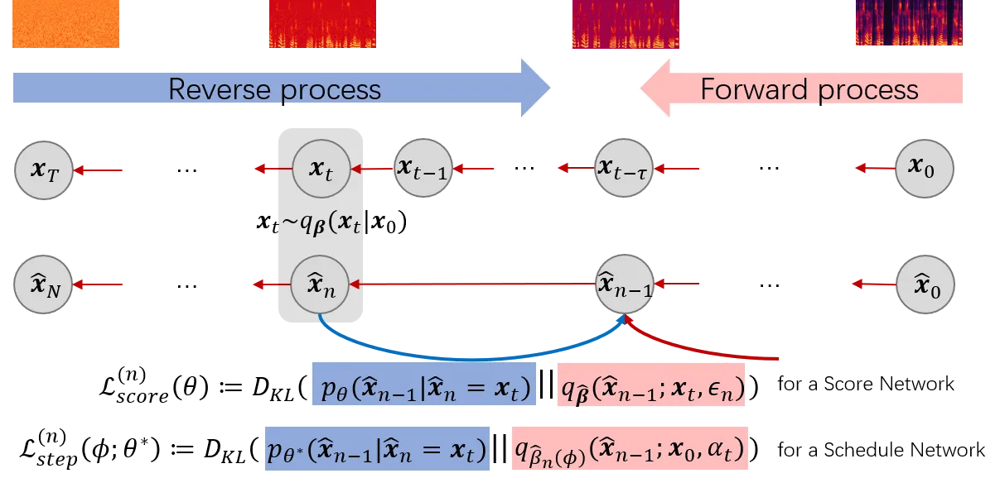
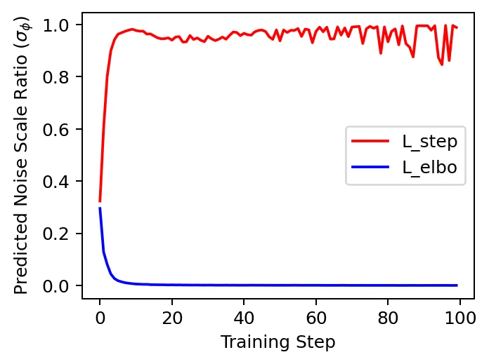
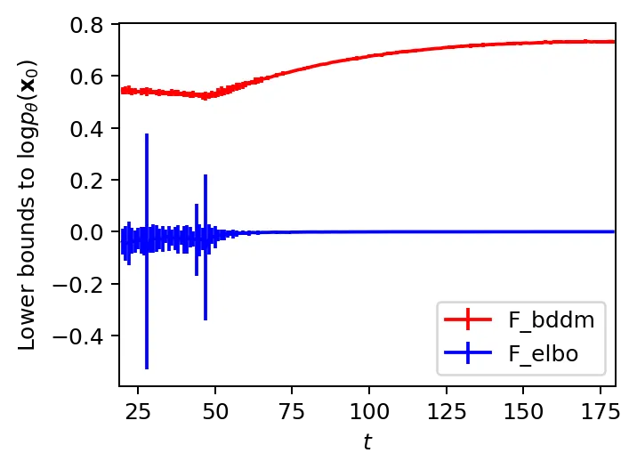
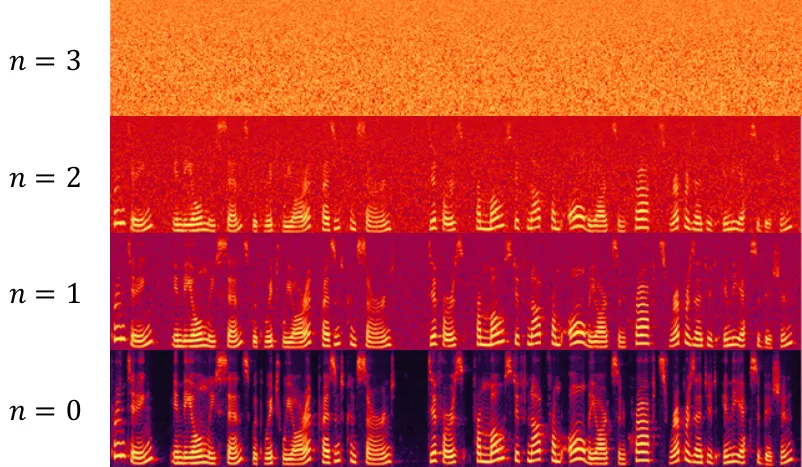

# BDDM: Bilateral Denoising Diffusion Models for Fast and High-Quality Speech Synthesis

Max W. Y. Lam    Jun Wang    Dan Su Affiliation: Tencent AI Lab
Affiliation: Shenzhen, China Affiliation: {maxwylam, joinerwang,
dansu}@tencent.com    Dong Yu Affiliation: Tencent AI Lab
Affiliation: Bellevue WA, USA Email: [dyu@tencent.com](mailto:)

###### Abstract

Diffusion probabilistic models (DPMs) and their extensions have emerged
as competitive generative models yet confront challenges of efficient
sampling. We propose a new bilateral denoising diffusion model (BDDM)
that parameterizes both the forward and reverse processes with a
schedule network and a score network, which can train with a novel
bilateral modeling objective. We show that the new surrogate objective
can achieve a lower bound of the log marginal likelihood tighter than a
conventional surrogate. We also find that BDDM allows inheriting
pre-trained score network parameters from any DPMs and consequently
enables speedy and stable learning of the schedule network and
optimization of a noise schedule for sampling. Our experiments
demonstrate that BDDMs can generate high-fidelity audio samples with as
few as three sampling steps. Moreover, compared to other
state-of-the-art diffusion-based neural vocoders, BDDMs produce
comparable or higher quality samples indistinguishable from human
speech, notably with only seven sampling steps (143x faster than
WaveGrad and 28.6x faster than DiffWave). We release our code at
[https://github.com/tencent-ailab/bddm](https://github.com/tencent-ailab/bddm).

|     |
| --- |
|     |

## 1 Introduction

Deep generative models have shown a tremendous advancement in speech
synthesis (van den Oord et al., 2016; Kalchbrenner et al., 2018; Prenger
et al., 2019; Kumar et al., 2019a; Kong et al., 2020b; Chen et al.,
2020; Kong et al., 2021). Successful generative models can be mainly
divided into two categories: generative adversarial network (GAN)
(Goodfellow et al., 2014) based and likelihood-based. The former is
based on adversarial learning, where the objective is to generate data
indistinguishable from the training data. Yet, the training GANs can be
very unstable, and the relevant training objectives are not suitable to
compare against different GANs. The latter uses log-likelihood or
surrogate objectives for training, but they also have intrinsic
limitations regarding generation speed or quality. For example, the
autoregressive models (van den Oord et al., 2016; Kalchbrenner et al.,
2018), while being capable of generating high-fidelity data, are limited
by their inherently slow sampling process and the poor scaling
properties on high-dimensional data. Likewise, the flow-based models
(Dinh et al., 2016; Kingma & Dhariwal, 2018; Chen et al., 2018;
Papamakarios et al., 2021) rely on specialized architectures to build a
normalized probability model, whose training is less
parameter-efficient. Other prior works use surrogate objectives, such as
the evidence lower bound in variational auto-encoders (Kingma & Welling,
2013; Rezende et al., 2014; Maaløe et al., 2019) and the contrastive
divergence in energy-based models (Hinton, 2002; Carreira-Perpinan &
Hinton, 2005). These models, despite showing improved speed, typically
only work well for low-dimensional data, and, in general, the sample
qualities are not competitive to the GAN-based and the autoregressive
models (Bond-Taylor et al., 2021).

An up-and-coming class of likelihood-based models is the diffusion
probabilistic models (DPMs) (Sohl-Dickstein et al., 2015), which
introduces the idea of using a forward diffusion process to sequentially
corrupt a given distribution and learning the reversal of such diffusion
process to restore the data distribution for sampling. From a similar
perspective, Song & Ermon (2019) proposed the score-based generative
models by applying the score matching technique (Hyvarinen & Dayan, 2005) to train a neural network such that samples can be generated via
Langevin dynamics. Along these two lines of research, Ho et al. (2020)
proposed the denoising diffusion probabilistic models (DDPMs) for
high-quality image syntheses. Dhariwal & Nichol (2021) demonstrated that
improved DDPMs Nichol & Dhariwal (2021) are capable of generating
high-quality images of comparable or even superior quality to the
state-of-the-art (SOTA) GAN-based models. For speech syntheses, DDPMs
were also applied in Wavegrad (Chen et al., 2020) and DiffWave (Kong
et al., 2021) to produce higher-fidelity audio samples than the
conventional non-autoregressive models (Yamamoto et al., 2020; Kumar
et al., 2019b; Yang et al., 2020; Bińkowski et al., 2020) and matched
the quality of the SOTA autoregressive methods (Chen et al., 2020).

Despite the compelling results, the diffusion generative models are two
to three orders of magnitude slower than other generative models such as
GANs and VAEs. Their primary limitation is that they require up to
thousands of diffusion steps during training to learn the target
distribution. Therefore a large number of reverse steps are often
required at sampling time. Recently, extensive investigations have been
conducted to reduce the sampling steps for efficiently generating
high-quality samples, which we will discuss in the related work in
Section 2. Distinctively, we conceived that we might train a neural
network to efficiently and adaptively estimate a much shorter noise
schedule for sampling while achieving generation performances comparable
or superior to the conventional DPMs. With such an incentive, after
introducing the conventional DPMs as our background in Section 3, we
propose in Section 4 bilateral denoising diffusion models (BDDMs), named
after a bilateral modeling perspective – parameterizing the forward and
reverse processes with a schedule network and a score network,
respectively. We theoretically derive that the schedule network should
be trained after the score network is optimized. For training the
schedule network, we propose a novel objective to minimize the gap
between a newly derived lower bound and the log marginal likelihood. We
describe the training algorithm as well as the fast and high-quality
sampling algorithm in Section 5. The training of the schedule network
converges very fast using our newly derived objective, and its training
only adds negligible overhead to DDPM’s. In Section 6, our neural
vocoding experiments demonstrated that BDDMs could generate
high-fidelity samples with as few as three sampling steps. Moreover, our
method can produce speech samples indistinguishable from human speech
with only seven sampling steps (143x faster than WaveGrad and 28.6x
faster than DiffWave).

## 2 Related Work

Prior works showed that noise scheduling is crucial for efficient and
high-fidelity data generation in DPMs. DDPMs (Ho et al., 2020) used a
shared linear noise schedule for both training and sampling, which,
however, requires thousands of sampling iterations to obtain competitive
results. To speed up the sampling process, one class of related work,
including (Chen et al., 2020; Kong et al., 2021; Nichol & Dhariwal,
2021), attempts to use a different, shorter noise schedule for sampling.
For clarity, we thereafter denote the training noise schedule as
$`{\bm{\beta}}\in{\mathbb{R}}^{T}`$ and the sampling noise schedule as
$`\hat{{\bm{\beta}}}\in{\mathbb{R}}^{N}`$ with $`N<T`$. In particular,
Chen et al. (2020) applied a grid search (GS) algorithm to select
$`\hat{{\bm{\beta}}}`$. Unfortunately, GS becomes prohibitively slow
when $`N`$ grows large, e.g., $`N=6`$ took more than a day on a single
NVIDIA Tesla P40 GPU. This is because the time costs of GS algorithm
grow exponentially with $`N`$, i.e., $`{\mathcal{O}}(9^{N})`$ with 9
bins as the default setting in Chen et al. (2020). Instead of searching,
Kong et al. (2021) devised a fast sampling (FS) algorithm based on an
expert-defined 6-step noise schedule for their score network. However,
this specifically tuned noise schedule is hard to generalize to other
score networks, tasks, or datasets.

Another class of noise scheduling methods searches for a subsequence of
time indices of the training noise schedule, which we call the time
schedule. DDIMs (Song et al., 2021a) introduced an accelerated reverse
process that relies on a pre-specified time schedule. A linear and a
quadratic time schedule were used in DDIMs and showed superior
generation quality over DDPMs within 10 to 100 sampling steps. Nichol &
Dhariwal (2021) proposed a re-scaled noise schedule for fast sampling,
but this also requires pre-specifying the time schedule and the training
noise schedule. Nichol & Dhariwal (2021) also proposed learning
variances for the reverse processes, whereas the variances of the
forward processes, i.e., the noise schedule, which affected both the
means and variances of the reverse processes, were not learnable.
According to the results of (Song et al., 2021a; Nichol & Dhariwal,
2021), using a linear or quadratic time schedule resulted in quite
different performances in different datasets, implying that the optimal
choice of schedule varies with the datasets. So, there remains a
challenge in finding a short and effective schedule for fast sampling on
different datasets. Notably, Kong & Ping (2021) proposed a method to map
a noise schedule to a time schedule for fast sampling. In this sense,
searching for a time schedule becomes a sub-set of the noise scheduling
problem, which resembles the above category of methods.

Although DPMs (Sohl-Dickstein et al., 2015) and DDPMs (Ho et al., 2019)
mentioned that the noise schedule could be learned by
re-parameterization, the approach was not investigated in their works.
Closely related works that learn a noise schedule emerged until very
recently. San-Roman et al. (2021) proposed a noise estimation (NE)
method, which trained a neural net with a regression loss to estimate
the noise scale from the noisy sample at each time point, and then
predicted the next noise scale. However, NE requires a prior assumption
of the noise schedule following a linear or Fibonacci rule. Most
recently, a concurrent work to ours by Kingma et al. (2021) jointly
trained a neural net to predict the signal-to-noise ratio (SNR) by
maximizing the variational lower bound. The SNR was then used for noise
scheduling. Different from ours, this scheduling neural net only took
$`t`$ as input and is independent of the noisy sample generated during
the loop of sampling process. Intrinsically, with limited information
about the sampled data, the predicted SNR could deviate from the actual
SNR of the noisy data during sampling.

## 3 Background

### 3.1 Diffusion probabilistic models (DPMs)

Given i.i.d. samples $`\{{\bm{x}}_{0}\in{\mathbb{R}}^{D}\}`$ from an
unknown data distribution $`p_{\text{data}}({\bm{x}}_{0})`$, diffusion
probabilistic models (DPMs) (Sohl-Dickstein et al., 2015) define a
forward process
$`q({\bm{x}}_{1:T}|{\bm{x}}_{0})=\prod_{t=1}^{T}q({\bm{x}}_{t}|{\bm{x}}_{t-1})`$
that converts any complex data distribution into a simple, tractable
distribution after $`T`$ steps of diffusion. A reverse process
$`p_{\theta}({\bm{x}}_{t-1}|{\bm{x}}_{t})`$ parameterized by $`\theta`$
is used to model the data distribution:
$`p_{\theta}({\bm{x}}_{0})=\int\pi({\bm{x}}_{T})\prod_{t=1}^{T}p_{\theta}({\bm{x}}_{t-1}|{\bm{x}}_{t})d{\bm{x}}_{1:T}`$,
where $`\pi({\bm{x}}_{T})`$ is the prior distribution for starting the
reverse process. Then, the variational parameters $`\theta`$ can be
learned by maximizing the standard log evidence lower bound (ELBO):

```math
\displaystyle\mathcal{F}_{\text{elbo}}:=\mathbb{E}_{q}\left[\log p_{\theta}({\bm{x}}_{0}|{\bm{x}}_{1})-\sum_{t=2}^{T}D_{\mathrm{KL}}\left(q({\bm{x}}_{t-1}|{\bm{x}}_{t},{\bm{x}}_{0})||p_{\theta}({\bm{x}}_{t-1}|{\bm{x}}_{t})\right)-D_{\mathrm{KL}}\left(q({\bm{x}}_{T}|{\bm{x}}_{0})||\pi({\bm{x}}_{T})\right)\right]. \tag{1}
```

### 3.2 Denoising Diffusion Probabilistic Models (DDPMs)

As an extension to DPMs, denoising diffusion probabilistic models
(DDPMs) (Ho et al., 2020) applied the score matching technique
(Hyvarinen & Dayan, 2005; Song & Ermon, 2019) to define the reverse
process. In particular, DDPMs considered a Gaussian diffusion process
parameterized by a noise schedule $`{\bm{\beta}}\in{\mathbb{R}}^{T}`$
with $`0<\beta_{1},\dotsc,\beta_{T}<1`$:

```math
\displaystyle q_{{\bm{\beta}}}({\bm{x}}_{1:T}|{\bm{x}}_{0}):=\prod_{t=1}^{T}q_{\beta_{t}}({\bm{x}}_{t}|{\bm{x}}_{t-1}),\quad\text{where}\quad q_{\beta_{t}}({\bm{x}}_{t}|{\bm{x}}_{t-1}):={\mathcal{N}}(\sqrt{1-\beta_{t}}{\bm{x}}_{t-1},\beta_{t}{\bm{I}}). \tag{2}
```

Based on the nice property of isotropic Gaussians, one can express
$`{\bm{x}}_{t}`$ directly conditioned on $`{\bm{x}}_{0}`$:

```math
\displaystyle q_{{\bm{\beta}}}({\bm{x}}_{t}|{\bm{x}}_{0})={\mathcal{N}}(\alpha_{t}{\bm{x}}_{0},(1-\alpha_{t}^{2}){\bm{I}}),\quad\text{where}\quad\alpha_{t}=\prod_{i=1}^{t}\sqrt{1-\beta_{i}}. \tag{3}
```

To revert this forward process, DDPMs employ a score network¹¹ 1 Here,
$`{\bm{\epsilon}}_{\theta}({\bm{x}}_{t},\alpha_{t})`$ is conditioned on
the continuous noise scale $`\alpha_{t}`$, as in (Song et al., 2021b;
Chen et al., 2020). Alternatively, the score network can also be
conditioned on a discrete time index
$`{\bm{\epsilon}}_{\theta}({\bm{x}}_{t},t)`$, as in (Song et al., 2021a;
Ho et al., 2020). An approximate mapping of a noise schedule to a time
schedule (Kong & Ping, 2021) exists, therefore we consider conditioning
on noise scales as the general case.
$`{\bm{\epsilon}}_{\theta}({\bm{x}}_{t},\alpha_{t})`$ to define

```math
\displaystyle p_{\theta}({\bm{x}}_{t-1}|{\bm{x}}_{t}) \displaystyle:={\mathcal{N}}\left(\frac{1}{\sqrt{1-\beta_{t}}}\left({\bm{x}}_{t}-\frac{\beta_{t}}{\sqrt{1-\alpha_{t}^{2}}}{\bm{\epsilon}}_{\theta}\left({\bm{x}}_{t},\alpha_{t}\right)\right),\Sigma_{t}\right), \tag{4}
```

where $`\Sigma_{t}`$ is the co-variance matrix defined for the reverse
process. Ho et al. (2020) showed that setting
$`\Sigma_{t}=\tilde{\beta}_{t}{\bm{I}}=\frac{1-\alpha_{t-1}^{2}}{1-\alpha_{t}^{2}}\beta_{t}{\bm{I}}`$
is optimal for a deterministic $`{\bm{x}}_{0}`$, while setting
$`\Sigma_{t}=\beta_{t}{\bm{I}}`$ is optimal for a white noise
$`{\bm{x}}_{0}\sim\mathcal{N}({\bm{0}},{\bm{I}})`$. Alternatively,
Nichol & Dhariwal (2021) proposed learnable variances by interpolating
the two optimals with a jointly trained neural network, i.e.,
$`\Sigma_{t,\theta}({\bm{x}}):=\text{diag}(\exp({\bm{v}}_{\theta}({\bm{x}})\log{\beta}_{t}+(1-{\bm{v}}_{\theta}({\bm{x}}))\log\tilde{\beta}_{t}))`$,
where $`{\bm{v}}_{\theta}({\bm{x}})\in{{\mathbb{R}}^{D}}`$ is a
trainable network.

Note that the calculation of the complete ELBO in Eq. (1) requires $`T`$
forward passes of the score network, which would make the training
computationally prohibitive for a large $`T`$. To feasibly train the
score network, instead of computing the complete ELBO, Ho et al. (2020)
proposed an efficient training mechanism by sampling from a discrete
uniform distribution: $`t\sim\mathcal{U}\{1,...,T\}`$,
$`{\bm{x}}_{0}\sim p_{\text{data}}({\bm{x}}_{0})`$,
$`{\bm{\epsilon}}_{t}\sim{\mathcal{N}}({\bm{0}},{\bm{I}})`$ at each
training iteration to compute the training loss:

```math
\displaystyle{\mathcal{L}}_{\text{ddpm}}^{(t)}(\theta):=\left\|{\bm{\epsilon}}_{t}-{\bm{\epsilon}}_{\theta}\left(\alpha_{t}{\bm{x}}_{0}+\sqrt{1-\alpha_{t}^{2}}{\bm{\epsilon}}_{t},\alpha_{t}\right)\right\|^{2}_{2}, \tag{5}
```

which is a re-weighted form of
$`D_{\mathrm{KL}}\left(q_{{\bm{\beta}}}({\bm{x}}_{t-1}|{\bm{x}}_{t},{\bm{x}}_{0})||p_{\theta}({\bm{x}}_{t-1}|{\bm{x}}_{t})\right)`$.
Ho et al. (2020) reported that the re-weighting worked effectively for
learning $`\theta`$. Yet, we demonstrate it is deficient for learning
the noise schedule $`{\bm{\beta}}`$ in our ablation experiment in
Section 6.2.

## 4 Bilateral denoising diffusion models (BDDMs)



Figure 1: A bilateral denoising diffusion model (BDDM) introduces a
junctional variable $`{\bm{x}}_{t}`$ and a schedule network $`\phi`$.
The schedule network can optimize the shortened noise schedule
$`\hat{\beta}_{n}(\phi)`$ if we know the score of the distribution at
the junctional step, using the KL divergence to directly compare
$`p_{\theta^{*}}(\hat{{\bm{x}}}_{n-1}|\hat{{\bm{x}}}_{n}={\bm{x}}_{t})`$
against the re-parameterized forward process posteriors.

### 4.1 Problem formulation

For fast sampling with DPMs, we strive for a noise schedule
$`\hat{{\bm{\beta}}}`$ for sampling that is much shorter than the noise
schedule $`{\bm{\beta}}`$ for training. As shown in Fig. 1, we define
two separate diffusion processes corresponding to the noise schedules,
$`{\bm{\beta}}`$ and $`\hat{{\bm{\beta}}}`$, respectively. The upper
diffusion process parameterized by $`{\bm{\beta}}`$ is the same as in
Eq. (2), whereas the lower process is defined as
$`q_{\hat{{\bm{\beta}}}}(\hat{{\bm{x}}}_{1:N}|\hat{{\bm{x}}}_{0})=\prod_{n=1}^{N}q_{\hat{\beta}_{n}}(\hat{{\bm{x}}}_{n}|\hat{{\bm{x}}}_{n-1})`$
with much fewer diffusion steps ($`N\ll T`$). In our problem
formulation, $`{\bm{\beta}}`$ is given, but $`\hat{{\bm{\beta}}}`$ is
unknown. The goal is to find a $`\hat{{\bm{\beta}}}`$ for the reverse
process
$`p_{\theta}(\hat{{\bm{x}}}_{n-1}|\hat{{\bm{x}}}_{n};\hat{\beta}_{n})`$
such that $`\hat{{\bm{x}}}_{0}`$ can be effectively recovered from
$`\hat{{\bm{x}}}_{N}`$ with $`N`$ reverse steps.

### 4.2 Model description

Although many prior arts (Ho et al., 2020; Chen et al., 2020; Song
et al., 2021a; San-Roman et al., 2021) directly applied a shortened
linear or Fibonacci noise schedule to the reverse process, we argue that
these are sub-optimal solutions. Theoretically, the diffusion process
specified by a new shortened noise schedule is essentially different
from the one used to train the score network $`\theta`$. Therefore,
$`\theta`$ is not guaranteed suitable for reverting the shortened
diffusion process. This issue motivated a novel modeling perspective to
establish a link between the shortened schedule $`{\hat{\bm{\beta}}}`$
and the score network $`\theta`$, i.e., to have $`{\hat{\bm{\beta}}}`$
optimized according to $`\theta`$.

As a starting point, we consider an $`N=\lfloor T/\tau\rfloor`$, where
$`1\leq\tau<T`$ is a hyperparameter controlling the step size such that
each diffusion step between two consecutive variables in the shorter
diffusion process corresponds to $`\tau`$ diffusion steps in the longer
one. Based on Eq. (2), we define the following:

```math
\displaystyle q_{\hat{\beta}_{n+1}}(\hat{{\bm{x}}}_{n+1}|\hat{{\bm{x}}}_{n}={\bm{x}}_{t}):=q_{{\bm{\beta}}}({\bm{x}}_{t+\tau}|{\bm{x}}_{t})={\mathcal{N}}\left(\sqrt{\frac{\alpha_{t+\tau}^{2}}{\alpha_{t}^{2}}}{\bm{x}}_{t},\left(1-\frac{\alpha_{t+\tau}^{2}}{\alpha_{t}^{2}}\right){\bm{I}}\right), \tag{6}
```

where $`{\bm{x}}_{t}`$ is an intermediate diffused variable we
introduced to link the two differently indexed diffusion sequences. We
call it a junctional variable, which can be easily generated given
$`{\bm{x}}_{0}`$ and $`{\bm{\beta}}`$ during training:
$`{\bm{x}}_{t}=\alpha_{t}{\bm{x}}_{0}+\sqrt{1-\alpha_{t}^{2}}{\bm{\epsilon}}_{n}`$.

Unfortunately, for the reverse process when $`{\bm{x}}_{0}`$ is not
given, the junctional variable is intractable. However, our key
observation is that while using the score by a score network
$`\theta^{*}`$ trained for the long $`{\bm{\beta}}`$-parameterized
diffusion process, a short noise schedule $`\hat{{\bm{\beta}}}(\phi)`$
can be optimized accordingly by introducing a schedule network $`\phi`$.
We provide its mathematical derivations in Appendix A.3. Next, we
present a formal definition of BDDM and derive its training objectives,
$`{\mathcal{L}}^{(n)}_{\text{score}}(\theta)`$ and
$`{\mathcal{L}}_{\text{step}}^{(n)}(\phi;\theta^{*})`$, for the score
network and the schedule network, respectively, in more detail.

### 4.3 Score Network

Recall that a DDPM starts the reverse process with a white noise
$`{\bm{x}}_{T}\sim{\mathcal{N}}({\bm{0}},{\bm{I}})`$ and takes $`T`$
steps to recover the data distribution:

```math
\displaystyle p_{\theta}({\bm{x}}_{0})\overset{\text{DDPM}}{:=}\mathbb{E}_{{\mathcal{N}}({\bm{0}},{\bm{I}})}\left[\mathbb{E}_{p_{\theta}({\bm{x}}_{1:T-1}|{\bm{x}}_{T})}\left[p_{\theta}({{\bm{x}}}_{0}|{{\bm{x}}}_{1:T})\right]\right]. \tag{7}
```

A BDDM, in contrast, starts from the junctional variable
$`{\bm{x}}_{t}`$, and reverts a shorter sequence of diffusion random
variables with only $`n`$ steps:

```math
\displaystyle p_{\theta}(\hat{{\bm{x}}}_{0})\overset{\text{BDDM}}{:=}\mathbb{E}_{q_{\hat{{\bm{\beta}}}}(\hat{{\bm{x}}}_{n-1};{\bm{x}}_{t},{\bm{\epsilon}}_{n})}\left[\mathbb{E}_{p_{\theta}(\hat{{\bm{x}}}_{1:n-2}|\hat{{\bm{x}}}_{n-1})}\left[p_{\theta}(\hat{{\bm{x}}}_{0}|\hat{{\bm{x}}}_{1:n-1})\right]\right],\quad 2\leq n\leq N, \tag{8}
```

where
$`q_{\hat{{\bm{\beta}}}}(\hat{{\bm{x}}}_{n-1};{\bm{x}}_{t},{\bm{\epsilon}}_{n})`$
is defined as a re-parameterization on the posterior:

```math
\displaystyle q_{\hat{{\bm{\beta}}}}(\hat{{\bm{x}}}_{n-1};{\bm{x}}_{t},{\bm{\epsilon}}_{n}):= \displaystyle q_{\hat{{\bm{\beta}}}}\left(\hat{{\bm{x}}}_{n-1}\left|\hat{{\bm{x}}}_{n}={\bm{x}}_{t},\hat{{\bm{x}}}_{0}=\frac{{\bm{x}}_{t}-\sqrt{1-\hat{\alpha}_{n}^{2}}{\bm{\epsilon}}_{n}}{\hat{\alpha}_{n}}\right.\right) \tag{9}
```

```math
\displaystyle= \displaystyle{\mathcal{N}}\left(\frac{1}{\sqrt{1-\hat{\beta}_{n}}}{\bm{x}}_{t}-\frac{\hat{\beta}_{n}}{\sqrt{(1-\hat{\beta}_{n})(1-\hat{\alpha}_{n}^{2})}}{\bm{\epsilon}}_{n},\frac{1-\hat{\alpha}_{n-1}^{2}}{1-\hat{\alpha}_{n}^{2}}\hat{\beta}_{n}{\bm{I}}\right), \tag{10}
```

where $`\hat{\alpha}_{n}=\prod_{i=1}^{n}\sqrt{1-\hat{\beta}_{i}}`$,
$`{\bm{x}}_{t}=\alpha_{t}{\bm{x}}_{0}+\sqrt{1-\alpha_{t}^{2}}{\bm{\epsilon}}_{n}`$
is the junctional variable that maps $`{\bm{x}}_{t}`$ to
$`\hat{{\bm{x}}}_{n}`$ given an approximate index
$`t\sim{\mathcal{U}}\{(n-1)\tau,...,n\tau-1,n\tau\}`$ and a sampled
white noise $`{\bm{\epsilon}}_{n}\sim{\mathcal{N}}({\bm{0}},{\bm{I}})`$.
Detailed derivation from Eq. (9) to (10) is provided in Appendix A.2.

#### 4.3.1 Training objective for score network

With the above definition, a new form of lower bound to the log marginal
likelihood can be derived such that
$`\log p_{\theta}(\hat{{\bm{x}}}_{0})\geq{\mathcal{F}}_{\text{score}}^{(n)}(\theta):=-{\mathcal{L}}^{(n)}_{\text{score}}(\theta)-{\mathcal{R}}_{\theta}(\hat{{\bm{x}}}_{0},{\bm{x}}_{t}),`$
where

```math
\displaystyle{\mathcal{L}}^{(n)}_{\text{score}}(\theta):= \displaystyle D_{\mathrm{KL}}\left({p_{\theta}(\hat{{\bm{x}}}_{n-1}|\hat{{\bm{x}}}_{n}={\bm{x}}_{t})}||q_{\hat{{\bm{\beta}}}}(\hat{{\bm{x}}}_{n-1};{\bm{x}}_{t},{\bm{\epsilon}}_{n})\right), \tag{11}
```

```math
\displaystyle{\mathcal{R}}_{\theta}(\hat{{\bm{x}}}_{0},{\bm{x}}_{t}):= \displaystyle-\mathbb{E}_{p_{\theta}(\hat{{\bm{x}}}_{1}|\hat{{\bm{x}}}_{n}={\bm{x}}_{t})}\left[\log p_{\theta}(\hat{{\bm{x}}}_{0}|\hat{{\bm{x}}}_{1})\right]. \tag{12}
```

See detailed derivation in Proposition 1 in Appendix A.2. In the
following Proposition 2, we prove that via the junctional variable
$`{\bm{x}}_{t}`$, the solution $`\theta^{*}`$ for optimizing the
objective
$`{\mathcal{L}}^{(t)}_{\text{ddpm}}(\theta),\forall t\in\{1,...,T\}`$ is
also the solution for optimizing
$`{\mathcal{L}}^{(n)}_{\text{score}}(\theta),\forall n\in\{2,...,N\}`$.
Thereby, we show that the score network $`\theta`$ can be trained with
$`{\mathcal{L}}^{(t)}_{\text{ddpm}}(\theta)`$ and re-used for reverting
the short diffusion process over $`\hat{{\bm{x}}}_{N:0}`$. Although the
newly derived lower bound result in the same objective as the
conventional score network, it for the first time establishes a link
between the score network $`\theta`$ and $`\hat{{\bm{x}}}_{N:0}`$. The
connection is essential for learning $`\hat{{\bm{\beta}}}`$, which we
will describe next.

### 4.4 schedule network

In BDDMs, a schedule network is introduced to the forward process by
re-parameterizing $`\hat{\beta}_{n}`$ as
$`\hat{\beta}_{n}(\phi)=f_{\phi}\left({\bm{x}}_{t};\hat{\beta}_{n+1}\right)`$,
and recall that during training, we can use
$`{\bm{x}}_{t}=\alpha_{t}{\bm{x}}_{0}+\sqrt{1-\alpha_{t}^{2}}{\bm{\epsilon}}_{n}`$
and $`\hat{\beta}_{n+1}=1-\frac{\alpha_{t+\tau}^{2}}{\alpha_{t}^{2}}`$.
Through the re-parameterization, the task of noise scheduling, i.e.,
searching for $`\hat{{\bm{\beta}}}`$, can now be reformulated as
training a schedule network $`f_{\phi}`$ that ancestrally estimates
data-dependent variances. The schedule network learns to predict
$`\hat{\beta}_{n}`$ based on the current noisy sample $`{\bm{x}}_{t}`$ –
this makes our method fundamentally different from existing and
concurrent work, including Kingma et al. (2021) – as we reveal that,
aside from $`\hat{\beta}_{n+1}`$, $`t`$, or $`n`$ that reflects
diffusion step information, $`{\bm{x}}_{t}`$ is also essential for noise
scheduling from a reverse direction at inference time.

Specifically, we adopt the ancestral step information
($`\hat{\beta}_{n+1}`$) to derive an upper bound for the current step
while leaving the schedule network only to take the current noisy sample
$`{\bm{x}}_{t}`$ as input to predict a relative change of noise scales
against the ancestral step. First, we derive an upper bound of
$`\hat{\beta}_{n}`$ by proving
$`0<\hat{\beta}_{n}<\min\left\{1-\frac{\hat{\alpha}_{n+1}^{2}}{1-\hat{\beta}_{n+1}},\hat{\beta}_{n+1}\right\}`$
in Appendix A.1. Then, by multiplying the upper bound by a ratio
estimated by a neural network
$`\sigma_{\phi}:{\mathbb{R}}^{D}\mapsto(0,1)`$, we define

```math
\displaystyle f_{\phi}({\bm{x}}_{t};\hat{\beta}_{n+1}):=\min\left\{1-\frac{\hat{\alpha}_{n+1}^{2}}{1-\hat{\beta}_{n+1}},\hat{\beta}_{n+1}\right\}\sigma_{\phi}({\bm{x}}_{t}), \tag{13}
```

where the network parameter set $`\phi`$ is learned to estimate the
ratio between two consecutive noise scales ($`\hat{\beta}_{n}`$ and
$`\hat{\beta}_{n+1}`$) from the current noisy input $`{\bm{x}}_{t}`$.

Finally, at inference time for noise scheduling, starting from a maximum
reverse steps ($`N`$) and two hyperparameters
$`(\hat{\alpha}_{N},\hat{\beta}_{N})`$, we ancestrally predict the noise
scale
$`\hat{\beta}_{n}(\phi)=f_{\phi}\left(\hat{{\bm{x}}}_{n};\hat{\beta}_{n+1}\right)`$,
for $`n`$ from $`N`$ to $`1`$, and cumulatively update the product
$`\hat{\alpha}_{n}=\frac{\hat{\alpha}_{n+1}}{\sqrt{1-\hat{\beta}_{n+1}}}`$.

#### 4.4.1 Training objective for schedule network

Here we describe how to learn the network parameters $`\phi`$
effectively. First, we demonstrated that $`\phi`$ should be trained
after $`\theta`$ is well-optimized, referring to Proposition 3 in
Appendix A.3. The Proposition also shows that we are minimizing the gap
between the lower bound
$`{\mathcal{F}}_{\text{score}}^{(n)}(\theta^{*})`$ and
$`\log p_{\theta^{*}}(\hat{{\bm{x}}}_{0})`$, i.e.,
$`\log p_{\theta^{*}}(\hat{{\bm{x}}}_{0})-{\mathcal{F}}_{\text{score}}^{(n)}(\theta^{*})`$,
by minimizing the following objective

```math
\displaystyle\mathcal{L}_{\text{step}}^{(n)}(\phi;\theta^{*}):= \displaystyle D_{\mathrm{KL}}\left(p_{\theta^{*}}(\hat{{\bm{x}}}_{n-1}|\hat{{\bm{x}}}_{n}={\bm{x}}_{t})||q_{\hat{\beta}_{n}(\phi)}(\hat{{\bm{x}}}_{n-1};{\bm{x}}_{0},{\alpha}_{t})\right), \tag{14}
```

which is defined as a KL divergence to directly compare
$`p_{\theta^{*}}(\hat{{\bm{x}}}_{n-1}|\hat{{\bm{x}}}_{n}={\bm{x}}_{t})`$
against the re-parameterized forward process posteriors, which are
tractable when conditioned on the junctional noise scale $`\alpha_{t}`$
and $`{\bm{x}}_{0}`$.

The detailed derivation of Eq. (14) is also provided in the proof of
Proposition 3 to get its concrete formulas as shown in Step (8-10) in
Alg. 2.

## 5 Algorithms: training, noise scheduling, and sampling

1: Given $`T,\{\beta_{t}\}_{t=1}^{T}`$

2:
$`\{\alpha_{t}\}_{t=1}^{T}=\{\prod_{i=1}^{t}\sqrt{1-\beta_{t}}\}_{t=1}^{T}`$

3: repeat

4:  $`{\bm{x}}_{0}\sim p_{\text{data}}({\bm{x}}_{0})`$

5:  $`t\sim\mathcal{U}\{1,\dotsc,T\}`$

6:  $`{\bm{\epsilon}}_{t}\sim{\mathcal{N}}({\bm{0}},{\bm{I}})`$

7:
 $`{\bm{x}}_{t}={\alpha}_{t}{\bm{x}}_{0}+\sqrt{1-{\alpha}_{t}^{2}}{\bm{\epsilon}}_{t}`$

8:
 $`{\mathcal{L}}_{\text{ddpm}}^{(t)}=\left\|{\bm{\epsilon}}_{t}-{\bm{\epsilon}}_{\theta}({\bm{x}}_{t},\alpha_{t})\right\|^{2}_{2}`$

9:  Take a gradient descent step on
$`\nabla_{\theta}{\mathcal{L}}_{\text{ddpm}}^{(t)}`$

10: until converged

Algorithm 1 Training Score Network ($`\theta`$)

1: Given
$`\theta^{*},\hat{\alpha}_{N},\hat{\beta}_{N},{\bm{x}}_{N}\sim{\mathcal{N}}({\bm{0}},{\bm{I}})`$

2: for $`n=N`$ to $`2`$ do

3:
 $`\hat{{\bm{x}}}_{n-1}\sim p_{\theta^{*}}(\hat{{\bm{x}}}_{n-1}|\hat{{\bm{x}}}_{n};\hat{\alpha}_{n},\hat{\beta}_{n})`$

4:
 $`\hat{\alpha}_{n-1}=\frac{\hat{\alpha}_{n}}{\sqrt{1-\hat{\beta}_{n}}}`$

5:
 $`\hat{\beta}_{n-1}=\min\{1-\hat{\alpha}_{n-1}^{2},\hat{\beta}_{n}\}\sigma_{\phi}(\hat{{\bm{x}}}_{n-1})`$

6:  if $`\hat{\beta}_{n-1}<\beta_{1}`$ then

7:  return $`\hat{\beta}_{n},\dotsc,\hat{\beta}_{N}`$

8:  end if

9: end for

10: return $`\hat{\beta}_{1},\dotsc,\hat{\beta}_{N}`$

Algorithm 3 Noise Scheduling

1: Given
$`\theta^{*},\tau,T,\left\{\alpha_{t},\beta_{t}\right\}_{t=1}^{T}`$

2: repeat

3:  $`{\bm{x}}_{0}\sim p_{\text{data}}({\bm{x}}_{0})`$

4:  $`t\sim\mathcal{U}\{\tau,\dotsc,T-\tau\}`$

5:  $`\delta_{t}=1-{\alpha}_{t}^{2}`$

6:  $`{\bm{\epsilon}}_{n}\sim{\mathcal{N}}({\bm{0}},{\bm{I}})`$

7:
 $`{\bm{x}}_{t}={\alpha}_{t}{\bm{x}}_{0}+\sqrt{\delta_{t}}{\bm{\epsilon}}_{n}`$

8:  
$`\hat{\beta}_{n}=\min\left\{\delta_{t},1-\frac{{\alpha}_{t+\tau}^{2}}{{\alpha}_{t}^{2}}\right\}\sigma_{\phi}({\bm{x}}_{t})`$

9:  
$`C=4^{-1}\log(\delta_{t}/\hat{\beta}_{n})+2^{-1}D\left(\hat{\beta}_{n}/\delta_{t}-1\right)`$

10:  
$`{\mathcal{L}}_{\text{step}}^{(n)}=\frac{\delta_{t}}{2(\delta_{t}-\hat{\beta}_{n})}\left\lVert{\bm{\epsilon}}_{n}-\frac{\hat{\beta}_{n}}{\delta_{t}}{\bm{\epsilon}}_{\theta^{*}}({\bm{x}}_{t},{\alpha}_{t})\right\rVert^{2}_{2}+C`$

11:  Take a gradient descent step on
$`\nabla_{\phi}{\mathcal{L}}_{\text{step}}^{(n)}`$

12: until converged

Algorithm 2 Training Schedule Network ($`\phi`$)

1: Given
$`\theta^{*},\{\hat{\beta}_{n}\}_{n=1}^{N_{s}},\hat{{\bm{x}}}_{N_{s}}\sim{\mathcal{N}}({\bm{0}},{\bm{I}})`$

2:
$`\{\hat{\alpha}_{n}\}_{n=1}^{N_{s}}=\left\{\prod_{i=1}^{n}\sqrt{1-\hat{\beta}_{n}}\right\}_{n=1}^{N_{s}}`$

3: for $`n={N_{s}}`$ to $`1`$ do

4:
 $`\hat{{\bm{x}}}_{n-1}\sim p_{\theta^{*}}(\hat{{\bm{x}}}_{n-1}|\hat{{\bm{x}}}_{n};\hat{\alpha}_{n},\hat{\beta}_{n})`$

5: end for

6: return $`\hat{{\bm{x}}}_{0}`$

Algorithm 4 Sampling

### 5.1 Training score and schedule networks

Following the theoretical result in Appendix A.3, $`\theta`$ should be
optimized before learning $`\phi`$. Thereby first, to train the score
network $`{\bm{\epsilon}}_{\theta}`$, we refer to the settings in (Ho
et al., 2020; Chen et al., 2020; Song et al., 2021a) to define
$`{\bm{\beta}}`$ as a linear noise schedule:
$`\beta_{t}=\beta_{\text{start}}+\frac{t}{T}(\beta_{\text{end}}-\beta_{\text{start}}),\quad\text{for}\quad 1\leq t\leq T,`$
where $`\beta_{\text{start}}`$ and $`\beta_{\text{end}}`$ are two
hyperparameter that specifies the start value and the end value. This
results in Algorithm 1, which resembles the training algorithm in (Ho
et al., 2020).

Next, based on the converged score network $`\theta^{*}`$, we train the
schedule network $`\phi`$. We draw an $`n\sim\mathcal{U}\{2,\ldots,N\}`$
at each training step, and then draw a
$`t\sim\mathcal{U}\{(n-1)\tau,...,n\tau\}`$. These together can be
re-formulated as directly drawing
$`t\sim\mathcal{U}\{\tau,...,T-\tau\}`$ for a finer-scale time step.
Then, we sequentially compute the variables needed for calculating
$`{\mathcal{L}}_{\text{step}}^{(n)}(\phi;\theta^{*})`$, as presented in
Algorithm 2. We observed that, although a linear schedule is used to
define $`{\bm{\beta}}`$, the noise schedule of $`\hat{{\bm{\beta}}}`$
predicted by $`f_{\phi}`$ is not limited to but rather different from a
linear one.

### 5.2 Noise scheduling for fast and high-quality sampling

After the score network and the schedule network are trained, the
inference procedure can divide into two phases: (1) the noise scheduling
phase and (2) the sampling phase.

First, we run the noise scheduling process similarly to a sampling
process with $`N`$ iterations maximum. Different from training, where
$`\alpha_{t}`$ is forward-computed, $`\hat{\alpha}_{n}`$ is instead a
backward-computed variable (from $`N`$ to $`1`$) that may deviate from
the forward one because $`\{\hat{\beta}_{i}\}_{i}^{n-1}`$ are unknown in
the noise scheduling phase during inference. To start noise scheduling,
we first set two hyperparameters: $`\hat{\alpha}_{N}`$ and
$`\hat{\beta}_{N}`$. We use $`\beta_{1}`$, the smallest noise scale seen
in training, as a threshold to early stop the noise scheduling process
so that we can ignore small noise scales ($`<\beta_{1}`$) that were
never seen by the score network. Overall, the noise scheduling process
presents in Algorithm 3.

In practice, we apply a grid search algorithm of $`M`$ bins to Algorithm
3, which takes $`\mathcal{O}(M^{2})`$ time, to find proper values for
$`(\hat{\alpha}_{N},\hat{\beta}_{N})`$. We used $`M=9`$ as in (Chen
et al., 2020). The grid search for our noise scheduling algorithm can be
evaluated on a small subset of the training samples. Empirically, even
as few as $`1`$ sample for evaluation works well in our algorithm.
Finally, given the predicted noise schedule
$`\hat{{\bm{\beta}}}\in{\mathbb{R}}^{N_{s}}`$, we generate samples with
$`N_{s}`$ sampling steps, as shown in Algorithm 4.

## 6 Experiments

We conducted a series of experiments on neural vocoding tasks to
evaluate the proposed BDDMs. First, we compared BDDMs against several
strongest models that have been published: the mixture of logistics
(MoL) WaveNet (Oord et al., 2018) implemented in (Yamamoto, 2020), the
WaveGlow (Prenger et al., 2019) implemented in (Valle, 2020), the MelGAN
(Kumar et al., 2019a) implemented in (Kumar, 2019), the HiFi-GAN (Kong
et al., 2020b) implemented in (Kong et al., 2020a) and the two most
recently proposed diffusion-based vocoders, i.e., WaveGrad (Chen et al., 2020) and DiffWave (Kong et al., 2021), both re-implemented in our code.
The hyperparameter settings of BDDMs and all these models are detailed
in Appendix B.

In addition, we also compared BDDMs to a variety of scheduling and
acceleration techniques applicable to DDPMs, including the grid search
(GS) approach in WaveGrad, the fast sampling (FS) approach based on a
user-defined 6-step schedule in DiffWave, the DDIMs (Song et al., 2021a)
and a noise estimation (NE) approach (San-Roman et al., 2021). For fair
and reproducible comparison with other models and approaches, we used
the LJSpeech dataset (Ito & Johnson, 2017), which consists of 13,100
22kHz audio clips of a female speaker. All diffusion models were trained
on the same training split as in (Chen et al., 2020). We also replicated
the comparative experiment of neural vocoding using a multi-speaker VCTK
dataset (Yamagishi et al., 2019) as presented in Appendix C and obtained
a result consistent with that obtained from the LJSpeech dataset.

|                                                                       |                       |               |           |
| --------------------------------------------------------------------- | --------------------- | ------------- | --------- |
| Neural Vocoder                                                        | MOS                   | RTF           | Size      |
| Ground-truth                                                          | $`{4.64\pm 0.08}`$    | —             | —         |
| WaveNet (MoL) (Oord et al., 2018)                                     | $`{3.52\pm 0.16}`$    | $`318.6`$     | $`282`$MB |
| WaveGlow (Prenger et al., 2019)                                       | $`{3.03\pm 0.15}`$    | $`0.0198`$    | $`645`$MB |
| MelGAN (Kumar et al., 2019a)                                          | $`{3.48\pm 0.14}`$    | $`{0.00396}`$ | $`17`$MB  |
| HiFi-GAN (Kong et al., 2020b)                                         | $`{4.33\pm 0.12}`$    | $`0.0134`$    | $`54`$MB  |
| WaveGrad - 1000 steps (Chen et al., 2020)                             | $`{4.36\pm 0.13}`$    | $`38.2`$      | $`183`$MB |
| DiffWave - 200 steps (Kong et al., 2021)                              | $`\bf{4.49\pm 0.13}`$ | $`7.30`$      | $`27`$MB  |
| BDDM - 3 steps ($`\hat{\alpha}_{N}=0.68`$, $`\hat{\beta}_{N}=0.53`$)  | $`3.64\pm 0.13`$      | $`0.110`$     | $`27`$MB  |
| BDDM - 7 steps ($`\hat{\alpha}_{N}=0.62`$, $`\hat{\beta}_{N}=0.42`$)  | $`\bf{4.43\pm 0.11}`$ | $`0.256`$     | $`27`$MB  |
| BDDM - 12 steps ($`\hat{\alpha}_{N}=0.67`$, $`\hat{\beta}_{N}=0.12`$) | $`\bf{4.48\pm 0.12}`$ | $`0.438`$     | $`27`$MB  |

Table 1: Comparison of neural vocoders in terms of MOS with 95%
confidence intervals, real-time factor (RTF) and model size in megabytes
(MB) for inference. The highest score and the scores that are not
significantly different from the highest score (p-values $`\geq 0.05`$)
are bold-faced.

|       |                             |                         |                       |                       |
| ----- | --------------------------- | ----------------------- | --------------------- | --------------------- |
| Steps | Acceleration Method         | STOI                    | PESQ                  | MOS                   |
| 3     | GS (Chen et al., 2020)      | $`\bf{0.965\pm 0.009}`$ | $`\bf{3.66\pm 0.20}`$ | $`\bf{3.61\pm 0.12}`$ |
|       | FS (Kong et al., 2021)      | $`0.939\pm 0.023`$      | $`3.09\pm 0.23`$      | $`{3.10\pm 0.12}`$    |
|       | DDIM (Song et al., 2021a)   | $`0.943\pm 0.015`$      | $`3.42\pm 0.27`$      | $`{3.25\pm 0.13}`$    |
|       | NE (San-Roman et al., 2021) | $`\bf{0.966\pm 0.010}`$ | $`\bf{3.62\pm 0.18}`$ | $`{3.55\pm 0.12}`$    |
|       | BDDM                        | $`\bf{0.966\pm 0.011}`$ | $`\bf{3.63\pm 0.24}`$ | $`\bf{3.64\pm 0.13}`$ |
| 7     | FS (Kong et al., 2021)      | $`\bf{0.981\pm 0.006}`$ | $`3.68\pm 0.24`$      | $`3.70\pm 0.14`$      |
|       | DDIM (Song et al., 2021a)   | $`0.974\pm 0.008`$      | $`3.85\pm 0.12`$      | $`3.94\pm 0.12`$      |
|       | NE (San-Roman et al., 2021) | $`0.978\pm 0.007`$      | $`3.75\pm 0.18`$      | $`4.02\pm 0.11`$      |
|       | BDDM                        | $`\bf{0.983\pm 0.006}`$ | $`\bf{3.96\pm 0.09}`$ | $`\bf{4.43\pm 0.11}`$ |
| 12    | DDIM (Song et al., 2021a)   | $`0.979\pm 0.006`$      | $`3.90\pm 0.10`$      | $`{4.16\pm 0.12}`$    |
|       | NE (San-Roman et al., 2021) | $`0.981\pm 0.007`$      | $`{3.82\pm 0.13}`$    | $`{3.98\pm 0.14}`$    |
|       | BDDM                        | $`\bf{0.987\pm 0.006}`$ | $`\bf{3.98\pm 0.12}`$ | $`\bf{4.48\pm 0.12}`$ |

Table 2: Comparison of sampling acceleration methods with the same score
network and the same number of steps. The highest score and the scores
that are not significantly different from the highest score (p-values
$`\geq 0.05`$) are bold-faced.

### 6.1 Sampling quality in objective and subjective metrics

To assess the quality of each generated audio sample, we used both
objective and subjective measures for comparing different neural
vocoders given the same ground-truth spectrogram $`{\bm{s}}`$ as the
condition, i.e.,
$`{\bm{\epsilon}}_{\theta}({\bm{x}},{\bm{s}},\alpha_{t})`$.
Specifically, we used two scale-invariant metrics: the perceptual
evaluation of speech quality (PESQ) (Rix et al., 2001) and the
short-time objective intelligibility (STOI) (Taal et al., 2010) to
measure the noisiness and the distortion of the generated speech
relative to the reference speech. Mean opinion score (MOS) was also used
as a subjective metric for evaluating the naturalness of the generated
speech. The assessment scheme of MOS is included in Appendix B.

In Table 1, we compared BDDMs against the state-of-the-art (SOTA)
vocoders. To predict noise schedules with different sampling steps (3,
7, and 12), we set three pairs of
$`\{\hat{\alpha}_{N},\hat{\beta}_{N}\}`$ for BDDMs by running on
Algorithm 3 a quick hyperparameter grid search, which is detailed in
Appendix B. Among the 9 evaluated vocoders, only our proposed BDDMs with
7 and 12 steps and DiffWave with 200 steps showed no
statistic-significant difference from the ground-truth in terms of MOS.
Moreover, BDDMs significantly outspeeded DiffWave in terms of RTFs.
Notably, previous diffusion-based vocoders achieved high MOS scores at
the cost of an unacceptable RTF for industrial deployment. In contrast,
BDDMs managed to achieve a high standard of generation quality with only
7 sampling steps (143x faster than WaveGrad and 28.6x faster than
DiffWave).

In Table 2, we evaluated BDDMs and alternative accelerated sampling
methods, which used the same score network for a pair-to-pair
comparison. The GS method performed stably when the step number was
small (i.e., $`N\leq 6`$) but not scalable to more step numbers, which
were therefore bypassed in the comparisons of 7 and 12 steps. The FS
method by Song et al. (2021a) was linearly interpolated to 3 and 7 steps
for a fair comparison. Comparing its 7-step and 3-step results, we
observed that the FS performance degraded drastically. Both the DDIM and
the NE methods were stable across all the steps but were not performing
competitively enough. In comparison, BDDMs consistently attained the
leading scores across all the steps. This evaluation confirmed that BDDM
was superior to other acceleration methods for DPMs in terms of both
stability and quality.

### 6.2 Ablation Study and Analysis



Figure 2: Different training losses for $`\sigma_{\phi}`$



Figure 3: Different lower bounds to $`\log p_{\theta}({\bm{x}}_{0})`$

We attribute the primary advantage of BDDMs to the newly derived
objective $`{\mathcal{L}}^{(n)}_{\text{step}}`$ for learning $`\phi`$.
To better reason about this, we performed an ablation study, where we
substituted the proposed loss with the standard negative ELBO for
learning $`\phi`$ as mentioned by Sohl-Dickstein et al. (2015). We
plotted the network outputs with different training losses in Fig. 2. It
turned out that, when using $`{\mathcal{L}}^{(n)}_{\text{elbo}}`$ to
learn $`\phi`$, the network output rapidly collapsed to zero within
several training steps; whereas, the network trained with
$`{\mathcal{L}}^{(n)}_{\text{step}}`$ produced fluctuating outputs. The
fluctuation is a desirable property showing the network properly
predicts $`t`$-dependent noise scales, as $`t`$ is a random time step
drawn from a uniform distribution in training.

By setting $`\hat{{\bm{\beta}}}={\bm{\beta}}`$, we empirically validated
that
$`{\mathcal{F}}^{(t)}_{\text{bddm}}:={\mathcal{F}}^{(t)}_{\text{score}}+{\mathcal{L}}^{(t)}_{\text{step}}\geq{\mathcal{F}}^{(t)}_{\text{elbo}}`$
with their respective values at $`t\in[20,180]`$ using the same
optimized $`\theta^{*}`$. Each value is provided with 95% confidence
intervals, as shown in Fig. 3. In this experiment, we used the LJ speech
dataset and set $`T=200`$ and $`\tau=20`$. Notably, we dropped their
common entropy term
$`{\mathcal{R}}_{\theta}(\hat{{\bm{x}}}_{0},{\bm{x}}_{t})<0`$ to mainly
compare their KL divergences. This explains those positive lower bound
values in the plot. The graph shows that our proposed bound
$`{\mathcal{F}}^{(t)}_{\text{bddm}}`$ is always a tighter lower bound
than the standard one across all examined $`t`$. Moreover, we found that
$`{\mathcal{F}}^{(t)}_{\text{bddm}}`$ attained low values with a
relatively much lower variance for $`t\leq 50`$, where
$`{\mathcal{F}}^{(t)}_{\text{elbo}}`$ was highly volatile. This implies
that $`{\mathcal{F}}^{(t)}_{\text{bddm}}`$ better tackles the difficult
training part, i.e., when the score becomes more challenging to estimate
as $`t\to 0`$.

## 7 Conclusions

BDDMs parameterize the forward and reverse processes with a schedule
network and a score network, of which the former’s optimization is tied
with the latter by introducing a junctional variable. We derived a new
lower bound that leads to the same training loss for the score network
as in DDPMs (Ho et al., 2020), which thus enables inheriting any
pre-trained score networks in DDPMs. We also showed that training the
schedule network after a well-optimized score network can be viewed as
tightening the lower bound. Followed from the theoretical results, an
efficient training algorithm and a noise scheduling algorithm were
respectively designed for BDDMs. Finally, in our experiments, BDDMs
showed a clear edge over the previous diffusion-based vocoders.

## References

- Bińkowski et al. (2020) Mikołaj Bińkowski, Jeff Donahue, Sander
  Dieleman, Aidan Clark, Erich Elsen, Norman Casagrande, Luis C. Cobo,
  and Karen Simonyan. High fidelity speech synthesis with adversarial
  networks. _ICLR_, 2020.
- Bond-Taylor et al. (2021) Sam Bond-Taylor, Adam Leach, Yang Long, and
  Chris G. Willcocks. Deep generative modelling: A comparative review of
  vaes, gans, normalizing flows, energy-based and autoregressive models.
  *https://arxiv.org/abs/2103.04922*, 2021.
- Carreira-Perpinan & Hinton (2005) Miguel A Carreira-Perpinan and
  Geoffrey E Hinton. On contrastive divergence learning. _AISTATS_, pp.
  33–40, 2005.
- Chen et al. (2020) Nanxin Chen, Yu Zhang, Heiga Zen, Ron J. Weiss,
  Mohammad Norouzi, and William Chan. Wavegrad: Estimating gradients for
  waveform generation. _arXiv preprint arXiv:2009.00713_, 2020.
- Chen et al. (2018) Tian Qi Chen, Yulia Rubanova, Jesse Bettencourt,
  and David K Duvenaud. Neural ordinary differential equations.
  _NeurIPs_, pp. 6571–6583, 2018.
- Dhariwal & Nichol (2021) Prafulla Dhariwal and Alex Nichol. Diffusion
  models beat gans on image synthesis. _arXiv preprint
  arXiv:2105.05233_, 2021.
- Dinh et al. (2016) Laurent Dinh, Jascha Sohl-Dickstein, and Samy
  Bengio. Density estimation using real nvp. _arXiv preprint
  arXiv:1605.08803_, 2016.
- Frey (1999) Brendan J Frey. Local probability propagation for factor
  analysis. _Advances in neural information processing systems_,
  12:442–448, 1999.
- Goodfellow et al. (2014) Ian J. Goodfellow, Jean Pouget-Abadie, Mehdi
  Mirza, Bing Xu, David Warde-Farley, Sherjil Ozair, Aaron Courville,
  and Yoshua Bengio. Generative adversarial networks.
  _arXiv:1406.2661_, 2014.
- Hinton (2002) G. E. Hinton. Training products of experts by minimizing
  contrastive divergence. neural computation. _Neural computation_, pp.
  14(8):1771–1800, 2002.
- Ho et al. (2019) Jonathan Ho, Xi Chen, Aravind Srinivas, Yan Duan, and
  Pieter Abbeel. Flow++: Improving flow-based generative models with
  variational dequantization and architecture design. _ICML_, 2019.
- Ho et al. (2020) Jonathan Ho, Ajay Jain, and Pieter Abbeel. Denoising
  diffusion probabilistic models. _Advances in Neural Information
  Processing Systems_, 33:6840–6851, 2020.
- Hyvarinen & Dayan (2005) Aapo Hyvarinen and Peter Dayan. Estimation of
  non-normalized statistical models by score matching. _Journal of
  Machine Learning Research_, pp. 6(4), 2005.
- Ito & Johnson (2017) Keith Ito and Linda Johnson. The lj speech
  dataset. *https://keithito.com/LJ-Speech-Dataset/*, 2017.
- Kalchbrenner et al. (2018) Nal Kalchbrenner, Erich Elsen, Karen
  Simonyan, Seb Noury, Norman Casagrande, Edward Lockhart, Florian
  Stimberg, Aaron Oord, Sander Dieleman, and Koray Kavukcuoglu.
  Efficient neural audio synthesis. In _International Conference on
  Machine Learning_, pp. 2410–2419. PMLR, 2018.
- Kingma & Dhariwal (2018) Diederik P Kingma and Prafulla Dhariwal.
  Glow: Generative flow with invertible 1x1 convolutions. _NeurIPS_, pp.
  10215–10224, 2018.
- Kingma & Welling (2013) Diederik P Kingma and Max Welling.
  Auto-encoding variational bayes. _arXiv preprint
  arXiv:1312.6114_, 2013.
- Kingma et al. (2021) Diederik P Kingma, Tim Salimans, Ben Poole, and
  Jonathan Ho. Variational diffusion models. _arXiv preprint
  arXiv:2107.00630_, 2021.
- Kong et al. (2020a) Jungil Kong, Jaehyeon Kim, and Jaekyoung Bae.
  Hifi-gan: Generative adversarial networks for efficient and high
  fidelity speech synthesis.
  [https://github.com/jik876/hifi-gan](https://github.com/jik876/hifi-gan),
  2020a.
- Kong et al. (2020b) Jungil Kong, Jaehyeon Kim, and Jaekyoung Bae.
  Hifi-gan: Generative adversarial networks for efficient and high
  fidelity speech synthesis. _Advances in Neural Information Processing
  Systems_, 33, 2020b.
- Kong & Ping (2021) Zhifeng Kong and Wei Ping. On fast sampling of
  diffusion probabilistic models. _arXiv preprint
  arXiv:2106.00132_, 2021.
- Kong et al. (2021) Zhifeng Kong, Wei Ping, Jiaji Huang, Kexin Zhao,
  and Bryan Catanzaro. Diffwave: A versatile diffusion model for audio
  synthesis. _ICLR_, 2021.
- Kumar et al. (2019a) Kundan Kumar, Rithesh Kumar, Thibault
  de Boissiere, Lucas Gestin, Wei Zhen Teoh, Jose Sotelo, Alexandre
  de Brébisson, Yoshua Bengio, and Aaron Courville. Melgan: Generative
  adversarial networks for conditional waveform synthesis. _arXiv
  preprint arXiv:1910.06711_, 2019a.
- Kumar et al. (2019b) Kundan Kumar, Rithesh Kumar, Thibault
  de Boissiere, Lucas Gestin, Wei Zhen Teoh, Jose Sotelo, Alexandre
  de Brebisson, Yoshua Bengio, and Aaron Courville. Melgan: Generative
  adversarial networks for conditional waveform synthesis. _NeurIPS_,
  2019b.
- Kumar (2019) Rithesh Kumar. Official repository for the paper melgan:
  Generative adversarial networks for conditional waveform synthesis.
  [https://github.com/descriptinc/melgan-neurips](https://github.com/descriptinc/melgan-neurips), 2019.
- Lam et al. (2021) Max WY Lam, Jun Wang, Dan Su, and Dong Yu. Effective
  low-cost time-domain audio separation using globally attentive locally
  recurrent networks. _arXiv preprint arXiv:2101.05014_, 2021.
- Maaløe et al. (2019) Lars Maaløe, Marco Fraccaro, Valentin Liévin, and
  Ole Winther. Biva: A very deep hierarchy of latent variables for
  generative modeling. _NeurIPS_, pp. 6548–6558, 2019.
- Nichol & Dhariwal (2021) Alex Nichol and Prafulla Dhariwal. Improved
  denoising diffusion probabilistic models. _arXiv preprint
  arXiv:2102.09672_, 2021.
- Oord et al. (2018) Aaron Oord, Yazhe Li, Igor Babuschkin, Karen
  Simonyan, Oriol Vinyals, Koray Kavukcuoglu, George Driessche, Edward
  Lockhart, Luis Cobo, Florian Stimberg, et al. Parallel wavenet: Fast
  high-fidelity speech synthesis. In _International conference on
  machine learning_, pp. 3918–3926. PMLR, 2018.
- Papamakarios et al. (2021) George Papamakarios, Eric Nalisnick,
  Danilo Jimenez Rezende, Shakir Mohamed, and Balaji Lakshminarayanan.
  Normalizing flows for probabilistic modeling and inference. _JMLR_,
  pp. 22(57):1–64, 2021.
- Prenger et al. (2019) Ryan Prenger, Rafael Valle, and Bryan Catanzaro.
  Waveglow: A flow-based generative network for speech synthesis. In
  _ICASSP 2019-2019 IEEE International Conference on Acoustics, Speech
  and Signal Processing (ICASSP)_, pp. 3617–3621. IEEE, 2019.
- Protasio Ribeiro et al. (2011) Flavio Protasio Ribeiro, Dinei
  Florencio, Cha Zhang, and Mike Seltzer. CROWDMOS: An approach for
  crowdsourcing mean opinion score studies. In _ICASSP_. IEEE, 2011.
  Edition: ICASSP.
- Rezende et al. (2014) Danilo Jimenez Rezende, Shakir Mohamed, and Daan
  Wierstra. Stochastic backpropagation and approximate inference in deep
  generative models. _ICML_, pp. 1278–1286, 2014.
- Rix et al. (2001) Antony W Rix, John G Beerends, Michael P Hollier,
  and Andries P Hekstra. Perceptual evaluation of speech quality
  (pesq)-a new method for speech quality assessment of telephone
  networks and codecs. In _2001 IEEE International Conference on
  Acoustics, Speech, and Signal Processing. Proceedings (Cat. No.
  01CH37221)_, volume 2, pp. 749–752. IEEE, 2001.
- San-Roman et al. (2021) Robin San-Roman, Eliya Nachmani, and Lior
  Wolf. Noise estimation for generative diffusion models. _arXiv
  preprint arXiv:2104.02600_, 2021.
- Simonyan & Zisserman (2014) Karen Simonyan and Andrew Zisserman. Very
  deep convolutional networks for large-scale image recognition. _arXiv
  preprint arXiv:1409.1556_, 2014.
- Sohl-Dickstein et al. (2015) Jascha Sohl-Dickstein, Eric Weiss, Niru
  Maheswaranathan, and Surya Ganguli. Deep unsupervised learning using
  nonequilibrium thermodynamics. _In International Conference on Machine
  Learning_, pp. 2256–2265, 2015.
- Song et al. (2021a) Jiaming Song, Chenlin Meng, and Stefano Ermon.
  Denoising diffusion implicit models. _ICLR_, 2021a.
- Song & Ermon (2019) Yang Song and Stefano Ermon. Generative modeling
  by estimating gradients of the data distribution. _NeurIPS_, 2019.
- Song & Ermon (2020) Yang Song and Stefano Ermon. Improved techniques
  for training score-based generative models. _arXiv preprint
  arXiv:2006.09011_, 2020.
- Song et al. (2020) Yang Song, Sahaj Garg, Jiaxin Shi, and Stefano
  Ermon. Sliced score matching: A scalable approach to density and score
  estimation. _UAI_, pp. 574–584, 2020.
- Song et al. (2021b) Yang Song, Jascha Sohl-Dickstein, Diederik P
  Kingma, Abhishek Kumar, Stefano Ermon, and Ben Poole. Score-based
  generative modeling through stochastic differential equations. _ICLR_,
  2021b.
- Taal et al. (2010) Cees H Taal, Richard C Hendriks, Richard Heusdens,
  and Jesper Jensen. A short-time objective intelligibility measure for
  time-frequency weighted noisy speech. In _2010 IEEE international
  conference on acoustics, speech and signal processing_, pp. 4214–4217.
  IEEE, 2010.
- Valle (2020) Rafael Valle. Waveglow: a flow-based generative network
  for speech synthesis.
  [https://github.com/NVIDIA/waveglow](https://github.com/NVIDIA/waveglow), 2020.
- van den Oord et al. (2016) Aaron van den Oord, Sander Dieleman, Heiga
  Zen, Karen Simonyan, Oriol Vinyals, Alex Graves, Nal Kalchbrenner,
  Andrew Senior, and Koray Kavukcuoglu. Wavenet: A generative model for
  raw audio. _Proc. 9th ISCA Speech Synthesis Workshop_, pp.
  125–125, 2016.
- Watson et al. (2021) Daniel Watson, Jonathan Ho, Mohammad Norouzi, and
  William Chan. Learning to efficiently sample from diffusion
  probabilistic models. _arXiv preprint arXiv:2106.03802_, 2021.
- Yamagishi et al. (2019) Junichi Yamagishi, Christophe Veaux, and
  Kirsten MacDonald. CSTR VCTK Corpus: English multi-speaker corpus for
  CSTR voice cloning toolkit (version 0.92), 2019.
- Yamamoto (2020) Ryuichi Yamamoto. Wavenet vocoder.
  [https://github.com/r9y9/wavenet_vocoder](https://github.com/r9y9/wavenet_vocoder), 2020.
- Yamamoto et al. (2020) Ryuichi Yamamoto, Eunwoo Song, and Jae-Min Kim.
  Parallel. Wavegan: A fast waveform generation model based on
  generative adversarial networks with multi-resolution spectrogram.
  _ICASSP_, 2020.
- Yang et al. (2020) Geng Yang, Shan Yang, Kai Liu, Peng Fang, Wei Chen,
  and Lei Xie. Multi-band melgan: Faster waveform generation for
  high-quality text-to-speech. _arXiv preprint arXiv:2005.0510_, 2020.

## Appendix A Theoretical derivations for BDDMs

In this section, we provide the theoretical supports for the following:

- •
  The derivation for upper bounding $`\hat{\beta}_{n}`$ (see Appendix
  A.1).
- •
  The score network $`\theta`$ trained with
  $`{\mathcal{L}}^{(t)}_{\text{ddpm}}(\theta)`$ for the reverse process
  $`p_{\theta}({\bm{x}}_{t-1}|{\bm{x}}_{t})`$ can be re-used for the
  reverse process
  $`p_{\theta}(\hat{{\bm{x}}}_{n-1}|\hat{{\bm{x}}}_{n})`$ (see Appendix
  A.2).
- •
  The schedule network $`\phi`$ can be trained with
  $`{\mathcal{L}}^{(n)}_{\text{step}}(\phi;\theta^{*})`$ after the score
  network $`\theta`$ is optimized. (see Appendix A.3).

### A.1 Deriving an upper bound for noise scale

Since monotonic noise schedules have been successfully applied to in
many prior arts including DPMs (Ho et al., 2020; Kingma et al., 2021)
and score-based methods (Song et al., 2020; Song & Ermon, 2020), we also
follow the monotonic assumption and derive an upper bound for
$`\hat{\beta}_{n}`$ as below:

###### Remark 1.

Suppose the noise schedule for sampling is monotonic, i.e.,
$`0<\hat{\beta}_{1}<\dotsc<\hat{\beta}_{N}<1`$, then, for $`1\leq n<N`$,
$`\hat{\beta}_{n}`$ satisfies the following inequality:

```math
\displaystyle 0<\hat{\beta}_{n}<\min\left\{1-\frac{\hat{\alpha}_{n+1}^{2}}{1-\hat{\beta}_{n+1}},\hat{\beta}_{n+1}\right\}. \tag{15}
```

###### Proof.

By the general definition of noise schedule, we know that
$`0<\hat{\beta}_{1},\dotsc,\hat{\beta}_{N}<1`$ (Note: no inequality sign
in between). Given that
$`\hat{\alpha}_{n}=\prod_{i=1}^{n}\sqrt{1-\hat{\beta}_{i}}`$, we also
have $`0<\hat{\alpha}_{1},\dotsc,\hat{\alpha}_{t}<1`$. First, we show
that
$`\hat{\beta}_{n}<1-\frac{\hat{\alpha}_{n+1}^{2}}{1-\hat{\beta}_{n+1}}`$:

```math
\displaystyle\hat{\alpha}_{n-1}=\frac{\hat{\alpha}_{n}}{\sqrt{1-\hat{\beta}_{n}}}<1\Longleftrightarrow\hat{\beta}_{n}<1-\hat{\alpha}_{n}^{2}=1-\frac{\hat{\alpha}_{n+1}^{2}}{1-\hat{\beta}_{n+1}}. \tag{16}
```

Next, we show that $`\hat{\beta}_{n}<1-\hat{\alpha}_{n+1}`$:

```math
\displaystyle\frac{\hat{\alpha}_{n}}{\sqrt{1-\hat{\beta}_{n}}}=\frac{\hat{\alpha}_{n}\sqrt{1-\hat{\beta}_{n}}}{1-\hat{\beta}_{n}}=\frac{\hat{\alpha}_{n+1}}{1-\hat{\beta}_{n}}<1\Longleftrightarrow\hat{\beta}_{n}<1-\hat{\alpha}_{n+1}. \tag{17}
```

Now, we have
$`\hat{\beta}_{n}<\min\left\{1-\frac{\hat{\alpha}_{n+1}^{2}}{1-\hat{\beta}_{n+1}},1-\hat{\alpha}_{n+1}\right\}`$.
When
$`1-\hat{\alpha}_{n+1}<1-\frac{\hat{\alpha}_{n+1}^{2}}{1-\hat{\beta}_{n+1}}`$,
we can show that $`\hat{\beta}_{n+1}<1-\hat{\alpha}_{n+1}`$:

```math
\displaystyle 1-\hat{\alpha}_{n+1}<1-\frac{\hat{\alpha}_{n+1}^{2}}{1-\hat{\beta}_{n+1}}=1-\hat{\alpha}_{n}^{2}\Longleftrightarrow\hat{\alpha}_{n+1}>\hat{\alpha}_{n}^{2}\Longleftrightarrow\frac{\hat{\alpha}_{n+1}^{2}}{\hat{\alpha}_{n}^{2}}>\hat{\alpha}_{n+1} \tag{18}
```

```math
\displaystyle\Longleftrightarrow 1-\frac{\hat{\alpha}_{n+1}^{2}}{\hat{\alpha}_{n}^{2}}<1-\hat{\alpha}_{n+1}\Longleftrightarrow\hat{\beta}_{n+1}<1-\hat{\alpha}_{n+1}. \tag{19}
```

By the assumption of monotonic sequence, we also have
$`\hat{\beta}_{n}<\hat{\beta}_{n+1}`$. Knowing that
$`\hat{\beta}_{n+1}<1-\hat{\alpha}_{n+1}`$ is always true, we obtain a
tighter bound for $`\hat{\beta}_{n}`$:
$`0<\hat{\beta}_{n}<\min\left\{1-\frac{\hat{\alpha}_{n+1}^{2}}{1-\hat{\beta}_{n+1}},\hat{\beta}_{n+1}\right\}`$.
∎

### A.2 Deriving the training objective for score network

First, followed from the data distribution modeling of BDDMs as proposed
in Eq. (8):

```math
\displaystyle p_{\theta}(\hat{{\bm{x}}}_{0}):=\mathbb{E}_{\hat{{\bm{x}}}_{n-1}\sim q_{\hat{{\bm{\beta}}}}(\hat{{\bm{x}}}_{n-1};{\bm{x}}_{t},{\bm{\epsilon}}_{n})}\left[\mathbb{E}_{\hat{{\bm{x}}}_{1:n-2}\sim p_{\theta}(\hat{{\bm{x}}}_{1:n-2}|\hat{{\bm{x}}}_{n-1})}\left[p_{\theta}(\hat{{\bm{x}}}_{0}|\hat{{\bm{x}}}_{1:n-1})\right]\right], \tag{20}
```

we can derive a new lower bound to the log marginal likelihood as
follows:

###### Proposition 1.

Given $`{\bm{x}}_{t}\sim q_{\bm{\beta}}({\bm{x}}_{t}|{\bm{x}}_{0})`$,
the following lower bound holds for $`n\in\{2,\ldots,N\}`$:

```math
\displaystyle\log p_{\theta}(\hat{{\bm{x}}}_{0})\geq{\mathcal{F}}_{\text{score}}^{(n)}(\theta):=-{\mathcal{L}}^{(n)}_{\text{score}}(\theta)-{\mathcal{R}}_{\theta}(\hat{{\bm{x}}}_{0},{\bm{x}}_{t}), \tag{21}
```

where

```math
\displaystyle{\mathcal{L}}^{(n)}_{\text{score}}(\theta) \displaystyle:=D_{\mathrm{KL}}\left({p_{\theta}(\hat{{\bm{x}}}_{n-1}|\hat{{\bm{x}}}_{n}={\bm{x}}_{t})}||q_{\hat{{\bm{\beta}}}}(\hat{{\bm{x}}}_{n-1};{\bm{x}}_{t},{\bm{\epsilon}}_{n})\right), \tag{22}
```

```math
\displaystyle{\mathcal{R}}_{\theta}(\hat{{\bm{x}}}_{0},{\bm{x}}_{t}) \displaystyle:=-\mathbb{E}_{p_{\theta}(\hat{{\bm{x}}}_{1}|\hat{{\bm{x}}}_{n}={\bm{x}}_{t})}\left[\log p_{\theta}(\hat{{\bm{x}}}_{0}|\hat{{\bm{x}}}_{1})\right]. \tag{23}
```

###### Proof.

```math
\displaystyle\log p_{\theta}(\hat{{\bm{x}}}_{0})= \displaystyle\log\int p_{\theta}(\hat{{\bm{x}}}_{0:n-2}|\hat{{\bm{x}}}_{n-1})q_{\hat{{\bm{\beta}}}}(\hat{{\bm{x}}}_{n-1};{\bm{x}}_{t},{\bm{\epsilon}}_{n})d\hat{{\bm{x}}}_{1:n-1} \tag{24}
```

```math
\displaystyle= \displaystyle\log\int p_{\theta}(\hat{{\bm{x}}}_{0:n-2}|\hat{{\bm{x}}}_{n-1})q_{\hat{{\bm{\beta}}}}(\hat{{\bm{x}}}_{n-1};{\bm{x}}_{t},{\bm{\epsilon}}_{n})\frac{p_{\theta}(\hat{{\bm{x}}}_{1:n-1}|\hat{{\bm{x}}}_{n}={\bm{x}}_{t})}{p_{\theta}(\hat{{\bm{x}}}_{1:n-1}|\hat{{\bm{x}}}_{n}={\bm{x}}_{t})}d\hat{{\bm{x}}}_{1:n-1} \tag{25}
```

```math
\displaystyle= \displaystyle\log\mathbb{E}_{p_{\theta}(\hat{{\bm{x}}}_{1,n-1}|\hat{{\bm{x}}}_{n}={\bm{x}}_{t})}\left[\frac{p_{\theta}(\hat{{\bm{x}}}_{0}|\hat{{\bm{x}}}_{1})q_{\hat{{\bm{\beta}}}}(\hat{{\bm{x}}}_{n-1};{\bm{x}}_{t},{\bm{\epsilon}}_{n})}{p_{\theta}(\hat{{\bm{x}}}_{n-1}|\hat{{\bm{x}}}_{n}={\bm{x}}_{t})}\right] \tag{26}
```

```math
\displaystyle\text{[Jensen's Inequality]}\,\,\geq \displaystyle\mathbb{E}_{p_{\theta}(\hat{{\bm{x}}}_{1},\hat{{\bm{x}}}_{n-1}|\hat{{\bm{x}}}_{n}={\bm{x}}_{t})}\left[\log\frac{p_{\theta}(\hat{{\bm{x}}}_{0}|\hat{{\bm{x}}}_{1})q_{\hat{{\bm{\beta}}}}(\hat{{\bm{x}}}_{n-1};{\bm{x}}_{t},{\bm{\epsilon}}_{n})}{p_{\theta}(\hat{{\bm{x}}}_{n-1}|\hat{{\bm{x}}}_{n}={\bm{x}}_{t})}\right] \tag{27}
```

```math
\displaystyle= \displaystyle\mathbb{E}_{p_{\theta}(\hat{{\bm{x}}}_{1}|\hat{{\bm{x}}}_{n}={\bm{x}}_{t})}\left[\log p_{\theta}(\hat{{\bm{x}}}_{0}|\hat{{\bm{x}}}_{1})\right]-D_{\mathrm{KL}}\left({p_{\theta}(\hat{{\bm{x}}}_{n-1}|\hat{{\bm{x}}}_{n}={\bm{x}}_{t})}||{q_{\hat{{\bm{\beta}}}}(\hat{{\bm{x}}}_{n-1};{\bm{x}}_{t},{\bm{\epsilon}}_{n})}\right) \tag{28}
```

```math
\displaystyle= \displaystyle-{\mathcal{L}}^{(n)}_{\text{score}}(\theta)-{\mathcal{R}}_{\theta}(\hat{{\bm{x}}}_{0},{\bm{x}}_{t}) \tag{29}
```

∎

Next, we show that the score network $`\theta`$ trained with
$`{\mathcal{L}}_{\text{ddpm}}^{(t)}(\theta)`$ can be re-used in BDDMs.
We first provide the derivation for Eq. (9- 10). We have

```math
\displaystyle q_{\hat{{\bm{\beta}}}}(\hat{{\bm{x}}}_{n-1};{\bm{x}}_{t},{\bm{\epsilon}}_{n}):=q_{\hat{{\bm{\beta}}}}\left(\hat{{\bm{x}}}_{n-1}|\hat{{\bm{x}}}_{n}={\bm{x}}_{t},\hat{{\bm{x}}}_{0}=\frac{{\bm{x}}_{t}-\sqrt{1-\hat{\alpha}_{n}^{2}}{\bm{\epsilon}}_{n}}{\hat{\alpha}_{n}}\right) \tag{30}
```

```math
\displaystyle={\mathcal{N}}\left(\frac{\hat{\alpha}_{n-1}\hat{\beta}_{n}}{1-\hat{\alpha}_{n}^{2}}\frac{{\bm{x}}_{t}-\sqrt{1-\hat{\alpha}_{n}^{2}}{\bm{\epsilon}}_{n}}{\hat{\alpha}_{n}}+\frac{\sqrt{1-\hat{\beta}_{n}}(1-\hat{\alpha}_{n-1}^{2})}{1-\hat{\alpha}_{n}^{2}}{\bm{x}}_{t},\frac{1-\hat{\alpha}_{n-1}^{2}}{1-\hat{\alpha}_{n}^{2}}\hat{\beta}_{n}{\bm{I}}\right) \tag{31}
```

```math
\displaystyle={\mathcal{N}}\left(\left(\frac{\hat{\alpha}_{n-1}\hat{\beta}_{n}}{\hat{\alpha}_{n}(1-\hat{\alpha}_{n}^{2})}+\frac{\sqrt{1-\hat{\beta}_{n}}(1-\hat{\alpha}_{n-1}^{2})}{1-\hat{\alpha}_{n}^{2}}\right){\bm{x}}_{t}-\frac{\hat{\alpha}_{n-1}\hat{\beta}_{n}}{\hat{\alpha}_{n}\sqrt{1-\hat{\alpha}_{n}^{2}}}{\bm{\epsilon}}_{n},\frac{1-\hat{\alpha}_{n-1}^{2}}{1-\hat{\alpha}_{n}^{2}}\hat{\beta}_{n}{\bm{I}}\right) \tag{32}
```

```math
\displaystyle={\mathcal{N}}\left(\frac{1}{\sqrt{1-\hat{\beta}_{n}}}{\bm{x}}_{t}-\frac{\hat{\beta}_{n}}{\sqrt{(1-\hat{\beta}_{n})(1-\hat{\alpha}_{n}^{2})}}{\bm{\epsilon}}_{n},\frac{1-\hat{\alpha}_{n-1}^{2}}{1-\hat{\alpha}_{n}^{2}}\hat{\beta}_{n}{\bm{I}}\right). \tag{33}
```

###### Proposition 2.

Suppose $`{\bm{x}}_{t}\sim q_{\bm{\beta}}({\bm{x}}_{t}|{\bm{x}}_{0})`$,
then any solution satisfying
$`\theta^{*}=\text{argmin}_{\theta}{\mathcal{L}}^{(t)}_{\text{ddpm}}(\theta),\forall t\in\{1,...,T\},`$
also satisfies
$`\theta^{*}=\text{argmin}_{\theta}{\mathcal{L}}^{(n)}_{\text{score}}(\theta),\forall n\in\{2,...,N\}`$.

###### Proof.

By the definition in Eq. (4), we have

```math
\displaystyle p_{\theta}(\hat{{\bm{x}}}_{n-1}|\hat{{\bm{x}}}_{n}={\bm{x}}_{t})= \displaystyle{\mathcal{N}}\left(\frac{1}{\sqrt{1-\hat{\beta}_{n}}}\left({\bm{x}}_{t}-\frac{\hat{\beta}_{n}}{\sqrt{1-\hat{\alpha}_{n}^{2}}}{\bm{\epsilon}}_{\theta}\left({\bm{x}}_{t},\hat{\alpha}_{n}\right)\right),\frac{1-\hat{\alpha}^{2}_{n-1}}{1-\hat{\alpha}^{2}_{n}}\hat{\beta}_{n}{\bm{I}}\right). \tag{34}
```

Here, from the training objective in Eq. (5), since
$`{\bm{x}}_{t}={\alpha}_{t}{\bm{x}}_{0}+\sqrt{1-{\alpha}_{t}^{2}}{\bm{\epsilon}}_{n}`$,
the noise scale argument for the score network is known to be
$`\alpha_{t}`$. Therefore, we can use
$`{\bm{\epsilon}}_{\theta}\left({\bm{x}}_{t},{\alpha}_{t}\right)`$
instead of
$`{\bm{\epsilon}}_{\theta}\left({\bm{x}}_{t},\hat{\alpha}_{n}\right)`$
for expanding $`{\mathcal{L}}^{(n)}_{\text{score}}(\theta)`$. Since
$`p_{\theta}(\hat{{\bm{x}}}_{n-1}|\hat{{\bm{x}}}_{n}={\bm{x}}_{t})`$ and
$`q_{\hat{{\bm{\beta}}}}(\hat{{\bm{x}}}_{n-1};{\bm{x}}_{t},{\bm{\epsilon}}_{n})`$
are two isotropic Gaussians with the same variance, the KL divergence is
a scaled $`\ell 2`$-norm of their means’ difference:

```math
\displaystyle{\mathcal{L}}^{(n)}_{\text{score}}(\theta):= \displaystyle D_{\mathrm{KL}}\left(p_{\theta}(\hat{{\bm{x}}}_{n-1}|\hat{{\bm{x}}}_{n}={\bm{x}}_{t})||q_{\hat{{\bm{\beta}}}}(\hat{{\bm{x}}}_{n-1};{\bm{x}}_{t},{\bm{\epsilon}}_{n})\right) \tag{35}
```

```math
\displaystyle= \displaystyle\frac{1-\hat{\alpha}_{n}^{2}}{2(1-\hat{\alpha}_{n-1}^{2})\hat{\beta}_{n}}\left\lVert\frac{1}{\sqrt{1-\hat{\beta}_{n}}}\left({\bm{x}}_{t}-\frac{\hat{\beta}_{n}}{\sqrt{1-\hat{\alpha}_{n}^{2}}}{\bm{\epsilon}}_{\theta}\left({\bm{x}}_{t},{\alpha}_{t}\right)\right)\right. \tag{36}
```

```math
\displaystyle\qquad\qquad\qquad\qquad\left.-\left(\frac{1}{\sqrt{1-\hat{\beta}_{n}}}{\bm{x}}_{t}-\frac{\hat{\beta}_{n}}{\sqrt{(1-\hat{\beta}_{n})(1-\hat{\alpha}_{n}^{2})}}{\bm{\epsilon}}_{n}\right)\right\rVert_{2}^{2} \tag{37}
```

```math
\displaystyle= \displaystyle\frac{(1-\hat{\beta}_{n})(1-\hat{\alpha}_{n}^{2})}{2(1-\hat{\beta}_{n}-\hat{\alpha}_{n}^{2})\hat{\beta}_{n}}\left\lVert\frac{\hat{\beta}_{n}}{\sqrt{(1-\hat{\beta}_{n})(1-\hat{\alpha}_{n}^{2})}}\left({\bm{\epsilon}}_{n}-{\bm{\epsilon}}_{\theta}\left({\bm{x}}_{t},{\alpha}_{t}\right)\right)\right\rVert_{2}^{2} \tag{38}
```

```math
\displaystyle= \displaystyle\frac{(1-\hat{\beta}_{n})(1-\hat{\alpha}_{n}^{2})}{2(1-\hat{\beta}_{n}-\hat{\alpha}_{n}^{2})\hat{\beta}_{n}}\frac{\hat{\beta}_{n}^{2}}{(1-\hat{\alpha}_{n}^{2})(1-\hat{\beta}_{n})}\left\lVert{\bm{\epsilon}}_{n}-{\bm{\epsilon}}_{\theta}\left({\bm{x}}_{t},{\alpha}_{t}\right)\right\rVert_{2}^{2} \tag{39}
```

```math
\displaystyle= \displaystyle\frac{\hat{\beta}_{n}}{2(1-\hat{\beta}_{n}-\hat{\alpha}_{n}^{2})}\left\lVert{\bm{\epsilon}}_{n}-{\bm{\epsilon}}_{\theta}\left({\alpha}_{t}{\bm{x}}_{0}+\sqrt{1-{\alpha}_{t}^{2}}{\bm{\epsilon}}_{n},{\alpha}_{t}\right)\right\rVert_{2}^{2}, \tag{40}
```

which is proportional to
$`{\mathcal{L}}^{(t)}_{\text{ddpm}}:=\left\|{\bm{\epsilon}}_{n}-{\bm{\epsilon}}_{\theta}\left({\alpha}_{t}{\bm{x}}_{0}+\sqrt{1-{\alpha}_{t}^{2}}{\bm{\epsilon}}_{n},\alpha_{t}\right)\right\|^{2}_{2}`$
as defined in Eq. (5). Thus,

```math
\displaystyle\text{argmin}_{\theta}{\mathcal{L}}^{(t)}_{\text{ddpm}}(\theta)\equiv\text{argmin}_{\theta}{\mathcal{L}}^{(n)}_{\text{score}}(\theta). \tag{41}
```

∎

Next, we can simplify
$`{\mathcal{R}}_{\theta}(\hat{{\bm{x}}}_{0},{\bm{x}}_{t})`$ to a
reconstruction loss for $`\hat{{\bm{x}}}_{0}`$:

```math
\displaystyle{\mathcal{R}}_{\theta}(\hat{{\bm{x}}}_{0},{\bm{x}}_{t}) \displaystyle:=-\mathbb{E}_{p_{\theta}(\hat{{\bm{x}}}_{1}|\hat{{\bm{x}}}_{n}={\bm{x}}_{t})}\left[\log p_{\theta}(\hat{{\bm{x}}}_{0}|\hat{{\bm{x}}}_{1})\right] \tag{42}
```

```math
\displaystyle= \displaystyle\mathbb{E}_{p_{\theta}(\hat{{\bm{x}}}_{1}|\hat{{\bm{x}}}_{n}={\bm{x}}_{t})}\left[\log\mathcal{N}\left(\frac{1}{\sqrt{1-\hat{\beta}_{1}}}\left(\hat{{\bm{x}}}_{1}-\frac{\hat{\beta}_{1}}{\sqrt{1-\hat{\alpha}_{1}^{2}}}{\bm{\epsilon}}_{\theta}(\hat{{\bm{x}}}_{1},\hat{\alpha}_{1}),\hat{\beta}_{1}\mathbf{I}\right)\right)\right] \tag{43}
```

```math
\displaystyle= \displaystyle\mathbb{E}_{p_{\theta}(\hat{{\bm{x}}}_{1}|\hat{{\bm{x}}}_{n}={\bm{x}}_{t})}\left[\frac{D}{2}\log 2\pi\hat{\beta}_{1}+\frac{1}{2\hat{\beta}_{1}}\left\lVert\hat{{\bm{x}}}_{0}-\frac{1}{\sqrt{1-\hat{\beta}_{1}}}\left(\hat{{\bm{x}}}_{1}-\frac{\hat{\beta}_{1}}{\sqrt{\hat{\beta}_{1}}}{\bm{\epsilon}}_{\theta}(\hat{{\bm{x}}}_{1},\hat{\alpha}_{1})\right)\right\rVert_{2}^{2}\right] \tag{44}
```

```math
\displaystyle= \displaystyle\frac{D}{2}\log 2\pi\hat{\beta}_{1}+\frac{1}{2\hat{\beta}_{1}}\mathbb{E}_{p_{\theta}(\hat{{\bm{x}}}_{1}|\hat{{\bm{x}}}_{n}={\bm{x}}_{t})}\left[\left\lVert\hat{{\bm{x}}}_{0}-\frac{1}{\sqrt{1-\hat{\beta}_{1}}}\left(\hat{{\bm{x}}}_{1}-\sqrt{\hat{\beta}_{1}}{\bm{\epsilon}}_{\theta}(\hat{{\bm{x}}}_{1},\hat{\alpha}_{1})\right)\right\rVert_{2}^{2}\right], \tag{45}
```

where $`p_{\theta}(\hat{{\bm{x}}}_{1}|\hat{{\bm{x}}}_{n}={\bm{x}}_{t})`$
can be efficiently sampled using the reverse process in (Song et al.,
2021a). Yet, in practice, similar to the training in (Song et al.,
2021a; Chen et al., 2020; Kong et al., 2021), we dropped
$`{\mathcal{R}}_{\theta}(\hat{{\bm{x}}}_{0},{\bm{x}}_{t})`$ when
training $`\theta`$. In theory, we know that
$`{\mathcal{R}}_{\theta}(\hat{{\bm{x}}}_{0},{\bm{x}}_{t})`$ achieves its
optimal value at
$`\theta^{*}=\text{argmin}_{\theta}\lVert{\bm{\epsilon}}_{\theta}(\hat{{\bm{x}}}_{1},\hat{\alpha}_{1})-{\bm{\epsilon}}_{1}\rVert^{2}_{2}`$,
which shares a similar objective as
$`{\mathcal{L}}_{\text{ddpm}}^{(t)}`$. By minimizing
$`{\mathcal{L}}_{\text{ddpm}}^{(t)}`$, we train a score network
$`\theta^{*}`$ that best minimizes
$`\Delta{\bm{\epsilon}}_{t}:=\lVert{\bm{\epsilon}}_{t}-{\bm{\epsilon}}_{\theta^{*}}({\alpha}_{t}{\bm{x}}_{0}+\sqrt{1-{\alpha}_{t}^{2}}{\bm{\epsilon}}_{t},{\alpha}_{t})\rVert^{2}_{2}`$
for all $`1\leq t\leq T`$. Since the first diffusion step has the
smallest effect on corrupting $`\hat{{\bm{x}}}_{0}`$ (i.e.,
$`\beta_{1}\approx 0`$), it suffices to consider a
$`\hat{\alpha}_{1}=\sqrt{1-{\beta}_{1}}={\alpha}_{1}`$, in which case we
can jointly minimize
$`{\mathcal{R}}_{\theta}(\hat{{\bm{x}}}_{0},{\bm{x}}_{t})`$ by
minimizing $`{\mathcal{L}}_{\text{ddpm}}^{(1)}`$.

In this sense, during training, given
$`{\bm{x}}_{t}\sim q_{\bm{\beta}}({\bm{x}}_{t}|{\bm{x}}_{0})`$, we can
train the score network with the same training objective as in DDPMs and
DDIMs. Practically, it is beneficial for BDDMs as we can re-use the
score network $`\theta`$ of any well-trained DDPM or DDIM.

### A.3 Deriving the training objective for schedule network

Given that $`\theta`$ can be trained to maximize the log evidence with
the pre-specified noise schedule $`{\bm{\beta}}`$ for training, the
consequent question of interest in BDDMs is how to find a fast and good
enough noise schedule $`\hat{{\bm{\beta}}}\in{\mathbb{R}}^{N}`$ for
sampling given an optimized $`\theta^{*}`$. In BDDMs, this problem is
reduced to how to effectively learn the network parameters $`\phi`$ .

###### Proposition 3.

Suppose $`\theta`$ has been optimized and hypothetically converged to
the optimal $`\theta^{*}`$, where by optimal it means that with
$`\theta^{*}`$ we have
$`p_{\theta^{*}}(\hat{{\bm{x}}}_{n-1}|\hat{{\bm{x}}}_{n}={\bm{x}}_{t})=q_{\hat{{\bm{\beta}}}}(\hat{{\bm{x}}}_{n-1};{\bm{x}}_{t},{\bm{\epsilon}}_{n})`$
given $`{\bm{x}}_{t}\sim q_{\bm{\beta}}({\bm{x}}_{t}|{\bm{x}}_{0})`$.
When $`\hat{{\bm{\beta}}}`$ is unknown but we have
$`{\bm{x}}_{0}=\hat{{\bm{x}}}_{0}`$ and $`\hat{\alpha}_{n}=\alpha_{t}`$,
we can minimize the gap between the optimal lower bound
$`{\mathcal{F}}_{\text{score}}^{(n)}(\theta^{*})`$ and
$`\log p_{\theta^{*}}(\hat{{\bm{x}}}_{0})`$, i.e,
$`\log p_{\theta^{*}}(\hat{{\bm{x}}}_{0})-{\mathcal{F}}_{\text{score}}^{(n)}(\theta^{*})`$,
by minimizing the following objective with respect to
$`\hat{\beta}_{n}`$:

```math
\displaystyle\mathcal{L}_{\text{step}}^{(n)}(\hat{\beta}_{n};\theta^{*}):= \displaystyle D_{\mathrm{KL}}\left(p_{\theta^{*}}(\hat{{\bm{x}}}_{n-1}|\hat{{\bm{x}}}_{n}={\bm{x}}_{t})||q_{\hat{\beta}_{n}}(\hat{{\bm{x}}}_{n-1}|{\bm{x}}_{0};{\alpha}_{t})\right) \tag{46}
```

```math
\displaystyle= \displaystyle\frac{\delta_{t}}{2(\delta_{t}-\hat{\beta}_{n})}\left\lVert{\bm{\epsilon}}_{n}-\frac{\hat{\beta}_{n}}{\delta_{t}}{\bm{\epsilon}}_{\theta^{*}}\left(\alpha_{t}{\bm{x}}_{0}+\sqrt{\delta_{t}}{\bm{\epsilon}}_{n},\alpha_{t}\right)\right\rVert^{2}_{2}+C, \tag{47}
```

where

```math
\displaystyle\delta_{t}=1-\alpha_{t}^{2},\quad C=\frac{1}{4}\log\frac{\delta_{t}}{\hat{\beta}_{n}}+\frac{D}{2}\left(\frac{\hat{\beta}_{n}}{\delta_{t}}-1\right). \tag{48}
```

###### Proof.

Note that $`\hat{{\bm{x}}}_{0}={\bm{x}}_{0}`$,
$`\hat{\alpha}_{n}=\alpha_{t}`$,
$`{\bm{x}}_{t}={\alpha}_{t}{\bm{x}}_{0}+\sqrt{1-{\alpha}_{t}^{2}}{\bm{\epsilon}}_{n}`$
and
$`p_{\theta^{*}}(\hat{{\bm{x}}}_{n-1}|\hat{{\bm{x}}}_{n}={\bm{x}}_{t})=q_{\hat{{\bm{\beta}}}}(\hat{{\bm{x}}}_{n-1};{\bm{x}}_{t},{\bm{\epsilon}}_{n})`$.
When $`{\bm{x}}_{0}`$ is given to $`p_{\theta^{*}}`$, we can express the
probability as follows:

```math
\displaystyle p_{\theta^{*}}(\hat{{\bm{x}}}_{n-1}|\hat{{\bm{x}}}_{n}={\bm{x}}_{t}({\bm{x}}_{0}),\hat{{\bm{x}}}_{0}={\bm{x}}_{0}) \tag{49}
```

```math
\displaystyle= \displaystyle\int{\mathcal{N}}({\bm{z}};{\bm{0}},{\bm{I}})p_{\theta^{*}}(\hat{{\bm{x}}}_{n-1}|\hat{{\bm{x}}}_{n}={\alpha}_{t}{\bm{x}}_{0}+\sqrt{1-{\alpha}_{t}^{2}}{\bm{z}})d{\bm{z}} \tag{50}
```

```math
\displaystyle= \displaystyle\int{\mathcal{N}}({\bm{z}};{\bm{0}},{\bm{I}})q_{\hat{{\bm{\beta}}}}(\hat{{\bm{x}}}_{n-1};{\bm{x}}_{t}={\alpha}_{t}{\bm{x}}_{0}+\sqrt{1-{\alpha}_{t}^{2}}{\bm{z}},{\bm{\epsilon}}_{n}={\bm{z}})d{\bm{z}} \tag{51}
```

```math
\displaystyle= \displaystyle\int{\mathcal{N}}({\bm{z}};{\bm{0}},{\bm{I}}){\mathcal{N}}\left(\hat{{\bm{x}}}_{n-1};\frac{{\alpha}_{t}{\bm{x}}_{0}+\sqrt{1-{\alpha}_{t}^{2}}{\bm{z}}}{\sqrt{1-\hat{\beta}_{n}}}-\frac{\hat{\beta}_{n}}{\sqrt{(1-\hat{\beta}_{n})(1-\hat{\alpha}_{n}^{2})}}{\bm{z}},\frac{1-\hat{\alpha}_{n-1}^{2}}{1-\hat{\alpha}_{n}^{2}}\hat{\beta}_{n}{\bm{I}}\right)d{\bm{z}} \tag{52}
```

```math
\displaystyle= \displaystyle{\mathcal{N}}\left(\hat{{\bm{x}}}_{n-1};\frac{{\alpha}_{t}{\bm{x}}_{0}}{\sqrt{1-\hat{\beta}_{n}}},\left(\left(\frac{\sqrt{1-{\alpha}_{t}^{2}}}{\sqrt{1-\hat{\beta}_{n}}}-\frac{\hat{\beta}_{n}}{\sqrt{(1-\hat{\beta}_{n})(1-{\alpha}_{t}^{2})}}\right)^{2}+\frac{1-{\alpha}_{t}^{2}/(1-\hat{\beta}_{n})}{1-{\alpha}_{t}^{2}}\hat{\beta}_{n}\right){\bm{I}}\right) \tag{53}
```

```math
\displaystyle= \displaystyle{\mathcal{N}}\left(\hat{{\bm{x}}}_{n-1};\frac{{\alpha}_{t}{\bm{x}}_{0}}{\sqrt{1-\hat{\beta}_{n}}},\frac{1-\alpha_{t}^{2}-\hat{\beta}_{n}}{1-\hat{\beta}_{n}}{\bm{I}}\right)=:q_{\hat{\beta}_{n}}(\hat{{\bm{x}}}_{n-1};{\bm{x}}_{0},{\alpha}_{t}), \tag{54}
```

where, different from
$`p_{\theta^{*}}(\hat{{\bm{x}}}_{n-1}|\hat{{\bm{x}}}_{n}={\bm{x}}_{t})`$,
from Eq. (49) to Eq. (50), instead of conditioning on a specific
$`{\bm{x}}_{t}`$, when $`{\bm{x}}_{0}`$ is given $`{\bm{x}}_{t}`$ can be
generated using any $`{\bm{z}}\sim{\mathcal{N}}({\bm{0}},{\bm{I}})`$.

From this, we can express the gap between
$`\log p_{\theta^{*}}(\hat{{\bm{x}}}_{0})`$ and
$`{\mathcal{F}}_{\text{score}}^{(n)}(\theta^{*})`$ in the following
form:

```math
\displaystyle\log p_{\theta^{*}}(\hat{{\bm{x}}}_{0}={\bm{x}}_{0})-{\mathcal{F}}^{(n)}_{\text{score}}(\theta^{*}) \tag{55}
```

```math
\displaystyle= \displaystyle\log p_{\theta^{*}}(\hat{{\bm{x}}}_{0}={\bm{x}}_{0})-\mathbb{E}_{p_{\theta^{*}}(\hat{{\bm{x}}}_{1,n-1}|\hat{{\bm{x}}}_{n}={\bm{x}}_{t})}\left[\log\frac{p_{\theta}(\hat{{\bm{x}}}_{0}|\hat{{\bm{x}}}_{1})q_{\hat{{\bm{\beta}}}}(\hat{{\bm{x}}}_{n-1};{\bm{x}}_{t},{\bm{\epsilon}}_{n})}{p_{\theta}(\hat{{\bm{x}}}_{n-1}|\hat{{\bm{x}}}_{n}={\bm{x}}_{t})}\right] \tag{56}
```

```math
\displaystyle= \displaystyle\log p_{\theta^{*}}(\hat{{\bm{x}}}_{0}={\bm{x}}_{0})-\mathbb{E}_{p_{\theta^{*}}(\hat{{\bm{x}}}_{1:n-1}|\hat{{\bm{x}}}_{n}={\bm{x}}_{t})}\left[\log\frac{p_{\theta^{*}}(\hat{{\bm{x}}}_{0:n-1}|\hat{{\bm{x}}}_{n}={\bm{x}}_{t})}{p_{\theta^{*}}(\hat{{\bm{x}}}_{1:n-1}|\hat{{\bm{x}}}_{n}={\bm{x}}_{t})}\right] \tag{57}
```

```math
\displaystyle= \displaystyle\mathbb{E}_{p_{\theta^{*}}(\hat{{\bm{x}}}_{1:n-1}|\hat{{\bm{x}}}_{n}={\bm{x}}_{t})}\left[\log\frac{p_{\theta^{*}}(\hat{{\bm{x}}}_{1:n-1}|\hat{{\bm{x}}}_{n}={\bm{x}}_{t})}{p_{\theta^{*}}(\hat{{\bm{x}}}_{1:n-1}|\hat{{\bm{x}}}_{n}={\bm{x}}_{t},\hat{{\bm{x}}}_{0}={\bm{x}}_{0})}\right] \tag{58}
```

```math
\displaystyle= \displaystyle\mathbb{E}_{p_{\theta^{*}}(\hat{{\bm{x}}}_{n-1}|\hat{{\bm{x}}}_{n}={\bm{x}}_{t})}\left[\log\frac{p_{\theta^{*}}(\hat{{\bm{x}}}_{n-1}|\hat{{\bm{x}}}_{n}={\bm{x}}_{t})}{q_{\hat{\beta}_{n}}(\hat{{\bm{x}}}_{n-1};{\bm{x}}_{0},{\alpha}_{t})}\right] \tag{59}
```

```math
\displaystyle= \displaystyle D_{\mathrm{KL}}\left(p_{\theta^{*}}(\hat{{\bm{x}}}_{n-1}|\hat{{\bm{x}}}_{n}={\bm{x}}_{t})||q_{\hat{\beta}_{n}}(\hat{{\bm{x}}}_{n-1};{\bm{x}}_{0},{\alpha}_{t})\right) \tag{60}
```

Next, we evaluate the above KL divergence term. By definition, we have

```math
\displaystyle p_{\theta^{*}}(\hat{{\bm{x}}}_{n-1}|\hat{{\bm{x}}}_{n}={\bm{x}}_{t}) \displaystyle={\mathcal{N}}\left(\frac{1}{\sqrt{1-\hat{\beta}_{n}}}\left({\bm{x}}_{t}-\frac{\hat{\beta}_{n}}{\sqrt{1-\hat{\alpha}_{n}^{2}}}{\bm{\epsilon}}_{\theta^{*}}\left({\bm{x}}_{t},\hat{\alpha}_{n}\right)\right),\frac{1-\hat{\alpha}_{n-1}^{2}}{1-\hat{\alpha}_{n}^{2}}\hat{\beta}_{n}{\bm{I}}\right) \tag{61}
```

Together with Eq. (54), we have

```math
\displaystyle{\mathcal{L}}_{\text{step}}^{(n)}(\hat{\beta}_{n};\theta^{*}):=D_{\mathrm{KL}}\left(p_{\theta^{*}}(\hat{{\bm{x}}}_{n-1}|\hat{{\bm{x}}}_{n}={\bm{x}}_{t})||q_{\hat{\beta}_{n}}(\hat{{\bm{x}}}_{n-1};{\bm{x}}_{0},{\alpha}_{t})\right) \tag{62}
```

```math
\displaystyle= \displaystyle\frac{1-\hat{\beta}_{n}}{2(1-\hat{\beta}_{n}-{\alpha}_{t}^{2})}\left\lVert\frac{\alpha_{t}}{\sqrt{1-\hat{\beta}_{n}}}{\bm{x}}_{0}-\frac{1}{\sqrt{1-\hat{\beta}_{n}}}\left({\bm{x}}_{t}-\frac{\hat{\beta}_{n}}{\sqrt{1-\alpha_{t}^{2}}}{\bm{\epsilon}}_{\theta^{*}}\left({\bm{x}}_{t},\alpha_{t}\right)\right)\right\rVert_{2}^{2}+C \tag{63}
```

```math
\displaystyle= \displaystyle\frac{1-\hat{\beta}_{n}}{2(1-\hat{\beta}_{n}-{\alpha}_{t}^{2})}\left\lVert\frac{\alpha_{t}}{\sqrt{1-\hat{\beta}_{n}}}{\bm{x}}_{0}-\frac{1}{\sqrt{1-\hat{\beta}_{n}}}\left(\alpha_{t}{\bm{x}}_{0}+\sqrt{1-\alpha_{t}^{2}}{\bm{\epsilon}}_{n}-\frac{\hat{\beta}_{n}}{\sqrt{1-\alpha_{t}^{2}}}{\bm{\epsilon}}_{\theta^{*}}\left({\bm{x}}_{t},\alpha_{t}\right)\right)\right\rVert_{2}^{2}+C \tag{64}
```

```math
\displaystyle= \displaystyle\frac{1-\hat{\beta}_{n}}{2(1-\hat{\beta}_{n}-{\alpha}_{t}^{2})}\left\lVert\sqrt{\frac{1-\alpha_{t}^{2}}{1-{\beta}_{n}}}{\bm{\epsilon}}_{n}-\frac{\hat{\beta}_{n}}{\sqrt{(1-{\beta}_{n})(1-\alpha_{t}^{2})}}{\bm{\epsilon}}_{\theta^{*}}({\bm{x}}_{t},\alpha_{t})\right\rVert^{2}_{2}+C \tag{65}
```

```math
\displaystyle= \displaystyle\frac{{1-\alpha_{t}^{2}}}{2(1-\hat{\beta}_{n}-{\alpha}_{t}^{2})}\left\lVert{\bm{\epsilon}}_{n}-\frac{\hat{\beta}_{n}}{{1-\alpha_{t}^{2}}}{\bm{\epsilon}}_{\theta^{*}}({\bm{x}}_{t},\alpha_{t})\right\rVert^{2}_{2}+C \tag{66}
```

```math
\displaystyle= \displaystyle\frac{\delta_{t}}{2(\delta_{t}-\hat{\beta}_{n})}\left\lVert{\bm{\epsilon}}_{n}-\frac{\hat{\beta}_{n}}{\delta_{t}}{\bm{\epsilon}}_{\theta^{*}}\left(\alpha_{t}{\bm{x}}_{0}+\sqrt{\delta_{t}}{\bm{\epsilon}}_{n},\alpha_{t}\right)\right\rVert^{2}_{2}+C, \tag{67}
```

where

```math
\displaystyle\delta_{t}=1-\alpha_{t}^{2},\quad C=\frac{1}{4}\log\frac{\delta_{t}}{\hat{\beta}_{n}}+\frac{D}{2}\left(\frac{\hat{\beta}_{n}}{\delta_{t}}-1\right). \tag{68}
```

∎

As we use a schedule network $`\phi`$ to estimate $`\hat{\beta}_{n}`$
from $`(\hat{\alpha}_{n+1},\hat{\beta}_{n+1})`$ as defined in Eq. (13),
we obtain the final step loss for learning $`\phi`$:

```math
\displaystyle{\mathcal{L}}_{\text{step}}^{(n)}(\phi;\theta^{*})=\frac{\delta_{t}}{2(\delta_{t}-\hat{\beta}_{n}(\phi))}\left\lVert{\bm{\epsilon}}_{n}-\frac{\hat{\beta}_{n}(\phi)}{\delta_{t}}{\bm{\epsilon}}_{\theta^{*}}({\bm{x}}_{t},\alpha_{t})\right\rVert^{2}_{2}+\frac{1}{4}\log\frac{\delta_{t}}{\hat{\beta}_{n}(\phi)}+\frac{D}{2}\left(\frac{\hat{\beta}_{n}(\phi)}{\delta_{t}}-1\right). \tag{69}
```

This proposed objective for training the schedule network can be
interpreted as to better model the data distribution (i.e., maximizing
$`\log p_{\theta}(\hat{{\bm{x}}}_{0})`$) by correcting the gradient
scale $`\hat{\beta}_{n}`$ for the next reverse step (from
$`\hat{{\bm{x}}}_{n}`$ to $`\hat{{\bm{x}}}_{n-1}`$) given the gradient
vector $`{\bm{\epsilon}}_{\theta^{*}}`$ estimated by the score network
$`\theta^{*}`$.

## Appendix B Experimental details

### B.1 Conventional grid search algorithm for DDPMs

We reproduced the grid search algorithm in (Chen et al., 2020), in which
a 6-step noise schedule was searched. In our paper, we generalized the
grid search algorithm by similarly sweeping the $`N`$-step noise
schedule over the following possibilities with a bin width $`M=9`$:

```math
\displaystyle\{1,2,3,4,5,6,7,8,9\}\otimes\{10^{-6\cdot N/N},10^{-6\cdot(N-1)/N},...,10^{-6\cdot 1/N}\}, \tag{70}
```

where $`\otimes`$ denotes the cartesian product applied on two sets.
LS-MSE was used as a metric to select the solution during the search.
When $`N=6`$, we resemble the GS algorithm in (Chen et al., 2020). Note
that above searching method normally does not scale up to $`N>6`$ steps
for its exponential computational cost $`\mathcal{O}(9^{N})`$.

### B.2 Hyperparameter setting in BDDMs

Algorithm 2 took a skip factor $`\tau`$ to control the stride for
training the schedule network. The value of $`\tau`$ would affect the
coverage of step sizes when training the schedule network, hence
affecting the predicted number of steps $`N`$ for inference – the higher
$`\tau`$ is, the shorter the predicted inference schedule tends to be.
We set $`\tau=66`$ for training the BDDM vocoders in this paper.

For initializing Algorithm 3 for noise scheduling, we could take as few
as $`1`$ training sample for validation, perform a grid search on the
hyperparameters
$`\{(\hat{\alpha}_{N}=0.1\alpha_{T}i,\hat{\beta}_{N}=0.1j)\}`$ for
$`i,j=1,...,9`$, i.e., $`81`$ possibilities in total, and use the PESQ
measure as the selection metric. Then, the predicted noise schedule
corresponding to the maximum PESQ was stored and applied to the online
inference afterward, as shown in Algorithm 4. Note that this searching
has a complexity of only $`\mathcal{O}(M^{2})`$ (e.g., $`M=9`$ in this
case), which is much more efficient than $`\mathcal{O}(M^{N})`$ in the
conventional grid search algorithm in (Chen et al., 2020), as discussed
in Section B.1.

### B.3 Implementation details

Our proposed BDDMs and the baseline methods were all implemented with
the Pytorch library. The score networks for the LJ and VCTK speech
datasets were trained from scratch on a single NVIDIA Tesla P40 GPU with
batch size $`32`$ for about 1M steps, which took about 3 days.

For the model architecture, we used the same architecture as in DiffWave
(Kong et al., 2021) for the score network with 128 residual channels; we
adopted a lightweight GALR network (Lam et al., 2021) for the schedule
network. GALR was originally proposed for speech enhancement, so we
considered it well suited for predicting the noise scales. For the
configuration of the GALR network, we used a window length of 8 samples
for encoding, a segment size of 64 for segmentation and only two GALR
blocks of 128 hidden dimensions, and other settings were inherited from
(Lam et al., 2021). To make the schedule network output with a proper
range and dimension, we applied a sigmoid function to the last block’s
output of the GALR network. Then the result was averaged over the
segments and the feature dimensions to obtain the predicted ratio:
$`\sigma_{\phi}({\bm{x}})=\text{AvgPool2D}(\sigma(\text{GALR}({\bm{x}})))`$,
where $`\text{GALR}(\cdot)`$ denotes the GALR network,
$`\text{AvgPool2D}(\cdot)`$ denotes the average pooling operation
applied to the segments and the feature dimensions, and
$`\sigma(x):=1/(1+e^{-x})`$. The same network architecture was used for
the NE approach for estimating $`\alpha_{t}^{2}`$ and was shown better
than the ConvTASNet used in the original paper (San-Roman et al., 2021).
It is also notable that the computational cost of a schedule network is
indeed fractional compared to the cost of a score network, as predicting
a noise scalar variable is intrinsically a relatively much easier task.
Our GALR-based schedule network, while being able to produce stable and
reliable results, was about 3.6 times faster than the score network. The
training of schedule networks for BDDMs took only 10k steps to converge,
which consumed no more than an hour on a single GPU.

Regarding the image generation task, to demonstrate the generalizability
of our method, we directly adopted a [score
network](https://heibox.uni-heidelberg.de/d/01207c3f6b8441779abf/)
pre-trained on the CIFAR-10 dataset implemented by a third-party
open-source [repository](https://github.com/pesser/pytorch_diffusion).
Regarding the schedule network, to demonstrate that it does not have to
use specialized architecture, we replaced GALR by the VGG11 (Simonyan &
Zisserman, 2014), which was also used by as a noise estimator in
(San-Roman et al., 2021). The output dimension (number of classes) of
VGG11 was set to $`1`$. Similar to the setting for GALR in speech
synthesis, we added a sigmoid activation to the last layer to ensure a
$`[0,1]`$ output. Similar to the training in speech domain, we trained
the VGG11-based schedule networks while freezing the score networks for
10k steps, which normally can be finished in about two hours.

Our code for the speech vocoding and the image generation experiments
will be uploaded to Github after the final decision of ICLR is released.

### B.4 Crowd-sourced subjective evaluation

All our Mean Opinion Score (MOS) tests were crowd-sourced. We refer to
the MOS scores in (Protasio Ribeiro et al., 2011), and the scoring
criteria have been included in Table 3 for completeness. The samples
were presented and rated one at a time by the testers.

| Rating | Naturalness    | Definition                                                |
| ------ | -------------- | --------------------------------------------------------- |
| 1      | Unsatisfactory | Very annoying, distortion is objectionable.               |
| 2      | Poor           | Annoying distortion, but not objectionable.               |
| 3      | Fair           | Perceptible distortion, slightly annoying.                |
| 4      | Good           | Slight perceptible level of distortion, but not annoying. |
| 5      | Excellent      | Imperceptible level of distortion.                        |

Table 3: Ratings that have been used in evaluation of speech naturalness
of synthetic samples.

|                                             |                         |                      |                     |                     |                    |
| ------------------------------------------- | ----------------------- | -------------------- | ------------------- | ------------------- | ------------------ |
| Noise schedule                              | LS-MSE ($`\downarrow`$) | MCD ($`\downarrow`$) | STOI ($`\uparrow`$) | PESQ ($`\uparrow`$) | MOS ($`\uparrow`$) |
| DDPM (Ho et al., 2020; Chen et al., 2020)   |                         |                      |                     |                     |                    |
|    8 steps (Grid Search)                    | 101                     | 2.09                 | 0.787               | 3.31                | 4.22 $`\pm`$ 0.04  |
|    1,000 steps (Linear)                     | 85.0                    | 2.02                 | 0.798               | 3.39                | 4.40 $`\pm`$ 0.05  |
| DDIM (Song et al., 2021a)                   |                         |                      |                     |                     |                    |
|    8 steps (Linear)                         | 553                     | 3.20                 | 0.701               | 2.81                | 3.83 $`\pm`$ 0.04  |
|    16 steps (Linear)                        | 412                     | 2.90                 | 0.724               | 3.04                | 3.88 $`\pm`$ 0.05  |
|    21 steps (Linear)                        | 355                     | 2.79                 | 0.739               | 3.12                | 4.12 $`\pm`$ 0.05  |
|    100 steps (Linear)                       | 259                     | 2.58                 | 0.759               | 3.30                | 4.27 $`\pm`$ 0.04  |
| NE (San-Roman et al., 2021)                 |                         |                      |                     |                     |                    |
|    8 steps (Linear)                         | 208                     | 2.54                 | 0.740               | 3.10                | 4.18 $`\pm`$ 0.04  |
|    16 steps (Linear)                        | 183                     | 2.53                 | 0.742               | 3.20                | 4.26 $`\pm`$ 0.04  |
|    21 steps (Linear)                        | 852                     | 3.57                 | 0.699               | 2.66                | 3.70 $`\pm`$ 0.03  |
| BDDM $`(\hat{\alpha}_{N},\hat{\beta}_{N})`$ |                         |                      |                     |                     |                    |
|    8 steps $`(0.2,0.9)`$                    | 98.4                    | 2.11                 | 0.774               | 3.18                | 4.20 $`\pm`$ 0.04  |
|    16 steps $`(0.5,0.5)`$                   | 73.6                    | 1.93                 | 0.813               | 3.39                | 4.35 $`\pm`$ 0.05  |
|    21 steps $`(0.5,0.1)`$                   | 76.5                    | 1.83                 | 0.827               | 3.43                | 4.48 $`\pm`$ 0.06  |

Table 4: Performances of different noise schedules on the multi-speaker
VCTK speech dataset, each of which used the same score network (Chen
et al., 2020) $`{\bm{\epsilon}}_{\theta}(\cdot)`$ that was trained on
VCTK for about 1M iterations.

## Appendix C Additional experiments

A demonstration page at
[https://bilateral-denoising-diffusion-model.github.io](https://bilateral-denoising-diffusion-model.github.io)
shows some samples generated by BDDMs trained on LJ speech and VCTK
datasets.

### C.1 Multi-speaker speech synthesis

In addition to the single-speaker speech synthesis, we evaluated BDDMs
on the multi-speaker speech synthesis benchmark VCTK (Yamagishi et al.,
2019). VCTK consists of utterances sampled at $`48`$ KHz by $`108`$
native English speakers with various accents. We split the VCTK dataset
for training and testing: 100 speakers were used for training the
multi-speaker model and 8 speakers for testing. We trained on a
44257-utterance subset (40 hours) and evaluated on a held-out
100-utterance subset. For the score network, we used the Wavegrad
architecture (Chen et al., 2020) so as to examine whether the
superiority of BDDMs remains in a different dataset and with a different
score network architecture.

Results are presented in Table 4. For this multi-speaker VCTK dataset,
we obtained consistent observations with that for the single-speaker LJ
dataset presented in the main paper. Again, the proposed BDDM with only
16 or 21 steps outperformed the DDPM with 1,000 steps. To the best of
our knowledge, ours was the first work that reported this degree of
superior. When reducing to 8 steps, BDDM obtained performance on par
with (except for a worse PESQ) the costly grid-searched 8 steps (which
were unscalable to more steps) in DDPM. For NE, we could again observe a
degradation from its 16 steps to 21 steps, indicating the instability of
NE for the VCTK dataset likewise. In contrast, BDDM gave continuously
improved performance while increasing the step number.

### C.2 Comparing different reverse processes for BDDMs

This section demonstrates that BDDMs do not restrict the sampling
procedure to a specialized reverse process in Algorithm 4. In
particular, we evaluated different reverse processes, including that of
DDPMs as shown in Eq. (4) and DDIMs (Song et al., 2021a), for BDDMs and
compared the objective scores on the generated samples. DDIMs (Song
et al., 2021a) formulate a non-Markovian generative process that
accelerates the inference while keeping the same training procedure as
DDPMs. The original generative process in Eq. (4) in DDPMs is modified
into

```math
\displaystyle p_{\theta}^{(\tau)}({\bm{x}}_{0:T}):=\pi({\bm{x}}_{T})\prod_{i=1}^{S}p_{\theta}^{(\gamma_{i})}({\bm{x}}_{\gamma_{i-1}}|{\bm{x}}_{\gamma_{i}})\times\prod_{t\in{\bar{\gamma}}}p_{\theta}^{(t)}({\bm{x}}_{0}|{\bm{x}}_{t}), \tag{71}
```

where $`{\bm{\gamma}}`$ is a sub-sequence of length $`N`$ of
$`[1,...,T]`$ with $`\gamma_{N}=T`$, and
$`\bar{{\bm{\gamma}}}:=\{1,...,T\}\setminus{\bm{\gamma}}`$ is defined as
its complement; Therefore, only part of the models are used in the
sampling process.

To achieve the above, DDIMs defined a prediction function
$`f_{\theta}^{(t)}({\bm{x}}_{t})`$ that depends on
$`{\bm{\epsilon}}_{\theta}`$ to predict the observation $`{\bm{x}}_{0}`$
given $`{\bm{x}}_{t}`$ directly:

```math
\displaystyle f_{\theta}^{(t)}({\bm{x}}_{t}) \displaystyle:=\frac{1}{\alpha_{t}}\left({\bm{x}}_{t}-\sqrt{1-\alpha_{t}^{2}}{\bm{\epsilon}}_{\theta}({\bm{x}}_{t},\alpha_{t})\right). \tag{72}
```

By leveraging this prediction function, the conditionals in Eq. (71) are
formulated as

```math
\displaystyle p_{\theta}^{(\gamma_{i})}({\bm{x}}_{\gamma_{i-1}}|{\bm{x}}_{\gamma_{i}}) \displaystyle={\mathcal{N}}\left(\frac{\alpha_{\gamma_{i-1}}}{\alpha_{\gamma_{i}}}\left({\bm{x}}_{\gamma_{i}}-\varsigma{\bm{\epsilon}}_{\theta}({\bm{x}}_{\gamma_{i}},\alpha_{\gamma_{i}})\right),\sigma_{\gamma_{i}}^{2}{\bm{I}}\right)\quad\text{if }\!i\in[N],i>1 \tag{73}
```

```math
\displaystyle p_{\theta}^{(t)}({\bm{x}}_{0}|{\bm{x}}_{t}) \displaystyle={\mathcal{N}}(f_{\theta}^{(t)}({\bm{x}}_{t}),\sigma_{t}^{2}{\bm{I}})\quad\text{otherwise,} \tag{74}
```

where the detailed derivation of $`\sigma_{t}`$ and $`\varsigma`$ can be
referred to (Song et al., 2021a). In the original DDIMs, the accelerated
reverse process produces samples over the subsequence of
$`{\bm{\beta}}`$ indexed by $`{\bm{\gamma}}`$:
$`\hat{{\bm{\beta}}}=\{\beta_{n}|n\in{\bm{\gamma}}\}`$. In BDDMs, to
apply the DDIM reverse process, we use the $`\hat{{\bm{\beta}}}`$
predicted by the schedule network in place of a subsequence of the
training schedule $`{\bm{\beta}}`$.

Finally. the objective scores are given in Table 5. Note that the
subjective evaluation (MOS) is omitted here since the other assessments
above have shown that the MOS scores are highly correlated with the
objective measures, including STOI and PESQ. They indicate that applying
BDDMs to either DDPM or DDIM reverse process leads to comparable and
competitive results. Meanwhile, the results show some subtle
differences: BDDMs over a DDPM reverse process gave slightly better
samples in terms of signal error and consistency metrics (i.e., LS-MSE
and MCD), while BDDM over a DDIM reverse process tended to generate
better samples in terms of intelligibility and perceptual metrics (i.e.,
STOI and PESQ).

|                                   |                         |                      |                     |                     |
| --------------------------------- | ----------------------- | -------------------- | ------------------- | ------------------- |
| Noise schedule                    | LS-MSE ($`\downarrow`$) | MCD ($`\downarrow`$) | STOI ($`\uparrow`$) | PESQ ($`\uparrow`$) |
| BDDM (DDPM reverse process)       |                         |                      |                     |                     |
|    8 steps $`(0.3,0.9,1e^{-5})`$  | 91.3                    | 2.19                 | 0.936               | 3.22                |
|    16 steps $`(0.7,0.1,1e^{-6})`$ | 73.3                    | 1.88                 | 0.949               | 3.32                |
|    21 steps $`(0.5,0.1,1e^{-6})`$ | 72.2                    | 1.91                 | 0.950               | 3.33                |
| BDDM (DDIM reverse process)       |                         |                      |                     |                     |
|    8 steps $`(0.3,0.9,1e^{-5})`$  | 91.8                    | 2.19                 | 0.938               | 3.26                |
|    16 steps $`(0.7,0.1,1e^{-6})`$ | 77.7                    | 1.96                 | 0.953               | 3.37                |
|    21 steps $`(0.5,0.1,1e^{-6})`$ | 77.6                    | 1.96                 | 0.954               | 3.39                |

Table 5: Performances of different reverse processes for BDDMs on the
VCTK speech dataset, each of which used the same score network (Chen
et al., 2020) $`{\bm{\epsilon}}_{\theta}(\cdot)`$ and the same noise
schedule.

| Sampling method                                                                                                                                                                   | Sampling steps | FID                                                                                                                                                                           |
| --------------------------------------------------------------------------------------------------------------------------------------------------------------------------------- | -------------- | ----------------------------------------------------------------------------------------------------------------------------------------------------------------------------- |
| DDPM (baseline) (Ho et al., 2020)                                                                                                                                                 | $`1000`$       | $`3.17`$                                                                                                                                                                      |
| DDPM (sub-VP) (Song et al., 2021b)                                                                                                                                                | $`\sim 100`$   | $`3.69`$                                                                                                                                                                      |
| DDPM (DP + reweighting) (Watson et al., 2021)                                                                                                                                     | $`128`$        | $`5.24`$                                                                                                                                                                      |
|                                                                                                                                                                                   | $`64`$         | $`6.74`$                                                                                                                                                                      |
| DDIM (quadratic) (Song et al., 2021a)                                                                                                                                             | $`100`$        | $`4.16`$                                                                                                                                                                      |
|                                                                                                                                                                                   | $`50`$         | $`4.67`$                                                                                                                                                                      |
| FastDPM (approx. STEP) (Kong & Ping, 2021)                                                                                                                                        | $`100`$        | $`2.86`$                                                                                                                                                                      |
|                                                                                                                                                                                   | $`50`$         | $`3.20`$                                                                                                                                                                      |
| ²² 2 Our implementation was based on [https://github.com/openai/improved-diffusion](https://github.com/openai/improved-diffusion)Improved DDPM (hybrid) (Nichol & Dhariwal, 2021) | $`100`$        | $`4.63`$                                                                                                                                                                      |
|                                                                                                                                                                                   | $`50`$         | $`5.09`$                                                                                                                                                                      |
| VDM (augmented) (Kingma et al., 2021)                                                                                                                                             | $`1000`$       | $`7.41`$³³ 3 The authors of VDM claimed that they tuned the hyperparameters only for minimizing the likelihood and did not pursue further tuning of the model to improve FID. |
| Ours BDDM                                                                                                                                                                         | $`100`$        | $`\mathbf{2.38}`$                                                                                                                                                             |
|                                                                                                                                                                                   | $`50`$         | $`\mathbf{2.93}`$                                                                                                                                                             |

Table 6: Comparing sampling methods for DDPM with different number of
sampling steps in terms of FIDs in CIFAR10.

### C.3 Unconditional image generation

For the unconditional image generation task, we evaluated the proposed
BDDMs on the benchmark CIFAR-10 (32 $`\times`$ 32) dataset. The score
functions, including those initially proposed in DDPMs (Ho et al., 2020)
or DDIMs (Song et al., 2021a) and those pre-trained in the above
third-party implementations, are all conditioned on a discrete
step-index. We estimated the noise schedule $`\hat{{\bm{\beta}}}`$ in
continuous space using the VGG11 schedule network and then mapped it to
discrete time schedule using the approximation method in (Kong & Ping,
2021).

Table 6 shows the performances of different sampling methods for DDPMs
in CIFAR-10. By setting the maximum number of sampling steps ($`N`$) for
noise scheduling, we can fairly compare the improvements achieved by
BDDMs against related methods in the literature in terms of FID.
Remarkably, BDDMs with 100 sampling steps not only surpassed the
1000-step DDPM baseline, but also produced the SOTA FID performance
amongst all generative models using less than or equal to $`100`$
sampling steps.



Figure 4: Spectrum plots of the speech samples produced by BDDM within 3
sampling steps. The first row shows the spectrum of a random signal for
starting the reverse process. Then, from the top to the bottom, we show
the spectrum of the resultant signal after each step of the reverse
process performed by the BDDM. We also provide the corresponding WAV
files on our demo page.
