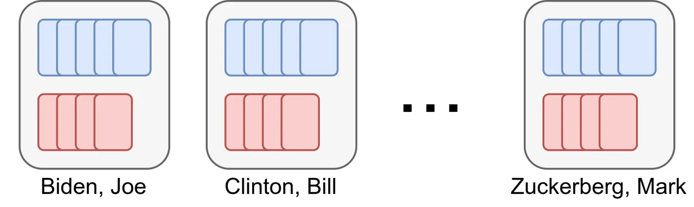

# Does Audio Deepfake Detection Generalize?

Nicolas M. Müller    Pavel Czempin    Franziska Dieckmann    Adam
Froghyar    Konstantin Böttinger

###### Abstract

Current text-to-speech algorithms produce realistic fakes of human
voices, making deepfake detection a much-needed area of research. While
researchers have presented various deep learning models for audio spoofs
detection, it is often unclear exactly why these architectures are
successful: Preprocessing steps, hyperparameter settings, and the degree
of fine-tuning are not consistent across related work. Which factors
contribute to success, and which are accidental?

In this work, we address this problem: We systematize audio spoofing
detection by re-implementing and uniformly evaluating twelve
architectures from related work. We identify overarching features for
successful audio deepfake detection, such as using _cqtspec_ or
_logspec_ features instead of _melspec_ features, which improves
performance by 37% EER on average, all other factors constant.

Additionally, we evaluate generalization capabilities: We collect and
publish a new dataset consisting of $`37.9`$ hours of found audio
recordings of celebrities and politicians, of which $`17.2`$ hours are
deepfakes. We find that related work performs poorly on such real-world
data (performance degradation of up to one thousand percent). This could
suggest that the community has tailored its solutions too closely to the
prevailing ASVspoof benchmark and that deepfakes are much harder to
detect outside the lab than previously thought.

^(†)^(†)address: ¹Fraunhofer AISEC    ²Technical University Munich   
³why do birds GmbH ^(†)^(†)email: nicolas.mueller@aisec.fraunhofer.de

## 1 Introduction

Modern text-to-speech synthesis (TTS) is capable of realistic fakes of
human voices, also known as audio deepfakes or spoofs. While there are
many ethical applications of this technology, there is also a serious
risk of malicious use. For example, TTS technology enables the cloning
of politicians’ voices \[1, 2\], which poses a variety of risks to
society, including the spread of misinformation.

Reliable detection of speech spoofing can help mitigate such risks and
is therefore an active area of research. However, since the technology
to create audio deepfakes has only been available for a few years (see
Wavenet \[3\] and Tacotron \[4\], published in 2016/17), audio spoof
detection is still in its infancy. While many approaches have been
proposed (cf.  Section 2), it is still difficult to understand why some
of the models work well: Each work uses different feature extraction
techniques, preprocessing steps, hyperparameter settings, and
fine-tuning. Which are the main factors and drivers for models to
perform well? What can be learned in principle for the development of
such systems?

Furthermore, the evaluation of spoof detection models has so far been
performed exclusively on the ASVspoof dataset \[5, 6\], which means that
the reported performance of these models is based on a limited set of
TTS synthesis algorithms. ASVspoof is based on the VCTK dataset \[7\],
which exclusively features professional speakers and has been recorded
in a studio environment, using a semi-anechoic chamber. What can we
expect from audio spoof detection trained on this dataset? Is it capable
of detecting realistic, unseen, ‘in-the-wild’ audio spoofs like those
encountered on social media?

To answer these questions, this paper presents the following
contributions:

- •
  We reimplement twelve of the most popular architectures from related
  work and evaluate them according to a common standard. We
  systematically exchange components to attribute performance reported
  in related work to either model architecture, feature extraction, or
  data preprocessing techniques. In this way, we identify fundamental
  properties for well-performing audio deepfake detection.
- •
  To investigate the applicability of related work in the real world, we
  introduce a new audio deepfake dataset¹¹ 1
  [https://huggingface.co/datasets/mueller91/In-The-Wild](https://huggingface.co/datasets/mueller91/In-The-Wild).
  We collect $`17.2`$ hours of high-quality audio deepfakes and $`20.7`$
  hours of of authentic material from $`58`$ politicians and
  celebrities.
- •
  We show that established models generally perform poorly on such
  real-world data. This discrepancy between reported and actual
  generalization ability suggests that the detection of audio fakes is a
  far more difficult challenge than previously thought.

## 2 Related Work

### 2.1 Model Architectures

There is a significant body of work on audio spoof detection, driven
largely by the ASVspoof challenges and datasets \[5, 6\]. In this
section, we briefly present the architectures and models used in our
evaluation in Section 5.

LSTM-based models. Recurrent architectures are a natural choice in the
area of language processing, with numerous related work utilizing such
models \[8, 9, 10, 11\]. As a baseline for evaluating this approach, we
implement a simple LSTM model: it consists of three LSTM layers followed
by a single linear layer. The output is averaged over the time dimension
to obtain a single embedding vector.

LCNN. Another common architecture for audio spoof detection are
LCNN-based learning models such as LCNN, LCNN-Attention, and LCNN-LSTM
\[12, 13, 14\]. LCNNs combine convolutional layers with Max-Feature-Map
activations to create ‘light’ convolutional neural networks.
LCNN-Attention has an added single-head-attention pooling layer, while
LCNN-LSTM uses a Bi-LSTM layer and a skip connection.

MesoNet. MesoNet is based on the Meso-4 \[15\] architecture, which was
originally used for detecting facial video deepfakes. It uses $`4`$
convolutional layers in addition to Batch Normalization, Max Pooling,
and a fully connected classifier.

MesoInception. Based on the facial deepfake detector Meso-Inception-4
\[15\], MesoInception extends the Meso-4 architecture with Inception
blocks \[16\].

ResNet18. Residual Networks were first used for audio deepfake detection
by \[17\], and continue to be employed \[18, 19\]. This architecture,
first introduced in the computer vision domain \[20\], uses
convolutional layers and shortcut connections, which avoids the
vanishing gradient problem and allows to design especially deep networks
($`18`$ layers for ResNet18).

Transformer. The Transformer architecture has also found its way into
the field of audio spoof detection \[21\]. We use four self-attention
layers with $`256`$ hidden dimensions and skip-connections, and encode
time with positional encodings \[22\].

CRNNSpoof. This end-to-end architecture combines 1D convolutions with
recurrent layers to learn features directly from raw audio
samples \[9\].

RawNet2 \[23\] is another end-to-end model. It employs
Sinc-Layers \[24\], which correspond to rectangular band-pass filters,
to extract information directly from raw waveforms.

RawPC is an end-to-end model which also uses Sinc-layers to operate
directly on raw wavforms. The architecture is found via differentiable
architecture search \[25\].

RawGAT-ST, a spectro-temporal graph attention network (GAT), trained in
an end-to-end fashion. It introduces spectral and temporal sub-graphs
and a graph pooling strategy, and reports state-of-the-art spoof
detection capabilities \[26\], which we can verify experimentally,
c.f. Table 1.

## 3 Datasets

To train and evaluate our models, we use the ASVspoof 2019
dataset \[5\], in particular its _Logical Access_ (LA) part. It consists
of audio files that are either real (i.e., authentic recordings of human
speech) or fake (i.e., synthesized or faked audio). The spoofed audio
files are from 19 different TTS synthesis algorithms. From a spoofing
detection point of view, ASVspoof considers synthetic utterances as a
threat to the authenticity of the human voice, and therefore labels them
as ‘attacks’. In total, there are 19 different attackers in the ASVspoof
2019 dataset, labeled A1 - A19. For each attacker, there are 4914
synthetic audio recordings and 7355 real samples. This dataset is
arguably the best known audio deefake dataset used by almost all related
work.

In order to evaluate our models on realistic unseen data in-the-wild, we
additionally create and publish a new audio deefake dataset,
c.f. Figure 1. It consists of $`37.9`$ hours of audio clips that are
either fake ($`17.2`$ hours) or real ($`20.7`$ hours). We feature
English-speaking celebrities and politicians, both from present and
past²² 2 available at
[https://huggingface.co/datasets/mueller91/In-The-Wild](https://huggingface.co/datasets/mueller91/In-The-Wild).
The fake clips are created by segmenting $`219`$ of publicly available
video and audio files that explicitly advertise audio deepfakes. Since
the speakers talk absurdly and out-of-character (‘Donald Trump reads
Star Wars’), it is easy to verify that the audio files are really
spoofed. We then manually collect corresponding genuine instances from
the same speakers using publicly available material such as podcasts,
speeches, etc. We take care to include clips where the type of speaker,
style, emotions, etc. are similar to the fake (e.g., for a fake speech
by Barack Obama, we include an authentic speech and try to find similar
values for background noise, emotions, duration, etc.). The clips have
an average length of $`4.3`$ seconds and are converted to ‘wav’ after
downloading. All recordings were downsampled to 16 kHz (the highest
common frequency in the original recordings). Clips were collected from
publicly available sources such as social networks and popular video
sharing platforms. This dataset is intended as evaluation data: it
allows evaluation of a model’s cross-database capabilities on a
realistic use case.

Figure 1: Schematics of our collected dataset. For $`n=58`$ celebrities
and politicians, we collected both bona-fide and spoofed audio
(represented by blue and red boxes per speaker). In total, we collected
$`20.8`$ hours of bona-fide and $`17.2`$ hours of spoofed audio. On
average, there are $`23`$ minutes of bona-fide and $`18`$ minutes of
spoofed audio per speaker.

## 4 Experimental Setup

### 4.1 Training and Evaluation

|                |              |              |                 |            |                  |
| -------------- | ------------ | ------------ | --------------- | ---------- | ---------------- |
|                |              |              | ASVspoof19 eval |            | In-the-Wild Data |
| Model Name     | Feature Type | Input Length | EER%            | t-DCF      | EER%             |
| LCNN           | cqtspec      | Full         | 6.354±0.39      | 0.174±0.03 | 65.559±11.14     |
| LCNN           | cqtspec      | 4s           | 25.534±0.10     | 0.512±0.00 | 70.015±4.74      |
| LCNN           | logspec      | Full         | 7.537±0.42      | 0.141±0.02 | 72.515±2.15      |
| LCNN           | logspec      | 4s           | 22.271±2.36     | 0.377±0.01 | 91.110±2.17      |
| LCNN           | melspec      | Full         | 15.093±2.73     | 0.428±0.05 | 70.311±2.15      |
| LCNN           | melspec      | 4s           | 30.258±3.38     | 0.503±0.04 | 81.942±3.50      |
| LCNN-Attention | cqtspec      | Full         | 6.762±0.27      | 0.178±0.01 | 66.684±1.08      |
| LCNN-Attention | cqtspec      | 4s           | 23.228±3.98     | 0.468±0.06 | 75.317±8.25      |
| LCNN-Attention | logspec      | Full         | 7.888±0.57      | 0.180±0.05 | 77.122±4.91      |
| LCNN-Attention | logspec      | 4s           | 14.958±2.37     | 0.354±0.03 | 80.651±6.14      |
| LCNN-Attention | melspec      | Full         | 13.487±5.59     | 0.374±0.14 | 70.986±9.73      |
| LCNN-Attention | melspec      | 4s           | 19.534±2.57     | 0.449±0.02 | 85.118±1.01      |
| LCNN-LSTM      | cqtspec      | Full         | 6.228±0.50      | 0.113±0.01 | 61.500±1.37      |
| LCNN-LSTM      | cqtspec      | 4s           | 20.857±0.14     | 0.478±0.01 | 72.251±2.97      |
| LCNN-LSTM      | logspec      | Full         | 9.936±1.74      | 0.158±0.01 | 79.109±0.84      |
| LCNN-LSTM      | logspec      | 4s           | 13.018±3.08     | 0.330±0.05 | 79.706±15.80     |
| LCNN-LSTM      | melspec      | Full         | 9.260±1.33      | 0.240±0.04 | 62.304±0.17      |
| LCNN-LSTM      | melspec      | 4s           | 27.948±4.64     | 0.483±0.03 | 82.857±3.49      |
| LSTM           | cqtspec      | Full         | 7.162±0.27      | 0.127±0.00 | 53.711±11.68     |
| LSTM           | cqtspec      | 4s           | 14.409±2.19     | 0.382±0.05 | 55.880±0.88      |
| LSTM           | logspec      | Full         | 10.314±0.81     | 0.160±0.00 | 73.111±2.52      |
| LSTM           | logspec      | 4s           | 23.232±0.32     | 0.512±0.00 | 78.071±0.49      |
| LSTM           | melspec      | Full         | 16.216±2.92     | 0.358±0.00 | 65.957±7.70      |
| LSTM           | melspec      | 4s           | 37.463±0.46     | 0.553±0.01 | 64.297±2.23      |
| MesoInception  | cqtspec      | Full         | 11.353±1.00     | 0.326±0.03 | 50.007±14.69     |
| MesoInception  | cqtspec      | 4s           | 21.973±4.96     | 0.453±0.09 | 68.192±12.47     |
| MesoInception  | logspec      | Full         | 10.019±0.18     | 0.238±0.02 | 37.414±9.16      |
| MesoInception  | logspec      | 4s           | 16.377±3.72     | 0.375±0.09 | 72.753±6.62      |
| MesoInception  | melspec      | Full         | 14.058±5.67     | 0.331±0.11 | 61.996±12.65     |
| MesoInception  | melspec      | 4s           | 21.484±3.51     | 0.408±0.03 | 51.980±15.32     |
| MesoNet        | cqtspec      | Full         | 7.422±1.61      | 0.219±0.07 | 54.544±11.50     |
| MesoNet        | cqtspec      | 4s           | 20.395±2.03     | 0.426±0.06 | 65.928±2.57      |
| MesoNet        | logspec      | Full         | 8.369±1.06      | 0.170±0.05 | 46.939±5.81      |
| MesoNet        | logspec      | 4s           | 11.124±0.79     | 0.263±0.03 | 80.707±12.03     |
| MesoNet        | melspec      | Full         | 11.305±1.80     | 0.321±0.06 | 58.405±11.28     |
| MesoNet        | melspec      | 4s           | 21.761±0.26     | 0.467±0.00 | 64.415±15.68     |
| ResNet18       | cqtspec      | Full         | 6.552±0.49      | 0.140±0.01 | 49.759±0.17      |
| ResNet18       | cqtspec      | 4s           | 18.378±1.76     | 0.432±0.07 | 61.827±7.46      |
| ResNet18       | logspec      | Full         | 7.386±0.42      | 0.139±0.02 | 80.212±0.23      |
| ResNet18       | logspec      | 4s           | 15.521±1.83     | 0.387±0.02 | 88.729±2.88      |
| ResNet18       | melspec      | Full         | 21.658±2.56     | 0.551±0.04 | 77.614±1.47      |
| ResNet18       | melspec      | 4s           | 28.178±0.33     | 0.489±0.01 | 83.006±7.17      |
| Transformer    | cqtspec      | Full         | 7.498±0.34      | 0.129±0.01 | 43.775±2.85      |
| Transformer    | cqtspec      | 4s           | 11.256±0.07     | 0.329±0.00 | 48.208±1.49      |
| Transformer    | logspec      | Full         | 9.949±1.77      | 0.210±0.06 | 64.789±0.88      |
| Transformer    | logspec      | 4s           | 13.935±1.70     | 0.320±0.03 | 44.406±2.17      |
| Transformer    | melspec      | Full         | 20.813±6.44     | 0.394±0.10 | 73.307±2.81      |
| Transformer    | melspec      | 4s           | 26.495±1.76     | 0.495±0.00 | 68.407±5.53      |
| CRNNSpoof      | raw          | Full         | 15.658±0.35     | 0.312±0.01 | 44.500±8.13      |
| CRNNSpoof      | raw          | 4s           | 19.640±1.62     | 0.360±0.04 | 41.710±4.86      |
| RawNet2        | raw          | Full         | 3.154±0.87      | 0.078±0.02 | 37.819±2.23      |
| RawNet2        | raw          | 4s           | 4.351±0.29      | 0.132±0.01 | 33.943±2.59      |
| RawPC          | raw          | Full         | 3.092±0.36      | 0.071±0.00 | 45.715±12.20     |
| RawPC          | raw          | 4s           | 3.067±0.91      | 0.097±0.03 | 52.884±6.08      |
| RawGAT-ST      | raw          | Full         | 1.229±0.43      | 0.036±0.01 | 37.154±1.95      |
| RawGAT-ST      | raw          | 4s           | 2.297±0.98      | 0.074±0.03 | 38.767±1.28      |

Table 1: Full results of evaluation on the ASVspoof 2019 LA ‘eval’ data.
We compare different model architectures against different feature types
and audio input lengths (4s, fixed-sized inputs vs. variable-length
inputs). Results are averaged over three independent trials with random
initialization, and the standard deviation is reported. Best-performing
configurations are highlighted in boldface. When evaluating the models
on our proposed ‘in-the-wild’ dataset, we see an increase in EER by up
to 1000% compared to ASVspoof 2019 (rightmost column).

#### 4.1.1 Hyper Parameters

We train all of our models using a cross-entropy loss with a log-Softmax
over the output logits. We choose the Adam \[27\] optimizer. We
initialize the learning rate at $`0.0001`$ and use a learning rate
scheduler. We train for $`100`$ epochs with early stopping using a
patience of five epochs.

#### 4.1.2 Train and Evaluation Data Splits

We train our models on the ‘train’ and ‘dev’ parts of the ASVSpoof 2019
Logical Access (LA) dataset part \[5\]. This is consistent with most
related work and also with the evaluation procedure of the ASVspoof 2019
Challenge. We test against two evaluation datasets. As _in-domain_
evaluation data, we use the ‘eval’ split of ASVspoof 2019. This split
contains unseen attacks, i.e., attacks not seen during training.
However, the evaluation audios share certain properties with the
training data \[28\], so model generalization cannot be assessed using
the ‘eval’ split of ASVspoof 2019 alone. This motivates the use of our
proposed ‘in-the-wild’ dataset, see Section 3, as unknown
_out-of-domain_ evaluation data.

#### 4.1.3 Evaluation metrics

We report both the equal-error rate (EER) and the tandem detection cost
function (t-DCF) \[29\] on the ASVspoof 2019 ‘eval’ data. For
consistency with the related work, we use the original implementation of
the t-DCF as provided for the ASVspoof 2019 challenge \[30\]. For our
proposed dataset, we report only the EER. This is because t-DCF scores
require the false alarm and miss costs, which are available only for
ASVspoof.

### 4.2 Feature Extraction

Several architectures used in this work require pre-processing the audio
data with a feature extractor (LCNN, LCNN-Attention, LCNN-LSTM, LSTM,
MesoNet, MesoInception, ResNet18, Transformer). We evaluate these
architectures on constant-Q transform (*cqtspec* \[31\]), log
spectrogram (_logspec_) and mel-scaled spectrogram (*melspec* \[32\])
features (all of them 513-dimensional). We use Python, *librosa* \[33\]
and *scipy* \[34\]. The rest of the models does not rely on
pre-processed data, but uses raw audio waveforms as inputs.

### 4.3 Audio Input Length

Audio samples usually vary in length, which is also the case for the
data in ASVspoof 2019 and our proposed ‘in-the-wild’ dataset. While some
models can accommodate variable-length input (and thus also fixed-length
input), many can not. We extend these by introducing a global averaging
layer, which adds such capability.

In our evaluation of fixed-length input, we chose a length of four
seconds, following \[23\]. If an input sample is longer, a random
four-second subset of the sample is used. If it is shorter, the sample
is repeated. To keep the evaluation fair, these shorter samples are also
repeated during the full-length evaluation. This ensures that
full-length input is never shorter than truncated input, but always at
least $`4`$s.

## 5 Results

Table 1 shows the results of our experiments, where we evaluate all
models against all configurations of data preprocessing: we train twelve
different models, using one of four different feature types, with two
different ways of handling variable-length audio. Each experiment is
performed three times, using random initialization. We report averaged
EER and t-DCF, as well as standard deviation. We observe that on
ASVspoof, our implementations perform comparable to related work, with a
margin of approximately $`2-4\%`$ EER and $`0.1`$ t-DCF. This is likely
because we do not fine-tune our models’ hyper-parameters.

### 5.1 Fixed vs. Variable Input Length

We analyze the effects of truncating the input signal to a fixed length
compared to using the full, unabridged audio. For all models,
performance decreases when the input is trimmed to $`4s`$. Table 2
averages all results based on input length. We see that average EER on
ASVspoof drops from $`19.89`$% to $`9.85`$% when the full-length input
is used. These results show that a four-second clip is insufficient for
the model to extract useful information compared to using the full audio
file as input. Therefore, we propose not to use fixed-length truncated
inputs, but to provide the full audio file to the model. This may seem
obvious, but the numerous works that use fixed-length inputs \[23, 25,
26\] suggest otherwise.

|              |                 |       |                  |
| ------------ | --------------- | ----- | ---------------- |
|              | ASVspoof19 eval |       | In-the-Wild Data |
| Input Length | EER %           | t-DCF | EER %            |
| Full         | 9.85            | 0.22  | 60.10            |
| 4s           | 18.89           | 0.39  | 67.25            |

Table 2: Model performance averaged by input preprocessing.
Fixed-length, 4s inputs perform significantly worse on the ASVspoof data
and on the ‘in-the-wild’ dataset than variable-length inputs. This
suggests that related work using fixed-length inputs may (unnecessarily)
sacrifice performance.

### 5.2 Effects of Feature Extraction Techniques

We discuss the effects of different feature preprocessing techniques,
c.f. 1: The ‘raw’ models outperform the feature-based models, obtaining
up to $`1.2\%`$ EER on ASVspoof and $`33.9\%`$ EER on the ‘in-the-wild’
dataset (RawGAT-ST and RawNet2). The spectrogram-based models perform
slightly worse, achieving up to $`6.3\%`$ EER on ASVspoof and $`37.4\%`$
on the ‘in-the-wild’ dataset (LCNN and MesoNet). The superiority of the
‘raw’ models is assumed to be due to finer feature-extraction resolution
than the spectogram-based models \[26\]. This has lead recent research
to focus largely on such raw-feature, end-to-end models \[25, 26\].

Concerning the spectogram-based models, we observe that _melspec_
features are always outperformed by either _cqtspec_ of _logspec_.
Simply replacing _melspec_ with _cqtspec_ increases the average
performance by 37%, all other factors constant.

### 5.3 Evaluation on ‘in-the-wild’ data

Especially interesting is the performance of the models on real-world
deepfake data. Table 1 shows the performance of our models on the
‘in-the-wild’ dataset. We see that there is a large performance gap
between the ASVSpoof 2019 evaluation data and our proposed ‘in-the-wild’
dataset. In general, the EER values of the models deteriorate by about
200 to 1000 percent. Often, the models do not perform better than random
guessing.

To investigate this further, we train our best ‘in-the-wild’ model from
Table 1, RawNet2 with $`4s`$ input length, on _all_ from ASVspoof 2019,
i.e., the ‘train’, ‘dev’, and ‘eval’ splits. We then re-evaluate on the
‘in-the-wild’ dataset to investigate whether adding more ASVspoof
training data improves out-of-domain performance. We achieve
$`33.1\pm 0.2`$ % EER, i.e., no improvement over training with only the
‘train’ and ‘dev’ data.

The inclusion of the ‘eval’ split does not seem to add much information
that could be used for real-world generalization. This is plausible in
that all splits of ASVspoof are fundamentally based on the same dataset,
VCTK, although the synthesis algorithms and speakers differ between
splits \[5\].

## 6 Conclusion

In this paper, we systematically evaluate audio spoof detection models
from related work according to common standards. In addition, we present
a new audio deefake dataset of ‘in-the-wild’ audio spoofs that we use to
evaluate the generalization capabilities of related work in a real-world
scenario.

We find that regardless of the model architecture, some preprocessing
steps are more successful than others. It turns out that the use of
_cqtspec_ or _logspec_ features consistently outperforms the use of
_melspec_ features in our comprehensive analysis. Furthermore, we find
that for most models, four seconds of input audio does not saturate
performance compared to longer examples. Therefore, we argue that one
should consider using _cqtspec_ features and unabridged input audio when
designing audio deepfake detection architectures.

Most importantly, however, we find that the ‘in-the-wild’ generalization
capabilities of many models may have been overestimated. We demonstrate
this by collecting our own audio deepfake dataset and evaluating twelve
different model architectures on it. Performance drops sharply, and some
models degenerate to random guessing. It may be possible that the
community has tailored its detection models too closely to the
prevailing benchmark, ASVSpoof, and that deepfakes are much harder to
detect outside the lab than previously thought.

## References

- \[1\] (-) Audio deep fake: demonstrator entwickelt am fraunhofer
  aisec - youtube. Note:
  [https://www.youtube.com/watch?v=MZTF0eAALmE](https://www.youtube.com/watch?v=MZTF0eAALmE)(Accessed
  on 04/01/2021) Cited by: §1.
- \[2\] (-) Deepfake video of volodymyr zelensky surrendering surfaces
  on social media - youtube. Note:
  [https://www.youtube.com/watch?v=X17yrEV5sl4](https://www.youtube.com/watch?v=X17yrEV5sl4)(Accessed
  on 03/23/2022) Cited by: §1.
- \[3\] A. v. d. Oord, S. Dieleman, H. Zen, K. Simonyan, O. Vinyals, A.
  Graves, N. Kalchbrenner, A. Senior, and K. Kavukcuoglu (2016) Wavenet:
  a generative model for raw audio. arXiv preprint arXiv:1609.03499.
  Cited by: §1.
- \[4\] Y. Wang, R. J. Skerry-Ryan, D. Stanton, Y. Wu, R. J. Weiss, N.
  Jaitly, Z. Yang, Y. Xiao, Z. Chen, S. Bengio, Q. V. Le, Y.
  Agiomyrgiannakis, R. Clark, and R. A. Saurous (2017) Tacotron: A fully
  end-to-end text-to-speech synthesis model. CoRR abs/1703.10135.
  External Links: [Link](http://arxiv.org/abs/1703.10135), 1703.10135
  Cited by: §1.
- \[5\] M. Todisco, X. Wang, V. Vestman, M. Sahidullah, H. Delgado, A.
  Nautsch, J. Yamagishi, N. Evans, T. Kinnunen, and K. A. Lee (2019)
  ASVspoof 2019: future horizons in spoofed and fake audio detection.
  arXiv preprint arXiv:1904.05441. Cited by: §1, §2.1, §3, §4.1.2, §5.3.
- \[6\] A. Nautsch, X. Wang, N. Evans, T. H. Kinnunen, V. Vestman, M.
  Todisco, H. Delgado, M. Sahidullah, J. Yamagishi, and K. A. Lee (2021)
  ASVspoof 2019: Spoofing Countermeasures for the Detection of
  Synthesized, Converted and Replayed Speech. 3 (2), pp. 252–265.
  External Links: ISSN 2637-6407,
  [Document](https://dx.doi.org/10.1109/TBIOM.2021.3059479) Cited by:
  §1, §2.1.
- \[7\] J. Yamagishi, C. Veaux, and K. MacDonald (2019) CSTR VCTK
  Corpus: english multi-speaker corpus for CSTR voice cloning toolkit
  (version 0.92). University of Edinburgh. The Centre for Speech
  Technology Research (CSTR). External Links:
  [Document](https://dx.doi.org/10.7488/ds/2645) Cited by: §1.
- \[8\] A. Gomez-Alanis, A. M. Peinado, J. A. Gonzalez, and A. M.
  Gomez (2019) A Gated Recurrent Convolutional Neural Network for Robust
  Spoofing Detection. 27 (12), pp. 1985–1999. External Links: ISSN
  2329-9304, [Document](https://dx.doi.org/10.1109/TASLP.2019.2937413)
  Cited by: §2.1.
- \[9\] A. Chintha, B. Thai, S. J. Sohrawardi, K. M. Bhatt, A.
  Hickerson, M. Wright, and R. Ptucha (2020) Recurrent Convolutional
  Structures for Audio Spoof and Video Deepfake Detection. pp. 1–1.
  External Links: ISSN 1941-0484,
  [Document](https://dx.doi.org/10.1109/JSTSP.2020.2999185) Cited by:
  §2.1, §2.1.
- \[10\] L. Zhang, X. Wang, E. Cooper, J. Yamagishi, J. Patino, and N.
  Evans (2021) An initial investigation for detecting partially spoofed
  audio. arXiv preprint arXiv:2104.02518. Cited by: §2.1.
- \[11\] S. Tambe, A. Pawar, and S. Yadav (2021) Deep fake videos
  identification using ann and lstm. Journal of Discrete Mathematical
  Sciences and Cryptography 24 (8), pp. 2353–2364. Cited by: §2.1.
- \[12\] X. Wang and J. Yamagishi (2021)A Comparative Study on Recent
  Neural Spoofing Countermeasures for Synthetic Speech
  Detection(Website) External Links:
  [Link](http://arxiv.org/abs/2103.11326), 2103.11326 Cited by: §2.1.
- \[13\] G. Lavrentyeva, S. Novoselov, E. Malykh, A. Kozlov, O.
  Kudashev, and V. Shchemelinin (2017) Audio replay attack detection
  with deep learning frameworks. In Interspeech 2017, pp. 82–86.
  External Links:
  [Link](http://www.isca-speech.org/archive/Interspeech_2017/abstracts/0360.html),
  [Document](https://dx.doi.org/10.21437/Interspeech.2017-360) Cited by:
  §2.1.
- \[14\] G. Lavrentyeva, S. Novoselov, A. Tseren, M. Volkova, A.
  Gorlanov, and A. Kozlov (2019) STC antispoofing systems for the
  ASVspoof2019 challenge. In Interspeech 2019, pp. 1033–1037. External
  Links:
  [Link](http://www.isca-speech.org/archive/Interspeech_2019/abstracts/1768.html),
  [Document](https://dx.doi.org/10.21437/Interspeech.2019-1768) Cited
  by: §2.1.
- \[15\] D. Afchar, V. Nozick, J. Yamagishi, and I. Echizen (2018)
  MesoNet: a Compact Facial Video Forgery Detection Network. In 2018
  IEEE International Workshop on Information Forensics and Security
  (WIFS), pp. 1–7. External Links: ISSN 2157-4774,
  [Document](https://dx.doi.org/10.1109/WIFS.2018.8630761) Cited by:
  §2.1, §2.1.
- \[16\] C. Szegedy, W. Liu, Y. Jia, P. Sermanet, S. Reed, D.
  Anguelov, D. Erhan, V. Vanhoucke, and A. Rabinovich (2015) Going
  deeper with convolutions. In 2015 IEEE Conference on Computer Vision
  and Pattern Recognition (CVPR), Vol. , pp. 1–9. External Links:
  [Document](https://dx.doi.org/10.1109/CVPR.2015.7298594) Cited by:
  §2.1.
- \[17\] M. Alzantot, Z. Wang, and M. B. Srivastava (2019) Deep Residual
  Neural Networks for Audio Spoofing Detection. In Interspeech 2019,
  pp. 1078–1082. External Links:
  [Document](https://dx.doi.org/10.21437/Interspeech.2019-3174),
  [Link](http://www.isca-speech.org/archive/Interspeech_2019/abstracts/3174.html)
  Cited by: §2.1.
- \[18\] Y. Zhang, F. Jiang, and Z. Duan (2021) One-class learning
  towards synthetic voice spoofing detection. IEEE Signal Processing
  Letters 28, pp. 937–941. Cited by: §2.1.
- \[19\] J. Monteiro, J. Alam, and T. H. Falk (2020) Generalized
  end-to-end detection of spoofing attacks to automatic speaker
  recognizers. Computer Speech & Language 63, pp. 101096. Cited by:
  §2.1.
- \[20\] K. He, X. Zhang, S. Ren, and J. Sun (2016) Deep residual
  learning for image recognition. In Proceedings of the IEEE conference
  on computer vision and pattern recognition, pp. 770–778. Cited by:
  §2.1.
- \[21\] Z. Zhang, X. Yi, and X. Zhao (2021) Fake speech detection using
  residual network with transformer encoder. In Proceedings of the 2021
  ACM Workshop on Information Hiding and Multimedia Security, pp. 13–22.
  Cited by: §2.1.
- \[22\] A. Vaswani, N. Shazeer, N. Parmar, J. Uszkoreit, L.
  Jones, A. N. Gomez, Ł. Kaiser, and I. Polosukhin (2017) Attention is
  all you need. Advances in neural information processing systems 30.
  Cited by: §2.1.
- \[23\] H. Tak, J. Patino, M. Todisco, A. Nautsch, N. Evans, and A.
  Larcher (2021) End-to-End anti-spoofing with RawNet2. In ICASSP 2021 -
  2021 IEEE International Conference on Acoustics, Speech and Signal
  Processing (ICASSP), pp. 6369–6373. External Links: ISSN 2379-190X,
  [Document](https://dx.doi.org/10.1109/ICASSP39728.2021.9414234) Cited
  by: §2.1, §4.3, §5.1.
- \[24\] M. Ravanelli and Y. Bengio (2018) Speaker recognition from raw
  waveform with sincnet. In 2018 IEEE Spoken Language Technology
  Workshop (SLT), pp. 1021–1028. Cited by: §2.1.
- \[25\] W. Ge, J. Patino, M. Todisco, and N. Evans (2021) Raw
  differentiable architecture search for speech deepfake and spoofing
  detection. arXiv preprint arXiv:2107.12212. Cited by: §2.1, §5.1,
  §5.2.
- \[26\] H. Tak, J. Jung, J. Patino, M. Kamble, M. Todisco, and N.
  Evans (2021) End-to-end spectro-temporal graph attention networks for
  speaker verification anti-spoofing and speech deepfake detection.
  arXiv preprint arXiv:2107.12710. Cited by: §2.1, §5.1, §5.2.
- \[27\] D. P. Kingma and J. Ba (2015) Adam: A method for stochastic
  optimization. In 3rd International Conference on Learning
  Representations, ICLR 2015, San Diego, CA, USA, May 7-9, 2015,
  Conference Track Proceedings, Y. Bengio and Y. LeCun (Eds.), External
  Links: [Link](http://arxiv.org/abs/1412.6980) Cited by: §4.1.1.
- \[28\] N. M. Müller, F. Dieckmann, P. Czempin, R. Canals, J. Williams,
  and K. Böttinger (2021)Speech is Silver, Silence is Golden: What do
  ASVspoof-trained Models Really Learn?(Website) External Links:
  [Link](http://arxiv.org/abs/2106.12914), 2106.12914 Cited by: §4.1.2.
- \[29\] T. Kinnunen, K. A. Lee, H. Delgado, N. Evans, M. Todisco, M.
  Sahidullah, J. Yamagishi, and D. A. Reynolds (2018) T-DCF: a detection
  cost function for the tandem assessment of spoofing countermeasures
  and automatic speaker verification. In Odyssey 2018 The Speaker and
  Language Recognition Workshop, pp. 312–319. External Links:
  [Document](https://dx.doi.org/10.21437/Odyssey.2018-44) Cited by:
  §4.1.3.
- \[30\] (-) TDCF official implementation. Note:
  [https://www.asvspoof.org/asvspoof2019/tDCF_python_v1.zip](https://www.asvspoof.org/asvspoof2019/tDCF_python_v1.zip)(Accessed
  on 03/03/2022) Cited by: §4.1.3.
- \[31\] J. C. Brown (1991) Calculation of a constant q spectral
  transform. The Journal of the Acoustical Society of America 89 (1),
  pp. 425–434. Cited by: §4.2.
- \[32\] S. S. Stevens, J. Volkmann, and E. B. Newman (1937) A scale for
  the measurement of the psychological magnitude pitch. The journal of
  the acoustical society of america 8 (3), pp. 185–190. Cited by: §4.2.
- \[33\] B. McFee, C. Raffel, D. Liang, D. P. Ellis, M. McVicar, E.
  Battenberg, and O. Nieto (2015) Librosa: audio and music signal
  analysis in python. In Proceedings of the 14th python in science
  conference, Vol. 8, pp. 18–25. Cited by: §4.2.
- \[34\] P. Virtanen, R. Gommers, T. E. Oliphant, M. Haberland, T.
  Reddy, D. Cournapeau, E. Burovski, P. Peterson, W. Weckesser, J.
  Bright, et al. (2020) SciPy 1.0: fundamental algorithms for scientific
  computing in python. Nature methods 17 (3), pp. 261–272. Cited by:
  §4.2.
