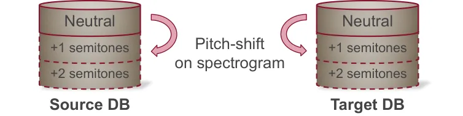
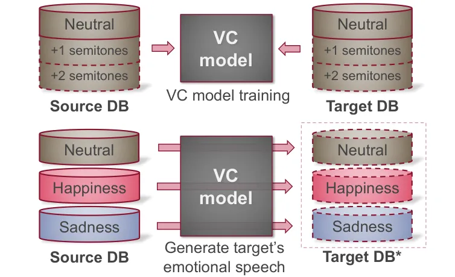
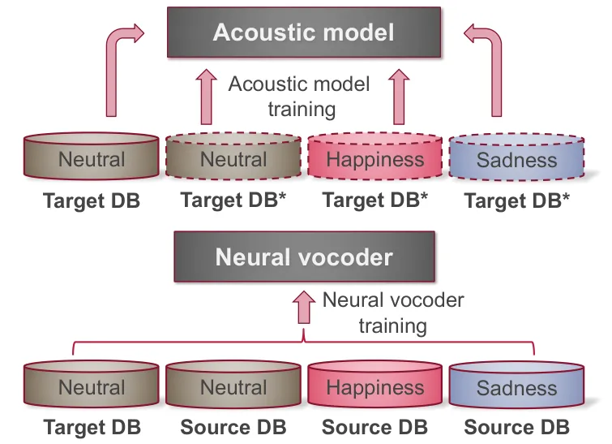
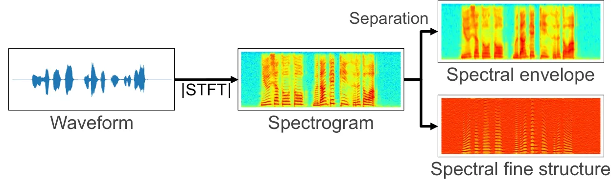
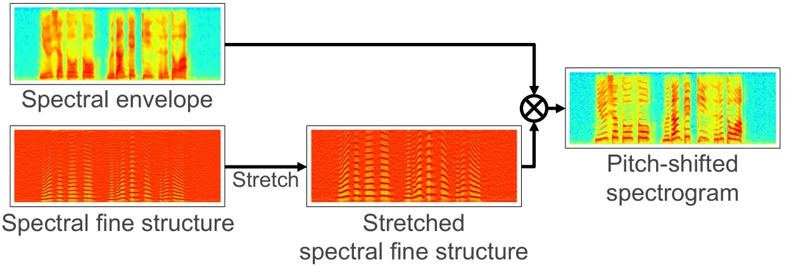
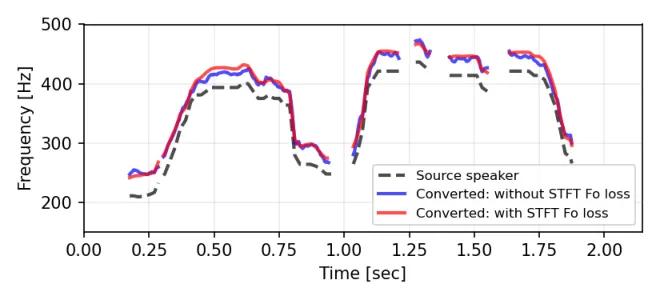
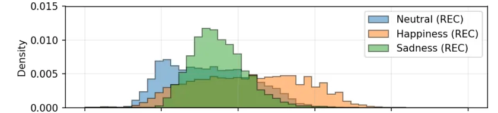
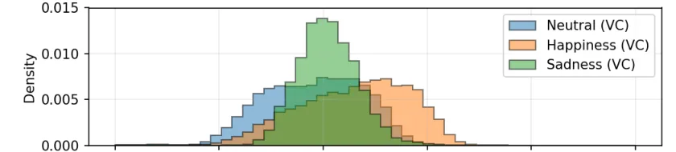
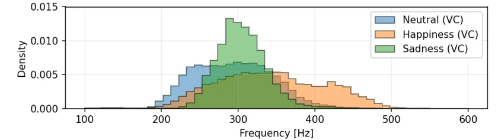

# Cross-Speaker Emotion Transfer for Low-Resource Text-to-Speech Using Non-Parallel Voice Conversion with Pitch-Shift Data Augmentation

Ryo Terashima    Ryuichi Yamamoto    Eunwoo Song    Yuma Shirahata   
Hyun-Wook Yoon    Jae-Min Kim    Kentaro Tachibana

###### Abstract

Data augmentation via voice conversion (VC) has been successfully
applied to low-resource expressive text-to-speech (TTS) when only
neutral data for the target speaker are available. Although the quality
of VC is crucial for this approach, it is challenging to learn a stable
VC model because the amount of data is limited in low-resource
scenarios, and highly expressive speech has large acoustic variety. To
address this issue, we propose a novel data augmentation method that
combines pitch-shifting and VC techniques. Because pitch-shift data
augmentation enables the coverage of a variety of pitch dynamics, it
greatly stabilizes training for both VC and TTS models, even when only
1,000 utterances of the target speaker’s neutral data are available.
Subjective test results showed that a FastSpeech 2-based emotional TTS
system with the proposed method improved naturalness and emotional
similarity compared with conventional methods.

^(†)^(†)address: ¹LINE Corp.,Tokyo, Japan,  
²NAVER Corp., Seongnam, Korea

Index Terms: text-to-speech, data augmentation, voice conversion,
low-resource, emotional speech, pitch-shift

## 1 Introduction

Deep learning approaches have been successfully applied to expressive
text-to-speech (TTS). Expressive styles of speech can be modeled using
explicit labels for style attributes \[1, 2\] or by extracting
high-level latent features from input speech \[3, 4, 5, 6\]. However,
achieving competitive performance in low-resource scenarios remains a
challenge.

In previous studies on low-resource TTS, researchers used transfer
learning \[7, 8, 9\] or multi-speaker modeling \[10, 11, 12\]. Most
recently, data augmentation techniques have been successfully applied in
low-resource scenarios \[13, 14, 15\]. In particular, a cross-speaker
style transfer method via voice conversion (VC) enables expressive TTS
systems to be built where expressive data is only available for some
existing speakers (i.e., source speaker) \[16\]. In this method, a pair
of neutral speech databases of source and target speakers is used to
learn a VC model. Then, the learned VC model is used to transfer the
source model’s expressive style (e.g., conversation) to the target
speaker. Finally, a TTS acoustic model is trained using the VC-augmented
speech together with the recorded neutral speech.

However, although a high-quality VC model is crucial for data
augmentation approaches, it is challenging to learn a stable VC model
when (1) the amount of data is limited under low-resource conditions or
(2) highly expressive speech has large acoustic variety. Under such
conditions, a lack of accurate prosody conversion is often observed
because VC models tend to focus on spectral (e.g., Mel-spectrogram)
conversion \[17\]. Although some VC models use a mean-variance
normalization method for fundamental frequency ($`F_{o}`$)
conversion \[18\], this is not sufficient to stably generate the highly
emotional voice of the target speaker.

To address the aforementioned problem, we propose a novel data
augmentation method that combines pitch-shift (PS) augmentation and
non-parallel VC-based augmentation. Our method differs from existing
methods \[16\] in that the proposed system focuses on improving VC
performance to make it suitable for converting emotional attributes,
even though the target speaker’s data only consist of neutral
recordings.

In detail, in the proposed method, we first apply PS-based augmentation
to both the source and target speaker’s neutral recordings. As this
enables the VC model to cover a variety of pitch dynamics, it
substantially improves the stability of the training process.
Additionally, we also propose incorporating a short-time Fourier
transform (STFT)-based $`F_{o}`$ regularization loss into the
optimization criteria of the VC training process. This also stabilizes
the target speaker’s $`F_{o}`$ trajectory, which is crucial for
converting highly emotional speech segments. As a result, the VC model
learned by the proposed method stably transfers the source speaker’s
speaking style to the target speaker, and even makes it possible to
build the target speaker’s emotional TTS system.

We investigated the effectiveness of the proposed data augmentation
approach by performing subjective evaluation tasks. Note that PS-based
augmentation and STFT $`F_{o}`$ regularization loss can be extended to
any neural VC model; however, our focus is the Scyclone model \[19\]
based on a cycle-consistent adversarial network (CycleGAN) \[20\]. The
experimental results demonstrated that our VC-augmented TTS system
achieved better naturalness and emotional similarity than conventional
methods when only 1,000 utterances of the target speaker’s neutral data
were available.

## 2 Method



(a)



(b)



(c)

Figure 1: Overview of the proposed method for building emotional TTS. We
used data augmentation for training both the VC and TTS model: (a)
PS-based data augmentation, (b) VC-based data augmentation, and (c) TTS
model.

Figure 1 shows an overview of our proposed method. In this study, we
investigate three speaking styles: neutral, happiness, and sadness. The
proposed method consists of PS-based data augmentation, VC-based data
augmentation and emotional TTS system. In the following, we describe the
details of each component.

### 2.1 PS-based data augmentation

Figure 2 shows an overview of our PS-based data augmentation. Unlike
traditional PS methods such as pitch-synchronous overlap-add \[21\] and
vocoders \[22\], our method does not require $`F_{o}`$ estimation.
Furthermore, since it does not involve waveform synthesis, there is no
need to reconstruct the phase information. Specifically, the proposed
method applies a stretching technique to the spectral fine structure to
convert the pitch of the input signal. In the separation step as shown
in Figure 2a, we first compute a speech spectrogram using STFT and then
separate it into spectral envelopes and fine structures based on the
lag-window method \[23\]. Next, by applying a linear interpolation
method, we stretch the spectral fine structure along the frequency axis.
Let $`S_{t,k}`$ denote the spectral fine structure for the $`t`$-th time
index and $`k`$-th frequency bin. Then, we obtain the stretched spectrum
as follows \[24\]:

```math
\displaystyle\hat{S}_{t,\alpha k} \displaystyle={S}_{t,k}, \tag{1}
```

```math
\displaystyle\alpha \displaystyle=2^{p/12}, \tag{2}
```

where $`\alpha`$ denotes the stretching ratio determined by the semitone
unit $`p`$. In the generation step as shown in Figure 2b, we obtain the
pitch-shifted spectrogram by multiplying the original spectral envelope
and corresponding stretched spectral fine structure.

As shown in Figure 1a, we apply the proposed PS method to augment both
the source and target speaker’s neutral data. In detail, we vary the
semitone unit $`p`$ in the range \[-3, 12\], which results in generating
data 15 times larger amount of data than the original recordings. All
the augmented datasets are used to train the VC model, which we explain
further in the following section.



(a)



(b)

Figure 2: Pitch-shift data augmentation: (a) spectrogram separation and
(b) spectrogram generation.

### 2.2 Non-parallel voice conversion

#### 2.2.1 Model

From the many state-of-the-art VC models, we adopt a non-parallel
Scyclone model \[19\] because of its stable generation and competitive
quality. This method uses two separate modules: a CycleGAN-based
spectrogram conversion model \[20\] and a single-Gaussian WaveRNN-based
vocoder \[25\]. However, we only use the spectrogram conversion model
because VC aims to augment acoustic features when training TTS models.
Note that we use the log-Mel spectrogram as the target acoustic features
together with continuous log $`F_{o}`$ \[26\], and voiced/unvoiced flags
(V/UV). Predicting these additional features using the VC model is
essential to create emotional TTS models that include
$`F_{o}`$-dependent high-fidelity neural vocoders \[27\].



Figure 3: Comparison of the generated $`F_{o}`$ with and without the
proposed regularization and source $`F_{o}`$.

|              |                    |             |        |              |        |       |           |       |         |       |
| ------------ | ------------------ | ----------- | ------ | ------------ | ------ | ----- | --------- | ----- | ------- | ----- |
| Model        | Type               | VC training |        | TTS training |        |       |           |       |         |       |
|              |                    | Neutral     |        | Neutral      |        |       | Happiness |       | Sadness |       |
|              |                    | REC         | PS-DA  | Source       | Target | VC-DA | Source    | VC-DA | Source  | VC-DA |
| Source       | Recorded audio     | \-          | \-     | \-           | \-     | \-    | \-        | \-    | \-      | \-    |
| SRC-TTS      | Source speaker TTS | \-          | \-     | 5.0 K        | \-     | \-    | 2.5 K     | \-    | 2.5 K   | \-    |
| TGT-NEU-TTS  | Target speaker TTS | \-          | \-     | \-           | 2.5 K  | \-    | \-        | \-    | \-      | \-    |
| MS-TTS       | Multi-speaker TTS  | \-          | \-     | 5.0 K        | 2.5 K  | \-    | 2.5 K     | \-    | 2.5 K   | \-    |
| VC-TTS       | VC-TTS w/o PS      | 2.5 K       | \-     | \-           | 2.5 K  | 5.0 K | \-        | 2.5 K | \-      | 2.5 K |
| VC-TTS-PS    | VC-TTS w/ PS       | 2.5 K       | 37.5 K | \-           | 2.5 K  | 5.0 K | \-        | 2.5 K | \-      | 2.5 K |
| VC-TTS-PS-1K | VC-TTS w/ PS       | 1.0 K       | 15.0 K | \-           | 1.0 K  | 5.0 K | \-        | 2.5 K | \-      | 2.5 K |

- •
  REC: Recorded data; PS-DA: Data augmented by pitch-shifting; VC-DA:
  Data augmented by voice conversion

Table 1: Systems for comparison and the number of utterances for
training the VC and TTS models.

#### 2.2.2 STFT $`F_{o}`$ regularization loss function

To avoid unnatural conversion of the prosody features, we propose an
STFT-based $`F_{o}`$ regularization loss function. Following a previous
study on a spectrogram domain $`F_{o}`$ loss function \[28\], we also
define the regularization loss function on the spectrogram domain.

Let $`X_{n,k}`$ and $`\hat{X}_{n,k}`$ be STFT magnitudes for extracted
and predicted $`F_{o}`$ sequences for the $`n`$-th frame index and
$`k`$-th frequency bin, respectively. The regularization loss is defined
as follows:

```math
L_{\mathrm{F_{o}}}=\frac{1}{M}\sum_{n=1}^{N}\sum_{k=\beta}^{K}\left|\log X_{n,k}-\log\hat{X}_{n,k}\right|, \tag{3}
```

where $`N,K,`$ and $`M`$ represent the number of frames, number of
frequency bins, and number of elements in the magnitude, respectively;
$`\beta`$ denotes a hyperparameter that controls the regularization
strength. To regularize only the fine structure component of $`F_{o}`$
(i.e., high-frequency components of the STFT magnitude) that contains
little information about speaking styles for reading speech, we set
$`\beta=3`$ based on our preliminary experiments. Furthermore, we extend
the loss function to multiple resolutions inspired by previous studies
on multi-level $`F_{o}`$ modeling \[29\] and multi-resolution STFT
loss \[30\]. Consequently, we optimize the VC model using the proposed
regularization loss along with the adversarial loss, cycle consistency
loss, and identity mapping loss functions, as described in
Scyclone \[19\].

As shown in Figure 3, the $`F_{o}`$ trajectory produced without the
regularization method oscillates unstably. By contrast, with the
regularization, the stability of the $`F_{o}`$ trajectory improves as
the VC model can focus on converting essential aspects of prosody
variations.

#### 2.2.3 VC-based data augmentation

For the criteria described above, we train the Scyclone model using a
pair of source and target speaker’s speech databases. Note that the
training data consists of neutral recordings and PS-augmented data from
each speaker. As illustrated in Figure 1b, we use the resulting VC model
to convert all the source speaker’s emotional voice into the target
speaker’s voice. Simultaneously, to stabilize the training process of
the TTS model, we also convert the source speaker’s neutral voice to the
target speaker’s voice.

We use all the converted data, together with the target speaker’s
neutral recordings, to train the target speaker’s emotional TTS system.

### 2.3 Text-to-speech

Our TTS model consists of two components: (1) an acoustic model that
converts an input phoneme sequence into acoustic features and (2) a
vocoder that converts the acoustic feature into the waveform. For the
acoustic model, we use FastSpeech 2 \[28\] with a Conformer
encoder \[31\] because of its fast but high-quality TTS
capability \[32\]. To adapt FastSpeech 2 for emotional TTS, we condition
the model using external emotion code \[33\]. For the vocoder, we use
the high-fidelity harmonic-plus-noise Parallel WaveGAN (HN-PWG) \[27\].

Figure 1 (c) shows the training process of TTS with the proposed data
augmentation. We mix synthetic and recorded data for the target speaker
and use them to train the acoustic model. At the inference stage, the
TTS model generates emotional speech by inputting text and an emotion
code. Note that we do not use data augmentation for training the vocoder
because (1) it has been reported that using a large amount of training
data is not crucial for the vocoder \[34\], and (2) our preliminary
experiments also confirmed subtle improvements when the amount of the
source speaker’s data was sufficiently large.

## 3 Experiments

### 3.1 Experimental setup

#### 3.1.1 Database and feature extraction settings

For the experiments, we used two phonetically and prosodically rich
speech corpora recorded by two female Japanese professional speakers,
which represent data for the source and target speakers. We sampled
speech signals at 24 kHz with 16 bit quantization. The source speaker
data contained three speaking styles: neutral, happiness, and sadness,
whereas the target speaker data contained only neutral style¹¹ 1 The
average sentence duration for each data set was 5.0, 4.7, 4.2, and 5.1
seconds, respectively..

We concatenated the $`80`$-dimensional log-Mel spectrogram, continuous
log $`F_{o}`$, and V/UV with 5 ms analysis intervals as
$`82`$-dimensional features. We used them as the target acoustic
features for both the VC and acoustic models. We calculated the log-Mel
spectrogram with a 40 ms window length. We extracted $`F_{o}`$ and V/UV
using the improved time-frequency trajectory excitation vocoder \[35\].
We obtained $`F_{o}`$ for the acoustic features generated by PS data
augmentation by shifting the $`F_{o}`$ extracted from the original
speech. We used V/UV extracted from the original speech as the V/UV for
the generated data. We normalized the acoustic features so that they had
a zero mean and unit variance for each dimension using the statistics of
the training data.

|              |             |             |             |                    |             |             |                      |             |
| ------------ | ----------- | ----------- | ----------- | ------------------ | ----------- | ----------- | -------------------- | ----------- |
| Model        | Naturalness |             |             | Speaker similarity |             |             | Emotional similarity |             |
|              | Neutral     | Happiness   | Sadness     | Neutral            | Happiness   | Sadness     | Happiness            | Sadness     |
| Source       | 4.88 ± 0.05 | 4.84 ± 0.05 | 4.69 ± 0.07 | \-                 | \-          | \-          | \-                   | \-          |
| SRC-TTS      | 4.56 ± 0.06 | 4.46 ± 0.08 | 4.40 ± 0.08 | 1.15 ± 0.05        | 1.28 ± 0.08 | 1.29 ± 0.08 | 3.48 ± 0.08          | 3.71 ± 0.07 |
| TGT-NEU-TTS  | \-          | \-          | \-          | \-                 | \-          | \-          | 1.69 ± 0.09          | 1.29 ± 0.07 |
| MS-TTS       | 3.91 ± 0.09 | 2.85 ± 0.10 | 2.74 ± 0.11 | 2.85 ± 0.13        | 2.76 ± 0.11 | 2.51 ± 0.12 | 2.48 ± 0.10          | 2.72 ± 0.11 |
| VC-TTS       | 4.06 ± 0.08 | 3.88 ± 0.10 | 4.00 ± 0.10 | 2.98 ± 0.12        | 2.89 ± 0.11 | 3.26 ± 0.11 | 3.33 ± 0.08          | 3.63 ± 0.07 |
| VC-TTS-PS    | 4.03 ± 0.08 | 4.20 ± 0.09 | 4.00 ± 0.09 | 2.98 ± 0.12        | 2.87 ± 0.12 | 3.35 ± 0.10 | 3.82 ± 0.05          | 3.67 ± 0.07 |
| VC-TTS-PS-1K | 4.20 ± 0.08 | 4.08 ± 0.09 | 3.96 ± 0.11 | 3.19 ± 0.11        | 2.90 ± 0.12 | 3.31 ± 0.09 | 3.87 ± 0.04          | 3.63 ± 0.07 |

Table 2: Naturalness, speaker similarity, and emotional similarity MOS
test results with 95% confidence intervals. Results for the highest
score in the VC-based TTS systems are shown in bold.

#### 3.1.2 Model details

For the CycleGAN-based VC model, the generator and discriminator were
composed of four and three residual blocks, respectively, and each block
consisted of two convolutional layers with leaky ReLU activation. We set
the kernel size to three for all the convolutional layers. We trained
the VC model for 400 K steps using an Adam optimizer \[36\]. We set the
learning rate to 0.0002, and reduced this by a factor of ten every 100 K
steps. We set the minibatch size to 64. We set the weight of the
proposed regularization loss described in Section 2.2 to 0.1, and used
the FFT sizes (32, 64, 128), window sizes (32, 64, 128), and hop sizes
(8, 16, 32) for the multi-resolution STFT loss. We used the identity
mapping loss only for the first 10 K steps \[17\].

For the TTS acoustic model, we used four Conformer and Transformer
blocks for the encoder and decoder, respectively. For each block, we set
the hidden sizes of the self-attention and feedforward layers to 384 and
1024, respectively. To achieve natural prosody for Japanese, for the
model, we used accent information as external input \[37\]. For
emotional TTS, we added emotion embedding followed by a projection layer
with 256-dimensional phoneme and accent embedding. To improve the
duration stability, we used manually annotated phoneme durations. At the
training stage, we used a dynamic batch size with an average of 23
samples to create a minibatch \[38\], and trained the models for 200 K
steps using the RAdam optimizer \[39\].

Table 1 summarizes the systems used in our experiments. We trained the
following TTS systems:

SRC-TTS:  
Baseline TTS model trained with the source speaker’s recordings.

TGT-NEU-TTS:  
Baseline TTS model trained with the target speaker’s recordings (neutral
style alone).

MS-TTS:  
Baseline multi-speaker TTS model trained with source and target
speaker’s recordings.

VC-TTS:  
Baseline TTS model trained with target speaker’s recordings and
VC-augmented data.

VC-TTS-PS:  
Proposed TTS model trained with target speaker’s recordings and
PS-VC-augmented data

VC-TTS-PS-1K:  
Proposed TTS model similarly configured with VC-TTS-PS system, but
trained with a limited amount of recordings.

As the vocoder, we trained HN-PWG \[27\] for 400 K steps with the RAdam
optimizer \[39\]. For training, we used 5,000 utterances of neutral
style, 2,500 utterances of happiness style, and 2,500 utterances of
sadness style from the source speaker, and 1,000 utterances of neutral
style from the target speaker. We used the same vocoder for all the
aforementioned TTS systems.

### 3.2 Evaluation

To evaluate the effectiveness of our proposed method, we conducted
subjective listening tests: 5-point naturalness mean opinion score
(MOS), 4-point speaker similarity MOS, and 4-point emotional similarity
MOS²² 2 Following the method used in the VC challenge \[40\], we used
the 5-point responses 1 = Bad; 2 = Poor; 3 = Fair; 4 = Good; and 5 =
Excellent; and the 4-point responses 1 = Different, absolutely sure; 2 =
Different, not sure; 3 = Same, not sure; and 4 = Same, absolutely sure.
.

We asked native Japanese raters to make a quality judgment. The number
of subjects for each evaluation was 14, 12, and 12, respectively. For
all the tests, we randomly selected 20 utterances from the evaluation
set for each system. In the naturalness evaluation, we evaluated the
recorded speech of the source speaker and synthetic speech of five TTS
systems, for a total of 360 utterances. In the speaker similarity
evaluation, we set the recorded speech of the target speaker as a
reference, and evaluated five TTS systems, for a total of 300
utterances. Note that the reference samples contained neutral,
happiness, and sadness emotions, which constituted of 25 seconds in
total. In the emotional similarity test, we evaluated 240 pairs of
utterances that consisted of the recorded emotional speech of the source
speaker and the synthetic speech from six TTS systems. Note that we used
the neutral TTS system of the target speaker (i.e., TGT-NEU-TTS) as an
anchor system only in the emotional similarity test.

### 3.3 Results

The results of the MOS evaluations are shown in Table 2. The findings
can be summarized as follows: (1) VC data augmentation was effective for
improving naturalness and speaker/emotional similarities over the
multi-speaker TTS baseline (VC-TTS vs. MS-TTS), particularly for
emotional styles; and (2) the proposed PS data augmentation further
improved performance. In particular, naturalness and emotional
similarity significantly improved for happiness (VC-TTS vs. VC-TTS-PS)
while achieving high emotion reproducibility of the source speaker
nearly the same or even better than SRC-TTS.; and (3) our proposed
method achieved competitive performance, even with a limited number of
training data (VC-TTS-PS vs. VC-TTS-PS-1K). We observed that
VC-TTS-PS-1K achieved better naturalness and speaker similarity than
VC-TTS-PS for the neutral style. For naturalness, this could be
explained by the source speaker’s database having a more natural
speaking style than the target speaker, and the style of the source
speaker was transferred to the target speaker’s TTS when the relative
amount of VC augmented data is high (i.e., VC-TTS-PS-1K). For speaker
similarity, we hypothesized that it was caused by the difference of
$`F_{o}`$ statistics of the training data. To verify this, we examined
the $`F_{o}`$ statistics of pseudo neutral data used for training
VC-TTS-PS and VC-TTS-PS-1K, and found that the latter contained higher
$`F_{o}`$ on average 4.04 Hz. Because $`F_{o}`$ of the target speaker
was higher than that of the source speaker in our experiments,
higher-pitched samples of VC-TTS-PS-1K tended to have higher speaker
similarity for the neutral style. We encourage readers to listen to the
samples provided on our demo page³³ 3
[https://ryojerky.github.io/demo_vc-tts-ps/](https://ryojerky.github.io/demo_vc-tts-ps/).

To further verify the effectiveness of the proposed method, we analyzed
the $`F_{o}`$ distributions of the original data and the pseudo data
generated by the VC model. As illustrated in Figure 4, the distribution
of $`F_{o}`$ with PS data augmentation was closer in shape to that of
the original data for happiness. The results confirmed that the VC model
trained on the proposed PS-augmented data generated richer pitch
variations that were close to natural recordings compared with the VC
model trained without PS data augmentation. By contrast, we observed
similar distributions with and without the proposed PS augmentation for
sadness. This can be explained as follows: sadness is less dynamic and
has fewer pitch variations than happiness. The results suggest that our
proposed method was particularly suited for emotionally expressive and
dynamic styles, such as happiness.



(a)



(b)



(c)

Figure 4: $`F_{o}`$ distributions obtained from each emotion: (a) the
source speaker’s recorded data, (b) the target speaker’s VC-augmented
data, and (c) that with the proposed PS method.

## 4 Conclusion

We proposed a cross-speaker emotion style transfer method for a
low-resource expressive TTS system, where expressive data is not
available for the target speaker. Our proposed method combines PS-based
and VC-based augmentation methods to stabilize training for both VC and
TTS acoustic models. Subjective test results showed that the
FastSpeech 2-based emotional TTS system learned by the proposed method
improved naturalness and emotional similarity compared with conventional
methods. In the future, we aim to apply the proposed method to more
distinctive, expressive, and dynamic styles of speech.

## 5 Acknowledgments

This work was supported by Clova Voice, NAVER Corp., Seongnam, Korea.

## 6 References

author4hash=6e83398c41ee082487b1d1d38b574eb9family=Zhu, familyi=Z.,
given=Xiaolian,
giveni=X.hash=145f16fc6448a0544cbff9ecccf36caffamily=Yang, familyi=Y.,
given=Shan, giveni=S.hash=fed866aa96208c113abf3617b4e27f0afamily=Yang,
familyi=Y., given=Geng,
giveni=G.hash=d9501bb096bed7e71af1f43d9ee08d98family=Xie, familyi=X.,
given=Lei, giveni=L.
author3hash=48245eac12528e3a9af69c2be6fdad0dfamily=Lei, familyi=L.,
given=Yi, giveni=Y.hash=145f16fc6448a0544cbff9ecccf36caffamily=Yang,
familyi=Y., given=Shan,
giveni=S.hash=d9501bb096bed7e71af1f43d9ee08d98family=Xie, familyi=X.,
given=Lei, giveni=L.
author10hash=fc399f85ccdd18f7c16d2cd99a42d132family=Wang, familyi=W.,
given=Yuxuan,
giveni=Y.hash=85a75cd53c0e7cb34793ed25b27003b8family=Stanton,
familyi=S., given=Daisy,
giveni=D.hash=9a4f4a1ff661cd600eb26523a5ba8bb4family=Zhang, familyi=Z.,
given=Yu, giveni=Y.hash=82cdc5e9fa97da60cc90508940115727family=Ryan,
familyi=R., given=RJ-Skerry,
giveni=R-S.hash=88df80421f33af7bf1ba5d0a84245c68family=Battenberg,
familyi=B., given=Eric,
giveni=E.hash=dde6aa7c5763ede6c27853dafb2f846cfamily=Shor, familyi=S.,
given=Joel, giveni=J.hash=c57222b168ab332ea995a3dd0f61c864family=Xiao,
familyi=X., given=Ying,
giveni=Y.hash=d3a49a660fa8a6c8a93b5273a70eae29family=Jia, familyi=J.,
given=Ye, giveni=Y.hash=c5c2052038ff526612859e58aec297acfamily=Ren,
familyi=R., given=Fei,
giveni=F.hash=7195887e1fff23cbe4d4606880c8f0dafamily=Saurous,
familyi=S., given=Rif A, giveni=R.A.
author9hash=12dfe1f59c012973b161655e19ed9754family=Skerry-Ryan,
familyi=S-R., given=RJ,
giveni=R.hash=88df80421f33af7bf1ba5d0a84245c68family=Battenberg,
familyi=B., given=Eric,
giveni=E.hash=c57222b168ab332ea995a3dd0f61c864family=Xiao, familyi=X.,
given=Ying, giveni=Y.hash=fc399f85ccdd18f7c16d2cd99a42d132family=Wang,
familyi=W., given=Yuxuan,
giveni=Y.hash=85a75cd53c0e7cb34793ed25b27003b8family=Stanton,
familyi=S., given=Daisy,
giveni=D.hash=dde6aa7c5763ede6c27853dafb2f846cfamily=Shor, familyi=S.,
given=Joel, giveni=J.hash=89d698773eaf2fae761ff0008031c7befamily=Weiss,
familyi=W., given=Ron,
giveni=R.hash=8a4fb1a2f5260b08591cc3ee76e638abfamily=Clark, familyi=C.,
given=Rob, giveni=R.hash=7195887e1fff23cbe4d4606880c8f0dafamily=Saurous,
familyi=S., given=Rif A, giveni=R.A.
author10hash=caee6b3fa31c9aa140f1d90048cd989ffamily=Hsu, familyi=H.,
given=Wei-Ning,
giveni=W-N.hash=9a4f4a1ff661cd600eb26523a5ba8bb4family=Zhang,
familyi=Z., given=Yu,
giveni=Y.hash=79806915dad52902a35bf2249c791110family=Weiss, familyi=W.,
given=Ron J, giveni=R.J.hash=1b8c874ca3304dce43ffbe24d5affe62family=Zen,
familyi=Z., given=Heiga,
giveni=H.hash=1fc7a40d6072b1bb1d4e56d14ef88e2ffamily=Wu, familyi=W.,
given=Yonghui,
giveni=Y.hash=fc399f85ccdd18f7c16d2cd99a42d132family=Wang, familyi=W.,
given=Yuxuan, giveni=Y.hash=2923de2da7f9b32b957552e414b6bc16family=Cao,
familyi=C., given=Yuan,
giveni=Y.hash=d3a49a660fa8a6c8a93b5273a70eae29family=Jia, familyi=J.,
given=Ye, giveni=Y.hash=c0d10aaf985cebf8d0497e1828f9313ffamily=Chen,
familyi=C., given=Zhifeng,
giveni=Z.hash=7f1a9ef81d98cf013191d02e3e5c98cefamily=Shen, familyi=S.,
given=Jonathan, giveni=J.
author4hash=beee514263a9420823de542218e9cc34family=Zhang, familyi=Z.,
given=Ya-Jie,
giveni=Y-J.hash=dcb7ed2a181f23d03b597dd0ec516f9afamily=Pan, familyi=P.,
given=Shifeng, giveni=S.hash=a26b1c586372c88da93cac52c6337743family=He,
familyi=H., given=Lei,
giveni=L.hash=6141208900447ed2b4f6d8bea7eae834family=Ling, familyi=L.,
given=Zhen-Hua, giveni=Z-H.
author10hash=d3a49a660fa8a6c8a93b5273a70eae29family=Jia, familyi=J.,
given=Ye, giveni=Y.hash=9a4f4a1ff661cd600eb26523a5ba8bb4family=Zhang,
familyi=Z., given=Yu,
giveni=Y.hash=89d698773eaf2fae761ff0008031c7befamily=Weiss, familyi=W.,
given=Ron, giveni=R.hash=e2068259fc5297e154f92a417136c922family=Wang,
familyi=W., given=Quan,
giveni=Q.hash=7f1a9ef81d98cf013191d02e3e5c98cefamily=Shen, familyi=S.,
given=Jonathan,
giveni=J.hash=c5c2052038ff526612859e58aec297acfamily=Ren, familyi=R.,
given=Fei, giveni=F.hash=842040ccc784c0e00e9b177a7271883afamily=Nguyen,
familyi=N., given=Patrick,
giveni=P.hash=79b11327e6066baac1563390e41c13f2family=Pang, familyi=P.,
given=Ruoming,
giveni=R.hash=9ea74ce6976a72145a7df1a52bbdd5dffamily=Lopez Moreno,
familyi=L.M., given=Ignacio,
giveni=I.hash=1fc7a40d6072b1bb1d4e56d14ef88e2ffamily=Wu, familyi=W.,
given=Yonghui, giveni=Y.
author3hash=b89334c9fdc1a4e30945b026a1704d76family=Tits, familyi=T.,
given=Noé, giveni=N.hash=ad04ec5950e4a277f83004189109341dfamily=El
Haddad, familyi=E.H., given=Kevin,
giveni=K.hash=ac6056dd9379b8901598c58d55171e5bfamily=Dutoit, familyi=D.,
given=Thierry, giveni=T.
author5hash=fdea592e6f06a6643e4763fc7ab2c550family=Chung, familyi=C.,
given=Yu-An,
giveni=Y-A.hash=fc399f85ccdd18f7c16d2cd99a42d132family=Wang, familyi=W.,
given=Yuxuan, giveni=Y.hash=caee6b3fa31c9aa140f1d90048cd989ffamily=Hsu,
familyi=H., given=Wei-Ning,
giveni=W-N.hash=9a4f4a1ff661cd600eb26523a5ba8bb4family=Zhang,
familyi=Z., given=Yu,
giveni=Y.hash=12dfe1f59c012973b161655e19ed9754family=Skerry-Ryan,
familyi=S-R., given=RJ, giveni=R.
author4hash=49e6a9a8496bdeefdeab7fbd48325913family=Valle, familyi=V.,
given=Rafael, giveni=R.hash=757ee43203ad9bbb1f0624d13926a6a9family=Li,
familyi=L., given=Jason,
giveni=J.hash=1d3f831a6b4fef8e363f1ee3739a0a04family=Prenger,
familyi=P., given=Ryan,
giveni=R.hash=3c8bbc381484f2cfbbd08866be36590efamily=Catanzaro,
familyi=C., given=Bryan, giveni=B.
author8hash=6166533c3e09152e7b89f67438020ff5family=Gibiansky,
familyi=G., given=Andrew,
giveni=A.hash=22c5e08fb31874790e8bed0aa6207bc4family=Arik, familyi=A.,
given=Sercan,
giveni=S.hash=fe0b5c62f5fbbcbe8b3b69115795d3e5family=Diamos, familyi=D.,
given=Gregory,
giveni=G.hash=6b50415d37b3248a676f0e655b38b2bbfamily=Miller, familyi=M.,
given=John, giveni=J.hash=c28840954d84f29a56a0fa0f0ce231bbfamily=Peng,
familyi=P., given=Kainan,
giveni=K.hash=fe56a97aca48de3bbb0b53f223fd5015family=Ping, familyi=P.,
given=Wei, giveni=W.hash=9db43b2d2fa0f38a4051782eb9de8f87family=Raiman,
familyi=R., given=Jonathan,
giveni=J.hash=83a9e81d976cada23775106b303c4247family=Zhou, familyi=Z.,
given=Yanqi, giveni=Y.
author5hash=fe4967e95e81aaa41c222a352a43e8ccfamily=Byambadorj,
familyi=B., given=Zolzaya,
giveni=Z.hash=01306b5d721c5f5717f6865a25f00883family=Nishimura,
familyi=N., given=Ryota,
giveni=R.hash=7311b4f931e60e37320b2a271ddd0d83family=Ayush, familyi=A.,
given=Altangerel,
giveni=A.hash=ac416512585f22bdbfb9c20b6f68c601family=Ohta, familyi=O.,
given=Kengo,
giveni=K.hash=7de7bb895c7c3ad476311e7fbe6e0bbcfamily=Kitaoka,
familyi=K., given=Norihide, giveni=N.
author4hash=e99f23d73656c4c1925167d77dd0abcffamily=Hwang, familyi=H.,
given=Min-Jae,
giveni=M-J.hash=d041256806edee13f942f8790029e506family=Yamamoto,
familyi=Y., given=Ryuichi,
giveni=R.hash=67bb04216fc06fa68b7bc70aa277223cfamily=Song, familyi=S.,
given=Eunwoo, giveni=E.hash=13c5f58d6e653549d17acf3026013ef5family=Kim,
familyi=K., given=Jae-Min, giveni=J-M.
author6hash=681d6e9a67922a5cb69fe651d21987acfamily=Huybrechts,
familyi=H., given=Goeric,
giveni=G.hash=dbeb4c323090761ff0dc14c66def318afamily=Merritt,
familyi=M., given=Thomas,
giveni=T.hash=4b9f442ec51931826ba6c2b4ec3b98ddfamily=Comini, familyi=C.,
given=Giulia, giveni=G.hash=88e97dff54626da2f95c2d5632707587family=Perz,
familyi=P., given=Bartek,
giveni=B.hash=ae1a028cb4daa680cda7895cf7013a21family=Shah, familyi=S.,
given=Raahil,
giveni=R.hash=487dee4d02326569c9a3d5dfb62c6c98family=Lorenzo-Trueba,
familyi=L-T., given=Jaime, giveni=J.
author8hash=ae1a028cb4daa680cda7895cf7013a21family=Shah, familyi=S.,
given=Raahil,
giveni=R.hash=402ae59b7ac48fb5e0abfacfb6850be8family=Pokora, familyi=P.,
given=Kamil,
giveni=K.hash=f89899885bf251fb4c0af091109e0a31family=Ezzerg, familyi=E.,
given=Abdelhamid,
giveni=A.hash=bc87b82e0ad0121f4719b5e6863b299ffamily=Klimkov,
familyi=K., given=Viacheslav,
giveni=V.hash=681d6e9a67922a5cb69fe651d21987acfamily=Huybrechts,
familyi=H., given=Goeric,
giveni=G.hash=d23388f97bb102c37f84ec5ba6c4c171family=Putrycz,
familyi=P., given=Bartosz,
giveni=B.hash=d6f2d5b085340bf4faa87e419694bf1ffamily=Korzekwa,
familyi=K., given=Daniel,
giveni=D.hash=dbeb4c323090761ff0dc14c66def318afamily=Merritt,
familyi=M., given=Thomas, giveni=T.
author6hash=168443c8402a4491ce53f0aaf5dc4edffamily=Ribeiro, familyi=R.,
given=Manuel Sam,
giveni=M.S.hash=f7a44c03bdb631193ee88b2d0a655e9bfamily=Roth, familyi=R.,
given=Julian,
giveni=J.hash=4b9f442ec51931826ba6c2b4ec3b98ddfamily=Comini, familyi=C.,
given=Giulia,
giveni=G.hash=681d6e9a67922a5cb69fe651d21987acfamily=Huybrechts,
familyi=H., given=Goeric,
giveni=G.hash=03c695e237a5258c07106bfe550aaaf4family=Gabrys, familyi=G.,
given=Adam,
giveni=A.hash=487dee4d02326569c9a3d5dfb62c6c98family=Lorenzo-Trueba,
familyi=L-T., given=Jaime, giveni=J.
author4hash=6a9a8ad52288d40b1537b6b9cace7696family=Kaneko, familyi=K.,
given=Takuhiro,
giveni=T.hash=3bf91fd111e898901fb917bb72176535family=Kameoka,
familyi=K., given=Hirokazu,
giveni=H.hash=9a1de45c3184e849f0058a5404ce0c97family=Tanaka, familyi=T.,
given=Kou, giveni=K.hash=b56e9e0f478c28fa3033b030569e2454family=Hojo,
familyi=H., given=Nobukatsu, giveni=N.
author3hash=d562f671c07f8c040705eecd9a9fbd05family=Liu, familyi=L.,
given=Kun, giveni=K.hash=11afa3ee590c1caff2305801befb549ffamily=Zhang,
familyi=Z., given=Jianping,
giveni=J.hash=985bd01a03eac016042d3ac2908f599ffamily=Yan, familyi=Y.,
given=Yonghong, giveni=Y.
author6hash=d7805b5e2d5aaff0ea3072bee9c139e4family=Kanagaki, familyi=K.,
given=Aoi, giveni=A.hash=769e4d34d3bde71acc2bd784fca74babfamily=Tanaka,
familyi=T., given=Masaya,
giveni=M.hash=fffaefa404f65ba015f25d9cf3b0d777family=Nose, familyi=N.,
given=Takashi,
giveni=T.hash=005de4a21bd0d9e8e82f7abbcb17e172family=Shimizu,
familyi=S., given=Ryohei,
giveni=R.hash=41fdc3b1ef69ab2fba94f39ee0c7ad61family=Ito, familyi=I.,
given=Akira, giveni=A.hash=d3d77e3940a0c2a7277ba4b9dc483707family=Ito,
familyi=I., given=Akinori, giveni=A.
author4hash=9fbb4b31963f07f34a13b375b4997338family=Zhu, familyi=Z.,
given=Jun-Yan,
giveni=J-Y.hash=b036e0ed5c21929ab46890b9a1033163family=Park, familyi=P.,
given=Taesung,
giveni=T.hash=cae9f806bc99a5f19fadea538fc2db04family=Isola, familyi=I.,
given=Phillip,
giveni=P.hash=5a663b27298722834a8cf09bb93d8c94family=Efros, familyi=E.,
given=Alexei A, giveni=A.A.
author2hash=d2eb03f9881e6ad067020d271e2de281family=Charpentier,
familyi=C., given=Francis,
giveni=F.hash=c9021f38df144b69798836c08175b59efamily=Stella, familyi=S.,
given=M, giveni=M.
author3hash=378b4063c3346b9610dff8949aee45adfamily=Morise, familyi=M.,
given=Masanori,
giveni=M.hash=8c6072397c3f98baf0d386e876477c80family=Yokomori,
familyi=Y., given=Fumiya,
giveni=F.hash=21eb3cd534cce542e97a385d6e42e669family=Ozawa, familyi=O.,
given=Kenji, giveni=K.
author3hash=c4336c99fe8a54dc0d504d7f81f6d677family=Tohkura, familyi=T.,
given=Y, giveni=Y.hash=48b4219adca321bfd8395e0cfbd511f7family=Itakura,
familyi=I., given=F,
giveni=F.hash=659482822e1ced96bcbf9fb3fb5f62cbfamily=Hashimoto,
familyi=H., given=S, giveni=S.
author1hash=378b4063c3346b9610dff8949aee45adfamily=Morise, familyi=M.,
given=Masanori, giveni=M.
author4hash=0e1c36d5737bf03d5840a64ad78efb46family=Okamoto, familyi=O.,
given=Takuma, giveni=T.hash=d0fb328bc36d1a9a42b9a721d7909992family=Toda,
familyi=T., given=Tomoki,
giveni=T.hash=dd6d4233fb999ce8009872c5848ae98bfamily=Shiga, familyi=S.,
given=Yoshinori,
giveni=Y.hash=5902e2f00bf26c1e9676114e6972e9edfamily=Kawai, familyi=K.,
given=Hisashi, giveni=H.
author2hash=f5a13dcc79cf0ffe67e50260860f709afamily=Yu, familyi=Y.,
given=Kai, giveni=K.hash=4e4fb887c4c9f76e33e3eb48bbe7a7d6family=Young,
familyi=Y., given=Steve, giveni=S.
author4hash=e99f23d73656c4c1925167d77dd0abcffamily=Hwang, familyi=H.,
given=Min-Jae,
giveni=M-J.hash=d041256806edee13f942f8790029e506family=Yamamoto,
familyi=Y., given=Ryuichi,
giveni=R.hash=67bb04216fc06fa68b7bc70aa277223cfamily=Song, familyi=S.,
given=Eunwoo, giveni=E.hash=13c5f58d6e653549d17acf3026013ef5family=Kim,
familyi=K., given=Jae-Min, giveni=J-M.
author6hash=b16f413501c898845c8100a04adeacfbfamily=Ren, familyi=R.,
given=Yi, giveni=Y.hash=0dbadb1dbd0cb3df87943bb419af0c84family=Hu,
familyi=H., given=Chenxu,
giveni=C.hash=5588f729660dbe4dbf5af3850f858ae3family=Qin, familyi=Q.,
given=Tao, giveni=T.hash=9d6bb97907d2f1dfb1b7e9d969af3256family=Zhao,
familyi=Z., given=Sheng,
giveni=S.hash=2fbf0a96c093b44d72b6965af57b70f0family=Zhao, familyi=Z.,
given=Zhou, giveni=Z.hash=716b89cbb7332599ebb33cc58a52f648family=Liu,
familyi=L., given=Tie-Yan, giveni=T-Y.
author6hash=07273b759f2110328f44c11588ee20f2family=Ming, familyi=M.,
given=Huaiping,
giveni=H.hash=4c090901565f5168d7aa46bb684d3664family=Huang, familyi=H.,
given=Dongyan,
giveni=D.hash=cbc2fd632bc2d228da4bcc2c89ebb1c2family=Dong, familyi=D.,
given=Minghui, giveni=M.hash=f397ee85433a25b75738faa0b764e496family=Li,
familyi=L., given=Haizhou,
giveni=H.hash=d9501bb096bed7e71af1f43d9ee08d98family=Xie, familyi=X.,
given=Lei, giveni=L.hash=71cea543143b85548682c883b6b56389family=Zhang,
familyi=Z., given=Shaofei, giveni=S.
author3hash=d041256806edee13f942f8790029e506family=Yamamoto, familyi=Y.,
given=Ryuichi,
giveni=R.hash=67bb04216fc06fa68b7bc70aa277223cfamily=Song, familyi=S.,
given=Eunwoo, giveni=E.hash=13c5f58d6e653549d17acf3026013ef5family=Kim,
familyi=K., given=Jae-Min, giveni=J-M.
author10hash=063ab7a6cd2185bf685fa080e90e9685family=Gulati, familyi=G.,
given=Anmol, giveni=A.hash=8f675d983742bbef13eac0250849f419family=Qin,
familyi=Q., given=James,
giveni=J.hash=a16597f6d78144232241757f5d6e401cfamily=Chiu, familyi=C.,
given=Chung-Cheng,
giveni=C-C.hash=06649ebab1ea5cac0250746a19764975family=Parmar,
familyi=P., given=Niki,
giveni=N.hash=9a4f4a1ff661cd600eb26523a5ba8bb4family=Zhang, familyi=Z.,
given=Yu, giveni=Y.hash=39e224f7a71cf6663eb02e20fe36a941family=Yu,
familyi=Y., given=Jiahui,
giveni=J.hash=8b758de66cb65310a5a03a6a4fd6ef0ffamily=Han, familyi=H.,
given=Wei, giveni=W.hash=f3983593afc8fff60516540069aade36family=Wang,
familyi=W., given=Shibo,
giveni=S.hash=7ad98404816d86f695a832ba4f10b07cfamily=Zhang, familyi=Z.,
given=Zhengdong,
giveni=Z.hash=1fc7a40d6072b1bb1d4e56d14ef88e2ffamily=Wu, familyi=W.,
given=Yonghui, giveni=Y.
author10hash=c7874af82c40e468c0a096a40bc65526family=Guo, familyi=G.,
given=Pengcheng,
giveni=P.hash=b7bffb525bbfe5118a24bbc611d264adfamily=Boyer, familyi=B.,
given=Florian,
giveni=F.hash=26238bc0a75da6ffb5bcdeeeadad2315family=Chang, familyi=C.,
given=Xuankai,
giveni=X.hash=d240bae1e3c88f765895ab4d83782eb4family=Hayashi,
familyi=H., given=Tomoki,
giveni=T.hash=d212c3bc2603fe66313c8a8b1a949f0dfamily=Higuchi,
familyi=H., given=Yosuke,
giveni=Y.hash=1b6ece64ce935f90d240bf937cc07775family=Inaguma,
familyi=I., given=Hirofumi,
giveni=H.hash=da87239f05cd8efb99709e3449f3d7b7family=Kamo, familyi=K.,
given=Naoyuki, giveni=N.hash=0a14dd92308010b2b49a9b6b6eb596cdfamily=Li,
familyi=L., given=Chenda,
giveni=C.hash=96d6a5a78037d83cb68d277d0ed4d7c9family=Garcia-Romero,
familyi=G-R., given=Daniel,
giveni=D.hash=93ca06e4e7e7c2aa380766cf659c7901family=Shi, familyi=S.,
given=Jiatong, giveni=J.
author4hash=aa869618625581900ca11f55034ebd75family=Choi, familyi=C.,
given=Heejin, giveni=H.hash=0d5f1805da0c655c4cae94f43fe25b18family=Park,
familyi=P., given=Sangjun,
giveni=S.hash=86e3c22e905ee07df6790b86d39b7590family=Park, familyi=P.,
given=Jinuk, giveni=J.hash=dad00513a061951cca11069077f8cf46family=Hahn,
familyi=H., given=Minsoo, giveni=M.
author7hash=6bc697efbe7da53ef038a6783ac7a2f9family=Matsubara,
familyi=M., given=Keisuke,
giveni=K.hash=0e1c36d5737bf03d5840a64ad78efb46family=Okamoto,
familyi=O., given=Takuma,
giveni=T.hash=e0e718d503d3e295fa2bbda709410d4ffamily=Takashima,
familyi=T., given=Ryoichi,
giveni=R.hash=9ba4e3d6f79fcf1bca0baef76393d9affamily=Takiguchi,
familyi=T., given=Tetsuya,
giveni=T.hash=d0fb328bc36d1a9a42b9a721d7909992family=Toda, familyi=T.,
given=Tomoki,
giveni=T.hash=dd6d4233fb999ce8009872c5848ae98bfamily=Shiga, familyi=S.,
given=Yoshinori,
giveni=Y.hash=5902e2f00bf26c1e9676114e6972e9edfamily=Kawai, familyi=K.,
given=Hisashi, giveni=H.
author3hash=67bb04216fc06fa68b7bc70aa277223cfamily=Song, familyi=S.,
given=Eunwoo,
giveni=E.hash=a8ce10e45a951dd4f17b3476f942ba68family=Soong, familyi=S.,
given=Frank K,
giveni=F.K.hash=c3fec8ebe65569b1566ad3207dd97a3cfamily=Kang, familyi=K.,
given=Hong-Goo, giveni=H-G.
author2hash=b6fbd171848aad4edf3925543f1f1522family=Kingma, familyi=K.,
given=Diederik P,
giveni=D.P.hash=8aa66e8231cc2fdbe67aa4f18ca970c6family=Ba, familyi=B.,
given=Jimmy, giveni=J.
author4hash=fc6eaaed96f37c82216a4909dae620a9family=Yasuda, familyi=Y.,
given=Yusuke, giveni=Y.hash=03d3e23852937fa39b0e34246c4ecd1dfamily=Wang,
familyi=W., given=Xin,
giveni=X.hash=e69437598cddd27b1a728c9b76dbf2eafamily=Takaki, familyi=T.,
given=Shinji,
giveni=S.hash=64bfb2b1761cc3077e7b25f2eaa562eefamily=Yamagishi,
familyi=Y., given=Junichi, giveni=J.
author9hash=d240bae1e3c88f765895ab4d83782eb4family=Hayashi, familyi=H.,
given=Tomoki,
giveni=T.hash=d041256806edee13f942f8790029e506family=Yamamoto,
familyi=Y., given=Ryuichi,
giveni=R.hash=9e2b06baf3fa017bb2988676571df0ccfamily=Inoue, familyi=I.,
given=Katsuki,
giveni=K.hash=e0a58b052caf9d7c2ae5b9e428b3b4b9family=Yoshimura,
familyi=Y., given=Takenori,
giveni=T.hash=ae898cb785c2eecb4cda42d862e0d5d4family=Watanabe,
familyi=W., given=Shinji,
giveni=S.hash=d0fb328bc36d1a9a42b9a721d7909992family=Toda, familyi=T.,
given=Tomoki,
giveni=T.hash=2b2282fdbdd87a174a8a26f0e6e2f477family=Takeda, familyi=T.,
given=Kazuya,
giveni=K.hash=9a4f4a1ff661cd600eb26523a5ba8bb4family=Zhang, familyi=Z.,
given=Yu, giveni=Y.hash=88c58ea43b71cda8e83ddf1181a534cefamily=Tan,
familyi=T., given=Xu, giveni=X.
author7hash=30c27aab84eec430831ee1a526cc7724family=Liu, familyi=L.,
given=Liyuan,
giveni=L.hash=a5643fa1ae8fe0824b15f38d5bd6a580family=Jiang, familyi=J.,
given=Haoming, giveni=H.hash=c53e3e860dbeebd073b0651c1f711567family=He,
familyi=H., given=Pengcheng,
giveni=P.hash=05d71a9c5e7ac79222e01a55af0ccb93family=Chen, familyi=C.,
given=Weizhu, giveni=W.hash=b881686cdf68b52745dbcb6374b8008bfamily=Liu,
familyi=L., given=Xiaodong,
giveni=X.hash=159bca5607e3797666654a2e3022978afamily=Gao, familyi=G.,
given=Jianfeng,
giveni=J.hash=7cacfe272c4d395c979d6aecd2f5ec9cfamily=Han, familyi=H.,
given=Jiawei, giveni=J.
author8hash=911df329639abb08461cf03dae8c764ffamily=Zhao, familyi=Z.,
given=Yi, giveni=Y.hash=ec17bfcf1b4f3219ae7da4e83dcaa9fcfamily=Huang,
familyi=H., given=Wen-Chin,
giveni=W-C.hash=130ef84ac4beeab906fded780874b2f1family=Tian, familyi=T.,
given=Xiaohai,
giveni=X.hash=64bfb2b1761cc3077e7b25f2eaa562eefamily=Yamagishi,
familyi=Y., given=Junichi,
giveni=J.hash=3a4be90c809e33bc9e4ae5d555b8ed6bfamily=Das, familyi=D.,
given=Rohan Kumar,
giveni=R.K.hash=0adea8b988e4a3eac751bcf14a5edf11family=Kinnunen,
familyi=K., given=Tomi,
giveni=T.hash=08e769a6c78f942438109f28ac8bff91family=Ling, familyi=L.,
given=Zhenhua,
giveni=Z.hash=d0fb328bc36d1a9a42b9a721d7909992family=Toda, familyi=T.,
given=Tomoki, giveni=T.

## References

- \[1\] “Controlling emotion strength with relative attribute for
  end-to-end speech synthesis” In _Proc. ASRU_, 2019, pp. 192–199
- \[2\] “Fine-grained emotion strength transfer, control and prediction
  for emotional speech synthesis” In _Proc. SLT_, 2021, pp. 423–430
- \[3\] “Style tokens: Unsupervised style modeling, control and transfer
  in end-to-end speech synthesis” In _Proc. ICML_, 2018, pp. 5180–5189
  PMLR
- \[4\] “Towards end-to-end prosody transfer for expressive speech
  synthesis with tacotron” In _Proc. ICML_, 2018, pp. 4693–4702 PMLR
- \[5\] “Hierarchical generative modeling for controllable speech
  synthesis” In _Proc. ICLR_, 2019
- \[6\] “Learning latent representations for style control and transfer
  in end-to-end speech synthesis” In _Proc. ICASSP_, 2019, pp. 6945–6949
- \[7\] “Transfer learning from speaker verification to multispeaker
  text-to-speech synthesis” In _Proc. NeurIPS_, 2018
- \[8\] “Exploring transfer learning for low resource emotional TTS” In
  _Proc. IntelliSys_, 2019, pp. 52–60 Springer
- \[9\] “Semi-supervised training for improving data efficiency in
  end-to-end speech synthesis” In _Proc. ICASSP_, 2019, pp. 6940–6944
- \[10\] “Mellotron: Multispeaker expressive voice synthesis by
  conditioning on rhythm, pitch and global style tokens” In _Proc.
  ICASSP_, 2020, pp. 6189–6193
- \[11\] “Deep voice 2: Multi-speaker neural text-to-speech” In _Proc.
  NeurIPS_, 2017, pp. 2962–2970
- \[12\] “Multi-speaker TTS system for low-resource language using
  cross-lingual transfer learning and data augmentation” In _Proc.
  APSIPA_, 2021, pp. 849–853
- \[13\] “TTS-by-TTS: TTS-driven data augmentation for fast and
  high-quality speech synthesis” In _Proc. ICASSP_, 2021, pp. 6598–6602
- \[14\] “Low-resource expressive text-to-speech using data
  augmentation” In _Proc. ICASSP_, 2021, pp. 6593–6597
- \[15\] “Non-Autoregressive TTS with Explicit Duration Modelling for
  Low-Resource Highly Expressive Speech” In _Proc. SSW_, 2021
- \[16\] “Cross-speaker style transfer for text-to-speech using data
  augmentation” In _Proc. ICASSP (in press)_, 2022
- \[17\] “CycleGAN-VC2: Improved CycleGAN-based Non-parallel Voice
  Conversion” In _Proc. ICASSP_, 2019
- \[18\] “High quality voice conversion through phoneme-based linear
  mapping functions with straight for Mandarin” In _Proc. FSKD_, 2007,
  pp. 410–414
- \[19\] “CycleGAN-Based High-Quality Non-Parallel Voice Conversion with
  Spectrogram and WaveRNN” In _Proc. GCCE_, 2020, pp. 356–357
- \[20\] “Unpaired image-to-image translation using cycle-consistent
  adversarial networks” In _Proc. ICCV_, 2017, pp. 2223–2232
- \[21\] “Diphone synthesis using an overlap-add technique for speech
  waveforms concatenation” In _Proc. ICASSP_, 1986, pp. 2015–2018
- \[22\] “WORLD: a vocoder-based high-quality speech synthesis system
  for real-time applications” In _IEICE Trans. on Information and
  Systems_ 99.7 The Institute of Electronics, InformationCommunication
  Engineers, 2016, pp. 1877–1884
- \[23\] “Spectral smoothing technique in PARCOR speech
  analysis-synthesis” In _IEEE Trans. on Acoustics, Speech, and Signal
  Process._ 26.6 IEEE, 1978, pp. 587–596
- \[24\] “Speech analysis and synthesis (in Japanese)” CORONA PUBLISHING
  CO.,LTD., 2018
- \[25\] “Real-Time Neural Text-to-Speech with Sequence-to-Sequence
  Acoustic Model and WaveGlow or Single Gaussian WaveRNN Vocoders.” In
  _Proc. Interspeech_, 2019, pp. 1308–1312
- \[26\] “Continuous F0 modeling for HMM based statistical parametric
  speech synthesis” In _IEEE Trans. on Audio, Speech, and Lang.
  Process._ 19.5 IEEE, 2010, pp. 1071–1079
- \[27\] “High-fidelity Parallel WaveGAN with Multi-band
  Harmonic-plus-Noise Model” In _Proc. Interspeech_, 2021, pp. 2227–2231
- \[28\] “FastSpeech 2: Fast and High-Quality End-to-End Text-to-Speech”
  In _Proc. ICLR_, 2021
- \[29\] “Fundamental frequency modeling using wavelets for emotional
  voice conversion” In _Proc. ACII_, 2015, pp. 804–809
- \[30\] “Parallel WaveGAN: A fast waveform generation model based on
  generative adversarial networks with multi-resolution spectrogram” In
  _Proc. ICASSP_, 2020, pp. 6199–6203
- \[31\] “Conformer: Convolution-augmented transformer for speech
  recognition” In _Proc. Interspeech_, 2020
- \[32\] “Recent developments on ESPnet toolkit boosted by conformer” In
  _Proc. ICASSP_, 2021, pp. 5874–5878
- \[33\] “Multi-speaker emotional acoustic modeling for cnn-based speech
  synthesis” In _Proc. ICASSP_, 2019, pp. 6950–6954
- \[34\] “Investigation of training data size for real-time neural
  vocoders on CPUs” In _Acoust. Sci. Tech._ 42.1, 2021, pp. 65–68
- \[35\] “Effective Spectral and Excitation Modeling Techniques for
  LSTM-RNN-Based Speech Synthesis Systems” In _IEEE/ACM Trans. Audio,
  Speech, and Lang. Process._ 25.11 IEEE, 2017, pp. 2152–2161
- \[36\] “Adam: A method for stochastic optimization” In _Proc. ICLR_,
  2015
- \[37\] “Investigation of enhanced Tacotron text-to-speech synthesis
  systems with self-attention for pitch accent language” In _Proc.
  ICASSP_, 2019, pp. 6905–6909
- \[38\] “ESPnet-TTS: Unified, reproducible, and integratable open
  source end-to-end text-to-speech toolkit” In _Proc. ICASSP_, 2020, pp.
  7654–7658
- \[39\] “On the Variance of the Adaptive Learning Rate and Beyond” In
  _Proc. ICLR_, 2020
- \[40\] “Voice conversion challenge 2020 – Intra-lingual semi-parallel
  and cross-lingual voice conversion –” In _Proc. Joint workshop for the
  Blizzard Challenge and Voice Conversion Challenge 2020_, 2020, pp.
  80–98
