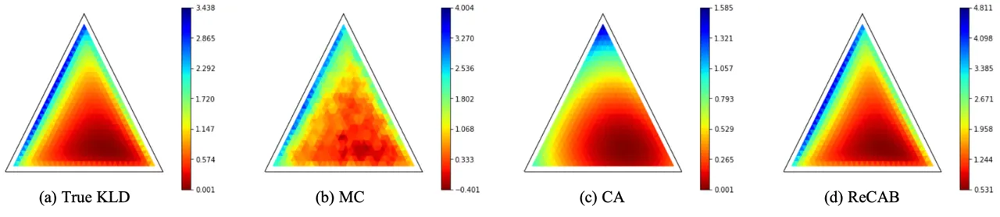
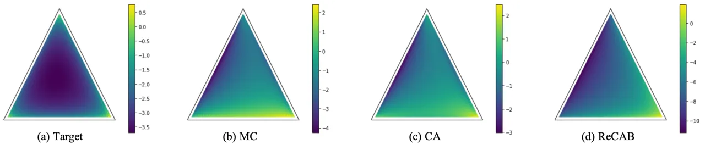
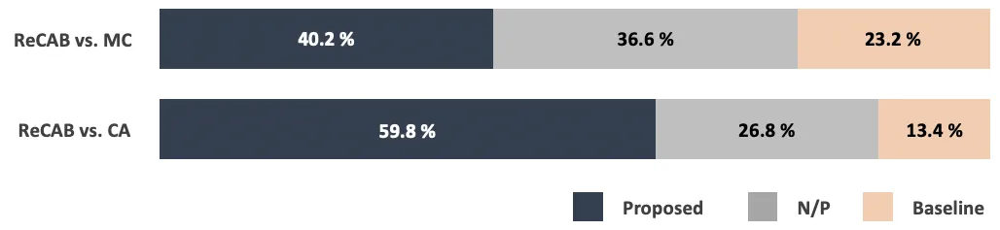
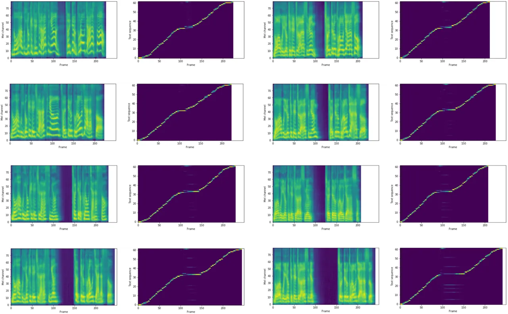
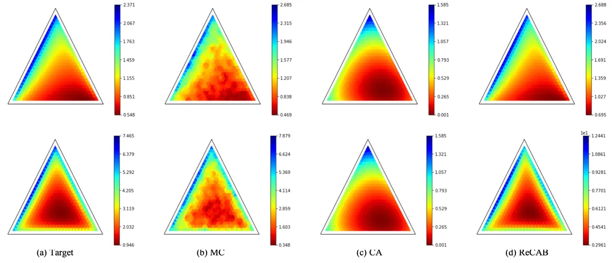
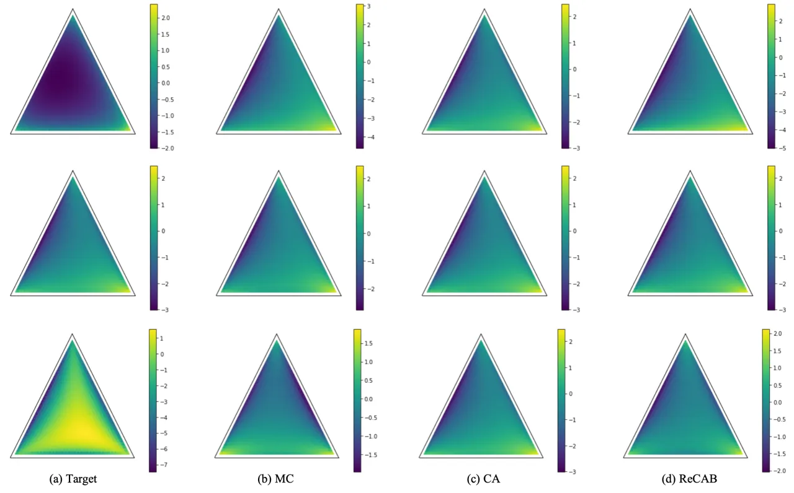
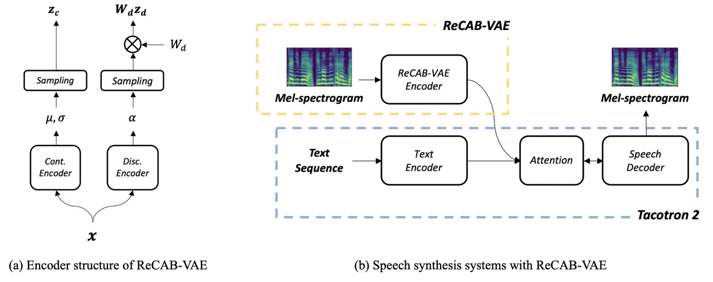

# ReCAB-VAE: Gumbel-Softmax Variational Inference based on Analytic Divergence

Sangshin Oh Affiliation: Yonsei University
Email: [sangshin.oh@dsp.yonsei.ac.kr](mailto:)    Seyun Um
Affiliation: Yonsei University Email: [syum@dsp.yonsei.ac.kr](mailto:)
   Hong-Goo Kang Affiliation: Yonsei University
Email: [hgkang@yonsei.ac.kr](mailto:)

###### Abstract

The Gumbel-softmax distribution, or Concrete distribution, is often used
to relax the discrete characteristics of a categorical distribution and
enable back-propagation through differentiable reparameterization.
Although it reliably yields low variance gradients, it still relies on a
stochastic sampling process for optimization. In this work, we present a
relaxed categorical analytic bound (ReCAB), a novel divergence-like
metric which corresponds to the upper bound of the Kullback-Leibler
divergence (KLD) of a relaxed categorical distribution. The proposed
metric is easy to implement because it has a closed form solution, and
empirical results show that it is close to the actual KLD. Along with
this new metric, we propose a relaxed categorical analytic bound
variational autoencoder (ReCAB-VAE) that successfully models both
continuous and relaxed discrete latent representations. We implement an
emotional text-to-speech synthesis system based on the proposed
framework, and show that the proposed system flexibly and stably
controls emotion expressions with better speech quality compared to
baselines that use stochastic estimation or categorical distribution
approximation.

   

|     |
| --- |
|     |

## 1 Introduction

Inspired by recent successes in generating high fidelity images or audio
using deep neural networks, modeling and manipulating specific class
information and its fine attributes has become an active research area
\[1, 2, 3, 4, 5, 6\]. Since many attributes of real world data such as
object identity, gender, and emotion are often annotated categorically,
a natural choice is to model them using categorical or discrete latent
representations. When the discrete structure of a data set is modeled in
this manner, the latent representation can be easily interpreted since
each dimension represents one of the classes or categories. For example,
conditional generative adversarial networks (cGANs) \[1\] and
conditional variational autoencoders (cVAEs) \[3\] take categorical
auxiliary inputs, or _conditions_, which are fed to both the
discriminator (or recognition) network and generator network to control
the attributes of the generated data.

An alternative approach was proposed by Kingma et al. \[2\] in which a
generative model was expanded to a variational approach in a
semi-supervised training framework. Here, it is possible to infer the
class label by using an auxiliary encoder even when the annotated label
is not available. The auxiliary encoder estimates the probability that a
sample belongs to each category, after which the estimated probability
is used to calculate the marginal likelihood of the sample. Recently,
the Gumbel-softmax distribution was proposed as a differentiable
relaxation for discrete or categorical variables \[7, 8\]. In this
framework, unannotated labels are directly inferred using relaxed
categorical variables and back-propagated to the encoder using a
reparameterization trick. This allows for a significant reduction in
inference time because it does not need a marginalization over all
possible latent variables, unlike the semi-supervised method.

The relaxed categorical distribution is frequently applied for
variational inference \[7, 8, 9, 10, 11, 12\], in which a distribution
of latent representation estimated from observed data (a variational
posterior) needs to be fitted to the prior distribution. The
Kullback-Leibler divergence (KLD) \[13\] plays an important role in this
optimization process because it quantitatively measures the similarity
between two distributions. The calculation of the KLD is easy in the
Gaussian distribution case because of the existence of a simple analytic
solution. However, no analytic solution exists for the relaxed
categorical distribution case; therefore, the KLD must be calculated
from a stochastic estimation process or approximated using a normal
categorical distribution.

In this work, we solve this problem by calculating the upper bound of
the KLD using a closed-form solution, which is more accurate than
conventional stochastic estimation or distribution approximation
methods. Specifically, we propose a relaxed categorical analytic bound
variational autoencoder (ReCAB-VAE), which has two distinctive features
from previously suggested VAEs or the jointVAE framework \[7, 8, 9\].
The relaxed categorical analytic bound (ReCAB), which is the training
objective for ReCAB-VAE, has a very similar value to the true KLD of
relaxed categorical distributions, but can be calculated analytically
and efficiently. The proposed metric is lower-bounded by the true KLD,
so it can be easily used to optimize the variational bound. In other
words, unlike conventional approximation-based approaches, the proposed
metric reliably sets a lower bound for the logarithmic evidence in the
training objective. In addition, we also propose a _discriminative
prior_ that utilizes the information from a class label of the data.
Unlike uninformative priors such as the standard Gaussian or uniform
priors, the proposed discriminative prior considers a class label to
determine its corresponding parameters. By giving distinctive
information to its prior, it prevents the variational posterior from
collapsing into a non-informative uniform distribution. This means that
we do not need to provide any additional classification loss when
training the model because the latent representations are
distinguishable due to the guidance of the discriminative prior.

To show that our model is able to generate high fidelity samples while
flexibly controlling their attributes, we implement an emotional
text-to-speech (TTS) synthesis system with the proposed framework. An
emotional TTS system is a suitable application for this framework
because it needs to faithfully control emotional expressions as well as
textual content. The textual content is represented in the continuous
space and the emotional expressions are often annotated with class
labels in the discrete latent space \[14, 15, 16\]. Experimental results
show that the synthesized speech quality of the proposed system is much
higher than that of conventional ones that use stochastic estimation or
categorical distribution approximation. In addition, the proposed system
stably controls emotional content while faithfully maintaining the
textual content.

The rest of this paper is organized as follows. In Section 2, we briefly
describe the fundamentals of the relaxed categorical distribution and
the jointVAE algorithm that uses both continuous and discrete latent
spaces. In Section 3, we explain the proposed ReCAB-VAE model in detail.
Experiments and results are described in Section 4, and conclusions
follow in Section 5.

## 2 Preliminaries

We first describe the relaxation of categorical or discrete variables
which enables direct back-propagation through the stochastic node \[7,
8\]. Then, we review the jointVAE algorithm that was recently developed
to improve the performance of conventional VAE approaches \[9\].

### 2.1 Relaxation of categorical random variables

Motivated by the Gumbel-Max trick \[17\], Jang et al. \[7\] and Maddison
et al. \[8\] concurrently suggested a relaxation method for categorical
random variables. If a categorical variable takes the class probability
of $`(\alpha_{1},\alpha_{2},\dots,\alpha_{n})`$ for each category, a
relaxation of this variable is defined as the softmax of
$`\nicefrac{{\log\alpha_{k}+g_{k}}}{{\lambda}}`$, where $`g_{k}`$ is
independent standard Gumbel noise and $`\lambda`$ is the temperature
parameter. Precisely, the $`k`$-th element of latent variable $`z`$ is
defined as:

```math
\displaystyle z_{k}=\frac{\exp\left(\nicefrac{{(\log\alpha_{k}+g_{k})}}{{\lambda}}\right)}{\sum_{{i}=1}^{n}\exp\left(\nicefrac{{(\log\alpha_{i}+g_{i})}}{{\lambda}}\right)}. \tag{1}
```

Since the latent variable is properly reparameterized with the Gumbel
noise, the gradient can be calculated and back-propagated through this
stochastic node. This relaxation process is considered to be a
generalized version of the original categorical distribution because it
converges to the exact categorical distribution when the temperature
$`\lambda`$ goes to 0. The probability density function of this
relaxation process is defined as follows:

```math
\displaystyle p(z)=\Gamma(n)\lambda^{n-1}\prod_{k=1}^{n}\frac{\alpha_{k}z_{k}^{-\lambda-1}}{\sum_{{i}=1}^{n}\alpha_{i}z_{i}^{-\lambda}}, \tag{2}
```

where $`\Gamma(\cdot)`$ is a Gamma function. In this paper, we use
$`\alpha`$ and $`\lambda`$ to denote the logit and temperature
parameters of the relaxed categorical distribution, respectively.

### 2.2 JointVAE framework

Recently, Dupont \[9\] proposed the jointVAE model, which embeds its
inputs in both continuous and discrete latent spaces. Here, it was shown
that it is beneficial to model some attributes in a disentangled space
from the continuous latent space. The continuous and discrete latent
variables are assumed to be independent of each other, so the objective
of this variational model is given as follows:

```math
\displaystyle\mathbb{E}_{q_{\phi}(z_{c},z_{d}|x)}\big[\log p_{\theta}(x|z_{c},z_{d})\big]-D_{KL}\left(q_{\phi}(z_{c}|x)\|p(z_{c})\right)-D_{KL}\left(q_{\phi}(z_{d}|x)\|p(z_{d})\right), \tag{3}
```

where $`z_{c}`$ and $`z_{d}`$ refer to the continuous and discrete
latent variables, respectively, and $`\phi`$ and $`\theta`$ denotes
encoder and decoder parameters.

## 3 Relaxed Categorical Analytic Bound Variational Autoencoder

### 3.1 Relaxed Categorical Analytic Bound

We propose a relaxed categorical analytic bound (ReCAB), which is
lower-bounded by the KLD of the relaxed categorical distribution. To
this end, we decompose the equation from the definition of the KLD into
a summation of several expectation terms. Then, we reformulate or bound
each term so that the bound can be solved in a closed form. We first
provide a brief mathematical derivation for our proposed bound, and then
compare it with conventional estimation or approximation approaches for
the KLD.

#### 3.1.1 Derivation of the bound

From the density function in Eq. (2), the KLD of the relaxed categorical
distributions from prior $`p(z)=\text{RelaxedCategorical}(a,l)`$ to
posterior $`q(z|x)=\text{RelaxedCategorical}(\alpha,\lambda)`$ is
defined as follows:

```math
\displaystyle\begin{split}D_{KL}\left(q(z|x)\|p(z)\right)&=\mathbb{E}_{z}\big[\log q(z|x)-\log p(z)\big]\\
&=\mathbb{E}_{z}\big[(n-1)\log\frac{\lambda}{l}+\sum_{{k}=1}^{n}\bigg((\log\alpha_{k}-\lambda\log z_{k})-(\log a_{k}-\lambda\log z_{k})\bigg)\\
&\qquad{}-n\logSumExp_{{i}=1}^{n}\left(\log\alpha_{i}-\lambda\log z_{i}\right)+n\logSumExp_{{i}=1}^{n}\left(\log a_{i}-\lambda\log z_{i}\right)\big],\end{split} \tag{4}
```

where $`z_{k}`$ is the $`k`$-th element of discrete latent variable
$`z_{d}`$ and $`\logSumExp`$ denotes a log-sum-exponential operator. In
here, $`a`$ and $`l`$ are the logit and temperature parameters of the
prior distribution, while $`\alpha`$ and $`\lambda`$ denote those of the
posterior. Note that terms that appear in both the posterior and prior
cancel out. For notational simplicity and clarity, we omit the subscript
of the discrete latent variable $`z`$ and succinctly write
$`\mathbb{E}_{z\sim q(z|x)}`$ as $`\mathbb{E}_{z}`$. In order to
simplify the above equation, we can substitute logit terms with the
following equation, which is derived from Eq. (1).

```math
\displaystyle\begin{split}\log\alpha_{k}-\lambda\log z_{k}&=-g_{k}+\lambda\logSumExp_{{i}=1}^{n}\left(\nicefrac{{(log\alpha_{i}+g_{i})}}{{\lambda}}\right)\\
\log a_{k}-l\log z_{k}&=\log a_{k}-\frac{l}{\lambda}\log\alpha_{k}+l\logSumExp_{{i}=1}^{n}\left(\nicefrac{{(log\alpha_{i}+g_{i})}}{{\lambda}}\right).\end{split} \tag{5}
```

This results in the following equation:

```math
\displaystyle\begin{split}D_{KL}\left(q(z|x)\|p(z)\right)&=-(n-1)\log\frac{l}{\lambda}-\sum_{{k}=1}^{n}A_{k}-(1-\frac{1}{\lambda})\mathbb{E}_{g}\big[\sum_{{k}=1}^{n}g_{k}\big]\\
&\qquad{}-n\cdot\mathbb{E}_{g}\big[\logSumExp_{{k}=1}^{n}\left(g_{k}\right)\big]+n\cdot\mathbb{E}_{g}\big[\logSumExp_{{k}=1}^{n}\left(A_{k}-\frac{l}{\lambda}g_{k}\right)\big],\end{split} \tag{6}
```

where $`A_{k}=(\log a_{k}-\frac{l}{\lambda}\log\alpha_{k})`$. Since the
last term cannot be solved analytically, we apply Jensen’s inequality:

```math
\displaystyle\begin{split}\mathbb{E}_{g}\big[\logSumExp_{{k}=1}^{n}\left(A_{k}-\frac{l}{\lambda}g_{k}\right)\big]&\leq\log\mathbb{E}_{g}\big[\sum_{{k}=1}^{n}\left(\exp A_{k}\cdot\exp(-\frac{l}{\lambda}g_{k})\right)\big]\\
&=\log\sum_{{k}=1}^{n}\left(\exp A_{k}\cdot\mathbb{E}_{g}\big[\exp(-\frac{l}{\lambda}g_{k})\big]\right),\end{split} \tag{7}
```

where the last RHS term is obtained by reordering the expectation and
summation operations. Since the expectation term becomes a constant
value once evaluated, the upper bound of the last RHS term can be solved
analytically. By calculating all of the remaining expectations, it is
possible to obtain the upper bound of the KLD as follows:

```math
\displaystyle\begin{split}D_{ReCAB}\big(q(z|x)\|p(z)\big)&=-(n-1)\log\frac{l}{\lambda}+n\left(\gamma\frac{l}{\lambda}+\log\Gamma(1+\frac{l}{\lambda})-\sum^{n-1}_{k=1}\frac{1}{k}\right)\\
&\qquad{}-\sum_{{k}=1}^{n}\text{log-softmax}_{k}(\log{a}-\frac{l}{\lambda}\log{\alpha})\\
&\geq D_{KL}\left(q(z|x)\|p(z)\right).\end{split} \tag{8}
```

Since the last $`\text{log-softmax}(\cdot)`$ term is the only term that
is related to logits $`\alpha`$ and $`a`$, the other terms in Eq. (8)
can be calculated in advance when the temperatures are fixed throughout
training. Therefore, it is easy to implement a training algorithm
because we only need to evaluate one function at each epoch. The general
algorithm for training is depicted in Algorithm 1.

Detailed derivations are provided in the supplementary material.

#### 3.1.2 Comparison with conventional approaches

In previous works, the KLD of the relaxed categorical distribution was
estimated via the Monte-Carlo method (Eq. (9), MC) or roughly
approximated by using the KLD of the categorical distribution (Eq. (10),
CA) as follows:

```math
\displaystyle D_{KL}\left(q(z|x)\|p(z)\right) \displaystyle\approx\sum^{L}_{i=1}\bigg(\log q(z^{(i)}|x)-\log p(z)\bigg)=D_{MC} \tag{9}
```

```math
\displaystyle\approx\sum_{{k}=1}^{n}\hat{\alpha}_{k}\bigg(\log\hat{\alpha}_{k}-\log{a}_{k}\bigg)=D_{CA}, \tag{10}
```

where $`L`$ is the number of samples for stochastic estimation and
$`\hat{\alpha}_{k}`$ denotes the $`k`$-th element of the normalized
logit parameter or categorical probability,
$`\hat{\alpha}_{k}=\nicefrac{{\alpha_{k}}}{{\sum_{{i}=1}^{n}\alpha_{i}}}`$.
Eq. (9) must be evaluated from the density function given in Eq. (2), so
it is somewhat complicated to calculate. In addition, it provides noisy
and inaccurate values for the KLD when $`L`$ is not large enough.
Because of this complexity and inaccuracy, it is a tempting choice to
use the categorical distribution to approximate the KLD as in Eq. (10).
Unlike stochastic estimation, this gives the approximated value in a
deterministic and efficient way. However, because the categorical
distribution does not have any temperature or scale parameters, this
approximation cannot consider the temperature parameter of the relaxed
categorical distribution. Therefore, this method only provides a rough
approximation for the KLD which is inaccurate and results in an
irregular loss landscape. In addition, as pointed out in previous works
\[7, 8\], the training objective with this approximation is not
guaranteed to be an evidence lower bound.

### 3.2 Discriminative prior

In this section, we propose a _discriminative prior_ which can be used
for semi-supervised or supervised training of ReCAB-VAE. Unlike the
uniform distribution or its relaxed variants (e.g., a distribution with
$`\alpha=[\frac{1}{n},\frac{1}{n},\cdots,\frac{1}{n}]`$,
$`\lambda\in(0,\infty)`$), this prior provides some information about
data points as in Sohn et al. \[3\] or Casale et al. \[18\]. Since the
prior distribution is now conditioned on auxiliary code or label $`c`$,
the evidence lower bound is revised as follows:

```math
\displaystyle\begin{split}\mathcal{L}_{ELBo}&=\mathbb{E}_{z}\big[\log p_{\theta}(x,z|c)-\log q_{\phi}(z|x)\big]\\
&=\mathbb{E}_{z}\big[\log p_{\theta}(x|z)\big]-D_{KL}\big(q_{\phi}(z|x)\|p(z|c)\big),\end{split} \tag{11}
```

where $`p(z|c)`$ is the proposed discriminative prior. Note that we
assume the code $`c`$ to be independent of both the encoder $`q_{\phi}`$
and decoder $`p_{\theta}`$ here. The proposed prior is a usual relaxed
categorical distribution whose logit $`a`$ is a function of the
auxiliary code $`f_{a}(c;\epsilon)`$. The function for the logit
parameter can be defined as follows:

```math
\displaystyle\begin{split}f_{a}(c;\epsilon)=\begin{cases}1-(n-1)\epsilon&\text{if }c_{i}=1\\
\epsilon&\text{otherwise}\end{cases},\end{split} \tag{12}
```

where $`c\in\{0,1\}^{n}`$ is a one-hot discrete code and $`\epsilon>0`$
is a small smoothing constant. The resulting prior is defined as
$`p(z|c)=\text{GumbelSoftmax}(f_{a}(c;\epsilon),l)`$, where the
temperature $`l`$ is selected freely and usually fixed throughout
training. Using this prior, the model can learn distinctive latent
representations for each class without auxiliary classification loss,
unlike in Kingma et al. \[2\] or Habib et al. \[15\].

### 3.3 Model structure

$`\theta`$, $`\phi`$ $`\leftarrow`$ Initialize parameters

$`l`$, $`\lambda`$ $`\leftarrow`$ Set temperatures for prior and
posterior distributions

$`\mathcal{L}_{1}`$ $`\leftarrow`$
$`-(n-1)\log\frac{l}{\lambda}+n\gamma\frac{l}{\lambda}+\log\Gamma(1+\frac{l}{\lambda})-\sum^{n-1}_{k=1}\frac{1}{k}`$

while _not converges_ do

   $`\mu`$, $`\sigma`$, $`\alpha`$ $`\leftarrow`$ Encoder($`x`$;
$`\phi`$)

   $`z_{c}`$, $`z_{d}`$ $`\leftarrow`$ Sample via reparameterization
trick

   $`\hat{x}`$ $`\leftarrow`$ Decoder($`z_{c}`$, $`W_{d}z_{d}`$;
$`\theta`$)

   $`\mathcal{L}_{2}`$ $`\leftarrow`$
$`\mathbb{E}\big[\log p_{\theta}(x|z_{c},z_{d})\big]-D_{KL}\big(q_{\phi}(z_{c}|x)\|p(z_{c})\big)-\text{log-softmax}(\log a-\frac{l}{\lambda}\log\alpha`$)

   $`\mathcal{L}`$ $`\leftarrow`$ $`\mathcal{L}_{1}+\mathcal{L}_{2}`$

   $`\theta`$, $`\phi`$ $`\leftarrow`$ Update parameters with
$`\nabla_{\theta,\phi}\mathcal{L}_{2}`$

end while

Algorithm 1 Training procedure for ReCAB-VAE. Note that Encoder is
separated into continuous and discrete parts in a real implementation.
$`\mathcal{L}_{1}`$ can be ignored in parameter updates since it is a
constant throughout the training procedure.

In this section, we propose ReCAB-VAE, a relaxed categorical analytic
bound variational autoencoder based on ReCAB and the aforementioned
discriminative prior. Although we apply our proposed features in a VAE
framework, the features explained above can be adopted in other
frameworks that use the relaxed categorical distribution. Notably, ReCAB
can be used as a closed-form surrogate for the KLD of the relaxed
categorical distribution.

ReCAB-VAE consists of two independent latent encoders as in jointVAE
\[9\]: a continuous latent and a discrete latent encoder. Assuming
independence between the continuous and discrete latent variables, the
training objective $`\mathcal{L}_{Prop}`$ is written as follows:

```math
\displaystyle\begin{split}\mathcal{L}_{Prop}&=\mathbb{E}\big[\log p_{\theta}(x|z_{c},z_{d})\big]-D_{KL}\big(q_{\phi}(z_{c}|x)\|p(z_{c})\big)-D_{ReCAB}\big(q_{\phi}(z_{d}|x)\|p(z_{d}|c)\big)\\
&\leq\mathbb{E}\big[\log p_{\theta}(x|z_{c},z_{d})\big]-D_{KL}\big(q_{\phi}(z_{c}|x)\|p(z_{c})\big)-D_{KL}\big(q_{\phi}(z_{d}|x)\|p(z_{d}|c)\big)\\
&=\mathcal{L}_{ELBo}\end{split} \tag{13}
```

where $`c`$ is an additional condition code for the discriminative
prior. Note that our proposed objective is bounded above by ELBo. With
the learning objective specified above, a structure for the proposed
model is as follows:

```math
\displaystyle[\mu;\log\sigma^{2}] \displaystyle=\text{Cont.Encoder}(x) \displaystyle\alpha \displaystyle=\text{Disc.Encoder}(x)
```

```math
\displaystyle z_{c} \displaystyle\sim\mathcal{N}(\mu,\sigma^{2}) \displaystyle z_{d} \displaystyle\sim\text{RelaxedCategorical}(\alpha,\lambda) \tag{14}
```

```math
\displaystyle\hat{x} \displaystyle=\text{Decoder}(z_{c},W_{d}z_{d}),
```

where $`\hat{x}`$ is the reconstruction of sample $`x`$ and $`\lambda`$
is fixed throughout the training process as in previous works \[7, 8\].
Both latent encoders, Cont.Encoder and Disc.Encoder, take the data
sample $`x`$ and represent it in parallel in the latent spaces. The
latent variables are then sampled via the reparameterization trick. In
order to match the dimension of continuous and discrete latent
representations, we project the discrete latent variable with embedding
matrix $`W_{d}`$. Then, the decoder reconstructs the data sample from
the continuous latent representation $`z_{c}`$ and projected discrete
latent representation $`W_{d}z_{d}`$.

## 4 Experiments and Results

In this section, we show that ReCAB provides a better estimation of the
true KLD compared to conventional stochastic and distribution
approximation approaches. We also conduct experiments to evaluate the
performance of an emotional text-to-speech (TTS) system that is
implemented using the proposed ReCAB-VAE framework.

### 4.1 Basic empirical studies



Figure 1: Heatmaps of KLD estimations from each method when the target
logit is \[0.57, 0.14, 0.28\]. The temperatures for the target and
proposal distributions are equivalently set to 1. Each point in the
heatmap indicates the logit of the proposal distribution after
normalization. (a) True KLD obtained from MC estimation with 300k
samples, (b) MC estimation with a small batch size (32 samples), (c) CA
estimation, (d) ReCAB.



Figure 2: Density plots of target and optimum points from each method.
The temperature of the target distribution was set to 0.2, while those
of all other distributions were set to 1. (a) Target distribution with
logit of \[0.57, 0.14, 0.28\]. Densities for optimum logit from (b) MC
with 32 samples, (c) CA, and (d) ReCAB.

Figure 1 shows 2-dimensional simplex heatmaps that depict the true KLD
(a) and estimated values from three different methods (b-d): a
Monte-Carlo (MC) estimator, a categorical distribution approximation
(CA) estimator, and the proposed ReCAB estimator. The three vertices of
each heatmap denote the logits for the relaxed categorical distribution
representing the three categories. The color at each point represents
the estimated KLD with the target distribution. As shown in the figure,
the estimated results obtained by the ReCAB estimator are almost
identical to those computed using the exact KLD. On the other hand, MC
estimation with a small batch size results in noisy outputs, and CA
estimation results in a differently shaped, distorted heatmap.

Figure 2 illustrates the density plots of optimal logit parameters from
the MC, CA, and ReCAB estimators. When the temperatures are set to be
identical to the prior (or target), the densities from all the
estimators fit well to the target distribution (shown in supplementary
material). When the temperatures are different from the prior, however,
each density plot shows distinctive results. As shown in Eq. (10), the
categorical approximation causes the local optimum to ignore the
temperature parameter; this results in a density that is very different
from the target distribution. Meanwhile, MC estimation and ReCAB show
relatively similar densities to the target distribution, but MC
estimation results in a slightly worse optimum because of its noisiness.

### 4.2 Emotional speech synthesis

We performed experiments on emotional speech synthesis using an internal
emotional TTS database consisting of 26.4 hours of speech. The database
contains 21,678 utterances, where each sentence is recorded by a male
and a female speaker. About one third of the utterances (6,604) are
annotated with one of 4 emotional classes (angry, happy, neutral, sad).
The others are not annotated because of ambiguity in labeling.

##### Architectures.

To generate emotional speech with our proposed model, we chose Tacotron
2 \[19\] as our baseline system, an end-to-end TTS system based on an
encoder-decoder framework. Similar to previous approaches for
Tacotron-based controllable speech synthesis \[15, 20, 21, 22, 23\], our
ReCAB-VAE model is an augmentation to the baseline that allows control
over the emotional expression of the generated speech signal. In
particular, we borrowed the _reference encoder_ architecture for the
latent encoder of ReCAB-VAE. Since we have two separate encoders for
continuous and discrete latent representations, we halve the number of
channels in the convolutional layers and the number of cells in the
recurrent layer. The representations from each latent encoder are then
concatenated and added to the embedding from the text encoder of
Tacotron 2. We compared versions of this model trained with Monte-Carlo
estimation (MC), categorical distribution approximation (CA) and ReCAB.
We used WaveGlow \[24\] as a neural vocoder to transform the predicted
mel-spectrogram into waveforms for all models.

#### 4.2.1 Subjective tests

We conducted two subjective tests to evaluate the performance of our
proposed system. In the first subjective test, raters were asked to
assess the overall quality of the synthesized speech signal on a scale
from 1 to 5 to obtain the mean opinion score (MOS). The second test was
an ABX test in which raters were asked to choose one of two speech
samples from different models according to their preferences. Emotion
labels were shown to the raters in the ABX test, while they were not
shown in the MOS test.

##### Mean opinion score test.

| Model        | Neutral voices    | Total             |
| ------------ | ----------------- | ----------------- |
| Recorded     | 4.84 $`\pm`$ 0.10 | 4.87 $`\pm`$ 0.05 |
| GT-Mel       | 4.69 $`\pm`$ 0.08 | 4.57 $`\pm`$ 0.09 |
| Tacotron 2   | 3.58 $`\pm`$ 0.13 | 3.50 $`\pm`$ 0.13 |
| VAE-Tacotron | 3.76 $`\pm`$ 0.12 | 3.47 $`\pm`$ 0.13 |
| VAE w/ MC    | 3.61 $`\pm`$ 0.13 | 3.41 $`\pm`$ 0.13 |
| VAE w/ CA    | 3.42 $`\pm`$ 0.13 | 3.30 $`\pm`$ 0.14 |
| ReCAB-VAE    | 3.97 $`\pm`$ 0.12 | 3.71 $`\pm`$ 0.13 |

Table 1: Speech quality and naturalness mean opinion scores (MOS) with
95% confidence intervals. Neutral voices indicates scores that only
consider speech samples with the neutral emotion, while all of the
speech samples are considered in Total. VAEs with Monte-Carlo estimation
(MC) and normal categorical distribution approximation (CA) have same
architecture as ReCAB-VAE, but are trained with different training
objectives.

In this test, raters were directed to consider the overall quality and
naturalness of the speech signals, and assessed them on a 5-point scale
with 1-point granularity. Each rater listened to and rated 18 sentences
for each system. In order to provide a reference score, we included real
human voices and the waveforms which were directly reconstructed from
ground truth mel-spectrograms (shown as Recorded and GT-Mel in Table 1,
respectively). We used Tacotron 2 with and without Gaussian VAE \[25\]
as the baseline. The results are summarized in Table 1.

For all of the models except the recorded signal, the total MOS is
slightly lower than the corresponding neutral voice MOS. Applying a
continuous VAE (VAE-Tacotron) results in better scores as a result of
the flexibility in controlling continuous latent representation. On the
other hand, when the discrete VAE is augmented and trained with the KLD
from categorical approximation (CA) or stochastic estimation (MC), the
results do not improve over the baseline Tacotron 2 model. When the KLD
is approximated by the normal categorical distribution (CA), the
naturalness and quality are even worse than the baseline with no latent
encoder. This is due to the inaccurate values from the CA method, which
makes the training objective unable to manage the trade-off between
reconstruction and regularization. In the case of the MC method,
performance slightly improves, but is still worse than the
continuous-only VAE-Tacotron. This is because of the halved dimension of
the continuous latent representation and the poor quality of the
discrete latent representation resulting from the inaccurate KLD
estimation.

ReCAB shows the best results, which are a significant improvement over
the baseline. Similar to the VAE with MC estimation, the training
objective with ReCAB is a lower bound of the variational bound. Since
ReCAB provides accurate values for the KLD, ReCAB-VAE is able to
synthesize natural and high-fidelity speech samples. This improvement is
obtained without any architectural changes, showing that ReCAB acts as a
better metric for estimating the KLD of the relaxed categorical
distribution.

##### ABX preference test.



Figure 3: ABX preference test results. Proposed in the figure indicates
the model using ReCAB-VAE, and N/P stands for no preference. Samples
from the proposed model are preferred over those from both baseline
models.

In the ABX preference test, two speech samples of the same sentence and
same emotion from different models were presented to raters, who
listened to both samples and were asked to make one of the following
choices: (A) sample A is preferred, (B) sample B is preferred, or (X) no
preference. To evaluate emotional expression and tonal variations,
raters considered both emotional expressiveness and naturalness, but
were directed to prioritize emotional expression. Speech samples from
ReCAB-VAE were shown to have higher preference percentages over both the
VAE with CA and VAE with MC in these head-to-head comparisons. The
results of the test are presented in Figure 3.

## 5 Conclusion

In this paper, we have proposed a relaxed categorical analytic bound
(ReCAB) with a closed-form solution for estimating the Kullback-Leibler
divergence (KLD) of a relaxed categorical distribution. Since ReCAB can
be solved analytically, it does not depend on a sampling procedure for
latent variables and is able to provide a reliable estimation of the
KLD. We also proposed a discriminative prior, which enables
discriminative learning in variational autoencoders without an
additional loss function. To evaluate the performance of the proposed
metric and prior distribution, we adopted them in a variational
autoencoder framework, which we refer to as ReCAB-VAE. In an emotional
speech synthesis task, ReCAB-VAE was able to generate high fidelity
speech samples with rich emotional expressions, and outperformed
baseline models in terms of both speech quality and emotion despite only
a change to the training objective. This indicates that ReCAB is an
effective metric for training models that embed latent representations
in both continuous and discrete latent spaces, and can improve their
performance in various other tasks.

## References

- \[1\] Mehdi Mirza and Simon Osindero. Conditional generative
  adversarial nets. _arXiv preprint arXiv:1411.1784_, 2014.
- \[2\] Diederik P Kingma, Shakir Mohamed, Danilo Jimenez Rezende, and
  Max Welling. Semi-supervised learning with deep generative models. In
  _Advances in neural information processing systems_, pages
  3581–3589, 2014.
- \[3\] Kihyuk Sohn, Honglak Lee, and Xinchen Yan. Learning structured
  output representation using deep conditional generative models. In
  _Advances in neural information processing systems_, pages
  3483–3491, 2015.
- \[4\] Aaron Van den Oord, Nal Kalchbrenner, Lasse Espeholt, Oriol
  Vinyals, Alex Graves, et al. Conditional image generation with
  pixelcnn decoders. In _Advances in neural information processing
  systems_, pages 4790–4798, 2016.
- \[5\] Hieu-Thi Luong, Shinji Takaki, Gustav Eje Henter, and Junichi
  Yamagishi. Adapting and controlling dnn-based speech synthesis using
  input codes. In _2017 IEEE International Conference on Acoustics,
  Speech and Signal Processing (ICASSP)_, pages 4905–4909. IEEE, 2017.
- \[6\] Yunjey Choi, Minje Choi, Munyoung Kim, Jung-Woo Ha, Sunghun Kim,
  and Jaegul Choo. Stargan: Unified generative adversarial networks for
  multi-domain image-to-image translation. In _Proceedings of the IEEE
  conference on computer vision and pattern recognition_, pages
  8789–8797, 2018.
- \[7\] Eric Jang, Shixiang Gu, and Ben Poole. Categorical
  reparameterization with gumbel-softmax. _arXiv preprint
  arXiv:1611.01144_, 2016.
- \[8\] Chris J Maddison, Andriy Mnih, and Yee Whye Teh. The concrete
  distribution: A continuous relaxation of discrete random variables.
  _arXiv preprint arXiv:1611.00712_, 2016.
- \[9\] Emilien Dupont. Learning disentangled joint continuous and
  discrete representations. In _Advances in Neural Information
  Processing Systems_, pages 710–720, 2018.
- \[10\] Zichao Yang, Zhiting Hu, Ruslan Salakhutdinov, and Taylor
  Berg-Kirkpatrick. Improved variational autoencoders for text modeling
  using dilated convolutions. In _Proceedings of the 34th International
  Conference on Machine Learning-Volume 70_, pages 3881–3890. JMLR.
  org, 2017.
- \[11\] Narayanaswamy Siddharth, Brooks Paige, Jan-Willem Van de Meent,
  Alban Desmaison, Noah Goodman, Pushmeet Kohli, Frank Wood, and Philip
  Torr. Learning disentangled representations with semi-supervised deep
  generative models. In _Advances in Neural Information Processing
  Systems_, pages 5925–5935, 2017.
- \[12\] Thomas Kipf, Ethan Fetaya, Kuan-Chieh Wang, Max Welling, and
  Richard Zemel. Neural relational inference for interacting systems.
  _arXiv preprint arXiv:1802.04687_, 2018.
- \[13\] Solomon Kullback and Richard A Leibler. On information and
  sufficiency. _The annals of mathematical statistics_,
  22(1):79–86, 1951.
- \[14\] Younggun Lee, Azam Rabiee, and Soo-Young Lee. Emotional
  end-to-end neural speech synthesizer. _arXiv preprint
  arXiv:1711.05447_, 2017.
- \[15\] Raza Habib, Soroosh Mariooryad, Matt Shannon, Eric Battenberg,
  RJ Skerry-Ryan, Daisy Stanton, David Kao, and Tom Bagby.
  Semi-supervised generative modeling for controllable speech synthesis.
  _arXiv preprint arXiv:1910.01709_, 2019.
- \[16\] Ohsung Kwon, Inseon Jang, ChungHyun Ahn, and Hong-Goo Kang. An
  effective style token weight control technique for end-to-end
  emotional speech synthesis. _IEEE Signal Processing Letters_,
  26(9):1383–1387, 2019.
- \[17\] Emil Julius Gumbel. Statistical theory of extreme values and
  some practical applications. _NBS Applied Mathematics Series_,
  33, 1954.
- \[18\] Francesco Paolo Casale, Adrian Dalca, Luca Saglietti, Jennifer
  Listgarten, and Nicolo Fusi. Gaussian process prior variational
  autoencoders. In _Advances in Neural Information Processing Systems_,
  pages 10369–10380, 2018.
- \[19\] Jonathan Shen, Ruoming Pang, Ron J Weiss, Mike Schuster,
  Navdeep Jaitly, Zongheng Yang, Zhifeng Chen, Yu Zhang, Yuxuan Wang,
  Rj Skerrv-Ryan, et al. Natural tts synthesis by conditioning wavenet
  on mel spectrogram predictions. In _2018 IEEE International Conference
  on Acoustics, Speech and Signal Processing (ICASSP)_, pages 4779–4783.
  IEEE, 2018.
- \[20\] RJ Skerry-Ryan, Eric Battenberg, Ying Xiao, Yuxuan Wang, Daisy
  Stanton, Joel Shor, Ron J Weiss, Rob Clark, and Rif A Saurous. Towards
  end-to-end prosody transfer for expressive speech synthesis with
  tacotron. _arXiv preprint arXiv:1803.09047_, 2018.
- \[21\] Yuxuan Wang, Daisy Stanton, Yu Zhang, RJ Skerry-Ryan, Eric
  Battenberg, Joel Shor, Ying Xiao, Fei Ren, Ye Jia, and Rif A Saurous.
  Style tokens: Unsupervised style modeling, control and transfer in
  end-to-end speech synthesis. _arXiv preprint arXiv:1803.09017_, 2018.
- \[22\] Ya-Jie Zhang, Shifeng Pan, Lei He, and Zhen-Hua Ling. Learning
  latent representations for style control and transfer in end-to-end
  speech synthesis. In _ICASSP 2019-2019 IEEE International Conference
  on Acoustics, Speech and Signal Processing (ICASSP)_, pages 6945–6949.
  IEEE, 2019.
- \[23\] Guangzhi Sun, Yu Zhang, Ron J Weiss, Yuan Cao, Heiga Zen, and
  Yonghui Wu. Fully-hierarchical fine-grained prosody modeling for
  interpretable speech synthesis. _arXiv preprint
  arXiv:2002.03785_, 2020.
- \[24\] Ryan Prenger, Rafael Valle, and Bryan Catanzaro. Waveglow: A
  flow-based generative network for speech synthesis. In _ICASSP
  2019-2019 IEEE International Conference on Acoustics, Speech and
  Signal Processing (ICASSP)_, pages 3617–3621. IEEE, 2019.
- \[25\] Diederik P Kingma and Max Welling. Auto-encoding variational
  bayes. _arXiv preprint arXiv:1312.6114_, 2013.

## Supplementary Material

## A Detailed Derivation of ReCAB

### A.1 Detailed Derivation

We start from the definition of the KLD of relaxed categorical
distribution.

```math
\displaystyle\begin{split}D_{KL}\big(q(z|x)\|p(z)\big)&=\mathbb{E}_{z}\big[-(n-1)\log\frac{l}{\lambda}+\sum_{{k}=1}^{n}\big((\log\alpha_{k}-\lambda\log z_{k})-(\log a_{k}-l\log z_{k})\big)\\
&\qquad-n\logSumExp_{{i}=1}^{n}\left(\log\alpha_{i}-\lambda\log z_{i}\right)+n\logSumExp_{{i}=1}^{n}\left(\log a_{i}-l\log z_{i}\right)\big],\end{split} \tag{s.1}
```

where $`\alpha`$ and $`\lambda`$ are parameters of posterior
distribution $`q(z|x)`$, and $`a`$ and $`l`$ are for prior $`p(z)`$.
From the definition of the $`k`$-th element of relaxed categorical
random variable $`z_{k}`$, we have:

```math
\displaystyle\begin{split}\log\alpha_{k}-\lambda\log z_{k}&=-g_{k}+\lambda\logSumExp_{{i}=1}^{n}\left(\frac{\log\alpha_{i}+g_{i}}{\lambda}\right)\\
\log a_{k}-l\log z_{k}&=\log a_{k}-\frac{l}{\lambda}\log\alpha_{k}-\frac{l}{\lambda}g_{k}+l\logSumExp_{{i}=1}^{n}\left(\frac{\log\alpha_{i}+g_{i}}{\lambda}\right),\end{split} \tag{s.2}
```

where $`g_{k}`$ in here is i.i.d. standard Gumbel noise. Since the
$`\logSumExp_{{i}=1}^{n}\left(\cdot\right)`$ term is constant with
respect to $`k`$, following equations can be derived:

```math
\displaystyle\begin{split}\logSumExp_{{k}=1}^{n}\left(\log\alpha_{k}-\lambda\log z_{k}\right)&=\logSumExp_{{k}=1}^{n}\left(-g_{k}\right)+\lambda B\\
\logSumExp_{{k}=1}^{n}\left(\log a_{k}-l\log z_{k}\right)&=\logSumExp_{{k}=1}^{n}\left(A_{k}-\frac{l}{\lambda}g_{k}\right)+lB,\end{split} \tag{s.3}
```

where $`A_{k}=\log a_{k}-\frac{l}{\lambda}\log\alpha_{k}`$ and
$`B=\logSumExp_{{i}=1}^{n}\left(\frac{\log\alpha_{i}+g_{i}}{\lambda}\right)`$.
Applying the above equations, the KLD have the following form:

```math
\displaystyle\begin{split}D_{KL}\big(q(z|x)\|p(z)\big)&=\mathbb{E}_{g}\big[-(n-1)\log\frac{l}{\lambda}+\sum_{{k}=1}^{n}\big\{\big(-g_{k}+\lambda B\big)-\big(A_{k}-\frac{l}{\lambda}g_{k}+lB\big)\big\}\\
&\qquad{}-n\cdot\big(\logSumExp_{{k}=1}^{n}\left(-g_{k}\right)+\lambda B-\logSumExp_{{k}=1}^{n}\left(A_{k}-\frac{l}{\lambda}g_{k}\right)-lB\big)\big].\\
&=-(n-1)\log\frac{l}{\lambda}-\sum_{{k}=1}^{n}A_{k}-(1-\frac{l}{\lambda})\mathbb{E}_{g}\big[\sum_{{k}=1}^{n}g_{k}\big]\\
&\qquad{}-n\mathbb{E}_{g}\big[\logSumExp_{{k}=1}^{n}\left(-g_{k}\right)\big]+n\mathbb{E}_{g}\big[\logSumExp_{{k}=1}^{n}\left(A_{k}-\frac{l}{\lambda}g_{k}\right)\big].\end{split} \tag{s.4}
```

From Jensen’s inequality, we can derive the bound of the last term in
above equation.

```math
\displaystyle\begin{split}\mathbb{E}_{g}\big[\logSumExp_{{k}=1}^{n}\left(A_{k}-\frac{l}{\lambda}g_{k}\right)\big]&\leq\log\big(\mathbb{E}_{g}\big[\sum_{{k}=1}^{n}\exp(A_{k}-\frac{l}{\lambda}g_{k})\big]\big)\\
&=\logSumExp_{{k}=1}^{n}\left(A_{k}\right)+\log\mathbb{E}_{g}\big[\exp(-\frac{l}{\lambda}g_{k})\big]\big)\end{split} \tag{s.5}
```

Now, we have the inequality for the KLD as following:

```math
\displaystyle\begin{split}D_{KL}\big(q(z|x)\|p(z)\big)&\leq-(n-1)\log\frac{l}{\lambda}-\sum_{{k}=1}^{n}\big(A_{k}-\logSumExp_{{k}=1}^{n}\left(A_{k}\right)\big)-(1-\frac{l}{\lambda})\mathbb{E}_{g}\big[\sum_{{k}=1}^{n}g_{k}\big]\\
&\qquad{}-n\mathbb{E}_{g}\big[\logSumExp_{{k}=1}^{n}\left(-g_{k}\right)\big]+n\log\mathbb{E}_{g}\big[\exp(-\frac{l}{\lambda}g_{k})\big].\end{split} \tag{s.6}
```

The expectation terms in above equation have closed-form solutions.

##### First expectation: $`\mathbb{E}_{g}\big[\sum_{{k}=1}^{n}g_{k}\big]`$.

Since the expectation of sum of random variables is equivalent to sum of
expectations,

```math
\displaystyle\mathbb{E}_{g}\big[\sum_{{k}=1}^{n}g_{k}\big]=n\mathbb{E}_{g}\big[g\big]=n\gamma, \tag{s.7}
```

where $`\gamma\approx 0.57721`$ is Euler-Mascheroni constant.

##### Second expectation: $`\mathbb{E}_{g}\big[\logSumExp_{{k}=1}^{n}\left(-g_{k}\right)\big]`$.

To evaluate this expectation, we first prove that $`h=\exp(-g)`$ follows
exponential distribution. From the CDF of Gumbel distribution
$`F_{G}(g^{\prime})=\exp(\exp(-g^{\prime}))`$, the CDF of $`h`$ is

```math
\displaystyle\begin{split}F_{H}(h^{\prime})&=P(h\leq h^{\prime})=P(\exp(-g)\leq h^{\prime})=P(g\geq-\log h^{\prime})\\
&=1-P(g\leq-\log h^{\prime})=1-F_{G}(-\log h^{\prime})\\
&=1-\exp(-h^{\prime}),\end{split} \tag{s.8}
```

which is a CDF of exponential distribution with scale parameter of 1,
$`\text{Exp}(1)`$. The summation over $`h`$, i.e.,
$`\sum_{{k}=1}^{n}h_{k}=\sum_{{k}=1}^{n}\exp(-g_{k})`$, follows gamma
distribution, whose logarithmic expectation is

```math
\displaystyle\begin{split}\mathbb{E}_{g}\big[\logSumExp_{{k}=1}^{n}\left(-g_{k}\right)\big]=\psi(n),\end{split} \tag{s.9}
```

where $`\psi(n)`$ is a digamma function. The digamma function is a
log-derivative of gamma function $`\Gamma(\cdot)`$ and is calculated as
$`-\gamma+\sum_{k=1}^{n-1}\frac{1}{k}`$ for $`n\in\mathbb{N}`$.

##### Third expectation: $`\mathbb{E}_{g}\big[\exp(-\frac{l}{\lambda}g_{k})\big]`$.

The exponential of weighted Gumbel random variable,
$`w=\exp(-\frac{l}{\lambda}g)=h^{\frac{l}{\lambda}}`$, follows Weibull
distribution. The CDF of $`w`$ is

```math
\displaystyle\begin{split}F_{W}(w^{\prime})&=P(w\leq w^{\prime})=P(h^{\frac{l}{\lambda}}\leq w^{\prime})=P(h\leq(w^{\prime})^{\frac{\lambda}{l}})\\
&=1-\exp(-(w^{\prime})^{\frac{\lambda}{l}}),\end{split} \tag{s.10}
```

which is a CDF of $`\text{Weibull}(1,\frac{\lambda}{1})`$. The
expectation of the distribution is

```math
\displaystyle\mathbb{E}_{g}\big[\exp(-\frac{l}{\lambda}g_{k})\big]=\Gamma(1+\frac{l}{\lambda}). \tag{s.11}
```

##### Resulting ReCAB.

From the results in Eq. (s.7, s.9, and s.11), the resulting bound of the
KLD is

```math
\displaystyle\begin{split}D_{KL}\big(q(z|x)\|p(z)\big)&\leq-(n-1)\log\frac{l}{\lambda}+n\big(\gamma\frac{l}{\lambda}-\sum_{k=1}^{n-1}\frac{1}{k}+\log\Gamma(1+\frac{l}{\lambda})\big)\\
&\qquad{}-\sum_{{k}=1}^{n}\big(A_{k}-\logSumExp_{{k}=1}^{n}\left(A_{k}\right)\big).\\
&=D_{ReCAB}\big(q(z|x)\|p(z)\big)\end{split} \tag{s.12}
```

### A.2 Tightness of ReCAB

Introducing auxiliary mass $`\sum_{{k}=1}^{n}p_{k}=1`$, we have
following lower bound.

```math
\displaystyle\begin{split}\mathbb{E}_{g}\big[\logSumExp_{{k}=1}^{n}\left(A_{k}-\frac{l}{\lambda}g_{k}\right)&=\mathbb{E}_{g}\big[\log\sum_{{k}=1}^{n}p_{k}\frac{\exp(A_{k}-\frac{l}{\lambda}g_{k})}{p_{k}}\big]\\
&\geq\sum_{{k}=1}^{n}p_{k}\mathbb{E}_{g}\big[\log\frac{\exp(A_{k}-\frac{l}{\lambda}g_{k})}{p_{k}}\\
&=\sum_{{k}=1}^{n}p_{k}\big(A_{k}-\gamma\frac{l}{\lambda}-\log p_{k}).\end{split} \tag{s.13}
```

Maximizing this bound with respect to $`p_{k}`$ results in the selection
of $`p_{k}=\text{softmax}(A_{k}-\gamma\frac{l}{\lambda})`$. Applying
this value, the bound is

```math
\displaystyle\begin{split}\mathbb{E}_{g}\big[\logSumExp_{{k}=1}^{n}\left(A_{k}-\frac{l}{\lambda}g_{k}\right)&\geq\logSumExp_{{i}=1}^{n}\left(A_{i}-\gamma\frac{l}{\lambda}\right).\end{split} \tag{s.14}
```

Note that this bound relates to the lower bound of the KLD. The
difference between the upper bound in Eq. (s.12) and this bound is

```math
\displaystyle\begin{split}n\cdot\big(\log\Gamma(1+\frac{l}{\lambda})-\gamma\frac{l}{\lambda}\big),\end{split} \tag{s.15}
```

which is a constant with respect to logit parameter. This is the
interval between upper and lower bound of desired KLD, or the maximal
gap between proposed ReCAB and true KLD, equivalently.

## B Additional Experimental Results

### B.1 Sample spectrograms



Figure s1: Sample spectrogram and alignment plots of (left) female
speaker and (right) male speaker. Each row is for angry, happy, neutral
and sad voices, respectively.

### B.2 Heatmaps of KLD estimations



Figure s2: Additional results related to Figure 1 in the main paper. In
each row, temperature parameters of target distributions are set to
(top) 0.5 and (bottom) 2, while proposal distribution temperatures are
all set to 1. Note that CA does not use the temperature parameter.

### B.3 Density plots



Figure s3: Additional results related to Figure 2 in the main paper. In
each row, temperature parameters of target distributions are set to
(top) 0.5, (middle) 1, and (bottom) 2, while temperatures of all others
equal to 1. Note that same densities are shown in the second row.

## C Architectures and Settings for Emotional Speech Synthesis

Table s1 summarizes architectural details, and Figure s4 illustrates the
block diagram of the proposed system. The continuous and discrete
embeddings are first obtained by the ReCAB-VAE based encoder, after
which the embeddings are added to the output embedding of the text
encoder in the Tacotron2 framework.

| Model      | Module         | Hyperparameters                                  |
| ---------- | -------------- | ------------------------------------------------ |
| Data       | Input          | Text embedding (512)                             |
|            | Output         | Mel-spectrogram                                  |
|            |                | (80, 64 ms frame size with 16 ms hop)            |
| Tacotron 2 | Encoder        | 3 Conv. layers (512)                             |
|            |                | $`\rightarrow`$ Bi-LSTM (512)                    |
|            | Attention type | Location sensitive attention                     |
|            | Decoder        | 2-layer Pre-Net (FC, 256-dim)                    |
|            |                | $`\rightarrow`$ AttentionRNN (1024, LSTM)        |
|            |                | $`\rightarrow`$ DecoderRNN (512, LSTM)           |
|            |                | $`\rightarrow`$ FC layer (80)                    |
|            |                | $`\rightarrow`$ Post-Net (80-512\*3-80, 5 Conv.) |
| ReCAB-VAE  | Cont.Encoder   | 6 Conv. layers (16-16-32-32-64-64 channels)      |
|            |                | $`\rightarrow`$ GRU (256)                        |
|            |                | $`\rightarrow`$ FC (256)                         |
|            | Disc.Encoder   | 6 Conv. layers (16-16-32-32-64-64 channels)      |
|            |                | $`\rightarrow`$ GRU (256)                        |
|            |                | $`\rightarrow`$ FC layer (256)                   |

Table s1: Architectural details of the emotional TTS system based on
ReCAB-VAE.



Figure s4: Structure of (a) ReCAB-VAE and (b) ReCAB-based emotional TTS
system.
