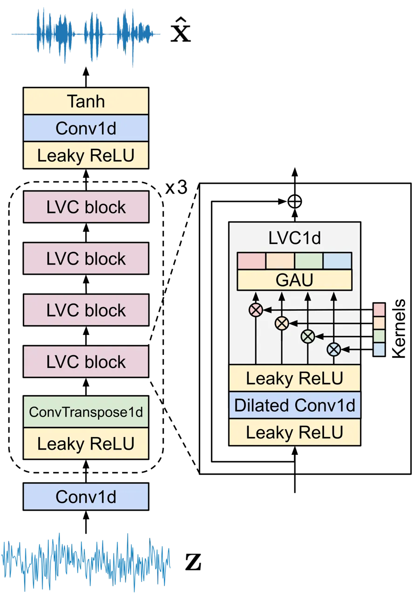
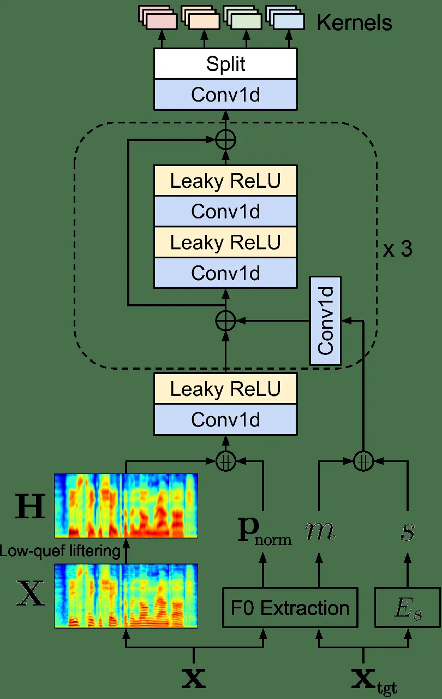
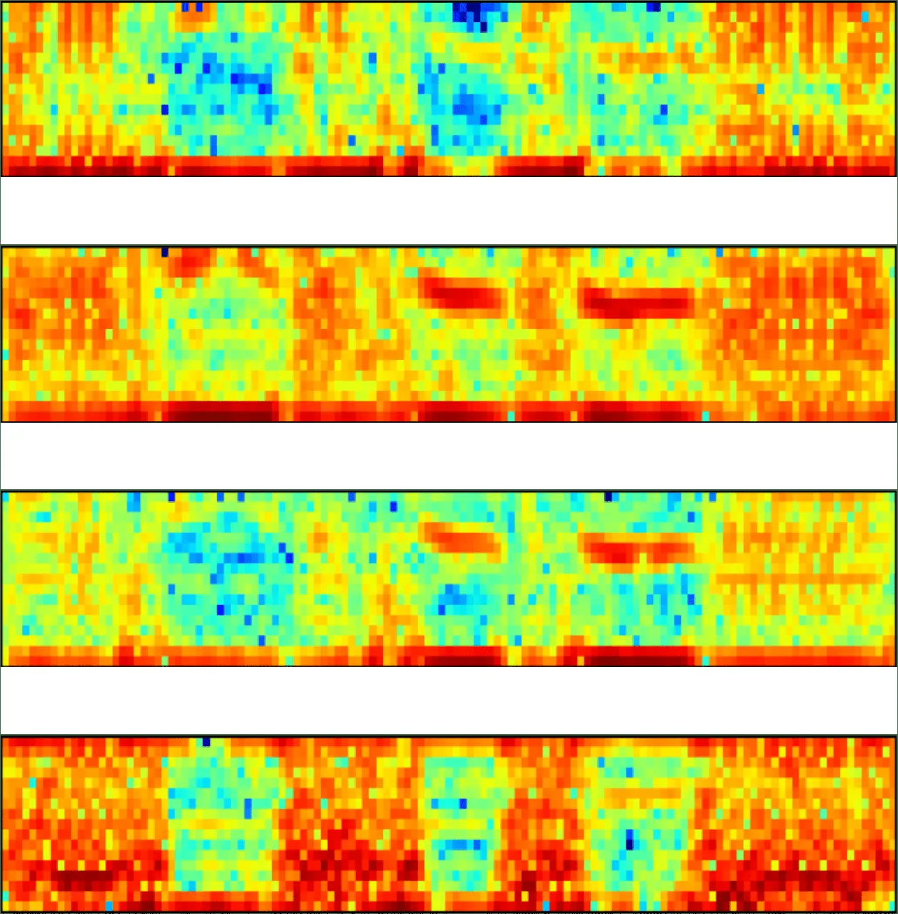
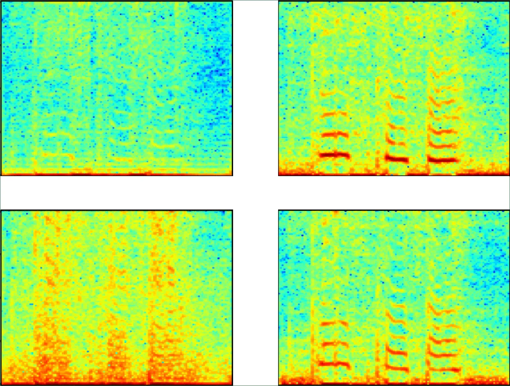
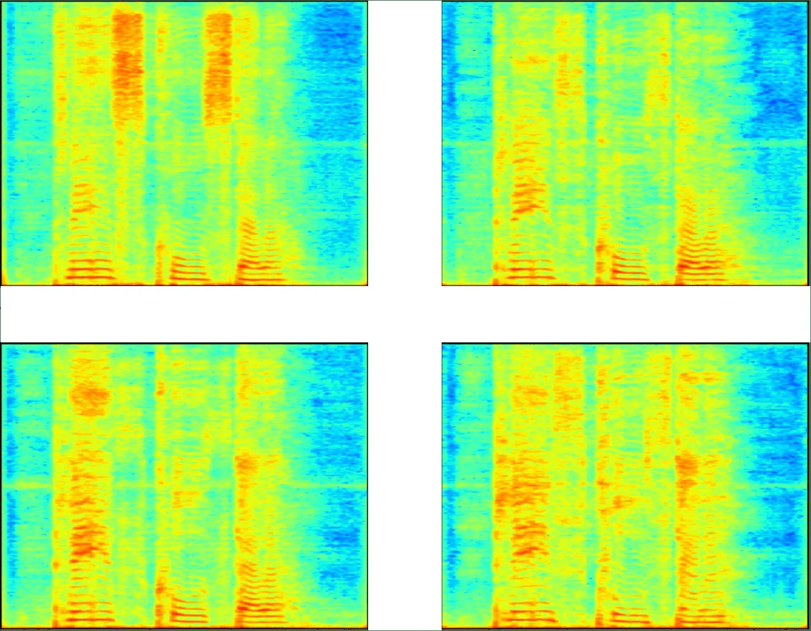
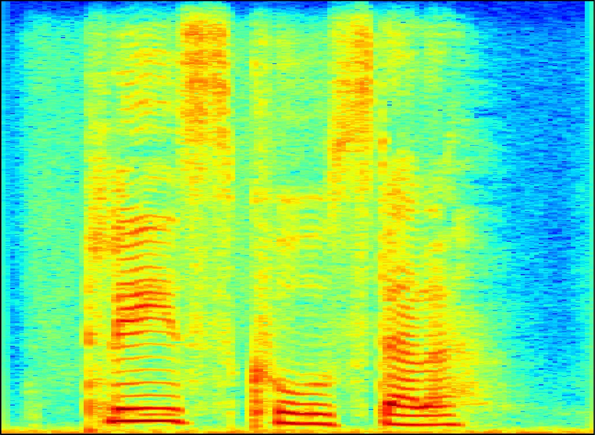
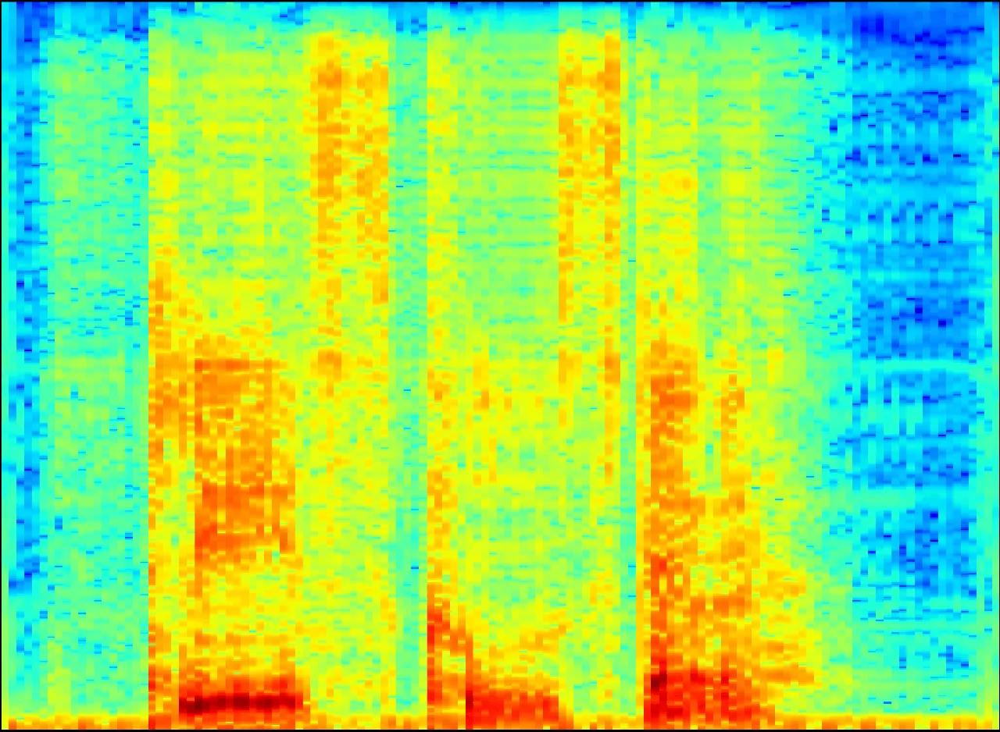
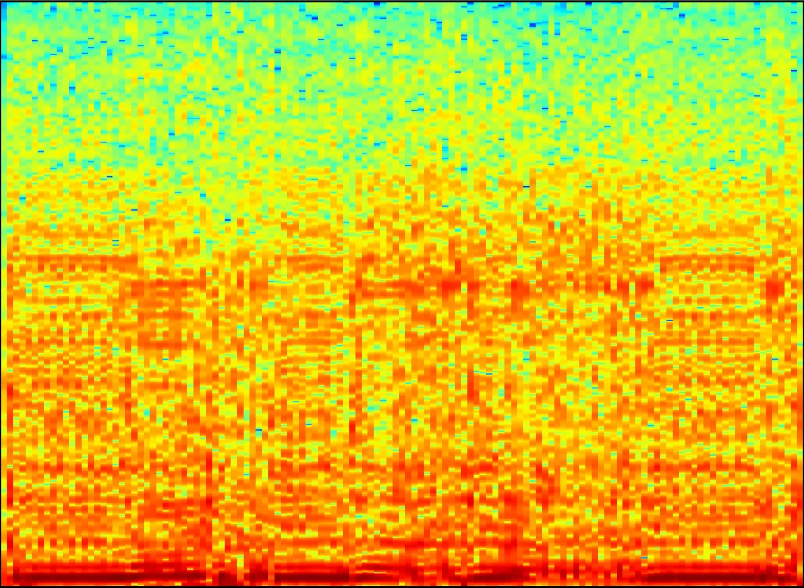

¹Massachusetts Institute of Technology  ²University of Illinois at
Urbana-Champaign

# End-to-End Zero-Shot Voice Conversion with Location-Variable Convolutions

Wonjune Kang¹, Mark Hasegawa-Johnson², Deb Roy¹

###### Abstract

Zero-shot voice conversion is becoming an increasingly popular research
topic, as it promises the ability to transform speech to sound like any
speaker. However, relatively little work has been done on end-to-end
methods for this task, which are appealing because they remove the need
for a separate vocoder to generate audio from intermediate features. In
this work, we propose LVC-VC, an end-to-end zero-shot voice conversion
model that uses location-variable convolutions (LVCs) to jointly model
the conversion and speech synthesis processes. LVC-VC utilizes carefully
designed input features that have disentangled content and speaker
information, and it uses a neural vocoder-like architecture that
utilizes LVCs to efficiently combine them and perform voice conversion
while directly synthesizing time domain audio. Experiments show that our
model achieves especially well balanced performance between voice style
transfer and speech intelligibility compared to several baselines.

^(†)^(†)address:

Index Terms: voice conversion, style transfer, end-to-end,
location-variable convolutions, speech synthesis

## 1 Introduction

Voice conversion (VC) is the task of transforming a voice to sound like
another person without changing the linguistic content in the original
utterance \[1\]. It has many applications, such as voice anonymization,
communication aids for the speech-impaired, and voice dubbing, which
have contributed to its increasing popularity as a research direction in
recent years. Advances in deep learning have had a significant impact on
voice conversion systems, allowing them to achieve major improvements in
terms of voice quality and similarity to the target speaker, especially
in the non-parallel data setting \[2, 3, 4\].

Recently, attention has been shifting to zero-shot VC, a setting in
which conversion is applied to new speakers that were previously unseen
during training. A key aspect of zero-shot VC is the disentanglement,
separation, and recombination of the content and speaker information in
input and target speakers’ utterances. Most models are composed of
content and speaker encoders that are trained to disentangle the two
types of information, and a decoder that recombines them. Traditionally,
this decomposition and recombination are performed on intermediate
representations such as mel spectrograms, followed by a vocoding step to
generate time-domain audio. However, these approaches necessitate
sequential training of the VC and vocoder stages using different
supervision and criteria, leaving the potential for weaknesses in any
individual module to cascade in the overall system. Furthermore, they do
not take advantage of data-driven end-to-end learning, which tends to
bring simplicity and high performance. However, relatively little work
has been done on end-to-end methods for voice conversion.

This work introduces an end-to-end approach for zero-shot voice
conversion based on the architecture of a neural vocoder. Our proposed
model takes a set of carefully designed input features that have
disentangled content and speaker information, and its vocoder-like
architecture learns to combine them to perform voice conversion while
simultaneously synthesizing audio. This significantly streamlines the
model’s structure and removes the difficult task of teaching it to
perform disentangled representation learning. Our model additionally
utilizes location-variable convolutions (LVCs) \[5\] as a core
component, and we thus call it Location-Variable Convolution-based Voice
Conversion (LVC-VC). LVCs generate convolution kernels that are adaptive
to the input conditional features and apply different convolution
operations on different intervals of the input sequence. This allows
them to efficiently model the many time-dependent features that arise in
speech using only a small number of parameters. Experiments demonstrate
that our model achieves competitive or better voice style transfer
performance compared to several baselines while maintaining the clarity
and intelligibility of transformed speech especially well.

The contributions of this paper are threefold: i) we propose a novel
end-to-end model for zero-shot voice conversion based on the
architecture of a neural vocoder, ii) we apply LVCs to the voice
conversion task, showing that they enable efficient and interpretable
combination of speaker and content information in the voice conversion
process, and iii) we demonstrate that our model achieves a much better
trade-off between audio quality and accurate voice style transfer
compared to other baselines.¹¹ 1 Code is available online at:
[https://github.com/wonjune-kang/lvc-vc](https://github.com/wonjune-kang/lvc-vc).
Audio samples are available on our demo page:
[https://lvc-vc.github.io/lvc-vc-demo/](https://lvc-vc.github.io/lvc-vc-demo/)

## 2 Background and Related Work

### 2.1 Zero-shot voice conversion

One of the first zero-shot VC models was AutoVC \[6\], an
autoencoder-based model that utilizes a dimensionality bottleneck to
disentangle content and speaker information. It has served as the base
model for a range of extensions \[7, 8, 9\]. Other approaches have used
adaptive instance normalization \[10\] or activation function
guidance \[11\] for information disentanglement. All of these approaches
produce spectrograms and require a separate vocoder to synthesize
time-domain audio.

Relatively few models have been proposed that can perform end-to-end
voice conversion. Blow \[12\] is a normalizing flow network for
non-parallel raw-audio voice conversion. However, it is not able to
perform zero-shot conversion, and like many other flow-based networks,
it has a very large number of parameters. NVC-Net \[13\] is a GAN-based
zero-shot model that performs conversion directly on raw audio
waveforms. Conceptually, LVC-VC shares some similarities with
HiFi-VC \[14\] and NANSY \[15\]. HiFi-VC is an end-to-end VC model that
uses linguistic, F0, and speaker features as inputs to a conditioned
HiFi-GAN \[16\] decoder. NANSY is a non-end-to-end neural analysis and
synthesis framework that uses various input features along with
information perturbation-based training to control speech attributes.
However, both methods use representations from large pre-trained ASR
models for linguistic features (Conformer \[17\], 119M params, and
XLSR-53 \[18\], 317M params, respectively), resulting in very large
model sizes. In contrast, LVC-VC has significantly fewer parameters and
uses input features that are much simpler to compute.

### 2.2 Location-variable convolutions (LVCs)

Many speech generative models \[19, 20, 16, 21\] are implemented using a
WaveNet-like structure \[19\], in which dilated causal convolutions are
applied to capture the long-term dependencies of a waveform. This
necessitates a large number of convolution kernels to capture the many
time-dependent features that arise in speech. However, in a traditional
linear prediction vocoder \[22\], the coefficients for the all-pole
linear filter vary depending on the conditioning acoustic features of
the analysis frame. A network with similarly variable kernels depending
on the conditioning features could be able to model long-term
dependencies in audio more efficiently than fixed-kernel methods.

Inspired by this idea, location-variable convolutions (LVCs) \[5\] use
different convolutional kernels to model different intervals in an input
sequence depending on the corresponding “local” sections of a
conditioning sequence. To do this, LVCs utilize kernel predictor
networks which generate kernel weights given a conditioning sequence,
such as a mel spectrogram. Then, each interval of the input sequence has
a different convolution performed on it depending on the temporally
associated section of the conditioning sequence. This gives LVCs more
powerful capabilities for modeling long-term dependencies in audio
because they can flexibly generate kernels that directly correspond to
different conditioning sequences.

## 3 LVC-VC: Location-Variable Convolution-based Voice Conversion

We utilize a neural vocoder that incorporates LVCs \[21\] as the
backbone architecture for LVC-VC. Taking appropriately designed content
and speaker features as inputs to the LVC kernel predictors, our model
efficiently combines their information to perform voice conversion while
directly synthesizing audio.

### 3.1 Input features

Content. The primary content feature used in LVC-VC is grounded in the
source-filter model of speech production, in which the glottal
excitation is convolved with the vocal tract impulse response \[22\]. We
treat the excitation as containing an utterance’s speaker information
and the vocal tract the content information. Thus, we can largely
disentangle the two by performing deconvolution to separate the source
and filter components via low-quefrency liftering \[23\]. Note that the
filter will still contain some speaker information even after
deconvolution; Section 3.3 describes a strategy to deal with this.

Formally, let a source utterance in the time domain be $`\mathbf{x}`$
and its log-mel spectrogram be $`\mathbf{X}`$. We convert $`\mathbf{X}`$
to the cepstral domain, perform low-quefrency liftering, and re-convert
back to the spectral domain to obtain the spectral envelope
$`\mathbf{H}`$. We also use the per-frame normalized quantized log F0,
$`\mathbf{p}_{\mathrm{norm}}`$, from \[7\] as an additional content
feature.

Speaker. We use speaker embeddings extracted from a pre-trained encoder
$`E_{s}`$; for an utterance $`\mathbf{x}`$, the speaker embedding is:
$`s=E_{s}(\mathbf{x})`$. We describe $`E_{s}`$ in more depth in Section
3.2. We also use a representation of a speaker’s median log F0, $`m`$,
quantized into 64 bins. Specifically, we quantize the range
$`\log 65.4`$ Hz to $`\log 523.3`$ Hz (corresponding to the notes ‘C2’
and ‘C5’) and one-hot encode a speaker’s median log F0; any values
outside the quantized range are clipped.



(a) Generator.



(b) Kernel predictor for LVCs.

Figure 1: The components of the overall LVC-VC architecture. Content and
speaker features are fed into the kernel predictors, which output
kernels for the LVC layers in the generator. Each kernel predictor
outputs the kernels for all four LVC blocks in a given transposed
convolutional stack (shown in red, yellow, green, and blue at the right
of (a) and top of (b)). $`\mathbin{+\mkern-10.0mu+}`$ denotes
stacking/concatenation in (b).

### 3.2 Model architecture

LVC-VC consists of a generator $`G`$, a speaker encoder $`E_{s}`$, and a
set of discriminators $`D`$ for GAN-based training.

Generator. The generator $`G`$ is a fully convolutional neural network
based on UnivNet-c16 \[21\]. Figure 1 shows a diagram of its components.
$`G`$ takes random noise $`\mathbf{z}`$ as an input sequence and the
content and speaker features described in Section 3.1 as conditions, and
outputs a raw audio waveform $`\mathbf{\hat{x}}`$:

```math
\mathbf{\hat{x}}=G(\mathbf{z},\mathbf{H},\mathbf{p}_{\mathrm{norm}},s,m).
```

It consists of three transposed convolutional stacks, each of which
contains a 1D transposed convolution and four LVC blocks. These serve to
upsample $`\mathbf{z}`$, which is specified to have the same length as
the content feature $`\mathbf{H}`$. Kernel predictor networks take the
conditioning features $`\mathbf{H}`$, $`\mathbf{p}_{\mathrm{norm}}`$,
$`s`$, and $`m`$ as inputs and output the kernel weights for all of the
LVC blocks in the stack that they are associated with.

Speaker encoder. For the speaker encoder $`E_{s}`$, we use the Fast
ResNet-34 speaker recognition model from \[24\]. The model was
pre-trained on the development set of the VoxCeleb2 dataset \[25\] and
uses self-attentive pooling to aggregate frame-level features into an
utterance-level representation.

Discriminators. We use a multi-resolution spectrogram discriminator
(MRSD) \[21\] and a multi-period waveform discriminator (MPWD) \[16\]
for GAN-based training. The MRSD is a mixture of $`M`$
sub-discriminators that evaluates a synthesized waveform at multiple
frequency resolution scales using various short-time Fourier transform
(STFT) parameters. The MPWD is also a mixture of sub-discriminators,
each of which takes equally spaced samples of an audio waveform at a
different period $`p`$ and evaluates whether it is real or not. We use
the same sets of STFT parameters and periods as in the original works.

|              |           |                   |       |       |       |                   |       |       |       |                   |       |       |       |
| ------------ | --------- | ----------------- | ----- | ----- | ----- | ----------------- | ----- | ----- | ----- | ----------------- | ----- | ----- | ----- |
| Model        | \# Params | Seen-to-Seen      |       |       |       | Unseen-to-Seen    |       |       |       | Unseen-to-Unseen  |       |       |       |
|              |           | MOS               | Sim   | CER   | EER   | MOS               | Sim   | CER   | EER   | MOS               | Sim   | CER   | EER   |
| Ground Truth | –         | 4.61 $`\pm`$ 0.11 | 91.88 | 3.81  | 0.00  | 4.74 $`\pm`$ 0.08 | 95.63 | 2.93  | 0.00  | 4.62 $`\pm`$ 0.11 | 92.50 | 3.58  | 0.00  |
| UnivNet      | –         | 4.33 $`\pm`$ 0.12 | 90.63 | 4.97  | 5.00  | 4.51 $`\pm`$ 0.11 | 97.50 | 3.59  | 0.00  | 4.58 $`\pm`$ 0.10 | 92.50 | 4.68  | 0.00  |
| LVC-VC       | 5.97M     | 3.54 $`\pm`$ 0.17 | 51.88 | 11.00 | 17.50 | 3.51 $`\pm`$ 0.18 | 43.75 | 7.03  | 20.00 | 3.24 $`\pm`$ 0.18 | 38.75 | 8.29  | 26.25 |
| AdaIN-VC     | 4.89M     | 2.35 $`\pm`$ 0.16 | 63.75 | 22.78 | 28.75 | 2.57 $`\pm`$ 0.17 | 53.13 | 16.41 | 36.25 | 2.41 $`\pm`$ 0.16 | 49.38 | 20.60 | 35.00 |
| AGAIN-VC     | 7.93M     | 2.13 $`\pm`$ 0.16 | 48.75 | 25.12 | 18.75 | 2.39 $`\pm`$ 0.16 | 46.25 | 23.94 | 31.25 | 2.26 $`\pm`$ 0.15 | 42.50 | 25.79 | 31.25 |
| AutoVC       | 40.68M    | 3.84 $`\pm`$ 0.15 | 30.63 | 11.15 | 30.00 | 3.71 $`\pm`$ 0.16 | 31.88 | 10.65 | 26.25 | 3.61 $`\pm`$ 0.17 | 13.13 | 12.07 | 63.75 |
| AutoVC-F0    | 41.21M    | 3.44 $`\pm`$ 0.16 | 32.50 | 12.53 | 28.75 | 3.39 $`\pm`$ 0.16 | 37.50 | 10.54 | 32.50 | 3.31 $`\pm`$ 0.17 | 20.00 | 14.20 | 65.00 |
| Blow         | 62.11M    | 1.78 $`\pm`$ 0.15 | 29.38 | 18.33 | 52.50 | –                 | –     | –     | –     | –                 | –     | –     | –     |
| NVC-Net      | 15.13M    | 2.96 $`\pm`$ 0.19 | 76.88 | 31.46 | 12.50 | 3.14 $`\pm`$ 0.19 | 66.25 | 26.91 | 11.25 | 3.10 $`\pm`$ 0.20 | 40.00 | 26.27 | 37.50 |

Table 1: Model sizes and voice conversion evaluation results on the
three conversion settings. We include 95% confidence intervals for MOS.
Bold and underlined values indicate the best and second best scores in a
given metric, respectively.

### 3.3 Training

Self-reconstruction. LVC-VC is trained primarily using
self-reconstruction, where the content and speaker features from
training utterances are used to reconstruct the original audio. Recall
that the content feature $`\mathbf{H}`$ still contains some residual
speaker information, which could leak into the synthesized audio at
inference time. To prevent this, we warp $`\mathbf{H}`$ by stretching or
compressing it along the frequency axis during training; we denote the
warped version $`\mathbf{H}^{\prime}`$. We found that this removes most
of the residual speaker information in $`\mathbf{H}`$ while still
preserving its content information. The warping factor is randomly
chosen from a uniform distribution over $`[0.85,1.15]`$ for each sample.
For speaker embeddings, rather than extracting them directly from an
utterance, we sample an embedding $`s^{\prime}`$ from a 1-component
Gaussian that we fit on the corresponding speaker’s training utterances.
This means that a similar, but different embedding is used to
reconstruct an utterance every time, which we found to help with
generalization to unseen speakers.

Let a training utterance be $`\mathbf{x}`$ and its associated features
be $`\mathbf{H}^{\prime},\mathbf{p}_{\mathrm{norm}},s^{\prime},m`$.
Then, the reconstructed output is
$`\mathbf{\hat{x}}=G(\mathbf{z},\mathbf{H}^{\prime},\mathbf{p}_{\mathrm{norm}},s^{\prime},m)`$.
In addition to the discriminator losses, we use multi-resolution STFT
loss \[26\]. The full auxiliary reconstruction loss
$`\mathcal{L}_{\mathrm{aux}}`$, which consists of spectral convergence
loss $`\mathcal{L}_{\mathrm{sc}}`$ and log STFT magnitude loss
$`\mathcal{L}_{\mathrm{mag}}`$, is:

```math
\displaystyle\mathcal{L}_{\mathrm{aux}}(\mathbf{x},\mathbf{\hat{x}})=\frac{1}{M}\sum_{m=1}^{M}\mathbb{E}_{\mathbf{x},\mathbf{\hat{x}}}\Big[\mathcal{L}_{\mathrm{sc}}(\mathbf{s}_{m},\mathbf{\hat{s}}_{m})+\mathcal{L}_{\mathrm{mag}}(\mathbf{s}_{m},\mathbf{\hat{s}}_{m})\Big],
```

```math
\displaystyle\mathcal{L}_{\mathrm{sc}}(\mathbf{s},\mathbf{\hat{s}})=\frac{\lVert\mathbf{s}-\mathbf{\hat{s}}\rVert_{F}}{\lVert\mathbf{s}\rVert_{F}},\quad\mathcal{L}_{\mathrm{mag}}(\mathbf{s},\mathbf{\hat{s}})=\frac{1}{N}\lVert\log\mathbf{s}-\log\mathbf{\hat{s}}\rVert_{1}.
```

Here, $`N`$ denotes the number of spectrogram frames and $`M`$ is the
number of MRSD sub-discriminators. $`\mathbf{s}`$ and
$`\mathbf{\hat{s}}`$ are the ground truth and predicted spectrograms in
the MRSD, respectively, and each $`m`$-th $`\mathcal{L}_{\mathrm{sc}}`$
and $`\mathcal{L}_{\mathrm{mag}}`$ reuse $`\mathbf{s}_{m}`$ and
$`\mathbf{\hat{s}}_{m}`$ from the $`m`$-th MRSD sub-discriminator.

Speaker similarity. We use a speaker similarity criterion (SSC) in order
to induce generation of audio that more closely matches the
characteristics of the target speaker. Let a given utterance for
self-reconstruction be $`\mathbf{x}_{0}`$ and its associated features be
$`(\mathbf{H}_{0},\mathbf{p}_{\mathrm{norm,0}},s_{0},m_{0})`$. We sample
$`N`$ utterances from different speakers
$`\mathbf{x}_{1},...,\mathbf{x}_{N}`$ with content features
$`(\mathbf{H}_{n},\mathbf{p}_{\mathrm{norm},n})`$,
$`\forall n\in[1,...,N]`$. Then, the SSC loss
$`\mathcal{L}_{\mathrm{ssc}}`$ is:

```math
\displaystyle\mathcal{L}_{\mathrm{ssc}} \displaystyle=\frac{1}{N}\sum_{n=1}^{N}\cos\big(E_{s}(\mathbf{\hat{x}}_{n\rightarrow 0}),s^{\prime}_{0}\big),
```

```math
\displaystyle\mathbf{\hat{x}}_{n\rightarrow 0} \displaystyle=G(\mathbf{z},\mathbf{H}_{n},\mathbf{p}_{\mathrm{norm},n},s^{\prime}_{0},m_{0}),
```

where $`\cos(x_{1},x_{2})`$ is the cosine similarity between $`x_{1}`$
and $`x_{2}`$.

Overall criteria. During training, we keep the weights of $`E_{s}`$
fixed and only update $`G`$ and $`D`$. The overall generator and
discriminator losses follow the LSGAN objective functions \[27\]:

```math
\displaystyle\mathcal{L}_{G}= \displaystyle\frac{1}{K}\sum_{k=1}^{K}\mathbb{E}_{\mathbf{z},\mathbf{c}}\left[\left(D_{k}(G(\mathbf{x}^{\prime}))-1\right)^{2}\right]
```

```math
\displaystyle+\lambda_{\mathrm{aux}}\mathcal{L}_{\mathrm{aux}}(\mathbf{x},G(\mathbf{x}^{\prime}))+\lambda_{\mathrm{ssc}}\mathcal{L}_{\mathrm{ssc}},
```

```math
\displaystyle\mathcal{L}_{D}= \displaystyle\frac{1}{K}\sum_{k=1}^{K}\left(\mathbb{E}_{\mathbf{x}}\left[\left(D_{k}(\mathbf{x})-1\right)^{2}\right]+\mathbb{E}_{\mathbf{z},\mathbf{c}}\left[D_{k}(G(\mathbf{x}^{\prime}))^{2}\right]\right),
```

where we abbreviate
$`G(\mathbf{z},\mathbf{H}^{\prime},\mathbf{p}_{\mathrm{norm}},s^{\prime},m)`$
to $`G(\mathbf{x}^{\prime})`$ for conciseness. $`K`$ is the number of
all sub-discriminators across the MRSD and MPWD, and $`D_{k}`$ denotes
the $`k`$-th sub-discriminator. $`\lambda_{\mathrm{aux}}`$ and
$`\lambda_{\mathrm{ssc}}`$ are weighting factors that balance the
contributions of the auxiliary loss and SSC loss, respectively.

### 3.4 Inference

Given source utterance $`\mathbf{x}_{\mathrm{src}}`$ with content
features $`(\mathbf{H}_{\mathrm{src}},`$
$`\mathbf{p}_{\mathrm{norm,src}})`$ and target utterance
$`\mathbf{x}_{\mathrm{tgt}}`$ with speaker features
$`(s_{\mathrm{tgt}},`$ $`m_{\mathrm{tgt}})`$, the converted utterance
$`\mathbf{\hat{x}}_{\mathrm{src}\rightarrow\mathrm{tgt}}`$ is produced
by:

```math
\mathbf{\hat{x}}_{\mathrm{src}\rightarrow\mathrm{tgt}}=G(\mathbf{z},\mathbf{H}_{\mathrm{src}},\mathbf{p}_{\mathrm{norm,src}},s_{\mathrm{tgt}},m_{\mathrm{tgt}}).
```

## 4 Experiments

### 4.1 Configurations

Data. We used the VCTK Corpus \[28\] for training and evaluation. All
audio was resampled to 16 kHz. We randomly partitioned the data into 99
seen and 10 unseen speakers, and the seen speakers’ utterances were
further split into train and test sets in a 9:1 ratio. Only the seen
speakers’ train set was used for training. We computed 80-dim log-mel
spectrograms using a 1024 point Fourier transform, with a Hann window of
size 1024 and hop length of size 256. To obtain $`\mathbf{H}`$, we took
the 20 lowest quefrency coefficients for low-quefrency liftering.

Training. All models were trained on a single NVIDIA RTX 3090 Ti GPU. We
used the AdamW optimizer \[29\] with learning rate 1e-4 and
$`\beta_{1}=0.5,\beta_{2}=0.9`$. For the SSC loss, we set $`N=8`$.
Following \[21\], we set $`\lambda_{\mathrm{aux}}=2.5`$, and we
empirically set $`\lambda_{\mathrm{ssc}}=0.9`$. We trained our model
with only self-reconstructive loss using a batch size of 32 for 1.8M
iterations. Then, we halved the learning rate to 5e-5 and continued
training with the SSC loss for 5,000 iterations. This ensured that the
model first learned to produce high-quality audio before being guided to
perform better voice conversion without compromising audio quality.
$`\lambda_{\mathrm{ssc}}`$ was linearly annealed from 0 to its final
value for the first 2,000 steps in which the SSC loss was used.

Evaluation. We conducted subjective listening tests for naturalness and
speaker similarity on Amazon MTurk; a total of 97 individuals
participated. For naturalness, subjects provided a mean opinion score
(MOS) on a scale from 1 to 5. For similarity, we used the binary
“same/different” metric from \[30\]. We also evaluated character error
rate (CER) on automatic speech recognition (ASR) and equal error rate
(EER) on automatic speaker verification (ASV). For ASR, we used a
pre-trained wav2vec 2.0 Base model \[31\] from the Hugging Face
Transformers library \[32\]. For ASV, we used a ResNet-34-based
model \[33\] that was trained on VoxCeleb2 \[25\].

We considered three source-to-target conversion settings: seen-to-seen
(s2s), unseen-to-seen (u2s), and unseen-to-unseen (u2u). For each
setting, we evaluated conversions from 80 utterance pairs; each
conversion was rated by two annotators.

| Model                              | CER   | EER   | NISQA             |
| ---------------------------------- | ----- | ----- | ----------------- |
| LVC-VC                             | 8.29  | 26.25 | 3.50 $`\pm`$ 0.13 |
| w/o Gaussian embeddings            | 11.11 | 25.00 | 2.89 $`\pm`$ 0.14 |
| w/o SSC loss                       | 6.64  | 68.75 | 3.83 $`\pm`$ 0.13 |
| w/o warping $`\mathbf{H}`$         | 7.39  | 51.25 | 3.62 $`\pm`$ 0.17 |
| w/o $`\mathbf{p}_{\mathrm{norm}}`$ | 8.60  | 32.50 | 3.36 $`\pm`$ 0.18 |
| w/o $`m`$                          | 9.90  | 28.75 | 3.47 $`\pm`$ 0.14 |

Table 2: Unseen-to-unseen conversion results for ablations.

### 4.2 Results

We compared LVC-VC against AdaIN-VC \[10\], AGAIN-VC \[11\],
AutoVC \[6\], AutoVC-F0 \[7\], Blow \[12\], and NVC-Net \[13\]. For a
fair comparison, all baselines were trained from scratch using the same
data and spectrogram configurations as our model. For models requiring a
vocoder, time-domain audio was synthesized using a UnivNet-c16
vocoder \[21\] that was trained on the 99 seen speakers from the VCTK
dataset and the train-clean-360 split of the LibriTTS dataset \[34\].

Table 1 shows the scores for all models on the three conversion
settings. We found that most of the baselines either perform voice style
transfer (VST) well but produce poor quality audio (AdaIN-VC, AGAIN-VC,
NVC-Net), or produce high quality audio but do not perform VST well
(AutoVC, AutoVC-F0). In other words, there is a trade-off between audio
quality and VST performance. LVC-VC manages this trade-off much better
than the other models. It achieves competitive performance with the
other best models in terms of MOS and Similarity while consistently
obtaining the lowest CER, especially in the u2s and u2u settings. This
demonstrates that it maintains intelligibility especially well. Notably,
it arguably achieves the most balanced performance overall, even with a
compact model size.

### 4.3 Ablation studies

We conducted ablation studies on various aspects of LVC-VC; the results
are shown in Table 2. For brevity and convenience, we only report scores
from objective metrics in the u2u setting. As a proxy measure for
subjective MOS, we used NISQA \[35\], which provides an estimate of an
utterance’s speech quality on a scale from 1 to 5. We found that each of
the ablated components contributed meaningfully to the model’s
performance. Training on fixed speaker embeddings instead of sampling
from a Gaussian caused audio quality to degrade, suggesting that
training on more diverse embeddings helps the model generalize better to
new speakers. Training without the SSC loss or without warping
$`\mathbf{H}`$ caused VST performance to decrease. Finally,
$`\mathbf{p}_{\mathrm{norm}}`$ and $`m`$ contributed to general
performance gains in all metrics.

### 4.4 Analysis of the speech synthesis process

We investigated how LVC-VC generates audio by performing spectral
analyses of its intermediate outputs. Specifically, we made the model
reconstruct an utterance and performed STFTs on the outputs of each
channel after each transposed convolutional stack. Figure 2 shows the
results. In the first stack, we see that the model begins to incorporate
content and speaker information from the emergence of voiced segments
and the F0 band, respectively. Similar patterns emerge in subsequent
stacks, with the formation of the F0 contour and more harmonics. This
suggests the gradual addition of more detailed speaker and content
information as the signal is upsampled. Individual channels also appear
to model different aspects of the signal, such as voiced and unvoiced
segments, formants, and background noise.

We also investigated how LVC-VC utilizes speaker and content information
by making the model generate speech with either the speaker or content
features zeroed out. Figure 3 shows spectrograms of the resulting audio.
As we might expect, when speaker information is zeroed out, the spectral
envelope and formants appear, but the F0 and harmonics do not.
Conversely, zeroing out content information leads to the F0 and
harmonics still somewhat forming, but the spectral envelope and formants
do not. These results indicate that LVC-VC learns to independently apply
speaker and content information towards generating time-domain audio in
an interpretable way.



(a)



(b)



(c)

Figure 2: Results of computing STFTs on outputs of the (a) first, (b)
second, and (c) third transposed convolutional stacks. For brevity, we
show only 4 of the 16 channels.







Figure 3: From left to right: spectrograms of the original utterance,
audio generated when zeroing out speaker features, and audio generated
when zeroing out content features.

## 5 Conclusion

In this work, we presented LVC-VC, an end-to-end model for zero-shot
voice conversion. LVC-VC utilizes a set of carefully designed input
features that have disentangled content and speaker style information.
Using location-variable convolutions, it combines this information
within a neural vocoder-like framework, simultaneously performing voice
conversion while generating audio. Despite having a compact model size,
LVC-VC achieves competitive or better performance compared to several
baselines and demonstrates the ability to maintain intelligibility
especially well, thus achieving the most balanced performance overall.
This demonstrates the effectiveness of the model at utilizing and
combining the relevant information in the input features for speech
synthesis.

## References

- \[1\] B. Sisman, J. Yamagishi, S. King, and H. Li, “An overview of
  voice conversion and its challenges: From statistical modeling to deep
  learning,” _IEEE/ACM Transactions on Audio, Speech, and Language
  Processing_, 2020.
- \[2\] C.-C. Hsu, H.-T. Hwang, Y.-C. Wu, Y. Tsao, and H.-M. Wang,
  “Voice conversion from unaligned corpora using variational
  autoencoding wasserstein generative adversarial networks,” in _Proc.
  Interspeech_, 2017, pp. 3364–3368.
- \[3\] T. Kaneko, H. Kameoka, K. Tanaka, and N. Hojo, “Cyclegan-vc2:
  Improved cyclegan-based non-parallel voice conversion,” in _IEEE
  International Conference on Acoustics, Speech and Signal Processing
  (ICASSP)_. IEEE, 2019, pp. 6820–6824.
- \[4\] B. van Niekerk, L. Nortje, and H. Kamper, “Vector-quantized
  neural networks for acoustic unit discovery in the zerospeech 2020
  challenge,” in _Proc. Interspeech_, 2020.
- \[5\] Z. Zeng, J. Wang, N. Cheng, and J. Xiao, “Lvcnet: Efficient
  condition-dependent modeling network for waveform generation,” in
  _IEEE International Conference on Acoustics, Speech and Signal
  Processing (ICASSP)_. IEEE, 2021, pp. 6054–6058.
- \[6\] K. Qian, Y. Zhang, S. Chang, X. Yang, and M. Hasegawa-Johnson,
  “Autovc: Zero-shot voice style transfer with only autoencoder loss,”
  in _International Conference on Machine Learning_. PMLR, 2019, pp.
  5210–5219.
- \[7\] K. Qian, Z. Jin, M. Hasegawa-Johnson, and G. J. Mysore,
  “F0-consistent many-to-many non-parallel voice conversion via
  conditional autoencoder,” in _IEEE International Conference on
  Acoustics, Speech and Signal Processing (ICASSP)_. IEEE, 2020, pp.
  6284–6288.
- \[8\] S. Yuan, P. Cheng, R. Zhang, W. Hao, Z. Gan, and L. Carin,
  “Improving zero-shot voice style transfer via disentangled
  representation learning,” in _International Conference on Learning
  Representations_, 2020.
- \[9\] S.-H. Lee, J.-H. Kim, H. Chung, and S.-W. Lee, “Voicemixer:
  Adversarial voice style mixup,” _Advances in Neural Information
  Processing Systems_, vol. 34, 2021.
- \[10\] J.-c. Chou and H.-Y. Lee, “One-shot voice conversion by
  separating speaker and content representations with instance
  normalization,” _Proc. Interspeech_, pp. 664–668, 2019.
- \[11\] Y.-H. Chen, D.-Y. Wu, T.-H. Wu, and H.-y. Lee, “Again-vc: A
  one-shot voice conversion using activation guidance and adaptive
  instance normalization,” in _IEEE International Conference on
  Acoustics, Speech and Signal Processing (ICASSP)_. IEEE, 2021, pp.
  5954–5958.
- \[12\] J. Serrà, S. Pascual, and C. Segura Perales, “Blow: a
  single-scale hyperconditioned flow for non-parallel raw-audio voice
  conversion,” _Advances in Neural Information Processing Systems_,
  vol. 32, pp. 6793–6803, 2019.
- \[13\] B. Nguyen and F. Cardinaux, “Nvc-net: End-to-end adversarial
  voice conversion,” in _IEEE International Conference on Acoustics,
  Speech and Signal Processing (ICASSP)_. IEEE, 2022, pp. 7012–7016.
- \[14\] A. Kashkin, I. Karpukhin, and S. Shishkin, “Hifi-vc: High
  quality asr-based voice conversion,” _arXiv preprint
  arXiv:2203.16937_, 2022.
- \[15\] H.-S. Choi, J. Lee, W. Kim, J. Lee, H. Heo, and K. Lee, “Neural
  analysis and synthesis: Reconstructing speech from self-supervised
  representations,” _Advances in Neural Information Processing Systems_,
  vol. 34, 2021.
- \[16\] J. Kong, J. Kim, and J. Bae, “Hifi-gan: Generative adversarial
  networks for efficient and high fidelity speech synthesis,” _Advances
  in Neural Information Processing Systems_, vol. 33, 2020.
- \[17\] A. Gulati _et al._, “Conformer: Convolution-augmented
  transformer for speech recognition,” in _Proc. Interspeech_, 2020, pp.
  5036–5040.
- \[18\] A. Conneau, A. Baevski, R. Collobert, A. Mohamed, and M. Auli,
  “Unsupervised cross-lingual representation learning for speech
  recognition,” _arXiv preprint arXiv:2006.13979_, 2020.
- \[19\] A. v. d. Oord, S. Dieleman, H. Zen, K. Simonyan, O. Vinyals,
  A. Graves, N. Kalchbrenner, A. Senior, and K. Kavukcuoglu, “Wavenet: A
  generative model for raw audio,” _arXiv preprint
  arXiv:1609.03499_, 2016.
- \[20\] K. Kumar, R. Kumar, T. de Boissiere, L. Gestin, W. Z. Teoh,
  J. Sotelo, A. de Brébisson, Y. Bengio, and A. C. Courville, “Melgan:
  Generative adversarial networks for conditional waveform synthesis,”
  _Advances in Neural Information Processing Systems_, vol. 32, 2019.
- \[21\] W. Jang, D. Lim, J. Yoon, B. Kim, and J. Kim, “UnivNet: A
  Neural Vocoder with Multi-Resolution Spectrogram Discriminators for
  High-Fidelity Waveform Generation,” in _Proc. Interspeech_, 2021, pp.
  2207–2211.
- \[22\] B. S. Atal and S. L. Hanauer, “Speech analysis and synthesis by
  linear prediction of the speech wave,” _The Journal of the Acoustical
  Society of America_, vol. 50, no. 2B, pp. 637–655, 1971.
- \[23\] D. G. Childers, D. P. Skinner, and R. C. Kemerait, “The
  cepstrum: A guide to processing,” _Proceedings of the IEEE_, vol. 65,
  no. 10, pp. 1428–1443, 1977.
- \[24\] J. S. Chung _et al._, “In defence of metric learning for
  speaker recognition,” in _Proc. Interspeech_, 2020, pp. 2977–2981.
- \[25\] J. S. Chung, A. Nagrani, and A. Zisserman, “Voxceleb2: Deep
  speaker recognition,” in _Proc. Interspeech_, 2018, pp. 1086–1090.
- \[26\] R. Yamamoto, E. Song, and J.-M. Kim, “Parallel wavegan: A fast
  waveform generation model based on generative adversarial networks
  with multi-resolution spectrogram,” in _IEEE International Conference
  on Acoustics, Speech and Signal Processing (ICASSP)_. IEEE, 2020, pp.
  6199–6203.
- \[27\] X. Mao, Q. Li, H. Xie, R. Y. Lau, Z. Wang, and S. Paul Smolley,
  “Least squares generative adversarial networks,” in _Proceedings of
  the IEEE International Conference on Computer Vision_, 2017, pp.
  2794–2802.
- \[28\] J. Yamagishi, C. Veaux, and K. MacDonald, “Cstr vctk corpus:
  English multi-speaker corpus for cstr voice cloning toolkit (version
  0.92),” 2019.
- \[29\] I. Loshchilov and F. Hutter, “Decoupled weight decay
  regularization,” in _International Conference on Learning
  Representations_, 2018.
- \[30\] M. Wester, Z. Wu, and J. Yamagishi, “Analysis of the voice
  conversion challenge 2016 evaluation results,” in _Proc. Interspeech_,
  2016, pp. 1637–1641.
- \[31\] A. Baevski, Y. Zhou, A. Mohamed, and M. Auli, “wav2vec 2.0: A
  framework for self-supervised learning of speech representations,”
  _Advances in Neural Information Processing Systems_, vol. 33, pp.
  12 449–12 460, 2020.
- \[32\] T. Wolf _et al._, “Transformers: State-of-the-art natural
  language processing,” in _Proceedings of the 2020 Conference on
  Empirical Methods in Natural Language Processing: System
  Demonstrations_, 2020, pp. 38–45.
- \[33\] H. S. Heo, B.-J. Lee, J. Huh, and J. S. Chung, “Clova baseline
  system for the voxceleb speaker recognition challenge 2020,” _arXiv
  preprint arXiv:2009.14153_, 2020.
- \[34\] H. Zen _et al._, “Libritts: A corpus derived from librispeech
  for text-to-speech,” in _Proc. Interspeech_, 2019, pp. 1526–1530.
- \[35\] G. Mittag, B. Naderi, A. Chehadi, and S. Möller, “Nisqa: A deep
  cnn-self-attention model for multidimensional speech quality
  prediction with crowdsourced datasets,” in _Proc. Interspeech_, 2021,
  pp. 2127–2131.
