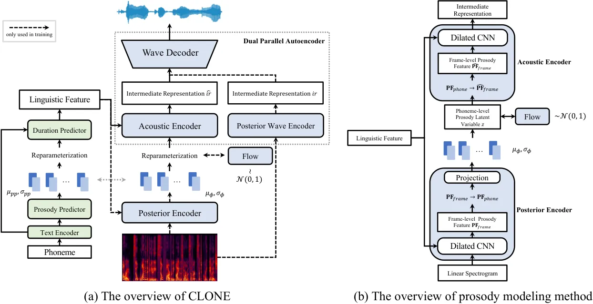
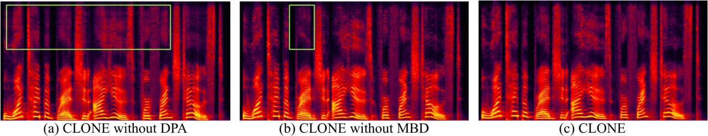

# Controllable and Lossless Non-Autoregressive End-to-End Text-to-Speech

Zhengxi Liu ^(†)^(†)thanks: Equal contribution. Corresponding to
liuzhengxi.nico@bytedance.com Affiliation: Speech, Audio and Music
Intelligence (SAMI), ByteDance    Qiao Tian    Chenxu Hu    Xudong Liu
Affiliation: Speech, Audio and Music Intelligence (SAMI), ByteDance   
Menglin Wu Affiliation: Speech, Audio and Music Intelligence (SAMI),
ByteDance    Yuping Wang Affiliation: Speech, Audio and Music
Intelligence (SAMI), ByteDance    Hang Zhao Affiliation: IIIS, Tsinghua
University    Yuxuan Wang Affiliation: Speech, Audio and Music
Intelligence (SAMI), ByteDance

###### Abstract

Some recent studies have demonstrated the feasibility of single-stage
neural text-to-speech, which does not need to generate mel-spectrograms
but generates the raw waveforms directly from the text. Single-stage
text-to-speech often faces two problems: a) the one-to-many mapping
problem due to multiple speech variations and b) insufficiency of high
frequency reconstruction due to the lack of supervision of ground-truth
acoustic features during training. To solve the a) problem and generate
more expressive speech, we propose a novel phoneme-level prosody
modeling method based on a variational autoencoder with normalizing
flows to model underlying prosodic information in speech. We also use
the prosody predictor to support end-to-end expressive speech synthesis.
Furthermore, we propose the dual parallel autoencoder to introduce
supervision of the ground-truth acoustic features during training to
solve the b) problem enabling our model to generate high-quality speech.
We compare the synthesis quality with state-of-the-art text-to-speech
systems on an internal expressive English dataset. Both qualitative and
quantitative evaluations demonstrate the superiority and robustness of
our method for lossless speech generation while also showing a strong
capability in prosody modeling.

## 1 Introduction

With the rapid development of deep learning, neural text-to-speech (TTS)
systems can generate natural and high-quality speech and thus have drawn
much attention in the machine learning and speech community. TTS is a
task that aims at synthesizing raw speech waveforms from the given
source text. Most previous neural TTS systems’ pipelines are two-stage.
The first stage is to generate intermediate speech representations
(e.g., mel-spectrograms) autoregressively \[36, 29, 24, 19\] or
non-autoregressively \[27, 26, 14\] from input text. The second stage is
to synthesize speech waveforms from the generated intermediate speech
representations using a vocoder \[10, 22, 25, 38, 33\]. These systems
with two-stage pipelines can synthesize high-quality speech but still
have drawbacks because they need sequential training or
fine-tuning \[15\]. In addition, the use of predefined intermediate
representations prevents further improvement in overall performance, as
two system components can not be jointly trained and connected by
learned intermediate representations.

Recently, several works (FastSpeech 2s \[26\], EATS \[7\], VITS \[15\])
have proposed parallel end-to-end TTS models that generate raw waveforms
directly from input text in a single stage. FastSpeech 2s introduces
explicit pitch and energy as mel-spectrogram decoder conditions to
alleviate the one-to-many mapping problem in the TTS system. However, it
needs to extract these handcrafted features in advance, complicating the
training pipeline. Moreover, FastSpeech 2s only models pitch and energy
but does not disentangle other prosody features from the speech. EATS
and VITS can synthesize high-quality speech, but they do not disentangle
prosody information from speech, so they can not achieve prosody
modeling and control.

To solve the problem that previous single-stage parallel end-to-end TTS
models do not model the general prosody, we propose the Controllable and
LOssless Non-autoregressive End-to-end TTS (CLONE), which contains some
carefully designed components to disentangle and model the general
prosody from speech.

Firstly, to better solve the one-to-many mapping problem, we need to
model the information variance other than text in speech. We propose an
implicit phoneme-level prosody latent variable modeling instead of only
explicitly modeling pitch and energy in FastSpeech 2s. The phoneme-level
prosody latent variable models general prosody in the speech in a
unified way without supervision. Specifically, we assume that prosody
follows a normal distribution and use a variational autoencoder \[16\]
(VAE) with normalizing flows \[28, 6\] to model it, which enhances the
modeling ability of pure VAE and enables better modeling of prosody
information that has extremely high variance. We propose a prosody
predictor to predict the prior distribution of phoneme-level prosody
latent variable from the input phoneme, which enables end-to-end
synthesis as a TTS system.

In addition, we carefully study the problem of unsatisfactory
high-frequency information generation in single-stage end-to-end speech
synthesis, which is caused by the lack of the supervision of
ground-truth acoustic features during training. To enhance the learned
intermediate representation, we propose the dual parallel autoencoder
(DPA) that consists of two parallel encoders (the acoustic encoder and
the posterior wave encoder) and a wave decoder. DPA uses ground-truth
linear spectrograms to regularize the learned intermediate
representations for efficient learning. Besides, we introduce the
multi-band discriminator (MBD) that significantly speeds up model
convergence and improves generation quality. DPA and MBD enable CLONE to
synthesize high-quality speech at the lossless high sampling rate (48
kHz) with better high-frequency information.

We conduct experiments on our private speech datasets. The results of
extensive evaluations show that CLONE outperforms SOTA two-stage and
single-stage TTS models \[29, 26, 15\] in terms of speech quality. In
addition, CLONE can synthesize lossless speech at 48 kHz with better
speech quality. Furthermore, we demonstrate that CLONE can model and
control prosody by the phoneme-level prosody latent variable and
generate speech with appropriate prosodic inflections. We attach audio
samples generated by CLONE at
[https://xcmyz.github.io/CLONE/](https://xcmyz.github.io/CLONE/).

## 2 Related Work

##### Text-to-Speech

Text-to-Speech (TTS), which aims to synthesize intelligible and natural
speech waveforms from the given text, has attracted much attention in
recent years. Specifically, the neural network-based TTS models \[36,
29, 27, 26, 22\] have achieved tremendous progress. The quality of the
synthesized speech is improved a lot and is close to that of the human
counterpart. The previous prevalent methods are two-stage. The general
pipeline of two-stage methods is: first, generate the acoustic features
(e.g., mel-spectrograms) from text autoregressively \[36, 29, 24, 19,
34\] or non-autoregressively \[27, 26, 14, 23\], then synthesize the raw
waveforms conditioned on the acoustic features \[10, 22, 25, 18\].
Recently, several single-stage end-to-end TTS models \[26, 7, 15\] have
been proposed to generate raw waveform directly from the text. Among
them, VITS \[15\] outperforms the two-stage models due to the advantages
of learned intermediate speech representations obtained by fully
end-to-end training. However, these single-stage methods have poor
controllability over the prosody of synthesized speech. Specifically,
EATS \[7\] and VITS cannot control prosody. FastSpeech 2s \[26\] can
only control some pre-defined prosodic features (i.e., pitch and
energy), and these features are required to be extracted in advance.
Unlike the aforementioned single-stage models, by utilizing a
conditional VAE with normalizing flows, CLONE achieves high
controllability over the general phoneme-level prosody of synthesized
speech.

##### Prosody Modeling

Many previous works have focused on learning underlying non-textual
information (e.g., style and prosody) in speech. In particular, some
works \[30, 37\] introduce a reference embedding to model style and
prosody.  \[30\] extracts a prosody embedding from a reference
spectrogram, and \[37\] models a reference embedding as a weighted
combination of a bank of learned embeddings. Some works \[1, 39\] use
the variational autoencoder (VAE) to model latent representations for
styles and prosody of speech. Specifically, \[32\] uses multi-level VAE
to model fine-grained prosody at the phoneme and word level in an
autoregressive way.  \[39\] and  \[12\] integrate VAE with Tacotron 2
for better style modeling. Some works \[8, 11\] use GMM based mixture
density network to model prosodic information at phoneme and word
levels. Unlike the previous models, CLONE adopts a conditional VAE with
normalizing flows for the phoneme-level prosody modeling to a
single-stage parallel TTS system. Inspired by \[28, 5, 40\] that improve
the expressive capability of prior and posterior distribution with
normalizing flows, we add normalizing flows to enhance the
representation power of our prior distribution for better prosody
modeling. Furthermore, the prosody predictor enables CLONE to predict
the prior distribution of prosody directly from the text and control the
prosody of generated speech during inference without the need for
manually adjusting the sampling points \[39\] or a reference
speech \[37\] or other modality input (e.g., video \[13\]).

## 3 CLONE



Figure 1: The overview of CLONE and prosody modeling method.

### 3.1 Overview

The overall model structure of CLONE shown in Figure 1a can be regarded
as a conditional VAE. Firstly, the posterior encoder converts the input
spectrograms to a sequence of phoneme-level prosody latent variable
$`z`$. Then, the acoustic encoder transforms the prosody latent variable
$`z`$ into the learnable intermediate representations conditioning on
linguistic features. Finally, the wave decoder predicts the waveforms
from the learnable intermediate representations. The objective of CLONE
is to maximize the evidence lower bound (ELBO) of the intractable
marginal log-likelihood of data $`\log_{\theta}(x\mid c)`$:

```math
\text{ELBO}=\mathbb{E}_{q_{\phi}(z\mid x,c)}\left[\log p_{\theta}(x\mid z,c)\right]-D_{kl}\left(q_{\phi}(z\mid x,c)\|p_{\theta}(z\mid c)\right), \tag{1}
```

where $`c`$ and $`z`$ denote the linguistic feature and the
phoneme-level prosody latent variable respectively,
$`q_{\phi}(z\mid x,c)`$ is the approximate posterior distribution of
$`z`$ given a data point $`x`$ and condition $`c`$,
$`p_{\theta}(x\mid z,c)`$ is the likelihood function of $`x`$ given
$`z`$ and $`c`$, and $`p_{\theta}(z\mid c)`$ is the prior distribution
of $`z`$ given $`c`$.

The training loss of CLONE is the negative ELBO, which consists of the
reconstruction loss
($`-\mathbb{E}_{q_{\phi}(z\mid x,c)}\left[\log p_{\theta}(x\mid z,c)\right]`$)
and the KL divergence
($`D_{kl}(q_{\phi}(z\mid x,c)\|p_{\theta}(z\mid c))`$). The details of
the reconstruction loss and the KL divergence are described in
Section 3.4.2 and Section 3.2, respectively.

### 3.2 Prosody Modeling

To model the prosody of speech more appropriately, we determine to model
the phoneme-level prosody rather than the frame-level prosody or the
word-level prosody. Because the frame-level prosody causes severe
linguistic information leakages during training, and the granularity of
the word-level prosody is too large to reflect the details of the
prosody well. Since the input linear spectrogram is at the frame level,
we need to convert the frame-level prosody feature to the phoneme level.
We use the obtained duration of phonemes to construct the hard alignment
matrix representing the correspondence between phonemes and spectrogram
frames and convert the frame-level prosody feature to the phoneme-level
prosody feature by the matrix as follows:

```math
\mathbf{PF}_{phone}=\operatorname{diag}(\mathbf{s})\cdot\mathbf{A}\cdot\mathbf{PF}_{frame}, \tag{2}
```

where $`\mathbf{PF}_{phone}\in\mathbb{R}^{T_{p}\times d}`$ and
$`\mathbf{PF}_{frame}\in\mathbb{R}^{T_{f}\times d}`$ denote the
phoneme-level prosody feature and the frame-level prosody feature,
respectively, $`\mathbf{A}\in\mathbb{R}^{T_{p}\times T_{f}}`$ denotes
the hard alignment matrix, and $`\mathbf{s}\in\mathbb{R}^{T_{p}}`$
denotes the inverse of the duration of phonemes
($`s_{i}=1/\sum_{j=1}^{T_{f}}a_{ij}`$).

The mean and standard deviation of the approximate posterior
distribution $`q_{\phi}(z\mid x,c)`$ are predicted from the obtained
phoneme-level prosody feature and linguistic feature. We obtain the
linguistic feature $`c`$ by expanding the output of the text encoder
according to the phoneme duration. The length of the linguistic feature
is the same as the number of frames in the spectrogram.

The formula for KL divergence is as follows:

```math
\mathcal{L}_{kl}=D_{kl}\left(q_{\phi}(z\mid x,c)\|p_{\theta}(z\mid c)\right)=\mathbb{E}_{q_{\phi}(z\mid x,c)}\left[\log{q_{\phi}(z\mid x,c)}-\log{p_{\theta}(z\mid c)}\right]. \tag{3}
```

Unlike traditional VAE, we assume that the approximate posterior
distribution of the phoneme-level prosody latent variable $`z`$ is a
normal distribution rather than a standard normal distribution, i.e.,
$`q_{\phi}\left(z\mid x,c\right)=\mathcal{N}\left(z;\mu_{\phi}\left(x,c\right),\sigma_{\phi}\left(x,c\right)\right)`$.
As a TTS model, we want to control the phoneme-level prosody explicitly.
If $`z`$ follows the standard normal distribution, the prosody variation
is implicitly determined in the random sampling process, which is not
desired. Thus, a normal distribution with variable mean and variance is
a better choice. It enables the prosody variation to be contained in the
mean and variance of normal distribution so that the corresponding
prosody can be determined by predicting the mean and variance. In
addition, compared with standard normal distribution, normal
distribution is more complex, which increases the prosody modeling
ability to obtain diverse prosody variation.

We also need to increase the expressiveness of the prior distribution to
match the posterior distribution. Therefore, we apply normalizing flows,
which enable an invertible transformation from a simple standard normal
distribution into a more complex prior distribution following the rule
of change-of-variables:

```math
p_{\theta}(z\mid c)=\mathcal{N}\left(f_{\theta}(z);\mathbf{0},\boldsymbol{I}\right)\left|\operatorname{det}\frac{\partial f_{\theta}(z)}{\partial z}\right|, \tag{4}
```

where $`f_{\theta}`$ denotes the normalizing flow. After the
reparameterization of VAE, we get the phoneme-level prosody latent
variable $`z`$ which represents the phoneme-level prosody of the speech.
We need to convert phoneme-level $`z`$ to frame-level variable
$`\widehat{\mathbf{PF}}_{frame}`$ to match the length of the linguistic
feature as follows:

```math
\widehat{\mathbf{PF}}_{frame}=\mathbf{A}^{\mathsf{T}}\cdot z, \tag{5}
```

where $`\mathbf{A}^{\mathsf{T}}`$ is the transposed matrix of
$`\mathbf{A}`$.

### 3.3 Prosody Predictor

We propose a prosody predictor to model the correspondence between
phoneme and phoneme-level prosody. The prosody predictor can predict the
mean and variance of $`q_{\phi}\left(z\mid x,c\right)`$ from the output
of the text encoder. Therefore, CLONE can predict phoneme-level prosody
from text input in the inference stage. During inference, there are
three modes to generate highly natural speech with suitable prosody
(details in Section 4.4). The optimization goal of the prosody predictor
is to minimize the KL divergence between the predicted normal
distribution and the posterior distribution. Therefore, the training
loss of the prosody predictor is as follows:

```math
\mathcal{L}_{pp}=D_{kl}(\mathcal{N}(\mu_{pp},\sigma_{pp}),\mathcal{N}(\mu_{\phi},\sigma_{\phi})), \tag{6}
```

where $`\mu_{pp}`$ and $`\sigma_{pp}`$ are the mean and standard
deviation predicted by the prosody predictor. Compared with Fastspeech 2
to directly predict pitch and energy, we predict the distribution of
phoneme-level prosody, avoiding the one-to-many mapping problem.

It is worth noting that the duration predictor we used is an improved
version of the duration predictor in FastSpeech 2 \[26\]. Since prosodic
information partly determines the phoneme duration, we use $`z`$ as the
condition of the duration predictor besides the output of the text
encoder, i.e.,
$`\hat{\mathbf{d}}=\mathcal{DP}(z,t)\in\mathbb{R}^{T_{p}}`$, where
$`\mathcal{DP}`$ denotes the duration predictor, and $`t`$ is the output
of the text encoder. In this way, CLONE can generate more stable and
natural phoneme durations.

### 3.4 Waveform Generation

#### 3.4.1 Motivation

Some end-to-end TTS studies \[26, 7, 15\] focus on generating raw
waveforms directly from phonemes recently. These single-stage TTS
systems usually generate learned intermediate representations from
phonemes and then synthesize raw waveforms from the learned intermediate
representations. Unlike the mel-spectrogram used in two-stage methods,
the intermediate representation in single-stage methods is predicted by
the model without training supervision, subject to prediction errors and
over-smoothness. The lack of supervision of intermediate representations
during training expands the search space of the single-stage model,
resulting in the model being more challenging to optimize, which is
reflected in the poor modeling ability for high-frequency information in
our experiments. To narrow the search space of waveform generation in
single-stage models, we introduce ground-truth speech signals. We design
an autoencoder architecture called Dual Parallel Autoencoder (DPA) to
regularize the learned intermediate representation. In addition, to
further enhance the quality of the generated waveforms, we propose a new
discriminator called Multi-Band Discriminator (MBD). MBD divides the
waveform into multiple bands so that our model can separately supervise
the low-frequency and high-frequency parts of the audio, improving the
overall quality of the synthesized speech.

#### 3.4.2 Dual Parallel Autoencoder

In the dual parallel autoencoder, two parallel encoders, namely the
acoustic encoder and the posterior wave encoder, generate intermediate
representation, and a dual training method is used to optimize them. The
acoustic encoder transforms $`z`$ into the predicted intermediate
representations $`\hat{ir}`$ conditioning on linguistic features, and
the posterior wave encoder transforms linear spectrograms into the
intermediate representations $`ir`$. The wave decoder acts as the
decoder of DPA and generates the waveform from both intermediate
representations. In practice, we concatenate $`ir`$ and $`\hat{ir}`$ in
the batch dimension to get $`ir_{concat}`$ and send $`ir_{concat}`$ into
the wave decoder to produce the waveform $`\hat{w}`$. For dual training,
we compute the mean absolute error (MAE) $`\mathcal{L}_{ir}`$ between
$`ir`$ and $`\hat{ir}`$, so that $`\hat{ir}`$ gets the supervision of
ground-truth acoustic features from $`ir`$, and $`\hat{ir}`$ is
regularized by $`ir`$, which assists CLONE in learning intermediate
representation efficiently. Please note that we only use the acoustic
encoder without the posterior wave encoder during inference.

To calculate the reconstruction loss, we convert $`\hat{w}`$ to
mel-spectrogram $`m_{1}`$ and calculate MAE with ground-truth
mel-spectrogram $`m_{gt}`$. To make $`ir`$ and $`\hat{ir}`$ focus on the
information at the human voice frequency band for better prosody
modeling, we use a one-layer linear network to predict the
mel-spectrogram $`m_{2}`$ from $`ir_{concat}`$. Therefore, the whole
reconstruction loss $`\mathcal{L}_{recon}`$ is:

```math
\mathcal{L}_{recon}=\operatorname{MAE}(m_{gt},m_{1})+\operatorname{MAE}(m_{gt},m_{2}). \tag{7}
```

#### 3.4.3 Discriminator

We use the popular adversarial training approach as HiFi-GAN \[17\] to
improve the resolution of synthesized speech. The following equations
describe the loss of adversarial training:

```math
\displaystyle\mathcal{L}_{advD}=\mathbb{E}_{(w,\hat{w})}\left[((D(w)-1)^{2}+(D(\hat{w}))^{2}\right], \tag{8}
```

```math
\displaystyle\mathcal{L}_{advG}=\mathbb{E}_{w}\left[(D(\hat{w})-1)^{2}\right]+\beta\mathcal{L}_{fm},\quad\mathcal{L}_{fm}=\mathbb{E}_{(w,\hat{w})}\left[\sum_{l=1}^{L}\frac{1}{N_{l}}\operatorname{MAE}(D_{l}(w),D_{l}(\hat{w}))\right], \tag{9}
```

where $`\mathcal{L}_{advD}`$, $`\mathcal{L}_{advG}`$ and
$`\mathcal{L}_{fm}`$ denote the loss of the discriminator, the loss of
the wave decoder, and the loss of the feature map, respectively. $`L`$
denotes the total number of layers in the discriminators. $`D_{l}`$ and
$`N_{l}`$ denote the features and the number of features in the $`l`$-th
layer of the discriminator, respectively. $`\beta`$ is the coefficient
of the feature map loss $`\mathcal{L}_{fm}`$, and we set it to 0.1 in
our experiments.

We use two discriminators for joint adversarial training, namely MPD in
HiFi-GAN and MBD. MBD uses the pseudo quadrature mirror filter bank
(Pseudo-QMF) to divide the waveform into $`N`$ sub-bands. These $`N`$
sub-bands with one full-band are respectively sent to $`N+1`$ scale
discriminators in MelGAN \[18\]. By applying different discriminators on
different frequency bands of the synthesized audio, MBD can
significantly enhance the generation quality of high-frequency parts,
allowing CLONE to generate high-fidelity and lossless audio at a high
sample rate. A similar idea is used in  \[21\]. However, our method
differs in that we send different frequency bands into different
discriminators.

### 3.5 Loss Function

The total loss of CLONE can be expressed as follows:

```math
\mathcal{L}=\lambda_{1}*\mathcal{L}_{recon}+\lambda_{2}*\mathcal{L}_{kl}+\lambda_{3}*\mathcal{L}_{ir}+\lambda_{4}*\mathcal{L}_{pp}+\lambda_{5}*\mathcal{L}_{dur}+\lambda_{6}*\mathcal{L}_{advG}, \tag{10}
```

where $`\lambda_{[1\rightarrow 6]}`$ represent coefficients of different
components of the total loss.

## 4 Experiment

### 4.1 Dataset

We used proprietary English speech datasets, including a single-speaker
dataset and a multi-speaker dataset. The single-speaker dataset contains
11,176 utterances with a total audio length of 10 hours at both 24 kHz
and 48 kHz. We use 9,000 utterances as the training set, 100 utterances
as the validation set, and the remaining data as the test set. The
multi-speaker speech data contains five English speakers (two males and
three females) with a total audio length of 22 hours. We evaluate the
high-quality generation capability of CLONE on the single-speaker
dataset and the prosody transfer capability of CLONE on the
multi-speaker dataset.

### 4.2 Data Preprocessing

We convert the text sequences into phoneme sequences following \[2, 19,
26\]. In experiments, we use 80-dimensional mel-spectrograms and linear
spectrograms with 2048 filters. For the audio at 24 kHz, the hop size is
300, and the window size is 1200. For the audio at 48 kHz, the hop size
is 300, and the window size is 2048. All use the Hann window.

### 4.3 Model Configuration

Our text encoder uses a stack of 6 feed-forward transformer
blocks \[35\], and the prosody predictor consists of 4 WaveNet residual
blocks (dilated CNN) \[22\], which consists of layers of dilated
convolutions with a gated activation unit and skip connection. The
duration predictor consists of a 2-layer 1D convolutional network with
ReLU activation, each followed by layer normalization \[3\] and the
dropout layer \[31\], and an extra linear layer with ReLU activation to
output a scalar, which is the predicted phoneme duration. The posterior
encoder consists of 8 blocks of dilated CNN, and the normalizing flow is
a stack of affine coupling layers \[6\] consisting of 4 blocks of
dilated CNN. The acoustic encoder is composed of 8 blocks of dilated
CNN. The posterior wave encoder consists of 8 blocks of dilated CNN. The
structure of the wave decoder is the same as HiFi-GAN V1. To match our
hop size, we change the upsampling rate to 5, 5, 4, 3 and change the
upsampling kernel size to 15, 15, 12, 9. The detailed hyper-parameters
of CLONE are listed in the appendix.

### 4.4 Training and Inference

We train our model on 4 NVIDIA Tesla V100 32G GPUs with the batch size
of 16 on each GPU for 500k steps. We use the AdamW \[20\] optimizer with
$`\beta_{1}=0.8`$ and $`\beta_{2}=0.99`$. The learning rate of CLONE is
fixed at 2e-4. The discriminator uses the same optimization settings,
with a fixed learning rate of 1e-4. As VITS, to reduce training time and
GPU memory usage, we employ a windowed generator for training, randomly
sampling segments of intermediate representation with a window size of
32 frames as input to the wave decoder.

CLONE has three modes of inference, and the difference lies in how the
prosody latent variable is calculated. (a) Use the prosody predictor to
predict prosody information based on text information, and the input of
the model is only text information, just like a typical TTS model. (b)
The prosody latent variable is obtained through the inverse flow
transformation, where the inputs of CLONE are textual information and
the sampling value of the standard normal distribution. (c) The prosody
information is extracted by the posterior encoder from the input linear
spectrogram. In this mode, the model inputs are text information and the
reference linear spectrogram. Besides, we test the inference speed of
CLONE in mode (a) on an NVIDIA Tesla V100 32G GPU and compare it to that
of VITS. The RTF of CLONE and VITS are 0.012 and 0.017, respectively,
indicating that our model has a comparable inference speed to the SOTA
single-stage parallel TTS model.

### 4.5 Evaluation

#### 4.5.1 MOS Evaluation

We conduct the MOS (mean opinion score) evaluation to measure the
synthesis quality of different models. We use each model to synthesize
the same 30 utterances¹¹ 1 To test the synthesis quality and robustness
of the model and avoid data leakage, we use 30 general utterances
outside the dataset for testing., and let 15 English native speakers
evaluate them. We compare with the state-of-the-art (SOTA)
autoregressive TTS model Tacotron 2 \[29\] with GMM-based attention
mechanisms \[4\], the SOTA non-autoregressive TTS model FastSpeech
2 \[26\], and the SOTA single-stage TTS model VITS \[15\]. The vocoder
for Tacotron 2 and FastSpeech 2 is TFGAN \[33\], as TFGAN has better
generation robustness than HiFi-GAN in our experiments. The above models
all generate audio at 24 kHz. We evaluate two kinds of CLONE, namely 24
kHz CLONE and 24 kHz CLONE without MBD, of which the discriminators are
the same as those used in HiFi-GAN. The results of the MOS evaluation
are shown in Table 1. It can be seen that CLONE surpasses other SOTA
models, indicating that our phoneme-level prosody modeling method and
the introduction of DPA enable the model to synthesize highly natural
speech with appropriate prosodic inflections. In addition, CLONE is
better than CLONE without MBD, demonstrating the effectiveness of MBD
for generating higher quality speech.

| Method               | MOS    | CI            |
| -------------------- | ------ | ------------- |
| Tacotron 2 + TFGAN   | 4.0717 | $`\pm`$0.0578 |
| FastSpeech 2 + TFGAN | 4.0983 | $`\pm`$0.0579 |
| VITS                 | 4.0108 | $`\pm`$0.0601 |
| 24 kHz CLONE w/o MBD | 4.1000 | $`\pm`$0.0606 |
| 24 kHz CLONE         | 4.1567 | $`\pm`$0.0528 |

Table 1: The MOS result with $`95\%`$ confidence intervals of different
models.

Furthermore, we conduct CMOS evaluations on 30 utterances with
ground-truth recording audio. We compare 24 kHz VITS, 24 kHz CLONE, and
48 kHz CLONE with 48 kHz ground-truth audio, respectively, as shown in
Table 2. We find that 48 kHz CLONE can generate the audio close to the
48 kHz ground-truth audio and outperform both the 24 kHz CLONE and 24
kHz VITS, demonstrating that CLONE can synthesize high-fidelity 48 kHz
audio.

| Method                    | CMOS        |
| ------------------------- | ----------- |
| 48 kHz Ground-truth Audio | 0           |
| 48 kHz CLONE              | $`-`$0.1712 |
| 24 kHz CLONE              | $`-`$0.2393 |
| 24 kHz VITS               | $`-`$0.3621 |

Table 2: The CMOS comparison to evaluate speech generation quality at
high sample rates. The audio synthesized by 48 kHz CLONE, 24 kHz CLONE,
and 24 kHz VITS is compared with 48 kHz ground-truth audio,
respectively.

#### 4.5.2 Prosody Modeling

Figure 2: Visualization of prosody modeling. (a) shows the variation in
the pitch of the audio generated from all $`-1`$ and all $`1`$ sampling,
respectively. (b) shows the pitch comparison of the reference audio,
transfer result, and end-to-end synthesis result. (c) and (d) show the
pitch and energy of the reconstruction result and reference audio,
respectively.

##### Prosody Variation

We infer CLONE in mode (b), i.e., sampling values in the standard normal
distribution and obtaining the phoneme-level prosody latent variable
through the inverse flow transformation. We find that the prosody of the
generated speech has a very high variance by sampling different values
in the standard normal distribution, which further proves the prosody
modeling capability of CLONE. Figure 2a visualizes the variation in the
pitch of the audio generated by setting sample values to all $`-1`$ and
all $`1`$, respectively. It can be seen that a significant prosody
variation can be achieved by adjusting sample values in the standard
normal distribution of the inverse flow transformation.

##### Prosody Transfer

We test the prosody transfer performance of CLONE. Firstly, we train a
multi-speaker CLONE ²² 2 To implement multi-speaker TTS, we add speaker
embedding to prosody predictor, duration predictor, posterior encoder,
and acoustic encoder.. Then we infer CLONE in mode (c). We input the
reference speech of speaker 1 to the posterior encoder and use the
speaker embedding of speaker 2 and the duration of the reference speech
to synthesize the transfer result. The goal is to use the timbre of
speaker 2 to synthesize audio with the same prosody as the reference
audio of speaker 1. We also use the end-to-end synthesis result with the
timbre of speaker 2 for comparison. In Figure 2b, the pitch envelope of
the transfer result is very similar to that of the reference audio and
quite different from that of the end-to-end synthesis result. Besides,
we calculate the MAE on pitch and energy of the prosody transfer result
and the end-to-end synthesis result (both are synthesized using the
duration of the reference audio) with the reference audio as ground
truth, as shown in Table 3. It can be seen that the MAE of the prosody
transfer result is significantly smaller than that of the end-to-end
synthesis result. Above two experiments prove the effectiveness of
prosody transfer.

| Method                                      | Pitch MAE | Energy MAE |
| ------------------------------------------- | --------- | ---------- |
| end-to-end synthesis                        | 79.38     | 35.91      |
| prosody transfer synthesis                  | 41.44     | 31.92      |
| reconstruction synthesis by CLONE with HAPE | 32.56     | 16.34      |
| reconstruction synthesis by CLONE with SAPE | 64.83     | 23.70      |

Table 3: The mean absolute error of pitch and energy of different
methods.

##### Prosody Reconstruction

CLONE can extract the prosody of the reference audio through the
posterior encoder and then reconstruct the audio as a conditional VAE.
We draw the pitch and energy curves of the reference audio and the
reconstruction result, as shown in Figure 2c and Figure 2d. We find that
the two curves in each figure are very similar, indicating that CLONE
can accurately extract and reconstruct the prosody (e.g., pitch and
energy) of the reference audio.

#### 4.5.3 Ablation Study



Figure 3: The spectrograms generated by three different CLONE, (a) CLONE
without DPA, (b) CLONE without MBD, and (c) complete CLONE.

##### Waveform Generation

To further investigate the improvement of our method on waveform
generation, we conduct ablation experiments. Firstly, we conduct a MOS
evaluation on the audio synthesized by the CLONE with and without MBD,
as shown in Table 1. We find that MBD enhances the quality of
synthesized audio. In addition, we plot the spectrograms of the
synthesized audio, as shown in Figure 3. Figure 3a shows that without
the DPA, the synthesized audio suffers obvious over-smoothness at high
frequency, and Figure 3b shows that without MBD, the high-frequency
details of synthesized audio are insufficient. These demonstrate that
DPA significantly weakens the over-smoothness of the high frequency, and
MBD further enhances the high-frequency details.

##### Prosody Extraction

CLONE uses a hard alignment prosody extractor (HAPE) to extract prosody,
which improves the accuracy of prosody extraction. To verify this, we
compare HAPE with the soft attention prosody extractor (SAPE) \[9, 32\]
where the text encoder output is to query the ground-truth linear
spectrogram by soft attention. We compute the MAE on pitch and energy of
the above two methods in Table 3. It can be seen that the MAE of HAPE is
smaller than that of SAPE, indicating that HAPE can extract prosody more
accurately.

## 5 Conclusion

In this work, we propose a single-stage TTS system called CLONE that can
directly generate lossless waveforms from the text in parallel.
Specifically, we design a phoneme-level prosody modeling method based on
a variational autoencoder with normalizing flows and a prosody predictor
to solve the one-to-many mapping problem better and support end-to-end
expressive speech synthesis. Besides, the dual parallel autoencoder is
introduced to solve the problem of lacking supervision of ground-truth
acoustic features during training, which allows the single-stage model
to generate lossless speech. Our experiments demonstrate that CLONE
outperforms existing SOTA single-stage and two-stage TTS models in
speech quality while performing strong controllability over prosody.

## References

- (1) Kei Akuzawa, Yusuke Iwasawa, and Yutaka Matsuo. Expressive speech
  synthesis via modeling expressions with variational autoencoder. Proc.
  Interspeech 2018, pages 3067–3071, 2018.
- (2) Sercan Ö Arık, Mike Chrzanowski, Adam Coates, Gregory Diamos,
  Andrew Gibiansky, Yongguo Kang, Xian Li, John Miller, Andrew Ng,
  Jonathan Raiman, et al. Deep voice: Real-time neural text-to-speech.
  In International Conference on Machine Learning, pages 195–204.
  PMLR, 2017.
- (3) Jimmy Lei Ba, Jamie Ryan Kiros, and Geoffrey E Hinton. Layer
  normalization. arXiv preprint arXiv:1607.06450, 2016.
- (4) Eric Battenberg, R.J. Skerry-Ryan, Soroosh Mariooryad, Daisy
  Stanton, David Kao, Matt Shannon, and Tom Bagby. Location-relative
  attention mechanisms for robust long-form speech synthesis. In ICASSP
  2020 - 2020 IEEE International Conference on Acoustics, Speech and
  Signal Processing (ICASSP), pages 6194–6198, 2020.
- (5) Xi Chen, Diederik P Kingma, Tim Salimans, Yan Duan, Prafulla
  Dhariwal, John Schulman, Ilya Sutskever, and Pieter Abbeel.
  Variational lossy autoencoder. arXiv preprint arXiv:1611.02731, 2016.
- (6) Laurent Dinh, Jascha Sohl-Dickstein, and Samy Bengio. Density
  estimation using real NVP. In 5th International Conference on Learning
  Representations, ICLR 2017, Toulon, France, April 24-26, 2017,
  Conference Track Proceedings. OpenReview.net, 2017.
- (7) Jeff Donahue, Sander Dieleman, Mikolaj Binkowski, Erich Elsen, and
  Karen Simonyan. End-to-end adversarial text-to-speech. In
  International Conference on Learning Representations, 2020.
- (8) Chenpeng Du and Kai Yu. Rich prosody diversity modelling with
  phone-level mixture density network. arXiv preprint
  arXiv:2102.00851, 2021.
- (9) Isaac Elias, Heiga Zen, Jonathan Shen, Yu Zhang, Ye Jia, Ron J
  Weiss, and Yonghui Wu. Parallel tacotron: Non-autoregressive and
  controllable tts. In ICASSP 2021-2021 IEEE International Conference on
  Acoustics, Speech and Signal Processing (ICASSP), pages 5709–5713.
  IEEE, 2021.
- (10) Daniel Griffin and Jae Lim. Signal estimation from modified
  short-time fourier transform. IEEE Transactions on acoustics, speech,
  and signal processing, 32(2):236–243, 1984.
- (11) Yiwei Guo, Chenpeng Du, and Kai Yu. Unsupervised word-level
  prosody tagging for controllable speech synthesis. In ICASSP 2022-2022
  IEEE International Conference on Acoustics, Speech and Signal
  Processing (ICASSP), pages 7597–7601. IEEE, 2022.
- (12) Wei-Ning Hsu, Yu Zhang, Ron J Weiss, Heiga Zen, Yonghui Wu,
  Yuxuan Wang, Yuan Cao, Ye Jia, Zhifeng Chen, Jonathan Shen, et al.
  Hierarchical generative modeling for controllable speech synthesis. In
  International Conference on Learning Representations, 2018.
- (13) Chenxu Hu, Qiao Tian, Tingle Li, Wang Yuping, Yuxuan Wang, and
  Hang Zhao. Neural dubber: Dubbing for videos according to scripts. In
  Advances in Neural Information Processing Systems, 2021.
- (14) Jaehyeon Kim, Sungwon Kim, Jungil Kong, and Sungroh Yoon.
  Glow-tts: A generative flow for text-to-speech via monotonic alignment
  search. arXiv preprint arXiv:2005.11129, 2020.
- (15) Jaehyeon Kim, Jungil Kong, and Juhee Son. Conditional variational
  autoencoder with adversarial learning for end-to-end text-to-speech.
  In International Conference on Machine Learning, pages 5530–5540.
  PMLR, 2021.
- (16) Diederik P Kingma and Max Welling. Auto-encoding variational
  bayes. arXiv preprint arXiv:1312.6114, 2013.
- (17) Jungil Kong, Jaehyeon Kim, and Jaekyoung Bae. Hifi-gan:
  Generative adversarial networks for efficient and high fidelity speech
  synthesis. Advances in Neural Information Processing Systems,
  33:17022–17033, 2020.
- (18) Kundan Kumar, Rithesh Kumar, Thibault de Boissiere, Lucas Gestin,
  Wei Zhen Teoh, Jose Sotelo, Alexandre de Brébisson, Yoshua Bengio, and
  Aaron Courville. Melgan: Generative adversarial networks for
  conditional waveform synthesis. arXiv preprint arXiv:1910.06711, 2019.
- (19) Naihan Li, Shujie Liu, Yanqing Liu, Sheng Zhao, and Ming Liu.
  Neural speech synthesis with transformer network. In Proceedings of
  the AAAI Conference on Artificial Intelligence, volume 33, pages
  6706–6713, 2019.
- (20) Ilya Loshchilov and Frank Hutter. Decoupled weight decay
  regularization. In International Conference on Learning
  Representations, 2018.
- (21) Ahmed Mustafa, Nicola Pia, and Guillaume Fuchs. Stylemelgan: An
  efficient high-fidelity adversarial vocoder with temporal adaptive
  normalization. In ICASSP 2021-2021 IEEE International Conference on
  Acoustics, Speech and Signal Processing (ICASSP), pages 6034–6038.
  IEEE, 2021.
- (22) Aaron van den Oord, Sander Dieleman, Heiga Zen, Karen Simonyan,
  Oriol Vinyals, Alex Graves, Nal Kalchbrenner, Andrew Senior, and Koray
  Kavukcuoglu. Wavenet: A generative model for raw audio. arXiv preprint
  arXiv:1609.03499, 2016.
- (23) Kainan Peng, Wei Ping, Zhao Song, and Kexin Zhao.
  Non-autoregressive neural text-to-speech. In International conference
  on machine learning, pages 7586–7598. PMLR, 2020.
- (24) Wei Ping, Kainan Peng, Andrew Gibiansky, Sercan O Arik, Ajay
  Kannan, Sharan Narang, Jonathan Raiman, and John Miller. Deep voice 3:
  2000-speaker neural text-to-speech. Proc. ICLR, pages 214–217, 2018.
- (25) Ryan Prenger, Rafael Valle, and Bryan Catanzaro. Waveglow: A
  flow-based generative network for speech synthesis. In ICASSP
  2019-2019 IEEE International Conference on Acoustics, Speech and
  Signal Processing (ICASSP), pages 3617–3621. IEEE, 2019.
- (26) Yi Ren, Chenxu Hu, Xu Tan, Tao Qin, Sheng Zhao, Zhou Zhao, and
  Tie-Yan Liu. Fastspeech 2: Fast and high-quality end-to-end text to
  speech. In International Conference on Learning Representations, 2021.
- (27) Yi Ren, Yangjun Ruan, Xu Tan, Tao Qin, Sheng Zhao, Zhou Zhao, and
  Tie-Yan Liu. Fastspeech: Fast, robust and controllable text to speech.
  In Advances in Neural Information Processing Systems, 2019.
- (28) Danilo Rezende and Shakir Mohamed. Variational inference with
  normalizing flows. In International conference on machine learning,
  pages 1530–1538. PMLR, 2015.
- (29) Jonathan Shen, Ruoming Pang, Ron J Weiss, Mike Schuster, Navdeep
  Jaitly, Zongheng Yang, Zhifeng Chen, Yu Zhang, Yuxuan Wang,
  Rj Skerrv-Ryan, et al. Natural tts synthesis by conditioning wavenet
  on mel spectrogram predictions. In 2018 IEEE International Conference
  on Acoustics, Speech and Signal Processing (ICASSP), pages 4779–4783.
  IEEE, 2018.
- (30) RJ Skerry-Ryan, Eric Battenberg, Ying Xiao, Yuxuan Wang, Daisy
  Stanton, Joel Shor, Ron Weiss, Rob Clark, and Rif A Saurous. Towards
  end-to-end prosody transfer for expressive speech synthesis with
  tacotron. In international conference on machine learning, pages
  4693–4702. PMLR, 2018.
- (31) Nitish Srivastava, Geoffrey Hinton, Alex Krizhevsky, Ilya
  Sutskever, and Ruslan Salakhutdinov. Dropout: a simple way to prevent
  neural networks from overfitting. The journal of machine learning
  research, 15(1):1929–1958, 2014.
- (32) Guangzhi Sun, Yu Zhang, Ron J Weiss, Yuan Cao, Heiga Zen, and
  Yonghui Wu. Fully-hierarchical fine-grained prosody modeling for
  interpretable speech synthesis. In ICASSP 2020-2020 IEEE international
  conference on acoustics, speech and signal processing (ICASSP), pages
  6264–6268. IEEE, 2020.
- (33) Qiao Tian, Yi Chen, Zewang Zhang, Heng Lu, Linghui Chen, Lei Xie,
  and Shan Liu. Tfgan: Time and frequency domain based generative
  adversarial network for high-fidelity speech synthesis. arXiv preprint
  arXiv:2011.12206, 2020.
- (34) Rafael Valle, Kevin J Shih, Ryan Prenger, and Bryan Catanzaro.
  Flowtron: an autoregressive flow-based generative network for
  text-to-speech synthesis. In International Conference on Learning
  Representations, 2020.
- (35) Ashish Vaswani, Noam Shazeer, Niki Parmar, Jakob Uszkoreit, Llion
  Jones, Aidan N Gomez, Lukasz Kaiser, and Illia Polosukhin. Attention
  is all you need. arXiv preprint arXiv:1706.03762, 2017.
- (36) Yuxuan Wang, RJ Skerry-Ryan, Daisy Stanton, Yonghui Wu, Ron J
  Weiss, Navdeep Jaitly, Zongheng Yang, Ying Xiao, Zhifeng Chen, Samy
  Bengio, et al. Tacotron: Towards end-to-end speech synthesis. arXiv
  preprint arXiv:1703.10135, 2017.
- (37) Yuxuan Wang, Daisy Stanton, Yu Zhang, RJ-Skerry Ryan, Eric
  Battenberg, Joel Shor, Ying Xiao, Ye Jia, Fei Ren, and Rif A Saurous.
  Style tokens: Unsupervised style modeling, control and transfer in
  end-to-end speech synthesis. In International Conference on Machine
  Learning, pages 5180–5189. PMLR, 2018.
- (38) Ryuichi Yamamoto, Eunwoo Song, and Jae-Min Kim. Parallel wavegan:
  A fast waveform generation model based on generative adversarial
  networks with multi-resolution spectrogram. In ICASSP 2020-2020 IEEE
  International Conference on Acoustics, Speech and Signal Processing
  (ICASSP), pages 6199–6203. IEEE, 2020.
- (39) Ya-Jie Zhang, Shifeng Pan, Lei He, and Zhen-Hua Ling. Learning
  latent representations for style control and transfer in end-to-end
  speech synthesis. In ICASSP 2019-2019 IEEE International Conference on
  Acoustics, Speech and Signal Processing (ICASSP), pages 6945–6949.
  IEEE, 2019.
- (40) Zachary Ziegler and Alexander Rush. Latent normalizing flows for
  discrete sequences. In International Conference on Machine Learning,
  pages 7673–7682. PMLR, 2019.

## Appendix A Details of Formula

The derivation of the formula for KL divergence in prosody modeling is
as follows:

```math
\displaystyle\mathcal{L}_{kl} \displaystyle=D_{kl}\left(q_{\phi}(z\mid x,c)\|p_{\theta}(z\mid c)\right) \tag{11}
```

```math
\displaystyle=\mathbb{E}_{q_{\phi}(z\mid x,c)}\left[\log{q_{\phi}(z\mid x,c)}-\log{p_{\theta}(z\mid c)}\right]
```

```math
\displaystyle=\mathbb{E}_{q_{\phi}(z\mid x,c)}[\log{q_{\phi}(z\mid x,c)}]-\mathbb{E}_{q_{\phi}(z\mid x,c)}[\log{p_{\theta}(z\mid c)}],
```

as we assume that the approximate posterior distribution of the
phoneme-level prosody latent variable $`z`$ is a normal distribution
rather than a standard normal distribution, we have the follows:

```math
q_{\phi}(z\mid x,c)\sim\mathcal{N}(\mu_{\phi},\sigma_{\phi}), \tag{12}
```

and the differential entropy for a univariate normal distribution
$`p(x)\sim\mathcal{N}(\mu,\sigma)`$ is as follows:

```math
\mathbb{E}[-\log{p(x)}]=\log(\sigma*\sqrt{2\pi e}). \tag{13}
```

Thus, we have:

```math
\mathbb{E}_{q_{\phi}(z\mid x,c)}[\log{q_{\phi}(z\mid x,c)}]=-\log(\sigma_{\phi}*\sqrt{2\pi e}). \tag{14}
```

Besides, $`\mathbb{E}_{q_{\phi}(z\mid x,c)}[\log{p_{\theta}(z\mid c)}]`$
does not have a closed-form solution. So we compute
$`\log{p_{\theta}(z\mid c)}`$ for each sampled $`z`$ and then average
them. For each sampling, we have:

```math
\displaystyle\mathbb{E}_{q_{\phi}(z\mid x,c)}[\log{p_{\theta}(z\mid c)}] \displaystyle=\mathbb{E}_{q_{\phi}(z\mid x,c)}\left[\log\left({\mathcal{N}\left(f_{\theta}(z);\mathbf{0},\boldsymbol{I}\right)\cdot\left|\operatorname{det}\frac{\partial f_{\theta}(z)}{\partial z}\right|}\right)\right] \tag{15}
```

```math
\displaystyle=-\frac{\log(2\pi)}{2}-\frac{f_{\theta}(z)^{2}}{2}+\log\left(\left|\operatorname{det}\frac{\partial f_{\theta}(z)}{\partial z}\right|\right),
```

where $`z\sim{q_{\phi}(z\mid x,c)}`$. Thus, we have:

```math
\displaystyle\mathcal{L}_{kl} \displaystyle=\mathbb{E}_{q_{\phi}(z\mid x,c)}[\log{q_{\phi}(z\mid x,c)}]-\mathbb{E}_{q_{\phi}(z\mid x,c)}[\log{p_{\theta}(z\mid c)}] \tag{16}
```

```math
\displaystyle=-\log(\sigma_{\phi}*\sqrt{2\pi e})+\frac{\log(2\pi)}{2}+\frac{f_{\theta}(z)^{2}}{2}-\log\left(\left|\operatorname{det}\frac{\partial f_{\theta}(z)}{\partial z}\right|\right)
```

```math
\displaystyle=-\log(\sigma_{\phi})-\frac{1}{2}+\frac{f_{\theta}(z)^{2}}{2}-\log\left(\left|\operatorname{det}\frac{\partial f_{\theta}(z)}{\partial z}\right|\right).
```

The training loss of the prosody predictor is the KL divergence between
two normal distributions which are the distribution of prosody predictor
$`s_{\psi}(z\mid t)\sim\mathcal{N}(\mu_{pp},\sigma_{pp})`$ and the
distribution of posterior encoder
$`q_{\phi}(z\mid x,c)\sim\mathcal{N}(\mu_{\phi},\sigma_{\phi})`$,
respectively. As KL divergence between two normal distributions has
closed-form solution, we have:

```math
\displaystyle\mathcal{L}_{pp} \displaystyle=D_{kl}(\mathcal{N}(\mu_{pp},\sigma_{pp}),\mathcal{N}(\mu_{\phi},\sigma_{\phi})) \tag{17}
```

```math
\displaystyle=\frac{1}{2}\log(2\pi\sigma_{\phi}^{2})+\frac{\sigma_{pp}^{2}+(\mu_{pp}-\mu_{\phi})^{2}}{2\sigma_{\phi}^{2}}-\frac{1}{2}\left(1+\log(2\pi\sigma_{pp}^{2})\right)
```

```math
\displaystyle=\log\frac{\sigma_{\phi}}{\sigma_{pp}}+\frac{\sigma_{pp}^{2}+(\mu_{pp}-\mu_{\phi})^{2}}{2\sigma_{\phi}^{2}}-\frac{1}{2}.
```

## Appendix B Hyperparameter and Model Configuration of CLONE

We list the hyperparameters of each module of CLONE as shown in Table 4.

| Module                                      | Parameter                       |
| ------------------------------------------- | ------------------------------- |
| Speaker Embedding Size                      | 256                             |
| Text Encoder                                |                                 |
| Phoneme Embedding Size                      | 192                             |
| Feed-Forward Transformer Layers             | 6                               |
| Feed-Forward Transformer Hidden Channels    | 192                             |
| Feed-Forward Transformer Conv1D Kernel Size | 3                               |
| Feed-Forward Transformer Conv1D Filter Size | 768                             |
| Feed-Forward Transformer Attention Heads    | 2                               |
| Prosody Predictor                           |                                 |
| Dilated CNN Layers                          | 4                               |
| Dilated CNN Hidden Channels                 | 192                             |
| Dilated CNN Kernel Size                     | 5                               |
| Dilated CNN Dilation Rate                   | 1                               |
| Duration Predictor                          |                                 |
| Conv1D Kernel Size                          | 3                               |
| Conv1D Filter Size                          | 256                             |
| Posterior Encoder                           |                                 |
| Dilated CNN Layers                          | 8                               |
| Dilated CNN Hidden Channels                 | 192                             |
| Dilated CNN Kernel Size                     | 5                               |
| Dilated CNN Dilation Rate                   | 1                               |
| Acoustic Encoder                            |                                 |
| Dilated CNN Layers                          | 8                               |
| Dilated CNN Hidden Channels                 | 192                             |
| Dilated CNN Kernel Size                     | 5                               |
| Dilated CNN Dilation Rate                   | 1                               |
| Posterior Wave Encoder                      |                                 |
| Dilated CNN Hidden Layers                   | 8                               |
| Dilated CNN Hidden Channels                 | 192                             |
| Dilated CNN Kernel Size                     | 5                               |
| Dilated CNN Dilation Rate                   | 1                               |
| Flow                                        |                                 |
| Flows                                       | 4                               |
| Residual Coupling Layers                    | 4                               |
| Residual Coupling Layer Hidden Size         | 192                             |
| Residual Coupling Layer Kernel Size         | 5                               |
| Residual Coupling Layer Dilation Rate       | 1                               |
| Multi-Band Discriminator                    |                                 |
| 24 kHz Model Band Number                    | 2                               |
| 48 kHz Model Band Number                    | 4                               |
| $`\lambda`$ of Loss Function                |                                 |
| $`\lambda_{[1\rightarrow 6]}`$              | $`[45.0,1.0,10.0,0.1,1.0,1.0]`$ |

Table 4: The hyperparameter and model configurations of CLONE.
