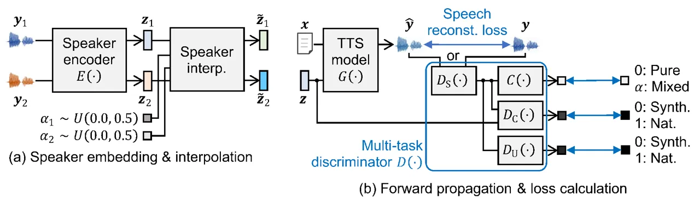

# Multi-Task Adversarial Training Algorithm for Multi-Speaker Neural Text-to-Speech

\authorblockNYusuke Nakai, Yuki Saito, Kenta Udagawa, and Hiroshi
Saruwatari \authorblockAGraduate School of Information Science and
Technology, The University of Tokyo, Japan.  
E-mail: nakai-yusuke@g.ecc.u-tokyo.ac.jp,
yuuki_saito@ipc.i.u-tokyo.ac.jp

###### Abstract

We propose a novel training algorithm for a multi-speaker neural
text-to-speech (TTS) model based on multi-task adversarial training. A
conventional generative adversarial network (GAN)-based training
algorithm significantly improves the quality of synthetic speech by
reducing the statistical difference between natural and synthetic
speech. However, the algorithm does not guarantee the generalization
performance of the trained TTS model in synthesizing voices of unseen
speakers who are not included in the training data. Our algorithm
alternatively trains two deep neural networks: multi-task discriminator
and multi-speaker neural TTS model (i.e., generator of GANs). The
discriminator is trained not only to distinguish between natural and
synthetic speech but also to verify the speaker of input speech is
existent or non-existent (i.e., newly generated by interpolating seen
speakers’ embedding vectors). Meanwhile, the generator is trained to
minimize the weighted sum of the speech reconstruction loss and
adversarial loss for fooling the discriminator, which achieves
high-quality multi-speaker TTS even if the target speaker is unseen.
Experimental evaluation shows that our algorithm improves the quality of
synthetic speech better than a conventional GANSpeech algorithm.

## 1 Introduction

Multi-speaker text-to-speech (TTS) \[1\] is a technology for
synthesizing various speakers’ voices from given text using a computer.
This technology can extend the application range of TTS technology to
personalized voice assistance and data augmentation for
speech-discriminative tasks \[2, 3\]. State-of-the-art multi-speaker
neural TTS, i.e., a machine-learning-based framework for training deep
neural networks (DNNs) \[4, 5\] that represent the TTS mapping, has
enabled synthesizing voices of various speakers comparable to human
speech \[6\]. Such quality improvement has mainly arisen from
developments of epoch-making DNN architectures (e.g.,
Transformer \[7\]), well-designed and sufficiently large multi-speaker
speech corpora \[8, 9, 10\], accurate speaker-identity modeling \[11,
12\], and sophisticated deep generative models \[13, 14, 15\].
Well-trained multi-speaker neural TTS models can be also applied to
practical TTS scenarios such as voice cloning (i.e., reproducing an
unseen speaker’s voice with few utterances) \[16\]. This paper focuses
on the development of an algorithm for training a high-fidelity
multi-speaker neural TTS model.

Generative adversarial networks (GANs) \[13\] are powerful deep
generative models that have significantly improved the quality of
synthetic speech in various TTS-related tasks, such as statistical
parametric TTS \[17, 18\], end-to-end TTS \[19, 20\], and neural
vocoding \[21, 22\]. The quality improvement derives from their
frameworks to adversarially train two DNNs: discriminator and TTS model
(i.e., generator), for learning the distribution of real data.
Specifically, the discriminator is trained to distinguish between
synthetic and natural speech and approximate the divergence (i.e.,
statistical difference) between them. Meanwhile, the generator is
trained to minimize the approximated divergence by fooling the trained
discriminator. This framework can be introduced into the TTS training by
defining the objective function as the weighted sum of speech
reconstruction loss (e.g., L1 or L2 loss between natural and generated
speech parameters) and the adversarial loss for causing the
discriminator to misclassify synthetic speech as natural. As a result,
synthetic speech generated by the trained TTS model successfully
reproduces the fine structures of natural speech parameters that tend to
be over-smoothed by learning to minimize the speech reconstruction loss
only \[23\].

One can extend the GAN-based training algorithm for multi-speaker neural
TTS by conditioning the discriminator and TTS model by speaker
representation. Such representation can be obtained as a one-hot speaker
code \[1\], trainable lookup embedding \[24\], or intermediate vector of
a speaker encoder pretrained on speaker-discriminative tasks (e.g.,
d-vector \[25\] and x-vector \[26\]). Zhao et al. \[27\] proposed an
algorithm to train a multi-speaker neural TTS model conditioned by the
speaker code and defined the training objective as the speech
reconstruction in both mel-spectrogram and waveform domains and the
adversarial loss of the Wasserstein GAN \[28\] with gradient
penalty \[29\]. Kanagawa et al. \[30\] modified the training objective
of a discriminator so that it can classify the speaker identity as well
as distinguish natural/synthetic speech. Yang et al. \[31\] presented
GANSpeech, state-of-the-art multi-speaker neural TTS model based on
FastSpeech 2 \[32\] trained by a GAN-based algorithm incorporating the
joint conditional and unconditional (JCU) discriminator \[33\] and
scaled feature matching loss \[34\]. Although their algorithm achieved
the quality of synthetic speech approaching that of natural speech, it
does not guarantee the generalization performance of the trained TTS
model in synthesizing voices of unseen speakers who are not included in
the training data. The main reason is that the GAN-based algorithm
regards the distribution of natural speech uttered by seen speakers as
the target to be trained and never considers whether the TTS model can
synthesize realistic voices of unseen speakers.

We propose a novel GAN-based multi-task training algorithm for a
multi-speaker neural TTS model that can synthesize high-quality voices
of unseen speakers. Like a GAN-based algorithm, our algorithm
alternatively trains two DNNs: multi-task discriminator and
multi-speaker neural TTS model. The discriminator aims to not only
distinguish between natural and synthetic speech but also verify the
speaker of input speech is existent or non-existent (i.e., newly
generated by interpolating seen speakers’ embedding vectors). Meanwhile,
the TTS model tries to fool the discriminator by minimizing the weighted
sum of the speech reconstruction loss and adversarial loss for fooling
the discriminator. As a result, we can expect the trained TTS model to
synthesize high-quality multi-speaker voices even if the target speaker
is unseen. Experimental evaluation shows that our algorithm improves the
quality of synthetic speech better than a conventional algorithm used in
the training of GANSpeech \[31\].

## 2 Baseline Methods

### 2.1 FastSpeech 2

FastSpeech 2 \[32\] is a non-autoregressive end-to-end TTS model widely
used as the backbone of various TTS methods \[31, 35\]. It performs 1)
phoneme duration prediction and sequence alignment using a duration
predictor and a length regulator, 2) speech feature prediction using
multiple variance adaptors, and 3) mel-spectrogram prediction using a
mel-spectrogram decoder. A trained neural vocoder takes the predicted
mel-spectrogram as input to synthesize a speech waveform. Although the
phoneme alignment information is required in advance for the training,
this TTS model can avoid some crucial inference errors (e.g., looping or
skipping of text in synthetic speech) that often occur in autoregressive
neural TTS methods such as Tacotron2 \[36\].

Let $`\mathcal{X}`$ and $`\mathcal{Y}`$ be a text set consisting of
$`N`$ phoneme sequences $`\{\textrm{\boldmath$x$}_{n}\}_{n=1}^{N}`$ and
a speech set consisting of $`N`$ speech parameter sequences
$`\{\textrm{\boldmath$y$}_{n}\}_{n=1}^{N}`$, respectively. A speech
parameter sequence contains phoneme durations
$`\textrm{\boldmath$y$}_{\rm dur}`$, intermediate features
$`\textrm{\boldmath$y$}_{\rm feat}`$ (e.g., $`F_{0}`$ and energy)
predicted by the variance adaptors, and mel-spectrograms
$`\textrm{\boldmath$y$}_{\rm mel}`$. A FastSpeech 2-based TTS model
$`G(\textrm{\boldmath$\cdot$})`$ parameterized by
$`\textrm{\boldmath$\theta$}^{\mathrm{(G)}}`$ is trained to predict
parameters of synthetic speech $`\textrm{\boldmath$\hat{y}$}_{*}`$ from
$`x`$. The objective function for training the model is given as:

```math
\displaystyle L_{\mathrm{FS2}}^{\mathrm{(G)}}\left(\mathcal{X},\mathcal{Y}\right) \displaystyle=\mathrm{MSE}\left(\textrm{\boldmath$y$}_{\rm dur},\textrm{\boldmath$\hat{y}$}_{\rm dur}\right)+\mathrm{MSE}\left(\textrm{\boldmath$y$}_{\rm feat},\textrm{\boldmath$\hat{y}$}_{\rm feat}\right)
```

```math
\displaystyle+\mathrm{MAE}\left(\textrm{\boldmath$y$}_{\rm mel},\textrm{\boldmath$\hat{y}$}_{\rm mel}\right), \tag{1}
```

where $`\mathrm{MAE}(\textrm{\boldmath$\cdot$})`$ and
$`\mathrm{MSE}(\textrm{\boldmath$\cdot$})`$ denote the mean absolute
error and mean squared error between two given features, respectively.
The model’s parameters $`\textrm{\boldmath$\theta$}^{\mathrm{(G)}}`$ are
optimized by using the mini-batch stochastic gradient descent (SGD)
$`\textrm{\boldmath$\theta$}^{\mathrm{(G)}}\leftarrow\textrm{\boldmath$\theta$}^{\mathrm{(G)}}-\eta\textrm{\boldmath$\nabla$}_{\textrm{\boldmath$\theta$}^{\mathrm{(G)}}}L_{\mathrm{FS2}}^{\mathrm{(G)}}`$
with a learning rate $`\eta>0`$.

### 2.2 Transfer-Learning-Based Multi-Speaker Neural TTS

We adopt Jia et al.’s method \[11\] for building our baseline
multi-speaker neural TTS model. In the training phase, a DNN-based
speaker encoder that extracts speaker embedding from an input speech
waveform is first trained on the objective function of speaker
verification (e.g., minimizing the generalized end-to-end loss \[37\]).
A multi-speaker neural TTS model is then trained to generate speech
parameters from their corresponding phoneme sequence and speaker
embedding $`z`$. In the inference phase, the embedding of a target
speaker, who may be unseen during the training, is first extracted from
reference speech uttered by the speaker. Then, the extracted speaker
embedding and input text are fed into the trained TTS model to generate
the target speaker’s mel-spectrogram.

### 2.3 GANSpeech

GANSpeech \[31\] is the improved version of multi-speaker neural TTS
based on FastSpeech 2, which incorporates the GAN-based training
algorithm to achieve high-quality TTS.

#### 2.3.1 JCU Discriminator

A JCU discriminator $`D(\textrm{\boldmath$\cdot$})`$ parameterized by
$`\textrm{\boldmath$\theta$}^{\mathrm{(D)}}`$ is designed to capture
general characteristics of natural mel-spectrograms and speaker-specific
features of them. Specifically, the discriminator consists of three
sub-modules¹¹ 1 We omit a fully-connected layer to transform speaker
embedding for simplicity.: 1) shared layers
$`D_{\mathrm{S}}(\textrm{\boldmath$\cdot$})`$, 2) conditional layers
$`D_{\mathrm{C}}(\textrm{\boldmath$\cdot$})`$, and 3) unconditional
layers $`D_{\mathrm{U}}(\textrm{\boldmath$\cdot$})`$, to output
conditional and unconditional true/fake predictions, $`t_{\mathrm{C}}`$
and $`t_{\mathrm{U}}`$, from a mel-spectrogram
$`\textrm{\boldmath$y$}_{\mathrm{mel}}`$ and speaker embedding $`z`$.
First, a hidden vector $`\textrm{\boldmath$h$}_{\mathrm{S}}`$ is
extracted by the shared layers from an input natural mel-spectrogram
$`\textrm{\boldmath$y$}_{\mathrm{mel}}`$ as
$`\textrm{\boldmath$h$}_{\mathrm{S}}=D_{\mathrm{S}}(\textrm{\boldmath$y$}_{\mathrm{mel}})`$.
Then, the conditional and unconditional predictions are obtained as
$`t_{\mathrm{C}}=D_{\mathrm{C}}(\textrm{\boldmath$h$}_{\mathrm{S}},\textrm{\boldmath$z$})`$
and
$`t_{\mathrm{U}}=D_{\mathrm{U}}(\textrm{\boldmath$h$}_{\mathrm{S}})`$,
respectively. The same procedure is taken for a synthetic
mel-spectrogram
$`\textrm{\boldmath$\hat{y}$}_{\mathrm{mel}}=G(\textrm{\boldmath$x$})`$,
and predictions $`\hat{t}_{\mathrm{C}}`$ and $`\hat{t}_{\mathrm{U}}`$
are obtained.

The discriminator is trained to distinguish natural speech
$`\textrm{\boldmath$y$}_{\mathrm{mel}}`$ from synthetic speech
$`\textrm{\boldmath$\hat{y}$}_{\mathrm{mel}}`$, with or without the
conditioning by speaker embedding. The objective function is defined as
follows:

```math
\displaystyle\begin{split}L_{\rm GAN}^{\rm(D)}\left(\mathcal{X},\mathcal{Y}\right)&=\frac{1}{2}\left(\left(t_{\mathrm{C}}-1\right)^{2}+\left(t_{\mathrm{U}}-1\right)^{2}\right)\\
&+\frac{1}{2}\left(\hat{t}_{\mathrm{C}}^{2}+\hat{t}_{\mathrm{U}}^{2}\right).\end{split} \tag{2}
```

#### 2.3.2 Adversarial Loss

The TTS model is trained to make the discriminator misclassify synthetic
speech as natural. The adversarial loss to cause the misclassification
is defined as follows:

```math
\displaystyle L_{\rm GAN}^{\rm(G)}\left(\mathcal{X},\mathcal{Y}\right) \displaystyle=\frac{1}{2}\left(\left(\hat{t}_{\mathrm{C}}-1\right)^{2}+\left(\hat{t}_{\mathrm{U}}-1\right)^{2}\right). \tag{3}
```



Figure 1: Overview of proposed algorithm. The variables $`x`$, $`y`$,
and $`z`$ denote text, speech, and speaker embedding, respectively. The
interpolation coefficient $`\alpha`$ is sampled from the uniform
distribution $`U(0.0,0.5)`$.

#### 2.3.3 Scaled Feature Matching Loss

The feature matching loss \[29\] is a well-known strategy to stabilize
the GAN training and improve the quality of generated data. The core
idea is to make the hidden vectors of the discriminator extracted by
generated data $`\textrm{\boldmath$\hat{h}$}_{l}`$ close to those of
real data $`\textrm{\boldmath$h$}_{l}`$ by minimizing the following
loss:

```math
\displaystyle L_{\rm FM}^{\rm(G)}\left(\mathcal{X},\mathcal{Y}\right) \displaystyle=\sum_{l=1}^{L}\frac{1}{N_{l}}\lVert\textrm{\boldmath$\hat{h}$}_{l}-\textrm{\boldmath$h$}_{l}\rVert_{1}, \tag{4}
```

where $`N_{l}`$ denotes the number of elements in the $`l`$th hidden
layer. In the GANSpeech training, a hyperparameter $`\lambda_{\rm FM}`$
to control the importance of feature matching is dynamically adjusted in
accordance with the magnitude of reconstruction loss as
$`\lambda_{\rm FM}\leftarrow L_{\rm FS2}^{\rm(G)}/L_{\rm FM}^{\rm(G)}`$.

#### 2.3.4 GANSpeech Algorithm

The GANSpeech algorithm consists of three phases: 1) TTS model
pretraining, 2) discriminator update, and 3) TTS model update. First,
the TTS model is pretrained by minimizing the reconstruction loss
$`L_{\rm FS2}^{\rm(G)}`$ only. Then, the two DNNs,
$`D(\textrm{\boldmath$\cdot$})`$ and $`G(\textrm{\boldmath$\cdot$})`$,
are alternatively trained. Specifically, the discriminator is updated as
$`\textrm{\boldmath$\theta$}^{\mathrm{(D)}}\leftarrow\textrm{\boldmath$\theta$}^{\mathrm{(D)}}-\eta\textrm{\boldmath$\nabla$}_{\textrm{\boldmath$\theta$}^{\mathrm{(D)}}}L_{\mathrm{GAN}}^{\mathrm{(D)}}`$,
and the TTS model is trained to fool the updated discriminator as
$`\textrm{\boldmath$\theta$}^{\mathrm{(G)}}\leftarrow\textrm{\boldmath$\theta$}^{\mathrm{(G)}}-\eta\textrm{\boldmath$\nabla$}_{\textrm{\boldmath$\theta$}^{\mathrm{(G)}}}L_{\mathrm{Total}}^{\mathrm{(G)}}`$,
where the total loss for training the TTS model is given as
$`L_{\rm Total}^{\rm(G)}=L_{\rm FS2}^{\rm(G)}+L_{\rm GAN}^{\rm(G)}+\lambda_{\rm FM}L_{\rm FM}^{\rm(G)}`$.

## 3 Propose Algorithm

As mentioned in Section 1, the GAN-based training algorithm for
multi-speaker neural TTS does not guarantee that the trained model can
synthesize high-quality speech of unseen speakers. To deal with the
issue, we propose a novel algorithm for a multi-speaker neural TTS model
to improve the quality of unseen speaker’s synthetic speech.

### 3.1 Adversarially Constrained Autoencoder Interpolation (ACAI)

The ACAI algorithm \[38\] aims to learn an autoencoder that can generate
realistic data from the convex combination of two latent variables. The
encoder $`E(\textrm{\boldmath$\cdot$})`$ extracts a latent variable
(i.e., embedding) $`z`$ from input data $`y`$, and the decoder
$`G(\textrm{\boldmath$\cdot$})`$ reconstructs the data $`y`$ from $`e`$.
In addition to this autoencoding process,
$`\textrm{\boldmath$\hat{y}$}=G(E(\textrm{\boldmath$y$}))`$, a critic
$`C(\textrm{\boldmath$\cdot$})`$ regularizes the autoencoder so that
interpolation between two embedding vectors also provides realistic data
by decoding. This regularization is formulated as the adversarial
training between the autoencoder and critic. The critic is trained to
minimize the following loss function:

```math
\displaystyle L_{\rm ACAI}^{\rm(C)}\left(\mathcal{Y}\right) \displaystyle=\lVert C\left(\textrm{\boldmath$y$}\right)\rVert_{2}^{2}+\lVert C\left(\textrm{\boldmath$\tilde{y}$}_{\alpha}\right)-\alpha\rVert_{2}^{2}, \tag{5}
```

where $`\tilde{y}`$ is decoded from the interpolated embedding with an
interpolation coefficient $`\alpha\sim U(0.0,0.5)`$ as
$`G(\alpha E(\textrm{\boldmath$y$}_{1})+(1-\alpha)E(\textrm{\boldmath$y$}_{2}))`$.
The first and second terms enforce that the critic outputs $`\alpha=0`$
for pure data without interpolation²² 2 To stabilize the training in
initial stage, the original algorithm mixes true data and reconstructed
data with a coefficient $`\gamma`$ and regards it as the
non-interpolated data \[38\]. Our algorithm omits this process because
it first pretrains the decoder (i.e., TTS model) without any adversarial
constraints. and predicts the mixing coefficient of interpolated data,
respectively. Meanwhile, the autoencoder is trained to minimize the
following loss function:

```math
\displaystyle L_{\rm ACAI}^{\rm(E,G)}\left(\mathcal{Y}\right) \displaystyle=\lVert\textrm{\boldmath$y$}-G\left(E\left(\textrm{\boldmath$y$}\right)\right)\rVert_{2}^{2}+\lambda_{\rm ACAI}\lVert C\left(\textrm{\boldmath$\tilde{y}$}\right)\rVert_{2}^{2}, \tag{6}
```

where $`\lambda_{\rm ACAI}`$ is a hyperparameter to control the effect
of the second term that makes the critic recognize the interpolated data
as non-interpolated one.

### 3.2 Multi-Task Adversarial Training Algorithm

We introduce the ACAI-derived regularization term to the GANSpeech
algorithm for training a multi-speaker neural TTS model. Specifically,
we regard a pre-trained speaker encoder and the TTS model as an encoder
$`E(\textrm{\boldmath$\cdot$})`$ and decoder
$`G(\textrm{\boldmath$\cdot$})`$ used in the ACAI algorithm,
respectively. Furthermore, we extend the JCU discriminator used in
GANSpeech to a multi-task discriminator $`D(\textrm{\boldmath$\cdot$})`$
that simultaneously predicts 1) true or fake of input mel-spectrogram
with/without conditioning by speaker embedding and 2) coefficient of
speaker interpolation. Figure 1 shows the overview of our algorithm. Our
algorithm requires additional computation in training due to the
multi-task discrimination by $`D(\textrm{\boldmath$\cdot$})`$ but does
not increase the inference time.

#### 3.2.1 Multi-Task Discriminator

Our multi-task discriminator consists of four sub-modules: the three
layers included in the JCU discriminator of GANSpeech (i.e.,
$`D_{\mathrm{S}}(\textrm{\boldmath$\cdot$})`$,
$`D_{\mathrm{C}}(\textrm{\boldmath$\cdot$})`$, and
$`D_{\mathrm{U}}(\textrm{\boldmath$\cdot$})`$) and ACAI-derived critic
layers $`C(\textrm{\boldmath$\cdot$})`$. The critic layers predicts the
speaker interpolation coefficient of input mel-spectrogram
$`\hat{\alpha}`$ from the hidden vector
$`\textrm{\boldmath$h$}^{\rm(S)}`$ extracted by the shared layers
$`D_{\mathrm{S}}(\textrm{\boldmath$\cdot$})`$.

#### 3.2.2 Forward Propagation

Let
$`\textrm{\boldmath$X$}=[\textrm{\boldmath$x$}_{1},\textrm{\boldmath$x$}_{2},\ldots,\textrm{\boldmath$x$}_{M}]\in\mathcal{X}`$
and
$`\textrm{\boldmath$Y$}=[\textrm{\boldmath$y$}_{1},\textrm{\boldmath$y$}_{2},\ldots,\textrm{\boldmath$y$}_{M}]\in\mathcal{Y}`$
be mini-batches containing $`M`$ phoneme sequences and speech
parameters, respectively. In the forward propagation during the
training, our algorithm takes the following processes.

Speaker embedding extraction and interpolation: The speaker encoder
first extracts speaker embeddings
$`\textrm{\boldmath$Z$}=[\textrm{\boldmath$z$}_{1},\textrm{\boldmath$z$}_{2},\ldots,\textrm{\boldmath$z$}_{M}]`$
from the speech parameters as
$`\textrm{\boldmath$Z$}=E(\textrm{\boldmath$Y$})`$. Then, interpolation
coefficients for each embedding
$`\textrm{\boldmath$\alpha$}=[\alpha_{1},\alpha_{2},\ldots,\alpha_{M}]^{\top}`$
are sampled from $`\mathrm{Uniform}(0.0,0.5)`$. Finally, interpolated
speaker embedding
$`\textrm{\boldmath$\tilde{Z}$}=[\textrm{\boldmath$\tilde{z}$}_{1},\textrm{\boldmath$\tilde{z}$}_{2},\ldots,\textrm{\boldmath$\tilde{z}$}_{M}]`$
are calculated by using the convex combinations of the original
embeddings $`Z`$ and their reversed vectors, i.e.,
$`\textrm{\boldmath$\tilde{z}$}_{m}=\alpha_{m}\textrm{\boldmath$z$}_{m}+(1-\alpha_{m})\textrm{\boldmath$z$}_{M-m+1}`$
for $`m=1,2,\ldots,M`$.

Multi-speaker TTS: The TTS model generates $`2M`$ speech parameters,
$`\textrm{\boldmath$\hat{Y}$}=[\textrm{\boldmath$\hat{y}$}_{1},\textrm{\boldmath$\hat{y}$}_{2},\ldots,\textrm{\boldmath$\hat{y}$}_{M}]`$
and
$`\textrm{\boldmath$\tilde{Y}$}=[\textrm{\boldmath$\tilde{y}$}_{1},\textrm{\boldmath$\tilde{y}$}_{2},\ldots,\textrm{\boldmath$\tilde{y}$}_{M}]`$,
from input texts $`X`$ paired with original speaker embeddings $`Z`$ and
interpolated ones $`\tilde{Z}`$ as
$`\textrm{\boldmath$\hat{Y}$}=G(\textrm{\boldmath$X$},\textrm{\boldmath$Z$})`$
and
$`\textrm{\boldmath$\tilde{Y}$}=G(\textrm{\boldmath$X$},\textrm{\boldmath$\tilde{Z}$})`$,
respectively. The natural and generated speech parameters are used for
the computation of speech reconstruction loss $`L_{\rm FS2}^{\rm(G)}`$
shown in Eq. (1).

Multi-task discrimination: The discriminator outputs six scalar values:
true/fake predictions for { natural, generated } mel-spectrograms {
with, without } conditioning by speaker embeddings and speaker
interpolation coefficients for { pure, speaker-interpolated }
mel-spectrograms. These values are used for the computation of the
objective function
$`L_{\rm MT}^{\rm(D)}=L_{\rm GAN}^{\rm(D)}+L_{\rm ACAI}^{\rm(D)}`$,
i.e., the sum of Eqs. (2) and (5).

#### 3.2.3 Backward Propagation and Model Update

The discriminator is first updated to minimize the multi-task
discrimination loss $`L_{\rm MT}^{\rm(D)}`$ as
$`\textrm{\boldmath$\theta$}^{\mathrm{(D)}}\leftarrow\textrm{\boldmath$\theta$}^{\mathrm{(D)}}-\eta\textrm{\boldmath$\nabla$}_{\textrm{\boldmath$\theta$}^{\mathrm{(D)}}}L_{\mathrm{MT}}^{\mathrm{(D)}}`$.
The TTS model is then updated to fool the updated discriminator by
minimizing
$`L_{\rm MT}^{\rm(G)}=L_{\rm Total}^{\rm(G)}+\lambda_{\rm ACAI}\lVert C(D_{\rm S}(\textrm{\boldmath$\tilde{y}$}))\rVert_{2}^{2}`$
as
$`\textrm{\boldmath$\theta$}^{\mathrm{(G)}}\leftarrow\textrm{\boldmath$\theta$}^{\mathrm{(G)}}-\eta\textrm{\boldmath$\nabla$}_{\textrm{\boldmath$\theta$}^{\mathrm{(G)}}}L_{\mathrm{MT}}^{\mathrm{(G)}}`$.
Note that the speaker encoder is not updated because we focus on the
effect of adversarial training only, not the fine-tuning of the encoder.

## 4 Experiments

### 4.1 Experimental Conditions

For training a speaker encoder, we used the Corpus of Spontaneous
Japanese (CSJ) \[39\] containing 660 hours of speech data from 1,417
Japanese speakers (947 men and 470 women). The CSJ speech data were
resampled to 16 kHz, and the frame shift was set to 10 ms. For training,
validating, and evaluating a multi-speaker neural TTS model, we used the
“parallel100” subset of the Japanese Versatile Speech (JVS)
corpus \[9\]. The subset contains 22 hours of speech data from 100
Japanese speakers (49 men and 51 women; 100 sentences per speaker). The
ratio for each of training, validation, and test data was 0.8, 0.1, and
0.1, respectively. Referring to Udagawa et al.’s study \[40\], we
regarded the following four speakers: “jvs078,” “jvs060,” ”jvs005,” and
“jvs010” as unseen speakers during the training. The JVS speech data
were resampled to 22.05 kHz to match the settings of neural vocoding,
and the frame shift was set to 12 ms.

We used the open source implementation of FastSpeech 2 \[32\] published
by Wataru-Nakata³³ 3 https://github.com/Wataru-Nakata/FastSpeech2-JSUT
for building our TTS model. The TTS model predicted 80-dimensional
mel-spectrogram from Japanese phonemes with the aid of the variance
adaptors that predicted the $`F_{0}`$ and energy of synthetic speech.
The $`F_{0}`$ was estimated using the WORLD vocoder \[41, 42\]. In the
FastSpeech 2 training, we used the Adam optimizer \[43\] with 4,000
Warmup \[44\] steps, initial learning rate of 0.0625, batch size of 8,
and 30,000 training steps.

The DNN architecture architecture of a speaker encoder was the same as
that used in Jia et al.’s method \[11\]. The dimensionality of speaker
embeddings was 256. In the speaker-encoder training, we used the Adam
optimizer with a learning rate of 0.0001, batch size of 8, and 1,000,000
training step.

Our multi-task discriminator had a structure of its DNN architecture
similar to that of the JCU discriminator in GANSpeech \[31\].
Specifically, it consists a stack of 1D convolutional (Conv1D) layers
with the parameters of convolution operations
$`\mathrm{Conv1D}(c,k,s)`$, where $`c`$, $`k`$, and $`s`$ denote the
number of output channels, kernel size, and stride width, respectively.
The activation functions for hidden and output layers were leaky
ReLU \[45\] and sigmoid, respectively. The
$`D_{\rm S}(\textrm{\boldmath$\cdot$})`$ had three Conv1D layers:
$`\mathrm{Conv1D}(64,3,1)`$, $`\mathrm{Conv1D}(128,5,2)`$, and
$`\mathrm{Conv1D}(512,5,2)`$. The other sub-modules,
$`D_{\rm C}(\textrm{\boldmath$\cdot$})`$,
$`D_{\rm U}(\textrm{\boldmath$\cdot$})`$, and
$`C(\textrm{\boldmath$\cdot$})`$, were all consisted of two Conv1D
layers: $`\mathrm{Conv1D}(128,5,2)`$ and $`\mathrm{Conv1D}(1,3,1)`$,
except for conditioning by speaker embedding in
$`D_{\rm C}(\textrm{\boldmath$\cdot$})`$.

The neural vocoder for synthesizing speech waveform was the
“generator_universal model” of HiFi-GAN \[46\] included in the
FastSpeech 2 repository published by ming024⁴⁴ 4
https://github.com/ming024/FastSpeech2. We did not finetune the HiFi-GAN
on Japanese speech data.

### 4.2 Subjective Evaluations

We evaluated the performance of our algorithm on two TTS tasks: 1) TTS
for seen speakers and 2) voice cloning for unseen speakers. We compared
the following three algorithms:

1.  1.  FS2: Minimizing $`L_{\rm FS2}^{\rm(G)}`$ (Eq. (1)) only \[32\]
2.  2.  GAN: Minimizing
        $`L_{\rm Total}^{\rm(G)}=L_{\rm FS2}^{\rm(G)}+L_{\rm GAN}^{\rm(G)}+\lambda_{\rm FM}L_{\rm FM}^{\rm(G)}`$
        (i.e., the GANSpeech algorithm \[31\])
3.  3.  MT: Minimizing
        $`L_{\rm MT}^{\rm(G)}=L_{\rm Total}^{\rm(G)}+\lambda_{\rm ACAI}\lVert C(D_{\rm S}(\textrm{\boldmath$\tilde{y}$}))\rVert_{2}^{2}`$
        (i.e., the proposed algorithm)

We chose the hyperparameter $`\lambda_{\rm ACAI}=1.0`$ empirically.
Speech samples used for the evaluation are available on
http://sython.org/demo/nakai22apsipa/demo.html.

#### 4.2.1 TTS for Seen Speakers

We conducted the five-level mean opinion score (MOS) and degradation MOS
(DMOS) tests to evaluate the naturalness and speaker similarity of
synthetic speech using the test data of 96 seen speakers, respectively.
In the DMOS test, natural speech uttered by a speaker to be synthesized
was used as the reference for evaluating the similarity. For each test,
we recruited 50 listeners who evaluated the quality of speech samples
using our crowdsourced subjective evaluation system. Each listener
evaluated 15 speech samples whose speakers were randomized.

| Algorithm | Naturalness MOS   | Speaker similarity DMOS |
| --------- | ----------------- | ----------------------- |
| FS2       | 3.18 $`\pm`$ 0.12 | 3.57 $`\pm`$ 0.12       |
| GAN       | 3.52 $`\pm`$ 0.12 | 3.79 $`\pm`$ 0.12       |
| MT        | 3.55 $`\pm`$ 0.12 | 3.87 $`\pm`$ 0.12       |

Table 1: Subjective evaluation results with their 95% confidence
intervals (TTS for seen speakers)

Table 1 shows the evaluation results. From this table, we observe
that 1) “GAN” and “MT” significantly outperform “FS2” and 2) “MT”
achieves similar performance to “GAN.” These results demonstrate that
our multi-task adversarial training algorithm can keep the performance
of the conventional GANSpeech algorithm for TTS of seen speakers.

#### 4.2.2 Voice Cloning for Unseen Speakers

We also evaluated the performance of our algorithm for voice cloning of
unseen speakers and conducted the MOS and DMOS tests. The conditions of
the evaluation, i.e., the numbers of listeners and speech samples, were
the same as those in Section 4.2.1. The speaker embeddings of the unseen
speakers were estimated by utterance-wise.

| Algorithm | Naturalness MOS   | Speaker similarity DMOS |
| --------- | ----------------- | ----------------------- |
| FS2       | 3.13 $`\pm`$ 0.12 | 2.38 $`\pm`$ 0.12       |
| GAN       | 3.38 $`\pm`$ 0.12 | 2.40 $`\pm`$ 0.13       |
| MT        | 3.50 $`\pm`$ 0.12 | 2.48 $`\pm`$ 0.12       |

Table 2: Subjective evaluation results with their 95% confidence
intervals (TTS for unseen speakers)

Table 2 shows the evaluation results. From this table, we confirm that
“MT” achieves the highest MOS and DMOS values among the three
algorithms, which suggests that our multi-task adversarial training
algorithm can mitigate the degradation of speech naturalness in the
voice cloning task and successfully improve the naturalness better than
the conventional GANSpeech algorithm. However, we observe that there is
a still large gap between the DMOS values of synthetic speech in seen
speakers’ TTS (the third column of Table 1) and those of cloned speech.
This result indicates that the ACAI-derived regularization is
insufficient to diversify the variation of speakers and another approach
such as speaker generation \[47\] may be necessary for the absolute
improvement of speaker similarity.

## 5 Conclusion

We proposed a GAN-based multi-task training algorithm for a
multi-speaker neural TTS model that can synthesize high-quality voices
of unseen speakers. Our algorithm alternatively trains two DNNs:
multi-task discriminator and multi-speaker neural TTS model. The
discriminator aims to not only distinguish between natural and synthetic
speech but also verify the speaker of input speech is existent or
non-existent (i.e., newly generated by interpolating seen speakers’
embedding vectors). Meanwhile, the TTS model tries to fool the
discriminator by minimizing the weighted sum of the speech
reconstruction loss and adversarial loss for fooling the discriminator.
Experimental evaluation showed that our algorithm improved the quality
of synthetic speech better than a conventional algorithm used in the
training of GANSpeech. In future work, we will investigate how to
improve the speaker similarity of synthetic speech in voice cloning and
conduct TTS experiments for other languages.

## Acknowledgment

This work was supported by JST, Moonshot R&D Grant Number JPMJPS2011
(algorithm development) and JSPS KAKENHI Grant Number 21K21305
(practical experiment).

## References

- \[1\] N. Hojo, Y. Ijima, and H. Mizuno, “DNN-based speech synthesis
  using speaker codes,” IEICE Transactions on Information and Systems,
  vol. E101-D, no. 2, pp. 462–472, Feb. 2018.
- \[2\] S. Ueno, M. Mimura, S. Sakai, and T. Kawahara, “Multi-speaker
  sequence-to-sequence speech synthesis for data augmentation in
  acoustic-to-word speech recognition,” in Proc. ICASSP, Brighton, U.
  K., May 2019, pp. 6161–6165.
- \[3\] J. Pelecanos Y. Huang, Y. Chen and Q. Wang, “Synth2Aug:
  Cross-domain speaker recognition with TTS synthesized speech,” in
  Proc. SLT, Shenzhen, China, Jan. 2021, pp. 316–322.
- \[4\] H. Zen, A. Senior, and M. Schuster, “Statistical parametric
  speech synthesis using deep neural networks,” in Proc. ICASSP,
  Vancouver, Canada, May 2013, pp. 7962–7966.
- \[5\] A. Oord, S. Dieleman, H. Zen, K. Simonyan, O. Vinyals,
  A. Graves, N. Kalchbrenner, A. Senior, and K. Kavukcuoglu, “WaveNet: A
  generative model for raw audio,” arXiv, vol. abs/1609.03499, 2016.
- \[6\] E. Casanova, J. Weber, C. D. Shulby, A. C. Junior, E. Gölge, and
  M. A. Ponti, “YourTTS: Towards zero-shot multi-speaker TTS and
  zero-shot voice conversion for everyone,” in Proc. ICML, Baltimore,
  U.S.A., Jul. 2022, pp. 2709–2720.
- \[7\] N. Parmar J. Uszkoreit L. Jones A. N. Gomez L. Kaiser
  A. Vaswani, N. Shazeer and I. Polosukhin, “Attention is all you need,”
  in Proc. NIPS, Long Beach, U.S.A., Dec. 2017.
- \[8\] H. Zen, V. Dang, R. Clark, Y. Zhang, R. J. Weiss, Y. Jia,
  Z. Chen, and Y. Wu, “LibriTTS: A corpus derived from LibriSpeech for
  text-to-speech,” in Proc. INTERSPEECH, Graz, Austria, Sep. 2019, pp.
  1526–1530.
- \[9\] S. Takamichi, R. Sonobe, K. Mitsui, Y. Saito, T. Koriyama,
  N. Tanji, and H. Saruwatari, “JSUT and JVS: Free Japanese voice
  corpora for accelerating speech synthesis research,” Acoustical
  Science and Technology, vol. 41, no. 5, pp. 761–768, Sep. 2020.
- \[10\] Y. Shi, H. Bu, X. Xu, S. Zhang, and M. Li, “AISHELL-3: A
  multi-speaker Mandarin TTS corpus,” in Proc. INTERSPEECH, Brno, Czech
  Republic, Sep. 2021, pp. 2756–2760.
- \[11\] Y. Jia, Y. Zhang, R. Weiss, Q. Wang, J. Shen, F. Ren, Z. Chen,
  P. Nguyen, R. Pang, I. L. Moreno, and Y. Wu, “Transfer learning from
  speaker verification to multispeaker text-to-speech synthesis,” in
  Proc. NeurIPS, Montreal, Canada, Dec. 2018, pp. 4480–4490.
- \[12\] E. Cooper, C.-I Lai, Y. Yasuda, F. Fang, X. Wang, N. Chen, and
  J. Yamagishi, “Zero-shot multi-speaker text-to-speech with
  state-of-the-art neural speaker embeddings,” in Proc. ICASSP,
  Barcelona, Spain, May 2020, pp. 6184–6188.
- \[13\] I. Goodfellow, J. Pouget-Abadie, M. Mirza, B. Xu,
  D. Warde-Farley, S. Ozair, A. Courville, and Y. Bengio, “Generative
  adversarial nets,” in Proc. NIPS, Montreal, Canada, Dec. 2014, pp.
  2672–2680.
- \[14\] D. P. Kingma and M. Welling, “Auto-encoding variational Bayes,”
  arXiv, vol. abs/1312.6114, 2013.
- \[15\] J. Ho, A. Jain, and P. Abbeel, “Denoising diffusion
  probabilistic models,” in Proc. NeurIPS, Vancouver, Canada, Dec. 2020.
- \[16\] S. O. Arik, J. Chen, K. Peng, W. Ping, and Y. Zhou, “Neural
  voice cloning with a few samples,” in Proc. NeurIPS, Montreal, Canada,
  Dec. 2018, pp. 10019–10029.
- \[17\] Y. Saito, S. Takamichi, and H. Saruwatari, “Statistical
  parametric speech synthesis incorporating generative adversarial
  networks,” IEEE/ACM Transactions on Audio, Speech, and Language
  Processing, vol. 26, no. 1, pp. 84–96, Jan. 2018.
- \[18\] T. Kaneko, H. Kameoka, N. Hojo, Y. Ijima, K. Hiramatsu, and
  K. Kashino, “Generative adversarial network-based postfilter for
  statistical parametric speech synthesis,” in Proc. ICASSP, New
  Orleans, U.S.A., Mar. 2017, pp. 4910–4914.
- \[19\] J. Donahue, S. Dieleman, M. Binkowski, E. Elsen, and
  K. Simonyan, “End-to-end adversarial text-to-speech,” in Proc. ICLR,
  Vienna, Austria, May 2021.
- \[20\] J. Kim, J. Kong, and J. Son, “Conditional variational
  autoencoder with adversarial learning for end-to-end text-to-speech,”
  in Proc. ICML, Virtual Conference, Jun. 2021, pp. 5530–5540.
- \[21\] K. Kumar, R. Kumar, T. de Boissiere, L. Gestin, W. Z. Teoh,
  J. Sotelo, A. de Brébisson, Y. Bengio, and A. C. Courville, “MelGAN:
  Generative adversarial networks for conditional waveform synthesis,”
  in Proc. NeurIPS, Vancouver, Canada, Dec. 2019, pp. 14881–14892.
- \[22\] R. Yamamoto, E. Song, and J. Kim, “Parallel WaveGAN: a fast
  waveform generation model based on generative adversarial networks
  with multi-resolution spectrogram,” in Proc. ICASSP, Barcelona, Spain,
  May 2020, pp. 6199–6203.
- \[23\] T. Toda, A. W. Black, and K. Tokuda, “Voice conversion based on
  maximum likelihood estimation of spectral parameter trajectory,” IEEE
  Transactions on Audio, Speech, and Language Processing, vol. 15, no.
  8, pp. 2222–2235, Nov. 2007.
- \[24\] S. O. Arik, G. Diamosy, A. Gibiansky, J. Miller, K. Peng,
  W. Ping, J. Raiman, and Y. Zhou, “Deep Voice 2: Multi-speaker neural
  text-to-speech,” in Proc. NIPS, Red Hook, New York, U.S.A., May 2017,
  pp. 2966–2974.
- \[25\] E. Variani, X. Lei, E. McDermott, I. L. Moreno, and
  J. Gonzalez-Dominguez, “Deep neural networks for small footprint
  text-dependent speaker verification,” in Proc. ICASSP, Florence,
  Italy, May 2014, pp. 4080–4084.
- \[26\] D. Snyder, D. Garcia-Romero, G. Sell, D. Povey, and
  S. Khudanpur, “X-vectors: robust DNN embeddings for speaker
  recognition,” in Proc. ICASSP, Alberta, Canada, Apr. 2018, pp.
  5329–5333.
- \[27\] Y. Zhao, S. Takaki, H.-T. Luong, J. Yamagishi, D. Saito, and
  N. Minematsu, “Wasserstein GAN and waveform loss-based acoustic model
  training for multi-speaker text-to-speech synthesis systems using a
  WaveNet vocoder,” IEEE Access, vol. 6, pp. 60478–60488, Sep. 2018.
- \[28\] M. Arjovsky, S. Chintala, and L. Bottou, “Wasserstein GAN,”
  arXiv, vol. abs/1701.07875, 2017.
- \[29\] I. Gulrajani, F. Ahmed, M. Arjovsky, V. Dumoulin, and
  A. Courville, “Improved training of Wasserstein GANs,” in Proc. NIPS,
  Long Beach, U.S.A., Dec. 2017.
- \[30\] H. Kanagawa and Y. Ijima, “Multi-speaker modeling for DNN-based
  speech synthesis incorporating generative adversarial networks,” in
  Proc. SSW, Vienna, Austria, Sep. 2019, pp. 40–44.
- \[31\] J. Yang, J.-S. Bae, T. Bak, Y. Kim, and H.-Y. Cho, “GANSpeech:
  Adversarial training for high-fidelity multi-speaker speech
  synthesis,” in Proc. INTERSPEECH, Brno, Czech Republic, Sep. 2021, pp.
  2202–2206.
- \[32\] Y. Ren, C. Hu, X. Tan, T. Qin, S. Zhao, Z. Zhao, and T.-Y. Liu,
  “FastSpeech 2: Fast and high-quality end-to-end text to speech,” in
  Proc. ICLR, Vienna, Austria, May 2021.
- \[33\] H. Zhang, H. Li T. Xu, S, Zhang, X. Wang, X. Huang, and D. N.
  Metaxas, “StackGAN++: Realistic image synthesis with stacked
  generative adversarial networks,” IEEE Transactions on Pattern
  Analysis and Machine Intelligence, vol. 41, no. 8, pp. 1947–1962,
  Jul. 2018.
- \[34\] T. Salimans, I. Goodfellow, W. Zaremba, V. Cheung, A. Radford,
  and X. Chen, “Improved techniques for training GANs,” in Proc. NIPS,
  Barcelona, Spain, Dec. 2016, pp. 2234–2242.
- \[35\] Y. Nishimura, Y. Saito, S. Takamichi, K. Tachibana, and
  H. Saruwatari, “Acoustic modeling for end-to-end empathetic dialogue
  speech synthesis using linguistic and prosodic contexts of dialogue
  history,” in Proc. INTERSPEECH, Incheon, South Korea, Sep. 2022, pp.
  xxxx–xxxx, (ACCEPTED).
- \[36\] J. Shen, R. Pang, R. J. Weiss, M. Schuster, N. Jaitly, Z. Yang,
  Z. Chen, Y. Zhang, Y. Wang, RJ Skerry-Ryan, R. A. Saurous,
  Y. Agiomyrgiannakis, and Y. Wu, “Natural TTS synthesis by conditioning
  WaveNet on mel spectrogram predictions,” in Proc. ICASSP, Calgary,
  Canada, Apr. 2018, pp. 4779–4783.
- \[37\] L. Wan, Q. Wang, A. Papir, and I. L. Moreno, “Generalized
  end-to-end loss for speaker verification,” in Proc. ICASSP, Alberta,
  Canada, Apr. 2018, pp. 4879–4883.
- \[38\] D. Berthelot, C. Raffel, A. Roy, and I. Goodfellow,
  “Understanding and improving interpolation in autoencoders via an
  adversarial regularizer,” in Proc. ICLR, New Orleans, U.S.A.,
  May 2019.
- \[39\] K. Maekawa, “Corpus of spontaneous Japanese: Its design and
  evaluation,” in Proc. SSPR, Tokyo, Japan, Apr. 2003, pp. 7–12.
- \[40\] K. Udagawa, Y. Saito, and H. Saruwatari, “Human-in-the-loop
  speaker adaptation for DNN-based multi-speaker TTS,” in Proc.
  INTERSPEECH, Incheon, South Korea, Sep. 2022, pp. xxxx–xxxx,
  (ACCEPTED).
- \[41\] M. Morise, F. Yokomori, and K. Ozawa, “WORLD: a vocoder-based
  high-quality speech synthesis system for real-time applications,”
  IEICE Transactions on Information and Systems, vol. E99-D, no. 7, pp.
  1877–1884, 2016.
- \[42\] M. Morise, “D4C, a band-aperiodicity estimator for high-quality
  speech synthesis,” Speech Communication, vol. 84, pp. 57–65,
  Nov. 2016.
- \[43\] D. Kingma and B. Jimmy, “Adam: A method for stochastic
  optimization,” in arXiv preprint arXiv:1412.6980, 2014.
- \[44\] Priya Goyal, Piotr Dollár, Ross B. Girshick, P. Noordhuis,
  Lukasz Wesolowski, Aapo Kyrola, Andrew Tulloch, Y. Jia, and Kaiming
  He, “Accurate, large minibatch SGD: Training imagenet in 1 hour,”
  arXiv, vol. abs/1706.02677, 2017.
- \[45\] A. L. Maas, A. Y. Hannun, and A. Y. Ng, “Rectifier
  nonlinearities improve neural network acoustic models,” in Proc. ICML,
  Atlanta, U.S.A., Jun. 2013.
- \[46\] J. Kong, J. Kim, and J. Bae, “HiFi-GAN: Generative adversarial
  networks for efficient and high fidelity speech synthesis,” in Proc.
  NeurIPS, Vancouver, Canada, Dec. 2020.
- \[47\] D. Stanton, M. Shannon, S. Mariooryad, RJ Skerry-Ryan,
  E. Battenberg, T. Bagby, and D. Kao, “Speaker generation,” in Proc.
  ICASSP, Singapore, May 2022, pp. 7897–7901.
