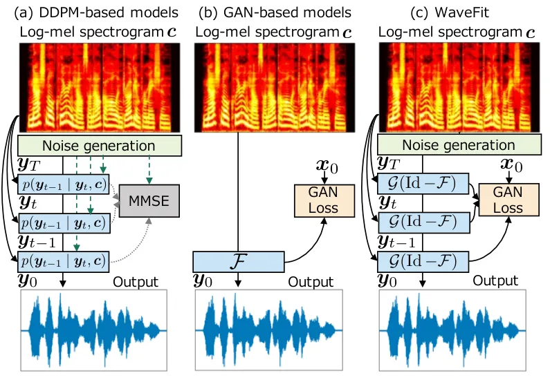
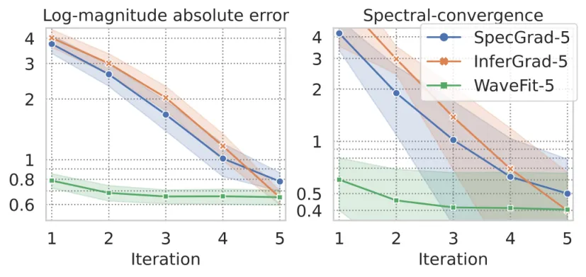

# WaveFit: An Iterative and Non-autoregressive Neural Vocoder based on Fixed-Point Iteration

Yuma Koizumi,  Kohei Yatabe,  Heiga Zen,  Michiel Bacchiani

###### Abstract

Denoising diffusion probabilistic models (DDPMs) and generative
adversarial networks (GANs) are popular generative models for neural
vocoders. The DDPMs and GANs can be characterized by the iterative
denoising framework and adversarial training, respectively. This study
proposes a fast and high-quality neural vocoder called WaveFit, which
integrates the essence of GANs into a DDPM-like iterative framework
based on fixed-point iteration. WaveFit iteratively denoises an input
signal, and trains a deep neural network (DNN) for minimizing an
adversarial loss calculated from intermediate outputs at all iterations.
Subjective (side-by-side) listening tests showed no statistically
significant differences in naturalness between human natural speech and
those synthesized by WaveFit with five iterations. Furthermore, the
inference speed of WaveFit was more than 240 times faster than WaveRNN.
Audio demos are available at
[google.github.io/df-conformer/wavefit/](https://google.github.io/df-conformer/wavefit/).

###### Index Terms: 

Neural vocoder, fixed-point iteration, generative adversarial networks,
denoising diffusion probabilistic models.

^(†)^(†)address: ¹Google Research, Japan   ²Tokyo University of
Agriculture and Technology, Japan

## 1 Introduction

Neural vocoders \[1, 2, 3, 4\] are artificial neural networks that
generate a speech waveform given acoustic features. They are
indispensable building blocks of recent applications of speech
generation. For example, they are used as the backbone module in
text-to-speech (TTS) \[5, 6, 7, 8, 9, 10\], voice conversion \[11, 12\],
speech-to-speech translation (S2ST) \[13, 14, 15\], speech enhancement
(SE) \[16, 17, 18, 19\], speech restoration \[20, 21\], and speech
coding \[22, 23, 24, 25\]. Autoregressive (AR) models first
revolutionized the quality of speech generation \[26, 1, 27, 28\].
However, as they require a large number of sequential operations for
generation, parallelizing the computation is not trivial thus their
processing time is sometimes far longer than the duration of the output
signals.

To speed up the inference, non-AR models have gained a lot of attention
thanks to their parallelization-friendly model architectures. Early
successful studies of non-AR models are those based on normalizing
flows \[29, 3, 4\] which convert an input noise to a speech using
stacked invertible deep neural networks (DNNs) \[30\]. In the last few
years, the approach using generative adversarial networks (GANs) \[31\]
is the most successful non-AR strategy \[32, 33, 34, 35, 36, 37, 38, 39,
40, 41\] where they are trained to generate speech waveforms
indistinguishable from human natural speech by discriminator networks.
The latest member of the generative models for neural vocoders is the
denoising diffusion probabilistic model (DDPM) \[42, 43, 44, 45, 46, 47,
48, 49\], which converts a random noise into a speech waveform by the
iterative sampling process as illustrated in Fig. 1 (a). With hundreds
of iterations, DDPMs can generate speech waveforms comparable to those
of AR models \[42, 43\].



Figure 1: Overview of (a) DDPM, (b) GAN-based model, and (c) proposed
WaveFit. (a) DDPM is an iterative-style model, where sampling from the
posterior is realized by adding noise to the denoised intermediate
signals. (b) GAN-based models predict $`\bm{y}_{0}`$ by a non-iterative
DNN $`\mathcal{F}`$ which is trained to minimize an adversarial loss
calculated from $`\bm{y}_{0}`$ and the target speech $`\bm{x}_{0}`$. (c)
Proposed WaveFit is an iterative-style model without adding noise at
each iteration, and $`\mathcal{F}`$ is trained to minimize an
adversarial loss calculated from all intermediate signals
$`\bm{y}_{T-1},\ldots,\bm{y}_{0}`$, where $`\Id`$ and $`\mathcal{G}`$
denote the identity operator and a gain adjustment operator,
respectively.

Since a DDPM-based neural vocoder iteratively refines speech waveform,
there is a trade-off between its sound quality and computational
cost \[42\], i.e., tens of iterations are required to achieve
high-fidelity speech waveform. To reduce the number of iterations while
maintaining the quality, existing studies of DDPMs have investigated the
inference noise schedule \[44\], the use of adaptive prior \[45, 46\],
the network architecture \[48, 47\], and/or the training
strategy \[49\]. However, generating a speech waveform with quality
comparable to human natural speech in a few iterations is still
challenging.

Recent studies demonstrated that the essence of DDPMs and GANs can
coexist \[50, 51\]. Denoising diffusion GANs \[50\] use a generator to
predict a clean sample from a diffused one and a discriminator is used
to differentiate the diffused samples from the clean or predicted ones.
This strategy was applied to TTS, especially to predict a log-mel
spectrogram given an input text \[51\]. As DDPMs and GANs can be
combined in several different ways, there will be a new combination
which is able to achieve the high quality synthesis with a small number
of iterations.

This study proposes WaveFit, an iterative-style non-AR neural vocoder,
trained using a GAN-based loss as illustrated in Fig. 1 (c). It is
inspired by the theory of fixed-point iteration \[52\]. The proposed
model iteratively applies a DNN as a denoising mapping that removes
noise components from an input signal so that the output becomes closer
to the target speech. We use a loss that combines a GAN-based \[34\] and
a short-time Fourier transform (STFT)-based \[35\] loss as this is
insensitive to imperceptible phase differences. By combining the loss
for all iterations, the intermediate output signals are encouraged to
approach the target speech along with the iterations. Subjective
listening tests showed that WaveFit can generate a speech waveform whose
quality was better than conventional DDPM models. The experiments also
showed that the audio quality of synthetic speech by WaveFit with five
iterations is comparable to those of WaveRNN \[27\] and human natural
speech.

## 2 Non-autoregressive neural vocoders

A neural vocoder generates a speech waveform
$`\bm{y}_{0}\in\mathbb{R}^{D}`$ given a log-mel spectrogram
$`\bm{c}=(\bm{c}_{1},...,\bm{c}_{K})\in\mathbb{R}^{FK}`$, where
$`\bm{c}_{k}\in\mathbb{R}^{F}`$ is an $`F`$-point log-mel spectrum at
$`k`$-th time frame, and $`K`$ is the number of time frames. The goal is
to develop a neural vocoder so as to generate $`\bm{y}_{0}`$
indistinguishable from the target speech $`\bm{x}_{0}\in\mathbb{R}^{D}`$
with less computations. This section briefly reviews two types of neural
vocoders: DDPM-based and GAN-based ones.

### 2.1 DDPM-based neural vocoder

A DDPM-based neural vocoder is a latent variable model of $`\bm{x}_{0}`$
as $`q(\bm{x}_{0}\mid\bm{c})`$ based on a $`T`$-step Markov chain of
$`\bm{x}_{t}\in\mathbb{R}^{D}`$ with learned Gaussian transitions,
starting from $`q(\bm{x}_{T})=\mathcal{N}(\bm{0},\bm{I})`$, defined as

```math
\displaystyle q(\bm{x}_{0}\mid\bm{c})=\int_{\mathbb{R}^{DT}}q(\bm{x}_{T})\prod_{t=1}^{T}q(\bm{x}_{t-1}\mid\bm{x}_{t},\bm{c})\,\mathrm{d}\bm{x}_{1}\cdots\mathrm{d}\bm{x}_{T}. \tag{1}
```

By modeling $`q(\bm{x}_{t-1}\mid\bm{x}_{t},\bm{c})`$,
$`\bm{y}_{0}\sim q(\bm{x}_{0}\mid\bm{c})`$ can be realized as a
recursive sampling of $`\bm{y}_{t-1}`$ from
$`q(\bm{y}_{t-1}\mid\bm{y}_{t},\bm{c})`$.

In a DDPM-based neural vocoder, $`\bm{x}_{t}`$ is generated by the
diffusion process that gradually adds Gaussian noise to the waveform
according to a noise schedule $`\{\beta_{1},...,\beta_{T}\}`$ given by
$`p(\bm{x}_{t}\mid\bm{x}_{t-1})=\mathcal{N}\left(\sqrt{1-\beta_{t}}\bm{x}_{t-1},\beta_{t}\bm{I}\right)`$.
This formulation enables us to sample $`\bm{x}_{t}`$ at an arbitrary
timestep $`t`$ in a closed form as
$`\bm{x}_{t}=\sqrt{\bar{\alpha}_{t}}\bm{x}_{0}+\sqrt{1-\bar{\alpha}_{t}}\bm{\epsilon}`$,
where $`\alpha_{t}=1-\beta_{t}`$,
$`\bar{\alpha}_{t}=\prod_{s=1}^{t}\alpha_{s}`$, and
$`\bm{\epsilon}\sim\mathcal{N}(\bm{0},\bm{I})`$. As proposed by Ho et
al. \[53\], DDPM-based neural vocoders use a DNN $`\mathcal{F}`$ with
parameter $`\theta`$ for predicting $`\bm{\epsilon}`$ from
$`\bm{x}_{t}`$ as
$`\hat{\bm{\epsilon}}=\mathcal{F}_{\theta}(\bm{x}_{t},\bm{c},\beta_{t})`$.
The DNN $`\mathcal{F}`$ can be trained by maximizing the evidence lower
bound (ELBO), though most of DDPM-based neural vocoders use a simplified
loss function which omits loss weights corresponding to iteration $`t`$;

```math
\displaystyle\mathcal{L}^{\mbox{\tiny WG}} \displaystyle=\left\lVert\bm{\epsilon}-\mathcal{F}_{\theta}(\bm{x}_{t},\bm{c},\beta_{t})\right\rVert_{2}^{2}, \tag{2}
```

where $`\lVert\cdot\rVert_{p}`$ denotes the $`\ell_{p}`$ norm. Then, if
$`\beta_{t}`$ is small enough, $`q(\bm{x}_{t-1}\mid\bm{x}_{t},\bm{c})`$
can be given by $`\mathcal{N}(\bm{\mu}_{t},\gamma_{t}\bm{I})`$, and the
recursive sampling from $`q(\bm{y}_{t-1}\mid\bm{y}_{t},\bm{c})`$ can be
realized by iterating the following formula for $`t=T,\dots,1`$ as

```math
\displaystyle\bm{y}_{t-1} \displaystyle=\frac{1}{\sqrt{\alpha_{t}}}\left(\bm{y}_{t}-\frac{\beta_{t}}{\sqrt{1-\bar{\alpha}_{t}}}\mathcal{F}_{\theta}(\bm{y}_{t},\bm{c},\beta_{t})\right)+\gamma_{t}\bm{\epsilon} \tag{3}
```

where
$`\gamma_{t}=\frac{1-\bar{\alpha}_{t-1}}{1-\bar{\alpha}_{t}}\beta_{t}`$,
$`\bm{y}_{T}\sim\mathcal{N}(\bm{0},\bm{I})`$ and $`\gamma_{1}=0`$.

The first DDPM-based neural vocoders \[42, 43\] required over 200
iterations to match AR neural vocoders \[26, 27\] in naturalness
measured by mean opinion score (MOS). To reduce the number of iterations
while maintaining the quality, existing studies have investigated the
use of noise prior distributions \[45, 46\] and/or better inference
noise schedules \[44\].

#### 2.1.1 Prior adaptation from conditioning log-mel spectrogram

To reduce the number of iterations in inference, PriorGrad \[45\] and
SpecGrad \[46\] introduced an adaptive prior
$`\mathcal{N}(\bm{0},\bm{\Sigma})`$, where $`\bm{\Sigma}`$ is computed
from $`\bm{c}`$. The use of an adaptive prior decreases the lower bound
of the ELBO, and accelerates both training and inference \[45\].

SpecGrad \[46\] uses the fact that $`\bm{\Sigma}`$ is positive
semi-definite and that it can be decomposed as
$`\bm{\Sigma}=\bm{L}\bm{L}^{\top}`$ where
$`\bm{L}\in\mathbb{R}^{D\times D}`$ and ^(⊤) is the transpose. Then,
sampling from $`\mathcal{N}(\bm{0},\bm{\Sigma})`$ can be written as
$`\bm{\epsilon}=\bm{L}\tilde{\bm{\epsilon}}`$ using
$`\tilde{\bm{\epsilon}}\sim\mathcal{N}(\bm{0},\bm{I})`$, and Eq. (2)
with an adaptive prior becomes

```math
\displaystyle\mathcal{L}^{\mbox{\tiny SG}} \displaystyle=\left\lVert\bm{L}^{-1}(\bm{\epsilon}-\mathcal{F}_{\theta}(\bm{x}_{t},\bm{c},\beta_{t}))\right\rVert_{2}^{2}. \tag{4}
```

SpecGrad \[46\] defines $`\bm{L}=\bm{G}^{+}\bm{M}\bm{G}`$ and
approximates $`\bm{L}^{-1}\approx\bm{G}^{+}\bm{M}^{-1}\bm{G}`$. Here
$`NK\times D`$ matrix $`\bm{G}`$ represents the STFT,
$`\bm{M}=\diag[(m_{1,1},\ldots,m_{N,K})]\in\mathbb{C}^{NK\times NK}`$ is
the diagonal matrix representing the filter coefficients for each
$`(n,k)`$-th time-frequency (T-F) bin, and $`\bm{G}^{+\!}`$ is the
matrix representation of the inverse STFT (iSTFT) using a dual window.
This means $`\bm{L}`$ and $`\bm{L}^{-1}`$ are implemented as
time-varying filters and its approximated inverse filters in the T-F
domain, respectively. The T-F domain filter $`\bm{M}`$ is obtained by
the spectral envelope calculated from $`\bm{c}`$ with minimum phase
response. The spectral envelope is obtained by applying the 24th order
lifter to the power spectrogram calculated from $`\bm{c}`$.

#### 2.1.2 InferGrad

In conventional DDPM-models, since the DNNs have been trained as a
Gaussian denoiser using a simplified loss function as Eq. (2), there is
no guarantee that the generated speech becomes close to the target
speech. To solve this problem, InferGrad \[49\] synthesizes
$`\bm{y}_{0}`$ from a random signal $`\bm{\epsilon}`$ via Eq. (3) in
every training step, then additionally minimizes an infer loss
$`\mathcal{L}^{\mbox{\tiny IF}}`$ which represents a gap between
generated speech $`\bm{y}_{0}`$ and the target speech $`\bm{x}_{0}`$.
The loss function for InferGrad is given as

```math
\displaystyle\mathcal{L}^{\mbox{\tiny IG}}=\mathcal{L}^{\mbox{\tiny WG}}+\lambda_{\mbox{\tiny IF}}\mathcal{L}^{\mbox{\tiny IF}}, \tag{5}
```

where $`\lambda_{\mbox{\tiny IF}}>0`$ is a tunable weight for the infer
loss.

### 2.2 GAN-based neural vocoder

Another popular approach for non-AR neural vocoders is to adopt
adversarial training; a neural vocoder is trained to generate a speech
waveform where discriminators cannot distinguish it from the target
speech, and discriminators are trained to differentiate between target
and generated speech. In GAN-based models, a non-AR DNN
$`\mathcal{F}:\mathbb{R}^{FK}\to\mathbb{R}^{D}`$ directly outputs
$`\bm{y}_{0}`$ from $`\bm{c}`$ as
$`\bm{y}_{0}=\mathcal{F}_{\theta}(\bm{c})`$.

One main research topic with GAN-based models is to design loss
functions. Recent models often use multiple discriminators at multiple
resolutions \[34\]. One of the pioneering work of using multiple
discriminators is MelGAN \[34\] which proposed the multi-scale
discriminator (MSD). In addition, MelGAN uses a feature matching loss
that minimizes the mean-absolute-error (MAE) between the discriminator
feature maps of target and generated speech. The loss functions of the
generator $`\mathcal{L}^{\mbox{\tiny GAN}}_{\mbox{\tiny Gen}}`$ and
discriminator $`\mathcal{L}^{\mbox{\tiny GAN}}_{\mbox{\tiny Dis}}`$ of
the GAN-based neural vocoder are given as followings:

```math
\displaystyle\!\!\mathcal{L}^{\mbox{\tiny GAN}}_{\mbox{\tiny Gen}}\! \displaystyle=\!\frac{1}{R_{\mbox{\tiny GAN}}}\sum_{r=1}^{R_{\mbox{\tiny GAN}}}-\mathcal{D}_{r}(\bm{y}_{0})+\lambda_{\mbox{\tiny FM}}\mathcal{L}^{\mbox{\tiny FM}}_{r}(\bm{x}_{0},\bm{y}_{0}) \tag{6}
```

```math
\displaystyle\!\!\mathcal{L}^{\mbox{\tiny GAN}}_{\mbox{\tiny Dis}}\! \displaystyle=\!\frac{1}{R_{\mbox{\tiny GAN}}}\!\sum_{r=1}^{R_{\mbox{\tiny GAN}}}\!\max(0,1\!-\!\mathcal{D}_{r}(\bm{x}_{0}))\!+\max(0,1\!+\!\mathcal{D}_{r}(\bm{y}_{0})) \tag{7}
```

where $`R_{\mbox{\tiny GAN}}`$ is the number of discriminators and
$`\lambda_{\mbox{\tiny FM}}\geq 0`$ is a tunable weight for
$`\mathcal{L}^{\mbox{\tiny FM}}`$. The $`r`$-th discriminator
$`\mathcal{D}_{r}:\mathbb{R}^{D}\to\mathbb{R}`$ consists of $`H`$
sub-layers as
$`\mathcal{D}_{r}=\mathcal{D}_{r}^{H}\circ\cdots\circ\mathcal{D}_{r}^{1}`$
where
$`\mathcal{D}_{r}^{h}:\mathbb{R}^{D_{h-1,r}}\to\mathbb{R}^{D_{h,r}}`$.
Then, the feature matching loss for the $`r`$-th discriminator is given
by

```math
\displaystyle\mathcal{L}^{\mbox{\tiny FM}}_{r}(\bm{x}_{0},\bm{y}_{0})=\frac{1}{H-1}\sum_{h=1}^{H-1}\frac{1}{D_{h,r}}\lVert\bm{d}_{x,0}^{h}-\bm{d}_{y,0}^{h}\rVert_{1}, \tag{8}
```

where $`\bm{d}_{a,b}^{h}`$ is the outputs of
$`\mathcal{D}_{r}^{h-1}(\bm{a}_{b})`$.

As an auxiliary loss function, a multi-resolution STFT loss is often
used to stabilize the adversarial training process \[35\]. A popular
multi-resolution STFT loss $`\mathcal{L}^{\mbox{\tiny MR-STFT}}`$
consists of the spectral convergence loss and the magnitude loss
as \[35, 36, 54\]:

```math
\displaystyle\mathcal{L}^{\mbox{\tiny MR-STFT}}(\bm{x}_{0},\bm{y}_{0})=\frac{1}{R_{\mbox{\tiny STFT}}}\sum_{r=1}^{R_{\mbox{\tiny STFT}}}\mathcal{L}^{\mbox{\tiny Sc}}_{r}(\bm{x}_{0},\bm{y}_{0})+\mathcal{L}^{\mbox{\tiny Mag}}_{r}(\bm{x}_{0},\bm{y}_{0}), \tag{9}
```

where $`R_{\mbox{\tiny STFT}}`$ is the number of STFT configurations.
$`\mathcal{L}^{\mbox{\tiny Sc}}_{r}`$ and
$`\mathcal{L}^{\mbox{\tiny Mag}}_{r}`$ correspond to the spectral
convergence loss and the magnitude loss of the $`r`$-th STFT
configuration as
$`\mathcal{L}^{\mbox{\tiny Sc}}_{r}(\bm{x}_{0},\bm{y}_{0})=\lVert\bm{X}_{0,r}-\bm{Y}_{0,r}\rVert_{2}/\lVert\bm{X}_{0,r}\rVert_{2}`$
and
$`\mathcal{L}^{\mbox{\tiny Mag}}_{r}(\bm{x}_{0},\bm{y}_{0})=\frac{1}{N_{r}K_{r}}\lVert\ln(\bm{X}_{0,r})-\ln(\bm{Y}_{0,r})\rVert_{1},`$
where $`N_{r}`$ and $`K_{r}`$ are the numbers of frequency bins and
time-frames of the $`r`$-th STFT configuration, respectively, and
$`\bm{X}_{0,r}\in\mathbb{R}^{N_{r}K_{r}}`$ and
$`\bm{Y}_{0,r}\in\mathbb{R}^{N_{r}K_{r}}`$ correspond to the amplitude
spectrograms with the $`r`$-th STFT configuration of $`\bm{x}_{0}`$ and
$`\bm{y}_{0}`$.

State-of-the-art GAN-based neural vocoders \[33\] can achieve a quality
nearly on a par with human natural speech. Recent studies showed that
the essence of GANs can be incorporated into DDPMs \[50, 51\]. As DDPMs
and GANs can be combined in several different ways, there will be a new
combination which is able to achieve the high quality synthesis with a
small number of iterations.

## 3 Fixed-point iteration

Extensive contributions to data science have been made by fixed-point
theory and algorithms \[52\]. These ideas have recently been combined
with DNN to design data-driven iterative algorithms \[55, 56, 57, 58,
59, 60\]. Our proposed method is also inspired by them, and hence
fixed-point theory is briefly reviewed in this section.

A fixed point of a mapping $`\mathcal{T}`$ is a point $`\bm{\phi}`$ that
is unchanged by $`\mathcal{T}`$, i.e.,
$`\mathcal{T}(\bm{\phi})=\bm{\phi}`$. The set of all fixed points of
$`\mathcal{T}`$ is denoted as

```math
\displaystyle\Fix(\mathcal{T})=\bigl\{\,\bm{\phi}\in\mathbb{R}^{D}\mid\mathcal{T}(\bm{\phi})=\bm{\phi}\,\bigr\}. \tag{10}
```

Let the mapping $`\mathcal{T}`$ be firmly quasi-nonexpansive \[61\],
i.e., it satisfies

```math
\displaystyle\left\|\mathcal{T}(\bm{\xi})-\bm{\phi}\right\|_{2}\leq\left\|\bm{\xi}-\bm{\phi}\right\|_{2} \tag{11}
```

for every $`\bm{\xi}\in\mathbb{R}^{D}`$ and every
$`\bm{\phi}\in\Fix(\mathcal{T})`$ $`(\neq\varnothing)`$, and there
exists a quasi-nonexpansive mapping $`\mathcal{F}`$ that satisfies
$`\mathcal{T}=\frac{1}{2}\Id+\frac{1}{2}\mathcal{F}`$, where $`\Id`$
denotes the identity operator. Then, for any initial point, the
following fixed-point iteration converges to a fixed point of
$`\mathcal{T}`$:¹¹ 1 To be precise, $`\Id-\mathcal{T}`$ must be
demiclosed at $`\bm{0}`$. Note that we showed the fixed-point iteration
in a very limited form, Eq. (12), because it is sufficient for
explaining our motivation. For more general theory, see, e.g., \[60, 62,
61\].

```math
\displaystyle\bm{\xi}_{n+1}=\mathcal{T}(\bm{\xi}_{n}). \tag{12}
```

That is, by iterating Eq. (12) from an initial point $`\bm{\xi}_{0}`$,
we can find a fixed point of $`\mathcal{T}`$ depending on the choice of
$`\bm{\xi}_{0}`$.

An example of fixed-point iteration is the following proximal point
algorithm which is a generalization of iterative refinement \[63\]:

```math
\displaystyle\bm{\xi}_{n+1}=\mathrm{prox}_{\mathcal{L}}(\bm{\xi}_{n}), \tag{13}
```

where $`\mathrm{prox}_{\mathcal{L}}`$ denotes the proximity operator of
a loss function $`\mathcal{L}`$,

```math
\displaystyle\mathrm{prox}_{\mathcal{L}}(\bm{\xi})\in\arg\min_{\bm{\zeta}}\Bigl[\,\mathcal{L}(\bm{\zeta})+\frac{1}{2}\left\|\bm{\xi}-\bm{\zeta}\right\|_{2}^{2}\,\Bigr]. \tag{14}
```

If $`\mathcal{L}`$ is proper lower-semicontinuous convex, then
$`\mathrm{prox}_{\mathcal{L}}`$ is firmly (quasi-) nonexpansive, and
hence a sequence generated by the proximal point algorithm converges to
a point in
$`\Fix(\mathrm{prox}_{\mathcal{L}})=\arg\min_{\bm{\zeta}}\mathcal{L}(\bm{\zeta})`$,
i.e., Eq. (13) minimizes the loss function $`\mathcal{L}`$. Note that
Eq. (14) is a negative log-likelihood of maximum a posteriori estimation
based on the Gaussian observation model with a prior proportional to
$`\exp(-\mathcal{L}(\cdot))`$. That is, Eq. (13) is an iterative
Gaussian denoising algorithm like the DDPM-based methods, which
motivates us to consider the fixed-point theory.

The important property of a firmly quasi-nonexpansive mapping is that it
is attracting, i.e., equality in Eq. (11) never occurs:
$`\left\|\mathcal{T}(\bm{\xi})-\bm{\phi}\right\|_{2}<\left\|\bm{\xi}-\bm{\phi}\right\|_{2}`$.
Hence, applying $`\mathcal{T}`$ always moves an input signal
$`\bm{\xi}`$ closer to a fixed point $`\bm{\phi}`$. In this paper, we
consider a denoising mapping as $`\mathcal{T}`$ that removes noise from
an input signal, and let us consider an ideal situation. In this case,
the fixed-point iteration in Eq. (12) is an iterative denoising
algorithm, and the attracting property ensures that each iteration
always refines the signal. It converges to a clean signal $`\bm{\phi}`$
that does not contain any noise because a fixed point of the denoising
mapping, $`\mathcal{T}(\bm{\phi})=\bm{\phi}`$, is a signal that cannot
be denoised anymore, i.e., no noise is remained. If we can construct
such a denoising mapping specialized to speech signals, then iterating
Eq. (12) from any signal (including random noise) gives a clean speech
signal, which realizes a new principle of neural vocoders.

## 4 Proposed Method

This section introduces the proposed iterative-style non-AR neural
vocoder, WaveFit. Inspired by the success of a combination of the
fixed-point theory and deep learning in image processing \[60\], we
adopt a similar idea for speech generation. As mentioned in the last
paragraph in Sec. 3, the key idea is to construct a DNN as a denoising
mapping satisfying Eq. (11). We propose a loss function which
approximately imposes this property in the training. Note that the
notations from Sec. 2 (e.g., $`\bm{x}_{0}`$ and $`\bm{y}_{T}`$) are used
in this section.

### 4.1 Model overview

The proposed model iteratively applies a denoising mapping to refine
$`\bm{y}_{t}`$ so that $`\bm{y}_{t-1}`$ is closer to $`\bm{x}_{0}`$. By
iterating the following procedure $`T`$ times, WaveFit generates a
speech signal $`\bm{y}_{0}`$:

```math
\displaystyle\bm{y}_{t-1}=\mathcal{G}\left(\bm{z}_{t},\bm{c}\right),\qquad\quad\bm{z}_{t}=\bm{y}_{t}-\mathcal{F}_{\theta}(\bm{y}_{t},\bm{c},t) \tag{15}
```

where $`\mathcal{F}_{\theta}:\mathbb{R}^{D}\to\mathbb{R}^{D}`$ is a DNN
trained to estimate noise components,
$`\bm{y}_{T}\sim\mathcal{N}(\bm{0},\bm{\Sigma})`$, and $`\bm{\Sigma}`$
is given by the initializer of SpecGrad \[46\].
$`\mathcal{G}\left(\bm{z},\bm{c}\right):\mathbb{R}^{D}\to\mathbb{R}^{D}`$
is a gain adjustment operator that adjusts the signal power of
$`\bm{z}_{t}`$ to that of the target signal defined by $`\bm{c}`$.
Specifically, the target power $`P_{c}`$ is calculated from the power
spectrogram calculated from $`\bm{c}`$. Then, the power of
$`\bm{z}_{t}`$ is calculated as $`P_{z}`$, and the gain of
$`\bm{z}_{t}`$ is adjusted as
$`\bm{y}_{t}=(P_{c}/(P_{z}+s))\,\bm{z}_{t}`$ where $`s=10^{-8}`$ is a
scalar to avoid zero-division.

### 4.2 Loss function

WaveFit can obtain clean speech from random noise $`\bm{y}_{T}`$ by
fixed-point iteration if the mapping
$`\mathcal{G}(\Id-\mathcal{F}_{\theta})`$ is a firmly quasi-nonexpansive
mapping as described in Sec. 3. Although it is difficult to guarantee a
DNN-based function to be a firmly quasi-nonexpansive mapping in general,
we design the loss function to approximately impose this property.

The most important property of a firmly quasi-nonexpansive mapping is
that an output signal $`\bm{y}_{t-1}`$ is always closer to
$`\bm{x}_{0}`$ than the input signal $`\bm{y}_{t}`$. To impose this
property on the denoising mapping, we combine loss values for all
intermediate outputs $`\bm{y}_{0},\bm{y}_{1},\ldots,\bm{y}_{T-1}`$ as
follows:

```math
\displaystyle\mathcal{L}^{\mbox{\tiny WaveFit}}=\frac{1}{T}\sum_{t=0}^{T-1}\mathcal{L}^{\mbox{\tiny WF}}(\bm{x}_{0},\bm{y}_{t}). \tag{16}
```

The loss function $`\mathcal{L}^{\mbox{\tiny WF}}`$ is designed based on
the following two demands: (i) the output waveform must be a
high-fidelity signal; and (ii) the loss function should be insensitive
to imperceptible phase difference. The reason for second demand is as
follow: the fixed-points of a DNN corresponding to a conditioning
log-mel spectrogram possibly include multiple waveforms, because there
are countless waveforms corresponding to the conditioning log-mel
spectrogram due to the difference in the initial phase. Therefore, phase
sensitive loss functions, such as the squared-error, are not suitable as
$`\mathcal{L}^{\mbox{\tiny WF}}`$. Thus, we use a loss that combines
GAN-based and multi-resolution STFT loss functions as this is
insensitive to imperceptible phase differences:

```math
\displaystyle\mathcal{L}^{\mbox{\tiny WF}}(\bm{x}_{0},\bm{y}_{t})=\mathcal{L}^{\mbox{\tiny GAN}}_{\mbox{\tiny Gen}}(\bm{x}_{0},\bm{y}_{t})+\lambda_{\mbox{\tiny STFT\,}}\mathcal{L}^{\mbox{\tiny STFT}}(\bm{x}_{0},\bm{y}_{t}), \tag{17}
```

where $`\lambda_{\mbox{\tiny STFT}}\geq 0`$ is a tunable weight.

As the GAN-based loss function
$`\mathcal{L}^{\mbox{\tiny GAN}}_{\mbox{\tiny Gen}}`$, a combination of
multi-resolution discriminators and feature-matching losses are adopted.
We slightly modified Eq. (6) to use a hinge loss as in SEANet \[64\]:

```math
\displaystyle\mathcal{L}^{\mbox{\tiny GAN\!}}_{\mbox{\tiny Gen}}(\bm{x}_{0},\bm{y}_{t})=\!\sum_{r=1}^{R}\!\max(0,1-\mathcal{D}_{r}(\bm{y}_{t}))+\lambda_{\mbox{\tiny FM}}\mathcal{L}^{\mbox{\tiny FM\!}}_{r}(\bm{x}_{0},\bm{y}_{t}).\!\! \tag{18}
```

For the discriminator loss function,
$`\mathcal{L}^{\mbox{\tiny GAN}}_{\mbox{\tiny Dis}}(\bm{x}_{0},\bm{y}_{t})`$
in Eq. (7) is calculated and averaged over all intermediate outputs
$`\bm{y}_{0},\ldots,\bm{y}_{T-1}`$.

For $`\mathcal{L}^{\mbox{\tiny STFT}}`$, we use
$`\mathcal{L}^{\mbox{\tiny MR-STFT}}`$ because several studies showed
that this loss function can stabilize the adversarial training \[35, 54,
36\]. In addition, we use MAE loss between amplitude mel-spectrograms of
the target and generated speech as used in HiFi-GAN \[33\] and
VoiceFixer \[20\]. Thus, $`\mathcal{L}^{\mbox{\tiny STFT}}`$ is given by

```math
\displaystyle\mathcal{L}^{\mbox{\tiny STFT}}(\bm{x}_{0},\bm{y}_{t})=\mathcal{L}^{\mbox{\tiny MR-STFT}}(\bm{x}_{0},\bm{y}_{t})+\frac{1}{FK}\lVert\bm{X}_{0}^{\mbox{\tiny Mel}}-\bm{Y}_{t}^{\mbox{\tiny Mel}}\rVert_{1}, \tag{19}
```

where $`\bm{X}_{0}^{\mbox{\tiny Mel}}\in\mathbb{R}^{FK}`$ and
$`\bm{Y}_{t}^{\mbox{\tiny Mel}}\in\mathbb{R}^{FK}`$ denotes the
amplitude mel-spectrograms of $`\bm{x}_{0}`$ and $`\bm{y}_{t}`$,
respectively.

### 4.3 Differences between WaveFit and DDPM-based vocoders

Here, we discuss some important differences between the conventional and
proposed neural vocoders. The conceptual difference is obvious;
DDPM-based models are derived using probability theory, while WaveFit is
inspired by fixed-point theory. Since fixed-point theory is a key tool
for deterministic analysis of optimization and adaptive filter
algorithms \[65\], WaveFit can be considered as an optimization-based or
adaptive-filter-based neural vocoder.

We propose WaveFit because of the following two observations. First,
addition of random noise at each iteration disturbs the direction that a
DDPM-based vocoder should proceed. The intermediate signals randomly
changes their phase, which results in some artifact in the higher
frequency range due to phase distortion. Second, a DDPM-based vocoder
without noise addition generates notable artifacts that are not random,
for example, a sine-wave-like artifact. This fact indicates that a
trained mapping of a DDPM-based vocoder does not move an input signal
toward the target speech signal; it only focuses on randomness.
Therefore, DDPM-based approaches have a fundamental limitation on
reducing the number of iterations.

In contrast, WaveFit denoises an intermediate signal without adding
random noise. Furthermore, the training strategy realized by Eq. (16)
faces the direction of denoising at each iteration toward the target
speech. Hence, WaveFit can steadily improve the sound quality by the
iterative denoising. These properties of WaveFit allow us to reduce the
number of iterations while maintaining sound quality.

Note that, although the computational cost of one iteration of our
WaveFit model is almost identical to that of DDPM-based models, training
WaveFit requires more computations than DDPM-based and GAN-based models.
This is because the loss function in Eq. (16) consists of a GAN-based
loss function for all intermediate outputs. Obviously, computing a
GAN-based loss function, e.g. Eq. (6), requires larger computational
costs than the mean-squared-error used in DDPM-based models as in
Eq (2). In addition, WaveFit computes a GAN-based loss function $`T`$
times. Designing a less expensive loss function that stably trains
WaveFit models should be a future work.

### 4.4 Implementation

Network architecture: We use “WaveGrad Base model \[42\]” for
$`\mathcal{F}`$ , which has 13.8M trainable parameters. To compute the
initial noise $`\bm{y}_{T}\sim\mathcal{N}(\bm{0},\bm{\Sigma})`$, we
follow the noise generation algorithm of SpecGrad \[46\].

For each $`\mathcal{D}_{r}`$, we use the same architecture of that of
MelGAN \[34\]. $`R_{\mbox{\tiny GAN}}=3`$ structurally identical
discriminators are applied to input audio at different resolutions
(original, 2x down-sampled, and 4x down-sampled ones). Note that the
number of logits in the output of $`\mathcal{D}_{r}`$ is more than one
and proportional to the length of the input. Thus, the averages of
Eqs. (6) and (7) are used as loss functions for generator and
discriminator, respectively.

Hyper parameters: We assume that all input signals are up- or
down-sampled to 24 kHz. For $`\bm{c}`$, we use $`F=128`$-dimensional
log-mel spectrograms, where the lower and upper frequency bound of
triangular mel-filterbanks are 20 Hz and 12 kHz, respectively. We use
the following STFT configurations for mel-spectrogram computation and
the initial noise generation algorithm; 50 ms Hann window, 12.5 ms frame
shift, and 2048-point FFT, respectively.

For $`\mathcal{L}^{\mbox{\tiny MR-STFT}}`$, we use
$`R_{\mbox{\tiny STFT}}=3`$ resolutions, as well as conventional
studies \[35, 36, 54\]. The Hann window size, frame shift, and FFT
points of each resolution are \[360, 900, 1800\], \[80, 150, 300\], and
\[512, 1024, 2048\], respectively. For the MAE loss of amplitude
mel-spectrograms, we extract a 128-dimensional mel-spectrogram with the
second STFT configuration.

## 5 Experiment

We evaluated the performance of WaveFit via subjective listening
experiments. In the following experiments, we call a WaveFit with $`T`$
iteration as “WaveFit-$`T`$”. We used SpecGrad \[46\] and
InferGrad \[49\] as baselines of the DDPM-based neural vocoders,
Multiband (MB)-MelGAN \[36\] and HiFi-GAN $`V`$1 \[33\] as baselines of
the GAN-based ones, and WaveRNN \[27\] as a baseline of the AR one.
Since the output quality of GAN-based models is highly affected by
hyper-parameters, we used well-tuned open source implementations of
MB-MelGAN and HiFi-GAN published in \[66\]. Audio demos are available in
our demo page.²² 2
[google.github.io/df-conformer/wavefit/](https://google.github.io/df-conformer/wavefit/)

### 5.1 Experimental settings

Datasets: We trained the WaveFit, DDPM-based and AR-based baselines with
a proprietary speech dataset which consisted of 184 hours of high
quality US English speech spoken by 11 female and 10 male speakers at 24
kHz sampling. For subjective tests, we used 1,000 held out samples from
the same proprietary speech dataset.

To compare WaveFit with GAN-based baselines, the LibriTTS dataset \[67\]
was used. We trained a WaveFit-5 model from the combination of the
“train-clean-100” and “train-clean-360” subsets at 24 kHz sampling. For
subjective tests, we used randomly selected 1,000 samples from the
“test-clean-100” subset. Synthesized speech waveforms for the
“test-clean-100” subset published at \[66\] were used as synthetic
speech samples for the GAN-based baselines. The file-name list used in
the listening test is available in our demo page.2

Model and training setup: We trained all models using 128 Google TPU v3
cores with a global batch size of 512. To accelerate training, we
randomly picked up 120 frames (1.5 seconds, $`D=36,000`$ samples) as
input. We trained WaveFit-2 and WaveFit-3 for 500k steps, and WaveFit-5
for 250k steps with the optimizer setting same as that of
WaveGrad \[42\]. The details of the baseline models are described in
Sec. 5.2.

For the proprietary dataset, weights of each loss were
$`\lambda_{\mbox{\tiny FM}}=100`$ and $`\lambda_{\mbox{\tiny STFT}}=1`$
based on the hyper-parameters of SEANet \[64\]. For the LibriTTS, based
on MelGAN \[34\] and MB-MelGAN \[36\] settings, we used
$`\lambda_{\mbox{\tiny FM}}=10`$ and
$`\lambda_{\mbox{\tiny STFT}}=2.5`$, and excluded the MAE loss between
amplitude mel-spectrograms of the target and generated waveforms.

Metrics: To evaluate subjective quality, we rated speech naturalness
through MOS and side-by-side (SxS) preference tests. The scale of MOS
was a 5-point scale (1: Bad, 2: Poor, 3: Fair, 4: Good, 5: Excellent)
with rating increments of 0.5, and that of SxS was a 7-point scale (-3
to 3). Subjects were asked to rate the naturalness of each stimulus
after listening to it. Test stimuli were randomly chosen and presented
to subjects in isolation, i.e., each stimulus was evaluated by one
subject. Each subject was allowed to evaluate up to six stimuli. The
subjects were paid native English speakers in the United States. They
were requested to use headphones in a quiet room.

In addition, we measured real-time factor (RTF) on an NVIDIA V100 GPU.
We generated 120k time-domain samples (5 seconds waveform) 20 times, and
evaluated the average RTF with 95 % confidence interval.

### 5.2 Details of baseline models

WaveRNN \[27\]: The model consisted of a single long short-term memory
layer with 1,024 hidden units, 5 convolutional layers with 512 channels
as the conditioning stack to process the mel-spectrogram features, and a
10-component mixture of logistic distributions as its output layer. It
had 18.2M trainable parameters. We trained this model using the Adam
optimizer \[68\] for 1M steps. The learning rate was linearly increased
to $`10^{-4}`$ in the first 100 steps then exponentially decayed to
$`10^{-6}`$ from 200k to 400k steps.

DDPM-based models: For both models, we used the same network
architecture, optimizer and training settings with WaveFit.

For SpecGrad \[46\], we used WG-50 and WG-3 noise schedules for training
and inference, respectively. We used the same setups as \[46\] for other
settings except the removal of the generalized energy distance (GED)
loss \[69\] as we observed no impact on the quality.

We tested InferGrad \[49\] with two, three and five iterations. The
noise generation process, loss function, and noise schedules were
modified from the original paper \[49\] as we could not achieve the
reasonable quality with the setup from the paper. We used the noise
generation process of SpecGrad \[46\]. For loss function, we used
$`\mathcal{L}^{\mbox{\tiny SG}}`$ instead of
$`\mathcal{L}^{\mbox{\tiny WG}}`$, and used the WaveFit loss
$`\mathcal{L}^{\mbox{\tiny WF}}(\bm{x}_{0},\bm{y}_{0})`$ described in
Eq. (17) as the infer loss $`\mathcal{L}^{\mbox{\tiny IF}}`$.
Furthermore, according to \[49\], the weight for
$`\lambda_{\mbox{\tiny IF}}`$ was $`0.1`$. We used the WG-50 noise
schedule \[46\] for training. For inference with each iteration, we used
the noise schedule with \[3.e-04, 9.e-01\], \[3.e-04, 6.e-02, 9.e-01\],
and \[1.0e-04, 2.1e-03, 2.8e-02, 3.5e-01, 7.0e-01\], respectively,
because the output quality was better than the schedules used in the
original paper \[49\]. As described in \[49\], we initialized the
InferGrad model from a pre-trained checkpoint of SpecGrad (1M steps)
then finetuned it for additional 250k steps. The learning rate was
$`5.0\times 10^{-5}`$.

GAN-based models: We used “checkpoint-1000000steps” from
“libritts_multi_band_melgan.v2” for MB-MelGAN \[36\], and
“checkpoint-2500000steps” from “libritts_hifigan.v1” for
HiFi-GAN \[33\], respectively. These samples were stored in Google Drive
linked from \[66\] (June 17th, 2022, downloaded).

### 5.3 Verification experiments for intermediate outputs

We first verified whether the intermediate outputs of WaveFit-5 were
approaching to the target speech or not. We evaluated the spectral
convergence $`\mathcal{L}^{\mbox{\tiny Sc}}_{r}`$ and the log-magnitude
absolute error $`\mathcal{L}^{\mbox{\tiny Mag}}_{r}`$ for all
intermediate outputs. The number of STFT resolutions was
$`R_{\mbox{\tiny STFT}}=3`$. For each resolution, we used a different
STFT configuration from the loss function used in InferGrad and WaveFit:
the Hann window size, frame shift, and FFT points of each resolution
were \[240, 480, 1,200\], \[48, 120, 240\], and \[512, 1024, 2048\],
respectively. SpecGrad-5 and InferGrad-5 were also evaluated for
comparison.



Figure 2: Log-magnitude absolute error (left) and spectral convergence
(right) of all intermediate outputs of SpecGrad-5, InferGrad-5, and
WaveFit-5. Lower is better for both metrics. Solid lines mean the
average, and colored area denote the standard-deviation. The scale of
y-axis is log-scale.

Figure 2 shows the experimental results. We can see that (i) both
metrics for WaveFit decay on each iteration, and (ii) WaveFit outputs
almost converge at three iterations. In both metrics, WaveFit-5 was
better than SpecGrad-5. Although the objective scores of WaveFit-5 and
InferGrad-5 were almost the same, we found the outputs of InferGrad-5
included small but noticeable artifacts. A possible reason for these
artifacts is that the DDPM-based models with a few iterations at
inference needs to perform a large-level noise reduction at each
iteration. This doesn’t satisfy the small $`\beta_{t}`$ assumption of
DDPM, which is required to make $`q(\bm{x}_{t-1}\mid\bm{x}_{t},\bm{c})`$
Gaussian \[70, 53\]. In contrast, WaveFit denoises an intermediate
signal without adding random noise. Therefore, noise reduction level at
each iteration can be small. This characteristics allow WaveFit to
achieve higher audio quality with less iterations. We provide
intermediate output examples of these models in our demo page.2

### 5.4 Comparison with WaveRNN and DDPM-based models

| Method       | MOS ($`\uparrow`$)        | RTF ($`\downarrow`$)     |
| ------------ | ------------------------- | ------------------------ |
| InferGrad-2  | $`3.68\pm 0.07`$          | $`0.030\pm 0.00008`$     |
| WaveFit-2    | $`\bm{4.13}\pm\bm{0.67}`$ | $`\bm{0.028}\pm 0.0001`$ |
| SpecGrad-3   | $`3.36\pm 0.08`$          | $`0.046\pm 0.0018`$      |
| InferGrad-3  | $`4.03\pm 0.07`$          | $`0.045\pm 0.0004`$      |
| WaveFit-3    | $`\bm{4.33}\pm\bm{0.06}`$ | $`\bm{0.041}\pm 0.0001`$ |
| InferGrad-5  | $`4.37\pm 0.06`$          | $`0.072\pm 0.0001`$      |
| WaveRNN      | $`4.41\pm 0.05`$          | $`17.3\pm 0.495`$        |
| WaveFit-5    | $`\bm{4.44}\pm\bm{0.05}`$ | $`\bm{0.070}\pm 0.0020`$ |
| Ground-truth | $`4.50\pm 0.05`$          | $`-`$                    |

Table 1: Real time factors (RTFs) and MOSs with their 95% confidence
intervals. Ground-truth means human natural speech.

|           |              |                     |                  |
| --------- | ------------ | ------------------- | ---------------- |
| Method-A  | Method-B     | SxS                 | $`\bm{p}`$-value |
| WaveFit-3 | InferGrad-3  | $`0.375\pm 0.073`$  | $`0.0000`$       |
| WaveFit-3 | WaveRNN      | $`-0.051\pm 0.044`$ | $`0.0027`$       |
| WaveFit-5 | InferGrad-5  | $`0.063\pm 0.050`$  | $`0.0012`$       |
| WaveFit-5 | WaveRNN      | $`-0.018\pm 0.044`$ | $`0.2924`$       |
| WaveFit-5 | Ground-truth | $`-0.027\pm 0.037`$ | $`0.0568`$       |

Table 2: Side-by-side test results with their 95% confidence intervals.
A positive score indicates that Method-A was preferred.

The MOS and RTF results and the SxS results using the 1,000 evaluation
samples are shown in Tables 1 and 2, respectively. In all three
iteration models, WaveFit produced better quality than both
SpecGrad \[46\] and InferGrad \[49\]. As InferGrad used the same network
architecture and adversarial loss as WaveFit, the main differences
between them are (i) whether to compute loss value for all intermediate
outputs, and (ii) whether to add random noise at each iteration. These
MOS and SxS results indicate that fixed-point iteration is a better
strategy than DDPM for iterative-style neural vocoders.

InferGrad-3 was significantly better than SpecGrad-3. The difference
between InferGrad-3 and SpecGrad-3 is the use of
$`\lambda_{\mbox{\tiny IF}}`$ only. This result suggests that the
hypothesis in Sec. 4.3, the mapping in DDPM-based neural vocoders only
focuses on removing random components in input signals rather than
moving the input signals towards the target, is supported. Therefore,
incorporating the difference between generated and target speech into
the loss function of iterative-style neural vocoders is a promising
approach.

On the RTF comparison, WaveFit models were slightly faster than SpecGrad
and InferGrad models with the same number of iterations. This is because
DDPM-based models need to sample a noise waveform at each iteration,
whereas WaveFit requires it only at the first iteration.

Although WaveFit-3 was worse than WaveRNN, WaveFit-5 achieved the
naturalness comparable to WaveRNN and human natural speech; there were
no significant differences in the SxS tests with $`\alpha=0.01`$. We
would like to highlight that (i) the inference RTF of WaveFit-5 was over
240 times faster than that of WaveRNN, and (ii) the naturalness of
WaveFit with 5 iterations is comparable to WaveRNN and human natural
speech, whereas early DDPM-based models \[42, 43\] required over 100
iterations to achieve such quality.

### 5.5 Comparison with GAN-based models

The MOS and SxS results using the LibriTTS 1,000 evaluation samples are
shown in Table 3. These results show that WaveFit-5 was significantly
better than MB-MelGAN, and there was no significant difference in
naturalness between WaveFit-5 and HiFi-GAN $`V`$1. In terms of the model
complexity, the RTF and model size of WaveFit-5 are 0.07 and 13.8M,
respectively, which are comparable to those of HiFi-GAN $`V`$1 reported
in the original paper \[33\], 0.065 and 13.92M, respectively. These
results indicate that WaveFit-5 is comparable in the model complexity
and naturalness with the well-tuned HiFi-GAN $`V`$1 model on LibriTTS
dataset.

We found that some outputs from WaveFit-5 were contaminated by pulsive
artifacts. When we trained WaveFit using clean dataset recorded in an
anechoic chamber (dataset used in the experiments of Sec. 5.4), such
artifacts were not observed. In contrast, the target waveform used in
this experiment was not totally clean but contained some noise, which
resulted in the erroneous output samples. This result indicates that
WaveFit models might not be robust against noise and reverberation in
the training dataset. We used the SpecGrad architecture from \[46\] both
for WaveFit and DDPM-based models because we considered that the
DDPM-based models are direct competitor of WaveFit and that using the
same architecture provides a fair comparison. After we realized the
superiority of WaveFit over the other DDPM-based models, we performed
comparison with GAN-based models, and hence the model architecture of
WaveFit in the current version is not so sophisticated compared to
GAN-based models. Indeed, WaveFit-1 is significantly worse than
GAN-based models, which can be heard form our audio demo.2 There is a
lot of room for improvement in the performance and robustness of WaveFit
by seeking a proper architecture for $`\mathcal{F}`$, which is left as a
future work.

| Method          | MOS ($`\uparrow`$) | SxS                 | $`\bm{p}`$-value |
| --------------- | ------------------ | ------------------- | ---------------- |
| MB-MelGAN       | $`3.37\pm 0.085`$  | $`0.619\pm 0.087`$  | $`0.0000`$       |
| HiFi-GAN $`V`$1 | $`4.03\pm 0.070`$  | $`0.023\pm 0.057`$  | $`0.2995`$       |
| Ground-truth    | $`4.18\pm 0.067`$  | $`-0.089\pm 0.052`$ | $`0.0000`$       |
| WaveFit-5       | $`3.98\pm 0.072`$  | $`-`$               | $`-`$            |

Table 3: Results of MOS and SxS tests on the LibriTTS dataset with their
95% confidence intervals. A positive SxS score indicates that WaveFit-5
was preferred.

## 6 Conclusion

This paper proposed WaveFit, which integrates the essence of GANs into a
DDPM-like iterative framework based on fixed-point iteration. WaveFit
iteratively denoises an input signal like DDPMs while not adding random
noise at each iteration. This strategy was realized by training a DNN
using a loss inspired by the concept of the fixed-point theory. The
subjective listening experiments showed that WaveFit can generate a
speech waveform whose quality is better than conventional DDPM models.
We also showed that the quality achieved by WaveFit with five iterations
was comparable to WaveRNN and human natural speech, while its inference
speed was more than 240 times faster than WaveRNN.

## References

- \[1\] S. Mehri, K. Kumar, I. Gulrajani, R. Kumar, S. Jain, and
  J. Sotelo, “SampleRNN: An unconditional end-to-end neural audio,” in
  _Proc. ICLR_, 2018.
- \[2\] A. Tamamori, T. Hayashi, K. Kobayashi, K. Takeda, and T. Toda,
  “Speaker-dependent WaveNet vocoder.” in _Proc. Interspeech_, 2017.
- \[3\] R. Prenger, R. Valle, and B. Catanzaro, “WaveGlow: A flow-based
  generative network for speech synthesis,” in _Proc. ICASSP_, 2019.
- \[4\] W. Ping, K. Peng, K. Zhao, and Z. Song, “WaveFlow: A compact
  flow-based model for raw audio,” in _Proc. ICML_, 2020.
- \[5\] J. Shen, R. Pang, R. J. Weiss, M. Schuster, N. Jaitly, Z. Yang,
  Z. Chen, Y. Zhang, Y. Wang, R. Skerrv-Ryan, R. A. Saurous,
  Y. Agiomvrgiannakis, and Y. Wu, “Natural TTS synthesis by conditioning
  WaveNet on mel spectrogram predictions,” in _Proc. ICASSP_, 2018.
- \[6\] J. Shen, Y. Jia, M. Chrzanowski, Y. Zhang, I. Elias, H. Zen, and
  Y. Wu, “Non-attentive Tacotron: Robust and controllable neural TTS
  synthesis including unsupervised duration modeling,”
  _arXiv:2010.04301_, 2020.
- \[7\] I. Elias, H. Zen, J. Shen, Y. Zhang, Y. Jia, R. J. Weiss, and
  Y. Wu, “Parallel Tacotron: Non-autoregressive and controllable TTS,”
  in _Proc. ICASSP_, 2021.
- \[8\] Y. Jia, H. Zen, J. Shen, Y. Zhang, and Y. Wu, “PnG BERT:
  Augmented BERT on phonemes and graphemes for neural TTS,” in _Proc.
  Interspeech_, 2021.
- \[9\] Y. Ren, Y. Ruan, X. Tan, T. Qin, S. Zhao, Z. Zhao, and T.-Y.
  Liu, “FastSpeech: Fast, robust and controllable text to speech,” in
  _Proc. NeurIPS_, 2019.
- \[10\] Y. Ren, C. Hu, X. Tan, T. Qin, S. Zhao, Z. Zhao, and T.-Y. Liu,
  “FastSpeech 2: Fast and high-quality end-to-end text to speech,” in
  _Proc. Int. Conf. Learn. Represent. (ICLR)_, 2021.
- \[11\] B. Sisman, J. Yamagishi, S. King, and H. Li, “An overview of
  voice conversion and its challenges: From statistical modeling to deep
  learning,” _IEEE/ACM Trans. Audio Speech Lang. Process._, 2021.
- \[12\] W.-C. Huang, S.-W. Yang, T. Hayashi, and T. Toda, “A
  comparative study of self-supervised speech representation based voice
  conversion,” _EEE J. Sel. Top. Signal Process._, 2022.
- \[13\] Y. Jia, R. J. Weiss, F. Biadsy, W. Macherey, M. Johnson,
  Z. Chen, and Y. Wu, “Direct speech-to-speech translation with a
  sequence-to-sequence model,” in _Proc. Interspeech_, 2019.
- \[14\] Y. Jia, M. T. Ramanovich, T. Remez, and R. Pomerantz,
  “Translatotron 2: High-quality direct speech-to-speech translation
  with voice preservation,” in _Proc. ICML_, 2022.
- \[15\] A. Lee, P.-J. Chen, C. Wang, J. Gu, S. Popuri, X. Ma,
  A. Polyak, Y. Adi, Q. He, Y. Tang, J. Pino, and W.-N. Hsu, “Direct
  speech-to-speech translation with discrete units,” in _Proc. 60th
  Annu. Meet. Assoc. Comput. Linguist. (Vol. 1: Long Pap.)_, 2022.
- \[16\] S. Maiti and M. I. Mandel, “Parametric resynthesis with neural
  vocoders,” in _Proc. IEEE WASPAA_, 2019.
- \[17\] ——, “Speaker independence of neural vocoders and their effect
  on parametric resynthesis speech enhancement,” in _Proc.
  ICASSP_, 2020.
- \[18\] J. Su, Z. Jin, and A. Finkelstein, “HiFi-GAN: High-fidelity
  denoising and dereverberation based on speech deep features in
  adversarial networks,” in _Proc. Interspeech_, 2020.
- \[19\] ——, “HiFi-GAN-2: Studio-quality speech enhancement via
  generative adversarial networks conditioned on acoustic features,” in
  _Proc. IEEE WASPAA_, 2021.
- \[20\] H. Liu, Q. Kong, Q. Tian, Y. Zhao, D. L. Wang, C. Huang, and
  Y. Wang, “VoiceFixer: Toward general speech restoration with neural
  vocoder,” _arXiv:2109.13731_, 2021.
- \[21\] T. Saeki, S. Takamichi, T. Nakamura, N. Tanji, and
  H. Saruwatari, “SelfRemaster: Self-supervised speech restoration with
  analysis-by-synthesis approach using channel modeling,” in _Proc.
  Interspeech_, 2022.
- \[22\] W. B. Kleijn, F. S. C. Lim, A. Luebs, J. Skoglund, F. Stimberg,
  Q. Wang, and T. C. Walters, “WaveNet based low rate speech coding,” in
  _Proc. ICASSP_, 2018.
- \[23\] T. Yoshimura, K. Hashimoto, K. Oura, Y. Nankaku, and K. Tokuda,
  “WaveNet-based zero-delay lossless speech coding,” in _Proc.
  SLT_, 2018.
- \[24\] J.-M. Valin and J. Skoglund, “A real-time wideband neural
  vocoder at 1.6kb/s using LPCNet,” in _Proc. Interspeech_, 2019.
- \[25\] N. Zeghidour, A. Luebs, A. Omran, J. Skoglund, and
  M. Tagliasacchi, “SoundStream: An end-to-end neural audio codec,”
  _IEEE/ACM Trans. Audio, Speech and Lang. Proc._, 2022.
- \[26\] A. van den Oord, S. Dieleman, H. Zen, K. Simonyan, O. Vinyals,
  A. Graves, N. Kalchbrenner, A. Senior, and K. Kavukcuoglu, “WaveNet: A
  generative model for raw audio,” _arXiv:1609.03499_, 2016.
- \[27\] N. Kalchbrenner, W. Elsen, K. Simonyan, S. Noury,
  N. Casagrande, W. Lockhart, F. Stimberg, A. van den Oord, S. Dieleman,
  and K. Kavukcuoglu, “Efficient neural audio synthesis,” in _Proc.
  ICML_, 2018.
- \[28\] J.-M. Valin and J. Skoglund, “LPCNet: Improving neural speech
  synthesis through linear prediction,” in _Proc. ICASSP_, 2019.
- \[29\] A. van den Oord, Y. Li, I. Babuschkin, K. Simonyan, O. Vinyals,
  K. Kavukcuoglu, G. van den Driessche, E. Lockhart, L. C. Cobo,
  F. Stimberg, N. Casagrande, D. Grewe, S. Noury, S. Dieleman, E. Elsen,
  N. Kalchbrenner, H. Zen, A. Graves, H. King, T. Walters, D. Belov, and
  D. Hassabis, “Parallel WaveNet: Fast high-fidelity speech synthesis.”
  in _Proc. ICML_, 2018.
- \[30\] D. J. Rezende and S. Mohamed, “Variational inference with
  normalizing flows,” in _Proc. ICML_, 2015.
- \[31\] I. Goodfellow, J. Pouget-Abadie, M. Mirza, B. Xu,
  D. Warde-Farley, S. Ozair, A. Courville, and Y. Bengio, “Generative
  adversarial nets,” in _Proc. NeurIPS_, 2014.
- \[32\] C. Donahue, J. McAuley, and M. Puckette, “Adversarial audio
  synthesis,” in _Proc. ICLR_, 2019.
- \[33\] J. Kong, J. Kim, and J. Bae, “HiFi-GAN: Generative adversarial
  networks for efficient and high fidelity speech synthesis,” in _Proc.
  NeurIPS_, 2020.
- \[34\] K. Kumar, R. Kumar, T. de Boissiere, L. Gestin, W. Z. Teoh,
  J. Sotelo, A. de Brébisson, Y. Bengio, and A. C. Courville, “MelGAN:
  Generative adversarial networks for conditional waveform synthesis,”
  in _Proc. Adv. Neural Inf. Process. Syst. (NeurIPS)_, 2019.
- \[35\] R. Yamamoto, E. Song, and J.-M. Kim, “Parallel WaveGAN: A fast
  waveform generation model based on generative adversarial networks
  with multi-resolution spectrogram,” in _Proc. ICASSP_, 2020.
- \[36\] G. Yang, S. Yang, K. Liu, P. Fang, W. Chen, and L. Xie,
  “Multi-band MelGAN: Faster waveform generation for high-quality
  text-to-speech,” in _Proc. IEEE SLT_, 2021.
- \[37\] J. You, D. Kim, G. Nam, G. Hwang, and G. Chae, “GAN vocoder:
  Multi-resolution discriminator is all you need,”
  _arXiv:2103.05236_, 2021.
- \[38\] W. Jang, D. Lim, J. Yoon, B. Kim, and J. Kim, “UnivNet: A
  neural vocoder with multi-resolution spectrogram discriminators for
  high-fidelity waveform generation,” in _Proc. Interspeech_, 2021.
- \[39\] T. Kaneko, K. Tanaka, H. Kameoka, and S. Seki, “iSTFTNet: Fast
  and lightweight mel-spectrogram vocoder incorporating inverse
  short-time Fourier transform,” in _Proc. ICASSP_, 2022.
- \[40\] T. Bak, J. Lee, H. Bae, J. Yang, J.-S. Bae, and Y.-S. Joo,
  “Avocodo: Generative adversarial network for artifact-free vocoder,”
  _arXiv:2206.13404_, 2022.
- \[41\] S.-g. Lee, W. Ping, B. Ginsburg, B. Catanzaro, and S. Yoon,
  “BigVGAN: A universal neural vocoder with large-scale training,”
  _arXiv:2206.04658_, 2022.
- \[42\] N. Chen, Y. Zhang, H. Zen, R. J. Weiss, M. Norouzi, and
  W. Chan, “WaveGrad: Estimating gradients for waveform generation,” in
  _Proc. ICLR_, 2021.
- \[43\] Z. Kong, W. Ping, J. Huang, K. Zhao, and B. Catanzaro,
  “DiffWave: A versatile diffusion model for audio synthesis,” in _Proc.
  ICLR_, 2021.
- \[44\] M. W. Y. Lam, J. Wang, D. Su, and D. Yu, “BDDM: Bilateral
  denoising diffusion models for fast and high-quality speech
  synthesis,” in _Proc. ICLR_, 2022.
- \[45\] S. Lee, H. Kim, C. Shin, X. Tan, C. Liu, Q. Meng, T. Qin,
  W. Chen, S. Yoon, and T.-Y. Liu, “PriorGrad: Improving conditional
  denoising diffusion models with data-dependent adaptive prior,” in
  _Proc. ICLR_, 2022.
- \[46\] Y. Koizumi, H. Zen, K. Yatabe, N. Chen, and M. Bacchiani,
  “SpecGrad: Diffusion probabilistic model based neural vocoder with
  adaptive noise spectral shaping,” in _Proc. Interspeech_, 2022.
- \[47\] T. Okamoto, T. Toda, Y. Shiga, and H. Kawai, “Noise level
  limited sub-modeling for diffusion probabilistic vocoders,” in _Proc.
  ICASSP_, 2021.
- \[48\] K. Goel, A. Gu, C. Donahue, and C. Ré, “It’s Raw! audio
  generation with state-space models,” _arXiv:2202.09729_, 2022.
- \[49\] Z. Chen, X. Tan, K. Wang, S. Pan, D. Mandic, L. He, and
  S. Zhao, “InferGrad: Improving diffusion models for vocoder by
  considering inference in training,” in _Proc. ICASSP_, 2022.
- \[50\] Z. Xiao, K. Kreis, and A. Vahdat, “Tackling the generative
  learning trilemma with denoising diffusion GANs,” in _Proc.
  ICLR_, 2022.
- \[51\] S. Liu, D. Su, and D. Yu, “DiffGAN-TTS: High-fidelity and
  efficient text-to-speech with denoising diffusion GANs,”
  _arXiv:2201.11972_, 2022.
- \[52\] P. L. Combettes and J.-C. Pesquet, “Fixed point strategies in
  data science,” _IEEE Trans. Signal Process._, 2021.
- \[53\] J. Ho, A. Jain, and P. Abbeel, “Denoising diffusion
  probabilistic models,” in _Proc. NeurIPS_, 2020.
- \[54\] A. Defossez, G. Synnaeve, and Y. Adi, “Real time speech
  enhancement in the waveform domain,” in _Proc. Interspeech_, 2020.
- \[55\] G. T. Buzzard, S. H. Chan, S. Sreehari, and C. A. Bouman,
  “Plug-and-play unplugged: Optimization-free reconstruction using
  consensus equilibrium,” _SIAM J. Imaging Sci._, 2018.
- \[56\] E. Ryu, J. Liu, S. Wang, X. Chen, Z. Wang, and W. Yin,
  “Plug-and-play methods provably converge with properly trained
  denoisers,” in _Proc. ICML_, 2019.
- \[57\] J.-C. Pesquet, A. Repetti, M. Terris, and Y. Wiaux, “Learning
  maximally monotone operators for image recovery,” _SIAM J. Imaging
  Sci._, 2021.
- \[58\] Y. Masuyama, K. Yatabe, Y. Koizumi, Y. Oikawa, and N. Harada,
  “Deep Griffin-Lim iteration,” in _Proc. ICASSP_, 2019.
- \[59\] ——, “Deep Griffin–Lim iteration: Trainable iterative phase
  reconstruction using neural network,” _IEEE J. Sel. Top. Signal
  Process._, 2021.
- \[60\] R. Cohen, M. Elad, and P. Milanfar, “Regularization by
  denoising via fixed-point projection (RED-PRO),” _SIAM J. Imaging
  Sci._, 2021.
- \[61\] H. H. Bauschke and P. L. Combettes, _Convex Analysis and
  Monotone Operator Theory in Hilbert Spaces_. Springer, 2017.
- \[62\] I. Yamada, M. Yukawa, and M. Yamagishi, _Minimizing the Moreau
  envelope of nonsmooth convex functions over the fixed point set of
  certain quasi-nonexpansive mappings_. Springer, 2011, pp. 345–390.
- \[63\] N. Parikh and S. Boyd, “Proximal algorithms,” _Found. Trends
  Optim._, 2014.
- \[64\] M. Tagliasacchi, Y. Li, K. Misiunas, and D. Roblek, “SEANet: A
  multi-modal speech enhancement network,” in _Proc. Interspeech_, 2020.
- \[65\] S. Theodoridis, K. Slavakis, and I. Yamada, “Adaptive learning
  in a world of projections,” _IEEE Signal Process. Mag._, 2011.
- \[66\] T. Hayashi, “Parallel WaveGAN implementation with Pytorch,”
  [github.com/kan-bayashi/ParallelWaveGAN](https://github.com/kan-bayashi/ParallelWaveGAN).
- \[67\] H. Zen, R. Clark, R. J. Weiss, V. Dang, Y. Jia, Y. Wu,
  Y. Zhang, and Z. Chen, “LibriTTS: A corpus derived from LibriSpeech
  for text-to-speech,” in _Proc. Interspeech_, 2019.
- \[68\] D. P. Kingma and J. L. Ba, “Adam: A method for stochastic
  optimization,” in _Proc. ICLR_, 2015.
- \[69\] A. A. Gritsenko, T. Salimans, R. van den Berg, J. Snoek, and
  N. Kalchbrenner, “A spectral energy distance for parallel speech
  synthesis,” in _Proc. NeurIPS_, 2020.
- \[70\] J. Sohl-Dickstein, E. Weiss, N. Maheswaranathan, and
  S. Ganguli, “Deep unsupervised learning using nonequilibrium
  thermodynamic,” in _Proc. ICML_, 2015.
