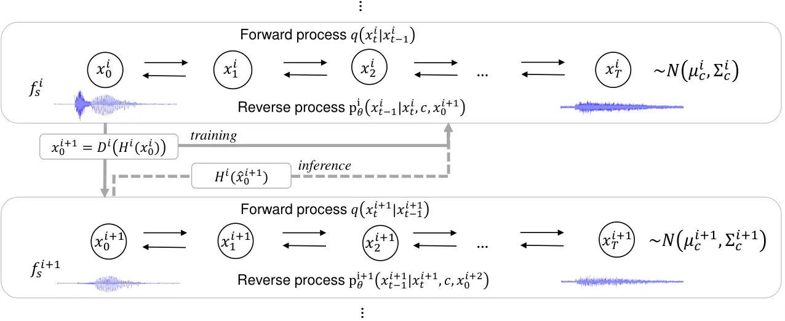
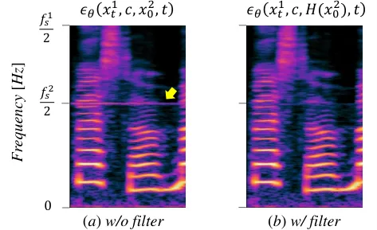
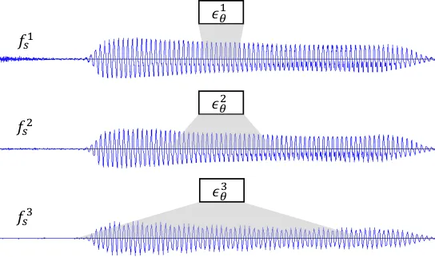
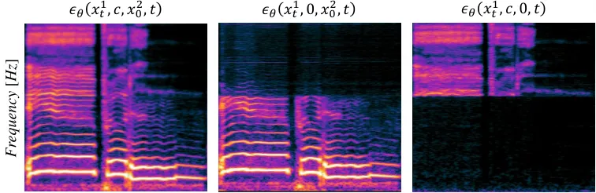

# Hierarchical Diffusion Models for Singing Voice Neural Vocoder

Naoya Takahashi    Mayank Kumar    Singh    Yuki Mitsufuji

###### Abstract

Recent progress in deep generative models has improved the quality of
neural vocoders in speech domain. However, generating a high-quality
singing voice remains challenging due to a wider variety of musical
expressions in pitch, loudness, and pronunciations. In this work, we
propose a hierarchical diffusion model for singing voice neural
vocoders. The proposed method consists of multiple diffusion models
operating in different sampling rates; the model at the lowest sampling
rate focuses on generating accurate low-frequency components such as
pitch, and other models progressively generate the waveform at higher
sampling rates on the basis of the data at the lower sampling rate and
acoustic features. Experimental results show that the proposed method
produces high-quality singing voices for multiple singers, outperforming
state-of-the-art neural vocoders with a similar range of computational
costs.

###### Index Terms: 

neural vocoder, diffusion models, singing voice

^(†)^(†)address: Sony Group Corporation, Japan

## 1 Introduction

Neural vocoders generate a waveform from acoustic features using neural
networks \[1, 2, 3, 4, 5, 6\] and have become essential components for
many speech processing tasks such as text-to-speech\[1, 7, 8\], voice
conversion\[9, 10, 11\], and speech enhancement\[12, 13, 14\], as they
often operate in acoustic feature domains for the efficient modeling of
speech signals. A number of generative models have been adopted to
neural vocoders such as autoregressive models \[1, 2, 15\], generative
adversarial networks (GANs) \[16, 17, 5, 18\], and flow-based models
\[3, 4\].

Recently, diffusion models \[19, 20\] have attracted increasing
attention in a wide range of areas \[21, 22\] as they are shown to
generate high-fidelity samples. Denoising diffusion probabilistic models
(DDPMs) \[20\] gradually convert a simple distribution such as an
isotropic Gaussian into a complicated data distribution using a Markov
chain. To learn the conversion model, DDPMs use another Markov chain
called a forward process (or diffusion process) to gradually convert the
data to the simple target prior (e.g. isotropic Gaussian) by adding
noise. Since the forward process is done without any trainable model,
DDPMs avoid the challenging “posterior collapse” issues caused by the
joint training of two networks such as a generator and discriminator in
GANs \[23\] or an encoder and decoder in variational autoencoder
(VAE)\[24\]. Although the data likelihood is intractable, diffusion
models can be efficiently trained by maximizing the evidence lower bound
(ELBO).

Diffusion models have been adopted to neural vocoders \[6, 25\].
Although they are shown to produce high-quality speech data, the
inference speed is relatively slow compared with other
non-autoregressive model-based vocoders as they require many iterations
to generate the data. PriorGrad \[26\] addresses this problem by
introducing a data dependent prior, specifically, Gaussian distribution
with a diagonal covariance matrix whose entries are frame-wise energies
of the mel-spectrogram. As the noise drawn from the data dependent prior
is closer to the target waveform than the noise from standard Gaussian,
PriorGrad achieves faster convergence and inference with superior
performance. Koiszumi et al. \[27\] further improve the prior by
incorporating the spectral envelope of the mel-spectrogram to introduce
the noise that is more similar to the target signal.

However, many existing neural vocoders focus on speech signals. We found
state-of-the-art neural vocoders provide insufficient quality when they
are applied to a singing voice, possibly due to the scarcity of
large-scale clean singing voice datasets and the wider variety in pitch,
loudness, and pronunciations owing to musical expressions, which is more
challenging to model. To overcome this problem, we propose a
hierarchical diffusion model that learns multiple diffusion models at
different sampling rates. The diffusion models are conditioned on
acoustic features and the data at the lower sampling rate, and can be
trained in parallel. During the inference, the models progressively
generate the data from the low to high sampling rate. The diffusion
model at the lowest sampling rate focuses on generating low frequency
components, which enables accurate pitch recovery, while those at higher
sampling rates focus more on high frequency details. This enables
powerful modeling capability of a singing voice. In our experiment, we
apply the proposed method to PriorGrad and show that the proposed model
generates high-quality singing voices for multiple singers,
outperforming the state-of-the-art PriorGrad and Parallel WaveGAN\[5\]
vocoders.

In image generation tasks, cascading generative models are shown to be
effective \[28, 29, 30\]. However, to our knowledge, this is the first
work that uses multiple diffusion models in different sampling rates for
progressive neural vocoding. Our contributions are; (i) we propose a
hierarchical diffusion model-based neural vocoder to generate a
high-quality singing voice, and (ii) we apply the proposed model to
PriorGrad and show in our experiments that the proposed method
outperforms state-of-the-art neural vocoders, namely, PriorGrad and
Paralell WaveGAN with a similar computational cost. Audio samples are
available at our website^(\*)^(\*) \* https://t-naoya.github.io/hdm/.



Figure 1: Overview of proposed hierarchical diffusion model combined
with PriorGrad \[26\]. Diffusion models are trained at multiple sampling
rates $`f_{s}^{1}>\cdots>f_{s}^{N}`$ independently. Each diffusion model
is conditioned on acoustic features $`c`$ and data at the lower sampling
rate $`x_{0}^{i+1}`$. During inference, the anti-aliasing filter
$`H^{i}`$ is applied to the data generated at the lower sampling rate
and used for conditioning.

## 2 Prior work

### 2.1 Denoising diffusion probabilistic models (DDPM)

DDPMs are defined by two Markov chains, the forward and reverse
processes. The forward process gradually diffuses the data $`x_{0}`$
into a standard Gaussian $`x_{T}`$ as:

```math
q(x_{1:T}|x_{0})=\prod^{T}_{t=1}q(x_{t}|x_{t-1}), \tag{1}
```

where
$`q(x_{t}|x_{t-1}):=N(x_{t};\sqrt{1-\beta_{t}}x_{t-1},\beta_{t}\textbf{I})`$
is a transition probability at a time-step $`t`$ that adds small
Gaussian noise on the basis of a noise schedule
$`\beta_{t}\in\{\beta_{1},\cdots,\beta_{T}\}`$. This formulation enables
to directly sample $`x_{t}`$ from $`x_{0}`$ as:

```math
x_{t}=\sqrt{\bar{\alpha}_{t}}x_{0}+\sqrt{(1-\bar{\alpha}_{t})}\epsilon, \tag{2}
```

where $`\alpha_{t}=1-\beta_{t}`$,
$`\bar{\alpha}_{t}=\prod_{s=1}^{t}\alpha_{s}`$, and
$`\epsilon\sim\mathcal{N}(\textbf{0},\textbf{I})`$. The reverse process
gradually transforms the piror noise
$`p(x_{T})=\mathcal{N}(x_{T};\textbf{0},\textbf{I})`$ to data as:

```math
p(x_{0:T})=p(x_{T})\prod^{T}_{t=1}p_{\theta}(x_{t-1}|x_{t}), \tag{3}
```

where
$`p_{\theta}(x_{t-1}|x_{t}):=\mathcal{N}(x_{t-1};\mu_{\theta}(x_{t},t),\sigma_{\theta}^{2}(x_{t},t)\textbf{I})`$
is a transition probability that corresponds to the reverse of
$`q(x_{t}|x_{t-1})`$ and is modeled by a deep neural network
parameterized by $`\theta`$. Ho et al.\[20\] show that
$`p_{\theta}(x_{t-1}|x_{t})`$ can be given by

```math
\displaystyle\mu_{\theta}(x_{t},t)=\frac{1}{\sqrt{\alpha_{t}}}(x_{t}-\frac{\beta_{t}}{\sqrt{1-\bar{\alpha}_{t}}}\epsilon_{\theta}(x_{t},t)), \tag{4}
```

and
$`\sigma_{\theta}^{2}(x_{t},t)=\frac{1-\bar{\alpha}_{t-1}}{1-\bar{\alpha}_{t}}\beta_{t}`$,
where $`\epsilon_{\theta}(x_{t},t)`$ is a deep neural network that
predics the noise $`\epsilon`$ added at time $`t`$ in (2). The model
$`\epsilon_{\theta}(x_{t},t)`$ can be optimized by maximizing the ELBO:

```math
ELBO=C-\sum_{t=1}^{T}\kappa_{t}\mathbb{E}_{x_{0},\epsilon}[||\epsilon-\epsilon_{\theta}(x_{t},t)||^{2}], \tag{5}
```

where C is a constant,
$`\kappa_{t}=\frac{\beta_{t}}{2\alpha(1-\bar{\alpha}_{t-1})}`$ for
$`t>1`$ and $`\frac{1}{2\alpha}`$ for $`t=1`$. As suggested in \[20\],
many followup works instead use a simplified loss function by setting
$`\kappa_{t}=1`$ \[20, 6, 26\]. DDPM have been adopted to neural
vocoders by conditioning the noise estimation network on acoustic
features $`c`$ as $`\epsilon_{\theta}(x_{t},c,t)`$ \[25, 6\]. Starting
from the noise sampled from the prior $`x_{T}`$, the DDPM-based vocoders
iteratively denoise the signal $`x_{t}`$ on the basis of the condition
$`c`$ to obtain the corresponding waveform $`x_{0}`$.

### 2.2 PriorGrad

Although the standard Gaussian prior in DDPMs provides a simple solution
without any assumption on the target data, it requires many steps to
obtain high-quality data, which hinder efficient training and sampling.
To improve the efficiency in the neural vocoder case, PriorGrad \[26\]
uses an adaptive prior $`\mathcal{N}(\textbf{0},\mathbf{\Sigma_{c}})`$,
where the diagonal variance $`\mathbf{\Sigma_{c}}`$ is computed from a
mel-spectrogram $`c`$ as
$`\mathbf{\Sigma_{c}}=diag[(\sigma_{0}^{2},\cdots,\sigma_{L}^{2})]`$ and
$`\sigma_{i}^{2}`$ is a normalized frame-level energy of the
mel-spectrogram at the $`i`$th sample. The loss function is modified
accordingly to

```math
L=\mathbb{E}_{x_{0},\epsilon,t}[||\epsilon-\epsilon_{\theta}(x_{t},c,t)||^{2}_{\Sigma^{-1}}], \tag{6}
```

where
$`||\mathbf{x}||^{2}_{\Sigma^{-1}}=\mathbf{x}^{\top}\Sigma^{-1}\mathbf{x}`$.
Intuitively, as the power envelope of the adaptive prior is closer to
that of the target signal than that of the standard Gaussian prior, the
diffusion model can require fewer time steps to converge and be more
efficient.

## 3 Proposed method

### 3.1 Hierarchical diffusion probabilistic model

Although PriorGrad shows promising results on speech data, we found that
the quality is unsatisfactory when it is applied to a singing voice,
possibly due to the wider variety in pitch, loudness, and musical
expressions such as vibrato and falsetto. To tackle this problem, we
propose to improve the diffusion model-based neural vocoders by modeling
the singing voice in multiple resolutions. An overview is illustrated in
Figure 1. Given multiple sampling rates
$`f_{s}^{1}>f_{s}^{2}>\cdots>f_{s}^{N}`$, the proposed method learns
diffusion models at each sampling rate independently. The reverse
processes at each sampling rate $`f_{s}^{i}`$ are conditioned on common
acoustic features $`c`$ and the data at the lower sampling rate
$`f_{s}^{i+1}`$ as
$`p^{i}_{\theta}(x^{i}_{t-1}|x^{i}_{t},c,x^{i+1}_{0})`$ except the model
at the lowest sampling rate, which is conditioned only on $`c`$. During
the training, we use the ground truth data
$`x_{0}^{i+1}=D^{i}(H^{i}(x^{i}_{0}))`$ to condition the noise
estimation models $`\epsilon^{i}_{\theta}(x^{i}_{t},c,x^{i+1}_{0},t)`$,
where $`H^{i}(.)`$ denotes the anti-aliasing filter and $`D^{i}(.)`$
denotes the downsampling function for the signal at the sampling rate of
$`f_{s}^{i}`$.

Given: $`f_{s}^{1}>\cdots>f_{s}^{N}`$

for $`i=1,\cdots,N`$ do in parallel

 repeat

  $`x^{i}_{0}\sim q^{i}_{data},\epsilon^{i}\sim\mathcal{N}(\textbf{0},\mathbf{\Sigma_{c}}),t\sim\mathcal{U}([0,\cdots,T])`$

  $`x_{0}^{i+1}=D^{i}(H^{i}(x^{i}_{0}))`$ if $`i<N`$; else
$`x_{0}^{i+1}=`$ Null

  $`x^{i}_{t}=\sqrt{\bar{\alpha}_{t}}x^{i}_{0}+\sqrt{(1-\bar{\alpha}_{t})}\epsilon`$

  $`L=||\epsilon^{i}-\epsilon_{\theta}(x^{i}_{t},c,x^{i+1}_{0},t)||^{2}`$

  Update the model parameter $`\theta`$ with $`\nabla_{\theta}L`$

 until converged

end for

Algorithm 1 Training of Hierarchical PriorGrad

Since the noise $`\epsilon`$ is linearly added to the original data
$`x_{0}`$ as in (2) and the model has direct access to the ground truth
lower-sampling rate data $`x^{i+1}_{0}`$, the model can more simply
predict the noise for low-frequency components from $`x^{i}_{t}`$ and
$`x^{i+1}_{0}`$ by avoiding the complicated acoustic feature-to-waveform
transformation. This enables the model to focus more on the
transformation of high-frequency components. At the lowest sampling rate
$`f_{s}^{N}`$ (we use 6 kHz in our experiments), the data $`x_{0}^{N}`$
become much simpler than that at the original sampling rate, and the
model can focus on generating low-frequency components, which is
important for accurate pitch recovery of a singing voice.

During inference, we start by generating the data at the lowest sampling
rate $`\hat{x}_{0}^{N}`$ and progressively generate the data at the
higher sampling rate $`\hat{x}_{0}^{i}`$ by using the generated sample
$`\hat{x}_{0}^{i+1}`$ as the condition. In practice, we found that
directly using $`\hat{x}_{0}^{i+1}`$ as the condition often produces
noise around the Nyquist frequencies of each sampling rate,
$`\frac{f_{s}^{2}}{2},\cdots,\frac{f_{s}^{N}}{2}`$, as shown in Figure
2 (a). This is due to the gap between the training and inference mode;
the ground truth data used for training
$`x_{0}^{i+1}=D^{i}(H^{i}(x^{i}_{0}))`$ do not contain a signal around
the Nyquist frequency owing to the anti-aliasing filter and the model
can learn to directly use the signal upto the Nyquist frequency, while
the generated sample used for inference $`\hat{x}_{0}^{i+1}`$ may
contain some signal around there due to the imperfect predictions and
contaminate the prediction at a higher sampling rate. To address this
problem, we propose to apply the anti-aliasing filter to the generated
lower-sampling-rate signal to condition the noise prediction model as

```math
\hat{\epsilon}=\epsilon^{i}_{\theta}(x^{i}_{t},c,H(\hat{x}^{i+1}_{0}),t). \tag{7}
```

As shown in Figure 2 (b), this removes the noise around the Nyquist
frequencies and improves the quality. We summarize the training and
inference procedures for the combination with PriorGrad in Algorithms 1
and 2, respectively.

The proposed hierarchical diffusion model can be combined with many
types of diffusion models such as DiffWave \[6\], PriorGrad \[26\] and
SpecGrad \[27\].



Figure 2: Anti-aliasing filter effect in the case of
$`N=2,f_{s}^{1}=24000,f_{s}^{2}=6000`$.

Given: $`f_{s}^{1}>\cdots>f_{s}^{N}`$

$`\hat{x}_{0}^{N+1}=`$ Null

for $`i=N,N-1,\cdots,1`$ do

 $`x^{i}_{T}\sim\mathcal{N}(\textbf{0},\mathbf{\Sigma_{c}})`$

 for $`t=T,T-1,\cdots,1`$ do

  $`\mathbf{z}\sim\mathcal{N}(\textbf{0},\mathbf{\Sigma_{c}})`$ if
$`T>1`$; else $`\mathbf{z}=0`$

  $`x^{i}_{t-1}=\frac{1}{\sqrt{\alpha_{t}}}(x^{i}_{t}-\frac{\beta_{t}}{\sqrt{1-\bar{\alpha}_{t}}}\epsilon_{\theta}(x^{i}_{t},c,H(\hat{x}^{i+1}_{0}),t))+\sigma_{t}\mathbf{z}`$

 end for

end for  $`x_{0}=x_{0}^{1}`$

Algorithm 2 Inference of Hierarchical PriorGrad

### 3.2 Network architecture

As in PriorGrad \[26\], we also base our model architecture on DiffWave
\[6\]. The network consists of $`L`$ residual layers with bidirectional
dilated convolution and repeated dilation factors. The layers are
grouped into $`m`$ blocks, and each block consists of $`l=\frac{L}{m}`$
layers with dilation factors of $`[1,2,\cdots,2^{l-1}]`$ (Please refer
to \[6\] for more details). DiffWave and PriorGrad use $`L=30,l=10`$ to
cover large receptive fields. Our approach can take advantage of
modeling in the lower sampling rates and a smaller network can cover the
long signal length in seconds. Thus, we reduce the size to $`L=24,l=8`$
for all models in different sampling rates to mitigate the increase of
computational cost due to the multi-resolution modeling. As shown in our
experiments, this hyperparameter provides nearly the same computational
cost as the original diffusion model when $`N=2`$.

Using the same network architecture for all sampling rates effectively
changes the receptive field of the models depending on the sampling
rate, as illustrated in Figure 3. At the lower sampling rate, the model
covers a longer time period and focuses on low-frequency components
while it covers a shorter time period and focuses on high-frequency
components at the higher sampling rate. This design matches our
intention of the hierarchical diffusion model because the models are
expected to directly use the conditioned data at the lower sampling rate
$`x_{0}^{i+1}`$ upto the Nyquist frequency $`\frac{f_{s}^{i+1}}{2}`$ and
focus on transforming the acoustic features to the waveform at the
high-frequency.



Figure 3: Receptive field at different sampling rates. The same
architecture covers a longer time period at lower sampling rates.

## 4 Experiments

### 4.1 Setup

Dataset  We use three singing voice datasets, NUS48E\[31\], NHSS\[32\],
and an internal corpus. NUS48E consists of twelve singers (six male and
six female), four songs for each singer, while NHSS consists of ten
singers (five male and five female), ten songs each. The internal corpus
consists of eight singers (five male and three female), from 50 to 80
songs each. All data are resampled to 24k Hz. We randomly split each
dataset into 90%–10% for training and test sets.  
Hyper parameters  We follow the settings used in \[6, 26\]; the models
are trained for 1M steps with a batch size of 16, learning rate of
$`2\times 10^{-4}`$, and Adam optimizer \[33\]. We use an 80-band mel
spectrogram at log-scale as the acoustic feature. We set the FFT size to
2048 and hop size to 300. We adopt the proposed hierarchical diffusion
model to PriorGrad \[26\] and evaluate two models, the 2-stage
Hierarchical PriorGrad (HPG-2) with $`(f_{s}^{1},f_{s}^{2})=(24k,6k)`$
and the 3-stage Hierarchical PriorGrad (HPG-3) with
$`(f_{s}^{1},f_{s}^{2},f_{s}^{2})=(24k,12k,6k)`$. The inference noise
schedule is set to \[0.0001, 0.001, 0.01, 0.05, 0.2, 0.5\] with
$`T_{infer}=6`$ as in \[26\].

Baselines  We consider PriorGrad^(†)^(†) †
https://github.com/microsoft/NeuralSpeech \[26\] and Parallel
WaveGAN^(‡)^(‡) ‡ https://github.com/kan-bayashi/ParallelWaveGAN
(PWG)\[5\] as baselines. All models are trained on the same singing
voice dataset by following the instruction in the publicly available
implementations.^(† ‣ 4.1‡ ‣ 4.1)

Evaluation metrics  For subjective evaluation, we rate naturalness of
samples using five-point scale (1: Bad, 2: Poor, 3: Fair, 4: Good, 5:
Excellent) and report the mean opinion score (MOS). We generate two
5-second singing voices for each of the 22 singers for each model and
present to 20 raters in random orders. Raters evaluate the samples using
headphones.

For the objective evaluation, we use five metrics; (i) real time factor
(RTF), measured on a machine with a GeForce RTX 3090 to evaluate the
computational cost, (ii) pitch mean absolute error (PMAE) between the
ground truth and generated samples, where the pitch is extracted using
the WORLD vocoder\[34\] (iii) voicing decision error (VDE) \[35\], which
measures the portion of frames with voicing decision error, (iv)
multi-resolution STFT error (MR-STFT) \[5\], and (v) Mel cepstral
distortion (MCD)\[36\]. We evaluate the metrics on the test set and
report the average values.

| Model            | MOS               |
| ---------------- | ----------------- |
| Ground Truth     | 4.66 $`\pm`$ 0.09 |
| PWG \[5\]        | 2.15 $`\pm`$ 0.13 |
| PriorGrad \[26\] | 3.60 $`\pm`$ 0.12 |
| HPG-2 (Ours)     | 3.95 $`\pm`$ 0.13 |

Table 1: MOS results with 95% confidence interval.

### 4.2 Results

We compare the MOS of the models that have similar RTFs in Table 1 (RTF
values are shown in Table 2). Unlike in the speech domain, Parallel
WaveGAN (PWG) often suffers from unnatural shakes in pitch when the
original singing voice has vibrato, which is possibly one of the reasons
of the low MOS. PriorGrad does not produce such unnatural pitch shakes
and obtains a higher MOS than PWG. The proposed HPG clearly outperforms
the baselines, providing the best quality. We also evaluate a preference
score, where raters are asked which of A and B is more natural, with A
and B randomly chosen from HPG-2 and PriorGrad. We observe that 85.3% of
the time, raters prefer HPG-2. Objective results are shown in Table 2.
PMAE and VDE values of PWG are higher than other methods, which is
consistent with the subjective observation. In contrast, PWG obtains
lower MR-STFT and MCD values, which is inconsistent with the subjective
results. This may be because PWG includes MR-STFT loss for the training
and thus can obtain lower values for the metrics that are related to
distortion of the spectrogram. This results suggest that MR-STFT and MCD
may be insufficient to evaluate the perceptual quality of a singing
voice. We also evaluate the effect of increasing the hierarchy to
3-stage. HPG-3 further improves the objective metrics with a 30%
increase in computational cost. For a fair comparison, we evaluate the
larger PriorGrad model (PriorGrad-L) by increasing the number of layers
and channels to $`L=40`$ and $`80`$, respectively. However, the
performance of PriorGrad-L does not change significantly. This suggests
that the proposed HPG more efficiently scales to the larger model.

Finally, we investigate how the HPG model uses the conditioning data. We
replace either the mel-spectrogram $`c`$ or the data at the lower
sampling rate $`x_{0}^{2}`$ of the HPG-2 model to 0 and generate the
samples. As shown in Figure 4, the model generates signal under the
Nyquist frequency of the lower module $`\frac{f_{s}^{2}}{2}`$ even when
the mel-spectrogram is replaced to zero. On the other hand, when the low
sampling rate data $`x_{0}^{2}`$ is replaced to zero, the model
generates only high frequency components. This results show that the
model utilizes information from $`x_{0}^{2}`$ to generate the
low-frequency components while the high-frequency ones are generated on
the basis of $`c`$ as expected. Audio samples are available at our
website^(\* ‣ 1).

|                  |       |      |      |         |      |
| ---------------- | ----- | ---- | ---- | ------- | ---- |
| Model            | RTF   | PMAE | VDE  | MR-STFT | MCD  |
| PWG \[5\]        | 0.067 | 3.12 | 5.61 | 1.09    | 6.63 |
| PriorGrad \[26\] | 0.066 | 1.80 | 3.96 | 1.34    | 9.62 |
| PriorGrad-L      | 0.093 | 2.08 | 3.86 | 1.38    | 9.47 |
| HPG-2 (Ours)     | 0.070 | 1.82 | 3.47 | 1.13    | 8.97 |
| HPG-3 (Ours)     | 0.100 | 1.67 | 3.32 | 1.07    | 8.12 |

Table 2: Objective test results. For all metrics, lower the better.



Figure 4: Spectrograms of generated data with different conditioning.

## 5 Conclusion

We proposed a hierarchical diffusion model for singing voice neural
vocoders. The proposed method learns diffusion models in different
sampling rates independently while conditioning the model with data at
the lower sampling rate. During the inference, the model progressively
generates a signal while taking care of the anti-aliasing filter. Our
experimental results show that the proposed method applied to PriorGrad
outperforms PriorGrad and Parallel WaveGAN at similar computational
costs. Although we focus on singing voices in this work, the proposed
method is applicable to any type of audio. Evaluating the proposed
method on different types of audio such as speech, music, and
environmental sounds will be our future work.

## References

- \[1\] A. van den Oord, S. Dieleman, H. Zen, K. Simonyan, O. Vinyals,
  A. Graves, N. Kalchbrenner, A. Senior, and K. Kavukcuoglu, “Wavenet: A
  generative model for raw audio,” arXiv preprint
  arXiv:1609.03499, 2016.
- \[2\] S. Mehri, K. Kumar, I. Gulrajani, R. Kumar, S. Jain, J. Sotelo,
  A. Courville, and Y. Bengio, “SampleRNN: An Unconditional End-to-End
  Neural Audio Generation Model,” in Proc. ICLR, 2017.
- \[3\] R. Prenger, R. Valle, and B. Catanzaro, “WaveGlow: A flowbased
  generative network for speech synthesis,” in Proc. ICASSP, 2019.
- \[4\] W. Ping, K. Peng, K. Zhao, and Z. Song, “WaveFlow: A compact
  flow-based model for raw audio,” in Proc. ICML, 2020.
- \[5\] R. Yamamoto, E. Song, and J.-M. Kim, “Parallel WaveGAN: A fast
  waveform generation model based on generative adversarial networks
  with multi-resolution spectrogram,” in Proc. ICASSP, 2020.
- \[6\] Z. Kong, W. Ping, J. Huang, K. Zhao, and B. Catanzaro,
  “DiffWave: A Versatile Diffusion Model for Audio Synthesis,” in Proc.
  ICLR, 2021.
- \[7\] J. Shen, R. Pang, R. J. Weiss, M. Schuster, N. Jaitly, Z. Yang,
  Z. Chen, Y. Zhang, Y. Wang, R. Skerry-Ryan, R. A. Saurous,
  Y. Agiomyrgiannakis, and Y. Wu, “Natural tts synthesis by conditioning
  wavenet on mel spectrogram predictions,” in Proc. ICASSP, 2018.
- \[8\] N. Li, S. Liu, Y. Liu, S. Zhao, M. Liu, and M. Zhou, “Neural
  speech synthesis with transformer network,” in Proc. AAAI, 2019.
- \[9\] K. Qian, Y. Zhang, S. Chang, X. Yang, and M. Hasegawa-Johnson,
  “AutoVC: Zero-Shot Voice Style Transfer with Only Autoencoder Loss,”
  in Proc. ICML, 2019.
- \[10\] Y. A. Li, A. Zare, and N. Mesgarani, “StarGANv2-VC: A Diverse,
  Unsupervised, Non-parallel Framework for Natural-Sounding Voice
  Conversion,” in Proc. Interspeech, 2021.
- \[11\] S. Agarwal, S. Ganapathy, and N. Takahashi, “Leveraging
  symmetrical convolutional transformer networks for speech to singing
  voice style transfer,” in Proc. Interspeech, 2022.
- \[12\] S. Maiti and M. I. Mandel, “Parametric resynthesis with neural
  vocoders,” in Proc. WASPAA, 2019.
- \[13\] J. Su, Z. Jin, and A. Finkelstein, “Hifi-gan: High-fidelity
  denoising and dereverberation based on speech deep features in
  adversarial networks,” in Proc. Interspeech, 2020.
- \[14\] H. Liu, Q. Kong, Q. Tian, Y. Zhao, D. Wang, C. Huang, and
  Y. Wang, “Voicefixer: Toward general speech restoration with neural
  vocoder,” 2021.
- \[15\] N. Kalchbrenner, E. Elsen, K. Simonyan, S. Noury,
  N. Casagrande, E. Lockhart, F. Stimberg, A. van den Oord, S. Dieleman,
  and K. Kavukcuoglu, “Efficient neural audio synthesis,” in Proc.
  ICML, 2018.
- \[16\] C. Donahue, J. McAuley, and M. Puckette, “Adversarial audio
  synthesis,” in Proc. ICLR, 2019.
- \[17\] K. Kumar, R. Kumar, T. de Boissiere, L. Gestin, W. Z. Teoh,
  J. Sotelo, A. de Brebisson, Y. Bengio, and A. Courville, “MelGAN:
  Generative Adversarial Networks for Conditional Waveform Synthesi,” in
  Proc. NeurIPS, 2019.
- \[18\] J. Kong, J. Kim, and J. Bae, “Hifi-gan: Generative adversarial
  networks for efficient and high fidelity speech synthesis,” in Proc.
  NeurIPS, 2020.
- \[19\] Y. Song and S. Ermon, “Generative modeling by estimating
  gradients of the data distribution,” in Proc. NeurIPS, 2019.
- \[20\] P. A. Jonathan Ho, Ajay Jain, “Denoising diffusion
  probabilistic models,” in Proc. NeurIPS, 2020.
- \[21\] Y.-J. Lu, Z.-Q. Wang, S. Watanabe, A. Richard, C. Yu, and
  Y. Tsao, “Conditional Diffusion Probabilistic Model for Speech
  Enhancement,” in Proc. ICASSP, 2022.
- \[22\] C.-H. Lai, Y. Takida, N. Murata, T. Uesaka, Y. Mitsufuji, and
  S. Ermon, “Regularizing score-based models with score fokker-planck
  equations,” preprint arXiv:2210.04296, 2022.
- \[23\] I. J. Goodfellow, J. Pouget-Abadie, M. Mirza, B. Xu,
  D. Warde-Farley, S. O. A. Courville, and Y. Bengio, “Generative
  adversarial networks,” in Proc. NeurIPS, 2014.
- \[24\] D. P. Kingma and M. Welling, “Auto-encoding variational bayes,”
  in Proc. ICLR, 2014.
- \[25\] N. Chen, Y. Zhang, H. Zen, R. J. Weiss, M. Norouzi, and
  W. Chan, “WaveGrad: Estimating gradients for waveform generation,” in
  Proc. ICLR, 2021.
- \[26\] S. gil Lee, H. Kim, C. Shin, X. Tan, C. Liu, Q. Meng, T. Qin,
  W. Chen, S. Yoon, and T.-Y. Liu, “PriorGrad: Improving Conditional
  Denoising Diffusion Models with Data-Dependent Adaptive Prior,” in
  Proc. ICLR, 2022.
- \[27\] Y. Koizumi, H. Zen, K. Yatabe, N. Chen, and M. Bacchiani,
  “SpecGrad: Diffusion Probabilistic Model based Neural Vocoder with
  Adaptive Noise Spectral Shaping,” in Proc. Interspeech, 2022.
- \[28\] J. Menick and N. Kalchbrenner, “Generating high fidelity images
  with subscale pixel networks and multidimensional upscaling,” in Proc.
  ICLR, 2019.
- \[29\] A. Razavi, A. van den Oord, and O. Vinyals, “Generating diverse
  high-fidelity images with vq-vae-2,” in Proc. NeurIPS, 2019.
- \[30\] J. Ho, C. Saharia, W. Chan, D. J. Fleet, M. Norouzi, and
  T. Salimans, “Cascaded diffusion models for high fidelity image
  generation,” preprint arXiv:2106.15282, 2021.
- \[31\] Z. Duan, H. Fang, B. Li, K. C. Sim, and Y. Wang, “The NUS sung
  and spoken lyrics corpus: A quantitative comparison of singing and
  speech,” in Proc. APSIPA Annual Summit and Conference, 2013.
- \[32\] B. Sharma, X. Gao, K. Vijayan, X. Tian, and H. Li, “NHSS: A
  Speech and Singing Parallel Database,” Speech Communication, vol.
  13, 2021.
- \[33\] D. P. Kingma and J. Ba, “Adam: A Method for Stochastic
  Optimization,” in Proc. ICLR, 2015.
- \[34\] M. Morise, F. Yokomori, and K. Ozawa, “World: A vocoder-based
  high-quality speech synthesis system for real-time applications,”
  IEICE Trans. Information and Systems, vol. E99.D, no. 7, pp.
  1877–1884, 2016.
- \[35\] T. Nakatani, S. Amano, T. Irino, K. Ishizuka, and T. Kondo, “A
  method for fundamental frequency estimation and voicing decision:
  Application to infant utterances recorded in real acoustical
  environments,” Speech communication, vol. 50, 2008.
- \[36\] R. Kubichek, “Mel-cepstral distance measure for objective
  speech quality assessment,” in Proc. IEEE PACRIM, 1993.
