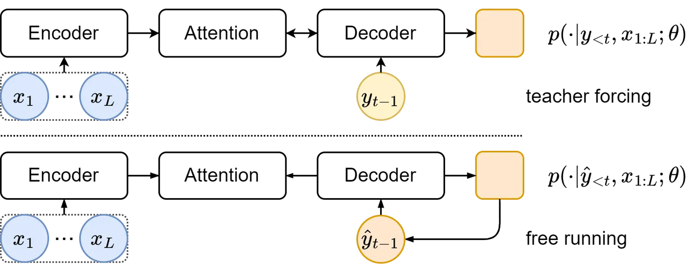
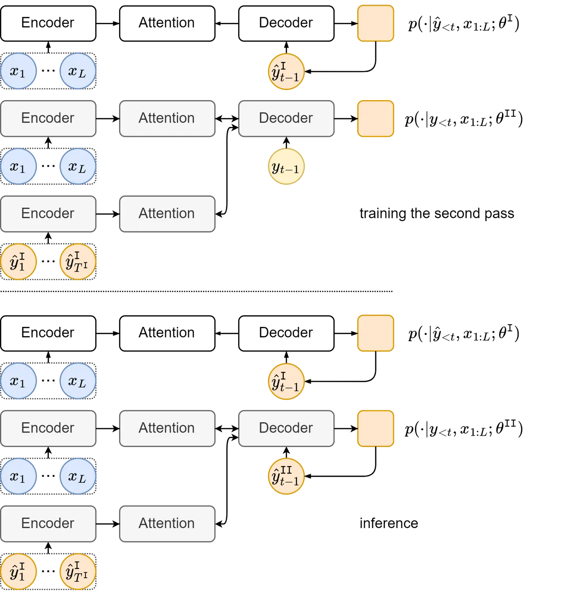

# Deliberation Networks and How to Train Them

Qingyun Dou    Mark Gales Affiliation: University of Cambridge
Email: [{qd212,mjfg100}@cam.ac.uk](mailto:)

###### Abstract

Deliberation networks are a family of sequence-to-sequence models, which
have achieved state-of-the-art performance in a wide range of tasks such
as machine translation and speech synthesis. A deliberation network
consists of multiple standard sequence-to-sequence models, each one
conditioned on the initial input and the output of the previous model.
During training, there are several key questions: whether to apply Monte
Carlo approximation to the gradients or the loss, whether to train the
standard models jointly or separately, whether to run an intermediate
model in teacher forcing or free running mode, whether to apply
task-specific techniques. Previous work on deliberation networks
typically explores one or two training options for a specific task. This
work introduces a unifying framework, covering various training options,
and addresses the above questions. In general, it is simpler to
approximate the gradients. When parallel training is essential, separate
training should be adopted. Regardless of the task, the intermediate
model should be in free running mode. For tasks where the output is
continuous, a guided attention loss can be used to prevent degradation
into a standard model.

## 1 Introduction

Auto-regressive sequence-to-sequence (seq2seq) models with attention
mechanisms are used in a variety of areas including Neural Machine
Translation (NMT) Neubig (2017); Huang et al. (2016), Automatic Speech
Recognition (ASR) Chan et al. (2016) and speech synthesis Shen et al.
(2018); Wang et al. (2018), also known as Text-To-Speech (TTS). These
models excel at connecting sequences of different length, but can be
difficult to train. A standard approach is teacher forcing, which guides
a model with reference output history during training. This makes the
model unlikely to recover from its mistakes during inference, where the
reference output is replaced by generated output. This issue is often
referred to as exposure bias. Several approaches have been introduced to
tackle this issue, namely scheduled sampling Bengio et al. (2015),
professor forcing Lamb et al. (2016) and attention forcing Dou et al.
(2020); Dou et al. (2021a). These approaches require sequential
generation during training, and cannot be directly applied when parallel
training is a priority.

Deliberation networks Xia et al. (2017) are a family of multi-pass
seq2seq models, and can be viewed as a parallelizable alternative
approach to addressing exposure bias. Here the output sequence is
generated in multiple passes, each one conditioned on the initial input
and the output of the previous pass. For multi-pass seq2seq models,
there are many choices to make during training, e.g. whether to update
the parameters of each pass separately or jointly. Previous work Xia
et al. (2017); Hu et al. (2020); Dou et al. (2021b) on deliberation
networks typically focuses on a specific task, and explores one or two
training options. This work introduces a unifying framework, covering
various training options in a task-agnostic fashion, and then
investigates task-specific techniques.

The novelties of this paper are as follows. First, section 3 describes
the framework from a probabilistic perspective, and section 4
investigates a range of training approaches. In contrast, previous work
Xia et al. (2017); Hu et al. (2020); Hu et al. (2021) takes a
deterministic perspective, and describes the one or two training
approaches adopted in the experiments. Second, section 4 draws the
connection between the training of deliberation networks and Minimum
Bayes Risk (MBR) training. Leveraging the connection, the end of section
4.1 introduces a novel training approach, which approximates the loss,
unlike previous work Xia et al. (2017) approximating the gradients. The
separate training approach described in section 4.2 is not novel, but
its synergy with parallel training is pointed out for the first time.
Finally, section 5 reviews several techniques facilitating the
application of deliberation networks to specific tasks.

## 2 Attention-based sequence-to-sequence generation

Sequence-to-sequence (seq2seq) generation can be defined as the task of
mapping an input sequence $`\bm{x}_{1:L}`$ to an output sequence
$`\bm{y}_{1:T}`$ Bengio et al. (2015). The two sequences do not need to
be aligned or have the same length. From a probabilistic perspective, a
model $`\bm{\theta}`$ estimates the distribution of $`\bm{y}_{1:T}`$
given $`\bm{x}_{1:L}`$. For autoregressive models, this can be
formulated as

```math
\textstyle p(\bm{y}_{1:T}|\bm{x}_{1:L};\bm{\theta})=\prod_{t=1}^{T}p(\bm{y}_{t}|\bm{y}_{1:t-1},\bm{x}_{1:L};\bm{\theta}) \tag{1}
```

### 2.1 Encoder-attention-decoder architecture

Attention-based sequence-to-sequence models usually have the
encoder-attention-decoder architecture Vaswani et al. (2017); Lewis
et al. (2020); Tay et al. (2020). The distribution of a token is
conditioned on the back-history, the input sequence and and attention
map:

```math
\displaystyle p(\bm{y}_{t}|\bm{y}_{1:t-1},\bm{x}_{1:L};\bm{\theta}) \displaystyle\approx p(\bm{y}_{t}|\bm{y}_{1:t-1},\bm{\alpha}_{t},\bm{x}_{1:L};\bm{\theta})
```

```math
\displaystyle\approx p(\bm{y}_{t}|\bm{s}_{t},\bm{c}_{t};\bm{\theta}_{y}) \tag{2}
```

where
$`\bm{\theta}=\{\bm{\theta}_{y},\bm{\theta}_{s},\bm{\theta}_{\alpha},\bm{\theta}_{h}\}`$;
$`\bm{\alpha}_{t}`$ is an alignment vector, i.e. a set of attention
weights; $`\bm{s}_{t}`$ is a state vector representing the output
history $`\bm{y}_{1:t-1}`$, and $`\bm{c}_{t}`$ is a context vector
summarizing $`\bm{x}_{1:L}`$ for time step $`t`$. Figure 1 shows a
general encoder-attention-decoder model. The following equations give
more details about how $`\bm{\alpha}_{t}`$, $`\bm{s}_{t}`$ and
$`\bm{c}_{t}`$ can be computed:

```math
\displaystyle\bm{h}_{1:L}=f(\bm{x}_{1:L};\bm{\theta}_{h})
```

```math
\displaystyle\bm{s}_{t}=f(\bm{y}_{1:t-1};\bm{\theta}_{s})
```

```math
\displaystyle\textstyle\bm{\alpha}_{t}=f(\bm{s}_{t},\bm{h}_{1:L};\bm{\theta}_{\alpha})\quad\bm{c}_{t}=\sum_{l=1}^{L}\alpha_{t,l}\bm{h}_{l}
```

```math
\displaystyle\hat{\bm{y}}_{t}\sim p(\cdot|\bm{s}_{t},\bm{c}_{t};\bm{\theta}_{y})
```

The encoder maps $`\bm{x}_{1:L}`$ to $`\bm{h}_{1:L}`$, considering
information from the entire input sequence; $`\bm{s}_{t}`$ summarizes
$`\bm{y}_{1:t-1}`$, considering only the past. With $`\bm{h}_{1:L}`$ and
$`\bm{s}_{t}`$, the attention mechanism computes $`\bm{\alpha}_{t}`$,
and then $`\bm{c}_{t}`$. Finally, the decoder estimates a distribution
based on $`\bm{s}_{t}`$ and $`\bm{c}_{t}`$, and optionally generates an
output token $`\hat{\bm{y}}_{t}`$.¹¹ 1 When computing the decoder state,
the context vector can be optionally considered:
$`\bm{s}_{t}=f(\bm{y}_{1:t-1},\bm{c}_{t-1};\bm{\theta}_{s})`$. For the
discussions in this paper, it is not crucial whether the context vector
is included.



Figure 1: A general attention-based encoder-decoder model, operating in
teacher forcing mode; a circle depicts a token, and a rounded square
depicts a distribution.

### 2.2 Inference and training

During inference, given an input $`\bm{x}_{1:L}`$, the output
$`\hat{\bm{y}}_{1:T}`$ can be obtained from the distribution estimated
by the model $`\bm{\theta}`$:

```math
\displaystyle\hat{\bm{y}}_{1:T}=\underset{\bm{y}_{1:T}}{\mathrm{argmax}}\,p(\bm{y}_{1:T}|\bm{x}_{1:L};\bm{\theta}) \tag{3}
```

The exact search is often too expensive and is often approximated by
greedy search for continuous output, or beam search for discrete output
Bengio et al. (2015).

Conceptually, the model is trained to learn the natural distribution,
e.g. through minimizing the KL-divergence between the natural
distribution $`p(\bm{y}_{1:T}|\bm{x}_{1:L})`$ and the estimated
distribution $`p(\bm{y}_{1:T}|\bm{x}_{1:L};\bm{\theta})`$. In practice,
this can be approximated by minimizing the Negative Log-Likelihood (NLL)
over some training data
$`\{\bm{y}^{(n)}_{1:T},\bm{x}^{(n)}_{1:L}\}_{1}^{N}`$, sampled from the
true distribution:

```math
\displaystyle\mathcal{L}(\bm{\theta}) \displaystyle=\E_{\scalebox{0.8}{$\bm{x}_{1:L}$}}\mathrm{KL}\big(p(\bm{y}_{1:T}|\bm{x}_{1:L})||p(\bm{y}_{1:T}|\bm{x}_{1:L};\bm{\theta})\big)
```

```math
\displaystyle\propto-\textstyle\sum_{n=1}^{N}\log p(\bm{y}^{(n)}_{1:T}|\bm{x}^{(n)}_{1:L};\bm{\theta}) \tag{4}
```

$`\mathcal{L}(\bm{\theta})`$ denotes the loss. $`N`$ denotes the size of
the training dataset; $`n`$ denotes the data index. To simplify the
notation, the data index is omitted for the length of the sequences,
although they also vary with the index. In the following sections, the
sum over the training set $`\sum_{n=1}^{N}`$ will also be omitted.

For autoregressive models, and the sequence distribution
$`p(\bm{y}_{1:T}|\bm{x}_{1:L};\bm{\theta})`$ is factorized across time,
as shown in equation 1. A key question then, is how to compute the token
distribution $`p(\bm{y}_{t}|\bm{y}_{1:t-1},\bm{x}_{1:L};\bm{\theta})`$.
For teacher forcing, at each time step $`t`$, the token distribution is
computed with the correct output history $`\bm{y}_{1:t-1}`$. In this
case, the loss can be written as:

```math
\begin{split}\mathcal{L}_{y}^{\tt T}(\bm{\theta})&=-\log p(\bm{y}_{1:T}|\bm{x}_{1:L};\bm{\theta})\\
&=-\textstyle\sum_{t=1}^{T}\log p(\bm{y}_{t}|\bm{y}_{1:t-1},\bm{x}_{1:L};\bm{\theta})\end{split} \tag{5}
```

From a theoretical point of view, this approach yields the correct model
(zero KL-divergence) if the following assumptions hold: 1) the model is
powerful enough ; 2) the model is optimized correctly; 3) there is
enough training data to approximate the expectation shown in equation 4.
In practice, these assumptions are often not true, hence the model is
prone to mistakes. From a different perspective, teacher forcing suffers
from exposure bias Ranzato et al. (2016), which refers to the following
problem. During training, the model is guided by the reference output
history. At the inference stage, however, the generated output history
must be used. Hence there is a train-inference mismatch, and the errors
accumulate along the inference process Ranzato et al. (2016).

Many approaches have been introduced to tackle exposure bias, and there
are mainly two lines of research. Scheduled sampling Bengio et al.
(2015); Duckworth et al. (2019) and professor forcing Lamb et al. (2016)
are prominent examples along the first line. These approaches guide a
model with both the reference and the generated output history, and the
goal is to learn the data distribution via maximizing the likelihood of
the training data. To facilitate convergence, they often depend on a
heuristic schedule or an auxiliary classifier, which can be difficult to
design and tune Bengio et al. (2015); Guo et al. (2019). The second line
is a series of sequence-level training approaches, leveraging
reinforcement learning Ranzato et al. (2016), minimum risk training Shen
et al. (2016) or generative adversarial training Yu et al. (2017).
Theses approaches guide a model with the generated output history.
During training, the model operates in free running mode, and the goal
is not to generate the reference output, but to optimize a
sequence-level loss. However, many tasks do not have well established
sequence-level objective metrics. Examples include speech synthesis,
voice conversion, machine translation and text summarization Tay et al.
(2020). Both lines of research require generating output sequences, and
this process is sequential for autoregressive models. In recent years,
models based on the Transformer Vaswani et al. (2017) have been widely
used, and a key advantage is that when teacher forcing is used, training
can be run in parallel across time. To efficiently generate output
sequences from Transformer-based models, an approximation scheme
Duckworth et al. (2019) has been proposed to parallelize scheduled
sampling.

For the above training approaches, the model is trained at the
token-level, i.e. the loss is computed for each token and summed across
time. An alternative way of addressing exposure bias is to train the
model at the sequence-level. Here the loss is computed for sequences
instead of tokens, and the model sees not only the reference output
during training. This type of approaches can be described in the
framework of Minimum Bayes Risk (MBR) training. Assume that there is a
distance metric
$`\mathcal{D}(\bm{y}_{1:T},\underline{\bm{y}}_{1:\underline{T}})`$
between the reference output $`\bm{y}_{1:T}`$ and a random output
$`\underline{\bm{y}}_{1:\underline{T}}`$, whose probability is estimated
with the model $`\bm{\theta}`$. $`\mathcal{D}`$ is minimal when the two
sequences are equal. MBR training minimizes its expected value:

```math
\begin{split}\mathcal{L}_{y}^{\tt B}(\bm{\theta})&=\sum_{\underline{\bm{y}}_{1:\underline{T}}\in\mathcal{Y}}p(\underline{\bm{y}}_{1:\underline{T}}|\bm{x}_{1:L};\bm{\theta})\mathcal{D}(\bm{y}_{1:T},\underline{\bm{y}}_{1:\underline{T}})\end{split} \tag{6}
```

where $`\mathcal{Y}`$ is the entire output space.

## 3 Network Architecture

Deliberation networks are inspired by a common human behavior: when
producing a sequence, be it text or speech, we often revise the initial
output to improve its quality. For example, to write a good article, we
usually first create a draft and then polish it. To record a section of
an audio book, the readers often record several times until the quality
is good enough.

A deliberation network consists of multiple models. Its output is
generated in multiple passes, each one conditioned on the initial input
and the previous free running output. With the iterative refinement, the
final output is expected to be better than the previous ones. For
deliberation networks, an essential element is to condition all but the
first model on its previous free running output. This allows the later
models to learn to correct the free running output, alleviating exposure
bias. Without loss of generality, this section describes a two-pass
deliberation network, shown in figure 2.



Figure 2: A two-pass deliberation network; the clear blocks depict the
first pass; the shaded blocks depict the second pass.

In terms of notation, $`\bm{x}_{1:L}`$ and $`\bm{y}_{1:T}`$ denote the
input and reference output; $`\bm{\theta}^{\tt I}`$ and
$`\bm{\theta}^{\tt II}`$ denote the first-pass and second-pass models;
$`\bm{y}^{\tt I}_{1:T^{\tt I}}`$ denotes an intermediate output
sequence. The deliberation network models
$`p(\bm{y}_{1:T}|\bm{x}_{1:L})`$ as

```math
\displaystyle p(\bm{y}_{1:T}|\bm{x}_{1:L};\bm{\theta}^{\tt I},\bm{\theta}^{\tt II})=\textstyle\sum_{\bm{y}^{\tt I}_{1:T^{\tt I}}\in\mathcal{Y}} \tag{7}
```

```math
\displaystyle p(\bm{y}^{\tt I}_{1:T^{\tt I}}|\bm{x}_{1:L};\bm{\theta}^{\tt I})p(\bm{y}_{1:T}|\bm{y}^{\tt I}_{1:T^{\tt I}},\bm{x}_{1:L};\bm{\theta}^{\tt II})
```

if $`\bm{y}^{\tt I}_{1:T^{\tt I}}`$ is discrete, and

```math
\displaystyle p(\bm{y}_{1:T}|\bm{x}_{1:L};\bm{\theta}^{\tt I},\bm{\theta}^{\tt II})=\textstyle\int_{\bm{y}^{\tt I}_{1:T^{\tt I}}\in\mathcal{Y}} \tag{8}
```

```math
\displaystyle p(\bm{y}^{\tt I}_{1:T^{\tt I}}|\bm{x}_{1:L};\bm{\theta}^{\tt I})p(\bm{y}_{1:T}|\bm{y}^{\tt I}_{1:T^{\tt I}},\bm{x}_{1:L};\bm{\theta}^{\tt II})d\bm{y}^{\tt I}_{1:T^{\tt I}}
```

if $`\bm{y}^{\tt I}_{1:T^{\tt I}}`$ is continuous. The
summation/integration is over $`\mathcal{Y}`$, the entire space of
$`\bm{y}^{\tt I}_{1:T^{\tt I}}`$.
$`p(\bm{y}^{\tt I}_{1:T^{\tt I}}|\bm{x}_{1:L};\bm{\theta}^{\tt I})`$ is
computed by $`\bm{\theta}^{\tt I}`$, a standard single-pass model.
$`p(\bm{y}_{1:T}|\bm{y}^{\tt I}_{1:T^{\tt I}},\bm{x}_{1:L};\bm{\theta}^{\tt II})`$
is computed by $`\bm{\theta}^{\tt II}`$, a model with an additional
attention mechanism over $`\bm{y}^{\tt I}_{1:T^{\tt I}}`$.
$`\bm{\theta}^{\tt I}`$ and $`\bm{\theta}^{\tt II}`$ have different time
steps. At time $`t`$, assuming $`\bm{y}^{\tt I}_{1:T^{\tt I}}`$ is
available, $`\bm{\theta}^{\tt II}`$ operates as follows.

```math
\displaystyle\bm{s}_{t}=f(\bm{y}_{1:t-1};\bm{\theta}_{s}^{\tt II}) \tag{9}
```

```math
\displaystyle\begin{split}\bm{h}_{x,1:L}=f(\bm{x}_{1:L};\bm{\theta}_{h,x}^{\tt II})\\
\bm{h}_{y,1:T^{\tt I}}=f(\bm{y}^{\tt I}_{1:T^{\tt I}};\bm{\theta}_{h,y}^{\tt II})\end{split}
```

```math
\displaystyle\begin{split}\bm{\alpha}_{x,t}=f(\bm{s}_{t},\bm{h}_{x,1:L};\bm{\theta}_{\alpha,x}^{\tt II})\quad\bm{c}_{x,t}=\textstyle\sum_{l=1}^{L}\alpha_{x,t,l}\bm{h}_{x,l}\\
\bm{\alpha}_{y,t}=f(\bm{s}_{t},\bm{h}_{y,1:T^{\tt I}};\bm{\theta}_{\alpha,y}^{\tt II})\quad\bm{c}_{y,t}=\textstyle\sum_{l=1}^{T^{\tt I}}\alpha_{y,t,l}\bm{h}_{y,l}\end{split}
```

```math
\displaystyle\hat{\bm{y}}_{t}^{\tt II}\sim p(\cdot|\bm{s}_{t},\bm{c}_{x,t},\bm{c}_{y,t};\bm{\theta}_{y}^{\tt II})
```

$`\bm{\theta}^{\tt II}`$ is built upon $`\bm{\theta}^{\tt I}`$, and has
an additional encoder-attention pair. One pair
$`\{\bm{\theta}_{h,x}^{\tt II},\bm{\theta}_{\alpha,x}^{\tt II}\}`$ is
for the initial input $`\bm{x}_{1:L}`$; the additional pair
$`\{\bm{\theta}_{h,y}^{\tt II},\bm{\theta}_{\alpha,y}^{\tt II}\}`$ is
for the intermediate output $`\bm{y}^{\tt I}_{1:T^{\tt I}}`$. The
encoder for $`\bm{x}_{1:L}`$ shares the same parameters as that of
$`\bm{\theta}^{\tt I}`$, i.e.
$`\bm{\theta}_{h,x}^{\tt II}=\bm{\theta}_{h}^{\tt I}`$. The probability
of $`\bm{y}_{t}`$ depends on $`\bm{s}_{t}`$, $`\bm{c}_{x,t}`$ and
$`\bm{c}_{y,t}`$. $`\bm{s}_{t}`$ is the state vector tracking the output
history, and is used by both attention mechanisms. $`\bm{c}_{x,t}`$ and
$`\bm{c}_{y,t}`$ summarize $`\bm{x}_{1:L}`$ and
$`\bm{y}^{\tt I}_{1:T^{\tt I}}`$ respectively. The intermediate output
of $`\bm{\theta}^{\tt I}`$, such as $`\bm{s}^{\tt I}_{1:T^{\tt I}}`$ and
$`\bm{c}^{\tt I}_{1:T^{\tt I}}`$, can be combined with the
$`\bm{y}^{\tt I}_{1:T^{\tt I}}`$ as the input to
$`\bm{\theta}_{h,y}^{\tt II}`$.

During inference, the generated output history replaces the reference,
and equation 9 becomes
$`\bm{s}_{t}=f(\hat{\bm{y}}_{1:t-1}^{\tt II};\bm{\theta}_{s}^{\tt II})`$.
The decoding of $`\bm{\theta}^{\tt II}`$ begins when that of
$`\bm{\theta}^{\tt I}`$ is complete.

By default, the rest of this paper assumes that
$`\bm{y}^{\tt I}_{1:T^{\tt I}}`$ is discrete, and most discussions are
agnostic to the continuity of $`\bm{y}^{\tt I}_{1:T^{\tt I}}`$. When the
continuity does make a difference, the discrete and continuous cases
will be discussed separately.

## 4 Training

### 4.1 Joint Training

| $`F^{\tt I}`$             | $`p(\bm{y}^{\tt I}\_{1:T^{\tt I}}                | \bm{x}\_{1:L};\bm{\theta}^{\tt I})`$                                               |
| ------------------------- | ------------------------------------------------ | ---------------------------------------------------------------------------------- |
| $`F^{\tt II}`$            | $`p(\bm{y}\_{1:T}                                | \bm{y}^{\tt I}_{1:T^{\tt I}},\bm{x}_{1:L};\bm{\theta}^{\tt II})`$                  |
| $`\hat{F}^{{\tt I}(m)}`$  | $`p(\hat{\bm{y}}^{{\tt I}(m)}_{1:T^{{\tt I}(m)}} | \bm{x}\_{1:L};\bm{\theta}^{\tt I})`$                                               |
| $`\hat{F}^{{\tt II}(m)}`$ | $`p(\bm{y}\_{1:T}                                | \hat{\bm{y}}^{{\tt I}(m)}_{1:T^{{\tt I}(m)}},\bm{x}\_{1:L};\bm{\theta}^{\tt II})`$ |

Table 1: Abbreviated expressions; these terms appear repeatedly in the
equations, and are introduced to improve readability.

In theory, $`{\bm{\theta}}^{\tt I}`$ and $`{\bm{\theta}}^{\tt II}`$ can
be trained by directly maximizing the log of the likelihood in equation
7, and the loss function $`\check{\mathcal{L}}_{y}`$ is

```math
\displaystyle\check{\mathcal{L}}_{y}(\bm{\theta}^{\tt I},\bm{\theta}^{\tt II}) \displaystyle=-\log p(\bm{y}_{1:T}|\bm{x}_{1:L};\bm{\theta}^{\tt I},\bm{\theta}^{\tt II}) \tag{10}
```

```math
\displaystyle=-\log\textstyle\sum_{\bm{y}^{\tt I}_{1:T^{\tt I}}\in\mathcal{Y}}F^{\tt I}F^{\tt II}
```

$`F^{\tt I}`$ and $`F^{\tt II}`$ are abbreviated expressions defined in
table 1. As discussed in section 2.2, if $`\check{\mathcal{L}}_{y}`$
were fully optimized, the KL-divergence between the model distribution
$`p(\bm{y}_{1:T}|\bm{x}_{1:L};\bm{\theta}^{\tt I},\bm{\theta}^{\tt II})`$
and the true distribution $`p(\bm{y}_{1:T}|\bm{x}_{1:L})`$ would be
zero. In general, the actual divergence is limited by the model, data
and training. In particular, for deliberation networks, the sum over
$`\bm{y}^{\tt I}_{1:T^{\tt I}}`$ is intractable due to the prohibitively
large space of $`\bm{y}^{\tt I}_{1:T^{\tt I}}`$. A Monte Carlo estimator
is often used to approximate either the loss or the gradients. The
gradients of $`\check{\mathcal{L}}_{y}`$ w.r.t the model parameters
$`\bm{\theta}^{\tt I}`$ and $`\bm{\theta}^{\tt II}`$ are

```math
\displaystyle\triangledown_{\bm{\theta}^{\tt I}}\check{\mathcal{L}}_{y}(\bm{\theta}^{\tt I},\bm{\theta}^{\tt II})=-\displaystyle\frac{{\sum_{\bm{y}^{\tt I}_{1:T^{\tt I}}\in\mathcal{Y}}}F^{\tt II}(\triangledown_{\bm{\theta}^{\tt I}}F^{\tt I})}{\sum_{\bm{y}^{\tt I}_{1:T^{\tt I}}\in\mathcal{Y}}F^{\tt I}F^{\tt II}} \tag{11}
```

```math
\displaystyle\triangledown_{\bm{\theta}^{\tt II}}\check{\mathcal{L}}_{y}(\bm{\theta}^{\tt I},\bm{\theta}^{\tt II})=-\displaystyle\frac{{\sum_{\bm{y}^{\tt I}_{1:T^{\tt I}}\in\mathcal{Y}}}F^{\tt I}(\triangledown_{\bm{\theta}^{\tt II}}F^{\tt II})}{\sum_{\bm{y}^{\tt I}_{1:T^{\tt I}}\in\mathcal{Y}}F^{\tt I}F^{\tt II}} \tag{12}
```

The sum over the output space appears twice in equations 11 and 12,
which makes the gradient computation more difficult than necessary. A
commonly used technique is to instead minimize an upper bound
$`\mathcal{L}_{y}`$ Xia et al. (2017):

```math
\displaystyle\mathcal{L}_{y}(\bm{\theta}^{\tt I},\bm{\theta}^{\tt II}) \displaystyle=-\textstyle\sum_{\bm{y}^{\tt I}_{1:T^{\tt I}}\in\mathcal{Y}}F^{\tt I}\log F^{\tt II} \tag{13}
```

```math
\displaystyle\geq\check{\mathcal{L}}_{y}(\bm{\theta}^{\tt I},\bm{\theta}^{\tt II})
```

The upper bound is derived with the concavity of the log function and
the fact that
$`\sum_{\bm{y}^{\tt I}_{1:T^{\tt I}}\in\mathcal{Y}}p(\bm{y}^{\tt I}_{1:T^{\tt I}}|\bm{x}_{1:L};\bm{\theta}^{\tt I})=1`$.
The gradients of $`\mathcal{L}_{y}`$ w.r.t. $`\bm{\theta}^{\tt I}`$ and
$`\bm{\theta}^{\tt II}`$ are

```math
\displaystyle\triangledown_{\bm{\theta}^{\tt I}}\mathcal{L}_{y}(\bm{\theta}^{\tt I},\bm{\theta}^{\tt II})= \tag{14}
```

```math
\displaystyle-\textstyle\sum_{\bm{y}^{\tt I}_{1:T^{\tt I}}\in\mathcal{Y}}F^{\tt I}(\log F^{\tt II})(\triangledown_{\bm{\theta}^{\tt I}}\log F^{\tt I})
```

```math
\displaystyle\triangledown_{\bm{\theta}^{\tt II}}\mathcal{L}_{y}(\bm{\theta}^{\tt I},\bm{\theta}^{\tt II})= \tag{15}
```

```math
\displaystyle-\textstyle\sum_{\bm{y}^{\tt I}_{1:T^{\tt I}}\in\mathcal{Y}}F^{\tt I}(\triangledown_{\bm{\theta}^{\tt II}}\log F^{\tt II})
```

Equation 14 is derived using the identity
$`\triangledown_{\bm{\theta}}f(\bm{\theta})=f(\bm{\theta})\triangledown_{\bm{\theta}}\log f(\bm{\theta})`$.
Compared with the previous gradients shown in equations 11 and 12, the
new gradients, $`\triangledown_{\bm{\theta}^{\tt I}}\mathcal{L}_{y}`$
and $`\triangledown_{\bm{\theta}^{\tt II}}\mathcal{L}_{y}`$, are simpler
in the sense that the summation over the output space appears only once.

Comparing equations 13 and 6, it can be seen that for
$`\bm{\theta}^{\tt I}`$, the loss fits into the framework of Minimum
Bayes Risk (MBR) training, described in section 2.2. Here the risk is
defined as
$`-\log p(\bm{y}_{1:T}|\bm{y}^{{\tt I}}_{1:T^{{\tt I}}},\bm{x}_{1:L};\bm{\theta}^{\tt II})`$.
The following subsections will describe two ways of using Monte Carlo
approximation, in order to approximate the summation over the output
space. They differ in whether to approximate the loss or the gradient,
but they can adopt the same sampling process.

#### 4.1.1 Approximating Gradients

Applying Monte Carlo approximation, the gradients
$`\triangledown_{\bm{\theta}^{\tt I}}\mathcal{L}_{y}`$ and
$`\triangledown_{\bm{\theta}^{\tt II}}\mathcal{L}_{y}`$ are estimated as

```math
\displaystyle\triangledown_{\bm{\theta}^{\tt I}}\mathcal{L}_{y}(\bm{\theta}^{\tt I},\bm{\theta}^{\tt II})\approx \tag{16}
```

```math
\displaystyle-\textstyle\frac{1}{M}\sum_{m=1}^{M}(\log\hat{F}^{{\tt II}(m)})(\triangledown_{\bm{\theta}^{\tt I}}\log\hat{F}^{{\tt I}(m)})
```

```math
\displaystyle\triangledown_{\bm{\theta}^{\tt II}}\mathcal{L}_{y}(\bm{\theta}^{\tt I},\bm{\theta}^{\tt II})\approx \tag{17}
```

```math
\displaystyle-\textstyle\frac{1}{M}\sum_{m=1}^{M}\triangledown_{\bm{\theta}^{\tt II}}\log\hat{F}^{{\tt II}(m)}
```

$`\hat{F}^{{\tt I}(m)}`$ and $`\hat{F}^{{\tt II}(m)}`$ are abbreviated
expressions defined in table 1.
$`\{\hat{\bm{y}}^{{\tt I}(1)}_{1:T^{{\tt I}(1)}},...,\hat{\bm{y}}^{{\tt I}(M)}_{1:T^{{\tt I}(M)}}\}`$
are $`M`$ i.i.d. samples drawn from the distribution
$`p(\bm{y}^{\tt I}_{1:T^{\tt I}}|\bm{x}_{1:L};\bm{\theta}^{\tt I})`$.
The Monte Carlo estimator is unbiased, and its variance is proportional
to $`\frac{1}{M}`$. There is a trade-off between the variance and the
computational cost: fewer samples results in higher variance, but lower
cost. For SGD-based optimization, noisy estimates of the gradients are
used, and this variance adds another level of noise.

The sampling process is often realized by beam search or (a noisy
version of) greedy search Prabhavalkar et al. (2018), as described in
section 2.2. Once the sampling process is complete,
$`\triangledown_{\bm{\theta}^{\tt I}}\mathcal{L}_{y}`$ and
$`\triangledown_{\bm{\theta}^{\tt II}}\mathcal{L}_{y}`$ can be computed.
For $`\bm{\theta}^{\tt I}`$, the training is equivalent to MBR training.
For $`\bm{\theta}^{\tt II}`$, the training can be viewed as teacher
forcing, because to compute the conditional probability of the reference
output, the reference back-history is used.

#### 4.1.2 Approximating Loss

Alternatively, Monte Carlo approximation can be applied to the loss
$`\mathcal{L}_{y}`$ shown in equation 13, before deriving the gradients.
Let $`\bar{\mathcal{L}}_{y}`$²² 2 After approximating the loss, a bar is
added to the symbols, in order to facilitate comparison with the case
where Monte Carlo approximation is applied to the gradients. denote the
approximation:

```math
\displaystyle\mathcal{L}_{y}(\bm{\theta}^{\tt I},\bm{\theta}^{\tt II})\approx\bar{\mathcal{L}}_{y}(\bm{\theta}^{\tt I},\bm{\theta}^{\tt II}) \tag{18}
```

```math
\displaystyle=\textstyle-\frac{1}{M}\sum_{m=1}^{M}\log p(\bm{y}_{1:T}|\hat{\bm{y}}^{{\tt I}(m)}_{1:T^{{\tt I}(m)}},\bm{x}_{1:L};\bm{\theta}^{\tt II})
```

It is simple to compute
$`\triangledown_{\bm{\theta}^{\tt II}}\bar{\mathcal{L}}_{y}`$. However,
computing $`\triangledown_{\bm{\theta}^{\tt I}}\bar{\mathcal{L}}_{y}`$
is not trivial, because it requires differentiating through
$`\hat{\bm{y}}^{{\tt I}(m)}_{1:T^{{\tt I}(m)}}`$, a random sample drawn
from a distribution. The sampling process can be formulated as a
deterministic function of $`\bm{\theta}^{\tt I}`$, using
reparameterization tricks, such as Gumbel softmax Jang et al. (2017). In
general, suppose $`\bm{y}^{\tt I}_{1:T^{\tt I}}`$ can be viewed as a
function of a random variable $`\bm{z}`$, and drawing samples from its
distribution $`p(\bm{z})`$ is practical. Then instead of drawing
$`\{\hat{\bm{y}}^{{\tt I}(1)}_{1:T^{{\tt I}(1)}},...,\hat{\bm{y}}^{{\tt I}(M)}_{1:T^{{\tt I}(M)}}\}`$
from
$`p(\bm{y}^{\tt I}_{1:T^{\tt I}}|\bm{x}_{1:L};\bm{\theta}^{\tt I})`$, we
can draw $`\{\hat{\bm{z}}^{(1)},...,\hat{\bm{z}}^{(M)}\}`$ from
$`p(\bm{z})`$:

```math
\displaystyle\hat{\bm{z}}^{(m)}\sim p(\bm{z});\;\hat{\bm{y}}^{{\tt I}(m)}_{1:T^{{\tt I}(m)}}=f(\hat{\bm{z}}^{(m)},\bm{x}_{1:L};\bm{\theta}^{\tt I}) \tag{19}
```

The gradients for $`\bm{\theta}^{\tt I}`$ and $`\bm{\theta}^{\tt II}`$
are

```math
\displaystyle\triangledown_{\bm{\theta}^{\tt I}}\bar{\mathcal{L}}_{y}(\bm{\theta}^{\tt I},\bm{\theta}^{\tt II})\approx \tag{20}
```

```math
\displaystyle\textstyle-\frac{1}{M}\sum_{m=1}^{M}(\triangledown_{\hat{\bm{y}}^{{\tt I}(m)}_{1:T^{{\tt I}(m)}}}\log\hat{F}^{{\tt II}(m)})(\triangledown_{\bm{\theta}^{\tt I}}\hat{\bm{y}}^{{\tt I}(m)}_{1:T^{{\tt I}(m)}})
```

```math
\displaystyle\triangledown_{\bm{\theta}^{\tt II}}\bar{\mathcal{L}}_{y}(\bm{\theta}^{\tt I},\bm{\theta}^{\tt II})\approx \tag{21}
```

```math
\displaystyle\textstyle-\frac{1}{M}\sum_{m=1}^{M}\triangledown_{\bm{\theta}^{\tt II}}\log\hat{F}^{{\tt II}(m)}
```

Note that $`\bm{y}^{\tt I}_{1:T^{\tt I}}`$ is independent of
$`\bm{\theta}^{\tt I}`$, and the summation in equation 10 is over the
entire space of $`\bm{y}^{\tt I}_{1:T^{\tt I}}`$. Hence
$`\triangledown_{\bm{\theta}^{\tt I}}p(\bm{y}_{1:T}|\bm{y}^{\tt I}_{1:T^{\tt I}},\bm{x}_{1:L};\bm{\theta}^{\tt II})=0`$,
and equations 14 and 16 hold. In contrast,
$`\hat{\bm{y}}^{{\tt I}(m)}_{1:T^{{\tt I}(m)}}`$ depends on
$`\bm{\theta}^{\tt I}`$, and the summation in equation 18 is over a set
depending on $`\bm{\theta}^{\tt I}`$.
$`\hat{\bm{y}}^{{\tt I}(m)}_{1:T^{{\tt I}(m)}}`$ can be viewed as a
deterministic function of $`\bm{\theta}^{\tt I}`$. Hence
$`\triangledown_{\bm{\theta}^{\tt I}}p(\bm{y}_{1:T}|\hat{\bm{y}}^{{\tt I}(m)}_{1:T^{{\tt I}(m)}},\bm{x}_{1:L};\bm{\theta}^{\tt II})\neq 0`$,
and equation 20 holds.

For the second-pass model $`\bm{\theta}^{\tt II}`$, given the same group
of samples, the gradients remain the same, i.e.
$`\triangledown_{\bm{\theta}^{\tt II}}\mathcal{L}_{y}=\triangledown_{\bm{\theta}^{\tt II}}\bar{\mathcal{L}}_{y}`$,
whether Monte Carlo approximation is applied to the loss or the
gradients. For the first-pass model $`\bm{\theta}^{\tt I}`$, unless
$`M\to+\infty`$, the gradients
$`\triangledown_{\bm{\theta}^{\tt I}}\mathcal{L}_{y}`$ and
$`\triangledown_{\bm{\theta}^{\tt I}}\bar{\mathcal{L}}_{y}`$ are usually
different. It is not trivial to mathematically characterize the
difference. However, from a practical point of view, it is simpler to
apply Monte Carlo approximation to the gradients, which does not require
any reparameterization trick. This explains why applying Monte Carlo
approximation to the gradients is more common in existing research Xia
et al. (2017); Hu et al. (2020).

The joint training scheme has several drawbacks. As there is no loss
over the intermediate output
$`\hat{\bm{y}}^{{\tt I}(m)}_{1:T^{{\tt I}(m)}}`$, it is likely to
deviate from valid target sequences. This makes it difficult to analyze
the system. More importantly, if $`\bm{\theta}^{\tt I}`$ is randomly
initialized, the intermediate output will be close to random noise,
making it difficult for $`\bm{\theta}^{\tt II}`$ to learn to refine the
intermediate output. In practice, it is common to pretrain
$`\bm{\theta}^{\tt I}`$ with teacher forcing, in order to address these
problems Hu et al. (2020).

In terms of efficiency, one important problem is that the sampling
process is very often auto-regressive, in which case joint training
cannot be run in parallel. Recently, Transformer-style models are widely
used in various seq2seq tasks. One of their main advantages is parallel
training. If teacher forcing is used, there is no recurrent connection
in the model, and training can be done in parallel across the length
$`T`$ of the output $`\bm{y}_{1:T}`$, because the reference output
history $`\bm{y}_{1:t-1}`$ is available for any $`t`$. However, if
sampling is required, these models must operate sequentially, because
the generated output history $`\hat{\bm{y}}_{1:t-1}`$ must be used,
which is not available beforehand.

### 4.2 Separate Training

For separate training, $`\bm{\theta}^{\tt I}`$ is trained as a standard
sequence-to-sequence model with teacher forcing:

```math
\displaystyle\mathcal{L}_{y}(\bm{\theta}^{\tt I}) \displaystyle=-\log p(\bm{y}_{1:T}|\bm{x}_{1:L};\bm{\theta}^{\tt I}) \tag{22}
```

Then it is fixed to generate samples
$`\{\hat{\bm{y}}^{{\tt I}(1)}_{1:T^{{\tt I}(1)}},...,\hat{\bm{y}}^{{\tt I}(M)}_{1:T^{{\tt I}(M)}}\}`$
for each input $`\bm{x}_{1:L}`$, using beam search or (a noisy version
of) greedy search. Next, $`\bm{\theta}^{\tt II}`$ is again trained with
teacher forcing:

```math
\displaystyle\mathcal{L}_{y}(\bm{\theta}^{\tt II}) \displaystyle=-\log\textstyle\frac{1}{M}\sum_{m=1}^{M}\hat{F}^{{\tt II}(m)} \tag{23}
```

The gradients for $`\bm{\theta}^{\tt I}`$ and $`\bm{\theta}^{\tt I}`$
are

```math
\displaystyle\triangledown_{\bm{\theta}^{\tt I}}\mathcal{L}_{y}(\bm{\theta}^{\tt I})=\textstyle-\triangledown_{\bm{\theta}^{\tt I}}\log p(\bm{y}_{1:T}|\bm{x}_{1:L};\bm{\theta}^{\tt I}) \tag{24}
```

```math
\displaystyle\triangledown_{\bm{\theta}^{\tt II}}\mathcal{L}_{y}(\bm{\theta}^{\tt II})=\textstyle-\frac{1}{M}\sum_{m=1}^{M}\triangledown_{\bm{\theta}^{\tt II}}\log\hat{F}^{{\tt II}(m)} \tag{25}
```

For $`\bm{\theta}^{\tt II}`$, the gradient is the same for separate
training and joint training, given the same group of samples. This can
be seen by comparing equations 17 and 25. For $`\bm{\theta}^{\tt I}`$,
however, there is a major difference. As described in the previous
subsection, joint training uses a noisy Monte Carlo estimator for either
the loss or the gradient, and is empirically found to be unstable Xia
et al. (2017). In contrast, for separate training,
$`\bm{\theta}^{\tt I}`$ is trained with teacher forcing, and is free
from the above problem. This can be seen by comparing equation 24 to
equations 16 and 20.

The separate training approach has the advantage that it allows parallel
training. As $`\bm{\theta}^{\tt I}`$ is fixed, the sample
$`\hat{\bm{y}}^{\tt I}_{1:T^{\tt I}}`$ can be generated and stored
beforehand. So that when predicting $`\bm{y}_{t}`$, all the required
information is available, including $`\bm{x}_{1:L}`$, $`\bm{y}_{1:t-1}`$
and $`\hat{\bm{y}}^{\tt I}_{1:T^{\tt I}}`$.

### 4.3 Discussion

For all the approaches described above, there is a common choice: when
updating the parameters of the second-pass model
$`\bm{\theta}^{\tt II}`$, the first-pass model $`\bm{\theta}^{\tt I}`$
runs in free running mode. In other words, during training, the output
$`\hat{\bm{y}}^{{\tt I}}_{1:T^{{\tt I}}}`$ from $`\bm{\theta}^{\tt I}`$
is generated in free running mode, instead of teacher forcing mode. This
trains $`\bm{\theta}^{\tt II}`$ to fix the errors made by
$`\bm{\theta}^{\tt I}`$ in free running mode, i.e. to address exposure
bias. Empirically, it is shown that if the $`\bm{\theta}^{\tt I}`$ runs
in teacher forcing mode while $`\bm{\theta}^{\tt II}`$ is trained, the
network will not have any performance gain at the inference stage Dou
et al. (2021b).

Intuitively, when computing the distribution of $`\bm{y}_{1:T}`$,
knowing $`\hat{\bm{y}}^{{\tt I}}_{1:T^{{\tt I}}}`$ leads to some
information gain. This can be quantified by mutual information between
$`\bm{y}_{1:T}`$ and $`\hat{\bm{y}}^{{\tt I}}_{1:T^{{\tt I}}}`$.
Assuming that the expectation over the intermediate output is
approximated by a single sample, the information gain can be formulated
as:

```math
\displaystyle\mathcal{G}(\bm{y}_{1:T},\hat{\bm{y}}^{{\tt I}}_{1:T^{{\tt I}}}) \displaystyle=\textstyle\frac{1}{T}\sum_{t=1}^{T}\mathcal{H}(p(\bm{y}_{t}|\bm{y}_{<t};\bm{\theta}^{\tt I}))-
```

```math
\displaystyle\mathcal{H}(p(\bm{y}_{t}|\bm{y}_{<t},\hat{\bm{y}}^{{\tt I}}_{1:T^{{\tt I}}};\bm{\theta}^{\tt I},\bm{\theta}^{\tt II})) \tag{26}
```

Here the input sequence is omitted for simplicity.
$`\mathcal{G}(\bm{y}_{1:T},\hat{\bm{y}}^{{\tt I}}_{1:T^{{\tt I}}})`$
denotes the information gain from condition the distribution of
$`\bm{y}_{1:T}`$ on $`\hat{\bm{y}}^{{\tt I}}_{1:T^{{\tt I}}}`$. The
intermediate output sequence is generated in free running mode, and is
denoted $`\hat{\bm{y}}^{{\tt I}}_{1:T^{{\tt I}}}`$. Alternatively, the
output sequence can be generated in teacher forcing mode. Let
$`\check{\bm{y}}^{{\tt I}}_{1:T^{{\tt I}}}`$ the alternative sequence,
the information gain becomes:

```math
\displaystyle\mathcal{G}(\bm{y}_{1:T},\check{\bm{y}}^{{\tt I}}_{1:T^{{\tt I}}}) \displaystyle=\textstyle\frac{1}{T}\sum_{t=1}^{T}\mathcal{H}(p(\bm{y}_{t}|\bm{y}_{<t};\bm{\theta}^{\tt I}))-
```

```math
\displaystyle\mathcal{H}(p(\bm{y}_{t}|\bm{y}_{<t},\check{\bm{y}}^{{\tt I}}_{1:T^{{\tt I}}};\bm{\theta}^{\tt I},\bm{\theta}^{\tt II})) \tag{27}
```

We hypothesize that
$`\mathcal{G}(\bm{y}_{1:T},\check{\bm{y}}^{{\tt I}}_{1:T^{{\tt I}}})\leq\mathcal{G}(\bm{y}_{1:T},\hat{\bm{y}}^{{\tt I}}_{1:T^{{\tt I}}})`$,
because the teacher forcing sequence is very similar to the reference
sequence $`\bm{y}_{1:T}`$, and adds less information than the free
running sequence. Experiments will be conducted in our future work to
test this hypothesis.

So far in this section, it has been assumed that the goal of training is
to learn a natural distribution. There are alternative options. For
example, the entire network can be trained with MBR training, as
described in section 2.2. This is often adopted in tasks with a
gold-standard objective metric, e.g. word error rate for ASR Hu et al.
(2020); Hu et al. (2021). While this work focuses on supervised
training, deliberation networks can also be used in unsupervised
training. For example, a cycle consistency loss can be used in tasks
where there is not a lot of paired data, such as image-to-image
translation and voice conversion He et al. (2019a).

## 5 Application Considerations

When applying deliberation networks, it is essential to consider the
nature of the input and the output. There are two key factors to
consider. The first is whether the input and output have the same
continuity. If so, they can be embedded in the same way. Examples
include NMT and voice conversion. More precisely speaking, the initial
input $`\bm{x}_{1:L}`$ and the first-pass output
$`\bm{y}^{\tt I}_{1:T^{\tt I}}`$ are either both continuous or both
discrete. Hence the additional encoder and attention mechanism for the
first-pass output, $`\bm{\theta}_{h,y}^{\tt II}`$ and
$`\bm{\theta}_{\alpha,y}^{\tt II}`$, can have exactly the same structure
as those for the initial input, $`\bm{\theta}_{h,x}^{\tt II}`$ and
$`\bm{\theta}_{\alpha,x}^{\tt II}`$. When the input and output are
different in terms of continuity, the additional encoder needs to be
modified. For example, for TTS, $`\bm{x}_{1:L}`$ is a discrete text
sequence, and $`\bm{y}^{\tt I}_{1:T^{\tt I}}`$ is a continuous speech
sequence.³³ 3 In most cases $`\bm{y}^{\tt I}_{1:T^{\tt I}}`$ is a
feature sequence, and a neural vocoder maps it to a waveform. Here the
text embedding layer in $`\bm{\theta}_{h,x}^{\tt II}`$ can be replaced
by a linear layer in $`\bm{\theta}_{h,y}^{\tt II}`$. The second key
factor to consider is whether the output is naturally discrete or
continuous. The rest of this section will discuss both cases.

### 5.1 Discrete output

On a historical note, deliberation networks were first introduced for
sequence-to-sequences tasks where both the input and output are text,
such as NMT Xia et al. (2017). Their application was later extended to
ASR, where the input is audio and the output is text. For these tasks,
the additional attention connects two text sequences, which are
naturally discrete. Compared with audio sequences, which are naturally
continuous, text sequences are usually shorter and the tokens are less
correlated in time. Therefore, it is easier for the additional attention
to learn to align the sequences, and the standard training approaches in
section 4 work out-of-the-box Hu et al. (2020); Dou (2022).

When it comes to ASR, streaming is an increasingly important demand Hu
et al. (2020); Hu et al. (2021); Mavandadi et al. (2021). Typically, the
first-pass model is a streaming model such as RNN-Transducer (RNN-T) He
et al. (2019b), and the RNN-T loss for the first-pass model is combined
with the likelihood loss for the second-pass model, described in section 4. In some cases, MBR training is also applied to the second-pass model,
directly optimizing the word error rate Hu et al. (2020); Hu et al.
(2021). To improve the streaming outputs, the second-pass model often
adopts more powerful building blocks, such as Transformer blocks. The
most common training scheme is separate training followed by joint
training. During joint training, the first-pass model generates samples
sequentially, but this is less problematic than the other application
cases, thanks to the efficiency of the first-pass model.

### 5.2 Continuous output

Continuous sequences, such as audio, are usually longer than discrete
sequences, such as text. In general, longer sequences are harder for the
attention mechanism, and reducing the time resolution alleviates the
problem. For example, a pyramid encoder is often used in attention-based
ASR models Chan et al. (2016). Alternatively, when applying deliberation
networks to TTS, adjacent frames in the first-pass output
$`\bm{y}^{\tt I}_{1:T^{\tt I}}`$ can be stacked in groups, forming a
shorter sequence, before being fed into the encoder Dou et al. (2021b).

Another challenge for continuous sequences is the strong correlation
across time, i.e. among the tokens, which makes it hard to find the
right tokens to focus on. For deliberation networks, the second-pass
model has two sources of information: the initial input sequence
$`\bm{x}_{1:L}`$ and the first-pass output
$`\bm{y}^{\tt I}_{1:T^{\tt I}}`$. When $`\bm{y}^{\tt I}_{1:T^{\tt I}}`$
is continuous, the second-pass model is likely to ignore
$`\bm{y}^{\tt I}_{1:T^{\tt I}}`$, as learning to attend to
$`\bm{x}_{1:L}`$ can be enough for reaching a local optimum during
training. In this case, the attention over $`\bm{x}_{1:L}`$ does not
produce any meaningful alignment, and the deliberation network degrades
into a standard single-pass model. To tackle this issue, the attention
can be regularized. This is relatively simple when the attention is
expected to be monotonic. For example, when applying deliberation
networks to TTS, a guided attention loss Tachibana et al. (2018) can be
added:

```math
\begin{split}&\mathcal{L}_{\alpha}(\bm{\theta}^{\tt II})=\textstyle\sum_{t=1}^{T}\sum_{l=1}^{T^{\tt I}}[\alpha_{y,t,l}w_{t,l}]\\
&w_{t,l}=1-\exp{(-(t/T-l/T^{\tt I})/2g^{2})}\end{split} \tag{28}
```

where $`g`$ is a hyperparameter controlling the sharpness, and
$`\alpha_{y,t,l}`$ is an element of the attention map
$`\bm{\alpha}_{y,1:T}`$.⁴⁴ 4 In the subscripts of $`\alpha_{y,t,l}`$ and
$`\bm{\alpha}_{y,1:T}`$, _(y) indicates that the attention is over the
first-pass output $`\bm{y}^{\tt I}_{1:T^{\tt I}}`$, and _(t,l) is the
position in the map. This encourages $`\bm{\alpha}_{y,1:T}`$ to be
diagonal, enabling $`\bm{\theta}^{\tt II}`$ to make more extensive use
of $`\bm{y}^{\tt I}_{1:T^{\tt I}}`$. For $`\bm{\theta}^{\tt II}`$, the
complete loss is

```math
\mathcal{L}_{y,\alpha}(\bm{\theta}^{\tt II})=\mathcal{L}_{y}(\bm{\theta}^{\tt II})+\gamma\mathcal{L}_{\alpha}(\bm{\theta}^{\tt II}) \tag{29}
```

where $`\gamma`$ is a scaling factor. When $`\mathcal{L}_{\alpha}`$ is
used, it is important to monitor $`\bm{\alpha}_{y,1:T}`$ and the
inference performance on a validation set via objective metrics such as
Global Variance Dou et al. (2021b). When $`\bm{\alpha}_{y,1:T}`$ is
sharply diagonal, $`\mathcal{L}_{\alpha}`$ is low, but the inference
performance may degrade.

## 6 Conclusion

This paper introduces a unifying framework for deliberation networks,
investigating various training options and application considerations.
The key insights are as follows. First, to deal with the intractable
marginalization of the intermediate output, it is simpler to apply Monte
Carlo approximation to the gradients instead of the loss. Second,
parallel training is possible for deliberation networks, as long as each
pass is trained separately. Third, regardless of the application, it is
essential that when training the parameters of a certain pass, its
previous pass runs in free running mode. Finally, for applications where
the output is continuous, a guided attention loss can be used to prevent
the multi-pass model from degrading into a single-pass model.

## References

- Bengio et al. (2015) Samy Bengio, Oriol Vinyals, Navdeep Jaitly, and
  Noam Shazeer. 2015. Scheduled sampling for sequence prediction with
  recurrent neural networks. In _Advances in Neural Information
  Processing Systems_, pages 1171–1179.
- Chan et al. (2016) William Chan, Navdeep Jaitly, Quoc V Le, and Oriol
  Vinyals. 2016. Listen, attend and spell: A neural network for large
  vocabulary conversational speech recognition. _2016 IEEE International
  Conference on Acoustics, Speech and Signal Processing (ICASSP)_.
- Dou (2022) Qingyun Dou. 2022. _Improving Attention-based
  Sequence-to-sequence Models_. Ph.D. thesis, University of Cambridge.
- Dou et al. (2020) Qingyun Dou, Joshua Efiong, and Mark JF Gales. 2020.
  Attention forcing for speech synthesis. _Proc. Interspeech 2020_,
  pages 4014–4018.
- Dou et al. (2021a) Qingyun Dou, Yiting Lu, Potsawee Manakul, Xixin Wu,
  and Mark J. F. Gales. 2021a. Attention forcing for machine
  translation. _arXiv preprint arXiv:2104.01264_.
- Dou et al. (2021b) Qingyun Dou, Xixin Wu, Moquan Wan, Yiting Lu, and
  Mark JF Gales. 2021b. Deliberation-based multi-pass speech synthesis.
  In _Interspeech_, pages 136–140.
- Duckworth et al. (2019) Daniel Duckworth, Arvind Neelakantan, Ben
  Goodrich, Lukasz Kaiser, and Samy Bengio. 2019. Parallel scheduled
  sampling. _arXiv preprint arXiv:1906.04331_.
- Guo et al. (2019) Haohan Guo, Frank K Soong, Lei He, and Lei
  Xie. 2019. A new GAN-based end-to-end TTS training algorithm.
  _Interspeech_.
- He et al. (2019a) Tianyu He, Yingce Xia, Jianxin Lin, Xu Tan, Di He,
  Tao Qin, and Zhibo Chen. 2019a. Deliberation learning for
  image-to-image translation. In _IJCAI_, pages 2484–2490.
- He et al. (2019b) Yanzhang He, Tara N Sainath, Rohit Prabhavalkar, Ian
  McGraw, Raziel Alvarez, Ding Zhao, David Rybach, Anjuli Kannan,
  Yonghui Wu, Ruoming Pang, et al. 2019b. Streaming end-to-end speech
  recognition for mobile devices. In _ICASSP 2019-2019 IEEE
  International Conference on Acoustics, Speech and Signal Processing
  (ICASSP)_, pages 6381–6385. IEEE.
- Hu et al. (2021) Ke Hu, Ruoming Pang, Tara N Sainath, and Trevor
  Strohman. 2021. Transformer based deliberation for two-pass speech
  recognition. In _2021 IEEE Spoken Language Technology Workshop (SLT)_,
  pages 68–74. IEEE.
- Hu et al. (2020) Ke Hu, Tara N Sainath, Ruoming Pang, and Rohit
  Prabhavalkar. 2020. Deliberation model based two-pass end-to-end
  speech recognition. In _ICASSP 2020-2020 IEEE International Conference
  on Acoustics, Speech and Signal Processing (ICASSP)_, pages 7799–7803.
  IEEE.
- Huang et al. (2016) Po-Yao Huang, Frederick Liu, Sz-Rung Shiang, Jean
  Oh, and Chris Dyer. 2016. Attention-based multimodal neural machine
  translation. In _Proceedings of the First Conference on Machine
  Translation: Volume 2, Shared Task Papers_, pages 639–645.
- Jang et al. (2017) Eric Jang, Shixiang Gu, and Ben Poole. 2017.
  Categorical reparameterization with Gumbel-softmax. _stat_, 1050:5.
- Lamb et al. (2016) Alex M Lamb, Anirudh Goyal Alias Parth Goyal, Ying
  Zhang, Saizheng Zhang, Aaron C Courville, and Yoshua Bengio. 2016.
  Professor forcing: A new algorithm for training recurrent networks. In
  _Advances In Neural Information Processing Systems_, pages 4601–4609.
- Lewis et al. (2020) Mike Lewis, Yinhan Liu, Naman Goyal, Marjan
  Ghazvininejad, Abdelrahman Mohamed, Omer Levy, Veselin Stoyanov, and
  Luke Zettlemoyer. 2020. BART: Denoising sequence-to-sequence
  pre-training for natural language generation, translation, and
  comprehension. In _Proceedings of the 58th Annual Meeting of the
  Association for Computational Linguistics_, pages 7871–7880.
- Mavandadi et al. (2021) Sepand Mavandadi, Tara N Sainath, Kevin Hu,
  and Zelin Wu. 2021. A deliberation-based joint acoustic and text
  decoder. In _Proc. Interspeech 2021_.
- Neubig (2017) Graham Neubig. 2017. Neural machine translation and
  sequence-to-sequence models: A tutorial. _arXiv preprint
  arXiv:1703.01619_.
- Prabhavalkar et al. (2018) Rohit Prabhavalkar, Tara N Sainath, Yonghui
  Wu, Patrick Nguyen, Zhifeng Chen, Chung-Cheng Chiu, and Anjuli
  Kannan. 2018. Minimum word error rate training for attention-based
  sequence-to-sequence models. In _2018 IEEE International Conference on
  Acoustics, Speech and Signal Processing (ICASSP)_, pages 4839–4843.
  IEEE.
- Ranzato et al. (2016) Marc’Aurelio Ranzato, Sumit Chopra, Michael
  Auli, and Wojciech Zaremba. 2016. Sequence level training with
  recurrent neural networks. In _4th International Conference on
  Learning Representations, ICLR_.
- Shen et al. (2018) Jonathan Shen, Ruoming Pang, Ron J Weiss, Mike
  Schuster, Navdeep Jaitly, Zongheng Yang, Zhifeng Chen, Yu Zhang,
  Yuxuan Wang, Rj Skerrv-Ryan, et al. 2018. Natural TTS synthesis by
  conditioning WaveNet on mel spectrogram predictions. In _2018 IEEE
  International Conference on Acoustics, Speech and Signal Processing
  (ICASSP)_, pages 4779–4783. IEEE.
- Shen et al. (2016) Shiqi Shen, Yong Cheng, Zhongjun He, Wei He, Hua
  Wu, Maosong Sun, and Yang Liu. 2016. Minimum risk training for neural
  machine translation. In _Proceedings of the 54th Annual Meeting of the
  Association for Computational Linguistics (Volume 1: Long Papers)_,
  pages 1683–1692.
- Tachibana et al. (2018) Hideyuki Tachibana, Katsuya Uenoyama, and
  Shunsuke Aihara. 2018. Efficiently trainable text-to-speech system
  based on deep convolutional networks with guided attention. In _2018
  IEEE International Conference on Acoustics, Speech and Signal
  Processing (ICASSP)_, pages 4784–4788. IEEE.
- Tay et al. (2020) Yi Tay, Mostafa Dehghani, Dara Bahri, and Donald
  Metzler. 2020. Efficient Transformers: A survey. _arXiv preprint
  arXiv:2009.06732_.
- Vaswani et al. (2017) Ashish Vaswani, Noam Shazeer, Niki Parmar, Jakob
  Uszkoreit, Llion Jones, Aidan N Gomez, Lukasz Kaiser, and Illia
  Polosukhin. 2017. Attention is all you need. _Advances in Neural
  Information Processing Systems_.
- Wang et al. (2018) Yuxuan Wang, Daisy Stanton, Yu Zhang, RJ-Skerry
  Ryan, Eric Battenberg, Joel Shor, Ying Xiao, Ye Jia, Fei Ren, and
  Rif A Saurous. 2018. Style tokens: Unsupervised style modeling,
  control and transfer in end-to-end speech synthesis. In _International
  Conference on Machine Learning_, pages 5180–5189. PMLR.
- Xia et al. (2017) Yingce Xia, Fei Tian, Lijun Wu, Jianxin Lin, Tao
  Qin, Nenghai Yu, and Tie-Yan Liu. 2017. Deliberation networks:
  Sequence generation beyond one-pass decoding. In _Proceedings of the
  31st International Conference on Neural Information Processing
  Systems_, pages 1782–1792.
- Yu et al. (2017) Lantao Yu, Weinan Zhang, Jun Wang, and Yong Yu. 2017.
  SeqGAN: sequence generative adversarial nets with policy gradient. In
  _Proceedings of the Thirty-First AAAI Conference on Artificial
  Intelligence_, pages 2852–2858.
