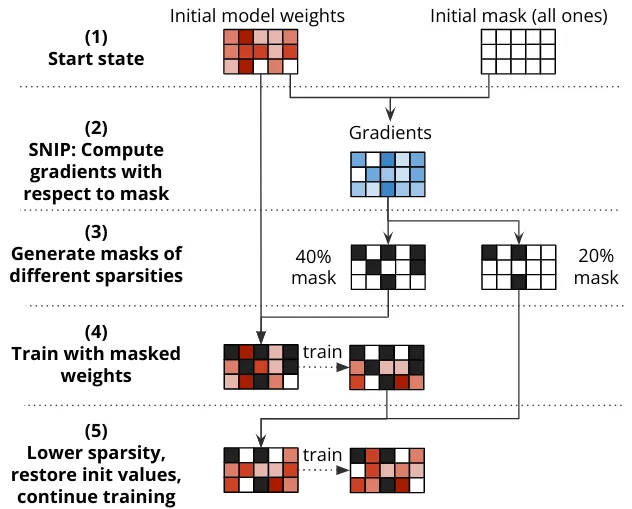
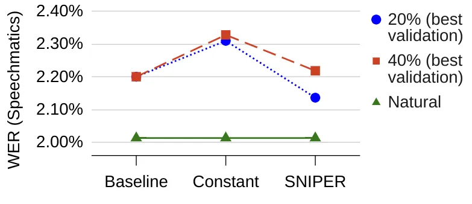

# SNIPER Training: Single-Shot Sparse Training for Text-to-SpeechThanks: This project has received funding from SUTD Kickstarter Initiative no. SKI 2021_04_06 and the President’s Graduate Fellowship.

Perry Lam¹, Huayun Zhang², Nancy F. Chen², Berrak Sisman³ and Dorien
Herremans¹ Affiliation: ¹Audio, Music, and AI Lab, Singapore University
of Technology and Design, Singapore  
perry_lam@mymail.sutd.edu.sg, dorien_herremans@sutd.edu.sg
Affiliation: ²Institute for Infocomm Research, A\*STAR, Singapore  
{Zhang_Huayun, nfychen}@i2r.a-star.edu.sg Affiliation: ³Speech & Machine
Learning Lab, The University of Texas at Dallas, USA  
Berrak.Sisman@UTDallas.edu

###### Abstract

Text-to-speech (TTS) models have achieved remarkable naturalness in
recent years, yet like most deep neural models, they have more
parameters than necessary. Sparse TTS models can improve on dense models
via pruning and extra retraining, or converge faster than dense models
with some performance loss. Thus, we propose training TTS models using
decaying sparsity, i.e. a high initial sparsity to accelerate training
first, followed by a progressive rate reduction to obtain better
eventual performance. This decremental approach differs from current
methods of incrementing sparsity to a desired target, which costs
significantly more time than dense training. We call our method SNIPER
training: Single-shot Initialization Pruning Evolving-Rate training. Our
experiments on FastSpeech2 show that we were able to obtain better
losses in the first few training epochs with SNIPER, and that the final
SNIPER-trained models outperformed constant-sparsity models and edged
out dense models, with negligible difference in training time. Our code
is available on Github¹¹ 1 https://github.com/iamanigeeit/sniper.

###### Index Terms: 

speech synthesis, text-to-speech, sparsity, network pruning, training
acceleration

## I Introduction

Although classical parametrized models only require $`n`$ parameters to
fit $`n`$ data points, \[1\] showed that large over-parameterized models
with at least $`nd`$ parameters are in fact necessary for smooth data
interpolation (where $`d`$ is the data dimensionality). This explains
the dominance of ever-larger neural models, but we have now reached the
era of extreme diminishing returns. For instance, \[2\] found that the
compute power needed to reduce error rates by a factor of $`x`$ was at
least $`x^{10}`$ across a range of image classification and natural
language processing tasks.

Counteracting this, researchers have proposed methods to compress
models, such as knowledge distillation, tensor decomposition,
quantization, and parameter sharing. The most flexible approaches
involve sparsification techniques, which can be applied to various
training stages and network architectures.

For instance, \[3\] showed that when a dense network is initialized,
some subnetworks (winning tickets) can match or improve the
same-iteration performance of the full network when trained in
isolation. However, \[4\] suggests that the winning tickets cannot be
found without prior dense training and therefore requires much more time
to train than the original unpruned model. The additional time taken
holds for other sparsification schemes like dynamic pruning, which
regrows weights during training according to gradients \[5\] or
momentum \[6\] in each backward pass. Sparse models also do not improve
memory usage or training/inference time unless sparsities are very high
(above 80% for 2-D float32 tensors).

Since the goal is not just to produce a sparse model but to improve the
performance-cost tradeoff, we propose a single-shot sparse training
scheme that progressively decreases sparsity to 0 rather than increasing
it to a target sparsity. Intuitively, we want to direct gradient updates
to more important weights at the start for faster convergence and to the
less important weights later. We apply our method to FastSpeech2 \[7\]
and evaluate its effectiveness via naturalness, intelligibility,
prosody, and training time, comparing it to both dense and
constant-sparsity models. We observe that the final SNIPER-trained
models overtake the constant-sparsity models on nearly all metrics and
surpass the dense model in most.

In the next section, we introduce the related work on fast sparse
training, followed by our proposed SNIPER training framework in Section
III, our experiment setup in Section IV, and finally we report our
results in Section V.

## II Related Work on Fast Sparse Training

### II-A Hardware-Dependent Training

There is a large body of research that proposes neural net accelerators
on the hardware level \[8\], but such designs have not been commercially
realized. The closest implementations currently available are NVIDIA
Sparse Tensor Cores \[9\], where the inference speed doubles if 2:4
sparsity is satisfied in a tensor (i.e. every block of 4 elements has 2
zeros). \[10\] was the first to exploit this: they pruned the smallest
weights from $`\mathcal{W}`$ to $`\widetilde{\mathcal{W}}`$ in each
block before the forward pass. After the backward pass, they corrected
the approximation error by changing the familiar weights update
$`\mathcal{W}_{t+1}=\mathcal{W}_{t}-\alpha_{t}g(\widetilde{\mathcal{W}}_{t})`$
to
$`\mathcal{W}_{t+1}=\mathcal{W}_{t}-\alpha_{t}(g(\widetilde{\mathcal{W}}_{t})+\lambda(m_{t}\odot\mathcal{W}_{t}))`$
where $`\alpha`$ is the learning rate, $`g`$ is the gradient,
$`\lambda`$ is a relative weight and $`m`$ is the weights mask. To allow
sparse speedup on the backward pass as well, \[11\] proposed a greedy
pruning method to find transposable masks that had the 2:4 property both
row-wise and column-wise. They further proved that their method ensured
that the $`\ell_{1}`$-norm of the pruned weights $`W(P)`$ was at most
$`<2W^{*}`$ (weights from optimal pruning).

### II-B Mixture of Experts

Aside from hardware-specific methods, there has been a recent trend of
creating models with multiple subnetworks and a routing layer to
distribute inputs. This is a variant of Mixture-of-Experts and is common
in large language models. Pioneering this technique was the 1.6 trillion
parameter Switch-Transformer model \[12\], which trained up to
4$`\times`$ faster than T5-XXL \[13\]. While the original Transformer
model contains a single dense feed-forward layer after each multi-head
attention layer, the Switch-Transformer replaced it with 2,048
feed-forward blocks with a routing mechanism that decides which block
should receive the attention output. In this way, the feed-forward
blocks are sparse as most of them are not used, while training is
accelerated as the data and feed-forward blocks can be parallelized.
Ironically, this approach to sparse speedups makes the overall parameter
count explode.

Due to these shortcomings, there is still a largely unexplored space of
hardware-independent sparse techniques that enhance training and
maintain model size, which we attempt to address.

## III SNIPER Training for TTS

### III-A Sparsity in TTS

While model compression \[14\] and structured pruning \[15\] of speech
representations have advanced in recent years, studies on sparsity in
TTS are rare as TTS is generative in nature and harder to evaluate
automatically, leading to ambiguity in proving technique effectiveness.
Also, complex architectures impede component-wise characterization of
sparse behaviour. Initial work on this topic \[16\] showed that both
text-to-melspec and vocoder models could be pruned, while the output
quality could be maintained or even improved. This was achieved by
pruning the models (with zero weights allowed to be updated), training
to convergence, and re-pruning. \[17\] further tested five sparse
techniques on a Tacotron2 baseline and demonstrated comparable
performance when pruning before, during, or after training. Remarkably,
single-shot network initialization pruning (SNIP) allowed the model to
converge at least 1.9$`\times`$ faster at 40% sparsity, although the
quality degraded slightly.

### III-B SNIP

SNIP \[18\] is one among many foresight pruning methods that obtain a
pruning mask before the training begins. It ranks the importance of a
neural network weight by the change in loss if the weight is zeroed,
estimated by taking the loss gradient with respect to the mask. For a
binary mask $`\bm{m}`$ on weights $`\bm{\mathrm{w}}`$, the effect of
removing $`\bm{\mathrm{w}}_{j}`$ on the loss $`\mathcal{L}_{j}`$ is

```math
\Delta\mathcal{L}_{j}(\bm{\mathrm{w}};\mathcal{D})\approx g_{j}(\bm{\mathrm{w}};\mathcal{D})=\left.\frac{\partial\mathcal{L}(\bm{m}\odot\bm{\mathrm{w}};\mathcal{D})}{\partial m_{j}}\right|_{\bm{m=1}}
```

Other prominent foresight pruning methods include (1) Gradient Signal
Preservation \[19\], a second-order extension of SNIP which calculates
the gradient Hessian to compensate for correlated weights; (2) Neural
Tangent Transfer \[20\], which finds a sparse network linearly
approximating the training evolution of the dense network; and (3)
SynFlow \[21\], a data-free approach that iteratively prunes the weights
with the lowest $`\ell_{1}`$-path norm. Further techniques involve
comparing activation function output or weight magnitudes, possibly with
lookahead to downstream layers \[22\]. Still, \[23\] compared 13 of
these pruning algorithms on image classification and found SNIP to be
the most consistent performer over multiple sparsities and also
relatively simpler to implement.

### III-C SNIPER Training

Because of its consistency, we employ SNIP to determine the weights that
should be masked at each sparsity level. We implement SNIP (Fig. 1) by
saving the initial model weights, initializing the weight masks to
$`\mathbf{1}`$ and computing the gradient with respect to the masks. The
gradients are accumulated over the entire training dataset (or a subset
of data) and saved. Once gradients are saved, we generate masks with
different sparsities by simply removing the lowest absolute gradients;
this takes very little time and the masks are reusable. The various
masks can be swapped during training according to a given schedule,
which constitutes the evolving-rate part of SNIPER. The formal process
is given in Algorithm 1.



Fig. 1: SNIPER example with 40% sparsity reducing to 20%.

We allow multiple options in addition to specifying the schedule: (1)
custom scaling of learning rates by sparsity, (2) limiting the sparsity
of parameters to prevent bottlenecks, (3) limiting the maximum parameter
learning rate, (3) excluding parameters by name, (4) restoring newly
activated weights during a sparsity reduction either to zeros or to the
initial model values, (5) using a subset of the training corpus for
gradient computation with a batch iterator, and (6) resuming from a
previous state.

Schedule $`S`$ \[ epoch $`t\rightarrow`$ sparsity $`s`$ \], Dataset
$`\mathcal{D}`$, Loss function $`\mathcal{L}`$, Epochs to train
$`t_{fin}`$, Param groups $`\mathcal{P}`$

SNIP Gradients $`\mathbf{g}`$, Masks $`M`$ \[ $`t\rightarrow`$ mask
$`\mathbf{m}`$ \]

Final model weights $`\bm{\mathrm{w}}`$

$`\mathbf{g}\leftarrow\mathbf{0}`$

$`\mathbf{m}\leftarrow\mathbf{1}`$

$`\bm{\mathrm{w}}\leftarrow\text{XavierInit()}`$ $`\triangleright`$
Ensures consistent variance for SNIP

for all batch $`b\in\mathcal{D}`$ do

  $`\mathbf{m}\leftarrow\mathbf{1}`$

  $`\mathbf{g}\leftarrow\mathbf{g}+\nabla_{\mathbf{m}}\mathcal{L}(\bm{\mathrm{w}};b)`$

end for

$`n\leftarrow\text{dim}(\mathbf{g})`$

for all $`t,s`$ in $`S`$ do $`\triangleright`$ $`S[0]`$ must be defined

  $`i\leftarrow\lfloor ns\rfloor`$

  $`v\leftarrow\text{sorted}(|\mathbf{g}|)[i]`$

  $`\mathbf{m}_{j}\leftarrow\mathds{1}(|\mathbf{g}_{j}|>v)\ \ \forall j=1\dots\text{dim}(m)`$

  $`M[t]\leftarrow\mathbf{m}`$

end for

for $`t=0,\dots,t_{fin}`$ do

  if $`t`$ in $`M`$ then

   $`\mathbf{m}\leftarrow M[t]`$

   for all $`P\in\mathcal{P}`$ do $`\triangleright`$ Adjust LR of param
groups

     $`\alpha_{P}\leftarrow\text{dim}(P)/\sum_{j\in P}m_{j}`$

   end for

  end if

  for all batch $`b\in\mathcal{D}`$ do

   $`\mathbf{g}^{\prime}\leftarrow\nabla_{\bm{\mathrm{w}}}\mathcal{L}(\bm{\mathrm{w}}\odot\mathbf{m};b)`$

   for all $`P\in\mathcal{P}`$ do

     $`\bm{\mathrm{w}}_{P}\leftarrow\bm{\mathrm{w}}_{P}-\alpha_{P}\cdot\mathbf{g}^{\prime}_{P}`$

   end for

  end for

end for

Algorithm 1 SNIPER Training

## IV Experiments

In our experiments, we compare SNIPER-trained models against both dense
and constant-sparsity models in performance (naturalness and
intelligibility) and training time.

### IV-A Baseline and Dataset

We use the open-source ESPnet2 \[24\] version of FastSpeech2 with
default settings and a pretrained ParallelWaveGAN \[25\] vocoder. The
ground-truth durations were generated using the Montreal Forced Aligner
(MFA) according to the original paper \[7\]. We train FastSpeech2 for
400 epochs (320k steps) on the LJSpeech \[26\] dataset with an 80:10:10
train-validation-eval split, retaining the model checkpoint with the
best validation loss. In all experiments, the same initial values and
random seed were used to reduce variability.

### IV-B SNIPER

In our SNIPER training runs, we exclude the embedding and normalization
layers and set initial sparsity to 20% and 40% with a maximum individual
parameter sparsity of 75%. Thiscaused the overall model sparsity to be
19.8% and 38.2%). We then reduce sparsity to 0% according to the
schedules shown in Table I. These schedules were created by decreasing
sparsity once the constant-sparsity training loss exceeds dense training
loss at the same epoch. We compare them against the dense model
(Baseline) and constant-sparsity models (Constant), as reported in Table
I.

|          |          |                   |
| -------- | -------- | ----------------- |
| Baseline | Constant | SNIPER            |
| 0%       | 20%      | 20% (epoch 1-5)   |
|          |          | 10% (epoch 6-10)  |
|          |          | 0% (epoch 11+)    |
|          | 40%      | 40% (epoch 1-5)   |
|          |          | 20% (epoch 6-10)  |
|          |          | 10% (epoch 11-20) |
|          |          | 0% (epoch 21+)    |

TABLE I: Sparsity of models following \[17\]. SNIPER schedules are
similar to exponential step learning rate decay.

## V Results

### V-A Naturalness

Naturalness was measured via mean opinion score (MOS) from 1 (worst) to
5 (best), conducted via PsyToolkit \[27, 28\]. We obtained 19 full
responses. As a control, participants also rated MOS for the
human-generated ground truth samples (Natural). SNIPER training
marginally gave the most consistent improvements over the baseline, as
reported in Table II.

| Sparsity | Baseline   | Constant   | SNIPER     | Natural    |
| -------- | ---------- | ---------- | ---------- | ---------- |
| 20%      | 3.76 ±0.86 | 3.82 ±0.94 | 3.83 ±0.89 | 4.45 ±0.64 |
| 40%      |            | 3.65 ±0.95 | 3.78 ±0.96 |            |

TABLE II: Resulting MOS scores. Bold = best model.

Given that the mean MOS scores are close and the variability is large,
we also performed a three-way preference test to enable a better
comparison. Participants were asked to rate the best and worst samples
in each set of 3 (Baseline, Constant, and SNIPER) samples at both 20%
and 40% sparsities with 16 utterances each. The SNIPER-trained models
were preferred in most settings, as reported in Table III.

| Sparsity    | Baseline | Constant | SNIPER | $`p`$-value |
| ----------- | -------- | -------- | ------ | ----------- |
| 20% (best)  | 39.5     | 23.0     | 37.5   | 0.056       |
| 20% (worst) | 36.2     | 38.2     | 25.7   |             |
| 40% (best)  | 36.2     | 21.1     | 42.8   | 0.101       |
| 40% (worst) | 34.2     | 34.2     | 31.6   |             |

TABLE III: Results for the preference test (% rated best/worst). Bold =
best result. The $`p`$-values are from Friedman’s test with Baseline,
Constant, and SNIPER as the 3 treatment groups ranked in order of
(3-best, 2-middle, 1-worst).

### V-B Intelligibility

We used the commercial Speechmatics engine to transcribe generated audio
across the entire test set for each model, and measured intelligibility
by the word error rate (WER) of the transcripts against normalized
LJSpeech text. On average, SNIPER-trained models were slightly better
than baseline.



Fig. 2: WER weighted by ground truth length.

### V-C Training time

All experiments were run on a single GeForce RTX3090 GPU. Calculating
SNIP gradients across the whole dataset took 7.7 minutes and mask
creation took less than 1 second (one-time operation). The slight delay
in training sparse models comes from masking during the forward pass,
but the difference for SNIPER is negligible.

| Sparsity | Baseline | Constant | SNIPER |
| -------- | -------- | -------- | ------ |
| 20%      | 13.1     | 13.5     | 13.1   |
| 40%      |          | 13.5     | 13.2   |

TABLE IV: Training time in hours.

## VI Conclusion

Our proposed SNIPER training method is the first attempt at using
decreasing sparsity to improve TTS training. Even though the sparse
FastSpeech2 models converged faster only during the initial training
epochs, we have shown that the SNIPER-trained models are clearly
superior to traditional sparse models and slightly better than dense
models, especially in head-to-head comparisons. In future work, SNIPER
may be expanded to allow automatic sparsity selection during training
based on convergence rate, or improve upon dropout, which is a random
and less directed form of sparsity.

## References

- \[1\] S. Bubeck and M. Sellke, “A universal law of robustness via
  isoperimetry,” in _Advances in Neural Information Processing Systems
  34_, 2021, pp. 28 811–28 822.
- \[2\] N. C. Thompson, K. H. Greenewald, K. Lee, and G. F. Manso, “The
  computational limits of deep learning,” _CoRR_, vol.
  abs/2007.05558, 2020.
- \[3\] J. Frankle and M. Carbin, “The lottery ticket hypothesis:
  Finding sparse, trainable neural networks,” in _7th Int. Conf. on
  Learning Representations, ICLR_, 2019.
- \[4\] J. Maene, M. Li, and M. Moens, “Towards understanding iterative
  magnitude pruning: Why lottery tickets win,” _CoRR_, vol.
  abs/2106.06955, 2021.
- \[5\] X. Dai, H. Yin, and N. K. Jha, “Nest: A neural network synthesis
  tool based on a grow-and-prune paradigm,” _IEEE Transactions on
  Computers_, vol. 68, no. 10, pp. 1487–1497, oct 2019.
- \[6\] T. Dettmers and L. Zettlemoyer, “Sparse networks from scratch:
  Faster training without losing performance,” _arXiv:1907.04840_, 2019.
- \[7\] Y. Ren, C. Hu, X. Tan, T. Qin, S. Zhao, Z. Zhao, and T. Liu,
  “Fastspeech 2: Fast and high-quality end-to-end text to speech,” in
  _9th ICLR_, 2021.
- \[8\] Y. Chen, Y. Xie, L. Song, F. Chen, and T. Tang, “A survey of
  accelerator architectures for deep neural networks,” _Engineering_,
  vol. 6, no. 3, pp. 264–274, 2020.
- \[9\] A. K. Mishra, J. A. Latorre, J. Pool, D. Stosic, D. Stosic,
  G. Venkatesh, C. Yu, and P. Micikevicius, “Accelerating sparse deep
  neural networks,” _arXiv_, vol. 2104.08378, 2021.
- \[10\] A. Zhou, Y. Ma, J. Zhu, J. Liu, Z. Zhang, K. Yuan, W. Sun, and
  H. Li, “Learning N: M fine-grained structured sparse neural networks
  from scratch,” in _9th Int. Conf. on Learning Representations,
  ICLR_, 2021.
- \[11\] I. Hubara, B. Chmiel, M. Island, R. Banner, J. Naor, and
  D. Soudry, “Accelerated sparse neural training: A provable and
  efficient method to find n: m transposable masks,” _Adv. Neural Inf.
  Process Syst._, vol. 34, pp. 21 099–21 111, 2021.
- \[12\] W. Fedus, B. Zoph, and N. Shazeer, “Switch transformers:
  Scaling to trillion parameter models with simple and efficient
  sparsity,” _J. Mach. Learn. Res._, vol. 23, no. 120, pp. 1–39, 2022.
- \[13\] C. Raffel, N. Shazeer, A. Roberts, K. Lee, S. Narang,
  M. Matena, Y. Zhou, W. Li, and P. J. Liu, “Exploring the limits of
  transfer learning with a unified text-to-text transformer,” _J. Mach.
  Learn. Res._, vol. 21, pp. 140:1–140:67, 2020.
- \[14\] H. R. Guimarães, A. Pimentel, A. R. Avila, M. Rezagholizadeh,
  B. Chen, and T. H. Falk, “Robustdistiller: Compressing universal
  speech representations for enhanced environment robustness,” in _IEEE
  Int. Conf. on Acoustics, Speech and Signal Processing (ICASSP)_, 2023,
  pp. 1–5.
- \[15\] H. Wang, S. Wang, W.-Q. Zhang, S. Hongbin, and Y. Wan,
  “Task-Agnostic Structured Pruning of Speech Representation Models,” in
  _Proc. INTERSPEECH 2023_, 2023, pp. 231–235.
- \[16\] C.-I. J. Lai, E. Cooper, Y. Zhang, S. Chang, K. Qian, Y.-L.
  Liao, Y.-S. Chuang, A. H. Liu, J. Yamagishi, D. Cox, and J. Glass, “On
  the interplay between sparsity, naturalness, intelligibility, and
  prosody in speech synthesis,” in _IEEE Int. Conf. on Acoustics, Speech
  and Signal Processing (ICASSP)_, 2022, pp. 8447–8451.
- \[17\] P. Lam, H. Zhang, N. Chen, and B. Sisman, “EPIC TTS Models:
  Empirical Pruning Investigations Characterizing Text-To-Speech
  Models,” in _Proc. Interspeech 2022_, 2022, pp. 823–827.
- \[18\] N. Lee, T. Ajanthan, and P. H. S. Torr, “Snip: single-shot
  network pruning based on connection sensitivity,” in _7th Int. Conf.
  on Learning Representations, ICLR_, 2019.
- \[19\] C. Wang, G. Zhang, and R. B. Grosse, “Picking winning tickets
  before training by preserving gradient flow,” in _8th Int. Conf. on
  Learning Representations, ICLR_, 2020.
- \[20\] T. Liu and F. Zenke, “Finding trainable sparse networks through
  neural tangent transfer,” in _Proc. of the 37th Int. Conf. on Machine
  Learning, ICML_, vol. 119. PMLR, 2020, pp. 6336–6347.
- \[21\] H. Tanaka, D. Kunin, D. L. K. Yamins, and S. Ganguli, “Pruning
  neural networks without any data by iteratively conserving synaptic
  flow,” in _Advances in Neural Information Processing Systems 33:
  NeurIPS_, 2020.
- \[22\] J. Lee, S. Park, S. Mo, S. Ahn, and J. Shin, “Layer-adaptive
  sparsity for the magnitude-based pruning,” in _9th Int. Conf. on
  Learning Representations, ICLR_, 2021.
- \[23\] N. James, “Gauging the state-of-the-art for foresight weight
  pruning on neural networks,” Bachelor’s Thesis, University of
  Arkansas, Fayetteville, 2022.
- \[24\] T. Hayashi, R. Yamamoto, T. Yoshimura, P. Wu, J. Shi, T. Saeki,
  Y. Ju, Y. Yasuda, S. Takamichi, and S. Watanabe, “Espnet2-tts:
  Extending the edge of TTS research,” _CoRR_, vol.
  abs/2110.07840, 2021.
- \[25\] R. Yamamoto, E. Song, and J.-M. Kim, “Parallel wavegan: A fast
  waveform generation model based on generative adversarial networks
  with multi-resolution spectrogram,” in _IEEE Int. Conf. on Acoustics,
  Speech and Signal Processing (ICASSP)_, 2020, pp. 6199–6203.
- \[26\] K. Ito and L. Johnson, “The lj speech dataset,”
  https://keithito.com/LJ-Speech-Dataset/, 2017.
- \[27\] G. Stoet, “Psytoolkit: A software package for programming
  psychological experiments using linux,” _Behavior Research Methods_,
  vol. 42, pp. 1096–1104, 2010.
- \[28\] ——, “Psytoolkit: A novel web-based method for running online
  questionnaires and reaction-time experiments,” _Teaching of
  Psychology_, vol. 44, no. 1, pp. 24–31, 2017.
