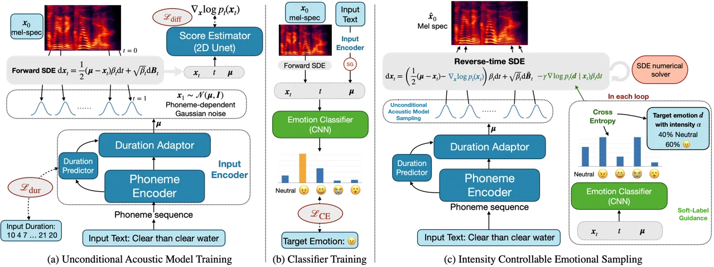
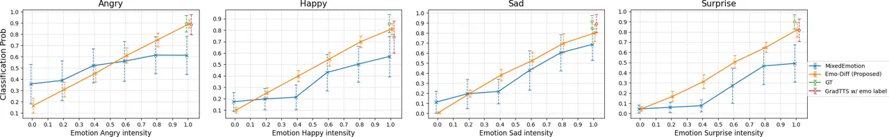
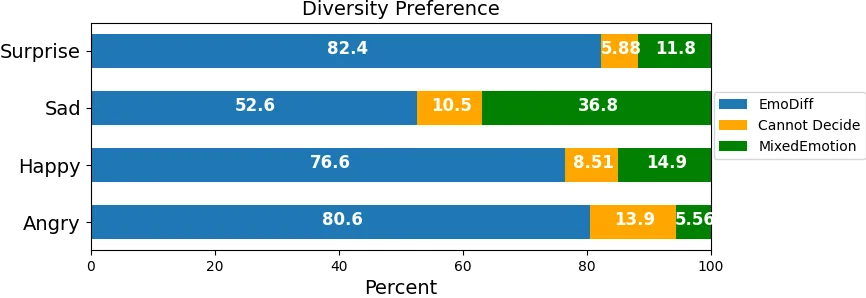

# EmoDiff: Intensity Controllable Emotional Text-to-Speech with Soft-Label Guidance

Yiwei Guo    Chenpeng Du    Xie Chen    Kai Yu\sthanksCorresponding
author

###### Abstract

Although current neural text-to-speech (TTS) models are able to generate
high-quality speech, intensity controllable emotional TTS is still a
challenging task. Most existing methods need external optimizations for
intensity calculation, leading to suboptimal results or degraded
quality. In this paper, we propose EmoDiff, a diffusion-based TTS model
where emotion intensity can be manipulated by a proposed soft-label
guidance technique derived from classifier guidance. Specifically,
instead of being guided with a one-hot vector for the specified emotion,
EmoDiff is guided with a soft label where the value of the specified
emotion and Neutral is set to $`\alpha`$ and $`1-\alpha`$ respectively.
The $`\alpha`$ here represents the emotion intensity and can be chosen
from 0 to 1. Our experiments show that EmoDiff can precisely control the
emotion intensity while maintaining high voice quality. Moreover,
diverse speech with specified emotion intensity can be generated by
sampling in the reverse denoising process.

###### Index Terms: 

Emotional TTS, emotion intensity control, denoising diffusion models,
classifier guidance

^(†)^(†)address: MoE Key Lab of Artificial Intelligence, AI Institute  
X-LANCE Lab, Department of Computer Science and Engineering  
Shanghai Jiao Tong University, Shanghai, China  
{cantabile_kwok, duchenpeng, chenxie95, kai.yu}@sjtu.edu.cn

## 1 Introduction

Although current neural text-to-speech (TTS) models are able to generate
high-quality speech, such as Grad-TTS \[1\], VITS \[2\] and VQTTS \[3\],
intensity controllable emotional TTS is still a challenging task. Unlike
prosody modelling in recent literatures \[4, 5, 6\] that no specific
label is provided in advance, emotional TTS typically utilizes dataset
with categorical emotion labels. Mainstream emotional TTS models \[7,
8\] can only synthesize emotional speech given the emotion label without
intensity controllability.

In intensity controllable TTS models, efforts have been made to properly
define and calculate emotion intensity values for training. The most
preferred method to define and obtain emotion intensity is the relative
attributes rank (RAR)\[9\], which is used in \[10, 11, 12, 13, 14\]. RAR
seeks a ranking matrix by a max-margin optimization problem, which is
solved by support vector machines. The solution is then fed to the model
for training. As this is a manually constructed and separated stage, it
might result in suboptimal results that bring bias into training. In
addition to RAR, the operation on emotion embedding space is also
explored. \[15\] designs an algorithm to maximize distance between
emotion embeddings, and interpolates the embedding space to control
emotion intensity. \[16\] quantizes the distance of emotion embeddings
to obtain emotion intensities. However, the structure of the embedding
space also greatly influences the performance of these models, resulting
in the need for careful extra constraints. Intensity control for emotion
conversion is investigated in \[17, 18\], with similar methods. Some of
the mentioned works also have degraded speech quality. As an example,
\[14\] (which we refer to as “MixedEmotion” later) is an autoregressive
model with intensity values from RAR to weight the emotion embeddings.
It adopts pretraining to improve synthetic quality, but still with
obvious quality degradation.

To overcome these issues, we need a conditional sampling method that can
directly control emotions weighted with intensity. In this work, we
propose a soft-label guidance technique, based on the classifier
guidance technique \[19, 20\] in denoising diffusion models \[21, 22\].
Classifier guidance is an efficient sampling technique that uses the
gradient of a classifier to guide the sampling trajectory given a
one-hot class label.

In this paper, based on the extended soft-label guidance, we propose
EmoDiff which is an emotional TTS model with sufficient intensity
controllability. Specifically, we first train an emotion-unconditional
acoustic model. Then an emotion classifier is trained on any
$`\bm{x}_{t}`$ on the diffusion process trajectory where $`t`$ is the
diffusion timestamp. In inference, we guide the reverse denoising
process with the classifier and a soft emotion label where the value of
the specified emotion and Neutral is set to $`\alpha`$ and $`1-\alpha`$
respectively, instead of a one-hot distribution where only the specified
emotion is 1 while all others are 0. $`\alpha\in[0,1]`$ here represents
the emotion intensity. Our experiments show that EmoDiff can precisely
control the emotion intensity while maintaining high voice quality.
Moreover, it also generates diverse speech samples even with the same
emotion as a strength of diffusion models \[19\].

In short words, the main advantages of EmoDiff are:

1.  1.  We define the emotion intensity as the weight for classifier
        guidance when using soft-labels. This achieves precise intensity
        control in terms of classifier probability, needless for extra
        optimizations. Thus it enables us to generate speech with arbitrary
        specified emotion intensity effectively.
2.  2.  It poses no harm to the synthesized speech. The generated samples
        have good quality and naturalness.
3.  3.  It also generates diverse samples even in the same emotion.

## 2 diffusion models with classifier guidance

### 2.1 Denoising Diffusion Models and TTS Applications

Denoising diffusion probabilistic models \[21, 22\] have proven
successful in many generative tasks. In the score-based interpretation
\[23, 22\], diffusion models construct a forward stochastic differential
equation (SDE) to transform the data distribution $`p_{0}(\bm{x}_{0})`$
into a known distribution $`p_{T}(\bm{x}_{T})`$, and use a corresponding
reverse-time SDE to generate realistic samples starting from noises.
Thus, the reverse process is also called “denoising” process. Neural
networks are then to estimate the score function
$`\nabla_{\bm{x}}\log p_{t}(\bm{x}_{t})`$ for any $`t\in[0,T]`$ on the
SDE trajectory, with score-matching objectives \[23, 22\]. In
applications, diffusion models bypass the training instability and mode
collapse problem in GANs, and outperform previous methods on sample
quality and diversity \[19\].

Denoising diffusion models have also been used in TTS \[24, 1, 25, 26,
27\] and vocoding \[28, 29\] tasks, with remarkable results. In this
paper, we build EmoDiff on the design of GradTTS \[1\]. Denote
$`\bm{x}\in\mathbb{R}^{d}`$ a frame of mel-spectrogram, it constructs a
forward SDE:

```math
\mathrm{d}\bm{x}_{t}=\frac{1}{2}\bm{\Sigma}^{-1}(\bm{\mu}-\bm{x}_{t})\beta_{t}\mathrm{d}t+\sqrt{\beta_{t}}\mathrm{d}\bm{B}_{t} \tag{1}
```

where $`\bm{B}_{t}`$ is a standard Brownian motion and $`t\in[0,1]`$ is
the SDE time index. $`\beta_{t}`$ is referred to as noise schedule such
that $`\beta_{t}`$ is increasing and
$`\exp\left\{-\int_{0}^{1}\beta_{s}\mathrm{d}s\right\}\approx 0`$. Then
we have
$`p_{1}(\bm{x}_{1})\approx\mathcal{N}(\bm{x};\bm{\mu},\bm{\Sigma})`$.
This SDE also indicates the conditional distribution
$`\bm{x}_{t}\mid\bm{x}_{0}\sim\mathcal{N}(\bm{\rho}(\bm{x}_{0},\bm{\Sigma},\bm{\mu},t),\bm{\lambda}(\bm{\Sigma},t))`$,
where $`\bm{\rho}(\cdot),\bm{\lambda}(\cdot)`$ both has closed forms.
Thus we can directly sample $`\bm{x}_{t}`$ from $`\bm{x}_{0}`$. In
practice, we set $`\bm{\Sigma}`$ to identity matrix and
$`\bm{\lambda}(\bm{\Sigma},t)`$ therefore becomes $`\lambda_{t}\bm{I}`$
where $`\lambda_{t}`$ is a scalar with known closed form. Meanwhile, we
condition the terminal distribution $`p_{1}(\bm{x}_{1})`$ on text, i.e.
let $`\bm{\mu}=\bm{\mu}_{\theta}(\bm{y})`$, where $`\bm{y}`$ is the
aligned phoneme representation of that frame.

The SDE of Eq.(1) has a reverse-time counterpart:

```math
\mathrm{d}\bm{x}_{t}=\left(\frac{1}{2}\bm{\Sigma}^{-1}(\bm{\mu}-\bm{x}_{t})-\nabla_{\bm{x}}\log p_{t}(\bm{x}_{t})\right)\beta_{t}\mathrm{d}t+\sqrt{\beta_{t}}\mathrm{d}\bm{\widetilde{B}}_{t} \tag{2}
```

where $`\nabla\log p_{t}(\bm{x}_{t})`$ is the score function that is to
be estimated, and $`\bm{\widetilde{B}}_{t}`$ is a reverse-time Brownian
motion. It shares the trajectory of distribution $`p_{t}(\bm{x}_{t})`$
with forward SDE in Eq.(1). So, solving it from
$`\bm{x}_{1}\sim\mathcal{N}(\bm{\mu},\bm{\Sigma})`$, we can end up with
a realistic sample $`\bm{x}_{0}\sim p(\bm{x}_{0}\mid\bm{y})`$. A neural
network $`\bm{s}_{\theta}(\bm{x}_{t},\bm{y},t)`$ is trained to estimate
the score function, in the following score-matching \[23\] objective:

```math
\min_{\theta}\mathcal{L}=\mathbb{E}_{\bm{x}_{0},\bm{y},t}[\lambda_{t}\|\bm{s}_{\theta}(\bm{x}_{t},\bm{y},t)-\nabla_{\bm{x}_{t}}\log p(\bm{x}_{t}\mid\bm{x}_{0})\|^{2}]. \tag{3}
```

### 2.2 Conditional Sampling Based on Classifier Guidance



Figure 1: Training and sampling diagrams of EmoDiff. In training,
$`\bm{x}_{t}`$ is directly sampled from known distribution
$`p(\bm{x}_{t}\mid\bm{x}_{0})`$. When sampling with a certain emotion
intensity, the score function $`\nabla_{\bm{x}}\log p_{t}(\bm{x}_{t})`$
is estimated by score estimator. “SG” means stop gradient operation.

Denoising diffusion models provide a new way of modeling conditional
probabilities $`p(\bm{x}\mid c)`$ where $`c`$ is a class label. Suppose
we now have an unconditional generative model $`p(\bm{x})`$, and a
classifier $`p(c\mid\bm{x})`$. By Bayes formula, we have

```math
\nabla_{\bm{x}}\log p(\bm{x}\mid c)=\nabla_{\bm{x}}\log p(c\mid\bm{x})+\nabla_{\bm{x}}\log p(\bm{x}). \tag{4}
```

In the diffusion framework, to sample from conditional distribution
$`p(\bm{x}\mid c)`$, we need to estimate score function
$`\nabla_{\bm{x}}\log p(\bm{x}_{t}\mid c)`$. By Eq.(4), we only need to
add the gradient from a classifier to the unconditional model. This
conditional sampling method is named classifier guidance \[19, 20\], and
is also used in unsupervised TTS \[30\].

In practice, classifier gradients are often scaled \[19, 30\] to control
the strength of guidance. Instead of original
$`\nabla_{\bm{x}}\log p(c\mid\bm{x})`$ in Eq.(4), we now use
$`\gamma\nabla_{\bm{x}}\log p(c\mid\bm{x})`$, where $`\gamma\geq 0`$ is
called guidance level. Larger $`\gamma`$ will result in highly
class-correlated samples while smaller one will encourage sample
variability \[19\].

Different from ordinary classifiers, the input to the classifier used
here is all the $`\bm{x}_{t}`$ along the trajectory of SDE in Eq.(1),
instead of clean $`\bm{x}_{0}`$ only. The time index $`t`$ can be
anything in $`[0,1]`$. Thus, the classifier can also be denoted as
$`p(c\mid\bm{x}_{t},t)`$.

While Eq.(6) can effectively control sampling on class label $`c`$, it
cannot be directly applied to soft-labels, i.e. labels weighted with
intensity, as the guidance $`p(c\mid\bm{x})`$ is not well-defined now.
Therefore, we extend this technique for emotion intensity control in
Section 3.2.

## 3 EmoDiff

### 3.1 Unconditional Acoustic Model and Classifier Training

The training of EmoDiff mainly includes the training of the
unconditional acoustic model and emotion classifier. We first train a
diffusion-based acoustic model on emotional data, but don’t provide it
with emotion conditions. This is referred to as “unconditional acoustic
model training” as in Figure 1(a). This model is based on GradTTS \[1\],
except that we provide explicit duration sequence by forced aligners to
ease duration modeling. In this stage, the training objective is
$`\mathcal{L}_{\text{dur}}+\mathcal{L}_{\text{diff}}`$, where
$`\mathcal{L}_{\text{dur}}`$ is the $`\ell_{2}`$ loss of logarithmic
duration, and $`\mathcal{L}_{\text{diff}}`$ is the diffusion loss as
Eq.(3). In practice, following GradTTS, we also adopt prior loss
$`\mathcal{L}_{\text{prior}}=-\log\mathcal{N}(\bm{x}_{0};\bm{\mu},\bm{I})`$
to encourage converging. For notation simplicity, we use
$`\mathcal{L}_{\text{diff}}`$ to denote diffusion and prior loss
together in Figure 1(a).

After training, the acoustic model can estimate score function of noisy
mel-spectrogram $`\bm{x}_{t}`$ given input phoneme sequence $`\bm{y}`$,
i.e. $`\nabla\log p(\bm{x}_{t}\mid\bm{y})`$, which is unconditonal of
emotion labels. Following Section 1, we then need an emotion classifier
to distinguish emotion categories $`e`$ from noisy mel-spectrograms
$`\bm{x}_{t}`$. Meanwhile, as we always have a text condition
$`\bm{y}`$, the classifier is formulated as
$`p(e\mid\bm{x}_{t},\bm{y},t)`$. As is shown in Figure 1(b), the input
to the classifier consists of three components: SDE timestamp $`t`$,
noisy mel-spectrogram $`\bm{x}_{t}`$ and phoneme-dependent Gaussian mean
$`\bm{\mu}`$. This classifier is trained with the standard cross-entropy
loss $`\mathcal{L}_{\text{CE}}`$. Note that we freeze the acoustic model
parameters in this stage, and only update the weights in emotion
classifier.

As we always need text $`\bm{y}`$ as condition along through the paper,
we omit it and denote this classifier as $`p(e\mid\bm{x})`$ in later
sections to simplify the notation, if no ambiguity is caused.

### 3.2 Intensity Controllable Sampling with Soft-Label Guidance

In this section, we extend the classifier guidance to soft-label
guidance which can control emotion weighted with intensity. Suppose the
number of basic emotions is $`m`$, and every basic emotion $`e_{i}`$ has
a one-hot vector form
$`\bm{e}_{i}\in\mathbb{R}^{m},i\in\{0,1,...,m-1\}`$. For each
$`\bm{e}_{i}`$, only the $`i`$-th dimension is 1. We specially use
$`\bm{e}_{0}`$ to denote Neutral. For an emotion weighted with intensity
$`\alpha`$ on $`\bm{e}_{i}`$, we define it to be
$`\bm{d}=\alpha\bm{e}_{i}+(1-\alpha)\bm{e}_{0}`$. Then the gradient of
log-probability of clasifier $`p(\bm{d}\mid\bm{x})`$ w.r.t $`\bm{x}`$
can be defined as

```math
\nabla_{\bm{x}}\log p(\bm{d}\mid\bm{x})\triangleq\alpha\nabla_{\bm{x}}\log p(e_{i}\mid\bm{x})+(1-\alpha)\nabla_{\bm{x}}\log p(e_{0}\mid\bm{x}). \tag{5}
```

The intuition of this definition is that, intensity $`\alpha`$ stands
for the contribution of emotion $`e_{i}`$ on the sampling trajectory of
$`\bm{x}`$. Larger $`\alpha`$ means we sample $`\bm{x}`$ along a
trajectory with large “force” towards emotion $`e_{i}`$, otherwise
$`e_{0}`$. Thus we can extend Eq.(4) to

```math
\displaystyle\nabla_{\bm{x}}\log p(\bm{x}\mid\bm{d})=\alpha\nabla_{\bm{x}}\log p(e_{i}\mid\bm{x}) \displaystyle+(1-\alpha)\nabla_{\bm{x}}\log p(e_{0}\mid\bm{x})
```

```math
\displaystyle+\nabla_{\bm{x}}\log p(\bm{x}). \tag{6}
```

When the intensity $`\alpha`$ is $`1.0`$ (100% emotion $`e_{i}`$) or
$`0.0`$ (100% Neutral), the above operation reduces to the standard
classifier guidance form Eq.(4). Hence we can use the soft-label
guidance Eq.(5) in the sampling process, and generate a realistic sample
with specified emotion $`\bm{d}=\alpha\bm{e}_{i}+(1-\alpha)\bm{e}_{0}`$
with intensity $`\alpha`$.

Figure 1(c) illustrates the intensity controllable sampling process.
After feeding the acoustic model and obtaining phoneme-dependent
$`\bm{\mu}`$ sequence, we sample
$`\bm{x}_{1}\sim\mathcal{N}(\bm{\mu},\bm{I})`$ and simulate reverse-time
SDE from $`t=1`$ to $`t=0`$ through a numerical simulator. In each
simulator update, we feed the classifier with current $`\bm{x}_{t}`$ and
get the output probabilities $`p_{t}(\cdot\mid\bm{x}_{t})`$. Eq.(6) is
then used to calculate the guidance term. Similar as Section 1, we also
scale the guidance term with guidance level $`\gamma`$. At the end, we
obtain $`\hat{\bm{x}}_{0}`$ which is not only intelligible with input
text, but also corresponding to the target emotion $`\bm{d}`$ with
intensity $`\alpha`$. This lead to precise intensity that correlates
well to classifier probability.

Generally, in addition to intensity control, our soft-label guidance is
capable for more complicated control on mixed emotions \[14\]. Denote
$`\bm{d}=\sum_{i=0}^{m-1}w_{i}\bm{e}_{i}`$ a combination of all emotions
where $`w_{i}\in[0,1],\sum_{i=0}^{m-1}w_{i}=1`$, Eq.(5) can be
generalized to

```math
\vskip-2.168pt\nabla_{\bm{x}}\log p(\bm{d}\mid\bm{x})\triangleq\sum_{i=0}^{m-1}w_{i}\nabla_{\bm{x}}\log p(e_{i}\mid\bm{x}).\vskip-1.4457pt \tag{7}
```

Then Eq.(6) can also be expressed in such generalized form. This
extension can also be interpreted from the probabilistic view. As the
combination weights $`\{w_{i}\}`$ can be viewed as a categorical
distribution $`p_{e}(\cdot)`$ over basic emotions $`\{e_{i}\}`$, Eq.(7)
is equivalent to

```math
\displaystyle\nabla_{\bm{x}}\log p(\bm{d}\mid\bm{x}) \displaystyle\triangleq\mathbb{E}_{e\sim p_{e}}\nabla_{\bm{x}}\log p(e\mid\bm{x}) \tag{8}
```

```math
\displaystyle=-\nabla_{\bm{x}}\operatorname{CE}\left[p_{e}(\cdot),p(\cdot\mid\bm{x})\right] \tag{9}
```

where $`\operatorname{CE}`$ is the cross-entropy function. Eq.(9)
implies the fact that we are actually decreasing the cross-entropy of
target emotion distribution $`p_{e}`$ and classifier output
$`p(\cdot\mid\bm{x})`$, when sampling along the gradient
$`\nabla_{\bm{x}}\log p(\bm{d}\mid\bm{x})`$. The gradient of
cross-entropy w.r.t $`\bm{x}`$ can guide the sampling process. Hence,
this soft-label guidance technique can generally be used to control any
arbitrary complex emotion as a weighted combination of several basic
emotions.

In Figure 1(c), we use cross-entropy as a concise notation for
soft-label guidance term. In our intensity control scenario, it reduces
to Eq.(5) mentioned before.

## 4 Experiments and Results



Figure 2: Classification probabilities when controlling on intensity
$`\alpha\in\{0.0,0.2,0.4,0.6,0.8,1.0\}`$. Errorbars represent standard
deviation.

### 4.1 Experimental Setup

We used the English part of the Emotional Speech Dataset (ESD) \[31\] to
perform all the experiments. It has 10 speakers, each with 4 emotional
categories Angry, Happy, Sad, Surprise together with a Neutral category.
There are 350 parallel utterances per speaker and emotion category,
amounting to about 1.2 hours each speaker. Mel-spectrogram and forced
alignments were extracted by Kaldi \[32\] in 12.5ms frame shift and 50ms
frame length, followed by cepstral normalization. Audio samples in these
experiments are available ¹¹ 1
[https://cantabile-kwok.github.io/EmoDiff-intensity-ctrl/](https://cantabile-kwok.github.io/EmoDiff-intensity-ctrl/).

In this paper, we only consider single-speaker emotional TTS problem.
Throughout the following sections, we trained an unconditional GradTTS
acoustic model on all 10 English speakers for a reasonable data
coverage, and a classifier on a female speaker (ID:0015) only. The
unconditional GradTTS model was trained with Adam optimizer at
$`10^{-4}`$ learning rate for 11M steps. We used exponential moving
average on model weights as it is reported to improve diffusion model’s
performance \[22\]. The structure of the classifier is a 4-layer 1D CNN,
with BatchNorm and Dropout in each block. In the inference stage,
guidance level $`\gamma`$ was fixed to 100.

We chose HifiGAN \[33\] trained on all the English speakers here as a
vocoder for all the following experiments.

### 4.2 Emotional TTS Quality

|                      |                 |       |
| -------------------- | --------------- | ----- |
|                      | MOS             | MCD₂₅ |
| GT                   | 4.73$`\pm`$0.09 | \-    |
| GT (voc.)            | 4.69$`\pm`$0.10 | 2.96  |
| MixedEmotion \[14\]  | 3.43$`\pm`$0.12 | 6.62  |
| GradTTS w/ emo label | 4.16$`\pm`$0.10 | 5.75  |
| EmoDiff (ours)       | 4.13$`\pm`$0.10 | 5.98  |

Table 1: MOS and MCD comparisons. MOS is presented with 95% confidence
interval. Note that “GradTTS w/ emo label” cannot control emotion
intensity.

We first measure the speech quality, which contains audio quality and
speech naturalness. We did comparisons of the proposed EmoDiff with the
following systems:

1.  1.  GT and GT (voc.): ground truth recording and analysis synthesis
        result (vocoded with GT mel-spectrogram).
2.  2.  MixedEmotion²² 2 We used the official implementation
        [https://github.com/KunZhou9646/Mixed_Emotions](https://github.com/KunZhou9646/Mixed_Emotions):
        proposed in \[14\]. It is an autoregressive model based on relative
        attributes rank to pre-calculate intensity values for training. It
        much resembles Emovox \[18\] for intensity controllable emotion
        conversion.
3.  3.  GradTTS w/ emo label: a conditional GradTTS model with hard emotion
        labels as input. It therefore does not have intensity
        controllability, but should have good sample quality, as a certified
        acoustic model.

Note that in this experiment, samples from EmoDiff and MixedEmotion were
controlled with $`\alpha=1.0`$ intensity weight, so that they are
directly comparable with others.

Table 1 presents the mean opinion score (MOS) and mel cepstral
distortion (MCD) evaluations. It is shown that the vocoder causes little
deterioration on sample quality, and our EmoDiff outperforms
MixedEmotion baseline with a large margin. Meanwhile, EmoDiff and the
hard-conditioned GradTTS both have decent and very close MOS results.
The MCD results of them only have a small difference. This means EmoDiff
does not harm sample quality for intensity controllability, unlike
MixedEmotion.

### 4.3 Controllability of Emotion Intensity

To evaluate the controllability of emotion intensity, we used our
trained classifier to classify the synthesized samples under a certain
intensity that was being controlled. The $`t`$ input to the classifier
was now set to $`0`$. The average classification probability on the
target emotion class was used as the evaluation metric. Larger values
indicate large discriminative confidence. For both EmoDiff and
MixedEmotion on each emotion, we varied the intensity from
$`\alpha=0.0`$ to $`1.0`$. When intensity is $`0.0`$, it equivalents to
synthesize 100% Neutral samples. Larger intensity should result in
larger probability.

Figure 2 presents the results. To demonstrate the capability of this
classifier, we plotted the classification probability on ground truth
data. To show the performance of hard-conditioned GradTTS model, we also
plotted the probability on its synthesized samples. As it doesn’t have
intensity controllability, we only plotted the values when intensity was
$`1.0`$. Standard deviations are presented as an errobar here as well
for each experiment.

It can be found from the figure that the trained classifier has a
reasonable performance on ground truth data at first. As a remark, the
classification accuracy on validation set is 93.1%. Samples from GradTTS
w/ emo label have some lower classification probabilities. Most
importantly, the proposed EmoDiff always covers a larger range from
intensity $`\alpha=0.0`$ to $`1.0`$ than the baseline. The error range
of EmoDiff is also always lower than the baseline, meaning that our
control is more stable. This proves the effectiveness of our proposed
soft-label guidance technique. We also notice that sometimes EmoDiff
reaches higher classification probability than hard-conditioned GradTTS
at intensity $`1.0`$. This is also reasonable, as conditioning on
emotion labels when training is not guaranteed to achieve better
class-correlation than classifier guidance, with a strong classifier and
sufficient guidance level.

### 4.4 Diversity of Emotional Samples



Figure 3: Diversity preference test of each emotion.

Despite genearating high-quality and intensity controllable emotional
samples, EmoDiff also has good sample diversity even in the same
emotion, benefiting from the powerful generative ability of diffusion
models. To evaluate the diversity of emotional samples, we conducted a
subjective preference test for each emotion between our EmoDiff and
MixedEmotion. Listeners were asked to choose the more diverse one, or
“Cannot Decide”. Note that the test was done for each emotion in
$`\alpha=1.0`$ weight.

Figure 3 shows the preference result. It is clear that for each of the
three emotion categories Angry, Happy and Surprise, EmoDiff owns a large
advantage of being preferred in diversity. Only for Sad, EmoDiff
outperforms the baseline with a little margin. This is mainly because
MixedEmotion is autoregressive, and we found its variation on duration
accounts much especially for Sad samples.

## 5 Conclusion

In this paper, we investigated the intensity control problem in
emotional TTS systems. We defined emotion with intensity to be the
weighted sum of a specific emotion and Neutral, with the weight being
the intensity values. Under this modeling, we extended classifier
guidance technique to soft-label guidance, which enables us to directly
control any arbitrary emotion with intensity instead of a one-hot class
label. By this technique, the proposed EmoDiff can achieve simple but
effective control on emotion intensity, with an unconditional acoustic
model and emotion classifier. Subjective and objective evaluations
demonstrated that EmoDiff outperforms baseline in terms of TTS quality,
intensity controllability and sample diversity. Also, the proposed
soft-label guidance can generally be applied to control more complicated
natural emotions, which we leave as a future work.

## 6 Acknowledgements

This study is supported by Shanghai Municipal Science and Technology
Major Project (2021SHZDZX0102), Jiangsu Technology Project
(No.BE2022059-2).

## REFERENCES

- \[1\] V. Popov, I. Vovk, V. Gogoryan, T. Sadekova, and M. Kudinov,
  “Grad-tts: A diffusion probabilistic model for text-to-speech,” in
  _Proc. ICML_, 2021, pp. 8599–8608.
- \[2\] J. Kim, J. Kong, and J. Son, “Conditional variational
  autoencoder with adversarial learning for end-to-end text-to-speech,”
  in _Proc. ICML_, vol. 139, 2021, pp. 5530–5540.
- \[3\] C. Du, Y. Guo, X. Chen, and K. Yu, “VQTTS: High-Fidelity
  Text-to-Speech Synthesis with Self-Supervised VQ Acoustic Feature,” in
  _Proc. ISCA Interspeech_, 2022, pp. 1596–1600.
- \[4\] G. Sun, Y. Zhang, R. J. Weiss, Y. Cao, H. Zen, and Y. Wu,
  “Fully-hierarchical fine-grained prosody modeling for interpretable
  speech synthesis,” in _Proc. IEEE ICASSP_, 2020, pp. 6264–6268.
- \[5\] C. Du and K. Yu, “Phone-level prosody modelling with GMM-based
  MDN for diverse and controllable speech synthesis,” _IEEE/ACM Trans.
  ASLP._, vol. 30, pp. 190–201, 2021.
- \[6\] Y. Guo, C. Du, and K. Yu, “Unsupervised word-level prosody
  tagging for controllable speech synthesis,” in _Proc. IEEE ICASSP_,
  2022, pp. 7597–7601.
- \[7\] Y. Lee, A. Rabiee, and S. Lee, “Emotional end-to-end neural
  speech synthesizer,” _arXiv preprint arXiv:1711.05447_, 2017.
- \[8\] M. Kim, S. J. Cheon, B. J. Choi, J. J. Kim, and N. S. Kim,
  “Expressive text-to-speech using style tag,” in _Proc. ISCA
  Interspeech_, 2021, pp. 4663–4667.
- \[9\] D. Parikh and K. Grauman, “Relative attributes,” in _Proc.
  ICCV_, 2011, pp. 503–510.
- \[10\] X. Zhu, S. Yang, G. Yang, and L. Xie, “Controlling emotion
  strength with relative attribute for end-to-end speech synthesis,” in
  _Proc. IEEE ASRU_, 2019, pp. 192–199.
- \[11\] Y. Lei, S. Yang, and L. Xie, “Fine-grained emotion strength
  transfer, control and prediction for emotional speech synthesis,” in
  _Proc. IEEE SLT_, 2021, pp. 423–430.
- \[12\] B. Schnell and P. N. Garner, “Improving emotional tts with an
  emotion intensity input from unsupervised extraction,” in _Proc. 11th
  ISCA Speech Synthesis Workshop (SSW 11)_, 2021, pp. 60–65.
- \[13\] Y. Lei, S. Yang, X. Wang, and L. Xie, “Msemotts: Multi-scale
  emotion transfer, prediction, and control for emotional speech
  synthesis,” _IEEE/ACM Trans. ASLP._, vol. 30, pp. 853–864, 2022.
- \[14\] K. Zhou, B. Sisman, R. Rana, B. Schuller, and H. Li, “Speech
  synthesis with mixed emotions,” _arXiv preprint
  arXiv:2208.05890_, 2022.
- \[15\] S.-Y. Um, S. Oh, K. Byun, I. Jang, C. Ahn, and H.-G. Kang,
  “Emotional speech synthesis with rich and granularized control,” in
  _Proc. IEEE ICASSP_, 2020, pp. 7254–7258.
- \[16\] C.-B. Im, S.-H. Lee, S.-B. Kim, and S.-W. Lee, “Emoq-tts:
  Emotion intensity quantization for fine-grained controllable emotional
  text-to-speech,” in _Proc. IEEE ICASSP_, 2022, pp. 6317–6321.
- \[17\] H. Choi and M. Hahn, “Sequence-to-sequence emotional voice
  conversion with strength control,” _IEEE Access_, vol. 9, pp.
  42 674–42 687, 2021.
- \[18\] K. Zhou, B. Sisman, R. Rana, B. W. Schuller, and H. Li,
  “Emotion intensity and its control for emotional voice conversion,”
  _IEEE Transactions on Affective Computing_, 2022.
- \[19\] P. Dhariwal and A. Nichol, “Diffusion models beat gans on image
  synthesis,” _Proc. NeurIPS_, vol. 34, pp. 8780–8794, 2021.
- \[20\] X. Liu, D. H. Park, S. Azadi, G. Zhang, A. Chopikyan, Y. Hu,
  H. Shi, A. Rohrbach, and T. Darrell, “More control for free! image
  synthesis with semantic diffusion guidance,” _arXiv preprint
  arXiv:2112.05744_, 2021.
- \[21\] J. Ho, A. Jain, and P. Abbeel, “Denoising diffusion
  probabilistic models,” _Proc. NeurIPS_, vol. 33, pp. 6840–6851, 2020.
- \[22\] Y. Song, J. Sohl-Dickstein, D. P. Kingma, A. Kumar, S. Ermon,
  and B. Poole, “Score-based generative modeling through stochastic
  differential equations,” in _Proc. ICLR_, 2021.
- \[23\] Y. Song and S. Ermon, “Generative modeling by estimating
  gradients of the data distribution,” _Proc. NeurIPS_, vol. 32, 2019.
- \[24\] M. Jeong, H. Kim, S. J. Cheon, B. J. Choi, and N. S. Kim,
  “Diff-TTS: A Denoising Diffusion Model for Text-to-Speech,” in _Proc.
  ISCA Interspeech_, 2021, pp. 3605–3609.
- \[25\] J. Liu, C. Li, Y. Ren, F. Chen, and Z. Zhao, “Diffsinger:
  Singing voice synthesis via shallow diffusion mechanism,” in _Proc.
  AAAI_, 2022, pp. 11 020–11 028.
- \[26\] R. Huang, M. W. Y. Lam, J. Wang, D. Su, D. Yu, Y. Ren, and
  Z. Zhao, “FastDiff: A Fast Conditional Diffusion Model for
  High-Quality Speech Synthesis,” in _Proc. IJCAI_, 2022, pp. 4157–4163.
- \[27\] M. W. Y. Lam, J. Wang, D. Su, and D. Yu, “BDDM: Bilateral
  denoising diffusion models for fast and high-quality speech
  synthesis,” in _Proc. ICLR_, 2022.
- \[28\] N. Chen, Y. Zhang, H. Zen, R. J. Weiss, M. Norouzi, and
  W. Chan, “Wavegrad: Estimating gradients for waveform generation,” in
  _Proc. ICLR_, 2021.
- \[29\] Z. Kong, W. Ping, J. Huang, K. Zhao, and B. Catanzaro,
  “Diffwave: A versatile diffusion model for audio synthesis,” in _Proc.
  ICLR_, 2021.
- \[30\] H. Kim, S. Kim, and S. Yoon, “Guided-tts: A diffusion model for
  text-to-speech via classifier guidance,” in _Proc. ICML_, 2022, pp.
  11 119–11 133.
- \[31\] K. Zhou, B. Sisman, R. Liu, and H. Li, “Seen and unseen
  emotional style transfer for voice conversion with a new emotional
  speech dataset,” in _Proc. IEEE ICASSP_, 2021, pp. 920–924.
- \[32\] D. Povey, A. Ghoshal, G. Boulianne, L. Burget, O. Glembek,
  N. Goel, M. Hannemann, P. Motlicek, Y. Qian, P. Schwarz _et al._, “The
  kaldi speech recognition toolkit,” in _IEEE 2011 workshop on automatic
  speech recognition and understanding_, no. CONF. IEEE Signal
  Processing Society, 2011.
- \[33\] J. Kong, J. Kim, and J. Bae, “Hifi-gan: Generative adversarial
  networks for efficient and high fidelity speech synthesis,” in _Proc.
  NeurIPS_, vol. 33. Curran Associates, Inc., 2020, pp. 17 022–17 033.
