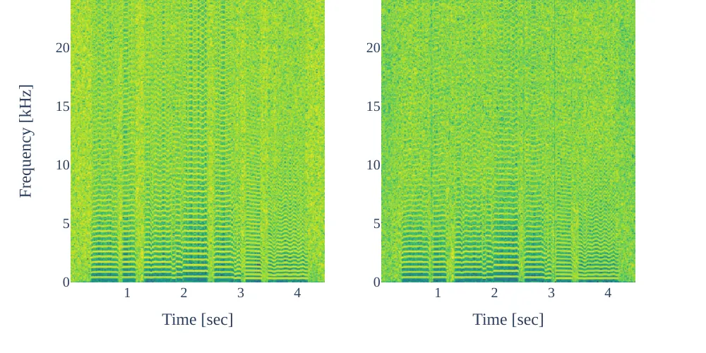

# Embedding a differentiable mel-cepstral synthesis filter to a neural speech synthesis system

Takenori Yoshimura    Shinji Takaki    Kazuhiro Nakamura    Keiichiro
Oura    Yukiya Hono    Kei Hashimoto    Yoshihiko Nankaku    Keiichi
Tokuda ^(†)^(†)thanks: This work was partly supported by JSPS KAKENHI
Grant Number JP22H03614, CASIO Science Promotion Foundation, and
Foundation of Public Interest of TATEMATSU.

###### Abstract

This paper integrates a classic mel-cepstral synthesis filter into a
modern neural speech synthesis system towards end-to-end controllable
speech synthesis. Since the mel-cepstral synthesis filter is explicitly
embedded in neural waveform models in the proposed system, both voice
characteristics and the pitch of synthesized speech are highly
controlled via a frequency warping parameter and fundamental frequency,
respectively. We implement the mel-cepstral synthesis filter as a
differentiable and GPU-friendly module to enable the acoustic and
waveform models in the proposed system to be simultaneously optimized in
an end-to-end manner. Experiments show that the proposed system improves
speech quality from a baseline system maintaining controllability. The
core PyTorch modules used in the experiments will be publicly available
on GitHub¹¹ 1
[https://github.com/sp-nitech/diffsptk](https://github.com/sp-nitech/diffsptk).

###### Index Terms: 

Speech synthesis, neural networks, mel-cepstrum, MLSA filter, end-to-end
training

^(†)^(†)address:  
¹Nagoya Institute of Technology, Department of Computer Science, Nagoya,
Japan  
²Techno-Speech, Inc., Department of Research and Development, Nagoya,
Japan

## 1 Introduction

In statistical parametric speech synthesis \[1\], linear time-variant
synthesis filters such as line spectral pairs (LSP) synthesis
filter \[2\], mel-cepstral synthesis filter \[3\], and WORLD
vocoder \[4\] are traditionally used as a waveform model to bridge the
gap between acoustic features and the audio waveform. An important
advantage of linear synthesis filters is that they can easily control
voice characteristics and the pitch of synthesized speech by modifying
input acoustic features. However, the speech quality is often limited
due to the linearity of the filters. In 2016, the first successful
neural waveform modeling, WaveNet \[5\], was proposed, enabling various
nonlinear synthesis filters \[6, 7, 8, 9\] to have been intensively
developed by researchers. Nonlinear neural synthesis filters outperform
linear synthesis filters and can synthesize high-quality speech
comparable to human speech. However, their generation of the waveform
which is quite different from training data does not work well,
resulting in less controllability of speech synthesis systems. The main
reason is that the nonlinear synthesis filters ignore the clear
relationship between acoustic features and the audio waveform, which is
simply described by conventional linear synthesis filters. There have
been a number of attempts to solve the problem, especially in terms of
pitch \[10, 11, 12\]. Although they introduced special network
structures against neural black-box modeling, the problem has yet to be
fully solved.

In this paper, to take the advantage of both linear and nonlinear
synthesis filters, we embed a mel-cepstral synthesis filter in a neural
speech synthesis system. The main advantages of the proposed system are
as follows: 1) Voice characteristics and the pitch of synthesized speech
can be easily modified in the same manner as using the conventional
mel-cepstral synthesis filter. 2) Since the embedded filter is
essentially differentiable, speech waveform can be accurately modeled by
the simultaneous optimization of the neural waveform model and the
neural acoustic model that predicts acoustic features from text. 3) The
neural waveform model is enough to have less trainable parameters
because the mel-cepstral synthesis filter captures the rough
relationship between acoustic features and the audio waveform. The
proposed system may not require a complex training strategy such as
using generative adversarial networks (GANs) \[7\] because the rough
relationship is already constructed by the embedded filter without
training.

The main concern about the proposed system is how to implement the
mel-cepstral synthesis filter as a differentiable parallel processing
module for efficient model training. Usually, the mel-cepstral synthesis
filter is widely implemented as an infinite impulse response (IIR)
filter \[3\]. This recursive property is not suitable for parallel
processing. We solve the problem by formulating the mel-cepstral
synthesis filter as cascaded finite impulse response (FIR) filters,
i.e., stacked time-variant convolutional layers.

## 2 Related work

Tokuda and Zen \[13, 14\] combined a neural acoustic model and a
cepstral synthesis filter \[15\]. The acoustic model was trained by
directly maximizing the likelihood of waveform rather than minimizing
cepstral distance. The speech quality was still limited due to the
linearity of the cepstral synthesis filter. LPCNet \[6\] combined an
all-pole filter with recurrent neural networks for fast waveform
generation. ExcitNet \[16\] also used an all-pole filter as the backend
of waveform generation. They did not introduce a specific
signal-processing structure into their excitation generation modules.

In 2020, differentiable digital signal processing (DDSP) has been
proposed \[17\]. The main idea is similar to our work: a differentiable
linear filter is embedded in a neural waveform model. One of the main
differences is that DDSP assumes a sinusoidal model as a linear
synthesis filter. In the DDSP framework, an acoustic model for speech
synthesis is not unified currently \[18\]. Nercessian \[19\] proposed a
differentiable WORLD synthesizer for audio style transfer. The
synthesizer uses log mel-spectrogram as a compact representation of
spectrum and aperiodicity ratio while our work uses a mel-cepstral
representation.

Figure 1: Neural speech synthesis system embedded mel-cepstral synthesis
filter. Box in red denotes a trainable module and box in orange denotes
a non-trainable module. Text analyzer and duration predictor are
preconstructed.

## 3 Linear synthesis system

Linear synthesis systems assume the following relation between an
excitation signal $`\bm{e}=[e[0],\ldots,e[T-1]]`$ and a speech signal
$`\bm{x}=[x[0],\ldots,x[T-1]]`$:

```math
X(z)=H(z)E(z), \tag{1}
```

where $`X(z)`$ and $`E(z)`$ are $`z`$-transforms of $`\bm{x}`$ and
$`\bm{e}`$, respectively. The time-variant linear synthesis filter
$`H(z)`$ is parameterized with a compact spectral representation for
speech application, e.g., text-to-speech synthesis and speech coding. In
the mel-cepstral analysis \[20\], the spectral envelope $`H(z)`$ is
modeled using $`M`$-th order mel-cepstral coefficients
$`\{\tilde{c}(m)\}_{m=0}^{M}`$:

```math
H(z)=\exp\sum_{m=0}^{M}\tilde{c}(m)\tilde{z}^{-m}, \tag{2}
```

where

```math
\tilde{z}^{-1}=\frac{z^{-1}-\alpha}{1-\alpha z^{-1}} \tag{3}
```

is a first-order all-pass function. Since the scalar parameter
$`\alpha`$ controls the intensity of frequency warping, the voice
characteristics of $`\bm{x}`$ can be easily modified by changing the
value of $`\alpha`$. The paper uses Eq. (2) as a linear synthesis filter
to have the benefits from the property.

Usually, a mixed excitation signal is assumed as the excitation
$`E(z)`$. Namely,

```math
X(z)=H(z)\{H_{a}(z)E_{\mathrm{noise}}(z)+H_{p}(z)E_{\mathrm{pulse}}(z)\}, \tag{4}
```

where $`E_{\mathrm{noise}}(z)`$ and $`E_{\mathrm{pulse}}(z)`$ are
$`z`$-transforms of white Gaussian noise and pulse train computed from
fundamental frequency $`f_{0}`$, respectively. The $`H_{a}(z)`$ and
$`H_{p}(z)`$ are zero-phase linear filters represented as

```math
\displaystyle H_{a}(z)\hskip-5.69054pt \displaystyle= \displaystyle\hskip-5.69054pt\cos\,\,\sum_{m=0}^{M_{a}}\,\,\tilde{c}_{a}(m)\tilde{z}^{-m} \tag{5}
```

```math
\displaystyle= \displaystyle\hskip-5.69054pt\exp\!\!\!\sum_{m=-M_{a}}^{M_{a}}\!\!\!\tilde{c}^{\prime}_{a}(m)\tilde{z}^{-m}, \tag{6}
```

```math
\displaystyle H_{p}(z)\hskip-5.69054pt \displaystyle= \displaystyle\hskip-5.69054pt1-H_{a}(z), \tag{7}
```

where

```math
\displaystyle\tilde{c}^{\prime}_{a}(m)=\left\{\begin{array}[]{ll}\tilde{c}_{a}(0),&(m=0)\\
\tilde{c}_{a}(|m|)/2,&(m\neq 0)\end{array}\right.
```

and $`\{\tilde{c}_{a}(m)\}_{m=0}^{M_{a}}`$ is a mel-cepstral
representation of aperiodicity ratio \[4\]. The aperiodicity ratio
represents the intensity of the aperiodic components of $`\bm{x}`$ for
each frequency bin and its values are in $`[0,1]`$. Equation (4)
describes a simple relationship between $`\bm{x}`$ and $`\bm{e}`$, but
there is a limit to accurate modeling of the speech signal $`\bm{x}`$.

## 4 Proposed method

To generate speech waveform with high controllability, our approach
models speech waveform by extending the conventional linear synthesis
filter as

```math
\displaystyle X(z)\hskip-5.69054pt \displaystyle= \displaystyle\hskip-5.69054ptH(z)\{P_{a}(H_{a}(z)E_{\mathrm{noise}}(z)) \tag{11}
```

```math
\displaystyle\hskip 22.76219pt+\,P_{p}(H_{p}(z)E_{\mathrm{pulse}}(z))\},
```

where $`P_{a}(z)`$ and $`P_{p}(z)`$ are nonlinear filters represented by
trainable neural networks called prenets. To capture speech components
that cannot be well captured by acoustic features including mel-cepstral
coefficients and $`f_{0}`$, the prenets are conditioned on the two
$`Q`$-dimensional latent variable vectors, $`\bm{h}_{a}`$ and
$`\bm{h}_{p}`$. The latent variable vectors $`\bm{h}_{a}`$ and
$`\bm{h}_{p}`$ as well as acoustic features are jointly estimated by the
acoustic model from text.

Figure 2: Mel-cepstral synthesis filter as cascaded FIR filters.

An overview of the proposed speech synthesis system is shown in Fig. 1.
Since all linear filters are inherently differentiable, the acoustic
model and prenets can be simultaneously optimized by minimizing the
objective

```math
\mathcal{L}=\mathcal{L}_{\mathrm{feat}}+\lambda\,\mathcal{L}_{\mathrm{wav}}, \tag{12}
```

where $`\mathcal{L}_{\mathrm{feat}}`$ is the loss between the predicted
and ground-truth acoustic features, $`\mathcal{L}_{\mathrm{wav}}`$ is
the loss between predicted and ground-truth speech samples, and
$`\lambda`$ is a hyperparameter to balance the two losses. In this
paper, the multi-resolution short-time Fourier transform (STFT)
loss \[7\] is used as $`\mathcal{L}_{\mathrm{wav}}`$:

```math
\mathcal{L}_{\mathrm{wav}}=\frac{1}{2S}\sum_{s=1}^{S}\left(\mathcal{L}_{\mathrm{sc}}^{(s)}(\bm{x},\hat{\bm{x}})+\mathcal{L}_{\mathrm{mag}}^{(s)}(\bm{x},\hat{\bm{x}})\right), \tag{13}
```

where

```math
\displaystyle\mathcal{L}_{\mathrm{sc}}^{(s)}(\bm{x},\hat{\bm{x}})\hskip-5.69054pt \displaystyle= \displaystyle\hskip-5.69054pt\frac{\|\,A^{(s)}(\bm{x})-A^{(s)}(\hat{\bm{x}})\,\|_{F}}{\|\,A^{(s)}(\bm{x})\,\|_{F}}, \tag{14}
```

```math
\displaystyle\mathcal{L}_{\mathrm{mag}}^{(s)}(\bm{x},\hat{\bm{x}})\hskip-5.69054pt \displaystyle= \displaystyle\hskip-5.69054pt\frac{\|\,\log A^{(s)}(\bm{x})-\log A^{(s)}(\hat{\bm{x}})\,\|_{1}}{Z^{(s)}}, \tag{15}
```

and $`\hat{\bm{x}}`$ is the predicted speech waveform,
$`A(\cdot)^{(s)}`$ is an amplitude spectrum obtained by STFT under
$`s`$-th analysis condition, $`Z^{(s)}`$ is a normalization term,
$`\|\cdot\|_{F}`$ is the Frobenius norm, and $`\|\cdot\|_{1}`$ is the
$`L_{1}`$ norm. Note that during training, ground-truth fundamental
frequencies are used to generate the pulse train fed to $`H_{p}(z)`$.

### 4.1 Differentiable mel-cepstral synthesis filter

Directly implementing Eq. (2) as a digital filter is difficult because
it includes the exponential function. To solve the problem, the mel-log
spectrum approximation (MLSA) filter \[3\] has been proposed and is
widely used in various applications \[1, 15\]. The MLSA filter replaces
the exponential function with a lower-order rational function using the
modified Páde approximation. However, the MLSA filter is based on a
recursive computation; previously computed values as well as the input
signal $`e[t]`$ are used for computing the current value $`x[t]`$. This
makes training the proposed system with GPU machines very inefficient
because they are suitable for parallel computing rather than deep
recursive computations.

To solve this, we first convert the mel-cepstral coefficients to
cepstral coefficients using a linear transformation \[21\]:

```math
H(z)\simeq\exp\sum_{m=0}^{N}c(m)z^{-m}, \tag{16}
```

where $`\{c(m)\}_{m=0}^{N}`$ is the $`N`$-th order cepstral coefficients
computed from $`\{\tilde{c}(m)\}_{m=0}^{M}`$. Then, by applying the
Maclaurin expansion of the exponential function to Eq. (16), we obtain

```math
H(z)\simeq\sum_{\ell=0}^{L}\frac{1}{\ell!}\left(\sum_{m=0}^{N}c(m)z^{-m}\right)^{\ell}\!. \tag{17}
```

The infinite series is truncated at the $`L`$-th term. Equation (17)
shows that the mel-cepstral synthesis filter can be implemented as
$`L`$-stage FIR filters, i.e., $`L`$ time-variant convolutional layers
whose weights are dynamically computed from estimated mel-cepstral
coefficients.

Another approach to implement the mel-cepstral synthesis filter is to
design a single FIR filter whose filter coefficients correspond to an
impulse response converted from the cepstral coefficients
$`\{c(m)\}_{m=0}^{N}`$ \[22\]. Note that this approach requires a large
GPU memory to handle a filter with many thousands of taps. Due to GPU
machine resources, the paper did not use the latter approach in
experiments though it is computationally faster than the former approach
described in Eq. (17).

## 5 Experiment

### 5.1 Experimental setup

The task to evaluate the proposed system was singing speech synthesis in
which pitch controllability is quite important. We used an internal
Japanese corpus containing 70 songs by a female singer: 60 songs were
used for training and the remaining were used for testing. The speech
signals were sampled at a rate of 48 kHz. The acoustic features
consisted of 49-th order mel-cepstral coefficients of spectral envelope,
log fundamental frequency, 24-th order mel-cepstral coefficients of
aperiodicity ratio, and vibrato parameters. The mel-cepstral
coefficients were extracted from the smoothed spectrum analyzed by
WORLD \[4\] using the mel-cepstral analysis \[20\] with $`\alpha=0.55`$.
The aperiodicity ratio was computed by the TANDEM-STRAIGHT
algorithm \[23\] and was also compressed by the mel-cepstral analysis
with the same $`\alpha`$. The acoustic features were normalized to have
zero mean and unit variance. For the duration predictor in Fig. 1,
five-state, left-to-right, no-skip hidden semi-Markov models \[24\] were
built to obtain the time alignment between the acoustic and score
features extracted from the input score. The input feature for the
acoustic model was an 844-dimensional feature vector including the score
and duration features. The acoustic model was the stack of three fully
connected layers, three convolutional layers, two bidirectional LSTM
layers, and a linear projection layer \[25\]. For the prenets $`P_{a}`$
and $`P_{p}`$, the same network architecture of the Parallel WaveGAN
generator \[7\] was used except that the number of channels was reduced
by half. The parameters were optimized through the Adam optimizer \[26\]
with a learning rate of $`0.0001`$ and mini-batch size of 8. The models
were trained for 260K steps using a single GPU machine with random
initialization. The learning rate was reduced by half to 130K steps.

The dimension $`Q`$ of $`\bm{h}_{a}`$ and $`\bm{h}_{p}`$ was 30. The
order of cepstral coefficients $`N`$ in Eq. (16) was 199 for $`H(z)`$
and 24 for $`H_{a}(z)`$. The order of the Maclaurin expansion $`L`$ in
Eq. (17) was set to 20. For the multi-resolution STFT loss, $`S=3`$ and
the window sizes were set to $`\{600,1200,2400\}`$ where the hop sizes
were $`80`$% overlap. Since it is computationally expensive to compute
$`\mathcal{L}_{\mathrm{wav}}`$ for the entire audio waveform, we
randomly cropped the predicted acoustic feature sequence to 70 frame
segments and fed them to the linear filters in the same manner as
VITS \[27\] during training. The loss in the acoustic feature domain
$`\mathcal{L}_{\mathrm{feat}}`$ in Eq. (12) was

```math
\mathcal{L}_{\mathrm{feat}}=\frac{1}{1+W}\sum_{w=0}^{W}\mathcal{L}_{\mathrm{nll}}^{(w)}\left(\bm{o}^{(w)},\hat{\bm{o}}^{(w)}\right), \tag{18}
```

where $`\bm{o}^{(0)}`$ and $`\hat{\bm{o}}^{(0)}`$ are ground-truth and
predicted acoustic features, respectively, $`(\cdot)^{(w)}(1\leq w)`$
denotes their $`w`$-th order dynamic components, and $`W`$ was set to
2 \[28\]. In Eq. (18),

```math
\mathcal{L}_{\mathrm{nll}}^{(w)}\left(\bm{o}^{(w)},\hat{\bm{o}}^{(w)}\right)=-\frac{1}{DK}\sum_{k=0}^{K-1}\mathcal{N}\left(\bm{o}^{(w)}_{k}\,\Big|\,\hat{\bm{o}}^{(w)}_{k},\bm{\varSigma}^{(w)}\right), \tag{19}
```

where $`D`$ is the dimension of the acoustic features, $`K`$ is the
length of the acoustic features, and $`\bm{\varSigma}^{(w)}`$ is a
trainable $`D`$-dimensional time-invariant diagonal covariance matrix.
The parameter $`\bm{\varSigma}^{(w)}`$ was not used for inference. The
hyperparameter $`\lambda`$ in Eq. (12) was chosen to be $`0.05`$.

The methods to compare were as follows:

- •
  MS-sg  A baseline system in which sg means stop gradient. The acoustic
  model was trained using only the objective
  $`\mathcal{L}_{\mathrm{feat}}`$. The prenets $`P_{a}`$ and $`P_{p}`$
  were not used. The waveform was synthesized by feeding the predicted
  acoustic features to the mel-cepstral synthesis filter described in
  Eq. (17).
- •
  MS  Same as MS-sg except that the acoustic model was trained using the
  two objectives $`\mathcal{L}_{\mathrm{feat}}`$ and
  $`\mathcal{L}_{\mathrm{wav}}`$.
- •
  PMS-sg  The acoustic model and prenets were simultaneously trained
  using Eq. (12). However, the loss $`\mathcal{L}_{\mathrm{wav}}`$
  propagated through only $`\bm{h}_{a}`$ and $`\bm{h}_{p}`$ to the
  acoustic model, i.e., mel-cepstral coefficients were not explicitly
  affected by $`\mathcal{L}_{\mathrm{wav}}`$.
- •
  PMS  The acoustic model and the prenets were simultaneously trained
  using Eq. (12).
- •
  PN-sg  The acoustic model was trained using only the objective
  $`\mathcal{L}_{\mathrm{feat}}`$. The waveform was synthesized by
  feeding the predicted acoustic features to the PeriodNet \[12\], which
  is a neural vocoder suitable for singing speech synthesis. The
  PeriodNet model was separately trained on the same training data. Note
  that the joint training of the acoustic and PeriodNet models is fairly
  difficult due to computational resources.

### 5.2 Experimental result

Two subjective listening tests were conducted. Both tests evaluated the
naturalness of synthesized speech by the mean opinion score (MOS) test
method., but the second test shifted the pitch up 12 semitones to assess
the robustness against fundamental frequencies. Each of the 12
participants rated 10 phrases randomly selected from the 10 test songs.

Figure 4 shows the result of the first test. MS obtained a higher score
than MS-sg. This means that considering the loss in the waveform domain
is effective to improve speech quality. PMS further improved from MS.
This indicates that the prenets can compensate for the modeling ability
of the simple linear filter. Although PMS did not use any GAN-based
training and the network size was smaller than the PeriodNet model, the
score was close to PN-sg. PMS-sg obtained a much lower score than PMS,
indicating the importance of the simultaneous optimization. Figure 4
shows the result of the second test. Even though PMS includes the
prenets, PMS achieved a similar score to that of MS. This robustness
cannot be seen in PN-sg, a pure neural waveform model. We observed that
the proposed system could also control voice characteristics via the
frequency warping parameter $`\alpha`$ without degradation. Audio
samples are available on our demo page²² 2
[https://www.sp.nitech.ac.jp/~takenori/sample_icassp2023.html](https://www.sp.nitech.ac.jp/~takenori/sample_icassp2023.html).
To see the effect of the prenets, the spectrograms of excitation signals
with and without the prenets are plotted in Fig. 5. The prenets mainly
work on the higher frequency domain, which cannot be well captured by
mel-cepstral coefficients.

Figure 3: MOS of naturalness.

Figure 4: MOS of naturalness in which input fundamental frequencies were
shifted up 12 semitones.



Figure 5: Example of spectrogram of excitation signal in PMS. Excitation
signals are produced w/o prenets (left) and w/ prenets (right).

## 6 Conclusion

This paper proposed a neural speech synthesis system with an embedded
mel-cepstral synthesis filter. Experimental results showed that the
proposed system can synthesize speech with reasonable quality and has
very high robustness against fundamental frequencies. Future work
includes to investigate the optimal network architecture of the prenets
and to introduce GAN training to boost the performance of the proposed
system.

## References

- \[1\] Alan W. Black, Heiga Zen, and Keiichi Tokuda, “Statistical
  parametric speech synthesis,” in IEEE International Conference on
  Acoustics, Speech and Signal Processing, 2007, vol. 4, pp. 1229–1232.
- \[2\] Noboru Sugamura and Fumitada Itakura, “Speech analysis and
  synthesis methods developed at ECL in NTT –from LPC to LSP–,” Speech
  Communication, vol. 5, no. 2, pp. 199–215, 1986.
- \[3\] Satoshi Imai, Kazuo Sumita, and Chieko Furuichi, “Mel log
  spectrum approximation (MLSA) filter for speech synthesis,”
  Electronics and Communications in Japan, vol. 66, no. 2, pp.
  11–18, 1983.
- \[4\] Masanari Morise, Fumiya Yokomori, and Kenji Ozawa, “WORLD: A
  vocoder-based high-quality speech synthesis system for real-time
  applications,” IEICE Transactions on Information and Systems, vol.
  E99-D, no. 7, pp. 1877–1884, 2016.
- \[5\] Aäron van den Oord, Sander Dieleman, Heiga Zen, Karen Simonyan,
  Oriol Vinyals, Alex Graves, Nal Kalchbrenner, Andrew W Senior, and
  Koray Kavukcuoglu, “WaveNet: A generative model for raw audio,”
  arXiv:1609.03499, 2016.
- \[6\] Jean-Marc Valin and Jan Skoglund, “LPCNet: Improving neural
  speech synthesis through linear prediction,” in IEEE International
  Conference on Acoustics, Speech and Signal Processing, 2019, pp.
  5891–5895.
- \[7\] Ryuichi Yamamoto, Eunwoo Song, and Jae-Min Kim, “Parallel
  WaveGAN: A fast waveform generation model based on generative
  adversarial networks with multi-resolution spectrogram,” in IEEE
  International Conference on Acoustics, Speech and Signal Processing,
  2020, pp. 6199–6203.
- \[8\] Jungil Kong, Jaehyeon Kim, and Jaekyoung Bae, “HiFi-GAN:
  Generative adversarial networks for efficient and high fidelity speech
  synthesis,” in Advances in Neural Information Processing Systems,
  2020, vol. 33, pp. 17022–17033.
- \[9\] Nanxin Chen, Yu Zhang, Heiga Zen, Ron J. Weiss, Mohammad
  Norouzi, and William Chan, “WaveGrad: Estimating gradients for
  waveform generation,” 2009.00713, 2020.
- \[10\] Xin Wang, Shinji Takaki, and Junichi Yamagishi, “Neural
  source-filter waveform models for statistical parametric speech
  synthesis,” IEEE/ACM Transactions on Audio, Speech, and Language
  Processing, vol. 28, pp. 402–415, 2020.
- \[11\] Yi-Chiao Wu, Tomoki Hayashi, Patrick Lumban Tobing, Kazuhiro
  Kobayashi, and Tomoki Toda, “Quasi-periodic WaveNet: An autoregressive
  raw waveform generative model with pitch-dependent dilated convolution
  neural network,” IEEE/ACM Transactions on Audio, Speech and Language
  Processing, vol. 29, pp. 1134–1148, 2021.
- \[12\] Yukiya Hono, Shinji Takaki, Kei Hashimoto, Keiichiro Oura,
  Yoshihiko Nankaku, and Keiichi Tokuda, “PeriodNet: A
  non-autoregressive raw waveform generative model with a structure
  separating periodic and aperiodic components,” IEEE Access, vol. 9,
  pp. 137599–137612, 2021.
- \[13\] Keiichi Tokuda and Heiga Zen, “Directly modeling speech
  waveforms by neural networks for statistical parametric speech
  synthesis,” in IEEE International Conference on Acoustics, Speech and
  Signal Processing, 2015, pp. 4215–4219.
- \[14\] Keiichi Tokuda and Heiga Zen, “Directly modeling voiced and
  unvoiced components in speech waveforms by neural networks,” in IEEE
  International Conference on Acoustics, Speech and Signal Processing,
  2016, pp. 5640–5644.
- \[15\] Keiichi Tokuda, Takao Kobayashi, and Satoshi Imai, “Adaptive
  cepstral analysis of speech,” IEEE Transactions on Speech and Audio
  Processing, vol. 3, no. 6, pp. 481–489, 1995.
- \[16\] Eunwoo Song, Kyungguen Byun, and Hong-Goo Kang, “ExcitNet
  vocoder: A neural excitation model for parametric speech synthesis
  systems,” in 27th European Signal Processing Conference, 2019, pp.
  1–5.
- \[17\] Jesse Engel, Lamtharn (Hanoi) Hantrakul, Chenjie Gu, and Adam
  Roberts, “DDSP: Differentiable digital signal processing,” in
  International Conference on Learning Representations, 2020.
- \[18\] Giorgio Fabbro, Vladimir Golkov, Thomas Kemp, and Daniel
  Cremers, “Speech synthesis and control using differentiable DSP,”
  arXiv:2010.15084, 2020.
- \[19\] Shahan Nercessian, “Differentiable WORLD synthesizer-based
  neural vocoder with application to end-to-end audio style transfer,”
  arXiv:2208.07282, 2022.
- \[20\] Keiichi Tokuda, Takao Kobayashi, Takeshi Chiba, and Satoshi
  Imai, “Spectral estimation of speech by mel-generalized cepstral
  analysis,” Electronics and Communications in Japan (Part 3), vol. 76,
  no. 2, pp. 30–43, 1993.
- \[21\] Alan V. Oppenheim and Don H. Johnson, “Discrete representation
  of signals,” Proceedings of the IEEE, vol. 60, no. 6, pp.
  681–691, 1972.
- \[22\] Alan V. Oppenheim and Ronald W. Schafer, Discrete-time signal
  processing, Prentice-Hall Signal Processing Series. Pearson, third
  edition, 2009.
- \[23\] Hideki Kawahara, Masanori Morise, Toru Takahashi, Hideki Banno,
  Ryuichi Nisimura, and Toshio Irino, “Simplification and extension of
  non-periodic excitation source representations for high-quality speech
  manipulation systems,” in Interspeech, 2010, pp. 38–41.
- \[24\] Heiga Zen, Keiichi Tokuda, Takashi Masuko, Takao Kobayashi, and
  Tadashi Kitamura, “A hidden semi-Markov model-based speech synthesis
  system,” IEICE Transactions on Information and Systems, vol. E90–D,
  no. 5, pp. 825–834, 2007.
- \[25\] Yukiya Hono, Kei Hashimoto, Keiichiro Oura, Yoshihiko Nankaku,
  and Keiichi Tokuda, “Sinsy: A deep neural network-based singing voice
  synthesis system,” IEEE/ACM Transactions on Audio, Speech, and
  Language Processing, vol. 29, pp. 2803–2815, 2021.
- \[26\] Diederik Kingma and Jimmy Ba, “Adam: A method for stochastic
  optimization,” arXiv:1412.6980, 2014.
- \[27\] Jaehyeon Kim, Jungil Kong, and Juhee Son, “Conditional
  variational autoencoder with adversarial learning for end-to-end
  text-to-speech,” arXiv:2106.06103, 2021.
- \[28\] Kazuhiro Nakamura, Shinji Takaki, Kei Hashimoto, Keiichiro
  Oura, Yoshihiko Nankaku, and Keiichi Tokuda, “Fast and high-quality
  singing voice synthesis system based on convolutional neural
  networks,” in IEEE International Conference on Acoustics, Speech and
  Signal Processing, 2020, pp. 7239–7243.
