# Beyond Statistical Similarity: Rethinking Metrics for Deep Generative Models in Engineering Design

Lyle Regenwetter Email: [regenwet@mit.edu](mailto:)    Akash Srivastava
Email: [Akash.Srivastava@ibm.com](mailto:)    Dan Gutfreund
Email: [dgutfre@us.ibm.com](mailto:)    Faez Ahmed
Email: [faez@mit.edu](mailto:)    Massachusetts Institute of Technology
   MIT-IBM Watson AI Lab

October 17, 2023

###### Abstract

Deep generative models such as Variational Autoencoders (VAEs),
Generative Adversarial Networks (GANs), Diffusion Models, and
Transformers, have shown great promise in a variety of applications,
including image and speech synthesis, natural language processing, and
drug discovery. However, when applied to engineering design problems,
evaluating the performance of these models can be challeng- ing, as
traditional statistical metrics based on likelihood may not fully
capture the requirements of engineering applications. This paper doubles
as a review and practical guide to evaluation metrics for deep
generative models (DGMs) in engineering design. We first summarize the
well-accepted ‘classic’ evaluation metrics for deep generative models
grounded in machine learning theory. Using case studies, we then
highlight why these metrics seldom translate well to design problems but
see frequent use due to the lack of established alternatives. Next, we
curate a set of design-specific metrics which have been proposed across
different research communities and can be used for evaluating deep
generative models. These metrics focus on unique requirements in design
and engineering, such as constraint satisfaction, functional
performance, novelty, and conditioning. Throughout our discussion, we
apply the metrics to models trained on simple-to-visualize 2-dimensional
example problems. Finally, we evaluate four deep generative models on a
bicycle frame design problem and structural topology generation problem.
In particular, we showcase the use of proposed metrics to quantify
performance target achievement, design novelty, and geometric
constraints. We publicly release the code for the datasets, models, and
metrics used throughout the paper at
[decode.mit.edu/projects/metrics/](http://decode.mit.edu/projects/metrics/).

## 1 Introduction

Deep generative models (DGMs) have seen explosive growth across
engineering design disciplines in recent years. DGMs like Generative
Adversarial Networks (GAN) \[41\] and Variational Autoencoders
(VAE)\[52\] have dominated image generation problems since 2014, but
only bridged the gap to the design community in 2016 \[79\]. DGMs have
since been applied across design domains to problems such as optimal
topology generation, airfoil synthesis, and metamaterial design. As
promising new methods for image synthesis like diffusion models \[28,
98\] are introduced in other machine learning fields, researchers in
design adapt them to solve challenging design problems \[62\].
Similarly, transformers, a leading class of generative models for
sequences, have dominated natural language generation for years \[32,
75, 19\], and have seen extensive use in the textual generation of
design concepts \[102, 88\].

DGMs are powerful learners, boasting an unparalleled ability to process
and understand complex data distributions and mimic them through batches
of synthetic data. In the context of data-driven design, these ‘data
distributions’ are often comprised of a collection of existing designs
that lie in some multi-dimensional design manifold in the same way that
a collection of points would form a density distribution in a Euclidean
space. From this perspective, it’s clear why DGMs are promising
data-driven designers. They can study collections of existing designs,
understand their distribution, and generate new ones that should belong
in the same manifold but do not yet exist. This ability of a DGM to
learn and match a distribution is often measured using statistical
similarity (i.e., how similar is the distribution of generated designs
to the dataset?).

While DGMs’ amazing distribution-matching ability is often beneficial,
it is limited because, in many design problems, we desire designs to be
significantly unique or distinct from existing designs. Additionally,
even if distribution-matching is desirable, it is often secondary to
meeting problem constraints and achieving functional performance
targets. As a result, relying solely on similarity as an objective can
lead to misguided design efforts, since very similar designs can have
drastically different performances, as illustrated in Figure 1.
Historically, design researchers have failed to account for this gap
when selecting evaluation metrics, often opting for the classic
similarity-based metrics that are prominent in other machine learning
domains. In this paper, we provide an exposition of evaluation metrics
for DGMs, which we show are important for design practitioners and
design automation researchers. We intend for the metrics presented to
apply to a variety of DGMs for design, and we do not go into detail
about specific model architectures. For an introduction to DGMs and an
overview of design engineering research using DGMs to date, we refer
readers to a review paper on DGMs in engineering design \[79\].

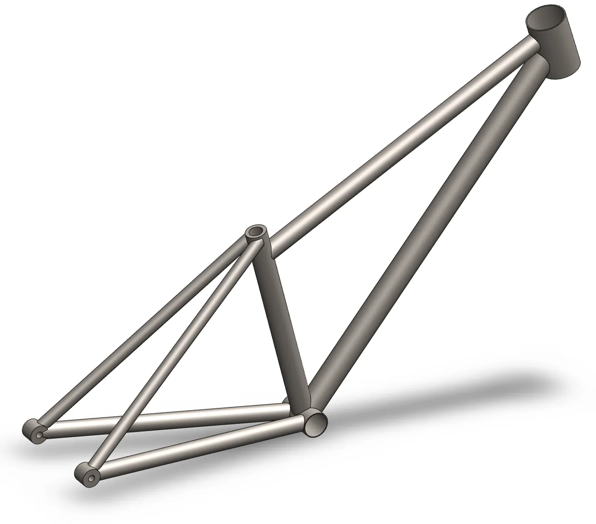

(a) Deflection: $`0.05\,cm`$

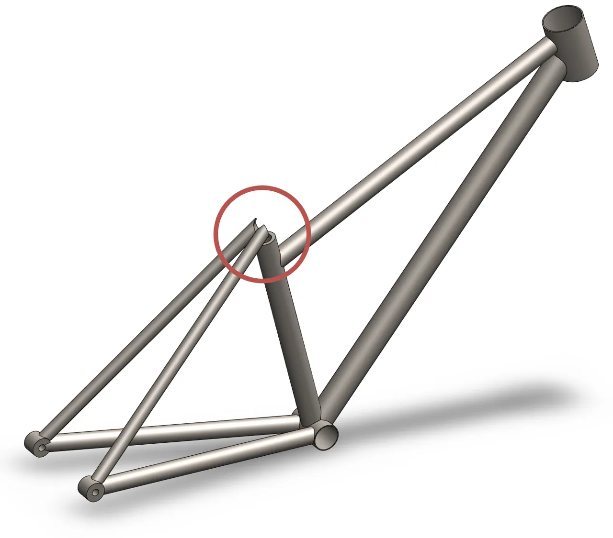

(b) Deflection: $`10.46\,cm`$

Figure 1: Two very similar bike frames adapted from \[80\] with
drastically different structural performance. By most distance metrics,
these bike frames would be the most similar designs among a dataset of
thousands. Yet, due to the disconnected geometry highlighted, they
experience deflections that differ by over two orders of magnitude when
subjected to the in-plane loading scenario.

We broadly divide metrics into five categories which each address an
important facet of engineering design. The first of these is similarity,
the class of metrics commonly used to evaluate DGMs. Though often
overused, similarity is still important, and we present several
perspectives and metrics to consider various aspects of similarity. The
second category is design exploration, the idea that generated designs
are often desired to be unique and varied. The third category is
constraint satisfaction, the idea that generated designs must often
adhere to a set of explicit or implicit constraints to be considered a
valid design. The fourth is design quality, the idea that generated
designs often have associated functional performance attributes that
designers want to optimize. Finally, the last category is conditioning,
the idea that conditional generative models should respect and adhere to
their conditioning information. Although we discuss a wide variety of
evaluation criteria within the five focus areas, this is not an
exhaustive review. There are other aspects of DGM performance and
evaluation techniques that are particularly important in design, such as
latent space disentanglement and human evaluation, which we discuss in
Appendix 14.1. This appendix also lists other common considerations for
DGMs broadly, which may also be relevant in design problems.

## 2 Relevant Reviews of Evaluation Metrics

Review papers for DGM evaluation metrics are numerous in image and text
generation \[14, 15, 38, 36\]. Within engineering design, a few research
papers \[62, 22\] and code repositories¹¹ 1
https://pypi.org/project/midbench/ discuss metrics for DGMs in specific
design sub-disciplines, such as topology optimization and aerodynamic
design. To our knowledge, however, the existing body of research lacks a
dedicated discussion of applicable metrics for DGMs which generally
apply across design disciplines. This paper aims to address this gap and
highlight the importance of applying the right metrics for Generative AI
applications. We will organize our discussion of relevant work according
to several focus areas of this paper: statistical similarity, design
exploration, constraint satisfaction, and design quality.

##### Existing Literature in Similarity Metrics

Image generation \[41, 52, 48, 49, 17\] and natural language
generation \[32, 75, 19, 70\] remain dominant research thrusts for DGMs.
In these fields, the overwhelming majoring of metrics focus on
statistical similarity. As such, similarity-related metrics for
generative models in these domains have received much attention and
careful consideration. Borji \[14, 15\] provides two complementary
reviews which outline a few evaluation metrics for GANs, though most of
these metrics generalize to other generative models in computer vision
problems. Gatt & Krahmer \[38\] and Dong et al. \[36\] review the state
of natural language generation, including detailed discussions of
similarity-based evaluation metrics.

Design domains heavily focused on image-based data have also seen
reviews of metrics focusing on statistical similarity. For example,
Shah et al. \[87\] reviews evaluation methods for generative models in
synthetic microstructure images. While the metrics discussed in the
mentioned papers focus on statistical similarity, this paper argues that
thinking beyond statistical similarity to include factors such as
performance, diversity, and constraints is crucial for design and
engineering.

##### Existing Literature in Design Exploration Metrics

The ability of a model to explore is often captured through diversity
and novelty. Diversity and novelty are prevalent concepts in design
ideation and can be challenging to evaluate. Mueller & Ochsendorf \[66\]
analyze numerous metrics for design diversity quantification. While
useful, these design metrics are often set up to evaluate “generic”
designs and may not be sufficient to measure “AI” generated designs. In
particular, many metrics struggle with the extreme non-convexity and
high dimensionality of the complicated design spaces typically learned
by DGMs. This makes their use as an evaluation metric challenging.

Diversity metrics are also found in optimization literature \[82\].
However, many metrics from optimization, such as the hypervolume metric,
could be used to evaluate multiple objectives, such as diversity and
functional performance. Specialized metrics introduced for DGMs may be
better able to evaluate diversity and novelty for complex design
distributions \[25\] and decouple diversity from other performance
considerations.

##### Existing Literature in Constraint Satisfaction Metrics

The broad diversity of design constraints across various domains has led
to a largely domain-specific approach to constraint satisfaction. For
example, Bilodeau et al. \[11\] present several interesting
constraint-related metrics for DGMs in their review of generative models
for molecular discovery²² 2 This paper also discusses other metrics,
such as rediscovery, which we discuss in this paper. In some design
subdisciplines, similarity-based metrics are being used to indirectly
infer constraint satisfaction \[87\]. In our paper, however, we
introduce a series of generalized, domain-independent constraint
satisfaction metrics that surpass the simple use of similarity.

##### Existing Literature in Design Quality Metrics

Design quality (functional performance) is a ubiquitous consideration
across design disciplines. Many relevant functional performance metrics
can be found in design optimization literature, as optimization is
heavily focused on maximizing functional performance.
Riquelme et al. \[82\] review evaluation metrics for multi-objective
optimization, documenting their popularity in optimization research and
classifying them by type. In this paper, we show that many metrics
developed to evaluate optimization algorithms are easily adapted to
evaluate DGMs and should be adopted by researchers. To better handle
inverse design problems, Regenwetter & Ahmed \[77\] propose several
evaluation metrics focused on evaluating functional performance in
design problems where a performance target is given.

##### Contributions

In the context of existing work, this paper makes the following
contributions:

1.  1.  We provide a structured review and practical guide on metrics used
        to evaluate deep generative models in engineering design problems.
2.  2.  We draw attention to the inherent shortcomings of statistical
        similarity and advocate for a collection of metrics to assess design
        exploration, constraints, quality, and conditioning needs. These
        metrics are derived from a broad range of metrics proposed in
        diverse fields, such as multi-objective optimization, natural image
        generation, and molecule synthesis.
3.  3.  We train a variety of deep generative models, including GANs, VAEs,
        MO-PaDGANs, DTAI-GANs, cVAEs, cGANs, and Denoising Diffusion
        Probabilistic Models on two-dimensional examples to illustrate the
        diverse ways deep generative models can be evaluated under various
        conditions.
4.  4.  We introduce a design case study focusing on the synthesis of bike
        frames, with an emphasis on performance, diversity, and constraints.
        In this context, we discuss the selection and application of the
        most appropriate metrics.
5.  5.  We present an additional design case study related to structural
        topology generation, where we demonstrate how to evaluate and
        compare two cutting-edge conditional diffusion models using the
        discussed evaluation metrics.

## 3 Background

In this paper, we present a structured guide to help researchers select
better evaluation metrics for design problems, focusing on five main
facets: similarity, diversity, constraint satisfaction, functional
performance, and conditioning. However, before introducing individual
metrics in Section 4, we will discuss terminology and several background
concepts. Notably, we will discuss common requirements and prerequisites
needed to apply the metrics as well as classifications to categorize
metrics. We include a tabular summary of the metrics, their
requirements, and their categorizations in Table 1.

[TABLE]

Table 1: Overview of metrics discussed in the paper. For each metric, we
discuss: 1. The requirements and auxiliary computational cost necessary
to evaluate the metric (key: Aux – Auxiliary predictive task & training,
CL – Clustering method, CFC – Closed-Form Constraints, Cond – Condition
parameter calculation, Const – Constraint violation test, Dist –
Distance metric, DP – Differentiable method to calculate design
performance, Emb – Vector embedding, Inv – Dataset of invalid designs,
Perf – Method to calculate design performance). 2. Whether the metric
characterizes points or sets of generated samples. 3. Whether the metric
uses a reference set (binary) or not (unary). 4. Relevant spaces to
which the metric can reasonably apply. 5. Whether the metric depends on
hyperparameters. 6. The metric’s bounds. 7. The optimal direction of the
metric. Notes: \*Assuming L2 Norm (Euclidean) distance kernel. Distance
kernel impacts hyperparameters, bounds, and objective direction. For
example, switching to an RBF kernel would typically result in bounds of
$`[0,1]`$, flipping the direction of the objective, as well as adding a
hyperparameter to tune. \*\* Depending on the clustering method used, a
distance metric may suffice instead of a full embedding. \*\*\* Problem
parameters such as reference points or sets, objective weights, and DTAI
priority parameters are not considered to be hyperparameters.

### 3.1 A Note on Terminology

In this paper, we broadly use the term ‘metrics’ to loosely refer to
‘evaluation criteria,’ not specifically distance metrics. To avoid loss
of generality, we broadly use the term ‘samples’ to refer to the output
of a generative model. We also refer to the original data entries as
‘datapoints.’ Though in generative design problems, ‘datapoints’ are
often existing designs and ‘samples’ are often generated designs, this
may not be universally true. In Section 6, we also refer to
constraint-violating data entries as ‘invalid datapoints,’ which
typically correspond to existing design concepts that fail to meet some
set of constraints or design requirements.

### 3.2 Calculating Distance Between Designs

Many distance-based metrics presented in this paper require the ability
to calculate distances amongst and in between datapoints and samples
(Tab. 1, col. 3). In some data modalities, calculating distances between
designs can be a significant challenge. We present some strategies to
calculate distances in different representation schemes in the appendix.
In general, practitioners can choose to directly calculate distances in
the original space and modality of the data, or can instead compute an
embedding over which to calculate a distance.

### 3.3 Point vs. Set Metrics

Certain metrics, such as statistical distance metrics, measure the
properties of a set while other metrics measure the properties of an
individual point (Tab. 1, col. 4). Though point metrics can also be
aggregated to describe the set, set metrics cannot evaluate a single
point. In design problems where designers need to select one or many
‘finalists’ from a set of designs generated by a DGM, they must do so
with point metrics.

### 3.4 Unary vs. Binary Metrics

Unary metrics, such as hypervolume, generate a score based on a single
design or a set of designs (Tab. 1, col. 5). In contrast, binary metrics
such as statistical divergence utilize an additional reference set in
generating a score. Often, this reference set is the dataset itself.

### 3.5 Design Spaces and Performance Spaces

In design, we often frame a design as a point in some design space,
without loss of generality across data modalities. However, we also
often care about the functional performance of generated designs. We can
similarly frame a design’s multi-objective performance as a point in
some multi-dimensional performance space. Many metrics can reasonably be
evaluated in either space, but some only make sense in one (Tab. 1, col.
6).

### 3.6 Hyperparameters

Most metrics depend on some parameters, which must be decided before
using the metric (Tab. 1, col. 7). This can be viewed as an opportunity
for practitioners to carefully consider the parameters they use and to
report them clearly when evaluating models. This allows for fair and
consistent comparison of models. Additionally, by standardizing
parameter values, practitioners can ensure that the evaluation metrics
are being used in a fair and unbiased manner.

## 4 Evaluating Statistical Similarity

Having touched on some broad classifications of metrics, we begin our
detailed discussion with the first of our five main categories:
Similarity. In classic machine learning theory and many classic DGM
tasks, such as image generation and natural language generation, deep
generative models have a single overarching objective: To generate
convincing samples that are new, but generally indistinguishable from
the dataset. We typically frame this as a distribution-matching problem,
i.e. is the distribution over generated samples identical to the
distribution over the dataset? Accordingly, the dominant evaluation
metrics in both image synthesis (FID \[43\], IS \[86\], KID \[12\],
etc.) and natural language generation (ROUGE \[60\], BLEU \[71\],
METEOR \[5\], etc.) have focused on similarity. Historically, similarity
has also been the central objective of deep generative models in design
tasks \[79\], since it enforces that generated designs have a general
resemblance to the designs used to train the model. For example, if a
hypothetical design practitioner trains a model on a dataset of
centrifugal pumps, similarity should enforce that their model generates
new centrifugal pump designs, rather than reciprocating pumps (or
nonsensical designs). However, similarity will not enforce (nor
necessarily encourage) that generated pumps are novel, functional, or
performant. In this section, we discuss metrics and tools to evaluate
similarity and reserve discussion about other objectives for later
sections.

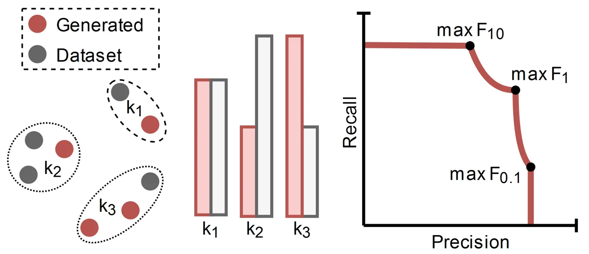

(a) Precision-Recall Curves

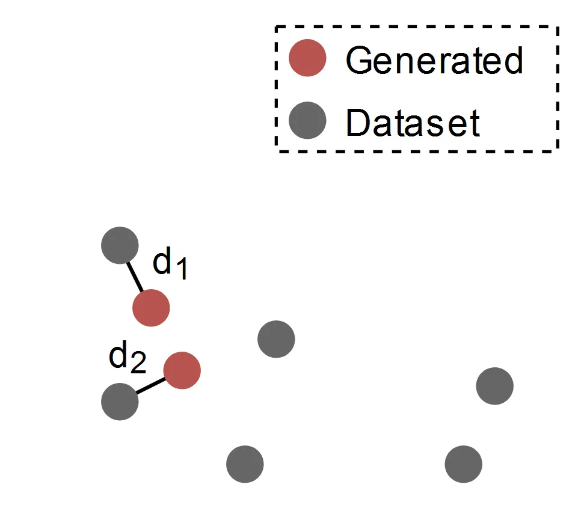

(b) Nearest Datapoint

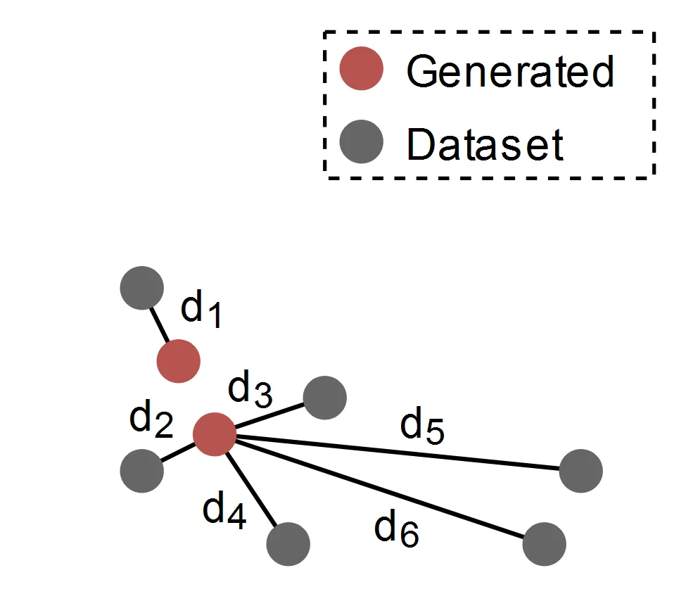

(c) Nearest Generated Sample

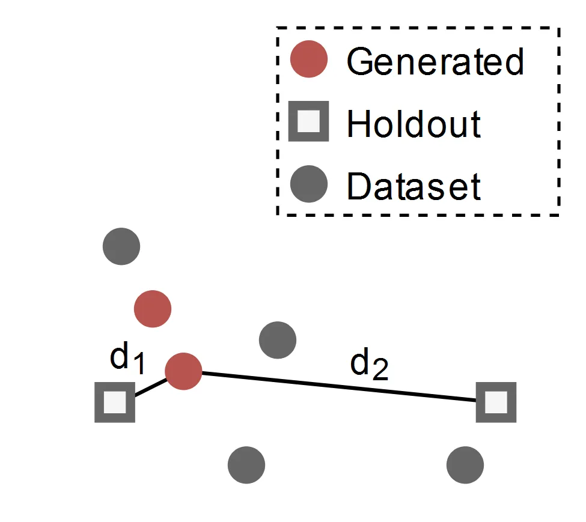

(d) Rediscovery

Figure 2: Illustrations of select similarity-related metrics.

##### Statistical Divergence/Distance Metrics

Quantifying the discrepancy between two random variables is one of the
central themes in machine learning, particularly in ML-based generative
modeling \[52, 41, 4, 3, 47, 33\]. Within the field of deep generative
modeling, the two classes of statistical discrepancy measures have been
popular, namely $`\phi`$-divergences and Integral Probability Metrics
(IPMs). Let $`\mathbb{P}`$ and $`\mathbb{Q}`$ be two probability
distributions on a measurable space $`M`$, such that
$`\mathbb{P}<<\mathbb{Q}`$. Then, $`\phi-`$divergence is defined as,

```math
\displaystyle D_{\phi}(\mathbb{P},\mathbb{Q})=\int_{M}\phi\Big(\frac{d\mathbb{P}}{d\mathbb{Q}}\Big)d\mathbb{Q}. \tag{1}
```

Here, $`\phi:\mathbb{R}^{+}\mapsto\mathbb{R}`$ is a convex function such
that $`\phi(1)=0`$. A popular example of this class is the
Kullbeck-Leibler (KL) divergence, where $`\phi(t)=t\log(t)`$. Similarly,
IPMs can be defined as

```math
\displaystyle D_{\mathcal{F}}(\mathbb{P},\mathbb{Q})=\sup_{f\in\mathcal{F}}\Big|\int_{M}fd\mathbb{P}-\int_{M}fd\mathbb{Q}\Big|. \tag{2}
```

A popular member of this class is the Maximum Mean Discrepancy (MMD),
where $`\mathcal{F}`$ is set to be the Reproducing Kernel Hilbert Space
(RKHS). An intuition behind these two classes of metrics is that the
first one tries to measure the ratio (where a ratio of one corresponds
to identical sets), while the second one measures the distance between
two distributions (where a distance of zero corresponds to identical
sets).

Naturally, statistical distances are the optimal choice to measure the
similarity of the generated sample distribution to the true
data-generating distribution. However, for most high-dimensional
problems of interest, computation of such statistical similarity
measures is intractable as it requires estimation of the densities
induced by the distributions. This has led to the development of
estimators of these measures \[40, 8, 81, 91, 42\]. A popular class of
plug-in estimators includes pre-training a classifier \[91, 42, 81\] to
first estimate the log-ratio of the densities and then taking its
Monte-Carlo expectation. Another class of estimators relies on neural
density estimation \[2\], where individual densities are estimated using
highly non-linear bijective functions \[53, 55\] and then used to
estimate the discrepancy. Similar projection-based approaches also exist
for IPMs \[40, 31\]. However, the efficacy of such estimators is
dependent on the modality and the dimensionality of the problem’s data.
Therefore domain-agnostic estimators of statistical similarity remain
largely an open problem.

Consequently, many of the leading similarity metrics are
domain-specific, leveraging certain advantages of the domain to
calculate. In computer vision, countless domain-specific metrics have
seen widespread adoption \[14\]. Fréchet Inception Distance (FID), for
example, uses a pre-trained Inception network to calculate vector
embeddings for images, assumes a Gaussian distribution over this
embedding space, then calculates Wasserstein-2 Distance (Fréchet
distance under the Gaussian assumption) between the generated and
dataset distributions in this embedding space \[43\]³³ 3 Other popular
metrics calculate different IPMs, such as Maximum Mean Discrepancy in
Kernel Inception Distance (KID) \[12\]. Other variants like Inception
Score (IS) use the statistical distance between marginal and true label
distributions \[86\].. In text generation methods, the commonly used
perplexity metric is also a close relative of statistical distance.
Perplexity is defined as the exponential of cross-entropy, which itself
is the entropy of the data distribution plus the KL divergence between
the generated distribution and the data distribution.

FID and perplexity have been empirically found to correlate well with
the human perceptual evaluation of image and text realism. Since human
perceptual evaluation is relatively uniform in computer vision and
natural language, FID and perplexity are among the most commonly used
metrics for model evaluation in their respective fields. In other
fields, like design, the perception of realism is much more varied. This
non-uniformity, alongside other challenges like data modality, may
preclude any generalizable design-specific statistical distance metric
from rising to prominence.

Instead, practitioners should evaluate the viability of applying
domain-specific methods to design problems on a case-by-case basis. For
example, when evaluating similarity in a structural topology generation
problem, one may consider using image-based metrics like FID, KID, and
IS, which utilize a pre-trained image classifier. These pre-trained
image classifiers are often trained on ImageNet, a large computer vision
dataset \[30\]. Accordingly, these metrics are highly biased towards
ImageNet \[6\]. For example, even when evaluating models trained on
CIFAR-10, a very similar natural image dataset, researchers have found
that inception score significantly misrepresented model
performance \[83\]. If practitioners use FID to evaluate structural
topologies (an evaluation choice with precedent \[79\]), they will
likely incur even greater bias⁴⁴ 4 It is uncertain whether the
low-dimensional latent representations extracted from a network trained
on animal or food images in ImageNet would contain any useful
information about structural topologies.. Therefore, practitioners must
be cautious about adopting pre-trained metrics from non-design domains
and carefully evaluate their suitability.

In general, statistical distance metrics are excellent tools to evaluate
similarity and ensure that generated designs are similar to the training
data, but are often challenging to estimate in high-dimensional
problems. When design data is similar to natural image datasets or
natural text corpora, off-the-shelf variants of statistical divergence
methods can be effectively used. However, when reliably estimating
statistical distance is infeasible or when practitioners desire more
nuance in evaluating similarity, they can instead turn to a variety of
other methods, which we present in the following subsections.

### 4.1 Decoupling ‘Realism’ and ‘Coverage’

Researchers often point to a key shortcoming of statistical distance
metrics, namely their inability to decouple two separate ideas in
distribution matching: ‘realism’ and ‘coverage.’ Realism is the idea
that generated samples should resemble the dataset⁵⁵ 5 The term
‘realism’ can be misleading since it implies that the dataset reflects
reality (i.e., covers the entire space of ‘realistic’ data), which is
typically untrue.. Coverage is the idea that the entire spread of the
dataset should be represented by generated samples. While any model that
achieves perfect (zero) statistical distance must achieve both perfect
realism and coverage, an imperfect model can suffer from an unknown
balance of imperfect realism or coverage, which is difficult to diagnose
with only a single score. To combat this, methods like precision-recall
curves analyze generative models with an entire tradeoff front between
these two factors.

##### Precision-Recall Curves(Fig. 2(a))

Precision-recall curves are borrowed concepts from supervised
classification but have been adapted as metrics for generative models.
The concept was originally proposed by Lucic et al. \[61\] and extended
by Sajjadi et al. \[85\]. In Sajjadi et al.’s framework, generated data
and original data are pooled, then clustered. A precision-recall (PR)
curve is then calculated by comparing the proportion of generated versus
original data within each discrete cluster over a sweep of a weighting
parameter. Other methods have also been proposed to generate PR curves
from arbitrary distributions, bypassing the need for discrete binning of
the data \[89\]. From the curve, summary scores like
Area-Under-the-Curve (AUC) and a maximum $`F_{1}`$ score can also be
derived. We refer the reader to \[85\] for mathematical reasoning and
visual examples behind the PR curves for generative models.

### 4.2 Similarity of Generated Data to Dataset (‘Realism’)

Although precision-recall curves demonstrate how a DGM tends to balance
realism and coverage, in some cases, we may care more for one or the
other. When practitioners particularly desire that generated samples
resemble the dataset, they can turn to one of several tools to evaluate
realism, independent of coverage.

##### Precision

Precision for generative models captures the fraction of generated
designs falling within the support of the dataset. Extracting singular
precision values from PR curves is challenging since it’s unclear which
value to select, or how to average values. Instead,
Sajjadi et al. \[85\] propose using the maximum $`F_{\beta}`$ score for
some $`\beta<<1`$ over all precision-recall pairs in the PR curve as a
proxy for precision.

##### Nearest Datapoint (Figure 2(b))

For a simple estimate of ‘realism,’ practitioners can calculate the
distance to the nearest datapoint for every generated sample. Despite
its simplicity, the score is an effective method to capture the local
realism of individual samples (or the ‘realism’ performance of a DGM
when averaged). This metric is particularly important for applications
of DGMs in data augmentation, as it demonstrates that generated
synthetic designs (samples) are similar to a dataset of existing designs
(datapoints).

### 4.3 Dataset Coverage

In some design applications, there might be a need to focus more on
design space coverage to ensure that all key modalities of the design
space are reflected in generated designs. In such cases, practitioners
can instead estimate recall or use other metrics to quantify coverage.

##### Recall

Like precision, recall is a metric discussed in Sajjadi et al. \[85\],
measuring the proportion of datapoints in the support of the generated
distribution. Practitioners can select some maximum $`F_{\beta}`$ score
for some $`\beta>>1`$ to estimate recall.

##### Nearest Generated Sample (Figure 2(c))

For a simple approach to capture dataset coverage, practitioners can
calculate the distance to the nearest generated sample for every
original datapoint. This score can be averaged over the dataset to
evaluate a set of generated samples. However, this score depends on the
size of the generated sample set, necessitating the selection of a set
size tuning parameter for standardization.

##### Rediscovery (Figure 2(d))

Rediscovery is an evaluation technique that evaluates an algorithm’s
ability to rediscover datapoints that were withheld during training.
Rediscovery is commonly used in the molecule synthesis domain \[11\],
though we believe it is widely applicable (and valuable) across design
disciplines. In a discrete setting, the rediscovery rate can be
calculated as the exact proportion of withheld designs rediscovered in a
generated set \[87\]. To accommodate other data modalities,
practitioners can relax the score to instead calculate the distance from
a withheld datapoint to the nearest sample in a generated sample set.
Effectively, this performs a nearest generated sample evaluation over
the set of withheld designs ⁶⁶ 6 We also note that other metrics can
also be evaluated on a “test set,” though we feel that evaluating
coverage on a holdout set is a particularly insightful choice.. Though
it requires both a tuning parameter (holdout size) and the foresight to
remove a split of the dataset before training, rediscovery is an elegant
extension of pure ‘coverage’ metrics that further quantifies the simple
generalization capabilities of the model.

### 4.4 Evaluating Effective use of Generated Data in Downstream Tasks

A common approach to measuring the similarity of a generated sample set
to the training dataset is to check whether the generated set serves as
an effective stand-in for some auxiliary task. If a practitioner is
generating design data with a specific downstream task in mind, it may
be viable to directly evaluate generated samples on this task as a
metric. In other scenarios, artificially constructed tasks can serve as
an effective method to evaluate generated samples.

##### Machine Learning Efficacy

Auxiliary machine learning tasks, such as classification, are often used
to evaluate generated sample sets in a process known as Machine Learning
(ML) efficacy testing. Often, a supervised machine learning model is
trained on the generated dataset and then tested on the original data,
though several formulations of ML efficacy have been proposed, as
in \[76, 97\].

### 4.5 Demonstration of Statistical Similarity Metrics

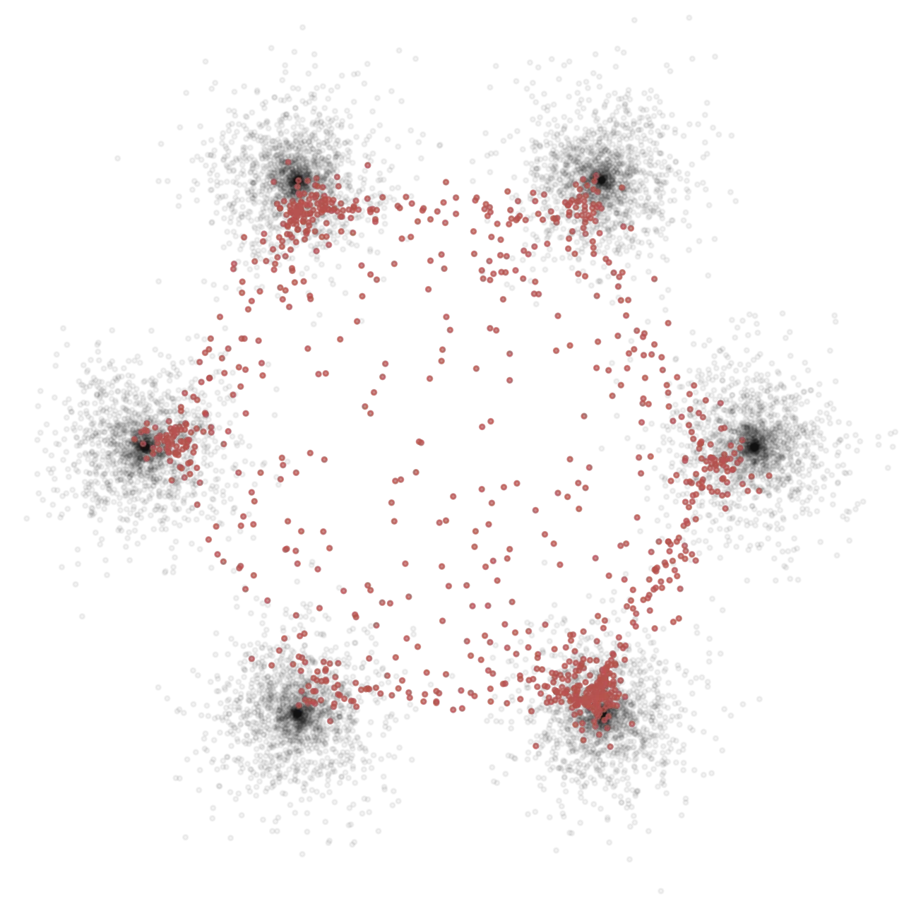

(a) VAE

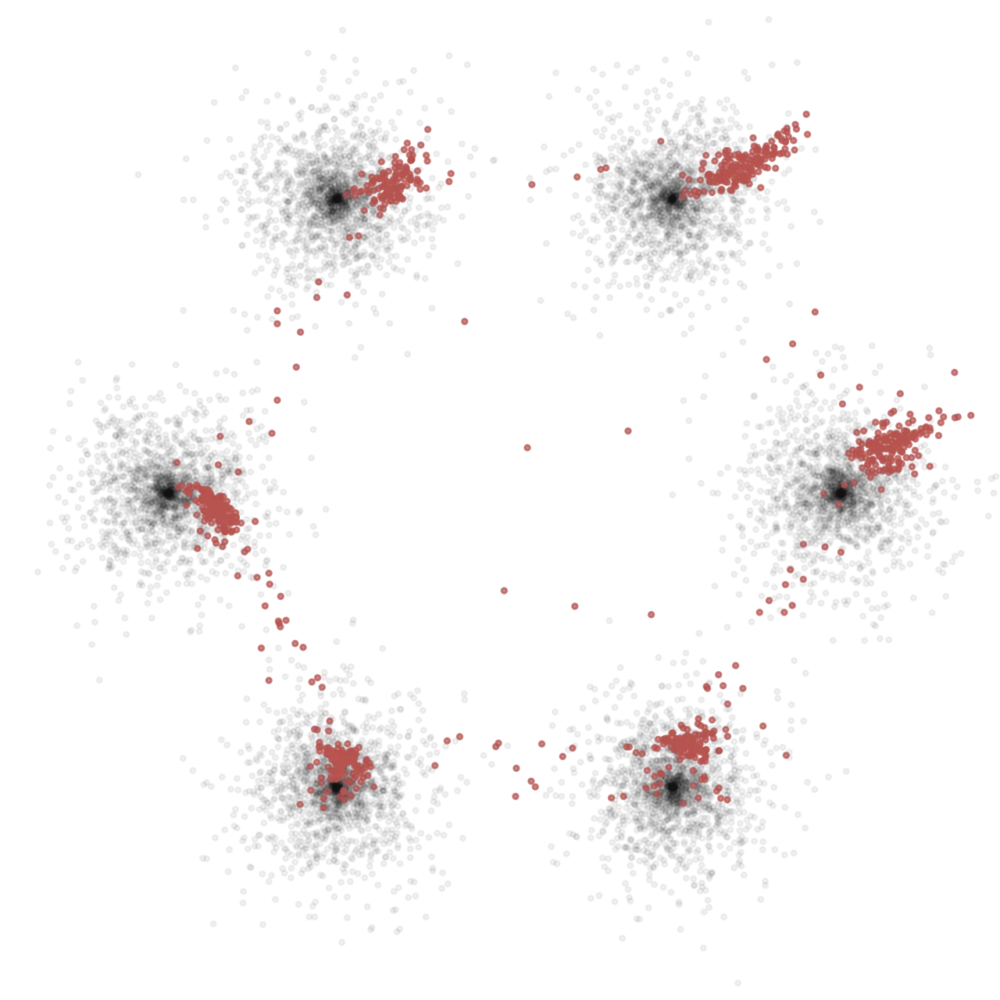

(b) GAN

Figure 3: Distributions generated by a Variational Autoencoder and
Generative Adversarial Network (red) overlaid over training data (gray).
The GAN dominates in accuracy-related metrics while the VAE outperforms
in coverage.

| Metrics                     | VAE   | GAN   |
| --------------------------- | ----- | ----- |
| Nearest Datapoint           | 0.043 | 0.018 |
| Nearest Generated Sample    | 0.090 | 0.100 |
| Rediscovery                 | 0.093 | 0.099 |
| Precision-Recall Curve F1   | 0.475 | 0.386 |
| Precision-Recall Curve F10  | 0.907 | 0.934 |
| Precision-Recall Curve F0.1 | 0.804 | 0.753 |
| Precision-Recall Curve AUC  | 0.468 | 0.379 |
| Maximum Mean Discrepancy    | 0.045 | 0.013 |
| Machine Learning Efficacy   | 0.675 | 0.765 |

Table 2: Distribution-matching scores for models in Figure 3. The GAN
dominates in accuracy-related metrics while the VAE outperforms in
coverage. Point metrics are averaged over the generated set. Bold is
better.

Thus far, we have introduced a variety of metrics to quantify a model’s
ability to generate distributions of designs that match the training
dataset. To showcase the use of these metrics, we evaluate two classic
generative models, a Variational Autoencoder (VAE) and a Generative
Adversarial Network (GAN)⁷⁷ 7 The goal of this example is to compare any
two DGMs; hence, the state-of-art models and strong instantiations were
intentionally not chosen as they performed very well on a
two-dimensional case. using select metrics on a synthetic dataset which
challenges models to learn six non-overlapping data modes (Figure 3,
Table 2). Details on model architecture, metrics settings, and training
are included in the appendix. Individual distribution-matching metrics,
such as MMD, indicate that the GAN is the stronger performer among the
two models. However, when looking at an array of metrics, one can note
that the GAN is the stronger performer in accuracy-based metrics such as
F10 and nearest datapoint. In contrast, the VAE outperforms the GAN in
many coverage-based metrics such as nearest generated sample,
rediscovery, and F0.1. In overall distribution-matching metrics, results
are mixed, with the GAN outperforming in MMD and falling behind in F1
and AUC. The GAN also performed significantly better in machine learning
efficacy on this dataset. Compared to a single metric, this suite
presents a more nuanced picture, and the final model selection could
vary based on the end goal. If coverage is more important, then the VAE
may be preferred, while the GAN may be preferred for realism⁸⁸ 8 We note
that these results need not generalize to other datasets or
architectures.. Since even the best coverage of the design space does
not guarantee the novelty or diversity of generated designs, we next
introduce design exploration metrics.

## 5 Evaluating Design Exploration

Design exploration can be an important consideration in many fields,
such as product design, architecture, and engineering, where new and
innovative solutions are often sought after. A model that successfully
explores the design space will typically generate diverse sets of novel
designs. Diversity often goes hand-in-hand with the generalizability of
a model and diversity-aware DGMs have even been shown to avoid common
generalizability pitfalls such as mode collapse \[24, 25\]. Design
novelty refers to the degree to which a design is new or unique compared
to existing designs. Achieving novelty is particularly difficult for
data-driven generative models since it is somewhat contrary to its
default objective of learning and mimicking a dataset. In design
methodology literature, novelty is typically considered a point metric,
whereas diversity (or variety) is typically considered a set metric. In
this section, we discuss several metrics with which to quantify the
novelty of generated samples and the overall diversity of generated
sample sets.

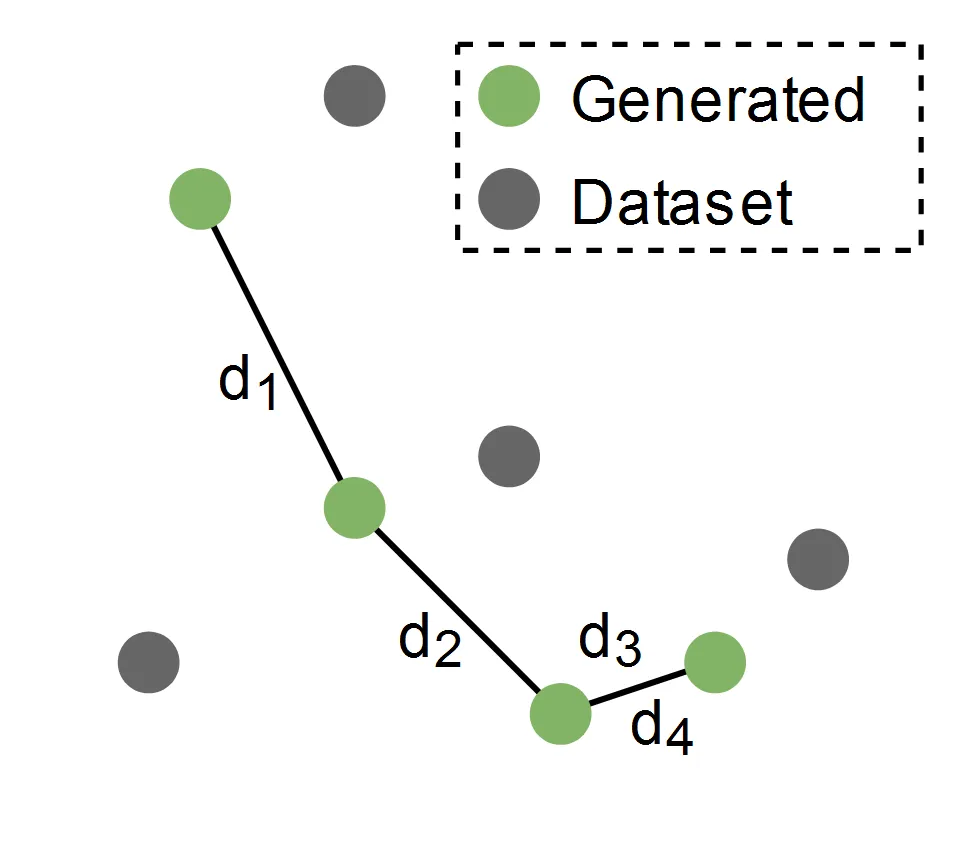

(a) Inter-Sample Distance

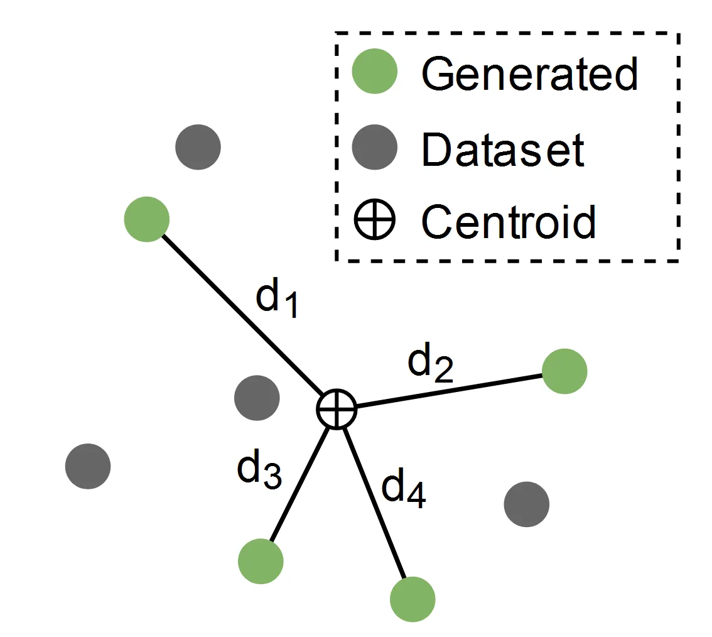

(b) Distance to Centroid

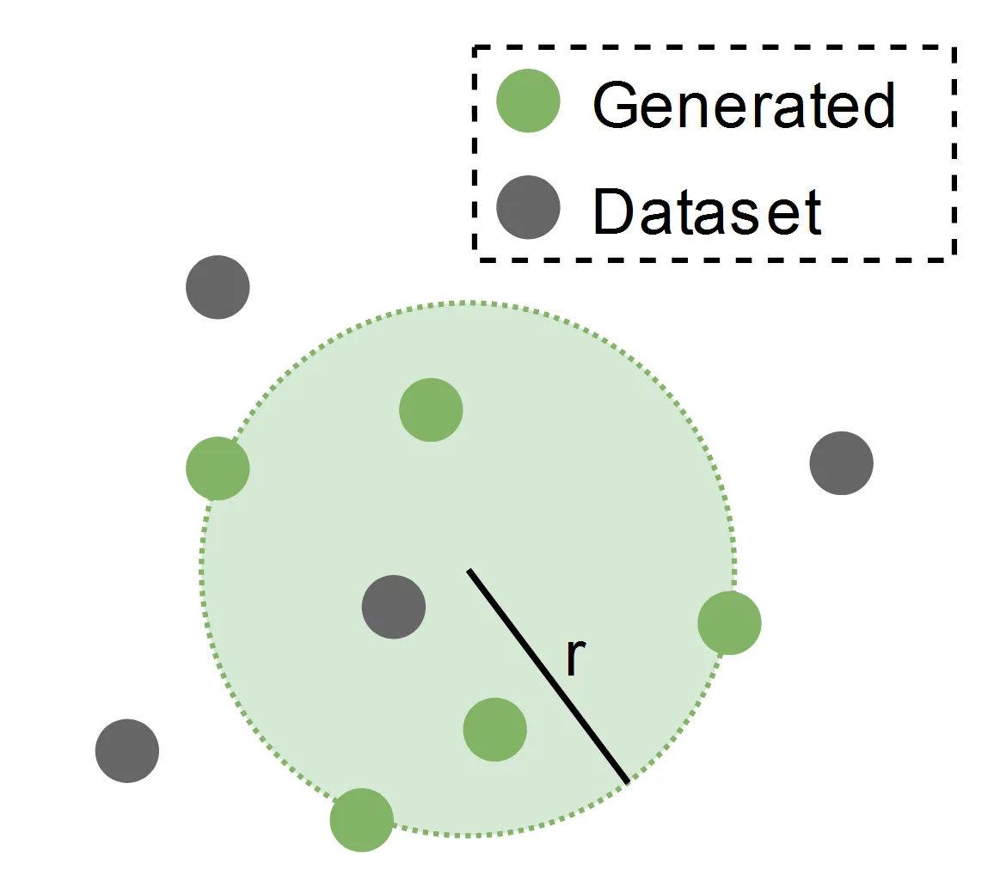

(c) Sm. Enclosing Hypersphere

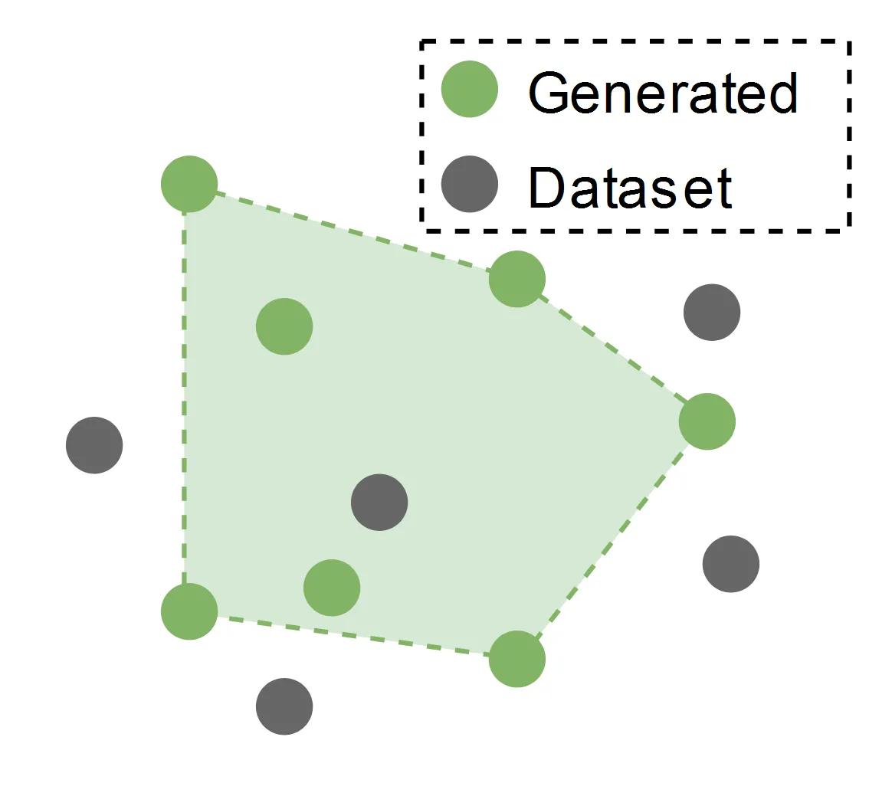

(d) Convex Hull

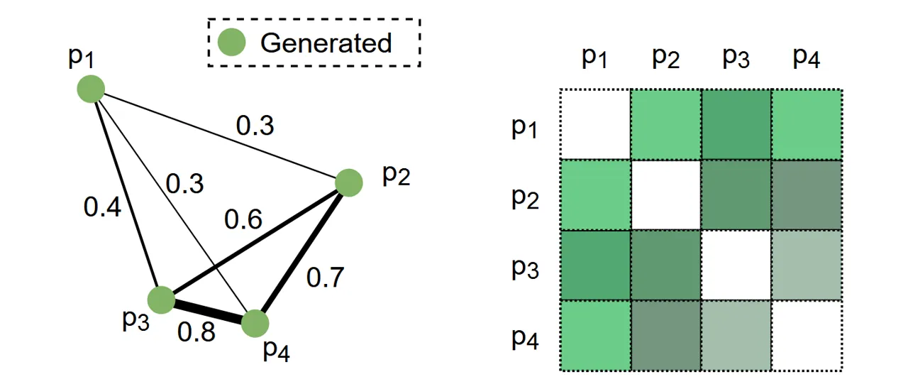

(e) DPP Diversity Score

Figure 4: Illustrations of select diversity and novelty metrics.

### 5.1 Novelty

Novelty refers to the aspect of something being new, original, or
unique. The design methodology community has a rich body of work
classifying and defining novelty. A common distinction is ‘psychological
novelty’ (P-novelty) versus ‘historical novelty’ (H-novelty). A design
is considered P-novel if the idea is new for the person who generated
it. In contrast, a design is H-novel if an idea has never appeared in
history before \[13\]. If we treat our generative model as the
‘designer’ and consider the dataset as the set of designs that the
designer has seen, we argue that the P-novelty can be estimated for a
DGM. However, since we can’t assume that our dataset is comprised of
every design ever conceptualized, estimating H-novelty is challenging,
even if we use the dataset as a reference distribution. Next, we provide
a few methods to estimate novelty.

##### Nearest Datapoint (Figure 2(b))

The nearest datapoint metric (previously introduced as a similarity
metric in Section 4.2) could be used as a P-novelty metric, measuring
how far from the nearest datapoint a generated sample is. Whereas the
metric was best minimized as a metric for accuracy, when used to
evaluate novelty, a larger score is preferable. Nearest datapoint is a
very insightful metric when checking for data copying, where the DGM
will overfit and memorize individual datapoints to replicate while
sampling. One limitation of the metric is its large sensitivity to
individual datapoints. Nevertheless, the nearest datapoint metric has
been used in design literature \[25\] to demonstrate the capability of
deep generative models to create novel designs.

##### Inter-Sample Distance (Figure 4(a))

Another simple metric to estimate the P-novelty of a generated sample is
the distance to the nearest other generated sample. In this simple form,
the metric is a strong assessment of how unique a sample is in its local
neighborhood. However, the metric has also been relaxed to use the
distance to the $`n^{th}`$ nearest neighbor \[59\].

##### Distance to Centroid (Figure 4(b))

Instead of using the distance to the nearest samples, practitioners can
instead quantify the novelty of a generated sample using the distance
from the sample to a single point which summarizes a set of generated
samples, such as the centroid or the geometric median. As Brown &
Mueller \[18\] note, the choice of centroid or median can yield very
different results. Though simple and cheap to compute, the metric may
carry implicit assumptions about convexity. For example, in a torus-like
distribution, the centroid may be novel. Mueller & Ochsendorf \[66\]
propose a variant to adapt the metric into a diversity score using the
maximum distance to the centroid or median. We discuss diversity in more
detail in the next subsection.

### 5.2 Diversity

Design diversity is closely related to the concept of “entropy” in
information theory and refers to the variety or range of different
solutions or designs that are generated for a given problem. In the
context of design problems, it can refer to the degree to which a set of
solutions to a problem encompasses different styles, forms, or
variations. While novelty is a point metric, diversity measures a
property of a set of designs, though many averaged novelty metrics may
often closely correlate with diversity.

Diversity can be broken down into two components: uniformity and spread.
Uniformity measures the relative distance between designs. Spread, also
known as ‘extent’ in multi-objective optimization literature, measures
the range of designs within the generated distribution \[82\]. Imagine
the design space as a balloon with small balls inside it. The spread can
be thought of as the diameter of the balloon. However, even with a fixed
diameter, the balloon may have different uniformity diversity scores,
for example, if all the balls are evenly distributed versus if most of
the balls are stuck in one corner. Many diversity metrics, such as
entropy, combine uniformity and spread into a single value. Below, we
discuss a few of these diversity metrics⁹⁹ 9 Averaged novelty metrics
are also often more focused on either spread or uniformity. For example,
averaged inter-sample distance and averaged nearest datapoint are often
strong measures of uniformity, whereas the averaged distance to centroid
is more focused on spread..

##### Entropy

Entropy scores can be used as a metric for design diversity when
evaluated on a set of generated designs. Some popular metrics include
the Shannon entropy index, Herfindahl–Hirschman Index (HHI) \[1\],
Gini-Simpson index, and inverse Simpson index \[18\]. When practitioners
have discrete data, they can directly calculate the entropy. When
working with continuous representations, however, practitioners must
estimate entropy from samples, a well-studied statistical
problem \[56\]. Entropy captures both uniformity and spread, and its
properties are well-grounded in mathematics and information theory.

##### Smallest Enclosing Hypersphere (Figure 4(c))

The smallest enclosing hypersphere metric is a purely spread-focused
metric that identifies the hypervolume of the smallest hypersphere that
encloses all generated samples. Originally proposed for novelty
measurement \[72\], the calculation is nontrivial for high-dimensional
data and is often approximated to reduce cost \[18\]. Smallest enclosing
hypersphere is highly sensitive to relative scaling between parameters.
It also makes a convexity assumption and is sensitive to outliers.

##### Convex Hull (Figure 4(d))

The convex hull is another spread-focused metric defined as the smallest
convex set that includes a set of generated samples. The total
hypervolume enclosed within the generated set’s convex hull is a common
metric for diversity \[73\]. Brown & Mueller \[18\] found the convex
hull to agree with human assessments of novelty in small low-dimensional
design problems, compared to competing metrics. Like the smallest
enclosing hypersphere, the convex hull makes a convexity assumption and
is often sensitive to outliers.

##### DPP Diversity Score (Figure 4(e))

Determinantal Point Processes (DPP) can be used in conjunction with
distance metrics to evaluate a diversity score of a generated sample
set. DPPs calculate a score based on the eigenvalues of a matrix
constructed using distances between points from a generated sample
set \[57\]. The determinant operation in linear algebra computes the
volume of a parallelepiped formed by vectors. When evaluating the
diversity of a set of items using a DPP, one essentially looks at the
volume in the feature space that these items span. Like entropy, DPP
diversity captures both uniformity and spread. The benefit of DPP is its
ease of calculation for high-dimensional data, as it only requires a
positive-semidefinite kernel as an input. However, it is sensitive to
design duplicates, as the determinant collapses to zero when any of the
eigenvalues is zero. We caution that DPP diversity is highly nonlinear
and small relative changes in score may imply sizeable changes in
diversity.

### 5.3 Demonstration of Design Exploration Metrics

In this section, we introduced a variety of diversity and
novelty-related metrics. To demonstrate their performance, we use the
same representative synthetic data problem introduced in Figure 3.
Scores are shown in Table 3. The VAE dominates in average novelty
metrics (nearest datapoint and inter-sample distance), owing largely to
the fact that the generated samples are more spaced apart and span
regions of the space outside of the dataset. However, the GAN
outperforms the VAE in diversity metrics focused on spread (convex hull
and distance to centroid) because samples generated by the GAN span a
larger convex space. This illustrates a shortcoming with certain
diversity metrics where the potentially diverse samples in the center of
the space generated by the VAE do not contribute to the score. The DPP
diversity score, which takes into account both uniformity and spread,
favors the VAE when using a Euclidean radial basis function (RBF)
kernel.

From this two-dimensional example, we would like to highlight two
points. First, average novelty metrics are easily confused with
diversity metrics, but as this example illustrates, they do not always
agree with diversity scores. Second, practitioners need to be aware of
convexity assumptions and consider both uniformity and spread when
evaluating a model’s diversity.

| Metrics               | VAE    | GAN    |
| --------------------- | ------ | ------ |
| Nearest Datapoint     | 0.043  | 0.018  |
| Inter-Sample Distance | 0.030  | 0.019  |
| Convex Hull           | 5.651  | 7.173  |
| DPP Diversity         | 14.398 | 14.688 |
| Distance to Centroid  | 1.120  | 1.391  |

Table 3: Diversity and novelty scores for generated distributions from
Figure 3. The VAE dominates in average novelty, while the GAN dominates
in spread-focused metrics. Point metrics are averaged over the generated
set. Bold is better.

## 6 Evaluating Design Constraints

Many design problems have constraints, which are limitations placed on
the possible designs within a given problem or task. These constraints
can be physical, such as geometric constraints, or functional, such as
performance or cost requirements. They are used to guide the design
process and ensure that the final solution meets certain requirements
and is feasible to implement. Constraints are commonly driven by
materials or manufacturing limitations, industry standards, or
nonnegotiable safety requirements. Unlike performance targets, which we
discuss in Section 7.2, we must satisfy constraints for the design to be
valid. Constraint satisfaction metrics can roughly be sorted in a strict
order of preference depending on what constraint information is provided
(closed-form, black-box, dataset, etc.). In this section, we propose
several techniques for quantifying constraint satisfaction in DGMs
depending on the constraint information available.

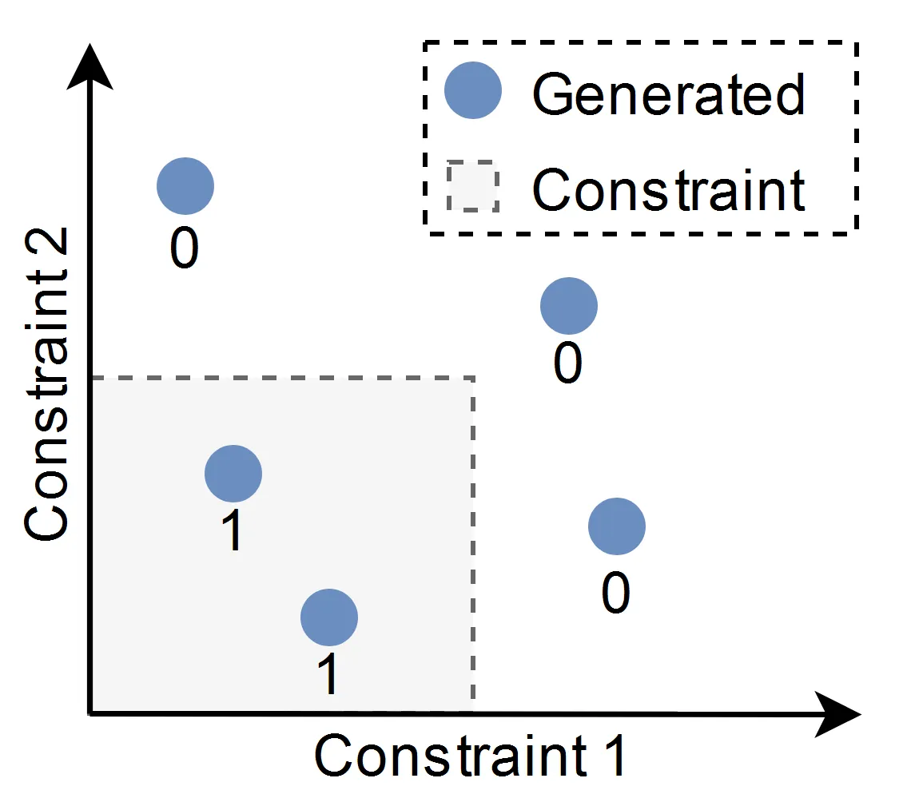

(a) Constraint Satisfaction

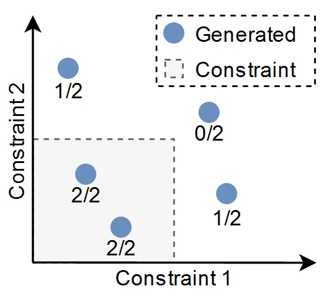

(b) Constraint Satisfaction Rate

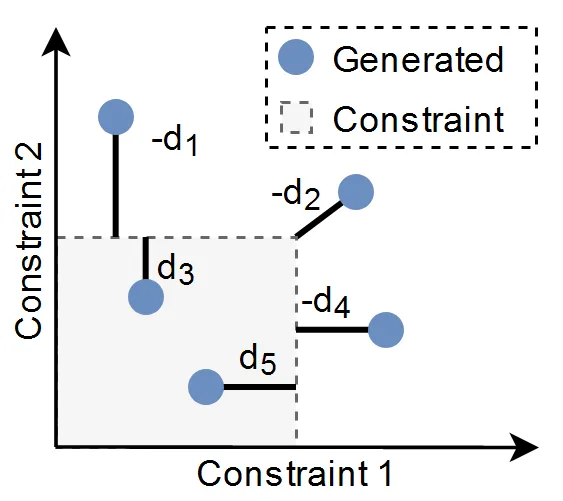

(c) Signed Dist. to Bound.

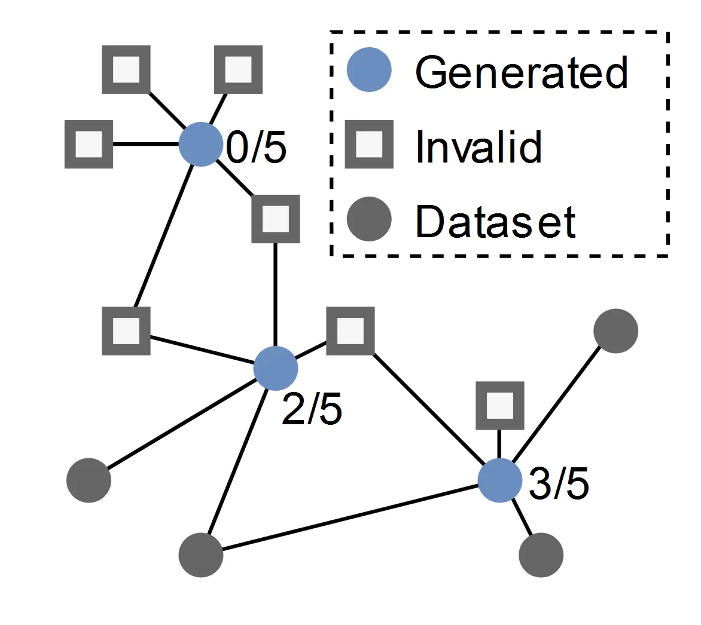

(d) Neighbor Validity Fraction

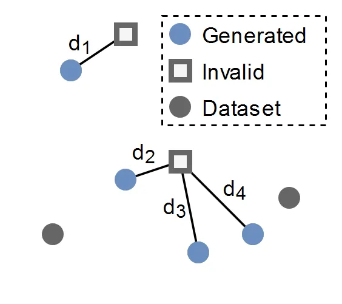

(e) Nearest Invalid Datapoint

Figure 5: Illustrations of select constraint satisfaction metrics.

### 6.1 Leveraging Constraint Violation Tests

In many design problems, there exist known methods (using analytical
equations, rules, simulations, or physics knowledge) to test whether a
design is valid with respect to each of the problem constraints. Since
closed-form constraint definitions are rare in design problems,
practitioners may instead have to turn to such methods to evaluate
constraint satisfaction. Below, we list a few methods that leverage such
constraint violation tests, when available.

##### Constraint Satisfaction (Figure 5(a))

Provided that practitioners have access to some black-box constraint
satisfaction test, a simple binary constraint satisfaction value (i.e.,
does a generated sample simultaneously meet all constraints?) suffices
as a simple metric. When averaged over a generated sample set, this can
effectively serve as an indicator for the proportion of generated
samples that are valid. In practice, more versatile scores are often
more informative, especially in problems with multiple constraints.

##### Constraint Satisfaction Rate (Figure 5(b))

A variant of the simple constraint satisfaction score is the constraint
satisfaction rate, which quantifies the proportion of all constraints
met by a single generated sample. If different constraints have
different priority weightings, this score can be weighted by the
priority of the various constraints.

### 6.2 Leveraging Mathematically-Defined Constraint Boundaries

Though rare, practitioners may sometimes have access to a closed-form
mathematically-defined constraint boundary. They can usually then
calculate distances from generated design samples to the constraint
boundary, which can be highly informative.

##### Signed Distance to Constraint Boundary: (Figure 5(c))

The distance to constraint boundary metric is particularly informative
as a signed distance field (SDF), with generated samples satisfying the
constraints having positive distances and samples violating the
constraints having negative distances. Indicating by what margin samples
are satisfying or violating constraints can be significantly more
informative than a simple binary criterion or proportion of constraints
met.

### 6.3 Metrics that Leverage Datasets of Invalid Designs

Unfortunately, it is common not to have even a black-box constraint
evaluator or methods allowing the direct estimation of the distance to
the constraint boundary. In such cases, practitioners may have access to
or may be able to procedurally generate a large collection of infeasible
or invalid designs. These datasets of constraint-violating (invalid)
designs provide a tool to approximate the constraint adherence of
generated designs.

##### Predicted Constraint Satisfaction

When practitioners have access to a reference set of
constraint-violating datapoints, they can use a classifier to predict
the constraint satisfaction of their generated samples. This classifier
can be something complex like a neural network, or something simple and
robust like k-nearest neighbors. In the case of k-nearest neighbors, the
fraction of neighbors that are valid provides a likelihood that a
generated sample satisfies constraints, which serves as the score, as
shown in Figure 5(d).

##### Nearest Invalid Datapoint (Figure 5(e))

When practitioners have access to a reference set of
constraint-violating datapoints, they can calculate the distance from
each generated sample to the nearest known invalid datapoint. The
underlying assumption is that samples near constraint-violating
datapoints are also likely to be constraint-violating. This gives a
rough approximation of the distance to the constraint boundary.

### 6.4 Demonstration of Design Constraint Metrics

Having presented a variety of metrics for evaluating constraint
satisfaction, we again showcase these metrics on a simple
two-dimensional problem. To demonstrate the constraint adherence task,
we test a GAN and a VAE on a concentric ring problem that we created for
this task (Figure 6(a)). To support the nearest invalid datapoint
metric, we also include a dataset of invalid datapoints, shown in
Figure 6(b), though these invalid datapoints are not used during
training¹⁰¹⁰ 10 Since closed-form constraints are given, there would be
little reason to use dataset-based metrics like predicted constraint
satisfaction in practice.. Both the GAN and the VAE struggle to avoid
the invalid area of the design space, as seen by points overlapping with
the infeasible regions in Figures 6(c) and 6(d). However, as shown in
Table 4, the GAN outperforms the VAE in every metric, indicating that it
is better suited to generate feasible designs in this problem. With
this, we conclude our discussion about constraint adherence metrics and
move on to consider metrics that evaluate design performance.


(a) Valid Datapoints

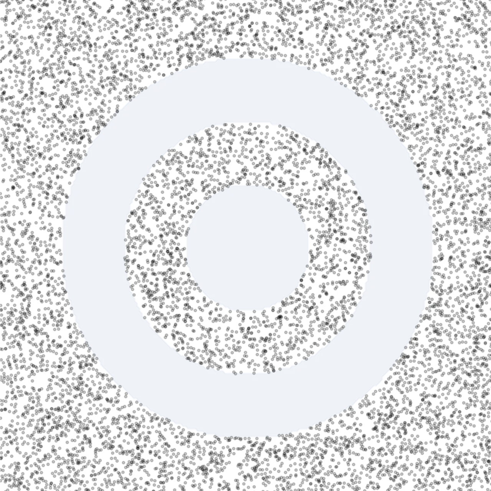

(b) Invalid Datapoints

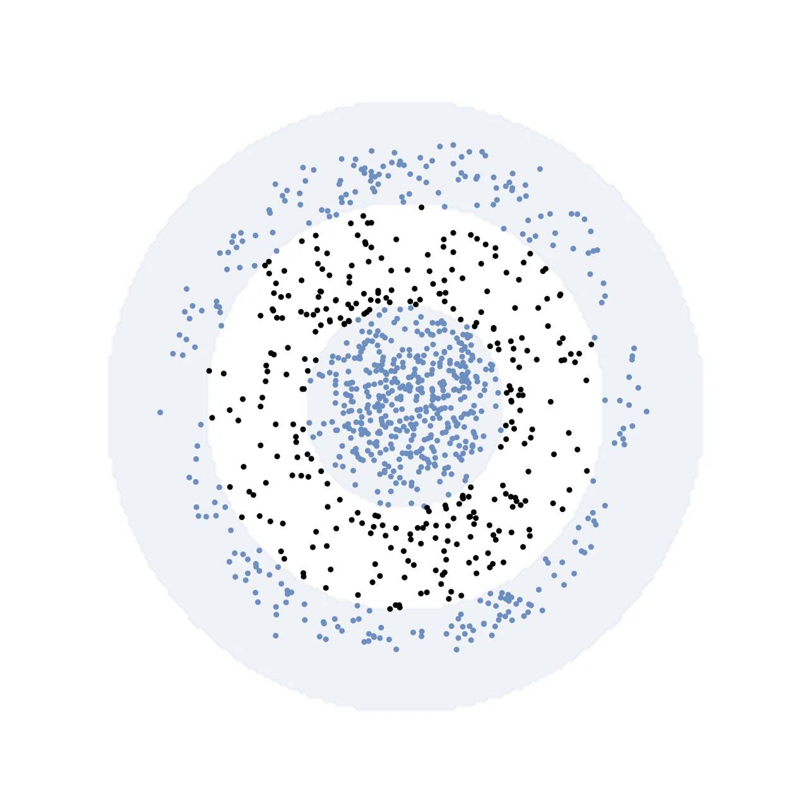

(c) VAE


(d) GAN

Figure 6: Distributions generated by a Variational Autoencoder and
Generative Adversarial Network. Both the VAE and GAN struggle to observe
the non-convex constraint dividing the two valid regions of the design
space. Generated samples that violate constraints are shown in black,
while valid generated samples are shown in blue. The GAN demonstrates
generally higher constraint satisfaction performance.

| Metrics                           | VAE   | GAN   |
| --------------------------------- | ----- | ----- |
| Constraint Satisfaction           | 0.713 | 0.833 |
| Constraint Satisfaction Rate      | 0.857 | 0.917 |
| Predicted Constraint Satisfaction | 0.698 | 0.823 |
| Nearest Invalid Datapoint         | 0.17  | 0.173 |

Table 4: Constraint adherence scores averaged over the generated
distributions in Figure 6. The GAN demonstrates generally higher
constraint satisfaction performance. Point metrics are averaged over the
generated set. Bold is better.

## 7 Evaluating Design Quality or Performance

In image synthesis problems like human face generation, ‘quality’ and
‘realism’ are almost synonymous – the more realistic the generated
images, the higher their ‘quality.’ In design, quality is typically not
associated with similarity to existing designs. Instead, the quality of
designs is often governed by an associated set of functional performance
characteristics, often modeled as a mapping from the design space to
some performance space. In Fig. 1, we gave an anecdote of two bike
frames with drastically different functional performances, despite being
visually and parametrically similar. Characteristics of quality in
design may include factors such as cost, weight, efficiency, etc., and
are highly problem dependent.

The metrics presented in this section typically require a method to
evaluate functional performance for generated designs. Sometimes, a
trained predictive model can suffice for this task, but increases the
possibility of inaccurate and biased scores. We would like to note that
a generated design’s innate performance attributes as calculated by an
evaluator or predictor can also serve as simple but effective metrics
for the design and the generator, by extension.

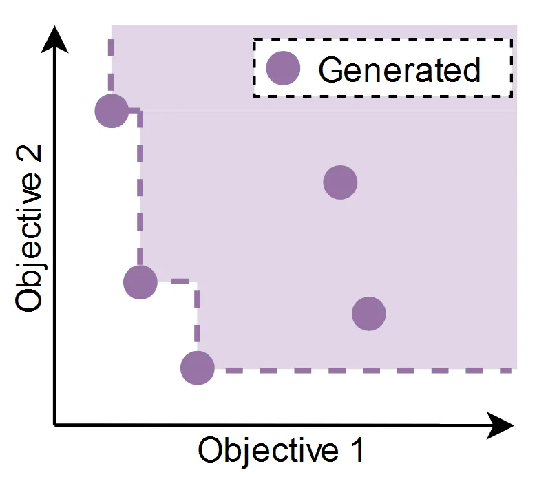

(a) Hypervolume

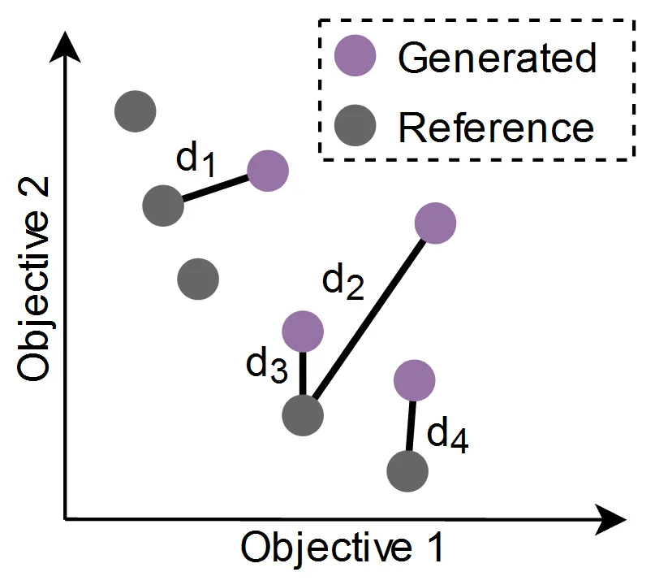

(b) Generational Distance

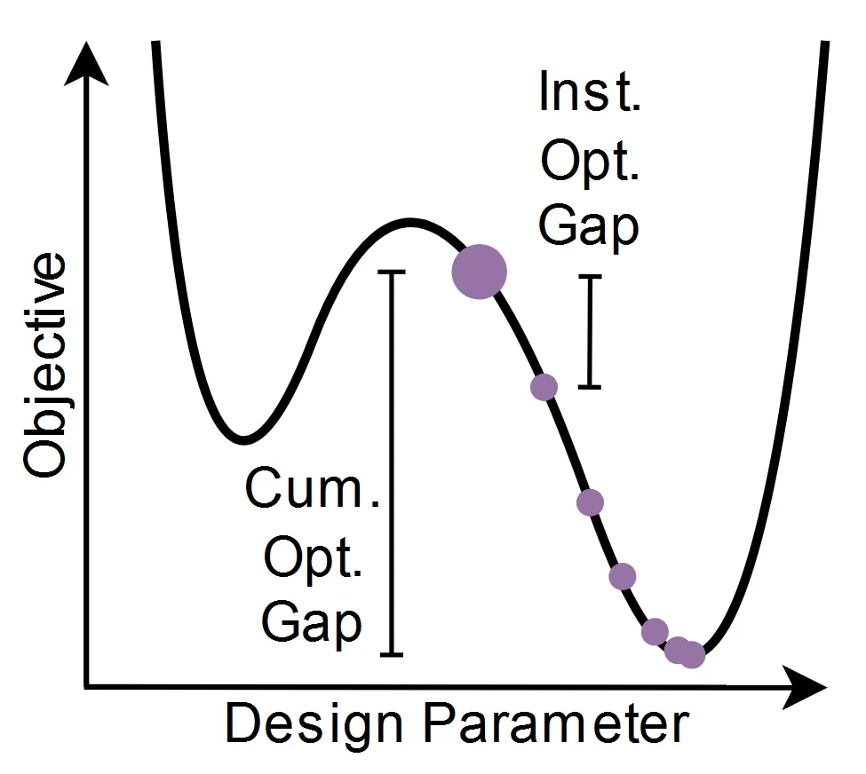

(c) Optimality Gap

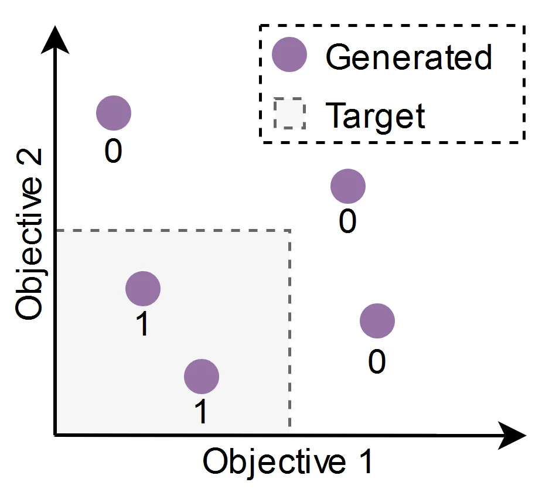

(d) Target Achievement

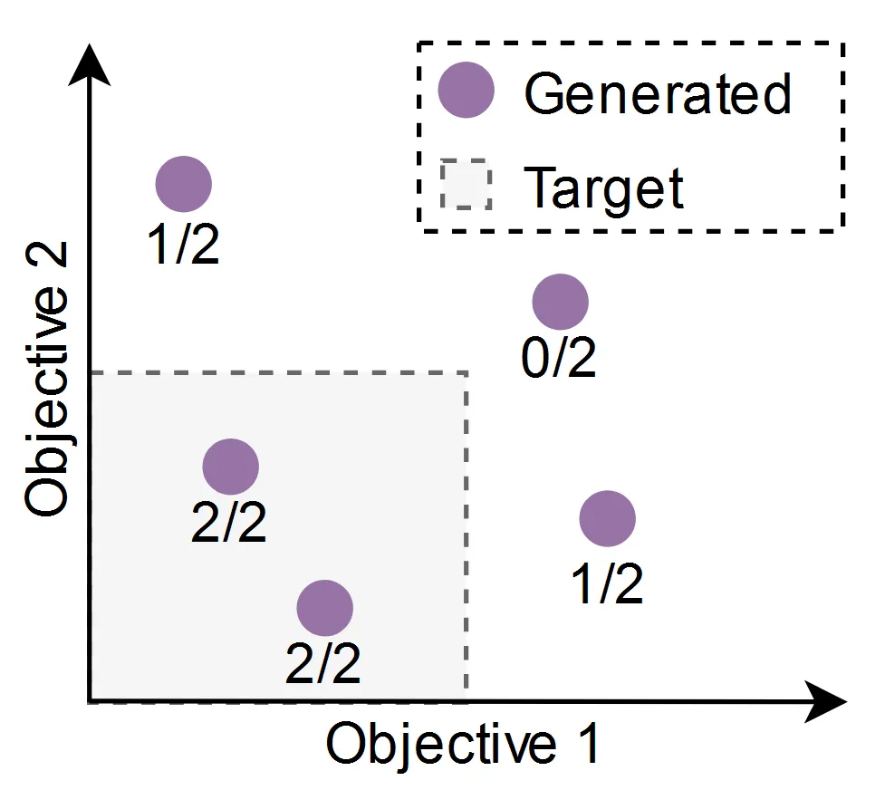

(e) Target Achievement Rate

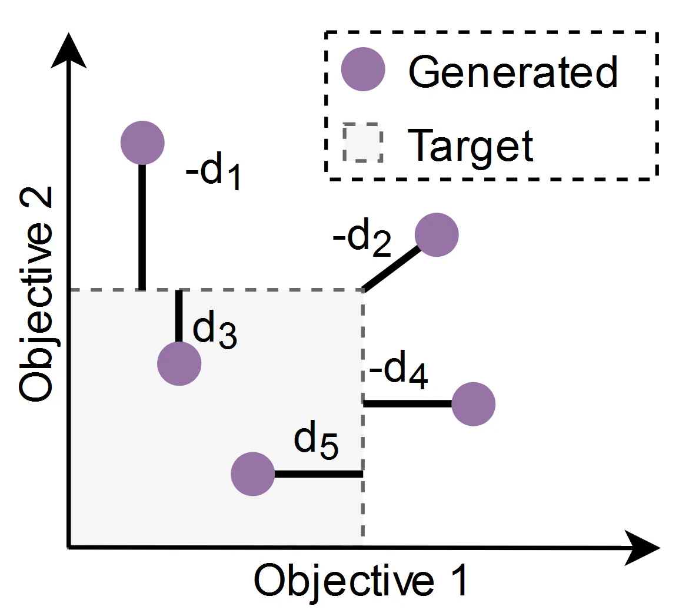

(f) Signed Distance to Target

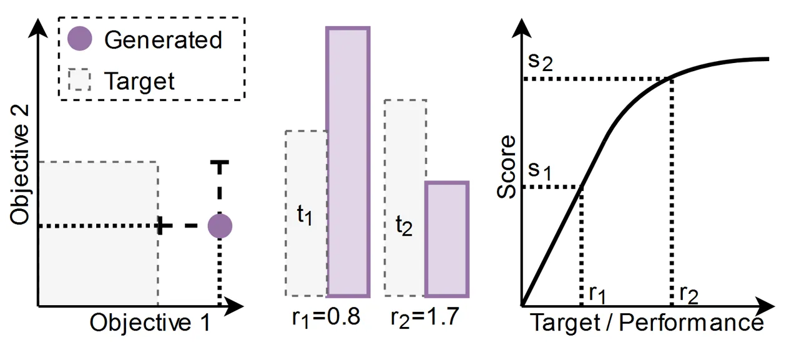

(g) Design Target Achievement Index

Figure 7: Illustrations of select design quality and target achievement
metrics.

### 7.1 Performance Optimality

In many engineering problems, designers want to find a distributed set
of solutions that are performant across multiple objectives. This is
especially common in multi-objective optimization problems, where
designers often seek to identify a Pareto-optimal set of points.
Pareto-optimal designs have the property that performance improvement in
any objective must come at the expense of performance in some other
objective. This means that Pareto-optimal designs cannot be ‘dominated’
by any other design, i.e., there exists no design that has superior
performance in every objective. Identifying a strong approximation set
for the Pareto-optimal front can be extremely valuable in design
problems because it effectively provides an optimal design given any
arbitrary choice of objective priorities by the designer. If
practitioners seek to generate a diverse set of near-optimal designs,
they may seek to quantify how close a set of generated designs is to the
true Pareto-optimal front. Below, we discuss a few metrics that could be
adopted by design researchers to quantify performance optimality and
refer readers to more detailed reviews, such as \[82\] for other
metrics.

##### Hypervolume Metric (Figure 7(a))

The hypervolume metric, often simply referred to as ‘hypervolume,’ is a
staple metric in the multi-objective optimization field \[82\], which
estimates the proximity of a set of generated samples to the (often
unknown) Pareto-optimal front. In simple terms, the metric calculates
the hypervolume comprised of all points that are dominated by some point
in the generated set but simultaneously dominate some fixed reference
point. This leading optimization metric has seen previous use in DGM
evaluation, such as in  \[24\] to compare the performance of different
GAN models for airfoil synthesis.

##### Generational Distance (Figure 7(b))

When a set of ‘optimal’ reference designs is known, generational
distance can be used to measure design optimality. Generational
distance, another staple of the multi-objective optimization
community \[82\], measures the distance from a generated sample to the
nearest point on an ‘optimal’ reference set \[93\]. This reference set
may not consist of truly optimal designs but is typically taken as a
reliable approximation for a true Pareto-optimal design set.
Generational distance is not widely adopted as a metric for deep
generative models but can serve as an excellent metric for evaluating
the quality of generated designs in cases when an optimality frontier is
known or could be constructed from the training data using non-dominated
ranking methods.

##### Optimality Gap (Figure 7(c))

When working on well-defined problems, practitioners may be able to
perform gradient-based optimization on their problems. In these cases,
they can estimate the distance to an optimal design using ‘optimality
gap’ metrics. The distance from the generated design to the local
minimum discovered by the optimizer is often referred to as the
‘cumulative optimality gap’ or simply the ‘optimality gap.’ A variant,
the instantaneous optimality gap, has also been proposed to measure the
distance to the modified design after the first step of gradient
descent \[22\].

### 7.2 Target Achievement

While generating an entire set of Pareto-optimal designs can be helpful
when exact design goals are not yet decided, practitioners may also need
to apply generative models to design problems where performance targets
are specified. These types of problems necessitate a suite of metrics
that quantify a model’s ability to achieve performance targets. We would
like to clarify that, in contrast to hard design constraints,
performance targets are intended to be negotiable. They are also
different from soft constraints, as exceeding a target by a larger
margin is often desirable, which is not the case with constraints. While
many of the metrics for constraint satisfaction can be modified to
quantify target achievement, the handling of design targets can call for
more nuanced metrics which reflect their flexibility.

##### Target Achievement Scores

Reformulating several of the previously discussed constraint
satisfaction metrics, we can define analogs for the target achievement
case. Target achievement (Figure 7(d)), much like the constraint
satisfaction score, measures whether a design simultaneously meets all
performance targets across objectives. However, since simultaneously
achieving all the targets in a given problem may be difficult, more
nuanced scores are typically more informative in quantifying proximity
to the target. Target achievement rate (Figure 7(e)) is analogous to the
constraint satisfaction rate, quantifying the weighted proportion of
multi-objective design targets met by a design. When practitioners have
a well-defined target criterion, they can calculate a signed distance to
target (Figure 7(f)), indicating the degree to which a design is
outperforming or underperforming the set of multi-objective design
targets.

##### Design Target Achievement Index (Figure 7(g))

In problems with particularly nuanced design goals and targets,
practitioners may want an even more flexible metric than the signed
distance to the target. Regenwetter et. al. \[77\] proposed the design
target achievement index (DTAI), which considers the relative importance
of targets and the value of continued optimization beyond the target.
The key idea is to aggregate weighted soft penalties when a target in
any of the objectives is not achieved and combine them with decaying
rewards when the target is exceeded. DTAI is also bounded and
differentiable, making it viable as a training loss in generative design
problems where design performance values are provided in the dataset.

### 7.3 Demonstration of Design Quality Metrics

Having introduced a variety of performance and target achievement
metrics for DGMs in design, we once again present a two-dimensional
example demonstrating the use of these metrics. We select the KNO1 test
problem as the objective function \[54\] with a restrictive minimum
performance target of $`(0.5,0.5)`$ and add it to the previously
discussed two-dimensional example (Figure 8, Table 5). We test a
standard GAN, which ignores performance, and a Multi-Objective
Performance-augmented Diverse GAN (MO-PaDGAN) \[24\], which attempts to
generate a diverse set of high-performing designs. Model and metric
parameters are included in the appendix. The MO-PaDGAN largely ignores
the two low-performance modes and outperforms the standard GAN in every
performance metric tested. It achieves a stronger Pareto-optimal set as
indicated by the hypervolume metric. It generates designs that are, in
general, closer to the known Pareto-optimal reference set, as indicated
by the generational distance metric. Its designs achieve a greater
fraction of the performance targets, lie closer to the target boundary,
and adhere more closely to the target overall, as indicated by the
weighted target achievement rate, signed distance to target, and design
target achievement index, respectively. These metrics match our
intuition and provide a way to quantify differences between different
models: A standard GAN underperforms in all metrics, as it only
maximizes distribution similarity, without any consideration for other
factors such as objectives and targets. Note that the GAN would dominate
the MO-PaDGAN in almost every statistical similarity metric. In design
problems, higher functional performance often comes at the expense of
statistical similarity.

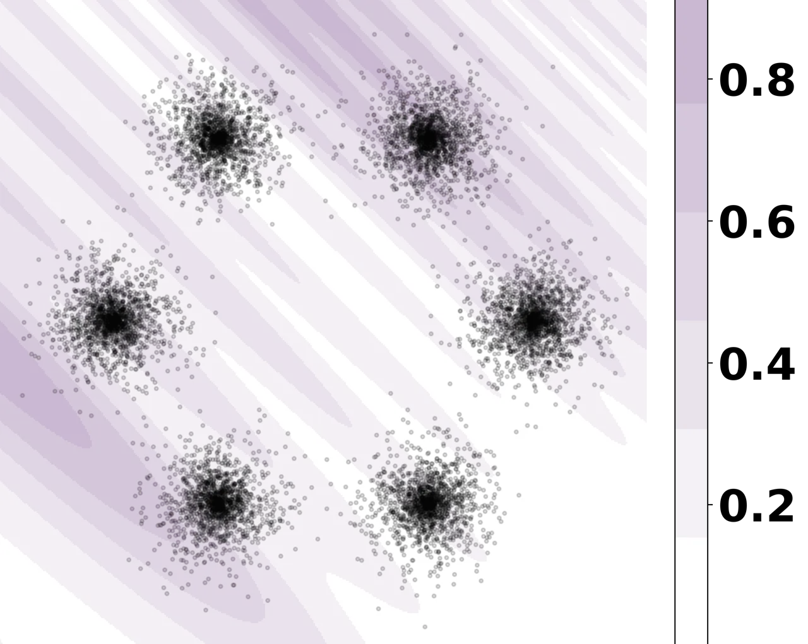

(a) Objective 1

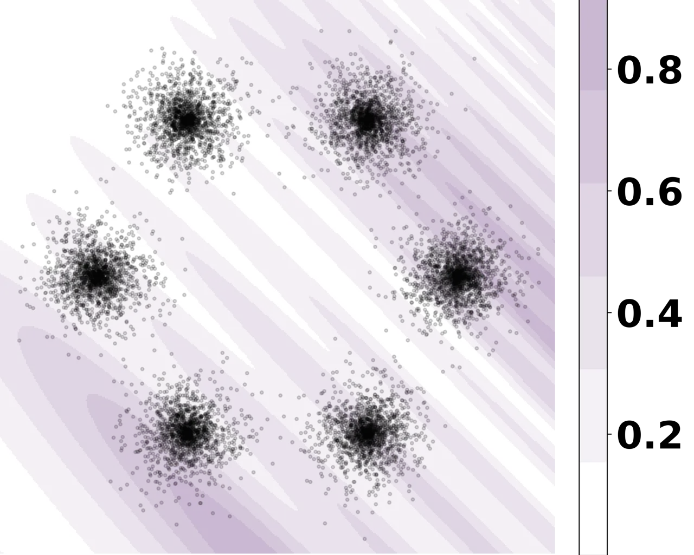

(b) Objective 2

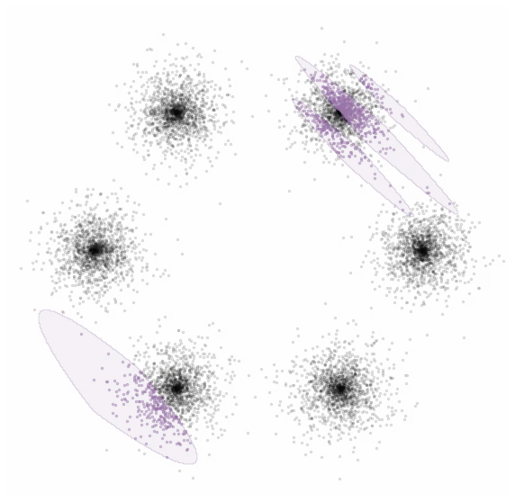

(c) Target-achieving region

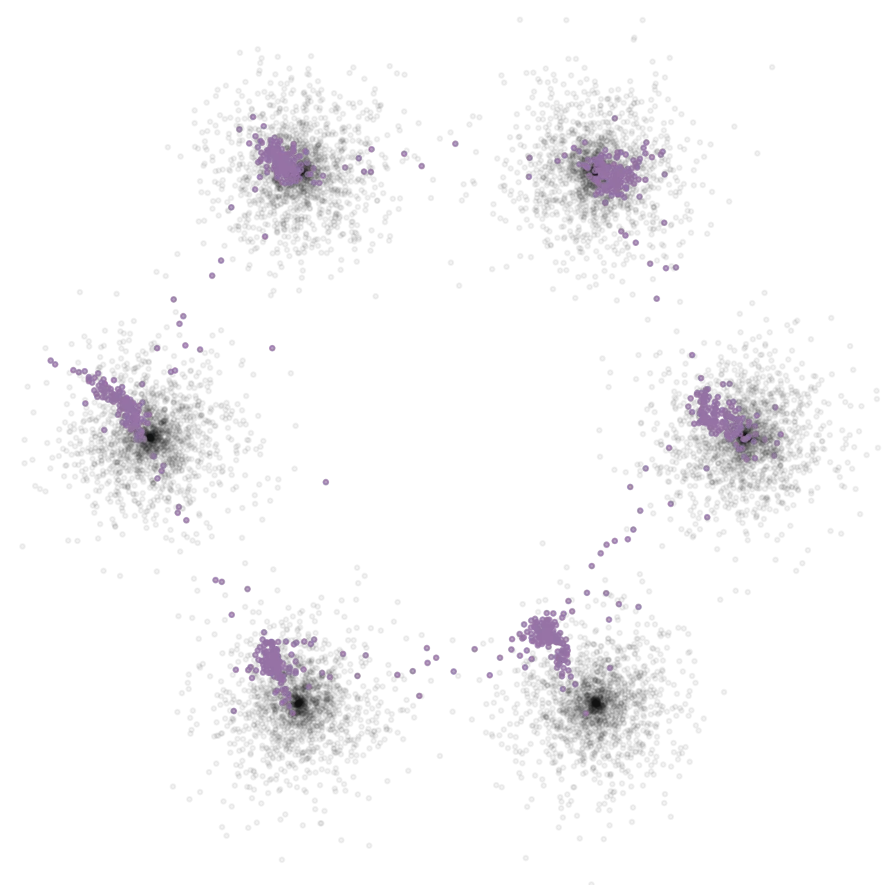

(d) GAN

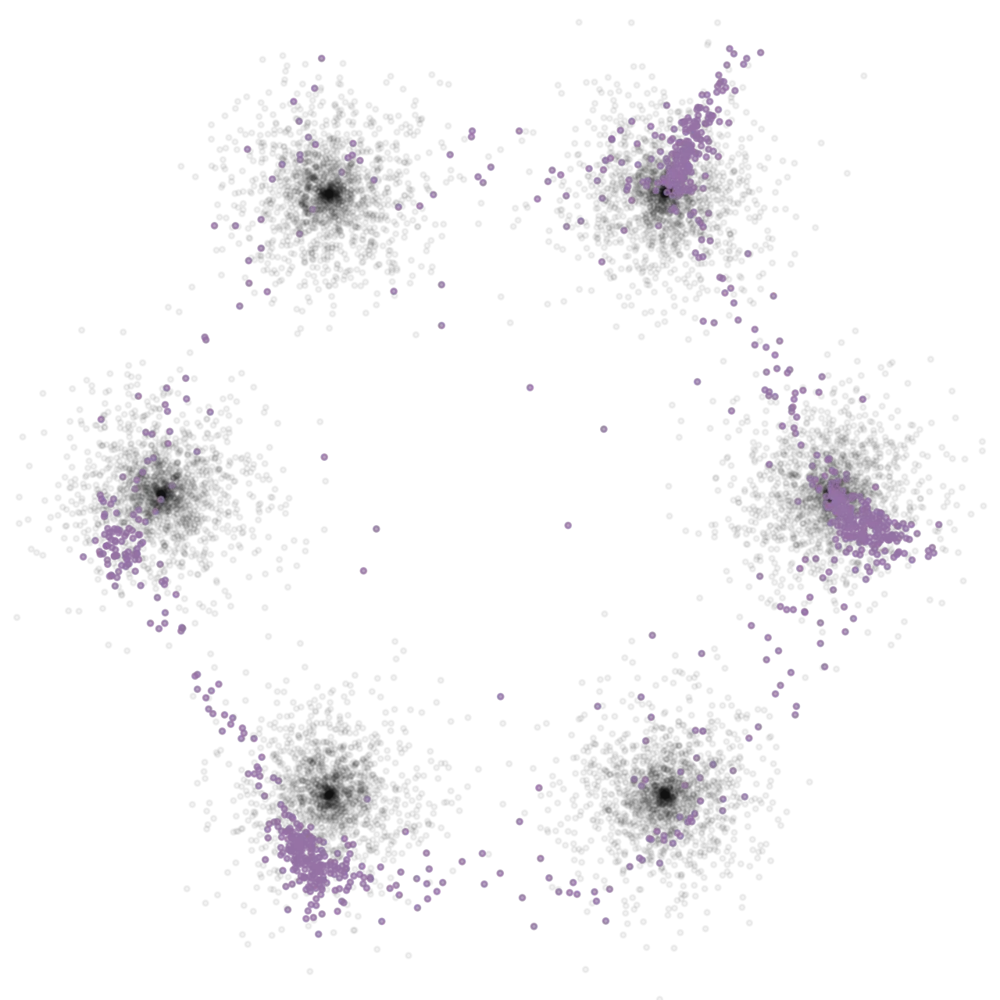

(e) MO-PaDGAN

Figure 8: Visual demonstration of a Generative Adversarial Network and
Multi-Objective Performance-augmented Diverse GAN on the two-dimensional
KNO1 objective. The MO-PaDGAN, which considers functional performance
samples predominantly from higher-performing modes.

| Metrics                   | GAN    | MO-PaDGAN |
| ------------------------- | ------ | --------- |
| Hypervolume               | 0.460  | 0.571     |
| Generational Distance     | 0.215  | 0.315     |
| Weighted Target Ach. Rate | 0.162  | 0.430     |
| Signed Distance to Target | -0.275 | -0.154    |
| Design Target Ach. Index  | 0.324  | 0.433     |

Table 5: Performance and target achievement scores for distributions in
Figure 8.The MO-PaDGAN, which considers functional performance, samples
predominantly from higher-performing modes. Point metrics are averaged
over the generated set. Bold is better.

## 8 Evaluating Conditioning Requirements

In DGMs, conditioning refers to the process of incorporating additional
information, such as labels or attributes, into the model when
generating new data. For example, in image generation, a deep generative
model can be conditioned on class labels, such as ‘dog’ or ‘cat’, in
order to generate images of specific animals, rather than randomly
picking cats or dogs (or training separate generators for each class of
image). Conditional DGMs are often more robust and data-efficient than
training many individual DGMs since they allow designers to reuse a
single model for many variants of a particular design problem.

Conditional variants of many classic generative models have been
proposed \[64, 27, 90\], but are most commonly applied to
class-conditional problems. In design, many tasks necessitate continuous
conditioning, and specialized models have been proposed \[45, 44\].
Conditioning information varies from problem to problem. It is commonly
used to encode constraints, functional performance targets, or
parameters used to distinguish one version of a problem from another.
For example, DGMs for structural topologies are typically conditioned on
boundary conditions (normally thought of as constraints), volume
fraction (sometimes thought of as a functional performance attribute),
and load locations (used to distinguish different loading
problems) \[68, 62\].

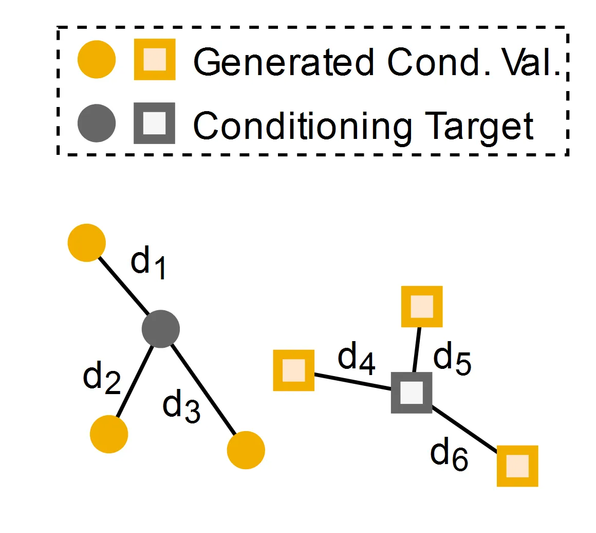

(a) Conditioning Adherence

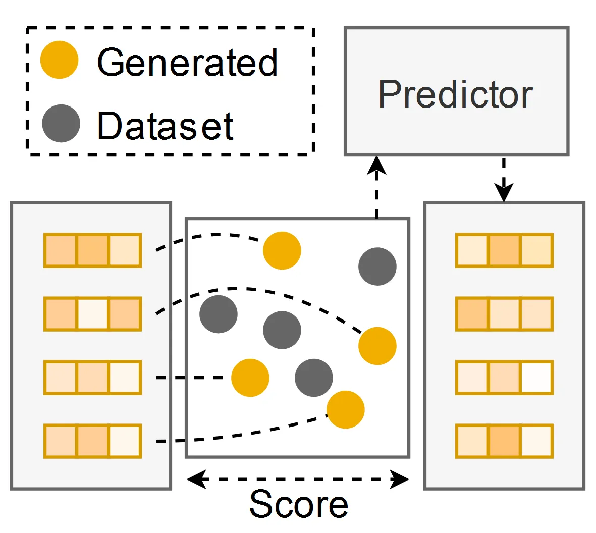

(b) Conditioning Reconstruction

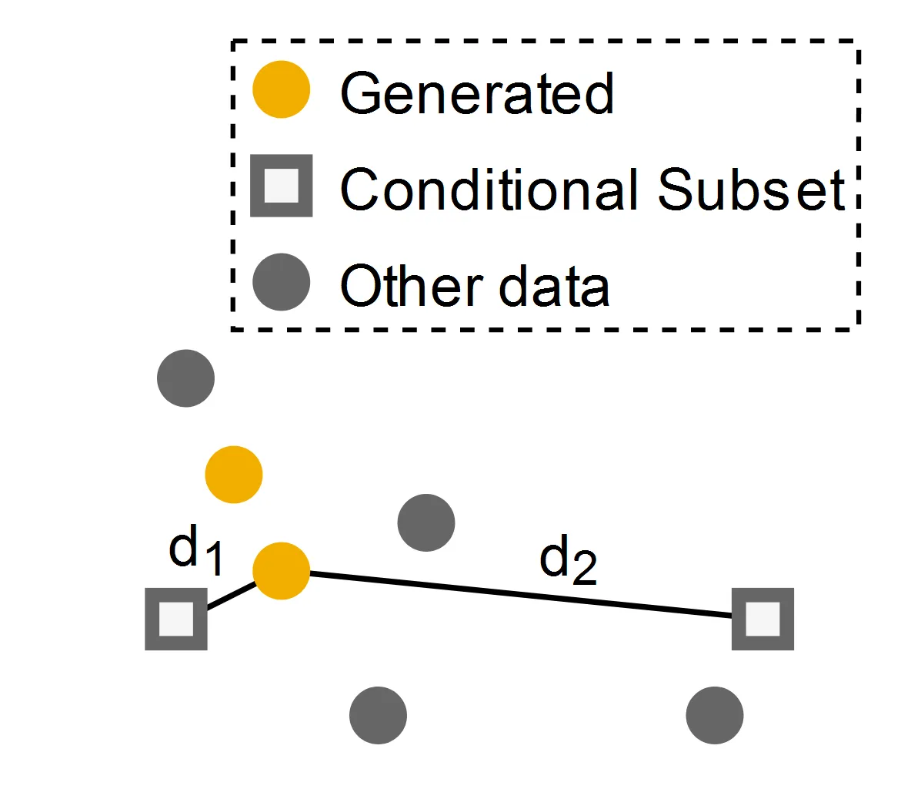

(c) Cond. Nearest Gen. Sample

Figure 9: Illustrations of select conditioning metrics.

### 8.1 Conditioning Adherence (Figure 9(a))

When working with conditional models, practitioners may want to quantify
the degree to which their model respects the information on which it is
conditioned. In some problems, practitioners are conditioning on
information that they can directly calculate for generated samples. For
example, if conditioning a structural topology DGM on volume fraction,
the volume fraction of generated samples can be calculated as the
fraction of filled pixels to total pixels. In this case, the difference
in conditioned versus actual volume fraction serves as a conditioning
adherence metric. Broadly speaking, the distance between the condition
and the recalculated condition is a viable approach to quantify
conditioning adherence. When exact conditioning information cannot be
calculated, it can instead be estimated using a predictor (Conditioning
reconstruction, (Figure 9(b))). Since the reconstruction loss serves as
the score, the accuracy of the predictor directly impacts the metric.

### 8.2 Adapting Unary Metrics to Conditional Problems

Many of the metrics presented in previous sections must be adapted for
conditional problems. We first discuss strategies to adapt unary metrics
to conditional settings and discuss the more challenging task of
adapting binary metrics in the following section. Unary metrics must be
calculated and averaged over numerous conditions. Naturally, we wouldn’t
compare Model A’s conditional bike-generating ability with Model B’s
scooter-generating ability. We instead must report each model’s average
performance over an identical and comprehensive set of conditions or
report scores for each condition of interest. For continuous
conditioning problems, this may mean averaging over many conditions
sampled from some repeatable parametric statistical distribution.

### 8.3 Adapting Binary Metrics to Conditional Problems

In unconditional problems, binary metrics typically compare the
generated distribution to a reference distribution (often the dataset).
When we instead have a conditionally-generated distribution, we can
compare against a conditional reference or a marginal reference,
approaches with their own strengths, which we discuss below. In either
case, much like for unary metrics, we typically average scores over a
sweep of conditions to yield an overall condition-agnostic score, or
simply report metrics under several individual conditions.

##### Comparing Generated Distribution to a Conditional Reference

Intuitively and most commonly, we would compare the
conditionally-generated distribution to a conditional reference¹¹¹¹ 11
This is the standard formulation for class-conditional variants of
popular metrics like class-conditional FID and IS \[10\].. Classically,
this is the subset of the dataset that adheres to the prescribed
condition¹²¹² 12 When the reference set is not the dataset, the concept
of a conditional subset may not make sense. For example, the reference
distribution in generational distance is a Pareto-optimal set. The
conditional subset of this reference may have significant gaps and may
no longer be a strong reference set, defeating the purpose of the
metric.. We have illustrated the conditional nearest generated sample
metric in Figure 9(c), but the principle applies broadly to many binary
metrics.

Identifying a conditional data subset is often nontrivial in continuous
conditioning problems since we can’t select a discrete subset of the
dataset which exactly respects the condition. Instead, we can
approximate by selecting a subset of the dataset whose conditions are
proximal to the condition used to create the generated distribution.
However, this necessitates calculating some distance in the conditioning
space, such as the vicinal loss defined in literature \[45, 34\].
Calculating these vicinity-based values may again be nontrivial in
problems with high-dimensional or multimodal conditioning information.

##### Comparing Generated Distributions to a Marginal Reference

Alternatively, we can compare the conditionally-generated distribution
to the full marginal reference distribution. This may serve as a
next-best option when calculating a conditional reference is
intractable. However, comparing conditionally-generated distributions to
a marginal reference may actually be uniquely illustrative for certain
metrics such as nearest datapoint. Say, for example, that we are
conditionally generating lightweight bikes using a DGM. The dataset
contains only heavy mountain bikes and light road bikes. Therefore, the
conditional subset contains only light road bikes. If our DGM generates
light mountain bikes, it will score well if compared to the full
(marginal) dataset, which includes mountain bikes, and poorly if
compared to the conditional subset of only road bikes. On one hand,
discovering adaptations of designs to meet the specified condition may
be innovative and desirable. On the other hand, lightweight mountain
bikes are ‘unrealistic’, according to the data. The two variants of
nearest datapoint provide different insights in the conditional setting.

### 8.4 Demonstration of Conditioning Metrics

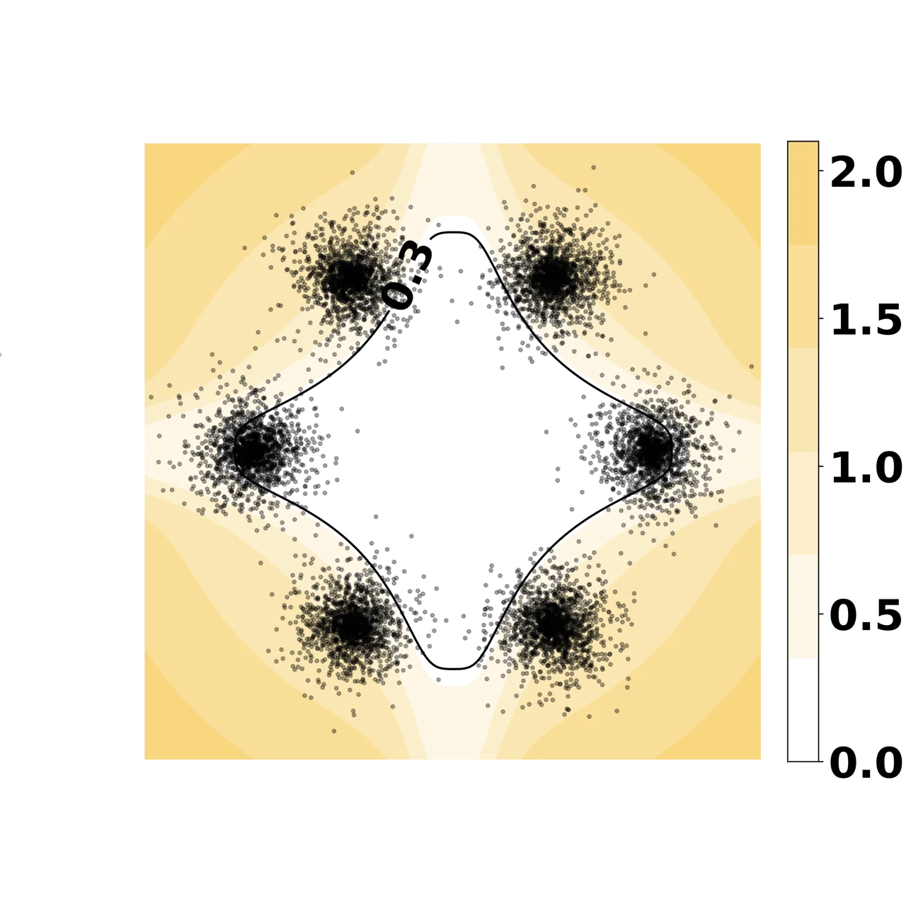

(a) Original data


(b) Conditional Prior

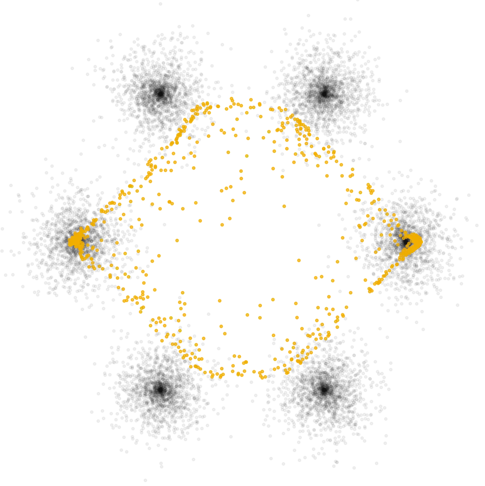

(c) cVAE vs. marginal prior

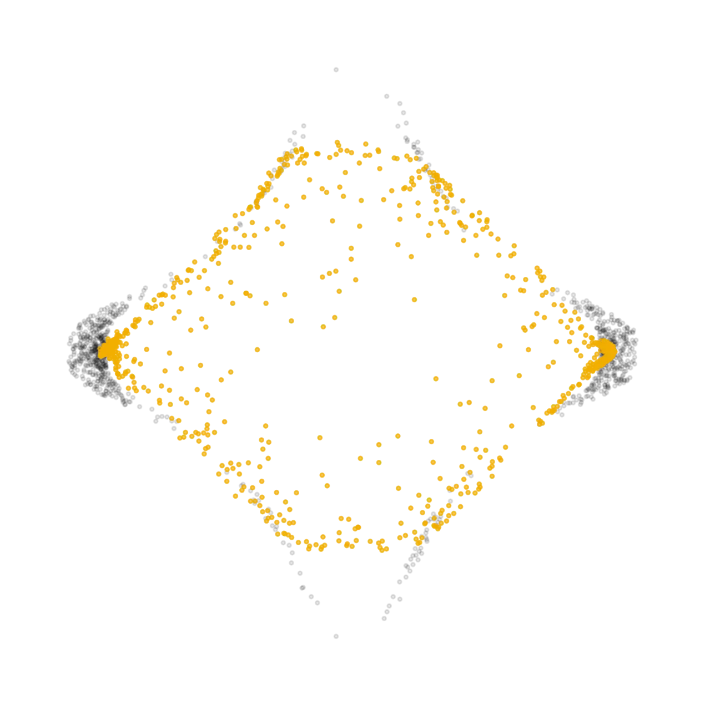

(d) cVAE vs. conditional prior

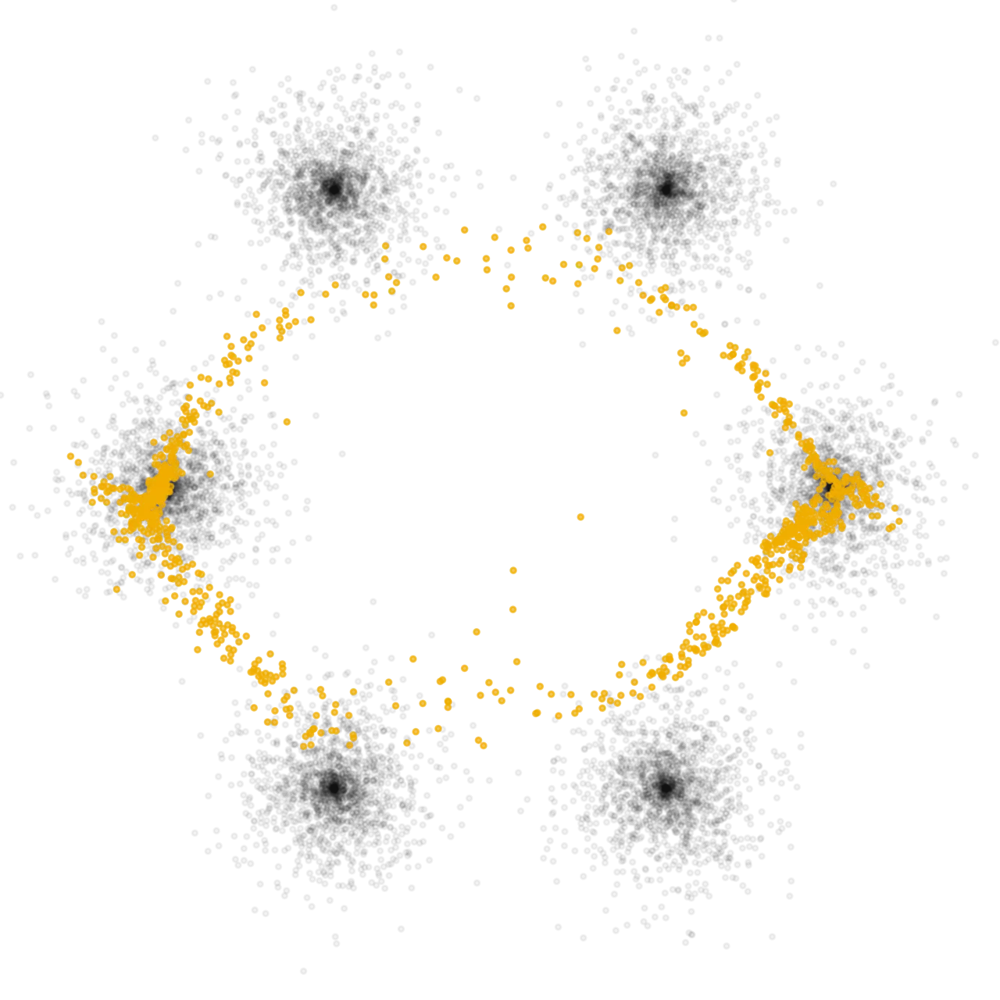

(e) cGAN vs. marginal prior

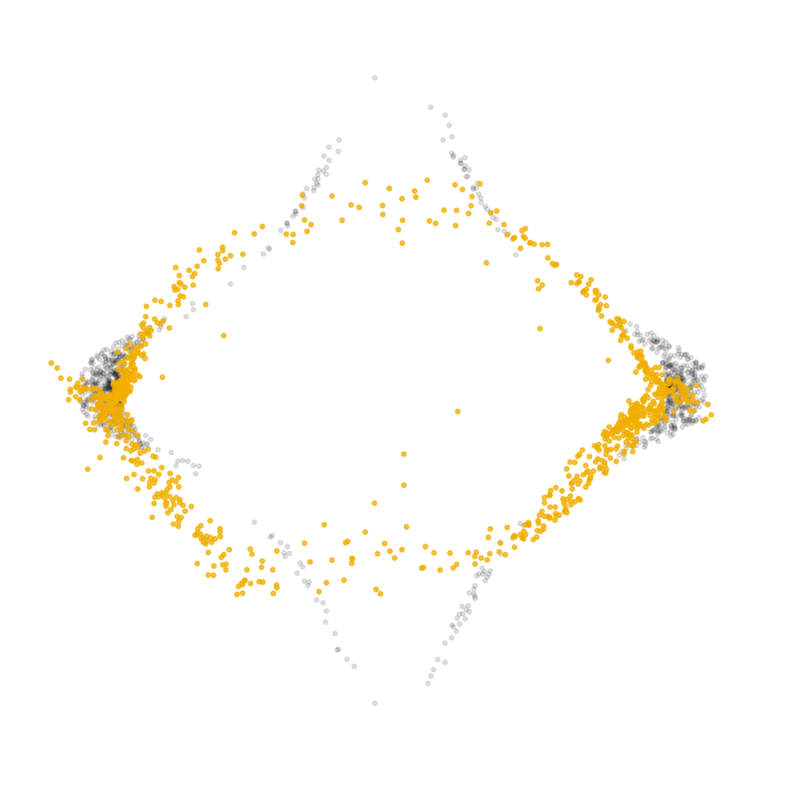

(f) cGAN vs. conditional prior

.

Figure 10: Visual demonstration of a conditional Variational Autoencoder
and conditional GAN on a continuous conditioning problem. Generated
distributions are overlaid over both the original dataset (marginal
prior), as well as the nearest 10% of the data to the condition
(conditional prior). The cVAE better matches the marginal prior, while
the cGAN better matches the conditional prior.

To demonstrate the conditioning of generative models, we construct a
fairly challenging continuous conditioning problem on the
previously-used dataset. Each of the datapoints is labeled according to
a highly nonlinear conditioning function. For simplicity, we only
examine a single condition value of exactly 0.3, though we would
typically care about and average performance across a variety of
condition values. We train a conditional VAE and a conditional GAN
(Figure 10, Table 6). Details about the model architecture, training,
and metric settings are included in the appendix. We take the
conditional prior to be the 10% of the dataset that most closely matches
the condition, as shown in 10(b). Overall, the cGAN focuses heavily on
the leftmost and rightmost modes, struggles to accurately capture other
areas of the distribution, and ignores sparse areas. In contrast, the
cVAE under-represents the two main modes, but much more faithfully
captures the remainder of the distribution. Overall, the cVAE
significantly outperforms the GAN in conditioning reconstruction and
adherence, indicating that it generated samples that, on average, much
more closely match the condition. In both conditional and marginal F10
and F0.1, the cVAE and cGAN repeat trends from their unconditional
counterparts in Section 4.5. Due to its focus on the main modes, the GAN
significantly outperforms in maximum mean discrepancy when compared to
the subset of the dataset that most closely matches the condition.
However, when compared to the marginal prior, the cVAE is the clear
leader in MMD, generating more samples that lie closer to the four
underrepresented modes. As illustrated, binary metrics can tell very
different stories when compared to conditional or marginal priors.

|                             |       |       |
| --------------------------- | ----- | ----- |
| Metrics                     | cVAE  | cGAN  |
| Conditioning Reconstruction | 0.007 | 0.026 |
| Conditioning Adherence      | 0.008 | 0.026 |
| Conditional F10             | 0.909 | 0.826 |
| Conditional F0.1            | 0.879 | 0.960 |
| Conditional MMD             | 0.035 | 0.021 |
| Marginal F10                | 0.949 | 0.933 |
| Marginal F0.1               | 0.447 | 0.554 |
| Marginal MMD                | 0.068 | 0.097 |

Table 6: Performance and target achievement scores for distributions in
Figure 10. The cVAE better matches the marginal prior, while the cGAN
better matches the conditional prior on this dataset. Point metrics are
averaged over the generated set. Bold is better.

## 9 Application Study: Exploratory Bicycle Frame Design with Constraints and Performance Targets

Throughout the paper, we have applied metrics to simple two-dimensional
problems to visually demonstrate how the presented metrics function.
However, real design problems are typically higher-dimensional, often
have more constraints and objectives, and are generally highly
non-convex. To showcase that the discussed metrics are effective in real
design problems, we include two case studies, the first of which is
presented in this section. In this problem, we want to design novel,
diverse, and high-performing bicycle frames that meet a set of ten
structural performance targets and adhere to an unknown set of implicit
design constraints. Specifically, we seek a DGM that consistently
generates designs meeting performance targets and constraints, but
generates a wide enough variety to offer a broad selection of design
candidates.

### 9.1 Dataset

The dataset we use \[80\] features roughly 4000 constraint-satisfying
designs and roughly 300 constraint-violating designs. Each frame design
is inspired by a real bicycle design \[78\] and is parameterized over 37
variables. Each constraint-satisfying design is ‘labeled’ with a vector
of 10 structural performance values, such as weight, safety factors, and
deflections under various loading conditions. This dataset was
previously used as a benchmark for target-seeking deep generative models
in  \[77\] and we adapt the models tested for our demonstration. We also
adopt the objective weights and DTAI parameters from \[77\].

### 9.2 Models

We train and test three GAN variants. The first is a ‘vanilla’ GAN,
which is blind to design performance, only implicitly observes
constraints, and does not promote exploration beyond the convex region
of the dataset. The second is a Multi-Objective Performance-augmented
Diverse GAN (MO-PaDGAN) which uses a performance-weighted DPP kernel to
simultaneously encourage higher performance and greater diversity among
generated designs. MO-PaDGAN generally encourages diverse,
higher-performing designs, but does not consider specific performance
targets or explicit constraint handling. The third is a DTAI-GAN which
modifies the MO-PaDGAN to consider performance targets and classifier
guidance to avoid constraint-violating designs. In this sense, DTAI-GAN
is the only model that ‘explicitly’ considers constraints, while the
other models ‘implicitly’ consider constraints by training only on
constraint-satisfying designs.

### 9.3 Selecting Metrics

We would like to evaluate diversity, performance, target achievement,
and constraint satisfaction, alongside distribution matching. We discuss
how we select metrics for this problem and justify these choices.

##### Statistical Similarity

While the goal is not just to mimic existing designs, measuring
similarity is important to make sure that we are still generating
bicycle frames. We would also ideally like our generated designs to span
as much of the design space as possible, thereby representing as many
key types of designs as possible. As such, we care about both ‘realism’
and coverage, as well as general similarity. For this, we select nearest
datapoint (NDP), nearest generated sample (NGS), and F1 to capture
realism, coverage, and similarity, respectively. Since we primarily care
about these metrics in the design space, we evaluate all three in the
design space, rather than the performance space.

##### Design Exploration

As one of the stated objectives of the problem, we want to generate a
diverse set of novel designs. This is common in scenarios where a final
design will be selected by experts from a diverse set. While we could
look to maximize nearest datapoint as a novelty metric, we still want
our designs to resemble designs in the dataset. We instead calculate
nearest datapoint in the performance space, instead of the design space.
Put plainly, while we want generated designs to resemble existing
designs, we would like them to have different performance values. Since
we also want generated designs to be diverse, we select inter-sample
distance and DPP diversity as two diversity metrics of choice, which we
evaluate in the design space.

##### Design Constraints

The FRAMED problem provides a method to evaluate constraint adherence
for generated samples, making the constraint satisfaction metric a
natural choice. Since closed-form constraint definitions are not
available, more informative choices such as signed distance to
constraint boundary are not feasible in this problem.

##### Design Quality and Target Achievement

We would like to evaluate the overall optimality of generated designs
but lack both a Pareto-optimal reference set to use generational
distance ¹³¹³ 13 While we could infer an approximate set from the
dataset, we have no basis for assuming that dataset designs are
near-optimal, in part due to a randomization step in the FRAMED dataset
generation pipeline \[80\]. and a differentiable solver to use
optimality gap. Instead, we select hypervolume. To capture target
achievement, we use a weighted target achievement rate as a simple
metric, but we can also use signed distance to target since we have
access to simple closed-form target criteria. Finally, we use the design
target achievement index (DTAI) to evaluate overall target achievement
performance.

### 9.4 Results

We demonstrate the performance of the three DGMs and their scores on
selected metrics in Figure 11.

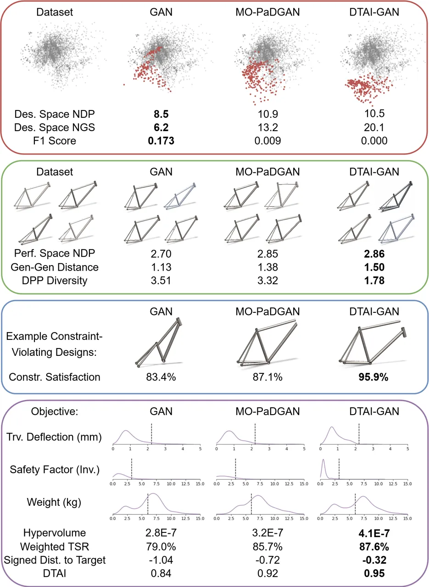

Figure 11: Evaluation of three models on the FRAMED dataset. The first
box, focused on similarity shows a 2-D Principal Component Analysis
embedding of generated designs overlaid over the dataset. The second
box, focused on diversity shows select generated bike frames. The third
box, focused on constraint satisfaction shows select invalid bike
frames. The last box, focused on functional performance shows kernel
density plots of structural performance scores of generated bikes
(design target shown as the dotted line; smaller is better).

##### Statistical Similarity

To assist with visualization, generated designs are projected onto a 2D
space using Principal Component Analysis. Across the board, the vanilla
GAN achieved superior distribution-matching performance to the GAN
variants focused on design performance. In contrast, MO-PaDGAN and
especially DTAI-GAN identified higher-performing or target-satisfying
regions of the design space and consistently generated many designs away
from the original design distribution, scoring lower on all distribution
matching scores. Compared to MO-PaDGAN, DTAI-GAN’s distributions were
further from the dataset and resulted in lower F1 and nearest generated
sample, but had a slight edge in nearest datapoint since there were a
handful of dataset samples near DTAI-GAN’s generated distribution.
Though the distribution-matching scores indicate that the
performance-aware models deviated significantly from the dataset, we
don’t necessarily find this concerning since we primarily care about
finding novel high-performing designs.

##### Design Exploration

The DTAI-GAN scored highest in performance space novelty, generating
many designs whose performance differs greatly from those in the
dataset. These models also achieved much higher diversity, exploring
more of the space and generating more varied samples.

##### Design Constraints

Since we don’t have access to closed-form constraint tests, we are not
able to evaluate distance to constraint boundary or other more
insightful constraint-related metrics. Instead, we simply know that, as
expected, the constraint-aware DTAI-GAN is a significantly stronger
performer at constraint satisfaction than the two models that only
implicitly considered constraints.

##### Design Quality and Target Achievement

Across all performance and target achievement metrics, DTAI-GAN scores
the highest, and the vanilla GAN scores the lowest. Kernel density plots
for three of the ten performance objectives are shown in the last panel
of 11, and in each, DTAI-GAN’s distribution is most favorable.
Interestingly, the DTAI-GAN’s average target success rate was barely
higher than MO-PaDGAN’s. However, its average signed distance to the
target was much higher, indicating that DTAI-GAN’s designs that exceeded
the target did so more drastically and designs that missed the target
did so by a smaller margin.

### 9.5 Analysis

The metrics demonstrate that the DTAI-GAN achieves its stated goal of
generating a diverse and novel set of designs that achieve performance
targets and satisfy constraints. The enhanced functional performance and
constraint satisfaction of generated designs detracted from the
DTAI-GAN’s ability to match the training dataset. However, this behavior
was largely expected and encouraged to discover higher-performing
regions of the design space than were previously represented in the
dataset. We now move on to our second case study, exploring optimal
topology generation.

## 10 Application Study: Optimal Topology Generation using Diffusion Models

In this section, we demonstrate the appropriate selection of metrics for
structural topology generation problems. Recent work \[68, 7, 62, 39\]
in the field has focused on training DGMs to circumvent the reliable but
slower Topology Optimization (TO) solvers, such as Solid Isotropic
Material with Penalization (SIMP) \[9, 84\]. These DGMs train on a
dataset of topologies generated by SIMP, typically taking the volume
fraction and loading information as conditioning. Then, for various
loading cases and volume fractions, they generate topologies that they
predict SIMP would generate. Typically, the single functional
performance objective is to minimize compliance of the generated
topologies.

### 10.1 Metric Selection

We first discuss existing metrics commonly used for evaluating DGMs in
optimal topology generation, then propose several additional metrics
that may be valuable.

##### Existing Metrics

Mazé & Ahmed \[62\] propose a set of four evaluation metrics for DGMs in
optimal topology generation which have been adopted in later
works \[39\]: Compliance error, volume fraction error, load violation,
and floating material. We break down what these metrics mean, and which
metrics from this paper they correspond to:

1.  1.  Compliance Error: Compliance error describes the percent difference
        between a generated topology’s compliance and the compliance of a
        SIMP-generated topology under the same loading condition. This
        metric is a variant of the signed distance to target metric
        (Sec. 7.2). Compliance is treated as a functional performance
        objective in TO. For each conditional input, a target compliance
        value is selected to be the compliance of the topology generated by
        SIMP. The compliance error is then simply given as the normalized
        signed distance to this target.
2.  2.  Volume Fraction Error: Volume fraction error quantifies the percent
        error between a generated topology’s volume fraction and the target
        volume fraction given to the generator. This metric is conditioning
        adherence (Sec. 8.1) since volume fraction is provided as a
        conditional input to the model and calculated for generated
        topologies.
3.  3.  Load Violation and Floating Material: Load violation and floating
        material quantify whether the generated topology has material at the
        point of load application, and disconnected material, respectively.
        These are constraint satisfaction scores (Sec. 6.1).

All in all, this is a strong set of evaluation metrics capturing
functional performance, constraint satisfaction, and conditioning. We
note that each of these metrics is a point metric and can be summarized
across a generated sample set as practitioners see fit. Papers commonly
report mean, median, or proportion above some threshold.

### 10.2 Other Metrics

Though the previously discussed metrics quantify many important facets
of DGM performance in optimal topology generation, we feel that several
other metrics could also be informative. Specifically, we propose three
additional metrics focused on diversity, novelty, and more nuanced
constraint satisfaction scoring.

1.  1.  Proportion of Floating Material: While load violation is a binary
        constraint, floating material can be quantified using a scalar
        measuring the proportion of pixels that are disconnected from the
        topology. This continuous score may be more informative than a
        binary metric. Since the constraint boundary is at zero, this
        proportion is simply the distance to the constraint boundary metric.
2.  2.  Distance to SIMP: Quantifying the (design space) novelty of
        generated topologies relative to their SIMP-generated counterparts
        can yield insight as to whether the model is memorizing
        SIMP-generated solutions or learning general structural optimization
        skills that may yield different results from SIMP. Models that are
        able to generate novel topologies may be able to seed SIMP to find
        superior solutions¹⁴¹⁴ 14 A known limitation of SIMP is its
        susceptibility to local minima caused by nonconvexity. even if their
        average compliance error is relatively high (or in rare cases find
        stronger solutions outright). In contrast, a model that mimics SIMP
        will seldom be able to find superior topologies even if it has a low
        compliance error. In many TO datasets, the only datapoint available
        for each discrete condition is the SIMP-generated solution, meaning
        that distance to SIMP is simply the conditional nearest datapoint
        metric. To calculate this score, we need a distance metric that
        works on topologies. As discussed earlier, embedding models trained
        on natural images may not offer meaningful distances, so we instead
        use pixel-wise distance, though Structural Similarity Index
        Metric \[95\] could be a valid choice.
3.  3.  Topology Diversity: Just as we may like to understand how novel our
        DGM-generated topologies are from SIMP’s topologies, we may seek to
        quantify how diverse these topologies are with respect to one
        another. This can tell us whether our model is capable of finding
        several families of strong solutions, increasing the likelihood that
        a strong design candidate is present in a large sample. We can use
        pixel distance to calculate a diversity matrix over a batch of
        samples generated under a single condition. We can then calculate
        DPP diversity as a score for the diversity of the generator.

### 10.3 Models

We benchmark two versions of the state-of-the-art DGM for topology
optimization, TopoDiff \[62\]. TopoDiff is a Denoising Diffusion
Probabilistic Model (DDPM) that trains using a similarity objective to
mimic topologies generated by SIMP. Simultaneously, it uses classifier
guidance during sampling to ‘push’ otherwise invalid topologies away
across constraint boundaries and into feasible regions. TopoDiff is
conditioned on 2D stress field images that indicate the loading
condition and assist in its training. Classically, these stress fields
are calculated using Finite Element Analysis (FEA) to simulate stresses
when the loads are applied to a solid material block. However, running
FEA to generate stress fields on every input problem is time-consuming,
so we train an alternative version of TopoDiff conditioned on
kernel-based stress field estimates, as proposed in \[39\].

### 10.4 Results

The two variants of TopoDiff are benchmarked on the four original
metrics from the paper, as well as the additional three that we propose.
Models are tested on the first 300 conditions in TopoDiff’s level 1 test
data. We diffuse all samples over 100 steps. Unlike \[39\] and \[62\],
we generate 10 samples per condition per model instead of one to score
diversity. This adds additional complexity to the averaging process.
Both point and set metrics must both be averaged over conditions but
point metrics must additionally be averaged over samples generated for a
single condition. The scores are tabulated in Table 7. The reported
averaging technique for point metrics (‘mean’ or ‘median’) is used to
average over samples for a single condition, while mean averaging is
used for all metrics (both point and set) over all conditions. Reported
results are expected to differ slightly from \[39\] and \[62\] since
different instantiations of models were tested and only a subset of the
test set was evaluated. Inference time, as reported in \[39\], is also
included ¹⁵¹⁵ 15 We do not recalculate inference time and instead use
published values from \[39\].. For qualitative examination, Figure 12
demonstrates several generated topologies using both approaches,
emphasizing the difference between the generated topology and the
SIMP-generated solution.

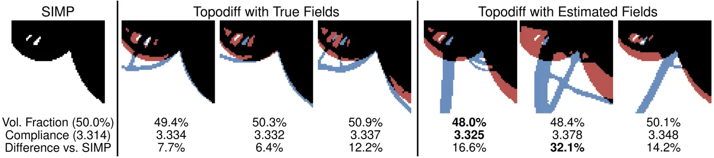

Figure 12: Sample topologies generated by two versions of TopoDiff
compared against SIMP-generated topology. Three samples are generated
using each model. Additional material is shown in blue while removed
material is shown in red (relative to SIMP). SIMP’s compliance and
volume fraction are shown in parentheses. TopoDiff tends to generate
more novel and diverse results when conditioned on kernel estimates of
the stress fields. In this test problem, it generates the lightest and
least compliant topology, all while being fairly novel relative to SIMP.

[TABLE]

Table 7: Scores of two variants of TopoDiff. While the variant
conditioned on true stress fields demonstrates superior target
achievement, constraint satisfaction, and conditioning adherence, the
variant conditioned on estimated fields exhibits higher novelty and
diversity of generated solutions, in addition to being significantly
faster during inference.

### 10.5 Discussion

Since the FEA-generated strain fields are more accurate and informative
than the kernel-estimated strain fields, we anticipate (correctly) that
the FEA-generated fields yield superior target achievement (lower
compliance error), higher constraint achievement (load validity,
floating material), and lower volume fraction error (stronger
conditioning adherence). Additionally, as the new floating material
quantity metric indicates, generated designs are also closer to being
constraint-satisfying when TopoDiff is conditioned on FEA fields.

In addition to vastly improved inference time emphasized in \[39\], a
notable strength that was not emphasized is the higher novelty versus
SIMP-generated results and the higher diversity among generated
topologies using the kernel-conditioned TopoDiff variant. Specifically,
the solutions generated differ from the SIMP solutions by almost 50%
more pixels than samples from the FEA field-conditioned model. Coupled
with the significantly higher diversity, they have a much higher chance
of re-seeding SIMP to find a stronger solution. This largely explains
the significant performance improvements found by \[39\], using
generated samples to seed further re-optimization in SIMP. The
kernel-estimated fields may generate not only faster samples but better
samples for this task compared to the FEA fields.

Through the selection of new metrics for DGMs in optimal topology
generation, we have enabled insightful comparisons between models
regarding the novelty and diversity of the samples they generate. These
comparisons are highly relevant for many practical tasks, such as
re-seeding TO solvers like SIMP to find better local optima. With this,
we conclude our second case study and proceed to some final discussion
on implications for engineering design.

## 11 Implications for Engineering Design

Since the introduction of deep generative models in engineering design
research, the overwhelming majority of proposed models have been trained
exclusively to optimize for statistical similarity \[79\]. Since most of
these models were adopted from natural image synthesis problems, it’s no
surprise that design researchers have similarly adopted statistical
similarity, the commonplace class of metrics in the image synthesis
domain. DGMs have shown immense promise in numerous design fields, such
as topology optimization, airfoil design, photonic/phononic materials,
molecular design, metamaterials, and many more \[79\]. However, as
design researchers continue to adapt and enhance these models for design
tasks, a similar need for modifications and new additions to evaluation
metrics grows more pressing by the day.

### 11.1 The Pitfall of Statistical Similarity

Early in this paper, we attempted to illustrate why relying solely upon
statistical similarity as a design evaluation metric can be misguided.
In short, statistical similarity is simply insufficient for evaluating
most designs, since it ignores design constraints, novelty, diversity,
and performance, which are often primary concerns in a design setting.
This limitation has been raised as a primary critique of DGMs in
engineering. For example, Woldseth et al. \[96\] demonstrate how DGMs
applied to topology optimization fail in very simple cases when
neglecting to account for performance or constraints due to the massive
performance difference between some statistically similar designs.
Furthermore, over-optimizing for statistical similarity can even be
counterproductive and restrict the ability of a model to discover truly
useful designs that exhibit superior properties to designs in the
dataset.

Since statistical similarity is still an important facet of DGM
performance, we do not advocate for universal abstinence from similarity
metrics. Instead, we encourage researchers to explore the nuance of
similarity and think critically about their choice of metrics.
Simultaneously, we hope that design researchers will look beyond
statistical similarity to consider the wealth of other metrics at their
disposal.

### 11.2 Selecting Appropriate Metrics

What should practitioners consider beyond similarity? This typically
requires a careful examination of the design problem at hand and depends
on how practitioners seek to expand upon existing designs in the
dataset. Some common goals are a greater level of diversity in design
candidates, a set of designs that meet a challenging set of constraints,
or a collection of designs that attain superior performance attributes
to existing designs. We will briefly discuss several of the popular
application areas and which types of metrics may be relevant for these
problems. However, the exact choice of metrics often depends on the
representation scheme, the use case, the cost of evaluation of metrics,
and the DGMs used.

##### Molecular Design & Drug Discovery

Molecular design problems typically require that designs adhere to a
rigorous set of design constraints based on fundamental chemistry
principles. Constraint satisfaction is, therefore, central to molecular
design. Nonetheless, diversity and functional performance are typically
important as well, as many practitioners seek to explore a wide range of
designs that achieve desirable functional properties \[11\]. As the goal
is often “discovery” of something useful and new, it is imperative to
consider metrics related to novelty and performance. Not surprisingly,
the “rediscovery” metric was also reported in molecule design literature
to assess models.

##### Topology Optimization, Structural Design, and Metamaterials

As we highlighted in the case study in Section 10, TO and other related
structural design problems tend to feature functional performance goals,
constraints, and conditioning, which should each be quantified when
evaluating DGMs. For image representation of topologies, structures, or
metamaterials, pixel similarity is often used as the loss function.
Researchers have shown that adding goals of performance (e.g.,
compliance) and constraints (e.g., manufacturability) significantly
improves the usefulness of the generated designs. Diversity metrics
could also be useful to discover new structures, particularly in
problems where DGM-generated topologies are used to warm-start classic
topology optimization methods.

##### Material and Microstructure Design

Generative models are often used to generate datasets of synthetic
microstructure images to assist in microstructure characterization and
reconstruction tasks \[16\]. This can, in turn, help establish
process-structure-property links, which enable a variety of benefits,
including inverse design of processes to attain desired material
properties. Since realism is a primary goal in synthetic dataset
generation, similarity metrics are typically favored. However, popular
metrics such as FID and IS may incur heavy bias due to the domain gap
between natural image datasets and microstructure scans.

##### Product Design and Inverse Product Design

Though product design is a fairly abstract categorization, inverse
design involves ‘reverse engineering’ a design given a set of desired
properties and characteristics. Since many inverse product design
problems feature functional performance goals, both target achievement
and general functional performance metrics are usually essential.
Additionally, inverse design problems lend themselves to conditional
models, making conditioning metrics particularly important. Creativity
tends to be an important consideration in product design. It is often
defined as a combination of novelty and quality (functional performance)
of design. As a result, novelty metrics are used in many of the
real-world product design problems tackled by DGMs in the current
literature \[99, 69, 77\].

### 11.3 Responsible use of Evaluation Metrics

Having access to a wealth of evaluation metrics provides researchers
with a great deal of flexibility in showcasing the performance of their
models. However, in such a young field with few established common
practices, this flexibility may also cause confusion. For the good of
the community, we encourage researchers to leverage as many relevant
metrics as possible to showcase both the strengths and weaknesses of
their models and provide a more comprehensive picture. Finally, we
encourage researchers to be diligent in publishing any hyperparameters
or evaluation metric settings and share their training datasets. To
properly compare models and establish clear progression in the field,
evaluation metric settings and training datasets must be fully
transparent to be replicated.

Finally, though this paper has focused on presenting metrics for the
effective evaluation of DGMs, some of the proposed metrics can also be
incorporated into the training of DGMs with little to no modification,
as with the design target achievement index in \[77\] and DPP diversity
metric in \[24\]. When directly used as training objectives, validating
performance using other metrics is important to ensure the model hasn’t
exploited its objectives.

## 12 Conclusion

As deep generative models continue to expand their reach in engineering
design communities, the increasing need for effective and standardized
metrics grows more pronounced. This paper explored evaluation metrics
for deep generative models in engineering design and presented a curated
set of design-focused metrics to address this growing demand. We
presented a wide variety of evaluation metrics focusing on realism,
coverage, diversity, novelty, constraint satisfaction, performance,
target achievement, and conditioning. We discussed which metrics to
select when evaluating different facets of model performance and
demonstrated the application of these metrics on easy-to-visualize
problems. Finally, we presented a practical application of the methods
discussed on a challenging bicycle frame design problem. We detailed how
and why we selected appropriate metrics and described the performance of
three deep generative models applied to the problem.

In writing this paper, our overarching goal has been to call attention
to the fallacies of statistical similarity metrics in engineering design
problems, inspire practitioners to consider the many alternatives that
we discuss, and provide them with the requisite knowledge to effectively
apply these metrics to their design problems. We publicly release our
datasets, models, and implementation code for the metrics used in our
case studies at
[decode.mit.edu/projects/metrics/](https://decode.mit.edu/projects/metrics/)
to facilitate easy adoption in different domains. We sincerely hope that
researchers will use these resources to better understand their models
and greatly improve their capabilities in engineering design tasks.

## 13 Acknowledgements

The authors would like to acknowledge the MIT-IBM Watson AI Lab in
supporting this research. They would also like to acknowledge Giorgio
Giannone for his assistance with TopoDiff training.

## References

- \[1\] F. Ahmed, S. K. Ramachandran, M. Fuge, S. Hunter, and S.
  Miller (2019) Measuring and optimizing design variety using herfindahl
  index. In International Design Engineering Technical Conferences and
  Computers and Information in Engineering Conference, Vol. 59278,
  pp. V007T06A007. Cited by: §5.2.
- \[2\] J. Alsing, T. Charnock, S. Feeney, and B. Wandelt (2019) Fast
  likelihood-free cosmology with neural density estimators and active
  learning. Monthly Notices of the Royal Astronomical Society 488 (3),
  pp. 4440–4458. Cited by: §4.
- \[3\] M. Arjovsky and L. Bottou (2017) Towards principled methods for
  training generative adversarial networks. arXiv preprint
  arXiv:1701.04862. Cited by: §4.
- \[4\] M. Arjovsky, S. Chintala, and L. Bottou (2017) Wasserstein
  generative adversarial networks. In Proceedings of the 34th
  International Conference on Machine Learning - Volume 70, ICML’17,
  pp. 214–223. Cited by: §4.
- \[5\] S. Banerjee and A. Lavie (2005) METEOR: an automatic metric for
  mt evaluation with improved correlation with human judgments. In
  Proceedings of the acl workshop on intrinsic and extrinsic evaluation
  measures for machine translation and/or summarization, pp. 65–72.
  Cited by: §4.
- \[6\] S. Barratt and R. Sharma (2018) A note on the inception score.
  arXiv preprint arXiv:1801.01973. Cited by: §14.2, §4.
- \[7\] M. M. Behzadi and H. T. Ilieş (2022) Gantl: toward practical and
  real-time topology optimization with conditional generative
  adversarial networks and transfer learning. Journal of Mechanical
  Design 144 (2). Cited by: §10.
- \[8\] M. I. Belghazi, A. Baratin, S. Rajeswar, S. Ozair, Y. Bengio, A.
  Courville, and R. D. Hjelm (2018) Mine: mutual information neural
  estimation. arXiv preprint arXiv:1801.04062. Cited by: §4.
- \[9\] M. P. Bendsøe and N. Kikuchi (1988) Generating optimal
  topologies in structural design using a homogenization method.
  Computer methods in applied mechanics and engineering 71 (2),
  pp. 197–224. Cited by: §10.
- \[10\] Y. Benny, T. Galanti, S. Benaim, and L. Wolf (2021) Evaluation
  metrics for conditional image generation. International Journal of
  Computer Vision 129 (5), pp. 1712–1731. Cited by: footnote 11.
- \[11\] C. Bilodeau, W. Jin, T. Jaakkola, R. Barzilay, and K. F.
  Jensen (2022) Generative models for molecular discovery: recent
  advances and challenges. Wiley Interdisciplinary Reviews:
  Computational Molecular Science, pp. e1608. Cited by: §11.2, §2, §4.3.
- \[12\] M. Bińkowski, D. J. Sutherland, M. Arbel, and A. Gretton (2018)
  Demystifying mmd gans. arXiv preprint arXiv:1801.01401. Cited by: §4,
  footnote 3.
- \[13\] M. A. Boden (2009) Computer models of creativity. AI Magazine
  30 (3), pp. 23–23. Cited by: §5.1.
- \[14\] A. Borji (2019) Pros and cons of gan evaluation measures.
  Computer Vision and Image Understanding 179, pp. 41–65. Cited by: §2,
  §2, §4.
- \[15\] A. Borji (2022) Pros and cons of gan evaluation measures: new
  developments. Computer Vision and Image Understanding 215, pp. 103329.
  Cited by: §2, §2.
- \[16\] R. Bostanabad, Y. Zhang, X. Li, T. Kearney, L. C.
  Brinson, D. W. Apley, W. K. Liu, and W. Chen (2018) Computational
  microstructure characterization and reconstruction: review of the
  state-of-the-art techniques. Progress in Materials Science 95,
  pp. 1–41. Cited by: §11.2.
- \[17\] A. Brock, J. Donahue, and K. Simonyan (2018) Large scale gan
  training for high fidelity natural image synthesis. arXiv preprint
  arXiv:1809.11096. Cited by: §2.
- \[18\] N. C. Brown and C. T. Mueller (2019) Quantifying diversity in
  parametric design: a comparison of possible metrics. AI EDAM 33 (1),
  pp. 40–53. Cited by: §5.1, §5.2, §5.2, §5.2.
- \[19\] T. Brown, B. Mann, N. Ryder, M. Subbiah, J. D. Kaplan, P.
  Dhariwal, A. Neelakantan, P. Shyam, G. Sastry, A. Askell, et
  al. (2020) Language models are few-shot learners. Advances in neural
  information processing systems 33, pp. 1877–1901. Cited by: §1, §2.
- \[20\] H. Cai, V. W. Zheng, and K. C. Chang (2018) A comprehensive
  survey of graph embedding: problems, techniques, and applications.
  IEEE Transactions on Knowledge and Data Engineering 30 (9),
  pp. 1616–1637. Cited by: §14.2.
- \[21\] D. Cer, Y. Yang, S. Kong, N. Hua, N. Limtiaco, R. S. John, N.
  Constant, M. Guajardo-Cespedes, S. Yuan, C. Tar, et al. (2018)
  Universal sentence encoder. arXiv preprint arXiv:1803.11175. Cited by:
  §14.2.
- \[22\] Q. Chen, J. Wang, P. Pope, M. Fuge, et al. (2022) Inverse
  design of two-dimensional airfoils using conditional generative models
  and surrogate log-likelihoods. Journal of Mechanical Design 144 (2).
  Cited by: §2, §7.1.
- \[23\] R. T. Chen, X. Li, R. B. Grosse, and D. K. Duvenaud (2018)
  Isolating sources of disentanglement in variational autoencoders.
  Advances in neural information processing systems 31. Cited by:
  §14.1.1.
- \[24\] W. Chen and F. Ahmed (2021) MO-padgan: reparameterizing
  engineering designs for augmented multi-objective optimization.
  Applied Soft Computing 113, pp. 107909. Cited by: §11.3, item 2,
  item 2, §5, §7.1, §7.3.
- \[25\] W. Chen and F. Ahmed (2021) Padgan: learning to generate
  high-quality novel designs. Journal of Mechanical Design 143 (3),
  pp. 031703. Cited by: §2, §5.1, §5.
- \[26\] W. Chen and M. Fuge (2019) Synthesizing designs with interpart
  dependencies using hierarchical generative adversarial networks.
  Journal of Mechanical Design 141 (11), pp. 111403. Cited by: §14.1.1.
- \[27\] X. Chen, Y. Duan, R. Houthooft, J. Schulman, I. Sutskever,
  and P. Abbeel (2016) Infogan: interpretable representation learning by
  information maximizing generative adversarial nets. In Proceedings of
  the 30th International Conference on Neural Information Processing
  Systems, pp. 2180–2188. Cited by: §8.
- \[28\] F. Croitoru, V. Hondru, R. T. Ionescu, and M. Shah (2022)
  Diffusion models in vision: a survey. arXiv preprint arXiv:2209.04747.
  Cited by: §1.
- \[29\] G. Dai, J. Xie, and Y. Fang (2018) Siamese cnn-bilstm
  architecture for 3d shape representation learning.. In IJCAI,
  pp. 670–676. Cited by: §14.2.
- \[30\] J. Deng, W. Dong, R. Socher, L. Li, K. Li, and L.
  Fei-Fei (2009) Imagenet: a large-scale hierarchical image database. In
  2009 IEEE conference on computer vision and pattern recognition,
  pp. 248–255. Cited by: §4.
- \[31\] I. Deshpande, Y. Hu, R. Sun, A. Pyrros, N. Siddiqui, S.
  Koyejo, Z. Zhao, D. Forsyth, and A. G. Schwing (2019) Max-sliced
  wasserstein distance and its use for gans. In Proceedings of the
  IEEE/CVF Conference on Computer Vision and Pattern Recognition,
  pp. 10648–10656. Cited by: §4.
- \[32\] J. Devlin, M. Chang, K. Lee, and K. Toutanova (2018) Bert:
  pre-training of deep bidirectional transformers for language
  understanding. arXiv preprint arXiv:1810.04805. Cited by: §1, §14.2,
  §2.
- \[33\] P. Dhariwal and A. Nichol (2021) Diffusion models beat gans on
  image synthesis. External Links: 2105.05233 Cited by: §4.
- \[34\] X. Ding, Y. Wang, Z. Xu, W. J. Welch, and Z. J. Wang (2021)
  CcGAN: continuous conditional generative adversarial networks for
  image generation. In 9th International Conference on Learning
  Representations, ICLR 2021, Virtual Event, Austria, May 3-7, 2021,
  External Links: [Link](https://openreview.net/forum?id=PrzjugOsDeE)
  Cited by: §8.3.
- \[35\] K. Do and T. Tran (2019) Theory and evaluation metrics for
  learning disentangled representations. arXiv preprint
  arXiv:1908.09961. Cited by: §14.1.1.
- \[36\] C. Dong, Y. Li, H. Gong, M. Chen, J. Li, Y. Shen, and M.
  Yang (2022) A survey of natural language generation. ACM Computing
  Surveys 55 (8), pp. 1–38. Cited by: §2, §2.
- \[37\] F. Faghri, D. J. Fleet, J. R. Kiros, and S. Fidler (2017)
  Vse++: improving visual-semantic embeddings with hard negatives. arXiv
  preprint arXiv:1707.05612. Cited by: §14.2.
- \[38\] A. Gatt and E. Krahmer (2018) Survey of the state of the art in
  natural language generation: core tasks, applications and evaluation.
  Journal of Artificial Intelligence Research 61, pp. 65–170. Cited by:
  §2, §2.
- \[39\] G. Giannone and F. Ahmed (2023) Diffusing the optimal topology:
  a generative optimization approach. arXiv preprint arXiv:2303.09760.
  Cited by: §10.1, §10.3, §10.4, §10.5, §10, footnote 15.
- \[40\] Z. Goldfeld and K. Greenewald (2021) Sliced mutual information:
  a scalable measure of statistical dependence. Advances in Neural
  Information Processing Systems 34, pp. 17567–17578. Cited by: §4.
- \[41\] I. J. Goodfellow, J. Pouget-Abadie, M. Mirza, B. Xu, D.
  Warde-Farley, S. Ozair, A. Courville, and Y. Bengio (2014) Generative
  adversarial nets. In Proceedings of the 27th International Conference
  on Neural Information Processing Systems - Volume 2, NIPS’14,
  Cambridge, MA, USA, pp. 2672–2680. Cited by: §1, §2, §4.
- \[42\] M. Gutmann and A. Hyvärinen (2010) Noise-contrastive
  estimation: a new estimation principle for unnormalized statistical
  models. In Proceedings of the thirteenth international conference on
  artificial intelligence and statistics, pp. 297–304. Cited by: §4.
- \[43\] M. Heusel, H. Ramsauer, T. Unterthiner, B. Nessler, and S.
  Hochreiter (2017) Gans trained by a two time-scale update rule
  converge to a local nash equilibrium. Advances in neural information
  processing systems 30. Cited by: §4, §4.
- \[44\] A. Heyrani Nobari, W. (. Chen, and F. Ahmed (2021)
  Range-Constrained Generative Adversarial Network: Design Synthesis
  Under Constraints Using Conditional Generative Adversarial Networks.
  Journal of Mechanical Design, pp. 1–16. External Links: ISSN
  1050-0472, [Document](https://dx.doi.org/10.1115/1.4052442),
  [Link](https://doi.org/10.1115/1.4052442),
  https://asmedigitalcollection.asme.org/mechanicaldesign/article-pdf/doi/10.1115/1.4052442/6756741/md-21-1243.pdf
  Cited by: §8.
- \[45\] A. Heyrani Nobari, W. Chen, and F. Ahmed (2021) PcDGAN: a
  continuous conditional diverse generative adversarial network for
  inverse design. Proceedings of the 27th ACM SIGKDD Conference on
  Knowledge Discovery & Data Mining. External Links: ISBN 9781450383325,
  [Link](http://dx.doi.org/10.1145/3447548.3467414),
  [Document](https://dx.doi.org/10.1145/3447548.3467414) Cited by: §8.3,
  §8.
- \[46\] I. Higgins, L. Matthey, A. Pal, C. Burgess, X. Glorot, M.
  Botvinick, S. Mohamed, and A. Lerchner (2017) Beta-vae: learning basic
  visual concepts with a constrained variational framework. In
  International conference on learning representations, Cited by:
  §14.1.1.
- \[47\] J. Ho, A. Jain, and P. Abbeel (2020) Denoising diffusion
  probabilistic models. External Links: 2006.11239 Cited by: §4.
- \[48\] T. Karras, S. Laine, and T. Aila (2019) A style-based generator
  architecture for generative adversarial networks. In 2019 IEEE/CVF
  Conference on Computer Vision and Pattern Recognition (CVPR), Vol. ,
  pp. 4396–4405. External Links:
  [Document](https://dx.doi.org/10.1109/CVPR.2019.00453) Cited by: §2.
- \[49\] T. Karras, S. Laine, M. Aittala, J. Hellsten, J. Lehtinen,
  and T. Aila (2020) Analyzing and improving the image quality of
  stylegan. In 2020 IEEE/CVF Conference on Computer Vision and Pattern
  Recognition (CVPR), Vol. , pp. 8107–8116. External Links:
  [Document](https://dx.doi.org/10.1109/CVPR42600.2020.00813) Cited by:
  §2.
- \[50\] V. Khrulkov, L. Mirvakhabova, E. Ustinova, I. Oseledets, and V.
  Lempitsky (2020) Hyperbolic image embeddings. In Proceedings of the
  IEEE/CVF Conference on Computer Vision and Pattern Recognition,
  pp. 6418–6428. Cited by: §14.2.
- \[51\] D. P. Kingma and J. Ba (2014) Adam: a method for stochastic
  optimization. arXiv preprint arXiv:1412.6980. Cited by: item 4,
  item 3.
- \[52\] D. P. Kingma and M. Welling (2013) Auto-encoding variational
  bayes. arXiv preprint arXiv:1312.6114. Cited by: §1, §2, §4.
- \[53\] D. P. Kingma and P. Dhariwal (2018) Glow: generative flow with
  invertible 1x1 convolutions. Advances in neural information processing
  systems 31. Cited by: §4.
- \[54\] J. Knowles (2006) ParEGO: a hybrid algorithm with on-line
  landscape approximation for expensive multiobjective optimization
  problems. IEEE Transactions on Evolutionary Computation 10 (1),
  pp. 50–66. Cited by: §7.3.
- \[55\] I. Kobyzev, S. J. Prince, and M. A. Brubaker (2020) Normalizing
  flows: an introduction and review of current methods. IEEE
  transactions on pattern analysis and machine intelligence 43 (11),
  pp. 3964–3979. Cited by: §4.
- \[56\] L. F. Kozachenko and N. N. Leonenko (1987) Sample estimate of
  the entropy of a random vector. Problemy Peredachi Informatsii 23 (2),
  pp. 9–16. Cited by: §5.2.
- \[57\] A. Kulesza B. Taskar et al. (2012) Determinantal point
  processes for machine learning. Foundations and Trends® in Machine
  Learning 5 (2–3), pp. 123–286. Cited by: §5.2.
- \[58\] A. Kumar, P. Sattigeri, and A. Balakrishnan (2017) Variational
  inference of disentangled latent concepts from unlabeled observations.
  arXiv preprint arXiv:1711.00848. Cited by: §14.1.1.
- \[59\] J. Lehman and K. O. Stanley (2011) Abandoning objectives:
  evolution through the search for novelty alone. Evolutionary
  computation 19 (2), pp. 189–223. Cited by: §5.1.
- \[60\] C. Lin (2004) Rouge: a package for automatic evaluation of
  summaries. In Text summarization branches out, pp. 74–81. Cited by:
  §4.
- \[61\] M. Lucic, K. Kurach, M. Michalski, S. Gelly, and O.
  Bousquet (2018) Are gans created equal? a large-scale study. Advances
  in neural information processing systems 31. Cited by: §4.1.
- \[62\] F. Mazé and F. Ahmed (2022) TopoDiff: a performance and
  constraint-guided diffusion model for topology optimization. arXiv
  preprint arXiv:2208.09591. Cited by: §1, §10.1, §10.3, §10.4, §10, §2,
  §8.
- \[63\] S. R. Miller, S. T. Hunter, E. Starkey, S. Ramachandran, F.
  Ahmed, and M. Fuge (2021) How should we measure creativity in
  engineering design? a comparison between social science and
  engineering approaches. Journal of Mechanical Design 143 (3). Cited
  by: §14.1.2.
- \[64\] M. Mirza and S. Osindero (2014) Conditional generative
  adversarial nets. arXiv preprint arXiv:1411.1784. Cited by: §8.
- \[65\] S. Morozov, A. Voynov, and A. Babenko (2020) On self-supervised
  image representations for gan evaluation. In International Conference
  on Learning Representations, Cited by: §14.2.
- \[66\] C. T. Mueller and J. A. Ochsendorf (2015) Combining structural
  performance and designer preferences in evolutionary design space
  exploration. Automation in Construction 52, pp. 70–82. Cited by: §2,
  §5.1.
- \[67\] T. Nguyen, Q. Pham, T. Le, T. Pham, N. Ho, and B. Hua (2021)
  Point-set distances for learning representations of 3d point clouds.
  In Proceedings of the IEEE/CVF International Conference on Computer
  Vision, pp. 10478–10487. Cited by: item 5.
- \[68\] Z. Nie, T. Lin, H. Jiang, and L. B. Kara (2021) Topologygan:
  topology optimization using generative adversarial networks based on
  physical fields over the initial domain. Journal of Mechanical Design
  143 (3), pp. 031715. Cited by: §10, §8.
- \[69\] S. Oh, Y. Jung, S. Kim, I. Lee, and N. Kang (2019) Deep
  generative design: integration of topology optimization and generative
  models. Journal of Mechanical Design 141 (11). Cited by: §11.2.
- \[70\] OpenAI (2023) GPT-4 technical report. External Links:
  2303.08774 Cited by: §2.
- \[71\] K. Papineni, S. Roukos, T. Ward, and W. Zhu (2002) Bleu: a
  method for automatic evaluation of machine translation. In Proceedings
  of the 40th annual meeting of the Association for Computational
  Linguistics, pp. 311–318. Cited by: §4.
- \[72\] S. Pavoine, S. Ollier, and D. Pontier (2005) Measuring
  diversity from dissimilarities with rao’s quadratic entropy: are any
  dissimilarities suitable?. Theoretical population biology 67 (4),
  pp. 231–239. Cited by: §5.2.
- \[73\] J. Podani (2009) Convex hulls, habitat filtering, and
  functional diversity: mathematical elegance versus ecological
  interpretability. Community Ecology 10 (2), pp. 244–250. Cited by:
  §5.2.
- \[74\] A. Radford, J. W. Kim, C. Hallacy, A. Ramesh, G. Goh, S.
  Agarwal, G. Sastry, A. Askell, P. Mishkin, J. Clark, G. Krueger,
  and I. Sutskever (2021) Learning transferable visual models from
  natural language supervision. External Links: 2103.00020 Cited by:
  item 8, §14.2.
- \[75\] C. Raffel, N. Shazeer, A. Roberts, K. Lee, S. Narang, M.
  Matena, Y. Zhou, W. Li, P. J. Liu, et al. (2020) Exploring the limits
  of transfer learning with a unified text-to-text transformer.. J.
  Mach. Learn. Res. 21 (140), pp. 1–67. Cited by: §1, §2.
- \[76\] S. Ravuri and O. Vinyals (2019) Classification accuracy score
  for conditional generative models. Advances in neural information
  processing systems 32. Cited by: §4.4.
- \[77\] L. Regenwetter and F. Ahmed (2022) Design target achievement
  index: a differentiable metric to enhance deep generative models in
  multi-objective inverse design. arXiv preprint arXiv:2205.03005. Cited
  by: §11.2, §11.3, §2, §7.2, §9.1.
- \[78\] L. Regenwetter, B. Curry, and F. Ahmed (2022) BIKED: a dataset
  for computational bicycle design with machine learning benchmarks.
  Journal of Mechanical Design 144 (3). Cited by: Figure 13, Figure 13,
  §9.1.
- \[79\] L. Regenwetter, A. H. Nobari, and F. Ahmed (2022) Deep
  generative models in engineering design: a review. Journal of
  Mechanical Design 144 (7), pp. 071704. Cited by: §1, §1, §11, §4, §4.
- \[80\] L. Regenwetter, C. Weaver, and F. Ahmed (2022) FRAMED: an
  automl approach for structural performance prediction of bicycle
  frames. Computer-Aided Design, pp. 103446. Cited by: Figure 1, Figure
  1, item 6, §9.1, footnote 13.
- \[81\] B. Rhodes, K. Xu, and M. U. Gutmann (2020) Telescoping
  density-ratio estimation. Advances in neural information processing
  systems 33, pp. 4905–4916. Cited by: §4.
- \[82\] N. Riquelme, C. Von Lücken, and B. Baran (2015) Performance
  metrics in multi-objective optimization. In 2015 Latin American
  Computing Conference (CLEI), Vol. , pp. 1–11. External Links:
  [Document](https://dx.doi.org/10.1109/CLEI.2015.7360024) Cited by: §2,
  §2, §5.2, §7.1, §7.1, §7.1.
- \[83\] M. Rosca, B. Lakshminarayanan, D. Warde-Farley, and S.
  Mohamed (2017) Variational approaches for auto-encoding generative
  adversarial networks. arXiv preprint arXiv:1706.04987. Cited by:
  §14.2, §4.
- \[84\] G. I. Rozvany, M. Zhou, and T. Birker (1992) Generalized shape
  optimization without homogenization. Structural optimization 4,
  pp. 250–252. Cited by: §10.
- \[85\] M. S. Sajjadi, O. Bachem, M. Lucic, O. Bousquet, and S.
  Gelly (2018) Assessing generative models via precision and recall.
  Advances in neural information processing systems 31. Cited by: §4.1,
  §4.2, §4.3.
- \[86\] T. Salimans, I. Goodfellow, W. Zaremba, V. Cheung, A. Radford,
  and X. Chen (2016) Improved techniques for training gans. In
  Proceedings of the 30th International Conference on Neural Information
  Processing Systems, NIPS’16, Red Hook, NY, USA, pp. 2234–2242.
  External Links: ISBN 9781510838819 Cited by: §4, footnote 3.
- \[87\] D. Shah, A. Suresh, A. Admasu, D. Upadhyay, and K. Deb (2022) A
  survey on evaluation metrics for synthetic material micro-structure
  images from generative models. arXiv preprint arXiv:2211.09727. Cited
  by: §2, §2, §4.3.
- \[88\] L. Siddharth, L. Blessing, and J. Luo (2022) Natural language
  processing in-and-for design research. Design Science 8, pp. e21.
  Cited by: §1.
- \[89\] L. Simon, R. Webster, and J. Rabin (2019) Revisiting precision
  recall definition for generative modeling. In International Conference
  on Machine Learning, pp. 5799–5808. Cited by: §4.1.
- \[90\] K. Sohn, X. Yan, and H. Lee (2015) Learning structured output
  representation using deep conditional generative models. In
  Proceedings of the 28th International Conference on Neural Information
  Processing Systems - Volume 2, NIPS’15, Cambridge, MA, USA,
  pp. 3483–3491. Cited by: §8.
- \[91\] M. Sugiyama, T. Suzuki, and T. Kanamori (2012) Density-ratio
  matching under the bregman divergence: a unified framework of
  density-ratio estimation. Annals of the Institute of Statistical
  Mathematics 64 (5), pp. 1009–1044. Cited by: §4.
- \[92\] M. Tantardini, F. Ieva, L. Tajoli, and C. Piccardi (2019)
  Comparing methods for comparing networks. Scientific reports 9 (1),
  pp. 1–19. Cited by: item 7.
- \[93\] D. A. Van Veldhuizen (1999) Multiobjective evolutionary
  algorithms: classifications, analyses, and new innovations. Air Force
  Institute of Technology. Cited by: §7.1.
- \[94\] L. Wang, Y. Chan, F. Ahmed, Z. Liu, P. Zhu, and W. Chen (2020)
  Deep generative modeling for mechanistic-based learning and design of
  metamaterial systems. Computer Methods in Applied Mechanics and
  Engineering 372, pp. 113377. Cited by: §14.1.1.
- \[95\] Z. Wang, A. C. Bovik, H. R. Sheikh, and E. P. Simoncelli (2004)
  Image quality assessment: from error visibility to structural
  similarity. IEEE transactions on image processing 13 (4), pp. 600–612.
  Cited by: item 2, item 4.
- \[96\] R. V. Woldseth, N. Aage, J. A. Bærentzen, and O. Sigmund (2022)
  On the use of artificial neural networks in topology optimisation.
  Structural and Multidisciplinary Optimization 65 (10), pp. 294. Cited
  by: §11.1.
- \[97\] L. Xu, M. Skoularidou, A. Cuesta-Infante, and K.
  Veeramachaneni (2019) Modeling tabular data using conditional gan.
  Advances in Neural Information Processing Systems 32. Cited by: §4.4.
- \[98\] L. Yang, Z. Zhang, Y. Song, S. Hong, R. Xu, Y. Zhao, Y.
  Shao, W. Zhang, B. Cui, and M. Yang (2022) Diffusion models: a
  comprehensive survey of methods and applications. arXiv preprint
  arXiv:2209.00796. Cited by: §1.
- \[99\] S. Yoo, S. Lee, S. Kim, K. H. Hwang, J. H. Park, and N.
  Kang (2021) Integrating deep learning into cad/cae system: generative
  design and evaluation of 3d conceptual wheel. Structural and
  multidisciplinary optimization 64 (4), pp. 2725–2747. Cited by: §11.2.
- \[100\] J. Zaidi, J. Boilard, G. Gagnon, and M. Carbonneau (2020)
  Measuring disentanglement: a review of metrics. arXiv preprint
  arXiv:2012.09276. Cited by: §14.1.1.
- \[101\] S. Zhou, M. Gordon, R. Krishna, A. Narcomey, L. F. Fei-Fei,
  and M. Bernstein (2019) Hype: a benchmark for human eye perceptual
  evaluation of generative models. Advances in neural information
  processing systems 32. Cited by: §14.1.2, §14.2.
- \[102\] Q. Zhu and J. Luo (2023) Generative transformers for design
  concept generation. Journal of Computing and Information Science in
  Engineering 23 (4), pp. 041003. Cited by: §1.

## 14 Appendix

### 14.1 Other Evaluation Methods and DGM Considerations

Thus far, we have discussed metrics to evaluate similarity, diversity,
constraints, performance, and conditioning. Below, we briefly summarize
two more types of metrics that may be important in certain design
problems. A detailed, but not necessarily comprehensive list of other
considerations for DGMs in design is included after this discussion.

#### 14.1.1 Latent Disentanglement

Many DGMs synthesize designs by taking randomized inputs from some
(usually multi-dimensional) latent variable space. Many design
researchers have attempted to link latent variables with the physical
properties of the generated designs \[94, 26\], which shows promise in
several design domains, such as functionally graded materials.
Disentanglement can also make the generation process more interpretable,
ideally serving as a tool for human designers to manually select or tune
generated designs. Disentanglement metrics generally fall into one of
three categories: Intervention-based metrics such as Z-diff \[46\],
predictor-based metrics such as attribute predictability score
(SAP) \[58\], and information-based metrics such as mutual information
gap (MIG) \[23\]. We refer readers to reviews like \[100\] and \[35\]
for more detailed discussions on disentanglement metrics.

#### 14.1.2 Human Evaluation

Though automated evaluation metrics are often the most practical, they
seldom provide as valuable of an analysis as people. Human evaluation
approaches can roughly be divided into crowdsourced evaluation
frameworks and expert evaluation frameworks, where the primary tradeoff
is cost versus evaluation quality.

##### Crowdsourced Evaluation

Crowdsourced evaluation frameworks are common in computer vision fields
since untrained humans typically suffice for determining the ‘realism’
of images in computer vision problems. Metrics like Human Eye Perceptual
Evaluation (HYPE) \[101\], for example, quantify how easily humans can
discern between real and fake samples. In contrast, designs may be
difficult to properly evaluate since they are not always represented in
a visual medium and may have infeasibilities or inefficiencies that
require engineering expertise to discern.

##### Expert Evaluation

Expert evaluation methods are often used in various applications of deep
generative models to assess the quality of the generated samples. Domain
experts evaluate the samples based on specific criteria such as realism,
coherence, and relevance. The scores are then averaged over a set of
generated samples to compare different models. This approach is
considered to be a gold standard for evaluating the quality of generated
samples, but is time-consuming and costly. We refer the reader to a
review \[63\] on these metrics in design literature for an in-depth
discussion.

#### 14.1.3 Miscellaneous DGM evaluation areas

There are many other areas of DGM performance that include but are not
limited to those listed below. Since these areas are not particularly
unique to engineering design, we deem them out of scope and do not
directly discuss them.

1.  1.  Cost: Computational time, memory, and energy costs of training,
        inference and deployment.
2.  2.  Robustness: The model’s resilience against noise, adversarial
        attacks, or perturbations in input data.
3.  3.  Transferability and data-efficiency: The capability of the model to
        generalize and perform well on unseen tasks with limited original
        data or fine-tuning.
4.  4.  Stability and consistency: The degree to which the model produces
        similar results when provided with similar inputs and its ability to
        avoid issues like mode collapse or gradient vanishing/exploding
        during training.
5.  5.  Bias and fairness: The resilience of the model to biased data.
6.  6.  Privacy: The ease with which revealing information about training
        data can be reconstructed from a trained model.

### 14.2 Calculating Distances between Designs

Many evaluation metrics necessitate the ability to calculate the
distance between designs. This task is often nontrivial. Below, we
provide some methods to calculate distances in various data modalities,
as well as some strategies to leverage embeddings to calculate
distances.

1.  1.  Continuous variables: Common distance metrics include Euclidean
        distance and Manhattan distance. These distances are sensitive to
        the relative scaling between parameters. As such, care must be taken
        to appropriately scale data. Cosine similarity is another common
        approach to measuring ‘distance’ between variables.
2.  2.  Ordinal Discrete Variables: For ordinal discrete variables (such as
        the number of teeth on a gear), $`L_{1}`$, $`L_{2}`$, and
        $`L_{\infty}`$ are all valid metrics.
3.  3.  Categorical Variables: For discrete variables with no sequential
        significance (i.e., categorical data), one-hot encoding can
        transform the data into boolean data, to which the aforementioned
        distance methods apply. When directly working in categorical spaces,
        Hamming distance is a widely used metric.
4.  4.  Pixels: Calculating distances directly on images is challenging,
        largely due to their high dimensionality. Depending on the nature of
        the images, directly calculating pixel distance using a simple
        method like L2 may be a valid approach. For example, this may work
        on topologies represented as images, while on photographs of
        vehicles, pixel distance is unlikely to reflect similarity in the
        content of images. As a strong alternative, distances between images
        can be calculated using Structural Similarity (SSIM) \[95\].
        Recently, calculating distances between images is most commonly done
        using learned embeddings.
5.  5.  3D geometry: For many common 3D geometry representation methods like
        point clouds, meshes, and rasterized curves, point-set distances
        like Chamfer and Hausdorff distance are commonly used. We refer the
        reader to papers like \[67\] for further details on metrics used in
        computer graphics.
6.  6.  Text: Directly calculating distances between pieces of textual data
        is challenging. While simple categorical distances can be calculated
        on tokenized text data using cosine distance, learned text
        embeddings are usually the preferred approach to calculating
        distances on text data.
7.  7.  Graphs: Measuring distance between graphs (networks) is a common
        problem known as the ‘network comparison’ problem. Typically methods
        depend on the type of graph (directed vs. undirected, weighted vs.
        unweighted, known vs. unknown nodes, etc.). We refer readers
        interested in calculating distances between graphs to \[92\].
8.  8.  Multimodal Data Calculating distances between designs represented
        using multimodal data is nontrivial and inherits the challenges of
        the individual modalities. Though this problem requires further
        research, there are a few strategies that researchers can select
        from. A simple approach takes the weighted sum of distances across
        different modalities but requires tuning of weights. Another
        approach constructs an embedding from the multimodal data over which
        to measure distances \[74\].

While calculating distances in the original data modality is often
viable, a common alternative approach is to find features of the data
and then calculate distances between those features. These features are
often learned using a machine learning model instead of being
hand-picked. These approaches are very common when working with
images \[50, 37\], 3D geometry \[29\], text \[32, 21\], and
graphs \[20\]. However, learned embeddings suffer from a potential risk
of poor generalizability. For example, a breadth of literature has
documented how image embeddings struggle to generalize even across
similar natural image datasets \[65, 83, 6, 101\]. In general, great
care must be taken when using learned embeddings to calculate distances,
regardless of the modality of the original data.

When working with multimodal data, calculating distances can be
challenging. Shared embeddings are a viable approach to calculating
distances between datapoints of different modalities. For example,
Contrastive Language-Image Pretraining (CLIP) \[74\] embeddings map
images and text into a common embedding space in which distances can be
calculated, as showcased in Figure 13.

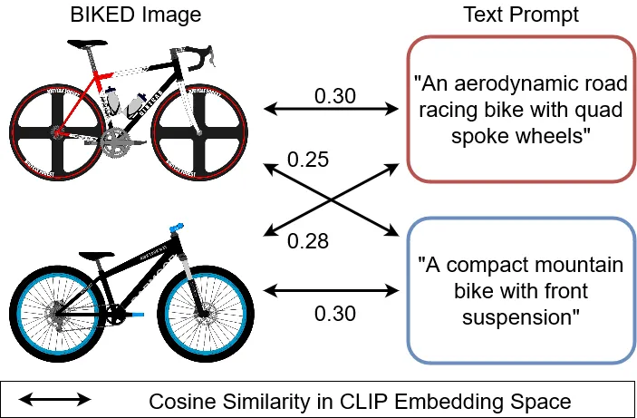

Figure 13: Cosine similarity between bicycle images from \[78\] and text
prompts in CLIP embedding space. Shared embeddings allow for distance
calculation between datapoints of different modalities.

### 14.3 Model and Hyperparameter Settings for Evaluation Experiments

We present the training settings for all models tested on the synthetic
datasets and all evaluation metrics used.

##### GAN and cGAN Models

1.  1.  Discriminator and generator models are 2 hidden-layer neural
        networks with 100 parameters with leaky ReLU activation with slope
        coefficient $`\alpha=0.2`$.
2.  2.  The latent vectors are four-dimensional.
3.  3.  Discriminator and generator optimizers are Adam \[51\] with learning
        rate $`1e-3`$.
4.  4.  The models are trained over 5000 randomized batches of 32 samples.

##### VAE Model

1.  1.  Encoder and decoder models are 3 hidden-layer neural networks with
        100 parameters with ReLU activation.
2.  2.  The latent dimension is 4.
3.  3.  The model is trained for 1000 epochs of batches of 100.
4.  4.  the model’s optimizer is Adam with a learning rate $`1e-3`$.

##### MO-PaDGAN Model

1.  1.  Discriminator an generator architectures and optimizers are the same
        as in the GAN model. latent dimension and training epochs are also
        unchanged.
2.  2.  All training parameters are identical to \[24\] except
        $`\gamma_{0}=5`$ and $`\gamma_{1}=2`$.

##### Experiment 1: Evaluating statistical similarity on 2D data (Sec. 4.5

1.  1.  Nearest datapoint, nearest generated sample, and rediscovery use
        Euclidean distance.
2.  2.  F1, F10, F0.1, and AUC-PR use 20 clusters, angle resolution of 1000,
        and 10 clustering runs.
3.  3.  ML efficacy uses an auxiliary regression task of predicting the
        objectives used in Sec. 7.3. A K-nearest-neighbors regressor with
        $`K=5`$ is used and evaluated using the coefficient of determination
        ($`R^{2}`$).

##### Experiment 2: Evaluating design exploration on 2D data (Sec. 5.3

1.  1.  Nearest datapoint and inter-sample distance use Euclidean distance.
2.  2.  DPP Diversity uses a subset size of 10 and an exponentiation
        parameter of 0.1.

##### Experiment 3: Evaluating design constraints on 2D data (Sec. 6.4

1.  1.  Predicted constraint satisfaction uses K-nearest-neighbors with
        $`K=5`$.
2.  2.  Nearest Invalid Datapoint uses Euclidean Distance.

##### Experiment 4: Evaluating design quality on 2D data (Sec. 7.3

1.  1.  The hypervolume reference point is selected as the 99th quantile
        performance value from the dataset.
2.  2.  The Pareto-optimal set for KNO1 is given as $`x+y=.4705`$.
3.  3.  The target for all target-related scores is set as (0.5,0.5).
        Objectives are weighted equally.
4.  4.  DTAI parameters are $`\alpha=\beta=[1,1]`$.

##### Experiment 5: Evaluating conditioning adherence on 2D data (Sec. 8.4

1.  1.  cVAE and cGAN architectures are identical to unconditional
        counterparts.
2.  2.  Both marginal and conditional F0.1 and F10 use 20 clusters, and
        angle resolution of 1000, and 10 clustering runs.
3.  3.  Conditional scores used the nearest 10% of the dataset as the
        constraint-satisfying subset.
4.  4.  Condition adherence and reconstruction use mean squared error.
5.  5.  Condition reconstruction uses K-nearest-neighbors regression with
        $`K=5`$.

### 14.4 Model and Hyperparameter Settings for Bicycle Frame Design Problem

##### Evaluation Metric Settings

1.  1.  Nearest datapoint, nearest generated sample, and inter-sample
        distance use Euclidean distance.
2.  2.  F1 score uses 20 clusters, angle resolution of 1000, and 10
        clustering runs.
3.  3.  DPP Diversity uses a subset size of 10 and an exponentiation
        parameter of 0.1.
4.  4.  The target for all target-related scores is set as 0.75 quantile
        performance value in each objective across the FRAMED dataset.
5.  5.  DTAI parameters are
        $`\alpha=[1,1,1,1,2,1,1,4,4,3],\beta=[4,4,4,4,4,4,4,4,4,2]`$.

##### Model Parameters

1.  1.  Discriminator and generator models for the GAN, MO-PaDGAN, and
        DTAI-GAN are 2 and 3 hidden-layer neural networks respectively with
        128 parameters and leaky ReLU activation with slope coefficient
        $`\alpha=0.2`$.
2.  2.  All PaDGAN and DTAI-GAN training parameters are identical to \[24\]
        except $`\gamma_{0}=5`$ and $`\gamma_{1}=0.5`$.
3.  3.  The latent vectors are four-dimensional.
4.  4.  Discriminator and generator optimizers are Adam \[51\] with learning
        rate $`1e-4`$.
5.  5.  The models are trained over 50000 randomized batches of 8 samples.
6.  6.  MO-PaDGAN and DTAI-GAN used differentiable performance surrogate
        regressors for performance evaluations of generated designs.
        DTAI-GAN used a differentiable constraint satisfaction surrogate
        classifier for constraint satisfaction likelihoods. Performance
        prediction and constraint satisfaction prediction networks were
        optimal neural networks identified through Bayesian optimization
        in \[80\].

### 14.5 Public Code and Evaluation Metrics Package

In our publicly released codebase we have provided the following:

1.  1.  6 model architectures
2.  2.  23+ evaluation metrics
3.  3.  14+ synthetic datasets
4.  4.  Code to generate score reports with confidence bounds
5.  5.  Code to generate training convergence plots
6.  6.  Code to generate plots of generated samples on 2D data, as shown in
        the paper
7.  7.  Code to generate animations of generated samples throughout the
        training process on 2D data

These features are organized as an easy-to-use package that can be
quickly used to evaluate other researchers’ models.
