# Data Redaction from Conditional Generative Models

1^(st) Zhifeng Kong Affiliation: Computer Science and Engineering  
University of California San Diego  
La Jolla, USA  
z4kong@ucsd.edu    2^(nd) Kamalika Chaudhuri Affiliation: Computer
Science and Engineering  
University of California San Diego  
La Jolla, USA  
kamalika@cs.ucsd.edu

###### Abstract

Deep generative models are known to produce undesirable samples such as
harmful content. Traditional mitigation methods include re-training from
scratch, filtering, or editing; however, these are either
computationally expensive or can be circumvented by third parties. In
this paper, we take a different approach and study how to post-edit an
already-trained conditional generative model so that it redacts certain
conditionals that will, with high probability, lead to undesirable
content. This is done by distilling the conditioning network in the
models, giving a solution that is effective, efficient, controllable,
and universal for a class of deep generative models. We conduct
experiments on redacting prompts in text-to-image models and redacting
voices in text-to-speech models. Our method is computationally light,
leads to better redaction quality and robustness than baseline methods
while still retaining high generation quality.

## I Introduction

Deep generative models are unsupervised deep learning models that learn
a data distribution from samples and then generate new samples from it.
These models have shown tremendous success in many domains such as image
generation \[1, 2, 3, 4\], audio synthesis \[5, 6\], and text generation
\[7, 8\]. Most modern deep generative models are conditional: the user
inputs some context known as the conditionals, and the model generates
samples conditioned on the context.

However, as these models have grown more powerful, there has been
increasing concern about their trustworthiness: in certain situations,
these models produce undesirable outputs. For example, with
text-to-image models, one may craft a prompt that contains offensive,
biased, malignant, or fabricated content, and generate a high-resolution
image that visualizes the prompt \[9, 10, 11, 3, 12, 13, 14\]. With
speech synthesis models, one may easily turn text into celebrity voices
\[15, 16, 17\]. Text generation models can emit offensive, biased, or
toxic content \[18, 19, 20, 21, 22, 23, 24\].

One plausible solution to mitigate this problem is to remove all
undesirable samples from the training set and re-train the model. This
is too computationally heavy for modern, large models. Another solution
is to apply a classifier that filters out undesirable conditionals or
outputs \[12, 13, 14\], or to edit the outputs and remove the
undesirable content after generation \[25\]. However, in cases where the
model owners share the model weights with third parties, they do not
have control over whether the filters or editing methods will be used.
In order to prevent undesirable outputs more efficiently and reliably,
we propose to post-edit the weights of a pre-trained model, which we
call data redaction.

The first challenge is how to frame data redaction for conditional
generative models. Prior work in data redaction for unconditional
generative models considered this problem in the space of outputs, and
framed the problem as learning the data distribution restricted to a
valid subset of outputs \[26\]. However, a conditional generative model
learns a collection of (usually an infinite number of) distributions
(one for each conditional) all of which are induced by networks that
share weights; therefore, we cannot apply this method one by one for
every conditional we would like to redact. In this paper, we frame data
redaction for conditional generative models as redacting a set of
conditionals that will very likely lead to undesirable content. In
particular, we do redaction in the conditional space, instead of
separately redacting samples generated from each conditional in the
output space.

This statistical machine learning framework inspires us to design a
universal, efficient, and effective method for data redaction. We only
re-train (or distill) the conditional part of the network by projecting
redacted conditionals onto different, non-redacted reference
conditionals. It is computationally light because all but the
conditioning network is fixed, and we only need to load a small fraction
of the dataset for training.

We show there exists an explicit data redaction formula for simple
class-conditional models. For more complicated generative models in
real-world applications, we introduce a series of techniques to
effectively redact certain conditionals but retain high generation
quality. These include model-specific distillation losses and training
schemes, methods to increase the capacity of the student conditioning
network, ways to improve efficiency, and a few others.

We test our data redaction method on two real-world applications:
GAN-based text-to-image \[27\] and Diffusion-based text-to-speech \[5\].
For text-to-image, we redact prompts that include certain words or
phrases. Our method has significantly better redaction quality and
robustness than baseline methods while retaining similar generation
quality as the pre-trained model. For text-to-speech, we redact certain
voices outside the training set. Our method achieves both high redaction
and speech quality. Audio samples can be found on our demo website
([https://dataredact2023.github.io/](https://dataredact2023.github.io/)).
Our methods for both applications are extremely computationally
efficient: redacting text-to-image models takes approximately 0.5 hour,
and redacting text-to-speech models takes less than 4 hours, both on one
single NVIDIA 3080 GPU. In contrast, training the text-to-image model
takes more than a day on one GPU, and training the text-to-speech model
takes 2-3 days on 8 GPUs. This demonstrates that data redaction can be
done significantly more efficiently than re-training full models from
scratch.


(a) Pre-trained

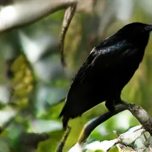

(b) Reference

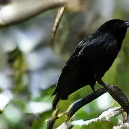

(c) Our Redaction

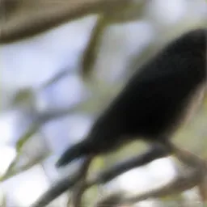

(d) Rewriting \[28\]

Fig. 1: Redact ‘‘white belly’’ from text-to-image models \[27\]. The
prompt is ‘‘this bird has feathers that are black and has a white
belly’’. (a) Sample generated from the pre-trained model, which produces
a visualization of the prompt. (b) The target sample that redacts
‘‘white belly’’ but keeps the other concepts. (c) Generated sample from
our redaction model, which aims to redact ‘‘white belly’’ and
approximates the reference sample. (d) Sample generated from the
Rewriting baseline, which is blurry and has lower quality. More samples
can be found in Appendix B-B.

### I-A Related Work

Machine Unlearning. Machine unlearning computes or approximates a
re-trained machine learning model after removing certain training
samples \[29\]. Many unlearning methods have been proposed for
supervised learning \[30, 31, 32, 33, 34, 35, 36, 37\], among which some
provide theoretically guaranteed unlearning or removal for strictly
convex classifiers. There is one method approximate deletion method for
generative models \[38\], which aims to delete from an unconditional
generative model by post-hoc rejection sampling. The goal of data
redaction is very different from machine unlearning, which unlearns
training samples and is usually in the privacy context, while data
redaction prevents undesirable samples from generation regardless
whether they are in the training set. ¹¹ 1 It is also unclear how to do
efficient unlearning for complex conditional generative models (e.g.
text-to-X) because it is unclear what exact combination of (text, X)
pairs to unlearn and how to do it beyond retraining from scratch. A
detailed explanation can be found in Section II-C in \[26\].

Data Filtering and Semantic Editing. A direct way to prevent certain
samples to be generated is to apply a data filter (e.g., a malicious
content classifier). The filter can be applied to training data before
training \[9, 11, 3\], or applied post-hoc to model outputs \[12, 13,
14\]. Another line of research has looked at semantically modifying the
outputs of generative models. For GANs \[39\], \[40\] computes an
editing vector in the latent space to alter a semantic concept. For
diffusion models \[41\] especially text-to-image models like Stable
Diffusion \[1\], there are also a number of image editing techniques
\[42, 43, 44, 45, 46\]. \[25\] applied image editing to prevent
diffusion models from generating malicious images through a safety
guidance term that alters the sampling algorithm for inappropriate
prompts.

While these filtering and editing methods can be used to prevent
malicious images, the model parameters are not modified. Consequently,
in cases where the models owners share the model weights with third
parties, they do not have control over whether the third parties will
use the filters or editing methods. In contrast, our proposed method
modifies the model weights to address this issue.

Data Redaction in Unconditional Models. Several works have studied
methods to prevent generative models from producing undesirable samples,
either by re-training or post-editing. For GANs, \[47\] and \[48\]
investigated re-training methods via modified loss functions that
penalize generation of undesirable samples, and \[28\] and \[49\]
introduced post-hoc parameter rewriting techniques for semantic editing,
which can be used to remove undesirable artifacts. \[26\], \[50\], and
\[51\] designed post-editing data redaction methods for various types of
pre-trained generative models.

All these methods are restricted to the unconditional setting as they
modify the mapping from latent vectors to samples. In contrast, the goal
of this paper is to redact data from pre-trained, conditional generative
models. In these models, the conditional information heavily controls
the content and style of generated samples (e.g. text-to-X), whereas the
latent controls variation. It is therefore necessary to also modify the
mapping from conditional to samples.

Redaction Methods for Stable Diffusion. \[52\] fine-tunes Stable
Diffusion to incorporate negative guidance on undesirable visual styles
(e.g., those under copyright protection). As a result, undesirable
samples will not be generated with the standard sampling algorithm.
However, one might recover the original score from the distilled score
to break this method (see Appendix A for details). \[53\] proposed an
analytic solution for keys in cross attention blocks to edit concepts. A
similar approach \[54\] proposed a re-steering mechanism for keys by
minimizing the attention maps of target concepts. \[55\] and \[56\]
proposed to forget or manipulate concepts by further fine-tuning the
entire network with certain continual learning objectives. These methods
are heavily designed for text-to-image tasks with Stable Diffusion. They
require the model to be trained with either classifier-free guidance
\[57\] or cross attention blocks, or they need to fine-tune the entire
large diffusion network. In contrast, our proposed method is universal,
applies to a broader range of generative models, and applies to multiple
data domains. To our knowledge, it is the first method that is able to
redact voices from a trained speech synthesis model.

## II Preliminaries

Conditional Generative Models. Let $`\mathcal{C}`$ be the space of
conditionals. It could be a finite set of discrete labels, or an
infinite set of continuous representations. ²² 2 In cases where there
are infinitely many discrete labels such as text or 16-bit floats, these
conditionals are usually considered as continuous or transformed to
continuous representations. For any $`c\in\mathcal{C}`$ there is an
underlying data distribution $`p_{\mathrm{data}}(\cdot|c)`$ (on
$`\mathbb{R}^{d}`$) conditioned on $`c`$. In the discrete label case,
this simply corresponds to a finite number of data distributions for all
labels. In the more complicated continuous case, there is usually an
underlying assumption that $`p_{\mathrm{data}}(\cdot|c)`$ is Lipschitz
with respect to $`c`$: that is, $`p_{\mathrm{data}}(\cdot|c)`$ will not
change much if $`c`$ does not change much.

Let $`X=\{(x_{i},c_{i})\}`$ be the set of training data, in which each
$`x_{i}`$ is the sample and $`c_{i}`$ is the conditional (for example,
$`x_{i}`$ is an image and $`c_{i}`$ is its caption). Let $`G`$ be a
conditional generative model trained on $`X`$. $`G`$ has two inputs – a
sample latent $`z`$ drawn from a Gaussian distribution and a conditional
$`c`$ – and outputs sample $`x=G(z|c)`$. For each $`c\in\mathcal{C}`$,
$`G`$ draws from a generative distribution $`p_{G}(\cdot|c)`$, which is
trained to learn $`p_{\mathrm{data}}(\cdot|c)`$. In the discrete label
case, this is equivalent to modeling a finite number of distributions.
In the continuous case, $`G`$ also needs to generalize to unseen
conditionals, because not all conditionals exist in the training set. We
assume that $`p_{G}(\cdot|c)`$ learns $`p_{\mathrm{data}}(\cdot|c)`$
very well, as how to train these models is outside the scope of this
paper.

Problem setup. Our goal is to redact a set of conditionals
$`\mathcal{C}_{\Omega}\subset\mathcal{C}`$, referred to as the redaction
conditionals, which with high probability lead to undesirable content.
For example, for text-to-image models, we may be looking to redact text
prompts related to violence or offensive content. ³³ 3 This does not
necessarily redact every possible offensive output; for example, an
innocent prompt such as ”a day in the park” might with very low
probability result in a violent image which our solution will not
address.

We assume that the redaction conditionals are given to us either as a
set or described by a classifier. We assume that we are working with an
already trained generative model $`G`$ and we are only allowed to
post-edit it. Re-training generative models from scratch can be highly
compute-intensive, and so our goal is to consider computationally
efficient solutions. Additionally, we also want to avoid solutions that
involve external filters, since a third-party can choose not to use
them. A final requirement of our solution is that it should retain high
generation quality for the conditionals that are not to be redacted.

We assume that we have access to the parameters of the network $`G`$ and
(part or whole of) its training dataset $`X`$. ⁴⁴ 4 One setting this
assumption holds is when the model owners want to make their model
safer. We believe the only possible solution for a closed-source model
is filtering. The goal of this paper is to edit the parameters of model
$`G`$ to form a new model $`G^{\prime}`$ so that harmful conditionals
lead to the generation of benign outputs.

Our proposed solution addresses this problem in the context where the
conditioning networks are separate from the main generative network –
which holds for most current network architectures – and achieves this
by distilling only the conditioning networks.

## III Method

In this section, we consider a special solution to our redaction task:
for redacted conditionals $`c\in\mathcal{C}`$, we let $`G^{\prime}`$
learn the distribution conditioned on a different, non-redacted
conditional $`\hat{c}\in\mathcal{C}\setminus\mathcal{C}_{\Omega}`$,
which we denote as the reference conditional for $`c`$. Formally,

```math
p_{G^{\prime}}(\cdot|c)=p_{G}(\cdot|\hat{c})\text{ if }c\in\mathcal{C}_{\Omega}\text{, otherwise }p_{G}(\cdot|c). \tag{1}
```

Next, we introduce an efficient way to achieve (1). Let $`H`$ be the
(separate) conditioning network in the generator network $`G`$. $`H`$
takes the conditional $`c`$ as input and computes conditional
representation $`H(c)`$, which is then fused into the main generative
network (potentially at different layers). Our solution is to project
the conditional representation $`H^{\prime}(c)`$ of the new conditioning
network to $`H(\hat{c})`$:

```math
H^{\prime}(c)=H(\hat{c})\text{ if }c\in\mathcal{C}_{\Omega}\text{, otherwise }H(c). \tag{2}
```

We provide an illustrative and analytical explanation to our method in
Section IV. Specifically, we show (2) can be done explicitly if the
model is conditioned on a few discrete labels and the conditioning
network is affine. We then introduce methods for more complicated,
real-world scenarios in Section V. For these models conditioned on
continuous representations and with complicated architecture, we
introduce distillation-based methods to approximately achieve (2).

## IV Redacting Models Conditioned on Discrete Labels

In this section, we show for simple class-conditional models, there is
an explicit formula to redact certain labels.

Redacting a single label. Suppose there are $`k`$ labels:
$`\mathcal{C}=\{c_{1},\cdots,c_{k}\}`$, where label $`j`$ is to be
redacted. We consider a common type of conditioning method: each label
$`c_{i}`$ is represented by a $`k`$-dimensional embedding vector
$`v_{i}\in\mathbb{R}^{k}`$, and $`H`$ is an affine transformation whose
output dimension $`r\geq k`$. We assume the embedding vectors are
linearly independent:
$`\mathbf{span}\{v_{1},\cdots,v_{k}\}=\mathbb{R}^{k}`$. A special case
of this formulation is the conditioning method proposed by \[58\], where
each $`v_{i}=\mathbf{e}_{i}`$ is the one-hot vector with the $`i`$-th
element $`=1`$, and is concatenated to the latent code.

Let $`H(v)=Mv`$, where $`M\in\mathbb{R}^{r\times k}`$. The redaction
problem is equivalent finding an $`M^{\prime}\in\mathbb{R}^{r\times k}`$
such that $`M^{\prime}v_{i}=Mv_{i}`$ for $`i\neq j`$ and
$`M^{\prime}v_{j}=MV_{-j}\eta_{-j}`$ for an one-hot vector
$`\eta_{-j}\in\mathbb{R}^{k-1}`$, where
$`V_{-j}=[v_{1},\cdots,v_{j-1},v_{j+1},\cdots,v_{k}]\in\mathbb{R}^{k\times(k-1)}`$.
The first condition $`M^{\prime}v_{i}=Mv_{i}`$ for $`i\neq j`$ indicates
every row of $`M^{\prime}-M`$ is in the null space of
$`\{v_{i}\}_{i\neq j}`$. The null space is a one-dimensional subspace
with basis vector $`u`$. Then, $`M^{\prime}-M`$ can be decomposed as
$`\omega u^{\top}`$ for some $`\omega\in\mathbb{R}^{r}`$. Then, by to
the second condition $`M^{\prime}v_{j}=MV_{-j}\eta_{-j}`$, we have
$`\omega=\frac{1}{u^{\top}v_{j}}M(V_{-j}\eta_{-j}-v_{j})`$. This means
by replacing $`M`$ with
$`M^{\prime}=M(I+\frac{1}{u^{\top}v_{j}}(V_{-j}\eta_{-j}-v_{j})u^{\top})`$,
we are able to redact label $`j`$. When conditioned on $`j`$, the edited
model will generate another digit based on which element in
$`\eta_{-j}`$ is non-zero.

Redacting multiple labels. Suppose there are multiple labels
$`\{1,\cdots,J\}`$ ($`J<k`$) to be redacted. The $`M^{\prime}`$ matrix
needs to satisfy $`M^{\prime}v_{i}=Mv_{i}`$ for $`i>J`$, and
$`M^{\prime}v_{j}=MV_{-J}\eta_{-j}`$ for $`j\leq J`$, where
$`V_{-J}=[v_{J+1},\cdots,v_{k}]\in\mathbb{R}^{k\times(k-J)}`$. For
$`j\leq J`$, let $`u_{j}`$ be the basis vector of the null space of
$`\{v_{i}\}_{i\neq j}`$. Each row of $`M^{\prime}-M`$ is in the null
space of $`\{v_{i}\}_{i>J}`$, which can be written as a linear
combination of $`\{u_{j}\}_{j=1}^{J}`$. Therefore, we can represent
$`M^{\prime}-M`$ as

```math
M^{\prime}-M=\sum_{j=1}^{J}\omega_{j}u_{j}^{\top}=WU^{\top},
```

where the $`j`$-th column of $`W`$ ($`U`$) is $`\omega_{j}`$
($`u_{j}`$). Let $`V_{J}=[v_{1},\cdots,v_{J}]`$ and
$`Y_{-J}=[\eta_{-1},\cdots,\eta_{-J}]`$. We have
$`M^{\prime}V_{J}=MV_{-J}Y_{-J}`$. This simplifies to

```math
WU^{\top}V_{J}=M(V_{-J}Y_{-J}-V_{J}).
```

Notice that $`U^{\top}V_{J}`$ is a diagonal matrix with $`j`$-th
diagonal element $`u_{j}^{\top}v_{j}\neq 0`$. Therefore, we have

```math
W=M(V_{-J}Y_{-J}-V_{J})(U^{\top}V_{J})^{-1}. \tag{3}
```

Simplified formula for one-hot embedding vectors. Let
$`v_{i}=\mathbf{e}_{i}`$ for each $`i`$. Then, we have
$`u_{i}=v_{i}=\mathbf{e}_{i}`$, and therefore $`U^{\top}V_{J}=I`$. We
also have $`U=V_{J}=[I_{J}|\mathbf{0}]^{\top}`$ and
$`V_{-J}=[\mathbf{0}|I_{k-J}]`$, where $`I_{J}`$ is the
$`J`$-dimensional identity matrix. Then,

```math
WU^{\top}=M([\mathbf{0}|I_{k-J}]Y_{-J}-[I_{J}|\mathbf{0}]^{\top})[I_{J}|\mathbf{0}]=M\left(\begin{array}[]{cc}-I_{J}&\mathbf{0}\\
Y_{-J}&\mathbf{0}\end{array}\right).
```

As a result,

```math
M^{\prime}=M+WU^{\top}=M\left(\begin{array}[]{cc}\mathbf{0}&\mathbf{0}\\
Y_{-J}&I_{k-J}\end{array}\right).
```

Higher embedding dimension. Because of linear independence, the null
space of $`\{v_{i}\}_{i\neq j}`$ has 1 dimension higher than the null
space of $`\{v_{i}\}_{i=1}^{k}`$. Therefore, we can pick
$`u_{j}\in\mathbf{null}(\{v_{i}\}_{i\neq j})\setminus\mathbf{null}(\{v_{i}\}_{i=1}^{k})`$.

## V Redacting Models Conditioned on Continuous Representations

In practice, the networks are usually complicated and highly non-linear.
Therefore, there is generally no explicit formula to achieve (2) due to
non-linearity and limited expressive power of the conditioning network.
To approximately achieve (2), we propose to distill the conditioning
network by minimizing

```math
\begin{array}[]{rl}\min_{H^{\prime}}~L(H^{\prime};\lambda)=&\mathbb{E}_{c\in\mathcal{C}\setminus\mathcal{C}_{\Omega}}\|H^{\prime}(c)-H(c)\|\\
&+\lambda\cdot\mathbb{E}_{c\in\mathcal{C}_{\Omega}}\|H^{\prime}(c)-H(\hat{c})\|\end{array} \tag{4}
```

for some metric $`\|\cdot\|`$ and balancing coefficient $`\lambda>0`$.
In the rest of this section, we study two types of common conditional
generative models: image models conditioned on text prompts, and speech
models conditioned on spectrogram representations. We will demonstrate
specific losses and distillation techniques for each model that align
with the slightly different goals in each task.

### V-A Redacting GAN-based Text-to-Image Models

In this section, we study how to redact text prompts in text-to-image
models. Modern text-to-image models can produce high-resolution images
conditioned on text prompts that may be offensive, biased, malignant, or
fabricated \[9, 10, 11, 3, 12, 13, 14\]. These models are usually
expensive to re-train, so it is important to redact these prompts
without re-training.

Especially, we look at DM-GAN \[27\], a GAN-based text-to-image model.
It is trained on pairs of text and images from the CUB dataset \[59,
60\], a dataset for various species of birds. DM-GAN is composed of
three cascaded generative networks $`\{G_{1},G_{2},G_{3}\}`$. The first
$`G_{1}`$ generates $`64\times 64`$ images, the second $`G_{2}`$
up-samples to $`128\times 128`$, and the third $`G_{3}`$ up-samples to
$`256\times 256`$. Each $`G_{i}`$ has its own conditioning network
$`H_{i}`$. For a given prompt $`c`$, the model computes a sentence
embedding $`v_{s}(c)`$ and word embeddings $`v_{w}(c)`$ from a
pre-trained text encoder \[61\]. The first conditioning network
$`H_{1}`$ performs conditioning augmentation on the sentence embedding
and concatenate the output to the latent variable. $`H_{2}`$ and
$`H_{3}`$ apply memory writing modules to the word embeddings and fuse
the outputs with the previously generated low-resolution images via
several gates.

Defining $`\hat{c}`$. We assume $`\mathcal{C}_{\Omega}`$ contains
prompts that have undesirable words or phrases. For these prompts, the
reference prompts are defined by replacing these words with non-redacted
ones.

Sequential distillation. We propose to distill the conditioning networks
$`\{H_{1},H_{2},H_{3}\}`$ sequentially based on (4). This is because
both $`G_{2}`$ and $`G_{3}`$ are generative super-sampling networks,
which take $`G_{1}`$ and $`G_{2}`$ outputs as inputs, respectively.
After $`G_{1}`$ is edited to $`G_{1}^{\prime}`$ for redaction, $`G_{2}`$
will take $`G_{1}^{\prime}`$ outputs as inputs, and similar for
$`G_{3}`$. Formally,

```math
\begin{array}[]{rl}\displaystyle H_{1}^{\prime}=\arg\min_{H_{1}^{\prime}}&\{\mathbb{E}_{c\in\mathcal{C}\setminus\mathcal{C}_{\Omega}}\|H_{1}^{\prime}(v_{s}(c))-H_{1}(v_{s}(c))\|\\
&+\lambda\cdot\mathbb{E}_{c\in\mathcal{C}_{\Omega}}\|H_{1}^{\prime}(v_{s}(c))-H_{1}(v_{s}({\color[rgb]{1,0,0}\hat{c}}))\|\},\end{array} \tag{5}
```

```math
\begin{array}[]{rll}\displaystyle H_{i}^{\prime}=\arg\min_{H_{i}^{\prime}}&\{\mathbb{E}_{c\in\mathcal{C}\setminus\mathcal{C}_{\Omega},z}&\|H_{i}^{\prime}(v_{w}(c),G_{i-1}^{\prime}(z|c))-\\
&&~~~~~~H_{i}(v_{w}(c),G_{i-1}^{\prime}(z|c))\|\\
\displaystyle+&\lambda\cdot\mathbb{E}_{c\in\mathcal{C}_{\Omega},z}&\|H_{i}^{\prime}(v_{w}(c),G_{i-1}^{\prime}(z|c))-\\
&&~~~~~~H_{i}(v_{w}({\color[rgb]{1,0,0}\hat{c}}),G_{i-1}^{\prime}(z|{\color[rgb]{1,0,0}\hat{c}}))\|\}\end{array} \tag{6}
```

for $`i=2,3`$.

Improved capacity. As $`H_{1}^{\prime}`$ needs to approximate a
piecewise function that is defined differently for two sets of sentence
embeddings, we need to increase the capacity of $`H_{1}^{\prime}`$ for
better distillation. We append a few LSTM layers to the beginning of
$`H_{1}^{\prime}`$, which directly take the sentence embeddings as
inputs. The LSTM layers are followed by a convolution layer that reduces
hidden dimensions to 1. We initialize this layer with zero weights for
training stability. We expect these layers can project sentence
embeddings of $`c`$ to those of $`\hat{c}`$. The rest of
$`H_{1}^{\prime}`$ has the same architecture as $`H_{1}`$ but all
weights are initialized for training. We do not increase the capacity of
$`H_{2}^{\prime}`$ and $`H_{3}^{\prime}`$ for two reasons. First,
$`H_{1}^{\prime}`$ has more direct impact on the generated images
because it directly controls the initial low-resolution image. Second,
the memory writing modules of $`H_{2}`$ and $`H_{3}`$ are already very
expressive.

Fixing the variance prediction part in $`H_{1}`$. We aim to reduce the
computational overhead by fixing certain variables. The conditioning
augmentation module in $`H_{1}`$ first computes a mean and a variance
vector, and then samples from the Gaussian defined by them. We fix the
variance prediction part and only distill the mean prediction part. In
our experiments the number of parameters to be trained in
$`H_{1}^{\prime}`$ (with improved capacity) is reduced by $`\sim 32\%`$
and therefore matches $`H_{1}`$.

$`\lambda`$ annealing. In order to make sure the distilled conditioning
networks also approximate the pre-trained ones well for non-redacted
prompts, we anneal the balancing coefficient $`\lambda`$ during
distillation: we initialize $`\lambda=\lambda_{\min}`$ and linearly
increases to $`\lambda_{\max}`$ in the end.

### V-B Redacting Diffusion-based Text-to-Speech Models

Modern text-to-speech models can turn text into high-quality speech in
unseen voices such as celebrity voices \[5, 15, 16, 17\]. This may have
unpredictable public impact if these models are used to fake
celebrities. In this section, we study redacting certain voices from a
pre-trained text-to-speech model.

Especially, we look at DiffWave \[5\], a diffusion probabilistic model
that is conditioned on spectrogram and outputs waveform. It is trained
on speech of a single female reading a book, which we call the
pre-trained voice. There are $`n=30`$ layers or residual blocks in
DiffWave, each containing one independent conditioning network
$`H_{i}`$. The architecture of each $`H_{i}`$ includes two up-sampling
layers followed by one convolution layer.

Defining $`\hat{c}`$ with voice cloning. We assume
$`\mathcal{C}_{\Omega}`$ contains a few clips of speech in a specific
voice. We train a voice cloning model (CycleGAN-VC2 \[62\]) between the
specific and pre-trained voices, and then transform all clips in
$`\mathcal{C}_{\Omega}`$ to the pre-trained voice. By doing this we
obtain time-aligned pairs between $`c\in\mathcal{C}_{\Omega}`$ and the
corresponding $`\hat{c}`$: when we select a small duration
$`[t,t+\Delta t]`$, the content of $`c_{t:t+\Delta t}`$ is the same as
$`\hat{c}_{t:t+\Delta t}`$, yet only the voices are different.

Improved voice cloning. We find the voice cloning quality of
CycleGAN-VC2 can be improved by making the two unpaired training sets
more similar. We first use a pre-trained Whisper model \[63\] to extract
text from redacted speech. Then, we use Tortoise-TTS \[15\] to turn
these text into speech in the pre-trained voice. Note that this cannot
be used to define $`\hat{c}`$ directly because the generated samples are
not time-aligned with the speech to be redacted. However, these
generated samples are more similar to the redacted samples because they
have the same text, and therefore it is easier for CycleGAN-VC2 to learn
transformations between these two voices.

Parallel distillation. We propose to distill all conditional layers
$`H_{i}`$’s in parallel as they are independent. We minimize the
following loss:
$`\min\frac{1}{n}\sum_{i=1}^{n}L(H_{i}^{\prime};\lambda).`$

Fixing up-sampling layers in $`H_{i}`$. To reduce computation overhead
we fix the two up-sampling layers in each $`H_{i}`$. We only distill the
last convolution layer in each $`H_{i}`$.

Improved capacity. To improve redaction quality, we increase the
capacity of each $`H_{i}^{\prime}`$ by replacing its last convolution
layer $`h_{\mathrm{conv}}`$ with a spectrogram-rewriting module. It has
two components: a gate $`h_{\mathrm{gate}}`$ consisting of a convolution
with zero initialization followed by sigmoid, and a transformation block
$`h_{\mathrm{trans}}`$ consisting of two convolution layers. The forward
computation of the spectrogram-rewriting module is defined as:
$`y=h_{\mathrm{conv}}(v)\odot h_{\mathrm{gate}}(v)+h_{\mathrm{conv}}(h_{\mathrm{trans}}(v))\odot(1-h_{\mathrm{gate}}(v)),`$
where $`v`$ is the up-sampled mel-spectrogram and $`y`$ is the output
representation at each layer. We expect this module can retain the
pre-trained voice and also project redacted voices to the pre-trained
voice.

Non-uniform distillation losses. We conjecture the all conditioning
layers are not of the same importance because of their order and
different hyper-parameters specifically the dilation
$`2^{i\mathrm{~mod~}n^{\prime}}`$ in the corresponding residual layer.
This motivates us to use different weights and $`\lambda`$ values for
each $`H_{i}`$:
$`\min\sum_{i=1}^{n}w_{i}L(H_{i}^{\prime};\lambda_{i}).`$ We test
different schedules described in Table I.

| name                     | schedule                                                                  |
| ------------------------ | ------------------------------------------------------------------------- |
| $`w_{i}`$-order          | $`w_{i}=\frac{1}{n}+\alpha(i-(n+1)/2)`$                                   |
| $`\lambda_{i}`$-order    | $`\lambda_{i}=\lambda+\beta(i-(n+1)/2)`$                                  |
| $`w_{i}`$-dilation       | $`w_{i}=\frac{1}{n}+\alpha(i\mathrm{~mod~}n^{\prime}-(n^{\prime}+1)/6)`$  |
| $`\lambda_{i}`$-dilation | $`\lambda_{i}=\lambda+\beta(i\mathrm{~mod~}n^{\prime}-(n^{\prime}+1)/6)`$ |

TABLE I: Schedules for the non-uniform distillation losses.

## VI Experiments

In this section, we aim to answer the following questions. (1) Is the
redaction method in Section IV able to fully redact labels? And (2) do
the redaction algorithms in Section V redact certain conditionals well
and retain high generation quality on real-world applications?

### VI-A Redacting Models Conditioned on Discrete Labels

We train a class-conditional GAN called cGAN \[58\] on MNIST \[64\].
Each conditional has a $`10`$-dimensional embedding vector, and is
concatenated to the latent vector as the input. The affine
transformation matrix $`M`$ in Section IV is the last 10 rows of the
weight matrix of the first fully connected layer. We redact labels
0,1,2,3 according to (3), where we let $`\hat{c}=9-c`$ for them.
Generated samples of pre-trained and redacted models are shown in Fig. 2.

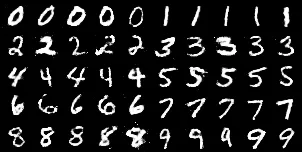

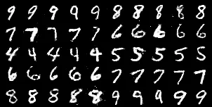

Fig. 2: Redacting labels 0,1,2,3 in cGAN on MNIST. Upper: samples
generated from the pre-trained model. Down: samples generated from the
redacted model. Redacted conditionals (first two rows) are edited as
expected, and other conditionals (last three rows) remain unchanged.

### VI-B Redacting GAN-based Text-to-Image Models

Setup. We use the pre-trained DM-GAN \[27\] model trained on the CUB
dataset \[59\], which contains 8855 training images and 2933 testing
images of 200 subcategories belonging to birds. Each image has 10
captions \[60\]. Our distillation algorithm is trained with the caption
data only. We redact prompts that contain certain words or phrases. We
redact the word blue$`\in c`$ by defining $`\hat{c}`$ as the prompt that
replaces all blue with another word red. ⁵⁵ 5 Any word other than blue
can be used. Similarly, we redact blue wings and red wings by replacing
these phrases to white wings. We redact long beak and white belly by
replacing the first to short beak and the second to black belly.
Finally, we redact yellow and red by replacing them to black, which is
more challenging as many samples are redacted.

Table II includes the number of training and test prompts that are
redacted in each experiment. Note that when we redact blue wings and red
wings, we also redact phrases wings that are blue and wings that are
red.

| Redaction prompts      | \# redacted training prompts | \# redacted test prompts |
| ---------------------- | ---------------------------- | ------------------------ |
| long beak, white belly | 10377                        | 3369                     |
| blue / red wings       | 732                          | 303                      |
| blue                   | 6113                         | 2175                     |
| yellow, red            | 29514                        | 9319                     |

TABLE II: Number of redacted training and test prompts. There are 88550
training prompts and 29330 test prompts in total.

Architecture and optimization. The architecture of the pre-trained model
and other details are in Appendix B. The architecture of student
conditioning networks with improved capacity is shown in Fig. 4. For
each $`H_{i}`$, $`i=1,2,3`$, we use the Adam optimizer \[65\] with a
learning rate $`0.005`$ to optimize the mean square error loss. The
redaction algorithm terminates at 1000 iterations. For $`H_{1}`$ we use
a batch size of 128, and for $`H_{2}`$ and $`H_{3}`$ we reduce the batch
size to 32 in order to fit into GPU memory.

Configurations. We first use the sequential distillation (5) and (6)
with $`\lambda=1`$ to perform redaction, which we denote as the base
configuration. We then improve the capacity by using a 3-layer
bidirectional LSTM with hidden size $`=32`$ and dropout rate $`=0.1`$.
Next, we fix the variance prediction in $`H_{1}`$ to reduce the number
of parameters to optimize, which matches the base configuration.
Finally, we apply $`\lambda`$ annealing by setting $`\lambda_{\min}=1`$
and $`\lambda_{\max}=3`$.

Baseline. We compare to the Rewriting algorithm \[28\], a semantic
editing method originally designed for unconditional generative models.
We adapt their method to DM-GAN by rewriting $`G_{1}`$, $`G_{2}`$, and
$`G_{3}`$ sequentially. For both $`G_{2}`$ and $`G_{3}`$ we rewrite the
up-sampling layer before the feature output. For $`G_{1}`$ we have
choices of rewriting the up-sampling layer at different resolutions
ranging from $`8\times 8`$ to $`64\times 64`$. We test all these choices
in the experiment.

Evaluation metrics. To evaluate generation quality of $`G^{\prime}`$, we
compute Inception Scores (IS) \[66\] for images conditioned on redacted
and valid prompts, separately. In detail, the IS scores are computed as
$`\exp(\mathbb{E}_{x}\mathbb{KL}(p(y|x)\parallel p(y)))`$, where
$`x\sim p_{G^{\prime}}(\cdot|c)`$ for
$`c\sim\mathrm{Uniform}(\mathcal{C}_{\Omega})`$ or
$`\mathrm{Uniform}(\mathcal{C}\setminus\mathcal{C}_{\Omega})`$,
$`p(y|x)`$ is the logit from the Inception-V3 output layer \[67\], and
$`p(y)`$ is the marginal. We generate one sample for each text prompt
for evaluation.

To evaluate redaction quality, we compute the following three metrics
where $`c\sim\mathcal{C}_{\Omega}`$ and $`z\sim\mathcal{N}`$.

1.  1.  $`\mathcal{R}_{G(\cdot|c/\hat{c})}`$ measures faithfulness of
        $`G^{\prime}`$ on the redaction prompts. It is defined as the
        fraction of samples $`\{G^{\prime}(z|c)\}`$ such that
        $`\mathrm{dist}(G^{\prime}(z|c),G(z|\hat{c}))<\mathrm{dist}(G^{\prime}(z|c),G(z|c))`$,
        where $`\mathrm{dist}`$ is $`\ell_{2}`$ distance in the Inception-V3
        feature space \[67\].
2.  2.  A modified R-precision score $`\mathcal{R}_{r}`$ measures how well
        $`G^{\prime}(z|c)`$ matches the target caption $`\hat{c}`$. \[61\]
        defined correlation $`\mathrm{corr}(x,c)`$ between sample $`x`$ and
        caption $`c`$ as
        $`\cos\langle\mathrm{Enc}_{\mathrm{CNN}}(x),\mathrm{Enc}_{\mathrm{RNN}}(c)\rangle`$
        for pretrained CNN (image) and RNN (text) encoders. We use the
        pretrained encoders from DM-GAN. Then, $`\mathcal{R}_{r}`$ is
        defined as the fraction of samples $`G^{\prime}(z|c)`$ such that
        $`\mathrm{corr}(G^{\prime}(z|c),\hat{c})`$ is larger than the
        correlation between $`G^{\prime}(z|c)`$ and 100 random, mismatch
        captions.
3.  3.  We further introduce $`\mathcal{R}_{c/\hat{c}}`$, which measures how
        much better $`G^{\prime}(z|c)`$ matches $`\hat{c}`$ than $`c`$. It
        is defined as the fraction of samples $`G^{\prime}(z|c)`$ such that
        $`\mathrm{corr}(G^{\prime}(z|c),\hat{c})>\mathrm{corr}(G^{\prime}(z|c),c)`$.

Results. The results for redacting yellow and red shown in Table III.
The base configuration already achieves good redaction and generation
quality. After improving capacity, we find all redaction quality metrics
increase by $`2.3\sim 2.7\%`$, and generation quality is retained. After
we fix the variance prediction in $`H_{1}`$, the redaction decrease by
$`\sim 1\%`$, but the generation quality on valid prompts increases by
$`0.1`$. Finally, by performing $`\lambda`$ annealing, all metrics
improve. Notably, $`\mathcal{R}_{G(\cdot|c/\hat{c})}`$ and
$`\mathcal{R}_{c/\hat{c}}`$ increase by over $`5\%`$, indicating
generated samples are more similar to $`\hat{c}`$ rather than $`c`$.

We find the Rewriting baselines achieve better IS. However, generated
samples are blurred and lack sharp edges as shown in the visualization.
The redaction quality of Rewriting has a significant gap with ours: all
redaction metrics are less than half of ours. Especially,
$`\mathcal{R}_{r}`$ is worse than the pre-trained model, indicating
generated samples conditioned on redacted prompts are not very
correlated to $`\hat{c}`$. We hypothesize the main problem for Rewriting
is that it is crafted for 2D convolutions and edits the main generative
network, which makes it hard to handle and distinguish the information
from different prompts. In terms of different choices of resolutions, we
find rewriting the layer at resolution $`8\times 8`$ yields the best
redaction quality.

|                                 |                 |                                |                   |                                  |                     |                             |                     |
| ------------------------------- | --------------- | ------------------------------ | ----------------- | -------------------------------- | ------------------- | --------------------------- | ------------------- | ---- |
| Method                          |                 | Inception Score ($`\uparrow`$) |                   | Redacting quality ($`\uparrow`$) |                     |                             | Training time       |
|                                 |                 | redacted                       | valid             | $`\mathcal{R}\_{G(\cdot          | c/\hat{c})}`$       | $`\mathcal{R}_{c/\hat{c}}`$ | $`\mathcal{R}_{r}`$ | mins |
| Pre-trained                     |                 | $`4.62`$                       | $`5.22`$          | $`0\%`$                          | $`6.0\%`$           | $`13.5\%`$                  | \-                  |
| Rewriting                       | $`8\times 8`$   | $`5.57`$                       | $`5.52`$          | $`\textit{33.0}\%`$              | $`\textit{39.7}\%`$ | $`\textit{5.0}\%`$          | $`24.3`$            |
|                                 | $`16\times 16`$ | $`5.63`$                       | $`5.53`$          | $`30.4\%`$                       | $`37.2\%`$          | $`4.8\%`$                   | $`25.3`$            |
|                                 | $`32\times 32`$ | $`5.72`$                       | $`5.71`$          | $`28.8\%`$                       | $`35.9\%`$          | $`4.7\%`$                   | $`23.5`$            |
|                                 | $`64\times 64`$ | $`\mathbf{5.77}`$              | $`\mathbf{5.73}`$ | $`27.5\%`$                       | $`35.2\%`$          | $`4.6\%`$                   | $`24.1`$            |
| Ours (base)                     |                 | $`4.79`$                       | $`5.23`$          | $`65.1\%`$                       | $`77.0\%`$          | $`46.9\%`$                  | $`27.4`$            |
| \+ improved capacity            |                 | $`4.74`$                       | $`5.25`$          | $`67.8\%`$                       | $`79.7\%`$          | $`\mathbf{49.2}\%`$         | $`28.4`$            |
|       + fix variance            |                 | $`4.79`$                       | $`5.35`$          | $`66.5\%`$                       | $`79.0\%`$          | $`48.4\%`$                  | $`22.5`$            |
|         + $`\lambda`$ annealing |                 | 4.84                           | 5.36              | $`\mathbf{72.2}\%`$              | $`\mathbf{84.2}\%`$ | $`\mathbf{49.2}\%`$         | $`29.9`$            |

TABLE III: Generation and redaction quality after redacting yellow and
red. Our method achieves significantly better redaction quality than
Rewriting and retains good generation quality. The effects of each
component within our method are displayed.

Table IV includes results for redacting the other prompts. The Rewriting
baseline is applied to $`8\times 8`$ resolution in $`H_{1}`$ because it
yields the best redaction quality. We find the base configuration of our
method is already very effective. Our method greatly outperforms
Rewriting in all redaction quality metrics and keeps good generation
quality.

Visualization. See Appendix B-B for generated samples. The Rewriting
baseline generate very blurry samples while our method generates
high-quality, sharp samples which also satisfy the redaction
requirements.

Computation. Data redaction takes about 30 minutes to train on a single
NVIDIA 3080 GPU.

| Redaction prompts       | Method      | Inception Score ($`\uparrow`$) |                   | Redacting quality ($`\uparrow`$) |                     |                             | Training time       |
| ----------------------- | ----------- | ------------------------------ | ----------------- | -------------------------------- | ------------------- | --------------------------- | ------------------- | ---- |
|                         |             | redacted                       | valid             | $`\mathcal{R}\_{G(\cdot          | c/\hat{c})}`$       | $`\mathcal{R}_{c/\hat{c}}`$ | $`\mathcal{R}_{r}`$ | mins |
|  long beak, white belly | Pre-trained | $`4.14`$                       | $`5.61`$          | $`0\%`$                          | $`5.2\%`$           | $`13.1\%`$                  | \-                  |
|                         | Rewriting   | $`\mathbf{5.36}`$              | $`\mathbf{5.85}`$ | $`32.6\%`$                       | $`51.4\%`$          | $`5.6\%`$                   | $`23.0`$            |
|                         | Ours (base) | $`4.91`$                       | $`5.81`$          | $`\mathbf{70.5}\%`$              | $`\mathbf{83.6}\%`$ | $`\mathbf{50.1}\%`$         | $`28.3`$            |
| blue / red wings        | Pre-trained | $`3.97`$                       | $`5.48`$          | $`0\%`$                          | $`4.1\%`$           | $`13.1\%`$                  | \-                  |
|                         | Rewriting   | $`\mathbf{5.21}`$              | $`\mathbf{5.85}`$ | $`27.8\%`$                       | $`15.1\%`$          | $`6.9\%`$                   | $`23.3`$            |
|                         | Ours (base) | $`5.04`$                       | $`5.28`$          | $`\mathbf{68.6}\%`$              | $`\mathbf{71.7}\%`$ | $`\mathbf{58.4}\%`$         | $`28.1`$            |
| blue                    | Pre-trained | $`3.65`$                       | $`5.18`$          | $`0\%`$                          | $`3.2\%`$           | $`7.2\%`$                   | \-                  |
|                         | Rewriting   | $`\mathbf{5.00}`$              | $`\mathbf{5.45}`$ | $`61.8\%`$                       | $`60.2\%`$          | $`17.7\%`$                  | $`28.7`$            |
|                         | Ours (base) | $`3.85`$                       | $`5.21`$          | $`\mathbf{81.3}\%`$              | $`\mathbf{89.7}\%`$ | $`\mathbf{66.2}\%`$         | $`34.7`$            |

TABLE IV: Generation and redaction quality after redacting various words
or phrases. Our method achieves significantly better redaction quality
than Rewriting and retains good generation quality.

Robustness to adversarial prompting. In order to understand whether
adversarial prompts may cause the redacted model to generate content we
would like to redact, we perform an adversarial prompting attack to
redacted or rewritten models in this section. Specifically, we adopt the
Square Attack \[68, 69\] directly to the discrete text space. For
$`c\in\mathcal{C}_{\Omega}`$, the goal is to find an adversarial
conditional $`c_{\mathrm{adv}}`$ such that
$`\mathrm{corr}(G^{\prime}(z|c_{\mathrm{adv}}),c)>\mathrm{corr}(G^{\prime}(z|c_{\mathrm{adv}}),\hat{c})`$.
The algorithm is illustrated in Algorithm 1. See Appendix B-C for a few
examples of successful attacks.

We measure the success rates of the proposed attack in Table V. The
success rates for our redaction method is consistently lower than the
Rewriting baseline (by $`31\%\sim 45\%`$), indicating our method is
considerably more robust to adversarial prompting attacks than
Rewriting.

1:  Initialize $`c_{\mathrm{adv}}=c`$.

2:  for iteration = $`1,\cdots,16`$ do

3:   Uniformly sample a position $`s`$ of the caption
$`c_{\mathrm{adv}}`$ to update.

4:   Uniformly sample 32 candidate words from the token dictionary.
Construct 32 candidate adversarial captions by replacing the $`s`$-th
token of $`c_{\mathrm{adv}}`$ with these words, respectively.

5:   Update the adversarial caption $`c_{\mathrm{adv}}`$ with the one
with the largest $`\mathrm{sim}(G^{\prime}(z|c_{\mathrm{adv}}),c)`$.

6:  end for

7:  return $`c_{\mathrm{adv}}`$

Algorithm 1 Adversarial Prompting via Square Attack \[68, 69\]

| Redaction prompts     | Method      | Attack Success Rate $`(\downarrow)`$ |
| --------------------- | ----------- | ------------------------------------ |
| long beak,white belly | Rewriting   | $`92.8\%`$                           |
|                       | Ours (base) | $`\mathbf{50.3}\%`$                  |
| blue / red wings      | Rewriting   | $`97.4\%`$                           |
|                       | Ours (base) | $`\mathbf{65.7}\%`$                  |
| blue                  | Rewriting   | $`81.1\%`$                           |
|                       | Ours (base) | $`\mathbf{35.5}\%`$                  |
| yellow, red           | Rewriting   | $`95.5\%`$                           |
|                       | Ours (base) | $`\mathbf{59.9}\%`$                  |

TABLE V: Success rates of the adversarial prompting attack (Algorithm 1)
to our redaction method and the Rewriting baseline. Our redaction method
is more robust to such attacks than Rewriting.

### VI-C Redacting Diffusion-based Text-to-Speech Models

Setup. We use the pre-trained DiffWave model \[5\] trained on the
LJSpeech dataset \[70\], which contains 13100 utterances from a female
speaker reading books in home environment. The model is conditioned on
Mel-spectrogram. We redact unseen voices from the disjoint LibriTTS
dataset \[71\]. We randomly choose five voices to redact: speakers 125,
1578, 1737, 1926 (female’s voice) and 1040 (men’s voice). The training
set for each voice has total lengths between 4 and 6 minutes.

Table VI includes the specific train-test splits of the LibriTTS voices.
Note that for speaker 1040 there is only one chapter id, so we split
based on the segment id shown in columns.

|                  |                        |              |                  |              |
| ---------------- | ---------------------- | ------------ | ---------------- | ------------ |
| Redaction voices | training               |              | test             |              |
|                  | chapter id             | total length | chapter id       | total length |
| speaker 125      | 121124                 | 5.89         | 121342           | 2.30         |
| speaker 1578     | 140045, 140049         | 4.81         | 6379             | 1.30         |
| speaker 1737     | 142397, 148989, 142396 | 3.75         | 146161           | 2.51         |
| speaker 1926     | 147979, 147987         | 5.44         | 143879           | 1.98         |
| speaker 1040     | 133433 (0-98)          | 4.65         | 133433 (100-168) | 2.35         |

TABLE VI: Specific train-test splits of the LibriTTS voices, and their
total lengths measured in minutes.

CycleGAN-VC2, Whisper, and Tortoise-TTS details. We train CycleGAN-VC2
\[62\] with the following code ⁶⁶ 6
[https://github.com/jackaduma/CycleGAN-VC2](https://github.com/jackaduma/CycleGAN-VC2).
The training data for CycleGAN-VC2 is the training data of a LibriTTS
voice and the first 100 samples of LJ003 from LJSpeech ⁷⁷ 7 These equals
$`\sim 1\%`$ of training utterances from LJSpeech ($`\sim 11`$
minutes).. We train CycleGAN-VC2 for 1000 iterations with a batch size
of 8. We use the medium-sized English-only Whisper model ⁸⁸ 8
[https://github.com/openai/whisper](https://github.com/openai/whisper)
and the Tortoise-TTS model ⁹⁹ 9
[https://github.com/neonbjb/tortoise-tts](https://github.com/neonbjb/tortoise-tts).
To sample from Tortoise-TTS we use two 10-second utterances from
LJSpeech as the reference voice.

Architecture and optimization. The architecture of the pre-trained model
and other details are in Appendix C. The architecture of student
conditioning networks with improved capacity is shown in Fig. 28. We use
the Adam optimizer with a learning rate $`0.001`$ to optimize the
$`\ell_{1}`$ loss. The redaction algorithm terminates at 80000
iterations. We use a batch size of 32. Our distillation algorithm is
trained with the spectrogram data only.

Configurations. We first use the uniform parallel distillation loss with
$`\lambda=1.5`$. We fix all up-sampling layers and denote it as the base
configuration. We then use the spectrogram-rewriting module to improve
capacity. Next, we improve voice cloning with Whisper and Tortoise-TTS
when training CycleGAN-VC2. Finally, we investigate non-uniform
distillation losses in Table I, where we set $`\alpha=0.001`$ and
$`\beta=0.01`$ so that all $`w_{i}`$’s or $`\lambda_{i}`$’s have the
same order or magnitude.

Evaluation metrics. To evaluate generation quality on the training voice
$`\mathcal{C}\setminus\mathcal{C}_{\Omega}`$, we compute the following
two speech quality metrics on the test set of LJSpeech: Perceptual
Evaluation of Speech Quality (PESQ) \[72\] and Short-Time Objective
Intelligibility (STOI) \[73\]. To evaluate redaction quality, we train a
speaker classifier between redacted and training voices in each
experiment. We extract Mel-frequency cepstral coefficients \[74\],
spectral contrast \[75\], and chroma features \[76\] as sample features
and train a support vector classifier. We then compute the recall rate
of redacted voices after we perform redaction. In contrast to the
standard classification, a lower recall rate means a higher fraction of
redacted voices are projected to the training voice by the edited model,
which indicates better redaction quality. See Appendix C-B for details
of these metrics.

|                                |                          |                           |                     |                                                    |
| ------------------------------ | ------------------------ | ------------------------- | ------------------- | -------------------------------------------------- |
| Method                         |                          | Speech quality (LJSpeech) |                     | Recall ($`\mathcal{C}_{\Omega}`$) ($`\downarrow`$) |
|                                |                          | PESQ ($`\uparrow`$)       | STOI ($`\uparrow`$) |                                                    |
| Pre-trained                    |                          | $`3.33`$                  | $`97.8\%`$          | \-                                                 |
| base                           |                          | $`2.85`$                  | $`95.7\%`$          | $`52\%`$                                           |
| \+ improved capacity           |                          | $`3.03`$                  | $`96.6\%`$          | $`35\%`$                                           |
|       + improved voice cloning |                          | $`3.02`$                  | $`96.6\%`$          | $`35\%`$                                           |
|       + non-uniform            | $`\lambda_{i}`$-order    | $`\mathbf{3.23}`$         | $`\mathbf{97.4}\%`$ | $`40\%`$                                           |
|                                | $`\lambda_{i}`$-dilation | $`3.21`$                  | $`\mathbf{97.4}\%`$ | $`50\%`$                                           |
|                                | $`w_{i}`$-order          | $`3.02`$                  | $`96.6\%`$          | $`\mathbf{29}\%`$                                  |
|                                | $`w_{i}`$-dilation       | $`3.02`$                  | $`96.6\%`$          | $`30\%`$                                           |

TABLE VII: Results of generation and redaction quality for redacting the
man speaker 1040 in LibriTTS. The $`\lambda_{i}`$-order schedule in the
non-uniform distillation losses leads to the best overall performance.
The effects of each component within our method are displayed.

|              |                      |                           |                     |                                                    |
| ------------ | -------------------- | ------------------------- | ------------------- | -------------------------------------------------- |
| Redaction    | Method               | Speech quality (LJSpeech) |                     | Recall ($`\mathcal{C}_{\Omega}`$) ($`\downarrow`$) |
| voices       |                      | PESQ ($`\uparrow`$)       | STOI ($`\uparrow`$) |                                                    |
|              | Pre-trained          | $`3.33`$                  | $`97.8\%`$          | \-                                                 |
| speaker 125  | base                 | $`3.14`$                  | $`97.0\%`$          | $`\mathbf{0}\%`$                                   |
|              | \+ improved capacity | $`\mathbf{3.27}`$         | $`\mathbf{97.4}\%`$ | $`3\%`$                                            |
| speaker 1578 | base                 | $`2.14`$                  | $`94.4\%`$          | $`\mathbf{1}\%`$                                   |
|              | \+ improved capacity | $`\mathbf{3.24}`$         | $`\mathbf{97.4}\%`$ | $`3\%`$                                            |
| speaker 1737 | base                 | $`2.49`$                  | $`94.9\%`$          | $`\mathbf{4}\%`$                                   |
|              | \+ improved capacity | $`\mathbf{3.24}`$         | $`\mathbf{97.2}\%`$ | $`9\%`$                                            |
| speaker 1926 | base                 | $`\mathbf{3.06}`$         | $`96.3\%`$          | $`\mathbf{16}\%`$                                  |
|              | \+ improved capacity | $`3.04`$                  | $`\mathbf{96.6}\%`$ | $`\mathbf{16}\%`$                                  |

TABLE VIII: Results of generation and redaction quality for redacting
several female speakers in LibriTTS. The improved capacity configuration
leads to the best overall performance in most settings, with an
exception for speaker 1926 where both configurations lead to similar
performance.

Results. The results for redacting speaker 1040 are shown in Table VII.
With the base configuration we can redact a fraction of conditionals but
the generation quality is much worse than the pre-trained model. By
improving capacity both generation and redaction quality are improved.
Improved voice cloning does not increase the quantitative metrics, but
we find the generation quality is perceptually slightly better. The
non-uniform distillation losses have a huge impact on the results. The
$`\lambda_{i}`$-order and $`\lambda_{i}`$-dilation schedules can boost
generation quality by a large gap without compensating redaction quality
too much. The $`w_{i}`$-order and $`w_{i}`$-dilation schedules can
improve redaction quality while keeping the generation quality. As high
generation quality is very important for speech synthesis (on
non-redacted voices), the $`\lambda_{i}`$-order schedule leads to the
best overall performance.

The results for redacting other speakers are shown in Table VIII. In
most settings the improved capacity configuration leads to much better
generation quality than the base configuration with very little
compensation for redaction quality, except for speaker 1926 where
results are similar.

Computation. On a single NVIDIA 3080 GPU, it takes less than 60 minutes
to distill with the base configuration, and around 100 minutes with the
other configurations. It takes around 2 hours to train the CycleGAN-VC2
model. As a comparison, DiffWave takes days to train on 8 GPUs.

Demo. We include audio samples in our demo website:
[https://dataredact2023.github.io/](https://dataredact2023.github.io/).

## VII Conclusion and Discussion

In this paper, we introduce a formal statistical machine learning
framework for redacting data from conditional generative models, and
present a computationally efficient method that only involves the
conditioning networks. We introduce explicit formula for simple models,
and propose distillation-based methods for practical conditional models.
Empirically, our method performs well for practical text-to-image/speech
models. It is computationally efficient, and can effectively redact
certain conditionals while retaining high generation quality. For
redacting prompts in text-to-image models, our method redacts better and
is considerably more robust than the baseline methods. For redacting
voices in text-to-speech models, our method can redact both similar and
different voices while retaining high speech quality and
intelligibility.

In the following we include discussion on guaranteed safety, adversarial
robustness, limitations of our method, and future work.

#### Guaranteed Safety and Fine-tuning

We first note that complete redaction to zero probability mass may be
impossible for generative models with infinite support (as most deep
generative models are). Take the unconditional normalizing flow as an
example. We have the following proposition:

###### Proposition 1.

Let an invertible and smooth function
$`F:\mathbb{R}^{d}\rightarrow\mathbb{R}^{d}`$ be an unconditional
normalizing flow on the data space $`\mathbb{R}^{d}`$ that converts a
standard Gaussian $`\mathcal{N}`$ to the output distribution
$`F_{\#}\mathcal{N}`$. For any set $`\mathcal{X}`$ that has non-zero
measure on $`\mathbb{R}^{d}`$, the probability mass on $`\mathcal{X}`$,
$`(F_{\#}\mathcal{N})(\mathcal{X})`$, is positive.

###### Proof.

```math
\displaystyle(F_{\#}\mathcal{N})(\mathcal{X}) \displaystyle=\int_{x\in\mathcal{X}}(F_{\#}\mathcal{N})(x)dx
```

```math
\displaystyle=\int_{z\in F^{-1}(\mathcal{X})}\mathcal{N}(z)dz
```

```math
\displaystyle=\mathcal{N}(F^{-1}(\mathcal{X})).
```

Because $`\mathcal{X}`$ has positive measure and $`F`$ is invertible and
smooth, $`F^{-1}(\mathcal{X})`$ has positive measure. Because
$`\mathcal{N}`$ is positive, $`\mathcal{N}(F^{-1}(\mathcal{X}))>0`$, and
therefore $`(F_{\#}\mathcal{N})(\mathcal{X})>0`$. ∎

Furthermore, \[77\] discovered that fine-tuning on a set of in
appropriate samples can break many mitigation methods for text-to-image
models. We believe there is an impossibility result – if the adversary
have access to a dataset of inappropriate samples and fine-tune on it,
there is nothing a learner can do to prevent this. In the previous
normalizing flow example, the adversary can optimize the following
objective:

```math
\begin{array}[]{l}\arg\max_{F}\mathbb{E}_{x\sim\mathcal{X}}\log[(F_{\#}\mathcal{N})(x)]\\
=\arg\max_{F}\mathbb{E}_{z\sim F^{-1}(\mathcal{X})}\log[\mathcal{N}(z)/|\mathrm{det}\nabla_{z}F(z)|]\\
=\arg\min_{F}\mathbb{E}_{z\sim F^{-1}(\mathcal{X})}(\|z\|_{2}^{2}/2+\log|\mathrm{det}\nabla_{z}F(z)|)\end{array}
```

and as a result having more probability mass on $`\mathcal{X}`$.

Despite this impossibility result, our method has largely increased the
barrier for users to generate undesirable contents. For example, if the
adversary do not have enough data of a certain celebrity’s voice they
are then not able to reverse engineering the network by fine-tuning on
those data. In practice, it is usually necessary to combine different
security mechanisms to ensure safety of generation.

#### Adversarial Robustness

We have shown our method is less susceptible to be attacked by an
existing adversarial prompting method than the baseline method in the
text-to-image experiments. However, we would like to note that a formal
definition of adversarial robustness in conditional generative models
(e.g. text-to-X) is a largely open problem. We think many different
threat models can be defined depending on the setting and adversary’s
goal, capabilities, and knowledge of the model, which is outside the
scope of this paper.

#### Limitations

There are certain types of neural networks that our method cannot be
easily adapted to, especially when the conditional network is not
completely independent from the main generative network. Examples
include StyleGAN \[78\], Transformer-based architectures with complex
cross-attention layers, or multi-modal networks that mix input tokens
from different modalities at the beginning.

#### Future work

One important future direction is to further improve robustness against
adversarial attacks. Another line of future work is to apply the
proposed method to Transformer-based architectures, where the
conditioning networks are based on cross-attention blocks. A third
direction is to extend our method to the online setting where redacted
samples come in a stream. To achieve this, we need to modify the loss in
(4) by using a weighted sampling strategy that assigns higher
probability to newly seen samples.

## Acknowledgements

This work was supported by NSF under CNS 1804829 and ARO MURI
W911NF2110317.

## References

- \[1\] R. Rombach, A. Blattmann, D. Lorenz, P. Esser, and B. Ommer,
  “High-resolution image synthesis with latent diffusion models,” 2021.
- \[2\] A. Ramesh, M. Pavlov, G. Goh, S. Gray, C. Voss, A. Radford,
  M. Chen, and I. Sutskever, “Zero-shot text-to-image generation,” in
  _International Conference on Machine Learning_. PMLR, 2021, pp.
  8821–8831.
- \[3\] A. Ramesh, P. Dhariwal, A. Nichol, C. Chu, and M. Chen,
  “Hierarchical text-conditional image generation with clip latents,”
  _arXiv preprint arXiv:2204.06125_, 2022.
- \[4\] A. Sauer, T. Karras, S. Laine, A. Geiger, and T. Aila,
  “Stylegan-t: Unlocking the power of gans for fast large-scale
  text-to-image synthesis,” _arXiv preprint arXiv:2301.09515_, 2023.
- \[5\] Z. Kong, W. Ping, J. Huang, K. Zhao, and B. Catanzaro,
  “Diffwave: A versatile diffusion model for audio synthesis,” in
  _International Conference on Learning Representations_, 2021.
  \[Online\]. Available:
  [https://openreview.net/forum?id=a-xFK8Ymz5J](https://openreview.net/forum?id=a-xFK8Ymz5J)
- \[6\] S.-g. Lee, W. Ping, B. Ginsburg, B. Catanzaro, and S. Yoon,
  “Bigvgan: A universal neural vocoder with large-scale training,” in
  _International Conference on Learning Representations_, 2023.
- \[7\] OpenAI, “Gpt-4 technical report,” _arXiv preprint
  arXiv:2303.08774_, 2023.
- \[8\] H. Touvron, T. Lavril, G. Izacard, X. Martinet, M.-A. Lachaux,
  T. Lacroix, B. Rozière, N. Goyal, E. Hambro, F. Azhar _et al._,
  “Llama: Open and efficient foundation language models,” _arXiv
  preprint arXiv:2302.13971_, 2023.
- \[9\] A. Nichol, P. Dhariwal, A. Ramesh, P. Shyam, P. Mishkin,
  B. McGrew, I. Sutskever, and M. Chen, “Glide: Towards photorealistic
  image generation and editing with text-guided diffusion models,”
  _arXiv preprint arXiv:2112.10741_, 2021.
- \[10\] A. Birhane, V. U. Prabhu, and E. Kahembwe, “Multimodal
  datasets: misogyny, pornography, and malignant stereotypes,” _arXiv
  preprint arXiv:2110.01963_, 2021.
- \[11\] C. Schuhmann, R. Beaumont, R. Vencu, C. Gordon, R. Wightman,
  M. Cherti, T. Coombes, A. Katta, C. Mullis, M. Wortsman _et al._,
  “Laion-5b: An open large-scale dataset for training next generation
  image-text models,” _arXiv preprint arXiv:2210.08402_, 2022.
- \[12\] J. Rando, D. Paleka, D. Lindner, L. Heim, and F. Tramèr,
  “Red-teaming the stable diffusion safety filter,” _arXiv preprint
  arXiv:2210.04610_, 2022.
- \[13\] P. Bedapudi. (2022) Nudenet: Neural nets for nudity detection
  and censoring. \[Online\]. Available:
  [https://github.com/notAI-tech/NudeNet](https://github.com/notAI-tech/NudeNet)
- \[14\] G. Laborde, “Deep nn for nsfw detection,” 2022. \[Online\].
  Available:
  [https://github.com/GantMan/nsfw_model](https://github.com/GantMan/nsfw_model)
- \[15\] J. Betker. (2022, 4) TorToiSe text-to-speech. \[Online\].
  Available:
  [https://github.com/neonbjb/tortoise-tts](https://github.com/neonbjb/tortoise-tts)
- \[16\] C. Wang, S. Chen, Y. Wu, Z. Zhang, L. Zhou, S. Liu, Z. Chen,
  Y. Liu, H. Wang, J. Li _et al._, “Neural codec language models are
  zero-shot text to speech synthesizers,” _arXiv preprint
  arXiv:2301.02111_, 2023.
- \[17\] Z. Zhang, L. Zhou, C. Wang, S. Chen, Y. Wu, S. Liu, Z. Chen,
  Y. Liu, H. Wang, J. Li _et al._, “Speak foreign languages with your
  own voice: Cross-lingual neural codec language modeling,” _arXiv
  preprint arXiv:2303.03926_, 2023.
- \[18\] G. K. Pitsilis, H. Ramampiaro, and H. Langseth, “Detecting
  offensive language in tweets using deep learning,” _arXiv preprint
  arXiv:1801.04433_, 2018.
- \[19\] E. Wallace, S. Feng, N. Kandpal, M. Gardner, and S. Singh,
  “Universal adversarial triggers for attacking and analyzing nlp,”
  _arXiv preprint arXiv:1908.07125_, 2019.
- \[20\] K. McGuffie and A. Newhouse, “The radicalization risks of gpt-3
  and advanced neural language models,” _arXiv preprint
  arXiv:2009.06807_, 2020.
- \[21\] S. Gehman, S. Gururangan, M. Sap, Y. Choi, and N. A. Smith,
  “Realtoxicityprompts: Evaluating neural toxic degeneration in language
  models,” _arXiv preprint arXiv:2009.11462_, 2020.
- \[22\] A. Abid, M. Farooqi, and J. Zou, “Persistent anti-muslim bias
  in large language models,” in _Proceedings of the 2021 AAAI/ACM
  Conference on AI, Ethics, and Society_, 2021, pp. 298–306.
- \[23\] E. Perez, S. Huang, F. Song, T. Cai, R. Ring, J. Aslanides,
  A. Glaese, N. McAleese, and G. Irving, “Red teaming language models
  with language models,” _arXiv preprint arXiv:2202.03286_, 2022.
- \[24\] P. Schramowski, C. Turan, N. Andersen, C. A. Rothkopf, and
  K. Kersting, “Large pre-trained language models contain human-like
  biases of what is right and wrong to do,” _Nature Machine
  Intelligence_, vol. 4, no. 3, pp. 258–268, 2022.
- \[25\] P. Schramowski, M. Brack, B. Deiseroth, and K. Kersting, “Safe
  latent diffusion: Mitigating inappropriate degeneration in diffusion
  models,” _arXiv preprint arXiv:2211.05105_, 2022.
- \[26\] Z. Kong and K. Chaudhuri, “Data redaction from pre-trained
  gans,” in _First IEEE Conference on Secure and Trustworthy Machine
  Learning_, 2023.
- \[27\] M. Zhu, P. Pan, W. Chen, and Y. Yang, “Dm-gan: Dynamic memory
  generative adversarial networks for text-to-image synthesis,” in
  _Proceedings of the IEEE/CVF conference on computer vision and pattern
  recognition_, 2019, pp. 5802–5810.
- \[28\] D. Bau, S. Liu, T. Wang, J.-Y. Zhu, and A. Torralba, “Rewriting
  a deep generative model,” in _Computer Vision–ECCV 2020: 16th European
  Conference, Glasgow, UK, August 23–28, 2020, Proceedings, Part I
  16_. Springer, 2020, pp. 351–369.
- \[29\] Y. Cao and J. Yang, “Towards making systems forget with machine
  unlearning,” in _2015 IEEE Symposium on Security and Privacy_. IEEE,
  2015, pp. 463–480.
- \[30\] C. Guo, T. Goldstein, A. Hannun, and L. Van Der Maaten,
  “Certified data removal from machine learning models,” _arXiv preprint
  arXiv:1911.03030_, 2019.
- \[31\] S. Schelter, “Amnesia - machine learning models that can forget
  user data very fast.” in _CIDR_, 2020.
- \[32\] S. Neel, A. Roth, and S. Sharifi-Malvajerdi,
  “Descent-to-delete: Gradient-based methods for machine unlearning,” in
  _Algorithmic Learning Theory_. PMLR, 2021, pp. 931–962.
- \[33\] A. Sekhari, J. Acharya, G. Kamath, and A. T. Suresh, “Remember
  what you want to forget: Algorithms for machine unlearning,” _Advances
  in Neural Information Processing Systems_, vol. 34, 2021.
- \[34\] Z. Izzo, M. A. Smart, K. Chaudhuri, and J. Zou, “Approximate
  data deletion from machine learning models,” in _International
  Conference on Artificial Intelligence and Statistics_. PMLR, 2021, pp.
  2008–2016.
- \[35\] E. Ullah, T. Mai, A. Rao, R. A. Rossi, and R. Arora, “Machine
  unlearning via algorithmic stability,” in _Conference on Learning
  Theory_. PMLR, 2021, pp. 4126–4142.
- \[36\] L. Bourtoule, V. Chandrasekaran, C. A. Choquette-Choo, H. Jia,
  A. Travers, B. Zhang, D. Lie, and N. Papernot, “Machine unlearning,”
  in _2021 IEEE Symposium on Security and Privacy (SP)_. IEEE, 2021, pp.
  141–159.
- \[37\] A. Warnecke, L. Pirch, C. Wressnegger, and K. Rieck, “Machine
  unlearning of features and labels,” _arXiv preprint
  arXiv:2108.11577_, 2021.
- \[38\] Z. Kong and S. Alfeld, “Approximate data deletion in generative
  models,” _arXiv preprint arXiv:2206.14439_, 2022.
- \[39\] I. Goodfellow, J. Pouget-Abadie, M. Mirza, B. Xu,
  D. Warde-Farley, S. Ozair, A. Courville, and Y. Bengio, “Generative
  adversarial nets,” _Advances in neural information processing
  systems_, vol. 27, 2014.
- \[40\] D. Bau, H. Strobelt, W. Peebles, J. Wulff, B. Zhou, J.-Y. Zhu,
  and A. Torralba, “Semantic photo manipulation with a generative image
  prior,” _arXiv preprint arXiv:2005.07727_, 2020.
- \[41\] J. Ho, A. Jain, and P. Abbeel, “Denoising diffusion
  probabilistic models,” _Advances in Neural Information Processing
  Systems_, vol. 33, pp. 6840–6851, 2020.
- \[42\] O. Bar-Tal, D. Ofri-Amar, R. Fridman, Y. Kasten, and T. Dekel,
  “Text2live: Text-driven layered image and video editing,” in _Computer
  Vision–ECCV 2022: 17th European Conference, Tel Aviv, Israel, October
  23–27, 2022, Proceedings, Part XV_. Springer, 2022, pp. 707–723.
- \[43\] A. Hertz, R. Mokady, J. Tenenbaum, K. Aberman, Y. Pritch, and
  D. Cohen-Or, “Prompt-to-prompt image editing with cross attention
  control,” _arXiv preprint arXiv:2208.01626_, 2022.
- \[44\] B. Kawar, S. Zada, O. Lang, O. Tov, H. Chang, T. Dekel,
  I. Mosseri, and M. Irani, “Imagic: Text-based real image editing with
  diffusion models,” _arXiv preprint arXiv:2210.09276_, 2022.
- \[45\] D. Valevski, M. Kalman, Y. Matias, and Y. Leviathan, “Unitune:
  Text-driven image editing by fine tuning an image generation model on
  a single image,” _arXiv preprint arXiv:2210.09477_, 2022.
- \[46\] M. Brack, P. Schramowski, F. Friedrich, D. Hintersdorf, and
  K. Kersting, “The stable artist: Steering semantics in diffusion
  latent space,” _arXiv preprint arXiv:2212.06013_, 2022.
- \[47\] S. Asokan and C. Seelamantula, “Teaching a gan what not to
  learn,” _Advances in Neural Information Processing Systems_, vol. 33,
  pp. 3964–3975, 2020.
- \[48\] A. Sinha, K. Ayush, J. Song, B. Uzkent, H. Jin, and S. Ermon,
  “Negative data augmentation,” in _International Conference on Learning
  Representations_, 2021.
- \[49\] A. Cherepkov, A. Voynov, and A. Babenko, “Navigating the gan
  parameter space for semantic image editing,” in _Proceedings of the
  IEEE/CVF conference on computer vision and pattern recognition_, 2021,
  pp. 3671–3680.
- \[50\] S. Malnick, S. Avidan, and O. Fried, “Taming a generative
  model,” _arXiv preprint arXiv:2211.16488_, 2022.
- \[51\] S. Moon, S. Cho, and D. Kim, “Feature unlearning for generative
  models via implicit feedback,” _arXiv preprint
  arXiv:2303.05699_, 2023.
- \[52\] R. Gandikota, J. Materzynska, J. Fiotto-Kaufman, and D. Bau,
  “Erasing concepts from diffusion models,” _arXiv preprint
  arXiv:2303.07345_, 2023.
- \[53\] R. Gandikota, H. Orgad, Y. Belinkov, J. Materzyńska, and
  D. Bau, “Unified concept editing in diffusion models,” _arXiv preprint
  arXiv:2308.14761_, 2023.
- \[54\] E. Zhang, K. Wang, X. Xu, Z. Wang, and H. Shi, “Forget-me-not:
  Learning to forget in text-to-image diffusion models,” _arXiv preprint
  arXiv:2303.17591_, 2023.
- \[55\] A. Heng and H. Soh, “Selective amnesia: A continual learning
  approach to forgetting in deep generative models,” _arXiv preprint
  arXiv:2305.10120_, 2023.
- \[56\] N. Kumari, B. Zhang, S.-Y. Wang, E. Shechtman, R. Zhang, and
  J.-Y. Zhu, “Ablating concepts in text-to-image diffusion models,” in
  _Proceedings of the IEEE/CVF International Conference on Computer
  Vision_, 2023, pp. 22 691–22 702.
- \[57\] J. Ho and T. Salimans, “Classifier-free diffusion guidance,”
  _arXiv preprint arXiv:2207.12598_, 2022.
- \[58\] M. Mirza and S. Osindero, “Conditional generative adversarial
  nets,” _arXiv preprint arXiv:1411.1784_, 2014.
- \[59\] P. Welinder, S. Branson, T. Mita, C. Wah, F. Schroff,
  S. Belongie, and P. Perona, “Caltech-ucsd birds 200,” Caltech, Tech.
  Rep. CNS-TR-201, 2010. \[Online\]. Available:
  [http://www.vision.caltech.edu/visipedia/CUB-200.html](http://www.vision.caltech.edu/visipedia/CUB-200.html)
- \[60\] S. Reed, Z. Akata, H. Lee, and B. Schiele, “Learning deep
  representations of fine-grained visual descriptions,” in _Proceedings
  of the IEEE conference on computer vision and pattern recognition_,
  2016, pp. 49–58.
- \[61\] T. Xu, P. Zhang, Q. Huang, H. Zhang, Z. Gan, X. Huang, and
  X. He, “Attngan: Fine-grained text to image generation with
  attentional generative adversarial networks,” in _Proceedings of the
  IEEE conference on computer vision and pattern recognition_, 2018, pp.
  1316–1324.
- \[62\] T. Kaneko, H. Kameoka, K. Tanaka, and N. Hojo, “Cyclegan-vc2:
  Improved cyclegan-based non-parallel voice conversion,” in _ICASSP
  2019-2019 IEEE International Conference on Acoustics, Speech and
  Signal Processing (ICASSP)_. IEEE, 2019, pp. 6820–6824.
- \[63\] A. Radford, J. W. Kim, T. Xu, G. Brockman, C. McLeavey, and
  I. Sutskever, “Robust speech recognition via large-scale weak
  supervision,” _arXiv preprint arXiv:2212.04356_, 2022.
- \[64\] Y. LeCun, C. Cortes, and C. Burges, “Mnist handwritten digit
  database,” _ATT Labs \[Online\]. Available:
  http://yann.lecun.com/exdb/mnist_, vol. 2, 2010.
- \[65\] D. P. Kingma and J. Ba, “Adam: A method for stochastic
  optimization,” _arXiv preprint arXiv:1412.6980_, 2014.
- \[66\] T. Salimans, I. Goodfellow, W. Zaremba, V. Cheung, A. Radford,
  and X. Chen, “Improved techniques for training gans,” _Advances in
  neural information processing systems_, vol. 29, 2016.
- \[67\] C. Szegedy, V. Vanhoucke, S. Ioffe, J. Shlens, and Z. Wojna,
  “Rethinking the inception architecture for computer vision,” in
  _Proceedings of the IEEE conference on computer vision and pattern
  recognition_, 2016, pp. 2818–2826.
- \[68\] M. Andriushchenko, F. Croce, N. Flammarion, and M. Hein,
  “Square attack: a query-efficient black-box adversarial attack via
  random search,” in _Computer Vision–ECCV 2020: 16th European
  Conference, Glasgow, UK, August 23–28, 2020, Proceedings, Part
  XXIII_. Springer, 2020, pp. 484–501.
- \[69\] N. Maus, P. Chao, E. Wong, and J. Gardner, “Adversarial
  prompting for black box foundation models,” _arXiv preprint
  arXiv:2302.04237_, 2023.
- \[70\] K. Ito, “The LJ speech dataset,” 2017.
- \[71\] H. Zen, V. Dang, R. Clark, Y. Zhang, R. J. Weiss, Y. Jia,
  Z. Chen, and Y. Wu, “Libritts: A corpus derived from librispeech for
  text-to-speech,” _arXiv preprint arXiv:1904.02882_, 2019.
- \[72\] I.-T. Recommendation, “Perceptual evaluation of speech quality
  (pesq): An objective method for end-to-end speech quality assessment
  of narrow-band telephone networks and speech codecs,” _Rec. ITU-T P.
  862_, 2001.
- \[73\] C. H. Taal _et al._, “An algorithm for intelligibility
  prediction of time–frequency weighted noisy speech,” _IEEE
  Transactions on Audio, Speech, and Language Processing_, 2011.
- \[74\] M. Xu, L.-Y. Duan, J. Cai, L.-T. Chia, C. Xu, and Q. Tian,
  “Hmm-based audio keyword generation,” in _Advances in Multimedia
  Information Processing-PCM 2004: 5th Pacific Rim Conference on
  Multimedia, Tokyo, Japan, November 30-December 3, 2004. Proceedings,
  Part III 5_. Springer, 2005, pp. 566–574.
- \[75\] D.-N. Jiang, L. Lu, H.-J. Zhang, J.-H. Tao, and L.-H. Cai,
  “Music type classification by spectral contrast feature,” in
  _Proceedings. IEEE International Conference on Multimedia and Expo_,
  vol. 1. IEEE, 2002, pp. 113–116.
- \[76\] D. Ellis, “Chroma feature analysis and synthesis,” _Resources
  of laboratory for the recognition and organization of speech and
  audio-LabROSA_, vol. 5, 2007.
- \[77\] M. Pham, K. O. Marshall, and C. Hegde, “Circumventing concept
  erasure methods for text-to-image generative models,” _arXiv preprint
  arXiv:2308.01508_, 2023.
- \[78\] T. Karras, S. Laine, M. Aittala, J. Hellsten, J. Lehtinen, and
  T. Aila, “Analyzing and improving the image quality of stylegan,” in
  _Proceedings of the IEEE/CVF conference on computer vision and pattern
  recognition_, 2020, pp. 8110–8119.

## Appendix A Recovering Original Score in \[52\]

Let $`\epsilon_{\theta^{*}}(x_{t},c,t)`$ be the original score and

```math
\epsilon_{\theta}(x_{t},c,t)=\epsilon_{\theta^{*}}(x_{t},t)-\eta(\epsilon_{\theta^{*}}(x_{t},c,t)-\epsilon_{\theta^{*}}(x_{t},t))
```

be the distilled score. We could recover the original score from the
distilled score in the following way. First, by letting $`c=\emptyset`$,
we have

```math
\epsilon_{\theta}(x_{t},t)=\epsilon_{\theta^{*}}(x_{t},t).
```

Inserting this to the right-hand-side of the definition of distilled
score, one could get

```math
\epsilon_{\theta}(x_{t},c,t)=\epsilon_{\theta}(x_{t},t)-\eta(\epsilon_{\theta^{*}}(x_{t},c,t)-\epsilon_{\theta}(x_{t},t)).
```

As a result, one can recover the original score as

```math
\epsilon_{\theta^{*}}(x_{t},c,t)=\frac{1}{\eta}((1+\eta)\epsilon_{\theta}(x_{t},t)-\epsilon_{\theta}(x_{t},c,t)).
```

By using the original score for sampling one may be able to generate
concepts that have been erased.

## Appendix B Additional Details and Experiments for Redaction from DM-GAN

### B-A Details of the Pre-trained Model and the Proposed Student Networks

The high-level architecture of DM-GAN is shown in Fig. 3 and 4. The
first conditioning network $`H_{1}`$ takes the sentence embedding
$`v_{s}(c)`$ as input and outputs two vectors: a mean vector, and the
square root of the variance vector. A re-parameterization similar to
variational auto-encoders is applied to these two vectors, and the
output is concatenated to the latent code. The other two conditioning
networks $`H_{2}`$ and $`H_{3}`$, called the memory writing module, take
two inputs: the word embeddings $`v_{w}(c)`$, and the image features of
the previously generated low resolution images. The output of $`H_{2}`$
or $`H_{3}`$ then goes through the rest of the modules in the main
generative network. We use the pre-trained model and code from
[https://github.com/MinfengZhu/DM-GAN](https://github.com/MinfengZhu/DM-GAN)
under MIT license. The pre-trained model takes days to train on 1 or
more GPUs.

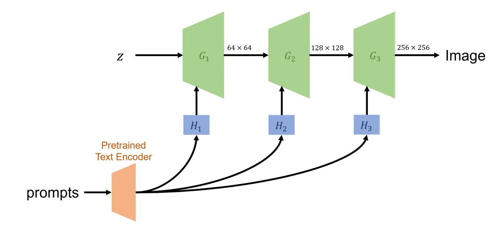

Fig. 3: High-level architecture of DM-GAN.

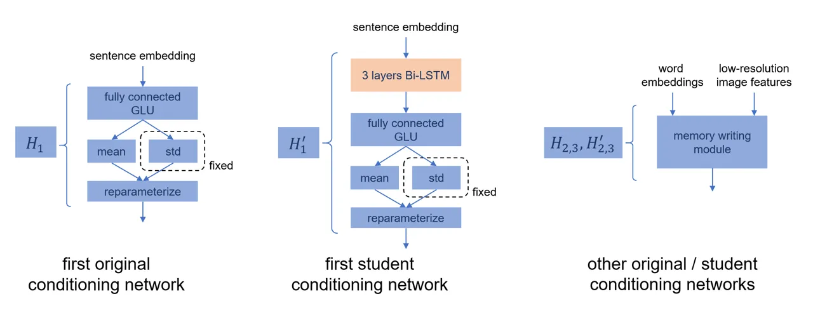

Fig. 4: High-level architecture of original and higher-capacity
conditioning networks of DM-GAN.

### B-B Visualization

In Fig. 5 - Fig. 8 , we visualize examples where we redact prompts that
contain long beak or white belly. In Fig. 9 - Fig. 12 , we visualize
examples where we redact prompts that contain blue wings or red wings.
In Fig. 13 - Fig. 16 , we visualize examples where we redact prompts
that contain blue. In Fig. 17 - Fig. 20 , we visualize examples where we
redact prompts that contain yellow or red.


(a) Pre-trained $`G(\cdot|c)`$

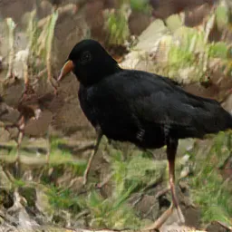

(b) Reference $`G(\cdot|\hat{c})`$

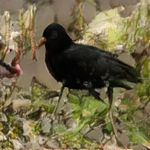

(c) Our Redaction $`G^{\prime}(\cdot|c)`$

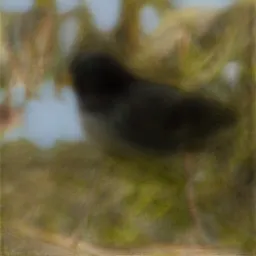

(d) Rewriting Baseline

Fig. 5: Redacted prompt: ‘‘this particular bird has a white belly and
breasts and black head and back’’. Reference prompt: ‘‘this particular
bird has a black belly and breasts and black head and back’’.


(a) Pre-trained $`G(\cdot|c)`$


(b) Reference $`G(\cdot|\hat{c})`$


(c) Our Redaction $`G^{\prime}(\cdot|c)`$


(d) Rewriting Baseline

Fig. 6: Redacted prompt: ‘‘this bird has feathers that are black and has
a white belly’’. Reference prompt: ‘‘this bird has feathers that are
black and has a black belly’’.


(a) Pre-trained $`G(\cdot|c)`$

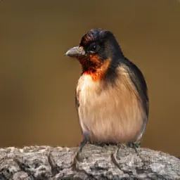

(b) Reference $`G(\cdot|\hat{c})`$

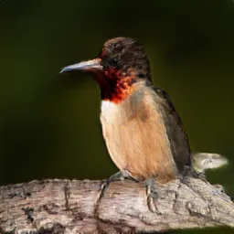

(c) Our Redaction $`G^{\prime}(\cdot|c)`$


(d) Rewriting Baseline

Fig. 7: Redacted prompt: ‘‘a small bird with an orange throat and long
beak’’. Reference prompt: ‘‘a small bird with an orange throat and short
beak’’.

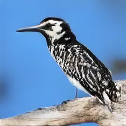

(a) Pre-trained $`G(\cdot|c)`$

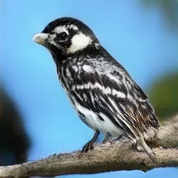

(b) Reference $`G(\cdot|\hat{c})`$

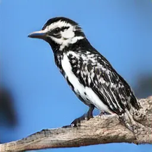

(c) Our Redaction $`G^{\prime}(\cdot|c)`$

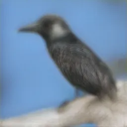

(d) Rewriting Baseline

Fig. 8: Redacted prompt: ‘‘the black and white bird has a sharp long
beak’’. Reference prompt: ‘‘the black and white bird has a sharp short
beak’’.

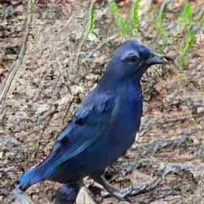

(a) Pre-trained $`G(\cdot|c)`$


(b) Reference $`G(\cdot|\hat{c})`$


(c) Our Redaction $`G^{\prime}(\cdot|c)`$

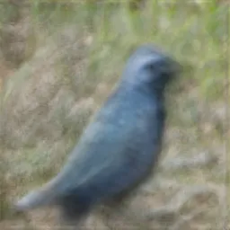

(d) Rewriting Baseline

Fig. 9: Redacted prompt: ‘‘this bird has wings that are blue and has
black feet’’. Reference prompt: ‘‘this bird has wings that are white and
has black feet’’.


(a) Pre-trained $`G(\cdot|c)`$


(b) Reference $`G(\cdot|\hat{c})`$


(c) Our Redaction $`G^{\prime}(\cdot|c)`$

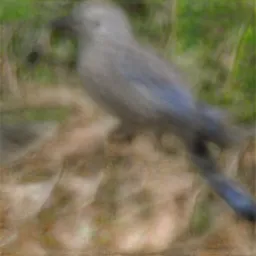

(d) Rewriting Baseline

Fig. 10: Redacted prompt: ‘‘this is a grey bird with blue wings and a
pointy beak’’. Reference prompt: ‘‘this is a grey bird with white wings
and a pointy beak’’.


(a) Pre-trained $`G(\cdot|c)`$


(b) Reference $`G(\cdot|\hat{c})`$


(c) Our Redaction $`G^{\prime}(\cdot|c)`$


(d) Rewriting Baseline

Fig. 11: Redacted prompt: ‘‘this bird has wings that are red and has a
white belly’’. Reference prompt: ‘‘this bird has wings that are white
and has a white belly’’.


(a) Pre-trained $`G(\cdot|c)`$


(b) Reference $`G(\cdot|\hat{c})`$


(c) Our Redaction $`G^{\prime}(\cdot|c)`$

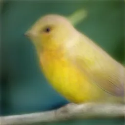

(d) Rewriting Baseline

Fig. 12: Redacted prompt: ‘‘this bird has wings that are red and has a
yellow belly’’. Reference prompt: ‘‘this bird has wings that are white
and has a yellow belly’’.

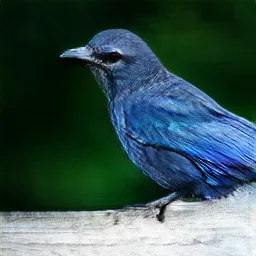

(a) Pre-trained $`G(\cdot|c)`$


(b) Reference $`G(\cdot|\hat{c})`$


(c) Our Redaction $`G^{\prime}(\cdot|c)`$

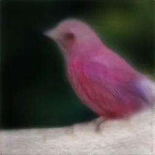

(d) Rewriting Baseline

Fig. 13: Redacted prompt: ‘‘this bird has wings that are blue and has
black feet’’. Reference prompt: ‘‘this bird has wings that are red and
has black feet’’.

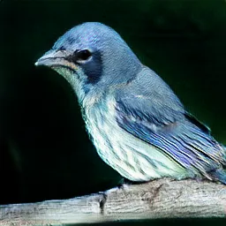

(a) Pre-trained $`G(\cdot|c)`$


(b) Reference $`G(\cdot|\hat{c})`$


(c) Our Redaction $`G^{\prime}(\cdot|c)`$

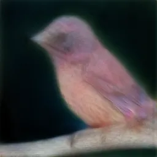

(d) Rewriting Baseline

Fig. 14: Redacted prompt: ‘‘this bird has small wings and blue grey
nape’’. Reference prompt: ‘‘this bird has small wings and red grey
nape’’.

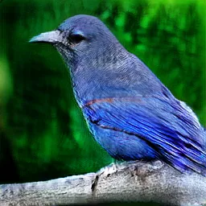

(a) Pre-trained $`G(\cdot|c)`$

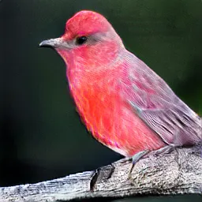

(b) Reference $`G(\cdot|\hat{c})`$


(c) Our Redaction $`G^{\prime}(\cdot|c)`$


(d) Rewriting Baseline

Fig. 15: Redacted prompt: ‘‘the bird is blue with gray wins and tail’’.
Reference prompt: ‘‘the bird is red with gray wins and tail’’.


(a) Pre-trained $`G(\cdot|c)`$


(b) Reference $`G(\cdot|\hat{c})`$


(c) Our Redaction $`G^{\prime}(\cdot|c)`$

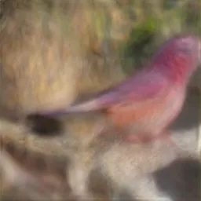

(d) Rewriting Baseline

Fig. 16: Redacted prompt: ‘‘this bird has wings that are blue and has a
white belly’’. Reference prompt: ‘‘this bird has wings that are red and
has a white belly’’.


(a) Pre-trained $`G(\cdot|c)`$

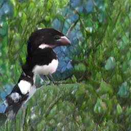

(b) Reference $`G(\cdot|\hat{c})`$


(c) Our Redaction $`G^{\prime}(\cdot|c)`$

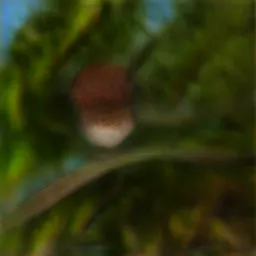

(d) Rewriting Baseline

Fig. 17: Redacted prompt: ‘‘this is a red bird with a white belly and a
large beak’’. Reference prompt: ‘‘this is a black bird with a white
belly and a large beak’’.


(a) Pre-trained $`G(\cdot|c)`$


(b) Reference $`G(\cdot|\hat{c})`$


(c) Our Redaction $`G^{\prime}(\cdot|c)`$


(d) Rewriting Baseline

Fig. 18: Redacted prompt: ‘‘a bird with thick short beak red crown red
breast that fades into a pink and white belly and red coverts’’.
Reference prompt: ‘‘a bird with thick short beak black crown black
breast that fades into a pink and white belly and black coverts’’.

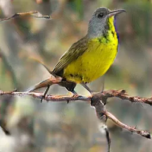

(a) Pre-trained $`G(\cdot|c)`$

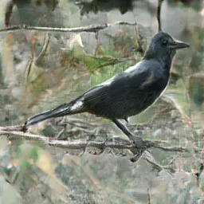

(b) Reference $`G(\cdot|\hat{c})`$

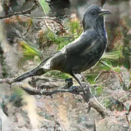

(c) Our Redaction $`G^{\prime}(\cdot|c)`$

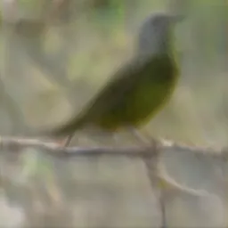

(d) Rewriting Baseline

Fig. 19: Redacted prompt: ‘‘this yellow breasted bird has a dark gray
head and chest a thin beak and a long tail’’. Reference prompt: ‘‘this
black breasted bird has a dark gray head and chest a thin beak and a
long tail’’.


(a) Pre-trained $`G(\cdot|c)`$

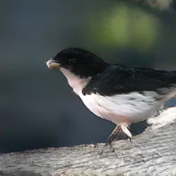

(b) Reference $`G(\cdot|\hat{c})`$

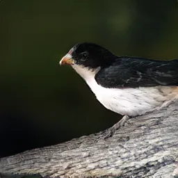

(c) Our Redaction $`G^{\prime}(\cdot|c)`$

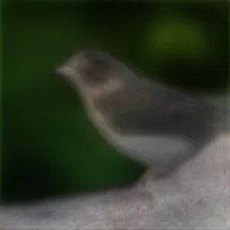

(d) Rewriting Baseline

Fig. 20: Redacted prompt: ‘‘the yellow and black bird has a white
belly’’. Reference prompt: ‘‘the black and black bird has a white
belly’’.

### B-C Adversarial Prompting Attack

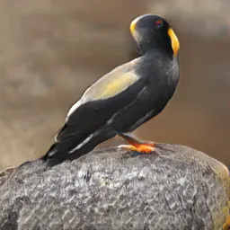

(a) Pre-trained $`G(\cdot|c)`$

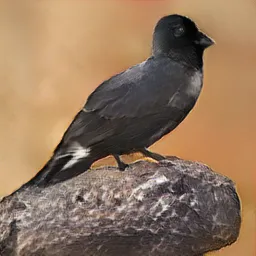

(b) Our Redaction $`G^{\prime}(\cdot|c)`$

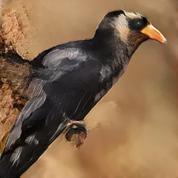

(c) Adversarial $`G^{\prime}(\cdot|c_{\mathrm{adv}})`$

Fig. 21: Redacted prompt: ‘‘a short yellow beak on an otherwise black
bird bright irises around black pupils’’. Adversarial prompt: ‘‘a short
yellow wingtip on yhellow otherwise wa bird bright irises around
dramatic pupils’’.


(a) Pre-trained $`G(\cdot|c)`$

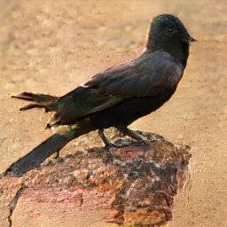

(b) Our Redaction $`G^{\prime}(\cdot|c)`$


(c) Adversarial $`G^{\prime}(\cdot|c_{\mathrm{adv}})`$

Fig. 22: Redacted prompt: ‘‘this is a colorful bird boasting a coral red
color strongest at head and fading towards tail’’. Adversarial prompt:
‘‘wingtip is a colorful bird boasting the coral red color strongest at
primary and fading towards tail’’.

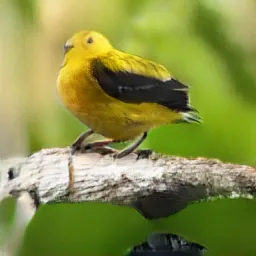

(a) Pre-trained $`G(\cdot|c)`$

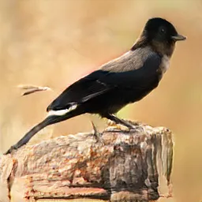

(b) Our Redaction $`G^{\prime}(\cdot|c)`$


(c) Adversarial $`G^{\prime}(\cdot|c_{\mathrm{adv}})`$

Fig. 23: Redacted prompt: ‘‘this small bird has a light yellow belly and
a dark yellow head with black wings and tail’’. Adversarial prompt:
‘‘this small bird the the light yellow belly and a dark yellow head with
black remaining and mahogany’’.

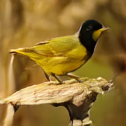

(a) Pre-trained $`G(\cdot|c)`$

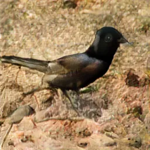

(b) Our Redaction $`G^{\prime}(\cdot|c)`$


(c) Adversarial $`G^{\prime}(\cdot|c_{\mathrm{adv}})`$

Fig. 24: Redacted prompt: ‘‘this bird is golden yellow with a black
head’’. Adversarial prompt: ‘‘through mahogany wingtip golden yellow bed
a black head’’.

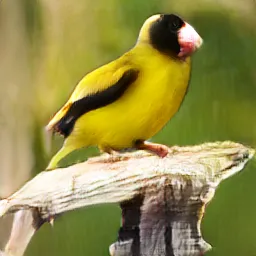

(a) Pre-trained $`G(\cdot|c)`$

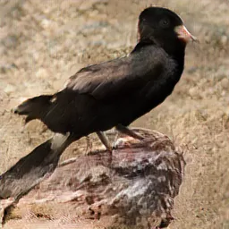

(b) Our Redaction $`G^{\prime}(\cdot|c)`$

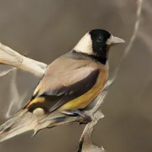

(c) Adversarial $`G^{\prime}(\cdot|c_{\mathrm{adv}})`$

Fig. 25: Redacted prompt: ‘‘this bird has a golden yellow body a black
head a pink bill that curves downward’’. Adversarial prompt: ‘‘mahogany
the has blacker golden yellow basically a black head a primary bill that
through hughed’’.

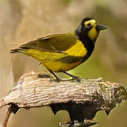

(a) Pre-trained $`G(\cdot|c)`$

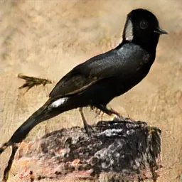

(b) Our Redaction $`G^{\prime}(\cdot|c)`$

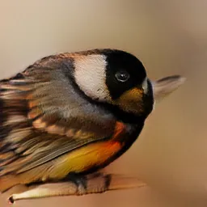

(c) Adversarial $`G^{\prime}(\cdot|c_{\mathrm{adv}})`$

Fig. 26: Redacted prompt: ‘‘this bird has a black beak a black crown and
a belly that is golden yellow’’. Adversarial prompt: ‘‘mahogany love has
a riangular love bed black crown and a dramatic hjas breadt golden
yellow’’.

## Appendix C Additional Details and Experiments for Redaction from DiffWave

### C-A Details of the Pre-trained Model and the Proposed Student Networks

The high-level architecture of DiffWave is shown in Fig. 27. We select
the base (64 channels) version of the model. The model is conditioned on
80-band Mel-spectrogram with FFT size$`=1024`$, hop size$`=256`$, and
window size$`=1024`$. Each conditioning network has two up-sampling
layers that up-sample the spectrogram, and a one-dimensional convolution
layer that maps the number of channels to 128. We use the pre-trained
model and code from
[https://github.com/philsyn/DiffWave-Vocoder](https://github.com/philsyn/DiffWave-Vocoder)
under MIT license, which is trained on all LJSpeech samples except for
LJ001 and LJ002, which is used as the test set. The pre-trained model
takes days to train on 8 GPUs.


Fig. 27: High-level architecture of DiffWave.

For the additional layers in the improved capacity configuration, all
convolutions are one-dimensional with kernel size $`=1`$.
$`h_{\mathrm{trans}}`$ includes two convolutions that keep the channels
($`=80`$) and a leaky ReLU activation with negative slope $`=0.4`$
between. $`h_{\mathrm{gate}}`$ includes one zero-initialized convolution
that changes channels from 80 to 128 followed by a sigmoid activation.
The architecture of student conditioning networks with improved capacity
is shown in Fig. 28.


Fig. 28: High-level architecture of original and higher-capacity
conditioning networks of DiffWave.

### C-B Evaluation Metrics

The metrics for speech quality are as follows.

1.  1.  Perceptual Evaluation of Speech Quality \[72\], or PESQ, measures
        the quality of generated speech. It ranges between -0.5 and 4.5 and
        is higher for better quality.
2.  2.  Short-Time Objective Intelligibility \[73\], or STOI, measures the
        intelligibility of generated speech. It ranges between 0% and 100%
        and is higher for better intelligibility.

The voice classifier is trained and tested on audio clips with 0.7256
second. For each audio clip, we extract 20-dimensional Mel-frequency
cepstral coefficients \[74\], 7-dimensional spectral contrast \[75\],
and 12-dimensional chroma features \[76\]. The classifier is a support
vector classifier with the radial basis function kernel with
regularization coefficient $`=1`$.
