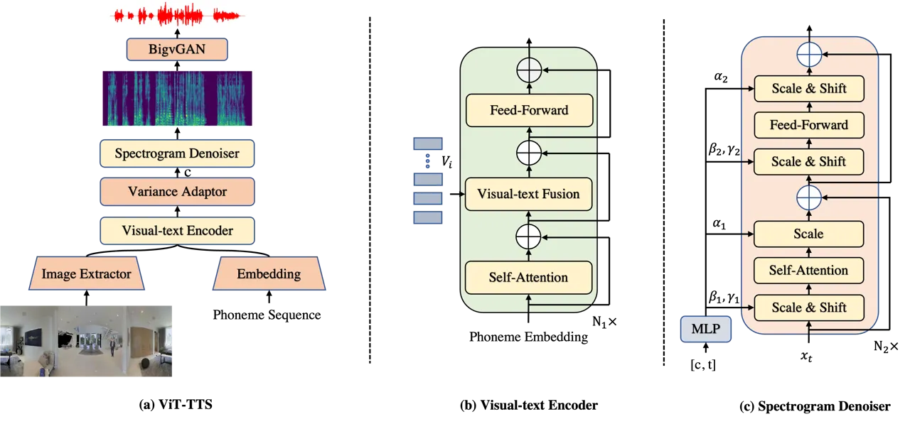
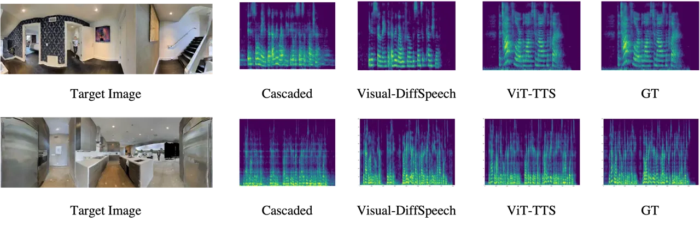
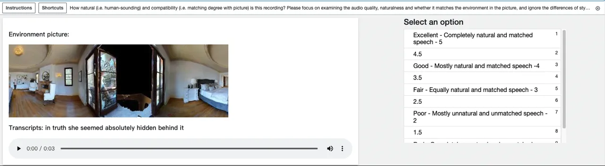

# ViT-TTS: Visual Text-to-Speech with Scalable Diffusion Transformer

Huadai Liu ^(†)^(†)thanks: ˜˜Equal contributions
Email: <liuhuadai@zju.edu.cn>    Rongjie Huang¹¹footnotemark: 1
Email: <rongjiehuang@zju.edu.cn>    Xuan Lin¹¹footnotemark: 1
Email: <jinzhenghe@zju.edu.cn>    Wenqiang Xu
Email: <zhaozhou@zju.edu.cn>    Maozong Zheng
Email: [daxuan.lx@antgroup.com](mailto:)    Hong Chen
Email: [yugong.xwq@antgroup.com](mailto:)    Jinzheng He
Email: [zhengmaozong.zmz@antgroup.com](mailto:)    Zhou Zhao
^(†)^(†)thanks: ˜˜Corresponding author
Email: [wuyi.ch@antgroup.com](mailto:)    Zhejiang University    Ant
Group

###### Abstract

Text-to-speech(TTS) has undergone remarkable improvements in
performance, particularly with the advent of Denoising Diffusion
Probabilistic Models (DDPMs). However, the perceived quality of audio
depends not solely on its content, pitch, rhythm, and energy, but also
on the physical environment. In this work, we propose ViT-TTS, the first
visual TTS model with scalable diffusion transformers. ViT-TTS
complement the phoneme sequence with the visual information to generate
high-perceived audio, opening up new avenues for practical applications
of AR and VR to allow a more immersive and realistic audio experience.
To mitigate the data scarcity in learning visual acoustic information,
we 1) introduce a self-supervised learning framework to enhance both the
visual-text encoder and denoiser decoder; 2) leverage the diffusion
transformer scalable in terms of parameters and capacity to learn visual
scene information. Experimental results demonstrate that ViT-TTS
achieves new state-of-the-art results, outperforming cascaded systems
and other baselines regardless of the visibility of the scene. With
low-resource data (1h, 2h, 5h), ViT-TTS achieves comparative results
with rich-resource baselines. ¹¹ 1 Audio samples are available at
[https://ViT-TTS.github.io/.](https://ViT-TTS.github.io/.)²² 2 Code is
available at
[https://github.com/liuhuadai/ViT-TTS/](https://github.com/liuhuadai/ViT-TTS/)

## 1 Introduction

Text-to-speech (TTS) (Ren et al., 2019; Huang et al., 2022a; Huang
et al., 2022b) aims to synthesize audios that is consistent with the
reference samples in terms of semantic meaning, timbre, emotions, and
melody, and has shown remarkable advancements with the advent of
Denoising Diffusion Probabilistic Models (DDPMs). However, the perceived
audio quality is not solely determined by these aspects, as it is also
influenced by the surrounding physical environment. For instance, a room
with hard surfaces like concrete or glass reflects sound waves, whereas
a room with soft surfaces such as carpets or curtains absorbs them. This
variance can drastically impact the clarity and quality of the sound we
hear.

To ensure an authentic and captivating experience, it is imperative to
accurately model the acoustics of a room, particularly in virtual
reality (VR) and augmented reality (AR) applications. Recent years have
seen a surge in significant research Li et al. (2022); Radford et al.
(2021); Li et al. (2023); Huang et al. (2023b) addressing the
language-visual modeling problem. For instance,  Li et al. (2022) have
proposed a unified video-language pre-training framework for learning
robust representation, while  Radford et al. (2021) have focused on
large-scale image-text pairs pre-training via contrastive learning.
Visual TTS open-ups numerous practical applications, including dubbing
archival films, providing a more immersive and realistic experience in
virtual and augmented reality, or adding appropriate sound effects to
games.

Despite the benefits of language-visual approaches, training visual TTS
models typically requires a large amount of training data, while there
are very few resources providing parallel text-visual-audio data due to
the heavy workload. Besides, creating a sound experience that matches
the visual content remains challenging when developing AR/VR
applications, as it is still unclear how various regions of the image
contribute to reverberation and how to incorporate the visual modality
as auxiliary information in TTS.

In this work, we formulate the task of visual TTS to generate audio with
reverberation effects in target scenarios given a text and environmental
image, introducing ViT-TTS to address the issues of data scarcity and
room acoustic modeling. To enhance visual-acoustic matching, we 1)
propose the visual-text fusion to integrate visual and textual
information, which provides fine-grained language-visual reasoning by
attending to regions of the image; 2) leverage transformer architecture
to promote the scalability of the diffusion model. Regarding the data
shortage challenge, we pre-train the encoder and decoder in a
self-supervised manner, showing that large-scale pre-training reduces
data requirements for training visual TTS models.

Experiments results demonstrate that ViT-TTS generates speech samples
with accurate reverberation effects in target scenarios, achieving new
state-of-the-art results in terms of perceptual quality. In addition, we
investigate the scalability of ViT-TTS and its performance under
low-resource conditions (1h/2h/5h). The main contributions of this work
are summarized as follows:

- •
  We propose the first visual Text-to-Speech model ViT-TTS with
  vision-text fusion, which enables the generation of high-perceived
  audio that matches the physical environment.
- •
  We show that large-scale pre-training alleviates the data scarcity in
  training visual TTS models.
- •
  We introduce the diffusion transformer scalable in terms of parameters
  and capacity to learn visual scene information.
- •
  Experimental results on subjective and objective evaluation
  demonstrate the state-of-the-art results in terms of perceptual
  quality. With low-resource data (1h, 2h, 5h), ViT-TTS achieves
  comparative results with rich-resource baselines.

## 2 Related Work

### 2.1 Text-To-Speech

Text-to-Speech(TTS) tasks are divided into two categories: (1)
generating a mel-spectrogram from text or phoneme sequence first Wang
et al. (2017); Ren et al. (2019), and then converting the generated
spectrum into a waveform via vocoder Kong et al. (2020); Lee et al.
(2022); Huang et al. (2022a); (2) generating audio directly from
text Donahue et al. (2020); Kim et al. (2021). The earlier TTS Li et al.
(2019); Wang et al. (2017) models adopt an autoregressive manner, which
suffers from the problem of slow inference speed. As a solution,
non-autoregressive models have been proposed to enable fast inference by
generating mel-spectrograms in parallel. More recently, Grad-TTS Popov
et al. (2021), DiffSpeech MoonInTheRiver (2021), and ProDiff Huang
et al. (2022c) have employed diffusion generative models to generate
high-quality audio, but they all rely on the convolutional architecture
such as WaveNet Oord et al. (2016) and U-Net Ronneberger et al. (2015)
as the backbone. In contrast, some studies Peebles and Xie (2023); Bao
et al. (2023) in image generation tasks have explored
transformers Vaswani et al. (2017) as an alternative to convolutional
architectures, achieving competitive results with U-Net. In this paper,
we present the first transformer-based diffusion model as an alternative
of convolutional architecture. By harnessing the scalable properties of
transformers, we enhance the model capacity to more effectively capture
visual scene information and promote the model performance.

### 2.2 Self-supervised Pre-training

There are two main criteria for optimizing speech pre-training:
contrastive loss Oord et al. (2018); Chung and Glass (2020); Baevski
et al. (2020) and masked prediction loss Devlin et al. (2018).
Contrastive loss is used to distinguish between positive and negative
samples with respect to a reference sample, while masked prediction loss
is originally proposed for natural language processing Devlin et al.
(2018); Lewis et al. (2019) and later applied to speech
processing Baevski et al. (2020); Hsu et al. (2021). Some recent
work Chung et al. (2021) has combined the two approaches, achieving good
performance for downstream automatic speech recognition (ASR) tasks. In
this work, we leverage the success of self-supervised to enhance both
the encoder and decoder to alleviate the data scarcity issue.

### 2.3 Acoustic Matching

The primary objective of acoustic matching is to convert audio from a
source environment into audio that resembles the target environment. In
the field of blind estimation Mack et al. (2020); Xiong et al. (2018);
Murgai et al. (2017); Mezghani and Swindlehurst (2018), acoustic
matching is applied to generate a simple room impulse response (RIR)
that can be used to synthesize the corresponding target audio using two
critical acoustic metrics - the direct-to-reverberant ratio
(DRR) Zahorik (2002) and the reverberation time 60 (RT60) Ratnam et al.
(2003).



Figure 1: The overall architecture for ViT-TTS. In subfigure (b),
$`V_{i}`$ denotes the visual sequence and $`N_{1}`$ denotes the layers
of Encoder. In subfigure (c), $`N_{2}`$ is the number of transformer
layers. $`\alpha`$ and $`\beta`$ are the dimension-wise scale
parameters, while $`\gamma`$ is the dimension-wise shift parameters. c
is the variance adaptor’s output and t is the diffusion step.

The music production community also implements acoustic matching to
modify the reverberation, thus simulating the reverberation of the
target space or processing algorithm Koo et al. (2021); Sarroff and
Michaels (2020). Recently, there is research on visual acoustic
matching Chen et al. (2022), which involves generating audio recorded in
the target environment based on the input source audio clip and an image
of the target environment. However, our proposed visual TTS is distinct
from those mentioned above as as it aims to generate audio that captures
the room acoustics in the target environment based on the written text
and the target environment image.

## 3 Method

### 3.1 Overview

The overall architecture has been presented as Figure  1. To alleviate
the issue of data scarcity, we leverage unlabeled data to pre-train the
visual-text encoder and denoiser decoder with scalable transformers in a
self-supervised manner. To capture the visual scene information, we
employ the visual-text fusion module to reason about how different image
patches contribute to texts. BigvGAN (Lee et al., 2022) converts the
mel-spectrograms into audio that matches the target scene as a neural
vocoder.

### 3.2 Enhanced visual-text Encoder

#### Self-supervised Pre-training

The advent of the masked language model Devlin et al. (2018); Clark
et al. (2020) has marked a significant milestone in the field of natural
language processing. To alleviate the data scarcity issue (Huang et al.,
2022d; Liu et al., 2023; Huang et al., 2023c) and learn robust
contextual encoder, we are encouraged to adopt the masking strategy like
BERT in the pre-training stage. Specifically, we randomly mask the
$`15\%`$ of each phoneme sequence and predict those masked tokens rather
than reconstructing the entire input. The masked phoneme sequence is
then input into the text encoder to obtain hidden states. The final
hidden states are fed into a linear projection layer over the vocabulary
to obtain the predicted tokens. Finally, we calculate the cross entropy
loss between the predicted tokens and target tokens.

The masked token during the pre-training phase will not be used in the
fine-tuning phase. To mitigate this mismatch between the pre-training
and fine-tuning, we randomly choose the phonemes to be masked: 1) 80%
probability to add masks; 2) 10% probability to keep phoneme unchanged,
and 3) 10% probability to replace with a random token in the dictionary.

#### Visual-Text Fusion

In the fine-tuning stage, we integrate the visual modal and module into
the encoder to integrate visual and textual information. Before feeding
into the visual-text encoder, we first extract image features of
panoramic images through ResNet18 (Oord et al., 2018) and obtain phoneme
embedding. Both the image features and phoneme embedding are fed into
one of the variants of the transformer to get the hidden sequences.
Specifically, we first pass the phoneme through relative self-attention,
which is defined as follows:

```math
\alpha(i,j)=Softmax(\frac{(Q_{i}W^{Q})(K_{j}W^{K}+R_{ij})^{T}}{\sqrt{d_{k}}}) \tag{1}
```

where n is the length of phoneme embedding, $`R_{ij}`$ are the relative
position embedding of key and value, $`d_{k}`$ is the dimension of key,
and Q, K, V are all the phoneme embedding. We use relative
self-attention to model how much phoneme $`p_{i}`$ attends to phoneme
$`p_{j}`$. After that, we choose to use cross-attention instead of a
simplistic concatenation approach as we can reason about how different
image patches contribute to the text after feature extraction. The
equation is defined as follows:

```math
\delta(V,P)=Softmax(\frac{PV^{T}}{\sqrt{d_{v}}})V \tag{2}
```

where P is the phoneme embedding, V is the visual features, and
$`d_{v}`$ is the dimension of vision features. Finally, the feed-forward
layer is applied to output the hidden sequence.

### 3.3 Enhanced Diffusion Transformer

#### Scalable Transformer

As a rapidly growing category of generative models, DDPMs have
demonstrated their exceptional ability to deliver top-notch results in
both image (Zhang and Agrawala, 2023; Ho and Salimans, 2022) and audio
synthesis (Huang et al., 2022c; Huang et al., 2023a; Lam et al., 2021).
However, the most dominant diffusion TTS models adopt a convolutional
architecture like WaveNet or U-Net as the de-factor choice of backbone.
This architectural choice limits the model scalability to effectively
incorporate panoramic visual images. Recent research (Peebles and Xie,
2023; Bao et al., 2023) in the image synthesis field has revealed that
the inductive bias of convolutional structures is not a critical
determinant of DDPMs’ performance. Instead, transformers have emerged as
a viable alternative.

For this reason, we propose a diffusion transformer that leverages the
scalability of transformers to expand model capacity and incorporate
room acoustic information. Moreover, we leverage the adaptive
normalization layers in GANs and initialize the full transformer block
as the identity function to enhance the transformer architecture.

#### Unconditional Pre-training

In this part, we investigate self-supervised learning from orders of
magnitude mel-spectrograms data to alleviate data scarcity.
Specifically, assuming the target mel-spectrogram is $`{\bm{x}}_{0}`$,
we first random select 0.065% of $`{\bm{x}}_{0}`$ as starting indices
and apply a mask that spans 10 steps following the Wav2vec2.0 Baevski
et al. (2020). Then, we obtain $`{\bm{x}}_{t}`$ through a diffusion
process, which is defined by a fixed Markov chain from data
$`{\bm{x}}_{0}`$ to the latent variable $`{\bm{x}}_{t}`$.

```math
q({\bm{x}}_{1},\cdots,{\bm{x}}_{T}|{\bm{x}}_{0})=\prod_{t=1}^{T}q({\bm{x}}_{t}|{\bm{x}}_{t-1}),\quad\ \  \tag{3}
```

At each diffusion step $`t\in[1,T]`$, a tiny Gaussian noise is added to
$`{\bm{x}}_{t-1}`$ to obtain $`{\bm{x}}_{t}`$, according to a small
positive constant $`\beta_{t}`$:

```math
q({\bm{x}}_{t}|{\bm{x}}_{t-1}):={\mathcal{N}}({\bm{x}}_{t};\sqrt{1-\beta_{t}}{\bm{x}}_{t-1},\beta_{t}{\mathbf{I}}) \tag{4}
```

$`x_{t}`$ obtained from the diffusion process is passed through the
transformer to predict Gaussian noise $`\bm{\epsilon}_{\theta}`$. Loss
is defined as mean squared error in the $`\bm{\epsilon}`$ space, and
efficient training is optimizing a random term of $`t`$ with stochastic
gradient descent:

```math
{\mathcal{L}}_{\theta}^{\text{Grad}}=\left\lVert\bm{\epsilon}_{\theta}\left(\alpha_{t}{\bm{x}}_{0}+\sqrt{1-\alpha_{t}^{2}}\bm{\epsilon}\right)-\bm{\epsilon}\right\rVert_{2}^{2},\bm{\epsilon}\sim{\mathcal{N}}({\bm{0}},{\mathbf{I}}) \tag{5}
```

To this end, ViT-TTS takes advantage of the reconstruction loss to
predict the self-supervised representations which largely alleviates the
challenges of data scarcity. Detailed formulation of DDPM has been
attached in Appendix C.

#### Controllable Fine-tuning

During the fine-tuning stage, we will face the following challenges: (1)
there is a data scarcity issue with the available panoramic images and
target environmental audio for training; (2) a fast training method is
equally crucial for optimizing the diffusion model, as it can save a
significant amount of time and storage space. To address these
challenges, we draw inspiration from  Zhang and Agrawala (2023) and
implement a swift fine-tuning technique. Specifically, we create two
copies of the pre-trained diffusion model weights, namely a "trainable
copy" and a "locked copy," to learn the input conditions. We fix all
parameters of the pre-trained transformer, designated as $`\Theta`$, and
duplicate them into a trainable parameter $`\Theta_{t}`$. We train these
trainable parameters and connect them with the "locked copy" via zero
convolution layers. These convolution layers are unique as they have a
kernel size of one by one and weights and biases set to zero,
progressively growing from zeros to optimized parameters in a learned
fashion.

### 3.4 Architecture

As illustrated in Figure 1, our model comprises a visual-text encoder,
variance adaptor, and spectrogram denoiser. The visual-text encoder
converts phoneme embeddings and visual features into hidden sequences,
while the variance adaptor predicts the duration of each hidden sequence
to regulate the length of the hidden sequences to match that of speech
frames. Furthermore, different variances like pitch and speaker
embedding are incorporated with hidden sequences following FastSpeech
2 Ren et al. (2022). Finally, the spectrogram denoiser iteratively
refines the length-regulated hidden states into mel-spectrograms. We put
more details in Appendix B.

Visual-Text Encoder The visual-text encoder consists of relative
position transformer blocks based on the transformer architecture.
Specifically, it convolves a pre-net for phoneme embedding, a visual
feature extractor for image, and a transformer encoder which includes
multi-head self-attention, multi-head cross-attention, and feed-forward
layer.

Variance Adaptor In variance adaptor, the duration and pitch predictors
share a similar model structure consisting of a 2-layer 1D-convolutional
network with ReLU activation, each followed by the layer normalization
and the dropout layer, and an extra linear layer to project the hidden
states into the output sequence.

Spectrogram Denoiser Spectrogram denoiser takes in $`{\bm{x}}_{t}`$ as
input to predict $`\bm{\epsilon}`$ added in diffusion process
conditioned on the step embedding $`E_{t}`$ and encoder output. We adopt
a variant of the transformer as our backbone and make some improvements
upon the standard transformer motivated by Peebles and Xie (2023),
mainly includes:(1) we explore replacing standard layer norm layers in
transformer blocks with adaptive layer norm (adaLN) to regress scale and
shift parameters from the sum of the embedding vector of t and hidden
sequence. (2) Inspired by ResNets Oord et al. (2018), we initialize the
transformer block as the identity function and initialize the MLP to
output the zero-vector.

### 3.5 Pre-training, Fine-tuning, and Inference Procedures

#### Pre-training

The pre-training has two stages: 1) encoder stage: pre-train the
visual-text encoder vias masked LM loss $`{\mathcal{L}}_{CE}`$ (ie.
cross-entropy loss) to predict the masked tokens. 2) decoder stage: the
masked $`{\bm{x}}_{0}`$ is puted into denoiser to predict Gaussian noise
$`\bm{\epsilon}_{\theta}`$. Then, the Mean Square Error(MSE) loss is
applied to the predicted Gaussian noise and target Gaussian noise.

#### Fine-tuning

We begin by loading model weights from the pre-trained visual-text
encoder and unconditional diffusion decoder, after which we finetune
both of them until the model converges. The final loss term consists of
the following parts: (1) sample reconstruction loss
$`{\mathcal{L}}_{\theta}`$: MSE between the predicted Gaussian noise and
target Gaussian noise. (2) variance reconstruction loss
$`{\mathcal{L}}_{dur},{\mathcal{L}}_{p}`$: MSE between the predicted and
the target phoneme-level duration, pitch.

#### Inference

During inference, DDPM iteratively runs the reverse process to obtain
the data sample $`{\bm{x}}_{0}`$, and then we use a pre-trained
BigvGAN-16khz-80band as the vocoder to transform the generated
mel-spectrograms into waveforms.

## 4 Experiment

|                |                   |                      |                      |                   |                      |                      |         |
| -------------- | ----------------- | -------------------- | -------------------- | ----------------- | -------------------- | -------------------- | ------- |
| Method         | Test-Seen         |                      |                      | Test-Unseen       |                      |                      | Params  |
|                | MOS($`\uparrow`$) | RTE ($`\downarrow`$) | MCD ($`\downarrow`$) | MOS($`\uparrow`$) | RTE ($`\downarrow`$) | MCD ($`\downarrow`$) |         |
| GT             | 4.34$`\pm`$0.07   | /                    | /                    | 4.24$`\pm`$0.07   | /                    | /                    | /       |
| GT (voc.)      | 4.18$`\pm`$0.05   | 0.006                | 1.46                 | 4.19$`\pm`$0.07   | 0.008                | 1.50                 | /       |
| WaveNet        | 3.85$`\pm`$0.09   | 0.091                | 4.61                 | 3.78$`\pm`$0.12   | 0.110                | 4.69                 | 42.3M   |
| Transformer-S  | 3.92$`\pm`$0.07   | 0.068                | 4.57                 | 3.80$`\pm`$0.06   | 0.077                | 4.68                 | 32.38M  |
| Transformer-B  | 3.98$`\pm`$0.06   | 0.061                | 4.53                 | 3.90$`\pm`$0.07   | 0.066                | 4.62                 | 41.36M  |
| Transformer-L  | 4.02$`\pm`$0.08   | 0.056                | 4.37                 | 3.95$`\pm`$0.07   | 0.061                | 4.50                 | 56.96M  |
| Transformer-XL | 4.05$`\pm`$0.07   | 0.047                | 4.35                 | 4.00$`\pm`$0.05   | 0.053                | 4.39                 | 115.12M |

Table 1: Comparison between the diffusion WaveNet and diffusion
transformers sweeping over model config(S, B, L, XL). All models remove
the pre-training stage and other conditions not related to backbone in
training and inference remain the same.

### 4.1 Experimental Setup

#### Dataset

We use the SoundSpaces-Speech dataset Chen et al. (2023), which is
constructed on the SoundSpaces platform based on real-world 3D scans to
obtain environmental audio. The dataset includes 28,853/1,441/1,489
samples for training/validation/testing, each consisting of clean text,
reverberant audio, and panoramic camera angle images. Following  Chen
et al. (2022), we remove out-of-view samples and divide the test set
into test-unseen and test-seen, where the unseen set injects room
acoustics depicted in novel images while the seen set only contains the
scenes we have seen in the training stage. We convert the text sequence
into the phoneme sequence with an open-source grapheme-to-phoneme
conversion tool Sun et al. (2019) ³³ 3
[https://github.com/Kyubyong/g2p](https://github.com/Kyubyong/g2p).

Following the common pratice Ren et al. (2019); MoonInTheRiver (2021),
we conduct preprocessing on the speech and text data: 1) extract the
spectrogram with the FFT size of 1024, hop size of 256, and window size
of 1024 samples; 2) convert it to a mel-spectrogram with 80 frequency
bins; and 3) extract F0 (fundamental frequency) from the raw waveform
using Parselmouth tool ⁴⁴ 4
[https://github.com/YannickJadoul/Parselmouth](https://github.com/YannickJadoul/Parselmouth).

Model Configurations The size of the phoneme vocabulary is 73. The
dimension of phoneme embeddings and the hidden size of the visual-text
transformer block are both 256. We use the pre-trained ResNet18 as an
image feature extractor. As for the pitch encoder, the size of the
lookup table and encoded pitch embedding are set to 300 and 256. In the
denoiser, the number of transformer-B layers is 5 with the hidden size
384 and head 12. We initialize each transformer block as the identity
function and set T to 100 and $`\beta`$ to constants increasing linearly
from $`\beta_{1}`$ = $`10^{-4}`$ to $`\beta_{T}`$ = 0.06. We have
attached more detailed information on the model configuration in
Appendix B

Pre-training, Fine-tuning, and Inference During the pre-training stage,
we pre-train the encoder for 120k steps and the decoder for 160k until
convergence. The diffusion probabilistic models have been trained using
1 NVIDIA A100 GPU with a batch size of 48 sentences. In the inference
stage, we uniformly use a pre-trained BigvGAN-16khz-80band (Lee et al., 2022) as a vocoder to transform the generated mel-spectrograms into
waveforms.

|                   |                    |                      |                      |                    |                      |                      |        |
| ----------------- | ------------------ | -------------------- | -------------------- | ------------------ | -------------------- | -------------------- | ------ |
| Method            | Test-Seen          |                      |                      | Test-Unseen        |                      |                      | Params |
|                   | MOS ($`\uparrow`$) | RTE ($`\downarrow`$) | MCD ($`\downarrow`$) | MOS ($`\uparrow`$) | RTE ($`\downarrow`$) | MCD ($`\downarrow`$) |        |
| GT                | 4.34$`\pm`$0.07    | /                    | /                    | 4.24$`\pm`$0.07    | /                    | /                    | /      |
| GT(voc.)          | 4.18$`\pm`$0.05    | 0.006                | 1.46                 | 4.19$`\pm`$0.07    | 0.008                | 1.50                 | /      |
| DiffSpeech        | 3.79$`\pm`$0.08    | 0.104                | 4.65                 | 3.67$`\pm`$0.05    | 0.120                | 4.71                 | 29.9M  |
| ProDiff           | 3.76$`\pm`$0.13    | 0.121                | 4.67                 | 3.65$`\pm`$0.06    | 0.137                | 4.72                 | 29.9M  |
| Visual-DiffSpeech | 3.85$`\pm`$0.09    | 0.091                | 4.61                 | 3.78$`\pm`$0.12    | 0.110                | 4.69                 | 42.3M  |
| Cascaded          | 3.61$`\pm`$0.08    | 0.071                | 5.13                 | 3.59$`\pm`$0.08    | 0.082                | 5.25                 | 146.5M |
| ViT-TTS           | 3.95$`\pm`$0.06    | 0.066                | 4.52                 | 3.86$`\pm`$0.05    | 0.076                | 4.59                 | 41.3M  |

Table 2: Comparison with baselines on the SoundSpaces-Speech for Seen
and Unseen scenarios. The diffusion step of all diffusion models is set
to 100. We use the pre-trained model provided by VAM for the evaluation
of cascaded.

### 4.2 Scalable Diffusion Transformer

We compare and examine diffusion transformer sweeping over model
config(S, B, L, XL), and conduct evaluations in terms of audio quality
and parameters. Appendix A gives the details of the model configs. The
results have been shown in Table  1. We have some observations from the
results: (1) Increasing the depth and number of layers in the
transformer can significantly enhance the performance of the diffusion
model, resulting in an improvement in both objective metrics and
subjective metrics, which demonstrates that expanding the model size
enables finer-grained room acoustic modeling. (2) Our proposed diffusion
transformer outperforms WaveNet backbone under similar parameters across
both test-unseen and test-seen sets, significantly in the rt60 metric.
We attribute this to the fact that instead of directly concatenating the
condition input like WaveNet, we replace standard layer norm layers in
transformer blocks with adaptive layer norm to regress dimension-wise
scale and shift parameters from the sum of the embedding vectors of
diffusion step and encoder output, which can better incorporate the
conditional information, as proven in GANs Brock et al. (2018); Karras
et al. (2019).

### 4.3 Model Performances

In this study, we conduct a comprehensive comparison of the generated
audio quality with other systems, including 1) GT, the ground-truth
audio; 2) GT(voc.), where we first convert the groud-truth audio into
mel-spectrograms and then convert them to audio using BigvGAN; 3)
DiffSpeech (MoonInTheRiver, 2021), one of the most popular DDPM based on
WaveNet; 4)ProDiff (Huang et al., 2022c), a recent generator-based
diffusion model proposed to reduce the sampling time;
5)Visual-DiffSpeech, incorporate visual-text fusion module into
DiffSpeech; 6) Cascaded, the system composed of DiffSpeech and Visual
Acoustic Matching(VAM) (Chen et al., 2022). The results, compiled and
presented in Table 2, provide valuable insights into the effectiveness
of our approach:

\(1\) As expected, the results in the test-unseen set do poorer than the
test-seen part because there are invisible scenarios among the
test-unseen set. However, our proposed model has achieved the best
performance compared to baseline systems in both sets, indicating that
our model generates the best-perceived audio that matches the target
environment from written text. (2) Our model surpassed TTS diffusion
models(i.e.DiffSpeech and ProDiff) across all metric scores, especially
in terms of RTE values. This suggests that conventional diffusion models
in TTS do poorly in modeling room acoustic information, as they mainly
focus on audio content, pitch, energy, etc. Our proposed visual-text
fusion module addresses this challenge by injecting visual properties
into the model, resulting in a more accurate prediction of the correct
acoustics from images and high-perceived audio synthesis. (3) The
results of comparison with Visual-DiffSpeech highlight the advantages of
our choice of transformer and self-supervised pre-training. Although
Visual-DiffSpeech adds the visual-text module, the choice of WaveNet and
the lack of a self-supervised pre-training strategy make it perform
worse in predicting the correct acoustics from images and synthesizing
high-perceived audio. (4) The cascaded system composed of DiffSpeech and
Visual Acoustic Matching model visual properties is better than other
baselines. However, compared to our proposed model, it performed worse
in both test-unseen and test-seen environments. This suggests that our
direct visual text-to-speech system eliminates the influence of error
propagation caused by the cascaded manner, resulting in high-perceived
audio. In conclusion, our comprehensive evaluation results demonstrate
the effectiveness of our proposed model in generating high-quality audio
that matches the target environment.



Figure 2: Visualizations of the ground truth and generated
mel-spectrograms by different Visual TTS models. The text corresponding
to the first line in test-seen is "it is so made that everywhere we feel
the sense of punishment" while the second line in test-unseen is "the
task will not be difficult returned david hesitating though i greatly
fear your presence would rather increase than mitigate his unhappy
fortunes ".

### 4.4 Low Resource Evaluation

Training visual text-to-speech models typically requires a large amount
of parallel target environment image and audio training data, while
there may be very few resources due to the heavy workload. In this
section, we prepare low-resource audio-visual data (1h/2h/5h) and
leverage large-scale text-only and audio-only data to boost the
performance of the visual TTS system, to investigate the effectiveness
of our self-supervised learning methods. The results are compiled and
presented in Table 3, and we have the following observations: 1)As
training data is reduced in the low-resource scenario, a distinct
degradation in generated audio quality could be witnessed in both test
sets (test-seen and test-unseen). 2) Leveraging orders of magnitude
text-only and audio-only data with self-supervised learning, the ViT-TTS
achieve RTE scores of 0.082 and 0.068 respectively in test-unseen and
test-seen, showing a significant promotion regardless of the unseen
scene. In this way, the dependence on a large number of parallel
audio-visual data can be reduced for constructing visual text-to-speech
systems.

|                            |                    |                      |                      |
| -------------------------- | ------------------ | -------------------- | -------------------- |
| Method                     | MOS ($`\uparrow`$) | RTE ($`\downarrow`$) | MCD ($`\downarrow`$) |
| Finetune with 1 hour data  |                    |                      |                      |
| Test-Seen                  | 3.72$`\pm`$0.05    | 0.092                | 5.04                 |
| Test-Unseen                | 3.67$`\pm`$0.06    | 0.101                | 5.11                 |
| Finetune with 2 hours data |                    |                      |                      |
| Test-Seen                  | 3.75$`\pm`$0.06    | 0.089                | 4.85                 |
| Test-Unseen                | 3.70$`\pm`$0.07    | 0.097                | 4.89                 |
| Finetune with 5 hours data |                    |                      |                      |
| Test-Seen                  | 3.83$`\pm`$0.05    | 0.068                | 4.65                 |
| Test-Unseen                | 3.73$`\pm`$0.09    | 0.082                | 4.72                 |

Table 3: Low resource evaluation results.

### 4.5 Case Study

We provide two examples of generation sampled from a large empty room
with significant reverberation in the Test-Seen environment depicted in
Figure 2, and have the following observations: 1) Mel-spectrograms
produced by ViT-TTS are noticeably more similar to the target
counterpart. 2) Moreover in challenging scenarios with invisible scene
images, cascaded systems suffer severely from the issue of noisy and
reverb details missing, which is largely alleviated in ViT-TTS.

### 4.6 Ablation Studies

We conduct ablation studies to demonstrate the effectiveness of several
key techniques on the Test-Unseen set in our model, including the
encoder pre-training(EP), decoder pre-training(DP), visual input, random
image, and concat function. The results of both subjective and objective
evaluations have been presented in Table 4, and we have the following
observations: 1) Removing the self-supervised encoder and decoder
pre-training strategy results in a decline in all indicators, which
demonstrates the effectiveness and efficiency of the proposed
pre-training strategy in reducing data variance and promoting model
convergence. 2) Without the input of RGB-D image and removing all of the
modules related to the image causes a distinct degradation in RTE
values, which demonstrates that our model successfully learns acoustics
from the visual scene. 3) The replacement of cross-attention with the
concat fusion function results in a decrease in performance across all
metrics, highlighting the effectiveness of our visual-text fusion
module.

| Method     | MOS ($`\uparrow`$) | RTE ($`\downarrow`$) | MCD ($`\downarrow`$) |
| ---------- | ------------------ | -------------------- | -------------------- |
| GT(voc.)   | 4.18$`\pm`$0.07    | 0.008                | 1.50                 |
| ViT-TTS    | 3.86$`\pm`$0.05    | 0.076                | 4.59                 |
| w/o EP     | 3.82$`\pm`$0.07    | 0.078                | 4.63                 |
| w/o DP     | 3.83$`\pm`$0.06    | 0.081                | 4.65                 |
| w/o Visual | 3.78$`\pm`$0.07    | 0.102                | 4.68                 |
| w/ RI      | 3.73$`\pm`$0.08    | 0.103                | 4.75                 |
| w/ Concat  | 3.80 $`\pm`$0.06   | 0.089                | 4.63                 |

Table 4: Ablation study results. EP, DP, and RI are encoder
pre-training, decoder pre-training, and random images respectively.

Furthermore, we conducted a more detailed exploration of our model’s
processing and reasoning about different patches in the RGB-D images. To
achieve this, we deliberately substituted the target image with random
images, allowing us to determine whether the model can derive meaningful
representations from visual inputs. Our findings show that after
replacing the target image with a random image, the performance of our
model significantly degraded, indicating that our model could model the
room acoustic information of visual input.

## 5 Conclusion

In this paper, we proposed ViT-TTS, the first visual text-to-speech
synthesis model that aimed to convert written text and target
environmental images into audio that matches the target environment. To
mitigate the data scarcity for training visual TTS tasks and model
visual acoustic information, we 1) introduced a self-supervised learning
framework to enhance both the visual-text encoder and denoiser decoder; 2) leveraged the diffusion transformer scalable in terms of parameters
and capacity to improve performance.

Experimental results demonstrated that ViT-TTS achieved new
state-of-the-art results and performed comparably to rich-resource
baselines even with limited data. To this end, ViT-TTS provided a solid
foundation for future visual text-to-speech studies, and we envision
that our approach will have far-reaching impacts on the fields of AR and
VR.

## 6 Limitation and Potential Risks

As indicated in the experimental setup, we utilized ResNet-18 as our
image feature extractor. While it is a classic extractor, there may be
newer extractors that perform better. In future work, we will explore
the use of superior extractors to enhance the quality of generated
audio.

Moreover, our pre-trained encoder and decoder are based on the
SoundSpace-Speech dataset, which, as described in the dataset section,
is not sufficiently large. To address this limitation in future work, we
will pre-train on a large-scale dataset to achieve better performance in
low-resource scenarios.

ViT-TTS lowers the requirements for visual text-to-speech generation,
which may cause fraud and scams by impersonating someone else’s voice.
Furthermore, there is the potential for leading to the spread of false
information and rumors.

## Acknowledgements

This work was supported in part by the National Natural Science
Foundation of China under Grant No.61836002 and Ant Group Research Fund.

## References

- Baevski et al. (2020) Alexei Baevski, Yuhao Zhou, Abdelrahman Mohamed,
  and Michael Auli. 2020. wav2vec 2.0: A framework for self-supervised
  learning of speech representations. _Advances in neural information
  processing systems_, 33:12449–12460.
- Bao et al. (2023) Fan Bao, Shen Nie, Kaiwen Xue, Chongxuan Li, Shi Pu,
  Yaole Wang, Gang Yue, Yue Cao, Hang Su, and Jun Zhu. 2023. One
  transformer fits all distributions in multi-modal diffusion at scale.
  _arXiv preprint arXiv:2303.06555_.
- Brock et al. (2018) Andrew Brock, Jeff Donahue, and Karen
  Simonyan. 2018. Large scale gan training for high fidelity natural
  image synthesis. _arXiv preprint arXiv:1809.11096_.
- Chen et al. (2022) Changan Chen, Ruohan Gao, Paul Calamia, and Kristen
  Grauman. 2022. Visual acoustic matching. In _Proceedings of the
  IEEE/CVF Conference on Computer Vision and Pattern Recognition
  (CVPR)_, pages 18858–18868.
- Chen et al. (2023) Changan Chen, Wei Sun, David Harwath, and Kristen
  Grauman. 2023. [Learning audio-visual
  dereverberation](http://arxiv.org/abs/2106.07732).
- Chung and Glass (2020) Yu-An Chung and James Glass. 2020. Improved
  speech representations with multi-target autoregressive predictive
  coding. _arXiv preprint arXiv:2004.05274_.
- Chung et al. (2021) Yu-An Chung, Yu Zhang, Wei Han, Chung-Cheng Chiu,
  James Qin, Ruoming Pang, and Yonghui Wu. 2021. w2v-bert: Combining
  contrastive learning and masked language modeling for self-supervised
  speech pre-training. _2021 IEEE Automatic Speech Recognition and
  Understanding Workshop (ASRU)_, pages 244–250.
- Clark et al. (2020) Kevin Clark, Minh-Thang Luong, Quoc V Le, and
  Christopher D Manning. 2020. Electra: Pre-training text encoders as
  discriminators rather than generators. _arXiv preprint
  arXiv:2003.10555_.
- Devlin et al. (2018) Jacob Devlin, Ming-Wei Chang, Kenton Lee, and
  Kristina Toutanova. 2018. Bert: Pre-training of deep bidirectional
  transformers for language understanding. _arXiv preprint
  arXiv:1810.04805_.
- Donahue et al. (2020) Jeff Donahue, Sander Dieleman, Mikołaj
  Bińkowski, Erich Elsen, and Karen Simonyan. 2020. End-to-end
  adversarial text-to-speech. _arXiv preprint arXiv:2006.03575_.
- Ho et al. (2020) Jonathan Ho, Ajay Jain, and Pieter Abbeel. 2020.
  Denoising diffusion probabilistic models.
- Ho and Salimans (2022) Jonathan Ho and Tim Salimans. 2022.
  Classifier-free diffusion guidance. _arXiv preprint arXiv:2207.12598_.
- Hsu et al. (2021) Wei-Ning Hsu, Benjamin Bolte, Yao-Hung Hubert Tsai,
  Kushal Lakhotia, Ruslan Salakhutdinov, and Abdelrahman Mohamed. 2021.
  Hubert: Self-supervised speech representation learning by masked
  prediction of hidden units. _IEEE/ACM Transactions on Audio, Speech,
  and Language Processing_, 29:3451–3460.
- Huang et al. (2023a) Rongjie Huang, Jiawei Huang, Dongchao Yang,
  Yi Ren, Luping Liu, Mingze Li, Zhenhui Ye, Jinglin Liu, Xiang Yin, and
  Zhou Zhao. 2023a. Make-an-audio: Text-to-audio generation with
  prompt-enhanced diffusion models. _arXiv preprint arXiv:2301.12661_.
- Huang et al. (2022a) Rongjie Huang, Max WY Lam, Jun Wang, Dan Su, Dong
  Yu, Yi Ren, and Zhou Zhao. 2022a. Fastdiff: A fast conditional
  diffusion model for high-quality speech synthesis. _arXiv preprint
  arXiv:2204.09934_.
- Huang et al. (2023b) Rongjie Huang, Mingze Li, Dongchao Yang, Jiatong
  Shi, Xuankai Chang, Zhenhui Ye, Yuning Wu, Zhiqing Hong, Jiawei Huang,
  Jinglin Liu, et al. 2023b. Audiogpt: Understanding and generating
  speech, music, sound, and talking head. _arXiv preprint
  arXiv:2304.12995_.
- Huang et al. (2023c) Rongjie Huang, Huadai Liu, Xize Cheng, Yi Ren,
  Linjun Li, Zhenhui Ye, Jinzheng He, Lichao Zhang, Jinglin Liu, Xiang
  Yin, and Zhou Zhao. 2023c. [Av-transpeech: Audio-visual robust
  speech-to-speech translation](http://arxiv.org/abs/2305.15403).
- Huang et al. (2022b) Rongjie Huang, Yi Ren, Jinglin Liu, Chenye Cui,
  and Zhou Zhao. 2022b. Generspeech: Towards style transfer for
  generalizable out-of-domain text-to-speech. In _Advances in Neural
  Information Processing Systems_.
- Huang et al. (2022c) Rongjie Huang, Zhou Zhao, Huadai Liu, Jinglin
  Liu, Chenye Cui, and Yi Ren. 2022c. Prodiff: Progressive fast
  diffusion model for high-quality text-to-speech. In _Proceedings of
  the 30th ACM International Conference on Multimedia_, pages 2595–2605.
- Huang et al. (2022d) Rongjie Huang, Zhou Zhao, Jinglin Liu, Huadai
  Liu, Yi Ren, Lichao Zhang, and Jinzheng He. 2022d. Transpeech:
  Speech-to-speech translation with bilateral perturbation. _arXiv
  preprint arXiv:2205.12523_.
- Karras et al. (2019) Tero Karras, Samuli Laine, and Timo Aila. 2019. A
  style-based generator architecture for generative adversarial
  networks. In _Proceedings of the IEEE/CVF conference on computer
  vision and pattern recognition_, pages 4401–4410.
- Kim et al. (2021) Jaehyeon Kim, Jungil Kong, and Juhee Son. 2021.
  Conditional variational autoencoder with adversarial learning for
  end-to-end text-to-speech. In _International Conference on Machine
  Learning_, pages 5530–5540. PMLR.
- Kong et al. (2020) Jungil Kong, Jaehyeon Kim, and Jaekyoung Bae. 2020.
  Hifi-gan: Generative adversarial networks for efficient and high
  fidelity speech synthesis. _Proc. of NeurIPS_.
- Koo et al. (2021) Junghyun Koo, Seungryeol Paik, and Kyogu Lee. 2021.
  Reverb conversion of mixed vocal tracks using an end-to-end
  convolutional deep neural network. In _ICASSP 2021-2021 IEEE
  International Conference on Acoustics, Speech and Signal Processing
  (ICASSP)_, pages 81–85. IEEE.
- Lam et al. (2021) Max WY Lam, Jun Wang, Rongjie Huang, Dan Su, and
  Dong Yu. 2021. Bilateral denoising diffusion models. _arXiv preprint
  arXiv:2108.11514_.
- Lee et al. (2022) Sang-gil Lee, Wei Ping, Boris Ginsburg, Bryan
  Catanzaro, and Sungroh Yoon. 2022. Bigvgan: A universal neural vocoder
  with large-scale training. _arXiv preprint arXiv:2206.04658_.
- Lewis et al. (2019) Mike Lewis, Yinhan Liu, Naman Goyal, Marjan
  Ghazvininejad, Abdelrahman Mohamed, Omer Levy, Veselin Stoyanov, and
  Luke Zettlemoyer. 2019. Bart: Denoising sequence-to-sequence
  pre-training for natural language generation, translation, and
  comprehension. In _Annual Meeting of the Association for Computational
  Linguistics_.
- Li et al. (2023) Junnan Li, Dongxu Li, Silvio Savarese, and Steven
  Hoi. 2023. Blip-2: Bootstrapping language-image pre-training with
  frozen image encoders and large language models. _arXiv preprint
  arXiv:2301.12597_.
- Li et al. (2022) Junnan Li, Dongxu Li, Caiming Xiong, and Steven
  Hoi. 2022. Blip: Bootstrapping language-image pre-training for unified
  vision-language understanding and generation. In _International
  Conference on Machine Learning_, pages 12888–12900. PMLR.
- Li et al. (2019) Naihan Li, Shujie Liu, Yanqing Liu, Sheng Zhao, and
  Ming Liu. 2019. Neural speech synthesis with transformer network. In
  _Proceedings of the AAAI Conference on Artificial Intelligence_,
  volume 33, pages 6706–6713.
- Liu et al. (2023) Huadai Liu, Rongjie Huang, Jinzheng He, Gang Sun,
  Ran Shen, Xize Cheng, and Zhou Zhao. 2023. [Wav2sql: Direct
  generalizable speech-to-sql parsing](http://arxiv.org/abs/2305.12552).
- Mack et al. (2020) Wolfgang Mack, Shuwen Deng, and Emanuël
  Habets. 2020. Single-channel blind direct-to-reverberation ratio
  estimation using masking. In _Interspeech_.
- Mezghani and Swindlehurst (2018) Amine Mezghani and A. Lee
  Swindlehurst. 2018. [Blind estimation of sparse broadband massive MIMO
  channels with ideal and one-bit
  ADCs](https://doi.org/10.1109/tsp.2018.2821640). _IEEE Transactions on
  Signal Processing_, 66(11):2972–2983.
- MoonInTheRiver (2021) MoonInTheRiver. 2021. Diffsinger.
  _[https://github.com/MoonInTheRiver/DiffSinger](https://github.com/MoonInTheRiver/DiffSinger)_.
- Murgai et al. (2017) Prateek Murgai, Mark Rau, and Jean-Marc
  Jot. 2017. Blind estimation of the reverberation fingerprint of
  unknown acoustic environments. _Journal of The Audio Engineering
  Society_.
- Oord et al. (2016) Aaron van den Oord, Sander Dieleman, Heiga Zen,
  Karen Simonyan, Oriol Vinyals, Alex Graves, Nal Kalchbrenner, Andrew
  Senior, and Koray Kavukcuoglu. 2016. Wavenet: A generative model for
  raw audio. _arXiv preprint arXiv:1609.03499_.
- Oord et al. (2018) Aaron van den Oord, Yazhe Li, and Oriol
  Vinyals. 2018. Representation learning with contrastive predictive
  coding. _arXiv preprint arXiv:1807.03748_.
- Peebles and Xie (2023) William Peebles and Saining Xie. 2023.
  [Scalable diffusion models with
  transformers](http://arxiv.org/abs/2212.09748).
- Popov et al. (2021) Vadim Popov, Ivan Vovk, Vladimir Gogoryan, Tasnima
  Sadekova, and Mikhail Kudinov. 2021. Grad-tts: A diffusion
  probabilistic model for text-to-speech. In _International Conference
  on Machine Learning_, pages 8599–8608. PMLR.
- Radford et al. (2021) Alec Radford, Jong Wook Kim, Chris Hallacy,
  Aditya Ramesh, Gabriel Goh, Sandhini Agarwal, Girish Sastry, Amanda
  Askell, Pamela Mishkin, Jack Clark, et al. 2021. Learning transferable
  visual models from natural language supervision. In _International
  conference on machine learning_, pages 8748–8763. PMLR.
- Ratnam et al. (2003) Rama Ratnam, Douglas L Jones, Bruce C Wheeler,
  William D O’Brien Jr, Charissa R Lansing, and Albert S Feng. 2003.
  Blind estimation of reverberation time. _The Journal of the Acoustical
  Society of America_, 114(5):2877–2892.
- Ren et al. (2022) Yi Ren, Chenxu Hu, Xu Tan, Tao Qin, Sheng Zhao, Zhou
  Zhao, and Tie-Yan Liu. 2022. [Fastspeech 2: Fast and high-quality
  end-to-end text to speech](http://arxiv.org/abs/2006.04558).
- Ren et al. (2019) Yi Ren, Yangjun Ruan, Xu Tan, Tao Qin, Sheng Zhao,
  Zhou Zhao, and Tie-Yan Liu. 2019. Fastspeech: Fast, robust and
  controllable text to speech. _Advances in Neural Information
  Processing Systems_, 32.
- Ronneberger et al. (2015) Olaf Ronneberger, Philipp Fischer, and
  Thomas Brox. 2015. U-net: Convolutional networks for biomedical image
  segmentation. In _Medical Image Computing and Computer-Assisted
  Intervention–MICCAI 2015: 18th International Conference, Munich,
  Germany, October 5-9, 2015, Proceedings, Part III 18_, pages 234–241.
  Springer.
- Sarroff and Michaels (2020) Andy Sarroff and Roth Michaels. 2020.
  Blind arbitrary reverb matching. In _Proceedings of the 23rd
  International Conference on Digital Audio Effects (DAFx-2020)_,
  volume 2.
- Schroeder (1965) Manfred R Schroeder. 1965. New method of measuring
  reverberation time. _The Journal of the Acoustical Society of
  America_, 37(6):1187–1188.
- Sun et al. (2019) Hao Sun, Xu Tan, Jun-Wei Gan, Hongzhi Liu, Sheng
  Zhao, Tao Qin, and Tie-Yan Liu. 2019. Token-level ensemble
  distillation for grapheme-to-phoneme conversion. _arXiv preprint
  arXiv:1904.03446_.
- Vaswani et al. (2017) Ashish Vaswani, Noam Shazeer, Niki Parmar, Jakob
  Uszkoreit, Llion Jones, Aidan N. Gomez, Lukasz Kaiser, and Illia
  Polosukhin. 2017. [Attention is all you
  need](http://arxiv.org/abs/1706.03762).
- Wang et al. (2017) Yuxuan Wang, RJ Skerry-Ryan, Daisy Stanton, Yonghui
  Wu, Ron J Weiss, Navdeep Jaitly, Zongheng Yang, Ying Xiao, Zhifeng
  Chen, Samy Bengio, et al. 2017. Tacotron: Towards end-to-end speech
  synthesis. _arXiv preprint arXiv:1703.10135_.
- Xiong et al. (2018) Feifei Xiong, Stefan Goetze, Birger Kollmeier, and
  Bernd T Meyer. 2018. Joint estimation of reverberation time and
  early-to-late reverberation ratio from single-channel speech signals.
  _IEEE/ACM Transactions on Audio, Speech, and Language Processing_,
  27(2):255–267.
- Zahorik (2002) Pavel Zahorik. 2002. Direct-to-reverberant energy ratio
  sensitivity. _The Journal of the Acoustical Society of America_,
  112(5):2110–2117.
- Zhang and Agrawala (2023) Lvmin Zhang and Maneesh Agrawala. 2023.
  [Adding conditional control to text-to-image diffusion
  models](http://arxiv.org/abs/2302.05543).

## Appendix A TRANSFORMER CONFIGURATION

The details of transformer denoisers are shown in Table 5, while B, M,
L, and XL means the base, medium, large, extra large respectively.

| Model          | layers | Hidden Size | Heads |
| -------------- | ------ | ----------- | ----- |
| Transformer-S  | 4      | 256         | 8     |
| Transformer-B  | 5      | 384         | 12    |
| Transformer-L  | 6      | 512         | 16    |
| Transformer-XL | 8      | 768         | 16    |

Table 5: Diffusion Transformer Configs.

## Appendix B ARCHITECTURE

We list the model hyper-parameters of ViT-TTS in Table 6.

|                            |                       |         |
| -------------------------- | --------------------- | ------- |
| Hyperparameter             |                       | ViT-TTS |
| Visual-Text Encoder        | Phoneme Embedding     | 256     |
|                            | Pre-net Layers        | 3       |
|                            | Pre-net Hidden        | 256     |
|                            | Visual Conv2d Kernel  | (7, 7)  |
|                            | Visual Conv2d Stride  | (2, 2)  |
|                            | Encoder Layers        | 4       |
|                            | Encoder Hidden        | 256     |
|                            | Encoder Conv1d Kernel | 9       |
|                            | Conv1D Filter Size    | 1024    |
|                            | Attention Heads       | 2       |
|                            | Dropout               | 0.1     |
| Variance Predictor         | Conv1D Kernel         | 3       |
|                            | Conv1D Filter Size    | 256     |
|                            | Dropout               | 0.5     |
| Denoiser                   | Diffusion Embedding   | 384     |
|                            | Transformer Layers    | 5       |
|                            | Transformer Hidden    | 384     |
|                            | Attention Heads       | 12      |
|                            | Position Embedding    | 384     |
|                            | Scale/Shift Size      | 384     |
| Total Number of Parameters |                       | 41.36M  |

Table 6: Hyperparameters of ViT-TTS models.

## Appendix C DIFFUSION POSTERIOR DISTRIBUTION

Firstly we compute the corresponding constants respective to diffusion
and reverse process:

```math
\displaystyle\alpha_{t}=\prod_{i=1}^{t}\sqrt{1-\beta_{i}}\quad\sigma_{t}=\sqrt{1-\alpha_{t}^{2}} \tag{6}
```

The Gaussian posterior in diffusion process is defined through the
Markov chain, where each iteration adds Gaussian noise.

```math
\displaystyle\begin{split}q({\bm{x}}_{1},\cdots,{\bm{x}}_{T}|x_{0})&=\prod_{t=1}^{T}q({\bm{x}}_{t}|{\bm{x}}_{t-1}),\\
q({\bm{x}}_{t}|{\bm{x}}_{t-1})=&{\mathcal{N}}({\bm{x}}_{t};\sqrt{1-\beta_{t}}{\bm{x}}_{t-1},\beta_{t}{\mathbf{I}})\quad\ \ \end{split} \tag{7}
```

We emphasize the property observed by Ho et al. (2020), the diffusion
process can be computed in a closed form:

```math
q({\bm{x}}_{t}|{\bm{x}}_{0})={\mathcal{N}}({\bm{x}}_{t};\alpha_{t}{\bm{x}}_{0},\sigma_{t}{\mathbf{I}}) \tag{8}
```

Applying Bayes’ rule, we can obtain the forward process posterior when
conditioned on $`{\bm{x}}_{0}`$

```math
\displaystyle\begin{split}q({\bm{x}}_{t-1}|{\bm{x}}_{t},{\bm{x}}_{0})&=\frac{q({\bm{x}}_{t}|{\bm{x}}_{t-1},{\bm{x}}_{0})q({\bm{x}}_{t-1}|{\bm{x}}_{0})}{q({\bm{x}}_{t}|{\bm{x}}_{0})}\\
&={\mathcal{N}}({\bm{x}}_{t-1};\tilde{\bm{\mu}}_{t}({\bm{x}}_{t},{\bm{x}}_{0}),\tilde{\beta}_{t}{\mathbf{I}}),\end{split} \tag{9}
```

where
$`\tilde{\bm{\mu}}_{t}({\bm{x}}_{t},{\bm{x}}_{0})=\frac{\alpha_{t-1}\beta_{t}}{\sigma_{t}}{\bm{x}}_{0}+\frac{\sqrt{1-\beta_{t}}(\sigma_{t-1})}{\sigma_{t}}{\bm{x}}_{t},\quad\tilde{\beta}_{t}=\frac{\sigma_{t-1}}{\sigma_{t}}\beta_{t}`$

## Appendix D DIFFUSION ALGORITHM

See Algorithm 1 and  2.

1:  Input: The denoiser $`\epsilon_{\theta}`$, diffusion step T and
variance condition c.

2:  repeat

3:   Sample $`{\bm{x}}_{0}\sim q_{data}`$,
$`{\mathbf{\epsilon}}\sim{\mathcal{N}}({\bm{0}},{\bm{I}})`$

4:   Take gradient descent steps on
$`\nabla_{\theta}||\epsilon-\epsilon_{\theta}(\sqrt{\overline{\alpha}_{t}}{\bm{x}}_{0}+\sqrt{1-\overline{\alpha}_{t}}\epsilon,c,t)||`$.

5:  until convergence

Algorithm 1 Training procedure

1:  Input: The denoiser $`\epsilon_{\theta}`$, and variance condition
$`c`$.

2:  Sample $`{\bm{x}}_{T}\sim{\mathcal{N}}({\bm{0}},{\bm{I}})`$

3:  for $`t=T,\cdots,1`$ do

4:   if t = 1 then

5:    z = 0

6:   else

7:    Sample $`{\bm{z}}\sim{\mathcal{N}}({\bm{0}},{\bm{I}})`$

8:   end if

9:   Sample
$`{\bm{x}}_{t-1}=\frac{1}{\sqrt{\alpha_{t}}}({\bm{x}}_{t}-\frac{1-\alpha_{t}}{\sqrt{1-\overline{\alpha}_{t}}}\epsilon_{\theta}({\bm{x}}_{t},c,t))+\sigma_{t}{\bm{z}}`$

10:  end for

Algorithm 2 Sampling

## Appendix E EVALUATION MATRIX



Figure 3: Screenshots of subjective evaluations.

### E.1 Evaluation Metrics

We measure the sample quality of the generated waveform using both
objective metrics and subjective indicators. The objective metrics we
collected are designed to measure varied aspects of waveform quality
between the ground-truth audio and the generated sample. Following the
common practice of  Huang et al. (2022c); MoonInTheRiver (2021); Popov
et al. (2021), we randomly select a part of the test set for objective
evaluation, here is 50. We provide the following metrics: (1) RT60
Error(RTE)-the correctness of the room acoustics between the predicted
waveform and target waveform’s RT60 values. RT60 indicates the
reverberation time in seconds for the audio signal to decay by 60 dB, a
standard metric to characterize room acoustics. We estimate the RT60
directly from magnitude spectrograms of the output audio, using a model
trained with disjoint SoundSpaces data. (2) Mel Cepstral
Distortion(MCD)-measures the spectral distance between the synthesized
and reference mel-spectrum features. The utilization of RTE is solely
intended for evaluating the room acoustic performance of the generated
audio, and as an additional measure, we have incorporated the MCD metric
to assess the quality of the mel-spectrogram.

For subjective metrics, we use crowd-sourced human evaluation via Amazon
Mechanical Turk, where raters are asked to rate Mean Opinion Score(MOS)
on a 1-5 Likert scale.

### E.2 RT60 Estimator

Following  Chen et al. (2022), we first encode the 2.56s speech clips as
spectrograms, process them with a ResNet18 Oord et al. (2018) and
predict the RT60 of the speech. The ground truth RT60 is calculated with
the Schroeder Schroeder (1965). We optimize the MSE loss between the
predicted RT60 and the ground truth RT60.

### E.3 MOS Evaluation

To probe audio quality, we conduct the MOS (mean opinion score) tests
and explicitly instruct the raters to “focus on examining the audio
quality, naturalness and whether the audio matches with the given
image.”. The testers present and rate the samples, and each tester is
asked to evaluate the subjective naturalness on a 1-5 Likert scale.

Our subjective evaluation tests are crowd-sourced and conducted via
Amazon Mechanical Turk. These ratings are obtained independently for
model samples and reference audio, and both are reported. The
screenshots of instructions for testers have been shown in Figure 3. A
small subset of speech samples used in the test is available at
[https://ViT-TTS.github.io/](https://ViT-TTS.github.io/)

## Appendix F LOW RESOURCE SETTING

We partition the training set of SoundSpaces-Speech into 1h/2h/5h
subsets based on the alphabetical order of speech IDs. Subsequently, we
employ these subsets to fine-tune our pre-trained models and assess
their performance on identical test sets.
