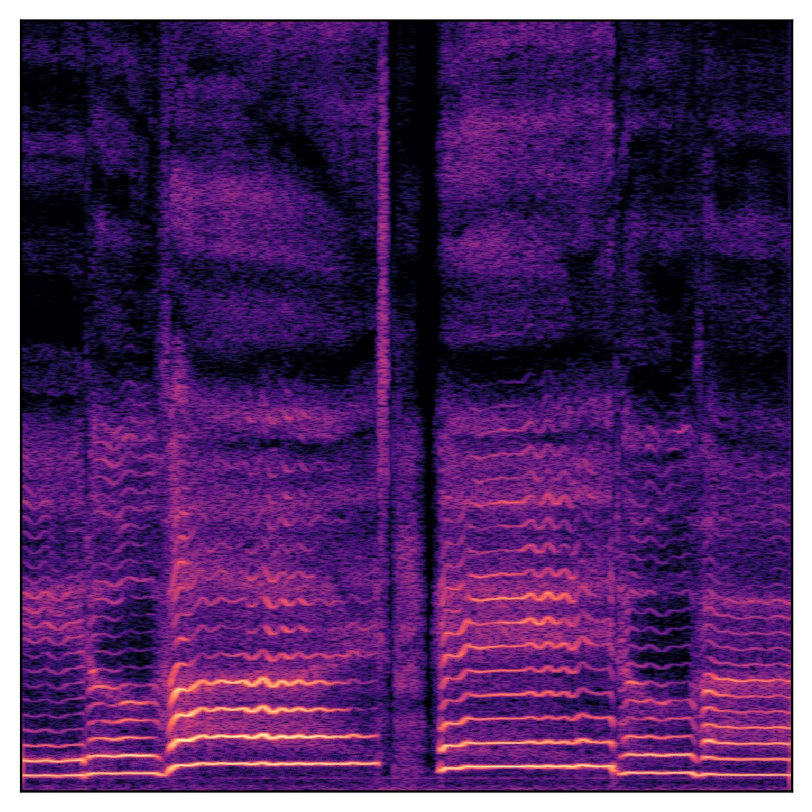
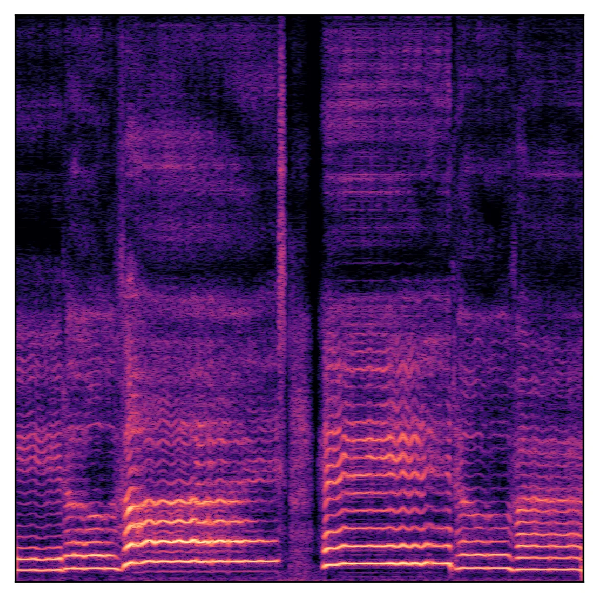
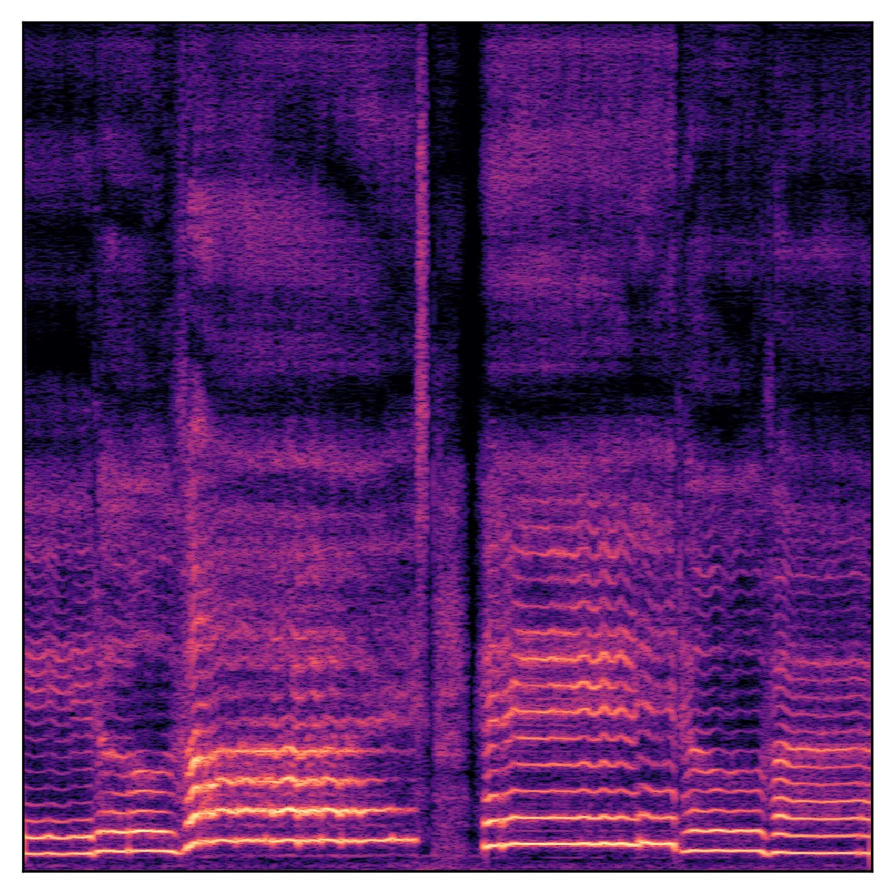
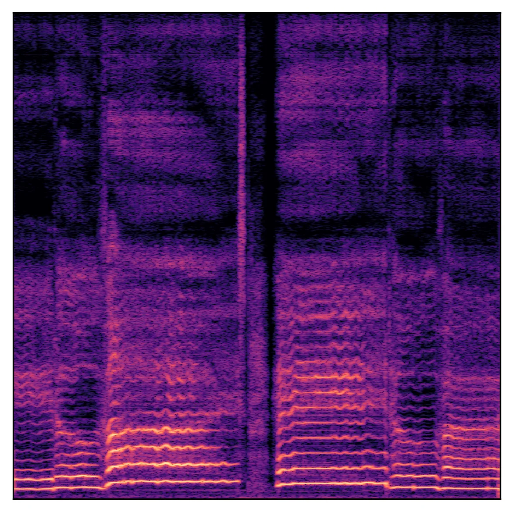
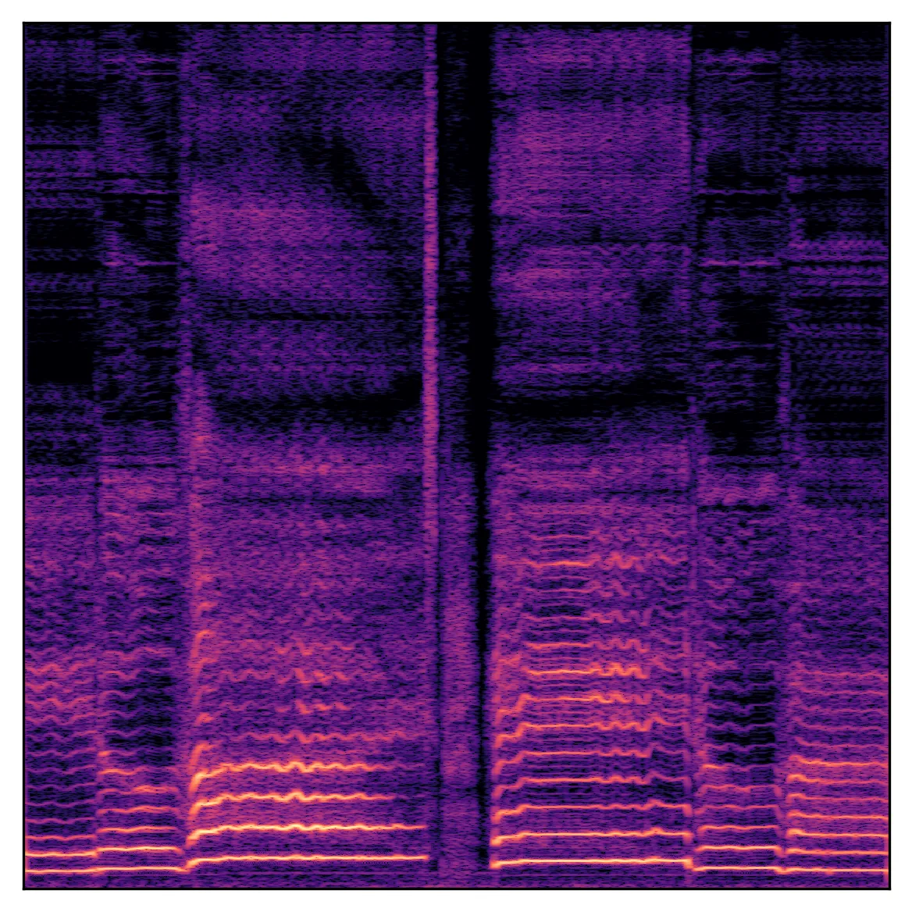
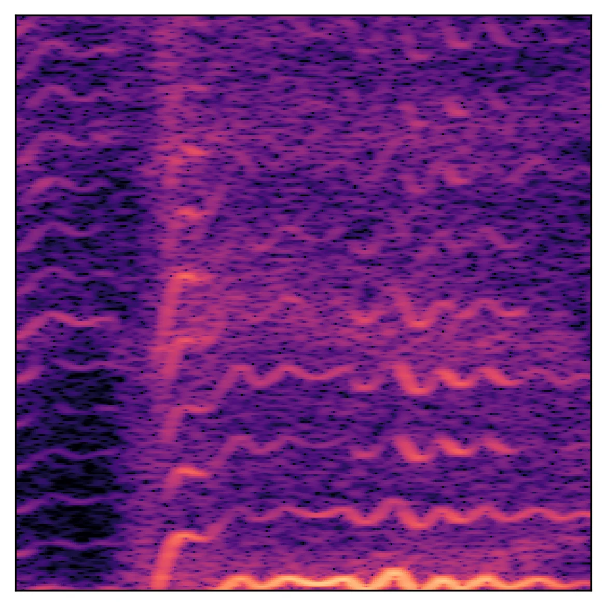
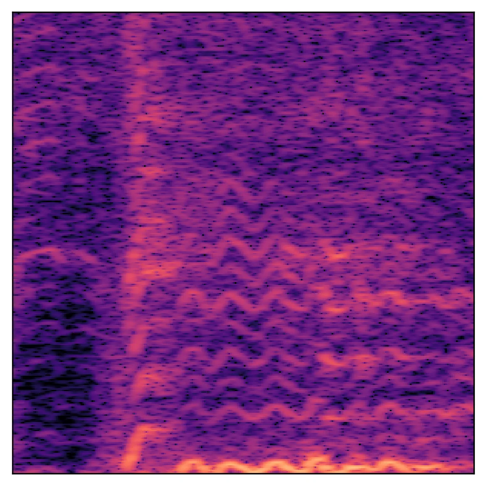
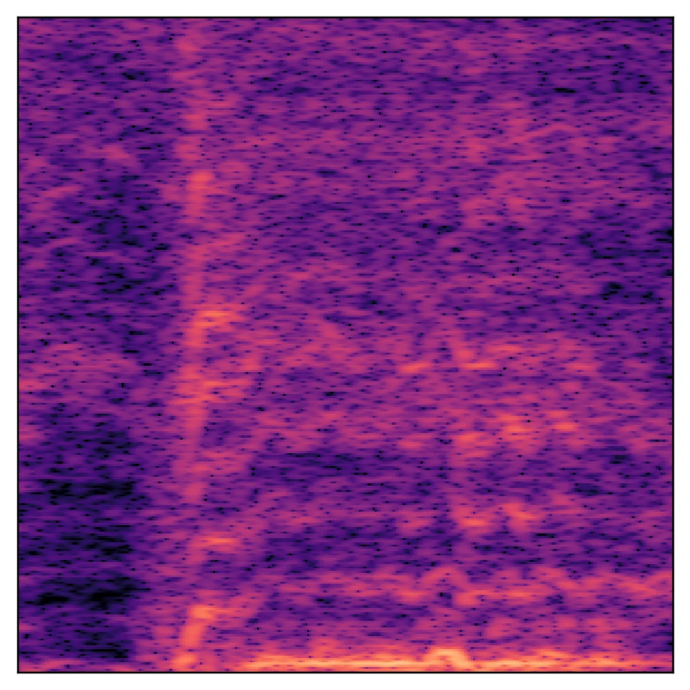
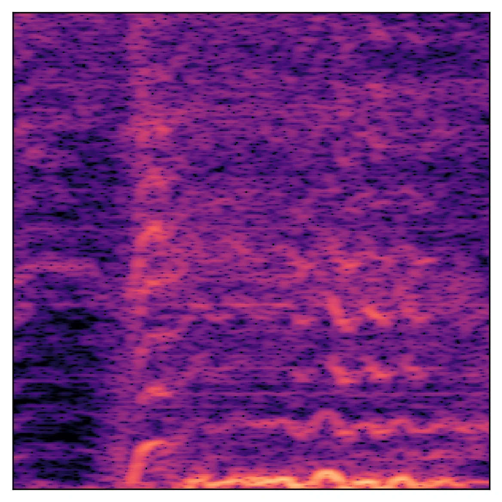
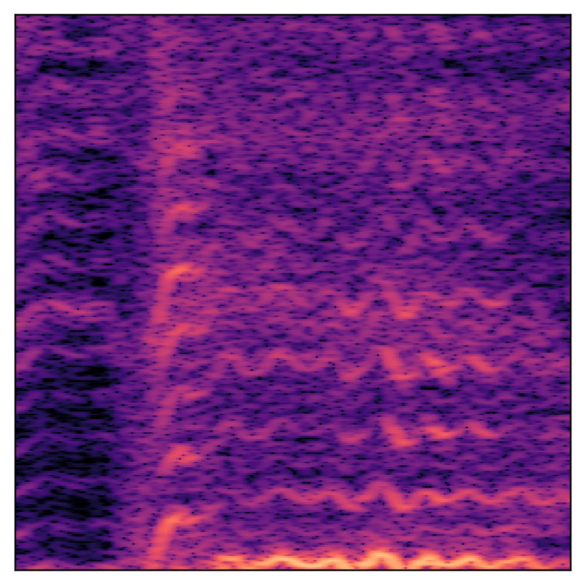

# Vocos: Closing the gap between time-domain and Fourier-based neural vocoders for high-quality audio synthesis

Hubert Siuzdak ^(†)^(†)thanks: Work conducted while at Gemelo AI

###### Abstract

Recent advancements in neural vocoding are predominantly driven by
Generative Adversarial Networks (GANs) operating in the time-domain.
While effective, this approach neglects the inductive bias offered by
time-frequency representations, resulting in reduntant and
computionally-intensive upsampling operations. Fourier-based
time-frequency representation is an appealing alternative, aligning more
accurately with human auditory perception, and benefitting from
well-established fast algorithms for its computation. Nevertheless,
direct reconstruction of complex-valued spectrograms has been
historically problematic, primarily due to phase recovery issues. This
study seeks to close this gap by presenting Vocos, a new model that
directly generates Fourier spectral coefficients. Vocos not only matches
the state-of-the-art in audio quality, as demonstrated in our
evaluations, but it also substantially improves computational
efficiency, achieving an order of magnitude increase in speed compared
to prevailing time-domain neural vocoding approaches. The source code
and model weights have been open-sourced at
[https://github.com/gemelo-ai/vocos](https://github.com/gemelo-ai/vocos).

|     |
| --- |
|     |

## 1 Introduction

Sound synthesis, the process of generating audio signals through
electronic and computational means, has a long and rich history of
innovation . Within the scope of text-to-speech (TTS), concatenative
synthesis (Moulines & Charpentier, 1990; Hunt & Black, 1996) and
statistical parametric synthesis (Yoshimura et al., 1999) were the
prevailing approaches. The latter strategy relied on a source-filter
theory of speech production, where the speech signal was seen as being
produced by a source (the vocal cords) and then shaped by a filter (the
vocal tract). In this framework, various parameters such as pitch, vocal
tract shape, and voicing were estimated and then used to control a
_vocoder_ (Dudley, 1939) which would reconstruct the final audio signal.
While vocoders evolved significantly (Kawahara et al., 1999; Morise
et al., 2016), they tended to oversimplify speech production, generating
a distinctive ”buzzy” sound and thus compromising the naturalness of the
speech.

A significant breakthrough in speech synthesis was achieved with the
introduction of WaveNet (Oord et al., 2016), a deep generative model for
raw audio waveforms. WaveNet proposed a novel approach to handle audio
signals by modeling them autoregressively in the time-domain, using
dilated convolutions to broaden receptive fields and consequently
capture long-range temporal dependencies. In contrast to the traditional
parametric vocoders which incorporate prior knowledge about audio
signals, WaveNet solely depends on end-to-end learning.

Since the advent of WaveNet, modeling distribution of audio samples in
the time-domain has become the most popular approach in the field of
audio synthesis. The primary methods have fallen into two major
categories: autoregressive models and non-autoregressive models.
Autoregressive models, like WaveNet, generate audio samples
sequentially, conditioning each new sample on all previously generated
ones (Mehri et al., 2016; Kalchbrenner et al., 2018; Valin & Skoglund,
2019). On the other hand, nonautoregressive models generate all samples
independently, parallelizing the process and making it more
computationally efficient (Oord et al., 2018; Prenger et al., 2019;
Donahue et al., 2018).

(a) $`\omega(t)`$

(b) $`\sin(\omega t)`$

(c) $`\varphi(t)`$

Figure 1: This illustrates the phase wrapping using an example
sinusoidal signal (b) generated with a time-varying frequency (a). The
instantaneous phase, $`\varphi(t)`$, is shown in (c). The apparent
discontinuities observed around $`-\pi`$ and $`\pi`$ are the result of
phase wrapping. Nevertheless, when viewed on the complex plane, these
discontinuities represent continuous rotations. The instantaneous phase
is computed as $`\varphi(t)=\arg\left\{\hat{s}(t)\right\}`$, where
$`\hat{s}(t)`$ denotes the Hilbert transform of $`s(t)=\sin(\omega t)`$.

### 1.1 Challenges of modeling phase spectrum

Despite considerable advancements in time-domain audio synthesis,
efforts to generate spectral representations of signals have been
relatively limited. While it’s possible to perfectly reconstruct the
original signal from its Short-Time Fourier Transform (STFT), in many
applications, only the magnitude of the STFT is utilized, leading to
inherent information loss. The magnitude of the STFT provides a clear
understanding of the signal by indicating the amplitude of different
frequency components throughout its duration. In contrast, phase
information is less intuitive and its manipulation can often yield
unpredictable results.

Modeling the phase distribution presents challenges due to its intricate
nature in the time-frequency domain. Phase spectrum exhibits a periodic
structure causing wrapping around the principal values within the range
of $`(-\pi,\pi]`$ (Figure 1). Furthermore, the literature does not
provide a definitive answer regarding the perceptual importance of
phase-related information in speech (Wang & Lim, 1982; Paliwal et al.,
2011). However, improved phase spectrum estimates have been found to
minimize perceptual impairments (Saratxaga et al., 2012). Researchers
have explored the use of deep learning for directly modeling the phase
spectrum, but this remains a challenging area (Williamson et al., 2015).

### 1.2 Contribution

Attempts to model Fourier-related coefficients with generative models
have not achieved the same level of success as has been seen with
modeling audio in the time-domain. This study focuses on bridging that
gap with the following contributions:

- •
  We propose Vocos – a GAN-based vocoder, trained to produce complex
  STFT coefficients of an audio clip. Unlike conventional neural vocoder
  architectures that rely on transposed convolutions for upsampling,
  this work proposes maintaining the same feature temporal resolution
  across all layers. The upsampling to waveform is realized through the
  Inverse Fast Fourier Transform.
- •
  To estimate phase angles, we propose a simple activation function
  defined in terms of a unit circle. This approach naturally
  incorporates implicit phase wrapping, ensuring meaningful values
  across all phase angles.
- •
  As Vocos maintains a low temporal resolution throughout the network,
  we revisited the need to use dilated convolutions, typical to
  time-domain vocoders. Our results indicate that integrating ConvNeXt
  (Liu et al., 2022) blocks contributes to better performance.
- •
  Our extensive evaluation shows that Vocos matches the state-of-the-art
  in audio quality while demonstrating over an order of magnitude
  increase in speed compared to time-domain counterparts. The source
  code and model weights have been made open-source, enabling further
  exploration and potential advancements in the field of neural
  vocoding.

## 2 Related work

##### GAN-based vocoders

Generative Adversarial Networks (GANs) (Goodfellow et al., 2014), have
achieved significant success in image generation, sparking interest from
audio researchers due to their ability for fast and parallel waveform
generation (Donahue et al., 2018; Engel et al., 2018). Progress was made
with the introduction of advanced critics, such as the multi-scale
discriminator (MSD) (Kumar et al., 2019) and the multi-period
discriminator (MPD) (Kong et al., 2020). These works also adopted a
feature-matching loss to minimize the distance between the discriminator
feature maps of real and synthetic audio. To discriminate between real
and generated samples, also multi-resolution spectrograms (MRD) were
employed (Jang et al., 2021).

At this point the standard practice involves using a stack of dilated
convolutions to increase the receptive field, and transposed
convolutions to sequentially upsample the feature sequence to the
waveform. However, this design is known to be susceptible to aliasing
artifacts, and there are works suggesting more specialized modules for
both the discriminator (Bak et al., 2022) and generator (Lee et al.,
2022). The historical jump in quality is largely attributed to
discriminators that are able to capture implicit structures by examining
input audio signal at various periods or scales. It has been argued (You
et al., 2021) that the architectural details of the generators do not
significantly affect the vocoded outcome, given a well-established
multi-resolution discriminating framework. Contrary to these methods,
Vocos presents a carefully designed, frequency-aware generator that
models the distribution of Fourier spectral coefficients, rather than
modeling waveforms in the time domain.

##### Phase and magnitude estimation

Historically, the phase estimation problem has been at the core of audio
signal reconstruction. Traditional methods usually rely on the
Griffin-Lim algorithm (Griffin & Lim, 1984), which iteratively estimate
the phase by enforcing spectrogram consistency. However, the Griffin-Lim
method introduces unnatural artifacts into synthesized speech. Several
methods have been proposed for reconstructing phase using deep neural
networks, including likelihood-based approaches (Takamichi et al., 2018)
and GANs (Oyamada et al., 2018). Another line of work suggests
perceptual phase quantization (Kim, 2003), which has proven promising in
deep learning by treating the phase estimation problem as a
classification problem (Takahashi et al., 2018).

Despite their effectiveness, these models assume the availability of a
full-scale magnitude spectrogram, while modern audio synthesis pipelines
often employ more compact representations, such as mel-spectrograms
(Shen et al., 2018). Furthermore, recent research is focusing on
leveraging latent features extracted by pretrained deep learning models
(Polyak et al., 2021; Siuzdak et al., 2022).

Closer to this paper are studies that estimate both the magnitude and
phase spectrum. This can be done either implicitly, by predicting the
real and imaginary parts of the STFT, or explicitly, by parameterizing
the model to generate the phase and magnitude components. In the former
category, Gritsenko et al. (2020) presents a variant of a model trained
to produce STFT coefficients. They recognized the significance of
adversarial objective in preventing robotic sound quality, however they
were unable to train it successfully due to its inherent instability. On
the other hand, iSTFTNet (Kaneko et al., 2022) proposes modifications to
HiFi-GAN, enabling it to return magnitude and phase spectrum. However,
their optimal model only replaces the last two upsample blocks with
inverse STFT, leaving the majority of the upsampling to be realized with
transposed convolutions. They find that replacing more upsampling layers
drastically degrades the quality. Pasini & Schlüter (2022) were able to
successfully model the magnitude and phase spectrum of audio with higher
frequency resolution, although it required multi-step training (Caillon
& Esling, 2021), because of the adversarial objective instability. Also,
the initial studies using GANs to generate invertible spectrograms
involved estimating instantaneous frequency (Engel et al., 2018).
However, these were limited to a single dataset containing only
individual musical instrument notes, with the assumption of a constant
instantaneous frequency.

## 3 Vocos

### 3.1 Overview

At its core, the proposed GAN model uses Fourier-based time-frequency
representation as the target data distribution for the generator. Vocos
is constructed without any transposed convolutions; instead, the
upsample operation is realized solely through the fast inverse STFT.
This approach permits a unique model design compared to time-domain
vocoders, which typically employ a series of upsampling layers to
inflate input features to the target waveform’s resolution, often
necessitating upscaling by several hundred times. In contrast, Vocos
maintains the same temporal resolution throughout the network (Figure
2). This design, known as an isotropic architecture, has been found to
work well in various settings, including Transformer (Vaswani et al.,
2017). This approach can also be particularly beneficial for audio
synthesis. Traditional methods often use transposed convolutions that
can introduce aliasing artifacts, necessitating additional measures to
mitigate the issue (Karras et al., 2021; Lee et al., 2022). Vocos
eliminates learnable upsampling layers, and instead employs the
well-establish inverse Fourier transform to reconstruct the
original-scale waveform. In the context of converting mel-spectrograms
into audio signal, the temporal resolution is dictated by the hop size
of the STFT.

Vocos uses the Short-Time Fourier Transform (STFT) to represent audio
signals in the time-frequency domain:

```math
\text{STFT}_{x}[m,k]=\sum_{n=0}^{N-1}x[n]w[n-m]e^{-j2\pi kn/N} \tag{1}
```

The STFT applies the Fourier transform to successive windowed sections
of the signal. In practice, the STFT is computed by taking a sequence of
Fast Fourier Transforms (FFTs) on overlapping, windowed frames of data,
which are created as the window function advances or “hops” through
time.

(a)

(b)

Figure 2: Comparison of a typical time-domain GAN vocoder (a), with the
proposed Vocos architecture (b) that maintains the same temporal
resolution across all layers. Time-domain vocoders use transposed
convolutions to sequentially upsample the signal to the desired sample
rate. In contrast, Vocos achieves this by using a computationally
efficient inverse Fourier transform.

### 3.2 Model

##### Backbone

Vocos adapts ConvNeXt (Liu et al., 2022) as the foundational backbone
for the generator. It first embeds the input features into a hidden
dimensionality and then applies a stack of 1D convolutional blocks. Each
block consists of a depthwise convolution, followed by an inverted
bottleneck that projects features into a higher dimensionality using
pointwise convolution. GELU (Gaussian Error Linear Unit) activations are
used within the bottleneck, and Layer Normalization is employed between
the blocks.

##### Head

Fourier transform of real-valued signals is conjugate symmetric, so we
use only a single side band spectrum, resulting in $`n_{fft}/2+1`$
coefficients per frame. As we parameterize the model to output phase and
magnitude values, hidden-dim activations are projected into a tensor
$`\mathbf{h}`$ with $`{n_{fft}}+2`$ channels and splitted into:

```math
\displaystyle\mathbf{m},\mathbf{p}=\mathbf{h}[1:(n_{fft}/2+1)],\mathbf{h}[(n_{fft}/2+2):n]
```

To represent the magnitude, we apply the exponential function to
$`\mathbf{m}`$: $`\mathbf{M}=\exp(\mathbf{m})`$.

We map $`\mathbf{p}`$ onto the unit circle by calculating the cosine and
sine of $`\mathbf{p}`$ to obtain $`\mathbf{x}`$ and $`\mathbf{y}`$,
respectively:

```math
\displaystyle\mathbf{x} \displaystyle=\cos(\mathbf{p})
```

```math
\displaystyle\mathbf{y} \displaystyle=\sin(\mathbf{p})
```

Finally, we represent complex-valued coefficients as:
$`\text{STFT}=\mathbf{M}\cdot(\mathbf{x}+j\mathbf{y})`$.

Importantly, this simple formulation allows to express phase angle
$`\bm{\varphi}=\text{atan2}(\mathbf{y},\mathbf{x})`$ for any real
argument $`\mathbf{p}`$, and it ensures that $`\bm{\varphi}`$ is
correctly wrapped into the desired range $`(-\pi,\pi]`$.

##### Discriminator

We employ the multi-period discriminator (MPD) as defined by Kong et al.
(2020), and multi-resolution discriminator (MRD) (Jang et al., 2021).

### 3.3 Loss

Following the approach proposed by Kong et al. (2020), the training
objective of Vocos consists of reconstruction loss, adversarial loss and
feature matching loss. However, we adopt a hinge loss formulation
instead of the least squares GAN objective, as suggested by Zeghidour
et al. (2021):

```math
\ell_{G}(\hat{\bm{x}})=\frac{1}{K}\sum_{k}\max\left(0,1-D_{k}(\hat{\bm{x}})\right)
```

```math
\ell_{D}(\bm{x},\hat{\bm{x}})=\frac{1}{K}\sum_{k}\max\left(0,1-D_{k}(\bm{x})\right)+\max\left(0,1+D_{k}(\hat{\bm{x}})\right)
```

where $`D_{k}`$ is the $`k`$th subdiscriminator. The reconstruction
loss, denoted as $`L_{mel}`$, is defined as the L1 distance between the
mel-scaled magnitude spectrograms of the ground truth sample $`\bm{x}`$
and the synthesized sample: $`\hat{\bm{x}}`$:
$`L_{mel}=\left\|\mathcal{M}(\bm{x})-\mathcal{M}(\hat{\bm{x}})\right\|_{1}`$.
The feature matching loss, denoted as $`L_{feat}`$ is calculated as the
mean of the distances between the $`l`$th feature maps of the $`k`$th
subdistriminator:
$`L_{feat}=\frac{1}{KL}\sum_{k}\sum_{l}\left\|D_{k}^{l}(\bm{x})-D_{k}^{l}(\hat{\bm{x}})\right\|_{1}`$.

## 4 Results

### 4.1 Mel-spectrograms

Reconstructing audio waveforms from mel-spectrograms has become a
fundamental task for vocoders in contemporary speech synthesis
pipelines. In this section, we assess the performance of Vocos relative
to established baseline methods.

##### Data

The models are trained on the LibriTTS dataset (Zen et al., 2019), from
which we use the entire training subset (both train-clean and
train-other). We maintain the original sampling rate of 24 kHz for the
audio files. For each audio sample, we compute mel-scaled spectrograms
using parameters: $`n_{fft}=1024`$, $`hop_{n}=256`$, and the number of
Mel bins is set to 100. A random gain is applied to the audio samples,
resulting in a maximum level between -1 and -6 dBFS.

##### Training Details

We train our models up to 2 million iterations, with 1 million
iterations per generator and discriminator. During training, we randomly
crop the audio samples to 16384 samples and use a batch size of 16. The
model is optimized using the AdamW optimizer with an initial learning
rate of 2e-4 and betas set to (0.9, 0.999). The learning rate is decayed
following a cosine schedule.

##### Baseline Methods

Our proposed model, Vocos, is compared to: iSTFTNet (Kaneko et al.,
2022), BigVGAN (Lee et al., 2022), and HiFi-GAN (Kong et al., 2020).
These models are retrained on the same LibriTTS subset for up to 2
million iterations, following the original training details recommended
by the authors. We use the official implementations of BigVGAN¹¹ 1
[https://github.com/NVIDIA/BigVGAN](https://github.com/NVIDIA/BigVGAN)
and HiFi-GAN²² 2
[https://github.com/jik876/hifi-gan](https://github.com/jik876/hifi-gan),
and a community open-sourced version of iSTFTNet³³ 3
[https://github.com/rishikksh20/iSTFTNet-pytorch](https://github.com/rishikksh20/iSTFTNet-pytorch).

|                   |                      |                       |                     |                        |                              |
| ----------------- | -------------------- | --------------------- | ------------------- | ---------------------- | ---------------------------- |
|                   | UTMOS ($`\uparrow`$) | VISQOL ($`\uparrow`$) | PESQ ($`\uparrow`$) | V/UV F1 ($`\uparrow`$) | Periodicity ($`\downarrow`$) |
| Ground truth      | 4.058                | –                     | –                   | –                      | –                            |
| HiFi-GAN          | 3.669                | 4.57                  | 3.093               | 0.9457                 | 0.129                        |
| iSTFTNet          | 3.564                | 4.56                  | 2.942               | 0.9372                 | 0.141                        |
| BigVGAN           | 3.749                | 4.65                  | 3.693               | 0.9557                 | 0.108                        |
| Vocos             | 3.734                | 4.66                  | 3.70                | 0.9582                 | 0.101                        |
| w/ absolute phase | 3.590                | 4.65                  | 3.565               | 0.9556                 | 0.108                        |
| w/ Snake          | 3.699                | 4.66                  | 3.629               | 0.9579                 | 0.102                        |
| w/o ConvNeXt      | 3.658                | 4.65                  | 3.528               | 0.9534                 | 0.109                        |

Table 1: Objective evaluation metrics for various models, including
baseline models (HiFi-GAN, iSTFTNet, BigVGAN) and Vocos.

#### 4.1.1 Evaluation

##### Objective Evaluation

For objective evaluation of our models, we employ the UTMOS (Saeki
et al., 2022) automatic Mean Opinion Score (MOS) prediction system.
Although UTMOS can yield scores highly correlated with human
evaluations, it is restricted to 16 kHz sample rate. To assess
perceptual quality, we also utilize ViSQOL (Chinen et al., 2020) in
audio-mode, which operates in the full band. Our evaluation process also
encompasses several other metrics, including the Perceptual Evaluation
of Speech Quality (PESQ) (Rix et al., 2001), periodicity error, and the
F1 score for voiced/unvoiced classification (V/UV F1), following the
methodology proposed by Morrison et al. (2021). The results are
presented in Table 1. Vocos achieves superior performance in most of the
metrics compared to the other models. It obtains the highest scores in
VISQOL and PESQ. Importantly, it also effectively mitigates the
periodicity issues frequently associated with time-domain GANs. BigVGAN
stands out as the closest competitor, especially in the UTMOS metric,
where it slightly outperforms Vocos.

In our ablation study, we examined the impact of specific design
decisions on Vocos’s performance:

- •
  Vocos with absolute phase: In this variant, we predict phase angles
  using a $`\tanh`$ nonlinearity, scaled to fit within the range of
  $`[-\pi,\pi]`$. This formulation does not give the model an inductive
  bias regarding the periodic nature of phase, and the results show it
  leads to degraded quality. This finding emphasizes the importance of
  implicit phase wrapping in the effectiveness of Vocos.
- •
  Vocos with Snake activation: Although Snake (Ziyin et al., 2020) has
  been shown to enhance time-domain vocoders such as BigVGAN, in our
  case, it did not result in performance gains; in fact, it showed a
  slight decline. The primary purpose of the Snake function is to induce
  periodicity, addressing the limitations of time-domain vocoders.
  Vocos, on the other hand, explicitly incorporates periodicity through
  the use of Fourier basis functions, eliminating the need for
  specialized modules like Snake.
- •
  Vocos without ConvNeXt: Replacing ConvNeXt blocks with traditional
  ResBlocks with dilated convolutions, slightly lowers scores across all
  evaluated metrics. This finding highlights the integral role of
  ConvNeXt blocks in Vocos, contributing significantly to its overall
  success.

|              |                    |                     |
| ------------ | ------------------ | ------------------- |
|              | MOS ($`\uparrow`$) | SMOS ($`\uparrow`$) |
| Ground truth | 3.81$`\pm{0.16}`$  | 4.70$`\pm{0.11}`$   |
| HiFi-GAN     | 3.54$`\pm{0.16}`$  | 4.49$`\pm{0.14}`$   |
| iSTFTNet     | 3.57$`\pm{0.16}`$  | 4.42$`\pm{0.16}`$   |
| BigVGAN      | 3.64$`\pm{0.15}`$  | 4.54$`\pm{0.14}`$   |
| Vocos        | 3.62$`\pm{0.15}`$  | 4.55$`\pm{0.15}`$   |

Table 2: Subjective evaluation metrics – 5-scale Mean Opinion Score
(MOS) and Similarity Mean Opinion Score (SMOS) with 95% confidence
interval.

##### Subjective Evaluation

We conducted crowd-sourced subjective assessments, using a 5-point Mean
Opinion Score (MOS) to evaluate the naturalness of the presented
recordings. Participants rated speech samples on a scale from 1 (’poor -
completely unnatural speech’) to 5 (’excellent - completely natural
speech’). Following (Lee et al., 2022), we also conducted a 5-point
Similarity Mean Opinion Score (SMOS) between the reproduced and
ground-truth recordings. Participants were asked to assign a similarity
score to pairs of audio files, with a rating of 5 indicating ’Extremely
similar’ and a rating of 1 representing ’Not at all similar’.

To ensure the quality of responses, we carefully selected participants
through a third-party crowdsourcing platform. Our criteria included the
use of headphones, fluent English proficiency, and a declared interest
in music listening as a hobby. A total of 1560 ratings were collected
from 39 participants.

The results are detailed in Table 2. Vocos performs on par with the
state-of-the-art in both perceived quality and similarity. Statistical
tests show no significant differences between Vocos and BigVGAN in MOS
and SMOS scores, with p-values greater than 0.05 from the Wilcoxon
signed-rank test.

|          | Mixture | Drums | Bass | Other | Vocals | Average |
| -------- | ------- | ----- | ---- | ----- | ------ | ------- |
| HiFi-GAN | 4.46    | 4.40  | 4.12 | 4.44  | 4.54   | 4.39    |
| iSTFTNet | 4.47    | 4.48  | 3.80 | 4.40  | 4.53   | 4.34    |
| BigVGAN  | 4.60    | 4.60  | 4.29 | 4.58  | 4.64   | 4.54    |
| Vocos    | 4.61    | 4.61  | 4.31 | 4.58  | 4.66   | 4.55    |

Table 3: VISQOL scores of various models tested on the MUSDB18 dataset.
A higher VISQOL score indicates better perceptual audio quality.

##### Out-of-distribution data

A crucial aspect of a vocoder is its ability to generalize to unseen
acoustic conditions. In this context, we evaluate the performance of
Vocos with out-of-distribution audio using the MUSDB18 dataset (Rafii
et al., 2017), which includes a variety of multi-track music audio like
vocals, drums, bass, and other instruments, along with the original
mixture. The VISQOL scores for this evaluation are provided in Table 3.
From the table, Vocos consistently outperforms the other models,
achieving the highest scores across all categories.

Figure 3 presents spectrogram visualization of an out-of-distribution
singing voice sample, as reproduced by different models. Periodicity
artifacts are commonly observed when employing time-domain GANs.
BigVGAN, with its anti-aliasing filters, is able to recover some of the
harmonics in the upper frequency ranges, marking an improvement over
HiFi-GAN. Nonetheless, Vocos appears to provide a more accurate
reconstruction of these harmonics, without the need for additional
modules.

### 4.2 Neural audio codec

While traditionally, neural vocoders reconstruct the audio waveform from
a mel-scaled spectrogram – an approach widely adopted in many speech
synthesis pipelines – recent research has started to utilize learnt
features (Siuzdak et al., 2022), often in a quantized form (Borsos
et al., 2022).

In this section, we draw a comparison with EnCodec (Défossez et al.,
2022), an open-source neural audio codec, which follows a typical
time-domain GAN vocoder architecture and uses Residual Vector
Quantization (RVQ) (Zeghidour et al., 2021) to compress the latent
space. RVQ cascades multiple layers of Vector Quantization, iteratively
quantizing the residuals from the previous stage to form a multi-stage
structure, thereby enabling support for multiple bandwidth targets. In
EnCodec, dedicated discriminators are trained for each bandwidth. In
contrast, we have adapted Vocos to be a conditional GAN with a
projection discriminator (Miyato & Koyama, 2018), and have incorporated
adaptive layer normalization (Huang & Belongie, 2017) into the
generator.

##### Audio reconstruction

We utilize the open-source model checkpoint of EnCodec operating at 24
kHz. To align with EnCodec, we scale down Vocos to match its parameter
count (7.9M) and train it on clean speech segments sourced from the DNS
Challenge (Dubey et al., 2022). Our evaluation, conducted on the DAPS
dataset (Mysore, 2014) and detailed in Table 4, reveals that despite
EnCodec’s reconstruction artifacts not significantly impacting PESQ and
Periodicity scores, they are considerably reflected in the perceptual
score, as denoted by UTMOS. In this regard, Vocos notably outperforms
EnCodec. We also performed a crowd-sourced subjective assessment to
evaluate the naturalness of these samples. The results, as shown in
Table 5, indicate that Vocos consistently achieves better performance
across a range of bandwidths, based on evaluations by human listeners.

|         |           |                      |                       |                     |                        |                              |
| ------- | --------- | -------------------- | --------------------- | ------------------- | ---------------------- | ---------------------------- |
|         | Bandwidth | UTMOS ($`\uparrow`$) | VISQOL ($`\uparrow`$) | PESQ ($`\uparrow`$) | V/UV F1 ($`\uparrow`$) | Periodicity ($`\downarrow`$) |
| EnCodec | 1.5 kbps  | 1.527                | 3.74                  | 1.508               | 0.8826                 | 0.215                        |
|         | 3.0 kbps  | 2.522                | 3.93                  | 2.006               | 0.9347                 | 0.141                        |
|         | 6.0 kbps  | 3.262                | 4.13                  | 2.665               | 0.9625                 | 0.090                        |
|         | 12.0 kbps | 3.765                | 4.25                  | 3.283               | 0.9766                 | 0.062                        |
| Vocos   | 1.5 kbps  | 3.210                | 3.88                  | 1.845               | 0.9238                 | 0.160                        |
|         | 3.0 kbps  | 3.688                | 4.06                  | 2.317               | 0.9380                 | 0.135                        |
|         | 6.0 kbps  | 3.822                | 4.22                  | 2.650               | 0.9439                 | 0.124                        |
|         | 12.0 kbps | 3.882                | 4.34                  | 2.874               | 0.9482                 | 0.116                        |

Table 4: Objective evaluation metric calculated for various bandwidths.

| Bandwidth    | Vocos             | EnCodec           |
| ------------ | ----------------- | ----------------- |
| 1.5 kbps     | 2.73$`\pm{0.20}`$ | 1.09$`\pm{0.05}`$ |
| 3 kbps       | 3.50$`\pm{0.18}`$ | 1.71$`\pm{0.21}`$ |
| 6 kbps       | 3.84$`\pm{0.16}`$ | 2.41$`\pm{0.15}`$ |
| 12 kbps      | 4.00$`\pm{0.16}`$ | 3.08$`\pm{0.19}`$ |
| Ground truth | 4.09$`\pm{0.16}`$ |                   |

Table 5: Subjective evaluation metrics – 5-scale Mean Opinion Score
(MOS) with 95% confidence interval for various bandwidths.

##### End-to-end text-to-speech

Recent progress in text-to-speech (TTS) has been notably driven by
language modeling architectures employing discrete audio tokens. Bark
(Suno AI, 2023), a widely recognized open-source model, leverages a
GPT-style, decoder-only architecture, with EnCodec’s 6kbps audio tokens
serving as its vocabulary. Vocos trained to reconstruct EnCodec tokens
can effectively serve as a drop-in replacement vocoder for Bark. We have
provided text-to-speech samples from Bark and Vocos on our website and
encourage readers to listen to them for a direct comparison.⁴⁴ 4 Listen
to audio samples at
[https://gemelo-ai.github.io/vocos/](https://gemelo-ai.github.io/vocos/).

### 4.3 Inference speed

Our inference speed benchmarks were conducted using an Nvidia Tesla A100
GPU and an AMD EPYC 7542 CPU. The code was implemented in Pytorch, with
no hardware-specific optimizations. The forward pass was computed using
a batch of 16 samples, each one second long. Table 6 presents the
synthesis speed and model footprint of Vocos in comparison to other
models.

Vocos showcases notable speed advantages compared to other models,
operating approximately 13 times faster than HiFi-GAN and nearly 70
times faster than BigVGAN. This speed advantage is particularly
pronounced when running without GPU acceleration. This is primarily due
to the use of the Inverse Short-Time Fourier Transform (ISTFT) algorithm
instead of transposed convolutions. We also evaluate a variant of Vocos
that utilizes ResBlock’s dilated convolutions instead of ConvNeXt
blocks. Depthwise separable convolutions offer an additional speedup
when executed on a GPU.



(a)



(b)



(c)



(d)



(e)



(f) a) Ground truth



(g) b) iSTFTNet



(h) c) HiFi-GAN



(i) d) BigVGAN



(j) e) Vocos

Figure 3: Spectrogram visualization of an out-of-distribution singing
voice sample reproduced by different models. The bottom row presents a
zoomed-in view of the upper midrange frequency range.

|                 |                    |        |            |
| --------------- | ------------------ | ------ | ---------- |
| Model           | xRT ($`\uparrow`$) |        | Parameters |
|                 | GPU                | CPU    |            |
| HiFi-GAN        | 495.54             | 5.84   | 14.0 M     |
| BigVGAN         | 98.61              | 0.40   | 14.0 M     |
| ISTFTNet        | 1045.94            | 14.44  | 13.3 M     |
| Vocos           | 6696.52            | 169.63 | 13.5 M     |
|    w/o ConvNeXt | 4565.71            | 193.56 | 14.9 M     |

Table 6: Model footprint and synthesis speed. xRT denotes the speed
factor relative to real-time. A higher xRT value means the model can
generate speech faster than real-time, with a value of 1.0 denoting
real-time speed.

## 5 Conclusions

This paper introduces Vocos, a novel neural vocoder that bridges the gap
between time-domain and Fourier-based approaches. Vocos tackles the
challenges associated with direct reconstruction of complex-valued
spectrograms, with careful design of generator that correctly handle
phase wrapping. It achieves accurate reconstruction of the coefficients
in Fourier-based time-frequency representations.

The results demonstrate that the proposed vocoder matches
state-of-the-art audio quality while effectively mitigating periodicity
issues commonly observed in time-domain GANs. Importantly, Vocos
provides a significant computational efficiency advantage over
traditional time-domain methods by utilizing inverse fast Fourier
transform for upsampling.

Overall, the findings of this study contribute to the advancement of
neural vocoding techniques by incorporating the benefits of
Fourier-based time-frequency representations. The open-sourcing of the
source code and model weights allows for further exploration and
application of the proposed vocoder in various audio processing tasks.

## References

- Bak et al. (2022) Taejun Bak, Junmo Lee, Hanbin Bae, Jinhyeok Yang,
  Jae-Sung Bae, and Young-Sun Joo. Avocodo: Generative adversarial
  network for artifact-free vocoder. _arXiv preprint
  arXiv:2206.13404_, 2022.
- Borsos et al. (2022) Zalán Borsos, Raphaël Marinier, Damien Vincent,
  Eugene Kharitonov, Olivier Pietquin, Matt Sharifi, Olivier Teboul,
  David Grangier, Marco Tagliasacchi, and Neil Zeghidour. Audiolm: a
  language modeling approach to audio generation. _arXiv preprint
  arXiv:2209.03143_, 2022.
- Bosi & Goldberg (2002) Marina Bosi and Richard E Goldberg.
  _Introduction to digital audio coding and standards_, volume 721.
  Springer Science & Business Media, 2002.
- Caillon & Esling (2021) Antoine Caillon and Philippe Esling. Rave: A
  variational autoencoder for fast and high-quality neural audio
  synthesis. _arXiv preprint arXiv:2111.05011_, 2021.
- Chinen et al. (2020) Michael Chinen, Felicia SC Lim, Jan Skoglund,
  Nikita Gureev, Feargus O’Gorman, and Andrew Hines. Visqol v3: An open
  source production ready objective speech and audio metric. In _2020
  twelfth international conference on quality of multimedia experience
  (QoMEX)_, pp. 1–6. IEEE, 2020.
- Défossez et al. (2022) Alexandre Défossez, Jade Copet, Gabriel
  Synnaeve, and Yossi Adi. High fidelity neural audio compression.
  _arXiv preprint arXiv:2210.13438_, 2022.
- Donahue et al. (2018) Chris Donahue, Julian McAuley, and Miller
  Puckette. Adversarial audio synthesis. _arXiv preprint
  arXiv:1802.04208_, 2018.
- Dubey et al. (2022) Harishchandra Dubey, Vishak Gopal, Ross Cutler,
  Ashkan Aazami, Sergiy Matusevych, Sebastian Braun, Sefik Emre Eskimez,
  Manthan Thakker, Takuya Yoshioka, Hannes Gamper, et al. Icassp 2022
  deep noise suppression challenge. In _ICASSP 2022-2022 IEEE
  International Conference on Acoustics, Speech and Signal Processing
  (ICASSP)_, pp. 9271–9275. IEEE, 2022.
- Dudley (1939) Homer Dudley. Remaking speech. _The Journal of the
  Acoustical Society of America_, 11(2):169–177, 1939.
- Engel et al. (2018) Jesse Engel, Kumar Krishna Agrawal, Shuo Chen,
  Ishaan Gulrajani, Chris Donahue, and Adam Roberts. Gansynth:
  Adversarial neural audio synthesis. In _International Conference on
  Learning Representations_, 2018.
- Goodfellow et al. (2014) Ian Goodfellow, Jean Pouget-Abadie, Mehdi
  Mirza, Bing Xu, David Warde-Farley, Sherjil Ozair, Aaron Courville,
  and Yoshua Bengio. Generative adversarial nets. In Z. Ghahramani,
  M. Welling, C. Cortes, N. Lawrence, and K.Q. Weinberger (eds.),
  _Advances in Neural Information Processing Systems_, volume 27. Curran
  Associates, Inc., 2014.
- Griffin & Lim (1984) Daniel Griffin and Jae Lim. Signal estimation
  from modified short-time fourier transform. _IEEE Transactions on
  acoustics, speech, and signal processing_, 32(2):236–243, 1984.
- Gritsenko et al. (2020) Alexey Gritsenko, Tim Salimans, Rianne van den
  Berg, Jasper Snoek, and Nal Kalchbrenner. A spectral energy distance
  for parallel speech synthesis. _Advances in Neural Information
  Processing Systems_, 33:13062–13072, 2020.
- Hafner et al. (2023) Danijar Hafner, Jurgis Pasukonis, Jimmy Ba, and
  Timothy Lillicrap. Mastering diverse domains through world models.
  _arXiv preprint arXiv:2301.04104_, 2023.
- Huang & Belongie (2017) Xun Huang and Serge Belongie. Arbitrary style
  transfer in real-time with adaptive instance normalization. In
  _Proceedings of the IEEE international conference on computer vision_,
  pp. 1501–1510, 2017.
- Hunt & Black (1996) Andrew J Hunt and Alan W Black. Unit selection in
  a concatenative speech synthesis system using a large speech database.
  In _1996 IEEE International Conference on Acoustics, Speech, and
  Signal Processing Conference Proceedings_, volume 1, pp. 373–376.
  IEEE, 1996.
- Jang et al. (2021) Won Jang, Dan Lim, Jaesam Yoon, Bongwan Kim, and
  Juntae Kim. Univnet: A neural vocoder with multi-resolution
  spectrogram discriminators for high-fidelity waveform generation.
  _arXiv preprint arXiv:2106.07889_, 2021.
- Kalchbrenner et al. (2018) Nal Kalchbrenner, Erich Elsen, Karen
  Simonyan, Seb Noury, Norman Casagrande, Edward Lockhart, Florian
  Stimberg, Aaron Oord, Sander Dieleman, and Koray Kavukcuoglu.
  Efficient neural audio synthesis. In _International Conference on
  Machine Learning_, pp. 2410–2419. PMLR, 2018.
- Kaneko et al. (2022) Takuhiro Kaneko, Kou Tanaka, Hirokazu Kameoka,
  and Shogo Seki. istftnet: Fast and lightweight mel-spectrogram vocoder
  incorporating inverse short-time fourier transform. In _ICASSP
  2022-2022 IEEE International Conference on Acoustics, Speech and
  Signal Processing (ICASSP)_, pp. 6207–6211. IEEE, 2022.
- Karras et al. (2021) Tero Karras, Miika Aittala, Samuli Laine, Erik
  Härkönen, Janne Hellsten, Jaakko Lehtinen, and Timo Aila. Alias-free
  generative adversarial networks. _Advances in Neural Information
  Processing Systems_, 34:852–863, 2021.
- Kawahara et al. (1999) Hideki Kawahara, Ikuyo Masuda-Katsuse, and
  Alain De Cheveigne. Restructuring speech representations using a
  pitch-adaptive time–frequency smoothing and an
  instantaneous-frequency-based f0 extraction: Possible role of a
  repetitive structure in sounds. _Speech communication_,
  27(3-4):187–207, 1999.
- Kim (2003) Doh-Suk Kim. Perceptual phase quantization of speech. _IEEE
  transactions on speech and audio processing_, 11(4):355–364, 2003.
- Kong et al. (2020) Jungil Kong, Jaehyeon Kim, and Jaekyoung Bae.
  Hifi-gan: Generative adversarial networks for efficient and high
  fidelity speech synthesis. _Advances in Neural Information Processing
  Systems_, 33:17022–17033, 2020.
- Kumar et al. (2019) Kundan Kumar, Rithesh Kumar, Thibault
  De Boissiere, Lucas Gestin, Wei Zhen Teoh, Jose Sotelo, Alexandre
  de Brébisson, Yoshua Bengio, and Aaron C Courville. Melgan: Generative
  adversarial networks for conditional waveform synthesis. _Advances in
  neural information processing systems_, 32, 2019.
- Lee et al. (2022) Sang-gil Lee, Wei Ping, Boris Ginsburg, Bryan
  Catanzaro, and Sungroh Yoon. Bigvgan: A universal neural vocoder with
  large-scale training. _arXiv preprint arXiv:2206.04658_, 2022.
- Liu et al. (2022) Zhuang Liu, Hanzi Mao, Chao-Yuan Wu, Christoph
  Feichtenhofer, Trevor Darrell, and Saining Xie. A convnet for the
  2020s. In _Proceedings of the IEEE/CVF Conference on Computer Vision
  and Pattern Recognition_, pp. 11976–11986, 2022.
- Mehri et al. (2016) Soroush Mehri, Kundan Kumar, Ishaan Gulrajani,
  Rithesh Kumar, Shubham Jain, Jose Sotelo, Aaron Courville, and Yoshua
  Bengio. Samplernn: An unconditional end-to-end neural audio generation
  model. _arXiv preprint arXiv:1612.07837_, 2016.
- Miyato & Koyama (2018) Takeru Miyato and Masanori Koyama. cgans with
  projection discriminator. _arXiv preprint arXiv:1802.05637_, 2018.
- Morise et al. (2016) Masanori Morise, Fumiya Yokomori, and Kenji
  Ozawa. World: a vocoder-based high-quality speech synthesis system for
  real-time applications. _IEICE TRANSACTIONS on Information and
  Systems_, 99(7):1877–1884, 2016.
- Morrison et al. (2021) Max Morrison, Rithesh Kumar, Kundan Kumar, Prem
  Seetharaman, Aaron Courville, and Yoshua Bengio. Chunked
  autoregressive gan for conditional waveform synthesis. _arXiv preprint
  arXiv:2110.10139_, 2021.
- Moulines & Charpentier (1990) Eric Moulines and Francis Charpentier.
  Pitch-synchronous waveform processing techniques for text-to-speech
  synthesis using diphones. _Speech communication_,
  9(5-6):453–467, 1990.
- Mysore (2014) Gautham J. Mysore. Daps (device and produced speech)
  dataset, May 2014. URL
  [https://doi.org/10.5281/zenodo.4660670](https://doi.org/10.5281/zenodo.4660670).
- Oord et al. (2018) Aaron Oord, Yazhe Li, Igor Babuschkin, Karen
  Simonyan, Oriol Vinyals, Koray Kavukcuoglu, George Driessche, Edward
  Lockhart, Luis Cobo, Florian Stimberg, et al. Parallel wavenet: Fast
  high-fidelity speech synthesis. In _International conference on
  machine learning_, pp. 3918–3926. PMLR, 2018.
- Oord et al. (2016) Aaron van den Oord, Sander Dieleman, Heiga Zen,
  Karen Simonyan, Oriol Vinyals, Alex Graves, Nal Kalchbrenner, Andrew
  Senior, and Koray Kavukcuoglu. Wavenet: A generative model for raw
  audio. _arXiv preprint arXiv:1609.03499_, 2016.
- Oyamada et al. (2018) Keisuke Oyamada, Hirokazu Kameoka, Takuhiro
  Kaneko, Kou Tanaka, Nobukatsu Hojo, and Hiroyasu Ando. Generative
  adversarial network-based approach to signal reconstruction from
  magnitude spectrogram. In _2018 26th European Signal Processing
  Conference (EUSIPCO)_, pp. 2514–2518. IEEE, 2018.
- Paliwal et al. (2011) Kuldip Paliwal, Kamil Wójcicki, and Benjamin
  Shannon. The importance of phase in speech enhancement. _speech
  communication_, 53(4):465–494, 2011.
- Pasini & Schlüter (2022) Marco Pasini and Jan Schlüter. Musika! fast
  infinite waveform music generation. _arXiv preprint
  arXiv:2208.08706_, 2022.
- Polyak et al. (2021) Adam Polyak, Yossi Adi, Jade Copet, Eugene
  Kharitonov, Kushal Lakhotia, Wei-Ning Hsu, Abdelrahman Mohamed, and
  Emmanuel Dupoux. Speech resynthesis from discrete disentangled
  self-supervised representations. _arXiv preprint
  arXiv:2104.00355_, 2021.
- Prenger et al. (2019) Ryan Prenger, Rafael Valle, and Bryan Catanzaro.
  Waveglow: A flow-based generative network for speech synthesis. In
  _ICASSP 2019-2019 IEEE International Conference on Acoustics, Speech
  and Signal Processing (ICASSP)_, pp. 3617–3621. IEEE, 2019.
- Rafii et al. (2017) Zafar Rafii, Antoine Liutkus, Fabian-Robert
  Stöter, Stylianos Ioannis Mimilakis, and Rachel Bittner. Musdb18-a
  corpus for music separation. 2017.
- Rix et al. (2001) Antony W Rix, John G Beerends, Michael P Hollier,
  and Andries P Hekstra. Perceptual evaluation of speech quality
  (pesq)-a new method for speech quality assessment of telephone
  networks and codecs. In _2001 IEEE international conference on
  acoustics, speech, and signal processing. Proceedings (Cat. No.
  01CH37221)_, volume 2, pp. 749–752. IEEE, 2001.
- Saeki et al. (2022) Takaaki Saeki, Detai Xin, Wataru Nakata, Tomoki
  Koriyama, Shinnosuke Takamichi, and Hiroshi Saruwatari. Utmos:
  Utokyo-sarulab system for voicemos challenge 2022. _arXiv preprint
  arXiv:2204.02152_, 2022.
- Saratxaga et al. (2012) Ibon Saratxaga, Inma Hernaez, Michael Pucher,
  Eva Navas, and Iñaki Sainz. Perceptual importance of the phase related
  information in speech. In _Thirteenth Annual Conference of the
  International Speech Communication Association_, 2012.
- Shen et al. (2018) Jonathan Shen, Ruoming Pang, Ron J Weiss, Mike
  Schuster, Navdeep Jaitly, Zongheng Yang, Zhifeng Chen, Yu Zhang,
  Yuxuan Wang, Rj Skerrv-Ryan, et al. Natural tts synthesis by
  conditioning wavenet on mel spectrogram predictions. In _2018 IEEE
  international conference on acoustics, speech and signal processing
  (ICASSP)_, pp. 4779–4783. IEEE, 2018.
- Siuzdak et al. (2022) Hubert Siuzdak, Piotr Dura, Pol van Rijn, and
  Nori Jacoby. WavThruVec: Latent speech representation as intermediate
  features for neural speech synthesis. In _Proc. Interspeech 2022_, pp.
  833–837, 2022. doi: 10.21437/Interspeech.2022-10797.
- Suno AI (2023) Suno AI. Bark: Text-prompted generative audio model.
  [https://github.com/suno-ai/bark](https://github.com/suno-ai/bark), 2023.
  GitHub repository.
- Takahashi et al. (2018) Naoya Takahashi, Purvi Agrawal, Nabarun
  Goswami, and Yuki Mitsufuji. Phasenet: Discretized phase modeling with
  deep neural networks for audio source separation. In _Interspeech_,
  pp. 2713–2717, 2018.
- Takamichi et al. (2018) Shinnosuke Takamichi, Yuki Saito, Norihiro
  Takamune, Daichi Kitamura, and Hiroshi Saruwatari. Phase
  reconstruction from amplitude spectrograms based on
  von-mises-distribution deep neural network. In _2018 16th
  International Workshop on Acoustic Signal Enhancement (IWAENC)_, pp.
  286–290. IEEE, 2018.
- Valin & Skoglund (2019) Jean-Marc Valin and Jan Skoglund. Lpcnet:
  Improving neural speech synthesis through linear prediction. In
  _ICASSP 2019-2019 IEEE International Conference on Acoustics, Speech
  and Signal Processing (ICASSP)_, pp. 5891–5895. IEEE, 2019.
- Vaswani et al. (2017) Ashish Vaswani, Noam Shazeer, Niki Parmar, Jakob
  Uszkoreit, Llion Jones, Aidan N Gomez, Łukasz Kaiser, and Illia
  Polosukhin. Attention is all you need. _Advances in neural information
  processing systems_, 30, 2017.
- Wang & Lim (1982) Dequan Wang and Jae Lim. The unimportance of phase
  in speech enhancement. _IEEE Transactions on Acoustics, Speech, and
  Signal Processing_, 30(4):679–681, 1982.
- Wang & Vilermo (2003) Ye Wang and Mikka Vilermo. Modified discrete
  cosine transform: Its implications for audio coding and error
  concealment. _Journal of the Audio Engineering Society_,
  51(1/2):52–61, 2003.
- Williamson et al. (2015) Donald S Williamson, Yuxuan Wang, and DeLiang
  Wang. Complex ratio masking for monaural speech separation. _IEEE/ACM
  transactions on audio, speech, and language processing_,
  24(3):483–492, 2015.
- Yoshimura et al. (1999) Takayoshi Yoshimura, Keiichi Tokuda, Takashi
  Masuko, Takao Kobayashi, and Tadashi Kitamura. Simultaneous modeling
  of spectrum, pitch and duration in hmm-based speech synthesis. In
  _Sixth European Conference on Speech Communication and
  Technology_, 1999.
- You et al. (2021) Jaeseong You, Dalhyun Kim, Gyuhyeon Nam, Geumbyeol
  Hwang, and Gyeongsu Chae. Gan vocoder: Multi-resolution discriminator
  is all you need. _arXiv preprint arXiv:2103.05236_, 2021.
- Zeghidour et al. (2021) Neil Zeghidour, Alejandro Luebs, Ahmed Omran,
  Jan Skoglund, and Marco Tagliasacchi. Soundstream: An end-to-end
  neural audio codec. _IEEE/ACM Transactions on Audio, Speech, and
  Language Processing_, 30:495–507, 2021.
- Zen et al. (2019) Heiga Zen, Viet Dang, Rob Clark, Yu Zhang, Ron J
  Weiss, Ye Jia, Zhifeng Chen, and Yonghui Wu. Libritts: A corpus
  derived from librispeech for text-to-speech. _arXiv preprint
  arXiv:1904.02882_, 2019.
- Ziyin et al. (2020) Liu Ziyin, Tilman Hartwig, and Masahito Ueda.
  Neural networks fail to learn periodic functions and how to fix it.
  _Advances in Neural Information Processing Systems_,
  33:1583–1594, 2020.

## Appendix A Modified Discrete Cosine Transform (MDCT)

While STFT is widely used in audio processing, there are other
time-frequency representations with different properties. In audio
coding applications, it is desirable to design the analysis/synthesis
system in such a way that the overall rate at the output of the analysis
stage equals the rate of the input signal. Such systems are described as
being critically sampled. When we transform the signal via the DFT, even
a slight overlap between adjacent blocks increases the data rate of the
spectral representation of the signal. With 50% overlap between
adjoining blocks, we end up doubling our data rate.

The Modified Discrete Cosine Transform (MDCT) with its corresponding
Inverse Transform (IMDCT) have become a crucial tool in high-quality
audio coding as they enable the implementation of a critically sampled
analysis/synthesis filter bank. A key feature of these transforms is the
Time-Domain Aliasing Cancellation (TDAC) property, which allows for the
perfect reconstruction of overlapping segments from a source signal.

The MDCT is defined as follows:

```math
X[k]=\sum_{n=0}^{2N-1}x[n]\cos\left[\frac{\pi}{N}\left(n+\frac{1}{2}+\frac{N}{2}\right)\left(k+\frac{1}{2}\right)\right] \tag{2}
```

for $`k=0,1,\ldots,N-1`$ and $`N`$ is the length of the window.

The MDCT is a lapped transform and thus produces $`N`$ output
coefficients from $`2N`$ input samples, allowing for a 50% overlap
between blocks without increasing the data rate.

There is a relationship between the MDCT and the DFT through the Shifted
Discrete Fourier Transform (SDFT) (Wang & Vilermo, 2003). It can be
leveraged to implement a fast version of the MDCT using FFT (Bosi &
Goldberg, 2002). See Appendix A.3.

### A.1 Vocos and MDCT

MDCT is attractive in audio coding because of its its efficiency and
compact representation of audio signals. In the context of deep
learning, this might be seen as reduced dimensionality, potentially
advantageous as it requires fewer data points during generation.

While STFT coefficients can be conveniently expressed in polar form,
providing a clear interpretation of both magnitude and phase, MDCT
represents the signal only in a real subspace of the complex space
needed to accurately convey spectral magnitude and phase. Naive approach
would be to treat raw unnormalized hidden outputs of the network as MDCT
coefficients and convert it back to time-domain with IMDCT. In our
preliminary experiments we found that it led to slower convergence.
However we can easily observe that the MDCT spectrum, similarly to the
STFT, can be more perceptually meaningful on the logarithmic scale,
which reflects the logarithmic nature of human auditory perception of
sound intensity. But as the MDCT can take also negative values, they
cannot be represented using the conventional logarithmic transformation.

One solution is to utilize a symmetric logarithmic function. In the
context of deep learning, Hafner et al. (2023) introduces such function
and its inverse, referred to as symlog and symexp respectively:

```math
\text{{symlog}}(x)=\text{{sign}}(x)\ln(|x|+1)\quad\quad\text{{symexp}}(x)=\text{{sign}}(x)(\exp(|x|)-1) \tag{3}
```

The symlog function compresses the magnitudes of large values,
irrespective of their sign. Unlike the conventional logarithm, it is
symmetric around the origin and retains the input sign. We note the
correspondence with the $`\mu`$-law companding algorithm, a
well-established method in telecommunication and signal processing.

An alternative approach involves parametrizing the model to output the
absolute value of the MDCT coefficients and its corresponding sign.
While the MDCT does not directly convey information about phase
relationships, this strategy may offer advantages as the sign of the
MDCT can potentially provide additional insights indirectly. For
example, an opposite sign could imply a phase difference of 180 degrees.
In practice, we compute a ”soft” sign using the cosine activation
function, which supposedly provides a periodic inductive bias. Hence,
similar to the ISTFT head, this approach projects the hidden activations
into two values for each frequency bin, representing the final
coefficients as $`\text{MDCT}=\exp(\mathbf{m})\cdot\cos(\mathbf{p})`$.

### A.2 Results

Table 7 presents objective evaluation metrics for a variant of Vocos
that represents audio samples with MDCT coefficients. Both ’symexp’ and
’sign’ demonstrate significantly weaker performance compared to their
STFT-based counterpart. This suggests that while MDCT may be attractive
in audio coding applications, its properties may not be as favorable in
the context of generative modeling with GANs. The redundancy inherent in
the STFT representation appears to be beneficial for generative tasks.
This finding aligns with the work of Gritsenko et al. (2020), who
discovered that an overcomplete Fourier basis contributed to improved
training stability. Furthermore, it is worth noting that the MDCT, being
a lapped transform, incorporates information from surrounding windows,
which effectively act as aliases of the signal. To ensure Time Domain
Alias Cancellation (TDAC), the prediction of the coefficients has to be
accurate and consistent over the frames.

|                    |                      |                     |                        |                              |
| ------------------ | -------------------- | ------------------- | ---------------------- | ---------------------------- |
|                    | UTMOS ($`\uparrow`$) | PESQ ($`\uparrow`$) | V/UV F1 ($`\uparrow`$) | Periodicity ($`\downarrow`$) |
| Ground truth       | 4.058                | –                   | –                      | –                            |
| Baseline (ISTFT)   | 3.734                | 3.70                | 0.9582                 | 0.101                        |
| IMDCT \_((symexp)) | 3.498                | 3.648               | 0.9569                 | 0.106                        |
| IMDCT \_((sign))   | 3.536                | 3.565               | 0.9547                 | 0.109                        |

Table 7: Objective evaluation metrics for MDCT variant of Vocos compared
to the ISTFT baseline.

### A.3 Forward MDCT Algorithm

1: Input: Audio signal $`x`$ with frame length $`N`$

2: Output: MDCT coefficients $`X`$

3: procedure MDCT($`x`$)

4:   for each frame $`f`$ in $`x`$ with overlap of $`N/2`$ do

5:    $`f\leftarrow f\times\text{window function}`$

6:    $`f\leftarrow f\times e^{-j\frac{2\pi n}{2N}}`$ $`\triangleright`$
Pre-twiddle

7:    $`f\leftarrow\text{FFT}(f)`$ $`\triangleright`$ N-point FFT

8:
   $`f\leftarrow f\times e^{-j\frac{2\pi}{N}n_{0}\left(k+\frac{1}{2}\right)}`$
$`\triangleright`$ Post-twiddle

9:    $`f\leftarrow f\times\sqrt{\frac{1}{N}}`$

10:    $`X_{k}\leftarrow\Re{(f)\times\sqrt{2}}`$

11:   end for

12:   return $`X`$

13: end procedure

Algorithm 1 Fast MDCT Algorithm realized with FFT
