# Latent Optimal Paths by Gumbel Propagation for Variational Bayesian Dynamic Programming

Xinlei Niu Affiliation: Australian National University, Canberra,
Australia Correspondence to: <xinlei.niu@anu.edu.au>    Christian Walder
Affiliation: Google, DeepMind    Jing Zhang Affiliation: Australian
National University, Canberra, Australia    Charles Patrick Martin
Affiliation: Australian National University, Canberra, Australia

###### Abstract

We propose the stochastic optimal path which solves the classical
optimal path problem by a probability-softening solution. This unified
approach transforms a wide range of DP problems into directed acyclic
graphs in which all paths follow a Gibbs distribution. We show the
equivalence of the Gibbs distribution to a message-passing algorithm by
the properties of the Gumbel distribution and give all the ingredients
required for variational Bayesian inference of a latent path, namely
Bayesian dynamic programming (BDP). We demonstrate the usage of BDP in
the latent space of variational autoencoders (VAEs) and propose the
BDP-VAE which captures structured sparse optimal paths as latent
variables. This enables end-to-end training for generative tasks in
which models rely on unobserved structural information. At last, we
validate the behavior of our approach and showcase its applicability in
two real-world applications: text-to-speech and singing voice synthesis.
Our implementation code is available at
[https://github.com/XinleiNIU/LatentOptimalPathsBayesianDP](https://github.com/XinleiNIU/LatentOptimalPathsBayesianDP).

###### Keywords: 

Latent Optimal Path, Variational Bayesian Inference, Variational
Autoencoder

## 1 Introduction

Optimal paths are often required in many generative tasks such as
speech, music, and language modelling (Kim et al., 2020; Li et al.,
2022; Cai et al., 2019). These tasks involve the simultaneous
identification of structured relationships between data and conditions.
Finding optimal paths given a graph constraint with learned weights can
highlight unobserved structural relationships that are not immediately
apparent, thus potentially improving the interpretability and
effectiveness of the models. In the context of optimal path problems,
such as finding the shortest path in a graph, dynamic programming (DP)
efficiently computes the solution by breaking the problem down into
several sub-problems and finding optimal solutions within the
sub-problems iteratively.

Since the DP algorithm finds shortest paths using the max operator, it
is non-differentiable which limits the usage of optimal paths in neural
networks where gradient back-propagation is applied. As a workaround,
previous works have approximated the max operator with smoothed
functions to allow differentiation of DP algorithms (Verdu & Poor,
1987). However, smoothed approximations lose the sparsity of solutions
which makes hard assignments become soft assignments. Alternatively,
some real-world generative applications (Ren et al., 2019; Ren et al.,
2020; Jeong et al., 2021; Li et al., 2022; Halperin et al., 2019; Peng
et al., 2020; Liu et al., 2022; Popov et al., 2021), that require to
integrate structured optimal paths, split the training strategies in
which neural network models depend on sparse outputs from external DP
aligners (McAuliffe et al., 2017; Hasegawa-Johnson et al., 2005) or
pre-trained models (Li et al., 2018). However, these external components
involve more than one training phase thus the model performance
critically relies on them.

In this work, we explore a novel and unified method to obtain structured
sparse optimal paths with DP and showcase its application in the latent
space of variational autoencoders (VAEs). Instead of a smoothed
approximation for the classical optimal path problem, we propose the
stochastic optimal path, which is a probabilistic softening solution by
defining a Gibbs distribution where the energy function is the path
score. We show this to be equivalent to a message-passing algorithm on
the directed acyclic graphs (DAG) using the max and shift properties of
the Gumbel distribution. To learn the latent optimal paths, we give
tractable closed-form ingredients for variational Bayesian inference
(i.e., likelihood and KL divergence) using DP, namely Bayesian dynamic
programming (BDP), as well as an efficient sampling algorithm, which
enables VAEs to obtain latent optimal paths within a DAG and achieve
end-to-end training on generative tasks that rely on sparse unobserved
structural relationships. We make the following contributions:

\(1\) We present a unified framework that gives a probabilistic
softening of the classical optimal path problem on DAGs. We notably give
efficient algorithms in linear time for sampling, computing the
likelihood, and computing the KL divergence, thereby providing all the
ingredients required for variational Bayesian inference with a latent
optimal path.

\(2\) We introduce BDP-VAE framework that learns sparse optimal paths in
the latent space. In the case of conditional generation, the data is not
observed during inference, it is difficult to form the distribution
statistics (i.e., edge weights) in the prior encoder. We give an
alternative and flexible method to form the distribution statistics on
the conditional prior by making use of a flow-based model.

\(3\) We demonstrate how the BDP-VAE achieves end-to-end training on two
real-world challenging applications (i.e., text-to-speech (TTS) and
singing voice synthesis (SVS)) and verify the behaviour of the
stochastic optimal paths, latent paths and hyper-parameters proposed in
Section 4 and Section 5.

## 2 Related Work

Since traditional DP finding optimal paths is non-differentiable, there
exist many alternative works that integrate DP into the neural networks
by involving a convex optimization problem (Amos & Kolter, 2017;
Djolonga & Krause, 2017). Instead, Mensch & Blondel (2018) proposed a
unified DP framework by turning a broad class of DP problems into a DAG
and obtaining the optimal path by a max operator smoothed with a
strongly convex regularizer. This work can be applied in structured
prediction tasks (BakIr et al., 2007) under supervised learning.
Inspired by Mensch & Blondel (2018), we proposed a probabilistic
softening solution to seek stochastic optimal paths with a path
distribution under a DAG. Graphical models such as Bayesian
networks (Heckerman, 1998) learn dependencies of random variables based
on a DAG, our method treats the paths of a DAG, not the nodes, as random
variables of a Gibbs distribution.

In many conditional generative tasks, models usually rely on structured
dependencies of data and conditions, in which the dependencies are
unobserved. Ren et al. (2020) and Liu et al. (2022) use a multiple
training strategy by obtaining the sparse dependencies from an external
DP-based techniques (McAuliffe et al., 2017) at first, then use the
outputs as additional inputs to the model. Kim et al. (2020) integrates
a DP on a Glow-based model to obtain unobserved monotonic alignment in
parallel. Other models with structured latent representations such as
HMMs (Rabiner, 1989) and PCFGs (Petrov & Klein, 2007) make strong
assumptions about the model structure, which could limit their
flexibility and applicability. Instead of these works, we propose a
unified framework to enable the VAEs (Kingma & Welling, 2014) to capture
structural latent variables (i.e., sparse optimal paths), allowing for
flexible adaptation to a variety of downstream tasks.

The attention mechanism (Vaswani et al., 2017) is widely applied for
obtaining unobserved dependencies in many seq-to-seq tasks. Deng et al.
(2018) makes use of the properties of VAEs and captures the unobserved
non-structural dependencies by learning latent alignment with attention
in VAEs. However, to obtain structural constraints, attention strongly
relies on model structures and other techniques such as DP to extract
marginalization of the attention alignment distribution (Yu et al.,
2016b; Yu et al., 2016a). Different from latent alignment with
attention, we target solving the optimal path problem in a unified
framework that can be easily adapted to any structural constraint by
defining DAGs (e.g., structural alignment). By capturing unobserved
sparse shortest paths under the defined DAG in a latent space, our
BDP-VAE facilitates the development of more explicit structural
unobserved dependencies for a variety of applications. Secondly,
attention mechanisms can be computationally expensive, especially for
large input sequences. Solutions such as Chiu & Raffel (2018) reduce the
computational complexity by involving a DP. Our method seeks stochastic
optimal paths that occur in linear time with respect to edge numbers of
DAGs (Corollary 4.11).

The Gumbel-Max trick makes use of the max property of the Gumbel
distribution which allows for efficient sampling from discrete
distributions (Maddison et al., 2014). Jang et al. (2017) and Maddison
et al. (2017) facilitate gradient-based learning for Gibbs distribution
by relaxing the component-wise optimization in the Gumbel-Max trick.
Struminsky et al. (2021) focuses on leveraging the Gumbel-Max trick on
the score function estimator. Unlike those, our research leverages the
max and shift properties of Gumbel distribution for message-passing on
DP to obtain ingredients required for variational Bayesian inference for
latent paths.

## 3 Preliminaries

This section provides background on the notation definition of a DAG, a
definition of the traditional optimal path problem given a DAG, and
properties of the Gumbel random variable.

Definition of a Graph: We denote
$`\mathcal{R}=(\mathcal{V},\mathcal{E})`$ be a directed acyclic graph
with nodes $`\mathcal{V}`$ and edges $`\mathcal{E}`$. Assume without
loss of generality that the nodes are numbered in topological order,
such that $`\mathcal{V}=(1,2,\dots,N)`$ and $`u<v`$ for all
$`(u,v)\in\mathcal{E}`$. Further, we assume that $`1`$ is the only node
without parents and $`N`$ the only node without children. We denote the
edge weights $`\mathbf{W}\in\mathbb{R}^{N\times N}`$ with
$`w_{i,j}=-\infty`$ for all $`(u,v)\not\in\mathcal{E}`$. Let
$`\mathcal{Y}(1,v)`$ be the set of all paths from $`1`$ to $`v`$.
Associate with each path
$`\mathbf{y}=(y_{1},y_{2},\dots,y_{|{\mathbf{y}}|})`$ a score obtained
by summing edge weights along the path, defined as
$`||\mathbf{y}||_{\mathbf{W}}=\sum_{i=2}^{|{\mathbf{y}}|}w_{y_{i-1},y_{i}}=\sum_{(u,v)\in\mathbf{y}}w_{u,v}`$,
where the final expression introduces the notation
$`(u,v)\in\mathbf{y}`$ for the edges $`(u,v)`$ that make up path
$`\mathbf{y}`$. Denote the set of parents of node $`v`$ by
$`\mathcal{P}(v)=\{u:(u,v)\in\mathcal{E}\}`$ and the set of children of
node $`u`$ by $`\mathcal{C}(u)=\{v:(u,v)\in\mathcal{E}\}`$.

Non-Stochastic Optimal Paths: The traditional optimal path problem is to
find the highest scoring path from node $`1`$ to node $`N`$,

```math
\displaystyle\mathbf{y}^{*}=\argmax_{\mathbf{y}\in\mathcal{Y}(1,N)}||\mathbf{y}||_{\mathbf{W}}. \tag{1}
```

This can be solved in $`O(\left|\mathcal{E}\right|)`$ time by iterating
in topological order. The score $`\xi(\cdot)`$ is defined as

```math
\displaystyle\xi(1) \displaystyle=0 \tag{2}
```

```math
\displaystyle\forall v\in\left\{2,3,\dots,N\right\},~~~\xi(v) \displaystyle=\max_{u\in\mathcal{P}(v)}\xi(u)+w_{u,v}, \tag{3}
```

after which $`\mathbf{y}^{*}`$ is obtained (in reverse) by tracing from
$`N`$ to $`1`$, following the path of nodes $`u`$ for which the maximum
was obtained in the above.

Gumbel Random Variable: Let $`\mathcal{G}(\mu)`$ denote the unit scale
Gumbel random variable with location parameter $`\mu`$ and probability
density function

```math
\displaystyle\mathcal{G}(x|\mu)=\exp(-(x-\mu)-\exp(x-\mu)). \tag{4}
```

We now review the properties of the Gumbel which we will exploit
in Section 4. Let $`X\sim\mathcal{G}(\mu)`$. The Gumbel distribution is
closed under shifting, with

```math
\displaystyle X+\mathrm{const.} \displaystyle\sim\mathcal{G}(\mu+\mathrm{const.}). \tag{5}
```

Let $`X_{i}\sim\mathcal{G}(\mu_{i})`$ for all
$`i\in\left\{1,2,\dots,m\right\}`$. The Gumbel is also closed under the
$`\max`$ operation, with

```math
\displaystyle\max(\left\{X_{1},X_{2},\dots,X_{m}\right\})\sim\mathcal{G}(\log\sum_{i=1}^{m}\exp(\mu_{i})). \tag{6}
```

Finally, there is a closed-form expression for the index which obtains
the maximum in the above expression:

```math
\displaystyle p(k=\hskip-5.69054pt\argmax_{i\in\{1,2,\dots,m\}}\hskip-2.84526ptX_{i})=\frac{\exp(\mu_{k})}{\sum_{i=1}^{m}\exp(\mu_{i})}. \tag{7}
```

## 4 Bayesian Dynamic Programming

In this section, we propose a stochastic approach to seek optimal paths.
We denote a distribution family given a DAG with edge weights and give
ingredients required for variational Bayesian inference by using DP with
Gumbel propagation, namely, Bayesian dynamic programming.

### 4.1 Stochastic Optimal Paths

In the stochastic approach, every possible path
$`\mathbf{y}\in\mathcal{Y}`$ on $`\mathbf{W}`$ follows a Gibbs
distribution given a DAG $`\mathcal{R}`$, edge weights $`\mathbf{W}`$
and temperature parameter $`\alpha`$ defined by Definition 4.1.

###### Definition 4.1.

Denote by

```math
\displaystyle\mathcal{D}(\mathcal{R},\mathbf{W},\alpha) \tag{8}
```

the Gibbs distribution over $`\mathbf{y}\in\mathcal{Y}(1,N)`$ with
probability mass function

```math
\displaystyle\mathcal{D}(\mathbf{y}|\mathcal{R},\mathbf{W},\alpha) \displaystyle=\frac{\exp(\alpha\left\|\mathbf{y}\right\|_{\mathbf{W}})}{\sum_{\widehat{\mathbf{y}}\in\mathcal{Y}(1,N)}\exp(\alpha\left\|\widehat{\mathbf{y}}\right\|_{\mathbf{W}})}. \tag{9}
```

Despite the intractable form of the denominator in Equation 9, we
provide the ingredients necessary for approximate Bayesian inference for
latent distribution (unobserved) $`\mathcal{D}`$. In particular, we can
efficiently compute the normalized likelihood (Corollary 4.6), sample
(Corollary 4.7), and compute the KL divergence within
$`\mathcal{D}(\mathcal{R},\cdot,\alpha)`$ (Lemma 4.10) in linear time
(Corollary 4.11).

### 4.2 Gumbel Propagation

The Gumbel propagation offers an equivalent formulation of
Definition 4.1 that lends itself to dynamic programming by the
properties in Equation 7 and Equation 5 as per the following result.
Proofs per lemma of this subsection are in Appendix A.

###### Lemma 4.2.

Let

```math
\displaystyle Y=\argmax_{\mathbf{y}\in\mathcal{Y}(1,N)}\left\{\Omega_{\mathbf{y}}\right\}, \tag{10}
```

where for all $`\mathbf{y}\in\mathcal{Y}(1,N)`$,

```math
\displaystyle\Omega_{\mathbf{y}} \displaystyle=\mathcal{\alpha}\left\|\mathbf{y}\right\|_{\mathbf{W}}+G_{\mathbf{y}} \tag{11}
```

```math
\displaystyle G_{\mathbf{y}} \displaystyle\sim\mathcal{G}(0). \tag{12}
```

Then the probability of $`Y=\mathbf{y}`$ is given by (9).

Let the definitions of $`\Omega_{\mathbf{y}}`$ and $`G_{\mathbf{y}}`$
extend to all $`\mathbf{y}\in\bigcup_{u=1}^{N}\mathcal{Y}(1,u)`$, which
is the set of all partial paths. We define for each node
$`v\in\mathcal{V}`$ the real-valued random variable

```math
\displaystyle Q_{v} \displaystyle=\max_{\mathbf{y}\in\mathcal{Y}(1,v)}\left\{\Omega_{\mathbf{y}}\right\}. \tag{13}
```

###### Lemma 4.3.

The $`Q_{v}`$ are Gumbel distributed with

```math
\displaystyle Q_{v}\sim\mathcal{G}(\mu_{v}), \tag{14}
```

where

```math
\displaystyle\mu_{v}=\log\sum_{\mathbf{y}\in\mathcal{Y}(1,v)}\exp(\alpha\left\|\mathbf{y}\right\|_{\mathbf{W}}). \tag{15}
```

The motivation for constructing $`Q_{v}`$ is $`Q_{v}`$ allows us to set
up a recursion on the entire DAG $`\mathcal{R}`$. We now state the first
main result in Lemma 4.4.

###### Lemma 4.4.

The location parameters $`\mu_{v}`$ satisfy the recursion

```math
\displaystyle\mu_{1} \displaystyle=0 \tag{16}
```

```math
\displaystyle\mu_{v} \displaystyle=\log\sum_{u\in\mathcal{P}(v)}\exp(\mu_{u}+\alpha\,w_{u,v}). \tag{17}
```

for all $`v\in\left\{2,3,\dots,N\right\}`$.

### 4.3 Sampling and Likelihood

Then we state an alternative normalized likelihood of a sampled path
$`\mathbf{y}`$ by Corollary 4.7 as Corollary 4.6 according to a
transition matrix defined in Lemma 4.5. The transition matrix in
Lemma 4.5 can be computed according to the location parameter $`\mu`$
defined in Lemma 4.4 directly. Proofs per lemma of this subsection are
in Appendix B.

###### Lemma 4.5.

Let paths $`\mathbf{y}=(y_{1},y_{2},\dots,y_{\left|\mathbf{y}\right|})`$
denote the component of the random variable $`Y`$ defined in (10), given
that $`Y=(y_{1},y_{2},\dots,y_{\left|\mathbf{y}\right|})`$. The
probability of the transition $`v\rightarrow u`$ is

```math
\displaystyle\pi_{u,v} \displaystyle\equiv p(y_{i-1}=u|y_{i}=v,u\in\mathcal{P}(v)) \tag{18}
```

```math
\displaystyle=\frac{\exp(\mu_{u}+\alpha\,w_{u,v})}{\exp(\mu_{v})}, \tag{19}
```

for all $`i\in\{2,3,\dots,N\}`$.

###### Corollary 4.6.

The path probability may be written

```math
\displaystyle\mathcal{D}(\mathbf{y}|\mathcal{R},\mathbf{W},\alpha)=\prod_{(u,v)\in\mathbf{y}}\pi_{u,v}. \tag{20}
```

###### Corollary 4.7.

Paths $`\mathbf{y}\sim\mathcal{D}(\mathcal{R},\mathbf{W},\alpha)`$ may
be sampled (in reverse) by

1.  1.  Initialising $`v=N`$,
2.  2.  sampling $`u\in\mathcal{P}(v)`$ with probability $`\pi_{u,v}`$,
3.  3.  setting $`v\leftarrow u`$,
4.  4.  if $`v=1`$ then stop, otherwise return to step 2.

### 4.4 KL Divergence

Given $`\mathcal{D}(\mathcal{R},\mathbf{W},\alpha)`$ and
$`\mathcal{D}(\mathcal{R},\mathbf{W}^{(r)},\alpha)`$, where
$`\mathbf{W}^{(r)}`$ are edge weights have different values to
$`\mathbf{W}`$. We give a tractable closed-form of the KL divergence
within the distribution family of
$`\mathcal{D}(\mathcal{R},\cdot,\alpha)`$ in Lemma 4.10. Proofs per
lemma of this subsection are in Appendix C.

###### Definition 4.8.

We denote the total probability of paths that include a given edge
$`(u,v)\in\mathcal{E}`$ by

```math
\displaystyle\omega_{u,v}\equiv\sum_{\{\mathbf{y}\in\mathcal{Y}(1,N):(u,v)\in\mathbf{y}\}}\mathcal{D}(\mathbf{y}|\mathcal{R},\mathbf{W},\alpha). \tag{21}
```

The quantity in the above definition may be computed using two dynamic
programming passes, one topologically ordered and the other reverse
topologically ordered, by applying the following

###### Lemma 4.9.

For all $`(u,v)\in\mathcal{E}`$,

```math
\displaystyle\omega_{u,v}=\pi_{u,v}\,\lambda_{u}\,\rho_{v}, \tag{22}
```

where we have the recursions

```math
\displaystyle\lambda_{1} \displaystyle=1 \tag{23}
```

```math
\displaystyle\lambda_{v} \displaystyle=\sum_{u\in\mathcal{P}(v)}\lambda_{u}\,\pi_{u,v} \tag{24}
```

for all $`v\in\left\{2,3,\dots,N\right\}`$ (in topological order w.r.t.
$`\mathcal{R}`$), and

```math
\displaystyle\rho_{N} \displaystyle=1 \tag{25}
```

```math
\displaystyle\rho_{u} \displaystyle=\sum_{v\in\mathcal{C}(u)}\rho_{v}\pi_{u,v} \tag{26}
```

for all $`u\in\left\{N-1,N-2,\dots,1\right\}`$ (in reverse topological
order w.r.t. $`\mathcal{R}`$).

###### Lemma 4.10.

The KL divergence within the family
$`\mathcal{D}(\mathcal{R},\cdot,\alpha)`$ is

```math
\displaystyle\mathcal{D}_{\mathrm{KL}}\left[\mathcal{D}(\mathcal{R},\mathbf{W},\alpha)\big\|\mathcal{D}(\mathcal{R},\mathbf{W}^{(r)},\alpha)\right]
```

```math
\displaystyle~~~~~~=\mu_{N}^{(r)}-\mu_{N}+\alpha\sum_{(u,v)\in\mathcal{E}}\omega_{u,v}\big(w_{u,v}-w_{u,v}^{(r)}\big), \tag{27}
```

where $`\omega_{u,v}`$ is the marginal probability of edge $`(u,v)`$ on
$`\mathcal{D}(\mathcal{R},\mathbf{W},\alpha)`$ defined in
Definition 4.8, $`\mu_{N}`$ is defined in Equation 15 and
$`\mu_{N}^{(r)}`$ is similar to $`\mu_{N}`$ but defined in terms of
$`\mathbf{W}^{(r)}`$ rather than $`\mathbf{W}`$.

###### Corollary 4.11.

The KL divergence (27), the likelihood (20), and the sampling algorithm
(Corollary 4.7) may be computed in $`O(\left|\mathcal{E}\right|)`$ time.

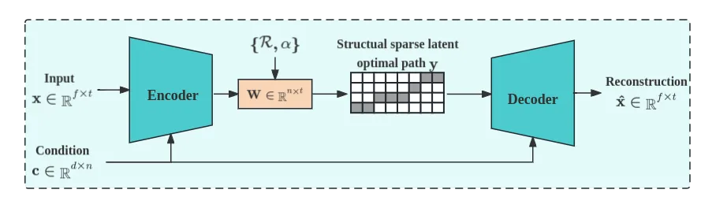

Figure 1: A pipeline of BDP-VAE. BDP-VAE captures the unobserved sparse
structural dependency (i.e., optimal paths on a DAG) in the latent space
in parallel training the model and allows gradient-based optimization
for learning the edge weights $`\mathbf{W}`$.

## 5 BDP-VAE

We now show how to apply the method in Section 4 to a conditional VAE
framework to obtain sparse latent optimal paths. An unconditional
BDP-VAE framework can be directly applied based on Corollary 4.6,
Corollary 4.7, and Lemma 4.10, but a conditional BDP-VAE framework may
be challenging in real applications. Given a sequential-like input
$`\mathbf{x}`$ with length $`t`$ and a sequential-like condition
$`\mathbf{c}`$ with length $`n`$, where $`t\neq n`$ and $`\{t,n\}`$ are
varying within the dataset. We wish to find an unobserved hard
structural relationship between $`\mathbf{x}`$ and $`\mathbf{c}`$ in the
latent space of VAEs denoted as $`\mathbf{y}`$. Conditional BDP-VAEs
consist of three parts: an encoder models posterior distribution
$`q(\mathbf{y}|\mathbf{x},\mathbf{c};\phi)`$, a decoder models the
distribution of $`p(\mathbf{x}|\mathbf{y},\mathbf{c};\theta)`$, and a
prior encoder models the prior distribution
$`p(\mathbf{y}|\mathbf{c};\theta)`$. An overview pipeline of BDP-VAE is
in Figure 1, which captures structured sparse optimal paths in the
latent space.

We assume the conditional input $`\mathbf{c}`$ is always observed and
the conditional ELBO is defined as

```math
\begin{split}\mathcal{L}(\phi,\theta,\mathbf{x}|\mathbf{c})=\mathbb{E}_{\mathbf{y}\sim q(\cdot|\mathbf{x},\mathbf{c};\phi)}\left[\log p(\mathbf{x}|\mathbf{y},\mathbf{c};\theta)\right]\\
-\mathcal{D}_{\mathrm{KL}}\left[q(\mathbf{y}|\mathbf{x},\mathbf{c};\phi)\big\|p(\mathbf{y}|\mathbf{c};\theta)\right].\end{split} \tag{28}
```

### 5.1 Posterior and Latent Optimal Paths

Given a DAG $`\mathcal{R}`$ with edge $`\mathcal{E}`$ and nodes
$`\mathcal{V}`$, the distribution of the posterior encoder is denoted as

```math
q(\mathbf{y}|\mathbf{x},\mathbf{c};\phi)=\mathcal{D}(\mathbf{y}|\mathcal{R},\mathbf{W}=\text{NN}_{\mathbf{W}}(\mathbf{x},\mathbf{c};\phi),\alpha) \tag{29}
```

where NN$`{}_{\mathbf{W}}(\cdot;\phi)`$ is a neural network to learn the
edge weights $`\mathbf{W}`$ of the DAG $`\mathcal{R}`$ and $`\alpha`$ is
a hyper-parameter. The latent optimal path $`\mathbf{y}`$ with
$`\{0,1\}`$ can be sampled reversely according to Lemma 4.5 and
Corollary 4.7. As a result, $`\mathbf{y}`$ forms a sparse matrix with
dimensions identical to those of the weight matrix $`\mathbf{W}`$. As
shown in Figure 1, the sparsity and structure of $`\mathbf{y}`$ are
inherently achieved through its construction using the DAG
$`\mathcal{R}`$¹¹ 1 In the case where the structure of DAGs
$`\mathcal{R}`$ is unknown. Since we are learning the DAG weights
$`\mathbf{W}`$ and zero weights are equivalent to removing an edge, in
some sense the BDP algorithm can in principle learn an approximate DAG
structure by imposing small edge weight values. However, in this study,
we target to verify our method on applications with a clear prior
knowledge of structure DAGs..

### 5.2 Conditional Prior

Denote the distribution of the conditional prior as

```math
p(\mathbf{y}|\mathbf{c};\theta)=\mathcal{D}(\mathbf{y}|\mathcal{R},\mathbf{W}^{(0)}=\text{NN}_{\mathbf{W^{(0)}}}(\mathbf{c};\theta),\alpha) \tag{30}
```

We have provided a closed-form KL divergence within the distribution
family $`\mathcal{D}(\mathcal{R},\cdot,\alpha)`$ in Lemma 4.10 which may
be convenient for unconditional generation by pre-setting the prior
distribution statistics directly or has tractable $`\mathbf{W}^{(0)}`$.

In most conditional generation tasks, the non-accessible $`\mathbf{x}`$
during the inference phase in real applications leads to problems on the
prior encoder when forming the edge weights $`\mathbf{W}^{(0)}`$ given
information on $`\mathbf{c}`$ only, especially in the case that
$`\mathbf{x}`$ has varying lengths $`t`$. To address this issue, we give
a flexible solution for inferring feature information of $`\mathbf{x}`$
given $`\mathbf{c}`$ to form the edge weights $`\mathbf{W}^{(0)}`$ in
the conditional prior. Inspired by Ma et al. (2019), we make use of a
flow-based model ²² 2 The flow-based conditional prior strategy is
proposed to solve the problem of forming edge weights
$`\mathbf{W}^{(0)}`$ in case of $`\mathbf{W}^{(0)}`$ is intractable if
$`\mathbf{x}`$ is non-accessible with varying lengths $`t`$. In
practical applications, this strategy is not mandatory if the task has a
known and fix prior $`\mathcal{D}(\mathcal{R},\mathbf{W}^{0},\alpha)`$
or tractable $`\mathbf{W}^{(0)}`$ (i.e., Lemma 4.10). as the conditional
prior to infer information about $`\mathbf{x}`$ condition on
$`\mathbf{c}`$ and further obtain edge weights $`\mathbf{W}^{(0)}`$.

Assume there exists a series of invertible transformations of random
variables $`\mathbf{x}`$, such that

```math
\mathbf{x}\mathrel{\hbox{\hskip 4.29346pt\hskip-4.29346pt\hbox{\hbox{\hskip 4.29346pt\hskip-2.22235pt\hbox{$\longleftarrow\!\!\!\!\!\!\!\!\longrightarrow$}\hskip-2.22235pt\hskip-4.29346pt\raisebox{11.3611pt}{\hbox{$\scriptstyle f_{1}$}}\hskip-4.29346pt\hskip 4.29346pt}}\hskip-4.29346pt\hskip-4.02763pt\raisebox{-7.01389pt}{\hbox{$\scriptstyle g_{1}$}}\hskip-4.02763pt\hskip 4.29346pt}}\cdots\mathrel{\hbox{\hskip 4.52782pt\hskip-4.52782pt\hbox{\hbox{\hskip 4.52782pt\hskip-2.22235pt\hbox{$\longleftarrow\!\!\!\!\!\!\!\!\longrightarrow$}\hskip-2.22235pt\hskip-4.52782pt\raisebox{11.3611pt}{\hbox{$\scriptstyle f_{k}$}}\hskip-4.52782pt\hskip 4.52782pt}}\hskip-4.52782pt\hskip-4.26201pt\raisebox{-7.01389pt}{\hbox{$\scriptstyle g_{k}$}}\hskip-4.26201pt\hskip 4.52782pt}}\mathbf{c}\mathrel{\hbox{\hskip 8.79872pt\hskip-8.79872pt\hbox{\hbox{\hskip 8.79872pt\hskip-2.22235pt\hbox{$\longleftarrow\!\!\!\!\!\!\!\!\longrightarrow$}\hskip-2.22235pt\hskip-8.79872pt\raisebox{11.89445pt}{\hbox{$\scriptstyle f_{k+1}$}}\hskip-8.79872pt\hskip 8.79872pt}}\hskip-8.79872pt\hskip-8.53291pt\raisebox{-7.01389pt}{\hbox{$\scriptstyle g_{k+1}$}}\hskip-8.53291pt\hskip 8.79872pt}}\cdots\mathrel{\hbox{\hskip 5.60944pt\hskip-5.60944pt\hbox{\hbox{\hskip 5.60944pt\hskip-2.22235pt\hbox{$\longleftarrow\!\!\!\!\!\!\!\!\longrightarrow$}\hskip-2.22235pt\hskip-5.60944pt\raisebox{11.3611pt}{\hbox{$\scriptstyle f_{K}$}}\hskip-5.60944pt\hskip 5.60944pt}}\hskip-5.60944pt\hskip-5.34361pt\raisebox{-7.01389pt}{\hbox{$\scriptstyle g_{K}$}}\hskip-5.34361pt\hskip 5.60944pt}}v \tag{31}
```

where $`f=f_{1}\circ\cdots\circ f_{K}`$ and $`v\sim N(0,1)`$ ($`\theta`$
is omitted for brevity), the KL divergence term in Equation 28 can be
written as

```math
\displaystyle\mathcal{D}_{\mathrm{KL}}\left[q(\mathbf{y}|\mathbf{x},\mathbf{c};\phi)\big\|p(\mathbf{y}|\mathbf{c};\theta)\right] \tag{32}
```

```math
\displaystyle~~=\mathcal{D}_{\mathrm{KL}}\left[q(\mathbf{y}|\mathbf{x},\mathbf{c};\phi)\big\|p(\mathbf{y}|\mathbf{x},\mathbf{c};\theta)\right]-\log p(\mathbf{x}|\mathbf{c};\theta)
```

```math
\displaystyle~~=-\log p_{N(0,1)}(f_{\theta}(\mathbf{x}))|\text{det}(\frac{\partial f_{\theta}(\mathbf{x})}{\partial\mathbf{x}})| \tag{33}
```

The backward pass is to infer the KL divergence during training. The
forward pass is to infer feature information of $`\mathbf{x}`$ given
$`\mathbf{c}`$ and form edge weight $`\mathbf{W}^{(0)}`$ during
inference.

### 5.3 Learning

Based on the idea of Mohamed et al. (2020), the gradient of the ELBO
(28) with respect to $`\theta`$ is straightforward, however, the
gradient with respect to $`\phi`$ of the reconstruction error part in
the ELBO is non-trivial. We make use of the REINFORCE estimator

```math
\displaystyle\nabla_{\phi}\,\mathbb{E}_{\mathbf{y}\sim q(\cdot|\mathbf{x},\mathbf{c};\phi)}\left[\log p(\mathbf{x}|\mathbf{y},\mathbf{c};\theta)\right] \tag{34}
```

```math
\displaystyle~~~~~~=\log p(\mathbf{x}|\mathbf{\tilde{y}},\mathbf{c};\theta)\nabla_{\phi}\,\log q(\mathbf{\tilde{y}}|\mathbf{x},\mathbf{c};\phi),
```

where $`\mathbf{\tilde{y}}`$ is an exact sample via Corollary 4.7 from
the posterior $`q(\cdot|\mathbf{x},\mathbf{c};\phi)`$, and we recall
that $`\log q(\mathbf{\tilde{y}}|\mathbf{x},\mathbf{c};\phi)`$ may be
computed using the efficient and exact closed-form of Equation 20, and
automatically differentiated.

Alternatively, we provide hints of Gumbel softmax trick to avoid using
the REINFORCE estimator in Appendix D for interested readers. In this
study, we focus on evaluating the closed form of latent sparse optimal
paths. Compared to the reparameterization trick discussed in Appendix D,
the log-derivative method (i.e., the REINFORCE estimator) has the
advantage of being the most straight-forward, is formally unbiased, does
not require the temperature parameter, and allows fast evaluation with
the closed form expression of sparse paths $`\mathbf{y}`$ in
Equation 20.

## 6 Experiments

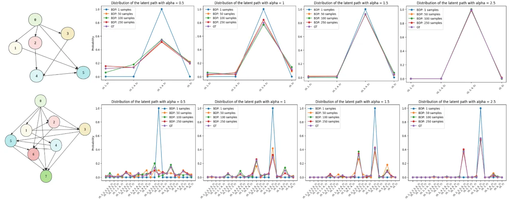

Figure 2: Toy experiments on BDP to find stochastic optimal paths under
randomly generated DAGs. The first row is a 5-node DAG and its density
plots with different $`\alpha`$ value. The second row is an 8-node DAG
and its density plots with different $`\alpha`$ value.

In this section, we conduct four experiments to verify our methods from
Section 4 and Section 5, and show its applicability on two real-world
applications. To show the generalization of methods in Section 4, we
extend BDP to two common application examples of computational graphs:
monotonic alignment (MA) (Kim et al., 2020) and dynamic time warping
(DTW)  (Sakoe & Chiba, 1978; Mensch & Blondel, 2018). Details of
examples of computational graphs, pseudo-codes, and time complexity
analysis are provided in Appendix E. We provide detailed model
architecture used in our experiments in Appendix F and experimental
details and setup in Appendix G.

### 6.1 Stochastic Optimal Paths on Toy DAGs

We conduct an experiment to demonstrate how BDP in Section 4 finds the
optimal paths on toy DAGs, in which the DAG structures and edge values
are randomly generated. In Figure 2, we plot approximated density plots
of path distributions with 1, 50, 100, and 250 samples by BDP compared
with the corresponding ground truth path density plot. As BDP samples
increase, the distribution of path samples will eventually converge to
the real path distribution.

We then studied how the value of the temperature parameter $`\alpha`$
affects the path distribution. The larger $`\alpha`$ is, the sharper the
distribution is, leading to an accurate optimal path result with less
sample time. Conversely, for too small $`\alpha`$, the BDP needs more
samples to obtain the optimal path. We conduct another experiment to
connect this finding with BDP-VAE in Section 6.5.

| Model                                     | Training       | Align.(Train) | Align. (Infer) | MCD                | RTF                     |
| ----------------------------------------- | -------------- | ------------- | -------------- | ------------------ | ----------------------- |
| FastSpeech2 (Ren et al., 2020) (Baseline) | Non end-to-end | Discrete      | Continuous     | 9.96 $`\pm`$ 1.01  | 3.87 $`\times 10^{-4}`$ |
| Tacotron2 (Shen et al., 2018a)            | End-to-end     | Continuous    | Continuous     | 11.39 $`\pm`$ 1.95 | 6.07 $`\times 10^{-4}`$ |
| VAENAR-TTS (Lu et al., 2021)              | End-to-end     | Continuous    | Continuous     | 8.18 $`\pm`$ 0.87  | 1.10 $`\times 10^{-4}`$ |
| Glow-TTS (Kim et al., 2020)               | End-to-end     | Discrete      | Continuous     | 8.58 $`\pm`$ 0.89  | 2.87 $`\times 10^{-4}`$ |
| BDPVAE-TTS (ours)                         | End-to-end     | Discrete      | Discrete       | 8.49 $`\pm`$ 0.96  | 3.00 $`\times 10^{-4}`$ |

Table 1: Mel Cepstral Distortion (MCD) and Real-Time Factor (RTF)
compared with other TTS models.

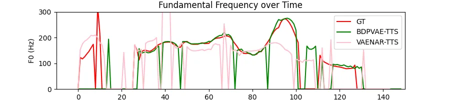

Figure 3: Inference F0 trajectory comparison with VAENAR-TTS of
utterance ”I suppose I have many thoughts.”. The intonation of
BDPVAE-TTS is close to the GT indicating that sparse optimal paths help
the decoder with a better understanding of how phoneme contributes to
the overall utterance with approximated durations.

### 6.2 Application: End-to-end Text-to-Speech

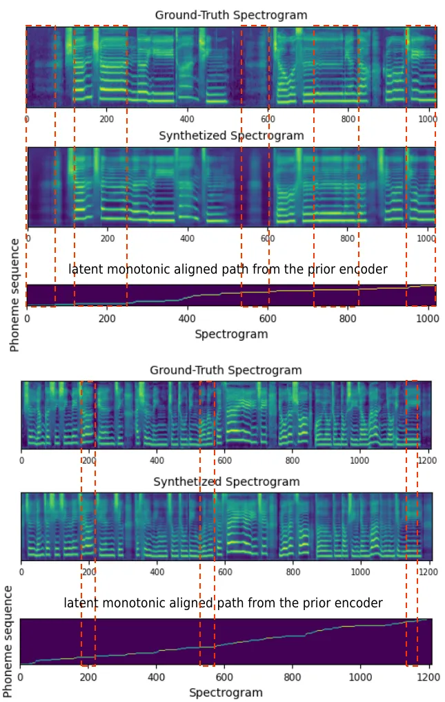

Figure 4: Visualization of GT, synthesized singing voice spectrogram,
and latent optimal path from the prior encoder. The GT and generated
spectrogram are almost identical, and the generated spectrogram has a
similar temporal structure to the inferred latent optimal path.

We apply the BDP-VAE framework with the computational graph of MA to
perform an end-to-end TTS model on the RyanSpeech (Zandie et al., 2021)
dataset. RyanSpeech contains 11279 audio clips (10 hours) of a
professional male voice actor’s speech recorded at 44.1kHz. We randomly
split 2000 clips for validation and 9297 clips for training.

The task of TTS involves an unobserved monotonic hard alignment that
maps phonemes to time intervals, since the order of the phonemes should
be preserved while the duration of each may vary in speech. Thus, TTS
models generate speech according to corresponding phonemes in which the
duration of each phoneme is discrete, structural, and
unobserved (Mehrish et al., 2023). To show the BDP-VAE framework can be
easily adapted into down-stream tasks, we redesigned the popular
non-end-to-end TTS model FastSpeech2 (Ren et al., 2020) into the BDP-VAE
framework, namely BDPVAE-TTS, which can capture unobserved hard
monotonic dependencies between phonemes and utterances jointly on both
training and inference.

We verify model performance by an objective metric, the Mel cepstral
distortion (MCD) (Kubichek, 1993; Chen et al., 2022), between ground
truths and synthesized outputs. We record inference speed by real-time
factor (RTF) per generated spectrogram frame. We randomly pick 70
sentences from the test set, the numerical results are shown in Table 1.
Our method outperforms the baseline on both MCD and RTF and achieves
end-to-end training. This shows the success of BDP-VAE in adapting a
non-end-to-end model that relies on external DP aligners into an
end-to-end pipeline.

We make a comparison with other end-to-end TTS models (Shen et al.,
2018a; Kim et al., 2020; Lu et al., 2021) which target capturing phoneme
dependencies. Shen et al. (2018a) models the unobserved temporal
dependencies by an auto-regressive architecture with attention. Kim
et al. (2020) integrate a monotonic alignment search in parallel in a
Glow model (Kingma & Dhariwal, 2018) to obtain hard monotonic alignment.
Lu et al. (2021) utilizes the latent Gaussian and captures soft
monotonic alignment in the decoder by causality-masked self-attention.
Among them, BDPVAE-TTS performs discrete monotonic alignment on both
training and inference that ensures model consistency for training and
inference. BDPVAE-TTS gets a better MCD and RTF than Shen et al. (2018a)
and Kim et al. (2020), but gets higher MCD and RTF than Lu et al.
(2021).

For the RTF, since BDPVAE-TTS involves a linear time consumption DP
algorithm which causes higher inference time than VAENAR-TTS. We have
discussed time complexity for capturing phoneme-to-frame dependencies
during training for each end-to-end TTS model in this experiment as
below. However, the linear time consumption (Corollary 4.11) is the best
we can do for solving a DP problem.

Time Complexity Analysis: Denote the maximum number of spectrogram
frames in the computational graph of MA is $`T_{mel}`$ and the maximum
number of phoneme tokens in the computational graph of MA is
$`T_{text}`$. In this experiment, BPDVAE-TTS obtains discrete latent
monotonic paths by BDP with $`\mathcal{O}(T_{mel})`$ time complexity
(detail implementations and discussion could be found in Section E.2.1).
Besides, the time complexity of monotonic alignment search (MAS) in
Glow-TT is $`\mathcal{O}(T_{text}\times T_{mel})`$ (Kim et al., 2020),
the time complexity of self-attention in VAENAR-TTS is
$`\mathcal{O}(1)`$ (Vaswani et al., 2017), and the time complexity of
auto-regressive TTS model (i.e., Tactron2 (Shen et al., 2018a)) is
$`\mathcal{O}(T_{mel})`$.

For the MCD, even though BDPVAE-TTS obtains a higher MCD than
VAENAR-TTS, BDPVAE-TTS captures discrete monotonic aligned paths in its
latent space on training and inference phase which ensures model’s train
and test consistency and improves the model’s interpretability.
VAENAR-TTS compresses the learned feature of spectrograms with
conditions into Gaussian latent variables and uses these in its decoder
for reconstruction. During the decoding process, these latent variables
are used alongside phonemes to reconstruct the outputs. In contrast, the
latent variables in BDPVAE-TTS are designed to capture phoneme-duration
dependencies. This focus provides the decoder with a nuanced
understanding of how the phoneme contributes to the overall speech
utterance, which can be interpreted by the inference fundamental
frequency (F0) in Figure 3. We provide detailed additional
interpretations in Appendix H.

### 6.3 Application: End-to-end Singing Voice Synthesis

We extend the BDP-VAE with MA for end-to-end SVS on the popcs
dataset (Liu et al., 2022). We perform this experiment not to compare
with other models as in Section 6.2, but to demonstrate the utility of
our method in a related task. In SVS, the longer phoneme duration also
provides an opportunity to visualize the monotonically aligned optimal
path clearly. The popcs contains 117 Chinese Mandarin pop songs (5
hours) collected from a qualified female vocalist. We randomly split 50
clips for inference and the rest for training. During the inference
phase, the conditional inputs are the fundamental frequency and lyrics
of the song clips.

Similar to TTS task, SVS task also involves unobserved structural
dependencies. BDP-VAE framework could help the SVS task to capture the
discrete structural dependencies in parallel, leading to an end to end
framework and a better model interpretability.

Two inference results are visualized in Figure 4 where red rectangles
indicate that the temporal structure between the generated
Mel-spectrogram and ground truth is almost identical. As expected, the
decoder of BDP-VAE synthesizes spectrograms according to the extended
conditions (i.e., the phonemes) mapping by the dependency of the latent
monotonic path from the prior encoder. Therefore, the decoder
synthesizes singing voice according to latent path-aligned phoneme
conditions.

| Model    | Distribution                                                            | Train | Inference         |
| -------- | ----------------------------------------------------------------------- | ----- | ----------------- |
| BDP-VAE  | $`\mathcal{D}(\mathcal{R}_{\text{DTW}},\text{NN}_{\{\phi/\theta\}},1)`$ | 2.92  | 3.93 $`\pm`$ 0.37 |
| Baseline | $`\mathcal{D}(\mathcal{R}_{\text{DTW}},\mathbf{W}_{U(0,1)},1)`$         | 5.67  | 5.69 $`\pm`$ 0.31 |

Table 2: Mean absolute error and standard deviation (MAE/MAE$`\pm`$STD)
of phoneme duration on TIMIT.

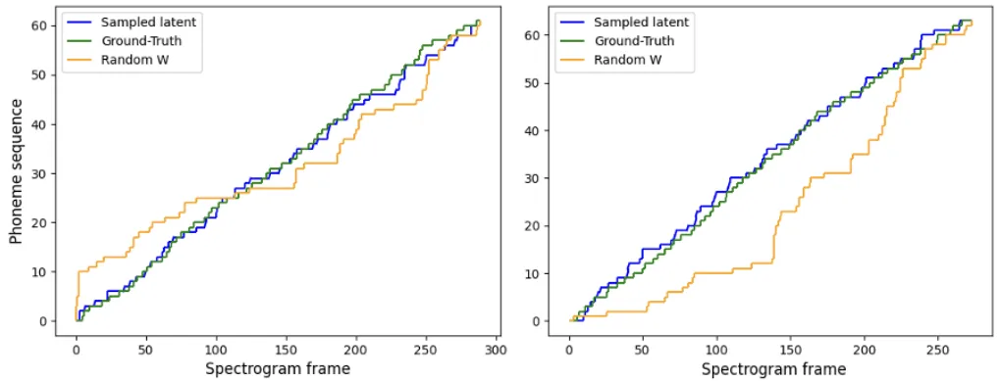

Figure 5: Visualization of GT alignment between phoneme tokens and
spectrogram frames, latent optimal paths from the encoder, optimal paths
from random latent space for two audio clips. BDP-VAE achieves closer
alignments with GT, indicating its effectiveness in finding latent
optimal paths.

### 6.4 Verify Behaviour of Latent Optimal Path in BDP-VAE

To verify the behaviour and generalization of the latent optimal paths
in BDP-VAE, we obtain latent optimal paths under the computational graph
of DTW on the TIMIT speech corpus dataset (Garofolo et al., 1992) which
includes manually time-aligned phonetic and word transcriptions. TIMIT
contains English speech of 630 speakers which utterances are recorded as
16-bit 16kHz speech waveform files. We randomly split 50 clips for
testing and 580 clips for training.

To the best of our knowledge, there are no existing similar works that
enable VAEs to obtain hard latent optimal paths given any defined DAG
structures. Thus, inspired by the experimental designs in  Mensch &
Blondel (2018) and  Van Den Oord et al. (2017), we set a latent
distribution
$`\mathcal{D}(\mathcal{R}_{\text{DTW}},\mathbf{W}=\{w\in\mathbf{W}\sim U(0,1)\},1)`$
as the baseline due to lack of direct comparison. The random baseline
still follows the DTW constraint with uniform edge weights, which can
verify the behaviour of latent space in BPD-VAE.

We take a summation along the spectrogram dimension to obtain phoneme
duration and compute the mean absolute error (MAE) between the ground
truth and the phoneme duration. We input phoneme tokens and spectrogram
lengths as conditions on inference to obtain latent optimal paths of the
prior encoder. We repeat the inference 5 times and take the average and
standard deviation of MAEs as our metric of evaluation. As in Table 2,
our MAE is lower than the baseline indicating that the BDP-VAE captures
meaningful information to obtain stochastic optimal paths in the latent
space and is not merely guessing randomly. Figure 5 visualizes
ground-truth alignments, latent optimal paths from BDP-VAE, and optimal
paths from the baseline latent distribution on two audio clips, which
clearly shows the latent optimal path from BDP-VAE under DTW gets a
close alignment to the GT. This indicates BDP-VAE has the ability to
learn informative edge weights $`\mathbf{W}`$ and capture sparse optimal
paths in latent space.

### 6.5 Sensitivity of Hyper-parameter in BDP-VAE

| Model   | Alpha | Train | Inference         |
| ------- | ----- | ----- | ----------------- |
| BDP-VAE | 0.5   | 2.99  | 4.40 $`\pm`$ 0.46 |
| BDP-VAE | 1     | 2.92  | 3.93 $`\pm`$ 0.37 |
| BDP-VAE | 1.5   | 2.94  | 3.89 $`\pm`$ 0.35 |
| BDP-VAE | 2     | 3.01  | 4.08 $`\pm`$ 0.27 |
| BDP-VAE | 3     | 3.25  | 4.53 $`\pm`$ 0.10 |

Table 3: Mean absolute error and standard deviation (MAE / MAE $`\pm`$
STD) for the duration on TIMIT with different hyper-parameter $`\alpha`$
settings.

To study the sensitivity of the temperature parameter $`\alpha`$, we
extend the experiment in Section 6.4. Table 3 shows the MAE value on the
training and inference phase with different $`\alpha`$ settings. As
discussed in Section 6.1, the $`\alpha`$ affects the sharpness of the
path distribution. When $`\alpha`$ is smaller, the distribution is more
stochastic. As $`\alpha`$ increases, the distribution becomes sharper.
However, when the $`\alpha`$ value becomes large, the latent path
alignment performance decreases, which is consistent with the
contribution of temperature in Platt (2000). In BDP-VAE, the model with
too large $`\alpha`$ may not capture enough variety of data, conversely,
for too small $`\alpha`$ the model becomes too spread out and lacks
meaningful structure, with the distribution approaching uniform as
$`\alpha\rightarrow 0`$. In real applications, the value of $`\alpha`$
in BDP-VAE should be located in a reasonable range which could be found
by tuning or setting a learnable parameter.

## 7 Conclusion

We introduce a probabilistic softening solution to the classical optimal
path problem on DAGs, as stochastic optimal paths. To achieve
variational Bayesian inference with latent paths, we give efficient and
tractable algorithms for sampling, likelihood and KL divergence within
the family of path distributions in linear time with respect to edge
numbers by dynamic programming with properties of the Gumbel
distribution as message-passing, namely Bayesian dynamic programming
with Gumbel propagation. We demonstrate the usage of stochastic optimal
paths in VAE framework and propose BDP-VAE. BDP-VAE captures sparse
optimal paths as latent representations given a DAG and further achieves
end-to-end training for downstream generative tasks that rely on
unobserved structural relationships. We showed how the BDP finds
stochastic optimal paths under general small toy DAGs and demonstrated
the BDP-VAE with the computational graph of monotonic alignment on two
real-world applications to achieve an end-to-end framework. We verified
the behaviour and generalization of the latent optimal paths under the
computational graph of dynamic time warping. We also studied the
sensitivity of the hyper-parameter $`\alpha`$ and gave suggestions for
real applications. Our experiments show the success of our approach on
generative tasks where it achieves end-to-end training involving
unobserved sparse structural optimal paths. Beyond VAE, the BDP can
potentially be integrated into other probabilistic frameworks or
planning in model-based reinforcement learning to obtain latent paths
that leave for future extensions.  
Limitations: As a discrete latent variable model, BDP-VAE uses the
REINFORCE estimator which may lead to high gradient variance and slow
convergence during training. This limitation may be solved by involving
variance reduction techniques during training.

## Impact Statement

This paper presents work whose goal is to advance the field of Machine
Learning and applications of its downstream tasks. There are many
potential societal consequences of our work; however, we do not foresee
our methods bringing negative social impacts.

## References

- \[1\] Amos, B. and Kolter, J. Z. Optnet: Differentiable optimization
  as a layer in neural networks. In Precup, D. and Teh, Y. W. (eds.),
  _Proceedings of the 34th International Conference on Machine Learning,
  ICML 2017, Sydney, NSW, Australia, 6-11 August 2017_, volume 70 of
  _Proceedings of Machine Learning Research_, pp. 136–145. PMLR, 2017.
  URL
  [http://proceedings.mlr.press/v70/amos17a.html](http://proceedings.mlr.press/v70/amos17a.html).
- \[2\] BakIr, G., Hofmann, T., Smola, A. J., Schölkopf, B., and
  Taskar, B. _Predicting structured data_. MIT press, 2007.
- \[3\] Cai, X., Xu, T., Yi, J., Huang, J., and Rajasekaran, S. Dtwnet:
  a dynamic time warping network. _Advances in neural information
  processing systems_, 32, 2019.
- \[4\] Chen, Q., Tan, M., Qi, Y., Zhou, J., Li, Y., and Wu, Q. V2C:
  visual voice cloning. In _IEEE/CVF Conference on Computer Vision and
  Pattern Recognition, CVPR 2022, New Orleans, LA, USA, June 18-24,
  2022_, pp. 21210–21219. IEEE, 2022. doi: 10.1109/CVPR52688.2022.02056.
  URL
  [https://doi.org/10.1109/CVPR52688.2022.02056](https://doi.org/10.1109/CVPR52688.2022.02056).
- \[5\] Chiu, C. and Raffel, C. Monotonic chunkwise attention. In _6th
  International Conference on Learning Representations, ICLR 2018,
  Vancouver, BC, Canada, April 30 - May 3, 2018, Conference Track
  Proceedings_. OpenReview.net, 2018. URL
  [https://openreview.net/forum?id=Hko85plCW](https://openreview.net/forum?id=Hko85plCW).
- \[6\] Deng, Y., Kim, Y., Chiu, J. T., Guo, D., and Rush, A. M. Latent
  alignment and variational attention. In Bengio, S., Wallach, H. M.,
  Larochelle, H., Grauman, K., Cesa-Bianchi, N., and Garnett, R. (eds.),
  _Advances in Neural Information Processing Systems 31: Annual
  Conference on Neural Information Processing Systems 2018, NeurIPS
  2018, December 3-8, 2018, Montréal, Canada_, pp. 9735–9747, 2018. URL
  [https://proceedings.neurips.cc/paper/2018/hash/b691334ccf10d4ab144d672f7783c8a3-Abstract.html](https://proceedings.neurips.cc/paper/2018/hash/b691334ccf10d4ab144d672f7783c8a3-Abstract.html).
- \[7\] Djolonga, J. and Krause, A. Differentiable learning of
  submodular functions. In Guyon, I., von Luxburg, U., Bengio, S.,
  Wallach, H. M., Fergus, R., Vishwanathan, S. V. N., and Garnett, R.
  (eds.), _Advances in Neural Information Processing Systems 30: Annual
  Conference on Neural Information Processing Systems 2017, December
  4-9, 2017, Long Beach, CA, USA_, pp. 1013–1023, 2017. URL
  [https://proceedings.neurips.cc/paper/2017/hash/192fc044e74dffea144f9ac5dc9f3395-Abstract.html](https://proceedings.neurips.cc/paper/2017/hash/192fc044e74dffea144f9ac5dc9f3395-Abstract.html).
- \[8\] Garofolo, J., Lamel, L., Fisher, W., Fiscus, J., Pallett, D.,
  Dahlgren, N., and Zue, V. Timit acoustic-phonetic continuous speech
  corpus. _Linguistic Data Consortium_, 11 1992.
- \[9\] Halperin, T., Ephrat, A., and Peleg, S. Dynamic temporal
  alignment of speech to lips. In _ICASSP 2019-2019 IEEE International
  Conference on Acoustics, Speech and Signal Processing (ICASSP)_, pp.
  3980–3984. IEEE, 2019.
- \[10\] Hasegawa-Johnson, M., Cole, J., Hirschberg, J., Jilka, M., and
  Tannenbaum, R. Penn phonetics toolkit (p2tk): A software suite for
  sound analysis as a function of time. Technical report, Department of
  Linguistics, University of Pennsylvania, 2005.
- \[11\] Heckerman, D. A tutorial on learning with bayesian networks. In
  Jordan, M. I. (ed.), _Learning in Graphical Models_, volume 89 of
  _NATO ASI Series_, pp. 301–354. Springer Netherlands, 1998. doi:
  10.1007/978-94-011-5014-9\\11. URL
  [https://doi.org/10.1007/978-94-011-5014-9_11](https://doi.org/10.1007/978-94-011-5014-9_11).
- \[12\] Jang, E., Gu, S., and Poole, B. Categorical reparameterization
  with gumbel-softmax. In _5th International Conference on Learning
  Representations, ICLR 2017, Toulon, France, April 24-26, 2017,
  Conference Track Proceedings_. OpenReview.net, 2017. URL
  [https://openreview.net/forum?id=rkE3y85ee](https://openreview.net/forum?id=rkE3y85ee).
- \[13\] Jeong, M., Kim, H., Cheon, S. J., Choi, B. J., and Kim, N. S.
  Diff-tts: A denoising diffusion model for text-to-speech. In
  Hermansky, H., Cernocký, H., Burget, L., Lamel, L., Scharenborg, O.,
  and Motlícek, P. (eds.), _Interspeech 2021, 22nd Annual Conference of
  the International Speech Communication Association, Brno, Czechia, 30
  August - 3 September 2021_, pp. 3605–3609. ISCA, 2021. doi:
  10.21437/Interspeech.2021-469. URL
  [https://doi.org/10.21437/Interspeech.2021-469](https://doi.org/10.21437/Interspeech.2021-469).
- \[14\] Kim, J., Kim, S., Kong, J., and Yoon, S. Glow-tts: A generative
  flow for text-to-speech via monotonic alignment search. _Advances in
  Neural Information Processing Systems_, 33:8067–8077, 2020.
- \[15\] Kingma, D. P. and Dhariwal, P. Glow: Generative flow with
  invertible 1x1 convolutions. _Advances in neural information
  processing systems_, 31, 2018.
- \[16\] Kingma, D. P. and Welling, M. Auto-encoding variational bayes.
  In Bengio, Y. and LeCun, Y. (eds.), _2nd International Conference on
  Learning Representations, ICLR 2014, Banff, AB, Canada, April 14-16,
  2014, Conference Track Proceedings_, 2014. URL
  [http://arxiv.org/abs/1312.6114](http://arxiv.org/abs/1312.6114).
- \[17\] Kubichek, R. Mel-cepstral distance measure for objective speech
  quality assessment. In _Proceedings of IEEE pacific rim conference on
  communications computers and signal processing_, volume 1, pp.
  125–128. IEEE, 1993.
- \[18\] Li, B., Zhao, Y., Zhelun, S., and Sheng, L. Danceformer: Music
  conditioned 3d dance generation with parametric motion transformer. In
  _Proceedings of the AAAI Conference on Artificial Intelligence_, pp.
  1272–1279, 2022.
- \[19\] Li, N., Liu, S., Liu, Y., Zhao, S., Liu, M., and Zhou, M. Close
  to human quality TTS with transformer. _CoRR_, abs/1809.08895, 2018.
  URL
  [http://arxiv.org/abs/1809.08895](http://arxiv.org/abs/1809.08895).
- \[20\] Liu, J., Li, C., Ren, Y., Chen, F., and Zhao, Z. Diffsinger:
  Singing voice synthesis via shallow diffusion mechanism. In
  _Proceedings of the AAAI Conference on Artificial Intelligence_, pp.
  11020–11028, 2022.
- \[21\] Lu, H., Wu, Z., Wu, X., Li, X., Kang, S., Liu, X., and Meng, H.
  Vaenar-tts: Variational auto-encoder based non-autoregressive
  text-to-speech synthesis. _arXiv preprint arXiv:2107.03298_, 2021.
- \[22\] Ma, X., Zhou, C., Li, X., Neubig, G., and Hovy, E. FlowSeq:
  Non-autoregressive conditional sequence generation with generative
  flow. In _Proceedings of the 2019 Conference on Empirical Methods in
  Natural Language Processing and the 9th International Joint Conference
  on Natural Language Processing (EMNLP-IJCNLP)_, pp. 4282–4292, Hong
  Kong, China, November 2019. Association for Computational Linguistics.
  doi: 10.18653/v1/D19-1437. URL
  [https://aclanthology.org/D19-1437](https://aclanthology.org/D19-1437).
- \[23\] Maddison, C. J., Tarlow, D., and Minka, T. A\* sampling.
  _Advances in neural information processing systems_, 27, 2014.
- \[24\] Maddison, C. J., Mnih, A., and Teh, Y. W. The concrete
  distribution: A continuous relaxation of discrete random variables. In
  _5th International Conference on Learning Representations, ICLR 2017,
  Toulon, France, April 24-26, 2017, Conference Track Proceedings_.
  OpenReview.net, 2017. URL
  [https://openreview.net/forum?id=S1jE5L5gl](https://openreview.net/forum?id=S1jE5L5gl).
- \[25\] McAuliffe, M., Socolof, M., Mihuc, S., Wagner, M., and
  Sonderegger, M. Montreal forced aligner: Trainable text-speech
  alignment using kaldi. In Lacerda, F. (ed.), _Interspeech 2017, 18th
  Annual Conference of the International Speech Communication
  Association, Stockholm, Sweden, August 20-24, 2017_, pp. 498–502.
  ISCA, 2017. URL
  [http://www.isca-speech.org/archive/Interspeech_2017/abstracts/1386.html](http://www.isca-speech.org/archive/Interspeech_2017/abstracts/1386.html).
- \[26\] Mehrish, A., Majumder, N., Bharadwaj, R., Mihalcea, R., and
  Poria, S. A review of deep learning techniques for speech processing.
  _Information Fusion_, pp. 101869, 2023.
- \[27\] Mensch, A. and Blondel, M. Differentiable dynamic programming
  for structured prediction and attention. In _International Conference
  on Machine Learning_, pp. 3462–3471. PMLR, 2018.
- \[28\] Mohamed, S., Rosca, M., Figurnov, M., and Mnih, A. Monte carlo
  gradient estimation in machine learning. _J. Mach. Learn. Res._,
  21(132):1–62, 2020.
- \[29\] Peng, K., Ping, W., Song, Z., and Zhao, K. Non-autoregressive
  neural text-to-speech. In _International conference on machine
  learning_, pp. 7586–7598. PMLR, 2020.
- \[30\] Petrov, S. and Klein, D. Discriminative log-linear grammars
  with latent variables. In Platt, J. C., Koller, D., Singer, Y., and
  Roweis, S. T. (eds.), _Advances in Neural Information Processing
  Systems 20, Proceedings of the Twenty-First Annual Conference on
  Neural Information Processing Systems, Vancouver, British Columbia,
  Canada, December 3-6, 2007_, pp. 1153–1160. Curran Associates,
  Inc., 2007. URL
  [https://proceedings.neurips.cc/paper/2007/hash/9cc138f8dc04cbf16240daa92d8d50e2-Abstract.html](https://proceedings.neurips.cc/paper/2007/hash/9cc138f8dc04cbf16240daa92d8d50e2-Abstract.html).
- \[31\] Platt, J. Probabilistic outputs for support vector machines and
  comparison to regularized likelihood methods. In _Advances in Large
  Margin Classifiers_, 2000.
- \[32\] Popov, V., Vovk, I., Gogoryan, V., Sadekova, T., and
  Kudinov, M. Grad-tts: A diffusion probabilistic model for
  text-to-speech. In _International Conference on Machine Learning_, pp.
  8599–8608. PMLR, 2021.
- \[33\] Rabiner, L. R. A tutorial on hidden markov models and selected
  applications in speech recognition. _Proc. IEEE_, 77(2):257–286, 1989.
  doi: 10.1109/5.18626. URL
  [https://doi.org/10.1109/5.18626](https://doi.org/10.1109/5.18626).
- \[34\] Ren, Y., Ruan, Y., Tan, X., Qin, T., Zhao, S., Zhao, Z., and
  Liu, T.-Y. Fastspeech: Fast, robust and controllable text to speech.
  _Advances in Neural Information Processing Systems_, 32, 2019.
- \[35\] Ren, Y., Hu, C., Tan, X., Qin, T., Zhao, S., Zhao, Z., and Liu,
  T.-Y. Fastspeech 2: Fast and high-quality end-to-end text to speech.
  _arXiv preprint arXiv:2006.04558_, 2020.
- \[36\] Sakoe, H. and Chiba, S. Dynamic programming algorithm
  optimization for spoken word recognition. _IEEE transactions on
  acoustics, speech, and signal processing_, 26(1):43–49, 1978.
- \[37\] Shen, J., Pang, R., Weiss, R. J., Schuster, M., Jaitly, N.,
  Yang, Z., Chen, Z., Zhang, Y., Wang, Y., Ryan, R., Saurous, R. A.,
  Agiomyrgiannakis, Y., and Wu, Y. Natural TTS synthesis by conditioning
  wavenet on MEL spectrogram predictions. In _2018 IEEE International
  Conference on Acoustics, Speech and Signal Processing, ICASSP 2018,
  Calgary, AB, Canada, April 15-20, 2018_, pp. 4779–4783. IEEE, 2018a.
  doi: 10.1109/ICASSP.2018.8461368. URL
  [https://doi.org/10.1109/ICASSP.2018.8461368](https://doi.org/10.1109/ICASSP.2018.8461368).
- \[38\] Shen, J., Pang, R., Weiss, R. J., Schuster, M., Jaitly, N.,
  Yang, Z., Chen, Z., Zhang, Y., Wang, Y., Skerrv-Ryan, R., et al.
  Natural tts synthesis by conditioning wavenet on mel spectrogram
  predictions. In _2018 IEEE international conference on acoustics,
  speech and signal processing (ICASSP)_, pp. 4779–4783. IEEE, 2018b.
- \[39\] Struminsky, K., Gadetsky, A., Rakitin, D., Karpushkin, D., and
  Vetrov, D. P. Leveraging recursive gumbel-max trick for approximate
  inference in combinatorial spaces. In Ranzato, M., Beygelzimer, A.,
  Dauphin, Y. N., Liang, P., and Vaughan, J. W. (eds.), _Advances in
  Neural Information Processing Systems 34: Annual Conference on Neural
  Information Processing Systems 2021, NeurIPS 2021, December 6-14,
  2021, virtual_, pp. 10999–11011, 2021. URL
  [https://proceedings.neurips.cc/paper/2021/hash/5b658d2a925565f0755e035597f8d22f-Abstract.html](https://proceedings.neurips.cc/paper/2021/hash/5b658d2a925565f0755e035597f8d22f-Abstract.html).
- \[40\] Tralie, C. and Dempsey, E. Exact, parallelizable dynamic time
  warping alignment with linear memory. _arXiv preprint
  arXiv:2008.02734_, 2020.
- \[41\] Van Den Oord, A., Vinyals, O., et al. Neural discrete
  representation learning. _Advances in neural information processing
  systems_, 30, 2017.
- \[42\] Vaswani, A., Shazeer, N., Parmar, N., Uszkoreit, J., Jones, L.,
  Gomez, A. N., Kaiser, Ł., and Polosukhin, I. Attention is all you
  need. _Advances in neural information processing systems_, 30, 2017.
- \[43\] Verdu, S. and Poor, H. V. Abstract dynamic programming models
  under commutativity conditions. _SIAM Journal on Control and
  Optimization_, 25(4):990–1006, 1987.
- \[44\] Yu, L., Blunsom, P., Dyer, C., Grefenstette, E., and
  Kocisky, T. The neural noisy channel. _arXiv preprint
  arXiv:1611.02554_, 2016a.
- \[45\] Yu, L., Buys, J., and Blunsom, P. Online segment to segment
  neural transduction. _arXiv preprint arXiv:1609.08194_, 2016b.
- \[46\] Zandie, R., Mahoor, M. H., Madsen, J., and Emamian, E. S.
  Ryanspeech: A corpus for conversational text-to-speech synthesis.
  _ISCA_, 2021. doi: 10.21437/Interspeech.2021-341. URL
  [https://doi.org/10.21437/Interspeech.2021-341](https://doi.org/10.21437/Interspeech.2021-341).

## Appendix A Proofs of each lemma in Gumbel propagation

### A.1 Proofs for Lemma 4.2

###### Proof.

The result follows directly from (6) and (5). ∎

### A.2 Proofs for Lemma 4.3

###### Proof.

The result follows directly from (6) and (5). ∎

### A.3 Proofs for Lemma 4.4

###### Proof.

From the DAG structure of $`\mathcal{R}`$ we have

```math
\displaystyle\mathcal{Y}(1,v)=\bigcup_{u\in\mathcal{P}(v)}\left\{\mathbf{y}\cdot v:\forall\mathbf{y}\in\mathcal{Y}(1,u)\right\}, \tag{35}
```

where $`\mathbf{y}\cdot v=(y_{1},y_{2},\dots,y_{\left|y\right|},v)`$
denotes concatenation.

Then we have

```math
\displaystyle\mu_{v} \displaystyle=\log\sum_{\mathbf{y}\in\mathcal{Y}(1,v)}\exp(\alpha\left\|\mathbf{y}\right\|_{\mathbf{W}}) \tag{36}
```

```math
\displaystyle=\log\sum_{\mathbf{y}\in\bigcup_{u\in\mathcal{P}(v)}\left\{\widehat{\mathbf{y}}\cdot v:\forall\widehat{\mathbf{y}}\in\mathcal{Y}(1,u)\right\}}\exp(\alpha\left\|\mathbf{y}\right\|_{\mathbf{W}}) \tag{37}
```

```math
\displaystyle=\log\sum_{u\in\mathcal{P}(v)}\sum_{\widehat{\mathbf{y}}\in\mathcal{Y}(1,u)}\exp(\alpha\left\|\widehat{\mathbf{y}}\cdot v\right\|_{\mathbf{W}}) \tag{38}
```

```math
\displaystyle=\log\sum_{u\in\mathcal{P}(v)}\sum_{\widehat{\mathbf{y}}\in\mathcal{Y}(1,u)}\exp\Big(\alpha\left\|\widehat{\mathbf{y}}\right\|_{\mathbf{W}}+\alpha\,w_{u,v}\Big) \tag{39}
```

```math
\displaystyle=\log\sum_{u\in\mathcal{P}(v)}\exp\Big(\log\sum_{\widehat{\mathbf{y}}\in\mathcal{Y}(1,u)}\exp\big(\alpha\left\|\widehat{\mathbf{y}}\right\|_{\mathbf{W}}\big)+\alpha\,w_{u,v}\Big) \tag{40}
```

```math
\displaystyle=\log\sum_{u\in\mathcal{P}(v)}\exp\Big(\mu_{u}+\alpha\,w_{u,v}\Big), \tag{41}
```

where Equation 36 restates (15), Equation 37 follows from (35),
Equation 38 expands the summation, Equation 39 follows from the
definition of $`\left\|\mathbf{y}\right\|_{\mathbf{W}}`$, Equation 40
follows from the identity

```math
\displaystyle\sum_{i}\exp(a+b_{i})=\exp(a+\log\sum_{i}\exp(b_{i})), \tag{42}
```

Equation 41 follows from

```math
\displaystyle\mu_{v}=\log\sum_{\mathbf{y}\in\mathcal{Y}(1,v)}\exp(\alpha\left\|\mathbf{y}\right\|_{\mathbf{W}}) \tag{43}
```

yielding Equation 17 as required. ∎

## Appendix B Proofs of each lemma in Sampling and Likelihood

### B.1 Proofs for Lemma 4.5

###### Proof.

Assuming without loss of generality that $`v=N`$,

```math
\displaystyle\pi_{u,v} \displaystyle=p(y_{i-1}=u|y_{i}=v,u\in\mathcal{P}(v)) \tag{44}
```

```math
\displaystyle=\frac{p(y_{i-1}=u,y_{i}=v|u\in\mathcal{P}(v))}{p(y_{i}=v)} \tag{45}
```

```math
\displaystyle=\frac{1}{p(y_{i}=v)}\sum_{\widetilde{\mathbf{y}}\in\mathcal{Y}(1,u)}p(Y=\widetilde{\mathbf{y}}\cdot v) \tag{46}
```

```math
\displaystyle=\frac{1}{p(y_{i}=v)}\sum_{\widetilde{\mathbf{y}}\in\mathcal{Y}(1,u)}\frac{\exp(\alpha\left\|\widetilde{\mathbf{y}}\cdot v\right\|_{\mathbf{W}})}{\sum_{\widehat{\mathbf{y}}\in\mathcal{Y}(1,N)}\exp(\alpha\left\|\widehat{\mathbf{y}}\right\|_{\mathbf{W}})} \tag{47}
```

```math
\displaystyle\propto\sum_{\widetilde{\mathbf{y}}\in\mathcal{Y}(1,u)}\exp(\alpha\left\|\widetilde{\mathbf{y}}\right\|_{\mathbf{W}}+\alpha\,w_{u,v}) \tag{48}
```

```math
\displaystyle\propto\exp\big(\log\sum_{\widetilde{\mathbf{y}}\in\mathcal{Y}(1,u)}\exp(\alpha\left\|\widetilde{\mathbf{y}}\right\|_{\mathbf{W}})+\alpha\,w_{u,v}\big) \tag{49}
```

```math
\displaystyle\propto\exp\big(\mu_{u}+\alpha\,w_{u,v}\big) \tag{50}
```

```math
\displaystyle=\frac{\exp\big(\mu_{u}+\alpha\,w_{u,v}\big)}{\sum_{\widetilde{u}\in\mathcal{P}(v)}\exp\big(\mu_{\widetilde{u}}+\alpha\,w_{\widetilde{u},v}\big)} \tag{51}
```

```math
\displaystyle=\frac{\exp(\mu_{u}+\alpha\,w_{u,v})}{\exp(\mu_{v})}, \tag{52}
```

where Equation 45 rewrite (44) by the rule of conditional probability,
Equation 46 marginalises over $`\mathbf{y}_{<i-1}`$, Equation 47 extend
the probability by Equation 9, Equation 48 neglects factors that do not
depend on $`u`$, Equation 49 uses the identity of (42) then get
Equation 50 according to Equation 15. Equation 51 makes the
normalization explicit and Equation 52 uses (17) to recover Equation 19
as required. ∎

## Appendix C Proofs of each lemma in KL Divergence

### C.1 Proofs for Lemma 4.9

###### Proof.

From the DAG structure of $`\mathcal{R}`$ we have, for all edges
$`(u,v)\in\mathcal{E}`$,

```math
\displaystyle\mathcal{Y}(1,v)=\bigcup_{\mathbf{l}\in\mathcal{Y}(1,u)}\bigcup_{\mathbf{r}\in\mathcal{Y}(v,N)}\mathbf{l}\cdot\mathbf{r}, \tag{53}
```

where we recall $`\mathbf{l}\cdot\mathbf{r}`$ denotes concatenation. We
therefore have

```math
\displaystyle\omega_{u,v} \displaystyle=\sum_{\{\mathbf{y}\in\mathcal{Y}(1,N):(u,v)\in\mathbf{y}\}}\mathcal{D}(\mathbf{y}|\mathcal{R},\mathbf{W},\alpha) \tag{54}
```

```math
\displaystyle=\sum_{\{\mathbf{y}\in\mathcal{Y}(1,N):(u,v)\in\mathbf{y}\}}\prod_{(u^{\prime},v^{\prime})\in\mathbf{y}}\pi_{u^{\prime},v^{\prime}} \tag{55}
```

```math
\displaystyle=\sum_{\mathbf{l}\in\mathcal{Y}(1,u)}\sum_{\mathbf{r}\in\mathcal{Y}(v,N)}\prod_{(u^{\prime},v^{\prime})\in\mathbf{l}\cdot\mathbf{r}}\pi_{u^{\prime},v^{\prime}} \tag{56}
```

```math
\displaystyle=\sum_{\mathbf{l}\in\mathcal{Y}(1,u)}\sum_{\mathbf{r}\in\mathcal{Y}(v,N)}\pi_{u,v}\prod_{(u^{\prime},v^{\prime})\in\mathbf{l}}\pi_{u^{\prime},v^{\prime}}\prod_{(u^{\prime},v^{\prime})\in\mathbf{r}}\pi_{u^{\prime\prime},v^{\prime\prime}} \tag{57}
```

```math
\displaystyle=\pi_{u,v}\underbrace{\sum_{\mathbf{l}\in\mathcal{Y}(1,u)}\prod_{(u^{\prime},v^{\prime})\in\mathbf{l}}\pi_{u^{\prime},v^{\prime}}}_{\equiv\lambda_{u}}\underbrace{\sum_{\mathbf{r}\in\mathcal{Y}(v,N)}\prod_{(u^{\prime},v^{\prime})\in\mathbf{r}}\pi_{u^{\prime\prime},v^{\prime\prime}}}_{\equiv\rho_{v}}, \tag{58}
```

where (54) restates (21), (55) uses the chain rule of probability using
Equation 20, (56) follows from (53), (57) re-factors the product and the
final (58) rearranges sums and products.

Finally, it is straightforward to show by induction that the
$`\lambda_{u}`$ and $`\rho_{v}`$ defined in (58) above obey the classic
sum-of-product recursions given in the statement of the lemma. For
example,

```math
\displaystyle\lambda_{v} \displaystyle=\sum_{u\in\mathcal{P}(v)}\pi_{u,v}\lambda_{u}, \tag{59}
```

```math
\displaystyle=\sum_{u\in\mathcal{P}(v)}\pi_{u,v}\sum_{\mathbf{l}\in\mathcal{Y}(1,u)}\prod_{(u^{\prime},v^{\prime})\in\mathbf{l}}\pi_{u^{\prime},v^{\prime}} \tag{60}
```

```math
\displaystyle=\sum_{u\in\mathcal{P}(v)}\sum_{\mathbf{l}\in\mathcal{Y}(1,u)}\prod_{(u^{\prime},v^{\prime})\in(\mathbf{l}\cdot v)}\pi_{u^{\prime},v^{\prime}} \tag{61}
```

```math
\displaystyle=\sum_{\mathbf{l}\in\mathcal{Y}(1,v)}\prod_{(u,v)\in\mathbf{l}}\pi_{u,v}, \tag{62}
```

as required. ∎

### C.2 Proofs for Lemma 4.10

###### Proof.

We have

```math
\displaystyle\mathcal{D}_{\mathrm{KL}}\left[\mathcal{D}(\mathcal{R},\mathbf{W},\alpha)\big\|\mathcal{D}(\mathcal{R},\mathbf{W}^{(r)},\alpha)\right] \tag{63}
```

```math
\displaystyle=\mathbb{E}_{\mathbf{y}\sim\mathcal{D}(\mathcal{R},\mathbf{W},\alpha)}\left[\log\mathcal{D}(\mathbf{y}|\mathcal{R},\mathbf{W},\alpha)-\log\mathcal{D}(\mathbf{y}|\mathcal{R},\mathbf{W}^{(r)},\alpha)\right] \tag{64}
```

```math
\displaystyle=\mathbb{E}_{\mathbf{y}\sim\mathcal{D}(\mathcal{R},\mathbf{W},\alpha)}\Big[\log\frac{\exp(\alpha\left\|\mathbf{y}\right\|_{\mathbf{W}})}{\sum_{\widehat{\mathbf{y}}\in\mathcal{Y}(1,N)}\exp(\alpha\left\|\widehat{\mathbf{y}}\right\|_{\mathbf{W}})}
```

```math
\displaystyle~~~~~-\log\frac{\exp(\alpha\left\|\mathbf{y}\right\|_{\mathbf{W}^{(r)}})}{\sum_{\widehat{\mathbf{y}}\in\mathcal{Y}(1,N)}\exp(\alpha\left\|\widehat{\mathbf{y}}\right\|_{\mathbf{W}^{(r)}})}\Big]
```

```math
\displaystyle=\mathbb{E}_{\mathbf{y}\sim\mathcal{D}(\mathcal{R},\mathbf{W},\alpha)}\Big[\alpha\left\|\mathbf{y}\right\|_{\mathbf{W}}-\alpha\left\|\mathbf{y}\right\|_{\mathbf{W}^{(r)}}+\Big. \tag{65}
```

```math
\displaystyle~~\Big.\log\sum_{\widehat{\mathbf{y}}\in\mathcal{Y}(1,N)}\exp(\alpha\left\|\widehat{\mathbf{y}}\right\|_{\mathbf{W}^{(r)}})-\log\sum_{\widehat{\mathbf{y}}\in\mathcal{Y}(1,N)}\exp(\alpha\left\|\widehat{\mathbf{y}}\right\|_{\mathbf{W}})\Big]. \tag{66}
```

The third and fourth terms inside the final expectation (on line (66))
are easily handled; e.g. for the third term we have

```math
\displaystyle\mathbb{E}_{\mathbf{y}\sim\mathcal{D}(\mathcal{R},\mathbf{W},\alpha)}\left[\log\sum_{\widehat{\mathbf{y}}\in\mathcal{Y}(1,N)}\exp(\alpha\left\|\widehat{\mathbf{y}}\right\|_{\mathbf{W}^{(r)}})\right]
```

```math
\displaystyle=\log\sum_{\widehat{\mathbf{y}}\in\mathcal{Y}(1,N)}\exp(\alpha\left\|\widehat{\mathbf{y}}\right\|_{\mathbf{W}^{(r)}}) \tag{67}
```

```math
\displaystyle=\mu_{N}^{(r)}. \tag{68}
```

by the definition (15).

The first two terms inside the final expectation mentioned above (on
line (65)) may also be efficiently re-factored; e.g. for the second
term,

```math
\displaystyle\mathbb{E}_{\mathbf{y}\sim\mathcal{D}(\mathcal{R},\mathbf{W},\alpha)}\left[\left\|\mathbf{y}\right\|_{\mathbf{W}^{(r)}}\right]
```

```math
\displaystyle=\sum_{\mathbf{y}\in\mathcal{Y}(1,N)}\mathcal{D}(\mathbf{y}|\mathcal{R},\mathbf{W},\alpha)\sum_{(u,v)\in\mathbf{y}}w^{(r)}_{u,v}
```

```math
\displaystyle=\sum_{\mathbf{y}\in\mathcal{Y}(1,N)}\prod_{(u,v)\in\mathbf{y}}\pi_{u,v}\sum_{(u,v)\in\mathbf{y}}w^{(r)}_{u,v}
```

```math
\displaystyle=\sum_{(u,v)\in\mathcal{E}}w^{(r)}_{u,v}\underbrace{\sum_{\{\mathbf{y}\in\mathcal{Y}(1,N):(u,v)\in\mathbf{y}\}}\prod_{(u^{\prime},v^{\prime})\in\mathbf{y}}\pi_{u^{\prime},v^{\prime}}}_{\equiv\omega_{u,v}}.
```

The expectation of (65)-(66) may therefore be rewritten as (27). ∎

## Appendix D Gumbel Softmax Trick

In this section, we investigate a possible interpretation of achieving
reparameterization trick (i.e., Gumbel softmax trick) on BDP-VAE
framework for interested readers. Compared to the log-derivative trick
discussed in Section 5.3, Gumbel softmax trick samples soft latent
optimal paths and has advantages on gradient-based optimization.
However, this method may require extra effort in designing its
implementation and temperature parameter $`\tau`$.

### D.1 Node-wise Gumbel Softmax Propagation

Recall that the Gumbel argmax reparameterisation for the categorical
distribution employs parameter-independent Gumbels via

```math
\displaystyle\forall i\in\{1,2,\dots,m\},~~G_{i} \displaystyle\sim\mathcal{G}(0) \tag{69}
```

```math
\displaystyle k \displaystyle=\argmax_{i\in\{1,2,\dots,m\}}\log\mu_{i}+G_{i}, \tag{70}
```

which is equivalent to

```math
\displaystyle k\sim\mathrm{Categorical}(\beta_{1},\beta_{2},\dots,\beta_{m}), \tag{71}
```

where the probability $`\beta_{k}`$ is equal to the r.h.s. of (7).

The Gumbel softmax is a differentiable approximation to the above, where
the $`k\in\{1,2,\dots,m\}`$ of (70) is replaced by
$`\mathbf{\kappa}\in\mathbb{R}^{m}`$ given by

```math
\displaystyle\kappa_{k}=\frac{\exp\big((\log\mu_{k}+G_{k})/\tau\big)}{\sum_{i=1}^{m}\exp\big((\log\mu_{i}+G_{i})/\tau\big)}, \tag{72}
```

where $`\tau`$ is a free parameter. This approximation is useful for
gradient-based optimization because it is both differentiable and
parameterised.

Due to the generally intractable size $`\left|\mathcal{Y}(1,N)\right|`$
of the set of paths that make up the domain of
$`\mathcal{D}(\mathbf{y}|\mathcal{R},\mathbf{W},\alpha)`$, there is no
simple analogue of the above for our setting. Instead, we offer two
alternative approaches, both of which are differentiable
reparameterizations of a distribution of real values, one per node.

#### D.1.1 Marginal Node-wise Gumbel Softmax Distribution

Consider the following

###### Definition D.1.

Let $`\mathbf{y}\sim\mathcal{D}(\mathcal{R},\mathbf{W},\alpha)`$. The
hitting probability for the node $`v`$ is the probability that
$`\mathbf{y}`$ includes v,

```math
\displaystyle\zeta_{v}\equiv p(v\in\mathbf{y}). \tag{73}
```

The node-hitting probabilities may be efficiently obtained via

###### Lemma D.2.

The $`\zeta_{u}`$ obey the recursion

```math
\displaystyle\zeta_{N} \displaystyle=1 \tag{74}
```

```math
\displaystyle\zeta_{u} \displaystyle=\sum_{v\in\mathcal{C}(u)}\zeta_{v}\,\pi_{u,v}, \tag{75}
```

for all $`v\in\left\{N-1,N-2,\dots,1\right\}`$ (in reverse topological
order w.r.t. $`\mathcal{R}`$).

We may now simply associate with each node $`u\in\mathcal{V}`$ a
Bernoulli random variable with probability parameter $`\zeta_{u}`$,
along with a Gumbel-softmax approximation of that Bernoulli — see
subsection D.3 for details.

#### D.1.2 Path-dependent Node-wise Gumbel Softmax Distribution

Alternatively, we can soften the path sampling algorithm of
Corollary 4.7 to obtain a distribution over
$`\{\gamma_{u}\in[0,1]\}_{u\in\mathcal{V}}`$ that better captures the
dependence between the events $`u\in\mathbf{y}`$ for all
$`u\in\mathcal{V}`$. That is, we let

```math
\displaystyle\gamma_{N} \displaystyle=1 \tag{76}
```

```math
\displaystyle\gamma_{u} \displaystyle=\sum_{v\in\mathcal{C}(u)}\gamma_{v}\,\delta_{u,v}, \tag{77}
```

for all $`u\in\left\{N-1,N-2,\dots,1\right\}`$ (in reverse topological
order w.r.t. $`\mathcal{R}`$), where $`\delta_{u,v}`$ is the
Gumbel-softmax analog to step 2 of Corollary 4.7, namely

```math
\displaystyle\forall(u,v)\in\mathcal{E},~G_{u,v} \displaystyle\sim\mathcal{G}(0) \tag{78}
```

```math
\displaystyle\delta_{u,v} \displaystyle=\frac{\exp\big((\log\pi_{u,v}+G_{u,v})/\tau\big)}{\sum_{i\in\mathcal{C}(u)}\exp\big((\log\pi_{u,i}+G_{u,i})/\tau\big)}. \tag{79}
```

### D.2 KL Divergence Between two Gumbels

###### Lemma D.3.

The KL divergence between unit variance Gumbels is

```math
\displaystyle\mathcal{D}_{\mathrm{KL}}\left[\mathcal{G}(\alpha)\big\|\mathcal{G}(\beta)\right] \displaystyle=\alpha-\beta+(1-\exp(\alpha-\beta))\ei(-\exp(-\alpha)), \tag{80}
```

in terms of the standard special “exponential integral” function

```math
\displaystyle\ei(z)\equiv-\int_{-z}^{\infty}\exp(-t)/t\mathop{}\!\mathrm{d}t. \tag{81}
```

###### Proof.

```math
\displaystyle\mathcal{D}_{\mathrm{KL}}\left[\mathcal{G}(\alpha)\big\|\mathcal{G}(\beta)\right]
```

```math
\displaystyle=\int_{0}^{\infty}G(x|\alpha)\log\frac{G(x|\alpha)}{G(x|\beta)}\mathop{}\!\mathrm{d}x
```

```math
\displaystyle=\int_{0}^{\infty}\exp(-(x-\alpha)-\exp(x-\alpha))\log\frac{\exp(-(x-\alpha)-\exp(x-\alpha))}{\exp(-(x-\beta)-\exp(x-\beta))}\mathop{}\!\mathrm{d}x
```

```math
\displaystyle=\int_{0}^{\infty}\exp(-(x-\alpha)-\exp(x-\alpha))(\alpha-\beta+\exp(x-\beta)-\exp(x-\alpha))\mathop{}\!\mathrm{d}x
```

```math
\displaystyle=\alpha-\beta+I_{1}-I_{2}
```

```math
\displaystyle=\alpha-\beta+(1-\exp(\alpha-\beta))\ei(-\exp(-\alpha)),
```

because

```math
\displaystyle I_{2} \displaystyle\equiv\int_{0}^{\infty}\exp(-\exp(x-\alpha))\mathop{}\!\mathrm{d}x
```

```math
\displaystyle=-\ei(-\exp(-\alpha))
```

```math
\displaystyle I_{1} \displaystyle\equiv\int_{0}^{\infty}\exp(\alpha-\beta-\exp(x-\alpha))\mathop{}\!\mathrm{d}x
```

```math
\displaystyle=-\exp(\alpha-\beta)\ei(-\exp(-\alpha)),
```

giving the desired result. ∎

### D.3 Binary Gumbel (Soft) Max

For the binary case, we can sample just one logistic random variable,
rather than two Gumbels, as per the traditional Gumbel max trick. Let
$`X\sim\mathrm{Bernoulli}(\zeta)`$. The Gumbel max parameterised, for
$`g_{1},g_{2}\sim\mathcal{G}(0)`$

```math
\displaystyle X \displaystyle=\argmax_{k\in\{1,2\}}\left(\log\zeta+g_{1},\log(1-\zeta)+g_{2}\right)_{k} \tag{82}
```

```math
\displaystyle=\argmax_{k\in\{1,2\}}\left(\log\zeta,\log(1-\zeta)+l\right)_{g}bk, \tag{83}
```

where we may show that $`l=g_{2}-g_{1}\sim\mathrm{Logistic}(0,1)`$.³³ 3
[https://en.wikipedia.org/wiki/Logistic_distribution](https://en.wikipedia.org/wiki/Logistic_distribution)
The soft-max analogue $`X_{\tau}\in(0,1)`$ of $`X`$, where $`\tau`$ is a
temperature parameter, is therefore

```math
\displaystyle X_{\tau} \displaystyle\equiv\frac{\exp(\tau^{-1}\log\zeta)}{\exp(\tau^{-1}\log\zeta)+\exp\Big(\tau^{-1}\big(\log(1-\zeta)+l\big)\Big)}. \tag{84}
```

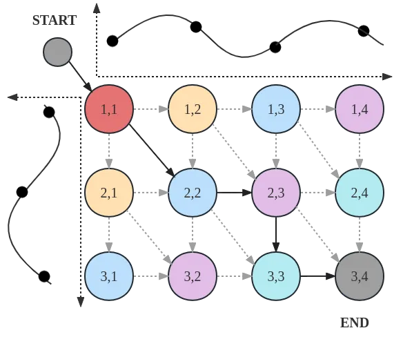

Figure 6: Computational graph $`\mathcal{R}`$ of the DTW algorithm

## Appendix E Examples of computational graphs

We demonstrate two examples of how to implement the Bayesian dynamic
programming to obtain structural latent optimal paths on different
structured computational graphs.

### E.1 Dynamic Time Warping

We first extend the Bayesian dynamic programming to the dynamic time
warping (DTW) algorithm (Sakoe & Chiba, 1978; Mensch & Blondel, 2018)
which aims to seek an optimal alignment path with the maximum score (or
minimum cost) given two time series. Given two time-series
$`\mathbf{A}`$ and $`\mathbf{B}`$ with lengths $`N_{A}`$ and $`N_{B}`$.
Let $`a_{j}`$ and $`b_{i}`$ be $`j^{th}`$ and $`i^{th}`$ observations of
$`\mathbf{A}`$ and $`\mathbf{B}`$, respectively. We denote
$`\mathbf{W}\in\mathbb{R}^{N_{B}\times N_{A}}`$ as a pair-wise weight
matrix, where $`w_{ij}`$ represents similarity measurement between
observation point $`b_{i}`$ and observation point $`a_{j}`$, namely,
$`w_{ij}=d(b_{i},a_{j})`$, where function $`d(\cdot)`$ is an arbitrary
similarity metric. The $`\mathcal{Y}`$ defines the set of the population
of all possible time-series alignment paths $`\mathbf{y}`$, in which the
path connects the upper-left $`(1,1)`$ node to the lower-right
$`(N_{B},N_{A})`$ node with $`\rightarrow`$, $`\downarrow`$ and
$`\searrow`$ moves only.

Following Lemma 4.4, we can obtain the location parameters
$`\mu\in\mathbb{R}^{N_{B}\times N_{A}}`$ given the DAG $`\mathcal{R}`$
and $`\mathbf{W}`$. Then the optimal path $`\mathbf{y}`$ can be sampled
reversely according to the transition matrix
$`\pi\in\mathbb{R}^{N_{B}\times N_{A}\times 3}`$. The probability of
transition $`(v,v^{\prime})\rightarrow(u,u^{\prime})`$, where
$`(u,u^{\prime})\in\mathcal{P}(v,v^{\prime})`$, is defined as

```math
\pi_{(u,u^{\prime}),(v,v^{\prime})}\equiv p(y_{i-1}=(u,u^{\prime})|y_{i}=(v,v^{\prime}),(u,u^{\prime})\in\mathcal{P}(v,v^{\prime})) \tag{85}
```

for all $`i\in\{(1,1),..,(N_{B},N_{A})\}`$

Figure 6 is an example of the computational graph of DTW with
$`N_{A}=4`$ and $`N_{B}=3`$. The bold black arrows indicate one aligned
path $`\mathbf{y}\in\mathcal{Y}`$ on the DAG. Pseudocode to compute the
location parameter $`\mu`$ and transition matrix $`\pi`$ and sampling
optimal path $`\mathbf{y}`$ are provided in Algorithm 1 and Algorithm 2.

 Input: Weight matrix $`\mathbf{W}\in\mathbb{R}^{N_{B}\times N_{A}}`$,
$`\alpha`$;

 Initialize $`\mu\in\mathbb{R}^{(N_{B}+1)\times(N_{A}+1)}`$,

 $`\mu_{i,0}=-\infty`$, $`\mu_{0,j}=-\infty`$,
$`i\in[N_{B}],j\in[N_{A}]`$;

 $`\mu_{0,0}=0`$;

 for $`i=1`$ to $`N_{B}`$, $`j=1`$ to $`N_{A}`$ do

  $`\mu_{i,j}=\log(\exp(\mu_{i-1,j-1}+\alpha w_{i,j})+\exp(\mu_{i,j-1}+\alpha w_{i,j})+\exp(\mu_{i-1,j}+\alpha w_{i,j}))`$

 end for

 Initialize $`\pi_{i,j}=\mathbf{0}_{3}`$, $`i\in[N_{B}],j\in[N_{A}]`$;

 for $`i=N_{B}`$ to $`1`$ ,$`j=N_{A}`$ to $`1`$ do

  $`\pi_{i,j}=[\frac{\exp(\mu_{i,j-1}+\alpha w_{i,j})}{\exp(\mu_{i,j})},\frac{\exp(\mu_{i-1,j-1}+\alpha w_{i,j})}{\exp(\mu_{i,j})},\frac{\exp(\mu_{i-1,j}+\alpha w_{i,j})}{\exp(\mu_{i,j})}]`$

 end for

Algorithm 1 Compute $`\mu`$ and $`\pi`$ on DTW

 Input: Transition matrix
$`\pi\in\mathbb{R}^{N_{B}\times N_{A}\times 3}`$

 Initialize $`y\in\mathbb{R}^{N_{B}\times N_{A}}`$, $`i=N_{B},j=N_{A}`$;

 $`y_{N_{B},N_{A}}=1`$, $`y_{/\ N_{B},/\ N_{A}}=0`$;

 while $`i>0`$ and $`j>0`$ do

  x $`\sim\text{Categorical}(\pi_{i,j})`$

  if x = 0 then

   $`y_{i,j-1}=1`$

   $`j=j-1`$

  end if

  if x = 1 then

   $`y_{i-1,j-1}=1`$

   $`i=i-1`$

   $`j=j-1`$

  end if

  if x = 2 then

   $`y_{i-1,j}=1`$

   $`i=i-1`$

  end if

 end while

Algorithm 2 Sample stochastic optimal path $`y`$ on DTW

We denote the marginal probability of edges between node
$`(u,u^{\prime})`$ and node $`(v,v^{\prime})`$, where
$`(u,u^{\prime})\in\mathcal{P}(v,v)`$, as
$`\omega_{(u,u^{\prime})(v,v^{\prime})}`$. Following Lemma 4.9,
$`\omega`$ can be computed by Equation 86

```math
\omega_{(u,u^{\prime}),(v,v^{\prime})}=\pi_{(u,u^{\prime}),(v,v^{\prime})}\lambda_{(u,u^{\prime})}\rho_{(v,v^{\prime})} \tag{86}
```

For implementation, the pseudocode to compute the marginal probabilities
$`\omega`$ show on Algorithm 3.

 Input: Transition matrix
$`\pi\in\mathbb{R}^{N_{B}\times N_{A}\times 3}`$

 Initialize $`\omega\in\mathbb{R}^{N_{B}\times N_{A}\times 3}`$;
$`\omega_{i,j}=0`$; $`i\in[N_{B}],j\in[N_{A}]`$

 $`\lambda,\rho\in\mathbb{R}^{(N_{B}+1)\times(N_{A}+1)}`$;

 $`\lambda_{i,j}=0`$; $`i\in[N_{B}],j\in[N_{A}]`$; $`\lambda_{0,0}=1`$;

 $`\rho_{i,j}=0`$, $`i\in[N_{B}],j\in[N_{A}]`$;
$`\rho_{N_{B},N_{A}}=1`$; {Topological iteration for $`\lambda`$}

 for $`i=1`$ to $`N_{B}`$, $`j=1`$ to $`N_{A}`$ do

  $`\lambda_{i,j}=[\lambda_{i,j-1},\lambda_{i-1,j-1},\lambda_{i-1,j}]\pi_{i,j}^{T}`$

 end for{Reversed iteration for $`\rho`$}

 for $`i=N_{B}`$ to $`1`$, $`j=N_{A}`$ to $`1`$ do

  $`\rho_{i,j}=[\rho_{i,j+1},\rho_{i+1,j+1},\rho_{i+1,j}][\pi_{i,j+1,0},\pi_{i+1,j+1,1},\pi_{i+1,j,2}]^{T}`$

 end for{Compute $`\omega`$}

 for $`i=1`$ to $`N_{B}`$, $`j=1`$ to $`N_{A}`$ do

  $`\omega_{i,j}=\rho_{i,j}[\lambda_{i,j-1},\lambda_{i-1,j-1},\lambda_{i-1,j}]^{T}\cdot\pi_{i,j}`$

 end for

Algorithm 3 Compute marginal probability of edges $`\omega`$ on DTW

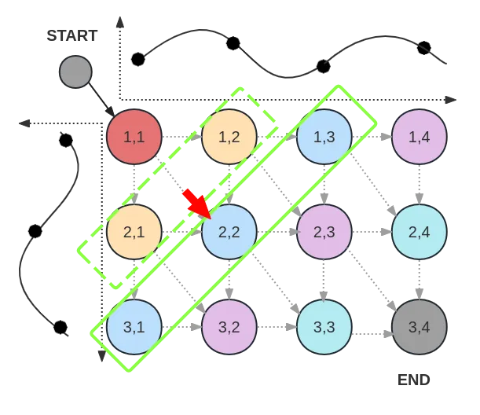

Figure 7: Updating the computational graph of DTW diagonally with linear
time complexity to $`N_{B}`$ and $`N_{A}`$.

#### E.1.1 Time complexity analysis

Following above definition of the computational graph of DTW, where the
pair-wise weight matrix $`\mathbf{W}\in\mathbb{R}^{N_{B}\times N_{A}}`$.
According to Corollary 4.11, the edge numbers under DTW graph is
$`|\mathcal{E}|=3N_{A}N_{B}-2N_{A}-2N_{B}+1`$. Therefore, the time
complexity in the above pseudo algorithm is
$`\mathcal{O}(3N_{A}N_{B}-2N_{A}-2N_{B}+1)`$. Inspired by Tralie &
Dempsey (2020), we further reduce its time complexity by updating
diagonally in parallel as illustrated in Figure 7. In this way, the time
complexity of computational graph of DTW becomes linear $`N_{B}`$ and
$`N_{A}`$ as $`\mathcal{O}(N_{A}+N_{B}-1)`$.

### E.2 Monotonic Alignment

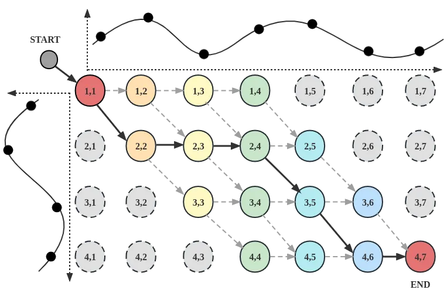

Figure 8: Computational graph $`\mathcal{R}`$ of the MA algorithm.

Monotonic alignment (MA) is often used in the field of machine learning,
particularly in the context of sequence-to-sequence (Seq2Seq) tasks.
Taking the same definition of two given time-series in Section E.1,
$`\mathcal{Y}`$ defines a population of all possible path sample
$`\mathbf{y}`$, in which the path connects the upper-left $`(1,1)`$ node
to the lower-right $`(N_{B},N_{A})`$ node with $`\rightarrow`$ and
$`\searrow`$ moves only, where $`N_{B}<N_{A}`$.

The location parameters $`\mu\in\mathbb{R}^{N_{B}\times N_{A}}`$ can be
computed following Lemma 4.4 and the optimal path $`\mathbf{y}`$ can be
sampled according to the transition matrix
$`\pi\in\mathbb{R}^{N_{B}\times N_{A}\times 2}`$. The probability of
transition $`(v,v^{\prime})\rightarrow(u,u^{\prime})`$ for
$`(u,u^{\prime})\in\mathcal{P}(v,v^{\prime})`$ is defined in
Equation 85. Figure 8 gives an example of the monotonic alignment
computational graph with $`N_{A}=7`$ and $`N_{B}=4`$. The bold black
arrows indicate one possible aligned path.

 Input: Weight matrix $`\mathbf{W}\in\mathbb{R}^{N_{B}\times N_{A}}`$,
$`\alpha`$;

 Initialize $`\mu\in\mathbb{R}^{(N_{B}+1)\times(N_{A}+1)}`$

 $`\mu_{i,j}=-\infty`$, $`i\in[N_{B}],j\in[N_{A}]`$; $`\mu_{0,0}=0`$;

 for $`j=1`$ to $`N_{A}`$ do

  for $`i=1`$ to min$`(j,N_{B})`$ do

   $`\mu_{i,j}=\log(\exp(\mu_{i-1,j-1}+\alpha w_{i,j})+\exp(\mu_{i,j-1}+\alpha w_{i,j}))`$

  end for

 end for

 Initialize $`\pi_{i,j}=\mathbf{0}_{2}`$, $`i\in[N_{B}],j\in[N_{A}]`$;

 for $`j=N_{A}`$ to $`1`$ do

  for $`i=\text{min}(j,N_{A})`$ to max$`(j-N_{A}+N_{B},1)`$ do

   $`\pi_{i,j}=[\frac{\exp(\mu_{i,j-1}+\alpha w_{i,j})}{\exp(\mu_{i,j})},\frac{\exp(\mu_{i-1,j-1}+\alpha w_{i,j})}{\exp(\mu_{i,j})}]`$

  end for

 end for

Algorithm 4 Compute $`\mu`$ and $`\pi`$ on MA

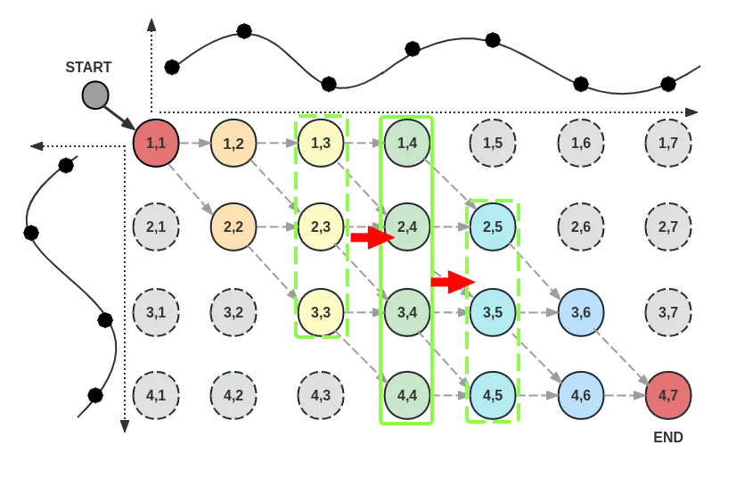

Figure 9: Updating the computational graph of MA vertically with linear
time complexity to $`N_{B}`$ and $`N_{A}`$.

 Input: Transition matrix
$`\pi\in\mathbb{R}^{N_{B}\times N_{A}\times 2}`$

 Initialize $`y\in\mathbb{R}^{N_{B}\times N_{A}}`$, $`i=N_{B},j=N_{A}`$;

 $`y_{N_{B},N_{A}}=1`$, $`y_{/\ N_{B},/\ N_{A}}=0`$;

 while $`i>0`$ and $`j>0`$ do

  x $`\sim\text{Categorical}(\pi_{i,j})`$

  if x = 0 then

   $`y_{i,j-1}=1`$

   $`j=j-1`$

  end if

  if x = 1 then

   $`y_{i-1,j-1}=1`$

   $`i=i-1`$

   $`j=j-1`$

  end if

 end while

Algorithm 5 Sample stochastic optimal path $`y`$ on MA

Pseudo-code for computing the location parameter $`\mu`$ and transition
matrix $`\pi`$ are provided in Algorithm 4. The sampling algorithm is
presented in Algorithm 5.

 Input: Transition matrix
$`\pi\in\mathbb{R}^{N_{B}\times N_{A}\times 2}`$

 Initialize $`\omega\in\mathbb{R}^{N_{B}\times N_{A}\times 2}`$;
$`\omega_{i,j}=0`$; $`i\in[N_{B}],j\in[N_{A}]`$

 $`\lambda,\rho\in\mathbb{R}^{(N_{B}+1)\times(N_{A}+1)}`$;

 $`\lambda_{i,j}=0`$; $`i\in[N_{B}],j\in[N_{A}]`$; $`\lambda_{0,0}=1`$;

 $`\rho_{i,j}=0`$, $`i\in[N_{B}],j\in[N_{A}]`$;
$`\rho_{N_{B},N_{A}}=1`$; {Topological iteration for $`\lambda`$}

 for $`j=1`$ to $`N_{A}`$ do

  for $`i=1`$ to min$`(j,N_{B})`$ do

   $`\lambda_{i,j}=[\lambda_{i,j-1},\lambda_{i-1,j-1}]\pi_{i,j}^{T}`$

  end for

 end for{Reversed iteration for $`\rho`$}

 for $`j=N_{A}`$ to $`1`$ do

  for $`i=`$ min$`(j,N_{B})`$ to max$`(j-N_{A}+N_{B},1)`$ do

   $`\rho_{i,j}=[\rho_{i,j+1},\rho_{i+1,j+1}][\pi_{i,j+1,0},\pi_{i+1,j+1,1}]^{T}`$

  end for

 end for{Compute $`\omega`$}

 for $`j=1`$ to $`N_{A}`$ do

  for $`i=1`$ to min$`(j,N_{B})`$ do

   $`\omega_{i,j}=\rho_{i,j}[\lambda_{i,j-1},\lambda_{i-1,j-1}]^{T}\cdot\pi_{i,j}`$

  end for

 end for

Algorithm 6 Compute marginal probability of edges $`\omega`$ on MA

We then denote the marginal probability of edges between node
$`(u,u^{\prime})`$ and node $`(v,v^{\prime})`$, where
$`(u,u^{\prime})\in\mathcal{P}(v,v^{\prime})`$, as
$`\omega_{(u,u^{\prime}),(v,v^{\prime})}`$. $`\omega`$ can be computed
by Equation 86 and the pseudocode to compute the marginal probabilities
$`\omega`$ show on Algorithm 6.

#### E.2.1 Time complexity analysis

Following the setting of computational graph of MA in above, where the
pair-wise weight matrix $`\mathbf{W}\in\mathbb{R}^{N_{B}\times N_{A}}`$
and the graph is defined in Figure 8, where $`N_{B}<N_{A}`$. The edge
number under MA graph is
$`|\mathcal{E}|=2N_{B}N_{A}-2N_{B}^{2}-N_{A}+2N_{B}-1`$ and the time
complexity in pseudo algorithms of computational graph of MA is
$`\mathcal{O}(2N_{B}N_{A}-2N_{B}^{2}-N_{A}+2N_{B}-1)`$. By updating the
graph vertically as illustrated in Figure 9, the time complexity can be
further reduced to $`\mathcal{O}(N_{A}-1)`$.

## Appendix F Details of model architecture in experiments

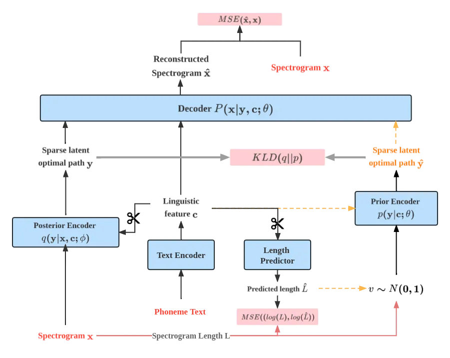

Figure 10: Architecture of BDP-VAE on experiments. The red lines are
only turned on during training. Black lines stand for the training
process, while yellow dotted lines stand for the inference phase. The
scissors represent the gradient not being back-propagated along with the
arrow.

Given a spectrogram input $`\mathbf{x}=[x_{1},...,x_{t}]`$ and a
corresponding phoneme text
$`\mathbf{c}^{\prime}=[c^{\prime}_{1},...,c^{\prime}_{n}]`$ , where
$`t`$ and $`n`$ are the lengths of the input sequences. We assume that
there is an unobserved structural sparse optimal path (i.e., monotonic
alignment) representation $`\mathbf{y}\in\mathbb{R}^{t\times n}`$ aligns
$`\mathbf{x}`$ and $`\mathbf{c}`$ by $`\{0,1\}`$ under defined DAG
$`\mathcal{R}`$.

The proposed overall architecture is shown in Figure 10 and the
conditional ELBO is

```math
\begin{split}\mathcal{L}(\phi,\theta,\mathbf{x}|\mathbf{c})=\mathbb{E}_{\mathbf{y}\sim q(\cdot|\mathbf{x},\mathbf{c};\phi)}\left[\log p(\mathbf{x}|\mathbf{y},\mathbf{c};\theta)\right]\\
-\mathcal{D}_{\mathrm{KL}}\left[q(\mathbf{y}|\mathbf{x},\mathbf{c};\phi)\big\|p(\mathbf{y}|\mathbf{c};\theta)\right].\end{split} \tag{87}
```

![[Uncaptioned
image]](arxiv-2306-02568--4cb0c0b76ad7.figures/figure-11.webp)\captionof

figureThe posterior encoder architecture, where the $`\bigotimes`$
represents Equation 88.

![[Uncaptioned
image]](arxiv-2306-02568--4cb0c0b76ad7.figures/figure-12.webp)\captionof

figureThe decoder architecture, where the $`\bigotimes`$ represents the
matrix multiplication.

![[Uncaptioned
image]](arxiv-2306-02568--4cb0c0b76ad7.figures/figure-13.webp)\captionof

figureThe conditional prior encoder architecture, where the
$`\bigotimes`$ represents Equation 88.

##### Text Encoder

The text encoder is used to extract a higher level of linguistic
features $`\mathbf{c}\in\mathbb{R}^{n\times 256}`$ from phoneme text,
which adopts the same structures as the one in FastSpeech2 (Ren et al.,
2020), which contains 4 feed-forward transformer (FFT) blocks with 2
multi-head attentions.

##### Posterior Encoder

The posterior encoder
$`q(\mathbf{y}|\mathbf{x},\mathbf{c};\phi)=\mathcal{D}(\mathbf{y}|\mathcal{R},\mathbf{W}=d(\text{NN}_{\phi}(\mathbf{x}),\mathbf{c}),\alpha)`$,
where $`\alpha`$ is a preset hyper-parameter. Note that the gradient
with respect to $`\theta`$ will not backpropagate to the text encoder.
The architecture of the posterior encoder shouldn’t be too complex, its
goal is to extract temporal information from spectrogram inputs
$`\mathbf{x}`$ by a neural network model parameterized by $`\phi`$. In
the posterior encoder (Appendix F), the spectrogram is fed into a
convolution-based PostNet (Shen et al., 2018b) to upsample the feature
dimension to the size of the linguistic feature $`\mathbf{c}`$, i.e.
$`\text{NN}_{\phi}(\mathbf{x})\in\mathbb{R}^{t\times 256}`$. The final
weight matrix $`\mathbf{W}\in\mathbb{R}^{t\times n}`$ computed by

```math
d(f_{\phi}(\mathbf{x}),\mathbf{c})=softmax(\text{NN}_{\phi}(\mathbf{x})\mathbf{c}^{T}) \tag{88}
```

where the softmax function is applied over the $`t`$ dimension.

##### Decoder

The architecture of the decoder is also the same as the one in
FastSpeech2 (Ren et al., 2020). In the decoder (Appendix F), the latent
optimal path $`\mathbf{y}`$ and the linguistic feature $`\mathbf{c}`$
are extended by a matrix multiplication which extends the linguistic
feature from length $`n`$ to length $`t`$ according to the information
of sampled latent optimal path $`\mathbf{y}`$, then followed by 4
Feed-forward Transformer blocks with 2 multi-head attentions. We add a
residual connection after the linear layer with a PostNet to get the
final output.

##### Prior Encoder

The prior encoder
$`p(\mathbf{y}|\mathbf{c};\theta)=\mathcal{D}(\mathbf{y}|\mathcal{R},\mathbf{W}^{(0)}=d(f_{\theta}(\mathbf{c}),\mathbf{c}),\alpha)`$.
Following Lu et al. (2021); Ma et al. (2019), we make use of a Glow
(Kingma & Dhariwal, 2018) structure to infer spectrogram features
conditioned on linguistic features. It consists of multiple Glow blocks.
Each of the blocks has an actnorm layer, an invertible $`1\times 1`$
convolutional layer, and an affine-coupling layer. The transformation
network in the affine-coupling layer is based on the Transformer
decoder, which the spectrogram feature $`\text{NN}_{\phi}(\mathbf{x})`$
as the query and the linguistic feature $`\mathbf{c}`$ as the key and
value. During training, we use the backward pass to infer the
probability of the KL divergence. The forward pass is used to generate
spectrogram features from the condition and then form the weight matrix
to sample latent $`\mathbf{\hat{y}}`$ during inference. Details of the
architecture are in Appendix F.

##### Length Predictor

Following Lu et al. (2021), the length predictor consists of a 1-channel
fully connected layer with ReLU activation. The length predictor is
optimized by an MSE loss, and the gradient will not propagate to the
text encoder.

## Appendix G Experimental details

### G.1 Experimental Setup

All experiments were performed on one NVIDIA GeForce RTX 3090. To reduce
the variance of gradients during training, we applied the variance
reduction technique with a 5-iteration moving average baseline on the
REINFORCE loss. The moving average baseline technique here is used for
reducing the gradient variance for the REINFORCE estimator.

### G.2 Experimental Details for End-to-end Text-to-speech

In the experiment of the end-to-end text-to-speech on the computational
graph of MA in Section E.2, the latent space captures the discrete
monotonic optimal path between phoneme tokens and spectrogram frames. We
down-sampled the audio waveform files from 44.1kHz to 22.05kHz and
extracted the Mel-spectrograms with 1024 frame size, $`25\%`$
overlapping, and 80 Mel-filter bins. The model is trained by 18 batch
size with a learning rate of 1.25$`\text{e}^{-4}`$, temperature
parameter $`\alpha`$ of 5 for 700k steps.

In the evaluation part, we obtain the DTW-MCD score by the package of
pymcd.mcd⁴⁴ 4
[https://github.com/chenqi008/V2C](https://github.com/chenqi008/V2C).
The 60-iteration Grinffin-Lim Algorithm approximates all the synthesized
waveforms. We trained all the models in Table 1 with the same
pre-processing setting, and the details are:

FastSpeech2 FastSpeech2 (Ren et al., 2020) is a non-end-to-end TTS model
with additional inputs of energy, pitch, phoneme-align TextGrid from
MAF⁵⁵ 5
[https://montreal-forced-aligner.readthedocs.io/en/latest/](https://montreal-forced-aligner.readthedocs.io/en/latest/).
We followed the model configuration the paper provided. We trained the
model by 400k iterations and the total loss converged at around
$`6.9\text{e}^{-3}`$.

Tacotron2 Tractorn2 (Shen et al., 2018a) is an end-to-end
auto-regressive TTS model that relies on attention to obtain the phoneme
duration alignment. We followed the model configuration provided and
trained the model by 100k iterations and the total loss converged at
around $`6.6\text{e}^{-3}`$.

VAENAR-TTS VAENAR-TTS (Lu et al., 2021) is an end-to-end utterance-level
TTS model that relies on cascade-masked self-attention in the decoder of
the VAE to obtain the phoneme duration alignment. We followed the model
configuration the paper provided and trained the model by 150k
iterations and the total loss converged at around $`7.4\text{e}^{-3}`$.

Glow-TTS Glow-TTS (Kim et al., 2020) is an end-to-end phoneme-level TTS
model that relies on the monotonic alignment search to obtain the hard
phoneme duration alignment. We followed the model configuration the
paper provided and trained the model by 120k iterations and the total
loss converged at around $`-2.1`$.

### G.3 Experimental Details for the End-to-end Singing Voice Synthesis

In the experiment of the end-to-end singing voice synthesis on the
computational graph of MA in Section E.2, we extract the Mel-spectrogram
by the same pre-processing setting as the experiment of end-to-end TTS.
The model is trained by the same architecture configuration with 22
batch sizes and a learning rate of $`1.25\text{e}^{-4}`$ for 200k steps.
The 60-iteration Grinffin-Lim Algorithm approximates all the synthesized
waveforms.

### G.4 Experimental Details for Latent optimal path on the computational graph of DTW

In the experiment of the latent optimal path on the computational graph
of DTW in Section E.1, we use the TIMIT dataset (Garofolo et al., 1992)
which is recorded by a 16kHz sampling rate. Therefore, we extract the
Mel-spectrogram with 1024 frame size, $`25\%`$ overlapping, and 80
filter channels under a 16kHz sampling rate. The model is trained with
batch size 48 and learning rate 2.5$`\text{e}^{-4}`$.

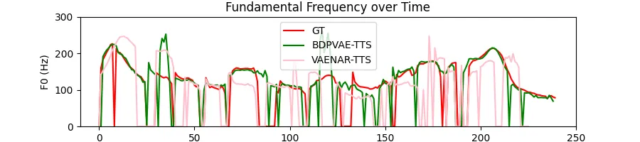

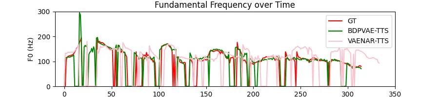

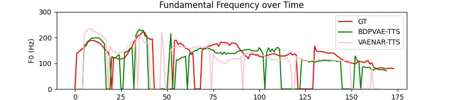

Figure 11: Inference F0 trajectories of utterance ”I don’t think I can
talk about nature without smiling”.

Figure 12: Inference F0 trajectories of utterance ”I leaped back into
the compartment of the han ship and knelt beside my wilma.”.

Figure 13: Inference F0 trajectories of utterance ”I have reached the
end of my explanation”.

## Appendix H Interpretation with the comparison of VAENAR-TTS

Both BDPVAE-TTS and VAENAR-TTS predict phone-duration alignment on the
utterance level. VAENAR-TTS learns the Gaussian latent distribution of
learned features of spectrograms and conditions and obtains soft
monotonic phoneme-utterance alignment by self-attention with a causality
mask in the transformer decoder. Different from VAENAR-TTS, BDPVAE-TTS
was adapted from a non-end-to-end phoneme-level TTS model
(FastSpeech2 (Ren et al., 2020)) with a Gibbs distribution of stochastic
optimal paths $`\mathcal{D}(\mathcal{R},\cdot,\alpha)`$ defined in
Definition 4.1 under monotonic alignment DAG defined in Section E.2 into
a BDP-VAE framework. In the inference phase, BDPVAE-TTS reconstructs the
spectrogram according to duration-extended phoneme sequences only. Since
our baseline method (i.e., FastSpeech2) did not outperform the
VAENAR-TTS, thus, BDPVAE-TTS also gets a lower performance than
VAENAR-TTS.

However, soft monotonic alignment in VAENAR-TTS may make the model
cannot accurately capture the exact relationship of how phoneme tokens
perform in a spectrogram. According to the natural inherent relationship
of speech and phonemes, the BDPVAE-TTS obtains sparse monotonic optimal
paths in the latent space which are more precise in explaining the
relationship between utterance and phoneme tokens. Figure 13 to
Figure 13 give additional demonstrations that the synthesized audios
from BDPVAE-TTS have closer F0 to the ground truth than VAENAR-TTS.
